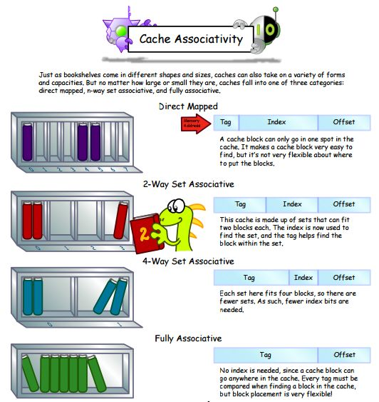

 ---

title: 工具
date: 2021-06-26 09:40
author: gatieme
tags:
    - linux
    - tools
categories:
        - 技术积累
thumbnail:
blogexcerpt: 虚拟化 & KVM 子系统

---

 

本作品采用<a rel="license" href="http://creativecommons.org/licenses/by-nc-sa/4.0/">知识共享署名-非商业性使用-相同方式共享 4.0 国际许可协议</a>进行许可, 转载请注明出处, 谢谢合作

因本人技术水平和知识面有限, 内容如有纰漏或者需要修正的地方, 欢迎大家指正, 鄙人在此谢谢啦

**转载请务必注明出处, 谢谢, 不胜感激**

 

| 日期 | 作者 | GitHub| CSDN | BLOG |
| ------- |:-------:|:-------:|:-------:|:-------:|
| 2021-02-15 | [成坚-gatieme](https://kernel.blog.csdn.net) | [`AderXCoding/system/tools/fzf`](https://github.com/gatieme/AderXCoding/tree/master/system/tools/fzf) | [使用模糊搜索神器 FZF 来提升办公体验](https://blog.csdn.net/gatieme/article/details/113828826) | [Using FZF to Improve Productivit](https://oskernellab.com/2021/02/15/2021/0215-0001-Using_FZF_to_Improve_Productivity)|

 

cache 是系统中的一块快速 SRAM, 价格高, 但是访问速度快, 可以减少 CPU 到 main memory 的 latency.

cache 中的行为:

| 动作 | 描述 |
|:---:|:----:|
| Cache hits | 表示可以在 cache 中, 查找到相应地址的 entry |
| Cache Miss | 表示在 cache 中, 找不到相应地址的 entry. |
| Snoop | cache 不断监视 transaction 的地址线, 来不间断的检查地址地址是否在 cache 中 |
| Snarf | 从 main memory 中读出数据, 同时更新 cache 中的旧值 |
| Dirty Data | cache 中的数据, 是最新的, 但是 main memory 中的数据还未更新, 称 cache 中的数据为 dirty. Stale Data 类似. |

arm 架构中的 cache 架构是 harvard 结构的, 分为 data cache 和 inst cache.

　　

其中 L1 cache, 一般直接集成到 core 中, 大小多是 2-way, 4-way, 16KB 和 32KB, cache line 一般是 32byte 或者 64byte. 可以实现为 VIPT 或者 PIPT.

L2 cache, 可以集成到 core 中, 也可以单独作为一个 external block, 大小多是 8-way 以上, 256KB, 512KB, 1M 等, cache line 也是 32byte, 64byte. 一般实现为 PIPT.

# cache 架构
-------

cache 的架构, 分为 read architecture, write policy, allocation policy.

1.  read architecture

read architecture 分为: Look Aside 和 Look Through.

| 实现 | 描述 | 优点 | 缺点 |
|:---:|:----:|:---:|:---:|
| Look Aside | main memory 和 cache 都在同一时间, 看到同一 bus 上的 trans. | 减少了 cache miss 下的 memory 访问时间. | 在一个 core 访问 main memory 时, 另一个 core 不能访问 cache. |
| Look Through | 不管是哪一种的 read architecture, cache miss 之后, 从 main memory 中得到的 value 都会被 Snarf 到 cache 中. | NA | NA |

2.  write policy

write policy 分为 write back 和 write through.

| 实现 | 描述 |
|:---:|:----:|
| write-back | 将数据写到 cache 中, cache 就像一个 buffer, 在 evict 一个新的 cache entry 时, 才会将 cache 写会 main memory. 存在 cache 和 main memory 的 consistency 问题. 需要进行 cache maintenance 操作 (如 cache line 置换, mmu page 置换修改等), 主要分为 cache invalid (舍弃 cache 中的值, 将 valid flag 置零) 和 cache update 操作 (更新 main memory 的值为 cache 中的值). |
| write-Through | 读写性能要低一些, 但是 main memory 中都是最新的 value. 不存在 cache 和 main memory 的一致性问题. |

3.  allocation policy

allocation policy 指的是 cache miss 之后, 是否 allocate 新的 entry.

| 实现 | 描述 |
|:---:|:----:|
| read-allocated | 读操作 miss 之后, 先从 main memory 中读取数据给 core, 之后在进行 cache line snarf. |
| write-allocated | 在 write miss 之后, 需要先进行 burst read, 进行 cache line snarf, 之后进行 write back 操作 (一般与 write back 一起使用). |

　
# cache organization
-------

[请教 CPU 的 cache 中关于 line,block,index 等的理解 ?](https://www.zhihu.com/question/24612442/answer/156669729)

## cache
-------

cache 由 set 组成, set 由 line 组成, line 由 valid bit, tag 和 data 组成. 其中 data 是真正要缓存的内存地址中的数据, 而 tag 是用来搜索 cache line 的标签.

## cache 寻址的过程
-------

| tag | 主要存储 VA, PA 的地址索引. 平时所指的 cache size 并不包含 tag ram 的大小. |
| offset 寻址具体的 word, index 寻址某一个 way, 也就是某一个 cache line, tag 主要做地址校对, 最终选择 tag 匹配的那一个 set.

在 set-associate 结构的 cache 中, main memory 中所有 index 相同的地址, 都只能放在对应的 way 中.

1.  根据 set index 找到 set

2.  根据 tag 在 set 中搜索到  cache line

    如果 tag 匹配且 cacheline 有效, 则 cache 命中;

    如果没有命中, 就要根据置换策略找一个 cache line 把内存的数据加载到 cache line;

3.  根据block offset 在 line 的 data 中找到值

### 为什么需要 set
-------

为什么不能根据 tag 直接找到 cache line, 再根据 offset 找到值 ?

cache 毕竟尽可能的快, 硬件要在几个纳秒内完成, 这就要求搜索是并行进行的, 如果 cache 中包括 100 cache line, 硬件就要并行比较 100 个 cache line 的 tag, 这无疑会增加硬件的复杂度和面积.

这样, 利用分层的思想, 引入了 set 的层级, 先根据 set index 找出一个 set, 再在 set 中并行搜索有限个 cache line 就容易多了.

> 为什么取内存地址的中间几位作为 set index ?
>
> 考虑空间局部性性原理, 下 cache 的利用率而进行的优化.

# cache associativity
-------

引入了 set 之后, 整个 Cache 先划分为 M 个 Set, 每个 Set 包含了 N 个 Cache line.

| 映射方式 | 描述 |
|:------:|:----:|
| 全相联映射(full-Associative) | 没有 cache page 的概念, 每个 cache line 直接对应到随机的某个 memory line 缺点是, TAG ram 会比较大, 索引会比较慢, 一般应用在 cache 较小的地方, 如 tlb 或者 predict buffer 中. |
| 直接映射(Direct-Map) | 也称为 1-way associative, main memory 分为多个 cache page, 中的第 n line, 必须放在 cache page 的第 n 行. 复杂度不高, 但是, 性能很差, 常常需要 evict 其他的 cache line, 不够灵活. |
| 组映射映射(N-way Set-Associative) | 比如 2-way, 4-way 等, 还有一个 Set 的概念, 表示 cache page 的行数. 每个组分为 N 份, N 称为 cache way. 每个 cache way 内部的映射, 就与 direct mapping 相同, set 到 main memory 的映射, 随意, 与 full-associative 相同. 所以一块 main memory, 首先随意映射一块地址到 set 中, 然后每个 set 在平分为几个 way, 直接查找几个 way 即可. way 中的 line 映射, 是一一对应的, 不能够随意破坏行的顺序. |

n-way 说明一个 set 里有 n 个 line/block.

在使用 N-Ways Set-Associative 时, 这是一种阵列的表现方式:

一个组里有 N 行, 其实是 N 个 set, 但是 set 中的每一行与 main memory 分的 cache page 中的行数是一样的.

　cache 首先被分为 M 个 Set, M 等于 1 时, 也就是 1 个 Set, 这时, 等同于 Direct-Associative.

　　　　　　　　　　　　　　　　　　　　N 等于 1 时, 也就是说 1 个 Way, 这时, 等同于 Full Mapped.

　　　　　　　cache 的大小等于 cache_line_size * way_num * set_num

　　　　　　　　

可以把 cache 看成是一个 M 行 N 列的二维表格, 每一个单元格就是一个 cache line;
每一行就是一个 set, 由横向的 N 个 cache line 构成
每一列就是一个 way, 由纵向的 M 行 cache line 构成;

这个 Cache 就是一个 N way

当 M 为 1 时, 就是全关联 cache; 当 N 为 1 时，就是直接映射 cache.

PA 地址的 cache 索引, 最低位是 word 的寻址, 之后是 way (cache line) 的寻址, 再之后才是 tag 的寻址；

　　

cache hier 的问题: 在不同的微架构中, L1 与 L2 的关系可以是 inclusive 的, 也可以是 exclusive 的,

　　inclusive cache: 相同的 data 可以存放在 Both L1 和 L2 中.

　　exclusive cache: 相同的 data 只能放在 L1 或者 L2 中, 不能同时存在.

　　目前一般使用 inclusive cache 类型, 每次 cache miss, 可以从下一级的 cache 中寻找, load. 而 exclusive cache, 每次 cache miss, 只能去 main memory 中 load.

　　　　但是 exclusive cache 比较节省 cache size.

### cache block
-------

每个 cache 单元被称为 cache block/line 需要保存 address, data, status 等信息, 因此由 functional blocks, Data RAM, TAG RAM, Cache Controller 等组件组成.

会根据 memory request 是否是 cacheable 的来进行 cache 的寻址操作.

| 组件 | 功能 |
|:---:|:---:|
| Tag RAM | 存放部分物理地址信息, 可能包含虚拟地址信息, (VA 的 Cache 索引可以与 VA 的地址转换同时进行) |
| Data RAM | data 段存放 cache line 中的数据, 大小通常为 32byte 或 64byte, 一个 bus 的 wrap 操作. |
| status 段 | 存放 cache 的状态, 可以是 MOESI 等. |

1.  Cache Page, main memory 中被等大小的分为的 piece, 称为 cache pages. cache page 的大小, 不但与总的 cache size 有关, 与 cache 的 organization 也有关.
2.  Cache line, cache page 中更小的单元, cache 缓存的最小单位.

# 替换算法
-------

[一种缓存替换策略：DYNAMIC RE-REFERENCE INTERVAL PREDICTION (RRIP)](https://constd.com/2015/09/20/drrip)

[Cache 替换策略](https://zhuanlan.zhihu.com/p/54829644)

[Intel Ivy Bridge Cache Replacement Policy](https://blog.stuffedcow.net/2013/01/ivb-cache-replacement)

[High Performance Cache Replacement Using Re-Reference Interval Prediction](https://wangziqi2013.github.io/paper/2018/06/19/RRIP.html)

# 4 参考资料
-------

| 编号 | 链接 | 描述 |
|:---:|:----:|:---:|
| 1 | [理解Memory Barrier(内存屏障)](https://blog.csdn.net/caoshangpa/article/details/78853919) | NA |

 

*   本作品/博文 ( [AderStep-紫夜阑珊-青伶巷草 Copyright ©2013-2017](http://blog.csdn.net/gatieme) ), 由 [成坚(gatieme)](http://blog.csdn.net/gatieme) 创作.

*   采用<a rel="license" href="http://creativecommons.org/licenses/by-nc-sa/4.0/">知识共享署名-非商业性使用-相同方式共享 4.0 国际许可协议</a>进行许可. 欢迎转载、使用、重新发布, 但务必保留文章署名[成坚gatieme](http://blog.csdn.net/gatieme) ( 包含链接: http://blog.csdn.net/gatieme ), 不得用于商业目的.

*   基于本文修改后的作品务必以相同的许可发布. 如有任何疑问, 请与我联系.

*   **转载请务必注明出处, 谢谢, 不胜感激**
 
