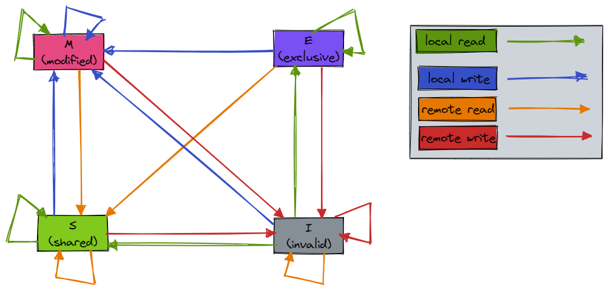

 ---

title: 工具
date: 2021-06-26 09:40
author: gatieme
tags:
    - linux
    - tools
categories:
        - 技术积累
thumbnail:
blogexcerpt: 虚拟化 & KVM 子系统

---

 

本作品采用<a rel="license" href="http://creativecommons.org/licenses/by-nc-sa/4.0/">知识共享署名-非商业性使用-相同方式共享 4.0 国际许可协议</a>进行许可, 转载请注明出处, 谢谢合作

因本人技术水平和知识面有限, 内容如有纰漏或者需要修正的地方, 欢迎大家指正, 鄙人在此谢谢啦

**转载请务必注明出处, 谢谢, 不胜感激**

 

| 日期 | 作者 | GitHub| CSDN | BLOG |
| ------- |:-------:|:-------:|:-------:|:-------:|
| 2021-02-15 | [成坚-gatieme](https://kernel.blog.csdn.net) | [`AderXCoding/system/tools/fzf`](https://github.com/gatieme/AderXCoding/tree/master/system/tools/fzf) | [使用模糊搜索神器 FZF 来提升办公体验](https://blog.csdn.net/gatieme/article/details/113828826) | [Using FZF to Improve Productivit](https://oskernellab.com/2021/02/15/2021/0215-0001-Using_FZF_to_Improve_Productivity)|

 

# 1 Cache 一致性
-------

# 2 缓存一致性协议--MESI协议
-------

由于现在一般是多核处理器, 每个处理器都有自己的高速缓存, 那么会导致一些问题:

当某一个数据在多个处于 "运行" 状态的线程中进行读写共享时(例如 ThreadA、ThreadB 和 ThreadC)

1.  第一个问题是多个线程可能在多个独立的 CPU 内核中"同时" 修改数据 A, 导致系统不知应该以哪个数据为准;

2.  第二个问题是由于ThreadA进行数据A的修改后没有即时写会内存, ThreadB和ThreadC也没有即时拿到新的数据A, 导致ThreadB和ThreadC对于修改后的数据不可见.

这就是缓存一致性问题.

为了解决这个问题, 处理器之间需要一种通信机制----缓存一致性协议.

## 2.1 MESI 状态
-------

MESI(Modified-Exclusive-Shared-Invalid) 协议是一种广为使用的缓存一致性协议. MESI 协议对内存数据访问的控制类似于读写锁, 它使得针对同一地址的读内存操作是并发的, 而针对同一地址的写内存操作是独占的.

之所以叫 MESI, 是因为这套方案把一个缓存行(cache line)区分出四种不同的状态标记, 他们分别是 Modified、Exclusive、Shared 和 Invalid. 这四种状态分别具备一定的意义:

| 状态 | 描述 | 监听任务 | 状态转换 |
|:---:|:----:|:------:|:-------:|
| M 修改 (Modified) | 该 Cache line 有效, 但是数据被修改了(和内存中的数据不一致), 并且该数据只存在于本 Cache 中. 在未来的某个时刻该数据会被写入到内存中(一般在其他 CPU 要读取该缓存行的内容时. 或者其他 CPU 要修改该缓存对应的内存中的内容时 | 缓存行必须时刻监听所有试图读该缓存行相对就主存的操作, 这种操作必须在缓存将该缓存行写回主存并将状态变成S(共享)状态之前被延迟执行. | 当被写回主存之后, 该缓存行的状态会变成独享(exclusive)状态. |
| E 独享、互斥 (Exclusive) | 该 Cache line 有效, 数据和内存中的数据一致, 并且数据只存在于本Cache中. | 缓存行也必须监听其它缓存读主存中该缓存行的操作, 一旦有这种操作, 该缓存行需要变成S(共享)状态.| 该缓存可以在任何其他 CPU 读取该缓存对应内存中的内容时变成 S 状态. 或者本地处理器写该缓存就会变成 M 状态. |
| S 共享 (Shared) | 该 Cache line 有效, 数据和内存中的数据一致, 数据存在于很多 Cache 中. | 当前缓存行必须监听其它缓存使该缓存行无效或者独享该缓存行的请求, 并将该缓存行变成无效(Invalid). | 当其他 CPU 修改该缓存行对应的内存时会使该缓存行变成 I 状态. |
| I 无效 (Invalid) | 该 Cache line 无效. | 无 | 无 |

监听:

1.  一个处于 M 状态的缓存行必须时刻监听所有试图读该缓存行相对就主存的操作, 这种操作必须在缓存将该缓存行写回主存并将状态变成 S 状态之前被延迟执行.

2.  一个处于 S 状态的缓存行也必须监听其它缓存使该缓存行无效或者独享该缓存行的请求, 并将该缓存行变成无效(Invalid).

3.  一个处于 E 状态的缓存行也必须监听其它缓存读主存中该缓存行的操作, 一旦有这种操作, 该缓存行需要变成 S 状态.

## 2.2 请求
-------

首先不同 CPU 之间也是需要沟通的, 这里的沟通是通过在消息总线上传递 message 实现的. 这些在总线上传递的消息有如下几种:

| 消息 | 类型 | 描述 |
|:---:|:----:|:---:|
| Read | 请求 | 用来获取指定物理地址上的 cache line 数据. 通知其他处理器和内存, 当前 CPU 准备读取某个数据. 该消息内包含待读取数据的内存地址. |
| Read Response | 响应 | Read 请求的响应信息, 该消息内包含了被请求读取的数据. 该消息可能是主内存返回的, 也可能是其他高速缓存嗅探到 Read 消息返回的. |
| Invalidate | 请求 | 通知其他处理器删除(无效)指定内存地址的数据副本(缓存行中的数据). 该消息包含数据的内存物理地址. |
| Invalidate Acknowledge | 响应 | 这是 CPU 对 Invalidate 消息的响应, 接收到 Invalidate 消息的处理器必须回复此消息, 表示已经无效掉了其高速缓存内对应的数据副本. |
| Read Invalidate | 请求 | 这个消息其实是 Read 和 Invalidate 消息组成的复合消息, 主要是用于通知其他 CPU 当前 CPU 准备更新一个数据了, 所以获取对该数据的独占权, 并请求其他处理器删除其高速缓存内对应的数据副本. 接收到该消息的处理器必须回复 Read Response 和 Invalidate Acknowledge 消息. |
| Writeback | 响应 | 消息包含了需要写入内存的数据和其对应的内存地址, 一般用在 modified 状态的 cache line 被置换时发出, 用来将最新的数据写回 memory 或其他下一级 cache 中. |

## 2.3 状态转换
-------

那么这些请求如何动态的转换呢 ?

MESI 状态转换的规则如下:

1.  一个缓存除在 Invalid 状态外都可以满足 CPU 的读请求, 一个 Invalid 的缓存行必须从主存中读取(变成 S 或者 E 状态)来满足该 CPU 的读请求.

2.  一个写请求只有在该缓存行是 M 或者 E 状态时才能被执行, 如果缓存行处于 S 状态, 必须先将其它缓存中该缓存行变成 Invalid 状态(也既是不允许不同 CPU 同时修改同一缓存行, 即使修改该缓存行中不同位置的数据也不允许). 该操作经常作用广播的方式来完成, 例如: RequestFor Ownership (RFO).

3.  缓存可以随时将一个非 M 状态的缓存行作废, 或者变成 Invalid 状态, 而一个 M 状态的缓存行必须先被写回主存.

4.  从上面的意义看来 E 状态是一种投机性的优化: 如果一个 CPU 想修改一个处于 S 状态的缓存行, 总线事务需要将所有该缓存行的 copy 变成 Invalid 状态, 而修改 E 状态的缓存不需要使用总线事务.

5.  对于 M 和 E 状态而言总是精确的, 他们和该缓存行的实际状态是一致的. 而 S 状态可能是非一致的, 如果一个缓存将处于 S 状态的缓存行作废了, 而另一个缓存实际上可能已经独享了该缓存行, 但是该缓存却不会将该缓存行升迁为 E 状态, 这是因为其它缓存不会广播他们作废掉该缓存行的通知, 同样由于缓存并没有保存该缓存行的 copy 的数量, 因此(即使有这种通知)也没有办法确定自己是否已经独享了该缓存行. 因此上述状态转换的表格中, 中间状态可能并不会发生.

local read 和 local write 分别代表本地CPU读写.
remote read 和 remote write 分别代表其他CPU读写.

| 当前状态 | 事件 | 行为 | 当前所在核的 cache 状态 | 触发读写事件 CPU 的 cache 状态 | 其他 cache 状态 |
|:------:|:----:|:---:|:--------------------:|:----------------------------:|:-------------:|
| M(modified) | local read | 状态不变 | M | M | I |
| M(modified) | local write | 状态不变 | M | M | I |
| M(modified) | remote read | 在本 CPU 独自享受独占数据的时候, 其他的 CPU 发起 read 请求, 希望获取数据, 这时候, 本 CPU 必须以其 local cacheline 的数据回应, 并以 read response 回应之前总线上的 read 请求. 这时候, 本 CPU 失去了独占权, 该 cacheline 状态从 Modified 状态变成 Shared 状态(有可能也会进行写回的动作, 写会后, 可能存在中间状态 E). | M->E->S | I->S | I->S |
| M(modified) | remote write | ~~先把 cache 中的数据写到内存中, 其他 CPU 的 cache 再读取并修改后, 本地 cache 状态变为I. 修改的那个cache状态变为 M~~ CPU 收到一个 read invalidate 消息, 此时 CPU 必须将对应 cache line 设置成 invalid 状态, 并且响应一个 read response 消息和 invalidate acknowledge 消息. | I | M->E->S->I | I->S->E->M | I->S->I |
| M(modified) | write back | cache 通过 writeback 将数据回写到 memory 或者下一级 cache 中. 这时候状态由 modified 变成了 exclusive | E | E | I |
|  *-*   |  *-*   |  *-*   | *-*-*-*   |
| E(exclusive) | local read | 状态不变 | E | E | I |
| E(exclusive) | local write | CPU 直接将数据写入 cache line, 导致状态变为了 M | E->M | E->M | I |
| E(exclusive) | remote read | 这个迁移和(M-=>S)的转换类似, 只不过开始 cacheline 的状态是 exclusive, cacheline 和 memory 的数据都是最新的, 不存在写回的问题. 总线上的操作也是在收到 read 请求之后, 以read response 回应. 本 CPU 失去了独占权, 该 cacheline 状态从 Modified 状态变成 shared 状态(不会进行写回的动作) | E->S | E->S | I->S |
| E(exclusive) | remote write | 其他的 CPU 进行一个原子的 read-modify-write 操作, 但是, 数据在本 CPU 的 cacheline 中, 因此, 其他的那个 CPU 会发送 read invalidate, 请求该数据(可能存在存在中间状态 S)以及获取独占权(可能存在存在中间状态 E). 本 CPU 回送 read response 和 invalidate acknowledge, 一方面把数据转移到其他 CPU 的 cache 中(存在中间状态 S), 另外一方面, 清空自己的 cacheline. | E->S->I | I->S->E->M | I->S->I |
|  *-*   |  *-*   |  *-*   | *-*-*-*   |
| S(shared) | local read | 不影响状态 | S | S | S |
| S(shared) | local write | CPU 需要执行一个原子的 readmodify-write 操作, 并且其 local cache 中有 read only 的缓存数据(cache line 处于 Shared 状态), 这时候, CPU 就会在总线上发送一个 invalidate 请求其他 CPU 清空自己的 local copy, 以便完成其独自霸占对该数据的所有权的梦想(存在中间状态 E). 同样的, 该 CPU 必须收集所有其他 CPU 发来的 invalidate acknowledge 之后才能更改状态为 modified. | S->E->M | S->E->M | S->I |
| S(shared) | remote read | 不影响状态 | S | S | S |
| S(shared) | remote write | 当 cache line 处于 shared 状态的时候, 说明在多个 CPU 的 local cache 中存在副本, 因此, 这些 cache line 中的数据都是 read only 的, 一旦其中一个 CPU 想要执行数据写入的动作, 必须先通过 invalidate 获取该数据的独占权(可能存在中间状态 E), 而其他的 CPU 会以 invalidate acknowledge 回应, 清空数据并将其 cacheline 从 shared 状态修改成 invalid 状态. 在写完成后, 本次 cache line 变成 modified 状态 | S->I | S->E->M | S->I |
| S(shared) | NA | 如果 CPU 认为自己很快就会启动对处于 shared 状态的 cacheline 进行 write 操作, 因此想提前先霸占上该数据. 因此, 该 CPU 会发送 invalidate 敦促其他 CPU 清空自己的 local copy, 当收到全部其他 CPU 的 invalidate acknowledge 之后, transaction 完成, 本 CPU 上对应的 cacheline 从 shared 状态切换 exclusive 状态. 还有另外一种方法也可以完成这个状态切换: 当所有其他的 CPU 对其 local copy 的 cacheline 进行写回操作, 同时将 cacheline 中的数据设为无效(主要是为了为新的数据腾些地方), 这时候, 本 CPU 坐享其成, 直接获得了对该数据的独占权. | E | E/I | I |
|  *-*   |  *-*   |  *-*   | *-*-*-*   |
| I(invalid) | local read | 本 CPU 执行读操作, 发现 local cache 没有数据, 因此通过 read 发起一次 bus transaction, 来自其他的 CPU local cache 或者 memory 会通过 read response 回应, 1. 如果数据来自其他 CPU 的 cache, 将该 cache line 从 Invalid 状态迁移到 Shared 状态. 2. 如果来自于内存, 则本地从 Invalid 状态迁移到 Exclusive 状态. | I->S/I->E | I->S/I->E | E/M/I->S/I |
| I(invalid) | local write | CPU 想要进行 write 的操作但是数据不在 local cache 中, 因此, 该 CPU 首先发送了 read invalidate 启动了一次总线 transaction. 在收到 read response 回应拿到数据, 并且收集所有其他 CPU 发来的 invalidate acknowledge 之后(确保其他 CPU 没有 local copy), 完成整个 bus transaction. 当 write 操作完成之后, 该 cacheline的状态会从 I 状态迁移到 E 状态. | E | E | E |
| I(invalid) | local write | CPU 需要执行一个原子的 readmodify-write 操作, 并且其 cache 中没有缓存数据. 这时候 CPU 就会在总线上发送一个 read invalidate 消息来请求数据(可能存在中间状态 S), 并试图独占该数据(可能存在中间状态 E). CPU 可以通过收到的 read response 消息获取到数据, 并等待所有的 invalidate acknowledge 消息, 然后将状态设置为 modifie. | I->S->E->M | I->S->E->M | M,E,S->S->I |
| I(invalid) | remote read | remote read 不影响本地 cache 的状态 | I | NA | NA |
| I(invalid) | remote write | remote read 不影响本地 cache 的状态 | I | NA | NA |

下图示意了，当本地 cache line 的调整的状态的时候, 其他 CPU 的 cache line 需要调整到的状态.

| M | E | S | I |
|:-:|:-:|:-:|:-:|
| M | × | × | × | √ |
| E | × | × | × | √ |
| S | × | × | √ | √ |
| I | √ | √ | √ | √ |

举个栗子来说:

假设 CPU 1 的 cache line 中有一个变量 x = 0 的 cache line 处于 S 状态(共享).
那么其他拥有 x 变量的 CPU 2, CPU 3 等的 cache line 可能调整到的状态就是 S 状态(共享)或者调整为 I 状态(无效).

# 3 硬件的处理
-------

## 3.1 Store Buffer
-------

当然前面的描述隐藏了一些细节, 比如实际 CPU1 在执行写操作, 更新缓存行的时候, 其实并不会等待其他 CPU 的状态都置为 I 状态, 才去做些操作, 这是一个同步行为, 效率很低. 当前的 CPU 都引入了 Store Buffer(写缓存器)技术, 也就是在 CPU 和 cache 之间又加了一层 buffer, 在 CPU 执行写操作时直接写 StoreBuffer, 然后就忙其他事去了, 等接收到其他 CPU 返回的 Invalidate Acknowledge 响应 后, CPU1 才把 buffer 中的数据写入到缓存行中.

引入了 Store Buffer 之后, 后续 CPU1 读取数据的时候, 会先查 Store Buffer, 再查 cache line.

## 3.2 Invalidate Queue
-------

看前面的描述, 执行写操作的CPU1很聪明啦, 引入了 store buffer 不等待其他CPU中的对应缓存行失效就忙别的去了. 而其他 CPU 也不傻, 实际上他们也不会真的把缓存行置为 I 后, 才给 CPU0 发响应. 他们会写入一个 Invalidate Queue(无效化队列), 还没把缓存置为 I 状态就发送响应了.

后续 CPU 会异步扫描 Invalidate Queue, 将缓存置为 I 状态.

和 Store Buffer 不同的是, 在 CPU1 后续读取数据的时候, 会先查 Store Buffer, 再查缓存. 而 CPU0 要读取数据时, 则不会扫描 Invalidate Queue, 所以存在脏读可能.

## 3.3 L3 Cache在 MESI 中的角色
-------

L3 缓存是所有CPU共享的一个缓存. 纵观刚才描述的MESI, 好像涉及的都是CPU内的缓存更新, 不涉及L3缓存, 那么L3缓存在MESI中扮演什么角色呢 ?

其实在常见的 MESI 的状态流程描述中, 所有提到"内存"的地方都是值得商榷的. 比如我上一节举的例子中, CPU0中某缓存行是I, CPU1 中是M. 当CPU0想到执行local read操作时, 就会触发CPU1中的缓存写入到内存中, 然后CPU0从内存中取最新的缓存行. 其实准确来讲这里是不准确的, 因为由于L3缓存的存在, 这里其实是直接从L3缓存读取缓存行, 而不直接访问内存.

个人猜测是如果描述MESI状态流转的时候引入L3缓存, 会造成描述会极其复杂. 所以一般的描述都好似有意地忽略了L3缓存.

# 4 参考资料
-------

| 编号 | 链接 | 描述 |
|:---:|:----:|:---:|
| 1 | [理解Memory Barrier(内存屏障)](https://blog.csdn.net/caoshangpa/article/details/78853919) | NA |
| 2 | [内存屏障(Memory Barrier)与volatile](https://blog.csdn.net/fedorafrog/article/details/113782404) | NA |
| 3 | [OR1200处理器的Store Buffer分析](https://blog.csdn.net/leishangwen/article/details/35212811) | NA |
| 4 | [MESI 与 StoreBuffer 相互独立的猜想](https://www.cnblogs.com/lqlqlq/p/14414091.html) | NA |
| 5 | [内存屏障的来历](https://zhuanlan.zhihu.com/p/125549632) | NA |
| 6 | [内存屏障(Memory Barrier)究竟是个什么鬼？](https://www.bilibili.com/read/cv5131208) | NA |
| 7 | [处理器中的存储问题(三):从Store Buffer到TSO存储模型](https://zhuanlan.zhihu.com/p/149302247) | NA |
| 8 | [CPU 缓存和 volatile](https://www.cnblogs.com/xmzJava/p/11417943.html) | MESI 有个图表 | NA |
| 9 | [CPU多级缓存与缓存一致性, 详细的讲解](https://blog.csdn.net/weixin_43649997/article/details/108742221) | NA |
| 10 | [CPU有缓存一致性协议(MESI), 为何还需要volatile](https://blog.csdn.net/org_hjh/article/details/109626607) | NA |
| 11 | [笔记:CPU中的cache(二)](https://zhuanlan.zhihu.com/p/144836286) | NA |
| 12 | [Reducing Design Complexity of the Load/Store Queue](https://engineering.purdue.edu/~vijay/papers/2003/lsq.pdf) | NA |
| 13 | [乱序处理器中的LSQ简介](https://blog.csdn.net/baidu_35679960/article/details/79554428) | NA |
| 14 | [简述 典型处理器(如Cortex A9)中一条存储器读写指令的执行全过程](https://blog.csdn.net/baidu_35679960/article/details/78571097) | MA |
| 15 | [4.2 存储器读写指令的发射与执行1](https://blog.csdn.net/sailing_w/article/details/55003968) | NA |
| 16 | [乱序处理器中的LSQ简介](https://blog.csdn.net/baidu_35679960/article/details/79554428) | NA |
| 17 | [Volatile:内存屏障原理应该没有比这篇文章讲的更清楚了](https://www.bilibili.com/read/cv7429219/) | NA |
| 18 | [内存一致性模型](http://www.wowotech.net/memory_management/456.html) | NA |
| 19 | [从硬件层面理解memory barrier](https://zhuanlan.zhihu.com/p/184912992) | NA |
| 20 | [多处理器编程:从缓存一致性到内存模型](https://zhuanlan.zhihu.com/p/35386457) | NA |
| 21 | [聊聊原子变量、锁、内存屏障那点事(2) ](https://www.sohu.com/a/250274701_467784) | NA |
| 22 | [Spectre原理详解及分支毒化的实现](https://zhuanlan.zhihu.com/p/114680178) | NA |
| 23 | [Lecture 11: Memory Data Flow Technique](http://home.eng.iastate.edu/~zzhang/courses/cpre585_f03/slides/lecture11.pdf) | NA |
| 24 | [CPU 乱序执行与问题](https://blog.csdn.net/lizhihaoweiwei/article/details/50562732) | NA |
| 25 | [store-queue VS store-buffer](https://stackoverflow.com/questions/24975540/what-is-the-difference-between-a-store-queue-and-a-store-buffer) | NA |
| 26 | [《大话处理器》Cache一致性协议之MESI](https://blog.csdn.net/muxiqingyang/article/details/6615199) | NA |
| 27 | [并发吹剑录(一)：CPU缓存一致性协议MESI](https://zhuanlan.zhihu.com/p/351550104) | NA |
| 28 | [缓存一致性协议 MESI(转载)](https://zhuanlan.zhihu.com/p/147704505) | NA |
| 29 | [CPU缓存一致性保障原理](https://zhuanlan.zhihu.com/p/54876718) | NA |
| 30 | [Cache一致性的那些事儿 (3)--Directory方案](https://zhuanlan.zhihu.com/p/419722803) | NA |
| 31 | [CPU缓存一致性协议MESI](https://www.cnblogs.com/yanlong300/p/8986041.html) [知乎](https://zhuanlan.zhihu.com/p/79777058) | NA |
| 32 | [【并发编程】MESI--CPU缓存一致性协议](https://zhuanlan.zhihu.com/p/112605471) | NA |
| 33 | [MESI 缓存一致性协议引发的一些思考](https://zhuanlan.zhihu.com/p/435009820) | NA |
| 34 | [MESI Cache Coherency Protocol](https://www.scss.tcd.ie/Jeremy.Jones/vivio/caches/MESIHelp.htm?utm_source=wechat_session&utm_medium=social&utm_oi=714537833427136512) | 一个非常好的模拟网站, 模拟各种操作后, 多核之间 cache 和总线的交互以及状态变换 |

 

*   本作品/博文 ( [AderStep-紫夜阑珊-青伶巷草 Copyright ©2013-2017](http://blog.csdn.net/gatieme) ), 由 [成坚(gatieme)](http://blog.csdn.net/gatieme) 创作.

*   采用<a rel="license" href="http://creativecommons.org/licenses/by-nc-sa/4.0/">知识共享署名-非商业性使用-相同方式共享 4.0 国际许可协议</a>进行许可. 欢迎转载、使用、重新发布, 但务必保留文章署名[成坚gatieme](http://blog.csdn.net/gatieme) ( 包含链接: http://blog.csdn.net/gatieme ), 不得用于商业目的.

*   基于本文修改后的作品务必以相同的许可发布. 如有任何疑问, 请与我联系.

*   **转载请务必注明出处, 谢谢, 不胜感激**
 
