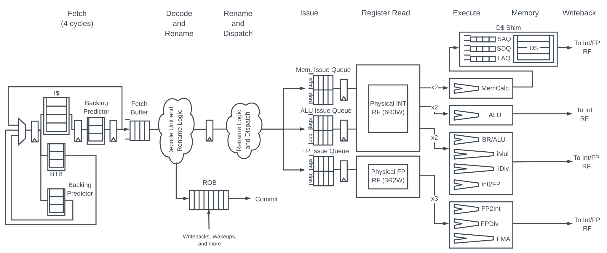
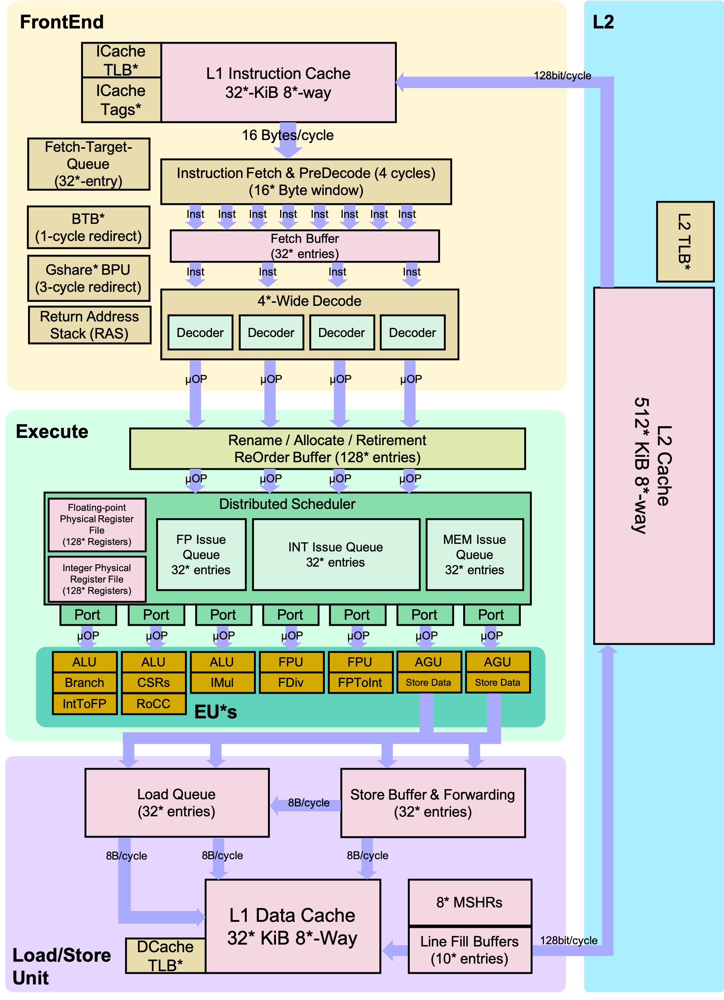

 ---

title: 工具
date: 2021-06-26 09:40
author: gatieme
tags:
    - linux
    - tools
categories:
        - 技术积累
thumbnail:
blogexcerpt: 虚拟化 & KVM 子系统

---

 

本作品采用<a rel="license" href="http://creativecommons.org/licenses/by-nc-sa/4.0/">知识共享署名-非商业性使用-相同方式共享 4.0 国际许可协议</a>进行许可, 转载请注明出处, 谢谢合作

因本人技术水平和知识面有限, 内容如有纰漏或者需要修正的地方, 欢迎大家指正, 鄙人在此谢谢啦

**转载请务必注明出处, 谢谢, 不胜感激**

 

| 日期 | 作者 | GitHub| CSDN | BLOG |
| ------- |:-------:|:-------:|:-------:|:-------:|
| 2021-02-15 | [成坚-gatieme](https://kernel.blog.csdn.net) | [`AderXCoding/system/tools/fzf`](https://github.com/gatieme/AderXCoding/tree/master/system/tools/fzf) | [使用模糊搜索神器 FZF 来提升办公体验](https://blog.csdn.net/gatieme/article/details/113828826) | [Using FZF to Improve Productivit](https://oskernellab.com/2021/02/15/2021/0215-0001-Using_FZF_to_Improve_Productivity)|

 

1 流水线
-------

# 1.1 流水线的划分
-------

| 类型 | 描述 |
|:---:|:----:|
| Front-End/前端   | 负责获取程序代码指令, 并将其解码为一个或者多个微操作(uOps), 这些 uOps 将分配给 Back-End 去执行. Front-end 负责交付 uOps 给 Back-end 执行. Front-end 从 Icache 中提取代码字节流到流水线, 通过分支预测器预测下一个地址以进行提取. 将代码字节分割成指令, 并发送给解码器, 解码器将指令解码到 uOps(mirco-ops), 以便交给 Back-end 执行. |
| Back-end/后端    | 负责监控 uOps 的数据何时可用, 并将其安排到可用的执行单元中执行. |
| Speculation/预测 | 部分跳转指令可能需要对跳转方向和跳转地址进行预测. 通常情况下, 大多数 uOps 都会通过流水线并正常退役, 但是在预测错误的情况下, 投机执行的 uOps 可能会在退役前被取消并从流水线中清楚掉. |
| Retirement/退役  | uOps 执行完成. 这被称为退役 |

## 1.3 流水线各个阶段
-------

| 编号 | 过程 | 描述 | 是否乱序 |
|:---:|:---:|:----:|:-------:|
| 1 | [取指(Fetch)](https://docs.boom-core.org/en/latest/sections/instruction-fetch-stage.html)  | 从 Icache 中取出多条指令, 放到 Fetch Buffer 中, 同时进行分支预测 在取指阶段, 除了需要取出多条指令, 同时还需决定下个周期的取指地址, 因此一般会由分支预测器来决定下一条指令(PC)的地址 , 再从 I-cache 中取指. | In Program Order |
| 2 | [译码(Decode)](https://docs.boom-core.org/en/latest/sections/branch-prediction/index.html) | 从 Fetch Buffer 中读取指令, 识别指令类型、操作数及控制信号, 将指令翻译成一条或者多条硬件可直接处理的 uOps | In Program Order |
| 3 | 寄存器重命名(Register Rename) | 寄存器重命名使得处理器可调度更多指令并行执行, 通过表格存储ARF和PRF的映射关系、未使用的PRF等信息, 分析并标记RAW相关性的指令, 一般会把该步骤单独放一流水段 | In Program Order |
|:---:|:---:|:----:|
| 4 | 派遣/分发(Dispatch) | 被重命名后的指令顺序写入发射队列、ROB和SB中, 如果没有空间则需要在重命名阶段等待, 分发可和重命名放一个流水段, 也可分开 | In Program Order |
| 5 | 发射(Issue) | 仲裁(select)电路从发射队列中选择准备好的最合适的指令送进 FU 执行, 发射队列中还存在唤醒电路, 将队列中对应的源操作数置为有效, 仲裁电路和唤醒电路配合工作, 是处理器中的关键路径；| In Program Order |
| 6 | 读取寄存器(Register Read) | 被仲裁电路选中的指令从PRF或旁路网络中得到操作数, 旁路网络的存在使得减少PRF读端口成为可能, 多端口寄存器堆访问速度慢, 需要单独使用一个流水段； | In Program Order |
| 7 | 执行(Execute) | 得到操作数后送入对应 FU 中执行, 一般包括负责普通运算、乘累加运算、分支指令运算、load/store指令运算等FU, 现代处理器还会加入负责多媒体运算如进行单指令多数据(SIMD)运算的FU. 一般各个执行单元有各自的 issue queue, 执行 uOps. | Out Of Order |
| 8 | 访存(Memory) | 加载/存储单元(Load/Store Unit)有三个队列, 分别是加载地址队列(LAQ), 存储地址队列(SAQ)和存储数据队列(SDQ). 当地址进入 LAQ 时加载指令被发送到存储器中; 而存储指令则要等到指令提交(Commit)阶段才能被发送到存储器. |
| 9 | 写回(write back) | 将计算结果顺序写入 PRF, 还需要通过电路网络送出, 该电路布线非常重要直接影响速度, 一般使用cluster结构将FU分组, 同组FU紧挨, 可在一个周期送出, 跨组则需更多周期 | In Program Order |
| 10 | 提交(commit) | ROB 顺序将结果写入 ARF, 同时处理异常, 所有异常均需到达该阶段后再进行处理以实现精确异常, 指令从ROB离开后无法再修改处理器状态. | In Program Order |

# 2 流水线各个阶段
-------

## 2.1 取指(IF/Instruction Fetch)
-------

[Instruction Fetch](https://docs.boom-core.org/en/latest/sections/instruction-fetch-stage.html)

| 单元 | 描述 |
|:----:|:---:|
| IFU(Instruction Fetch Unit) | 即指令获取单元. 顾名思义, 该单元的主要功能是从 Icache 中按需获取指令, 并将该指令发送给后续单元, 比如说执行单元, 进行处理. |

| 单元 | 描述 |
|:----:|:---:|
| [Icache](https://docs.boom-core.org/en/latest/sections/instruction-fetch-stage.html#the-rocket-core-i-cache) | | 用来缓存从内存中(代码段)读取的指令. |
| Fetch Buffer | 从 Icache 取出的指令会放到 Fetch Buffer 中, 这个缓冲区可以为解码器以及其后续部件执行一次提供多条指令. |

在取指阶段和解码阶段之间加入指令缓存 Fetch Buffer 的主要原因是为了减少 Icache 的影响.

1.  这样在取指阶段取出的指令个数可以多于每周期解码的个数. 从而有足够的指令给指令解码器使用, 而不用频繁的去 Icache 去读取.

2.  要执行的指令块, 可能刚好被分隔在了两个 cacheline, 从 icache 取指需要分两次进行, 如果通过 Fetch Buffer 缓冲下, 可以减少对 Icache 的冲击, 一定程序上提升性能.

## 2.2 分支预测(Branch Prediction)
-------

[Branch Prediction](https://docs.boom-core.org/en/latest/sections/branch-prediction/index.html)

| 单元 | 描述 |
|:----:|:---:|
| BTB(Branch Target Buffer) | 即分支目标缓冲区, 记录分支指令跳转目标地址, 用于分支指令的目标地址预测(即: 往哪里跳/branch target). |
| BHT(Branch History Table) | 分支历史表, 存储了分支指令跳转的历史信息, 用于分支指令的方向预测(即: 跳不跳/taken or not taken). |
| RAS(Return Address Stack) | 返回地址堆栈, 对于函数调用等类型的指令, 需要专门的部件记录其返回地址信息. |

## 2.3 Decode Stage
-------

指令解码需要识别出指令的类型, 指令所需的操作数以及指令的控制信息等. 这部分的设计和指令集息息相关.

## 2.4 寄存器重命名(Register Rename)
-------

寄存器重命名的主要目的是解决流水线中的 WAW(Write After Write) 和 WAR(Write After Read) 依赖.

> RAW(Read After Write) 依赖是真依赖, 无法通过寄存器重命名的方法解决.

之所以能通过寄存器重命名方式解决 WAW 和 WAR 依赖, 是因为这两种依赖本质上是由于这两种情况导致的:

1.  指令集规定的寄存器数量不足, 导致可用的寄存器"标号"过少, 编译器只能重复使用相同的寄存器, 导致出现本不应该出现的依赖

2.  在循环中, 每次使用的都是同一个寄存器, 但实际上每次循环中该寄存器的值直接并不一定存在关联.

因此最好的解决办法就是在硬件上设计足够多的寄存器, 这些寄存器的数量远远多于 ISA 上所定义的通用寄存器的数量. 这些寄存器称为 PRF(Physical Register File) | 物理寄存器. 而将架构所定义的通用寄存器称为逻辑寄存器 ARF(Architecture Register File).

寄存器重命名即是将每条指令使用的 ISA 寄存器动态地映射到物理寄存器, 从而解决 WAW 和 WAR 依赖.

| 单元 | 描述 |
|:----:|:---:|
| ARF(Architecture Register File) | 逻辑寄存器, 是指架构 ISA 上定义的通用寄存器 |
| PRF(Physical Register File) | 物理寄存器, 硬件上实现的数量远远多于 ARF 的寄存器 |
| RAT(Register Alias Table) | 重命名映射表, 用来记录 ARF 和 PRF 之间的映射关系, 指令在进行寄存器重命名的时候, 它的源寄存器会通过查找 RAT 而得到其对应的物理寄存器的编号, 同时指令的目的寄存器也会映射到一个新的物理寄存器, 这个映射关系也会写入到 RAT, 供后续使用了这个目的寄存器作为源寄存器的指令查找和使用. |
| Free List | 空闲列表中保存着所有空闲 PRF 的编号, 这些 PRF 还没有被映射到任何 ARF. 每次当指令被重命名的时候, 就会从空闲列表中找到空闲的物理寄存器. 而每次当一个 PRF 不会再被使用的时候, 就会将他的编号写回到空闲列表中 |

由于分支预测失败(miss-prediction)或者异常(exception)等原因, 所有处于流水线中的指令都处于推测(speculative)状态. 这些指令在顺利的离开流水线(退休)之前, 都有可能从流水线中抹除掉. 但是如果要被抹除的指令已经经过了寄存器重命名, 那么这条指令可能已经占据了重命名映射表(RAT), 重排序缓存(ROB) 和发射队列(Issue Queue) 等资源. 这样在抹除指令的时候, 也需要对占用的资源进行恢复.

## 2.5 分发(Dispatch)
-------

流水线的分发是处理器顺序(In-Order)执行和乱序(Out-Order)执行的分界点.

指令在经过了寄存器重命名之后, 就会进入流水线的分发阶段. 在这个阶段, 经过寄存器重命名的指令会按照程序中的顺序写入到流水线的 Issue Queue, ROB 以及 Store Buffer 等部件中.

> 如果这些部件中没有空闲的空间可以容纳当前的指令, 那么这些指令就只能在重命名阶段进行等待, 这就会相当于暂停了寄存器重命名以及之前的流水线, 直到这些部件有空闲的空间.

待指令的源操作数准备好以后, 就可以按照乱序的方式执行了, 然后最后为了保证指令完成的顺序和指令原本的顺序一致, 再按照 ROB 中指令的是顺序, 进行提交.

| 单元 | 描述 |
|:----:|:---:|
| IQ(Issue Queue) | 即发射队列, 用来缓存那些已经被寄存器重命名, 但是没有被送到 FU 执行的指令. 通常也被成为保留站 RS(Reservation Station). 一般每个 FU 都有一个 Issue Queue. 当指令被放置到 Issue Queue 上的时候, 它的操作数可能还没有准备好, 那么它就在 Issue Queue 中等待, 直到其所有所有的源操作数都准备好了, 就可以被发送到 FU 中去执行, 而不用理会这条指令在程序中原本的顺序. |
| ROB(Reorder Buffer) | 在发射队列(Issue Queue) 中, 只要某条指令所依赖的资源或者数据已经 Ready, 就可以将这条指令发射出去, 交给 FU 去执行, 但是为了保证指令顺序的退休, 执行完毕之后, 还是要按照原来执行顺序将结果写入, 按照指令顺序提交相关数据. ROB则就是记录指令原始顺序. 记录哪条指令已经执行完毕. 然后依照顺序将数据提交到原始寄存器上. |

> 分发阶段可以和寄存器重命名放在一个周期内完成, 但是当发射队列 Issue Queue 和重排序缓存 ROB 的容量比较大时, 向它们写入的速度会变得很慢, 这样会影响一个周期的时间, 从而不能让处理器的频率做到很高. 因此也有不少处理器将分发阶段作为作为流水中中的一级.

## 2.6  发射(Issue)
-------

发射就是按照一定的规则, 将那么源操作数已经准备(Ready)好的指令, 从 Issue Queue 中选择出来, 并发送到 FU 中去执行.

| 单元 | 描述 |
|:----:|:---:|
| Allocation | 分配电路, 用来从发射队列 Issue Queue 中找到空闲的空间, 将寄存器重命名之后的指令存储到 Issue Queue 中 |
| Select | 选择电路, 也叫仲裁(Arbiter)电路, 如果在发射队列中存在多条指令的操作数都已经准备好了, 那么需要从这些指令中找到最合适的指令, 送到 FU 中去执行. |
| Wake-up | 唤醒电路, 指令相互之间的数据存在一定的相关性, 比如前面指令的目的寄存器是后面指令的源操作寄存器. 这样 Issue Queue 中部分指令所依赖的数据只有等其依赖的指令完成后, 才能从其执行结果中获得自己执行所需的数据, 从而具备执行条件. 这样当依赖的指令执行而得到结果数据的时候, 就需要通知 Issue Queue 中所有等待该结果数据的指令. 将这些指令的源寄存器设置为有效的状态. 这个过程就是唤醒. 进一步的, 如果 Issue Queue 中某条指令所有的源操作数都有效了, 则这条指令就处于 Ready 状态. 随时可以被 Select 电路选中送到 FU 中执行. |

> 严格意义上讲, 分配电路其实处于流水线中 Dispatch 阶段, 它并不属于 Issue 阶段, 但是它与 Issue Queue 的关系是如此紧密.

## 2.7 执行(Execute)
-------

已经准备好的指令在被发射阶段的选择电路选中后, 就会被送到对应的 FU 中去执行. 为了提高处理器的并行能力, 处理器中会有多哥不同类型的 FU(Function Unit), 也叫执行单元(Execute Unit). 比如负责普通运算的 FU, 负责乘法以及累加的 FU, 负责处理分支指令的 FU, 负责执行 load/store 指令的 FU 以及一些用来处理专用扩展指令的 FU 等等.

在执行阶段

1.  FU 会接受指令的源操作数, 然后按照执行希望的操作进行执行, 例如加减法, 访问存储器, 判断条件等等.

2.  然后将这个指令的执行结果进行更新. 例如写到物理寄存器堆中, 写到存储器中, 再或者对指定的存储单元取数据等等.

3.  这个指令的执行结果也可能时 Issue Queue 中其他指令的源操作数, 因此需要通过旁路电路并执行完成的状态通知 Issue Queue, 将对应指令的状态更新, 并在需要时指定把结果送达对应的 FU.

| 单元 | 描述 |
|:----:|:---:|
| ALU(Arithmetic and Logic Unit) | 负责对整形类型的数据进行算数和逻辑运算, 并得到整形类型的结果. 比如加减, 逻辑运算, 移位操作等. 甚至是一些复杂的乘除以及数据传送等, 也可以由 ALU 完成. |
| FPU(Floating Point Unit) | 用来对浮点数进行运算. |
| AGU(Address Generation Unit) | 用来计算访问存储器的地址, AGU 计算的只是虚拟地址, 还需要将其转换为物理地址. load/store 指令通常会携带它们想要访问的寄存器的地址, AGU 负责对这些指令中的地址进行处理, 计算出指令中所携带的地址信息. 在普通处理器中, 这个由 ALU 完成就可以了. 但是对于超标量处理器来说, load/store 指令是释放往往是影响程序性能的关键所在, 因此使用单独的 FU 来处理. |
| BRU(Branch Unit) | 用来处理程序控制流(control flow)类型的指令. 如分支指令(branch), 跳转指令(jump), 函数跳转指令(call) 以及函数返回指令(return) 等. 这个 FU 负责将这些指令中所携带的目标地址计算出来, 并根据一定的条件来决定是否使用这些地址. 同时还会对分支预测的正确性进行校验, 一旦发现分支预测失败了, 就要启动相应的恢复机制. |
| Bypassing Network | 旁路电路, 当一条指令经过 FU 计算之后, 就已经得到了结果了, 但是由于超标量处理器是乱序执行的, 同时由于分支预测的存在, 所以这条指令的结果并不一定是正确的, 此时称这个计算结果是推测(speculative)状态的. 一条指令只有在顺利地离开流水线(退休)的时候, 才会被允许将它的结果真正写入. 此时这条指令就进入了正确状态(Architeeture State). 此时可能距离这个计算结果被计算出来已经很久了. 因此为了提升性能, 后续指令不肯能等到其依赖的指令退休时, 才使用它的结果. 这样虽然能得到正确的结果, 但是处理器的效率太低. 一条指令只有 在执行时才需要使用其操作数, 而在执行完成后, 就计算出了结果. 因此只需要将 FU 的输入和输出连接起来, 就可以将 FU 的结果直接传送到输入端. 这就是旁路电路. |

## 2.8 访存(Memory)
-------

## 2.9 写回(Write Back)
-------

## 2.10 提交(commit)
-------

在执行阶段, 处理器中的执行是并行且乱序进行执行的, 但是如果处理器想要正确地执行程序, 就需要维持原本程序中指令的顺序. 而流水线的提交阶段, 就是在保持程序执行结果的串行性. 当一条指令进入提交阶段后, 会将这条指令在重排序缓存 ROB 中标记为完成(complete)状态, 但是并不能离开流水线. 只有当这条完成的指令成为了整个 ROB 中最旧的指令时, 才允许离开流水线.

### 2.10.1 store 指令的提交(Store Buffer, Invalid Queue)
-------

| 单元 | 描述 |
|:----:|:---:|
| SB(Store Buffer) | 通过缓冲存储(store)操作, 从而加快存储操作. 当 CPU 执行 store 操作时, 可能需要通过 WB_BIU 将要写的数据写入 cache 甚至 Memory 1. 对于写 cache, CPU 在写入时需要向总线发送 Invalidate 请求, 其他收到 Invalidate 请求之后, 将自己的 cacheline 设置为无效. 并且发回 Invalidate ACK. 2. 尤其是在写直通模式下, 每次执行存储操作都要将数据写入外部 Memory, 这样会等待外部 Memory 完成存储操作. 所以如果使用同步的方式,  在此期间, CPU 处于暂停状态, 降低了CPU的效率. 因此将 store 的操作异步化. CPU 执行 store 操作时, 并不直接将数据写到 cache, 而是将这个修改操作放入到写缓存(Store Buffer)中, 再通过总线通知其他核缓存失效了, 然后这个 CPU 继续执行其他指令操作, 当接受到了其他核返回的 Invalidate ACK 消息之后, 才将写缓存(Store Buffer)中的操作写入到核A中的缓存中, 这时写操作才算完成. |
| Invalidate Queue | 同样接收到 Invalidate 请求的 CPU 为了能够快速进行回应所以, 先将无效的操作放到队列里面去, 并立刻返回 Invalidate ACK 消息, 等当前的操作执行完再回来真正的把缓存里面的值标识为 I 状态, 这个存放无效操作的队列就叫做无效化队列. |

## 1.3 真实的例子 RISC-V BOOM
-------

riscv-boom 是用 Chisel 硬件构造语言编写的 RV64G RISC-V 超标量 Berkeley 乱序处理器(The Berkeley Out-of-Order Machine/BOOM).

当前版本 BOOM v3 它拥有 10 级流水线.

整体流水线的框架图如下所示:

# 1 参考资料
-------

| 编号 | 链接 | 描述 |
|:---:|:----:|:---:|
| 1 | [A Journey Through the CPU Pipeline](https://bryanwagstaff.com/index.php/a-journey-through-the-cpu-pipeline/) | 讲述了 CPU 流水线的前世今生(不断演进和完善), [翻译版本](https://kb.cnblogs.com/page/179578) |
| 2 | [Intel P4 CPU](https://www.cnblogs.com/linhaostudy/p/9204107.html) | NA |
| 3 | [The Berkeley Out-of-Order Machine (BOOM)](https://docs.boom-core.org/en/latest/sections/intro-overview/boom.html) | |
| 4 | [知乎专栏-从零开始学risc-v设计](https://www.zhihu.com/column/c_1247894081075892224) | NA |
| 5 | [开源处理器Rocket的分支预测机制研究与性能评估(一)](https://blog.csdn.net/leishangwen/article/details/72877452) | | NA |
| 6 | [简书专栏-Rocket Chip](https://www.jianshu.com/nb/41934049) | NA |
| 7 | BOOM微架构学习——[0-前端与分支预测](https://zhuanlan.zhihu.com/p/379874172), [1-取指单元与分支预测](https://zhuanlan.zhihu.com/p/168755384), [2-译码单元与寄存器重命名](https://zhuanlan.zhihu.com/p/194075590), [详解寄存器重命名技术](https://zhuanlan.zhihu.com/p/399543947) | 以 BOOM 为例分析了取值单元以及分支预测器的实现 |
| 8 | [知乎专栏-大金哥的超标量处理器学习笔记](https://www.zhihu.com/column/c_1253708282457079808) | 总结了 <超标量处理器> 一书的基本内容, 对流水线各个阶段做了一定的解读 |
| 9 | [Skylake Microarchitecture](https://zhuanlan.zhihu.com/p/419876736) | 对 Skylake 微架构做了比较详细的分析 |
| 10 | [《手把手教你设计CPU——RISC-V处理器》读书笔记](https://zhuanlan.zhihu.com/p/90104625) | 讲了一些代码实现细节 |
| 11 | [RISC-V的“Demo”级项目——Rocket-chip](https://zhuanlan.zhihu.com/p/140360043) | 从 rocket-chip 讲到了 CPU 流水线. |
| 12 | [CPU体系结构](https://my.oschina.net/fileoptions/blog/1633021) | 从流水线开始讲起, 讲到了超标量以及内存一致性模型等, 提到了 load buffer、store buffer |
| 13 | [Re-Order Buffer](https://www.cnblogs.com/TaigaCon/p/7604152.html) [Intel Core Microarchitecture Pipeline](https://www.cnblogs.com/TaigaCon/p/7678394.html) [micro-fusion & macro-fusion](https://www.cnblogs.com/TaigaCon/p/7702920.html) [Stack Pointer Tracker](https://www.cnblogs.com/TaigaCon/p/7711504.html) [Branch Prediction](https://www.cnblogs.com/TaigaCon/p/7791303.html) | NA |
| 14 | [Intel X86 优化指南阅读笔记--基础体系结构](https://zhuanlan.zhihu.com/p/354130316) | NA |

 

*   本作品/博文 ( [AderStep-紫夜阑珊-青伶巷草 Copyright ©2013-2017](http://blog.csdn.net/gatieme) ), 由 [成坚(gatieme)](http://blog.csdn.net/gatieme) 创作.

*   采用<a rel="license" href="http://creativecommons.org/licenses/by-nc-sa/4.0/">知识共享署名-非商业性使用-相同方式共享 4.0 国际许可协议</a>进行许可. 欢迎转载、使用、重新发布, 但务必保留文章署名[成坚gatieme](http://blog.csdn.net/gatieme) ( 包含链接: http://blog.csdn.net/gatieme ), 不得用于商业目的.

*   基于本文修改后的作品务必以相同的许可发布. 如有任何疑问, 请与我联系.

*   **转载请务必注明出处, 谢谢, 不胜感激**
 
