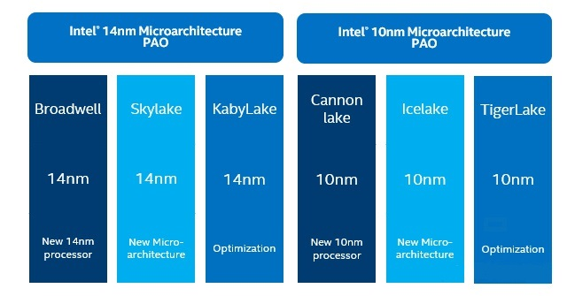
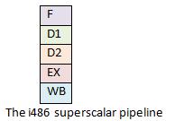
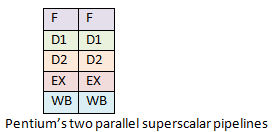
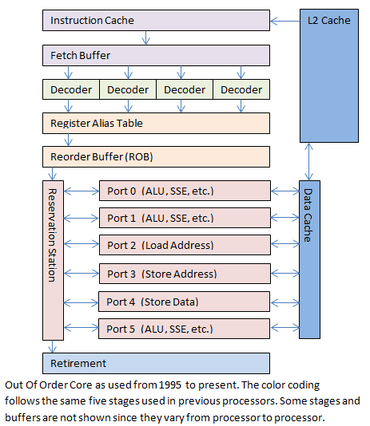

 ---

title: CPU 流水线的探秘之旅
date: 2021-06-26 09:40
author: gatieme
tags:
    - linux
    - tools
categories:
        - 技术积累
thumbnail:
blogexcerpt: 虚拟化 & KVM 子系统

---

<br>

本作品采用<a rel="license" href="http://creativecommons.org/licenses/by-nc-sa/4.0/">知识共享署名-非商业性使用-相同方式共享 4.0 国际许可协议</a>进行许可, 转载请注明出处, 谢谢合作

<a rel="license" href="http://creativecommons.org/licenses/by-nc-sa/4.0/"></a>

因本人技术水平和知识面有限, 内容如有纰漏或者需要修正的地方, 欢迎大家指正, 鄙人在此谢谢啦

**转载请务必注明出处, 谢谢, 不胜感激**

<br>

| 日期 | 作者 | GitHub| CSDN | BLOG |
| ------- |:-------:|:-------:|:-------:|:-------:|
| 2021-02-15 | [成坚-gatieme](https://kernel.blog.csdn.net) | [`AderXCoding/system/tools/fzf`](https://github.com/gatieme/AderXCoding/tree/master/system/tools/fzf) | [使用模糊搜索神器 FZF 来提升办公体验](https://blog.csdn.net/gatieme/article/details/113828826) | [Using FZF to Improve Productivit](https://oskernellab.com/2021/02/15/2021/0215-0001-Using_FZF_to_Improve_Productivity)|


<br>

| 英文原文 | 描述 |
|:-------:|:---:|
| [A Journey Through the CPU Pipeline](https://bryanwagstaff.com/index.php/a-journey-through-the-cpu-pipeline) | 讲述了 CPU 流水线的前世今生(不断演进和完善) |

# 1 前言
-------

　　作为程序员，CPU 在我们的工作中扮演了核心角色，因此了解处理器内部的工作方式对程序员来说不无裨益。

　　CPU 是如何工作的呢？一条指令执行需要多长时间？当我们讨论某个新款处理器拥有 12 级流水线还是 18 级流水线，甚至是更深的 31 级流水线时，这到些都意味着什么呢？

　　应用程序通常会将 CPU 看作是黑盒子。程序中的指令按照顺序依次进入 CPU，执行完之后再按顺序依次从 CPU 中出来，而内部到底发生了什么，我们通常并不了解。

　　对我们程序员来说，尤其是对做程序性能调优工作的程序员来说，学习 CPU 内部的细节非常必要。否则，如果你不知道 CPU 的内部结构，那如何才能针对 CPU 做性能优化？

　　本文所关注的就是专门针对 X86 处理器流水线的工作原理。

# 2 你需要掌握的预备知识
-------

　　首先，阅读本文你需要了解编程，最好了解一点汇编语言。如果你还不知道指令指针(instruction pointer)是什么，那么本文对你来说可能有些难。你需要知道什么是寄存器，指令和缓存，如果不明白它们是什么，你需要尽快查找资料了解一下。

　　第二，CPU 的工作原理是一个非常庞大和复杂的话题，本文仅仅是匆匆一瞥，很难以用一篇文章详尽叙述。如果我有什么疏漏，请通过评论告诉我。

　　第三，我仅仅关注英特尔处理器及其 X86 架构。当然除了 X86，还有很多其他架构的处理器。虽然 AMD 公司引入了很多新特性到 X86 架构，但是 X86 架构是 Intel 公司发明，并且创造了 X86 指令集，其中绝大多数特性是由 Intel 引入的。所以为了保持叙述的简单和一致性，我仅关注 Intel 的处理器。

　　最后，当你读到这篇文章时，它已经是“过时”的了。更新款的处理器已经设计出来，其中一些会在未来几个月之内发布。我很高兴技术能如此快速的发展，我希望有一天所有这些技术都会过时，创造出拥有更惊人计算能力的 CPU。

# 3 处理器流水线基础
-------

　　从一个非常广的角度来说，X86 处理器架构在近 35 年来并没有变化太多。虽然 X86 架构被附加了很多新功能，但是最初的设计（包括几乎所有最初的指令集）仍然基本上是完整保留的，即使在最新的处理器上仍然被支持。

　　最初的 8086 处理器支持 14 个寄存器，这些寄存器在如今最新的处理器中仍然存在。这 14 个寄存器中，有 4 个是通用寄存器：AX，BX，CX 和 DX；有 4 个是段寄存器，段寄存器用来辅助指针的实现：代码段(CS)，数据段(DS)，扩展段(ES)和堆栈段(SS)；有 4 个是索引寄存器，用来指向内存地址：源引用(SI)，目的引用(DI)，基指针(BP)，栈指针(SP)；有 1 个寄存器包含状态位；最后是最重要的寄存器：指令指针(IP)。

　　指令指针寄存器是一个拥有特殊功能的指针。指令指针的功能是指向将要运行的下一条指令。

　　所有的 X86 处理器都按照相同的模式运行。首先，根据指令指针指向的地址取得下一条即将运行的指令并解析该指令（译码）。在译码完成后，会有一个指令的执行阶段。有些指令用来从内存读取数据或者向内存写数据，有些指令用来执行计算或者比较等工作。当指令执行完成后，这条指令会通过退出(retire)阶段并将指令指针修改为下一条指令。

　　译码，执行和退出三级流水线组成了 X86 处理器指令执行的基本模式。从最初的 8086 处理器到最新的酷睿 i7 处理器都基本遵循了这样的过程。虽然更新的处理器增加了更多的流水级，但基本的模式没有改变。

# 4 35 年来发生了什么改变
-------


## 4.1 微架构发展
-------

　　相较于现今的标准，最初的处理器设计显得太过简单。最初的 8086 处理器的执行过程可以简述为从当前指令指针取得指令，通过译码，执行最后退出，然后继续从指令指针指向的下一条指令处取得指令。

　　新的处理器增加了新的功能，有些增加了新的指令，有些增加了新的寄存器。我将主要关注和本文主题有关系的改变，这些改变影响了 CPU 指令执行的流程。其他的一些变化比如虚拟内存或者并行处理虽然都很有意义而且有趣，但是并不在本文主题的范围内。

| 时间线 | 里程碑(微架构) | 描述 | 代表处理器 |
|:-----:|:------------:|:---:|:---------:|
| 1982 年 | 指令缓存在 1982 年被加入到处理器中。 | 通过指令缓存，处理器可以一次性从内存读取更多指令并放在指令缓存中，而不用每条指令都从内存中取。指令缓存仅有几个字节大小，只能容纳数条指令，但是因为消除了之后每次取指往返内存和处理器的时间，极大的提高的效率。 | 80286 |
| 1985 年 | 386 处理器引入了数据缓存，而且扩展了指令缓存的设计。 | 数据访存请求通过一次性读取更多的数据放在数据缓存中，从而提升了性能。而且，数据缓存和指令缓存都从几个字节扩大到几千字节。 | 80386 |
| 1989 年 | 推出的 i486 处理器引入了五级流水线。 | 这时，在 CPU 中不再仅运行一条指令，每一级流水线在同一时刻都运行着不同的指令。这个设计使得 i486 比同频率的 386 处理器性能提升了不止一倍。五级流水线中的取指阶段将指令从指令缓存中取出（i486 中的指令缓存为 8KB）；第二级为译码阶段，将取出的指令翻译为具体的功能操作；第三级为转址阶段，用来将内存地址和偏移进行转换；第四级为执行阶段，指令在该阶段真正执行运算；第五级为退出阶段，运算的结果被写回寄存器或者内存。由于处理器同时运行了多条指令，大大提升了程序运行的性能。 | 80486 |
| 1993 年 | Intel 推出了基于 P5 微架构的奔腾(Pentium)处理器。 | 由于诉讼问题，Intel 无法继续沿用原来的数字编号。因此，用奔腾替代了 586 作为新款处理器的代号。奔腾处理器相对 i486 处理器对流水线做出了更多修改。奔腾处理器架构增加了第二条独立的超标量流水线。主流水线工作方式类似于 i486，第二条流水线则并行的运行一些较简单的指令，比如说定点算术，而且该流水线能更快的进行该运算。 | Pentium |
| 1995 年 | Intel 推出了基于 P6 微架构的奔腾 Pro (Pentium Pro)处理器。 | 和之前的处理器相比，奔腾 Pro 采用了完全不同的设计。该处理器采用了诸多新特性以提高性能，包括乱序(Out-of-Order, OOO)执行的部件以及猜测执行。流水线扩展到了 12 级，而且引入了“超标量流水线”的概念，使得许多指令可以被同时处理。我们稍后将详尽的介绍乱序执行的部件。 | Pentium Pro |
| 在 1995-2002 年之间 | 乱序执行部件经过了数次重大改进。 | 处理器中加入了更多的寄存器；单指令多数据(Single Instruction Multiple Data, or SIMD)的引入使得一条指令可以进行多组数据运算；现有的缓存变得更大而且引入了新的缓存；有些流水级被拆分成更多流水级，有些流水级被合并，使得更加适合实际的应用。这些改变对整体性能的提升有重要作用，但它们都没有从根本影响数据在处理器中的流动方式。 | Pentium MAX<br>Pentium II<br>Pentium III |
| 2002 年 | NetBurst 架构 | 使用 NetBurst 架构的奔腾 4 处理器引入了超线程技术。乱序执行部件的设计使得指令被执行的速度比处理器能够提供指令的速度更快。因此对于大部分应用，CPU 的乱序执行部件在大部分时间处于空闲状态，甚至在高负载的情况下也不能充分利用。为了让指令流能充分的流入乱序执行部件，Intel 加入了第二套前端部件（译注：在处理器结构中，前端是指取指，译码，寄存器重命名等模块，经过前端部件的处理后，指令等待发射进入乱序执行部件）。虽然实际上只有一个乱序执行部件，但对于操作系统来说，它能看到两个处理器。前端部件包含两组同样功能的 X86 寄存器，两个指令译码器根据两个指令指针指向的地址分别处理。所有的指令被一个共享的乱序执行部件执行，但对应用程序来说并不知情。当乱序执行部件执行完成，像之前一样退出流水线后，最终结果返回虚拟的两个处理器。 | Pentium IV |
| 2001 年 | 发布了 IA-64 微架构, 支持 64 位. | 引入了 HT 超线程, 允许处理器在每个周期最多运行 6 条指令 | Itanitum(安腾)/2001年<br>Itanitum 2/2002 年 |
| 2003 年 | Pentium M 架构 | Pentium D 处理器是首颗 2 核(胶水双核)的处理器, CPU 进入多核时代。 | Pentium M<br>Celeron M |
| 2005 年 | Yonah 微架构 | Yonah 是 Pentium M 和 NetBurst 架构的改进和优化版本, 是微架构向酷睿迈进的第一步。在能耗和电源管理方面做了优化。通过独立的双核心电源调节，大大减少能量消耗. 弱点主要继承自原先的Pentium M架构，如因缺少集成内存控制器带来的高内存延时（同时DDR-II内存自身也比DDR内存有更高的延迟问题）和因每个核心有更少的浮点单元因而更慢的浮点运算单元（FPU）。 | Core Duo |
| 2006 年 | 第一代酷睿(Core)微架构 | 目前比较普遍的看法是，Core微架构是 Pentium Pro 架构，或者说是 P6 微架构的延续。令人惊讶的是，处理器频率不升反降，而且超线程也被去掉了。通过降低时钟频率，每一级流水线可以做更多工作。乱序执行部件也被扩展的更宽。各种不同的缓存和队列都相应做的更大。而且处理器被重新设计，以适应双核和四核的共享缓存结构。采用新的内存相关性预测技术。支持增强的电源管理功能。支持硬件虚拟化技术和硬件防病毒功能。内建数字温度传感器。还可提供功率报告和温度报告等，配合系统实现动态的功耗控制和散热控制。 | Core 2 Duo |
| 2007 年 |  Penryn 微架构 | 是 Core 的优化改进版本，较大的 Cache 容量，FSB 和时钟速度较高，支持 SSE4.1 指令。 | Wolfdale<br>Yorkfield 45nm [TICK] |
| 2008 年 | Nehalem 微架构 | 新处理器重新引入了超线程(SMT技术。开始用酷睿 i3, i5, i7 的方式来命名新的处理器。这三个系列的处理器主要区别在于内部缓存大小不同。 | Nehalem 家族处理器/代号 Boomfield(Core i7)/45nm [TOCK]<br>Westmere 家族处理器/Core i3，i5/32nm [TICK] |
| 2011~2012 年 | [Sandy Bridge 微架构](https://en.wikichip.org/w/index.php?title=intel/microarchitectures/sandy_bridge) | 在酷睿的基础上结合了在 NetBurst 实施的一些改进与原来的 P6 设计。 前端完全重新设计，拥有新的解码管道，使用了新设计的 µOP 缓存。后端是实现了一个基于 PRF 的寄存器重命名单元。 | 第二代酷睿 Sandy Bridge 家族处理器/32nm [TOCK]<br>第三代酷睿 Ivy Bridge 家族处理器/ 22nm [TICK] |
| 2013~2014 年 | Haswell | 拥有 14 级流水级的乱序执行部件，所以它仍然遵循从奔腾 Pro 以来的基本设计思路。 L3 采用 non-inclusive LLC。为了在一块 CPU 里塞进越来越多的核心数，Intel 的多核 CPU 引入了 ring bus 的设计，核心、LLC、QPI 控制器分布于环上，内存控制器和 QPI 总线分布在环的两端，然而这样的结构随着核心的增加，延迟也会增加，于是从 Haswell 开始，高核心数的服务器 CPU 开始使用双线环网结构（双环+双内存控制器的架构），在 LCC 中是单环， MCC 中是一个完整环和一个半环，HCC 中则是两个完整的环，半环和完整的环都带有一个独立的内存控制器。引入 COD(Cluster on DIE) 解决 NUMA 内存不一致的问题，逻辑上分为核数和 LLC 各为一半的两个 cluster，被操作系统当做两个 NUMA 节点。| 第四代 Haswell/22nm [TOCK]<br>Haswell Refresh/22nm [REFRESH]<br>第五代 Broadwell/14nm [TICK] |
| 2015~2017 年 | [Skylake](https://en.wikichip.org/wiki/intel/microarchitectures/skylake_(server)) | 借鉴了 Broadwell 的诸多优化。采用  mesh 总线结构，引入了网状互联网络（从环拓扑），由于核心较多时，mesh 结构即使是取最短路线也有可能跨过整个 DIE 而导致延迟较大，因此设计了 SNC(sub-NUMA cluster) 替代 Broadwell 的 COD(Cluster on DIE)，将核心、CHA 和 LLC 单元分配到物理距离较近的内存控制器上。这样在 L3 cache miss 的时候会从更近一侧的内存控制器去访问内存，SNC 开启时可以获得更低的平均内存访问延迟。虽然这样单 socket 也会被识别为两个 NUMA 节点，但是原因却和 Haswell 不同。 | 第六代 Skylake/14nm [TOCK]<br>第七代 Kaby Lake/14nm<br>第八代 Coffee Lake家族，Whiskey Lake家族，以及Amber Lake家族/14nm<br>第九代 Coffee Lake Refresh<br>第十代 Comet Lake家族 |
| 2019 年 | IceLake(代号 Sunny Cove) | 更宽的流水线、更多的执行单元以及专用指令(比如 AVX-512)执行单元的优化  | 第十一代产品 Rocket Lake家族/14nm/Cypress Cove 微架构<br>第十一代产品 Tiger Lake家族用使用 Willow Cove 微架构/10nm [Optimization] |
| 2021 年 | 混合架构，为了区别于 ARM 的 big.LITTLE，被称为 Intel Hybrid 或者 Hybrid Computing Architectures。 | 同时包含使用了 Golden Cove 微架构的酷睿大核(P-core) 和使用了 Grace Mont 微架构 Atom 小核(E-core)。<br>Golden Cove 属于十一代笔记本酷睿（Tiger Lake）里 Willow Cove 的升级，具有更深、更宽的流水线，频率设定较高，强调高性能，在某些方面都有巨大的变化，例如乱序指令窗口，ROB（重排序缓存）的大小，充分利用了新制程晶体管密度提升带来的好处。<br>Grace Mont的角色按照设计理念是做一些轻体力活为主，主打低能耗，但是本身的性能还是可以的，它属于 Atom 阵营里的第四代乱序执行架构。<br>为此还专门加入了一个名为 Thread Director（线程导向器）的硬件线程导向器，这个导向器的目的就是把各种线程按照其负荷递交给不同类型的内核。 | 第十二代 Alder Lake |

Intel 自酷睿处理器以来，奠定了超标量流水线架构的基本形态，这种形态经过 Sandy Bridge，Haswell，Skylake，IceLake 的不断发展，通过更深的缓冲区，更高的访存操作，更宽的SIMD执行能力，微指令缓存等手段，成为了几乎目前所有高性能处理器都有和将要有的形态。

## 4.2 处理器微架构发展路线
-------

### 4.2.1 Tick-Tock 战略
-------

众所周知 Intel 之前有个著名的 [Tick-Tock 战略](https://www.intel.com/content/www/us/en/silicon-innovations/intel-tick-tock-model-general.html)，他指的是每年按照**工艺年-架构年**交替升级产品，持续在前代产品的基础上改进

*   当在工艺年(tick)的时候重点是使用新的制程，小幅修改微架构。

*   当在架构年(tock)的时候，将会推出较大改进的微架构，往往此时 ISA 也会扩展更多指令集，并且优化上年推出的制程，进一步改善功耗和良率，在已经取得成功的产品上持续改进，使得 Intel 始终保持对竞争对手的优势

如果不出意外，产品节奏会是这样。


不过不出意外怎么可能呢。但是计划永远赶不上变化。

到 14nm 的时候，Tick-Tock 策略出现了危机，因为 Tick 工艺节点出现了较大的延迟，内部 14nm 的 Broadwell 推出时出现了一点偏差，外围又有 AMD 的紧追不舍， Intel 不得不出了 Haswell-refresh 来解燃眉之急，不过好在没有太大延迟，随着架构年的 Skylake 微架构的如期发布，也还算是赶上了一年一换代的节奏。


### 4.2.2 Processor-Architecture-optimization 策略
-------

不过事情远远没有那么简单。在 Skylake 发布之后，10nm 再一次难产，意识到工艺问题预远没有预期那么简单的牙膏厂，只能被迫将 Tick-Tock 战略彻底放弃。

2016年3月22日，Intel在财务报告中宣布，Tick Tock将放缓至三年一循环，增加优化环节，进一步减缓实际更新的速度。至此改为三步走的 PAO(Processor-Architecture-optimization) 策略，即“制程-架构-优化”。


*   制程：在架构不变的情况下，缩小晶体管体积，以减少功耗及成本

*   架构：在制程不变的情况下，更新处理器架构，以提高性能

*   优化：在制程及架构不变的情况下，对架构进行修复及优化，将BUG减到最低，并提升处理器时钟频率 [1]


于是产品计划变成了这个摸样。



CannonLake 如期作为第一代 10nm 出现，但是 10nm 的问题远比意料中的复杂，CannonLake 产品的发布再次难产，而且随着 AMD 堆核战略在 Ryzen 上取得成效，Intel 决定使用现有产品 14nm 堆核进行应对，这让 Cannonlake 变成了极其尴尬的产品，它将永远成为英特尔推动 10nm 至高无上的努力的障碍。实际仅推出了一款芯片 Core i3-8121U。产品干脆没有上市，实际产品情况变成了这样。


接着就是大家熟知的事情了:

2019年发布基于微架构 Sunny Cove 的 10nm 处理器，也就是之前就被爆出来的 Ice Lake（注意这是处理器代号，而Sunny Cove则是CPU微架构代号），使用的是10nm工艺，提升了 IPC，增加了新的指令集。接下来是 2020 年 发布 Willow Cove，使用 14nm 工艺。

> Willow Cove vs Cypress Cove
>
> Rocket Lake 处理器用的内核 Cypress Cove，它应该是把 10nm 的 Willow Cove 改用14nm工艺生产所用的代号，但它并不完全等于 Willow Cove，应该是结合 14nm 工艺重新开发的。因此 Cypress Cove 相比于 Skylake 的IPC提升可能没 Willow Cove 的 25% 这么多，但是现在14nm工艺所能达到的频率比10nm更高，所以 Rocket Lake 的最高频率会比 Tiger Lake 的 4.7GHz 更高。
>
> [https://www.techpowerup.com/268511/intel-willow-cove-backported-to-14nm-is-cypress-cove](https://www.techpowerup.com/268511/intel-willow-cove-backported-to-14nm-is-cypress-cove)

而 2021 年发布了混合架构的 Alder Lake，同时包含 Golden Cove 微架构的大核和 Grace Mont 微架构的小核，至此以 Cove 架构作为高性能微架构以及 Mont 架构作为其他偏向能耗的处理器的微架构应该是后面几年的主旋律。


# 5 CPU 指令流水线
-------

　　那么，流水线到底是什么？乱序执行部件是什么？他们如何提升了处理器的性能呢？


　　根据之前描述的基础，指令进入流水线，通过流水线处理，从流水线出来的过程，对于我们程序员来说，是比较直观的。

　　I486 拥有五级流水线。分别是：取指(Fetch)，译码(D1, main decode)，转址(D2, translate)，执行(EX, execute)，写回(WB)。某个指令可以在流水线的任何一级。


　　但是这样的流水线有一个明显的缺陷。对于下面的指令代码，它们的功能是将两个变量的内容进行交换。

```cpp
XOR a, b
XOR b, a
XOR a, b
```

　　从 8086 直到 386 处理器都没有流水线。处理器一次只能执行一条指令。再这样的架构下，上面的代码执行并不会存在问题。

　　但是 i486 处理器是首个拥有流水线的 x86 处理器，它执行上面的代码会发生什么呢？当你一下去观察很多指令在流水线中运行，你会觉得混乱，所以你需要回头参考上面的图。

　　第一步是第一条指令进入取指阶段；然后在第二步第一条指令进入译码阶段，同时第二条指令进入取指阶段；第三步第一条指令进入转址阶段，第二条指令进入译码阶段，第三条指令进入取指阶段。但是在第四步会出现问题，第一条指令会进入执行阶段，而其他指令却不能继续向前移动。第二条 xor 指令需要第一条 xor 指令计算的结果a，但是直到第一条指令执行完成才会写回。所以流水线的其他指令就会在当前流水级等待直到第一条指令的执行和写回阶段完成。第二条指令会等待第一条指令完成才能进入流水线下一级，同样第三条指令也要等待第二条指令完成。

　　这个现象被称为流水线阻塞或者流水线气泡。

　　另外一个关于流水线的问题是有些指令执行速度快，有些指令执行速度慢。这个问题在奔腾处理器的双流水线架构下显得更加明显。

　　奔腾 Pro 拥有 12 级流水线。当这个数字被首次宣布后，所有的程序员都倒抽了一口气，因为他们知道超标量流水线是如何工作的。如果 Intel 仍然按照以前的思路设计超标量流水线的话，流水线的阻塞和执行速度慢的指令会严重影响执行速度。但同时，Intel 宣布了完全不同的流水线设计，叫做乱序执行部件(Out-of-Order core)。单从叙述上很难理解这些改变带来的好处，但 Intel 确信这些改进是令人激动的。

　　让我们来更深入的看看这个乱序执行的部件吧！

# 6 乱序执行流水线
-------

　　在描述乱序执行流水线时，往往是一图胜千言。所以我们主要以图例进行介绍。


　　I486 处理器拥有 5 级流水线。这种设计在现实世界中的其他处理器中很常见，而且效率不错。




　　而奔腾处理器的流水线比 i486 更好。两条流水线可以并行运行，而且每条流水线可以同时有多条指令在不同流水级执行。它几乎可以同时执行比 i486 多一倍的指令。



　　能够快速完成的指令需要等待前面执行慢的指令即使在并行流水线中也仍然是一个问题。流水线仍然是线性的，导致处理器面临性能瓶颈难以逾越。

　　乱序执行部件和之前处理器设计中的线性通路有很大不同，它增加了一些复杂度，引入了非线性的通路。



　　第一个改变是指令从内存中取到处理器的指令缓存的过程。现代处理器能够检测何时会产生一个大的分支跳转（比如函数调用），然后提前将跳转目的地的指令加载到指令缓存中。

　　译码级有一些略微的修改。不同于以往处理器仅仅译码指令指针指向的指令，奔腾 Pro 处理器每一个时钟周期最多能译码 3 条指令。现今的处理器（2008-2013 年）每个时钟周期最多可以译码 4 条指令。译码过程产生很多小片的操作，被称作微指令(micro-ops, µ-ops)。

　　下一级（或者好几级）被称为微指令翻译，接着是寄存器重命名(register aliasing)。许多操作同时执行，并且执行的顺序是乱序的，所以有可能出现一条指令读一个寄存器的同时，另外一条指令正在对这个寄存器进行写操作。在处理器内部，这些原始的寄存器（如 AX,BX,CX,DX 等）被翻译（或者重命名）成为内部的寄存器，而这些寄存器对程序员是不可见的。寄存器和内存地址需要被映射到一个临时的地方用于指令执行。当前每个始终周期可以翻译 4 条微指令。

　　当微指令翻译完成后，它们会进入一个重排序缓存(Reorder Buffer, ROB)，ROB 可以存储最多 128 条微指令。在支持超线程的处理器上，ROB 同样可以重排来自两个虚拟处理器的指令。两个虚拟处理器在 ROB 中将微指令汇集到一个共享的乱序执行部件中。

　　这些微指令已经准备好可以执行了。它们被放在保留站中(Reservation Station, RS)。RS 最多可以同时存储 36 条微指令。

　　现在才开始乱序执行部件神奇的部分。不同的微指令在不同的执行单元中同时执行，而且每个执行单元都全速运行。只要当前微指令所需要的数据就绪，而且有空闲的执行单元，微指令就可以立即执行，有时甚至可以跳过前面还未就绪的微指令。通过这种方式，需要长时间运行的操作不会阻塞后面的操作，流水线阻塞带来的损失被极大的减小了。

　　奔腾 Pro 的乱序执行部件拥有 6 个执行单元：两个定点处理单元，一个浮点处理单元，一个取数单元，一个存地址单元，一个存数单元。这两个定点处理单元有所不同，一个能够处理复杂定点操作，一个能同时处理两个简单操作。在理想状况下，奔腾 Pro 的乱序执行部件可以在一个时钟周期内执行 7 条微指令。

　　现今的乱序执行部件仍然拥有 6 个执行单元。其中取数单元，存地址单元，存数单元没有变，另外 3 个多少发生了变化。这三个执行单元都可以执行基本算术运算，或者执行更复杂的微指令。但每个执行单元擅长执行不同种类的微指令，使得它们能更高效的执行运算。在理想状况下，现今的乱序执行部件可以在一个时钟周期内执行 11 条微指令。

　　最终微指令会得到执行，在经过数个流水级之后，最终会退出流水线。这时，这条指令完成并且递增指令指针。但从程序员的角度来说，指令仅仅是从一端进入 CPU，从另一端退出，就像老的 8086 一样。

　　如果你仔细看过上面的内容，你会注意到上面提到过很重要的一个问题：如果执行指令的位置发生了跳转会发生什么？例如，当指令运行到”if”或者是”switch”时，会发生什么呢？在较老的处理器中这意味着清空流水线，等待新的跳转目的指令的取指执行。

　　当 CPU 指令队列中存储了超过 100 条指令时，发生流水线阻塞带来的性能损失是极其严重的。所有的指令都需要等待跳转目的的指令取回并且重启流水线。在这种情况下，乱序执行部件需要将跳转指令之后但是已经执行的微指令全部取消掉，返回到执行前的状态。当所有乱序执行的微指令都退出乱序执行部件之后，将它们丢弃掉，然后从新的地址开始执行。这对于处理器来说是相当困难的，而且发生的频率很高，因此对性能的影响很大。这时，引入了乱序执行部件的另外一个重要功能。

　　答案就是猜测执行。猜测执行意味着当遇到一个分支指令后，乱序执行部件会将所有分支的指令都执行一遍。一旦分支指令的跳转方向确定后，错误跳转方向的指令都将被丢弃。通过同时执行两个跳转方向的指令，避免了由于分支跳转导致的阻塞。处理器设计者还发明了分支预测缓存，当面临多个分支时进行预测，进一步提高了性能。虽然 CPU 阻塞仍然会发生，但是这个解决方案将 CPU 发生阻塞的概率降到了一个可以接受的范围。

　　最后，拥有超线程的处理器将两个虚拟的处理器暴露给共享的乱序执行部件。它们共享一个重排序缓存和乱序执行部件，让操作系统认为它们是两个独立的处理器，看上去就像这样：


　　超线程的处理器拥有两个虚拟的处理器，从而可以给乱序执行部件提供更多的数据。超线程对一般的应用程序都有性能提升，但是对一些计算密集型的应用，则会迅速使得乱序执行部件饱和。在这种情况下，超线程反而会略微降低性能。但这种情况毕竟是少数，超线程对于日常应用来讲通常都能够提供大约一倍的性能。

# 7 一个示例
-------

　　这一切看上去有点令人感到困惑，那么我们举一个例子来让这一切变得清晰起来。

　　从应用程序的角度来看，我们仍然是运行在指令流水线上，就想老的 8086 处理器那样。处理器就是一个黑盒子。黑盒子会处理指令指针指向的指令，当处理完之后，会在内存里找到处理的结果。

　　但是从指令本身的角度来讲，这个过程可谓历经沧桑。我们下面介绍对于现今的处理器（大约在 2008-2013 年之间），一条指令在其内部的过程。

　　首先，你是一条指令，你所属的程序正在运行。

　　你一直在耐心的等待指令指针会指向自己，等待被 CPU 运行。当指令指针距离你还有 4KB 远的时候（这大约是 1500 条指令），你被 CPU 从内存取到指令缓存中。虽然从内存加载进入指令缓存需要一段时间，但是现在距离你被执行的时刻还很远，你有足够的时间。这个预取的过程属于流水线的第一级。

　　当指令指针离你越来越近，距离你还有 24 条指令的时候，你和你旁边的 5 个指令会被放到指令队列里面。

　　这个处理器有 4 个译码器，可以容纳一个复杂指令和最多三个简单指令。你碰巧是一条复杂指令，通过译码，你被翻译成 4 个微指令。

　　译码的过程可以划分为多步。译码过程中的一步是检查你需要的数据和猜测你可能会产生一个地址跳转。译码器一旦检测到需要的额外数据，不需要让你知道，这个数据就开始从内存加载到数据缓存中了。

　　你的四个微指令到达寄存器重命名表。你告诉它你需要读哪个内存地址（比如说 fs:[eax+18h]），然后寄存器重命名表将这个地址转换为临时地址供微指令使用。地址转化完成后，你的微指令将进入重排序缓存(Reorder Buffer, ROB)并记录指令次序。接着第一时间进入保留站(Reservation Station, RS)。

　　保留站用于存储已经准备就绪可以执行的指令。你的第三条微指令被立即选中并送往端口5，这个端口直接执行运算。但是你并不知道为什么它会被首先选中，无论如何，它确实被执行了。几个时钟周期之后你的第一条微指令前往端口2，该端口是读单元(Load Address execution unit)。剩余的微指令一直等待，同时各个端口正在收集不同的微指令。他们都在等待端口 2 将数据从缓存和内存中加载进来并放在临时存储空间内。

　　他们等了很久……

　　相当久的时间……

　　不过在他们等待第一条微指令返回数据的时候，又有其他的新指令又进来。好在处理器知道如何让这些指令乱序执行（即后到达保留站的微指令被优先执行）。

　　当第一条微指令返回了数据，剩余的两条微指令被立即送往执行端口 0 和1。现在这 4 条微指令都已经运行，最终它们会返回保留站。

　　这些微指令返回后交出他们的“票”并给出各自的临时地址。通过这些地址，你作为一个完整的指令，将他们合并。最后 CPU 将结果交给你并使你退出。

　　当你到达标有“退出”的门的时候，你会发现这里要排一个队列。你进入后发现你刚好站在你前面进来指令的后面，即使执行中的顺序可能已经不同，但你们退出的顺序继续保持一致。看来乱序执行部件真正知道自己做了什么。

　　每条指令最终离开 CPU，每次一条指令，就和指令指针指向的顺序一样！

# 8 结论
-------

　　希望这篇小文能够给读者展示一些处理器工作的奥秘，要知道，这并不是魔术。

　　让我们回到最初的问题，现在我们应该可以给出一些较好的答案了。

　　处理器内部是如何工作的呢？在这个复杂的过程中，指令首先被分解为更小的微指令命令，这些微指令以乱序的方式尽可能快的被执行，然后按照原始的顺序提交执行结果。因此，从外部看来，所有的指令都是按照顺序的方式执行的。但是现在我们知道，处理器内部是以乱序的方式处理指令的，有时甚至以猜测的方式来运行分支代码。

　　运行一条指令究竟需要多长时间呢？对于没有使用流水线技术的处理器来说，这是一个容易回答的问题，但对于现代的处理器来说，一条指令的执行时间与它周围指令的内容以及临近 cache 的大小和内容都有关。一条指令通过处理器有一个最小的时间，但只能粗略的说这个时间是恒定的。一个好的程序员和编译器可以让很多条指令同时运行，从而使每条指令的分摊时间几乎为零。这里说的几乎为零的执行时间并不是指一条指令的总的执行时间很短，相反，通过整个乱序部件和等待内存读写数据是需要花费很多时间的。

　　一个新的处理器拥有 12 级或者 18 级、甚至更深的 31 级流水线意味着什么呢？这意味着更多的指令可以被同时送进加工厂。一个非常深的流水线可以让几百条指令同时被处理。当一切顺利时，一个乱序部件可以保持高速运转，从而获得惊人的吞吐量。不幸的是，深的流水线同时意味着流水线停顿会从一个相对可以容忍的性能损失变成一个可怕的性能噩梦。因为几百条指令都不得不停顿下来，等待流水线恢复运转。

　　我怎么根据这些信息来优化程序呢？幸运的是，CPU 可以在大部分常见情况下工作良好，并且编译器已经为乱序处理器优化了近 20 年。当指令和数据按照顺序（没有烦人的跳转）执行时，CPU 可以获得最好的性能。因此，首先，使用简单的代码。简单直接的代码会帮助编译器的优化引擎识别并优化代码。尽量不使用跳转指令，当你不得不跳转时，尽量每次跳转到同样的方向。复杂的设计，例如动态跳转表，虽然看起来很酷并且的确可以完成非常强大的功能，但不管是处理器还是编译器，都无法进行很好的预测处理，因此复杂的代码很可能导致流水线停顿和猜测错误，从而极大的损害处理器性能。其次，使用简单的数据结构。保持数据顺序、相邻和连续可以阻止数据停顿。使用正确的数据结构和数据分布可以获得很大的性能提升。只要保持代码和数据结构尽量简单，剩下的工作就可以放心地交给编译器的优化引擎来完成了。

　　感谢与我一起参与这次旅行！

# 9 参开资料
-------

| 编号 | 链接 | 描述 |
|:---:|:----:|:---:|
| 1 | [Intel_Tick-Tock](https://zh.wikipedia.org/wiki/Intel_Tick-Tock) | 维基百科-Intel 微架构 |
| 2 | [详述Intel系列CPU架构的发展史](https://wenku.baidu.com/view/e465434b2b160b4e767fcf44.html) | NA |
| 3 | [【X86】---关于Intel芯片架构的发展史](https://www.cnblogs.com/szhb-5251/p/6669860.html) | NA |
| 4 | [英特尔微处理器列表](https://zh.wikipedia.org/wiki/英特尔微处理器列表) | NA |
| 5 | [Intel真的在挤牙膏？历代Core i7处理器性能大比拼](https://www.expreview.com/49967-2.html) | NA |
| 6 | [INTEL CPU全系列架构发展史](http://www.360doc.com/content/20/0218/07/31409419_892835563.shtml) | NA |
| 7 | [Microarchitectures - Intel](https://en.wikichip.org/wiki/intel/microarchitectures) | NA |
| 8 | [List of Intel CPU microarchitectures](https://infogalactic.com/info/List_of_Intel_CPU_microarchitectures) | NA |
| 9 | [List of Intel CPU microarchitectures](https://wikimili.com/en/List_of_Intel_CPU_microarchitectures) | NA |
| 10 | [Intel Microarchitecture Overview](https://www.thomas-krenn.com/en/wiki/Intel_Microarchitecture_Overview) | NA |
| 11 | [英特尔新一代Core微架构全面解析](http://tech.sina.com.cn/h/2006-04-27/1421920715.shtml) | NA |
| 12 | [一起聊聊业界即将用上的Intel Golden Cove高性能核心？](https://zhuanlan.zhihu.com/p/411109256) | NA |
| 13 | [IceLake微架构CPU介绍与性能分析](https://zhuanlan.zhihu.com/p/83399457) | NA |
| 14 | [Microarchitectures - Intel](https://en.wikichip.org/wiki/intel/microarchitectures) | NA |
| 15 | [从 E5-2690v4 的 NUMA 数量说起，浅谈 Broadwell 到 Skylake 的改进](https://www.starduster.me/2018/05/18/talk-about-evolution-from-broadwell-to-skylake) | NA |
| 16 | [从核心性能不一致到sub-numa](https://zhuanlan.zhihu.com/p/60110000) | NA |
| 17 | [NUMA入门：那些必须知道的基础概念](https://www.it610.com/article/1281587993060065280.htm) | NA |
| 18 | [NUMA Domian和NUMA Distance](https://www.cnblogs.com/kongchung/p/14745803.html) | NA |
| 19 | [如何看待第 12 代英特尔酷睿处理器的产品革新？会给行业带来什么影响？](https://www.zhihu.com/question/494592488/answer/2206656842) | NA |


<br>

*   本作品/博文 ( [AderStep-紫夜阑珊-青伶巷草 Copyright ©2013-2017](http://blog.csdn.net/gatieme) ), 由 [成坚(gatieme)](http://blog.csdn.net/gatieme) 创作.

*   采用<a rel="license" href="http://creativecommons.org/licenses/by-nc-sa/4.0/"></a><a rel="license" href="http://creativecommons.org/licenses/by-nc-sa/4.0/">知识共享署名-非商业性使用-相同方式共享 4.0 国际许可协议</a>进行许可. 欢迎转载、使用、重新发布, 但务必保留文章署名[成坚gatieme](http://blog.csdn.net/gatieme) ( 包含链接: http://blog.csdn.net/gatieme ), 不得用于商业目的.

*   基于本文修改后的作品务必以相同的许可发布. 如有任何疑问, 请与我联系.

*   **转载请务必注明出处, 谢谢, 不胜感激**
<br>
