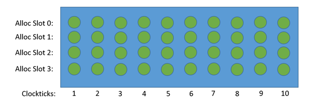
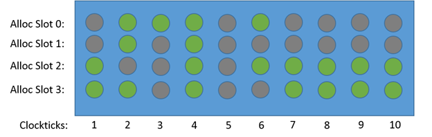
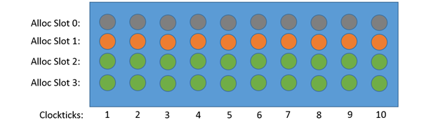
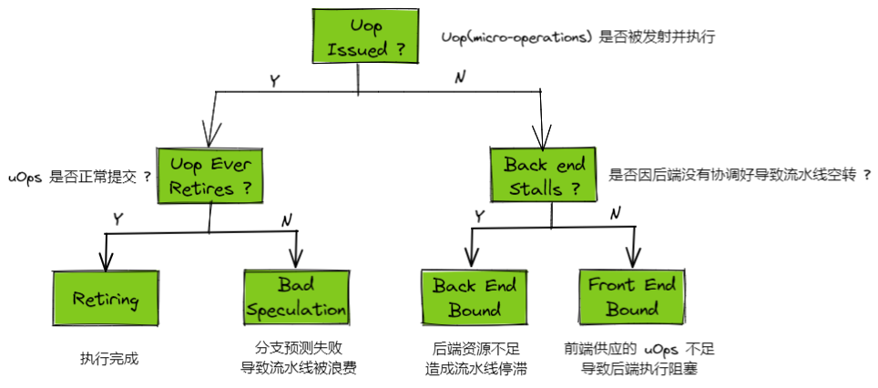

 ---

title: 工具
date: 2021-06-26 09:40
author: gatieme
tags:
    - linux
    - tools
categories:
        - 技术积累
thumbnail:
blogexcerpt: 虚拟化 & KVM 子系统

---

<br>

本作品采用<a rel="license" href="http://creativecommons.org/licenses/by-nc-sa/4.0/">知识共享署名-非商业性使用-相同方式共享 4.0 国际许可协议</a>进行许可, 转载请注明出处, 谢谢合作

<a rel="license" href="http://creativecommons.org/licenses/by-nc-sa/4.0/"></a>

因本人技术水平和知识面有限, 内容如有纰漏或者需要修正的地方, 欢迎大家指正, 鄙人在此谢谢啦

**转载请务必注明出处, 谢谢, 不胜感激**

<br>

| 日期 | 作者 | GitHub| CSDN | BLOG |
| ------- |:-------:|:-------:|:-------:|:-------:|
| 2021-02-15 | [成坚-gatieme](https://kernel.blog.csdn.net) | [`AderXCoding/system/tools/fzf`](https://github.com/gatieme/AderXCoding/tree/master/system/tools/fzf) | [使用模糊搜索神器 FZF 来提升办公体验](https://blog.csdn.net/gatieme/article/details/113828826) | [Using FZF to Improve Productivit](https://oskernellab.com/2021/02/15/2021/0215-0001-Using_FZF_to_Improve_Productivity)|


<br>

# 1 Top-Down 概述
-------

自顶向下的微架构分析方法(Top-Down Microarchitecture)

Intel 的可以从 Intel OTC 的网站下载 [perfmon](https://download.01.org/perfmon), [TMA_Metrics.xlsx](https://download.01.org/perfmon/TMA_Metrics.xlsx)


linux 5.13 之后 ARM64 已经支持通过 metricgroup 的方式进行 TopDown 分析. 首款支持的芯片是海思 hip08 平台. 鲲鹏 920 就属于该平台的产品.

在鲲鹏 920 的服务器上, 通过如下命令即可进行 TopDown 分析.

```cpp
sudo perf stat -M TopDownL1 sleeep 1
```

| 时间  | 作者 | 特性 | 描述 | 是否合入主线 | 链接 |
|:----:|:----:|:---:|:----:|:---------:|:----:|
| 2021/04/07 | John Garry <john.garry@huawei.com> | [perf arm64 metricgroup support](https://patchwork.kernel.org/project/linux-arm-kernel/cover/1617791570-165223-1-git-send-email-john.garry@huawei.com) | perf 支持 HiSilicon hip08 平台的 topdown metric. 支持到 Level 3. 自此鲲鹏 920 的 ARM64 服务器上, 可以使用:<br>`sudo perf stat -M TopDownL1 sleeep 1`<br>来进行 TopDown 分析了. | v1 ☑ 5.13-rc1 | [PatchWork 0/5](https://patchwork.kernel.org/project/linux-arm-kernel/cover/1614784938-27080-1-git-send-email-john.garry@huawei.com)<br>*-*-*-*-*-*-*-* <br>[PatchWork v2,0/6](https://patchwork.kernel.org/project/linux-arm-kernel/cover/1616668398-144648-1-git-send-email-john.garry@huawei.com)<br>*-*-*-*-*-*-*-* <br>[PatchWork v3,0/6](https://patchwork.kernel.org/project/linux-arm-kernel/cover/1617791570-165223-1-git-send-email-john.garry@huawei.com) |


# 2 背景知识解析
-------

## 2.1 流水线
-------

### 2.1.1 流水线的 topdown 划分
-------

| 类型 | 描述 |
|:---:|:----:|
| Front-End/前端   | 负责获取程序代码指令, 并将其解码为一个或者多个微操作(uOps), 这些 uOps 将分配给 Back-End 去执行.<br>Front-end 负责交付 uOps 给 Back-end 执行. Front-end 从 Icache 中提取代码字节流到流水线, 通过分支预测器预测下一个地址以进行提取. 将代码字节分割成指令, 并发送给解码器, 解码器将指令解码到 uOps(mirco-ops), 以便交给 Back-end 执行. |
| Back-end/后端    | 负责监控 uOps 的数据何时可用, 并将其安排到可用的执行单元中执行. |
| Speculation/预测 | 部分跳转指令可能需要对跳转方向和跳转地址进行预测. 通常情况下, 大多数 uOps 都会通过流水线并正常退役, 但是在预测错误的情况下, 投机执行的 uOps 可能会在退役前被取消并从流水线中清楚掉. |
| Retirement/退役  | uOps 执行完成. 这被称为退役 |

### 2.1.2 流水线各个阶段
-------

| 编号 | 过程 | 描述 | 是否乱序 |
|:---:|:---:|:----:|:----:|
| 1 | 取指(fetch)  | 从 Icache 中取出多条指令, 在取指阶段, 除了需要取出多条指令, 同时还需决定下个周期的取指地址, 因此一般会由分支预测器来决定下一条指令的PC, 再从 I-cache 中取指. | In Program Order |
| 2 | 译码(decode) | 识别指令类型、操作数及控制信号, 将指令翻译成一条或者多条硬件可直接处理的 uOps | In Program Order |
| 3 | 寄存器重命名 | 寄存器重命名使得处理器可调度更多指令并行执行, 通过表格存储ARF和PRF的映射关系、未使用的PRF等信息, 分析并标记RAW相关性的指令, 一般会把该步骤单独放一流水段 | In Program Order |
|:---:|:---:|:----:|
| 4 | 分发(dispatch) | 被重命名后的指令顺序写入发射队列、ROB和SB中, 如果没有空间则需要在重命名阶段等待, 分发可和重命名放一个流水段, 也可分开 | In Program Order |
| 5 | 发射(issue) | 仲裁(select)电路从发射队列中选择准备好的最合适的指令送进FU执行, 发射队列中还存在唤醒电路, 将队列中对应的源操作数置为有效, 仲裁电路和唤醒电路配合工作, 是处理器中的关键路径；| In Program Order |
| 6 | 读取寄存器(register read) | 被仲裁电路选中的指令从PRF或旁路网络中得到操作数, 旁路网络的存在使得减少PRF读端口成为可能, 多端口寄存器堆访问速度慢, 需要单独使用一个流水段； | In Program Order |
| 7 | 执行(execute) | 得到操作数后送入对应 FU 中执行, 一般包括负责普通运算、乘累加运算、分支指令运算、load/store指令运算等FU, 现代处理器还会加入负责多媒体运算如进行单指令多数据（SIMD）运算的FU. 一般各个执行单元有各自的 issue queue, 执行 uOps. | Out Of Order |
| 8 | 写回(write back) | 将计算结果顺序写入 PRF, 还需要通过电路网络送出, 该电路布线非常重要直接影响速度, 一般使用cluster结构将FU分组, 同组FU紧挨, 可在一个周期送出, 跨组则需更多周期 | In Program Order |
| 9 | 提交(commit) | ROB 顺序将结果写入 ARF, 同时处理异常, 所有异常均需到达该阶段后再进行处理以实现精确异常, 指令从ROB离开后无法再修改处理器状态. | In Program Order |


## 2.2 uOps 与 Pipeline Slots
-------

| 类型 | 描述 |
|:---:|:----:|
| [uOps](https://www.intel.com/content/www/us/en/develop/documentation/vtune-help/top/reference/cpu-metrics-reference/uops.html) | micro-ops/micro-operations/微指令 是一种底层硬件操作, CPU 前端负责获取体系结构指令中表示的程序代码, 并将其解码为一个或多个 uops. |
| [Pipeline Slots](https://www.intel.com/content/www/us/en/develop/documentation/vtune-help/top/reference/cpu-metrics-reference/pipeline-slots.html) | Pipeline Slot(流水线槽) 代表着一个 uOps 所需的硬件资源. Top-Down 分析方法假定对于每个 CPU 核, 在每个时钟周期, 有多个可用的 Pipeline Slots. 这些 Pipeline Slots 的数量被称为 Pipeline Width. |


### 2.2.1 Pipeline Slots
-------

在下图的示例中, 是用 4-wide(4-way) 的 CPU 将代码执行 10个时钟周期.



在这个示例中, 包含了 40 个 Pipeline Slots(4 * 10) 资源. 如果一个 Pipeline Slot 没有 retire, 则认为有一个 uOp 产生阻塞(Stall).

如下图所示, 有 20 个 slots(红色) 产生阻塞(没有使一个 uOp 达到 Retire). 这表示从该微架构的角度来看, 代码的执行效率只有 50%.



以 Pipeline Slots 为基础资源所观测和统计到的 Top-Down 数据(如 Front-End Bound 和 Back-End Bound 等), 则表示因各种原因(如 Front-End 问题和 Back-End 问题)导致的 Pipeline Slots 阻塞占总体的百分比.

### 2.2.2 为什么以 Pipeline Slots 为粒度统计
-------

我们统计 top-down 数据是以 Pipeline Slots 为基准的, 而没有采用 cycle(Clockticks) 作为基准. 理论上将我们统计每个周期内阻塞的占比岂不是更有意义 ?

我们同样用一个示例来看下这个疑问 ?



在这里, 每个周期有两个 Pipeline Slots 被阻塞, 也就是 50% 的 Stalls 和 50% 的 Retiring. 如果使用 Clockticks 而言, 却认为是 100% 的 Stalls, 因为每个周期(cycle)都有一些 Pipeline Slots 被占用.

可见, 与以 Pipeline Slots 测量的指标相比, 以 Clockticks 测量的指标不太精确. 但是, 此类指标对于识别代码中的主要性能瓶颈仍然很有用.


# 3 topdown 模型层级划分
-------


| 类型 | 描述 |
|:---:|:----:|
| Front-End Bound/前端阻塞 | 表示 pileline 不足以供应 Back-end. 也就是说当 Back-end 准备接收 uOps 时, Pipeline Slots 出现了 stall. Front-End Bound 可以进一步分为:<br>1. Fetch Latency Bound: 无法从 Icache 获取指令导致的阻塞, 如 icache/itlb miss 以及 branch resteers(sp flush) 等<br>2. Fetch Bandwidth Bound: 指令的传输带宽不足, 有多余的指令等待接收, 如 sub-optimal decoding. |
| Back-end Bound/后端阻塞  | 表示由于缺乏 uOps 执行所需的后端资源造成的停顿. 它可以进一步细分为:<br>1. Memory Bound: 由于 cache 以及 memory 子系统无法及时提供(准备好) uOps 执行所需数据造成的停顿卡顿.<br>2. Core Bound: 执行单元压力 Compute Bound 或者去缺少指令集并行 LTP. 一般意味着计算单元或者指令级别并行度的缺失, 大量指令长期使用相同的计算单元<br>3. Resource Bound: OOO(Out Of Order) 阶段的阻塞, 比如物理寄存器(PRF)或者 ROB 不足. |
| Bad Speculation/投机错误 | 由于分支预测错误导致的 Pipeline Slot 被浪费. 主要包括 Front-End 最终被取消的 uOps 的 pipeline Slots, 以及 Back End 过程中由于从先前错误的猜测中恢复而阻塞造成的 Pipeline Slot. |
| Retring/正常执行  | 表示运行有效的 PileSlots. |

理想情况下, 我们希望所有看到的 Pileline Slot 都归类到 Retring. 因为他与 IPC 息息相关.

在每个 CPU 周期中, pipeline slot 可以是空的或者被 uOp 填充. 如果在一个 CPU 周期内某个 pipeline slot 是空的, 称之为一次停顿(stall). 如果 CPU 经常停顿, 系统性能肯定是受到影响的. TMAM 的目标就是确定系统性能问题的主要瓶颈.



*   如果一个 Pipeline Slot 被某个 uOps 占用, 它将被分类到 Retring 或者 Bad Speculation, 具体取决于他是否被提交(commit).

*   如果 Pipeline 中某个 Back-end 阶段 Pipeline Slot 都被占用, 导致后续流程无法接受更多的操作. 则未被利用的 Pileline Slot 就被归类为 Back-end Bound.

*   同样出现 Front-End Bound 则表示在没有 Back-end Stall 的情况下, 没有更多的 uOps 被分配(allocate)给 Back-end(后端)去处理.

在目前比较常见的 Intel X86_64 的微架构实现上, 流水线的 Front-end 每个 cycle 可以分配 4 个 uOps, 同样 Back-end 也可以在每个 cycle 中退役 4 个 uOps.

于是 TMAM 假定对于每个 CPU 核, 在每个 cycle, 均有 4 个 Pipeline Slot 可用, 然后使用一些自定义的 PMU 事件来测量这些 pipeline slot 的使用情况.

>但是请注意:
>
>通常来说 CPU 每个 cycles 最多可以处理 4 个 uOps, 用 topdown 简单的表示为每个 cycles 最多有 N 个 Pipeline Slots 可用,
>但是通常这并简简单单是 CPU 某个阶段(fetch/dispatch/issue/execute)的处理能力, 而是指整个流水线整体的最小处理能力.
>类比知乎上经典问题 [如何判断CPU发射宽度?](https://www.zhihu.com/question/46516134).

## 3.1 Front-End Bound/前端阻塞
-------

| 层级 | 名称 | 描述 | 公式 |
|:---:|:----:|:---:|:---:|
| Level 1 | [Frontend Bound](https://elixir.bootlin.com/linux/v5.13/source/tools/perf/pmu-events/arch/arm64/hisilicon/hip08/metrics.json#L7) | 由于前端生成 uOps 给后端来执行. 通常包含从 icache 中取出指令, 并交给解码器解码出 uOps 给后端处理单元. 此外如果遇到分支指令可以能还需要通过分支预测器进行投机.<br>造成前阻塞的原因一般分为 |FETCH_BUBBLE / (4 * CPU_CYCLES) |
| Level 2 | [Fetch latency bound](https://elixir.bootlin.com/linux/v5.13/source/tools/perf/pmu-events/arch/arm64/hisilicon/hip08/metrics.json#L33) | 预取延迟过长, 一般是指无法从 Icache 中取到足够的指令而导致的流水线前端阻塞.<br>引起预取延迟的原因可能有:<br>itlb miss, icache miss 以及 pipeline flush 等. | armv8_pmuv3_0@event\\=0x201d@ / CPU_CYCLES |
| Level 3 | [idle_by_itlb_miss](https://elixir.bootlin.com/linux/v5.13/source/tools/perf/pmu-events/arch/arm64/hisilicon/hip08/metrics.json#L77) | 因为 TLB Miss 导致的前端流水线停顿. | (((L2I_TLB - L2I_TLB_REFILL) * 15) + (L2I_TLB_REFILL * 100)) / CPU_CYCLES |
| Level 3 | [idle_by_icache_miss](https://elixir.bootlin.com/linux/v5.13/source/tools/perf/pmu-events/arch/arm64/hisilicon/hip08/metrics.json#L84) | 因为 Icache Miss 导致的前端流水线停顿. | (((L2I_CACHE - L2I_CACHE_REFILL) * 15) + (L2I_CACHE_REFILL * 100)) / CPU_CYCLES |
| Level 2 | [Fetch bandwidth bound](https://elixir.bootlin.com/linux/v5.13/source/tools/perf/pmu-events/arch/arm64/hisilicon/hip08/metrics.json#L42) | frontend_bound - fetch_latency_bound | 指令译码过慢, 译码单元是有限的, 当指令预取完毕后, 必须等之前的指令译码完成, 译码器空闲之后, 才能继续进行译码操作. 否则预取的指令只能等待, 因此造成了流水线阻塞. | frontend_bound - fetch_latency_bound |


| 事件 | 编号 | 描述 |
|:---:|:---:|:---:|
| FETCH_BUBBLE | 0x2014 | 在后端仍有足够的资源(没有 Stall)的情况下, 前端出现 Stall 的次数. |

## 3.2 Back-end Bound/后端阻塞
-------

| 层级 | 名称 | 描述 | 公式 |
|:---:|:----:|:---:|:---:|
| Level 1 | [Backend Bound](https://elixir.bootlin.com/linux/v5.13/source/tools/perf/pmu-events/arch/arm64/hisilicon/hip08/metrics.json#L28) | 由于后端资源不足造成的流水线停顿的比率. | 1 - (frontend_bound + bad_speculation + retiring) |
| Level 2 | [Resource bound](https://elixir.bootlin.com/linux/v5.13/source/tools/perf/pmu-events/arch/arm64/hisilicon/hip08/metrics.json#L70) | NA | RESOURE_BOUND / CPU_CYCLES |
| Level 3 | [Sync stall](https://elixir.bootlin.com/linux/v5.13/source/tools/perf/pmu-events/arch/arm64/hisilicon/hip08/metrics.json#L154) | NA | armv8_pmuv3_0@event\\=0x2010@ / CPU_CYCLES |
| Level 3 | [Rob stall](https://elixir.bootlin.com/linux/v5.13/source/tools/perf/pmu-events/arch/arm64/hisilicon/hip08/metrics.json#L161) | NA | armv8_pmuv3_0@event\\=0x2004@ / CPU_CYCLES |
| Level 3 | [Ptag stall](https://elixir.bootlin.com/linux/v5.13/source/tools/perf/pmu-events/arch/arm64/hisilicon/hip08/metrics.json#L168) | NA | (armv8_pmuv3_0@event\\=0x2006@ + armv8_pmuv3_0@event\\=0x2007@ + armv8_pmuv3_0@event\\=0x2008@) / CPU_CYCLES |
| Level 3 | [SaveOpQ](https://elixir.bootlin.com/linux/v5.13/source/tools/perf/pmu-events/arch/arm64/hisilicon/hip08/metrics.json#L175) | NA | armv8_pmuv3_0@event\\=0x201e@ / CPU_CYCLES |
| Level 3 | [PC buffer stall](https://elixir.bootlin.com/linux/v5.13/source/tools/perf/pmu-events/arch/arm64/hisilicon/hip08/metrics.json#L182) | NA | armv8_pmuv3_0@event\\=0x2005@ / CPU_CYCLES |
| Level 2 | [Core bound](https://elixir.bootlin.com/linux/v5.13/source/tools/perf/pmu-events/arch/arm64/hisilicon/hip08/metrics.json#L63) | 意味着计算单元不足或者程序指令级别缺乏并行度(流水线中计算单元不能被充分利用). 表明程序这段时间以来大量指令或者长期使用了相同的计算单元.<br>可以进一步细分为 Divider、 FSU stall 和 EXE ports util 等. | (EXE_STALL_CYCLE - (MEM_STALL_ANYLOAD + armv8_pmuv3_0@event\\=0x7005@)) / CPU_CYCLES |
| Level 3 | [Divider](https://elixir.bootlin.com/linux/v5.13/source/tools/perf/pmu-events/arch/arm64/hisilicon/hip08/metrics.json#L189) | NA | armv8_pmuv3_0@event\\=0x7002@ / CPU_CYCLES |
| Level 3 | [FSU stall](https://elixir.bootlin.com/linux/v5.13/source/tools/perf/pmu-events/arch/arm64/hisilicon/hip08/metrics.json#L196) | NA | armv8_pmuv3_0@event\\=0x7003@ / CPU_CYCLES |
| Level 3 | [EXE ports util](https://elixir.bootlin.com/linux/v5.13/source/tools/perf/pmu-events/arch/arm64/hisilicon/hip08/metrics.json#L203) | NA | core_bound - divider - fsu_stall |
| Level 2 | [Memory bound](https://elixir.bootlin.com/linux/v5.13/source/tools/perf/pmu-events/arch/arm64/hisilicon/hip08/metrics.json#L70) | 访存等待. 通常是因为存储子系统没法及时提供指令运行的所需的数据而造成的流水线阻塞. | (MEM_STALL_ANYLOAD + armv8_pmuv3_0@event\\=0x7005@) / CPU_CYCLES |
| Level 3 | [L1 bound](https://elixir.bootlin.com/linux/v5.13/source/tools/perf/pmu-events/arch/arm64/hisilicon/hip08/metrics.json#L210) | NA | (MEM_STALL_ANYLOAD - MEM_STALL_L1MISS) / CPU_CYCLES |
| Level 3 | [L2 bound](https://elixir.bootlin.com/linux/v5.13/source/tools/perf/pmu-events/arch/arm64/hisilicon/hip08/metrics.json#L217) | NA | (MEM_STALL_L1MISS - MEM_STALL_L2MISS) / CPU_CYCLES |
| Level 3 | [Mem bound L3](https://elixir.bootlin.com/linux/v5.13/source/tools/perf/pmu-events/arch/arm64/hisilicon/hip08/metrics.json#L224) | NA | MEM_STALL_L2MISS / CPU_CYCLES |
| Level 3 | [Store bound L3](https://elixir.bootlin.com/linux/v5.13/source/tools/perf/pmu-events/arch/arm64/hisilicon/hip08/metrics.json#L231) | NA | armv8_pmuv3_0@event\\=0x7005@ / CPU_CYCLES |


## 3.3 Bad Speculation/投机错误
-------

| 层级 | 名称 | 描述 | 公式 |
|:---:|:----:|:---:|:---:|
| Level 1 | [Bad Speculation](https://elixir.bootlin.com/linux/v5.13/source/tools/perf/pmu-events/arch/arm64/hisilicon/hip08/metrics.json#L10) | 表示由于预测错误而浪费掉的 pipeline slots 的占比. 主要包括:<br>1. 触发了 Machine Clear 而浪费了 pipeline slots.<br>2. 分支预测错误(Branch Mispredict) 而浪费的 pipeline slots. | (INST_SPEC - INST_RETIRED) / (4 * CPU_CYCLES).<br>1. INST_SPEC: CPU 执行的指令的数目.<br>2. INST_RETIRED: CPU 执行的指令中正常退休的指令的数目. |
| Level 2 | [Branch Mispredict](https://elixir.bootlin.com/linux/v5.13/source/tools/perf/pmu-events/arch/arm64/hisilicon/hip08/metrics.json#L49) | 当 CPU 遇到分支指令的时候, 为避免 pipeline stalls, 会进行投机执行. CPU 对分支指令的跳转方向和跳转目的地址进行预测, 然后投机执行预测出的路径, 对预测的分支进行取指和执行,  所有处于流水线中的这些分支预测路径上的指令都其实处于推测(speculative)状态, 但是并不是进行提交. 然后在流水线的后续阶段, 比如分支指令实际执行时, 会对之前分支预测的结果进行校验, 一旦发现预测失败, 则必须丢弃这个预测错误的分支上所有的指令及其执行结果, 并对流水线各部件的状态进行恢复. 最终重新从正确的分支进行取指. 这必然造成流水线资源的浪费. | (bad_speculation * BR_MIS_PRED) / (BR_MIS_PRED + armv8_pmuv3_0@event\\=0x2013@) |
| Level 3 | [BP misp flush](https://elixir.bootlin.com/linux/v5.13/source/tools/perf/pmu-events/arch/arm64/hisilicon/hip08/metrics.json#L91) | 错误的预测 | (BR_MIS_PRED * 5) / CPU_CYCLES |
| Level 3 | [Static predictor flush](https://elixir.bootlin.com/linux/v5.13/source/tools/perf/pmu-events/arch/arm64/hisilicon/hip08/metrics.json#L105) | NA | (armv8_pmuv3_0@event\\=0x1001@ * 5) / CPU_CYCLES |
| Level 3 | [Indirect Branch](https://elixir.bootlin.com/linux/v5.13/source/tools/perf/pmu-events/arch/arm64/hisilicon/hip08/metrics.json#L112) | 间接跳转 | armv8_pmuv3_0@event\\=0x1010@ / BR_MIS_PRED |
| Level 3 | [Push Branch](https://elixir.bootlin.com/linux/v5.13/source/tools/perf/pmu-events/arch/arm64/hisilicon/hip08/metrics.json#L119) | 函数调用. 比如 BL/BLR 等. | (armv8_pmuv3_0@event\\=0x1014@ + armv8_pmuv3_0@event\\=0x1018@) / BR_MIS_PRED |
| Level 3 | [Pop Branch](https://elixir.bootlin.com/linux/v5.13/source/tools/perf/pmu-events/arch/arm64/hisilicon/hip08/metrics.json#L126) | 有返回值的跳转. 如函数返回等. | armv8_pmuv3_0@event\\=0x100c@ / BR_MIS_PRED |
| Level 3 | [Other Branch](https://elixir.bootlin.com/linux/v5.13/source/tools/perf/pmu-events/arch/arm64/hisilicon/hip08/metrics.json#L133) | 其他的跳转类型. | (BR_MIS_PRED - armv8_pmuv3_0@event\\=0x1010@ - armv8_pmuv3_0@event\\=0x1014@ - armv8_pmuv3_0@event\\=0x1018@ - armv8_pmuv3_0@event\\=0x100c@) / BR_MIS_PRED |
| Level 3 | [Nuke flush](https://elixir.bootlin.com/linux/v5.13/source/tools/perf/pmu-events/arch/arm64/hisilicon/hip08/metrics.json#L140) | NA | NA |
| Level 2 | [Machine Clears](https://elixir.bootlin.com/linux/v5.13/source/tools/perf/pmu-events/arch/arm64/hisilicon/hip08/metrics.json#L56) | 当 CPU 检测到某些条件时, 便会触发 Machine Clears 操作, 清除流水线上的指令, 以保证 CPU 的合理正确运行. 比如<br>1. 发生错误的 Memory 访问顺序(memory ordering violations);<br>2. 自修改代码(self-modifying code);<br>3. 访问非法地址空间(load illegal address ranges) | bad_speculation - branch_mispredicts |
| Level 3 | [OOO flush](https://elixir.bootlin.com/linux/v5.13/source/tools/perf/pmu-events/arch/arm64/hisilicon/hip08/metrics.json#L98) | Machine Clears 导致的流水线冲刷. | (armv8_pmuv3_0@event\\=0x2013@ * 5) / CPU_CYCLES |
| Level 3 | [Other flush](https://elixir.bootlin.com/linux/v5.13/source/tools/perf/pmu-events/arch/arm64/hisilicon/hip08/metrics.json#L147) | NA | NA |

其中

| 事件 | 编号 | 描述 |
|:---:|:---:|:---:|
| BR_MIS_PRED | 0x0010 | 分支预测失败的次数 |
| OOO_FLUSH | 0x2013 | Machine Clears 发生的次数 |
| INDIRECT_BR | 0x1010 | 间接跳转发生的次数 |
| BL | 0x1014 | 预测失败的指令中 BL 发生的次数 |
| BLR | 0x1018 | 预测失败的指令中 BLR 发生的次数 |


## 3.4 Retring/正常执行
-------

| 编号 | 描述 | 公式 |
|:---:|:----:|:---:|
| Level 1 | [Retring](https://elixir.bootlin.com/linux/v5.13/source/tools/perf/pmu-events/arch/arm64/hisilicon/hip08/metrics.json#L17) | retired 的 uOps 数量占所有 pipeline slots 的比重, 理想情况下, 我们希望看到所有的 pipeline slots 都能归属于 Retiring, 因为它与 IPC 相关. | INST_RETIRED / (4 * CPU_CYCLES) |


# 1 参考资料
-------

| 编号 | 链接 | 描述 |
|:---:|:----:|:---:|
| 1 | [A Journey Through the CPU Pipeline](https://bryanwagstaff.com/index.php/a-journey-through-the-cpu-pipeline/) | 讲述了 CPU 流水线的前世今生(不断演进和完善), [翻译版本](https://kb.cnblogs.com/page/179578) |
| 2 | [Top-down Microarchitecture Analysis Method](https://www.intel.com/content/www/us/en/develop/documentation/vtune-cookbook/top/methodologies/top-down-microarchitecture-analysis-method.html) | NA |
| 3 | [A Top-Down method for performance analysis and counters architecture](https://www.researchgate.net/publication/269302126_A_Top-Down_method_for_performance_analysis_and_counters_architecture) | Intel 关于 topdown 分析方法的论文, 以及 [slide](https://pdfs.semanticscholar.org/b5e0/1ab1baa6640a39edfa06d556fabd882cdf64.pdf) |
| 4 | [Intel P4 CPU](https://www.cnblogs.com/linhaostudy/p/9204107.html) | NA |
| 5 | [The Berkeley Out-of-Order Machine (BOOM)](https://docs.boom-core.org/en/latest/sections/intro-overview/boom.html) | NA |
| 6 | [Top-down Microarchitecture Analysis through Linux perf and toplev tools](http://www.cs.technion.ac.il/~erangi/TMA_using_Linux_perf__Ahmad_Yasin.pdf) | NA |
| 7 | [让CPU黑盒不再黑——【TMA_自顶向下的CPU架构性能瓶颈分析方法](https://www.zhihu.com/column/CArch)<br>[1. What & Why](https://zhuanlan.zhihu.com/p/60569271)<br>[2. How](https://zhuanlan.zhihu.com/p/60940902)<br>[3. Frontend](https://zhuanlan.zhihu.com/p/61015720)<br>[4. Speculation](https://zhuanlan.zhihu.com/p/64529137)<br>[5. Retiring](https://zhuanlan.zhihu.com/p/64576459) | NA |
| 8 | [几句话说清楚13：什么是Top-Down性能分析方法](https://decodezp.github.io/2019/01/27/quickwords13-tma) | NA |
| 9 | [Top-down性能分析模型](https://zhuanlan.zhihu.com/p/34688930) | NA |
| 10 | [CPU最高性能预估之“理论最大IPC”](https://zhuanlan.zhihu.com/p/364661188) | NA |

<br>

*   本作品/博文 ( [AderStep-紫夜阑珊-青伶巷草 Copyright ©2013-2017](http://blog.csdn.net/gatieme) ), 由 [成坚(gatieme)](http://blog.csdn.net/gatieme) 创作.

*   采用<a rel="license" href="http://creativecommons.org/licenses/by-nc-sa/4.0/"></a><a rel="license" href="http://creativecommons.org/licenses/by-nc-sa/4.0/">知识共享署名-非商业性使用-相同方式共享 4.0 国际许可协议</a>进行许可. 欢迎转载、使用、重新发布, 但务必保留文章署名[成坚gatieme](http://blog.csdn.net/gatieme) ( 包含链接: http://blog.csdn.net/gatieme ), 不得用于商业目的.

*   基于本文修改后的作品务必以相同的许可发布. 如有任何疑问, 请与我联系.

*   **转载请务必注明出处, 谢谢, 不胜感激**
<br>
