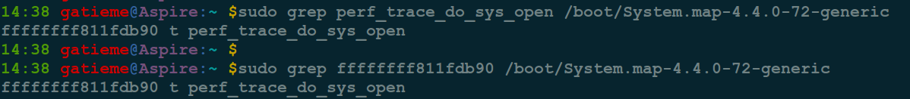
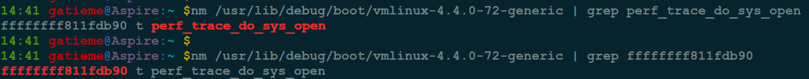
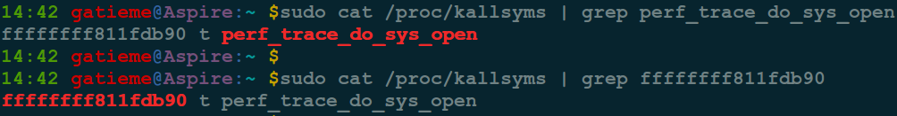

获得内核函数地址的四种方法
=======

| CSDN | GitHub |
|:----:|:------:|
| [获得内核函数地址的四种方法](http://blog.csdn.net/gatieme) | [`LinuxDeviceDrivers/study/debug/filesystem/procfs/func_addr`](https://github.com/gatieme/LinuxDeviceDrivers/tree/master/study/debug/filesystem/procfs/func_addr) |

<br>

<a rel="license" href="http://creativecommons.org/licenses/by-nc-sa/4.0/"></a>

本作品采用<a rel="license" href="http://creativecommons.org/licenses/by-nc-sa/4.0/">知识共享署名-非商业性使用-相同方式共享 4.0 国际许可协议</a>进行许可, 转载请注明出处, 谢谢合作

因本人技术水平和知识面有限, 内容如有纰漏或者需要修正的地方, 欢迎大家指正, 也欢迎大家提供一些其他好的调试工具以供收录, 鄙人在此谢谢啦

<br>

本文以获取内核函数 sys_open()的地址为例。


#1	从 System.map 文件中直接得到地址
-------

内核镜像的 `System.map` 文件存储了内核符号表的信息, 可以通过此文件获取到具体的信息

查看内核函数的地址

```cpp
grep perf_trace_do_sys_open /boot/System.map-4.4.0-72-generic
```

查看地址对应哪个内核函数

```cpp
grep ffffffff811fdb90 /boot/System.map-4.4.0-72-generic
```



#2	使用 nm 命令读取 vmlinux 的信息
-------

```cpp
nm /usr/lib/debug/boot/vmlinux-4.4.0-72-generic | grep perf_trace_do_sys_open

nm /usr/lib/debug/boot/vmlinux-4.4.0-72-generic | grep ffffffff811fdb90
```




#3	从 /proc/kallsyms 文件获得地址
-------

```cpp
cat /proc/kallsyms | grep perf_trace_do_sys_open

cat /proc/kallsyms | grep ffffffff811fdb90
```



#4	使用内核函数接口
-------

*	已知内核符号，获取内核符号地址

使用 `kallsyms_lookup_name( )`

该函数在 `kernel/kallsyms.c` 文件中定义的, 要使用它必须启用 `CONFIG_KALLSYMS` 编译内核.

`kallsyms_lookup_name( )` 接受一个字符串格式内核函数名, 返回那个内核函数的地址.


```cpp
kallsyms_lookup_name("函数名");
```

*	已知内核符号地址, 获取内核符号名

使用 `sprint_symbol` 内核函数

```cpp
#include <linux/kallsyms.h>

int sprint_symbol(char *buffer, unsigned long address)
```

函数功能描述 :

该函数根据一个内存中的地址 `address` 查找一个内核符号, 并将该符号的基本信息, 如符号名 `name`, 它在内核符号表中的偏移 `offset` 和大小 `size`, 所属的模块名(如果有的话)等信息连接成字符串赋值给文本缓冲区 `buffer`. 其中所查找的内核符号可以是原本就存在于内核中的符号, 也可以是位于动态插入的模块中的符号.

输入参数说明


| 参数 | 说明 |
|:---:|:----:|
| buffer | 文本缓冲区， 它用来记录内核符号的信息， 它是一个输出型参数 |
| address | 内核符号中的某一地址， 为输入型参数 |


返回参数说明

返回值是一个 `int` 型， 它表示内核符号基本信息串的长度， 也即是 `buffer` 所表示的字符串的长度.


*	本作品/博文 ( [AderStep-紫夜阑珊-青伶巷草 Copyright ©2013-2017](http://blog.csdn.net/gatieme) ), 由 [成坚(gatieme)](http://blog.csdn.net/gatieme) 创作, 

*	采用<a rel="license" href="http://creativecommons.org/licenses/by-nc-sa/4.0/"></a><a rel="license" href="http://creativecommons.org/licenses/by-nc-sa/4.0/">知识共享署名-非商业性使用-相同方式共享 4.0 国际许可协议</a>进行许可. 欢迎转载、使用、重新发布, 但务必保留文章署名[成坚gatieme](http://blog.csdn.net/gatieme) ( 包含链接: http://blog.csdn.net/gatieme ), 不得用于商业目的.

*	基于本文修改后的作品务必以相同的许可发布. 如有任何疑问，请与我联系.