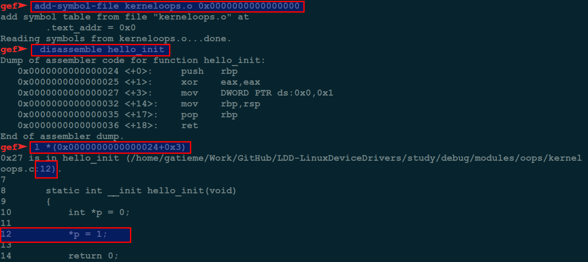
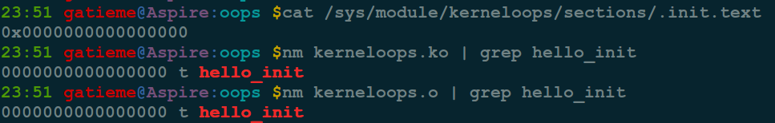
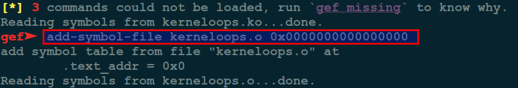
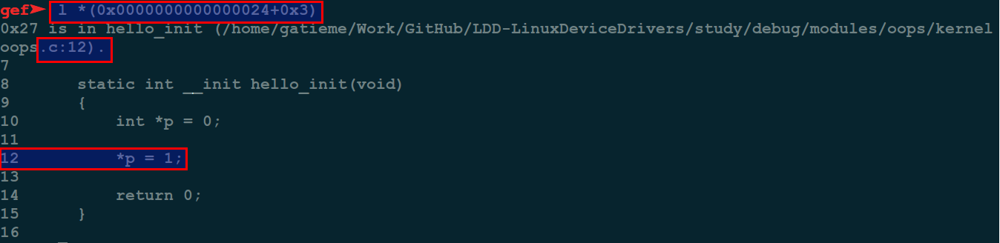

Linux内核oops调试
=======

| CSDN | GitHub |
|:----:|:------:|
| [Aderstep--紫夜阑珊-青伶巷草](http://blog.csdn.net/gatieme) | [`AderXCoding/system/tools`](https://github.com/gatieme/AderXCoding/tree/master/system/tools) |


<br>
<a rel="license" href="http://creativecommons.org/licenses/by-nc-sa/4.0/"></a>
本作品采用<a rel="license" href="http://creativecommons.org/licenses/by-nc-sa/4.0/">知识共享署名-非商业性使用-相同方式共享 4.0 国际许可协议</a>进行许可, 转载请注明出处
<br>

#1	Kernel PANIC/OOPS
-------


>wiki:A kernel panic is an action taken by an operating system upon detecting an internal fatal error from which it cannot safely recover. The term is largely specific to Unix and Unix-like systems; for Microsoft Windowsoperating systems the equivalent term is “Bug check” (or, colloquially, “Blue Screen of Death“).
The kernel routines that handle panics (in AT&T-derived and BSD Unix source code, a routine known as panic()) are generally designed to output an error message to the console, dump an image of kernel memory to disk for post-mortemdebugging and then either wait for the system to be manually rebooted, or initiate an automatic reboot. The information provided is of highly technical nature and aims to assist a system administrator or software developer in diagnosing the problem.
Attempts by the operating system to read an invalid or non-permitted memory address are a common source of kernel panics. A panic may also occur as a result of a hardware failure or a bug in the operating system. In many cases, the operating system could continue operation after memory violations have occurred. However, the system is in an unstable state and rather than risking security breaches and data corruption, the operating system stops to prevent further damage and facilitate diagnosis of the error.
          The kernel panic was introduced in an early version of Unix and demonstrated a major difference between the design philosophies of Unix and its predecessor Multics. Multics developer Tom van Vleck recalls a discussion of this change with Unix developer Dennis Ritchie:
I remarked to Dennis that easily half the code I was writing in Multics was error recovery code. He said, “We left all that stuff out. If there’s an error, we have this routine called panic, and when it is called, the machine crashes, and you holler down the hall, ‘Hey, reboot it.’”[1]
The original panic() function was essentially unchanged from Fifth Edition UNIX to the VAX-based UNIX 32V and output only an error message with no other information, then dropped the system into an endless idle loop. As the Unixcodebase was enhanced, the panic() function was also enhanced to dump various forms of debugging information to the console.

##1.1 什么是 `Kernel PANIC`
-------

`panic` 是英文中是**惊慌**的意思, `Linux Kernel panic` 正如其名, `Linux Kernel` 不知道如何走了, 它会尽可能把它此时能获取的全部信息都打印出来, 为开发人员调试提供帮助.

有两种主要类型 `Kernel panic`

*	Hard Panic(也就是Aieee信息输出)

*	Soft Panic(也就是Oops信息输出)

##1.2	什么会导致Linux Kernel Panic
-------

只有加载到内核空间的驱动模块才能直接导致 `kernel panic`, 你可以在系统正常的情况下, 使用 `lsmod` 查看当前系统加载了哪些模块. 除此之外, 内建在内核里的组件(比如 `memory map`等)也能导致panic.

常见Linux Kernel Panic报错内容

```CPP
Kernel panic-not syncing fatal exception in interrupt
kernel panic – not syncing: Attempted to kill the idle task!
kernel panic – not syncing: killing interrupt handler!
Kernel Panic – not syncing：Attempted to kill init !
```


一般出现下面的情况，就认为是发生了 `kernel panic` :

*	机器彻底被锁定，不能使用

*	数字键(Num Lock)，大写锁定键(Caps Lock)，滚动锁定键(Scroll Lock)不停闪烁。

*	如果在终端下，应该可以看到内核dump出来的信息（包括一段"Aieee"信息或者"Oops"信息）

*	和Windows蓝屏相似


>因为 `hard panic` 和 `soft panic` 本质上不同，因此我们分别讨论.

#2	hard panic
-------

对于 `hard panic` 而言, 最大的可能性是驱动模块的中断处理(`interrupt handler`)导致的, 一般是因为驱动模块在中断处理程序中访问一个空指针(`null pointer`).

一旦发生这种情况，驱动模块就无法处理新的中断请求，最终导致系统崩溃.

##2.1	原因
-------

对于 `hard panic` 而言，最大的可能性是驱动模块的中断处理(`interrupt handler`)导致的，一般是因为驱动模块在中断处理程序中访问一个空指针(`null pointre`).

一旦发生这种情况, 驱动模块就无法处理新的中断请求, 最终导致系统崩溃.

##2.2	信息收集
-------

根据 `panic` 的状态不同, 内核将记录所有在系统锁定之前的信息. 因为 `kenrel panic` 是一种很严重的错误, 不能确定系统能记录多少信息, 下面是一些需要收集的关键信息, 他们非常重要，因此尽可能收集全，当然如果系统启动的时候就kernel panic，那就无法只知道能收集到多少有用的信息了。


1.	`/var/log/messages`, 幸运的时候, 整个 `kernel panic` 栈跟踪信息都能记录在这里. 要确认是否有一个足够的栈跟踪信息，你只要查找包含"EIP"的一行, 它显示了是什么函数和模块调用时导致`panic`.

2.	应用程序/库 日志: 可能可以从这些日志信息里能看到发生 `panic` 之前发生了什么。

3.	其他发生 `panic` 之前的信息, 或者知道如何重现panic那一刻的状态

4.	终端屏幕 `dump`信息, 一般 `OS`被锁定后, 复制, 粘贴肯定是没戏了, 因此这类信息, 你可以需要借助数码相机或者原始的纸笔工具了.

如果 `kernel dump` 信息既没有在 `/var/log/message` 里, 也没有在屏幕上, 那么尝试下面的方法来获取(当然是在还没有死机的情况下).

1.	如果在图形界面，切换到终端界面，dump信息是不会出现在图形界面的，甚至都不会在图形模式下的虚拟终端里.

2.	确保屏幕不黑屏，可以使用下面的几个方法：

    ```cpp
    setterm -blank 0
    setterm -powerdown 0
    setvesablank off
    ```
3.	从终端，拷贝屏幕信息

##2.3	排查方法
-------
栈跟踪信息(`stack trace`)是排查 `kernel panic` 最重要的信息, 该信息如果在/var/log/messages日志里当然最好，因为可以看到全部的信息，如果仅仅只是在屏幕上，那么最上面的信息可能因为滚屏消失了，只剩下栈跟踪信息的一部分。如果你有一个完整栈跟踪信息的话，那么就可能根据这些充分的信息来定位panic的根本原因。要确认是否有一个足够的栈跟踪信息，你只要查找包含”EIP”的一行，它显示了是什么函数和模块调用时导致panic


使用内核调试工具(`kenrel debugger ,aka KDB`)
如果跟踪信息只有一部分且不足以用来定位问题的根本原因时, `kernel debugger(KDB)`就需要请出来了。

KDB编译到内核里，panic发生时，他将内核引导到一个shell环境而不是锁定。这样，我们就可以收集一些与panic相关的信息了，这对我们定位问题的根本原因有很大的帮助。

#3	PANIC实例分析
-------

##3.1 实例1--Kernel panic-not syncing fatal exception
-------

###3.1.1 问题描述
-------

今天就遇到一个客户机器内核报错 : "Kernel panic-not syncing fatal exception"

重启后正常, 几个小时后出现同样报错，系统down了，有时重启后可恢复有时重启后仍然报同样的错误。

我先来解释一下什么是fatal exception?
“致命异常（fatal exception）表示一种例外情况，这种情况要求导致其发生的程序关闭。通常，异常（exception）可能是任何意想不到的情况（它不仅仅包括程序错误）。致命异常简单地说就是异常不能被妥善处理以至于程序不能继续运行。
软件应用程序通过几个不同的代码层与操作系统及其他应用程序相联系。当异常（exception）在某个代码层发生时，为了查找所有异常处理的代码，各个代码层都会将这个异常发送给下一层，这样就能够处理这种异常。如果在所有层都没有这种异常处理的代码，致命异常（fatal exception）错误信息就会由操作系统显示出来。这个信息可能还包含一些关于该致命异常错误发生位置的秘密信息（比如在程序存储范围中的十六进制的位置）。这些额外的信息对用户而言没有什么价值，但是可以帮助技术支持人员或开发人员调试程序。
当致命异常（fatal exception）发生时，操作系统没有其他的求助方式只能关闭应用程序，并且在有些情况下是关闭操作系统本身。当使用一种特殊的应用程序时，如果反复出现致命异常错误的话，应将这个问题报告给软件供应商。 ”
而且此时键盘无任何反应，必然使用reset键硬重启。
panic.c源文件有个方法，当panic挂起后，指定超时时间，可以重新启动机器

###3.1.2 解决方法
-------


>`vi /etc/sysctl.conf`  添加

```cpp
kernel.panic = 20 #panic error中自动重启，等待timeout为20秒
kernel.sysrq=1 #激活Magic SysRq  否则，键盘鼠标没有响应
```

按住 `[ALT]+[SysRq]+[COMMAND]`, 这里 SysRq` 是 `Print SCR` 键, 而 `COMMAND` 按以下来解释！

| 命令 | 描述 |
|:---:|:---:|
| b |立即重启
| e | 发送SIGTERM给init之外的系统进程 |
| o | 关机 |
| s | sync同步所有的文件系统 |
| u | 试图重新挂载文件系统 |

##3.2	示例2--Kernel panic-not syncing fatal exception in interrupt
-------

###3.2.1 问题描述
-------

很多网友安装 `Linux` 出现 `Kernel panic-not syncing fatal exception in interrupt` 是由于网卡驱动原因。

###3.2.2 解决方法
-------


将 `BIOS`选项 `"Onboard Lan"` 的选项 `"Disabled"`, 重启从光驱启动即可.

等安装完系统之后, 再进入 `BIOS` 将 "Onboard Lan" 的选项给 `"enable"`, 下载相应的网卡驱动安装。

如出现以下报错 :

```CPP
init() r8168 … 
          … …
         … ：Kernel panic: Fatal exception
```

`r8168` 是网卡型号.

在 `BIOS` 中禁用网卡, 从光驱启动安装系统. 再从网上下载网卡驱动安装.

```cpp
#tar  vjxf  r8168-8.014.00.tar.bz2
# make  clean  modules       (as root or with sudo)
      # make  install
      # depmod  -a
      # modprobe  r8168
```

安装好系统后 `reboot` 进入 `BIOS` 把网卡打开.

另有网友在 `Kernel panic` 出错信息中看到 `"alc880"`, 这是个声卡类型. 尝试着将声卡关闭, 重启系统, 搞定.


##3.3	示例3--Kernel panic-not syncing fatal exception
-------

###3.3.1	问题描述
-------


安装 `linux` 系统遇到安装完成之后， 无法启动系统出现 `Kernel panic-not syncing fatal exception`.

###3.3.2 解决方法
-------


很多情况是由于板载声卡、网卡、或是cpu 超线程功能 (`Hyper-Threading`) 引起的.


这类问题的解决办法就是先查看错误代码中的信息, 找到错误所指向的硬件, 将其禁用. 系统启动后, 安装好相应的驱动, 再启用该硬件即可.

>另外出现 `"Kernel Panic — not syncing: attempted to kill init"` 和 `"Kernel Panic — not syncing: attempted to kill idle task"`
>
>有时把内存互相换下位置或重新插拔下可以解决问题。


#4	soft panic
-------

1.	症状没有 `hard panic`严重

2.	通常导致段错误(`segmentation fault`)

3.	以看到一个 `oops` 信息, `/var/log/message`s里可以搜索到'Oops'.

4.	机器稍微还能用(但是收集信息后，应该会重启系统).

##4.1	原因
-------

凡是非中断处理引发的模块崩溃都将导致 `soft panic`

在这种情况下, 驱动本身会崩溃, 但是还不至于让系统出现致命性失败, 因为它没有锁定中断处理例程. 导致 `hard panic`的原因同样对`soft panic`也有用(比如在运行时访问一个空指针).

##4.2	信息收集
-------

当 `soft panic`发生时, 内核将产生一个包含内核符号(`kernel symbols`)信息的 `dump`数据, 这个将记录在`/var/log/messages`里.

##4.3	排查方法
-------

为了开始排查故障, 可以使用 `ksymoops` 工具来把内核符号信息转成有意义的数据.

为了生成ksymoops文件,需要

*	从 `/var/log/messages` 里找到的堆栈跟踪文本信息保存为一个新文件。确保删除了时间戳(`timestamp`)，否则 `ksymoops` 会失败.

*	运行 `ksymoops` 程序（如果没有，请安装）
详细的`ksymoops`执行用法，可以参考`ksymoops(8)`手册。

`Oops` 可以看成是内核级的 `Segmentation Fault`.

*	应用程序如果进行了非法内存访问或执行了非法指令, 会得到 `Segfault` 信号, 一般的行为是 `coredump`, 应用程序也可以自己截获`Segfault` 信号，自行处理

*	如果内核自己犯了这样的错误, 则会打出 `Oops` 信息.

处理器使用的所有地址几乎都是通过一个复杂的页表结构对物理地址映射而得到的虚拟地址(除了内存管理子系统自己所使用的物理地址)。当一个非法的指针被废弃时，内存分页机制将不能为指针映射一个物理地址，处理器就会向操作系统发出一个页故障信号。如果地址不合法，那么内核将不能在该地址“布页”；这时如果处理器处于超级用户模式，内核就会生成一条oops消息。


#5	驱动OOPS实例分析
-------

##5.1	导致 `OOPS` 的代码
-------


模块代码, 有一处 `NULL` 指针异常

```cpp
//  http://blog.csdn.net/tommy_wxie/article/details/12521535
//  http://blog.chinaunix.net/uid-20651662-id-1906954.html
// kerneloops.c
#include <linux/kernel.h>
#include <linux/init.h>
#include <linux/module.h>

static int __init hello_init(void)
{
    int *p = 0;

    *p = 1;

    return 0;
}

static void __exit hello_exit(void)
{
    return;
}

module_init(hello_init);
module_exit(hello_exit);

MODULE_LICENSE("GPL");
```

makefile

```cpp
# -------------------------------------------------
#
# Makefile for the LDD-LinuxDeviceDrivers.
#
# Author: gatieme
# Create: 2016-07-29 15:50:46
# Last modified: 2016-07-29 16:10:29
# Description:
# 	This program is loaded as a kernel(v2.6.18 or later) module.
# 	Use "make install" to load it into kernel.
# 	Use "make remove" to remove the module out of kernel.
#
# -------------------------------------------------


#	my driver description
DRIVER_VERSION := "1.0.0"
DRIVER_AUTHOR  := "Gatieme @ AderStep Inc..."
DRIVER_DESC    := "Linux input module for Elo MultiTouch(MT) devices"
DRIVER_LICENSE := "Dual BSD/GPL"


MODULE_NAME := kerneloops
EXTRA_CFLAGS  += -g


ifneq ($(KERNELRELEASE),)

obj-m := $(MODULE_NAME).o #print_vmarea.o

else

KERNELDIR ?= /lib/modules/$(shell uname -r)/build

PWD := $(shell pwd)

modules:
	make -C $(KERNELDIR) M=$(PWD) modules

modules_install:
	make -C $(KERNELDIR) M=$(PWD) modules_install


insmod:
	sudo insmod $(MODULE_NAME).ko

reinsmod:
	sudo rmmod $(MODULE_NAME)
	sudo insmod $(MODULE_NAME).ko


rmmod:
	sudo rmmod $(MODULE_NAME)


clean:
	make -C $(KERNELDIR) M=$(PWD) clean
	rm -f modules.order Module.symvers Module.markers

.PHNOY:
	modules modules_install clean

endif
```


##5.2	重现 `OOPS`
-------

make后加载模块, 提示加载失败, 此时内核倒是了OOPS, 由于故障不严重, 系统并未死机


##5.3	`OOPS` 信息
-------

查看 `Kernel` 的日志, 或者 `dmesg` 打印日志可以查看 `OOPS` 信息


```cpp
[ 5235.513513] BUG: unable to handle kernel NULL pointer dereference at           (null)
[ 5235.513604] IP: [<ffffffffc0008003>] hello_init+0x3/0x1000 [kerneloops]
[ 5235.513671] PGD 0 
[ 5235.513696] Oops: 0002 [#1] SMP 
[ 5235.513736] Modules linked in: kerneloops(OE+) bbswitch(OE) cuse arc4 ath9k ath9k_common ath9k_hw uvcvideo videobuf2_vmalloc videobuf2_memops videobuf2_v4l2 videobuf2_core v4l2_common videodev i915 ath mac80211 rfcomm bnep media bluetooth cfg80211 intel_rapl x86_pkg_temp_thermal intel_powerclamp snd_hda_codec_hdmi kvm_intel snd_hda_codec_realtek drm_kms_helper kvm snd_hda_codec_generic snd_hda_intel snd_hda_codec snd_hda_core snd_hwdep drm snd_pcm acer_wmi sparse_keymap snd_seq_midi snd_seq_midi_event snd_rawmidi snd_seq snd_seq_device snd_timer snd mei_me mei irqbypass crct10dif_pclmul crc32_pclmul ghash_clmulni_intel aesni_intel i2c_algo_bit fb_sys_fops syscopyarea sysfillrect sysimgblt lpc_ich shpchp soundcore aes_x86_64 lrw gf128mul glue_helper ablk_helper cryptd nfsd joydev input_leds auth_rpcgss nfs_acl nfs serio_raw video mac_hid wmi lockd parport_pc ppdev coretemp grace sunrpc lp fscache parport binfmt_misc hid_generic psmouse pata_acpi usbhid tg3 hid sdhci_pci ptp sdhci pps_core fjes
[ 5235.514835] CPU: 1 PID: 9087 Comm: insmod Tainted: G           OE   4.4.0-72-generic #93~14.04.1-Ubuntu
[ 5235.514918] Hardware name: Acer Aspire 4752/Aspire 4752, BIOS V2.10 08/25/2011
[ 5235.514984] task: ffff88013c5e6200 ti: ffff880050050000 task.ti: ffff880050050000
[ 5235.515050] RIP: 0010:[<ffffffffc0008003>]  [<ffffffffc0008003>] hello_init+0x3/0x1000 [kerneloops]
[ 5235.515138] RSP: 0018:ffff880050053cc0  EFLAGS: 00010246
[ 5235.515187] RAX: 0000000000000000 RBX: ffffffff81e13080 RCX: 0000000000099cf4
[ 5235.515249] RDX: 0000000000099cf3 RSI: 0000000000000017 RDI: ffff8801a9003c00
[ 5235.515312] RBP: ffff880050053d38 R08: 000000000001a0a0 R09: ffffffff81002131
[ 5235.515374] R10: ffff8801afa5a0a0 R11: ffffea0004f13b80 R12: ffff88013c4eef00
[ 5235.515438] R13: 0000000000000000 R14: ffffffffc0008000 R15: ffff880050053eb0
[ 5235.515504] FS:  00002b2f9a71fb80(0000) GS:ffff8801afa40000(0000) knlGS:0000000000000000
[ 5235.515574] CS:  0010 DS: 0000 ES: 0000 CR0: 0000000080050033
[ 5235.515624] CR2: 0000000000000000 CR3: 000000005166b000 CR4: 00000000000406e0
[ 5235.515687] Stack:
[ 5235.515711]  ffff880050053d38 ffffffff8100213d ffff880050053eb0 ffff880050053d10
[ 5235.515842]  0000000000000246 000000000000002e ffffffff811de97d ffff8801a9003c00
[ 5235.515949]  ffffffff81183c84 0000000000000018 000000000da6966e ffffffffc05fe000
[ 5235.516085] Call Trace:
[ 5235.516127]  [<ffffffff8100213d>] ? do_one_initcall+0xcd/0x1f0
[ 5235.516185]  [<ffffffff811de97d>] ? kmem_cache_alloc_trace+0x1ad/0x220
[ 5235.516222]  [<ffffffff81183c84>] ? do_init_module+0x27/0x1d2
[ 5235.516283]  [<ffffffff81183cbd>] do_init_module+0x60/0x1d2
[ 5235.516346]  [<ffffffff81104104>] load_module+0x1424/0x1b10
[ 5235.516433]  [<ffffffff811008f0>] ? __symbol_put+0x40/0x40
[ 5235.516521]  [<ffffffff81206a61>] ? kernel_read+0x41/0x60
[ 5235.516610]  [<ffffffff811049be>] SYSC_finit_module+0x7e/0xa0
[ 5235.516706]  [<ffffffff811049fe>] SyS_finit_module+0xe/0x10
[ 5235.516802]  [<ffffffff81806eb6>] entry_SYSCALL_64_fastpath+0x16/0x75
[ 5235.516883] Code: <c7> 04 25 00 00 00 00 01 00 00 00 48 89 e5 5d c3 00 00 00 00 00 00 
[ 5235.517020] RIP  [<ffffffffc0008003>] hello_init+0x3/0x1000 [kerneloops]
[ 5235.517084]  RSP <ffff880050053cc0>
[ 5235.517117] CR2: 0000000000000000
[ 5235.528875] ---[ end trace 69ea8d586c904d41 ]---
```


##5.4 OOOPS信息分析
-------

```cpp
Oops: 0002 [#1] SMP
```

这个是 `OOPS` 信息的错误码

| bit | 描述 |
|:---:|:----:|
| bit 0 | 0 means no page found, 1 means a protection fault |
| bit 1 | 0 means read, 1 means write |
| bit 2 | 0 means kernel, 1 means user-mode |

[#1] — this value is the number of times the Oops occurred. Multiple Oops can be triggered as a cascading effect of the first one.
这个值是 `Oops` 发生的次数, 多个 `Oops` 可以级联效应触发


```cpp
[ 5235.514835] CPU: 1 PID: 9087 Comm: insmod Tainted: G           OE   4.4.0-72-generic #93~14.04.1-Ubuntu
```

表示这个 `OOPS` 发生在 `CPU1`, 当前运行的进程是9087号进程 insmod, `Tainted` 标识为 `G`, 内核版本是 `4.4.0-72-generic`, 操作系统为 `#93~14.04.1-Ubuntu`

其中Tainted的表示可以从内核中 `kernel/panic.c` 中找到

| Tainted | 描述 |
|:-------:|:---:|
| 'G' | if all modules loaded have a GPL or compatible license |
| 'P' | if any proprietary module has been loaded. Modules without a MODULE_LICENSE or with a MODULE_LICENSE that is not recognised by insmod as GPL compatible are assumed to be proprietary. |
| 'F' | if any module was force loaded by "insmod -f". |
| 'S' | if the Oops occurred on an SMP kernel running on hardware that hasn't been certified as safe to run multiprocessor. Currently this occurs only on various Athlons that are not SMP capable. |
| 'R' | if a module was force unloaded by "rmmod -f". |
| 'M' | if any processor has reported a Machine Check Exception. |
| 'B' | if a page-release function has found a bad page reference or some unexpected page flags. |
| 'U' | if a user or user application specifically requested that the Tainted flag be set. |
| 'D' | if the kernel has died recently, i.e. there was an OOPS or BUG. |
| 'W' | if a warning has previously been issued by the kernel. |
| 'C' | if a staging module / driver has been loaded. |
| 'I' | if the kernel is working around a sever bug in the platform's firmware (BIOS or similar). |

然后是其中关键的几句


```cpp
[ 5235.513604] IP: [<ffffffffc0008003>] hello_init+0x3/0x1000 [kerneloops]
```


接着是 `OOPS` 发生时, `CPU` 寄存器的信息

```cpp
[ 5235.514984] task: ffff88013c5e6200 ti: ffff880050050000 task.ti: ffff880050050000
[ 5235.515050] RIP: 0010:[<ffffffffc0008003>]  [<ffffffffc0008003>] hello_init+0x3/0x1000 [kerneloops]
[ 5235.515138] RSP: 0018:ffff880050053cc0  EFLAGS: 00010246
[ 5235.515187] RAX: 0000000000000000 RBX: ffffffff81e13080 RCX: 0000000000099cf4
[ 5235.515249] RDX: 0000000000099cf3 RSI: 0000000000000017 RDI: ffff8801a9003c00
[ 5235.515312] RBP: ffff880050053d38 R08: 000000000001a0a0 R09: ffffffff81002131
[ 5235.515374] R10: ffff8801afa5a0a0 R11: ffffea0004f13b80 R12: ffff88013c4eef00
[ 5235.515438] R13: 0000000000000000 R14: ffffffffc0008000 R15: ffff880050053eb0
[ 5235.515504] FS:  00002b2f9a71fb80(0000) GS:ffff8801afa40000(0000) knlGS:0000000000000000
[ 5235.515574] CS:  0010 DS: 0000 ES: 0000 CR0: 0000000080050033
[ 5235.515624] CR2: 0000000000000000 CR3: 000000005166b000 CR4: 00000000000406e0
```


接着是堆栈信息

```cpp
[ 5235.515687] Stack:
[ 5235.515711]  ffff880050053d38 ffffffff8100213d ffff880050053eb0 ffff880050053d10
[ 5235.515842]  0000000000000246 000000000000002e ffffffff811de97d ffff8801a9003c00
[ 5235.515949]  ffffffff81183c84 0000000000000018 000000000da6966e ffffffffc05fe000
```

回溯信息

```cpp
[ 5235.516085] Call Trace:
[ 5235.516127]  [<ffffffff8100213d>] ? do_one_initcall+0xcd/0x1f0
[ 5235.516185]  [<ffffffff811de97d>] ? kmem_cache_alloc_trace+0x1ad/0x220
[ 5235.516222]  [<ffffffff81183c84>] ? do_init_module+0x27/0x1d2
[ 5235.516283]  [<ffffffff81183cbd>] do_init_module+0x60/0x1d2
[ 5235.516346]  [<ffffffff81104104>] load_module+0x1424/0x1b10
[ 5235.516433]  [<ffffffff811008f0>] ? __symbol_put+0x40/0x40
[ 5235.516521]  [<ffffffff81206a61>] ? kernel_read+0x41/0x60
[ 5235.516610]  [<ffffffff811049be>] SYSC_finit_module+0x7e/0xa0
[ 5235.516706]  [<ffffffff811049fe>] SyS_finit_module+0xe/0x10
[ 5235.516802]  [<ffffffff81806eb6>] entry_SYSCALL_64_fastpath+0x16/0x75
```

以上是堆栈调用跟踪回溯信息, 在Oops发生之前调用的函数的列表.


然后是在 `Oops`发生时正在运行的机器代码部分的十六进制转储.

```cpp
cpp[ 5235.516883] Code: <c7> 04 25 00 00 00 00 01 00 00 00 48 89 e5 5d c3 00 00 00 00 00 00 
```


##5.5	发现问题所在
-------


其中最关键的信息, 就是PC/IP等寄存器的信息, 直接显示了正在执行的代码

```cpp
[ 5235.513604] IP: [<ffffffffc0008003>] hello_init+0x3/0x1000 [kerneloops]

[ 5235.517020] RIP  [<ffffffffc0008003>] hello_init+0x3/0x1000 [kerneloops]
```

不同的系统中提示的可能有所不同,　不同架构对 `PC/IP` 寄存器的叫法不同


`PC is at sello_init+0x3/0x1000`

或者

`EIP : hello_init+0x3/0x1000 [kerneloops]`

告诉我们内核是执行到 `hello_init+0x3/0x1000` 这个地址处出错的, 那么我们所需要做的就是找到这个地址对应的代码

>格式为 <symbol> +偏移/长度
>
>hello_init指示了实在hello_init中出现的异常
>
>0x3表示出错的偏移位置
>
>0x1000表示hello_init函数的大小


###5.5.1 通过gdb调试列出地址所对应的位置
-------

由于我们的是驱动出现的问题, 那么我们就用gdb直接调试驱动的 `KO` 文件, 如果是源内核出现的 `OOPS`, 那么只能用 `gdb` 对 `vmlinux` 文件进行调试

```
# gdb调试驱动
gdb kerneloops.ko

# l/list address列出对应的代码位置
l *(hello_init+0x3)

# 或者 b address在地址出插入断点, 也会提示断点的位置
b *(hello_init+0x3)
```


可以看到 `gdb` 提示 `hello_init+0x3` 对应的代码是驱动远大第 `12` 行

```cpp
    *p = 1;
```

由于 `p` 值一个 `NULL` 指针, 直接赋值, 导致 `NULL` 指针异常


此方法对于内核OOPS同样适用, 调试时将驱动 `KO` 文件替换为内核 `vmlinux` 文件

###5.5.2	addr2line将地址转换为对应的源代码
-------

```cpp
addr2line -e kerneloops.o hello_init+0x3
```
此方法对于内核OOPS同样适用, 调试时将驱动 `KO` 文件或者 `OBJ` 文件替换为内核 `vmlinux` 文件

###5.5.3	将gdb反汇编代码得到地址直接转换为对应的源代码
-------

对于驱动来说, 可以从`/sys/module/对应驱动名称/sections/.init.text` 查找到对应的地址信息

```cpp
#  调试驱动代码
gdb kerneloops.ko

#  接下来, 使用 `add-symbol-file` 将符号文件添加到调试器.
add-symbol-file kerneloops.o 0xffffffffa03e1000
#  将hello_init函数反汇编得到虚拟地址信息
disassemble hello_init
#list  address+offset的信息
l *(address+offset)
```




`add-symbol-file` 命令

*	第一个参数是驱动的 `obj` 文件 `kerneloops.o`

*	第二个参数是模块的文本部分的地址, 从/sys/module/XXX/sections/.init.text(其中 XXX 是模块名称)获取此地址


首先获取到地址信息

```cpp
cat /sys/module/kerneloops/sections/.init.text
OR 
nm kerneloops.ko | grep hello_init
OR kerneloops.o | grep hello_init
```



地址信息是0x0000000000000000


gdb调试驱动kerneloops.ko， 并添加调试信息

```cpp
gdb kerneloops.ko
add-symbol-file kerneloops.o 0x0000000000000000
```



接着将hello_init函数反汇编


```cpp
disassemble hello_init
```



可以得到hello_init的起始地址为 `0x0000000000000024`, 
那么hello_init+0x03的地址为0x0000000000000027
对应的代码`mov    DWORD PTR ds:0x0,0x1`
可以看到是个0异常

进一步的我们查阅其代码

```cpp
l *(0x0000000000000027)
```


同样可以得到最后异常的代码在地12行


此方法对于内核OOPS同样适用, 调试时将驱动 `KO` 文件或者 `OBJ` 文件替换为内核 `vmlinux` 文件， 通过 `nm vmlinux`和 `cat /proc/kallsyms` 获取到对应的地址信息

###5.5.4	使用objdump反汇编代码得到地址
-------

```cpp
objdump -D *.o得到反汇编代码

objdump -S *.o得到含有c源码的汇编
```
这要求之前的编译包含了 `debug`信息 `(-g)`, 而我们的Makefile中添加了 `-g` 调试选项


```cpp
objdump -S kerneloops.ko
OR
objdump -S kerneloops.o
```


可以很明显的看到hello_init偏移0x3出的汇编和对应的代码

```cpp
	*p = 1;
   3:	c7 04 25 00 00 00 00 	movl   $0x1,0x0
```

直接对地址 `0x0` 处写入 `0x1`


此方法对于内核OOPS同样适用, 调试时将驱动 `KO` 文件或者 `OBJ` 文件替换为内核 `vmlinux` 文件

#4	参考资料
-------

[根据内核Oops 定位代码工具使用— addr2line 、gdb、objdump](http://blog.csdn.net/u012719256/article/details/53365155)

[转载_Linux内核OOPS调试](http://blog.csdn.net/tommy_wxie/article/details/12521535)


[kernel panic/kernel oops分析](http://blog.chinaunix.net/uid-20651662-id-1906954.html)


[DebuggingKernelOops](https://wiki.ubuntu.com/DebuggingKernelOops)


[kerneloops package in Ubuntu](https://launchpad.net/ubuntu/+source/kerneloops)


[Understanding a Kernel Oops!](http://opensourceforu.com/2011/01/understanding-a-kernel-oops/)


[Kernel oops错误](http://blog.163.com/prodigal_s/blog/static/204537164201411611432884/)


[Kernel Oops Howto](http://madwifi-project.org/wiki/DevDocs/KernelOops)


[Kernel Panics](https://wiki.archlinux.org/index.php/Kernel_Panics)

[WiKipedia](https://en.wikipedia.org/wiki/Linux_kernel_oops)

[Oops中的error code解释](http://blog.csdn.net/mozun1/article/details/53306714)

<a rel="license" href="http://creativecommons.org/licenses/by-nc-sa/4.0/"></a>
<br>
本作品采用<a rel="license" href="http://creativecommons.org/licenses/by-nc-sa/4.0/">知识共享署名-非商业性使用-相同方式共享 4.0 国际许可协议</a>进行许可
