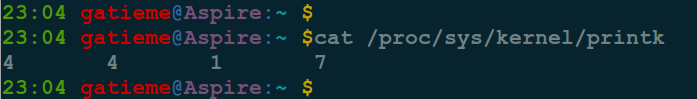

Linux内核调试的方式以及工具集锦
=======

| CSDN | GitHub |
|:----:|:------:|
| [Linux内核调试的方式以及工具集锦](http://blog.csdn.net/gatieme/article/details/61623891) | [`AderXCoding/system/tools/you-get`](https://github.com/gatieme/AderXCoding/tree/master/system/tools/you-get) |

<br>
<a rel="license" href="http://creativecommons.org/licenses/by-nc-sa/4.0/"></a>
本作品采用<a rel="license" href="http://creativecommons.org/licenses/by-nc-sa/4.0/">知识共享署名-非商业性使用-相同方式共享 4.0 国际许可协议</a>进行许可, 转载请注明出处, 谢谢合作
<br>


#1  printk 介绍
-------


##1.1	`printk` 的由来
-------


在内核调试技术之中, 最简单的就是 `printk` 的使用了, 它的用法和C语言应用程序中的 `printf` 使用类似, 在应用程序中依靠的是 `stdio.h` 中的库, 而在 `linux` 内核中没有这个库, 所以在 `linux` 内核中, 实现了自己的一套库函数, `printk` 就是标准的输出函数


##1.2	`printk` 与 `printf` 的差异
-------


是什么导致一个运行在内核态而另一个运行用户态? 其实这两个函数几乎是相同的, 出现这种差异是因为 `tty_write` 函数需要使用 `fs` 指向的被显示的字符串, 而 `fs` 是专门用于存放用户态段选择符的, 因此, 在内核态时, 为了配合 `tty_write`函数, `printk` 会把 `fs` 修改为内核态数据段选择符 `ds` 中的值, 这样才能正确指向内核的数据缓冲区, 当然这个操作会先对 `fs` 进行压栈保存, 调用 `tty_write` 完毕后再出栈恢复. 总结说来, `printk` 与 `printf` 的差异是由 `fs` 造成的, 所以差异也是围绕对 `fs` 的处理。


##1.3	`printk` 的原理
-------


`printk` 是在内核中运行的向控制台输出显示的函数, `Linux` 内核首先在内核空间分配一个静态缓冲区, 作为显示用的空间, 然后调用`sprintf`, 格式化显示字符串, 最后调用 `tty_write` 向终端进行信息的显示. 但是根据不同的操作系统也会有不一样的效果, 例如编写一个 `hello world` 内核模块, 使用这个函数不一定会将内容显示到终端上, 但是一定在内核缓冲区里, 可以使用 `dmesg` 查看效果.


#2	printk 的内核实现
-------


##2.1	printk 实现
-------

有关 `printk` 的函数实现都在[`kernel/printk/printk.c?v=4.10, line 1863`](http://lxr.free-electrons.com/source/kernel/printk/printk.c?v=4.10#L1863)


```cpp
/**
 * printk - print a kernel message
 * @fmt: format string
 *
 * This is printk(). It can be called from any context. We want it to work.
 *
 * We try to grab the console_lock. If we succeed, it's easy - we log the
 * output and call the console drivers.  If we fail to get the semaphore, we
 * place the output into the log buffer and return. The current holder of
 * the console_sem will notice the new output in console_unlock(); and will
 * send it to the consoles before releasing the lock.
 *
 * One effect of this deferred printing is that code which calls printk() and
 * then changes console_loglevel may break. This is because console_loglevel
 * is inspected when the actual printing occurs.
 *
 * See also:
 * printf(3)
 *
 * See the vsnprintf() documentation for format string extensions over C99.
 */
asmlinkage __visible int printk(const char *fmt, ...)
{
        va_list args;
        int r;

        va_start(args, fmt);
        r = vprintk_func(fmt, args);
        va_end(args);

        return r;
}
EXPORT_SYMBOL(printk);
```

关于`vprintk_func` 的定义可以参见 [`kernel/printk/internal.h, line 34`](http://lxr.free-electrons.com/source/kernel/printk/internal.h?v=4.10#L34), 如果定义 `CONFIG_PRINTK_NMI`, 那么它会被定义成[`PER CPU`](http://lxr.free-electrons.com/source/kernel/printk/internal.h?v=4.10#L34)的, 否则总是被定义成[`vprintk_default`](http://lxr.free-electrons.com/source/kernel/printk/printk.c?v=4.10#L1825)


##2.2	日志级别
-------

`printk(日志级别 "消息文本");`


`printk` 会在开头处加上 `"<N>"` 样式的字符, `N` 的范围是 `0~7`, 表示这个信息的级别.


这里的日志级别通俗的说指的是对文本信息的一种输出范围上的指定.

日志级别一共有8个级别

| 日志级别 | 编号 | 描述 |
|:-------:|:---:|:---:|
| KERN_EMERG | 0 | 紧急事件消息, 系统崩溃之前提示, 表示系统不可用 |
| KERN_ALERT | 1 | 报告消息, 表示必须立即采取措施 |
| KERN_CRIT | 2 | 临界条件, 通常涉及严重的硬件或软件操作失败 |
| KERN_ERR | 3 | 错误条件, 驱动程序常用KERN_ERR来报告硬件的错误 |
| KERN_WARNING | 4 | 警告条件, 对可能出现问题的情况进行警告 |
| KERN_NOTICE | 5 | 正常但又重要的条件, 用于提醒. 常用于与安全相关的消息 |
| KERN_INFO | 6 | 提示信息, 如驱动程序启动时, 打印硬件信息 |
| KERN_DEBUG | 7 | 调试级别的消息 |

`printk` 的日志级别定义如下(在[`include/linux/kern_levels.h`](http://lxr.free-electrons.com/source/include/linux/kern_levels.h?v=4.10#L13)中)

```cpp
//  http://lxr.free-electrons.com/source/include/linux/kern_levels.h?v=4.10#L13
#define KERN_SOH        "\001"          /* ASCII Start Of Header */
#define KERN_SOH_ASCII  '\001'

#define KERN_EMERG      KERN_SOH ""    /* system is unusable */
#define KERN_ALERT      KERN_SOH "1"    /* action must be taken immediately */
#define KERN_CRIT       KERN_SOH "2"    /* critical conditions */
#define KERN_ERR        KERN_SOH "3"    /* error conditions */
#define KERN_WARNING    KERN_SOH "4"    /* warning conditions */
#define KERN_NOTICE     KERN_SOH "5"    /* normal but significant condition */
#define KERN_INFO       KERN_SOH "6"    /* informational */
#define KERN_DEBUG      KERN_SOH "7"    /* debug-level messages */

#define KERN_DEFAULT    KERN_SOH "d"    /* the default kernel loglevel */
```

当然这些日志级别是用来在内核和驱动中使用的, 内核用了一些LOGLEVEL_<LEVEL> 的变量来实现 `printk` 控制, 这些变量的值与 KERN_<LEVEL> 一一对应, 同时多定义了 `LOGLEVEL_SCHED`, 参见[`include/linux/kern_levels.h?v=4.10, line 25`](http://lxr.free-electrons.com/source/include/linux/kern_levels.h?v=4.10#L25)


##2.3	日志级别的重要性控制
-------

定义了这么多日志级别, 这些日志源源不断的向内核缓冲区输出信息, 但是不能所有的日志都被显示在终端中, 因此内核设计了一套控制机制来识别日志的重要性, 重要的日志将被立即显示在终端中, 通知用户, 那么看起来不那么重要的日志被输出到后台日志系统, 只要通过`dmesg` 来查看.


内核通过了四个字值, 它们根据日志记录消息的重要性, 定义将其发送到何处. 关于不同日志级别的更多信息, 请查阅 `syslog(2)` 联机帮助.

| 重要性级别 | 字段 | 标识 | 描述 |
|:--------:|:----:|:------------:|:---:|
| 控制台日志级别 | console_loglevel | DEFAULT_CONSOLE_LOGLEVEL | 优先级高于该值的消息将被打印至控制台 |
| 默认的消息日志级别 | default_message_loglevel | DEFAULT_MESSAGE_LOGLEVEL | 将用该优先级来打印没有优先级的消息
| 最低的控制台日志级别 | minimum_console_loglevel |MINIMUM_CONSOLE_LOGLEVEL | 控制台日志级别可被设置的最小值(最高优先级) |
| 默认的控制台日志级别 | default_console_loglevel | DEFAULT_CONSOLE_LOGLEVEL | 控制台日志级别的缺省值 |


内核可把消息打印到当前控制台上, 可以指定控制台为字符模式的终端或打印机等. 默认情况下, "控制台" 就是当前的虚拟终端.

为了更好地控制不同级别的信息显示在控制台上, 内核设置了控制台的日志级别 `console_loglevel`. `printk` 日志级别的作用是打印一定级别的消息, 与之类似, 控制台只显示一定级别的消息。

当日志级别小于console_loglevel时，消息才能显示出来. 控制台相应的日志级别定义如下, 参见[`kernel/printk/printk.c?v=4.10, line 59`](http://lxr.free-electrons.com/source/kernel/printk/printk.c?v=4.10#L59)


```cpp
//  http://lxr.free-electrons.com/source/kernel/printk/printk.c?v=4.10#L59
int console_printk[4] = {
        CONSOLE_LOGLEVEL_DEFAULT,       /* console_loglevel, 控制台日志级别 */
        MESSAGE_LOGLEVEL_DEFAULT,       /* default_message_loglevel, 默认日志级别 */
        CONSOLE_LOGLEVEL_MIN,           /* minimum_console_loglevel, 最低的控制台日志级别 */
         CONSOLE_LOGLEVEL_DEFAULT,       /* default_console_loglevel, 默认控制台日志级别 */
};
```


这些日志级别的值并定义在[`include/linux/printk.h?v=4.10, line 44`](http://lxr.free-electrons.com/source/include/linux/printk.h?v=4.10#L44)

```cpp
//http://lxr.free-electrons.com/source/include/linux/printk.h?v=4.10#L44
#define CONSOLE_EXT_LOG_MAX     8192

/* printk's without a loglevel use this.. */
//  默认日志级别, 可由CONFIG_配置
#define MESSAGE_LOGLEVEL_DEFAULT CONFIG_MESSAGE_LOGLEVEL_DEFAULT

/* We show everything that is MORE important than this.. */
#define CONSOLE_LOGLEVEL_SILENT  0 /* Mum's the word */
//  最低的控制台日志级别, 默认为1
#define CONSOLE_LOGLEVEL_MIN     1 /* Minimum loglevel we let people use */
#define CONSOLE_LOGLEVEL_QUIET   4 /* Shhh ..., when booted with "quiet" */
#define CONSOLE_LOGLEVEL_DEBUG  10 /* issue debug messages */
#define CONSOLE_LOGLEVEL_MOTORMOUTH 15  /* You can't shut this one up */

/*
 * Default used to be hard-coded at 7, we're now allowing it to be set from
 * kernel config.
  */
//  默认控制台日志级别, 可由CONFIG_配置
#define CONSOLE_LOGLEVEL_DEFAULT CONFIG_CONSOLE_LOGLEVEL_DEFAULT

extern int console_printk[];


// [0] = 控制台日志级别
#define console_loglevel (console_printk[0])
// [1] = 默认消息级别, 未指明的日志均为此级别
#define default_message_loglevel (console_printk[1])
//  [2] = 控制台最小的日志级别
#define minimum_console_loglevel (console_printk[2])
//  [3] = 默认的控制台日志级别
#define default_console_loglevel (console_printk[3])
```

没有指定日志级别的 `printk` 语句默认采用的级别是 `DEFAULT_ MESSAGE_LOGLEVEL`(这个默认级别一般为 `4`, 即与`KERN_WARNING` 在一个级别上), 其定义在linux26/kernel/printk.c中可以找到, 可以通过编译时配置 `CONFIG_MESSAGE_LOGLEVEL_DEFAULT` 变量来修改


#3	用户空间
-------


##3.1	用户空间的日志信息
-------

如果系统运行了 `klogd` 或者 `syslogd`, 则无论`console_loglevel`为何值, 内核消息都将追加到系统的日志文件中.


使用 `ps -aux | grep -E "syslogd|klogd"`, 查看系统日志服务是否运行


可以查看系统的日志文件, `Ubuntu` 系统中 `/var/log/kern`


或者直接使用 `dmesg` 查看


如果 `klogd` 没有运行, 消息不会传递到用户空间, 只能查看 `/proc/kmsg`.

变量 `console_loglevel` 的初始值是 `DEFAULT_CONSOLE_LOGLEVEL`, 可以通过 `sys_syslog` 系统调用进行修改. 调用 `klogd` 时可以指定 `-c` 开关选项来修改这个变量. 如果要修改它的当前值, 必须先杀掉 `klogd`, 再加 `-c` 选项重新启动它.


在控制台（这里指的是虚拟终端  Ctrl+Alt+(F1~F6)）加载模块以后，控制台给出的信息为
6~9行中要求输出的信息，我们在伪终端（如果对伪终端不是很清楚可以看相关的内容）上运行命令tail -n 10 /var/log/messages查看日志文件刚才得到的运行记录
可以发现messages中的值为KERN_WARNING级别之后所要求输出到信息值。而如果我们在文件syslog和kern-log中查看系统日志文件，一般情况下可以得到所有的输出信息
即一般情况下, `syslog` 和 `kern.log` 两个文件中记录的内容从编程这个角度来看是基本一致的。
在目录/var/log/下有一下四个文件可以查看日志
syslog ，kern.log，messages ，DEBUG 。   
syslog和kern.log一般情况下可以得到所有的系统输出值，而messages得到的是比控制台日志级别低的输出值，DEBUG得到的仅仅是DEBUG级别的
输出值。
一般情况下，优先级高于控制台日志级别的消息将被打印到控制台。优先级低于控制台日志级别的消息将被打印到messages日志文件中，而在伪终端下不打印任何的信息。
我们在进行有关编程的时候，若使用到printk()这个函数，一般查看信息是在messages和虚拟终端下进行查看，而对于syslog和kern.log下是用来检验所有信息的输出情况。


##3.2	修改日志级别
-------

通过读写 `/proc/sys/kernel/printk`文件可读取和修改控制台的日志级别.




[linux内核printk调试](http://blog.csdn.net/catamout/article/details/5380562)


在内核文件中 `printk.c (kernel)` 中初始化这个 `console_loglevel` 的级别为 `7`.


[linux内核调试技术之printk](http://www.cnblogs.com/veryStrong/p/6218383.html)


[调整内核printk的打印级别](http://blog.csdn.net/tonywgx/article/details/17504001)


[linux设备驱动学习笔记--内核调试方法之printk](http://blog.csdn.net/itsenlin/article/details/43205983)


<br>

<a rel="license" href="http://creativecommons.org/licenses/by-nc-sa/4.0/"></a>本作品采用<a rel="license" href="http://creativecommons.org/licenses/by-nc-sa/4.0/">知识共享署名-非商业性使用-相同方式共享 4.0 国际许可协议</a>进行许可, 转载请注明出处, 谢谢合作.
