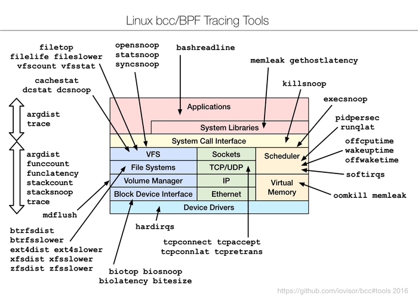

BCC--用于Linux性能监视, 网络和更多的动态跟踪工具
=======

| CSDN | GitHub |
|:----:|:------:|
| [Aderstep--紫夜阑珊-青伶巷草](http://blog.csdn.net/gatieme) | [`AderXCoding/system/tools`](https://github.com/gatieme/AderXCoding/tree/master/system/tools) |

<br>

<a rel="license" href="http://creativecommons.org/licenses/by-nc-sa/4.0/"></a>

本作品采用<a rel="license" href="http://creativecommons.org/licenses/by-nc-sa/4.0/">知识共享署名-非商业性使用-相同方式共享 4.0 国际许可协议</a>进行许可, 转载请注明出处, 谢谢合作

因本人技术水平和知识面有限, 内容如有纰漏或者需要修正的地方, 欢迎大家指正, 也欢迎大家提供一些其他好的调试工具以供收录, 鄙人在此谢谢啦

<br>

#1	BCC简介

`BCC`--(`BPF Compiler Collection`, `BPF` 编译器集合) 是用于创建足智多谋内核跟踪和操作程序一套功能强大的适当的工具和示例文件. 它采用扩展 `BPF`( `Berkeley` 包过滤器), 最初被称为 `eBPF` 这是在 `Linux` 的 `3.15` 的新功能之一.



实际上, 大多数由 `BCC` 使用的组件的需要的 `Linux 4.1` 或以上.

其值得注意的特点包括 :

*	不需要第三方内核模块, 因为所有的工具都基于内置于内核的`BPF` 工作, `BCC` 使用 `Linux 4.x` 系列中添加的功能.

*	支持观察软件执行.

*	包括几个性能分析工具与示例文件和手册页。

>建议阅读 :
>
>[20命令行工具来监控Linux性能](https://www.howtoing.com/command-line-tools-to-monitor-linux-performance/)
>
>[Suggested Read: 20 Command Line Tools to Monitor Linux Performance](https://www.tecmint.com/command-line-tools-to-monitor-linux-performance/)

最适合用于高级 `Linux` 用户, `BCC` 可以很容易地编写使用内核仪表用`C`, `BPF` 程序和 `Python` 和 `Lua`编写的前端分析脚本。 此外， 它支持多个任务， 如性能分析, 监控, 网络流量控制等.

#2	如何在 `Linux` 系统中安装 `BCC`
-------

##2.1	开启内核选项支持BCC
-------

`Linux` `4.1` 以上的内核版本才能使能 `BCC` 的功能, 内核应该已经编译如下设置标志 :

```cpp
CONFIG_BPF=y
CONFIG_BPF_SYSCALL=y
# [optional, for tc filters]
CONFIG_NET_CLS_BPF=m
# [optional, for tc actions]
CONFIG_NET_ACT_BPF=m
CONFIG_BPF_JIT=y
CONFIG_HAVE_BPF_JIT=y
# [optional, for kprobes]
CONFIG_BPF_EVENTS=y
```

要检查你的核心标志, 查看文件了 `/proc/config.gz` 或在下面的例子中运行命令 :


```CPP
grep -E "CONFIG_BPF=|CONFIG_BPF_SYSCALL=|CONFIG_BPF_SYSCALL=y|CONFIG_NET_CLS_BPF|CONFIG_NET_CLS_BPF=m|CONFIG_NET_ACT_BPF=|CONFIG_NET_ACT_BPF=m|CONFIG_BPF_JIT=|CONFIG_BPF_JIT=y|CONFIG_HAVE_BPF_JIT=|CONFIG_HAVE_BPF_JIT=y|CONFIG_BPF_EVENTS=|CONFIG_BPF_EVENTS=y /boot/config-`uname -r`
```

验证内核标志后, 它的时间在 `Linux` 系统中安装 `BCC` 工具。


##2.2	Ubuntu使用源安装
-------


添加源信息

```cpp
#Ubuntu 16.04
echo "deb [trusted=yes] https://repo.iovisor.org/apt/xenial xenial-nightly main" | sudo tee /etc/apt/sources.list.d/iovisor.list

#Ubuntu 14.04
sudo apt-key adv --keyserver keyserver.ubuntu.com --recv-keys D4284CDD
echo "deb https://repo.iovisor.org/apt trusty main" | sudo tee /etc/apt/sources.list.d/iovisor.list
```

```cpp
sudo apt-get update
sudo apt-get install bcc-tools
```

`Ubuntu 14.04` 中必须**升级内核**, 请参见

[Ubuntu14.04.4升级硬件实现堆栈(HWE)到14.04.5(Xenial Kernel-v4.4)
](http://blog.csdn.net/gatieme/article/details/52744417), 升级到 `14.04.5`, 其使用 `linux-4.4.0` 内核

或者可以使用 [`Ubuntu mainline` 内核的 `PPA`](http://kernel.ubuntu.com/~kernel-ppa/mainline) 的内核.


```cpp
sudo apt-get update
sudo apt-get install binutils bcc bcc-tools libbcc-examples python-bcc
```


这里只讲解 `Ubuntu` 的安装方式, 其他发行版的安装请参见[官网的文档](https://github.com/iovisor/bcc/blob/master/INSTALL.md#opensuse---binary)


##2.3	源码构建BCC
-------


安装从4.2+内核http://alt.fedoraproject.org/pub/alt/rawhide-kernel-nodebug ，如果您的系统具有比需要什么更低版本。下面是一个如何做的例子：
$ sudo dnf config-manager --add-repo=http://alt.fedoraproject.org/pub/alt/rawhide-kernel-nodebug/fedora-rawhide-kernel-nodebug.repo
$ sudo dnf update
$ reboot 在此之后，添加BBC工具库，更新你的系统，并执行下一个命令系列的安装工具：
$ echo -e '[iovisor]\nbaseurl=https://repo.iovisor.org/yum/nightly/f23/$basearch\nenabled=1\ngpgcheck=0' | sudo tee /etc/yum.repos.d/iovisor.repo
$ sudo dnf update
$ sudo dnf install bcc-tools
Arch Linux - AUR

您应该将内核升级到至少4.3.1-1版本开始，随后安装使用以下任何拱包管理器，如包pacaur，yaourt， 畏缩等。
bcc bcc-tools python-bcc python2-bcc
如何在Linux系统中使用BCC工具
所有BCC工具将被安装/usr/share/bcc/tools目录下。 但是，您可以替代地根据BCC Github上库运行它们/tools在那里他们有结束.py扩展。
$ ls /usr/share/bcc/tools 
argdist       capable     filetop         offwaketime  stackcount  vfscount
bashreadline  cpudist     funccount       old          stacksnoop  vfsstat
biolatency    dcsnoop     funclatency     oomkill      statsnoop   wakeuptime
biosnoop      dcstat      gethostlatency  opensnoop    syncsnoop   xfsdist
biotop        doc         hardirqs        pidpersec    tcpaccept   xfsslower
bitesize      execsnoop   killsnoop       profile      tcpconnect  zfsdist
btrfsdist     ext4dist    mdflush         runqlat      tcpconnlat  zfsslower
btrfsslower   ext4slower  memleak         softirqs     tcpretrans
cachestat     filelife    mysqld_qslower  solisten     tplist
cachetop      fileslower  offcputime      sslsniff     trace 我们应包括以下几个例子-监测的一般Linux系统的性能和网络。
跟踪open()系统调用

让我们通过追踪所有启动open()使用opensnoop系统调用。这使我们能够通过识别他们的数据文件，配置文件等等告诉我们各种应用程序如何工作：
$ cd /usr/share/bcc/tools 
$ sudo ./opensnoop
PID    COMM               FD ERR PATH
1      systemd            35   0 /proc/self/mountinfo
2797   udisksd            13   0 /proc/self/mountinfo
1      systemd            35   0 /sys/devices/pci0000:00/0000:00:0d.0/ata3/host2/target2:0:0/2:0:0:0/block/sda/sda1/uevent
1      systemd            35   0 /run/udev/data/b8:1
1      systemd            -1   2 /etc/systemd/system/sys-kernel-debug-tracing.mount
1      systemd            -1   2 /run/systemd/system/sys-kernel-debug-tracing.mount
1      systemd            -1   2 /run/systemd/generator/sys-kernel-debug-tracing.mount
1      systemd            -1   2 /usr/local/lib/systemd/system/sys-kernel-debug-tracing.mount
2247   systemd            15   0 /proc/self/mountinfo
1      systemd            -1   2 /lib/systemd/system/sys-kernel-debug-tracing.mount
1      systemd            -1   2 /usr/lib/systemd/system/sys-kernel-debug-tracing.mount
1      systemd            -1   2 /run/systemd/generator.late/sys-kernel-debug-tracing.mount
1      systemd            -1   2 /etc/systemd/system/sys-kernel-debug-tracing.mount.wants
1      systemd            -1   2 /etc/systemd/system/sys-kernel-debug-tracing.mount.requires
1      systemd            -1   2 /run/systemd/system/sys-kernel-debug-tracing.mount.wants
1      systemd            -1   2 /run/systemd/system/sys-kernel-debug-tracing.mount.requires
1      systemd            -1   2 /run/systemd/generator/sys-kernel-debug-tracing.mount.wants
1      systemd            -1   2 /run/systemd/generator/sys-kernel-debug-tracing.mount.requires
1      systemd            -1   2 /usr/local/lib/systemd/system/sys-kernel-debug-tracing.mount.wants
1      systemd            -1   2 /usr/local/lib/systemd/system/sys-kernel-debug-tracing.mount.requires
1      systemd            -1   2 /lib/systemd/system/sys-kernel-debug-tracing.mount.wants
1      systemd            -1   2 /lib/systemd/system/sys-kernel-debug-tracing.mount.requires
1      systemd            -1   2 /usr/lib/systemd/system/sys-kernel-debug-tracing.mount.wants
1      systemd            -1   2 /usr/lib/systemd/system/sys-kernel-debug-tracing.mount.requires
1      systemd            -1   2 /run/systemd/generator.late/sys-kernel-debug-tracing.mount.wants
1      systemd            -1   2 /run/systemd/generator.late/sys-kernel-debug-tracing.mount.requires
1      systemd            -1   2 /etc/systemd/system/sys-kernel-debug-tracing.mount.d
1      systemd            -1   2 /run/systemd/system/sys-kernel-debug-tracing.mount.d
1      systemd            -1   2 /run/systemd/generator/sys-kernel-debug-tracing.mount.d
....
总结块设备I / O延迟

在本示例中，它显示使用生物分解的磁盘I / O延迟的汇总分布。执行该命令后，等待几分钟，然后按Ctrl-C来结束它，并查看输出。
$ sudo ./biolatecncy
Tracing block device I/O... Hit Ctrl-C to end.
^C
usecs               : count     distribution
0 -> 1          : 0        |                                        |
2 -> 3          : 0        |                                        |
4 -> 7          : 0        |                                        |
8 -> 15         : 0        |                                        |
16 -> 31         : 0        |                                        |
32 -> 63         : 0        |                                        |
64 -> 127        : 0        |                                        |
128 -> 255        : 3        |****************************************|
256 -> 511        : 3        |****************************************|
512 -> 1023       : 1        |*************                           |
通过exec()Syscalls跟踪新进程

在本节中，我们将移动到使用execsnoop工具执行跟踪新工艺。 每一个过程是由两岔时间fork()和exec()系统调用，它示出在输出中。但是，并非所有进程都被捕获。
$ sudo ./execsnoop
PCOMM            PID    PPID   RET ARGS
gnome-screensho  14882  14881    0 /usr/bin/gnome-screenshot --gapplication-service
systemd-hostnam  14892  1        0 /lib/systemd/systemd-hostnamed
nautilus         14897  2767    -2 /home/howtoing/bin/net usershare info
nautilus         14897  2767    -2 /home/howtoing/.local/bin/net usershare info
nautilus         14897  2767    -2 /usr/local/sbin/net usershare info
nautilus         14897  2767    -2 /usr/local/bin/net usershare info
nautilus         14897  2767    -2 /usr/sbin/net usershare info
nautilus         14897  2767    -2 /usr/bin/net usershare info
nautilus         14897  2767    -2 /sbin/net usershare info
nautilus         14897  2767    -2 /bin/net usershare info
nautilus         14897  2767    -2 /usr/games/net usershare info
nautilus         14897  2767    -2 /usr/local/games/net usershare info
nautilus         14897  2767    -2 /snap/bin/net usershare info
compiz           14899  14898   -2 /home/howtoing/bin/libreoffice --calc
compiz           14899  14898   -2 /home/howtoing/.local/bin/libreoffice --calc
compiz           14899  14898   -2 /usr/local/sbin/libreoffice --calc
compiz           14899  14898   -2 /usr/local/bin/libreoffice --calc
compiz           14899  14898   -2 /usr/sbin/libreoffice --calc
libreoffice      14899  2252     0 /usr/bin/libreoffice --calc
dirname          14902  14899    0 /usr/bin/dirname /usr/bin/libreoffice
basename         14903  14899    0 /usr/bin/basename /usr/bin/libreoffice
...
跟踪慢ext4操作

使用ext4slower跟踪ext4文件系统是大于10ms较慢的常用操作，帮助我们通过文件系统识别独立较慢的磁盘I / O。
建议阅读： 13 Linux的性能监视工具

它只输出超过阈值的操作：
$ sudo ./execslower
Tracing ext4 operations slower than 10 ms
TIME     COMM           PID    T BYTES   OFF_KB   LAT(ms) FILENAME
11:59:13 upstart        2252   W 48      1          10.76 dbus.log
11:59:13 gnome-screensh 14993  R 144     0          10.96 settings.ini
11:59:13 gnome-screensh 14993  R 28      0          16.02 gtk.css
11:59:13 gnome-screensh 14993  R 3389    0          18.32 gtk-main.css
11:59:25 rs:main Q:Reg  1826   W 156     60         31.85 syslog
11:59:25 pool           15002  R 208     0          14.98 .xsession-errors
11:59:25 pool           15002  R 644     0          12.28 .ICEauthority
11:59:25 pool           15002  R 220     0          13.38 .bash_logout
11:59:27 dconf-service  2599   S 0       0          22.75 user.BHDKOY
11:59:33 compiz         2548   R 4096    0          19.03 firefox.desktop
11:59:34 compiz         15008  R 128     0          27.52 firefox.sh
11:59:34 firefox        15008  R 128     0          36.48 firefox
11:59:34 zeitgeist-daem 2988   S 0       0          62.23 activity.sqlite-wal
11:59:34 zeitgeist-fts  2996   R 8192    40         15.67 postlist.DB
11:59:34 firefox        15008  R 140     0          18.05 dependentlibs.list
11:59:34 zeitgeist-fts  2996   S 0       0          25.96 position.tmp
11:59:34 firefox        15008  R 4096    0          10.67 libplc4.so
11:59:34 zeitgeist-fts  2996   S 0       0          11.29 termlist.tmp
...
跟踪块设备I / O，带PID和延迟

下一步，让我们每秒钟为每个磁盘I / O打印一行，其中包括进程ID，扇区，字节，使用biosnoop的其他延迟等细节：
$ sudo ./biosnoop
TIME(s)        COMM           PID    DISK    T  SECTOR    BYTES   LAT(ms)
0.000000000    ?              0              R  -1        8          0.26
2.047897000    ?              0              R  -1        8          0.21
3.280028000    kworker/u4:0   14871  sda     W  30552896  4096       0.24
3.280271000    jbd2/sda1-8    545    sda     W  29757720  12288      0.40
3.298318000    jbd2/sda1-8    545    sda     W  29757744  4096       0.14
4.096084000    ?              0              R  -1        8          0.27
6.143977000    ?              0              R  -1        8          0.27
8.192006000    ?              0              R  -1        8          0.26
8.303938000    kworker/u4:2   15084  sda     W  12586584  4096       0.14
8.303965000    kworker/u4:2   15084  sda     W  25174736  4096       0.14
10.239961000   ?              0              R  -1        8          0.26
12.292057000   ?              0              R  -1        8          0.20
14.335990000   ?              0              R  -1        8          0.26
16.383798000   ?              0              R  -1        8          0.17
...
跟踪页面缓存命中/未命中比率

此后，我们继续使用cachestat到显示器汇总统计的一行从系统缓存每一秒。这通过指出低缓存命中率和高错失率来实现系统调整操作：
$ sudo ./cachestat
HITS   MISSES  DIRTIES  READ_HIT% WRITE_HIT%   BUFFERS_MB  CACHED_MB
0        0        0       0.0%       0.0%           19        544
4        4        2      25.0%      25.0%           19        544
1321       33        4      97.3%       2.3%           19        545
7476        0        2     100.0%       0.0%           19        545
6228       15        2      99.7%       0.2%           19        545
0        0        0       0.0%       0.0%           19        545
7391      253      108      95.3%       2.7%           19        545
33608     5382       28      86.1%      13.8%           19        567
25098       37       36      99.7%       0.0%           19        566
17624      239      416      96.3%       0.5%           19        520
...
跟踪TCP活动连接

监测TCP连接，每秒使用tcpconnect。其输出包括源和目标地址以及端口号。此工具可用于跟踪意外的TCP连接，从而帮助我们识别应用程序配置或攻击者的低效率。
$ sudo ./tcpconnect
PID    COMM         IP SADDR            DADDR            DPORT
15272  Socket Threa 4  10.0.2.15        91.189.89.240    80  
15272  Socket Threa 4  10.0.2.15        216.58.199.142   443 
15272  Socket Threa 4  10.0.2.15        216.58.199.142   80  
15272  Socket Threa 4  10.0.2.15        216.58.199.174   443 
15272  Socket Threa 4  10.0.2.15        54.200.62.216    443 
15272  Socket Threa 4  10.0.2.15        54.200.62.216    443 
15272  Socket Threa 4  10.0.2.15        117.18.237.29    80  
15272  Socket Threa 4  10.0.2.15        216.58.199.142   80  
15272  Socket Threa 4  10.0.2.15        216.58.199.131   80  
15272  Socket Threa 4  10.0.2.15        216.58.199.131   443 
15272  Socket Threa 4  10.0.2.15        52.222.135.52    443 
15272  Socket Threa 4  10.0.2.15        216.58.199.131   443 
15272  Socket Threa 4  10.0.2.15        54.200.62.216    443 
15272  Socket Threa 4  10.0.2.15        54.200.62.216    443 
15272  Socket Threa 4  10.0.2.15        216.58.199.132   443 
15272  Socket Threa 4  10.0.2.15        216.58.199.131   443 
15272  Socket Threa 4  10.0.2.15        216.58.199.142   443 
15272  Socket Threa 4  10.0.2.15        54.69.17.198     443 
15272  Socket Threa 4  10.0.2.15        54.69.17.198     443 
... 以上所有的工具，也可以与各种选项一起使用，使一个给定的工具的帮助页面，利用的-h选项，例如：
$ sudo ./tcpconnect -h
usage: tcpconnect [-h] [-t] [-p PID] [-P PORT]
Trace TCP connects
optional arguments:
-h, --help            show this help message and exit
-t, --timestamp       include timestamp on output
-p PID, --pid PID     trace this PID only
-P PORT, --port PORT  comma-separated list of destination ports to trace.
examples:
./tcpconnect           # trace all TCP connect()s
./tcpconnect -t        # include timestamps
./tcpconnect -p 181    # only trace PID 181
./tcpconnect -P 80     # only trace port 80
./tcpconnect -P 80,81  # only trace port 80 and 81
跟踪失败exec()s Syscalls

要跟踪失败的exec()秒的系统调用，应用-x具有如下opensnoop选项：
$ sudo ./opensnoop -x
PID    COMM               FD ERR PATH
15414  pool               -1   2 /home/.hidden
15415  (ostnamed)         -1   2 /sys/fs/cgroup/cpu/system.slice/systemd-hostnamed.service/cgroup.procs
15415  (ostnamed)         -1   2 /sys/fs/cgroup/cpu/system.slice/cgroup.procs
15415  (ostnamed)         -1   2 /sys/fs/cgroup/cpuacct/system.slice/systemd-hostnamed.service/cgroup.procs
15415  (ostnamed)         -1   2 /sys/fs/cgroup/cpuacct/system.slice/cgroup.procs
15415  (ostnamed)         -1   2 /sys/fs/cgroup/blkio/system.slice/systemd-hostnamed.service/cgroup.procs
15415  (ostnamed)         -1   2 /sys/fs/cgroup/blkio/system.slice/cgroup.procs
15415  (ostnamed)         -1   2 /sys/fs/cgroup/memory/system.slice/systemd-hostnamed.service/cgroup.procs
15415  (ostnamed)         -1   2 /sys/fs/cgroup/memory/system.slice/cgroup.procs
15415  (ostnamed)         -1   2 /sys/fs/cgroup/pids/system.slice/systemd-hostnamed.service/cgroup.procs
2548   compiz             -1   2 
15416  systemd-cgroups    -1   2 /run/systemd/container
15416  systemd-cgroups    -1   2 /sys/fs/kdbus/0-system/bus
15415  systemd-hostnam    -1   2 /run/systemd/container
15415  systemd-hostnam    -1  13 /proc/1/environ
15415  systemd-hostnam    -1   2 /sys/fs/kdbus/0-system/bus
1695   dbus-daemon        -1   2 /run/systemd/users/0
15415  systemd-hostnam    -1   2 /etc/machine-info
15414  pool               -1   2 /home/howtoing/.hidden
15414  pool               -1   2 /home/howtoing/Binary/.hidden
2599   dconf-service      -1   2 /run/user/1000/dconf/user
...
跟踪特定的过程函数

下面的最后一个示例演示了如何执行自定义跟踪操作。我们正在使用其PID跟踪特定进程。
建议阅读： Netdata -适用于Linux的实时性能监控工具

首先确定进程ID：
$ pidof firefox
15437 后来，运行定制trace命令。 在下面的命令： -p指定的进程ID， do_sys_open()是动态跟踪包括它的第二个参数是一个字符串核函数。
$ sudo ./trace -p 4095 'do_sys_open "%s", arg2'
TIME     PID    COMM         FUNC             -
12:17:14 15437  firefox      do_sys_open      /run/user/1000/dconf/user
12:17:14 15437  firefox      do_sys_open      /home/howtoing/.config/dconf/user
12:18:07 15437  firefox      do_sys_open      /run/user/1000/dconf/user
12:18:07 15437  firefox      do_sys_open      /home/howtoing/.config/dconf/user
12:18:13 15437  firefox      do_sys_open      /sys/devices/system/cpu/present
12:18:13 15437  firefox      do_sys_open      /dev/urandom
12:18:13 15437  firefox      do_sys_open      /dev/urandom
12:18:14 15437  firefox      do_sys_open      /usr/share/fonts/truetype/liberation/LiberationSans-Italic.ttf
12:18:14 15437  firefox      do_sys_open      /usr/share/fonts/truetype/liberation/LiberationSans-Italic.ttf
12:18:14 15437  firefox      do_sys_open      /usr/share/fonts/truetype/liberation/LiberationSans-Italic.ttf
12:18:14 15437  firefox      do_sys_open      /sys/devices/system/cpu/present
12:18:14 15437  firefox      do_sys_open      /dev/urandom
12:18:14 15437  firefox      do_sys_open      /dev/urandom
12:18:14 15437  firefox      do_sys_open      /dev/urandom
12:18:14 15437  firefox      do_sys_open      /dev/urandom
12:18:15 15437  firefox      do_sys_open      /sys/devices/system/cpu/present
12:18:15 15437  firefox      do_sys_open      /dev/urandom
12:18:15 15437  firefox      do_sys_open      /dev/urandom
12:18:15 15437  firefox      do_sys_open      /sys/devices/system/cpu/present
12:18:15 15437  firefox      do_sys_open      /dev/urandom
12:18:15 15437  firefox      do_sys_open      /dev/urandom
....
概要
BCC是各种系统管理任务，例如追踪系统性能监控，跟踪块设备一个功能强大且易于使用的工具包I / O，TCP的功能，文件系统操作，系统调用，Node.js的探头，再加上其它更多地方。重要的是，它提供了几个示例文件和手册页的工具来指导你，使其用户友好和可靠。 最后但同样重要的是，您可以通过下面的评论部分分享您对主题的想法，提出问题，提出有用的建议或任何建设性的反馈，以回复我们。 欲了解更多信息和使用情况，请访问： https://iovisor.github.io/bcc/

#参见
-------

[`GitHub-WiKi-INSTALL`](https://github.com/iovisor/bcc/blob/master/INSTALL.md)

<br>

*	本作品/博文 ( [AderStep-紫夜阑珊-青伶巷草 Copyright ©2013-2017](http://blog.csdn.net/gatieme) ), 由 [成坚(gatieme)](http://blog.csdn.net/gatieme) 创作, 

*	采用<a rel="license" href="http://creativecommons.org/licenses/by-nc-sa/4.0/"></a><a rel="license" href="http://creativecommons.org/licenses/by-nc-sa/4.0/">知识共享署名-非商业性使用-相同方式共享 4.0 国际许可协议</a>进行许可. 欢迎转载、使用、重新发布, 但务必保留文章署名[成坚gatieme](http://blog.csdn.net/gatieme) ( 包含链接: http://blog.csdn.net/gatieme ), 不得用于商业目的.

*	基于本文修改后的作品务必以相同的许可发布. 如有任何疑问, 请与我联系.
