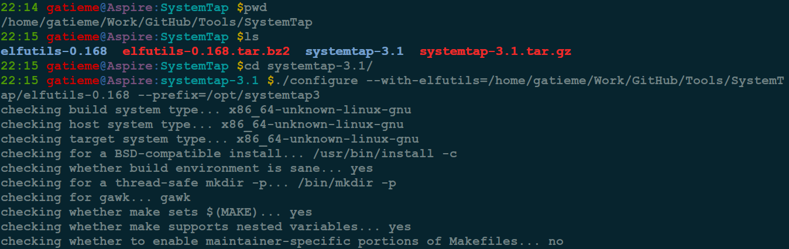
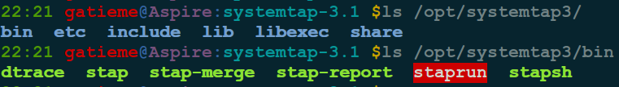
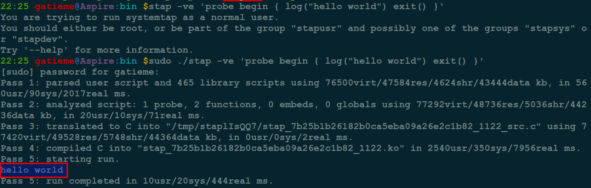

Linux内核调试的方式以及工具集锦
=======

| CSDN | GitHub |
|:----:|:------:|
| [Linux内核调试的方式以及工具集锦](http://blog.csdn.net/gatieme/article/details/68948080) | [`LDD-LinuxDeviceDrivers/study/debug`](https://github.com/gatieme/LDD-LinuxDeviceDrivers/tree/master/study/debug) |

<br>
<a rel="license" href="http://creativecommons.org/licenses/by-nc-sa/4.0/"></a>
本作品采用<a rel="license" href="http://creativecommons.org/licenses/by-nc-sa/4.0/">知识共享署名-非商业性使用-相同方式共享 4.0 国际许可协议</a>进行许可, 转载请注明出处, 谢谢合作
因本人技术水平和知识面有限, 内容如有纰漏或者需要修正的地方, 欢迎大家指正, 也欢迎大家提供一些其他好的调试工具以供收录, 鄙人在此谢谢啦
<br>


摘要 : `SYSTEMTAP` 是内核开发者必备的工具, 通过自动化的 `kprobe`, 而这个软件依赖于**内核符号表/调试信息/内核头文件**等等, 如果我们想测试最新的内核特性, 就需要安装带有 `debuginfo` 的内核和相关头文件. 而我们源仓库中自带的`systemtap` 很多时候, 因为版本和内核符号表的变动, 在新的内核中无法运行, 因此很多情况下我们需要自己编译 `systemtap`.


#1	使用和编译Systemtap的依赖包
-------


本文主要讲解了 `ubuntu` 上如果在自己编译的内核下编译安装使用 `systemtap`.

我们从`systemtap`的工作原来来分析, 其可能需要的依赖和配置

`Systemtap` 工作原理是, 参见[1.5 The stap command](https://sourceware.org/systemtap/langref/SystemTap_overview.html)

1.	通过`stap`工具将脚本语句翻译成`C`语句, 编译成内核模块

2.	模块加载之后, 将所有探测的事件以钩子的方式挂到内核上, 当任何处理器上的某个事件发生时, 相应钩子上句柄就会被执行

3.	最后，当systemtap会话结束之后，钩子从内核上取下，移除模块。整个过程用一个命令 stap 就可以完成。

可见, 除了必须安装 `systemtap` 包之外, 我们必须有内核头文件和开发包用于构建驱动, 还需要 `systemtap` 可识别的带 `kprobe`的内核, 同时`systemtap` 依赖于 `elfutils`, 因此我们需要下载其源码包, 最好选择最新版下载.


综上如果您需要使用`systemtap`, 则系统中必须包含以下包或者内核配置

*	内核支持并配置了kprobe(2.6.11和以上)调试内核需要,在进行内核编译之前的配置

*	内核模块编译环境(即编译内核模块所需的内核头文件以及模块配置信息，对于Fedora core或Redhat指kernel-devel或kernel-smp-devel RPM包, Uuuntu的),对应自己编译的内核就是内核头文件。

*	内核调试信息debuginfo(对于Fedora core或Redhat指kernel-debuginfo RPM包)


*	C编译环境(即libc库头文件和编译工具链), 对于自己编译的内核, 这一点比较好满足，因为运行环境和我们编译内核的环境是一致的, 不用特殊处理


*	有 `libdwfl` 的 `elfutils`(只有支持 `libwdfl` 的 `elfutils`, `systemtap`才能正常工作


如果您前期的运行支持, 比如内核头文件, `kernel-debuginfo` 包, 只想知道如果自行编译 `systemtap`, 那么请您自行忽略第2节和第3节

#2	安装内核开发包(头文件)
-------


##2.1	Ubuntu安装内核开发环境
-------


```cpp
#  查看内核版本
uname -r

#  查询有无内核头文件包
#  如果您是自己编译的内核, 官方自然就没有对应内核头文件了
dpkg-query -s linux-headers-$(uname -r)

#  安装匹配的内核头文件。
sudo apt-get install linux-headers-$(uname -r)
```

##2.2	CentOS安装内核开发环境
-------


```cpp
#  查看当前内核版本
`uname -r`


#  查看当前yum仓库中的kernel-headers的版本是否和内核版本一致
yum list | grep kernel-headers

#  如果一致，直接
yum install kernel-headers
```

对应的 `rpm`包下载站点, 也可以自行下载安装

http://pkgs.org/centos-7/centos-x86_64


##2.3	自定义内核安装内核头文件
-------


如果您是自己的内核, 那么您需要自己安装相应的内核和头文件并设置相关的连接, 您可以使用发行版配置的内核开发环境进行编译, 也可以自己手动编译

参见

*	[ 构建源码树----Linux内核剖析（三）](http://blog.csdn.net/gatieme/article/details/44961475)

*	[SystemtapOnUbuntu](http://sourceware.org/systemtap/wiki/SystemtapOnUbuntu)


*	使用Ubuntu的集成环境构建, [BuildYourOwnKernel](https://wiki.ubuntu.com/Kernel/BuildYourOwnKernel), [GitKernelBuild](https://wiki.ubuntu.com/KernelTeam/GitKernelBuild), [Kernel/Compile](https://help.ubuntu.com/community/Kernel/Compile)

*	使用CentOS的集成环境构建, [I Need to Build a Custom Kernel](https://wiki.centos.org/HowTos/Custom_Kernel)


*	自行构建Linux, [KernelBuild](https://kernelnewbies.org/KernelBuild)


#3	构建和安装内核debuginfo
-------

`SystemTap` 需要通过内核调试信息来定位内核函数和变量的位置. 这些信息由`kernel-debuginfo`包来提供

如果是系统自带的内核, 可以从源中下载对应的`kernel-debuginfo`包

对于通常的发行版, 并没有安装`kernel-debuginfo`包我们可以到发行版的下载站点下载

安装`debuginfo`包有如下几种方式

*	从发行版的 `debuginfo` 站点, 下载对应的 `kernel-debuginfo` 包并安装

*	直接用`yum/apt`等包管理器安装, 如果仓库中没有`debuginfo`源, 添加`debuginfo`的源即可

*	使用一些辅助工具下载, 比如 `RedHat` 系列的 `debuinfo-install`和 `debian` 系列的`get-dbgsym`

*	下载内核源码包, 构建出 `debuginfo`


##3.1	CentOS安装 `kernel-debuginfo`
-------


###3.1.1  方法一  下载 `CentOS` 的 `debuginfo` 包(推荐)
-------

一般的方式从软件仓库中是下载`debuginfo` 软件包, 然后直接安装

去站点 `http://debuginfo.centos.org`, 寻找和你架构和内核完全匹配的 `debuginfo` 包

```cpp
kernel-debuginfo-common-xxxxx
kernel-debuginfo-xxxx
```

>注意 
>
>`kernel-debug-debuginfo` 和 `kernel-debuginfo-common`, 这个版本必须和你的系统的内核版本一模一样, 一个字符不一样都不行, 查看版本的方法是 :
>
>`uname -r`
>2.6.18-308.el5
>
>所以我对应的版本是：
>
>kernel-debug-debuginfo-2.6.18-308.el5.x86_64.rpm
>kernel-debuginfo-common-2.6.18-308.el5.x86_64.rpm


如果你找不到对应的内核版本的 `rpm`, 你可以去 `google1`去寻找, 可以使用 `RedHat` 的 `debuginfo rpm` 包, 或者去其他站点[下载](http://rpm.pbone.net)


###3.1.2	方法二  添加 `debuginfo` 源
-------


如果提示没有源, 可以为 `debuginfo` 包增加 `repository`, 然后直接用源安装


如果`Centos yum repository`上没有`kernel-debuginfo`包, 方法一把这个包及依赖包 `rpm`文件下载到本地安装. 我们也可以手工添加有这个包的`repository`, 然后直接用`yum`安装
在 `/etc/yum.repos.d`新建一个文件，我把他命令为debuginfo 
然后在debuginfo中加入

```cpp
[debuginfo]
name=CentOS-$releasever - debuginfo
baseurl=http://debuginfo.centos.org/5/
gpgcheck=0
enabled=1
gpgkey=file:///etc/pki/rpm-gpg/RPM-GPG-KEY-CentOS-5
```

其他版本的CentOS请自行修改, 版本号和源地址```


###3.1.3	方法三  使用 `debuginfo-install` 工具
-------


当然也可以使用 `debuginfo-install`工具来安装 kernel


```cpp
debuinfo-install kernel-debuginfo-`uname -r`
```

##3.2	Ubuntu安装 `kernel-debuginfo`
-------

`Ubuntu` 桌面版默认没有安装 `kernel-debug-info`, 因此需要手动安装 `kernel-debug-info` 包.


我的系统是 `Ubuntu 14.04.5`, 内核`4.4.0-72-generic`

查看当前内核版本`uname -r`，

###3.2.1	直接从源中安装
-------


在 `Ubuntu 14.04` 中, `debuginfo`包已经在源中包含了, 因此直接安装即可

```
sudo apt-get install linux-image-`uname -r`-dbgsym
```

如果提示`Unable to locate packag`, 说明软件包不在源中, 可以手动添加源, 或者直接下载deb包安装


添加源的方法如下

```cpp
sudo tee /etc/apt/sources.list.d/ddebs.list << EOF 
deb http://ddebs.ubuntu.com/ trusty          main restricted universe multiverse
deb http://ddebs.ubuntu.com/ trusty-security main restricted universe multiverse
deb http://ddebs.ubuntu.com/ trusty-updates  main restricted universe multiverse
deb http://ddebs.ubuntu.com/ trusty-proposed main restricted universe multiverse
EOF
```
对于不同的发行版, 请自行替换发行版代号, 可以使用`lsb_release -a`, 其中codename即是代号

```cpp
sudo apt-key adv --keyserver keyserver.ubuntu.com --recv-keys ECDCAD72428D7C01
sudo apt-get update
```


添加后, 直接回到方法一, 安装即可

```
sudo apt-get install linux-image-`uname -r`-dbgsym
```


###3.2.2	下载 `debuginfo` 包, 安装(推荐)
-------


下载对应内核版本的 `debug-info package`

http://ddebs.ubuntu.com/pool/main/l/linux/

这里下载 `linux-image-4.4.0-72-generic-dbgsym_4.4.0-72.93_amd64.ddeb`

```cpp
wget http://ddebs.ubuntu.com/pool/main/l/linux/linux-image-4.4.0-72-generic-dbgsym_4.4.0-72.93_amd64.ddeb

sudo dpkg -i linux-image-4.4.0-72-generic-dbgsym_4.4.0-72.93_amd64.ddeb
```


###3.2.3  使用 `get-dbgsym` 下载 `debuginfo`
-------


参照[Getting Debug Kernel On Ubuntu](http://www.domaigne.com/blog/random/getting-debug-kernel-on-ubuntu/)


`get-dbgsym` 是国外大神写的 `Ubuntu` 下的 `debuginfo`包获取工具

下载并安装 `get-dbgsym` 工具


```cpp
#  下载get-dbgsym
wget http://www.domaigne.com/download/tools/get-dbgsym

#  添加可执行权限
chmod +x get-dbgsym

#  拷贝到系统目录
cp get-dbgsym /usr/bin
```

使用 `get-dbgsym`, 直接运行即可


##3.3	自定义内核安装`kernel-debuginfo`
-------


如果你需要自己编译内核, 那么意味着 `apt-get install` 的 `systemtap` 是不能直接使用的, 内核的准备过程如下 :

首先，编译生成带有内核符号表和调试信息的内核镜像和相关内核头文件.


对应自己编译的内核, 我们需要开启下列选项 :

```cpp
CONFIG_DEBUG_INFO(必须)
CONFIG_KPROBES(必须)
CONFIG_RELAY(必须)
CONFIG_DEBUG_FS
CONFIG_MODULES
CONFIG_MODULE_UNLOAD
CONFIG_UTRACE
```


参见

```cpp
Kernel hacking  --->
    [*] Kernel debugging
        [*]   Compile the kernel with debug info

Instrumentation Support  --->
    [*] Kprobes (EXPERIMENTAL)

General setup  --->
    [*] Kernel->user space relay support (formerly relayfs)
```

经过以上安装配置后, 就可以跟踪监控内核信息了, 编译出的内核和模块驱动信息就是我们带 `debuginfo` 的内核驱动包了


#4	systemtap与elfutils的安装
-------

如果您的系统的 `elfutils` 较旧, 您必须下载 `elfutils` 源码包来编译, `systemtap`能够和 `elfutils` 一块编译, 使用命令

*	最近的 `elfultils` 的下载地址: https://fedorahosted.org/releases/e/l/elfutils/

*	最新systemtap 的下载地址: http://sourceware.org/systemtap/ftp/releases/

构建在systemtap目录执行如下命令即可

```cpp
./configure  --with-elfutils=/path/to/elfutils/dir  --prefix=yourpatch)
```

##4.1	下载elfultils
-------

目前 `elfultils` 的最新版是 `0.168`

```cpp
#  下载
wget https://sourceware.org/elfutils/ftp/0.168/elfutils-0.168.tar.bz2
#  解压缩
tar -xvf elfutils-0.168.tar.bz2
```

##4.2	下载systemtap
-------


目前 `systemtap` 的最新版为 `3.1`
```cpp
#  下载
wget https://sourceware.org/systemtap/ftp/releases/systemtap-3.1.tar.gz
#  解压缩
tar -zxvf systemtap-3.1.tar.gz
```


##4.3	编译和安装systemtap
-------


下载好两个源码包后, 就可以开始构建了



```cpp
# 配置
./configure --with-elfutils=/home/gatieme/Work/GitHub/Tools/SystemTap/elfutils-0.168 --prefix=/opt/systemtap3

# 编译
make -j6

#安装
make install
```

其中 `--with-elfutils` 指定了 `elfutils` 源码包的路径, ` --prefix` 指定了安装路径, 最后我们的软件安装到了 `/opt/systemtap3` 下




>注意 :
>
>如果我们设置了安装路径, 一定要把对应 `systemtap` 安装路径下面的 `bin` 添加到环境变量 `PATH` 之中, 否则, `stap` 的时候会发现找不到这个程序.


##4.4	验证安装
-------


安装完成以后，我们使用下面的shell命令进行测试，如果输出hello world，说明systemtap安装成功。

```cpp
stap -ve 'probe begin { log("hello world") exit() }'
```





#5	参考
-------


参考

[发行版本内核上system的安装与使用](http://sourceware.org/systemtap/wiki/SystemtapOnUbuntu)

[unbuntu下自定义内核上systemtap的安装](http://blog.chinaunix.net/uid-7427553-id-2627651.html)

[如何在ubuntu上基于自定义内核安装systemtap](http://blog.csdn.net/trochiluses/article/details/9698449)

[Optional: Installing on a custom kernel](https://www.ibm.com/support/knowledgecenter/linuxonibm/liaai.systemTap/liaaisystapcustom.htm)

[SystemTap 学习笔记 - 安装篇](https://segmentfault.com/a/1190000000671438)

[SystemTap使用技巧【一】](http://blog.csdn.net/wangzuxi/article/details/42849053)


<br>

<a rel="license" href="http://creativecommons.org/licenses/by-nc-sa/4.0/"></a>
本作品采用<a rel="license" href="http://creativecommons.org/licenses/by-nc-sa/4.0/">知识共享署名-非商业性使用-相同方式共享 4.0 国际许可协议</a>进行许可, 转载请注明出处, 谢谢合作
因本人技术水平和知识面有限, 内容如有纰漏或者需要修正的地方, 欢迎大家指正, 也欢迎大家提供一些其他好的调试工具以供收录, 鄙人在此谢谢啦
