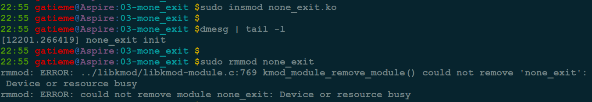
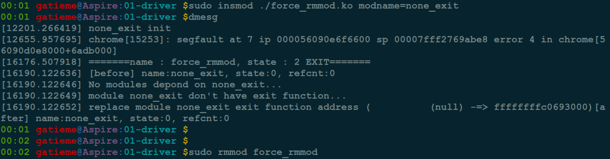
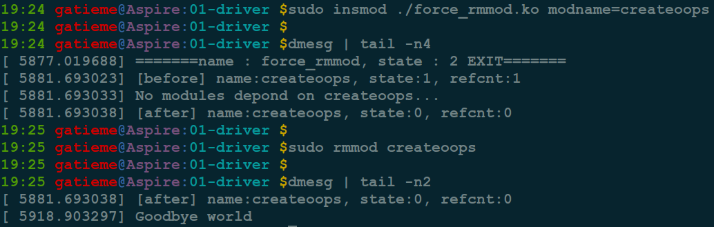

Linux强制卸载内核模块(由于驱动异常导致rmmod不能卸载)
=======

| CSDN | GitHub |
|:----:|:------:|
| [Linux强制卸载内核模块(由于驱动异常导致rmmod不能卸载)](http://blog.csdn.net/gatieme/article/details/75108154) | [`LDD-LinuxDeviceDrivers/study/driver/force_rmmod`](https://github.com/gatieme/LDD-LinuxDeviceDrivers/blob/master/study/driver/force_rmmod) |


<br>
<a rel="license" href="http://creativecommons.org/licenses/by-nc-sa/4.0/"></a>
本作品采用<a rel="license" href="http://creativecommons.org/licenses/by-nc-sa/4.0/">知识共享署名-非商业性使用-相同方式共享 4.0 国际许可协议</a>进行许可, 转载请注明出处
<br>


#1	问题描述
-------

在进行驱动编程的时候, 如果驱动出现了异常, `insmod`, `rmmod` 或者使用过程中出现了异常, 那么导致系统的驱动加载了, 但是却无法被卸载, 或者卸载时出错.

就比如前面我们在博文 [Linux Kernel PANIC(三)--Soft Panic/Oops调试及实例分析](http://blog.csdn.net/gatieme/article/details/73715860) 中讲解调试内核 `OOPS` 时, 使用的有异常的驱动, `kerneloops` 或者 `createoops`, 他们在初始化函数 `init`中出现了 `NULL` 指针异常


我们以 `kerneloops` 为示例, 来进行演示.


首先编译并加载驱动, 然后dmesg会发现出现了异常

```cpp
make
sudo insmod kerneloops.ko
demsg
```

接着我们 `rmmod kerneloops`, 提示

>rmmod: ERROR: Module kerneloops is in use


#2	原因分析
-------

*	为什么 `kerneloops` 驱动无法被卸载呢 ?

错误提示信息已经提示的很明显了

>rmmod: ERROR: Module kerneloops is in use

进一步通过 `lsmod | grep kerneloops` 可以发现驱动 `kerneloops` 的 使用数目 `Used` 为 `1`


前面已经发现了, 我们这个驱动是因为在 `insmod` 的时候出现 `NULL` 指针异常, 导致驱动虽然被加载了( `kerneloops` 驱动的结点已经被插入到内核设备树中),  但是驱动运行过程中却导致内核段错误 `OOPS`, 设备引用计数没有被正确释放掉, 而且也不可能被主动释放, 但是我们的驱动已经挂掉了.

此时内核以为驱动正被使用, 此时 `rmmod` 必然失败, 内核怎么可能卸载一个正在被使用的驱动呢.

原因都找到了, 办法肯定是有的, 就是通过其他方式主动将  `kerneloops` 驱动的引用计数清 `0`


#3	驱动无法卸载的原因

*	那么还有没有其他原因, 导致驱动故障以后, 驱动无法被卸载呢?

解铃还须系铃人, 既然是在内核中出了问题, 还是需要在内核中寻找办法, 解决这类问题的前提是对内核卸载模块的精确理解, 流程都理解透了, 害怕找不到原因吗?


##3.1	驱动卸载的流程
-------


按照这个原则，查到了 `rmmod` 最终调用的代码 :


rmmod 调用的系统调用为 `sys_delet_module` 在内核中被声明为 `delete_module` [include/uapi/asm-generic/unistd.h, version 4.11.7, line 336](http://elixir.free-electrons.com/linux/v4.11.7/source/include/uapi/asm-generic/unistd.h#L336), 如下所示

```cpp
#define __NR_delete_module 106
__SYSCALL(__NR_delete_module, sys_delete_module)
```

可以在 [ernel/module.c, version 4.11.7, line 936](http://elixir.free-electrons.com/linux/v4.11.7/source/kernel/module.c#L936) 中找到函数的定义

```
SYSCALL_DEFINE2(delete_module, const char __user *, name_user,
		unsigned int, flags)
{
	struct module *mod;
	char name[MODULE_NAME_LEN];
	int ret, forced = 0;

	if (!capable(CAP_SYS_MODULE) || modules_disabled)
		return -EPERM;

	if (strncpy_from_user(name, name_user, MODULE_NAME_LEN-1) < 0)
		return -EFAULT;
	name[MODULE_NAME_LEN-1] = '\0';

	if (mutex_lock_interruptible(&module_mutex) != 0)
		return -EINTR;

	// 根据模块名name, 查找到对应的内核模块结构体
	mod = find_module(name);
	if (!mod) {
		ret = -ENOENT;
		goto out;
	}

    /////////////////////
    ///  检查驱动是否可以卸载
    /////////////////////
    //  ==1==
    //  列出所有依赖于mod的模块
    //  如果其它模块依赖该模块, 则不能删除
	if (!list_empty(&mod->source_list)) {
		/* Other modules depend on us: get rid of them first. */
		ret = -EWOULDBLOCK;
		goto out;
	}

    //  ==2==
	//  只有LIVE状态的模块才能被卸载
    //  否则就无法进行卸载, 得到的结果是busy
	/* Doing init or already dying? */
	if (mod->state != MODULE_STATE_LIVE) {
		/* FIXME: if (force), slam module count damn the torpedoes */
		pr_debug("%s already dying\n", mod->name);
		ret = -EBUSY;
		goto out;
	}

    //  ==3==
	//  驱动模块必须有exit函数来退出
    //  如果没有则无法退出, 提示驱动busy
	/* If it has an init func, it must have an exit func to unload */
	if (mod->init && !mod->exit) {
		forced = try_force_unload(flags);
		if (!forced) {
			/* This module can't be removed */
			ret = -EBUSY;
			goto out;
		}
	}

	//  ==4==
	//  确认模块正在运行(是否有设备在使用当前驱动模块)
    //  否则内核无法停止一个正在使用的内核模块
	/* Stop the machine so refcounts can't move and disable module. */
	ret = try_stop_module(mod, flags, &forced);
	if (ret != 0)
		goto out;

	mutex_unlock(&module_mutex);

    /////////////////////
    ///  下面开始卸载驱动
    /////////////////////
    //  执行模块的exit函数来退出驱动, 清理模块信息
	/* Final destruction now no one is using it. */
	if (mod->exit != NULL)
		mod->exit();  // ==5==如果在这个里面阻塞了, 那就无法返回了
	blocking_notifier_call_chain(&module_notify_list,
				     MODULE_STATE_GOING, mod);
	klp_module_going(mod);
	ftrace_release_mod(mod);

	async_synchronize_full();

	/* Store the name of the last unloaded module for diagnostic purposes */
	strlcpy(last_unloaded_module, mod->name, sizeof(last_unloaded_module));

	free_module(mod);
	return 0;
out:
	mutex_unlock(&module_mutex);
	return ret;
}
```


其中 `try_force_unload` 定义在 [kernel/module.c, version 4.11.7,  line 874](http://elixir.free-electrons.com/linux/v4.11.7/source/kernel/module.c#L874)

```
#ifdef CONFIG_MODULE_FORCE_UNLOAD
static inline int try_force_unload(unsigned int flags)
{
	int ret = (flags & O_TRUNC);
	if (ret)
		add_taint(TAINT_FORCED_RMMOD, LOCKDEP_NOW_UNRELIABLE);
	return ret;
}
#else
static inline int try_force_unload(unsigned int flags)
{
	return 0;
}
#endif /* CONFIG_MODULE_FORCE_UNLOAD */
```

其中 `try_stop_module` 主要是检查模块的引用计数是否为 `0`. 如果不为0, 返回 `EWOULDBLOCK`, 即 `Module XXX is in use`.

```cpp
static int try_stop_module(struct module *mod, int flags, int *forced)
{
	/* If it's not unused, quit unless we're forcing. */
	if (try_release_module_ref(mod) != 0) {
		*forced = try_force_unload(flags);
		if (!(*forced))
			return -EWOULDBLOCK;
	}

	/* Mark it as dying. */
	mod->state = MODULE_STATE_GOING;

	return 0;
}
```


##3.2	驱动无法卸载的几种情形以及解决方法
-------


分析卸载驱动的内核代码, 我们可以总结出, 驱动无法卸载的几种情形.

| 编号 | 描述 | 提示 | 解决方法 |
|:---:|:----:|
| 情况1 | 有其它模块依赖要卸载的模块。模块a是否依赖模块b，这个在模块a加载的时候调用resolve_symbol抉择，如果模块a的symbol在模块b中，则依赖 | busy | 多数情况下不是异常导致, 多数情况下, 我们无需处理, 如果希望强制卸载, 则将依赖的其他模块卸载掉, 再卸载当前模块就好 |
| 情况2 | 只有LIVE状态的模块才能被卸载 | busy | 也不算是异常, 如果非要强制卸载可以手动通过其他模块将 `mod->state` 置为 `MODULE_STATE_LIVE` |
| 情况3 | 驱动没有exit函数也同样无法被卸载 | busy | 如果是因为exit函数异常导致的问题, 则只能通过外部注册 `exit` 函数, 并且替代模块原来的 `exit` 函数来解决, 当然外部 `exit` 函数的实现, 需要根据具体情况具体分析 |
| 情况4 | 引用计数在有其它模块或者内核本身引用的时候不为0，要卸载就要等待它们不引用为止 | used | 与情况2类似, 通过外部修正的方式, 将驱动的引用计数置 `0` 即可 |


此外还有一种情况, 比较隐蔽, 就是如果 模块执行 `exit` 函数, 即 `mod->exit()` 时没有正确退出(比如出现异常或者exit函数阻塞等), 那么也将导致驱动无法被卸载.

| 编号 | 描述 | 提示 |
|:---:|:----:|
| 情况5 | 如果在执行 `exit` 函数时没有正常退出, 也将导致驱动无法正常卸载 | |

其中情况 `3` 和情况 `5` 类似, 都是因为 `exit` 不正确(缺失或者异常), 导致的问题, 只能通过外部注册 `exit` 函数, 当然也可以特殊情况特殊考虑， 具体的做法根据驱动功能和实现的不同有所差异, 但是基本思想相同.


>驱动模块有多种状态, 其中 LIVE 表示当前驱动模块正常运行.
>
>参见 [include/linux/module.h, line 277](http://elixir.free-electrons.com/linux/v4.12.1/source/include/linux/module.h#L277)
>
>```cpp
enum module_state {
	MODULE_STATE_LIVE,	/* Normal state. */
	MODULE_STATE_COMING,	/* Full formed, running module_init. */
	MODULE_STATE_GOING,	/* Going away. */
	MODULE_STATE_UNFORMED,	/* Still setting it up. */
};
```


#4	实例分析
-------

这里情形1我们不做考虑, 我们只考虑那些可能由于驱动设计不合理, 或者代码bug导致的驱动无法卸载的情形.

我们将余下的情形分为2类

*	仅需修正目标驱动的状态, 情形2(驱动状态不为 `LIVE`)和情形4, (驱动应用计数不为0), 这种处理结果比较简单, 通过外部模块修改目标驱动的状态值和引用计数即可.

*	需要注册外部 `exit` 函数的, 如情形3( `eixt` 缺失) 和情形5( `exit` 异常), 由于驱动可能创建了很多数据结构等, 所以 `exit` 函数需要根据实际场景进行调整. 这种情形下, 往往同时也需要修正目标驱动的状态和引用计数.


##4.1	force_rmmod外部驱动模块强制卸载异常驱动
-------

为此设计了 `force_rmmod` 外部模块用于卸载外部的驱动.


##4.2	情形3--没有exit函数的异常模块
-------

没有 `exit` 函数的驱动是无法被卸载的, 如果我们设计的驱动没有 exit函数, 那么将导致驱动无法卸载.


示例代码 `none_hello` 如下所示 :

```cpp
//  none_exit.c
#include <linux/module.h>
#include <linux/kernel.h>
#include <linux/init.h>


MODULE_LICENSE("Dual BSD/GPL");
MODULE_AUTHOR("Gatieme");
MODULE_DESCRIPTION("none_exit world");


static int none_exit_init(void)
{
    printk("none_exit init\n");
    return 0;
}
module_init(none_exit_init);

#if 0
static void none_exit_exit(void)
{
    printk(KERN_ERR"exit");
}
module_exit(none_exit_exit);
#endif
```


此时构建内核模块, 加载完成后, 发现内核模块 `none_exit` 加载成功, 但是却无法卸载.

```cpp
make # 构建驱动
sudo insmod none_exit.ko  # 加载驱动
dmesg | tail -l  # 查看日志信息, 发现驱动加载成功
sudo rmmod none_exit
```



`rmmod` 卸载驱动时, 提示

```cpp
rmmod: ERROR: ../libkmod/libkmod-module.c:769 kmod_module_remove_module() could not remove 'none_exit': Device or resource busy
rmmod: ERROR: could not remove module none_exit: Device or resource busy
```

如果想要正常卸载此驱动模块, 可以通过外部注册 `exit` 函数的方式, 替换掉 `none_exit` 模块的 `exit`函数

即基本流程如下

1.	查找到 `none_exit` 模块的内核模块结构 `struct moudle`, 可以通过 `find_module` 函数查找到, 也可以参照 `find_module` 函数实现.

    ```cpp
    mod = find_module(del_mod_name)
    ```

2.	设计新的 `exit` 函数, 替代原来的 `exit` 函数

    ```cpp
    //  此处为外部注册的待卸载模块的exit函数
    //  用于替代模块原来的exit函数
    //  注意--此函数由于需要被待删除模块引用, 因此不能声明为static
    /* static */ void force_replace_exit_module_function(void)
    {
        /////////////////////
        //  此处完善待卸载驱动的 exit/cleanup 函数
        /////////////////////

        printk("module %s exit SUCCESS...\n", modname);
    //    platform_device_unregister((struct platform_device*)(*(int*)symbol_addr));
    }

	/////////////////////
    //  替换/重新注册驱动的exit函数
    /////////////////////
    mod->exit = force_replace_exit_module_function;
    ```

> **注意**
>
>  外部 `exit` 函数的设计依赖于原驱动模块的实现, 特别是 `init` 函数的设计, `exit` 函数必须释放掉驱动构建的数据结构和结点信息


而此例子中, 我们用于演示的 `none_exit` 仅是一个简单的实例, 它没有那么多信息, 因此只需要一个简单的 `exit` 退出函数即可.


可以使用 `force_rmmod` 驱动实现卸载 `none_exit`, 可以根据需要自行补充 `exit` 函数 `force_replace_exit_module_function` 的实现.

编译时需要添加 `CONFIG_REPLACE_EXIT_FUNCTION` 宏, 可以通过

*	在 `Makefile` 中制定 `-DCONFIG_REPLACE_EXIT_FUNCTION`

或者

*	在 force_rmmod 驱动源码中添加 `#define CONFIG_REPLACE_EXIT_FUNCTION`

卸载 `none_exit` 的具体流程如下.

```cpp
#  通过 `modname` 制定待卸载驱动的信息
sudo insmod force_rmmod.ko modname=none_exit
#  查看是否加载成功, `exit` 函数是否正常替换
dmesg | tail -l
#  卸载 `none_exit` 驱动
sudo rmmod none_exit
#  卸载 `force_rmmod` 驱动
sudo rmmod force_rmmod
```



可以看到驱动 `none_exit` 被正常卸载

由于替换了 `none_exit` 驱动中的 `exit` 函数为 `force_rmmod` 驱动中的函数, 因此要首先卸载 `none_exit` 的时候, 再卸载 `force_rmmod`, 否则 `none_exit` 将同样卸载失败.


##4.3	情形4--引用计数不为0的异常情形
-------


驱动异常(比如段错误), 或者未正确初始化的时候(排除驱动被外部程序使用的情况, 这种情况属于正常情况, 并不是异常), 此时导致驱动无法被卸载.


最常见的情况下, 驱动使用过程中出现段错误, 导致内核出现 `Soft Panic`, 即 `Oops`, 此时驱动无法被卸载. 比如之前讲解[Linux Kernel PANIC(三)–Soft Panic/Oops调试及实例分析](http://blog.csdn.net/gatieme/article/details/73715860)时, 使用的示例就属于这种情形.


`kerneloops` 和 `createoops` 的情形均类似, 访问了 `NULL` 指针, 导致驱动段错误, 从而引起内核 `OOPS`.

*	[kerneloops](https://github.com/gatieme/LDD-LinuxDeviceDrivers/tree/master/study/debug/modules/panic/03-soft_panic/kerneloops)


*	[createoops](https://github.com/gatieme/LDD-LinuxDeviceDrivers/tree/master/study/debug/modules/panic/03-soft_panic/createoop)


`kerneloops` 的代码在[Linux Kernel PANIC(三)–Soft Panic/Oops调试及实例分析](http://blog.csdn.net/gatieme/article/details/73715860)中已经展示, 下面列出 `createoops` 为的代码
```cpp
#include <linux/kernel.h>
#include <linux/module.h>
#include <linux/init.h>

static void create_oops(void)
{
        *(int *)0 = 0;
}

static int __init my_oops_init(void)
{
        printk("oops from the module\n");
        create_oops();
       return (0);
}

static void __exit my_oops_exit(void)
{
        printk("Goodbye world\n");
}

module_init(my_oops_init);
module_exit(my_oops_exit);
```

在代码第 `17` 行, 出现了一个段错误.


他们在移除的过程中, 均提示

```cpp
rmmod: ERROR: Module XXX is in use
```

其本质就是模块的模块的引用计数不为 `0`, 要解决此类问题, 只需要将模块的引用计数强制置为 `0` 即可.

1.	查找到 `none_exit` 模块的内核模块结构 `struct moudle`, 可以通过 `find_module` 函数查找到, 也可以参照 `find_module` 函数实现.

2.	重置模块的引用计数

	```cpp
    //  清除驱动的引用计数
    for_each_possible_cpu(cpu)
    {
        local_set((local_t*)per_cpu_ptr(&(mod->refcnt), cpu), 0);
        //local_set(__module_ref_addr(mod, cpu), 0);
        //per_cpu_ptr(mod->refptr, cpu)->decs;
        //module_put(mod);
    }
    atomic_set(&mod->refcnt, 1);
	```


>**注意**
>
>  如果驱动是在 `exit` 函数中异常, 则我们同样需要替换其 `exit` 函数, 否则则不需要替换 `exit` 函数


可以使用 `force_rmmod` 驱动实现卸载 `kerneloops` 和 `createoops`, 可以根据需要自行补充 `exit` 函数 `force_replace_exit_module_function` 的实现. 如果需要补充 `exit` 函数编译时需要添加 `CONFIG_REPLACE_EXIT_FUNCTION` 宏, 可以通过

*	在 `Makefile` 中制定 `-DCONFIG_REPLACE_EXIT_FUNCTION`

或者

*	在 `force_rmmod` 驱动源码中添加 `#define CONFIG_REPLACE_EXIT_FUNCTION`

卸载 `createoops` 的具体流程如下.

```cpp
#  通过 `modname` 制定待卸载驱动的信息
sudo insmod force_rmmod.ko modname=createoops
#  查看是否加载成功, `exit` 函数是否正常替换
dmesg | tail -l
#  卸载 `createoops` 驱动
sudo rmmod createoops
#  卸载 `force_rmmod` 驱动
sudo rmmod force_rmmod
```



可以看到驱动 `createoops` 被正常卸载


#5	强制卸载驱动模块 `force_rmmod` 元吗
-------


最后附上 强制卸载驱动模块的简易版源码


https://github.com/gatieme/LDD-LinuxDeviceDrivers/tree/master/study/driver/force_rmmod/src/01-driver

源码 `force_rmmod.c`

```cpp
#include <linux/module.h>
#include <linux/init.h>
#include <linux/kernel.h>
#include <linux/cpumask.h>
#include <linux/list.h>
#include <asm-generic/local.h>
#include <linux/platform_device.h>
#include <linux/kallsyms.h>
#include <linux/sched.h>


/*
 *  加载模块的时候, 传递字符串到模块的一个全局字符数组里面
 *
 *  module_param_string(name, string, len, perm)
 *
 *  @name   在加载模块时，参数的名字
 *  @string 模块内部的字符数组的名字
 *  @len    模块内部的字符数组的大小
 *  #perm   访问权限
 *
 * */
static char *modname = NULL;
module_param(modname, charp, 0644);
MODULE_PARM_DESC(modname, "The name of module you want do clean or delete...\n");


//#define CONFIG_REPLACE_EXIT_FUNCTION

#ifdef CONFIG_REPLACE_EXIT_FUNCTION
//  此处为外部注册的待卸载模块的exit函数
//  用于替代模块原来的exit函数
//  注意--此函数由于需要被待删除模块引用, 因此不能声明为static
/* static */ void force_replace_exit_module_function(void)
{
    /////////////////////
    //  此处完善待卸载驱动的 exit/cleanup 函数
    /////////////////////

    printk("module %s exit SUCCESS...\n", modname);
//    platform_device_unregister((struct platform_device*)(*(int*)symbol_addr));
}
#endif  //  CONFIG_REPLACE_EXIT_FUNCTION


static int force_cleanup_module(char *del_mod_name)
{
    struct module   *mod = NULL, *relate = NULL;
    int              cpu;
#ifdef CONFIG_REPLACE_EXIT_FUNCTION
    void            *origin_exit_addr = NULL;
#endif

    /////////////////////
    //  找到待删除模块的内核module信息
    /////////////////////
#if 0
    //  方法一, 遍历内核模块树list_mod查询
    struct module *list_mod = NULL;
    /*  遍历模块列表, 查找 del_mod_name 模块  */
    list_for_each_entry(list_mod, THIS_MODULE->list.prev, list)
    {
        if (strcmp(list_mod->name, del_mod_name) == 0)
        {
            mod = list_mod;
        }
    }
    /*  如果未找到 del_mod_name 则直接退出  */
    if(mod == NULL)
    {
        printk("[%s] module %s not found\n", THIS_MODULE->name, modname);
        return -1;
    }
#endif

    //  方法二, 通过find_mod函数查找
    if((mod = find_module(del_mod_name)) == NULL)
    {
        printk("[%s] module %s not found\n", THIS_MODULE->name, del_mod_name);
        return -1;
    }
    else
    {
        printk("[before] name:%s, state:%d, refcnt:%u\n",
                mod->name ,mod->state, module_refcount(mod));
    }

    /////////////////////
    //  如果有其他驱动依赖于当前驱动, 则不能强制卸载, 立刻退出
    /////////////////////
    /*  如果有其他模块依赖于 del_mod  */
    if (!list_empty(&mod->source_list))
    {
        /*  打印出所有依赖target的模块名  */
        list_for_each_entry(relate, &mod->source_list, source_list)
        {
            printk("[relate]:%s\n", relate->name);
        }
    }
    else
    {
        printk("No modules depond on %s...\n", del_mod_name);
    }

    /////////////////////
    //  清除驱动的状态和引用计数
    /////////////////////
    //  修正驱动的状态为LIVE
    mod->state = MODULE_STATE_LIVE;

    //  清除驱动的引用计数
    for_each_possible_cpu(cpu)
    {
        local_set((local_t*)per_cpu_ptr(&(mod->refcnt), cpu), 0);
        //local_set(__module_ref_addr(mod, cpu), 0);
        //per_cpu_ptr(mod->refptr, cpu)->decs;
        //module_put(mod);
    }
    atomic_set(&mod->refcnt, 1);

#ifdef CONFIG_REPLACE_EXIT_FUNCTION
    /////////////////////
    //  重新注册驱动的exit函数
    /////////////////////
    origin_exit_addr = mod->exit;
    if (origin_exit_addr == NULL)
    {
        printk("module %s don't have exit function...\n", mod->name);
    }
    else
    {
        printk("module %s exit function address %p\n", mod->name, origin_exit_addr);
    }

    mod->exit = force_replace_exit_module_function;
    printk("replace module %s exit function address (%p -=> %p)\n", mod->name, origin_exit_addr, mod->exit);
#endif

    printk("[after] name:%s, state:%d, refcnt:%u\n",
            mod->name, mod->state, module_refcount(mod));

    return 0;
}


static int __init force_rmmod_init(void)
{
    return force_cleanup_module(modname);
}


static void __exit force_rmmod_exit(void)
{
    printk("=======name : %s, state : %d EXIT=======\n", THIS_MODULE->name, THIS_MODULE->state);
}

module_init(force_rmmod_init);
module_exit(force_rmmod_exit);

MODULE_LICENSE("GPL");
```

`Makefile` 信息

```cpp
MODULE_NAME := force_rmmod
#MODCFLAGS:=-O2 -Wall -DMODULE -D__KERNEL__ -DLINUX -std=c99
#EXTRA_CFLAGS  += $(MODULE_FLAGS) $(CFG_INC) $(CFG_INC)
EXTRA_CFLAGS  += -g -std=gnu99  -Wfatal-errors 


ifneq ($(KERNELRELEASE),) 	# kernelspace

obj-m := $(MODULE_NAME).o

else						# userspace


CURRENT_PATH ?= $(shell pwd)
LINUX_KERNEL ?= $(shell uname -r)
LINUX_KERNEL_PATH ?= /lib/modules/$(LINUX_KERNEL)/build

CURRENT_PATH := $(shell pwd)

modules:
	make -C $(LINUX_KERNEL_PATH) M=$(CURRENT_PATH) modules

modules_install:
	make -C $(LINUX_KERNEL_PATH) M=$(CURRENT_PATH) modules_install


clean:
	make -C $(LINUX_KERNEL_PATH) M=$(CURRENT_PATH) clean
	rm -f modules.order Module.symvers Module.markers

.PHNOY:
	modules modules_install clean


endif
```

#6	参考资料
-------


[强力卸载内核模块](http://blog.csdn.net/zhangskd/article/details/7945140)

[linux 强制删除内核模块(由于初始化错误导致rmmod不能删除)](http://www.cppblog.com/csjiaxin/archive/2012/06/06/136382.html?opt=randomfillcolumns)

[linux内核模块的强制删除](http://blog.csdn.net/newnewman80/article/details/7548978)

[linux3.x 内核如何强制卸载模块？](http://blog.csdn.net/xumin330774233/article/details/42522475)

[linux内核模块的强制删除-结束rmmod这类disk sleep进程](http://blog.csdn.net/dog250/article/details/6430818)

[强力卸载内核模块(一)](https://wenku.baidu.com/view/5c424561f5335a8102d22071.html)

[求助！！卸载驱动时，模块仍在使用中。module is in use ](http://bbs.chinaunix.net/thread-3619488-1-1.html)


[Linux模块编程机制之hello kernel](http://blog.csdn.net/bullbat/article/details/7347874)
<a rel="license" href="http://creativecommons.org/licenses/by-nc-sa/4.0/"></a>
<br>
本作品采用<a rel="license" href="http://creativecommons.org/licenses/by-nc-sa/4.0/">知识共享署名-非商业性使用-相同方式共享 4.0 国际许可协议</a>进行许可
