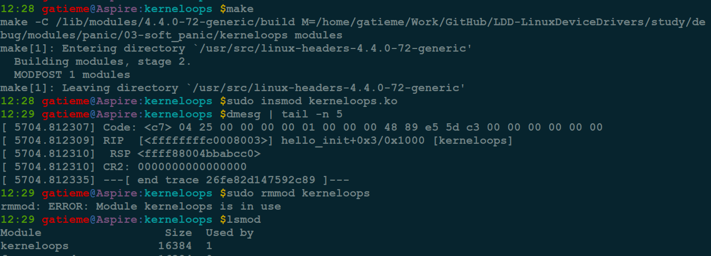

AderXCoding
=======

| CSDN | GitHub |
|:----:|:------:|
| [Aderstep--紫夜阑珊-青伶巷草](http://blog.csdn.net/gatieme) | [`AderXCoding/system/tools`](https://github.com/gatieme/AderXCoding/tree/master/system/tools) |


<br>
<a rel="license" href="http://creativecommons.org/licenses/by-nc-sa/4.0/"></a>
本作品采用<a rel="license" href="http://creativecommons.org/licenses/by-nc-sa/4.0/">知识共享署名-非商业性使用-相同方式共享 4.0 国际许可协议</a>进行许可, 转载请注明出处
<br>


#1	问题描述
-------

在进行驱动编程的时候, 如果驱动出现了异常, `insmod`, `rmmod` 或者使用过程中出现了异常, 那么导致系统的驱动加载了, 但是却无法被卸载, 或者卸载时出错.

就比如前面我们在博文 [Linux Kernel PANIC(三)--Soft Panic/Oops调试及实例分析](http://blog.csdn.net/gatieme/article/details/73715860) 中讲解调试内核 `OOPS` 时, 使用的有异常的驱动, `kerneloops` 或者 `createoops`, 他们在初始化函数 `init`中出现了 `NULL` 指针异常

源码在

*	[kerneloops](https://github.com/gatieme/LDD-LinuxDeviceDrivers/tree/master/study/debug/modules/panic/03-soft_panic/kerneloops)

*	[createoops](https://github.com/gatieme/LDD-LinuxDeviceDrivers/tree/master/study/debug/modules/panic/03-soft_panic/createoop)


我们以 `kerneloops` 为示例, 来进行演示.


首先编译并加载驱动, 然后dmesg会发现出现了异常

```cpp
make
sudo insmod kerneloops.ko
demsg
```

接着我们 `rmmod kerneloops`, 提示

>rmmod: ERROR: Module kerneloops is in use


#2	原因分析
-------

*	为什么 `kerneloops` 驱动无法被卸载呢 ?

错误提示信息已经提示的很明显了

>rmmod: ERROR: Module kerneloops is in use

进一步通过 `lsmod | grep kerneloops` 可以发现驱动 `kerneloops` 的 使用数目 `Used` 为 `1`





前面已经发现了, 我们这个驱动是因为在 `insmod` 的时候出现 `NULL` 指针异常, 导致驱动虽然被加载了( `kerneloops` 驱动的结点已经被插入到内核设备树中),  但是驱动运行过程中却导致内核段错误 `OOPS`, 设备引用计数没有被正确释放掉, 而且也不可能被主动释放, 但是我们的驱动已经挂掉了.

此时内核以为驱动正被使用, 此时 `rmmod` 必然失败, 内核怎么可能卸载一个正在被使用的驱动呢.

原因都找到了, 办法肯定是有的, 就是通过其他方式主动将  `kerneloops` 驱动的引用计数清 `0`


#3	驱动无法卸载的原因

*	那么还有没有其他原因, 导致驱动故障以后, 驱动无法被卸载呢?

解铃还须系铃人, 既然是在内核中出了问题, 还是需要在内核中寻找办法, 解决这类问题的前提是对内核卸载模块的精确理解, 流程都理解透了, 害怕找不到原因吗?


##3.1	驱动卸载的流程
-------


按照这个原则，查到了 `rmmod` 最终调用的代码 :


rmmod 调用的系统调用为 `sys_delet_module` 在内核中被声明为 `delete_module` [include/uapi/asm-generic/unistd.h, version 4.11.7, line 336](http://elixir.free-electrons.com/linux/v4.11.7/source/include/uapi/asm-generic/unistd.h#L336), 如下所示

```cpp
#define __NR_delete_module 106
__SYSCALL(__NR_delete_module, sys_delete_module)
```

可以在 [ernel/module.c, version 4.11.7, line 936](http://elixir.free-electrons.com/linux/v4.11.7/source/kernel/module.c#L936) 中找到函数的定义

```
SYSCALL_DEFINE2(delete_module, const char __user *, name_user,
		unsigned int, flags)
{
	struct module *mod;
	char name[MODULE_NAME_LEN];
	int ret, forced = 0;

	if (!capable(CAP_SYS_MODULE) || modules_disabled)
		return -EPERM;

	if (strncpy_from_user(name, name_user, MODULE_NAME_LEN-1) < 0)
		return -EFAULT;
	name[MODULE_NAME_LEN-1] = '\0';

	if (mutex_lock_interruptible(&module_mutex) != 0)
		return -EINTR;

	// 根据模块名name, 查找到对应的内核模块结构体
	mod = find_module(name);
	if (!mod) {
		ret = -ENOENT;
		goto out;
	}

    /////////////////////
    ///  检查驱动是否可以卸载
    /////////////////////
    //  ==1==
    //  列出所有依赖于mod的模块
    //  如果其它模块依赖该模块, 则不能删除
	if (!list_empty(&mod->source_list)) {
		/* Other modules depend on us: get rid of them first. */
		ret = -EWOULDBLOCK;
		goto out;
	}

    //  ==2==
	//  只有LIVE状态的模块才能被卸载
    //  否则就无法进行卸载, 得到的结果是busy
	/* Doing init or already dying? */
	if (mod->state != MODULE_STATE_LIVE) {
		/* FIXME: if (force), slam module count damn the torpedoes */
		pr_debug("%s already dying\n", mod->name);
		ret = -EBUSY;
		goto out;
	}

    //  ==3==
	//  驱动模块必须有exit函数来退出
    //  如果没有则无法退出, 提示驱动busy
	/* If it has an init func, it must have an exit func to unload */
	if (mod->init && !mod->exit) {
		forced = try_force_unload(flags);
		if (!forced) {
			/* This module can't be removed */
			ret = -EBUSY;
			goto out;
		}
	}

	//  ==4==
	//  确认模块正在运行(是否有设备在使用当前驱动模块)
    //  否则内核无法停止一个正在使用的内核模块
	/* Stop the machine so refcounts can't move and disable module. */
	ret = try_stop_module(mod, flags, &forced);
	if (ret != 0)
		goto out;

	mutex_unlock(&module_mutex);

    /////////////////////
    ///  下面开始卸载驱动
    /////////////////////
    //  执行模块的exit函数来退出驱动, 清理模块信息
	/* Final destruction now no one is using it. */
	if (mod->exit != NULL)
		mod->exit();  // ==5==如果在这个里面阻塞了, 那就无法返回了
	blocking_notifier_call_chain(&module_notify_list,
				     MODULE_STATE_GOING, mod);
	klp_module_going(mod);
	ftrace_release_mod(mod);

	async_synchronize_full();

	/* Store the name of the last unloaded module for diagnostic purposes */
	strlcpy(last_unloaded_module, mod->name, sizeof(last_unloaded_module));

	free_module(mod);
	return 0;
out:
	mutex_unlock(&module_mutex);
	return ret;
}
```


其中 `try_force_unload` 定义在 [kernel/module.c, version 4.11.7,  line 874](http://elixir.free-electrons.com/linux/v4.11.7/source/kernel/module.c#L874)

```
#ifdef CONFIG_MODULE_FORCE_UNLOAD
static inline int try_force_unload(unsigned int flags)
{
	int ret = (flags & O_TRUNC);
	if (ret)
		add_taint(TAINT_FORCED_RMMOD, LOCKDEP_NOW_UNRELIABLE);
	return ret;
}
#else
static inline int try_force_unload(unsigned int flags)
{
	return 0;
}
#endif /* CONFIG_MODULE_FORCE_UNLOAD */
```

其中 `try_stop_module` 主要是检查模块的引用计数是否为 `0`. 如果不为0, 返回 `EWOULDBLOCK`, 即 `Module XXX is in use`.

```cpp
static int try_stop_module(struct module *mod, int flags, int *forced)
{
	/* If it's not unused, quit unless we're forcing. */
	if (try_release_module_ref(mod) != 0) {
		*forced = try_force_unload(flags);
		if (!(*forced))
			return -EWOULDBLOCK;
	}

	/* Mark it as dying. */
	mod->state = MODULE_STATE_GOING;

	return 0;
}
```


##3.2	驱动无法卸载的几种情形以及解决方法
-------


分析卸载驱动的内核代码, 我们可以总结出, 驱动无法卸载的几种情形.

| 编号 | 描述 | 提示 | 解决方法 |
|:---:|:----:|
| 情况1 | 有其它模块依赖要卸载的模块。模块a是否依赖模块b，这个在模块a加载的时候调用resolve_symbol抉择，如果模块a的symbol在模块b中，则依赖 | busy | 多数情况下不是异常导致, 多数情况下, 我们无需处理, 如果希望强制卸载, 则将依赖的其他模块卸载掉, 再卸载当前模块就好 |
| 情况2 | 只有LIVE状态的模块才能被卸载 | busy | 也不算是异常, 如果非要强制卸载可以手动通过其他模块将 `mod->state` 置为 `MODULE_STATE_LIVE` |
| 情况3 | 驱动没有exit函数也同样无法被卸载 | busy | 如果是因为exit函数异常导致的问题, 则只能通过外部注册 `exit` 函数, 并且替代模块原来的 `exit` 函数来解决, 当然外部 `exit` 函数的实现, 需要根据具体情况具体分析 |
| 情况4 | 引用计数在有其它模块或者内核本身引用的时候不为0，要卸载就要等待它们不引用为止 | used | 与情况2类似, 通过外部修正的方式, 将驱动的引用计数置 `0` 即可 |


此外还有一种情况, 比较隐蔽, 就是如果 模块执行 `exit` 函数, 即 `mod->exit()` 时没有正确退出(比如出现异常或者exit函数阻塞等), 那么也将导致驱动无法被卸载.

| 编号 | 描述 | 提示 |
|:---:|:----:|
| 情况5 | 如果在执行 `exit` 函数时没有正常退出, 也将导致驱动无法正常卸载 | |

其中情况 `3` 和情况 `5` 类似, 都是因为 `exit` 不正确(缺失或者异常), 导致的问题, 只能通过外部注册 `exit` 函数, 当然也可以特殊情况特殊考虑， 具体的做法根据驱动功能和实现的不同有所差异, 但是基本思想相同.

#4	实例分析
-------

这里情形1我们不做考虑, 我们只考虑那些可能由于驱动设计不合理, 或者代码bug导致的驱动无法卸载的情形.

我们将余下的情形分为2类

*	仅需修正目标驱动的状态, 情形2(驱动状态不为 `LIVE`)和情形4, (驱动应用计数不为0), 这种处理结果比较简单, 通过外部模块修改目标驱动的状态值和引用计数即可.

*	需要注册外部 `exit` 函数的, 如情形3( `eixt` 缺失) 和情形5( `exit` 异常), 由于驱动可能创建了很多数据结构等, 所以 `exit` 函数需要根据实际场景进行调整. 这种情形下, 往往同时也需要修正目标驱动的状态和引用计数.


##4.1	force_rmmod外部驱动模块强制卸载异常驱动
-------

##4.2	

#参考资料
-------

[强力卸载内核模块](http://blog.csdn.net/zhangskd/article/details/7945140)

[linux 强制删除内核模块(由于初始化错误导致rmmod不能删除)](http://www.cppblog.com/csjiaxin/archive/2012/06/06/136382.html?opt=randomfillcolumns)

[linux内核模块的强制删除](http://blog.csdn.net/newnewman80/article/details/7548978)

[linux3.x 内核如何强制卸载模块？](http://blog.csdn.net/xumin330774233/article/details/42522475)

[linux内核模块的强制删除-结束rmmod这类disk sleep进程](http://blog.csdn.net/dog250/article/details/6430818)

https://wenku.baidu.com/view/5c424561f5335a8102d22071.html
http://bbs.chinaunix.net/thread-3619488-1-1.html

<a rel="license" href="http://creativecommons.org/licenses/by-nc-sa/4.0/"></a>
<br>
本作品采用<a rel="license" href="http://creativecommons.org/licenses/by-nc-sa/4.0/">知识共享署名-非商业性使用-相同方式共享 4.0 国际许可协议</a>进行许可
