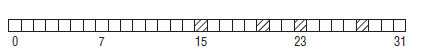
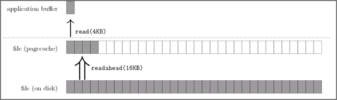
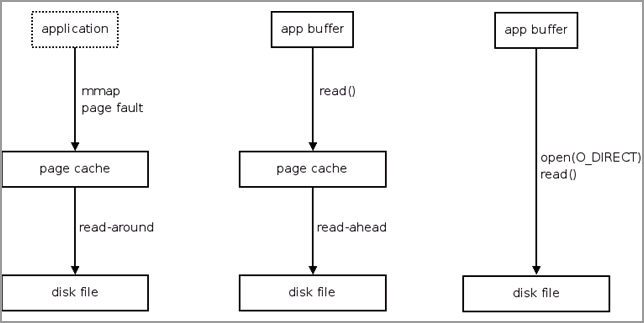

2   **内存管理子系统(memory management)**
=====================


# 0 内存管理子系统(开篇)
-------


## 0.1 内存管理子系统概述
------

**概述: **内存管理子系统**, 作为 kernel 核心中的核心, 是承接所有系统活动的舞台, 也是 Linux kernel 中最为庞杂的子系统, 没有之一．截止 4.2 版本, 内存管理子系统(下简称 MM)所有平台独立的核心代码(C文件和头文件)达到11万6千多行, 这还不包括平台相关的 C 代码, 及一些汇编代码; 与之相比, 调度子系统的平台独立的核心代码才2万８千多行．


现代操作系统的 MM 提供的一个重要功能就是为每个进程提供独立的虚拟地址空间抽象, 为用户呈现一个平坦的进程地址空间, 提供安全高效的进程隔离, 隐藏所有细节, 使得用户可以简单可移植的库接口访问／管理内存, 大大解放程序员生产力．


在继续往下之前, 先介绍一些 Linux 内核中内存管理的基本原理和术语, 方便后文讨论．


**- 物理地址(Physical Address):** 这就是内存 DIMM 上的一个一个存储区间的物理编址, 以字节为单位．


**- 虚拟地址(Virtual Address):** 技术上来讲, 用户或内核用到的地址就是虚拟地址, 需要 MMU (内存管理单元, 一个用于支持虚拟内存的 CPU 片内机构) 翻译为物理地址．在 CPU 的技术规范中, 可能还有虚拟地址和线性地址的区别, 但在这不重要．


**- NUMA(Non-Uniform Memory Access):** 非一致性内存访问．NUMA 概念的引入是为了解决随着 CPU 个数的增长而出现的内存访问瓶颈问题, 非一致性内存意为每个 NUMA 节点都有本地内存, 提供高访问速度; 也可以访问跨节点的内存, 但要遭受较大的性能损耗．所以尽管整个系统的内存对任何进程来说都是可见的, 但却存在访问速度差异, 这一点对内存分配/内存回收都有着非常大的影响．Linux 内核于2.5版本引入对 NUMA的支持[<sup>7</sup>](#refer-anchor-7).


**- NUMA node(NUMA节点):**  NUMA 体系下, 一个 node 一般是一个CPU socket(一个 socket 里可能有多个核)及它可访问的本地内存的整体．


**- zone(内存区):** 一个 NUMA node 里的物理内存又被分为几个内存区(zone), 一个典型的 node 的内存区划分如下:


可以看到每个node里, 随着**物理内存地址**的增加, 典型地分为三个区:

> **1\. ZONE\_DMA**: 这个区的存在有历史原因, 古老的 ISA 总线外设, 它们进行 DMA操作[<sup>10</sup>](#refer-anchor-10) 时, 只能访问内存物理空间低 16MB 的范围．所以故有这一区, 用于给这些设备分配内存时使用．
> **2\. ZONE\_NORMAL**: 这是 32位 CPU时代产物, 很多内核态的内存分配都是在这个区间(用户态内存也可以在这部分分配, 但优先在ZONE\_HIGH中分配), 但这部分的大小一般就只有 896 MiB, 所以比较局限． 64位 CPU 情况下, 内存的访问空间增大, 这部分空间就增大了很多．关于为何这部分区间这么局限, 且内核态内存分配在这个区间, 感兴趣的可以看我之间一个回答[<sup>11</sup>](#refer-anchor-11).
> **3\. ZONE\_HIGH**: 典型情况下, 这个区间覆盖系统所有剩余物理内存．这个区间叫做高端内存区(不是高级的意思, 是地址区间高的意思). 这部分主要是用户态和部分内核态内存分配所处的区间．


**- 内存页/页面(page):** 现代虚拟内存管理／分配的单位是一个物理内存页, 大小是 4096(4KB) 字节. 当然, 很多 CPU 提供多种尺寸的物理内存页支持(如 X86, 除了4KB, 还有 2MB, 1GB页支持), 但 Linux 内核中的默认页尺寸就是 4KB．内核初始化过程中, 会对每个物理内存页分配一个描述符(struct page), 后文描述中可能多次提到这个描述符, 它是 MM 内部, 也是 MM 与其他子系统交互的一个接口描述符．


**- 页表(page table):** 从一个虚拟地址翻译为物理地址时, 其实就是从一个稀疏哈希表中查找的过程, 这个哈希表就是页表．


**- 交换(swap):** 内存紧缺时, MM 可能会把一些暂时不用的内存页转移到访问速度较慢的次级存储设备中(如磁盘, SSD), 以腾出空间,这个操作叫交换, 相应的存储设备叫交换设备或交换空间.


**- 文件缓存页(PageCache Page):** 内核会利用空闲的内存, 事先读入一些文件页, 以期不久的将来会用到, 从而避免在要使用时再去启动缓慢的外设(如磁盘)读入操作. 这些有后备存储介质的页面, 可以在内存紧缺时轻松丢弃, 等到需要时再次从外设读入. **典型的代表有可执行代码, 文件系统里的文件.**

**- 匿名页(Anonymous Page):** 这种页面的内容都是在内存中建立的,没有后备的外设, 这些页面在回收时不能简单的丢弃, 需要写入到交换设备中. **典型的代表有进程的栈, 使用 _malloc()_ 分配的内存所在的页等 .**


## 0.2 概述
-------


内存管理的目标是提供一种方法, 为实现各种目的而在各个用户之间实现内存共享. 内存管理方法应该实现以下两个功能:

*   最小化管理内存所需的时间

*   最大化用于一般应用的可用内存(最小化管理开销)

内存管理实际上是一种关于权衡的零和游戏. 您可以开发一种使用少量内存进行管理的算法, 但是要花费更多时间来管理可用内存. 也可以开发一个算法来有效地管理内存, 但却要使用更多的内存. 最终, 特定应用程序的需求将促使对这种权衡作出选择.


| 时间  | 特性 | 描述 | 是否合入主线 | 链接 |
|:----:|:----:|:---:|:----------:|:---:|
| 1991/01/01 | [示例 sched: Improve the scheduler]() | 此处填写描述【示例】 | ☑ ☒☐ v3/5.4-rc1 | [LWN](), [PatchWork](), [lkml]() |
| 2016/06/27 | [mm: mirrored memory support for page buddy allocations](http://lore.kernel.org/patchwork/patch/574230) | 内存镜像的功能 | RFC v2 ☐  | [PatchWork](https://lore.kernel.org/patchwork/patch/574230) |


## 0.3 主线内存管理分支合并窗口
-------

Mainline Merge Window - Merge branch 'akpm' (patches from Andrew)

| 版本 | 发布时间 | 合并链接 |
|:---:|:-------:|:-------:|
| 5.13 | 2021/06/28 | [5.13-rc1 step 1 2021/04/30](https://git.kernel.org/pub/scm/linux/kernel/git/torvalds/linux.git/commit/?id=d42f323a7df0b298c07313db00b44b78555ca8e6)<br>[5.13-rc1 step 2 2021/05/05](https://git.kernel.org/pub/scm/linux/kernel/git/torvalds/linux.git/commit/?id=8404c9fbc84b741f66cff7d4934a25dd2c344452)<br>[5.13-rc2 2021/05/15](https://git.kernel.org/pub/scm/linux/kernel/git/torvalds/linux.git/commit/?id=a4147415bdf152748416e391dd5d6958ad0a96da)<br>[5.13-rc3 2021/05/22](https://git.kernel.org/pub/scm/linux/kernel/git/torvalds/linux.git/commit/?id=34c5c89890d6295621b6f09b18e7ead9046634bc)<br>[5.13-rc5 2021/06/05](https://git.kernel.org/pub/scm/linux/kernel/git/torvalds/linux.git/commit/?id=e5220dd16778fe21d234a64e36cf50b54110025f)<br>[5.13-rc7 2021/06/16](https://git.kernel.org/pub/scm/linux/kernel/git/torvalds/linux.git/commit/?id=70585216fe7730d9fb5453d3e2804e149d0fe201)<br>[5.13 2021/06/25](https://git.kernel.org/pub/scm/linux/kernel/git/torvalds/linux.git/commit/?id=7ce32ac6fb2fc73584b567c73ae0c47528954ec6) |
| 5.14 | NA | [5.14 2021/06/29](https://git.kernel.org/pub/scm/linux/kernel/git/torvalds/linux.git/commit/?id=65090f30ab791810a3dc840317e57df05018559c) |


## 0.4 社区会议
-------

### 0.4.1 Linux Plumbers Conference
-------

### 0.4.2 LSFMM(Linux Storage, Filesystem, and Memory-Management SummitScheduler Microconference Accepted into Linux Plumbers Conference

`2010~2017` 年的内容, 可以在 [wiki](http://wiki.linuxplumbersconf.org/?do=search&id=scheduler) 检索.

| 日期 | 官网 | LKML | LWN |
|:---:|:----:|:----:|:---:|
| NA | NA | NA | [The 2019 LSFMM Summit](https://lwn.net/Articles/lsfmm2019) |
| NA | NA | NA | [The 2018 LSFMM Summit](https://lwn.net/Articles/lsfmm2018) |


## 0.5 社区的内存管理领域的开发者
-------

| developer | git |
|:---------:|:---:|
| [David Rientjes <rientjes@google.com>](https://lore.kernel.org/patchwork/project/lkml/list/?submitter=6580&state=*&archive=both&param=4&page=1) | NA |
| [Mel Gorman <mgorman@techsingularity.net>](https://lore.kernel.org/patchwork/project/lkml/list/?submitter=19167&state=*&archive=both&param=3&page=1) | [git.kernel.org](https://git.kernel.org/pub/scm/linux/kernel/git/mel/linux.git) |
| [Minchan Kim <minchan@kernel.org>](https://lore.kernel.org/patchwork/project/lkml/list/?series=&submitter=13305&state=*&q=&archive=both&delegate=) | NA |
| [Joonsoo Kim](https://lore.kernel.org/patchwork/project/lkml/list/?submitter=13703&state=%2A&archive=both) | NA |
| [Kamezawa Hiroyuki <kamezawa.hiroyu@jp.fujitsu.com>](https://lore.kernel.org/patchwork/project/lkml/list/?submitter=4430&state=%2A&archive=both) | NA |
| [Kirill A. Shutemov <kirill.shutemov@linux.intel.com>](https://lore.kernel.org/patchwork/project/lkml/list/?submitter=13419&state=%2A&archive=both) | [git.kernel.org](https://git.kernel.org/pub/scm/linux/kernel/git/kas/linux.git)

## 0.6 社区地址
-------


| 描述 | 地址 |
|:---:|:----:|
| WebSite | [linux-mm](https://www.linux-mm.org) |
| PatchWork | [PatchWork](https://patchwork.kernel.org/project/linux-mm/list/?archive=both&state=*) |
| 邮件列表 | linux-mm@kvack.org |
| maintainer branch | [Github](https://github.com/hnaz/linux-mm)

## 0.7 目录
-------

下文将按此**目录**分析 Linux 内核中 MM 的重要功能和引入版本:


- [x] 1. 页表管理

- [x] 2. 内存分配

- [x] 3. 内存去碎片化

- [x] 4. 页面回收

- [x] 5. Swappiness

- [x] 6. PageCache

- [x] 7. 大内存页支持

- [x] 8. 内存控制组(Memory Cgroup)支持

- [x] 9. 内存热插拔支持

- [x] 10. 超然内存(Transcendent Memory)支持

- [x] 11. 非易失性内存 (NVDIMM, Non-Volatile DIMM) 支持

- [x] 12. 内存管理调试支持

- [x] 13. 杂项


# 1 页表管理
-------

| 时间  | 作者 | 特性 | 描述 | 是否合入主线 | 链接 |
|:----:|:----:|:---:|:----:|:---------:|:----:|
| 2020/04/28 | Matthew Wilcox <willy@infradead.org> | [Record the mm_struct in the page table pages](https://lore.kernel.org/patchwork/cover/1232723) | NA| v1 ☐ | [PatchWork 0/6](https://lore.kernel.org/patchwork/cover/1232723) |


## 1.1 多级页表
-------

**2.6.11(2005年3月发布)**

页表实质上是一个虚拟地址到物理地址的映射表, 但由于程序的局部性, 某时刻程序的某一部分才需要被映射, 换句话说, 这个映射表是相当稀疏的, 因此在内存中维护一个一维的映射表太浪费空间, 也不现实. 因此, 硬件层次支持的页表就是一个多层次的映射表.

Linux 一开始是在一台i386上的机器开发的, i386 的硬件页表是2级的(页目录项 -> 页表项), 所以, 一开始 Linux 支持的软件页表也是2级的; 后来, 为了支持 PAE (Physical Address Extension), 扩展为3级; 后来, 64位 CPU 的引入, 3级也不够了, 于是, 2.6.11 引入了四级的通用页表.


关于四级页表是如何适配 i386 的两级页表的, 很简单, 就是虚设两级页表. 类比下, 北京市(省)北京市海淀区东升镇, 就是为了适配4级行政区规划而引入的一种表示法. 这种通用抽象的软件工程做法在内核中不乏例子.

关于四级页表演进的细节, 可看我以前文章: [Linux内核4级页表的演进](https://link.zhihu.com/?target=http%3A//larmbr.com/2014/01/19/the-evolution-of-4-level-page-talbe-in-linux)

| 时间  | 作者 | 特性 | 描述 | 是否合入主线 | 链接 |
|:----:|:----:|:---:|:----:|:---------:|:----:|
| 2017/03/13 | "Kirill A. Shutemov" <kirill.shutemov@linux.intel.com> | [x86: 5-level paging enabling for v4.12, Part 1](https://lore.kernel.org/patchwork/cover/769534) | NA| v1 ☑ 4.12-rc1 | [PatchWork 0/6](https://lore.kernel.org/patchwork/cover/769534) |
| 2017/03/17 | "Kirill A. Shutemov" <kirill.shutemov@linux.intel.com> | [x86: 5-level paging enabling for v4.12, Part 2](https://lore.kernel.org/patchwork/cover/771246) | NA | v1 ☑ 4.12-rc1 | [PatchWork 0/6](https://lore.kernel.org/patchwork/cover/771246) |
| 2017/03/17 | "Kirill A. Shutemov" <kirill.shutemov@linux.intel.com> | [x86: 5-level paging enabling for v4.12, Part 3](https://lore.kernel.org/patchwork/cover/775152) | NA | v3 ☑ 4.12-rc1 | [PatchWork v3,0/7](https://lore.kernel.org/patchwork/cover/775152) |
| 2017/06/06 | "Kirill A. Shutemov" <kirill.shutemov@linux.intel.com> | [x86: 5-level paging enabling for v4.13, Part 4](https://lore.kernel.org/patchwork/cover/796033) | NA | v7 ☑ 4.14-rc1 | [PatchWork v7,00/14](https://lore.kernel.org/patchwork/cover/796033) |
| 2017/06/16 | "Kirill A. Shutemov" <kirill.shutemov@linux.intel.com> | [5-level paging enabling for v4.14](https://lore.kernel.org/patchwork/cover/810080) | NA | v7 ☑ 4.14-rc1 | [PatchWork 0/8](https://lore.kernel.org/patchwork/cover/810080) |
| 2017/06/22 | "Kirill A. Shutemov" <kirill.shutemov@linux.intel.com> | [Last bits for initial 5-level paging enabling](https://lore.kernel.org/patchwork/cover/802652) | NA | v1 ☑ 4.14-rc1 | [PatchWork 0/5](https://lore.kernel.org/patchwork/cover/802652) |
| 2017/08/07 | "Kirill A. Shutemov" <kirill.shutemov@linux.intel.com> | [Boot-time switching between 4- and 5-level paging](https://lore.kernel.org/patchwork/cover/818286) | NA | v3 ☑ 4.17-rc1 | [PatchWork v3,00/13](https://lore.kernel.org/patchwork/cover/818286) |


## 1.2 VA_BITS
-------

| 时间  | 作者 | 特性 | 描述 | 是否合入主线 | 链接 |
|:----:|:----:|:---:|:----:|:---------:|:----:|
| 2017/12/03 | Kristina Martsenko <kristina.martsenko@arm.com> | [arm64: enable 52-bit physical address support](https://lwn.net/Articles/849538) | 支持 ARMv8.2 的 52 bit 地址特性. | v3 ☐ 4.16-rc1 | [PatchWork 0/10](https://patchwork.kernel.org/project/linux-arm-kernel/patch/1513184845-8711-11-git-send-email-kristina.martsenko@arm.com) |
| 2019/08/07 | Steve Capper <steve.capper@arm.com> | [52-bit kernel + user VAs](https://lwn.net/Articles/849538) | 内核支持 52 bit 虚拟地址空间. | v5 ☐ 5.4-rc1 | [PatchWork v5 52-bit userspace VAs](https://patchwork.kernel.org/project/linux-arm-kernel/cover/20181206225042.11548-1-steve.capper@arm.com)<br>*-*-*-*-*-*-*-* <br>[PatchWork v5](https://patchwork.kernel.org/project/linux-arm-kernel/cover/20190807155524.5112-1-steve.capper@arm.com) |
| 2019/08/07 | Steve Capper <steve.capper@arm.com> | [arm64/mm: Enable FEAT_LPA2 (52 bits PA support on 4K|16K pages)](https://lwn.net/Articles/849538) | arm64 使能 FEAT_LPA2.<br>4K/16K PAGE_SIZE 下支持 52 bit PA. | RFC,V2 ☐ 5.14 | [PatchWork v5 52-bit userspace VAs](https://patchwork.kernel.org/project/linux-arm-kernel/cover/20181206225042.11548-1-steve.capper@arm.com)<br>*-*-*-*-*-*-*-* <br>[PatchWork RFC,V2,00/10](https://patchwork.kernel.org/project/linux-mm/cover/1627281445-12445-1-git-send-email-anshuman.khandual@arm.com) |


## 1.3 延迟页表缓存冲刷 (Lazy-TLB flushing)
-------

**极早引入, 时间难考**


有个硬件机构叫 TLB, 用来缓存页表查寻结果, 根据程序局部性, 即将访问的数据或代码很可能与刚访问过的在一个页面, 有了 TLB 缓存, 页表查找很多时候就大大加快了. 但是, 内核在切换进程时, 需要切换页表, 同时 TLB 缓存也失效了, 需要冲刷掉. 内核引入的一个优化是, 当切换到内核线程时, 由于内核线程不使用用户态空间, 因此切换用户态的页表是不必要, 自然也不需要冲刷 TLB. 所以引入了 Lazy-TLB 模式, 以提高效率. 关于细节, 可参考[kernel 3.10内核源码分析--TLB相关--TLB概念、flush、TLB lazy模式](https://www.cnblogs.com/sky-heaven/p/5133747.html)


## 1.4 [Clarifying memory management with page folios](https://lwn.net/Articles/849538)
-------


[LWN：利用page folio来明确内存操作！](https://blog.csdn.net/Linux_Everything/article/details/115388078)

[带有“memory folios”的 Linux：编译内核时性能提升了 7%](https://www.heikewan.com/item/27509944)

内存管理(memory management) 一般是以 page 为单位进行的, 一个 page 通常包含 4,096 个字节, 也可能更大. 内核已经将 page 的概念扩展到所谓的 compound page(复合页), 即一组组物理连续的单独 page 的组合. 这又使得 "page" 的定义变得有些模糊了. Matthew Wilcox 提出了 "page folio" 的概念, 它实际上仍然是一个 page structure, 只是保证了它一定不是 tail page. 任何接受 folio page 参数的函数都会是对整个 compound page 进行操作(如果传入的确实是一个 compound page 的话), 这样就不会有任何歧义. 从而可以使内核里的内存管理子系统更加清晰; 也就是说, 如果某个函数被改为只接受 folio page 作为参数的话, 很明确, 它们不适用于对 tail page 的操作. 通过 folio 结构来管理内存. 它提供了一些具有自身价值的基础设施, 将内核的文本缩减了约 6kB.


| 时间  | 作者 | 特性 | 描述 | 是否合入主线 | 链接 |
|:----:|:----:|:---:|:----:|:---------:|:----:|
| 2021/06/22 | "Matthew Wilcox (Oracle)" <willy@infradead.org> | [Memory folios](https://lwn.net/Articles/849538) | NA | v13a ☐ | [PatchWork v13,000/137](https://patchwork.kernel.org/project/linux-mm/cover/20210712030701.4000097-1-willy@infradead.org/)<br>[PatchWork v13a](https://patchwork.kernel.org/project/linux-mm/cover/20210712190204.80979-1-willy@infradead.org) |
| 2021/06/22 | "Matthew Wilcox (Oracle)" <willy@infradead.org> | [Folio-enabling the page cache](https://lwn.net/Articles/1450196) | NA | v2 ☐ | [PatchWork v2](https://lore.kernel.org/patchwork/cover/1450196), [PatchWork v2](https://patchwork.kernel.org/project/linux-mm/cover/20210622121551.3398730-1-willy@infradead.org) |
| 2021/06/30 | "Matthew Wilcox (Oracle)" <willy@infradead.org> | [Folio conversion of memcg](https://lwn.net/Articles/1450196) | NA | v3 ☐ | [PatchWork v13b](https://patchwork.kernel.org/project/linux-mm/cover/20210712194551.91920-1-willy@infradead.org/) |
| 2021/07/19 | "Matthew Wilcox (Oracle)" <willy@infradead.org> | [Folio support in block + iomap layers](https://lwn.net/Articles/1450196) | NA | v15 ☐ | [PatchWork v15,00/17](https://patchwork.kernel.org/project/linux-mm/cover/20210712194551.91920-1-willy@infradead.org/) |
| 2021/07/15 | "Matthew Wilcox (Oracle)" <willy@infradead.org> | [Memory folios: Pagecache edition](https://patchwork.kernel.org/project/linux-mm/cover/20210715200030.899216-1-willy@infradead.org) | NA | v14c ☐ | [PatchWork v14c,00/39](https://patchwork.kernel.org/project/linux-mm/cover/20210715200030.899216-1-willy@infradead.org) |
| 2021/07/15 | "Matthew Wilcox (Oracle)" <willy@infradead.org> | [Separate struct slab from struct page](https://patchwork.kernel.org/project/linux-mm/cover/20210715200030.899216-1-willy@infradead.org) | struct page 结构定义中比较复杂的部分之一是 slab 分配器所使用的部分. 一般来说, 如果将 slab 的数据类型从 page 结构体中分离是有好处的, 而且它还有助于防止尾页滑落到任何地方. | v1 ☐ | [PatchWork 00/62](https://patchwork.kernel.org/project/linux-mm/cover/20211004134650.4031813-1-willy@infradead.org) |


## 1.5 页面初始化
-------


| 时间  | 作者 | 特性 | 描述 | 是否合入主线 | 链接 |
|:----:|:----:|:---:|:----:|:---------:|:----:|
| 2008/04/28 | Mel Gorman <mel@csn.ul.ie> | [Verification and debugging of memory initialisation V4](https://lore.kernel.org/patchwork/cover/114302) | 引导初始化非常复杂, 有大量特定于体系结构的例程、挂钩和代码排序. 虽然大量的初始化是独立于体系结构的, 但它信任从体系结构层接收的数据. 这是一个错误, 并导致了一些难以诊断的错误. 这个补丁集为内存初始化添加了一些验证和跟踪. 它还介绍了一些基本的防御措施. 对于嵌入式系统, 可以显式禁用验证代码. | v6 ☑ 5.2-rc1 | [PatchWork mm,v6,0/7](https://lore.kernel.org/patchwork/cover/114302) |
| 2018/12/30 | Alexander Duyck <alexander.h.duyck@linux.intel.com> | [Deferred page init improvements](https://lore.kernel.org/patchwork/cover/1019963) | 该补丁集本质上是页面初始化逻辑的重构, 旨在提供更好的代码重用, 同时显著提高延迟页面初始化性能.<br>在我对 x86_64 系统的测试中, 每个节点有 384GB 的 RAM 和 3TB 的持久内存<br>1. 在常规内存初始化的情况下, 初始化时间平均从 3.75s 减少到 1.06s. 对于持久内存, 初始化时间平均从 24.17s 下降到 19.12s.<br>2. 这相当于内存初始化性能提高了 253%, 持久内存初始化性能提高了 26%. | v6 ☑ 5.2-rc1 | [PatchWork mm,v6,0/7](https://patchwork.kernel.org/project/linux-mm/cover/154361452447.7497.1348692079883153517.stgit@ahduyck-desk1.amr.corp.intel.com) |


## 1.6 madvise
-------

| 时间  | 作者 | 特性 | 描述 | 是否合入主线 | 链接 |
|:----:|:----:|:---:|:----:|:---------:|:----:|
| 2020/07/20 | Anthony Yznaga <anthony.yznaga@oracle.com> | [madvise MADV_DOEXEC](https://lore.kernel.org/patchwork/cover/1280469) | 这组补丁引入了 madvise MADV_DOEXEC 参数实现了跨 exec 金恒地址空间保留匿名页范围的支持. 与重新附加到命名共享内存段不同, 以这种方式共享内存的主要好处是确保新进程中的内存映射到与旧进程相同的虚拟地址. 这样做的目的是为使用 vfio 的 guest 保留 guest 的内存, 通过 qemu 使用 exec 可以生成一份其自身的更新版本. 通过确保内存保留在固定地址, vfio 映射及其相关的内核数据结构可以保持有效. | RFC ☐ | [PatchWork RFC,0/5](https://lore.kernel.org/patchwork/cover/1280469) |
| 2019/07/14 | Minchan Kim <minchan@kernel.org> | [Introduce MADV_COLD and MADV_PAGEOUT](https://patchwork.kernel.org/project/linux-mm/cover/20190714233401.36909-1-minchan@kernel.org) | NA | v5 ☑ 5.4-rc1 | [PatchWork v5,0/5](https://patchwork.kernel.org/project/linux-mm/cover/20190714233401.36909-1-minchan@kernel.org) |

*   MADV_DONTNEED

| 时间  | 作者 | 特性 | 描述 | 是否合入主线 | 链接 |
|:----:|:----:|:---:|:----:|:---------:|:----:|
| 2021/08/19 | Qi Zheng <zhengqi.arch@bytedance.com> | [Free user PTE page table pages](https://patchwork.kernel.org/project/linux-mm/cover/20210819031858.98043-1-zhengqi.arch@bytedance.com) | 这个补丁系列的目的是在所有 PTE 条目都为空时释放用户 PTE 页表页面.<br>一些malloc库(例如 jemalloc 或 tcmalloc) 通常通过 mmap() 分配 VAs 的数量, 而不取消这些 VAs 的映射. 如果需要, 他们将使用 madvise(MADV_DONTNEED) 来释放物理内存. 但是 madvise() 不会释放页表, 因此当进程接触到巨大的虚拟地址空间时, 它会生成许多页表.<br>PTE 页表占用大量内存的原因是 madvise(MADV_DONTNEED) 只清空 PTE 并释放物理内存, 但不释放 PTE 页表页. 这组补丁通过释放那些空的 PTE 页表来节省内存. | v1 ☐ | [PatchWork 0/7](https://lore.kernel.org/patchwork/cover/1461972)<br>*-*-*-*-*-*-*-* <br>[PatchWork v2,0/9](https://patchwork.kernel.org/project/linux-mm/cover/20210819031858.98043-1-zhengqi.arch@bytedance.com) |
| 2021/09/26 | Anthony Yznaga <anthony.yznaga@oracle.com> | [mm/madvise: support process_madvise(MADV_DONTNEED)](https://patchwork.kernel.org/project/linux-mm/cover/20210926161259.238054-1-namit@vmware.com) | 这些补丁的目标是添加对 process_madvise(MADV_DONTNEED) 的支持. 然而, 在这个过程中, 执行了一些(可以说)有用的清理、bug修复和性能增强. 这些补丁试图整合不同行为之间的逻辑, 并在一定程度上解决与之前[比较出彩的补丁](https://lore.kernel.org/linux-mm/CAJuCfpFDBJ_W1y2tqAT4BGtPbWrjjDud_JuKO8ZbnjYfeVNvRg@mail.gmail.com) 的冲突.<br>process_madvise(MADV_DONTNEED) 之所以有用有两个原因:<br>(a)它允许 userfaultfd 监视器从被监控的进程中取消内存映射;<br>(b) 它 比 madvise() 更有效, 因为它是矢量化的, 批处理 TLB 刷新更积极. | RFC ☐ | [PatchWork RFC,0/8](https://patchwork.kernel.org/project/linux-mm/cover/20210926161259.238054-1-namit@vmware.com) |


## 1.7 page table pages
-------

### 1.7.1 Quicklist
-------

| 时间  | 作者 | 特性 | 描述 | 是否合入主线 | 链接 |
|:----:|:----:|:---:|:----:|:---------:|:----:|
| 2007/03/23 | Christoph Lameter <clameter@sgi.com> | [Quicklists for page table pages V4](https://lore.kernel.org/patchwork/cover/76916) | NA | v1 ☐ | [PatchWork v1](https://lore.kernel.org/patchwork/cover/76097)<br>*-*-*-*-*-*-*-* <br>[PatchWork v2](https://lore.kernel.org/patchwork/cover/76244)<br>*-*-*-*-*-*-*-* <br> [PatchWork v3](https://lore.kernel.org/patchwork/cover/76702)<br>*-*-*-*-*-*-*-* <br>[PatchWork v4](https://lore.kernel.org/patchwork/cover/76916)<br>*-*-*-*-*-*-*-* <br>[PatchWork v5](https://lore.kernel.org/patchwork/cover/78116) |
| 2019/08/08 | Christoph Lameter <clameter@sgi.com> | [mm: remove quicklist page table caches](https://lore.kernel.org/patchwork/cover/1112468) | 内核提前直接映射好足够的 PTE 级别的页面, 引入 `__GFP_PTE_MAPPED` 标志, 当使用此标记分配 order 为 0 页面时, 将在直接映射中的 PTE 级别进行映射.<br>目前只是分配页表时使用 `__GFP_PTE_MAPPED` 分配页表, 以便它们在直接映射中具有 4K PTE. | v1  ☐ | [PatchWork v5](https://lore.kernel.org/patchwork/cover/1112468) |


### 1.7.2 cached mapped
-------


| 时间  | 作者 | 特性 | 描述 | 是否合入主线 | 链接 |
|:----:|:----:|:---:|:----:|:---------:|:----:|
| 2021/08/23 | Mike Rapoport <rppt@linux.ibm.com> | [mm/page_alloc: cache pte-mapped allocations](https://lore.kernel.org/patchwork/cover/1480366) | NA | v1  ☐ | [PatchWork RFC,0/4](https://lore.kernel.org/patchwork/cover/1480366) |


### 1.7.3 安全
-------

#### 1.7.3.1 PKS
-------

页表是许多类型保护的基础, 因此是攻击者的攻击目标. 将它们映射为只读将使它们更难在攻击中使用. 内核开发者提出了通过 PKS 来对内核页表进行写保护. 这可以防止攻击者获得写入页表的能力. 这并不是万无一失的. 因为能够执行任意代码的攻击者可以直接禁用 PKS. 或者简单地调用内核用于合法页表写入的相同函数.

[PKS](https://lore.kernel.org/lkml/20210401225833.566238-1-ira.weiny@intel.com) 是即将推出的 CPU 功能, 它允许在不刷新 TLB 的情况下更改监控器虚拟内存权限, 就像 PKU 对用户内存所做的那样. 保护页表通常会非常昂贵, 因为您必须通过分页本身来实现. PKS 提供了一种切换页面表可写性的方法, 这只需要 MSR 操作即可完成.


| 时间  | 作者 | 特性 | 描述 | 是否合入主线 | 链接 |
|:----:|:----:|:---:|:----:|:---------:|:----:|
| 2020/09/04 | Rick Edgecombe <rick.p.edgecombe@intel.com> | [arm64: Memory Tagging Extension user-space support](https://patchwork.kernel.org/project/linux-mm/cover/20200904103029.32083-1-catalin.marinas@arm.com) | 使用 [PKS(Protection Keys for Supervisor)]() 对页表进行写保护. 其基本思想是使页表成为只读的, 除非在需要修改页表时临时基于每个 cpu 来修改. | v1  ☐ | [PatchWork RFC,0/4](https://patchwork.kernel.org/project/linux-mm/cover/20200904103029.32083-1-catalin.marinas@arm.com) |

#### 1.7.3.2 内存标签扩展(Arm v8.5 memory tagging extension-MTE)
-------

[MTE技术在Android上的应用](https://zhuanlan.zhihu.com/p/353807709)

[Memory Tagging Extension (MTE) 简介（一）](https://blog.csdn.net/weixin_47569031/article/details/114694733)

[LWN：Arm64的内存标记扩展功能！](https://blog.csdn.net/Linux_Everything/article/details/109396397)


MTE(Memory Tag) 是 ARMV8.5 增加一个硬件特性, 主要用于内存安全. 通过硬件 Arch64 MTE 和 compiler 辅助, 可以增加 64bit 进程的内存安全.

MTE 实现了锁和密钥访问内存. 这样在内存访问期间, 可以在内存和密钥上设置锁. 如果钥匙与锁匹配, 则允许进入. 如果不匹配, 则报告错误. 通俗讲就是为每个分配内存都打上一个 TAG(可以认为是访问内存的密钥或者键值), 当通过指针地址访问内存的时候, 硬件会比较指针里面的 TAG 与实际内存 TAG 是否匹配, 如果不匹配则检测出错误.


通过在物理内存的每个 16 字节中添加 4 位元数据来标记内存位置. 这是标签颗粒. 标记内存实现了锁. 指针和虚拟地址都被修改为包含键. 为了实现关键位而不需要更大的指针, MTE 使用了 ARMv8-A 体系结构的 Top Byte Ignore (TBI) 特性. 当启用 TBI 时, 当将虚拟地址作为地址转换的输入时, 虚拟地址的上字节将被忽略.

| 时间  | 作者 | 特性 | 描述 | 是否合入主线 | 链接 |
|:----:|:----:|:---:|:----:|:---------:|:----:|
| 2020/09/04 | Catalin Marinas <catalin.marinas@arm.com> | [arm64: Memory Tagging Extension user-space support](https://patchwork.kernel.org/project/linux-mm/cover/20200904103029.32083-1-catalin.marinas@arm.com) | NA | v9 ☑ 5.10-rc1 | [2019/12/11 PatchWork 00/22](https://patchwork.kernel.org/project/linux-mm/cover/20191211184027.20130-1-catalin.marinas@arm.com)<br>*-*-*-*-*-*-*-* <br>[2020/09/04 PatchWork v9,00/29](https://patchwork.kernel.org/project/linux-mm/cover/20200904103029.32083-1-catalin.marinas@arm.com) |

## 1.8 memory policy
-------

| 时间  | 作者 | 特性 | 描述 | 是否合入主线 | 链接 |
|:----:|:----:|:---:|:----:|:---------:|:----:|
| 2021/08/03 | Feng Tang <feng.tang@intel.com> | [Introduce multi-preference mempolicy](https://lore.kernel.org/patchwork/cover/1471473) | 引入 MPOL_PREFERRED_MANY 的 policy, 该 mempolicy 模式可用于 set_mempolicy 或 mbind 接口.<br>1. 与 MPOL_PREFERRED 模式一样, 它允许应用程序为满足内存分配请求的节点设置首选项.但是与 MPOL_PREFERRED 模式不同, 它需要一组节点.<br>2. 与 MPOL_BIND 接口一样, 它在一组节点上工作, 与 MPOL_BIND 不同, 如果首选节点不可用, 它不会导致 SIGSEGV 或调用 OOM killer. | v7 ☐ | [PatchWork v7,0/5](https://lore.kernel.org/patchwork/cover/1471473) |

## 1.9 page attributes
-------


# 2 内存分配
-------


每个内存管理器都使用了一种基于堆的分配策略. 在这种方法中, 大块内存(称为 堆)用来为用户定义的目的提供内存. 当用户需要一块内存时, 就请求给自己分配一定大小的内存. 堆管理器会查看可用内存的情况(使用特定算法)并返回一块内存. 搜索过程中使用的一些算法有first-fit(在堆中搜索到的第一个满足请求的内存块) 和 best-fit(使用堆中满足请求的最合适的内存块). 当用户使用完内存后, 就将内存返回给堆.

这种基于堆的分配策略的根本问题是碎片(fragmentation). 当内存块被分配后, 它们会以不同的顺序在不同的时间返回. 这样会在堆中留下一些洞, 需要花一些时间才能有效地管理空闲内存. 这种算法通常具有较高的内存使用效率(分配需要的内存), 但是却需要花费更多时间来对堆进行管理.

另外一种方法称为 buddy memory allocation, 是一种更快的内存分配技术, 它将内存划分为 2 的幂次方个分区, 并使用 best-fit 方法来分配内存请求. 当用户释放内存时, 就会检查 buddy 块, 查看其相邻的内存块是否也已经被释放. 如果是的话, 将合并内存块以最小化内存碎片. 这个算法的时间效率更高, 但是由于使用 best-fit 方法的缘故, 会产生内存浪费.

## 2.1 页分配器: 伙伴分配器[<sup>12<sup>](#ref-anchor-12)
-------


### 2.1.1 BUDDY 伙伴系统
-------

古老, 具体时间难考 , 应该是生而有之. orz...

内存页分配器, 是 MM 的一个重大任务, 将内存页分配给内核或用户使用. 内核把内存页分配粒度定为 11 个层次, 叫做阶(order). 第0阶就是 2^0 个(即1个)连续物理页面, 第 1 阶就是 2^1 个(即2个)连续物理页面, ..., 以此类推, 所以最大是一次可以分配 2^10(= 1024) 个连续物理页面.


所以, MM 将所有空闲的物理页面以下列链表数组组织进来:


(图片来自[Physical Page Allocation](https://link.zhihu.com/?target=https%3A//www.kernel.org/doc/gorman/html/understand/understand009.html))


那伙伴(buddy)的概念从何体现?

体现在释放的时候, 当释放某个页面(组)时, MM 如果发现同一个阶中如果有某个页面(组) 跟这个要释放的页面(组) 是物理连续的, 那就把它们合并, 并升入下一阶(如: 两个 0 阶的页面, 合并后, 变为连续的2页面(组), 即一个1阶页面). 两个页面(组) 手拉手升阶, 所以叫伙伴.

关于 伙伴系统, 想了解的朋友可以参见我之前的博客.

|   日期   |   博文  |   链接   |
| ------- |:-------:|:-------:|
| 2016-06-14 | 伙伴系统之伙伴系统概述--Linux内存管理(十五) | [CSDN](https://kernel.blog.csdn.net/article/details/52420444), [GitHub](https://github.com/gatieme/LDD-LinuxDeviceDrivers/tree/master/study/kernel/02-memory/04-buddy/01-buddy_system) |
| 2016-09-28 | 伙伴系统之避免碎片--Linux内存管理(十六) | [CSDN](https://blog.csdn.net/gatieme/article/details/52694362), [GitHub](https://github.com/gatieme/LDD-LinuxDeviceDrivers/tree/master/study/kernel/02-memory/04-buddy/03-fragmentation) |


**关于 NUMA 支持:** Linux 内核中, 每个 zone 都有上述的链表数组, 从而提供精确到某个 node 的某个 zone 的伙伴分配需求.

| 时间  | 作者 | 特性 | 描述 | 是否合入主线 | 链接 |
|:----:|:----:|:---:|:----:|:---------:|:----:|
| 2016/04/15 | Mel Gorman | [Remove zonelist cache and high-order watermark checking v4](https://lore.kernel.org/patchwork/cover/599755) | 优化调度器的路径, 减少对 rq->lock 的争抢, 实现 lockless. | v4 ☑ 4.4-rc1 | [PatchWork v6](https://lore.kernel.org/patchwork/cover/599755) |
| 2016/04/15 | Mel Gorman | [Optimise page alloc/free fast paths v3](https://lore.kernel.org/patchwork/cover/668967) | 优化调度器的路径, 减少对 rq->lock 的争抢, 实现 lockless. | v3 ☑ 4.7-rc1 | [PatchWork v6](https://lore.kernel.org/patchwork/cover/668967) |
| 2016/07/08 | Mel Gorman | [Move LRU page reclaim from zones to nodes v9](https://lore.kernel.org/patchwork/cover/696408) | 将 LRU 页面的回收从 ZONE 切换到 NODE. | v3 ☑ 4.7-rc1 | [PatchWork v6](https://lore.kernel.org/patchwork/cover/696408) |
| 2016/07/15 | Mel Gorman | [Follow-up fixes to node-lru series v2](https://lore.kernel.org/patchwork/cover/698606) | node-lru 系列补丁的另一轮修复补丁, 防止 memcg 中警告被触发. | v3 ☑ 4.8-rc1 | [PatchWork v6](https://lore.kernel.org/patchwork/cover/698606) |
| 2019/11/21 | Pengfei Li <fly@kernel.page> | [Modify zonelist to nodelist v1](https://lore.kernel.org/patchwork/cover/1157012) | 目前, 如果我们想遍历所有节点, 我们必须遍历分区列表中的所有区域. 所以为了减少遍历节点所需的循环次数, 这一系列补丁将zonelist修改为nodelist. 引入了两个新的宏: <br>1) for_each_node_nlist<br>2) for_each_node_nlist_nodemask<br>这样带来的好处是:<br>1. 对于有N个节点的NUMA系统, 每个节点有M个区域, 在遍历节点时, 循环次数从N*M次减少到N次.<br>2. pg_data_t的大小减少了很多. | RFC,v1 ☐ | [PatchWork RFC,v1,00/19] Modify zonelist to nodelist v1](https://lore.kernel.org/patchwork/cover/1157012) |


一些核心的重构和修正


| 时间  | 作者 | 特性 | 描述 | 是否合入主线 | 链接 |
|:----:|:----:|:---:|:----:|:---------:|:----:|
| 2007/03/01 | "Matthew Wilcox (Oracle)" <willy@infradead.org> | [Rationalise `__alloc_pages` wrappers](https://patchwork.kernel.org/project/linux-mm/cover/20210225150642.2582252-1-willy@infradead.org) | NA | v3 ☑ 5.13-rc1 | [PatchWork v6](https://patchwork.kernel.org/project/linux-mm/cover/20210225150642.2582252-1-willy@infradead.org) |


### 2.1.2 zone 分区管理
-------


| 时间  | 作者 | 特性 | 描述 | 是否合入主线 | 链接 |
|:----:|:----:|:---:|:----:|:---------:|:----:|
| 2006/08/21 | Mel Gorman <mel@csn.ul.ie> | [Sizing zones and holes in an architecture independent manner V9](https://lore.kernel.org/patchwork/cover/63170) | NA | v1 ☑ v2.6.19-rc1 | [PatchWork 0/2](https://lore.kernel.org/patchwork/cover/63170) |
| 2007/12/11 | Mel Gorman <mel@csn.ul.ie> | [Use two zonelists per node instead of multiple zonelists v11r2](https://lore.kernel.org/patchwork/cover/99109) | 优化分配器处理区域列表, 区域列表指示分配目标区域的顺序. 类似地, 页面的直接回收会在区域数组上迭代. 为了保持一致性, 这组补丁将直接回收转换为使用分区列表, 并简化 zonelist 迭代器.<br>将每个节点的多个(两组)分区列表替换为两个分区列表, 一组用于系统中的每个分区类型, 另一组用于 GFP_THISNODE 分配. 根据 gfp 掩码允许的分区, 选择其中一个分区列表. 所有这些分区列表都会消耗内存并占用缓存线. | v1 ☑ v2.6.19-rc1 | [PatchWork v11r2,0/6](https://lore.kernel.org/patchwork/cover/99109) |
| 2021/08/10 | Baoquan He <bhe@redhat.com> | [Avoid requesting page from DMA zone when no managed pages](https://lore.kernel.org/patchwork/cover/1474378) | 在当前内核的某些地方, 它假定 DMA 区域必须具有托管页面, 并在启用 CONFIG_ZONE_DMA 时尝试请求页面. 但这并不总是正确的. 例如, 在 x86_64 的 kdump 内核中, 在启动的早期阶段, 只显示并锁定低 1M, 因此在 DMA 区域中根本没有托管页面. 如果从 DMA 区域请求页面, 此异常将始终导致页面分配失败. 这造成在 x86_64 的 kdump 内核中,  使用 GFP_DMA 创建的 atomic_pool_dma 会导致页面分配失败. dma-kmalloc 初始化也会导致页面分配失败. | v2 ☐ | [PatchWork RFC,v2,0/5](https://patchwork.kernel.org/project/linux-mm/cover/20210810094835.13402-1-bhe@redhat.com) |


### 2.1.2 fair allocation zone policy
-------

每个拥有一个工作负载的用户空间页面的区域必须以与区域大小成比例的速度老化. 否则, 单个页面在内存中停留的时间取决于它碰巧被分配的区域. 区域老化的不对称造成相当不可预测的老化行为, 并导致错误的页面被回收, 激活等.

但 v3.12 时, 开发者发现页面分配器和 kswapd 交互的方式, 将造成页面老化不平衡. 在分配新页面时, 页面分配器使用系统中所有分区的每个节点列表(按优先顺序排列). 当第一次迭代没有产生任何结果时, kswapd 将被唤醒, 分配器将重试. 由于以下方式 kswapd 回收区高水准而带可以从以上时分配低水印,分配器可能保持kswapd运行而kswapd回收确保页分配器可以防止分配中的第一个区zonelist长时间. 与此同时, 其他区域很少看到新的分配, 因此相比之下, 老化要慢得多. 其结果是, 偶尔放置在较低区域的页面在内存中占用的时间相对较多, 甚至在其对等页面长期被逐出后被提升到活动列表. 同时, 大部分 workingset 可能在首选区域上颠簸, 即使在较低区域中可能有大量可用内存.

即使是最基本的测试--反复读取比内存稍大的文件, 也会显示区域老化的破坏程度. 在这种情况下, 没有一个页面能够在内存中停留足够长的时间来被引用两次并被激活, 但是激活是非常频繁的

通过  fair zone allocator policy 来解决这个问题. 通过一个非常简单的循环分配器. 每个分区允许一批与分区大小成比例的分配, 用 NR_ALLOC_BATCH(PatchWork 早期版本用 zone->alloc_batch) 记录, 分配后将被视为已满. 当所有区域都已尝试且分配器进入慢路径并启动 kswapd 回收时, 批处理计数器将重置. 分配和回收现在公平地分布到所有可用/允许的区域.


| 时间  | 作者 | 特性 | 描述 | 是否合入主线 | 链接 |
|:----:|:----:|:---:|:----:|:---------:|:----:|
| 2013/08/02 | Mel Gorman <mgorman@techsingularity.net> | [mm: improve page aging fairness between zones/nodes](https://lore.kernel.org/patchwork/cover/397316) | 引入了区域公平分配策略来修复页面分配器与 kswapd 交互的方式上造成老化不平衡<br>在回收压力下, 用户空间页面在内存中获得的时间取决于分配器从哪个区域、哪个节点获取页面框架. 这造成了如下几个问题<br>1. NUMA 系统上错误的不同步的 kswapd 唤醒, 这导致一些节点相对于系统中的其他节点落后于一个完整的回收周期.<br>2. kswapd 和页面分配的连续流无限期地将任务的首选区域保持在高水位和低水位之间(分配成功 + kswapd不会进入休眠), 完全不充分利用较低的区域, 并在首选区域上抖动. | v2 ☑ 3.12-rc1 | [PatchWork v2,0/3](https://lore.kernel.org/patchwork/cover/397316) |
| 2013/12/18 | Mel Gorman <mgorman@suse.de> | [Configurable fair allocation zone policy v4](https://lore.kernel.org/patchwork/cover/428591) | NA | v2 ☑ 3.12-rc1 | [PatchWorkRFC,0/6](https://lore.kernel.org/patchwork/cover/428591) |
| 2013/12/18 | Mel Gorman <mgorman@techsingularity.net> | [Configurable fair allocation zone policy v4](https://lore.kernel.org/patchwork/cover/397316) | NA | v4 ☐ | [PatchWork RFC v4,0/6](https://lore.kernel.org/patchwork/cover/397316) |
| 2014/03/20 | Johannes Weiner <hannes@cmpxchg.org> | [mm: page_alloc: spill to remote nodes before waking kswapd](https://lore.kernel.org/patchwork/patch/450947) | 这个补丁引入了 ALLOC_FAIR.<br>在 NUMA 系统上, 节点可能会过早的开始回收页面, 甚至交换匿名页, 而即使远程节点上仍然有空闲页时.<br>这是 81c0a2bb515f ("mm: page_alloc: fair zone allocator policy") 和 fff4068cba48 ("mm: page_alloc: revert NUMA aspect of fair allocation policy") 合入后导致的.<br>在进行这些更改之前, 分配器将首先尝试所有允许的分区, 包括远程节点上的分区, 然后再唤醒任何 kswapds.<br>但是现在, 分配器快速路径同时作为公平通道, 它只能考虑本地节点, 以防止仅基于耗尽公平批次的远程溢出. 远程节点只在缓慢路径中考虑, 且在 kswapds 被唤醒之后.<br>是如果远程节点仍然有空闲内存, 其实不应该唤醒 kswapd 来重新平衡本地节点, 否则它可能会过早地 swap.<br>通过在 zonelist 上再添加一个不公平的传递来修复此问题, 该传递允许在本地公平传递失败后, 在进入慢路径并唤醒 KSWAPD 之前考虑远程节点. | v1 ☑ 3.15-rc1 | [PatchWork](https://lore.kernel.org/patchwork/cover/450947), [commit](https://git.kernel.org/pub/scm/linux/kernel/git/torvalds/linux.git/commit/?id=3a025760fc158b3726eac89ee95d7f29599e9dfa) |
| 2014/07/09 | Mel Gorman <mgorman@suse.de> | [mm: page_alloc: Reduce cost of the fair zone allocation policy](https://lore.kernel.org/patchwork/patch/481298) | [Reduce sequential read overhead](https://lore.kernel.org/patchwork/cover/481299) 系列中的一个补丁. fair zone allocation policy 按单个区域大小的比例分配页面, 以确保页面老化公平. 在回收页之前, 分配页的区域不应影响页在内存中的时间. 启用区域回收模式后, 尝试停留在快速路径中的本地区域. 如果失败, 将进入慢路径, 该路径将从本地区域开始执行另一次传递, 但最终返回到不参与此区域列表的公平循环的远程区域. | v1 ☑ 3.17-rc1 | [PatchWork 6/6](https://lore.kernel.org/patchwork/cover/481298) |
| 2016/04/15 | Mel Gorman <mgorman@techsingularity.net> | [mm, page_alloc: Reduce cost of fair zone allocation policy retry](https://lore.kernel.org/patchwork/patch/668985) | [Optimise page alloc/free fast paths v3](https://lore.kernel.org/patchwork/cover/668967) 系列中的一个补丁. 降低了 fair zone 分配器的开销. | v3 ☑ 4.7-rc1 | [PatchWork v6 00/28](https://lore.kernel.org/patchwork/cover/668967) |
| 2016/07/08 | Mel Gorman <mgorman@techsingularity.net> | [mm, page_alloc: remove fair zone allocation policy](https://lore.kernel.org/patchwork/patch/696437/) | [Move LRU page reclaim from zones to nodes v9](https://lore.kernel.org/patchwork/cover/696437)系列中的一个补丁. 公平区域分配策略在区域之间交叉分配请求, 以避免年龄倒置问题, 即回收新页面来平衡区域. LRU 回收现在是基于节点的, 所以这应该不再是一个问题, 公平区域分配策略本身开销也不小, 因此这个补丁移除了它. | v9 ☑ [4.8-rc1](https://kernelnewbies.org/Linux_4.8#Memory_management) | [PatchWork v21](https://lore.kernel.org/patchwork/cover/696437), [commit](https://git.kernel.org/pub/scm/linux/kernel/git/torvalds/linux.git/commit/?id=e6cbd7f2efb433d717af72aa8510a9db6f7a7e05) |


### 2.1.3 内存水线
-------

Linux 为每个 zone 都设置了独立的 min, low 和 high 三个档位的 watermark 值, 在代码中以struct zone中的 `_watermark[NR_WMARK]` 来表示.

*   在进行内存分配的时候, 如果伙伴系统发现当前空余内存的值低于"low"但高于"min", 说明现在内存面临一定的压力, 但是并不是非常紧张, 那么在此次内存分配完成后, kswapd将被唤醒, 以执行内存回收操作. 在这种情况下, 内存分配虽然会触发内存回收, 但不存在被内存回收所阻塞的问题, 两者的执行关系是异步的.

*   如果内存分配器发现空余内存的值低于了 "min", 说明现在内存严重不足. 那么这时候就有必要等待内存回收完成后, 再进行内存的分配了, 也就是 "direct reclaim". 但是这里面有个别特例, 内核提供了 PF_MEMALLOC 标记, 如果现在空余内存的大小可以满足本次内存分配的需求, 允许设置了 PF_MEMALLOC 标记的进程在内存紧张时, 先分配, 再回收. 比如 kswapd, 由于其本身就是负责回收内存的, 只需要满足它很小的需求, 它会回收大量的内存回来. 它就像公司濒临破产时抓到的一根救命稻草, 只需要小小的付出, 就会让公司起死回生.


| 时间  | 作者 | 特性 | 描述 | 是否合入主线 | 链接 |
|:----:|:----:|:---:|:----:|:---------:|:----:|
| 2011/01/07 | Satoru Moriya <satoru.moriya@hds.com> | [Tunable watermark](https://lore.kernel.org/patchwork/cover/231713) | 引入可调的水线. 为 min/low/high 各个水线都引入了一个 sysctl 接口用于调节. | v1 ☐ | [PatchWork RFC,0/2](https://lore.kernel.org/patchwork/cover/231713) |
| 2013/02/17 | dormando <dormando@rydia.net><br>Rik van Riel <riel@redhat.com> | [add extra free kbytes tunable](https://lore.kernel.org/patchwork/cover/360274) | 默认内核中 min 和 low 之间的距离太短, 造成 kswapd 的作用空间太小, 从而导致频繁出现 direct reclaim. 这个补丁引入 extra_free_kbytes, 作为计算 low 时候的加权. 从而增大 min 和 low 之间的距离. | v1 ☐ | [PatchWork v5](https://lore.kernel.org/patchwork/cover/360274) |
| 2016/02/22 | Johannes Weiner <hannes@cmpxchg.org> | [mm: scale kswapd watermarks in proportion to memory](https://lore.kernel.org/patchwork/cover/649909) |  | v2 ☑ 4.6-rc1 | [PatchWork v5](https://lore.kernel.org/patchwork/cover/360274) |
| 2018/11/23 | Mel Gorman | [Fragmentation avoidance improvements v5](https://lore.kernel.org/patchwork/cover/1016503) | 伙伴系统页面分配时的反碎片化 | v5 ☑ 5.0-rc1 | [PatchWork v5](https://lore.kernel.org/patchwork/cover/1016503) |
| 2020/02/25 | Mel Gorman | [Limit runaway reclaim due to watermark boosting](https://lore.kernel.org/patchwork/cover/1200172) | 优化调度器的路径, 减少对 rq->lock 的争抢, 实现 lockless. | v4 ☑ 4.4-rc1 | [PatchWork v6](https://lore.kernel.org/patchwork/cover/1200172) |
| 2020/06/11 |Charan Teja Kalla <charante@codeaurora.org> | [mm, page_alloc: skip ->waternark_boost for atomic order-0 allocations](https://lore.kernel.org/patchwork/cover/1254998) | NA | v1 ☑ 5.9-rc1 | [PatchWork](https://lore.kernel.org/patchwork/cover/1244272), [](https://lore.kernel.org/patchwork/patch/1254998) |
| 2020/10/20 |Charan Teja Kalla <charante@codeaurora.org> | [mm: don't wake kswapd prematurely when watermark boosting is disabled](https://lore.kernel.org/patchwork/cover/1322999) | NA | v1 ☑ 5.11-rc1 | [PatchWork](https://lore.kernel.org/patchwork/cover/1244272), [PatchWork](https://lore.kernel.org/patchwork/patch/1322999) |
| 2020/05/01 |Charan Teja Kalla <charante@codeaurora.org> | [mm: Limit boost_watermark on small zones.](https://lore.kernel.org/patchwork/cover/1234105) | NA | v1 ☑ 5.11-rc1 | [PatchWork](https://lore.kernel.org/patchwork/cover/1234105) |


### 2.1.4 PCP(Per CPU Page) Allocation
-------

*   [Hot and cold pages](https://lwn.net/Articles/14768)

[Linux 中的冷热页机制概述](https://toutiao.io/posts/d4cz9u/preview)

[内存管理中的cold page和hot page,  冷页 vs 热页](https://blog.csdn.net/kickxxx/article/details/9306361)

v2.5.45, Martin Bligh 和 Andrew Morton 以及其他人提交了一个内核分配器 patch, 引入了 hot-n-cold pages 的概念, 这个概念本身是和现在处理器架构息息相关的. 尽量利用处理器 cache, 避免使用主存, 可以提升性能. hot-cold page 就是这样的思路. 处理器cache保存着最近访问的内存. kernel 认为最近访问的内存很有可能存在于cache之中. hot-cold page patch 为 每个 zone 建立了一个 [per-CPU 的页面缓存](https://elixir.bootlin.com/linux/v2.5.45/source/include/linux/mmzone.h#L125), 页面缓存中包含了[ cold 和 hot 两种页面](https://elixir.bootlin.com/linux/v2.5.45/source/include/linux/mmzone.h#L59) 每个内存zone). 当 kernel 释放的 page 可能是 hot page 时([page cache 的页面往往被认为是在 cache 中的](https://elixir.bootlin.com/linux/v2.5.45/source/mm/swap.c#L87), 是 hot 的), 那么就把它[放入hot链表](https://elixir.bootlin.com/linux/v2.5.45/source/mm/page_alloc.c#L558), 否则放入 cold 链表.

1.  当 kernel 需要分配一个page时, 新分配器通常会从 per-CPU 的 hot list 获取页面, 甚至我们获得的页面马上就要写入新数据的情况下, 仍然能获得较好的速度.

2.  当然也有些情况下, 申请 hot page 不会获得性能上的提高, 只要申请 cold page 就可以了. 比如 [DMA 读操作需要的内存分配](https://elixir.bootlin.com/linux/v2.5.45/C/ident/page_cache_alloc_cold), 设备会直接修改内存并且无效相应的 cache. 所以内核分配器提供了 [GFP_COLD分配标记](https://elixir.bootlin.com/linux/v2.5.45/source/mm/page_alloc.c#L412) 来显式从 cold page 链表分配内存.

此外使用 per-CPU page 链表也削减了锁竞争, 提高了性能. Andrew Morton 测试了这个patch, 在不同环境下获得了 `%1~%12` 不等的性能提升.


```cpp
8d6282a1cf8 [PATCH] hot-n-cold pages: free and allocate hints
5019ce29f74 [PATCH] hot-n-cold pages: use cold pages for readahead
a206231bbe6 [PATCH] hot-n-cold pages: page allocator core
1d2652dd2c3 [PATCH] hot-n-cold pages: bulk page freeing
38e419f5b01 [PATCH] hot-n-cold pages: bulk page allocator
```

后来经过测试后, 大家一致认为, 将热门页面和冷页面分开列出可能没有什么意义. 因为有一种方法可以连接这两个列表: 使用单一列表, 将冷页面放在末尾, 将热页面放在开头. 这样, 一个列表就可以为这两种类型的分配服务. [Page allocator: get rid of the list of cold pages](https://git.kernel.org/pub/scm/linux/kernel/git/torvalds/linux.git/commit/?id=3dfa5721f12c3d5a441448086bee156887daa961).

这样 free_cold_page 函数已经没意义了, 被删除掉, [page-allocator: Remove dead function free_cold_page()](https://lore.kernel.org/patchwork/patch/166245), [commit](https://git.kernel.org/pub/scm/linux/kernel/git/torvalds/linux.git/commit/?id=38a398572fa2d8124f7479e40db581b5b72719c9). 以及 [free_hot_page](https://lore.kernel.org/patchwork/patch/185034), [commit](https://git.kernel.org/pub/scm/linux/kernel/git/torvalds/linux.git/commit/?id=fc91668eaf9e7ba61e867fc2218b7e9fb67faa4f).

随后, 由于页面空闲路径没有区分缓存热页面和冷页面, 更是将 `__GFP_COLD` 标记删掉 [mm: remove `__GFP_COLD`](https://git.kernel.org/pub/scm/linux/kernel/git/torvalds/linux.git/commit/?id=453f85d43fa9ee243f0fc3ac4e1be45615301e3f). 当前空闲列表中没有真正有用的页面排序, 分配请求无法利用这些排序, 因此 `__GFP_COLD` 已经没有明确的意义. 删除 `__GFP_COLD` 参数还简化了页面分配器中的一些路径.

| 时间  | 作者 | 特性 | 描述 | 是否合入主线 | 链接 |
|:----:|:----:|:---:|:----:|:---------:|:----:|
| 2017/10/17 | Jan Kara <jack@suse.cz> | [Speed up page cache truncation v2](https://patchwork.kernel.org/project/linux-fsdevel/patch/20171017162120.30990-2-jack@suse.cz) | NA | v2 ☐ | [PatchwWork v2](https://patchwork.kernel.org/project/linux-fsdevel/patch/20171017162120.30990-2-jack@suse.cz) |
| 2017/10/18 | Mel Gorman <mgorman@techsingularity.net> | [Follow-up for speed up page cache truncation v2](https://lore.kernel.org/patchwork/cover/842268) | NA | v2 ☑ 4.15-rc1 | [PatchwWork v2](https://lore.kernel.org/patchwork/cover/842268) |
| 2020/11/11 | Vlastimil Babka <vbabka@suse.cz> | [disable pcplists during memory offline](https://lore.kernel.org/patchwork/cover/1336780) | 当内存下线的时候, 禁用 PCP | v3 ☑ [5.11-rc1](https://kernelnewbies.org/Linux_5.11#Memory_management) | [v4](https://lore.kernel.org/patchwork/cover/1336780) |


*   [High-order per-cpu page allocator](https://lore.kernel.org/patchwork/patch/740275)

很长一段时间以来, SLUB 一直是默认的小型内核对象分配器, 但由于性能问题和对高阶页面的依赖, 它并不是普遍使用的. 高阶关注点有两个主要组件——高阶页面并不总是可用, 高阶页面分配可能会在 zone->lock 上发生冲突.

[mm: page_alloc: High-order per-cpu page allocator v4](https://lore.kernel.org/patchwork/patch/740275) 通过扩展 Per CPU Pages(PCP) 分配器来缓存高阶页面, 解决了一些关于区域锁争用的问题. 这个补丁做了以下修改

1.  添加了新的 Per CPU 列表来缓存高阶页面. 这会增加 Per CPU Allocation 的缓存空间和总体使用量, 但对于某些工作负载, 这将通过减少 zone->lock 上的争用而抵消. 列表中的第一个 MIGRATE_PCPTYPE 条目是每个 migratetype 的. 剩余的是高阶缓存, 直到并包括 PAGE_ALLOC_COSTLY_ORDER. 页面释放时, PCP 的计算现在被限制为 free_pcppages_bulk, 因为调用者不可能知道到底释放了多少页. 由于使用了高阶缓存, 请求耗尽的页面数量不再精确.

2.  增加 Per CPU Pages 的高水位, 以减少一次重新填充导致下一个空闲页面的溢出的概率. 这个改动的优化效果跟硬件环境和工作负载有较大的关系, 取决定因素的是当前有业务在 zone->lock 上的反弹和争用是否占主导.

| 时间  | 作者 | 特性 | 描述 | 是否合入主线 | 链接 |
|:----:|:----:|:---:|:----:|:---------:|:----:|
| 2016/12/01 | Mel Gorman | [mm: page_alloc: High-order per-cpu page allocator v4](https://lore.kernel.org/patchwork/cover/740275) | 为高阶内存分配提供 Per CPU Pages 缓存  | v4 ☐ | [v4](https://lore.kernel.org/patchwork/cover/740275) |

*   [Bulk memory allocation](https://lwn.net/Articles/711075)

由于存储设备和网络接口等外围设备可以处理不断增加的数据速率, 因此内核面临许多可扩展性挑战. 通常, 提高吞吐量的关键是分批工作. 在许多情况下, 执行一系列相关操作的开销不会比执行单个操作的开销高很多. 内存分配是批处理可以显着提高性能的地方, 但是到目前为止, 关于如何进行批处理社区进行了多次激烈的讨论.

举例来说, 网络接口往往需要大量内存. 毕竟, 所有这些传入的数据包都必须放在某个地方. 但是分配该内存的开销很高, 以至于它可能会限制整个系统的最大吞吐量. 之前网络驱动开发人员的做法都是采用诸如先分配(大 order 的高阶内存后)再拆分(成小 order 的低阶内存块) 的折衷方案. 但是高阶页面分配会给整个系统带来压力. 参见 [Generic page-pool recycle facility ?](https://people.netfilter.org/hawk/presentations/MM-summit2016/generic_page_pool_mm_summit2016.pdf)

在 2016 年 [Linux 存储, 文件系统和内存管理峰会 (Linux Storage, Filesystem, and Memory-Management Summit)](https://lwn.net/Articles/lsfmm2016) 上, 网络开发人员 Jesper Dangaard Brouer 提议创建一个[新的内存分配器](https://lwn.net/Articles/684616), 该分配器从一开始就设计用于批处理操作. 驱动程序可以使用它在一个调用中分配许多页面, 从而最大程度地减少了每页的开销. 在这次会议上, 内存管理开发人员 Mel Gorman 了解了此问题, 但不同意他创建新分配器的想法. 因为这样做会降低内存管理子系统的可维护性. 另外, 随着新的分配器功能的不断完善, 新的分配器遇到现有分配器同样的问题, 比如 NUMA 上的一些处理, 并且当它想要完成具有所有必需的功能时, 它并不见得完成的更快. 参见 [Bulk memory allocation](https://lwn.net/Articles/711075). Mel Gorman 认为最好使用现有的 Per CPU Allocator 并针对这种情况进行优化. 那么内核中的所有用户都会受益. 他现在[有了一个补丁](https://lore.kernel.org/patchwork/cover/747351), 在特性的场景下, 它可以将页面分配器的开销减半, 且用户不必关心 NUMA 结构.


| 时间  | 作者 | 特性 | 描述 | 是否合入主线 | 链接 |
|:----:|:----:|:---:|:----:|:---------:|:----:|
| 2017/01/4 | Mel Gorman | [Fast noirq bulk page allocator](https://lore.kernel.org/patchwork/cover/747351) | 中断安全的批量内存分配器, RFC 补丁, 最终 Mel Gorman 为了完成这组优化做了大量的重构和准备工作   | v5 ☐ | [RFC](https://lore.kernel.org/patchwork/cover/747351)<br>*-*-*-*-*-*-*-* <br>[RFC v2](https://lore.kernel.org/patchwork/cover/749110) |
| 2017/01/23 | Mel Gorman | [Use per-cpu allocator for !irq requests and prepare for a bulk allocator v5](https://lore.kernel.org/patchwork/cover/753645) | 重构了 Per CPU Pages 分配器, 使它独占 !irq 请求, 这将减少大约 30% 的分配/释放开销. 这是完成 Bulk memory allocation 工作的第一步  | v5 ☑ 4.11-rc1 | [PatchWork v5](https://lore.kernel.org/patchwork/cover/753645) |
| 2017/01/25 | Mel Gorman | [mm, page_alloc: Use static global work_struct for draining per-cpu pages](https://lore.kernel.org/patchwork/cover/754235) | 正如 Vlastimil Babka 和 Tejun Heo 所建议的, 这个补丁使用一个静态 work_struct 来协调 Per CPU Pages 在工作队列上的排泄. 一次只能有一个任务耗尽, 但这比以前允许多个任务同时发送IPIs的方案要好. 一个需要考虑的问题是并行请求是否应该彼此同步. | v5 ☑ 4.11-rc1 | [PatchWork v5](https://lore.kernel.org/patchwork/cover/754235) |
| 2017/01/25 | Mel Gorman | [Recalculate per-cpu page allocator batch and high limits after deferred meminit](https://lore.kernel.org/patchwork/cover/1141598) | 由于 PCP(Per CPU Page) Allocation 中不正确的高限制导致的高阶区域 zone->lock 的竞争, 在初始化阶段, 但是在初始化结束之前, PCP 分配器会计算分批分配/释放的页面数量, 以及 Per CPU 列表上允许的最大页面数量. 由于 zone->managed_pages 还不是最新的, pcp 初始化计算不适当的低批量和高值. 在某些情况下, 这会严重增加区域锁争用, 严重程度取决于共享一个本地区域的cpu数量和区域的大小. 这个问题导致了构建内核的时间比预期的长得多时, AMD epyc2 机器上的系统 CPU 消耗也过多. 这组补丁修复了这个问题 | v5 ☑ 4.11-rc1 | [PatchWork v5](https://lore.kernel.org/patchwork/cover/1141598) |
| 2021/03/25 | Mel Gorman | [Introduce a bulk order-0 page allocator with two in-tree users](https://lore.kernel.org/patchwork/cover/1399888) | 批量 order-0 页面分配器, 目前 sunrpc 和 network 页面池是这个特性的第一个用户 | v6 ☑ 5.13-rc1 | [RFC](https://lore.kernel.org/patchwork/cover/1383906)<br>*-*-*-*-*-*-*-* <br>[v1](https://lore.kernel.org/patchwork/cover/1385629)<br>*-*-*-*-*-*-*-* <br>[v2](https://lore.kernel.org/patchwork/cover/1392670)<br>*-*-*-*-*-*-*-* <br>[v3](https://lore.kernel.org/patchwork/cover/1393519)<br>*-*-*-*-*-*-*-* <br>[v4](https://lore.kernel.org/patchwork/cover/1394347)<br>*-*-*-*-*-*-*-* <br>[v5](https://lore.kernel.org/patchwork/cover/1399888)<br>*-*-*-*-*-*-*-* <br>[v6](https://lore.kernel.org/patchwork/cover/1402140) |
| 2021/03/29 | Mel Gorman | [Use local_lock for pcp protection and reduce stat overhead](https://lore.kernel.org/patchwork/cover/1404513) | Bulk memory allocation 的第一组修复补丁, PCP 与 vmstat 共享锁定要求, 这很不方便, 并且会导致一些问题. 可能因为这个原因, PCP 链表和 vmstat 共享相同的 Per CPU 空间, 这意味着 vmstat 可能跨 CPU 更新包含 Per CPU 列表的脏缓存行, 除非使用填充. 该补丁集拆分该结构并分离了锁. | RFC ☐ | [RFC](https://lore.kernel.org/patchwork/cover/1404513) |
| 2020/03/20 | Mel Gorman | [mm/page_alloc: Add a bulk page allocator -fix -fix](https://lore.kernel.org/patchwork/cover/1405057) | Bulk memory allocation 的第二组修复补丁 | v1 ☐ | [RFC](https://lore.kernel.org/patchwork/cover/1405057) |
| 2020/03/20 | Mel Gorman | [mm/page_alloc: enable alloc bulk when page owner is on](https://lore.kernel.org/patchwork/cover/1461499) | 上一个 alloc bulk 版本有一个bug, 当 page_owner 打开时, 系统可能会由于 irq 禁用上下文中的 alloc bulk 调用 prep_new_page() 而崩溃, 这个问题是由于  set_page_owner() 在 local_irq 关闭的情况下通过 GFP_KERNEL 标志分配内存来保存栈信息导致的. 所以, 我们不能假设 alloc 标志应该与 new page 相同, prep_new_page() 应该准备/跟踪页面 gfp, 但不应该使用相同的gfp来获取内存, 这取决于调用方. 现在, 这里有两个gfp标志, alloc_gfp 用于分配内存, 取决于调用方, page_gfp 是 page 的 gfp, 用于跟踪/准备自身. 在大多数情况下, 两个 flag 相同是可以的, 在 alloc_pages_bulk() 中, 使用 GFP_ATOMIC, 因为 irq 被禁用. | v1 ☐ | [RFC](https://lore.kernel.org/patchwork/cover/1461499) |


*   Adjust high and batch

percpu 页分配器(PCP)旨在减少对区域锁的争用, 但是 PCP 中的页面数量也要有限制. 因此 PCP 引入了 high 和 batch 来控制 pcplist 中的页面大小. 当 PCP 中的页面超过了 pcp->high 的时候, 则会释放 batch 的页面回到 BUDDY 中.

2.6.16 时, 内核通过 [commit Making high and batch sizes of per_cpu_pagelists configurable](https://lore.kernel.org/patchwork/cover/47659) 引入了一个参数 percpu_pagelist_fraction 用来设置 PCP->high 的大小. 而 PCP->batch 的大小将被设置为 min(high / 4, PAGE_SHIFT * 8).

时间来到 2021 年, batch 和 high 的大小已经过时了, 既不考虑 zone 大小, 也不考虑一个区域的本地节点上 CPU 的数量. PCP 的空间往往非常有限, 随着更大的 zone 和每个节点更多的 CPU, 将导致争用情况越来越糟, 特别是通过 `release_pages()` 批量释放页面时 zone->lock 争用尤为明显. 虽然可以使用 vm.percpu_pagelist_fraction 来增加 PCP->high 来减少争用, 但是由于 vm.percpu_pagelist_fraction 同时调整 high 和 batch 两个值, 虽然可以一定程度减少 zone->lock 锁的争用, 但也会增加分配延迟.

Mel Gorman 发现了这一问题, 开发了 [Calculate pcp->high based on zone sizes and active CPUs](https://lore.kernel.org/patchwork/cover/1435878) 将 pcp->high 和 pcp->batch 的设置分离, 然后根据 local zone 的大小扩展 pcp->high, 对活动 CPU 的回收和计算影响有限, 但 PCP->batch 保持静态. 它还根据最近的释放模式调整可以在 PCP 列表上的页面数量.


| 时间  | 作者 | 特性 | 描述 | 是否合入主线 | 链接 |
|:----:|:----:|:---:|:----:|:---------:|:----:|
| 2005/12/09 | Mel Gorman <mgorman@techsingularity.net> | [Making high and batch sizes of per_cpu_pagelists configurable](https://lore.kernel.org/patchwork/cover/47659) | 引入了 percpu_pagelist_fraction 来调整各个 zone PCP 的 high, 同时将 batch 值设置为 min(high / 4, PAGE_SHIFT * 8).  | v1 ☑ 2.6.16-rc1 | [RFC](https://lore.kernel.org/patchwork/cover/47659), [commit](https://git.kernel.org/pub/scm/linux/kernel/git/torvalds/linux.git/commit/?id=8ad4b1fb8205340dba16b63467bb23efc27264d6) |
| 2021/05/25 | Mel Gorman <mgorman@techsingularity.net> | [Calculate pcp->high based on zone sizes and active CPUs](https://lore.kernel.org/patchwork/cover/1435878) | pcp->high 和 pcp->batch 根据 zone 内内存的大小进行调整. 移除了不适用的 vm.percpu_pagelist_fraction 参数. | v2 ☑ 5.14-rc1 | [PatchWork v2](https://lore.kernel.org/patchwork/cover/1435878) |
| 2021/06/03 | Mel Gorman <mgorman@techsingularity.net> | [Allow high order pages to be stored on PCP v2](https://lore.kernel.org/patchwork/cover/1440776) | PCP 支持缓存高 order 的页面. | v2 ☑ 5.14-rc1 | [OLD v6](https://lore.kernel.org/patchwork/cover/740779)<br>*-*-*-*-*-*-*-* <br>[OLD v7](https://lore.kernel.org/patchwork/cover/741937)<br>*-*-*-*-*-*-*-* <br>[PatchWork v2](https://lore.kernel.org/patchwork/cover/1440776) |


*   Remote per-cpu cache access

| 时间  | 作者 | 特性 | 描述 | 是否合入主线 | 链接 |
|:----:|:----:|:---:|:----:|:---------:|:----:|
| 2021/09/21 | Sebastian Andrzej Siewior <bigeasy@linutronix.de> | [mm/swap: Add static key dependent pagevec locking](https://patchwork.kernel.org/project/linux-mm/cover/20190424111208.24459-1-bigeasy@linutronix.de) | 本系列实现了swap 的代码路径中通过禁用抢占来同步它对 per-cpu pagevec 结构体的访问. 这是可行的, 需要从中断上下文访问的结构体是通过禁用中断来保护的.<br>有一种情况下, 需要访问远程 CPU 的 per-cpu 数据, 在 v1 版本中, 试图添加每个 cpu 的自旋锁来访问结构体. 这将增加 lockdep 覆盖率和从远程 CPU 的访问, 不需要 worker.<br>在 v2 中这是通过在远程 CPU 上启动一个 worker 并等待它完成来解决的.<br>关于无争用 spin_lock () 的代价, 以及避免每个 cpu worker 的好处很少, 因为它很少被使用. 然后听从社区的建议使用 static key use_pvec_lock, 在某些情况下(如 NOHZ_FULL 情况), 它支持每个 cpu 的锁定. | v1 ☐ | [PatchWork 0/4,v2](https://patchwork.kernel.org/project/linux-mm/cover/20190424111208.24459-1-bigeasy@linutronix.de) |
| 2021/09/21 | Nicolas Saenz Julienne <nsaenzju@redhat.com> | [mm: Remote LRU per-cpu pagevec cache/per-cpu page list drain support](https://patchwork.kernel.org/project/linux-mm/cover/20210921161323.607817-1-nsaenzju@redhat.com) | 本系列介绍了 mm/swap.c 的每个 CPU LRU pagevec 缓存和 mm/page_alloc 的每个 CPU 页面列表的另一种锁定方案 remote_pcpu_cache_access, 这将允许远程 CPU 消耗它们.<br>目前, 只有一个本地 CPU 被允许更改其每个 CPU 列表, 并且当进程需要它时, 它会按需这样做 (通过在本地 CPU 上排队引流任务).<br>大多数系统会迅速处理这个问题, 但它会给 NOHZ_FULL CPU 带来问题, 这些 CPU 无法在不破坏其功能保证(延迟、带宽等) 的情况下接受任何类型的中断. 如果这些进程能够远程耗尽列表本身, 就可以与隔离的 CPU 共存, 但代价是更多的锁约束.<br>通过 static key remote_pcpu_cache_access 来控制该特性的开启与否, 对于非 nohz_full 用户来说, 默认禁用它, 这保证了最小的功能或性能退化. 而只有当 NOHZ_FULL 的初始化过程成功时, 该特性才会被启用. | v1 ☐ | [PatchWork 0/6](https://patchwork.kernel.org/project/linux-mm/cover/20210921161323.607817-1-nsaenzju@redhat.com) |


### 2.1.5 ALLOC_NOFRAGMENT 优化
-------

页面分配最容易出现的就是外碎片化问题, 因此主线进行了锲而不舍的优化, Mel Gorman 提出的 [Fragmentation avoidance improvements v5](https://lore.kernel.org/patchwork/cover/1016503) 是比较有特色的一组.

| 时间  | 作者 | 特性 | 描述 | 是否合入主线 | 链接 |
|:----:|:----:|:---:|:----:|:---------:|:----:|
| 2018/11/23 | Mel Gorman | [Fragmentation avoidance improvements v5](https://lore.kernel.org/patchwork/cover/1016503) | 伙伴系统页面分配时的反碎片化. | v5 ☑ 5.0-rc1 | [PatchWork v6](https://lore.kernel.org/patchwork/cover/1016503) |


当发现某个 ZONE 上内存分配可能出现紧张的时候, 那么有两种选择:

| 方式 | 描述 | 注意 | 触发场景 |
|:---:|:----:|:---:|:-------:|
| 从当前 ZONE(比如 ZONE_NORMAL) 的低端 ZONE(比如 ZONE_DMA32) 中去分配, 这样可以防止分配内存时将当前 ZONE 做了分割, 久而久之就造成了碎片化 | 在 x86 上, 节点 0 可能有多个分区, 而其他节点只有一个分区. 这样造成的结果是, 运行在节点0上的任务可能会导致 ZONE_NORMAL 区域出现了碎片化, 但是其实 ZONE_DMA32 区域还有足够的空闲内存. 如果(此次分配采取其他方式)**将来会导致外部碎片问题**, 在分配器的快速路径, 这样它将尝试从较低的本地 ZONE (比如 ZONE_DMA32) 分配, 然后才会尝试去分割较高的区域(比如 ZONE_NORMAL). |  | 会导致外部碎片问题的事件 |
| 从同 ZONE 的其他迁移类型的空闲链表中窃取内存过来 | 而**当发生了外碎片化的时候**, 则更倾向于从 ZONE_NORMAL 区域中其他迁移类型的空闲链表中多挪用一些空闲内存过来, 这比过早地使用低端 ZONE 区域的内存要很好多. | 理想情况下, 总是希望从其他迁移类型的空闲链表中至少挪用 2^pageblock_order 个空闲页面, 参见 __rmqueue_fallback 函数 | 已经发生了外碎片化 |

怎么取舍和选择两种方式是非常微妙的.

- [x] 如果首选的 ZONE 是高端的(比如 ZONE_NORMAL), 那么过早使用较低的低层次的 ZONE(ZONE_DMA32) 可能会导致这些低层次的 ZONE 面临内存短缺的压力, 这通常比破碎化更严重. 特别的, 如果下一个区域是ZONE_DMA, 那么它可能太小了. 因此只有分散分配才能避免正常区域和DMA32区域之间的碎片化. 参见 alloc_flags_nofragment 及其函数注释.

- [x] 如果总是从当前 ZONE 的其他 MIGRATE_TYPE 窃取内存过来, 将导致两个 ZONE 的内存都被切分成多块. 长此以往, 系统中将满是零零碎碎的切片, 将导致碎片化.

之前在 `__alloc_pages_nodemas` 中. 页面分配器基于每个节点的 ZONE 迭代, 而没有考虑抗碎片化. 补丁 1 [mm, page_alloc: spread allocations across zones before introducing fragmentation](https://git.kernel.org/pub/scm/linux/kernel/git/torvalds/linux.git/commit/?id=6bb154504f8b496780ec53ec81aba957a12981fa), 因此引入了一个新的选项 ALLOC_NOFRAGMENT, 来实现页面分配时候的抗外碎片化. 在特殊的场景下, 倾向于有限分配较低 ZONE 区域的内存, 而不是对较高的区域做切片. 补丁 1 增加了 `__alloc_pages_nodemas` 的 FRAGMENT AWARE 支持后, 页面分配的行为发生了变化. 如果发现当前 ZONE 中存在碎片化倾向(开始尝试执行 `__rmqueue_fallback` 去其他分组窃取内存)的时候:

*   如果分配内存的 order < pageblock_order 时, 就认为此操作即将导致外碎片化问题, 则倾向于从低端的 ZONE 中分配.

*   如果已经发生了碎片化, 或者分配的内存超过了 pageblock_order, 则倾向于从其他 MIGRATE_TYPE 中窃取内存过来分配.


补丁 2-4 [1c30844d2dfe mm: reclaim small amounts of memory when an external fragmentation event occurs
](https://git.kernel.org/pub/scm/linux/kernel/git/torvalds/linux.git/commit/?id=1c30844d2dfe) 则引入了 boost_watermark 机制, 在外部碎片事件发生时暂时提高水印. kswapd 唤醒以回收少量旧内存, 然后在完成时唤醒 kcompactd 以稍微恢复系统. 这在slowpath中引入了一些开销. 提升的级别可以根据对碎片和分配延迟的容忍程度进行调整或禁用.

补丁5暂停了一些可移动的分配请求, 以让补丁4的 kswapd 取得一些进展. 档位的持续时间很短, 但是如果可以容忍更大的档位, 则可以调整系统以避免碎片事件.

整个补丁在测试场景下将外碎片时间减少 94% 以上, 这收益大部分来自于补丁 1-4, 但补丁 5 可以处理罕见的特例, 并为THP分配成功率提供调整系统的选项, 以换取一些档位来控制碎片化.


### 2.1.6 页面窃取 page stealing
-------


在使用伙伴系统申请内存页面时, 如果所请求的 migratetype 的空闲页面列表中没有足够的内存, 伙伴系统尝试从其他不同的页面中窃取内存.

这会造成减少永久碎片化, 因此伙伴系统使用了各种各样启发式的方法, 尽可能的使这一事件不要那么频繁地触发,  最主要的思路是尝试从拥有最多免费页面的页面块中窃取, 并可能一次窃取尽量多的页面. 但是精确地搜索这样的页面块, 并且一次窃取整个页面块, 是昂贵的, 因此启发式方法是免费的列出从MAX_ORDER到请求的顺序, 并假设拥有最高次序空闲页面的块可能也拥有总数最多的空闲页面.

很有可能, 除了最高顺序的页面, 我们还从同一块中窃取低顺序的页面. 但我们还是分走了最高订单页面. 这是一种浪费, 会导致碎片化, 而不是避免碎片化.


因此, 这个补丁将__rmqueue_fallback()更改为仅仅窃取页面并将它们放到请求的migratetype的自由列表中, 并且只报告它是否成功. 然后我们使用__rmqueue_least()选择(并最终分割)最小的页面. 这一切都是在区域锁定下发生的, 所以在这个过程中没有人能从我们这里偷走它. 这应该可以减少由于回退造成的碎片. 在最坏的情况下, 我们只是窃取了一个最高顺序的页面, 并通过在列表之间移动它, 然后删除它而浪费了一些周期, 但后退并不是真正的热门路径, 所以这不应该是一个问题. 作为附带的好处, 该补丁通过重用__rmqueue_least()删除了一些重复的代码.


| 时间  | 作者 | 特性 | 描述 | 是否合入主线 | 链接 |
|:----:|:----:|:---:|:----:|:---------:|:----:|
| 2015/01/23 | Vlastimil Babka <vbabka@suse.cz> | [page stealing tweaks](https://lore.kernel.org/patchwork/cover/535613) |  | v1 ☑ 4.13-rc1 | [PatchWork v1](https://lore.kernel.org/patchwork/cover/535613) |
| 2017/03/07 | Vlastimil Babka <vbabka@suse.cz> | [try to reduce fragmenting fallbacks](https://lore.kernel.org/patchwork/cover/766804) | 修复 [Regression in mobility grouping?](https://lkml.org/lkml/2016/9/28/94) 上报的碎片化问题, 通过修改 fallback 机制和 compaction 机制来减少永久随便化的可能性. 其中 fallback 修改时, 仅尝试从不同 migratetype 的 pageblock 中窃取的页面中挑选最小(但足够)的页面. | v3 ☑ [4.12-rc1](https://kernelnewbies.org/Linux_4.12#Memory_management) | [PatchWork v6](https://lore.kernel.org/patchwork/cover/766804), [KernelNewbies](https://kernelnewbies.org/Linux_4.12#Memory_management), [关键 commit 3bc48f96cf11 ("mm, page_alloc: split least stolen page in fallback")](https://git.kernel.org/pub/scm/linux/kernel/git/torvalds/linux.git/commit/?id=3bc48f96cf11ce8699e419d5e47ae0d456403274) |
| 2017/05/29 | Vlastimil Babka <vbabka@suse.cz> | [mm, page_alloc: fallback to smallest page when not stealing whole pageblock](https://lore.kernel.org/patchwork/cover/793063) |  | v1 ☑ 4.13-rc1 | [PatchWork v1](https://lore.kernel.org/patchwork/cover/793063), [commit 7a8f58f39188](https://git.kernel.org/pub/scm/linux/kernel/git/torvalds/linux.git/commit/?id=7a8f58f3918869dda0d71b2e9245baedbbe7bc5e) |

commit fef903efcf0cb9721f3f2da719daec9bbc26f12b
Author: Srivatsa S. Bhat <srivatsa.bhat@linux.vnet.ibm.com>
Date:   Wed Sep 11 14:20:35 2013 -0700

    mm/page_allo.c: restructure free-page stealing code and fix a bug


### 2.1.7 页面清 0 优化
-------

将页面内容归零通常发生在分配页面时, 这是一个耗时的操作, 它会使 pin 和 mlock 操作非常慢, 特别是对于大量内存.

| 2020/04/12 | Liang Li <liliang.opensource@gmail.com> | [mm: Add PG_zero support](https://lore.kernel.org/patchwork/cover/1222960) | 这个补丁引入了一个新特性, 可以在页面分配之前将页面清空, 它可以帮助加快页面分配.<br>想法很简单, 在系统不忙时将空闲页面清 0, 并用 PG_ZERO 标记页面, 分配页面时, 如果页面需要用零填充, 则检查 struct page 中的标志,  如果标记为 PG_ZERO, 则可以跳过清 0 的操作, 从而节省 CPU 时间并加快页面分配.<br>本系列基于 Alexander Duyck 推出的"免费页面报告"功能. | RFC ☐ | [PatchWork RFC,0/4](https://patchwork.kernel.org/project/linux-mm/cover/20200412090728.GA19572@open-light-1.localdomain) |
| 2020/12/21 | Liang Li <liliang.opensource@gmail.com> | [speed up page allocation for `__GFP_ZERO`](https://patchwork.kernel.org/project/linux-mm/cover/20201221162519.GA22504@open-light-1.localdomain) | mm: Add PG_zero support](https://lore.kernel.org/patchwork/cover/1222960) 系列的再版和延续. | RFC v2 ☐ | [PatchWork RFC,v2,0/4](https://patchwork.kernel.org/project/linux-mm/cover/20201221162519.GA22504@open-light-1.localdomain) |


### 2.1.8 优化
-------


| 时间  | 作者 | 特性 | 描述 | 是否合入主线 | 链接 |
|:----:|:----:|:---:|:----:|:---------:|:----:|
| 2016/04/15 | Mel Gorman <mgorman@techsingularity.net> | [Optimise page alloc/free fast paths v3](https://lore.kernel.org/patchwork/cover/668967) | 优化 page 申请和释放的快速路径. 优化后<br>1. 在 free 路径中, 调试检查和页面区域/页面块仍然查找占主导地位, 目前仍没有明显的解决方案. 在 alloc 路径中, 主要的耗时操作是处理 zonelist、新页面准备和 fair zone 分配以及无数的统计更新. | v3 ☑ 4.7-rc1 | [PatchWork v6 00/28](https://lore.kernel.org/patchwork/cover/668967) |


### 2.1.9 重构
-------

| 时间  | 作者 | 特性 | 描述 | 是否合入主线 | 链接 |
|:----:|:----:|:---:|:----:|:---------:|:----:|
| 2016/04/15 | Mel Gorman <mgorman@techsingularity.net> | [Rationalise `__alloc_pages` wrappers](https://patchwork.kernel.org/project/linux-mm/cover/20210225150642.2582252-1-willy@infradead.org) | NA | v3 ☑ 4.7-rc1 | [PatchWork v3,0/7](https://patchwork.kernel.org/project/linux-mm/cover/20210225150642.2582252-1-willy@infradead.org) |


### 2.1.8 其他
-------

| 时间  | 作者 | 特性 | 描述 | 是否合入主线 | 链接 |
|:----:|:----:|:---:|:----:|:---------:|:----:|
| 2021/08/05 | Zi Yan <zi.yan@sent.com> | [Make MAX_ORDER adjustable as a kernel boot time parameter.](https://lore.kernel.org/patchwork/cover/1472787) | 这个补丁集增加了启动参数添加可调的 MAX_ORDER 的支持, 以便用户可以更改从伙伴系统获得的页面的最大大小.<br>它还消除了基于 SECTION_SIZE_BITS 对 MAX_ORDER 的限制, 这样当设置了 SPARSEMEM_VMEMMAP 时, 伙伴系统分配器可以跨内存段合并 pfn. | RFC ☐ v5.14-rc4-mmotm-2021-08-02-18-51 | [PatchWork RFC,00/15](https://patchwork.kernel.org/project/linux-mm/cover/20210805190253.2795604-1-zi.yan@sent.com) |
| 2021/07/14 | Dave Chinner <david@fromorbit.com> | [xfs, mm: memory allocation improvements](https://patchwork.kernel.org/project/linux-mm/cover/20210225150642.2582252-1-willy@infradead.org) | NA | v3 ☐ | [PatchWork v3,0/7](https://patchwork.kernel.org/project/linux-mm/cover/20210714023440.2608690-1-david@fromorbit.com) |


## 2.2 内核级别的 malloc 分配器之-对象分配器(小内存分配)
-------

伙伴系统是每次分配内存最小都是以页(4KB)为单位的, 页面分配和回收起来很方便, 但是在实际使用过程中还是有一些问题的.

1.  系统运行的时候使用的绝大部分的数据结构都是很小的, 为一个小对象分配4KB显然是不划算了.

2.  内核中常见的是经常分配某种固定大小尺寸的对象, 并且对象都需要一定的初始化操作, 这个初始化操作有时比分配操作还要费时


因此 Linux 需要一个小块内存的快速分配方案:

1.      一个解决方法是用缓存池把这些对象管理起来, 把第一次分配作初始化; 释放时析构为这个初始状态, 这样能提高效率.

2.      此外, 增加一个缓存池, 把不同大小的对象分类管理起来, 这样能更高效地使用内存. 试想用固定尺寸的页分配器来分配给对象使用, 则不可避免会出现大量内部碎片.


因此 SLAB 等对象分配器应运而生.

BUDDY 提供了页面的分配和回收机制, 而在运行时, SLAB 等对象分配器向 BUDDY 一次性"批发"一些内存, 加工切块以后"散卖"出去. 等自己"批发"的库存耗尽了, 那么就再去向 BUDDY 申请批发一些. 在这个过程中, BUDDY 是一个内存的批发商, 接受一些大的内存订单, 而 SLAB 等对象分配器像是一个二级分销商, 把申请的内存零售出去, 一段时间以后如果客户不需要使用内存了, 那么 SLAB 这些分销商再零碎的回收回去, 当自己库存足够多的时候, 会再把库存退回给 BUDDY 这个批发商.


https://lore.kernel.org/patchwork/patch/47616/
https://lore.kernel.org/patchwork/patch/46669/
https://lore.kernel.org/patchwork/patch/46671/

https://lore.kernel.org/patchwork/cover/408914


### 2.2.1 SLAB
-------


| 时间  | 作者 | 特性 | 描述 | 是否合入主线 | 链接 |
|:----:|:----:|:---:|:----:|:---------:|:----:|
| 2005/05/14 | Christoph Lameter <clameter@engr.sgi.com> | [NUMA aware slab allocator V3](https://lore.kernel.org/patchwork/cover/38309) | SLAB 分配器感知 NUMA | v3 ☑ 2.6.22-rc1 | [PatchWork v2](https://lore.kernel.org/patchwork/cover/38309) |
| 2005/11/18 | Christoph Lameter <clameter@engr.sgi.com> | [NUMA policies in the slab allocator V2](https://lore.kernel.org/patchwork/cover/38309) | SLAB 分配器感知 NUMA | v3 ☑ 2.6.16-rc2 | [PatchWork v2](https://lore.kernel.org/patchwork/cover/38309) |
| 2007/02/28 | Mel Gorman | [mm/slab: reduce lock contention in alloc path](https://lore.kernel.org/patchwork/cover/667440) | 优化 SLAB 分配的路径, 减少对 lock 的争抢, 实现 lockless. | v2 ☑ 2.6.22-rc1 | [PatchWork v2](https://lore.kernel.org/patchwork/cover/667440) |
| 2018/07/09 | [Improve shrink_slab() scalability (old complexity was O(n^2), new is O(n))](http://lore.kernel.org/patchwork/patch/960597) | 内存镜像的功能 | RFC v2 ☐  | [PatchWork](https://lore.kernel.org/patchwork/patch/960597) |


**2.0 版本时代(1996年引入)**

这是最早引入的对象分配器, Linux 所使用的 slab 分配器的基础是 Jeff Bonwick 为 SunOS 操作系统首次引入的一种算法. Jeff 的分配器是围绕对象缓存进行的. 在内核中, 会为有限的对象集(例如文件描述符和其他常见结构)分配大量内存. Jeff 发现对内核中普通对象进行初始化所需的时间超过了对其进行分配和释放所需的时间. 因此他的结论是不应该将内存释放回一个全局的内存池, 而是将内存保持为针对特定目而初始化的状态. 例如, 如果内存被分配给了一个互斥锁, 那么只需在为互斥锁首次分配内存时执行一次互斥锁初始化函数(mutex_init)即可. 后续的内存分配不需要执行这个初始化函数, 因为从上次释放和调用析构之后, 它已经处于所需的状态中了. 这里想说的主要是我们得到一块很原始的内存, 必须要经过一定的初始化之后才能用于特定的目的. 当我们用slab时, 内存不会被释放到全局内存池中, 所以还是处于特定的初始化状态的. 这样就能加速我们的处理过程.

Linux slab 分配器使用了这种思想和其他一些思想来构建一个在空间和时间上都具有高效性的内存分配器.

1.  小对象的申请和释放通过slab分配器来管理.
    SLAB 基于页分配器分配而来的页面(组), 实现自己的对象缓存管理. 它提供预定尺寸的对象缓存, 也支持用户自定义对象缓存

2.  slab分配器有一组高速缓存, 每个高速缓存保存同一种对象类型, 如i节点缓存、PCB缓存等.
    维护着每个 CPU , 每个 NUMA node 的缓存队列层级, 可以提供高效的对象分配

3.  内核从它们各自的缓存种分配和释放对象.

4.  每种对象的缓存区由一连串slab构成, 每个slab由一个或者多个连续的物理页面组成
    *   这些页面种包含了已分配的缓存对象, 也包含了空闲对象.
    *   还支持硬件缓存对齐和着色, 所谓着色, 就是把不同对象地址, 以缓存行对单元错开, 从而使不同对象占用不同的缓存行, 从而提高缓存的利用率并获得更好的性能

与传统的内存管理模式相比,  slab 缓存分配器提供了很多优点. 首先, 内核通常依赖于对小对象的分配, 它们会在系统生命周期内进行无数次分配. slab 缓存分配器通过对类似大小的对象进行缓存而提供这种功能, 从而避免了常见的碎片问题. slab 分配器还支持通用对象的初始化, 从而避免了为同一目而对一个对象重复进行初始化. 最后, slab 分配器还可以支持硬件缓存对齐和着色, 这允许不同缓存中的对象占用相同的缓存行, 从而提高缓存的利用率并获得更好的性能.


### 2.2.2 SLUB
-------

随着大规模多处理器系统和NUMA系统的广泛应用, slab终于暴露出不足:

1.  复杂的队列管理

2.  管理数据和队列存储开销较大

3.  长时间运行 partial 队列可能会非常长

4.  对 NUMA 支持非常复杂

为了解决这些高手们开发了slub: 改造 page 结构来削减 slab 管理结构的开销、每个 CPU 都有一个本地活动的 slab(kmem_cache_cpu)等. 对于小型的嵌入式系统存在一个 slab模拟层slob, 在这种系统中它更有优势.

**2.6.22(2007年7月发布)**


| 时间  | 作者 | 特性 | 描述 | 是否合入主线 | 链接 |
|:----:|:----:|:---:|:----:|:---------:|:----:|
| 2007/02/28 | Christoph Lameter <clameter@engr.sgi.com> | [SLUB The unqueued slab allocator V6](https://lore.kernel.org/patchwork/cover/77393) | 优化调度器的路径, 减少对 rq->lock 的争抢, 实现 lockless. | v3 ☑ 2.6.22-rc1 | [PatchWork v3](https://lore.kernel.org/patchwork/cover/75156)<br>*-*-*-*-*-*-*-* <br>[PatchWork v6](https://lore.kernel.org/patchwork/cover/75156), [commit 81819f0fc828 SLUB core](https://git.kernel.org/pub/scm/linux/kernel/git/torvalds/linux.git/commit/?id=81819f0fc8285a2a5a921c019e3e3d7b6169d225) |
| 2011/08/09 | Christoph Lameter <cl@linux.com> | [slub: per cpu partial lists V4](https://lore.kernel.org/patchwork/cover/262225) | slub 的 per-cpu 页面池, 有助于避免每个节点锁定开销, 使得 SLUB 的部分工作(比如fastpath和free slowpath)可以进一步在不禁用中断的情况下工作, 可以进一步减少分配器的延迟. | v3 ☑ 2.6.22-rc1 | [PatchWork v6](https://lore.kernel.org/patchwork/cover/262225) |
| 2020/10/15 | Kees Cook <keescook@chromium.org> | [Actually fix freelist pointer vs redzoning](https://lore.kernel.org/patchwork/cover/1321332) | NA | v3 ☑ 2.6.22-rc1 | [PatchWork v3,0/3](https://lore.kernel.org/patchwork/cover/1321332) |
| 2021/08/23 | Vlastimil Babka <vbabka@suse.cz> | [SLUB: reduce irq disabled scope and make it RT compatible](https://lore.kernel.org/patchwork/cover/1469467) | 本系列最初是受到 Mel 的 pcplist local_lock 重写的启发, 同时也对更好地理解 SLUB 的锁以及新的原语、RT变体和含义感兴趣. 使 SLUB 更有利于抢占, 特别是对于RT. | v3 ☐ 5.14-rc3 | [PatchWork v3,00/35](https://patchwork.kernel.org/project/linux-mm/cover/20210729132132.19691-1-vbabka@suse.cz)<br>*-*-*-*-*-*-*-* <br>[PatchWork v5,00/35](https://patchwork.kernel.org/project/linux-mm/cover/20210823145826.3857-1-vbabka@suse.cz) |


SLUB 这是第二个对象分配器实现. 引入这个新的实现的原因是 SLAB 存在的一些问题. 比如 NUMA 的支持, SLAB 引入时内核还没支持 NUMA, 因此, 一开始就没把 NUMA 的需求放在设计理念里, 结果导致后来的对 NUMA 的支持比较臃肿奇怪, 一个典型的问题是, SLAB 为追踪这些缓存, 在每个 CPU, 每个 node, 上都维护着对象队列. 同时, 为了满足 NUMA 分配的局部性, 每个 node 上还维护着所有其他 node 上的队列, 这样导致 SLAB 内部为维护这些队列就得花费大量的内存空间, 并且是O(n^2) 级别的. 这在大规模的 NUMA 机器上, 浪费的内存相当可观. 同时, 还有别的一些使用上的问题, 导致开发者对其不满, 因而引入了新的实现. 参见 [The SLUB allocator](https://lwn.net/Articles/229984).

SLUB 在解决了上述的问题之上, 提供与 SLAB 完全一样的接口, 所以用户可以无缝切换, 而且, 还提供了更好的调试支持. 早在几年前, 各大发行版中的对象分配器就已经切换为 SLUB 了.

关于性能, 前阵子为公司的系统切换 SLUB, 做过一些性能测试, 在一台两个 NUMA node, 32 个逻辑 CPU , 252 GB 内存的机器上, 在相同的 workload 测试下, SLUB 综合来说, 体现出了比 SLAB 更好的性能和吞吐量.


### 2.2.3 SLOB
-------

**2.6.16(2006年3月发布)**

| 时间  | 作者 | 特性 | 描述 | 是否合入主线 | 链接 |
|:----:|:----:|:---:|:----:|:---------:|:----:|
| 2005/11/03 | Matt Mackall <mpm@selenic.com> | [slob: introduce the SLOB allocator](https://lore.kernel.org/patchwork/cover/45623) | 实现 SLOB 分配器 | v2 ☑ 2.6.16-rc1 | [PatchWork v2](https://lore.kernel.org/patchwork/cover/45623) |


这是第三个对象分配器, 提供同样的接口, 它是为适用于嵌入式小内存小机器的环境而引入的, 所以实现上很精简, 大大减小了内存 footprint, 能在小机器上提供很不错的性能.

### 2.2.4 SLQB
-------

| 时间  | 作者 | 特性 | 描述 | 是否合入主线 | 链接 |
|:----:|:----:|:---:|:----:|:---------:|:----:|
| 2009/01/23 | Nick Piggin <npiggin@suse.de> | [SLQB slab allocator](https://lwn.net/Articles/311502) | 实现 SLQB 分配器 | v2 ☐ | [PatchWork RFC](https://lore.kernel.org/patchwork/cover/1385629)<br>*-*-*-*-*-*-*-* <br>[PatchWork v2](https://lore.kernel.org/patchwork/cover/141837) |

### 2.2.5 改进与优化
-------

*   slab_merge

| 时间  | 作者 | 特性 | 描述 | 是否合入主线 | 链接 |
|:----:|:----:|:---:|:----:|:---------:|:----:|
| 2014/09/15 | Joonsoo Kim <iamjoonsoo.kim@lge.com> | [mm/slab_common: commonize slab merge logic](https://lore.kernel.org/patchwork/cover/493577) | 如果新创建的 SLAB 具有与现有 SLAB 相似的大小和属性, 该特性将重用它而不是创建一个新的. 这特性就是我们熟知的 `__kmem_cache_alias()`. SLUB 原生支持 merged. | v2 ☑ [3.18-rc1](https://kernelnewbies.org/Linux_3.18#Memory_management) | [PatchWork v1](https://lore.kernel.org/patchwork/cover/493577)<br>*-*-*-*-*-*-*-* <br>[PatchWork v2](https://lore.kernel.org/patchwork/cover/499717) |
| 2017/06/20 | Joonsoo Kim <iamjoonsoo.kim@lge.com> | [mm: Allow slab_nomerge to be set at build time](https://lore.kernel.org/patchwork/cover/802038) | 新增 CONFIG_SLAB_MERGE_DEFAULT, 支持通过编译开关 slab_merge | v2 ☑ [3.18-rc1](https://kernelnewbies.org/Linux_3.18#Memory_management) | [PatchWork v1](https://lore.kernel.org/patchwork/cover/801532)<br>*-*-*-*-*-*-*-* <br>[PatchWork v2](https://lore.kernel.org/patchwork/cover/802038) |
| 2021/03/29 | Joonsoo Kim <iamjoonsoo.kim@lge.com> | [mm/slab_common: provide "slab_merge" option for !IS_ENABLED(CONFIG_SLAB_MERGE_DEFAULT) builds](https://lore.kernel.org/patchwork/cover/1399240) | 如果编译未开启 CONFIG_SLAB_MERGE_DEFAULT, 可以通过 slab_merge 内核参数动态开启  | v2 ☐ | [PatchWork v1](https://lore.kernel.org/patchwork/cover/1399240)<br>*-*-*-*-*-*-*-* <br>[PatchWork v2](https://lore.kernel.org/patchwork/cover/1399260) |


*   slab 抗碎片化

| 时间  | 作者 | 特性 | 描述 | 是否合入主线 | 链接 |
|:----:|:----:|:---:|:----:|:---------:|:----:|
| 2008/08/11 | Christoph Lameter <cl@linux-foundation.org> | [Slab Fragmentation Reduction V14](https://lore.kernel.org/patchwork/cover/125818) | SLAB 抗碎片化 | v14 ☐ | [PatchWork v5](https://lore.kernel.org/patchwork/cover/90742)<br>*-*-*-*-*-*-*-* <br>[PatchWork v14](https://lore.kernel.org/patchwork/cover/125818) |


*   kmalloc-reclaimable caches


内核的 dentry 缓存用于缓存文件系统查找的结果, 这些对象是可以立即被回收的. 但是使用 kmalloc() 完成的分配不能直接回收. 虽然这并不是一个大问题, 因为 dentry 收缩器可以回收这两块内存. 但是内核对真正可回收的内存的计算被这种分配模式打乱了. 内核经常会认为可回收的内存比实际的要少, 因此不必要地进入 OOM 状态.

[LSF/MM 2018](https://lwn.net/Articles/lsfmm2018) 讨论了一个有意思的话题: 可回收的 SLAB. 参见 [The slab and protected-memory allocators](https://lwn.net/Articles/753154), 这种可回收的 slab 用于分配那些可根据用户请求随时进行释放的内核对象, 比如内核的 dentry 缓存.

Roman Gushchin indirectly reclaimable memory](https://lore.kernel.org/patchwork/cover/922092) 可以认为是一种解决方案. 它创建一个新的计数器(nr_indirect_reclaimable)来跟踪可以通过收缩不同对象来释放的对象所使用的内存. 该特性于 [4.17-rc1](https://kernelnewbies.org/Linux_4.20#Memory_management) 合入主线.

不过, Vlastimil Babka 对补丁集并不完全满意. 计数器的名称迫使用户关注"间接"可回收内存, 这是他们不应该做的. Babka 认为更好的解决方案是为这些 kmalloc() 调用制作一套单独的[可回收 SLAB](https://lore.kernel.org/patchwork/cover/969264). 这将把可回收的对象放在一起, 从碎片化的角度来看, 这个方案是非常好的. 通过 GFP_RECLAIMABLE 标志, 可以从这些 slab 中分配内存. 经历了 v4 个版本后, 于 [4.20-rc1](https://kernelnewbies.org/Linux_4.20#Memory_management) 合入.


| 时间  | 作者 | 特性 | 描述 | 是否合入主线 | 链接 |
|:----:|:----:|:---:|:----:|:---------:|:----:|
| 2018/03/05 | Roman Gushchin <guro@fb.com> | [indirectly reclaimable memory](https://lore.kernel.org/patchwork/cover/922092) | 引入间接回收内存的概念( `/proc/vmstat/nr_indirect _reclaimable`). 间接回收内存是任何类型的内存, 由内核使用(除了可回收的 slab), 这实际上是可回收的, 即将在内存压力下释放. 并[被当作 available 的内存对待](034ebf65c3c21d85b963d39f992258a64a85e3a9). | v1 ☑ [4.17-rc1](https://kernelnewbies.org/Linux_4.20#Memory_management) | [PatchWork](https://lore.kernel.org/patchwork/cover/922092)) |
| 2018/07/31 | Vlastimil Babka <vbabka@suse.cz> | [kmalloc-reclaimable caches](https://lore.kernel.org/patchwork/cover/969264) | 为 kmalloc 引入回收 SLAB, dcache external names 是 kmalloc-rcl-* 的第一个用户.  | v4 ☑ [4.20-rc1](https://kernelnewbies.org/Linux_4.20#Memory_management) |  [PatchWork v4](https://lore.kernel.org/patchwork/cover/969264)) |


https://lore.kernel.org/patchwork/patch/76916
https://lore.kernel.org/patchwork/cover/78940
https://lore.kernel.org/patchwork/cover/72119
https://lore.kernel.org/patchwork/cover/63980
https://lore.kernel.org/patchwork/cover/91223
https://lore.kernel.org/patchwork/cover/145184
https://lore.kernel.org/patchwork/cover/668967


| 时间  | 作者 | 特性 | 描述 | 是否合入主线 | 链接 |
|:----:|:----:|:---:|:----:|:---------:|:----:|
| 2021/09/20 | Hyeonggon Yoo <42.hyeyoo@gmail.com> | [mm, sl[au]b: Introduce lockless cache](https://patchwork.kernel.org/project/linux-mm/patch/20210920154816.31832-1-42.hyeyoo@gmail.com) | 板上无锁缓存的 RFC v2, 用于 IO 轮询等场景.<br>最近块层实现了 percpu, 在板分配器顶部实现了无锁缓存. 它可以用于 IO 轮询, 因为 IO 轮询禁用中断. | v1 ☐ | [PatchWork](https://patchwork.kernel.org/project/linux-mm/patch/20210919164239.49905-1-42.hyeyoo@gmail.com)<br>*-*-*-*-*-*-*-* <br>[PatchWork](https://lore.kernel.org/patchwork/cover/922092)) |


## 2.3 内核级别的 malloc 分配器之-大内存分配
-------

#### 2.3.1 VMALLOC 大内存分配器
-------

小内存的问题算是解决了, 但还有一个大内存的问题: 用伙伴系统分配 8 x 4KB 大小以上的的数据时, 只能从 16 x 4KB 的空闲列表里面去找(这样得到的物理内存是连续的), 但很有可能系统里面有内存, 但是伙伴系统分配不出来, 因为他们被分割成小的片段. 那么, vmalloc 就是要用这些碎片来拼凑出一个大内存, 相当于收集一些"边角料", 组装成一个成品后"出售".

2.6.28 时, Nick Piggin 重写了 vmalloc/vmap 分配器[mm: vmap rewrite](https://lwn.net/Articles/304188). 做了几项比较大的改动和优化.

1.  由于内核会频繁的进行 VMAP 区域的查找, 引入[红黑树表示的 vmap_area](https://elixir.bootlin.com/linux/v2.6.28/source/mm/vmalloc.c#L242) 来解决当查找数量非常多时效率低下的问题. 同时使用 vmap_area 的链表 vmap_area_list 替代原来的链表.

2.  由于要映射页表, 因此 TLB flush 就成了必需要做的操作. 这个过程在 vfree 流程中进行, 为了减少开销, 引入了 lazy 模式.

3.  整个 VMAP 子系统在一个全局读写锁 vmlist_lock 下工作. 虽然是 rwlock, 但是但它实际上是写在所有的快速路径上, 并且读锁可能永远不会并发运行, 所以这对于小型 VMAP 是毫无意义的. 因此实现了一个按 CPU 分配的分配器, 它可以平摊或避免全局锁定. 要使用 CPU 接口, 必须使用 vm_map_ram()/vm_unmap_ram() 接口来代替 vmap() 和 vunmap().  当前 vmalloc 目前没有使用这些接口, 所以它的可伸缩性不是很好(尽管它将使用惰性TLB刷新).


| 时间  | 作者 | 特性 | 描述 | 是否合入主线 | 链接 |
|:----:|:----:|:---:|:----:|:---------:|:----:|
| NA | Nick Piggin <npiggin@suse.de> | [Import 0.99.13k](https://elixir.bootlin.com/linux/0.99.13k/source/mm/vmalloc.c) | 引入 vmalloc 分配器. | ☑ 0.99.13k | [HISTORY commit](https://github.com/gatieme/linux-history/commit/537b6ff02ce317a747658a9f5dff96ed2733b28a) |
| 2002/08/06 | Nick Piggin <npiggin@suse.de> | [VM: Rework vmalloc code to support mapping of arbitray pages](https://github.com/gatieme/linux-history/commit/d24919a7fbc635bea6ecc267058dcdbadf03f565) | 引入 vmap/vunmap. 将 vmalloc 操作分为两部分: 分配支持物理地址不连续的页面(vmalloc)以及将这些页面映射到内核页表中, 以便进行实际的临时访问. 因此引入一组新的接口vmap/vunmap 允许将任意页映射到内核虚拟内存中. | ☑ 2.5.32~39 | [HISTORY commit](https://github.com/gatieme/linux-history/commit/d24919a7fbc635bea6ecc267058dcdbadf03f565) |
| 2008/07/28 | Nick Piggin <npiggin@suse.de> | [mm: vmap rewrite](https://lwn.net/Articles/304188) | 重写 vmap 分配器 | RFC ☑ 2.6.28-rc1 | [PatchWork](https://lore.kernel.org/patchwork/cover/118352))<br>*-*-*-*-*-*-*-* <br>[PatchWork](https://lore.kernel.org/patchwork/patch/124065), [commit](https://git.kernel.org/pub/scm/linux/kernel/git/torvalds/linux.git/commit/?id=db64fe02258f1507e13fe5212a989922323685ce) |
| 2009/02/18 | Tejun Heo <tj@kernel.org> | [implement new dynamic percpu allocator](https://lore.kernel.org/patchwork/cover/144750) | 实现了 [vm_area_register_early()](https://git.kernel.org/pub/scm/linux/kernel/git/torvalds/linux.git/commit/?id=f0aa6617903648077dffe5cfcf7c4458f4610fa7) 以支持在启动阶段注册 vmap 区域. 基于此特性实现了可伸缩的动态 percpu 分配器(CONFIG_HAVE_DYNAMIC_PER_CPU_ARE), 可用于静态(pcpu_setup_static)和动态(percpu_modalloc) percpu 区域, 这将允许静态和动态区域共享更快的直接访问方法. | v1 ☑ 2.6.30-rc1 | [PatchWork](https://lore.kernel.org/patchwork/cover/144750) |
| 2016/03/29 | Chris Wilson <chris@chris-wilson.co.uk> | [mm/vmap: Add a notifier for when we run out of vmap address space](https://lore.kernel.org/patchwork/cover/662338) | vmap是临时的内核映射, 可能持续时间很长. 对于驱动程序来说, 在对象上重用vmap是更好的选择, 因为在其他情况下, 设置vmap的成本可能会支配对象上的操作. 然而, 在32位系统上, vmap地址空间非常有限, 因此我们添加了一个vmap压力通知, 以便驱动程序释放任何缓存的 vmap 区域. 并为该通知链添加了首批用户. | v3 ☑ 4.7-rc1 | [PatchWork v3](https://lore.kernel.org/patchwork/cover/664579) |
| 2021/03/17 | Nicholas Piggin <npiggin@gmail.com> | [huge vmalloc mappings](https://lore.kernel.org/patchwork/cover/1397495) | 支持大页面 vmalloc 映射. 配置选项 HAVE_ARCH_HUGE_VMALLOC 支持定义 HAVE_ARCH_HUGE_VMAP 的架构, 并支持 PMD 大小的 vmap 映射. 如果分配 PMD 大小或更大的页面, vmalloc 将尝试分配 PMD 大小的页面, 如果不成功, 则返回到小页面. 架构必须确保任何需要 PAGE_SIZE 映射的 arch 特定的 vmalloc 分配(例如, 模块分配与严格的模块rwx) 使用 VM_NOHUGE 标志来禁止更大的映射. 对于给定的分配, 这可能导致更多的内部碎片和内存开销, nohugevmalloc 选项在引导时被禁用. | v13 ☑ [5.13-rc1](https://kernelnewbies.org/Linux_5.13#Memory_management) | [PatchWork v13,00/14](https://patchwork.kernel.org/project/linux-mm/cover/20210317062402.533919-1-npiggin@gmail.com) |
| 2019/01/03 |  "Uladzislau Rezki (Sony)" <urezki@gmail.com> | [test driver to analyse vmalloc allocator](https://lore.kernel.org/patchwork/cover/1028793) | 实现一个驱动来帮助分析和测试 vmalloc | RFC v4 ☑ [5.1-rc1](https://kernelnewbies.org/Linux_5.1#Memory_management) | [PatchWork RFC v4](https://patchwork.kernel.org/project/linux-mm/cover/20190103142108.20744-1-urezki@gmail.com) |
| 2019/10/31 | Daniel Axtens <dja@axtens.net> | [kasan: support backing vmalloc space with real shadow memory](https://lore.kernel.org/patchwork/cover/1146684) | NA | v11 ☑ 5.5-rc1 | [PatchWork v11,0/4](https://lore.kernel.org/patchwork/cover/1146684) |
| 2021/03/24 | "Matthew Wilcox (Oracle)" <willy@infradead.org> | [vmalloc: Improve vmalloc(4MB) performance](https://lore.kernel.org/patchwork/cover/1401688) | 加速 4MB vmalloc 分配. | v2 ☑ 5.13-rc1 | [PatchWork v2](https://lore.kernel.org/patchwork/cover/1401688) |
| 2006/04/21 | Nick Piggin <npiggin@suse.de> | [mm: introduce remap_vmalloc_range](https://lore.kernel.org/patchwork/cover/55978) | 添加 remap_vmalloc_range()、vmalloc_user() 和 vmalloc_32_user(), 这样驱动程序就可以有一个很好的接口来重新映射vmalloc内存. | v2 ☑ 2.6.18-rc1 | [PatchWork v2](https://lore.kernel.org/patchwork/cover/55972)<br>*-*-*-*-*-*-*-* <br>[PatchWork v2](https://lore.kernel.org/patchwork/cover/55978) |
| 2013/05/23 | HATAYAMA Daisuke <d.hatayama@jp.fujitsu.com> | [kdump, vmcore: support mmap() on /proc/vmcore](https://lore.kernel.org/patchwork/cover/381217) | NA | v8 ☑ 3.11-rc1 | [PatchWork v8,0/9](https://lore.kernel.org/patchwork/cover/381217) |
| 2017/01/02 | Michal Hocko <mhocko@suse.com> | [kvmalloc](https://lore.kernel.org/patchwork/cover/755798) | 实现 kvmalloc()/kvzalloc(). | v8 ☑ 3.11-rc1 | [PatchWork](https://lore.kernel.org/patchwork/cover/381217)<br>*-*-*-*-*-*-*-* <br>[commit](https://git.kernel.org/pub/scm/linux/kernel/git/torvalds/linux.git/commit/?id=a7c3e901a46ff54c016d040847eda598a9e3e653) |
| 2021/03/09 | Topi Miettinen <toiwoton@gmail.com> | [mm/vmalloc: randomize vmalloc() allocations](https://lore.kernel.org/patchwork/patch/1392280) | vmalloc() 随机分配. 内核中使用 vmalloc() 分配的内存映射是按可预测的顺序排列的, 并且紧密地向低地址填充, 除了从 vmalloc 区域的顶部开始的 per-cpu 区域. 有了新的内核引导参数 'randomize_vmalloc = 1', 整个区域被随机使用, 使得分配更难以预测, 更难让攻击者猜测. 此外, 模块和 BPF 代码位置是随机的(在它们专用的很小的区域内), 如果启用了 CONFIG_VMAP_STACK, 内核栈位置也是随机的.  | v4 ☐ | [PatchWork](https://lore.kernel.org/patchwork/cover/1392280) |


#### 2.3.2 VMALLOC 中的 RBTREE 和 LIST 以及保护它们的锁
-------

| 时间  | 作者 | 特性 | 描述 | 是否合入主线 | 链接 |
|:----:|:----:|:---:|:----:|:---------:|:----:|
| 2008/07/28 | Nick Piggin <npiggin@suse.de> | [mm: vmap rewrite](https://lwn.net/Articles/304188) | 重写 vmap 分配器, 为 vmap_area 首次引入了红黑树组织(使用 vmap_area_lock 来保护). | RFC ☑ 2.6.28-rc1 | [PatchWork](https://lore.kernel.org/patchwork/cover/118352))<br>*-*-*-*-*-*-*-* <br>[PatchWork](https://lore.kernel.org/patchwork/patch/124065), [commit](https://git.kernel.org/pub/scm/linux/kernel/git/torvalds/linux.git/commit/?id=db64fe02258f1507e13fe5212a989922323685ce) |
| 2011/03/22 | Nick Piggin <npiggin@suse.de> | [mm: vmap area cache](https://git.kernel.org/pub/scm/linux/kernel/git/torvalds/linux.git/commit/?id=89699605fe7cfd8611900346f61cb6cbf179b10a) | 为 vmalloc 分配器提供一个空闲区域缓存 free_vmap_cache, 它缓存了上次搜索和分配的空闲区域的节点, 下次分配和释放时, 都将从这里开始搜索, 避免了每次从 VMALLOC_START 搜索. 之前的实现中, 如果 vmalloc/vfree 频繁, 将从 VMALLOC_START 地址建立一个区段链, 每次都必须对其进行迭代, 这将是 O(n) 的开销. 在这个补丁之后, 搜索将从它结束的地方开始, 给出更接近于 O(1) 的平摊结果. 这一定程度上减少了rbtree操作的数量. 这解决了在 [db64fe02 mm: rewrite vmap layer](https://git.kernel.org/pub/scm/linux/kernel/git/torvalds/linux.git/commit/?id=db64fe02258f1507e13fe5212a989922323685ce) 中引入的惰性 vunmap TLB 清除导致的回归. 在 vunmapped 区段之后, 该补丁将在 vmap 分配器中保留区段, 直到可以在单个批处理中刷新的大量区段积累为止.  | v2 ☑ 3.10-rc1 | [commit](https://git.kernel.org/pub/scm/linux/kernel/git/torvalds/linux.git/commit/?id=89699605fe7cfd8611900346f61cb6cbf179b10a) |
| 2013/03/13 | Joonsoo Kim <iamjoonsoo.kim@lge.com> | [remove vm_struct list management](https://lore.kernel.org/patchwork/cover/365284) | 在 vmalloc 初始化后, 不再使用旧的 vmlist 链表管理 vm_struct. 而是直接使用由 vmap_area 组织成的红黑树 vmap_area_root和链表 vmap_area_list 管理. 这个补丁之后 vmlist 被标记为 `__initdata`, 且只在 vmalloc_init 之前, 通过  vm_area_register_early-=>vm_area_add_early 来使用, 比如[注册 percpu 区域](https://elixir.bootlin.com/linux/v3.10/source/mm/percpu.c#L1785). 注意: 很多网络的博客上说, vm_struct 通过 next 字段组成链表, 这个链表之后, 这个说法在这个补丁之后已经不严谨了. | v2 ☑ 3.10-rc1 | [PatchWork v2,0/8](https://lore.kernel.org/patchwork/cover/365284)<br>*-*-*-*-*-*-*-* <br>[关注 commit](https://git.kernel.org/pub/scm/linux/kernel/git/torvalds/linux.git/commit/?id=4341fa454796b8a37efd5db98112524e85e7114e) |
| 2016/04/15 | "Uladzislau Rezki (Sony)" <urezki@gmail.com> | [mm/vmalloc: Keep a separate lazy-free list](https://lore.kernel.org/patchwork/cover/669083) | 将惰性释放的 vmap_area 添加到一个单独的无锁空闲 vmap_purge_list, 这样我们就不必在每次清除时遍历整个列表.  | v2 ☑ 4.7-rc1 | [PatchWork v1](https://lore.kernel.org/patchwork/cover/667471)<br>*-*-*-*-*-*-*-* <br>[PatchWork v2](https://lore.kernel.org/patchwork/cover/669083)<br>*-*-*-*-*-*-*-* <br>[commit](https://git.kernel.org/pub/scm/linux/kernel/git/torvalds/linux.git/commit/?id=80c4bd7a5e4368b680e0aeb57050a1b06eb573d8) |
| 2019/04/06 |  "Uladzislau Rezki (Sony)" <urezki@gmail.com> | [improve vmap allocation](https://lore.kernel.org/patchwork/cover/1059021) | [improve vmalloc allocation](https://patchwork.kernel.org/project/linux-mm/cover/20181019173538.590-1-urezki@gmail.com) 的 RESEND 和再版. 优化 alloc_vmap_area(), 优化查找复杂度从 O(N) 下降为 O(logN). 目前新的 VA 区域的分配是在繁忙列表(vmap_area_list/root)迭代中完成的, 直到在两个繁忙区域之间找到一个合适的空洞. 因此, 每次新的分配都会导致列表增长. 查找空洞的代价为 O(N). 而通过跟踪空闲的 vmap_area 区域, 并在空闲列表搜索空洞来完成分配, 可以将分配的开销降到 O(logN). 在初始化阶段 vmalloc_init() 中, vmalloc 内存布局将[对空闲区域进行跟踪和组织](https://elixir.bootlin.com/linux/v5.2/source/mm/vmalloc.c#L1880), 并用链表 free_vmap_area_list 和 红黑书 free_vmap_area_root 组织. 为了优化查找效率, vmap_area 中 subtree_max_size 存储了其节点为根的红黑树中最大的空洞大小. | v3 ☑ [5.2-rc7](https://kernelnewbies.org/Linux_5.2#Memory_management) | [PatchWork RFC](https://lore.kernel.org/patchwork/cover/1002038)<br>*-*-*-*-*-*-*-* <br>[PatchWork v4](https://patchwork.kernel.org/project/linux-mm/patch/20190406183508.25273-2-urezki@gmail.com)<br>*-*-*-*-*-*-*-* <br>[PatchWork v3](https://lore.kernel.org/patchwork/cover/1057418) |
| 2019/07/06 | Pengfei Li <lpf.vector@gmail.com> | [mm/vmalloc.c: improve readability and rewrite vmap_area](https://lore.kernel.org/patchwork/cover/1101062) | 为了减少结构体 vmap_area 的大小.<br>1. "忙碌"树可能相当大, 即使区域被释放或未映射, 它仍然停留在那里, 直到"清除"逻辑删除它. 优化和减少"忙碌"树的大小, 在用户触发空闲路径时立即删除一个节点. 这样做是可能的, 因为分配是使用另一个扩展树完成的;这样忙碌的树将只包含分配的区域, 不会干扰惰性空闲的节点, 引入新的函数 show_purge_info(), 转储通过"/proc/vmallocinfo" 来显示 "unpurged" 区域.<br>2. 由于结构体 vmap_area 的成员不是同时使用的, 所以可以通过将几个不同时使用的成员放入联合中来减少其大小. | v6 ☑ 5.4-rc1 | [PatchWork v1,0/5](https://lore.kernel.org/patchwork/cover/1095787)<br>*-*-*-*-*-*-*-* <br>[PatchWork v2,0/5](https://lore.kernel.org/patchwork/cover/1096583)<br>*-*-*-*-*-*-*-* <br>[PatchWork v6,0/2](https://patchwork.kernel.org/project/linux-mm/cover/20190716152656.12255-1-lpf.vector@gmail.com) |
| 2020/11/16 | "Uladzislau Rezki (Sony)" <urezki@gmail.com> | [mm/vmalloc: rework the drain logic](https://lore.kernel.org/patchwork/cover/1339347) | 当前的"惰性释放”模式至少存在两个问题: <br>1. 由于只有 vmap_purge_list 链表组织, 因此 vmap 区域的未排序的, 因此为了识别要耗尽的区域的 [min:max] 范围, 它需要扫描整个 vmap_purge_list 链表. 可能会耗费较多时间.<br>2. 作为下一步是关于合并所有片段与自由空间.这也是一种耗时的操作, 因为它必须遍历包含突出惰性区域的整个列表. 这造成了极高的延迟. | v1 ☑ 5.11-rc1 | [PatchWork](https://patchwork.kernel.org/project/linux-mm/patch/20201116220033.1837-2-urezki@gmail.com) |
| 2019/10/22 | Uladzislau Rezki (Sony) <urezki@gmail.com> | [mm/vmalloc: rework vmap_area_lock](https://lore.kernel.org/patchwork/cover/1143029) | 随着 5.2 版本 [improve vmap allocation](https://lore.kernel.org/patchwork/cover/1059021) 的合入, 全局的 vmap_area_lock 可以被拆分成两个锁: 一个用于分配部分(vmap_area_lock), 另一个用于回收(free_vmap_area_lock), 因为有两个不同的实体: "空闲数据结构"和"繁忙数据结构". 这和那后的减少锁争用, 允许在不同的 CPU 上并行执行"空闲"和"忙碌"树的操作. 但是需要注意的是, 分配/释放操作仍然存在依赖. 如果在不同的 CPU 上同时运行, 分配/释放操作仍然会相互干扰. | v1 ☑ 5.5-rc1 | [PatchWork v2,0/8](https://patchwork.kernel.org/project/linux-mm/patch/20191022155800.20468-1-urezki@gmail.com)<br>*-*-*-*-*-*-*-* <br>[commit](https://git.kernel.org/pub/scm/linux/kernel/git/torvalds/linux.git/commit/?id=e36176be1c3920a487681e37158849b9f50189c4) |


#### 2.3.1.3 lazy drain
-------


vmalloc 分配的内存并不是内核预先分配好的, 而是需要动态分配的, 因此需要进行 TLB flush. 在 vmalloc 分配的内存释放(vfree)时会做 TLB flush. 这是一个全局内核 TLB flush, 在大多数架构上, 它是一个广播 IPI 到所有 CPU 来刷新缓存. 这都是在全局锁下完成的, 随着 CPU 数量的增加, 扩展后的工作负载需要执行的 vunmap() 数量也会增加, 全局 TLB 刷新的成本也会增加. 这导致了糟糕的二次可伸缩性问题.

2.6.28 时, Nick Piggin 重写了 vmalloc/vmap 分配器[mm: vmap rewrite](https://lwn.net/Articles/304188). 其中为了
为提升 TLB flush 效率. vfree 流程中, 对于 TLB flush 操作, 采用 lazy 模式, 即: 先收集, 不真正释放, 当达到[限制(lazy_max_pages)时](https://elixir.bootlin.com/linux/v2.6.28/source/mm/vmalloc.c#L552), 再一起释放.


并为小型 vmap 提供快速, 可伸缩的 percpu 前端.

| 时间  | 作者 | 特性 | 描述 | 是否合入主线 | 链接 |
|:----:|:----:|:---:|:----:|:---------:|:----:|
| 2008/07/28 | Nick Piggin <npiggin@suse.de> | [mm: vmap rewrite](https://lwn.net/Articles/304188) | 重写 vmap 分配器. 引入减轻 TLB flush 的影响, 引入了 lazy 模式. | RFC ☑ 2.6.28-rc1 | [PatchWork](https://lore.kernel.org/patchwork/cover/118352)<br>*-*-*-*-*-*-*-* <br>[PatchWork](https://lore.kernel.org/patchwork/patch/124065), [commit](https://git.kernel.org/pub/scm/linux/kernel/git/torvalds/linux.git/commit/?id=db64fe02258f1507e13fe5212a989922323685ce) |
| 2016/04/15 | "Uladzislau Rezki (Sony)" <urezki@gmail.com> | [mm/vmalloc: Keep a separate lazy-free list](https://lore.kernel.org/patchwork/cover/669083) | 之前惰性释放的 vmap_area 也是放到 vmap_area_list 中, 但是使用 LAZY_FREE 标记. 每次处理时, 需要遍历整个 vmap_area_list, 然后将 LAZY_FREE 的节点添加到一个临时的 purge_list 中进行释放. 当混合使用大量 vmalloc 和 set_memory_*()(它调用vm_unmap_aliases())时, 触发了由于每次调用都要遍历整个 vmap_area_list 而导致性能严重下降的情况. 因此将惰性释放的 vmap_area 添加到一个单独的无锁空闲列表, 这样我们就不必在每次清除时遍历整个列表.  | v2 ☑ 4.7-rc1 | [PatchWork v1](https://lore.kernel.org/patchwork/cover/667471)<br>*-*-*-*-*-*-*-* <br>[PatchWork v2](https://lore.kernel.org/patchwork/cover/669083)<br>*-*-*-*-*-*-*-* <br>[commit](https://git.kernel.org/pub/scm/linux/kernel/git/torvalds/linux.git/commit/?id=80c4bd7a5e4368b680e0aeb57050a1b06eb573d8) |
| 2018/08/23 | "Uladzislau Rezki (Sony)" <urezki@gmail.com> | [minor mmu_gather patches](https://lore.kernel.org/patchwork/cover/976960) | NA | v1 ☑ 5.11-rc1 | [PatchWork](https://lore.kernel.org/patchwork/cover/976960) |
| 2020/05/08 | Joerg Roedel <joro@8bytes.org> | [mm: Get rid of vmalloc_sync_(un)mappings()](https://lore.kernel.org/patchwork/cover/381217) | vmalloc_sync_mappings() 接口相关的一直存在着一些问题之后, 这里尝试修复了这些问题, 并删除了这些接口. 通过对 vmalloc() 和 ioremap() 添加了对页表目录更改的跟踪. 根据更改的页表级别, 会调用一个新的per-arch函数:arch_sync_kernel_mappings() 来进行 sync 操作. 这还带来了其他好处: [删除 x86_64 上 vmalloc 区域上的 page fault 处理](https://git.kernel.org/pub/scm/linux/kernel/git/torvalds/linux.git/commit/?id=7f0a002b5a21302d9f4b29ba83c96cd433ff3769), 因为 vmalloc() 现在负责同步系统中所有页表的更改. | v3 ☑ 5.8-rc1 | [PatchWork RFC,0/7](https://lore.kernel.org/patchwork/cover/1239082)<br>*-*-*-*-*-*-*-* <br>[PatchWork v2,0/7](https://lore.kernel.org/patchwork/cover/1241594)<br>*-*-*-*-*-*-*-* <br>[PatchWork v3,0/7](https://lore.kernel.org/patchwork/cover/1242476) |
| 2020/08/14 | Joerg Roedel <joro@8bytes.org> | [x86: Retry to remove vmalloc/ioremap synchronzation](https://lore.kernel.org/patchwork/cover/1287505) | 删除同步 x86-64 的 vmalloc 和 ioremap 上页表同步的代码 arch_sync_kernel_mappings(). 页表页现在都是预先分配的, 因此不再需要同步. | v1 ☑ 5.10-rc1 | [PatchWork 0/2](https://lore.kernel.org/patchwork/cover/1287505)<br>*-*-*-*-*-*-*-* <br>[commit](https://git.kernel.org/pub/scm/linux/kernel/git/torvalds/linux.git/commit/?id=58a18fe95e83b8396605154db04d73b08063f31b) |


#### 2.3.1.4 per cpu vmap block
-------

[mm: vmap rewrite](https://lwn.net/Articles/304188) 新增了 per-cpu vmap block 缓存. 通过 vm_map_ram()/vm_unmap_ram() 显式调用. 当分配的空闲小于 VMAP_MAX_ALLOC 的时候, 将使用 per-cpu 缓存的 vmap block 来进行 vmap 映射.

vmap_block 是内核每次预先分配的 per-cpu vmap 缓存块, vmap_block_queue 链表维护了所有空闲 vmap_block 缓存.
每次分配的时候, 遍历 vmap_block_queue 查找到第一块满足要求(大小不小于待分配大小)的 vmap_block 块, 进行分配. 当链表中无空闲块或者所有的空闲块都无法满足当前分配需求的时候, 将通过 new_vmap_block 再缓存一块空闲块.


| 时间  | 作者 | 特性 | 描述 | 是否合入主线 | 链接 |
|:----:|:----:|:---:|:----:|:---------:|:----:|
| 2008/07/28 | Nick Piggin <npiggin@suse.de> | [mm: vmap rewrite](https://lwn.net/Articles/304188) | 重写 vmap 分配器. 引入了 percpu 的 vmap_blocke_queue 来加速小于 VMAP_MAX_ALLOC 大小的 vmap 区域分配. 必须使用新增接口 vm_map_ram()/vm_unmap_ram() 来调用. | RFC ☑ 2.6.28-rc1 | [PatchWork](https://lore.kernel.org/patchwork/cover/118352)<br>*-*-*-*-*-*-*-* <br>[PatchWork](https://lore.kernel.org/patchwork/patch/124065), [commit](https://git.kernel.org/pub/scm/linux/kernel/git/torvalds/linux.git/commit/?id=db64fe02258f1507e13fe5212a989922323685ce) |
| 2009/01/07 | MinChan Kim <minchan.kim@gmail.com> | [Remove needless lock and list in vmap](https://lore.kernel.org/patchwork/cover/139998) | vmap 的 dirty_list 未使用. 这是为了优化 TLB flush. 但尼克还没写代码. 所以, 我们在需要的时候才需要它. 这个补丁删除了 vmap_block 的 dirty_list 和相关代码. | v1 ☑ 2.6.30-rc1 | [PatchWork](https://lore.kernel.org/patchwork/cover/139998)<br>*-*-*-*-*-*-*-* <br>[commit](https://git.kernel.org/pub/scm/linux/kernel/git/torvalds/linux.git/commit/?id=d086817dc0d42f1be8db4138233d33e1dd16a956) |
| 2010/02/01 | Nick Piggin <npiggin@suse.de> | [mm: purge fragmented percpu vmap blocks](https://git.kernel.org/pub/scm/linux/kernel/git/torvalds/linux.git/commit/?id=02b709df817c0db174f249cc59e5f7fd01b64d92) | 引入 purge_fragmented_blocks_allcpus() 来释放 percpu 的 vmap block 缓存(借助了 lazy 模式). 在此之前, 内核不会释放 per-cpu 映射, 直到它的所有地址都被使用和释放. 所以碎片块可以填满 vmalloc 空间, 即使它们实际上内部没有活动的 vmap 区域. 这解决了 Christoph 报告的在 XFS 中使用 percpu vmap api 时出现的一些 vmap 分配失败的问题. | v1 ☑ 2.6.33-rc7 | [commit](https://git.kernel.org/pub/scm/linux/kernel/git/torvalds/linux.git/commit/?id=02b709df817c0db174f249cc59e5f7fd01b64d92) |
| 2020/08/06 | Matthew Wilcox (Oracle) <willy@infradead.org> | [vmalloc: convert to XArray](https://git.kernel.org/pub/scm/linux/kernel/git/torvalds/linux.git/commit/?id=0f14599c607d32512a1d37e6d2a2d1a867f16177) | 把 vmap_blocks 组织结构从 radix 切换到 XArray. | v1 ☑ 5.9-rc1 | [commit](https://git.kernel.org/pub/scm/linux/kernel/git/torvalds/linux.git/commit/?id=0f14599c607d32512a1d37e6d2a2d1a867f16177) |
| 2008/07/28 | Nick Piggin <npiggin@suse.de> | [mm/vmalloc: fix possible exhaustion of vmalloc space](https://lore.kernel.org/patchwork/patch/553114) | 修复 vm_map_ram 分配器引发的高度碎片化: vmap_block 有空闲空间, 但仍然会出现新的块. 频繁的使用 vm_map_ram()/vm_unmap_ram() 去映射/解映射会非常快的耗尽 vmalloc 空间. 在小型 32 位系统上, 这不是一个大问题, 在第一次分配失败(alloc_vmap_area)时将很快调用 cause 清除, 但在 64 位机器上, 例如 x86_64 有 45 位 vmalloc 空间, 这可能是一场灾难.  | RFC ☑ 2.6.28-rc1 | [PatchWork RFC,0/3](https://lore.kernel.org/patchwork/cover/550979)<br>*-*-*-*-*-*-*-* <br>[PatchWork RFC,v2,0/3](https://lore.kernel.org/patchwork/patch/553114) |
| 2008/07/28 | Nick Piggin <npiggin@suse.de> | [mm, vmalloc: cleanup for vmap block](https://lore.kernel.org/patchwork/patch/384995) | 删除了 vmap block 中的一些死代码和不用代码. 其中 vb_alloc() 中 vmap_block 中如果有足够空间是必然分配成功的, 因此删除了 bitmap_find_free_region() 相关的 purge 代码. | RFC ☑ 2.6.28-rc1 | [PatchWork 0/3](https://lore.kernel.org/patchwork/cover/384995)<br>*-*-*-*-*-*-*-* <br>[commit](https://git.kernel.org/pub/scm/linux/kernel/git/torvalds/linux.git/commit/?id=3fcd76e8028e0be37b02a2002b4f56755daeda06) |


https://lore.kernel.org/patchwork/cover/616606/
https://lore.kernel.org/patchwork/patch/164572/

commit f48d97f340cbb0c323fa7a7b36bd76a108a9f49f
Author: Joonsoo Kim <iamjoonsoo.kim@lge.com>
Date:   Thu Mar 17 14:17:49 2016 -0700

    mm/vmalloc: query dynamic DEBUG_PAGEALLOC setting


#### 2.3.1.5 other vmalloc interface
-------

vread 用于读取指定地址的内存数据.

| 时间  | 作者 | 特性 | 描述 | 是否合入主线 | 链接 |
|:----:|:----:|:---:|:----:|:---------:|:----:|
| 1993/12/28 | Linus Torvalds <torvalds@linuxfoundation.org> | [Linux-0.99.14 (November 28, 1993)](https://elixir.bootlin.com/linux/0.99.14/source/mm/vmalloc.c#L168) | 引入 vread. | ☑ 0.99.14 | [HISTORY commit](https://github.com/gatieme/linux-history/commit/7e8425884852b83354ab090a07715c6c32918f37) |


vwrite 则用于对指定的 vmalloc 区域进行写操作.

| 时间  | 作者 | 特性 | 描述 | 是否合入主线 | 链接 |
|:----:|:----:|:---:|:----:|:---------:|:----:|
| NA | Marc Boucher | [Support /dev/kmem access to vmalloc space (Marc Boucher)](https://elixir.bootlin.com/linux/2.4.17/source/mm/vmalloc.c#L168) | 引入 vwrite | ☑ 2.4.17 | [HISTORY commit](https://github.com/gatieme/linux-history/commit/a3245879f664fb42b1903bc98af670da6d783db5) |
| 2021/05/06 | David Hildenbrand <david@redhat.com> | [mm/vmalloc: remove vwrite()](https://lore.kernel.org/patchwork/cover/1401594) | 删除 vwrite | v1 ☑ 5.13-rc1 | [PatchWork v1,3/3](https://lore.kernel.org/patchwork/cover/1401594)<br>*-*-*-*-*-*-*-* <br>[commit](https://git.kernel.org/pub/scm/linux/kernel/git/torvalds/linux.git/commit/?id=f7c8ce44ebb113b83135ada6e496db33d8a535e3) |

vmalloc_to_page 则提供了通过 vmalloc 地址查找到对应 page 的操作.

| 时间  | 作者 | 特性 | 描述 | 是否合入主线 | 链接 |
|:----:|:----:|:---:|:----:|:---------:|:----:|
| 2002/02/19 | Ingo Molnar <mingo@elte.hu> | [vmalloc_to_page helper](https://github.com/gatieme/linux-history/commit/094686d30d5f58780a1efda2ade5cb0d18e25f82) | NA | ☑ 3.11-rc1 | [commit1 HISTORY](https://github.com/gatieme/linux-history/commit/094686d30d5f58780a1efda2ade5cb0d18e25f82), [commit2 HISTORY](https://github.com/gatieme/linux-history/commit/e1f40fc0cf09f591b474a0c17fc4e5ca7438c7dd) |

对于 vmap_pfn

| 时间  | 作者 | 特性 | 描述 | 是否合入主线 | 链接 |
|:----:|:----:|:---:|:----:|:---------:|:----:|
| 2007/05/04 | Jeremy Fitzhardinge <jeremy@goop.org> | [xen: Xen implementation for paravirt_ops](https://lore.kernel.org/patchwork/patch/80500) | NA | ☑ 2.6.22-rc1 | [PatchWork 0/11](https://lore.kernel.org/patchwork/cover/80500), [关注 commit](https://git.kernel.org/pub/scm/linux/kernel/git/torvalds/linux.git/commit/?id=aee16b3cee2746880e40945a9b5bff4f309cfbc4) |
| 2020/10/02 | Christoph Hellwig <hch@lst.de> | [mm: remove alloc_vm_area and add a vmap_pfn function](https://lore.kernel.org/patchwork/patch/1316291) | NA | ☑ 5.10-rc1 | [PatchWork 0/11](https://lore.kernel.org/patchwork/cover/1316291) |


#### 2.3.1.6 huge vmap
-------


| 时间  | 作者 | 特性 | 描述 | 是否合入主线 | 链接 |
|:----:|:----:|:---:|:----:|:---------:|:----:|
| 2015/03/03 | Toshi Kani <toshi.kani@hp.com> | [Kernel huge I/O mapping support](https://lore.kernel.org/patchwork/cover/547056) | ioremap() 支持透明大页. 扩展了 ioremap() 接口, 尽可能透明地创建具有大页面的 I/O 映射. 当一个大页面不能满足请求范围时, ioremap() 继续使用 4KB 的普通页面映射. 使用 ioremap() 不需要改变驱动程序. 但是, 为了使用巨大的页面映射, 请求的物理地址必须以巨面大小(x86上为 2MB 或 1GB)对齐. 内核巨页的 I/O 映射将提高 NVME 和其他具有大内存的设备的性能, 并减少创建它们映射的时间. | v3 ☑ 4.1-rc1 | [PatchWork v3,0/6](https://lore.kernel.org/patchwork/cover/547056) |
| 2021/03/17 | Nicholas Piggin <npiggin@gmail.com> | [huge vmalloc mappings](https://lore.kernel.org/patchwork/cover/1397495) | 支持大页面 vmalloc 映射. 配置选项 HAVE_ARCH_HUGE_VMALLOC 支持定义 HAVE_ARCH_HUGE_VMAP 的架构, 并支持 PMD 大小的 vmap 映射. 如果分配 PMD 大小或更大的页面, vmalloc 将尝试分配 PMD 大小的页面, 如果不成功, 则返回到小页面. 架构必须确保任何需要 PAGE_SIZE 映射的 arch 特定的 vmalloc 分配(例如, 模块分配与严格的模块rwx) 使用 VM_NOHUGE 标志来禁止更大的映射. 对于给定的分配, 这可能导致更多的内部碎片和内存开销, nohugevmalloc 选项在引导时被禁用. | v13 ☑ [5.13-rc1](https://kernelnewbies.org/Linux_5.13#Memory_management) | [PatchWork v13,00/14](https://patchwork.kernel.org/project/linux-mm/cover/20210317062402.533919-1-npiggin@gmail.com) |
| 2021/05/12 | Christophe Leroy <christophe.leroy@csgroup.eu> | [Implement huge VMAP and VMALLOC on powerpc 8xx](https://lore.kernel.org/patchwork/cover/1425630) | 本系列在 powerpc 8xx 上实现了大型 VMAP 和 VMALLOC. Powerpc 8xx 有 4 个页面大小: 4k, 16k, 512k, 8M. 目前, vmalloc() 和 vmap() 只支持 PMD 级别的大页. 这里的 PMD 级别是 4M, 它不对应于任何受支持的页面大小. 现在, 实现 16k 和 512k 页的使用, 这是在PTE级别上完成的. 对 8M 页面的支持将在以后实现, 这需要使用 gepd表. 为了实现这一点, 该体系结构提供了两个功能: <br>1. arch_vmap_pte_range_map_size() 告诉 vmap_pte_range() 使用什么页面大小. <br>2. arch_vmap_pte_supported_shift() 告诉 `__vmalloc_node_range()` 对于给定的区域大小使用什么分页移位.<br>当体系结构不提供这些函数时, 将返回PAGE_SHIFT. | v2 ☑ 5.14-rc1 | [PatchWork v2,0/5](https://lore.kernel.org/patchwork/cover/1425630) |


#### 2.3.1.7 vmallocinfo
-------


| 时间  | 作者 | 特性 | 描述 | 是否合入主线 | 链接 |
|:----:|:----:|:---:|:----:|:---------:|:----:|
| 2017/05/02 | Michal Hocko <mhocko@kernel.org> | [mm, vmalloc: properly track vmalloc users](https://lore.kernel.org/patchwork/patch/784732) | 在 `/proc/vmallocinfo` 中显示 lazy 释放的 vm_area. | v2 ☑ 4.13-rc1 | [PatchWork v2](https://lore.kernel.org/patchwork/cover/784732)<br>*-*-*-*-*-*-*-* <br>[commit](https://git.kernel.org/pub/scm/linux/kernel/git/torvalds/linux.git/commit/?id=1f5307b1e094bfffa83c65c40ac6e3415c108780) |
| 2017/06/05 | Yisheng Xie <xieyisheng1@huawei.com> | [vmalloc: show lazy-purged vma info in vmallocinfo](https://lore.kernel.org/patchwork/cover/795284) | 在 `/proc/vmallocinfo` 中显示 lazy 释放的 vm_area. | v2 ☑ 4.13-rc1 | [PatchWork v2](https://lore.kernel.org/patchwork/cover/795284)<br>*-*-*-*-*-*-*-* <br>[commit](https://git.kernel.org/pub/scm/linux/kernel/git/torvalds/linux.git/commit/?id=78c72746f56b212ecf768a7e67cee3b7cf89238c) |


### 2.3.2 连续内存分配器(CMA)
-------

**3.5(2012年7月发布)**

[Linux中的Memory Compaction [二] - CMA](https://zhuanlan.zhihu.com/p/105745299)

[Contiguous memory allocation for drivers](https://lwn.net/Articles/396702)

[A deep dive into CMA](https://lwn.net/Articles/486301)

[CMA and compaction](https://lwn.net/Articles/684611)

[A reworked contiguous memory allocator](https://lwn.net/Articles/447405)

顾名思义,这是一个分配连续物理内存页面的分配器. 也许你会疑惑伙伴分配器不是也能分配连续物理页面吗? 诚然, 但是一个系统在运行若干时间后, 可能很难再找到一片足够大的连续内存了, 伙伴系统在这种情况下会分配失败. 但连续物理内存的分配需求是刚需: 一些比较低端的 DMA 设备只能访问连续的物理内存; 还有下面会讲的透明大页的支持, 也需要连续的物理内存.

一个解决办法就是在系统启动时,在内存还很充足的时候, 先预留一部分连续物理内存页面, 留作后用. 但这有个代价, 这部分内存就无法被作其他使用了, 为了可能的分配需求, 预留这么一大块内存, 不是一个明智的方法.

CMA 的做法也是启动时预留, 但不同的是, 它允许这部分内存被正常使用, 在有连续内存分配需求时, 把这部分内存里的页面迁移走, 从而空出位置来作分配.

因此 DMA 设备对 CMA 区域有优先使用权, 被称为 primary client, 而其他模块的页面则是 secondary client.

| 时间  | 作者 | 特性 | 描述 | 是否合入主线 | 链接 |
|:----:|:----:|:---:|:----:|:---------:|:----:|
| 2007/02/28 | Mel Gorman | [Introduce ZONE_CMA](https://lore.kernel.org/patchwork/cover/778794) | ZONE_CMA 的实现方案, 使用新的分区不仅可以有H/W 寻址限制, 还可以有 S/W 限制来保证页面迁移. | v7 ☐ | [PatchWork v7](https://lore.kernel.org/patchwork/cover/778794) |
| 2007/02/28 | Mel Gorman | [mm/cma: manage the memory of the CMA area by using the ZONE_MOVABLE](https://lore.kernel.org/patchwork/cover/857428) | 新增了 ZONE_CMA 区域, 使用新的分区不仅可以有H/W 寻址限制, 还可以有 S/W 限制来保证页面迁移.  | v2 ☐ | [PatchWork v7](https://lore.kernel.org/patchwork/cover/857428) |
| 2010/11/19 | Mel Gorman | [big chunk memory allocator v4](https://lore.kernel.org/patchwork/cover/224757) | 大块内存分配器 | v4 ☐ | [PatchWork v4](https://lore.kernel.org/patchwork/cover/224757) |
| 2012/04/03 | Michal Nazarewicz <m.nazarewicz@samsung.com><br>*-*-*-*-*-*-*-* <br>Marek Szyprowski <m.szyprowski@samsung.com> | [Contiguous Memory Allocator](https://lwn.net/Articles/486301) | 实现 CMA | v24 ☑ [3.5-rc1](https://kernelnewbies.org/Linux_3.5#Memory_Management) | [PatchWork v7](https://lore.kernel.org/patchwork/cover/229177)<br>*-*-*-*-*-*-*-* <br>[PatchWork v24](https://lore.kernel.org/patchwork/cover/295656) |
| 2015/02/12 | Joonsoo Kim <iamjoonsoo.kim@lge.com> | [mm/compaction: enhance compaction finish condition](https://lore.kernel.org/patchwork/patch/542063) | 同样的, 之前 NULL 指针和错误指针的输出也很混乱, 进行了归一化. | v1 ☑ 4.1-rc1 | [PatchWork](https://lore.kernel.org/patchwork/cover/542063)<br>*-*-*-*-*-*-*-* <br>[关键 commit 2149cdaef6c0](https://git.kernel.org/pub/scm/linux/kernel/git/torvalds/linux.git/commit/?id=2149cdaef6c0eb59a9edf3b152027392cd66b41f) |
| 2015/02/23 | SeongJae Park <sj38.park@gmail.com> | [introduce gcma](https://lore.kernel.org/patchwork/patch/544555) | [GCMA(Guaranteed Contiguous Memory Allocator)方案](http://ceur-ws.org/Vol-1464/ewili15_12.pdf), 倾向于使用 writeback 的page cache 和 完成 swap out 的 anonymous pages 来做 seconday client, 进行迁移. 从而确保 primary client 的分配. | RFC v2 ☐ | [PatchWork](https://lore.kernel.org/patchwork/cover/544555), [GitHub](https://github.com/sjp38/linux.gcma/releases/tag/gcma/rfc/v2) |


# 3 内存去碎片化
-------

## 3.1 关于碎片化
-------

内存按 chunk 分配, 每个程序保留的 chunk 的大小和时间都不同. 一个程序可以多次请求和释放 `memory chunk`. 程序一开始时, 空闲内存有很多并且连续, 随后大的连续的内存区域碎片化, 变成更小的连续区域, 最终程序无法获取大的连续的 memory chunk.


| 碎片化类型 | 描述 | 示例 |
|:--------:|:----:|:---:|
| 内碎片化(Internal fragmentation) | 分给程序的内存比它实际需要的多, 多分的内存被浪费. | 比如chunk一般是4, 8或16的倍数, 请求23字节的程序实际可以获得24字节的chunk, 未被使用的内存无法再被分配, 这种分配叫fixed partitions. 一个程序无论多么小, 都要占据一个完整的partition. 通常最好的解决方法是改变设计, 比如使用动态内存分配, 把内存空间的开销分散到大量的objects上, 内存池可以大大减少internal fragmentation. |
| 外部碎片(External fragmentation) | 有足够的空闲内存, 但是没有足够的连续空闲内存供分配. | 因为都被分成了很小的pieces, 每个piece都不足以满足程序的要求. external指未使用的存储空间在已分配的区域外. 这种情况经常发生在频繁创建、更改(大小)、删除不同大小文件的文件系统中. 比起文件系统, 这种fragmentation在RAM上更是一个问题, 因为程序通常请求RAM分配一些连续的blocks, 而文件系统可以利用可用的blocks并使得文件逻辑上看上去是连续的. 所以对于文件系统来说, 有空闲空间就可以放新文件, 碎片化也没关系, 对内存来说, 程序请求连续blocks可能无法满足, 除非程序重新发出请求, 请求一些更小的分散的blocks. 解决方法一是compaction, 把所有已分配的内存blocks移到一块, 但是比较慢, 二是garbage collection, 收集所有无法访问的内存并把它们当作空闲内存, 三是paging, 把物理内存分成固定大小的frames, 用相同大小的逻辑内存pages填充, 逻辑地址不连续, 只要有可用内存, 进程就可以获得, 但是paging又会造成internal fragmentation. |
| Data fragmentation. | 当内存中的一组数据分解为不连续且彼此不紧密的许多碎片时, 会发生这种类型的碎片. 如果我们试图将一个大对象插入已经遭受的内存中, 则会发生外部碎片 .  | 通常发生在向一个已有external fragmentation的存储系统中插入一个大的object的时候, 操作系统找不到大的连续的内存区域, 就把一个文件不同的blocks分散放置, 放到可用的小的内存pieces中, 这样文件的物理存放就不连续, 读写就慢了, 这叫文件系统碎片. 消除碎片工具的主要工作就是重排block, 让每个文件的blocks都相邻. |

参考 [Fragmentation in Operating System](https://www.includehelp.com/operating-systems/fragmentation.aspx)


*   [Linux Kernel vs. Memory Fragmentation (Part I)](https://en.pingcap.com/blog/linux-kernel-vs-memory-fragmentation-1)

*   [Linux Kernel vs. Memory Fragmentation (Part II)](https://en.pingcap.com/blog/linux-kernel-vs-memory-fragmentation-2)

前面讲了运行较长时间的系统存在的内存碎片化问题, Linux 内核也不能幸免, 因此有开发者陆续提出若干种方法.


## 3.2 成块回收(Lumpy Reclaim)
-------


**2.6.23引入(2007年7月), 3.5移除(2012年7月)**

这不是一个完整的解决方案, 它只是缓解这一问题. 所谓回收是指 MM 在分配内存遇到内存紧张时, 会把一部分内存页面回收. 而[成块回收](https://lwn.net/Articles/211199), 就是尝试成块回收目标回收页相邻的页面, 以形成一块满足需求的高阶连续页块. 这种方法有其局限性, 就是成块回收时没有考虑被连带回收的页面可能是"热页", 即被高强度使用的页, 这对系统性能是损伤.


| 时间  | 作者 | 特性 | 描述 | 是否合入主线 | 链接 |
|:----:|:----:|:---:|:----:|:---------:|:----:|
| 2007/04/20 | Andy Whitcroft <apw@shadowen.org> | [Lumpy Reclaim V6](https://lore.kernel.org/patchwork/cover/78996) | 实现成块回收, 其中引入了 PAGE_ALLOC_COSTLY_ORDER, 该值虽然是经验值, 但是通常被认为是介于系统有/无回收页面压力的一个临界值, 一次分配低于这个 order 的页面, 通常是容易满足的. 而大于这个 order 的页面, 被认为是 costly 的. | v6 ☑ 2.6.23-rc1 | [Patchwork V5](https://lore.kernel.org/patchwork/cover/76206)<br>*-*-*-*-*-*-*-* <br>[PatchWork v8](https://lore.kernel.org/patchwork/cover/78996)<br>*-*-*-*-*-*-*-* <br>[PatchWork v6 cleanup](https://lore.kernel.org/patchwork/cover/79316)<br>*-*-*-*-*-*-*-* <br>[COMMIT](https://git.kernel.org/pub/scm/linux/kernel/git/torvalds/linux.git/commit/?id=5ad333eb66ff1e52a87639822ae088577669dcf9) |
| 2008/07/01 | Mel Gorman <mel@csn.ul.ie> | [Reclaim page capture v1](https://lore.kernel.org/patchwork/cover/121203) | 大 order 页面分配的有一次探索. 这种方法是捕获直接回收中释放的页面, 以便在空闲页面被竞争的分配程序重新分配之前增加它们被压缩的机会. | v1 ☐  | [Patchwork V5](https://lore.kernel.org/patchwork/cover/121203) |
| 2007/08/02 | Andy Whitcroft <apw@shadowen.org> | [Synchronous Lumpy Reclaim V3](https://lore.kernel.org/patchwork/cover/87667) | 当以较高的阶数应用回收时, 可能会启动大量IO. 这组补丁尝试修复这个问题, 用于在 VM 事件记录器中中将页面标记为非活动时修复, 并在直接回收连续区域时等待页面写回. | v3 ☑ 2.6.23-rc4 | [Patchwork V5](https://lore.kernel.org/patchwork/cover/87667) |


## 3.3 通过迁移类型分组来实现反碎片
-------

也称为: 基于页面可移动性的页面聚类(Page Clustering by Page Mobility)

为什么要引入迁移类型. 我们都知道伙伴系统是针对于解决外碎片的问题而提出的, 那么为什么还要引入这样一个概念来避免碎片呢?


在去碎片化时, 需要移动或回收页面, 以腾出连续的物理页面, 但可能一颗“老鼠屎就坏了整锅粥”——由于某个页面无法移动或回收, 导致整个区域无法组成一个足够大的连续页面块. 这种页面通常是内核使用的页面, 因为内核使用的页面的地址是直接映射(即物理地址加个偏移就映射到内核空间中), 这种做法不用经过页表翻译, 提高了效率, 却也在此时成了拦路虎.

我们注意到, 碎片一般是指散布在内存中的小块内存, 由于它们已经被分配并且插入在大块内存中, 而导致无法分配大块的连续内存. 而伙伴系统把内存分配出去后, 要再回收回来并且重新组成大块内存, 这样一个过程必须建立两个伙伴块必须都是空闲的这样一个基础之上, 如果其中有一个伙伴不是空闲的, 甚至是其中的一个页不是空闲的, 都会导致无法分配一块连续的大块内存. 我们引用一个例子来看这个问题:



图中, 如果15对应的页是空闲的, 那么伙伴系统可以分配出连续的16个页框, 而由于15这一个页框被分配出去了, 导致最多只能分配出8个连续的页框. 假如这个页还会被回收回伙伴系统, 那么至少在这段时间内产生了碎片, 而如果更糟的, 如果这个页用来存储一些内核永久性的数据而不会被回收回来, 那么碎片将永远无法消除, 这意味着15这个页所处的最大内存块永远无法被连续的分配出去了. 假如上图中被分配出去的页都是不可移动的页, 那么就可以拿出一段内存, 专门用于分配不可移动页, 虽然在这段内存中有碎片, 但是避免了碎片散布到其他类型的内存中. 在系统中所有的内存都被标识为可移动的！也就是说一开始其他类型都没有属于自己的内存, 而当要分配这些类型的内存时, 就要从可移动类型的内存中夺取一部分过来, 这样可以根据实际情况来分配其他类型的内存.

长年致力于解决内存碎片化的内存领域黑客 Mel Gorman 观察到这个事实, 在经过28个版本的修改后, 他的解决方案 [Group pages of related mobility together to reduce external fragmentation v28](https://lore.kernel.org/patchwork/cover/75208) 进入内核.

| 时间  | 作者 | 特性 | 描述 | 是否合入主线 | 链接 |
|:----:|:----:|:---:|:----:|:---------:|:----:|
| 2007/09/10 | Mel Gorman <mel@csn.ul.ie> | [Reduce external fragmentation by grouping pages by mobility v30](https://lore.kernel.org/patchwork/cover/75208) | 基于页面可移动性的页面聚类来抗(外部)碎片化. 引入 CONFIG_PAGE_GROUP_BY_MOBILITY 控制 | v28 ☑ 2.6.24-rc1 | [2006/11/01 PatchWork v26,0/11](https://lore.kernel.org/patchwork/cover/67812)<br>*-*-*-*-*-*-*-* <br>[2006/11/21 PatchWork v27,0/11](https://lore.kernel.org/patchwork/cover/68969)<br>*-*-*-*-*-*-*-* <br>[Patchwork v28,0/12](https://lore.kernel.org/patchwork/cover/75208)<br>*-*-*-*-*-*-*-* <br>[Patchwork v30,0/13](https://lore.kernel.org/patchwork/cover/91119) |
| 2007/03/01 | Mel Gorman <mel@csn.ul.ie> | [Create optional ZONE_MOVABLE to partition memory between movable and non-movable pages v2](https://lore.kernel.org/patchwork/cover/75221) | NA | v2 ☑ 2.6.23-rc1 | [PatchWork v2](https://lore.kernel.org/patchwork/cover/75221) |
| 2007/04/24 | Mel Gorman <mel@csn.ul.ie> | [Fix two boot problems related to ZONE_MOVABLE sizing](https://lore.kernel.org/patchwork/cover/79220) | NA | v1 ☐ | [PatchWork 0/2](https://lore.kernel.org/patchwork/cover/79220) |
| 2007/05/17 | Mel Gorman <mel@csn.ul.ie> | [Annotation fixes for grouping pages by mobility v2](https://lore.kernel.org/patchwork/cover/81511) | NA | v1 ☐ | [PatchWork 0/5](https://lore.kernel.org/patchwork/cover/81511) |
| 2007/05/25 | Mel Gorman <mel@csn.ul.ie> | [Arbitrary grouping and statistics for grouping pages by mobility](https://lore.kernel.org/patchwork/cover/82099) | NA | v1 ☐ | [PatchWork 0/5](https://lore.kernel.org/patchwork/cover/82099))<br>*-*-*-*-*-*-*-* <br>[2007/06/01 Patchwork v4, 0/3](https://lore.kernel.org/patchwork/cover/82585) |


Mel Gorman 观察到, 所有使用的内存页有三种情形:

| 编号 | 类型 | 描述 |
|:---:|:---:|:----:|
| 1 | 容易回收的(easily reclaimable) | 这种页面可以在系统需要时回收, 比如文件缓存页, 们可以轻易的丢弃掉而不会有问题(有需要时再从后备文件系统中读取); 又比如一些生命周期短的内核使用的页, 如DMA缓存区. |
| 2 | 难回收的(non-reclaimable) | 这种页面得内核主动释放, 很难回收, 内核使用的很多内存页就归为此类, 比如为模块分配的区域, 比如一些常驻内存的重要内核结构所占的页面. |
| 3 | 可移动的(movable) | 用户空间分配的页面都属于这种类型, 因为用户态的页地址是由页表翻译的, 移动页后只要修改页表映射就可以(这也从另一面应证了内核态的页为什么不能移动, 因为它们采取直接映射). |

因此, 他修改了伙伴分配器和分配 API, 使得在分配时告知伙伴分配器页面的可移动性: 回收时, 把相同移动性的页面聚类; 分配时, 根据移动性, 从相应的聚类中分配.

聚类的好处是, 结合上述的**成块回收**方案, 回收页面时, 就能保证回收同一类型的; 或者在迁移页面时(migrate page), 就能移动可移动类型的页面, 从而腾出连续的页面块, 以满足高阶的连续物理页面分配.

关于细节, 可看我之前写的文章:[Linux内核中避免内存碎片的方法(1)](https://link.zhihu.com/?target=http%3A//larmbr.com/2014/04/08/avoiding-memory-fragmentation-in-linux-kernelp%281%29)


## 3.4 内存规整(Memory Compaction)
-------

### 3.4.1 内存规整
-------

**2.6.35(2010年8月发布)**

2.2中讲到页面迁移类型(聚类), 它把相当可移动性的页面聚集在一起: 可移动的在一起, 可回收的在一起, 不可移动的也在一起. **它作为去碎片化的基础.** 然后, 利用**成块回收**, 在回收时, 把可回收的一起回收, 把可移动的一起移动, 从而能空出大量连续物理页面. 这个**作为去碎片化的策略.**


2.6.35 里, Mel Gorman 又实现了一种新的**去碎片化的策略** 叫[**内存紧致化或者内存规整**](https://lwn.net/Articles/368869). 不同于**成块回收**回收相临页面, **内存规整**则是更彻底, 它在回收页面时被触发, 它会在一个 zone 里扫描, 把已分配的页记录下来, 然后把所有这些页移动到 zone 的一端, 这样这把一个可能已经七零八落的 zone 给紧致化成一段完全未分配的区间和一段已经分配的区间, 这样就又腾出大块连续的物理页面了.

它后来替代了成块回收, 使得后者在 3.5 中被移除.


| 时间  | 作者 | 特性 | 描述 | 是否合入主线 | 链接 |
|:----:|:----:|:---:|:----:|:---------:|:----:|
| 2010/04/20 | Mel Gorman <mel@csn.ul.ie> | [Memory Compaction](https://lwn.net/Articles/368869) | 内存规整 | v8 ☑ 2.6.35-rc1 | [PatchWork v8](https://lore.kernel.org/patchwork/cover/196771), [LWN](https://lwn.net/Articles/368869) |
| 2010/11/22 | Mel Gorman <mel@csn.ul.ie> | [Use memory compaction instead of lumpy reclaim during high-order allocations V2](https://lore.kernel.org/patchwork/cover/196771) | 在分配大内存时, 不再使用成块回收(lumpy reclaim)策略, 而是使用内存规整(memory compaction) | v8 ☑ 2.6.35-rc1 | [PatchWork v2](https://lore.kernel.org/patchwork/cover/196771) |
| 2011/02/25 | Mel Gorman <mel@csn.ul.ie> | [Reduce the amount of time compaction disables IRQs for V2](https://lore.kernel.org/patchwork/cover/238585) | 减少内存规整关中断的时间, 降低其开销. | v2 ☑ 2.6.39-rc1 | [PatchWork v2](https://lore.kernel.org/patchwork/cover/238585) |
| 2012/04/11 | Mel Gorman <mel@csn.ul.ie> | [Removal of lumpy reclaim V2](https://lore.kernel.org/patchwork/cover/296609) | 移除成块回收(lumpy reclaim) 的代码. | v2 ☑ [3.5-rc1](https://kernelnewbies.org/Linux_3.5#Memory_Management) | [PatchWork v2](https://lore.kernel.org/patchwork/cover/296609) |
| 2012/09/21 | Mel Gorman <mel@csn.ul.ie> | [Reduce compaction scanning and lock contention](https://lore.kernel.org/patchwork/cover/327667) | 进一步优化内存规整的扫描耗时和锁开销. | v1 ☑ 3.7-rc1 | [PatchWork v1](https://lore.kernel.org/patchwork/cover/327667) |
| 2013/12/05 | Mel Gorman <mel@csn.ul.ie> | [Removal of lumpy reclaim V2](https://lore.kernel.org/patchwork/cover/296609) | 添加了 start 和 end 两个 tracepoint, 用于内存规整的开始和结束. 通过这两个 tracepoint 可以计算工作负载在规整过程中花费了多少时间, 并可能调试与用于扫描的缓存 pfns 相关的问题. 结合直接回收和 slab 跟踪点, 应该可以估计工作负载的大部分与分配相关的开销. | v2 ☑ 3.14-rc1 | [PatchWork v2](https://lore.kernel.org/patchwork/cover/296609) |
| 2014/02/14 | Joonsoo Kim <iamjoonsoo.kim@lge.com> | [compaction related commits](https://lore.kernel.org/patchwork/cover/441817) | 内存规整相关清理和优化. 降低了内存规整 9% 的运行时间. | v2 ☑ 3.15-rc1 | [PatchWork v2 0/5](https://lore.kernel.org/patchwork/cover/441817) |
| 2015/07/02 | Mel Gorman <mel@csn.ul.ie> | [Outsourcing compaction for THP allocations to kcompactd](https://lore.kernel.org/patchwork/cover/575290) | 实现 per node 的 kcompactd 内核线程来定期触发内存规整. | RFC v2 ☑ 4.6-rc1 | [PatchWork RFC v2](https://lore.kernel.org/patchwork/cover/575290) |
| 2016/08/10 | Mel Gorman <mel@csn.ul.ie> | [make direct compaction more deterministic](https://lore.kernel.org/patchwork/cover/692460) | 更有效地直接压缩. 在内存分配的慢速路径 `__alloc_pages_slowpath` 中的一直会先尝试直接回收和压缩, 直到分配成功或返回失败.<br>1. 当回收先于压缩时更有可能成功, 因为压缩需要满足某些苛刻的条件和水线要求, 并且在有更多的空闲页面时会增加压缩成功的概率.<br>2. 另一方面, 从轻异步压缩(如果水线允许的话)开始也可能更有效, 特别是对于较小 order 的申请. 因此这个补丁慢速路径下的尝试流程修正为将先进行 MIGRATE_ASYNC 异步迁移(规整), 再尝试内存直接回收, 接着进行 MIGRATE_SYNC_LIGHT 轻度同步迁移(规整). 并引入了[直接规整的优先级](https://git.kernel.org/pub/scm/linux/kernel/git/torvalds/linux.git/commit/?id=a5508cd83f10f663e05d212cb81f600a3af46e40). | RFC v2 ☑ 4.8-rc1 & 4.9-rc1 | [PatchWork v3](https://lore.kernel.org/patchwork/cover/692460)<br>*-*-*-*-*-*-*-* <br>[PatchWork series 1 v5](https://lore.kernel.org/patchwork/cover/700017)<br>*-*-*-*-*-*-*-* <br>[PatchWork series 2 v6](https://lore.kernel.org/patchwork/cover/705827) |
| 2017/03/07 | Vlastimil Babka <vbabka@suse.cz> | [try to reduce fragmenting fallbacks](https://lore.kernel.org/patchwork/cover/766804) | 修复 [Regression in mobility grouping?](https://lkml.org/lkml/2016/9/28/94) 上报的碎片化问题, 通过修改 fallback 机制和 compaction 机制来减少永久随便化的可能性. 其中 fallback 修改时, 仅尝试从不同 migratetype 的 pageblock 中窃取的页面中挑选最小(但足够)的页面. | v3 ☑ [4.12-rc1](https://kernelnewbies.org/Linux_4.12#Memory_management) | [PatchWork v6](https://lore.kernel.org/patchwork/cover/766804), [KernelNewbies](https://kernelnewbies.org/Linux_4.12#Memory_management), [关键 commit 3bc48f96cf11 ("mm, page_alloc: split least stolen page in fallback")](https://git.kernel.org/pub/scm/linux/kernel/git/torvalds/linux.git/commit/?id=3bc48f96cf11ce8699e419d5e47ae0d456403274) |
| 2019/01/18 |Mel Gorman <mgorman@techsingularity.net> | [Increase success rates and reduce latency of compaction v3](https://lore.kernel.org/patchwork/cover/1033508) | 提高内存规整成功率并减少规整的延迟, 将用于迁移的扫描页面数减少 65%, 将用于迁移目标的可用页面数减少97%, 同时显著提高透明的hugepage分配成功率.<br>这组补丁通过使用自由列表来缩短扫描, 更好地控制跳过信息, 以及是否多个扫描可以瞄准同一块并在被并行请求窃取之前捕获页块, 从而降低了扫描率和压缩成功率.<br>使用了 THPscale 来衡量和测试这组补丁的影响. 基准测试创建一个大文件, 映射它, 使它出错, 在映射中打洞, 使虚拟地址空间碎片化, 然后试图分配THP. 对于不同数量的线程, 它将重新执行. 从碎片的角度来看, 工作负载是相对良性的, 但它会压缩压力. 为迁移而扫描的页面数量减少了65%, 空闲扫描器减少了97.5%. 更少的工作换来更低的延迟和更高的成功率.<br>这组补丁还使用了严重碎片内存的工作负载进行了评估, 但也有很大的好处. | v3 ☑ [5.1-rc1](https://kernelnewbies.org/Linux_5.1#Memory_management) | [PatchWork 00/22](https://lore.kernel.org/patchwork/cover/1033508) |


### 3.4.2 主动规整
-------

[主动规整, 而不是按需规整](https://lwn.net/Articles/817905).

对于正在进行的工作负载活动, 系统内存变得碎片化. 碎片可能会导致容量和性能问题. 在某些情况下, 程序错误也是可能的. 因此, 内核依赖于一种称为内存压缩的反应机制.

该机制的原始设计是保守的, 压缩活动是根据分配请求的要求发起的. 但是, 如果系统内存已经严重碎片化, 反应性行为往往会增加分配延迟. 通过在请求分配之前定期启动内存压缩工作, 主动压缩改进了设计. 这种增强增加了内存分配请求找到物理上连续的内存块的机会, 而不需要内存压缩来按需生成这些内存块. 因此, 特定内存分配请求的延迟降低了. 添加了一个新的 sysctl 接口 `vm.compaction_pro` 来调整内存规整的主动性, 它规定了 kcompactd 试图维护提交的外部碎片的界限.

> 警告 : 主动压缩可能导致压缩活动增加. 这可能会造成严重的系统范围的影响, 因为属于不同进程的内存页会被移动和重新映射. 因此, 启用主动压缩需要非常小心, 以避免应用程序中的延迟高峰.

| 时间  | 作者 | 特性 | 描述 | 是否合入主线 | 链接 |
|:----:|:----:|:---:|:----:|:---------:|:----:|
| 2020/06/16 | Nitin Gupta <nigupta@nvidia.com> | [mm: Proactive compaction](https://lore.kernel.org/patchwork/cover/1257280) | 主动进行内存规整, 而不是之前的按需规整. 新的 sysctl 接口 `vm.compaction_pro` 来调整内存规整的主动性, 它规定了 kcompactd 试图维护提交的外部碎片的界限. | v8 ☑ [5.9-rc1](https://kernelnewbies.org/Linux_5.9#Memory_management) | [PatchWork v8](https://patchwork.kernel.org/project/linux-mm/patch/20200616204527.19185-1-nigupta@nvidia.com), [commit](https://git.kernel.org/pub/scm/linux/kernel/git/torvalds/linux.git/commit?id=facdaa917c4d5a376d09d25865f5a863f906234a) |
| 2021/07/30 | Nitin Gupta <nigupta@nvidia.com> | [mm: compaction: support triggering of proactive compaction by user](https://patchwork.kernel.org/project/linux-mm/patch/1627653207-12317-1-git-send-email-charante@codeaurora.org) | 主动压缩每 500ms 触发一次, 并基于设置为 sysctl.compression_proactiveness 的值, 在节点上运行压缩 COMPACTION_HPAGE_ORDER(通常为 ORDER-9) 的页面. 并非所有应用程序都需要每 500ms 触发一次压缩以搜索压缩页面, 特别是在可能只有很少 MB RAM 的嵌入式系统用例上. 这些默认设置将导致嵌入式系统中主动压缩几乎总是在运行.<br>另一方面, 主动压缩对于获取一组高阶页面仍然非常有用. 因此, 在不需要启用主动压缩的系统上, 可以在写入其 sysctl 接口时从用户空间触发主动压缩. 例如, 假设 AppLauncher 决定启动内存密集型应用程序, 如果它获得更多高阶页面, 则可以快速启动该应用程序, 这样 launcher 就可以通过从用户空间触发主动压缩来提前准备系统. | v5 ☐  | [PatchWork v5](https://patchwork.kernel.org/project/linux-mm/patch/1627653207-12317-1-git-send-email-charante@codeaurora.org) |


## 3.5 抗碎片化优化
-------


| 时间  | 作者 | 特性 | 描述 | 是否合入主线 | 链接 |
|:----:|:----:|:---:|:----:|:---------:|:----:|
| 2018/11/23 | Mel Gorman | [Fragmentation avoidance improvements v5](https://lore.kernel.org/patchwork/cover/1016503) | 伙伴系统页面分配时的反碎片化 | v5 ☑ 5.0-rc1 | [PatchWork v5](https://lore.kernel.org/patchwork/cover/1016503) |
| 2017/03/07 | Vlastimil Babka <vbabka@suse.cz> | [try to reduce fragmenting fallbacks](https://lore.kernel.org/patchwork/cover/766804) | 修复 [Regression in mobility grouping?](https://lkml.org/lkml/2016/9/28/94) 上报的碎片化问题, 通过修改 fallback 机制和 compaction 机制来减少永久随便化的可能性. 其中 fallback 修改时, 仅尝试从不同 migratetype 的 pageblock 中窃取的页面中挑选最小(但足够)的页面. | v3 ☑ [4.12-rc1](https://kernelnewbies.org/Linux_4.12#Memory_management) | [PatchWork v6](https://lore.kernel.org/patchwork/cover/766804), [KernelNewbies](https://kernelnewbies.org/Linux_4.12#Memory_management), [关键 commit 3bc48f96cf11 ("mm, page_alloc: split least stolen page in fallback")](https://git.kernel.org/pub/scm/linux/kernel/git/torvalds/linux.git/commit/?id=3bc48f96cf11ce8699e419d5e47ae0d456403274) |
| 2008/08/11 | Christoph Lameter <cl@linux-foundation.org> | [Slab Fragmentation Reduction V14](https://lore.kernel.org/patchwork/cover/125818) | SLAB 抗碎片化 | v14 ☐ | [PatchWork v5](https://lore.kernel.org/patchwork/cover/90742)<br>*-*-*-*-*-*-*-* <br>[PatchWork v14](https://lore.kernel.org/patchwork/cover/125818) |


# 4 页面回收
-------

[Page replacement for huge memory systems](https://lwn.net/Articles/257541)

[Short topics in memory management](https://lwn.net/Articles/224829)

从用户角度来看, 这一节对了解 Linux 内核发展帮助不大, 可跳过不读; 但对于技术人员来说, 本节可以展现教材理论模型到工程实现的一些思考与折衷, 还有软件工程实践中由简单粗糙到复杂精细的演变过程

当 MM 遭遇内存分配紧张时, 会回收页面. **页框替换算法(Page Frame Replacement Algorithm, 下称PFRA)** 的实现好坏对性能影响很大: 如果选中了频繁或将马上要用的页, 将会出现 **Swap Thrashing** 现象, 即刚换出的页又要换回来, 现象就是系统响应非常慢


[Linux内存回收机制](https://zhuanlan.zhihu.com/p/348873183)

内核之所以要进行内存回收, 主要原因有两个:

1.  内核需要为任何时刻突发到来的内存申请提供足够的内存, 以便 cache 的使用和其他相关内存的使用不至于让系统的剩余内存长期处于很少的状态.

2.  当真的有大于空闲内存的申请到来的时候, 会触发强制内存回收.

在不同的内存分配路径中, 会触发不同的内存回收方式, 内存回收针对的目标有两种, 一种是针对zone的, 另一种是针对一个memcg的, 把针对zone的内存回收方式分为三种, 分别是快速内存回收、直接内存回收、kswapd内存回收.

| 回收机制 | 描述 |
|:-------:|:---:|
| 快速内存回收机制 `node_reclaim()` | 处于get_page_from_freelist()函数中, 在遍历zonelist过程中, 对每个zone都在分配前进行判断, 如果分配后zone的空闲内存数量 < 阀值 + 保留页框数量, 那么此zone就会进行快速内存回收. 其中阀值可能是min/low/high的任何一种, 因为在快速内存分配, 慢速内存分配和oom分配过程中如果回收的页框足够, 都会调用到get_page_from_freelist()函数, 所以快速内存回收不仅仅发生在快速内存分配中, 在慢速内存分配过程中也会发生. |
| 直接内存回收 `__alloc_pages_direct_reclaim` | 处于慢速分配过程中, 直接内存回收只有一种情况下会使用, 在慢速分配中无法从zonelist的所有zone中以min阀值分配页框, 并且进行异步内存压缩后, 还是无法分配到页框的时候, 就对zonelist中的所有zone进行一次直接内存回收. 注意, 直接内存回收是针对zonelist中的所有zone的, 它并不像快速内存回收和kswapd内存回收, 只会对zonelist中空闲页框不达标的zone进行内存回收. 在直接内存回收中, 有可能唤醒flush内核线程. |
| kswapd 内存回收 | 发生在 kswapd 内核线程中, 当前每个 node 有一个 kswapd 内核线程, 也就是kswapd内核线程中的内存回收, 是只针对所在node的, 并且只会对分配了order页框数量后空闲页框数量 < 此zone的high阀值 + 保留页框数量的zone进行内存回收, 并不会对此node的所有zone进行内存回收. |

## 4.1 内存回收机制
-------

### 4.1.1 快速内存回收机制 `node_reclaim()`
-------

快速内存回收机制 `node_reclaim()` 在内存分配的快速路径进行, 因此一直是优化的重点.

| 时间  | 作者 | 特性 | 描述 | 是否合入主线 | 链接 |
|:----:|:----:|:---:|:----:|:---------:|:----:|
| 2005/06/21 | Martin Hicks <mort@sgi.com> | [VM: early zone reclaim](https://git.kernel.org/pub/scm/linux/kernel/git/torvalds/linux.git/commit/?id=753ee728964e5afb80c17659cc6c3a6fd0a42fe0) | 引入 zone_reclaim syscall, 用来回收 zone 的内存. | v1 ☑ 2.6.13-rc1 | [commit](https://git.kernel.org/pub/scm/linux/kernel/git/torvalds/linux.git/commit/?id=753ee728964e5afb80c17659cc6c3a6fd0a42fe0) |
| 2005/12/08 | Christoph Lameter <clameter@sgi.com> | [Zone reclaim V3: main patch](https://lore.kernel.org/patchwork/cover/47638) | 实现快速内存回收机制 `node_reclaim()`. 当前版本 LRU 是在 zone 上管理的, 因此引入快速页面内存回收的时候, 也是 Zone reclaim 的. 引入了 zone_reclaim_mode. | v14 ☐ | [PatchWork v5](https://lore.kernel.org/patchwork/cover/90742)<br>*-*-*-*-*-*-*-* <br>[PatchWork v14](https://lore.kernel.org/patchwork/cover/47638) |
| 2005/12/21 | Christoph Lameter <clameter@sgi.com> | [Zone reclaim Reclaim logic based on zoned counters](https://lore.kernel.org/patchwork/cover/48460) | NA | v4 ☐ | [PatchWork v4 0/3](https://lore.kernel.org/patchwork/cover/48460) |
| 2006/01/18 | Christoph Lameter <clameter@sgi.com> | [Zone reclaim: Reclaim logic](https://git.kernel.org/pub/scm/linux/kernel/git/torvalds/linux.git/commit/?id=9eeff2395e3cfd05c9b2e6074ff943a34b0c5c21) | 重构 zone reclaim. | v1 ☑ v2.6.16-rc2 | [commit](https://git.kernel.org/pub/scm/linux/kernel/git/torvalds/linux.git/commit/?id=9eeff2395e3cfd05c9b2e6074ff943a34b0c5c21) |
| 2006/01/18 | Christoph Lameter <clameter@sgi.com> | [mm, numa: reclaim from all nodes within reclaim distance](https://lore.kernel.org/patchwork/patch/326889) | NA | v1 ☑ v2.6.16-rc2 | [PatchWork](https://lore.kernel.org/patchwork/cover/326889)<br>*-*-*-*-*-*-*-* <br>[PatchWork fix](https://lore.kernel.org/patchwork/cover/328345)<br>*-*-*-*-*-*-*-* <br>[commit](https://git.kernel.org/pub/scm/linux/kernel/git/torvalds/linux.git/commit/?id=957f822a0ab95e88b146638bad6209bbc315bedd) |
| 2009/06/11 | Mel Gorman <mel@csn.ul.ie> | [Fix malloc() stall in zone_reclaim() and bring behaviour more in line with expectations V3](https://lore.kernel.org/patchwork/patch/159963) | NA | v1 ☑ v2.6.16-rc2 | [PatchWork](https://lore.kernel.org/patchwork/cover/159963) |
| 2014/04/08 | Mel Gorman <mel@csn.ul.ie> | [Disable zone_reclaim_mode by default v2](https://lore.kernel.org/patchwork/patch/454625) | NA | v2 ☑ 3.16-rc1 | [PatchWork](https://lore.kernel.org/patchwork/cover/454625) |
| 2015/09/21 | Mel Gorman <mgorman@techsingularity.net> | [remove zonelist cache and high-order watermark checking v4](https://lore.kernel.org/patchwork/cover/599755) | 引入分区列表缓存(zonelist cache/zlc)是为了跳过最近已知已满的区域. 这避免了昂贵的操作, 如cpuset检查、水印计算和zone_reclaim. 今天的情况不同了, zlc的复杂性更难证明. <br>1. cpuset检查是no-ops, 除非一个cpuset是活动的, 而且通常是非常便宜的.<br>2. zone_reclaim在默认情况下是禁用的, 我怀疑这是zlc想要避免的成本的主要来源. 当启用该功能时, 它将成为节点满时导致暂停的主要原因, 并且让所有其他用户都承受开销是不明智的.<br>3. 对于高阶分配请求, 水印检查的计算代价是昂贵的. 本系列的后续补丁将减少水印检查的成本.<br>4. 最重要的问题是, 在当前的实现中, THP分配失败可能会导致order-0分配的区域被填满, 并导致回退到远程节点.<br>因此这个补丁尝试删除了 zlc, 这带来了诸多好处. | v1 ☑ 4.4-rc1 | [PatchWork v1](https://lore.kernel.org/patchwork/cover/599762), [关注 commit](https://git.kernel.org/pub/scm/linux/kernel/git/torvalds/linux.git/commit/?id=f77cf4e4cc9d40310a7224a1a67c733aeec78836) |
| 2016/04/20 | Dave Hansen <dave.hansen@linux.intel.com> | [OOM detection rework](https://lwn.net/Articles/668126) | 只要还存在可回收的页框, 内核就有充分的理由不启动 OOM Killer. 因此 zone_reclaimable 允许多次重新扫描可回收列表, 并在页面被释放时进行重试. 但是问题在于, 由于多种原因, 我们并不知道内核需要花费多长的时间才可以完成对这些理论上"可回收"的内存页框的实际回收动作. 一种可以预见的情况是, 在回收单个页框时, 分配器会进入无休止的重试, 而那个回收的页框也无法被用于当前的分配请求. 最终的结果是分配尝试一直无法成功, 这导致了内核被挂起, 而且还无法触发 OOM 的处理. 这个补丁更改了 OOM 检测逻辑, 并将其从 shrink_zone() 中提取出来, shrink_zone 太底层, 不适合任何高层决策, 这个决策更适合放在 __alloc_pages_slowpath(), 因为它知道已经做了多少次尝试, 以及到目前为止的进展情况, 因此更适合实现这个逻辑. 新的启发式是在 __alloc_pages_slowpath() 中调用的 should_reclaim_retry() 实现的. 它试图更有确定性, 更容易遵循. 它建立在一个假设上, 即只有当当前可回收的内存+空闲页面允许当前分配请求成功(按照__zone_watermark_ok)时, 重试才有意义, 至少对于可用分区列表中的一个区域. | v6 ☑ 4.7-rc1 | [PatchWork v5,1/11](https://lore.kernel.org/patchwork/cover/664978)<br>*-*-*-*-*-*-*-* <br>[PatchWork v6,10/14](https://lore.kernel.org/patchwork/cover/670859))<br>*-*-*-*-*-*-*-* <br>[关注 commit](https://git.kernel.org/pub/scm/linux/kernel/git/torvalds/linux.git/commit/?id=0a0337e0d1d134465778a16f5cbea95086e8e9e0) |
| 2016/06/13 | Minchan Kim <minchan@kernel.org> | [mm: per-process reclaim](https://lore.kernel.org/patchwork/patch/688097) | 这个补丁允许用户空间主动回收进程的页面, 通过把手 "/proc/PID/reclaim" 有效地管理内存, 这样平台可以在任何时候回收任何进程. 一个有用的用例是避免在android中为了获得空闲内存而杀死进程, 这是非常糟糕的体验, 因为当我在享受游戏的同时切换电话后, 我失去了我所拥有的最好的游戏分数, 以及由于冷启动而导致的缓慢启动. 因为冷启动需要加载大量资源数据, 有些游戏需要 15~20 秒, 而成功启动只需要1~5秒. 通过使用新的管理策略来回收perproc, 我们可以大大减少冷启动(即. (171-72), 从而大大减少了应用启动. 该特性的另一个有用功能是方便切换, 这对于测试切换压力和工作负载很有用.  | v2 ☑ 3.16-rc1 | [PatchWork](https://lore.kernel.org/patchwork/cover/688097) |
| 2016/07/08 | Mel Gorman <mgorman@techsingularity.net> | [Move LRU page reclaim from zones to nodes v9](https://lore.kernel.org/patchwork/cover/696428) | 将 LRU 页面的回收从 ZONE 切换到 NODE. 当前我们关注的是快速内存回收从 zone_reclaim() 切换到了 node_reclaim. | v9 ☑ [4.8-rc1](https://kernelnewbies.org/Linux_4.8#Memory_management) | [PatchWork v21](https://lore.kernel.org/patchwork/cover/696428), [关注 commit](https://git.kernel.org/pub/scm/linux/kernel/git/torvalds/linux.git/commit/?id=a5f5f91da6ad647fb0cc7fce0e17343c0d1c5a9a) |
| 2016/05/31 | Minchan Kim <minchan@kernel.org> | [Support non-lru page migration](https://lore.kernel.org/patchwork/patch/683233) | 支持非lru页面迁移, 主要解决zram和GPU驱动程序造成的碎片问题<br>到目前为止, 我们只允许对 LRU 页面进行迁移, 这足以生成高阶页面. 但是最近, 嵌入式系统以及终端等设备使用了大量不可移动的页面(如zram、GPU内存), 因此我们看到了一些关于小高阶分配问题的报道. 问题主要是由<br>1. zram 和 GPU 驱动造成的碎片. 在内存压力下, 它们的页面被分散到所有的页块中, 无法进行迁移, 内存规整也不能很好地工作, 所以收缩业务所有的页面, 使得系统非常慢.<br>2. 另一个问题是他们不能使用CMA内存空间, 所以当OOM kill发生时, 我可以在CMA区域看到很多空闲页面, 这不是内存效率. 我们的产品有很大的CMA内存, 虽然CMA中有很大的空闲空间, 但是过多的回收区域来分配GPU和zram页面, 很容易使系统变得很慢. 之前为了解决这个问题, 我们做了几项努力(例如, 增强压缩算法、SLUB回退到0阶页、保留内存、vmalloc等), 但如果系统中存在大量不可移动页, 则从长远来看, 它们的解决方案是无效的. 因此尝试了当前这种方案.  | v2 ☑ [4.8-rc1](https://kernelnewbies.org/Linux_4.8#Memory_management) | [PatchWork](https://lore.kernel.org/patchwork/cover/683233) |
| 2021/01/26 | Dave Hansen <dave.hansen@linux.intel.com> | [mm/vmscan: replace implicit RECLAIM_ZONE checks with explicit checks](https://lore.kernel.org/patchwork/cover/1266424) | 后来作为 [Migrate Pages in lieu of discard](https://lore.kernel.org/patchwork/patch/1370630) 的前几个补丁, 但是由于逻辑跟这组补丁无关, 被直接先合入. 引入 node_reclaim_mode() 替代了原来的 `node_reclaim_mode == 0` 判断条件. | v1 ☑ 5.13-rc1 | [PatchWork v1](https://lore.kernel.org/patchwork/cover/1266424), [关注 commit](https://git.kernel.org/pub/scm/linux/kernel/git/torvalds/linux.git/commit/?id=202e35db5e71) |


### 4.1.2 快速内存回收机制 `node_reclaim()`
-------


## 4.2 LRU
-------

### 4.2.1 经典地 LRU 算法
-------
| 时间  | 作者 | 特性 | 描述 | 是否合入主线 | 链接 |
|:----:|:----:|:---:|:----:|:---------:|:----:|
| 2005/06/21 | Martin Hicks <mort@sgi.com> | [Swap reorganised 29.12.95](https://github.com/gatieme/linux-history/commit/ecda87c064fea1d7322a357b78b99e04594bc6f3) | 引入 zone_reclaim syscall, 用来回收 zone 的内存. | v1 ☑ 1.3.57 | [commit HISTORY](https://github.com/gatieme/linux-history/commit/ecda87c064fea1d7322a357b78b99e04594bc6f3) |
| 2.4.0-test9pre1 | Rik van Riel <riel@redhat.com> | [MM balancing (Rik Riel)](https://github.com/gatieme/linux-history/commit/1fc53b2209b58e786c102e55ee682c12ffb4c794) | 引入 MM balancing, 其中将 LRU 拆分成了 active_list 和 inactive_dirty_list 两条链表 | 2.4.0-test9pre1 | [1fc53b2209b](https://github.com/gatieme/linux-history/commit/1fc53b2209b58e786c102e55ee682c12ffb4c794) |

### 4.2.2 Split LRU 替换算法
-------


Rik van Riel, Lee Schermerhorn, Kosaki Motohiro 等众多的开发者设计了最初的 [Split LRU 替换算法](https://linux-mm.org/PageReplacementDesign). 它与 2.6.28 合入主线内核, 在经历了诸多的 bugfix 和优化后, 与 2.6.32 版本开始趋于稳定并运行良好.

| 时间  | 作者 | 特性 | 描述 | 是否合入主线 | 链接 |
|:----:|:----:|:---:|:----:|:---------:|:----:|
| 2008/06/11 | Rik van Riel <riel@redhat.com> | [VM pageout scalability improvements (V12)](https://lore.kernel.org/patchwork/cover/118967) | 在大内存系统上, 扫描 LRU 中无法(或不应该)从内存中逐出的页面. 它不仅会占用CPU时间, 而且还会引发锁争用. 并且会使大型系统处于紧张的内存压力状态. 该补丁系列通过一系列措施提高了虚拟内存的可扩展性:<br>1. 将文件系统支持的、交换支持的和不可收回的页放到它们自己的LRUs上, 这样系统只扫描它可以/应该从内存中收回的页<br>2. 为匿名 LRUs 切换到双指针时钟替换, 因此系统开始交换时需要扫描的页面数量绑定到一个合理的数量<br>3. 将不可收回的页面完全远离LRU, 这样 VM 就不会浪费 CPU 时间扫描它们. ramfs、ramdisk、SHM_LOCKED共享内存段和mlock VMA页都保持在不可撤销列表中. | v12 ☑ [2.6.28-rc1](https://kernelnewbies.org/Linux_2_6_28#Various_core) | [PatchWork v2](https://lore.kernel.org/patchwork/cover/118967), [LWN](https://lwn.net/Articles/286472) |
| 2006/04/18 | "Rafael J. Wysocki" <rjw@sisk.pl> | [swsusp: rework memory shrinker (rev. 2)](https://lore.kernel.org/patchwork/patch/55788) | 按以下方式重新设计 swsusp 的内存收缩器: <br>1. 通过从中删除所有与 swsusp 相关的代码来简化 balance_pgdat(). <br>2. 使 shrink_all_memory() 使用 shrink_slab() 和一个新函数 shrink_all_zones(), 该函数以针对挂起优化的方式直接为每个区域调用 shrink_active_list() 和 shrink_inactive_list().<br>在 shrink_all_memory() 中, 我们尝试从更简单的目标开始释放与调用者要求的一样多的页面, 最好一次性释放. 如果slab缓存很大, 它们很可能有足够的页面来回收.  接下来是非活动列表(具有更多非活动页面的区域首先显示)等.<br>每次 shrink_all_memory() 尝试在5 次传递中缩小每个区域的活动和非活动列表. 在第一遍中, 仅考虑非活动列表. 在接下来的两次传递中, 活动列表也缩小了, 但映射的页面不会被回收. 在最后两遍中, 活动和非活动列表缩小, 映射页面也被回收. 这样做的目的是改变回收逻辑以选择最好的页面来继续恢复并提高恢复系统的响应能力. | [2.6.18](https://elixir.bootlin.com/linux/v2.6.18/source/mm/vmscan.c#L1057) | [PatchWork RFC](https://lore.kernel.org/patchwork/patch/55598)<br>*-*-*-*-*-*-*-* <br>[PatchWork v2](https://lore.kernel.org/patchwork/patch/55754)<br>*-*-*-*-*-*-*-* <br>[PatchWork v2](https://lore.kernel.org/patchwork/patch/55788)<br>*-*-*-*-*-*-*-* <br>[commit](https://git.kernel.org/pub/scm/linux/kernel/git/torvalds/linux.git/commit/?id=d6277db4ab271862ed599da08d78961c70f00002) |


### 4.2.2 二次机会法
-------

| 时间  | 作者 | 特性 | 描述 | 是否合入主线 | 链接 |
|:----:|:----:|:---:|:----:|:---------:|:----:|
| NA | Daniel Phillips | [generic use-once optimization instead of drop-behind check_used_once](https://github.com/gatieme/linux-history/commit/6fbaac38b85e4bd3936b882392e3a9b45e8acb46) | NA | v2.4.7 -> v2.4.7.1 | NA |
| NA | Linus Torvalds <torvalds@athlon.transmeta.com> | [me: be sane about page reference bits](https://github.com/gatieme/linux-history/commit/c37fa164f793735b32aa3f53154ff1a7659e6442) | check_used_once -=> mark_page_accessed | v2.4.9.9 -> v2.4.9.10 | NA |
| 2014/05/13 | Mel Gorman <mgorman@suse.de> | [Misc page alloc, shmem, mark_page_accessed and page_waitqueue optimisations v3r33](https://lore.kernel.org/patchwork/cover/464309) | 在页缓存分配期间非原子标记页访问方案, 为了解决 dd to tmpfs 的性能退化问题. 问题的主要原因是Kconfig的不同, 但是 Mel 找到了 tmpfs、mark_page_accessible 和  page_alloc 中不必要的开销. | v3 ☑ [3.16-rc1](https://kernelnewbies.org/Linux_3.16#Memory_management) | [PatchWork v3](https://lore.kernel.org/patchwork/cover/464309) |

### 4.2.3 锁优化
-------

*   通过 pagevec 缓存来缓解 pagemap_lru_lock 锁竞争

2.5.32 合入了一组补丁优化全局 pagemap_lru_lock 锁的竞争, 做两件事:

1. 在几乎所有内核一次处理大量页面的地方, 将代码转换为一次执行16页的相同操作. 这把锁只开一次, 不要开十六次. 尽量缩短锁的使用时间.

2. 分页缓存回收函数的多线程: 在回收分页缓存页面时不要持有 pagemap_lru_lock. 这个功能非常昂贵.


这项工作的一个后果是, 我们在持有 pagemap_lru_lock 时从不使用任何其他锁. 因此, 这个锁从概念上从 VM 锁定层次结构中消失了.

所以. 这基本上都是为了提高内核可伸缩性而进行的代码调整. 它通过优化现有的设计来实现, 而不是重新设计. VM 的工作原理几乎没有概念上的改变.

```cpp
44260240ce0 [PATCH] deferred and batched addition of pages to the LRU
eed29d66442 [PATCH] pagemap_lru_lock wrapup
aaba9265318 [PATCH] make pagemap_lru_lock irq-safe
008f707cb94 [PATCH] batched removal of pages from the LRU
9eb76ee2a6f [PATCH] batched addition of pages to the LRU
823e0df87c0 [PATCH] batched movement of lru pages in writeback
3aa1dc77254 [PATCH] multithread page reclaim
6a952840483 [PATCH] pagevec infrastructure
```

| 编号 | 时间  | 作者 | 补丁 | 描述 |
|:---:|:----:|:----:|:---:|:---:|
| 1 | 2002/08/14 | Andrew Morton <akpm@zip.com.au> | [6a952840483 ("pagevec infrastructure")](https://github.com/gatieme/linux-history/commit/6a95284048359fb4e1c96e02c6be0be9bdc71d6c) | 引入了 struct pagevec, 这是批处理工作的基本单元 |
| 2 | 2002/08/14 | Andrew Morton <akpm@zip.com.au> | [3aa1dc77254 ("multithread page reclaim")](https://github.com/gatieme/linux-history/commit/3aa1dc772547672e6ff453117d169c47a5a7cbc5) | 借助 pagevec 完成页面回收 [shrink_cache()](https://elixir.bootlin.com/linux/v2.5.32/source/mm/vmscan.c#L278) 的并行化, 该操作需要持有 pagemap_lru_lock下运行. 借助 pagevec, 持锁后, 将 LRU 中的 32 个页面放入一个私有列表中, 然后解锁并尝试回收页面.<br>任何已成功回收的页面都将被批释放. 未回收的页面被重新添加到LRU.<br>这个补丁将 4-way 上的 pagemap_lru_lock 争用减少了 30 倍.<br>同时做的工作有: <br>对 shrink_cache() 代码进行了一些简化, 即使非活动列表比活动列表大得多, 它仍然会通过 [refill_inactive()](https://elixir.bootlin.com/linux/v2.5.32/source/mm/vmscan.c#L375) 渗透到活动列表中. |
| 3 | 2002/08/14 | Andrew Morton <akpm@zip.com.au> | [823e0df87c0 ("batched movement of lru pages in writeback")](https://github.com/gatieme/linux-history/commit/823e0df87c01883c05b3ee0f1c1d109a56d22cd3) | 借助 struct pagevec 完成 [mpage_writepages()](https://elixir.bootlin.com/linux/v2.5.32/source/fs/mpage.c#L526) 的批处理, 在 LRU 上每次移动 16 个页面, 而不是每次移动一个页面. |
| 4 | 2002/08/14 | Andrew Morton <akpm@zip.com.au> | [9eb76ee2a6f ("batched addition of pages to the LRU")](https://github.com/gatieme/linux-history/commit/9eb76ee2a6f64fe412bef315eccbb1dd63a203ae) | 通过对批量页面调用 lru_cache_add()的各个地方, 并对它们进行批量处理. 同时做了改进了系统在重回写负载下的行为. 页面分配失败减少了, 由于页面分配器在从 VM 回写时卡住而导致的交互性损失也有所减少. 原来 mpage_writepages() 无条件地将已写回的页面重新放到到非活动列表的头部. 现在对脏页做了优化. <br>1. 如果调用者(通常)是 balance_dirty_pages(), 则是脏页, 那么将页面留在它们在 LRU 上.<br>
如果调用者是 PF_MEMALLOC, 这些页面会 refiled 到 LRU 头. 因为只有 dirty_pages 才需要回写, 而且正在写的页面都位于 LRU 的尾部附近, 把它们留在那里, 页面分配器会过早地阻塞它们, 成为一个同步写操作. |
| 5 | 2002/08/14 | Andrew Morton <akpm@zip.com.au> | [008f707cb94 ("batched removal of pages from the LRU")](https://github.com/gatieme/linux-history/commit/008f707cb94696398bac6e5b5050b3bfd0ddf054) | 这个补丁在一定程度上改变了截断锁定. 从 LRU 中删除现在发生在页面从地址空间中删除并解锁之后. 所以现在有一个窗口, shrink_cache代码可以通过LRU发现要释放的页面列表. <br>1. 将所有对 lru_cache_del() 的调用转换为使用批处理 pagevec_lru_del().<br>2. 更改 truncate_complete_page() 不从 LRU 中删除页面, 改用page_cache_release() |
| 6 | 2002/08/14 | Andrew Morton <akpm@zip.com.au> | [aaba9265318 ("make pagemap_lru_lock irq-safe")](https://github.com/gatieme/linux-history/commit/aaba9265318483297267400fbfce1c399b3ac018) | 将 `spin_lock/unlock(&pagemap_lru_lock)` 替换为 `spin_lock/unlock_irq(&_pagemap_lru_lock)`. 对于 CPU 来说, 在保持页面 LRU 锁的同时进行中断是非常昂贵的, 因为在中断运行时, 其他 CPU 会在锁上堆积起来. 在持有锁时禁用中断将使 4-way 上的争用减少 30%. |
| 7 | 2002/08/14 | Andrew Morton <akpm@zip.com.au> | [eed29d66442 ("pagemap_lru_lock wrapup")](https://github.com/gatieme/linux-history/commit/eed29d66442c0e6babcea33ab03f02cdf49e62af) | 第 6 个补丁之后的一些简单的 cleanup. |
| 8 | 2002/08/14 | Andrew Morton <akpm@zip.com.au> | [44260240ce0 ("deferred and batched addition of pages to the LRU")](https://github.com/gatieme/linux-history/commit/44260240ce0d1e19e84138ac775811574a9e1326) | 1. 通过 pagevec 做缓冲和延迟, lru_cache_add 分批地将页面添加到LRU.<br>2. 在页面回收代码中, 在开始之前清除本地CPU的缓冲区. 减少页面长时间不驻留在LRU上的可能性.<br>(可以有 15 * num_cpus 页不在LRU上) |

这些补丁引入了页向量(pagevec) 数据结构来完成页面的批处理, 借助一个数组来缓存特定树木的页面, 可以在不需要持有大锁 pagemap_lru_lock 的情况下, 对这些页面进行批量操作, 比单独处理一个个页面的效率要高.

首先通过 [`pagevec_add()`](https://elixir.bootlin.com/linux/v2.5.32/source/include/linux/pagevec.h#L43) 将页面插入到页向量(pvec->pages) 中, 如果页向量满了, 则通过 [`__pagevec_lru_add()`](https://elixir.bootlin.com/linux/v2.5.32/source/mm/swap.c#L197) 将页面[添加到 LRU 链表](https://elixir.bootlin.com/linux/v2.5.32/source/mm/swap.c#L61)中.


*   引入 local_locks 的概念, 它严格针对每个 CPU, 满足 PREEMPT_RT 所需的约束


| 时间  | 作者 | 特性 | 描述 | 是否合入主线 | 链接 |
|:----:|:----:|:---:|:----:|:---------:|:----:|
| 2020/12/05 | Alex Shi <alex.shi@linux.alibaba.com> | [Introduce local_lock()](https://lore.kernel.org/patchwork/cover/1248697) | 引入 local_locks, 在这之中进入了 lru_pvecs 结构. | v3 ☑ [5.8-rc1](https://kernelnewbies.org/Linux_5.8#Memory_management) | [PatchWork v3](https://lore.kernel.org/patchwork/cover/1248697) |

### 4.2.4 zone or node base LRU
-------

2.5.33 合入了基于 zone 的 LRU


| 编号 | 时间  | 作者 | 补丁 | 描述 |
|:---:|:----:|:----:|:---:|:---:|
| 1 | 2002/08/27 | Andrew Morton <akpm@zip.com.au> | [4fce9c6f187c ("rename zone_struct and zonelist_struct, kill zone_t and")](https://github.com/gatieme/linux-history/commit/4fce9c6f187c263e93b74c7db01b258ff77104b4) | NA |
| 2 | 2002/08/27 | Andrew Morton <akpm@zip.com.au> | [e6f0e61d9ed9 ("per-zone-LRU")](https://github.com/gatieme/linux-history/commit/e6f0e61d9ed94134f57bcf6c72b81848b9d3c2fe) | per zone 的 LRU 替换原来的全局 LRU 链表 |
| 3 | 2002/08/27 | Andrew Morton <akpm@zip.com.au> | [a8382cf11536 ("per-zone LRU locking")](https://github.com/gatieme/linux-history/commit/a8382cf1153689a1caac0e707e951e7869bb92e1) | per zone 的 lru_lock 替换原来的全局 `_pagemap_lru_lock` |

4.8 合入了基于 zone 的页面回收策略, 将 LRU 的页面回收从 zone 迁移到了 node 上.

| 时间  | 作者 | 特性 | 描述 | 是否合入主线 | 链接 |
|:----:|:----:|:---:|:----:|:---------:|:----:|
| 2016/07/08 | Mel Gorman <mgorman@techsingularity.net> | [Move LRU page reclaim from zones to nodes v9](https://lore.kernel.org/patchwork/cover/696408) | 将 LRU 页面的回收从 ZONE 切换到 NODE. | v9 ☑ [4.8-rc1](https://kernelnewbies.org/Linux_4.8#Memory_management) | [PatchWork v21](https://lore.kernel.org/patchwork/cover/696408) |
| 2009/12/11 | Rik van Riel <riel@redhat.com> | [vmscan: limit concurrent reclaimers in shrink_zone](https://lore.kernel.org/patchwork/cover/181645) | 限制 shrink_zone() 中的并发数目.<br>在非常重的多进程工作负载下(如AIM7), VM可能会以各种方式陷入麻烦. 当页面回收代码中有数百甚至数千个活动进程时, 问题就开始了.<br>1. 在页面回收代码中, 由于成千上万个进程之间的锁争用(和有条件的重调度), 系统不仅会遭受巨大的减速<br>2. 每个进程都将尝试释放最多 SWAP_CLUSTER_MAX 页面, 即使系统已经有大量的空闲内存.<br>通过限制页面回收代码中同时活动的进程数量, 应该可以同时避免这两个问题.如果在一个区域中有太多活动的进程在执行页面回收, 只需在shrink_zone()中进入休眠状态. 在唤醒时, 在我们自己进入页面回收代码之前, 检查是否已经释放了足够的内存. 在这里使用与页面分配器中使用相同的阈值, 以决定是否首先调用页面回收代码, 否则一些不幸的进程可能最终会为系统的其他部分释放内存. | v2 ☐ | [PatchWork v2](https://lore.kernel.org/patchwork/cover/181645) |


[memcg lru lock 血泪史](https://blog.csdn.net/bjchenxu/article/details/112504932)

| 时间  | 作者 | 特性 | 描述 | 是否合入主线 | 链接 |
|:----:|:----:|:---:|:----:|:---------:|:----:|
| 2020/12/05 | Alex Shi <alex.shi@linux.alibaba.com> | [per memcg lru lock](https://lore.kernel.org/patchwork/cover/1333353) | 实现 SLOB 分配器 | v21 ☑ [5.11](https://kernelnewbies.org/Linux_5.11#Memory_management) | [PatchWork v21](https://lore.kernel.org/patchwork/cover/1333353) |


### 4.2.5 不同类型页面拆分管理
-------

| 时间  | 作者 | 特性 | 描述 | 是否合入主线 | 链接 |
|:----:|:----:|:---:|:----:|:---------:|:----:|
| 2008/06/11 | Rik van Riel <riel@redhat.com> | [VM pageout scalability improvements (V12)](https://lore.kernel.org/patchwork/cover/118967) | 一系列完整的重构和优化补丁, 在大内存系统上, 扫描 LRU 中无法(或不应该)从内存中逐出的页面. 它不仅会占用CPU时间, 而且还会引发锁争用. 并且会使大型系统处于紧张的内存压力状态. 该补丁系列通过一系列措施提高了虚拟机的可扩展性:<br>1. 将文件系统支持的、交换支持的和不可收回的页放到它们自己的LRUs上, 这样系统只扫描它可以/应该从内存中收回的页<br>
2. 为匿名 LRUs 切换到双指针时钟替换, 因此系统开始交换时需要扫描的页面数量绑定到一个合理的数量<br>3. 将不可收回的页面完全远离LRU, 这样 VM 就不会浪费 CPU 时间扫描它们. ramfs、ramdisk、SHM_LOCKED共享内存段和mlock VMA页都保持在不可撤销列表中. | v12 ☑ [2.6.28-rc1](https://kernelnewbies.org/Linux_2_6_28#Various_core) | [PatchWork v2](https://lore.kernel.org/patchwork/cover/118966), [关键 commit](https://git.kernel.org/pub/scm/linux/kernel/git/torvalds/linux.git/commit/?id=4f98a2fee8acdb4ac84545df98cccecfd130f8db) |

*   匿名页和文件页拆分

| 时间  | 作者 | 特性 | 描述 | 是否合入主线 | 链接 |
|:----:|:----:|:---:|:----:|:---------:|:----:|
| 2007/03/16 | Rik van Riel <riel@redhat.com> | [split file and anonymous page queues](https://lore.kernel.org/patchwork/cover/76770) | 将 LRU 中匿名页和文件页拆分的第一次尝试 | RFC v3 ☐ | [PatchWork RFC v1](https://lore.kernel.org/patchwork/cover/76719)<br>*-*-*-*-*-*-*-* <br>[PatchWork RFC v2](https://lore.kernel.org/patchwork/cover/76558)<br>*-*-*-*-*-*-*-*<br>[PatchWork RFC v3](https://lore.kernel.org/patchwork/cover/76558) |
| 2007/11/03 | Rik van Riel <riel@redhat.com> | [split anon and file LRUs](https://lore.kernel.org/patchwork/cover/96138) | 将 LRU 中匿名页和文件页分开管理的系列补丁 | RFC ☐ | [PatchWork RFC](https://lore.kernel.org/patchwork/cover/96138) |
| 2008/06/11 | Rik van Riel <riel@redhat.com> | [VM pageout scalability improvements (V12)](https://lore.kernel.org/patchwork/cover/118966) | 这里我们关心的是它将 LRU 中匿名页和文件页分开成两个链表进行管理. 将LRU列表分成两组, 一组用于文件映射的页面, 另一组用于匿名页面, 后者包括tmpfs. 这样做的好处是, VM 将不必扫描大量的匿名页面(我们通常不希望换出这些匿名页面), 只需要找到它应该清除的页面缓存页面(PageCache). | v12 ☑ [2.6.28-rc1](https://kernelnewbies.org/Linux_2_6_28#Various_core) | [PatchWork v2](https://lore.kernel.org/patchwork/cover/118966), [关键 commit](https://git.kernel.org/pub/scm/linux/kernel/git/torvalds/linux.git/commit/?id=4f98a2fee8acdb4ac84545df98cccecfd130f8db) |

*   拆分出 unevictable page 的 LRU 链表

**2.6.28(2008年12月)**

[Unevictable快取的奇怪行為(Linux內核)](https://t.codebug.vip/questions-1595575.htm)

虽然现在拆分出 4 个链表了, 但还有一个问题, 有些页被**"钉"**在内存里(比如实时算法, 或出于安全考虑, 不想含有敏感信息的内存页被交换出去等原因, 用户通过 **_mlock()_**等系统调用把内存页锁住在内存里). 当这些页很多时, 扫描这些页同样是徒劳的. 内核将这些页面成为 [unevictable page](https://stackoverflow.com/questions/30891570/what-is-specific-to-an-unevictable-page). [Documentation/vm/unevictable-lru.txt](https://www.kernel.org/doc/Documentation/vm/unevictable-lru.txt)

有很多页面都被认为是 unevictable 的

[commit ba9ddf493916 ("Ramfs and Ram Disk pages are unevictable")](https://git.kernel.org/pub/scm/linux/kernel/git/torvalds/linux.git/commit/?id=ba9ddf49391645e6bb93219131a40446538a5e76)

[commit 89e004ea55ab ("SHM_LOCKED pages are unevictable")](https://git.kernel.org/pub/scm/linux/kernel/git/torvalds/linux.git/commit/?id=89e004ea55abe201b29e2d6e35124101f1288ef7)

[commit b291f000393f ("mlock: mlocked pages are unevictable")](https://git.kernel.org/pub/scm/linux/kernel/git/torvalds/linux.git/commit/?id=b291f000393f5a0b679012b39d79fbc85c018233)

所以解决办法是把这些页独立出来, 放一个独立链表, [commit 894bc310419a ("Unevictable LRU Infrastructure")](https://git.kernel.org/pub/scm/linux/kernel/git/torvalds/linux.git/commit/?id=894bc310419ac95f4fa4142dc364401a7e607f65). 现在就有5个链表了, 不过有一个链表不会被扫描. 详情参见 [The state of the pageout scalability patches](https://lwn.net/Articles/286472).

| 时间  | 作者 | 特性 | 描述 | 是否合入主线 | 链接 |
|:----:|:----:|:---:|:----:|:---------:|:----:|
| 2008/06/11 | Rik van Riel <riel@redhat.com> | [VM pageout scalability improvements (V12)](https://lore.kernel.org/patchwork/cover/118967) | 新增了 CONFIG_UNEVICTABLE_LRU, 将 unevictable page 用一个单独的 LRU 链表管理 | v12 ☑ [2.6.28-rc1](https://kernelnewbies.org/Linux_2_6_28#Various_core) | [PatchWork v2](https://lore.kernel.org/patchwork/cover/118967), [LWN](https://lwn.net/Articles/286472) |
| 2009/05/13 | KOSAKI Motohiro <kosaki.motohiro@jp.fujitsu.com> | [Kconfig: CONFIG_UNEVICTABLE_LRU move into EMBEDDED submenu](https://lore.kernel.org/patchwork/cover/155947) | NA | v1 ☐ | [PatchWork v2](https://lore.kernel.org/patchwork/cover/155947), [LWN](https://lwn.net/Articles/286472) |
| 2009/06/16 | KOSAKI Motohiro <kosaki.motohiro@jp.fujitsu.com> | [mm: remove CONFIG_UNEVICTABLE_LRU config option](https://lore.kernel.org/patchwork/cover/156055) | 已经没有人想要关闭 CONFIG_UNEVICTABLE_LRU 了, 因此将这个宏移除. 内核永久使能 UNEVICTABLE_LRU. | v1 ☑ v2.6.31-rc1 | [PatchWork v1](https://lore.kernel.org/patchwork/cover/156055), [commit ](https://git.kernel.org/pub/scm/linux/kernel/git/torvalds/linux.git/commit/?id=6837765963f1723e80ca97b1fae660f3a60d77df) |

*   让代码文件缓存页多待一会(Being nicer to executable pages)

**2.6.31(2009年9月发布)**

试想, 当你在拷贝一个非常大的文件时, 你发现突然电脑变得反应慢了, 那么可能发生的事情是:

突然涌入的大量文件缓存页让内存告急, 于是 MM 开始扫描前面说的链表, 如果系统的设置是倾向替换文件页的话(**_swappiness_** 靠近0), 那么很有可能, 某个 C 库代码所在代码要在这个内存吃紧的时间点(意味扫描 active list 会比较凶)被挑中, 给扔掉了, 那么程序执行到了该代码, 要把该页重新换入, 这就是发生了 **Swap Thrashing** 现象了. 这体验自然就差了.

解决方法是[对可执行页面做一些保护](https://lore.kernel.org/patchwork/cover/156462), 参见 [Being nicer to executable pages](https://lwn.net/Articles/333742), 在扫描这些在使用中的代码文件缓存页时, 跳过它, 让它有多一点时间[待在 active 链表](https://elixir.bootlin.com/linux/v2.6.31/source/mm/vmscan.c#L1301)上, 从而避免上述问题.

| 时间  | 作者 | 特性 | 描述 | 是否合入主线 | 链接 |
|:----:|:----:|:---:|:----:|:---------:|:----:|
| 2009/05/17 | Wu Fengguang <fengguang.wu@intel.com> | [vmscan: make mapped executable pages the first class citizen](https://lwn.net/Articles/333742) | 将 VM_EXEC 的页面作为一等公民("the first class citizen") 区别对待. 在扫描这些在使用中的代码文件缓存页时, 跳过它, 让它有多一点时间待在 active 链表上, 从而防止抖动. | v2 ☑ 2.6.31-rc1 | [PatchWork v2](https://lore.kernel.org/patchwork/cover/156462), [commit](https://git.kernel.org/pub/scm/linux/kernel/git/torvalds/linux.git/commit/?id=8cab4754d24a0f2e05920170c845bd84472814c6) |
| 2011/08/08 | Konstantin Khlebnikov <khlebnikov@openvz.org> | [vmscan: activate executable pages after first usage](https://lore.kernel.org/patchwork/patch/262018) | 上面补丁希望对 VM_EXEC 的页面区别对待, 但是添加的逻辑被明显削弱, 只有在第二次使用后才能成为一等公民("the first class citizen"), 由于二次机会法的存在, 这些页面将通过 page_check_references() 在第一次使用后才能进入 active LRU list, 然后才能触发前面补丁的优化, 保证 VM_EXEC 的页面有更好的机会留在内存中. 因此这个补丁 通过 page_check_references() 在页面在第一次被访问后就激活它们, 从而保护可执行代码将有更好的机会留在内存中. | v2 ☑ 3.3-rc1 | [PatchWork v2](https://lore.kernel.org/patchwork/cover/262018), [commit](https://git.kernel.org/pub/scm/linux/kernel/git/torvalds/linux.git/commit/?id=c909e99364c8b6ca07864d752950b6b4ecf6bef4) |


### 4.2.6 页面老化(active 与 inactive 链表拆分)
-------


教科书式的 PFRA 会提到要用 LRU (Least-Recently-Used) 算法, 该算法思想基于 : 最近很少使用的页, 在紧接着的未来应该也很少使用, 因此, 它可以被当作替换掉的候选页.

但现实中, 要跟踪每个页的使用情况, 开销不是一般的大, 尤其是内存大的系统. 而且, 还有一个问题, LRU 考量的是近期的历史, 却没能体现页面的使用频率 - 假设有一个页面会被多次访问, 最近一次访问稍久点了, 这时涌入了很多只会使用一次的页(比如在播放电影), 那么按照 LRU 语义, 很可能被驱逐的是前者, 而不是后者这些不会再用的页面.

为此, Linux 引入了两个链表, 一个 active list, 一个 inactive list , 参见 [2.4.0-test9pre1 MM balancing (Rik Riel)](https://github.com/gatieme/linux-history/commit/1fc53b2209b58e786c102e55ee682c12ffb4c794). 这两个链表如此工作:

1.  inactive list 链表尾的页将作为候选页, 在需要时被替换出系统.

2.  对于文件缓存页, 当第一次被读入时, 将置于 inactive list 链表头. 如果它被再次访问, 就把它提升到 active list 链表尾; 否则, 随着新的页进入, 它会被慢慢推到 inactive list 尾巴; 如果它再一次访问, 就把它提升到 active list 链表头.

3.  对于匿名页, 当第一次被读入时, 将置于 active list 链表尾(对匿名页的优待是因为替换它出去要写入交换设备, 不能直接丢弃, 代价更大); 如果它被再次访问, 就把它提升到 active list 链表头.

4.  在需要换页时, MM 会从 active 链表尾开始扫描, 把足够量页面降级到 inactive 链表头, 同样, 默认文件缓存页会受到优待(用户可通过 **_swappiness_** 这个用户接口设置权重).

如上, 上述两个链表按照使用的热度构成了四个层级:

active 头(热烈使用中) > active 尾 > inactive 头 > inactive 尾(被驱逐者)

1.  这种增强版的 LRU 同时考虑了 LRU 的语义: 更近被使用的页在链表头;

2.  又考虑了使用频度: 还是考虑前面的例子, 一个频繁访问的页, 它极有可能在 active 链表头, 或者次一点, 在 active 链表尾, 此时涌入的大量一次性文件缓存页, 只会被放在 inactive 链表头, 因而它们会更优先被替换出去.


| 时间  | 作者 | 特性 | 描述 | 是否合入主线 | 链接 |
|:----:|:----:|:---:|:----:|:---------:|:----:|
| 2.4.0-test9pre1 | Rik van Riel <riel@redhat.com> | [MM balancing (Rik Riel)](https://github.com/gatieme/linux-history/commit/1fc53b2209b58e786c102e55ee682c12ffb4c794) | 引入 MM balancing, 其中将 LRU 拆分成了 active_list 和 inactive_dirty_list 两条链表 | 2.4.0-test9pre1 | [1fc53b2209b](https://github.com/gatieme/linux-history/commit/1fc53b2209b58e786c102e55ee682c12ffb4c794) |


2.5.46 的时候, 设计了匿名页映射后, 优先加入到 active LRU list 中, 防止其被过早的释放. [commit 228c3d15a702 ("lru_add_active(): for starting pages on the active list")](https://github.com/gatieme/linux-history/commit/228c3d15a7020c3587a2c356657099c73f9eb76b), [commit a5bef68d6c85 ("start anon pages on the active list")](https://github.com/gatieme/linux-history/commit/a5bef68d6c85d26344dd31b4c342e5a365e68326).

但是这种改动又会导致另外一个问题, 这造成在某种场景下新申请的内存(即使被使用一次cold page)也会把在 active list 的 hot page 挤到 inactive list. 为了更好的解决这个问题, [workingset protection/detection on the anonymous LRU list](https://lwn.net/Articles/815342), 实现对匿名 LRU 页面列表的工作集保护和检测. 其中通过补丁 [commit b518154e59aa ("mm/vmscan: protect the workingset on anonymous LRU")](https://git.kernel.org/pub/scm/linux/kernel/git/torvalds/linux.git/commit/?id=b518154e59aab3ad0780a169c5cc84bd4ee4357e) 将新创建或交换的匿名页面放到 inactive LRU list 中.


| 时间  | 作者 | 特性 | 描述 | 是否合入主线 | 链接 |
|:----:|:----:|:---:|:----:|:---------:|:----:|
| 2002/10/31 | Andrew Morton <akpm@digeo.com> | [MM balancing (Rik Riel)](https://github.com/gatieme/linux-history/commit/1fc53b2209b58e786c102e55ee682c12ffb4c794) | 优化高压力 SWAP 下的性能, 为了防止匿名页过早的被释放, 在匿名页创建后先将他们加入到 active LRU list. | 2.5.46 | [HISTORY COMMIT1 228c3d15a70](https://github.com/gatieme/linux-history/commit/228c3d15a7020c3587a2c356657099c73f9eb76b)<br>*-*-*-*-*-*-*-*<br>[HISTORY COMMIT2 33709b5c802](https://github.com/gatieme/linux-history/commit/33709b5c8022486197ed2345eed18bbeb14a2251)<br>*-*-*-*-*-*-*-*<br>[HISTORY COMMIT3 a5bef68d6c8](https://github.com/gatieme/linux-history/commit/a5bef68d6c85d26344dd31b4c342e5a365e68326)<br>*-*-*-*-*-*-*-*<br> |
| 2016/07/29 | Minchan Kim <minchan@kernel.org> | [mm: move swap-in anonymous page into active list](https://lore.kernel.org/patchwork/patch/702045) | 将被换入的匿名页面(swapin)放到 active LRU list 中. | v5 ☑ [4.8-rc1](https://kernelnewbies.org/Linux_4.8#Memory_management) | [Patchwork v7](https://lore.kernel.org/patchwork/patch/702045), [commit](https://git.kernel.org/pub/scm/linux/kernel/git/torvalds/linux.git/commit/?id=1a8018fb4c6976559c3f04bcf760822381be501d) |
| 2020/04/03 | Joonsoo Kim <iamjoonsoo.kim@lge.com> | [workingset protection/detection on the anonymous LRU list](https://lwn.net/Articles/815342) | 实现对匿名 LRU 页面列表的工作集保护和检测. 在这里我们关心的是它将新创建或交换的匿名页面放到 inactive LRU list 中, 只有当它们被足够引用时才会被提升到活动列表. | v5 ☑ [5.9-rc1](https://kernelnewbies.org/Linux_5.9#Memory_management) | [Patchwork v7](https://lore.kernel.org/patchwork/patch/1278082)<br>*-*-*-*-*-*-*-*<br>[ZhiHu](https://zhuanlan.zhihu.com/p/113220105)<br>*-*-*-*-*-*-*-*<br>[关键 commit](https://git.kernel.org/pub/scm/linux/kernel/git/torvalds/linux.git/commit/?id=b518154e59aab3ad0780a169c5cc84bd4ee4357e) |

2.6.31-rc1 合入了对只引用了一次的文件页面的处理, 极大地减少了一次性使用的映射文件页的生存期. 在此之前 VM 的实现中假设一个未激活的(处在 inactive LRU list 上)、映射的和引用的文件页面正在使用, 并将其提升到活动列表. 目前每个映射文件页面都是这样开始的, 因此当工作负载创建只在短时间内访问和使用的此类页面时, 就会出现问题. 这将造成 active list 中充斥大量这样的页面, 在进行页面回收时, VM 很快就会在寻找合格的回收候选对象时遇到麻烦. 结果是引起长时间的分配延迟和错误页面的回收. 补丁 [commit 645747462435 ("vmscan: detect mapped file pages used only once")](https://git.kernel.org/pub/scm/linux/kernel/git/torvalds/linux.git/commit/?id=645747462435d84c6c6a64269ed49cc3015f753d) 通过重用 PG_referenced 页面标志(用于未映射的文件页面)来实现一个使用检测, 来发现这些只引用了一次的页面. 该检测随着 LRU 列表循环的速度(即内存压力)而变化. 如果扫描程序遇到这些页面, 则设置该标志, 并在非活动列表上再次循环该页面. 只有当它返回另一个页表引用时, 它才能被激活. 否则它将被回收. 这有效地将使用过一次的映射文件页的最小生命周期从一个完整的内存周期更改为一个非活动的列表周期, 从而允许它在线性流(如文件读取)中发生, 而不会影响系统的整体性能.

但是这补丁也减少了所有共享映射文件页面的生存时间. 在这个补丁之后, 如果这个页面已经通过几个 ptes 被多次使用, page_check_references() 也会在第一次非活动列表扫描时激活这些文件映射页面.

| 时间  | 作者 | 特性 | 描述 | 是否合入主线 | 链接 |
|:----:|:----:|:---:|:----:|:---------:|:----:|
| 2010/02/22 | Johannes Weiner <hannes@cmpxchg.org> | [vmscan: detect mapped file pages used only once](https://lore.kernel.org/patchwork/patch/189878) | 在文件页面线性流的场景, 源源不断的文件页面在被一次引用后, 被激活到 active LRU list 中, 将导致 active LRU list 中充斥着这样的页面. 为了解决这个问题, 通过重用 PG_referenced 页面标志检测和识别这类引用, 设置其只有在第二次引用后, 才能被激活. | v2 ☑ 2.6.31-rc1 | [PatchWork](https://lore.kernel.org/patchwork/cover/189878), [commit](https://git.kernel.org/pub/scm/linux/kernel/git/torvalds/linux.git/commit/?id=645747462435d84c6c6a64269ed49cc3015f753d) |
| 2011/08/08 | Konstantin Khlebnikov <khlebnikov@openvz.org> | [vmscan: promote shared file mapped pages](https://lore.kernel.org/patchwork/patch/262019) | 上面的补丁极大地减少了一次性使用的映射文件页的生存期. 不幸的是, 它还减少了所有共享映射文件页面的生存时间. 在这个补丁之后, 如果这个页面已经通过几个 ptes 被多次使用, page_check_references() 也会在第一次非活动列表扫描时激活文件映射页面. | v2 ☑ 3.3-rc1 | [PatchWork v2](https://lore.kernel.org/patchwork/cover/262019), [commit](https://git.kernel.org/pub/scm/linux/kernel/git/torvalds/linux.git/commit/?id=34dbc67a644f11ab3475d822d72e25409911e760) |

*   多级 LRU

原来内核只维护了 active 和 inactive 两个 LRU LIST, Multigenerational LRU 则尝试将 LRU 列表划分为多级. 当前实现试图增加两个中间状态, 即 likely to be active 和 likely to be unused. 这样不至于错误的回收 likely to be active 的页面, 也不至于对 likely to be unused 的页面置之不理. 设想是希望更有效的回收页面, 确保能够及时的回收内存. 参见 [Multi-generational LRU: the next generation](https://lwn.net/Articles/856931).

Google 测试多代 LRU 为 Linux 带来更好的性能提升, 参见 [Google Proposes Multi-Generational LRU For Linux To Yield Much Better Performance](https://www.phoronix.com/scan.php?page=news_item&px=Linux-Multigen-LRU).

| 时间  | 作者 | 特性 | 描述 | 是否合入主线 | 链接 |
|:----:|:----:|:---:|:----:|:---------:|:----:|
| 2021/05/20 | Yu Zhao <yuzhao@google.com> | [Multigenerational LRU](https://lwn.net/Articles/856931) | 将 LRU 的列表划分为多代老化. 通过 CONFIG_LRU_GEN 来控制. | v3 ☐ | [Patchwork v1,00/14](https://lore.kernel.org/patchwork/patch/1394674)<br>*-*-*-*-*-*-*-*<br>[PatchWork v2,00/16](https://lore.kernel.org/patchwork/cover/1412560)<br>*-*-*-*-*-*-*-*<br>[PatchWork v3,00/14](https://patchwork.kernel.org/project/linux-mm/cover/20210520065355.2736558-1-yuzhao@google.com)<br>*-*-*-*-*-*-*-*<br>[2021/08/18 PatchWork v4,00/11](https://patchwork.kernel.org/project/linux-mm/cover/20210818063107.2696454-1-yuzhao@google.com) |


### 4.2.7 工作集大小的探测(Better LRU list balancing)
-------

https://lore.kernel.org/patchwork/patch/222042
https://github.com/hakavlad/le9-patch

**3.15(2014年6月发布)**

LRU 链表被分为 inactive 和 active 链表:

*   在 active 的页面如果长时间未访问, 则会被降级到 inactive 链表, inactive 链表的页面一段时间未被访问后, 则会被释放.

*   处于 inactive 链表表头的页面, 如果它没被再次访问, 它将被慢慢推到 inactive 链表表尾, 最后在回收时被回收走; 而如果有再次访问, 它会被提升到 active 链表尾, 再再次访问, 提升到 active 链表头

但是(由于内存总量有限)如果 inactive 链表较长就意味着 active 链表相对较小; 这会引起大量的 "soft page fault", 最终导致整个系统的速度减慢. 因此, 作为内存管理决策的一部分, 两个链表的相对大小也需要采取一定的策略加以调节并保持适当的平衡.

因此, 可以定义一个概念: **访问距离, 它指该页面第一次进入内存到被踢出的间隔, 显然至少是 inactive 链表的长度.**

另外一方面, 非活动的列表应该足够小, 这样 LRU 扫描的时候不必做太多的工作. 但是要足够大, 使每个非活动页面在被淘汰之前有机会再次被引用.

**那么问题来了: 这个 inactive 链表的长度得多长? 才能既控制页面回收时扫描的工作量, 又保护该页面在第二次访问前尽量不被踢出, 以避免 Swap Thrashing 现象.**


### 4.2.7.1 inactive_is_low
-------


如果进一步思考, 这个问题跟工作集大小相关. 所谓工作集, 就是维持系统所有活动的所需内存页面的最小量. 如果工作集小于等于 inactive 链表长度, 即访问距离, 则是安全的; 如果工作集大于 inactive 链表长度, 即访问距离, 则不可避免有些页要被踢出去.

当前内核采取的平衡策略相对简单: 仅仅控制 active list 的长度不要超过 inactive list 的长度一定比例, 参见 [inactive_list_is_low, v3.14, mm/vmscan.c, line 1799](https://elixir.bootlin.com/linux/v3.14/source/mm/vmscan.c#L1799), 具体的比例[与 inactive_ratio 有关](https://elixir.bootlin.com/linux/v3.14/source/mm/page_alloc.c#L5697). 其中对于文件页更是直接[要求 active list 的长度不要超过 inactive list](https://elixir.bootlin.com/linux/v3.14/source/mm/vmscan.c#L1788).


| 时间  | 作者 | 特性 | 描述 | 是否合入主线 | 链接 |
|:----:|:----:|:---:|:----:|:---------:|:----:|
| 2008/06/11 | Rik van Riel <riel@redhat.com> | [vmscan: second chance replacement for anonymous pages](https://lore.kernel.org/patchwork/cover/118976) | [VM pageout scalability improvements (V12)](https://lore.kernel.org/patchwork/cover/118967) 系列中的一个补丁.<br>在大多数情况下, 我们避免了驱逐和扫描匿名页面, 但在某些工作负载下, 我们可能最终会让大部分内存充满匿名页面. 这时, 我们突然需要清除所有内存上的引用位, 这可能会耗时很长. 当取消激活匿名页面时, 我们可以通过不考虑引用状态来减少需要扫描的页面的最大数量. 毕竟, 每个匿名页面一开始都是被引用的.如果匿名页面在到达非活动列表的末尾之前再次被引用, 我们将其移回活动列表.<br>为了使所需的最大工作量保持合理, 这个补丁引入了 inactive_ratio 根据内存大小伸缩活动与非活动的比率, 使用公式 inactive_ratio = active/inactive = sqrt(memory in GB * 10).<br> 注意当前只支持匿名页面的转换比率. 该补丁引入了 inactive_anon_is_low(). | v12 ☑ [2.6.28-rc1](https://kernelnewbies.org/Linux_2_6_28#Various_core) | [PatchWork v2](https://lore.kernel.org/patchwork/cover/118976), [关键 commit](https://git.kernel.org/pub/scm/linux/kernel/git/torvalds/linux.git/commit/?id=556adecba110bf5f1db6c6b56416cfab5bcab698) |
| 2008/11/18 | Rik van Riel <riel@redhat.com> | [vmscan: evict streaming IO first](https://lore.kernel.org/patchwork/patch/135271) | 在用于驱动换页扫描代码的统计中计算新页面的插入. 这将帮助内核快速地退出流文件IO.<br>我们依赖于这样一个事实:新文件页面在非活动文件LRU上开始, 而新的匿名页面在活动的匿名列表上开始. 这意味着流式文件IO将增加最近扫描的文件统计, 而不影响最近旋转的文件统计, 驱动分页扫描到文件LRUs. Pageout活动执行它自己的列表操作. | v1 ☑ 2.6.16-rc1 | [PatchWork v2](https://lore.kernel.org/patchwork/cover/135271), [commit](https://git.kernel.org/pub/scm/linux/kernel/git/torvalds/linux.git/commit/?id=9ff473b9a72942c5ac0ad35607cae28d8d59ed7a) |
| 2008/12/01 | KOSAKI Motohiro <kosaki.motohiro@jp.fujitsu.com> | [memcg: split-lru feature for memcg take2](https://lkml.org/lkml/2008/12/1/99) | NA | v2 ☑ [2.6.29-rc1](https://kernelnewbies.org/Linux_2_6_29#Memory_controller_swap_management_and_other_improvements) | [LKML](https://lkml.org/lkml/2008/12/1/99), [PatchWork](https://lore.kernel.org/patchwork/cover/136809) |
| 2009/04/29 | Rik van Riel <riel@redhat.com> | [vmscan: evict use-once pages first (v3)](https://lore.kernel.org/patchwork/patch/153980) | 优先驱逐那些仅使用了一次的页面.<br>当文件 LRU 列表由流 IO 页面主导时, 在考虑驱逐其他页面之前, 先驱逐这些页面(因为这些页面往往只使用了一次, 而且后面不会再使用).<br>该补丁引入了 inactive_file_is_low, 当发现 inactive_file_is_low() 的时候, 尝试驱逐 LRU_ACTIVE_FILE 上的页面. | v3 ☑ 2.6.16-rc1 | [Patchwork v1](https://lore.kernel.org/patchwork/patch/153805)<br>*-*-*-*-*-*-*-*<br>[PatchWork v2](https://lore.kernel.org/patchwork/cover/153955)<br>*-*-*-*-*-*-*-*<br>[PatchWork v3](https://lore.kernel.org/patchwork/cover/153980)<br>*-*-*-*-*-*-*-*<br>[commit](https://git.kernel.org/pub/scm/linux/kernel/git/torvalds/linux.git/commit/?id=56e49d218890f49b0057710a4b6fef31f5ffbfec) |
| 2009/07/16 | Konstantin Khlebnikov <khlebnikov@openvz.org> | [throttle direct reclaim when too many pages are isolated already (v3)](https://lore.kernel.org/patchwork/patch/164156) | 当隔离的页面过多时限制直接回收的进行.<br>当太多进程进入直接回收时, 所有页面都有可能从 LRU 上取下. 这样做的一个结果是, 页面回收代码中的下一个进程认为已经没有可回收的页面了, 并触发内存不足终止.<br>这个问题的一个解决方案是永远不要让太多进程进入页面回收路径, 从而导致整个 LRU 被清空. 将系统限制为仅隔离一半的非活动列表进行回收应该是安全的.<br>这个补丁引入了 too_many_isolated() 函数.  | v3 ☑ 2.6.32-rc1 | [PatchWork v3](https://lore.kernel.org/patchwork/cover/164156), [commit](https://git.kernel.org/pub/scm/linux/kernel/git/torvalds/linux.git/commit/?id=35cd78156c499ef83f60605e4643d5a98fef14fd) |
| 2009/11/25 | Rik van Riel <riel@redhat.com> | [vmscan: do not evict inactive pages when skipping an active list scan](https://lore.kernel.org/patchwork/cover/179466) | AIM7运行时, 发现最近的内核提前触发了匿名页的换出(swapping out). 这是由于 shrink_list() 中[在 !inactive_anon_is_low() 的时候依旧执行了 shrink_inactive_list()](https://elixir.bootlin.com/linux/v2.6.32/source/mm/vmscan.c), 而我们真正想做的是让一些匿名页面提前老化, 以便它们在非活动列表上有额外的时间被引用. 显而易见的解决办法是, 当我们调用 shrink_list() 来扫描一个活动列表时, 确保回收时不会落入扫描/回收非活动页面的陷阱. 因此如果 shrink 的是 active LRUs, 则不要再回收 inactive LRUs. 这个更改是安全的, 因为 [shrink_zone()](https://elixir.bootlin.com/linux/v2.6.32/source/mm/vmscan.c#L1630) 中的循环确保在应该回收时仍然会收缩 anon 和文件非活动列表.<br>这个补丁引入了 [inactive_list_is_low()](https://elixir.bootlin.com/linux/v2.6.33/source/mm/vmscan.c#L1464). | v1 ☑ 2.6.33-rc1 | [PatchWork](https://lore.kernel.org/patchwork/cover/179466) |
| 2016/07/21 | Mel Gorman <mgorman@techsingularity.net><br>Minchan Kim <minchan@kernel.org> | [mm: consider per-zone inactive ratio to deactivate](https://lore.kernel.org/patchwork/patch/699874) | Joonsoo Kim 和 Minchan Kim 都报告了在 32 位平台上过早地触发了 OOM. 常见的问题是区域约束的高阶分配失败. 两个问题的原因都是因为: pgdat 被过早地认为是不可回收, 并且活动/非活动列表的轮换不足.<br>这组补丁做了如下部分:<br>1. 不考虑扫描时跳过的页面. 这避免了pgdat被过早地标记为不可回收<br>2. 补丁 2-4 增加了每个区域的统计数据.    如果每个区域的LRU计数是可用的, 那么就没有必要估计是否应该根据pgdat统计信息重试回收和压缩, 因此重新实现了近似的 pgdat 统计数据.<br>3. inactive_list_is_low() 中的主动去激活的逻辑存在问题, 导致 Minchan Kim 报告的问题, 有可能当前 zone 上明明有 8M 的匿名页面, 但是通过非原子的 order-0 分配却触发了 OOM, 因为该区域中的所有页面都在活动列表中. 在补丁 5 中, 如果所有符合条件的区域的非活动/活动比例需要更正, 那么一个区域受限的全局回收将会旋转列表. 较高的区域页面在开始时可能会被提前旋转, 但这是维护总体LRU年龄的更安全的选择. | v5 ☑ [4.8-rc1](https://kernelnewbies.org/Linux_4.8#Memory_management) | [Patchwork RFC](https://lore.kernel.org/patchwork/patch/699587)<br>*-*-*-*-*-*-*-*<br>[Patchwork v1](https://lore.kernel.org/patchwork/patch/699874)<br>*-*-*-*-*-*-*-*<br>[Patchwork v2](https://lore.kernel.org/patchwork/patch/700111)<br>*-*-*-*-*-*-*-*<br>[关注 commit](https://git.kernel.org/pub/scm/linux/kernel/git/torvalds/linux.git/commit/?id=f8d1a31163fcb3bf93f6c78770c3c1915f065bf9) |
| 2017/01/16 | Michal Hocko <mhocko@suse.com> | [mm, vmscan: cleanup lru size claculations](https://lore.kernel.org/patchwork/cover/751448) | 使用 lruvec_lru_size() 精简了 inactive_list_is_low() 的流程. | v1 ☑ 4.11-rc1 | [PatchWork v1,1/3](https://lore.kernel.org/patchwork/cover/751448) |
| 2014/03/14 | Johannes Weiner <hannes@cmpxchg.org> | [mm: vmscan: do not swap anon pages just because free+file is low](https://lore.kernel.org/patchwork/cover/449613) | 当文件缓存下降到一个区域的高水位以下时, 页面回收强制扫描/交换匿名页面, 以防止残留的少量缓存发生抖动.<br>然而, 在较大的机器上, 高水印值可能相当大, 当工作负载由静态匿名/shmem集控制时, 文件集可能只是一个使用过一次的缓存的小窗口. 在这种情况下, 当本应该回收不再使用的缓存时, 虚拟机却开始大量交换.<br>要解决这个问题, 不要在文件页面较低时强制立即扫描, 而是依赖扫描/旋转比率来做出正确的预测. | v1 ☑ 2.6.33-rc1 | [PatchWork](https://lore.kernel.org/patchwork/cover/179466) |


### 4.2.7.2 Refault Distance 算法
-------


[14.7 跟踪LRU活动情况和 Refault Distance算法](https://blog.csdn.net/dai_xiangjun/article/details/118945704)

Johannes Weiner 认为这种经验公式过于简单且不够灵活, 为此他提出了一个替代方案 [Refault Distance 算法](https://lwn.net/Articles/495543). 该算法希望通过跟踪一个页框从被回收开始到(因为访问缺页)被再次载入所经历的时间长度来采取更灵活的平衡策略. 它通过估算访问距离, 来测定工作集的大小, 从而维持 inactive 链表在一个合适长度. 最早 v3.15 合入时, 只针对页面高速缓存类型的页面生效, [mm: thrash detection-based file cache sizing v9](https://lwn.net/Articles/495543). 随后被不断优化. 参见 [Better active/inactive list balancing](https://lwn.net/Articles/495543).

最开始, Refault Distance 算法只支持对文件高速缓存进行评估. [mm: thrash detection-based file cache sizing v9](https://lwn.net/Articles/495543).

后来 linux 5.9 引入了对匿名页的支持. [workingset protection/detection on the anonymous LRU list](https://lwn.net/Articles/815342).

下面简单了解下 Refault Distance 算法的基本思想:


对于 LRU 链表来说, 有两个链表值得关注, 分别是活跃链表和不活跃链表.

1.  页面回收也总是从不活跃链表的尾部开始回收. 不活跃链表的页面第二次访问时会升级(promote)到活跃链表, 防止被回收;

2.  另一方面如果活跃链表增长太快, 那么活跃的页面会被降级(demote)到不活跃链表中.


实际上有一些场景, 某些页面经常被访问, 但是它们在下一次被访问之前就在不活跃链表中被回收并释放了, 那么又必须从存储系统中读取这些page cache页面, 这些场景下产生颠簸现象(thrashing).

1.  有一个 page cache 页面第一次访问时, 它加入到不活跃链表头, 然后慢慢从链表头向链表尾移动, 链表尾的 page cache 会被踢出 LRU 链表并且释放页面, 这个过程叫做 eviction(驱逐/移出).

2.  当第二次访问时, page cache 被升级到活跃 LRU 链表, 这样不活跃链表也空出一个位置, 这个过程叫作 activation(激活).


当我们观察文件缓存不活跃链表的行为特征时, 会发现如下有趣特征:

1. 任意两个时间点之间的驱逐和激活的总和表示在这两个时间点之间访问的不活跃页面的最小数量.

2. 将一个非活跃列表中槽位为 N 位置的页面(移向列表尾部并)释放需要至少N个非活动页面访问.

结合这些：

从宏观时间轴来看, eviction 过程处理的页面数量与 activation 过程处理的页数量的和等于不活跃链表的长度 NR_INACTIVE. 即要将新加入不活跃链表的页面释放, 需要移动 NR_INACTIVE 个页面.

记 page cache 页面第一次被踢出 LRU 链表并回收时 eviction(驱逐)和 activation(激活) 的页面总数为(E), 记第二次再访问该页时 eviction(驱逐)和 activation(激活) 的页面总数为(R), 通过这两个计数可得出页面未缓存时的最小访问次数. 将这两个时刻内里需要移动的页面个数称为 refault_distance, 则 refault_distance = (R - E).

综合上面的一些行为特征, 定义了 Refault Distance 的概念. 第一次访问 page cache 称为 fault, 第二次访问该页面称为 refault. 第一次和第二次读之间需要移动的页面个数称为 read_distance,

    read_distance =  页面从加入 LRU 到释放所需要移动的页面数量 + 页面从释放到第二次访问所需要移动的页面数量 = NR_INACTIVE + refault_distance = NR_INACTIVE + (R - E)

如果 page 想一直保持在 LRU 链表中, 那么 read_distance 不应该比内存的大小还长, 否则该 page 永远都会被踢出 LR U链表, 因此公式可以推导为:

    NR_INACTIVE + (R-E) <= NR_INACTIVE + NR_active
    (R-E) <= NR_active

换句话说, Refault Distance 可以理解为不活跃链表的"财政赤字", 如果不活跃链表长度至少再延长 Refault Distance, 那么就可以保证该 page cache 在第二次读之前不会被踢出 LRU 链表并释放内存, 否则就要把该 page cache 重新加入活跃链表加以保护, 以防内存颠簸. 在理想情况下, page cache 的平均访问距离要大于不活跃链表, 小于总的内存大小.

上述内容讨论了两次读的距离小于等于内存大小的情况, 即 NR_INACTIVE+(R-E) <= NR_INACTIVE+NR_active, 如果两次读的距离大于内存大小呢?

这种特殊情况不是 Refault Distance 算法能解决的问题, 因为它在第二次读时永远已经被踢出 LRU 链表, 因为可以假设第二次读发生在遥远的未来, 但谁都无法保证它在 LRU 链表中.

Refault Distance 算法是为了解决前者, 在第二次读时, 人为地把 page cache 添加到活跃链表从而防止该 page cache 被踢出 LRU 链表而带来的内存颠簸.


### 4.2.7.3 Refault Distance 基本实现
-------

[refault_distance 实现思路](./images/0002-3-refault_distance.png)


如上图, T0时刻表示一个page cache第一次访问, 这时会调用 add_to_page_cache_lru() 函数来分配一个 shadow 用来存储 zone->inactive_age 值, 每当有页面被 promote 到活跃链表时, zone->inactive_age 值会加 1, 每当有页面被踢出不活跃链表时, zone->inactive_age 也会加 1. T1时刻表示该页被踢出LRU链表并从LRU链表中回收释放, 这时把当前T1时刻的zone->inactive_age的值编码存放到shadow中. T2时刻是该页第二次读, 这时要计算 Refault Distance, Refault Distance = T2 - T1, 如果Refault Distance <= NR_active, 说明该page cache极有可能在下一次读时已经被踢出LRU链表, 因此要人为地actived该页面并且加入活跃链表中.

| 操作 | 流程 | Page Cache(v3.15 支持) | 匿名页(v5.9 支持) |
|:---:|:----:|:---------------------:|:----------------:|
| zone->inactive_age | 1. 在 struct zone 数据结构中新增一个 [inactive_age](https://elixir.bootlin.com/linux/v3.15/source/include/linux/mmzone.h#L399) 原子变量成员, 用于记录(v3.15 只涉及文件缓存)不活跃链表中的 eviction 操作和 activation 操作的计数.<br>*-*-*-*-*-*-*-*<br>2.  page cache 第一次加入不活跃链表的 LRU 时, 在处理 radix tree 时会[分配一个 slot 来存放 inactive_age](https://elixir.bootlin.com/linux/v3.15/source/mm/filemap.c#L626), 这里使用 shadow 指向 slot. 因此第一次加入时 shadow 值为空, 还没有 Refault Distance, 因此[加入不活跃 LRU 链表](https://elixir.bootlin.com/linux/v3.15/source/mm/filemap.c#L640). | NA | NA |
| workingset_eviction() | 在不活跃链表末尾的页面会被踢出LRU链表并被释放, 在被踢出LRU链表时, 通过 [workingset_eviction()](https://elixir.bootlin.com/linux/v3.15/source/mm/workingset.c#L213) 把当前的 zone->inactive_age 计数保存到该页对应的 radix_tree 的 shadow 中. | 高速缓存页面 [`__remove_mapping`, v3.15](https://elixir.bootlin.com/linux/v3.15/source/mm/vmscan.c#L526) 流程中释放页面时调用. | [`__remove_mapping`, v5.9](https://elixir.bootlin.com/linux/v5.9/source/mm/vmscan.c#L901) 流程中对于 PageSwapCache(page) 释放时调用 |
| workingset_activation() | 当前 zone 中 INACTIVE LRU 中的页面在被激活到 ACTIVE LRU 时调用, 会调用 workingset_activation() 更新(增加) zone->inactive_age 的计数 | 1. 当在文件缓存不活跃链表(LRU_INACTIVE_FILE)里的页面被再一次读取时, 会被激活到活跃 LRU 链表, 这时候会通过 mark_page_accessed(page) -=> workingset_activation(page) 更新(增加) zone->inactive_age 的计数.<br>*-*-*-*-*-*-*-*<br>2. 当 page cache 第二次读取时, 在 [add_to_page_cache_lru()](https://elixir.bootlin.com/linux/v3.15/source/mm/filemap.c#L636) 中, 首先会通过 [workingset_refault()](https://elixir.bootlin.com/linux/v3.15/source/mm/workingset.c#L231) -=> [unpack_shadow](https://elixir.bootlin.com/linux/v3.15/source/mm/workingset.c#L164) 计算 Refault Distance, 并且判断是否需要把 page cache 加入到活跃链表中, 以避免下一次读之前被踢出 LRU 链表. 如果发现需要将页面激活, 则调用 [workingset_activation()](https://elixir.bootlin.com/linux/v3.15/source/mm/filemap.c#L638). 其中 unpack_shadow() 函数只把该页面之前存放的 shadow 值重新解码, 得出了图中 T1 时刻的 inactive_age 值, 然后把当前的 inactive_age 减去 T1, 得到 Refault Distance.  | 同高速缓存页面 1, mark_page_accessed(page) 激活页面时调用. |
| workingset_refault() | 计算页面的 Refault Distance, 并判断是否需要把页面加入到活跃 LRU 链表中. | add_to_page_cache_lru() 中激活高速缓存页面的时候, 通过 workingset_refault() 计算 Refault Distance. | 1. 匿名页面缺页处理时, 如果页面 pte 不为 0, 表示此时 pte 的内容所对应的页面在 swap 空间中, 缺页异常时会通过 do_swap_page() 来分配页面. 在 do_swap_page() 中 get_shadow_from_swap_cache() 获取到页面后, 通过 [workingset_refault()](https://elixir.bootlin.com/linux/v5.9/source/mm/memory.c#L3298) 判断页面是否需要加到活跃 LRU.<br>*-*-*-*-*-*-*-*<br>2.  `__read_swap_cache_async()` 预读 SWAP 页面的时候时, 同样需要通过 [workingset_refault()](https://elixir.bootlin.com/linux/v5.9/source/mm/swap_state.c#L503) 判定要将页面加入到哪个 LRU 链表中去. |
| workingset_init() | [449dd6984d0e mm: keep page cache radix tree nodes in check](https://git.kernel.org/pub/scm/linux/kernel/git/torvalds/linux.git/commit/?id=449dd6984d0e47643c04c807f609dd56d48d5bcc) 引入, 3.15 之前, 页面缓存基数树节点在回收它们的页面指针后会被释放. 但是现在, 将 shadow 存储在它们的位置上, 只有在索引节点本身被回收时才会回收 shadow. 这对于在回收了大量缓存后仍然在使用的较大文件来说是有问题的, 这些文件中的任何页面实际上都没有再 refault. shadow 将只是停留在那里并浪费内存. 在最坏的情况下, shadow 会不断累积, 直到机器耗尽内存.<br>为了控制这一点, 跟踪每个 numa 节点列表中只包含 shadow 的基数树节点. 使用每个 numa 而不是全局的, 是因为希望基数树节点本身是在本地分配的, 减少对其他独立缓存工作负载的跨节点引用. 引入一个简单的[收缩器 workingset_shadow_shrinker](https://elixir.bootlin.com/linux/v3.15/source/mm/workingset.c#L385) 将回收这些节点上的内存压力.  | NA | NA |


### 4.2.7.4 Refault Distance 的演进与发展
-------


| 时间  | 作者 | 特性 | 描述 | 是否合入主线 | 链接 |
|:----:|:----:|:---:|:----:|:---------:|:----:|
| 2014/04/03 | Johannes Weiner <hannes@cmpxchg.org> | [mm: thrash detection-based file cache sizing v9](https://lwn.net/Articles/495543) | 实现基于 Refault Distance 算法的文件高速缓存页的工作集探测, 引入 WORKINGSET_REFAULT, WORKINGSET_ACTIVATE, WORKINGSET_NODERECLAIM 三种工作集. | v9 ☑ [3.15](https://kernelnewbies.org/Linux_3.15#head-dbe2430cd9e5ed1d3f2362367758cd490aba4b9d) | [PatchWork v9](https://lore.kernel.org/patchwork/cover/437949) |
| 2016/01/24 | Vladimir Davydov <vdavydov@parallels.com>/<vdavydov@virtuozzo.com> | [Make workingset detection logic memcg aware](https://lwn.net/Articles/586023) | 工作集探测感知 memcg.<br>目前, 工作集检测逻辑不是 memcg 感知的 - inactive_age 是每个 zone 域维护的. 因此, 如果使用了内存组, 则会随机激活错误的文件页. 这个补丁集使每个 lruvec 具有 inactive_age, 以便工作集检测将正确地工作在内存 cgroup 回收. | v2 ☐ | [PatchWork 0/3](https://lore.kernel.org/patchwork/cover/586023)<br>*-*-*-*-*-*-*-*<br>[2016/01/24 PatchWork v2](https://lore.kernel.org/patchwork/patch/638421/) |
| 2016/01/29 | Johannes Weiner <hannes@cmpxchg.org> | [mm: workingset: per-cgroup thrash detection](https://lore.kernel.org/patchwork/cover/641469) | 这组补丁使工作集检测具备 cgroup 感知的能力, 因此当使用 cgroup 内存控制器时, 页面回收可以正常工作.<br>缓存抖动检测目前仅在系统级别工作, 而不在 cgroup 层次工作. 更糟糕的是, 由于将 refaults 与 active LRU 的全局数量相比较, 当 cgroup 的页面比其他组的页面更热时, 它们可能会错误地激活所有 refaults 的页面.<br>1. 将 refault 的统计 inactive_age 从区域移动到 lruvec.<br>2. 然后用 memcg ID 标记逐出条目. | v2 ☑ [4.6-rc1](https://kernelnewbies.org/Linux_4.20#Memory_management) | [2016/01/26 PatchWork 0/5](https://lore.kernel.org/patchwork/cover/639567)<br>*-*-*-*-*-*-*-*<br>[2016/01/29 PatchWork v2,0/5](https://lore.kernel.org/patchwork/cover/641469) |
| 2016/02/09 | Vladimir Davydov <vdavydov@virtuozzo.com> | [mm: workingset: make shadow node shrinker memcg aware](https://lwn.net/Articles/586023) | 工作集探测已经被 memcg 识别, 但阴影节点收缩器仍然是全局的. 因此, 一个小 cgroup 可能会消耗阴影节点的所有可用内存, 通过回收某个 cgroup 的阴影节点可能会损害其他 cgroup, 即使回收这些阴影节点中存储的距离没有任何效果. 为了避免这种情况,  我们需要使阴影节点收缩器也变成 memcg 感知的.<br>实际工作在本系列的补丁6中完成. 修补程序1和2为 memcg/shrinker 基础架构的更改做好准备. 补丁3只是一个附带的清理. 补丁4使基数树节点占位, 这是使阴影节点收缩器 memcg 感知所必需的. 补丁5在工作负载主要使用匿名页面的情况下减少了阴影节点的开销. | v2 ☑ 4.6-rc1 | [2016/02/07 PatchWork 0/5](https://lore.kernel.org/patchwork/cover/644646)<br>*-*-*-*-*-*-*-*<br>[2016/02/09 PatchWork v2,0/6](https://lore.kernel.org/patchwork/cover/645395) |
| 2016/04/04 | Johannes Weiner <hannes@cmpxchg.org> | [mm: support bigger cache workingsets and protect against writes](https://lore.kernel.org/patchwork/cover/664653) | 支持更大的缓存工作集并防止写入. 由于某些特定 PostgreSQL 工作负载存在问题, 做了两项更改.<br>1. 停止升级写入或重写到活动文件页列表中的页, 因为数据很有可能不会再次读取, 甚至可能在读取之前再次重写, 因此, 这些页面可能会占用活动文件列表中的空间, 这些空间可供频繁读取的页面使用.<br>2. 删除要求[非活动文件列表的最小文件缓存大小为 50% ](https://elixir.bootlin.com/linux/v4.6/source/mm/vmscan.c#L1929)的强制措施. 通过 workingset refault() 来进行探测, 可以使在较短时间间隔后再次访问的最近收回的文件页直接升级到活动列表. 有了这种机制, 我们可以(在更大的系统上)为活动文件列表提供更多的内存, 这样我们就可以在内存中缓存更多经常使用的文件页, 而不会让它们被流式写入、一旦使用流式文件读取等推出. 这个版本不同时允许在匿名内存使用的相同比率上增加活动列表, 这同样将有助于数据库工作负载, 其中只有一半的页面缓存可用于缓存数据库工作集. | v1 ☑ [4.7-rc1](https://kernelnewbies.org/Linux_4.7#Memory_management) | [PatchWork v1](https://lore.kernel.org/patchwork/cover/664653) |
| 2016/06/24 | Johannes Weiner <hannes@cmpxchg.org> | [mm: fix vm-scalability regression in cgroup-aware workingset code](https://lore.kernel.org/patchwork/cover/692559) | commit 23047a96d7cf ("mm:workingset:per cgroup cache thrash detection") 在缓存逐出 workingset_evictio()、探测 workingset_refault() 和激活 workingset_activation() 路径中添加了 page->mem_cgroup 查找, 并[锁定到激活路径](https://elixir.bootlin.com/linux/v4.6/source/mm/workingset.c#L310), vm可伸缩性测试显示了-23%的回归.<br>虽然所讨论的测试是一种在实际工作负载中不会发生的人为最坏情况场景(并行读取两个稀疏文件, 只是为了敲碎 LRU 路径), 但仍然可以在这些路径中进行一些优化.<br>1.
内联查找函数以消除调用.<br>此外, 在计算激活次数时, 不需要持续 hold page->mem_cgroup, 我们只需要[保持 RCU 锁以防止 memcg 被释放](https://elixir.bootlin.com/linux/v4.8/source/mm/workingset.c#L316). | v1 ☑ 4.8-rc1 | [2016/06/22 PatchWork v1](https://lore.kernel.org/patchwork/cover/691734)<br>*-*-*-*-*-*-*-*<br>[2016/06/24 PatchWork rebase](https://lore.kernel.org/patchwork/patch/692559), [commit](https://git.kernel.org/pub/scm/linux/kernel/git/torvalds/linux.git/commit/?id=55779ec759ccc3c12b917b3712a7716e1140c652) |
| 2016/07/08 | Mel Gorman <mgorman@techsingularity.net> | [Move LRU page reclaim from zones to nodes v9](https://lore.kernel.org/patchwork/cover/696408) | 将 LRU 页面的回收从 ZONE 切换到 NODE. 这里需要将 workingset 从 zone 切换到 node 上. | v9 ☑ [4.8](https://kernelnewbies.org/Linux_4.8#Memory_management) | [PatchWork v9](https://lore.kernel.org/patchwork/cover/696408), [commit](https://git.kernel.org/pub/scm/linux/kernel/git/torvalds/linux.git/commit/?id=1e6b10857f91685c60c341703ece4ae9bb775cf3) |
| 2018/08/28 | Johannes Weiner <hannes@cmpxchg.org> | [psi: pressure stall information for CPU, memory, and IO v4](https://lore.kernel.org/patchwork/cover/978495) | 发生 refault 的页面可能是 inactive, 也可能是 active 的.<br>1. 对于前者, 如果非活动缓存以合适的重构距离重构, 称为缓存**工作集转换**, 并将对当前活动列表施加压力.<br>2. 对于后者, 如果 refault 的页面最近并没有访问, 则意味着活动列表不再保护活动使用的缓存免于回收. 但是缓存不会转换到不同的工作设置, 现有的工作设置在分配给页面缓存的空间中受到冲击. 这种我们称为**原地抖动**.<br>为了有效地区分两种场景, 引入一个新的页面标志, 标记被驱逐的页面在其一生中是否处于活动状态. 然后将此位存储在阴影条目中, 以将重构分类为转换 WORKINGSET_ACTIVATE 或抖动 WORKINGSET_RESTORE.. | v1 ☑ [4.20-rc1](https://kernelnewbies.org/Linux_4.20#Memory_management) | [PatchWork](https://lore.kernel.org/patchwork/cover/978495), [关注 commit](https://git.kernel.org/pub/scm/linux/kernel/git/torvalds/linux.git/commit/?id=1899ad18c6072d689896badafb81267b0a1092a4) |
| 2018/10/09 | Johannes Weiner <hannes@cmpxchg.org> | [mm: workingset & shrinker fixes](https://lore.kernel.org/patchwork/cover/997829) | 通过为循环中的影子节点添加一个计数器, 可以更容易地捕获影子节点收缩器中的 bug. | v1 ☑ [4.20-rc1](https://kernelnewbies.org/Linux_4.20#Memory_management) | [PatchWork](https://lore.kernel.org/patchwork/cover/997829), [commit](https://git.kernel.org/pub/scm/linux/kernel/git/torvalds/linux.git/commit/?id=68d48e6a2df575b935edd420396c3cb8b6aa6ad3) |
| 2019/07/01 | Johannes Weiner <hannes@cmpxchg.org> | [mm: vmscan: scan anonymous pages on file refaults](https://lore.kernel.org/patchwork/cover/1095936) | NA | v1 ☑ 5.3-rc1 | [PatchWork v1](https://lore.kernel.org/patchwork/cover/1090850)<br>*-*-*-*-*-*-*-*<br>[PatchWork v2](https://lore.kernel.org/patchwork/cover/1095351)<br>*-*-*-*-*-*-*-*<br>[PatchWork](https://lore.kernel.org/patchwork/cover/1095936), [commit](https://git.kernel.org/pub/scm/linux/kernel/git/torvalds/linux.git/commit/?id=2c012a4ad1a2cd3fb5a0f9307b9d219f84eda1fa) |
| 2019/10/22 | Johannes Weiner <hannes@cmpxchg.org> | [mm/vmscan: cgroup-related cleanups](https://lore.kernel.org/patchwork/cover/1142997) | 这里的 8 个补丁, 清理回收代码与cgroups的交互. 它们不应该改变任何行为, 只是让实现更容易理解和使用. | v1 ☑ 5.5-rc1 | [PatchWork 0/8](https://lore.kernel.org/patchwork/cover/1142997) |
| 2019/11/07 | Johannes Weiner <hannes@cmpxchg.org> | [mm: fix page aging across multiple cgroups](https://lore.kernel.org/patchwork/cover/1150211) | 我们希望VM回收系统中最冷的页面. 但是现在VM可以在一个cgroup中回收热页, 而在其他cgroup中明明有更适合回收的冷缓存. 这是因为回收算法的一部分(非活动/活动列表的平衡, 这是用来保护热缓存数据不受一次性流IO影响的部分.)并不是真正意识到 cgroup 层次结构的.<br>递归 cgroup 回收方案将以相同的速率以循环方式扫描和旋转每个符合条件的 cgroup 的物理 LRU 列表, 从而在所有这些cgroup的页面之间建立一个相对顺序. 然而, 非活动/活动的平衡决策是在每个cgroup内部本地做出的, 所以当一个cgroup冷页面运行不足时, 它的热页面将被回收——即使在相同的回收运行中, 但是同级的 cgroup 中却可能有足够的冷缓存.<br>这组补丁通过将非活动/活动平衡决策提升到回收运行的顶层来修复这个问题. 这要么是一个cgroup达到了它的极限, 要么是直接的全局回收, 如果有物理内存压力. 从那里, 它采用了一个cgroup子树的递归视图来决定是否有必要取消页面. | v1 ☑ [5.5-rc1](https://kernelnewbies.org/Linux_5.5#Memory_management) | [PatchWork](https://lore.kernel.org/patchwork/cover/1150211) |
| 2020/04/03 | Joonsoo Kim <iamjoonsoo.kim@lge.com> | [workingset protection/detection on the anonymous LRU list](https://lwn.net/Articles/815342) | 实现对匿名 LRU 页面列表的工作集保护和检测. 在之前的实现中, 新创建的或交换中的匿名页, 都是默认加入到 active LRU list, 然后逐渐降级到 inactive LRU list. 这造成在某种场景下新申请的内存(即使被使用一次cold page)也会把在a ctive list 的 hot page 挤到 inactive list. 为了解决这个的问题, 这组补丁, 将新创建或交换的匿名页面放到 inactive LRU list 中, 只有当它们被足够引用时才会被提升到活动列表. 另外,  因为这些更改可能导致新创建的匿名页面或交换中的匿名页面交换不活动列表中的现有页面, 所以工作集检测被扩展到处理匿名LRU列表. 以做出更优的决策. | v5 ☑ [5.9-rc1](https://kernelnewbies.org/Linux_5.9#Memory_management) | [PatchWork v5](https://lore.kernel.org/patchwork/cover/1219942), [Patchwork v7](https://lore.kernel.org/patchwork/patch/1278082), [ZhiHu](https://zhuanlan.zhihu.com/p/113220105) |
| 2020/05/20 | Johannes Weiner <hannes@cmpxchg.org> | [mm: balance LRU lists based on relative thrashing v2](https://lore.kernel.org/patchwork/cover/1245255) | 基于相对抖动平衡 LRU 列表(重新实现了页面缓存和匿名页面之间的 LRU 平衡, 以便更好地与快速随机 IO 交换设备一起工作). : 在交换和缓存回收之间平衡的回收代码试图仅基于内存引用模式预测可能的重用. 随着时间的推移, 平衡代码已经被调优到一个点, 即它主要用于页面缓存, 并推迟交换, 直到 VM 处于显著的内存压力之下. 因为 commit a528910e12ec Linux 有精确的故障 IO 跟踪-回收错误页面的最终代价. 这允许我们使用基于 IO 成本的平衡模型, 当缓存发生抖动时, 这种模型更积极地扫描匿名内存, 同时能够避免不必要的交换风暴. | v1 ☑ [5.8-rc1](https://kernelnewbies.org/Linux_5.8#Memory_management) | [PatchWork v1](https://lore.kernel.org/patchwork/cover/685701)<br>*-*-*-*-*-*-*-* <br>[PatchWork v2](https://lore.kernel.org/patchwork/cover/1245255) |


### 4.2.8 LRU 中的内存水线
-------

**2.6.28(2008年12月)**

4.1 中描述过一个用户可配置的接口 : **_swappiness_**. 这是一个百分比数(取值 0-100, 默认60), 当值越靠近100, 表示更倾向替换匿名页; 当值越靠近0, 表示更倾向替换文件缓存页. 这在不同的工作负载下允许管理员手动配置.


4.1 中 规则 4)中说在需要换页时, MM 会从 active 链表尾开始扫描, 如果有一台机器的 **_swappiness_** 被设置为 0, 意为完全不替换匿名页, 则 MM 在扫描中要跳过很多匿名页, 如果有很多匿名页(在一台把 **_swappiness_** 设为0的机器上很可能是这样的), 则容易出现性能问题.


解决方法就是把链表拆分为匿名页链表和文件缓存页链表, 现在 active 链表分为 active 匿名页链表 和 active 文件缓存页链表了; inactive 链表也如此.  所以, 当 **_swappiness_** 为0时, 只要扫描 active 文件缓存页链表就够了.

### 4.2.9 LRU 的优化
-------

| 时间  | 作者 | 特性 | 描述 | 是否合入主线 | 链接 |
|:----:|:----:|:---:|:----:|:---------:|:----:|
| 2010/06/29 | Mel Gorman <mel@csn.ul.ie> | [Avoid overflowing of stack during page reclaim V3](https://lore.kernel.org/patchwork/cover/204944) | NA | v3 ☐ | [PatchWork RFC](https://lore.kernel.org/patchwork/cover/685701)<br>*-*-*-*-*-*-*-* <br>[PatchWork v3](https://lore.kernel.org/patchwork/cover/204944) |
| 2010/09/15 | Mel Gorman <mel@csn.ul.ie> | [Reduce latencies and improve overall reclaim efficiency v2](https://lore.kernel.org/patchwork/cover/215977) | NA | v2 ☐ | [PatchWork v2](https://lore.kernel.org/patchwork/cover/215977) |
| 2010/10/28 | Mel Gorman <mel@csn.ul.ie> | [Reduce the amount of time spent in watermark-related functions V4](https://lore.kernel.org/patchwork/cover/222014) | NA | v4 ☐ | [PatchWork v4](https://lore.kernel.org/patchwork/cover/222014) |
| 2010/07/30 | Mel Gorman <mel@csn.ul.ie> | [Reduce writeback from page reclaim context V6](https://lore.kernel.org/patchwork/cover/209074) | NA | v2 ☐ | [PatchWork v2](https://lore.kernel.org/patchwork/cover/209074) |
| 2021/05/27 | Muchun Song <songmuchun@bytedance.com> | [Optimize list lru memory consumption](https://lore.kernel.org/patchwork/cover/1436887) | 优化列表lru内存消耗<br> | v2 ☐ | [PatchWork v2](https://patchwork.kernel.org/project/linux-mm/cover/20210527062148.9361-1-songmuchun@bytedance.com)<br>*-*-*-*-*-*-*-* <br>[PatchWork v3,00/76](https://patchwork.kernel.org/project/linux-mm/cover/20210914072938.6440-1-songmuchun@bytedance.com/) |


### 4.2.10 slab shrinker
-------

| 时间  | 作者 | 特性 | 描述 | 是否合入主线 | 链接 |
|:----:|:----:|:---:|:----:|:---------:|:----:|
| 2002/02/04 | Linus Torvalds <torvalds@athlon.transmeta.com> | [v2.4.0.1 -> v2.4.0.2 VM balancing tuning](https://github.com/gatieme/linux-history/commit/3192b2dcbe00fdfd6a50be32c8c626cf26b66076) | NA | v1 ☑ 2.4.0.2 | [PATCH HISTORY](https://github.com/gatieme/linux-history/commit/3192b2dcbe00fdfd6a50be32c8c626cf26b66076) |
| 2002/02/04 | Linus Torvalds <torvalds@athlon.transmeta.com> | [v2.4.4.6 -> v2.4.5 md graceful alloc failure](https://github.com/gatieme/linux-history/commit/9c6f70be049f5a0439996107e58bf65e9a5d9a09) | NA | v1 ☑ 2.4.8.4 | [PATCH HISTORY](https://github.com/gatieme/linux-history/commit/9c6f70be049f5a0439996107e58bf65e9a5d9a09) |
| 2002/02/04 | Linus Torvalds <torvalds@athlon.transmeta.com> | [v2.4.7.3 -> v2.4.7.4](https://github.com/gatieme/linux-history/commit/70d68bd32041d22febb277038641d55c6ac7b57a) | NA | v1 ☑ 2.4.8.4 | [PATCH HISTORY](https://github.com/gatieme/linux-history/commit/70d68bd32041d22febb277038641d55c6ac7b57a) |
| 2002/02/04 | Linus Torvalds <torvalds@athlon.transmeta.com> | [v2.4.8.3 -> v2.4.8.4](https://github.com/gatieme/linux-history/commit/0b9ded43ee424791d9283cee2a33dcb4a97da57d) | NA | v1 ☑ 2.4.8.4 | [PATCH HISTORY](https://github.com/gatieme/linux-history/commit/0b9ded43ee424791d9283cee2a33dcb4a97da57d) |
| 2002/02/04 | Linus Torvalds <torvalds@athlon.transmeta.com> | [v2.4.9.10 -> v2.4.9.11](https://github.com/gatieme/linux-history/commit/a880f45a48be2956d2c78a839c472287d54435c1) | NA | v1 ☑ 2.4.13.6 | [PATCH HISTORY](https://github.com/gatieme/linux-history/commit/a880f45a48be2956d2c78a839c472287d54435c1) |
| 2002/02/04 | Linus Torvalds <torvalds@athlon.transmeta.com> | [v2.4.13.3 -> v2.4.13.4](https://github.com/gatieme/linux-history/commit/f97f22cb0b9dca2a797feccc580b3b8fdb238ac3) | NA | v1 ☑ 2.4.13.6 | [PATCH HISTORY](https://github.com/gatieme/linux-history/commit/f97f22cb0b9dca2a797feccc580b3b8fdb238ac3) |
| 2002/02/04 | Andrew Morton <akpm@digeo.com> | [v2.4.13.5 -> v2.4.13.6 me: shrink dcache/icache more aggressively](https://github.com/gatieme/linux-history/commit/857805c6bdc445542e35347e18f1f0d21353a52c) | NA | v1 ☑ 2.4.13.6 | [PATCH HISTORY](https://github.com/gatieme/linux-history/commit/857805c6bdc445542e35347e18f1f0d21353a52c) |
| 2002/09/22 | Andrew Morton <akpm@digeo.com> | [low-latency page reclaim](https://github.com/gatieme/linux-history/commit/407ee6c87e477434e3cb8be96885ed27b5539b6f) | NA | v1 ☑ 2.5.39 | [PATCH HISTORY](https://github.com/gatieme/linux-history/commit/407ee6c87e477434e3cb8be96885ed27b5539b6f) |
| 2002/09/25 | Andrew Morton <akpm@digeo.com> | [slab reclaim balancing](https://github.com/gatieme/linux-history/commit/b65bbded3935b896d55cb6b3e420a085d3089368) | NA | v1 ☑ 2.5.39 | [PATCH HISTORY](https://github.com/gatieme/linux-history/commit/b65bbded3935b896d55cb6b3e420a085d3089368) |
| 2002/10/04 | Andrew Morton <akpm@digeo.com> | [separation of direct-reclaim and kswapd function](https://github.com/gatieme/linux-history/commit/bf3f607a57d27cab30d5ddfd203d873856bc22b7) | NA | v1 ☑ 2.5.41 | [PATCH HISTORY](https://github.com/gatieme/linux-history/commit/bf3f607a57d27cab30d5ddfd203d873856bc22b7) |
| 2002/10/13 | Andrew Morton <akpm@digeo.com> | [batched slab shrink and registration API](https://github.com/gatieme/linux-history/commit/71419dc7e039a8953861df2a28fad639d12ae6b9) | 目前系统中存在 dentry、inode 和 dquot 缓存等[多个零散的收缩器](https://elixir.bootlin.com/linux/v2.5.42/source/mm/vmscan.c). 虽然可以正常工作, 但它的 cpu 效率略低. 这个补丁重写了这些收缩器. 引入了 shrinker 框架, 各个子系统可以通过 set_shrinker() 注册自己的 shrink 回调到收缩器. 这些收缩器由一个 shrinker_list 管理. 这些收缩器收缩的速度是一样的, 你们可以用相同的速率对他们进行回收. | v1 ☑ 2.5.43 | [PATCH HISTORY](https://github.com/gatieme/linux-history/commit/71419dc7e039a8953861df2a28fad639d12ae6b9) |


### 4.2.11 其他页面替换算法
-------

[AdvancedPageReplacement](https://linux-mm.org/AdvancedPageReplacement)

| 时间  | 作者 | 特性 | 描述 | 是否合入主线 | 链接 |
|:----:|:----:|:---:|:----:|:---------:|:----:|
| 2005/08/08 | Rik van Riel <riel@redhat.com> | [non-resident page tracking](https://lore.kernel.org/patchwork/cover/41749) | 这些补丁实现了非驻留页面跟踪, 这是高级页面替换算法(如CART和CLOCK-Pro)所需的基础功能. | RFC ☐ | [PatchWork RFC,0/3](https://lore.kernel.org/patchwork/cover/41749) |
| 2005/08/10 | Rik van Riel <riel@redhat.com> | [CLOCK-Pro page replacement](https://lore.kernel.org/patchwork/cover/41832) | CLOCK-Pr 页面替换是一种实现, 以保持那些页面在活动列表中引用"最频繁, 最近", 即, 后面两个引用之间距离最小的页面. | RFT ☐ | [PatchWork RFT,0/5](https://lore.kernel.org/patchwork/cover/41832) |


## 4.3 madvise MADV_FREE 页面延迟回收
-------


| 时间  | 作者 | 特性 | 描述 | 是否合入主线 | 链接 |
|:----:|:----:|:---:|:----:|:---------:|:----:|
| 2015/12/30 | Rik van Riel <riel@redhat.com> | [MM: implement MADV_FREE lazy freeing of anonymous memory](https://lore.kernel.org/patchwork/cover/79624) | madvise 支持页面延迟回收(MADV_FREE)的早期尝试  | v5 ☑ 4.5-rc1 | [PatchWork RFC](https://lore.kernel.org/patchwork/cover/79624) |
| 2014/07/18 | Minchan Kim | [MADV_FREE support](https://lore.kernel.org/patchwork/cover/484703) | madvise 可以用来设置页面的属性, MADV_FREE 则将这些页标识为延迟回收, 在页面用不着的时候, 可能并不会立即释放<br>1. 当内核内存紧张时, 这些页将会被优先回收, 如果应用程序在页回收后又再次访问, 内核将会返回一个新的并设置为 0 的页.<br>2. 而如果内核内存充裕时, 标识为 MADV_FREE 的页会仍然存在, 后续的访问会清掉延迟释放的标志位并正常读取原来的数据, 因此应用程序不检查页的数据, 就无法知道页的数据是否已经被丢弃. | v13 ☐ | [PatchWork RFC](https://lore.kernel.org/patchwork/cover/416962) |
| 2015/12/30 | Minchan Kim | [MADV_FREE support](https://lore.kernel.org/patchwork/cover/622178) | madvise 支持页面延迟回收(MADV_FREE)的再一次尝试  | v5 ☑ 4.5-rc1 | [PatchWork RFC](https://lore.kernel.org/patchwork/cover/622178), [KernelNewbies](https://kernelnewbies.org/Linux_4.5#Add_MADV_FREE_flag_to_madvise.282.29) |
| 2017/02/24 | Minchan Kim | [MADV_FREE support](https://lore.kernel.org/patchwork/cover/622178) | MADV_FREE 有几个问题, 使它不能在 jemalloc 这样的库中使用: 不支持系统没有交换启用, 增加了内存的压力, 另外统计也存在问题. 这个版本将 MADV_FREE 页面放到 LRU_INACTIVE_FILE 列表中, 为无交换系统启用 MADV_FREE, 并改进了统计计费.  | v5 ☑ [4.12-rc1](https://kernelnewbies.org/Linux_4.12#Memory_management) | [PatchWork v5](https://lore.kernel.org/patchwork/cover/622178) |


## 4.4 主动的页面回收
-------

### 4.4.1 [Proactively reclaiming idle memory](https://lwn.net/Articles/787611)
-------

[LWN：主动回收较少使用的内存页面](https://blog.csdn.net/Linux_Everything/article/details/96416633)

[[RFC,-V6,0/6] NUMA balancing: optimize memory placement for memory tiering system](https://lore.kernel.org/patchwork/cover/1393431)

[Software-defined far memory in warehouse scale computers](https://blog.acolyer.org/2019/05/22/sw-far-memory)

[系统软件工程师必备技能-进程内存的working set size(WSS)测量](https://blog.csdn.net/juS3Ve/article/details/85333717)

[LSF/MM 2019](https://lwn.net/Articles/lsfmm2019) 期间, 主动回收 IDLE 页面的议题引起了开发者的关注. 通过对业务持续一段时间的页面使用进行监测, 回收掉那些不常用的或者没必要的页面, 在满足业务需求的前提下, 可以节省大量的内存. 这可能比启发式的 kswapd 更有效. 这包括两部分的内容:

1.  冷热页区分:  为了能识别那些可以回收的页面, 必须对那些不常用的页面有效地进行跟踪, 即 idle page tracking.

2.  进程内存的 working set size(WSS) 估计: 为了在回收了内存之后还能满足业务的需求, 保障业务性能不下降, 需要能预测出业务运行所需要的实际最小内存. brendangregg 大神对此也有描述, [Working Set Size Estimation](https://www.brendangregg.com/wss.html), 并设计了 wss 工具 [Working Set Size (WSS) Tools for Linux](https://github.com/brendangregg/wss).


首先是 Google 的方案, 这个特性很好的诠释了上面量两部分的内容, 参见[V2: idle page tracking / working set estimation](https://lore.kernel.org/patchwork/cover/268228). 其主要实现思路如下:

1.  目前已经实现好的方案有一个 user-space 进程会频繁读取 sysfs 提供的 bitmap. 参见 [idle memory tracking](https://lore.kernel.org/patchwork/cover/580794), 引入了一个 `/sys/kernel/mm/page_idle/bitmap`, 不过这个方案CPU占用率偏高, 并且内存浪费的也不少.

2.  所以目前 Google 在试一个新方案, 基于一个名为 kstaled 的 kernel thread, 参见 [V2: idle page tracking / working set estimation](https://lore.kernel.org/patchwork/cover/268228). 这个 kernel thread 会利用 page 里的 flag 来跟踪 idle page, 所以不会再浪费更多系统内存了, 不过仍然需要挺多 CPU 时间的. 还有一个新加的 kreclaimd 线程来扫描内存, 回收那些空闲(没人读写访问)太久的页面. CPU 的开销并不小, 会随着需要跟踪的内存空间大小, 以及扫描的频率而线性增加. 在一个 512GB 内存的系统上, 可能会需要一个CPU完全用于做这部分工作. 大多数的时间都是在遍历 reverse-map 列表来查找 page mapping. 他们试过把 reverse-map 的查找去掉, 而是创建一个 PMD page table 链表, 可以改善这部分开销. 这样能减少 CPU 占用率到原来的 2/7. 还有另一个优化是把 kreclaimd 的扫描去掉而直接利用 kstaled 传入的一组页面, 也有明显的效果.

基于 kstaled 的方案, 没有合入主线, 但是 idle memory tracking 的方案在优化后, 于 4.3 合入了主线, 命名为 [IDLE_PAGE_TRACKING](https://www.kernel.org/doc/html/latest/admin-guide/mm/idle_page_tracking.html). 作者基于这个特性进程运行所需的实际内存预测(WSS), 并提供了一[系列工具 idle_page_tracking](https://github.com/sjp38/idle_page_tracking)来完成这个工作, 参见 [Idle Page Tracking Tools](https://sjp38.github.io/post/idle_page_tracking).

Facebook 指出他们也面临过同样的问题, 所有的 workload 都需要放到 container 里去执行, 用户需要明确申明需要使用多少内存, 不过其实没人知道自己真的会用到多少内存, 因此用户申请的内存数量都太多了, 也就有了类似的overcommit和reclaim问题. Facebook的方案是采用 [PSI(pressure-stall information)](https://lwn.net/Articles/759781), 根据这个来了解内存是否变得很紧张了, 相应的会把LRU list里最久未用的page砍掉. 假如这个举动导致更多的 refault 发生. 不过通过调整内存的回收就调整的激进程度可以缓和 refault. 从而达到较合理的结果, 同时占用的CPU时间也会小得多.

后来还有一些类似的特性也达到了很好的效果.

1.  intel 在对 NVDIMM/PMEM 进行支持的时候, 为了将热页面尽量使用快速的内存设备, 而冷页面尽量使用慢速的内存设备. 因此实现了冷热页跟踪机制. 完善了 idle page tracking 功能, 实现 per process 的粒度上跟踪内存的冷热. 在 reclaim 时将冷的匿名页面迁移到 PMEM 上(只能迁移匿名页). 同时利用一个 userspace 的 daemon 和 idle page tracking, 来将热内存(在PMEM上的)迁移到 DRA M中. [ept-idle](https://github.com/intel/memory-optimizer/tree/master/kernel_module).

2.  openEuler 实现的 etmem 内存分级扩展技术, 通过 DRAM + 内存压缩/高性能存储新介质形成多级内存存储, 对内存数据进行分级, 将分级后的内存冷数据从内存介质迁移到高性能存储介质中, 达到内存容量扩展的目的, 从而实现内存成本下降.

3.  Amazon 的开发人员 SeongJae Park 基于 DAMON 分析内存的访问, 在此基础上实现了[主动的内存回收机制 DAMON-based Reclamation](https://damonitor.github.io/doc/html/v29-darc-rfc-v2/admin-guide/mm/damon/reclaim.html). 使用 DAMON 监控数据访问, 以找出特定时间段内未访问的冷页, 优先将他们回收.


| 时间  | 作者 | 特性 | 描述 | 是否合入主线 | 链接 |
|:----:|:----:|:---:|:----:|:---------:|:----:|
| 2007/02/09 | David Rientjes <rientjes@google.com> | [smaps: extract pmd walker from smaps code](https://lore.kernel.org/patchwork/cover/73779) | Referenced Page flag, 通过在 /proc/PID/smap 中新增 pages referenced 计数的支持, 同时引入 `/proc/PID/clear_refs` 允许用户重置进程页面的 referenced 标记. 通过这种方式用户可以找出特定时间段内被访问过的页. 从而估计出进程的 WSS, 区分冷热页. | v1 ☑ 2.6.22-rc1 | [PatchWork v1 0/3](https://lore.kernel.org/patchwork/cover/73777) |
| 2007/10/09 | Matt Mackall <mpm@selenic.com> | [maps4: pagemap monitoring v4](https://lore.kernel.org/patchwork/cover/95279) | 引入 CONFIG_PROC_PAGE_MONITOR, 管理了 `/proc/pid/clear_refs`, `/proc/pid/smaps`, `/proc/pid/pagemap`, `/proc/kpagecount`, `/proc/kpageflags` 多个接口. | v1 ☑ 2.6.25-rc1 | [PatchWork v4 0/12](https://lore.kernel.org/patchwork/cover/95279) |
| 2018/12/26 | Fengguang Wu <fengguang.wu@intel.com> | [PMEM NUMA node and hotness accounting/migration](https://lore.kernel.org/patchwork/cover/1027864) | 尝试使用 NVDIMM/PMEM 作为易失性 NUMA 内存, 使其对普通应用程序和虚拟内存透明. 其中引入 `/proc/PID/idle_pages` 接口, 用于用户空间驱动的热点页面进行统计. 实现冷热页扫描, 以及页面回收路径下的被动内核冷页面迁移, 改进了用于活动用户空间热/冷页面迁移的move_pages() | RFC v2 ☐ 4.20 | PatchWork RFC,v2,00/21](https://lore.kernel.org/patchwork/cover/1027864), [LKML](https://lkml.org/lkml/2018/12/26/138), [github/intel/memory-optimizer](http://github.com/intel/memory-optimizer) |
| 2021/03/18 | liubo <liubo254@huawei.com> | [etmem: swap and scan](https://gitee.com/openeuler/kernel/issues/I3W4XW) | openEuler 实现的内存分级扩展技术. | v1 ☐ 4.19 | [etmem tools](https://gitee.com/src-openeuler/etmem) |
| 2021/07/20 | SeongJae Park <sjpark@amazon.com> | [Introduce DAMON-based Proactive Reclamation](https://lwn.net/Articles/863753) | 该补丁集改进了用于生产质量的通用数据访问模式内存管理的引擎, 并在其之上实现了主动回收. | v2 ☐ | [PatchWork RFC](https://lore.kernel.org/patchwork/cover/1438747)<br>*-*-*-*-*-*-*-* <br>[PatchWork v2](https://lore.kernel.org/patchwork/cover/1442732)<br>*-*-*-*-*-*-*-* <br>[PatchWork v3](https://lore.kernel.org/patchwork/cover/1464866) |


### 4.4.2 idle memory tracking
-------

| 时间  | 作者 | 特性 | 描述 | 是否合入主线 | 链接 |
|:----:|:----:|:---:|:----:|:---------:|:----:|
| 2011/09/28 | Rik van Riel <riel@redhat.com> | [V2: idle page tracking / working set estimation](https://lore.kernel.org/patchwork/cover/268228) | Google 的 kstaled 方案, 通过跟踪那些长期和回收未使用页面, 来减少内存使用, 同时不降低业务的性能. | v2 ☐ | [PatchWork RFC](https://lore.kernel.org/patchwork/cover/268228) |
| 2015/07/19 | Vladimir Davydov <vdavydov@parallels.com> | [idle memory tracking](https://lore.kernel.org/patchwork/cover/580794) | Google 的 idle page 跟踪技术, CONFIG_IDLE_PAGE_TRACKING 跟踪长期未使用的页面. | v9 ☑ 4.3-rc1 | [PatchWork RFC](https://lore.kernel.org/patchwork/cover/580794), [REDHAT Merge](https://lists.openvz.org/pipermail/devel/2015-October/067103.html), [commit](https://git.kernel.org/pub/scm/linux/kernel/git/torvalds/linux.git/commit/?id=33c3fc71c8cfa3cc3a98beaa901c069c177dc295) |


### 4.4.3 其他释放手段
-------

| 时间  | 作者 | 特性 | 描述 | 是否合入主线 | 链接 |
|:----:|:----:|:---:|:----:|:---------:|:----:|
| 2021/08/09 | SeongJae Park <sjpark@amazon.com> | [mm: introduce process_mrelease system call](https://lore.kernel.org/patchwork/patch/1474134) | 引入 process_mrelease() 加速进程的清理, 以更快地释放被杀死的进程的内存.<br>我们经常希望能杀死不必要的进程, 为更重要的进程释放内存. 例如 Facebook 的 OOM killer 守护程序 oomd 和 Android的低内存killer守护程序lmkd. 对于这样的系统组件, 能够快速有效地释放内存非常. 但是不幸的是, 当一个进程接收到 SIGKILL 信号的时候并不一定能及时释放自己的内存, 这可能会受到很多因素的影响, 譬如进程的状态(它可能是处于 uninterruptible sleep 态)、正在运行进程的的 core 的 OPP 级别等. 而通过调用这个新的 process_mrelease() 系统调用, 它会在调用者的上下文中释放被杀死的进程的内存. 这种方式下, 内存的释放更可控, 因为它直接在当前 CPU 上运行, 只取决于调用者任务的优先级大小. 释放内存的工作量也将由调用方承担. | v9 ☑ 5.15-rc1 | [PatchWork v9,1/2](https://lore.kernel.org/patchwork/cover/1474134) |


# 5 Swappiness
-------


## 5.1 Swappiness 倾向
-------

Swappiness 用于设置将页面从物理内存交换到交换空间以及从页面缓存中删除页面之间的平衡. 可以通过引入 `/proc/sys/vm/swappiness` 控制系统在进行 swap 时, 内存使用的相对权重.

swappiness 参数值可设置范围在 `0~100` 之间.

1.      参数值越低, 就会让 Linux 系统尽量少用 swap 分区, 多用内存;

2.      参数值越高就是反过来, 使内核更多的去使用swap空间.

假设 swappiness 值为 60, 表示当剩余物理内存低于40%(40=100-60)时, 开始使用 swap 分区.

[swappiness参数的含义和设置](https://www.maixj.net/ict/swappiness-22576)

[Linux内核页回收swappiness参数有着什么作用](https://www.linuxprobe.com/linuxkernel-swappiness-meaning.html)

| 时间  | 作者 | 特性 | 描述 | 是否合入主线 | 链接 |
|:----:|:----:|:---:|:----:|:---------:|:----:|
| 2002/10/12 | Andrew Morton <akpm@digeo.com> | [reduced and tunable swappiness](https://github.com/gatieme/linux-history/commit/8f7a14042e1f5fc814fa60956e3a2dcf5744a0ed) | 引入 `/proc/sys/vm/swappiness` 控制 VM 取消页面映射和交换内容的倾向. 在所有用于控制交换性的机制是: 宁愿回收 page cache, 也不愿将匿名页放到非活动列表. 对 swappiness 机制的控制如下:<br>1. 如果系统中有大量的匿名页, 我们倾向于将匿名页安置到非活动列表中.<br>2. 如果页面回收处于困境(比如更多的扫描正在发生), 然后选择将匿名页带到非活动列表. 这基本上是2.4算法.<br>3. 如果 `/proc/sys/vm/swappiness` 控制高, 则倾向于将映射的页面带到非活动列表中.<br>执行起来很简单: 将上述三件事计算成百分比并相加, 如果[超过100%, 那么开始回收匿名页](https://elixir.bootlin.com/linux/v2.5.43/source/mm/vmscan.c#L594). | v1 ☑ [2.5.43](https://elixir.bootlin.com/linux/v2.5.43/source/mm/vmscan.c#L588) | [PatchWork RFC](https://lore.kernel.org/patchwork/cover/685701)<br>*-*-*-*-*-*-*-* <br>[COMMIT HISTORY](https://github.com/gatieme/linux-history/commit/8f7a14042e1f5fc814fa60956e3a2dcf5744a0ed) |
| 2002/10/12 | Christoph Lameter <clameter@engr.sgi.com> | [vmscan: skip reclaim_mapped determination if we do not swap](https://git.kernel.org/pub/scm/linux/kernel/git/torvalds/linux.git/commit/?id=2903fb1694dcb08a3c1d9d823cfae7ba30e66cd3) | 如果不是 may_swap, 则跳过 swappiness 机制检查回收匿名页的流程. | v1 ☑ [2.6.16](https://elixir.bootlin.com/linux/v2.6.16/source/mm/vmscan.c#L1205) | [COMMIT 1](https://git.kernel.org/pub/scm/linux/kernel/git/torvalds/linux.git/commit/?id=80e4342601abfafacb5f20571e40b56d73d10819), [COMMIT 2](https://github.com/gatieme/linux-history/commit/072eaa5d9cc3e63f567ffd9ad87b36194fdd8010), [COMMIT 3](https://github.com/gatieme/linux-history/commit/072eaa5d9cc3e63f567ffd9ad87b36194fdd8010) |
| 2007/10/16 | Andrea Arcangeli <andrea@suse.de> | [make swappiness safer to use](https://git.kernel.org/pub/scm/linux/kernel/git/torvalds/linux.git/commit/?id=4106f83a9f86afc423557d0d92ebf4b3f36728c1) | Swappiness 不是一个安全的sysctl.<br>1. 将它设置为0会挂起系统. 这是一种极端情况, 但即使将其设置为10或更低, 也会浪费大量cpu而没有取得很大进展.<br>2. 有一些客户想要使用swappiness, 但由于当前实现的原因, 他们不能使用(如果你改变它, 系统停止交换, 它真的停止交换, 如果你真的必须交换一些东西, 任何事情都不能正常工作).<br>这个补丁来自Kurt Garloff使swappiness使用更安全, 并且没有更多巨大的cpu占用或低swappiness值引起的挂起. 计算 swap_tendency 时考虑活动和非活动页面的不平衡比例 $\frac {NR_ACTIVE}{NR_INACTIVE + 1} \times \frac {vm\_swappiness + 1}{100} \times \frac {mapped\_ratio}{100}$. | v1 ☑ [2.6.24](https://kernelnewbies.org/Linux_3.16#Memory_management) | [PatchWork v3](https://git.kernel.org/pub/scm/linux/kernel/git/torvalds/linux.git/commit/?id=4106f83a9f86afc423557d0d92ebf4b3f36728c1) |
| 2007/11/26 | KAMEZAWA Hiroyuki <kamezawa.hiroyu@jp.fujitsu.com> | [per-zone and reclaim enhancements for memory controller take 3 [8/10] modifies vmscan.c for isolate globa/cgroup lru activity](https://lkml.org/lkml/2007/11/26/366) | 隔离全局和 cgroup 内存回收, 防止 cgroup 内存回收影响全局内存回收. per-zone 的页面回收感知 MEMCG 的其中一个补丁. 将原本 swap_tendency 和 reclaim_mapped 的处理流程分离新一个新函数 calc_reclaim_mapped() 中.<br>当使用内存控制器时, 有2级内存回收.<br>1. 区域内存回收, 因为系统/zone 内内存短缺.<br>2. cgroup 内存回收, 因为达到限制.<br>这两个可以通过sc->mem_cgroup参数来区分. 这个补丁试图使内存cgroup回收程序避免影响系统/区域内存回收. 这个补丁插入if (scan_global_lru()) 并钩子到 memory_cgroup回收支持函数. | v3 ☑ [2.6.25-rc1](https://elixir.bootlin.com/linux/v2.6.25/source/mm/vmscan.c#L1057) | [PatchWork v3](https://lore.kernel.org/patchwork/patch/98041), [commit](https://git.kernel.org/pub/scm/linux/kernel/git/torvalds/linux.git/commit/?id=1cfb419b394ba82745c54ff05436d598ecc2dbd5) |
| 2008/06/11 | Rik van Riel <riel@redhat.com> | [VM pageout scalability improvements (V12)](https://lore.kernel.org/patchwork/cover/118966) | 这里我们关心的是它将 LRU 中匿名页和文件页分开成两个链表进行管理时引入的平衡策略, 用于平衡我们扫描匿名列表和扫描文件列表的数量. 引入 [get_scan_ratio()](https://elixir.bootlin.com/linux/v2.6.28/source/mm/vmscan.c#L1332) 来确定确定对匿名页 LRU 列表和文件页 LRU 列表的扫描力度. 每一组 LRU
列表的相对值是通过查看我们已经旋转回活动列表而不是驱逐的页面的部分来确定的. %[0] 指定对匿名页 LRUs 施加多大压力, 而 %[1] 确定对文件 LRUs 施加多大压力. | v12 ☑ [2.6.28-rc1](https://kernelnewbies.org/Linux_2_6_28#Various_core) | [PatchWork v2](https://lore.kernel.org/patchwork/cover/118966), [关键 commit](https://git.kernel.org/pub/scm/linux/kernel/git/torvalds/linux.git/commit/?id=4f98a2fee8acdb4ac84545df98cccecfd130f8db) |
| 2021/07/27 | Rik van Riel <riel@redhat.com> | [mm: Enable suspend-only swap spaces](https://lore.kernel.org/patchwork/cover/1468228) | 引入一个新的 SWAP_FLAG_HIBERNATE_ONLY 添加一个交换区域, 但是不允许进行通用交换, 只能在 SUSPEND/HIBERNATE 时挂起到磁盘时使用. 目前不能在不启用特定区域的通用交换的情况下启用休眠, 对此的一种半变通方法是将对 swapon() 的调用延迟到尝试休眠之前, 然后在休眠完成之后调用swapoff(). 这有点笨拙, 而且在保持交换脱离 hibernate 区域方面也不起作用. 目前 SWAP_FLAG_HIBERNATE_ONLY 设置的交换区域将不会出现在 SwapTotal 和 SwapFree 下的 /proc/meminfo 中, 因为它们不能作为常规交换使用, 但是这些区域仍然出现在 /proc/swap 中. | v4 ☐ | [PatchWork v4](https://lore.kernel.org/patchwork/cover/1468228) |


## 5.2 MEMCG Swap
-------

| 时间  | 作者 | 特性 | 描述 | 是否合入主线 | 链接 |
|:----:|:----:|:---:|:----:|:---------:|:----:|
| 2008/12/02 | KOSAKI Motohiro <kosaki.motohiro@jp.fujitsu.com> | [memcg: swappiness](https://lkml.org/lkml/2008/12/2/21) | 引入 per-memcg 的 swappiness, 可以用来对 per-memcg 进行精确控制. | v2 ☑ [2.6.29-rc1](https://kernelnewbies.org/Linux_2_6_29#Memory_controller_swap_management_and_other_improvements) | [LKML](https://lkml.org/lkml/2008/12/2/21), [PatchWork](https://lore.kernel.org/patchwork/cover/136809) |
| 2014/04/14 | Michal Hocko <mhocko@suse.cz> | [vmscan: memcg: Always use swappiness of the reclaimed memcg swappiness and oom_control](https://lore.kernel.org/patchwork/cover/459015) | NA | RFC ☑  | [PatchWork RFC](https://lore.kernel.org/patchwork/cover/459015), [commit](https://git.kernel.org/pub/scm/linux/kernel/git/torvalds/linux.git/commit/?id=688eb988d15af55c1d1b70b1ca9f6ce58f277c20) |
| 2014/04/16 | Johannes Weiner <hannes@cmpxchg.org> | [mm: memcontrol: remove hierarchy restrictions for swappiness and oom_control](https://lore.kernel.org/patchwork/cover/456852) | swappiness 和 oom_control 目前不能被调整在一个等级的一部分的memcg, 但不是那个等级的根. 当打开层次模式时, 他们无法配置 per-memcg 的 swappiness 和 oom_control. 但是这种限制并没有很好的理由. swappiness 和 oom_control的设置是从其限制触发回收和OOM调用的任何memcg获取的, 而不管它在层次结构树中的位置. 这个补丁允许<br>1. 在任何组上设置 swappiness. root memcg 上的配置读取了全局虚拟机的 swappiness, 也使它是可写的.<br>2. 允许在任何非根memcg上禁用OOM杀手.  | RFC ☑ 3.16-rc1 | [PatchWork RFC](https://lore.kernel.org/patchwork/cover/456852), [commit](https://git.kernel.org/pub/scm/linux/kernel/git/torvalds/linux.git/commit/?id=3dae7fec5e884a4e72e5416db0894de66f586201) |


## 5.3 pagemap swap
-------

| 时间  | 作者 | 特性 | 描述 | 是否合入主线 | 链接 |
|:----:|:----:|:---:|:----:|:---------:|:----:|
| 2021/07/30 | Tiberiu A Georgescu <tiberiu.georgescu@nutanix.com> | [pagemap: swap location for shared pages](https://lore.kernel.org/patchwork/cover/1470271) | NA | v2 ☐ v5.14-rc4 | [PatchWork RFC,0/4](https://lore.kernel.org/patchwork/cover/1470271) |
| 2021/08/17 | Peter Xu <peterx@redhat.com> | [mm: Enable PM_SWAP for shmem with PTE_MARKER](https://lore.kernel.org/patchwork/cover/1473423) | 这个补丁集在 shmem 上启用 pagemap 的 PM_SWAP. IOW 用户空间将能够检测 shmem 页面是否被换出, 就像匿名页面一样.<br>可以使用  CONFIG_PTE_MARKER_PAGEOUT 来启用该特性. 当启用时, 它会在 shmem 页面上带来 0.8% 的换入性能开销, 所以作者还没有将它设置为默认值. 然而, 以作者的看法, 0.8% 仍然在一个可接受的范围内, 我们甚至可以使它最终默认. | v2 ☐ v5.14-rc4 | [PatchWork RFC,0/4](https://lore.kernel.org/patchwork/cover/1473423) |


# 6 PageCache
-------

## 6.1 PAGE CACHE
-------


| 时间  | 作者 | 特性 | 描述 | 是否合入主线 | 链接 |
|:----:|:----:|:---:|:----:|:---------:|:----:|
| 2018/06/17 | Matthew Wilcox <willy@infradead.org> | [Convert page cache to XArray](https://lore.kernel.org/patchwork/cover/951137) | 将 page cahce 的组织结构从 radix tree 切换到 [xarray](https://lwn.net/Articles/745073). | v13 ☑ 4.20-rc1 | [PatchWork v14,00/74](https://lore.kernel.org/patchwork/cover/950304) |
| 2020/06/10 | Matthew Wilcox <willy@infradead.org> | [Large pages in the page cache](https://lore.kernel.org/patchwork/cover/1254710) | NA | v6 ☑ 5.9-rc1 | [PatchWork RFC,v6,00/51](https://patchwork.kernel.org/project/linux-mm/cover/20200610201345.13273-1-willy@infradead.org) |
| 2020/06/29 | Matthew Wilcox <willy@infradead.org> | [THP prep patches](https://patchwork.kernel.org/project/linux-mm/cover/20200629151959.15779-1-willy@infradead.org) | NA | v1 ☑ 2.5.8 | [PatchWork](https://patchwork.kernel.org/project/linux-mm/cover/20200629151959.15779-1-willy@infradead.org) |
| 2020/04/22 | Jan Kara <jack@suse.cz> | [mm: Speedup page cache truncation](https://lore.kernel.org/patchwork/cover/1229535) | 页面缓存到 xarray 的转换(关键 commit 69b6c1319b6 "mm:Convert truncate to xarray") 使页面缓存截断的性能降低了约 10%, 参见 [Truncate regression due to commit 69b6c1319b6](https://lore.kernel.org/linux-mm/20190226165628.GB24711@quack2.suse.cz). 本系列补丁旨在改进截断, 以恢复部分回归.<br>1.
第一个补丁修复了一个长期存在的错误, 我在调试补丁时发现了 xas_for_each_marked().<br>2. 剩下的补丁则致力于停止清除 xas_store() 中的标记, 从而将截断性能提高约 6%. | v2 ☐ | [PatchWork 0/23,v2](https://patchwork.kernel.org/project/linux-mm/cover/20200204142514.15826-1-jack@suse.cz) |
| 2020/10/25 | Kent Overstreet <kent.overstreet@gmail.com> | [generic_file_buffered_read() improvements](https://lore.kernel.org/patchwork/cover/1324435) | 这是一个小补丁系列, 已经在 bcachefs 树中出现了一段时间. 在缓冲读取路径中, 我们在页面缓存中查找一个页面, 然后在循环中从该页面进行复制, 即在查找每个页面之间混合数据副本. 当我们从页面缓存中进行大量读取时, 这是相当大的开销.<br>这只是重写了 generic_file_buffered_read() 以使用 find_get_pages_contig() 并处理页面数组. 对于大型缓冲读取, 这是一个非常显著的性能改进, 并且不会降低单页读取的性能.<br>generic_file_buffered_read() 被分解成多个函数, 这些函数在某种程度上更容易理解. | v2 ☑ 5.11-rc1 | [2020/06/10](https://lore.kernel.org/patchwork/cover/1254393)<br>*-*-*-*-*-*-*-* <br>[2020/06/19 v2](https://lore.kernel.org/patchwork/cover/1254398)<br>*-*-*-*-*-*-*-* <br>[2020/06/19 v3](https://lore.kernel.org/patchwork/cover/1258432)<br>*-*-*-*-*-*-*-* <br>[2020/10/17 v4](https://lore.kernel.org/patchwork/cover/1322156)<br>*-*-*-*-*-*-*-* <br>[PatchWork v2,0/2](https://lore.kernel.org/patchwork/cover/1324435) |
| 2021/09/30 | Yang Shi <shy828301@gmail.com> | [Solve silent data loss caused by poisoned page cache (shmem/tmpfs)](https://patchwork.kernel.org/project/linux-mm/cover/20210930215311.240774-1-shy828301@gmail.com) | 为了让文件系统意识到有毒的(poisoned)页面.<br>在讨论拆分页面缓存 THP 以脱机有毒页面的补丁时, Noaya 提到了一个[更大的问题](https://lore.kernel.org/linux-mm/CAHbLzkqNPBh_sK09qfr4yu4WTFOzRy+MKj+PA7iG-adzi9zGsg@mail.gmail.com/T/#m0e959283380156f1d064456af01ae51fdff91265), 它阻止了这一工作的进行, 因为如果发生不可纠正的错误, 页面缓存页面将被截断. 深入研究后发现, 如果页面脏, 这种方法 (截断有毒页面) 可能导致所有非只读文件系统的静默数据丢失. 对于内存中的文件系统, 例如 shmem/tmpfs, 情况可能更糟, 因为数据块实际上已经消失了. 为了解决这个问题, 我们可以将有毒的脏页面保存在页面缓存中, 然后在任何后续访问时通知用户, 例如页面错误、读 / 写等. 可以按原样截断干净的页, 因为稍后可以从磁盘重新读取它们. 结果是, 文件系统可能会发现有毒的页面, 并将其作为健康页面进行操作, 因为除了页面错误之外, 所有文件系统实际上都不会检查页面是否有毒或是否在所有相关路径中. 通常, 在将有毒页面保存在页面缓存中以解决数据丢失问题之前, 我们需要让文件系统知道有毒页面. | v3 ☐ | [PatchWork RFC,v3,0/5](https://patchwork.kernel.org/project/linux-mm/cover/20210930215311.240774-1-shy828301@gmail.com) |


https://lore.kernel.org/patchwork/cover/1324435/

## 6.2 页面预读(readahead)
-------

[linux文件预读发展过程](https://blog.csdn.net/jinking01/article/details/106541116)


从用户角度来看, 这一节对了解 Linux 内核发展帮助不大, 可跳过不读; 但对于技术人员来说, 本节可以展现教材理论模型到工程实现的一些思考与折衷, 还有软件工程实践中由简单粗糙到复杂精细的演变过程


系统在读取文件页时, 如果发现存在着顺序读取的模式时, 就会预先把后面的页也读进内存, 以期之后的访问可以快速地访问到这些页, 而不用再启动快速的磁盘读写.

### 6.2.1 原始的预读框架
-------

Linux内核的一大特色就是支持最多的文件系统, 并拥有一个虚拟文件系统(VFS)层. 早在2002年, 也就是2.5内核的开发过程中, Andrew Morton在VFS层引入了文件预读的基本框架, 以统一支持各个文件系统. 如图所示, Linux内核会将它最近访问过的文件页面缓存在内存中一段时间, 这个文件缓存被称为pagecache. 如下图所示. 一般的read()操作发生在应用程序提供的缓冲区与pagecache之间. 而预读算法则负责填充这个 pagecache. 应用程序的读缓存一般都比较小, 比如文件拷贝命令cp的读写粒度就是4KB; 内核的预读算法则会以它认为更合适的大小进行预读I/O, 比比如16-128KB.




| 时间  | 作者 | 特性 | 描述 | 是否合入主线 | 链接 |
|:----:|:----:|:---:|:----:|:---------:|:----:|
| 2002/04/09 | Andrew Morton <akpm@digeo.com> | [readahead](https://github.com/gatieme/linux-history/commit/8fa498462272fec2c16a92a9a7f67d005225b640) | 统一的预读框架, 预读算法的雏形 | v1 ☑ 2.5.8 | [HISTORY commit](https://github.com/gatieme/linux-history/commit/8fa498462272fec2c16a92a9a7f67d005225b640) |
| 2003/02/03 | Andrew Morton <akpm@digeo.com> | [implement posix_fadvise64()](https://github.com/gatieme/linux-history/commit/fccbe3844c29beed4e665b1a5aafada44e133adc) | 引入 posix_fadvise64 | v1 ☑ 2.5.60 | [HISTORY commit](https://github.com/gatieme/linux-history/commit/fccbe3844c29beed4e665b1a5aafada44e133adc) |


### 6.2.2 预读算法及其优化
-------

一开始, 内核的预读方案如你所想, 很简单. 就是在内核发觉可能在做顺序读操作时, 就把后面的 128 KB 的页面也读进来.

大约一年之后, Linus Torvalds 把 mmap 缺页 I/O 的预取算法单独列出, 从而形成了 read-around/read-ahead 两个独立算法(图4). read-around算法适用于那些以mmap方式访问的程序代码和数据, 它们具有很强的局域性(locality of reference)特征. 当有缺页事件发生时, 它以当前页面为中心, 往前往后预取共计128KB页面. 而readahead算法主要针对read()系统调用, 它们一般都具有很好的顺序特性. 但是随机和非典型的读取模式也大量存在, 因而readahead算法必须具有很好的智能和适应性.



| 时间  | 作者 | 特性 | 描述 | 是否合入主线 | 链接 |
|:----:|:----:|:---:|:----:|:---------:|:----:|
| 2003/07/03 | Linus Torvalds <torvalds@home.osdl.org> | [Simplify and speed up mmap read-around handling](https://github.com/gatieme/linux-history/commit/82a333fa1948869322f32a67223ea8d0ae9ad8ba) | 引入 posix_fadvise64 | v1 ☑ 2.5.75 | [HISTORY commit](https://github.com/gatieme/linux-history/commit/82a333fa1948869322f32a67223ea8d0ae9ad8ba) |
| 2005/01/03 | Steven Pratt <slpratt@austin.ibm.com>, Ram Pai <linuxram@us.ibm.com> | [Simplified readahead](https://github.com/gatieme/linux-history/commit/6f734a1af323ab4690610ecd575198ae219b6fe8) | 引入读大小参数, 代码简化及优化; 支持随机读. | v1 ☑ 2.6.11 | [HISTORY commit 1](https://github.com/gatieme/linux-history/commit/6f734a1af323ab4690610ecd575198ae219b6fe8), [HISTORY commit 2](250c01d06ccb125519cc9958d938f41736868be9) |
| 2005/03/07 | Oleg Nesterov <oleg@tv-sign.ru> | [readahead: improve sequential read detection](https://git.kernel.org/pub/scm/linux/kernel/git/history/history.git/commit/?id=671ccb4b50a6ef21e8c0ed0ef9070098295e1e61) | 支持非对齐顺序读. | v1 ☑ [2.6.12](https://kernelnewbies.org/Linux_2_6_12) | [commit 1](https://git.kernel.org/pub/scm/linux/kernel/git/history/history.git/commit/?id=671ccb4b50a6ef21e8c0ed0ef9070098295e1e61), [commit 2](https://git.kernel.org/pub/scm/linux/kernel/git/history/history.git/commit/?id=577a3dd8fd68d24056075fdf479a1627586f8c46) |


### 6.2.3 按需预读(On-demand Readahead)
-------

**2.6.23(2007年10月发布)**


这种固定的128 KB预读方案显然不是最优的. 它没有考虑系统内存使用状况和进程读取情况. 当内存紧张时, 过度的预读其实是浪费, 预读的页面可能还没被访问就被踢出去了. 还有, 进程如果访问得凶猛的话, 且内存也足够宽裕的话, 128KB又显得太小家子气了.

后续通过 Steven Pratt、Ram Pai 等人的大量工作, readahead算法进一步完善. 其中最重要的一点是实现了对随机读的完好支持. 随机读在数据库应用中处于非常突出的地位. 在此之前, 预读算法以离散的读页面位置作为输入, 一个多页面的随机读会触发“顺序预读”. 这导致了预读I/O数的增加和命中率的下降. 改进后的算法通过监控所有完整的 read( )调用, 同时得到读请求的页面偏移量和数量, 因而能够更好的区分顺序读和随机读.

2.6.23的内核引入了在这个领域耕耘许久的吴峰光的一个[按需预读的算法]((https://lwn.net/Articles/235164). 所谓的按需预读, 就是内核在读取某页不在内存时, 同步把页从外设读入内存, 并且, 如果发现是顺序读取的话, 还会把后续若干页一起读进来, 这些预读的页叫预读窗口; 当内核读到预读窗口里的某一页时, 如果发现还是顺序读取的模式, 会再次启动预读, 异步地读入下一个预读窗口.


该算法关键就在于适当地决定这个预读窗口的大小,和哪一页做为异步预读的开始. 它的启发式逻辑也非常简单, 但取得不了错的效果. 此外, 对于两个进程在同一个文件上的交替预读, 2.6.24 增强了该算法, 使其能很好地侦测这一行为.


| 时间  | 作者 | 特性 | 描述 | 是否合入主线 | 链接 |
|:----:|:----:|:---:|:----:|:---------:|:----:|
| 2005/10/06 | WU Fengguang <wfg@mail.ustc.edu.cn> | [Adaptive file readahead](https://lwn.net/Articles/155510) | 自适应预读算法 | v1 ☐ | [LWN](https://lwn.net/Articles/155097) |
| 2011/05/17 | WU Fengguang <wfg@mail.ustc.edu.cn> | [512K readahead size with thrashing safe readahead](https://lwn.net/Articles/372384) | 将每次预读窗口大小的最大值从 128KB 增加到了 512KB, 其中增加了一个统计接口(tracepoint, stat 节点等). | v3 ☐ | [PatchWork](https://lore.kernel.org/patchwork/cover/190891), [LWN](https://lwn.net/Articles/234784) |
| 2011/05/17 | WU Fengguang <wfg@mail.ustc.edu.cn> | [on-demand readahead](https://lwn.net/Articles/235164) | on-demand 预读算法 | v1 ☑ [2.6.23-rc1](https://kernelnewbies.org/Linux_2_6_23#On-demand_read-ahead) | [LWN](https://lwn.net/Articles/234784) |


## 6.3 DirtyPage
-------


### 6.3.1 页面写回
-------


从用户角度来看, 这一节对了解 Linux 内核发展帮助不大, 可跳过不读; 但对于技术人员来说, 本节可以展现教材理论模型到工程实现的一些思考与折衷, 还有软件工程实践中由简单粗糙到复杂精细的演变过程


当进程改写了文件缓存页, 此时内存中的内容与**后备存储设备(backing device)**的内容便处于不一致状态, 此时这种页面叫做**脏页(dirty page).** 内核会把这些脏页写回到后备设备中. 这里存在一个折衷: 写得太频繁(比如每有一个脏页就写一次)会影响吞吐量; 写得太迟(比如积累了很多个脏页才写回)又可能带来不一致的问题, 假设在写之前系统崩溃, 则这些数据将丢失, 此外, 太多的脏页会占据太多的可用内存. 因此, 内核采取了几种手段来写回:

1) 设一个后台门槛(background threshold), 当系统脏页数量超过这个数值, 用后台线程写回, 这是异步写回.

2) 设一个全局门槛(global threshold), 这个数值比后台门槛高. 这是以防系统突然生成大量脏页, 写回跟不上, 此时系统将扼制(throttle)生成脏页的进程, 让其开始同步写回.


#### 6.3.1.1 由全局的脏页门槛到每设备脏页门槛
-------

**2.6.24(2008年1月发布)**


内核采取的第2个手段看起来很高明 - 扼制生成脏页的进程, 使其停止生成, 反而开始写回脏页, 这一进一退中, 就能把全局的脏页数量拉低到全局门槛下. 但是, 这存在几个微妙的问题:


> **1\.** 有可能这大量的脏页是要写回某个后备设备A的, 但被扼制的进程写的脏页则是要写回另一个后备设备B的. 这样, 一个不相干的设备的脏页影响到了另一个(可能很重要的)设备, 这是不公平的.
> **2\.** 还有一个更严重的问题出现在栈式设备上. 所谓的栈式设备(stacked device)是指多个物理设备组成的逻辑设备, 如 LVM 或 software RAID 设备上. 操作在这些逻辑设备上的进程只能感知到这些逻辑设备. 假设某个进程生成了大量脏页, 于是, 在逻辑设备这一层, 脏页到达门槛了, 进程被扼制并让其写回脏页, 由于进程只能感知到逻辑设备这一层, 所以它觉得脏页已经写下去了. 但是, 这些脏页分配到底下的物理设备这一层时, 可能每个物理设备都还没到达门槛, 那么在这一层, 是不会真正往下写脏页的. 于是, 这种极端局面造成了死锁: 逻辑设备这一层以为脏页写下去了; 而物理设备这一层还在等更多的脏页以到达写回的门槛.


2.6.24 引入了一个新的改进[Smarter write throttling](https://lwn.net/Articles/245600), 就是把全局的脏页门槛替换为每设备的门槛. 这样第1个问题自然就解决了. 第2个问题其实也解决了. 因为现在是每个设备一个门槛, 所以在物理设备这一层, 这个门槛是会比之前的全局门槛低很多的, 于是出现上述问题的可能性也不存在了.


那么问题来了, 每个设备的门槛怎么确定? 设备的写回能力有强有弱(SSD 的写回速度比硬盘快多了), 一个合理的做法是根据当前设备的写回速度分配给等比例的带宽(门槛). **这种动态根据速度调整的想法在数学上就是[指数衰减](https://zh.wikipedia.org/wiki/%E6%8C%87%E6%95%B0%E8%A1%B0%E5%87%8F)的理念:某个量的下降速度和它的值成比例.** 所以, 在这个改进里, 作者引入了一个叫"**浮动比例**"的库, 它的本质就是一个**根据写回速度进行指数衰减的级数**. (这个库跟内核具体的细节无关, 感兴趣的可以研究这个代码: [[PATCH 19/23] lib: floating proportions [LWN.net]](https://lwn.net/Articles/245603). 然后, 使用这个库, 就可以"实时地"计算出每个设备的带宽(门槛).


#### 6.4.1.2 引入更具体扩展性的回写线程
-------

**2.6.32(2009年12月发布)**


Linux 内核在脏页数量到达一定门槛时, 或者用户在命令行输入 _sync_ 命令时, 会启用后台线程来写回脏页, 线程的数量会根据写回的工作量在2个到8个之间调整. 这些写回线程是面向脏页的, 而不是面向后备设备的. 换句话说, 每个回写线程都是在认领系统全局范围内的脏页来写回, 而这些脏页是可能属于不同后备设备的, 所以回写线程不是专注于某一个设备.


不过随着时间的推移, 这种看似灵巧的方案暴露出弊端.

> **1\.** 由于每个回写线程都是可以服务所有后备设备的, 在有多个后备设备, 且回写工作量大时, 线程间的冲突就变得明显了(毕竟, 一个设备同一时间内只允许一个线程写回), 当一个设备有线程占据, 别的线程就得等, 或者去先写别的设备. 这种冲突对性能是有影响的.
> **2\.** 线程写回时, 把脏页组成一个个写回请求, 挂在设备的请求队列上, 由设备去处理. 显然,每个设备的处理请求能力是有限的, 即队列长度是有限的. 当一个设备的队列被线程A占满, 新来的线程B就得不到请求位置了. 由于线程是负责多个设备的, 线程B不能在这设备上干等, 就先去忙别的, 以期这边尽快有请求空位空出来. 但如果线程A写回压力大, 一直占着请求队列不放, 那么A就及饥饿了, 时间太久就会出问题.


针对这种情况, 2.6.32为每个后备设备引入了专属的写回线程, 参见 [Flushing out pdflush](https://lwn.net/Articles/326552), 换言之, 现在的写回线程是面向设备的. 在写回脏页时, 系统会根据其所属的后备设备, 派发给专门的线程去写回, 从而避免上述问题.


#### 6.3.1.3 动态的脏页生成扼制和写回扼制算法
-------

**3.1(2011年11月发布), 3.2(2012年1月发布)**


本节一开始说的写回扼制算法, 其核心就是**谁污染谁治理: 生成脏页多的进程会被惩罚, 让其停止生产, 责成其进行义务劳动, 把系统脏页写回.** 在5.1小节里, 已经解决了这个方案的针对于后备设备门槛的一些问题. 但还存在一些别的问题.


> **1.** 写回的脏页的**破碎性导致的性能问题**. 破碎性这个词是我造的, 大概的意思是, 由于被罚的线程是同步写回脏页到后备设备上的. 这些脏页在后备设备上的分布可能是很散乱的, 这就会造成频繁的磁盘磁头移动, 对性能影响非常大. 而 Linux 存在的一个块层(block layer, 倒数第2个子系统会讲)本来就是要解决这种问题, 而现在写回机制是相当于绕过它了.
>
> **2\.** 系统根据当前可用内存状况决定一个脏页数量门槛, 一到这个门槛值就开始扼制脏页生成. 这种做法太粗野了点. 有时启动一个占内存大的程序(比如一个 kvm), 脏页门槛就会被急剧降低, 就会导致粗暴的脏页生成扼制.
>
> **3\. 从长远看, 整个系统生成的脏页数量应该与所有后备设备的写回能力相一致.** 在这个方针指导下, 对于那些过度生产脏页的进程, 给它一些限制, 扼制其生成脏页的速度. 内核于是设置了一个**定点**, 在这个定点之下, 内核对进程生成脏页的速度不做限制; 但一超过定点就开始粗暴地限制.


3.1, 3.2 版本中, 来自 Intel 中国的吴峰光博士针对上述问题, 引入了动态的脏页生成扼制和[写回扼制算法 Dynamic writeback throttling[(https://lwn.net/Articles/405076). 其主要核心就是, 不再让受罚的进程同步写回脏页了, 而是罚它睡觉; 至于脏页写回, 会委派给专门的[写回线程](https://lwn.net/Articles/326552), 这样就能利用块层的合并机制, 尽可能把磁盘上连续的脏页合并再写回, 以减少磁头的移动时间.


至于标题中的"动态"的概念, 主要有下:

> **1\.** 决定受罚者睡多久. 他的算法中, 动态地去估算后备设备的写回速度, 再结合当前要写的脏页量, 从而动态地去决定被罚者要睡的时间.
> **2\.** 平缓地修改扼制的门槛. 之前进程被罚的门槛会随着一个重量级进程的启动而走人骤降, 在吴峰光的算法中, 增加了对全局内存压力的评估, 从而平滑地修改这一门槛.
> **3\.** 在进程生成脏页的扼制方面, 吴峰光同样采取反馈调节的做法, 针对写回工作量和写回速度, 平缓地(尽量)把系统的脏页生成控制在定点附近.


### 6.3.2 dirty limits
-------

| 时间  | 作者 | 特性 | 描述 | 是否合入主线 | 链接 |
|:----:|:----:|:---:|:----:|:---------:|:----:|
| 2005/10/06 | WU Fengguang <wfg@mail.ustc.edu.cn> | [per-zone dirty limits v3](https://lore.kernel.org/patchwork/cover/268866) | per-zone 的脏页限制.<br>在回收期间回写单个文件页面显示了糟糕的IO模式, 但在VM有其他方法确保区域中的页面是可回收的之前, 我们不能停止这样做. 随着时间的推移, 出现了一些建议, 当在内存压力期间出现需要清理页面时, 至少要在inode-proximity中对页面进行写转. 但是即使这样也会中断来自刷新器的回写, 而不能保证附近的inode-page位于同一问题区域. 脏页面之所以会到达LRU列表的末尾, 部分原因在于脏限制是一个全局限制, 而大多数系统都有多个大小不同的LRU列表. 多个节点有多个区域, 有多个文件列表, 但与此同时, 除了在遇到脏页时回收它们之外, 没有任何东西可以平衡这些列表之间的脏页.  | v3 ☐ | [PatchWork](https://lore.kernel.org/patchwork/cover/268866) |


### 6.3.4 其他
-------

| 时间  | 作者 | 特性 | 描述 | 是否合入主线 | 链接 |
|:----:|:----:|:---:|:----:|:---------:|:----:|
| 2021/07/13 | Jan Kara <jack@suse.cz> | [writeback: Fix bandwidth estimates](https://patchwork.kernel.org/project/linux-mm/cover/20210712165811.13163-1-jack@suse.cz) | NA | v2 ☐ | [PatchWork 0/5,v2](https://patchwork.kernel.org/project/linux-mm/cover/20210712165811.13163-1-jack@suse.cz) |

## 6.4 page cache THP
-------


| 时间  | 作者 | 特性 | 描述 | 是否合入主线 | 链接 |
|:----:|:----:|:---:|:----:|:---------:|:----:|
| 2020/06/10 | Matthew Wilcox <willy@infradead.org> | [Large pages in the page cache](https://lore.kernel.org/patchwork/cover/1254710) | NA | RFC v6 ☐  | [PatchWork RFC,v6,00/51](https://patchwork.kernel.org/project/linux-mm/cover/20200610201345.13273-1-willy@infradead.org) |
| 2020/06/29 | Matthew Wilcox <willy@infradead.org> | [THP prep patches](https://patchwork.kernel.org/project/linux-mm/cover/20200629151959.15779-1-willy@infradead.org) | NA | v1 ☑ 5.9-rc1 | [PatchWork 0/7](https://patchwork.kernel.org/project/linux-mm/cover/20200629151959.15779-1-willy@infradead.org) |
| 2020/09/10 | Matthew Wilcox <willy@infradead.org> | [THP iomap patches for 5.10](https://lore.kernel.org/patchwork/cover/1304097) | NA | v2 ☑ 5.10-rc1 | [PatchWork v2,0/9](https://lore.kernel.org/patchwork/cover/1304097) |
| 2020/09/16 | Matthew Wilcox <willy@infradead.org> | [fs: Add a filesystem flag for THPs](https://lore.kernel.org/patchwork/cover/1306507) | NA | v1 ☑ 5.10-rc1 | [PatchWork 1/2](https://lore.kernel.org/patchwork/cover/1306507) |
| 2020/08/24 | Matthew Wilcox <willy@infradead.org> | [iomap/fs/block patches for 5.11](https://lore.kernel.org/patchwork/cover/1294511) | NA | v1 ☑ 5.11-rc1 | [PatchWork 00/11](https://lore.kernel.org/patchwork/cover/1294511) |
| 2021/05/10 | Muchun Song <songmuchun@bytedance.com> | [Overhaul multi-page lookups for THP](https://lore.kernel.org/patchwork/cover/1337675) | 提升大量页面查找时的效率 | v4 ☑ [5.12-rc1](https://kernelnewbies.org/Linux_5.12#Memory_management) | [PatchWork RFC](https://patchwork.kernel.org/project/linux-mm/cover/20201112212641.27837-1-willy@infradead.org) |


# 7 大内存页支持
-------


我们知道现代操作系统都是以页面(page)的方式管理内存的. 一开始, 页面的大小就是4K, 在那个时代, 这是一个相当大的数目了. 所以众多操作系统, 包括 Linux , 深深植根其中的就是一个页面是4K大小这种认知, 尽管现代的CPU已经支持更大尺寸的页面(X86体系能支持2MB, 1GB).


我们知道虚拟地址的翻译要经过页表的翻译, CPU为了支持快速的翻译操作, 引入了TLB的概念, 它本质就是一个页表翻译地址结果的缓存, 每次页表翻译后的结果会缓存其中, 下一次翻译时会优先查看TLB, 如果存在, 则称为TLB hit; 否则称为TLB miss, 就要从访问内存, 从页表中翻译. 由于这是一个CPU内机构, 决定了它的尺寸是有限的, 好在由于程序的局部性原理, TLB 中缓存的结果很大可能又会在近期使用.


但是, 过去几十年, 物理内存的大小翻了几番, 但 TLB 空间依然局限, 4KB大小的页面就显得捉襟见肘了. 当运行内存需求量大的程序时, 这样就存在更大的机率出现 TLB miss, 从而需要访问内存进入页表翻译. 此外, 访问更多的内存, 意味着更多的缺页中断. 这两方面, 都对程序性能有着显著的影响.

[[v2,0/4] x86, mm: Handle large PAT bit in pud/pmd interfaces](https://lore.kernel.org/patchwork/cover/579540)

[[v12,0/10] Support Write-Through mapping on x86](https://lore.kernel.org/patchwork/cover/566256/)

| 时间  | 作者 | 特性 | 描述 | 是否合入主线 | 链接 |
|:----:|:----:|:---:|:----:|:---------:|:----:|
| 2007/10/04 | Christoph Lameter <clameter@sgi.com> | [Virtual Compound Page Support V2](https://lore.kernel.org/patchwork/cover/93090) | NA | ☑ 4.11-rc1 | [PatchWork RFC](https://lore.kernel.org/patchwork/cover/93090) |
| 2017/01/26 | Matthew Wilcox <willy@infradead.org><br>Dave Jiang <dave.jiang@intel.com> | [Support for transparent PUD pages](https://lwn.net/Articles/669232) | NA | ☑ 4.11-rc1 | [PatchWork RFC](https://patchwork.kernel.org/project/linux-nvdimm/patch/148545059381.17912.8602162635537598445.stgit@djiang5-desk3.ch.intel.com) |
| 2021/07/30 | Hugh Dickins <hughd@google.com> | [tmpfs: HUGEPAGE and MEM_LOCK fcntls and memfds](https://lwn.net/Articles/669232) | NA  | ☑ 4.11-rc1 | [PatchWork 00/16](https://patchwork.kernel.org/project/linux-mm/cover/2862852d-badd-7486-3a8e-c5ea9666d6fb@google.com) |


## 7.1 标准大页 HUGETLB 支持
-------


**(2.6前引入)**


如果能使用更大的页面, 则能很好地解决上述问题. 试想如果使用2MB的页(一个页相当于512个连续的4KB 页面), 则所需的 TLB 表项由原来的 512个变成1个, 这将大大提高 TLB hit 的机率; 缺页中断也由原来的512次变为1次, 这对性能的提升是不言而喻的.


然而, 前面也说了 Linux 对4KB大小的页面认知是根植其中的, 想要支持更大的页面, 需要对非常多的核心的代码进行大改动, 这是不现实的. 于是, 为了支持大页面, 有了一个所谓 HUGETLB 的实现.


它的实现是在系统启动时, 按照用户指定需求的最大大页个数, 每个页的大小. 预留如此多个数的大. 用户在程序中可以使用 **mmap()** 系统调用或共享内存的方式访问这些大页, 例子网上很多, 或者参考官方文档:[hugetlbpage.txt [LWN.net]](https://link.zhihu.com/?target=https%3A//lwn.net/Articles/375098) . 当然, 现在也存在一些用户态工具, 可以帮助用户更便捷地使用. 具体可参考此文章: [Huge pages part 2: Interfaces [LWN.net]](https://link.zhihu.com/?target=https%3A//lwn.net/Articles/375096)

| 时间  | 作者 | 特性 | 描述 | 是否合入主线 | 链接 |
|:----:|:----:|:---:|:----:|:---------:|:----:|
| 2020/12/22 | Liang Li <liliang.opensource@gmail.com> | [add support for free hugepage reporting](https://lore.kernel.org/patchwork/cover/1355899) | Free page reporting 只支持伙伴系统中的页面, 它不能报告为 hugetlbfs 预留的页面. 这个补丁在 hugetlb 的空闲列表中增加了对报告巨大页的支持, 它可以被 virtio_balloon 驱动程序用于内存过载和预归零空闲页, 以加速内存填充和页面错误处理. | RFC ☐ | [PatchWork RFC,0/3](https://patchwork.kernel.org/project/linux-mm/cover/20201222074538.GA30029@open-light-1.localdomain) |
| 2021/10/07 | Mike Kravetz <mike.kravetz@oracle.com> | [hugetlb: add demote/split page functionality](https://lore.kernel.org/patchwork/cover/1465517) | 实现了 hugetlb 降低策略. 提供了一种“就地”将 hugetlb 页面分割为较小的页面的方法. | v1 ☐ | [2021/07/21 PatchWork 0/8](https://patchwork.kernel.org/project/linux-mm/cover/20210721230511.201823-1-mike.kravetz@oracle.com)<br>*-*-*-*-*-*-*-* <br>[2021/08/16 PatchWork RESEND,0/8](https://patchwork.kernel.org/project/linux-mm/cover/20210816224953.157796-1-mike.kravetz@oracle.com)<br>*-*-*-*-*-*-*-* <br>[2021/09/23 PatchWork v2,0/4](https://patchwork.kernel.org/project/linux-mm/cover/20210923175347.10727-1-mike.kravetz@oracle.com)<br>*-*-*-*-*-*-*-* <br>[2021/10/07 PatchWork v4,0/5](https://patchwork.kernel.org/project/linux-mm/cover/20211007181918.136982-1-mike.kravetz@oracle.com) |
| 2021/10/05 | yaozhenguo <yaozhenguo1@gmail.com> | [hugetlbfs: Extend the definition of hugepages parameter to support node allocation](https://lore.kernel.org/patchwork/cover/1479318) | 当前内核允许指定启动时要分配的 hugepages 数目. 但目前所有节点的 hugepages 都是平衡的. 在某些场景中, 我们只需要在一个节点中使用 hugepags.<br>例如: DPDK 需要与 NIC 位于同一节点的 hugepages. 如果 DPDK 在 node1 中需要 4 个 1G 大小的 HugePage, 并且系统有 16 个 numa 节点. 我们必须在内核 cmdline 中保留 64 个 HugePage. 但是, 只使用了 4 个 hugepages. 其他的应该在引导后释放. 如果系统内存不足(例如: 64G), 这将是一项不可能完成的任务. 因此, 添加 hugepages_node 内核参数以指定启动时要分配的 hugepages 的节点数. | v1 ☐ 5.14-rc7 | [2021/08/20 PatchWork RFC](https://patchwork.kernel.org/project/linux-mm/patch/20210820030536.25737-1-yaozhenguo1@gmail.com)<br>*-*-*-*-*-*-*-* <br>[2021/08/23 PatchWork v1](](https://patchwork.kernel.org/project/linux-mm/patch/20210823130154.75070-1-yaozhenguo1@gmail.com)<br>*-*-*-*-*-*-*-* <br>[2021/10/05 PatchWork  v8](https://patchwork.kernel.org/project/linux-mm/patch/20211005054729.86457-1-yaozhenguo1@gmail.com) |
| 2021/07/30 | Mina Almasry <almasrymina@google.com> | [mm, hugepages: add mremap() support for hugepage backed vma](https://patchwork.kernel.org/project/linux-mm/patch/20210730221522.524256-1-almasrymina@google.com) | 只需重新定位页表条目, 即可为 hugepage 的 vma 段支持 mremap(). 页面表条目将重新定位到 mremap() 上的新虚拟地址. | v1 ☑ [5.12-rc1](https://kernelnewbies.org/Linux_5.12#Memory_management) | [PatchWork v1](https://patchwork.kernel.org/project/linux-mm/patch/20210730221522.524256-1-almasrymina@google.com) |
| 2021/09/30 | Baolin Wang <baolin.wang@linux.alibaba.com> | [Support hugetlb charge moving at task migration](https://patchwork.kernel.org/project/linux-mm/cover/cover.1632843268.git.baolin.wang@linux.alibaba.com) | 现在在 hugetlb cgroup 中, 任务迁移时与任务相关的统计不会移动到新的 hugetlb cgroup 中, 这对于 hugetlb cgroup 的使用是奇怪的. 这个补丁集增加了 hugetlb cgroup 中迁移任务时统计信息的迁移. | v1 ☐ | [PatchWork v1](https://patchwork.kernel.org/project/linux-mm/cover/cover.1632843268.git.baolin.wang@linux.alibaba.com) |


## 7.2 透明大页的支持
-------


**2.6.38(2011年3月发布)**

| LWN 归档 | Index entries for this article |
|:--------:|:------------------------------:|
| 0 | [Huge pages](https://lwn.net/Kernel/Index/#Huge_pages) |
| 1 | [Memory management/Huge pages](https://lwn.net/Kernel/Index/#Memory_management-Huge_pages) |

[Transparent huge pages in 2.6.38](https://lwn.net/Articles/423584)

[Transparent huge page reference counting](https://lwn.net/Articles/619738)


7.1 介绍的这种使用大页的方式看起来是挺怪异的, 需要用户程序做出很多修改. 而且, 内部实现中, 也需要系统预留一大部分内存. 基于此, 2.6.38 引入了一种叫[透明大页 Transparent huge pages](https://lwn.net/Articles/423584) 的实现. 如其名字所示, 这种大页的支持对用户程序来说是透明的.


它的实现原理如下. 在缺页中断中, 内核会**尝试**分配一个大页, 如果失败(比如找不到这么大一片连续物理页面), 就还是回退到之前的做法: 分配一个小页. 在系统内存紧张需要交换出页面时, 由于前面所说的根植内核的4KB页面大小的因, MM 会透明地把大页分割成小页再交换出去.


用户态程序现在可以完成无修改就使用大页支持了. 用户还可以通过 **madvice()** 系统调用给予内核指示, 优化内核对大页的使用. 比如, 指示内核告知其你希望进程空间的某部分要使用大页支持, 内核会尽可能地满足你.

https://lore.kernel.org/patchwork/cover/1118785

| 时间  | 作者 | 特性 | 描述 | 是否合入主线 | 链接 |
|:----:|:----:|:---:|:----:|:---------:|:----:|
| 2021/05/10 | Muchun Song <songmuchun@bytedance.com> | [Overhaul multi-page lookups for THP](https://lore.kernel.org/patchwork/cover/1337675) | 提升大量页面查找时的效率 | v4 ☑ [5.12-rc1](https://kernelnewbies.org/Linux_5.12#Memory_management) | [PatchWork RFC](https://patchwork.kernel.org/project/linux-mm/cover/20201112212641.27837-1-willy@infradead.org) |
| 2019/07/17 | Yang Shi <yang.shi@linux.alibaba.com> | [Fix false negative of shmem vma's THP eligibility](https://lore.kernel.org/patchwork/cover/1101422) | 提交7635d9cbe832 ("mm, THP, proc: report THP qualified for each vma") 为进程的 map 引入了 THPeligible bit. 但是, 当检查 shmem vma 的资格时, `__transparent_hugepage_enabled()` 被调用以覆盖来自 shmem_huge_enabled() 的结果. 它可能导致匿名 vma 的 THP 标志覆盖 shmem 的.<br>通过使用 transhuge_vma_suitable() 来检查 vma, 来修复此问题 | v4 ☑ 5.3-rc1 | [PatchWork v4,0/2](https://lore.kernel.org/patchwork/cover/1101422) |


### 7.2.1 improve THP collapse rate
-------


*   khugepaged_max_ptes_none (`/sys/kernel/mm/transparent_hugepage/khugepaged/max_ptes_none`)

khugepaged 中如果发现当前连续的映射区间内有[超过 `khugepaged_max_ptes_none` 个页面是 pte_none 的](https://elixir.bootlin.com/linux/v2.6.38/source/mm/huge_memory.c#L1643), 则将其合并为大页. 参见 [linux v2.6.38, mm/huge_memory.c#L1643](https://elixir.bootlin.com/linux/v2.6.38/source/mm/huge_memory.c#L1643).


| 时间  | 作者 | 特性 | 描述 | 是否合入主线 | 链接 |
|:----:|:----:|:---:|:----:|:---------:|:----:|
| 2015/01/29 | Ebru Akagunduz <ebru.akagunduz@gmail.com> | [mm: incorporate read-only pages into transparent huge pages](https://lore.kernel.org/patchwork/cover/538503) | 允许 THP 转换只读 pte, 就像 do_swap_page 在读取错误后留下的那些pte. 当在 2MB 范围内存在最多数量为 `khugepaged_max_ptes_none` 的 pte_none ptes 时, THP可以将4kB的页面压缩为一个 THP. 这个补丁增加了对只读页面的大页支持. 该补丁使用一个程序进行测试, 该程序分配了800MB的内存, 对其进行写入, 然后休眠. 迫使系统通过触摸其他内存来交换除190MB外的所有程序. 然后, 测试程序对其内存进行混合的读写操作, 并将内存交换回来. 没有补丁的情况下, 只有没有被换出的内存保留在 THP 中, 这相当于程序内存的 24%, 这个百分比并没有随着时间的推移而增加. 有了这个补丁, 经过 5分钟的等待, khugepageage 将 60% 的程序内存还原为 THP. | v4 ☑ [4.0-rc1](https://kernelnewbies.org/Linux_4.0#Memory_management) | [PatchWork v4](https://lore.kernel.org/patchwork/cover/538503), [commit](https://git.kernel.org/pub/scm/linux/kernel/git/torvalds/linux.git/commit/?id=10359213d05acf804558bda7cc9b8422a828d1cd) |
| 2015/04/14 | Ebru Akagunduz <ebru.akagunduz@gmail.com> | [mm: incorporate zero pages into transparent huge pages](https://lore.kernel.org/patchwork/cover/541944) | 通过大页允许零页面, 该补丁提高了 THP 的大页转换率. 目前, 当在 2MB 范围内存在最多数量为 khugepaged_max_ptes_none 的 pte_none ptes 时, THP可以将4kB的页面压缩为一个 THP. 这个补丁支持了将零页映射为大页. 该补丁使用一个程序进行测试, 该程序分配了800MB的内存, 并执行交错读写操作, 其模式导致大约2MB的区域首先看到读访问, 从而导致影射了较多的零 pfn 映射. 没有补丁的情况下, 只有 50% 的程序被压缩成THP, 并且百分比不会随着时间的推移而增加. 有了这个补丁, 等待10分钟后, khugepage 转换了 99% 的程序内存.  | v2 ☑ [4.1-rc1](https://kernelnewbies.org/Linux_4.1#Memory_management) | [PatchWork v2](https://lore.kernel.org/patchwork/cover/541944), [commit](https://git.kernel.org/pub/scm/linux/kernel/git/torvalds/linux.git/commit/?id=ca0984caa8235762dc4e22c1c47ae6719dcc4064) |
| 2015/09/14 | Ebru Akagunduz <ebru.akagunduz@gmail.com> | [mm: make swapin readahead to gain more THP performance](https://lore.kernel.org/patchwork/cover/597392) | 支持在对匿名页 swapin 的时候 readahead 及逆行大页的转换.<br>当 khugepaged 扫描页面时, 交换区中可能有一些页面. 有了这个补丁, 当 2MB 范围内 swap_ptes 的数目达到 max_ptes_swap 时, THP 可以将 4kB 页面转换成一个 THP 的大页.<br>这个补丁用来处理那些在被调出内存后访问大部分(但不是全部)内存的程序的. 补丁合入后, 这些程序不会在内存换出(swapout)后将内存转换成到 THPs 中, 而会在内存从交换分区读入(swapin)时进行转换.<br>测试使用了用一个测试程序, 该程序分配了 400B 的内存, 写入内存, 然后休眠. 然后强制将所有页面都换出. 之后, 测试程序通过对该内存区域进行写曹祖, 但是它在该区域的每 20 页中跳过一页.<br>1. 如果没有补丁, 系统就不能在 readahead 中交换. THP率为程序内存的65%, 不随时间变化.<br>2. 有了这个补丁, 经过10分钟的等待, khugepaged已经崩溃了程序99%的内存. | v2 ☑ [4.8-rc1](https://kernelnewbies.org/Linux_4.8#Memory_management) | [PatchWork RFC,v5,0/3](https://lore.kernel.org/patchwork/cover/597392)<br>*-*-*-*-*-*-*-* <br>[PatchWork RFC,v5,0/3](https://lore.kernel.org/lkml/1442259105-4420-1-git-send-email-ebru.akagunduz@gmail.com)<br>*-*-*-*-*-*-*-* <br>[LKML](https://lkml.org/lkml/2015/9/14/610) |

### 7.2.2 THP splitting/reclaim/migration
-------

| 时间  | 作者 | 特性 | 描述 | 是否合入主线 | 链接 |
|:----:|:----:|:---:|:----:|:---------:|:----:|
| 2021/05/10 | Yu Zhao <yuzhao@google.com> | [mm: optimize THP for reclaim and migration](https://lore.kernel.org/patchwork/cover/1470432) | 对 THP 的回收和迁移进行优化.<br>使用配置 THP 为 always 的时候, 大量 THP 的内部碎片会造成不小的内存压力. 用户空间可以保留许多子页面不变, 但页面回收不能简单的根据 dirty bit 来识别他们.<brr>但是, 仍然可以通过检查子页面的内容来确定它是否等同于干净. 当拆分 THP 用于回收或迁移时, 我们可以删除只包含0的子页面, 从而避免将它们写回或复制它们. | v23 ☑ 4.5-rc1 | [PatchWork 0/3](https://patchwork.kernel.org/project/linux-mm/cover/20210731063938.1391602-1-yuzhao@google.com) |
| 2021/05/29 | Ning Zhang <ningzhang@linux.alibaba.com> | [mm, THP: introduce a controller to trigger THP reclaim](https://github.com/gatieme/linux/commit/57456d1625ba9036968fa0be70a6036b88f2b2f4) | 实现 MEMCG 的 THP 回收. | v1 ☐ | [PatchWork 0/3](https://patchwork.kernel.org/project/linux-mm/cover/20210731063938.1391602-1-yuzhao@google.com) |
| 2018/01/03 | Michal Hocko <mhocko@kernel.org> | [unclutter thp migration](https://lore.kernel.org/patchwork/cover/869414) | THP 迁移以令人惊讶的语义侵入了通用迁移. 迁移分配回调应该检查 THP 是否可以立即迁移, 如果不是这样, 则分配一个简单的页面进行迁移. 取消映射和移动, 然后通过将 THP 拆分为小页面, 同时将标题页面移动到新分配的 order-0 页面来修复此问题. 剩余页面通过拆分页面移动到 LRU 列表. 如果 THP 分配失败, 也会发生同样的情况. 这真的很难看而且容易出错. | v1 ☐ | [PatchWork 0/3](https://lore.kernel.org/patchwork/cover/869414) |
| 2019/08/22 | Yang Shi <yang.shi@linux.alibaba.com> | [Make deferred split shrinker memcg aware](https://lore.kernel.org/patchwork/cover/869414) | 目前, THP 延迟分割收缩器不了解 memcg, 这可能会导致某些配置过早地处罚 OOM.<br>通过引入每个 memcg 延迟拆分队列, 转换延迟拆分收缩器 memcg aware. THP 应位于每个节点或每个 memcg 延迟拆分队列上(如果它属于 memcg). 当页面迁移到另一个 memcg 时, 它也将迁移到目标 memcg 的延迟分割队列.<br>对于每个 memcg 列表, 重复使用第二个尾页的延迟列表, 因为同一个 THP 不能位于多个延迟拆分队列上.<br>使延迟分割收缩器不依赖于 memcg kmem, 因为它不是 slab. 过上述更改, 即使禁用了 memcg kmem(配置 cgroup.memory=nokmem), 测试也不会触发OOM. | v6 ☑ 5.4-rc1 | [PatchWork v6,0/4](https://patchwork.kernel.org/project/linux-mm/cover/1566496227-84952-1-git-send-email-yang.shi@linux.alibaba.com) |


### 7.2.3 Reduce memory bloat
-------

首先是 HZP(huge zero page) 零页的支持.

https://linux-mm.kvack.narkive.com/Jrwys6ZE/huge-zero-page-vs-foll-dump

| 时间  | 作者 | 特性 | 描述 | 是否合入主线 | 链接 |
|:----:|:----:|:---:|:----:|:---------:|:----:|
| 2012/12/15 | Nitin Gupta <nitin.m.gupta@oracle.com> | [Introduce huge zero page](https://lwn.net/Articles/517465) | 在测试期间, 我注意到如果启用 THP, 某些工作负载(例如 NPB 的 ft.A)的内存消耗开销很大(高达2.5倍). 造成这种巨大差异的主要原因是 THP 的情况下缺少零页面. 即使是读操作触发的 page-fault 也必须分配一个真正的页. 该补丁集通过引入巨页的零页面(hzp) 来解决这个问题, HZP 是一个不可移动的巨页(x86-64上的2M), 里面都是零.<br>1. 如果是读 fault 且 fault 的地址周围的区域适合使用 THP, 则在 do_huge_pmd_anonymous_page() 中设置它.<br>2. 如果设置 hzp (ENOMEM)失败, 就回退到 handle_pte_fault(), 正常分配 THP.<br>3. 在对 hzp 的进行写操作触发 wp 时, 则为 THP 分配实际页面.<br>4. 如果是 ENOMEM, 则有一个优雅的回退: 创建一个新的 pmd 表, 并围绕故障地址将 pte 设置为新分配的正常(4k)页面. pmd中的所有其他 pte 设置为正常零页.<br>5. 当前不能分割 hzp, 但可以分割指向它的 pmd. 在分割 pmd 时, 创建了一个所有 ptes 设置为普通零页的表. | v6 ☑ 3.8-rc1 | [PatchWork v6,00/12](https://lore.kernel.org/patchwork/cover/340989) |


当前, 如果启用THP的策略为 "always", 或模式为 "madvise" 且某个区域标记为 MADV_HUGEPAGE 时, 内核都会优先分配大页, 而即使 pud 或 pmd 为空. 这会产生最佳的 VA 翻译性能, 减少 TLB 冲突, 但是却增加了内存的消耗. 特别是但如果仅仅访问一些分散地零碎的小页面范围, 却仍然分配了大页, 造成了内存的浪费.


Oracle 的 Nitin Gupta 进行了最早的尝试, 参见 [mm: Reduce memory bloat with THP](https://lkml.org/lkml/2018/1/19/252). 这组补丁发到了 RFC v2 但是未被社区所认可.

Mel Gorman 提供了[另外一种新的思路](https://lkml.org/lkml/2018/1/25/571) :

1.  当在足够大的范围内出现第一个 page fault 时, 分配一个巨大的页面大小和对齐的基页块, 但是只映射与 page fault 地址对应的基本页, 并保留其余页.

2.  后续在这个范围内其他的页面出现 page fault 时, 则继续映射之前保留的页面, 同样只映射触发 page fault 的基本页.

3.  当映射了足够多的页面后, 将映射的页面和保留中的剩余页面升级为一个 THP.

4.  当内存压力较大时, 将 THP 拆分, 从而将未使用的页面从保留中释放出来.

Anthony Yznaga 接替了之前同事 Nitin Gupta 的工作, 并基于 Mel 的思路, 进行了尝试 [mm: THP: implement THP reservations for anonymous memory](https://lore.kernel.org/patchwork/cover/1009090).

| 时间  | 作者 | 特性 | 描述 | 是否合入主线 | 链接 |
|:----:|:----:|:---:|:----:|:---------:|:----:|
| 2018/01/19 | Nitin Gupta <nitin.m.gupta@oracle.com> | [mm: Reduce memory bloat with THP](https://marc.info/?l=linux-mm&m=151631857310828&w=2) | NA | RFC,v2 ☐  | [PatchWork RFC,v2](https://lkml.org/lkml/2018/1/19/252) |
| 2018/11/09 | Anthony Yznaga <anthony.yznaga@oracle.com> | [mm: THP: implement THP reservations for anonymous memory](https://lore.kernel.org/patchwork/cover/1009090) | NA | RFC ☐  | [PatchWork RFC](https://lore.kernel.org/patchwork/cover/1009090) |

### 7.2.4 THP FS/Page Cache
-------


| 时间  | 作者 | 特性 | 描述 | 是否合入主线 | 链接 |
|:----:|:----:|:---:|:----:|:---------:|:----:|
| 2013/05/12 | "Kirill A. Shutemov" <kirill.shutemov@linux.intel.com> | [Transparent huge page cache](https://lore.kernel.org/patchwork/cover/378803) | 这组补丁集为内核页面缓存增加了巨页的支持. 为了证明建议的更改是功能性的, 为最简单的文件系统 ramfs 启用了该特性. 每个 THP 在页面缓存基数树中由 HPAGE_PMD_NR(x86-64 上的 512)条目表示: 一个条目用于首页, HPAGE_PMD_NR-1条目用于尾页. 可以通过三种方式将大型页面添加到页面缓存:<br>1. 向文件或页面写入;<br>2. 从稀疏文件中读取;<br>3. 稀疏文件上触发 page_fault.<br>当然可能存在第三种方法可能是折叠小页面, 但它超出了最初的实现范围. | v4 ☐ | [PatchWork v4,00/39](https://lore.kernel.org/patchwork/cover/378803) |
| 2013/09/23 | "Kirill A. Shutemov" <kirill.shutemov@linux.intel.com> | [Transparent huge page cache: phase 1, everything but mmap()](https://lore.kernel.org/patchwork/cover/408000) | 这组补丁集为内核页面缓存增加了巨页的支持. 为了证明建议的更改是功能性的, 为最简单的文件系统 ramfs 启用了该特性, 但是 mmap 除外, 这将在后续的合入中修复. | v4 ☐ | [PatchWork v6,00/22](https://lore.kernel.org/patchwork/cover/408000) |
| 2016/06/15 | "Kirill A. Shutemov" <kirill.shutemov@linux.intel.com> | [THP-enabled tmpfs/shmem](https://lore.kernel.org/patchwork/cover/701302) | 这是我的补丁集的第一个版本, 它旨在将 THO 带到 ext4, 它还没有准备好应用或正式使用, 但足以展示该方法.<br>基本原理与 tmpfs 相同, 并构建在它的基础上. 主要区别在于, 我们需要处理从备份存储器的读取和回写. | v9 ☑ 4.8-rc1 | [PatchWork v1,RFC,00/33](https://lore.kernel.org/patchwork/cover/658181)<br>*-*-*-*-*-*-*-* <br>[PatchWork v9,00/32](https://lore.kernel.org/patchwork/cover/685554)<br>*-*-*-*-*-*-*-* <br>[PatchWork v9-rebased2,00/37](https://lore.kernel.org/patchwork/cover/689355)  |
| 2016/07/26 | "Kirill A. Shutemov" <kirill.shutemov@linux.intel.com> | [ext4: support of huge pages](https://lore.kernel.org/patchwork/cover/701302) | 这是我的补丁集的第一个版本, 它旨在将 THO 带到 ext4, 它还没有准备好应用或正式使用, 但足以展示该方法.<br>基本原理与 tmpfs 相同, 并构建在它的基础上. 主要区别在于, 我们需要处理从备份存储器的读取和回写. | RFC,v1 ☐ | [PatchWork v1,RFC,00/33](https://lore.kernel.org/patchwork/cover/701302) |
| 2021/07/30 | Hugh Dickins <hughd@google.com> | [tmpfs: HUGEPAGE and MEM_LOCK fcntls and memfds](https://patchwork.kernel.org/project/linux-mm/cover/2862852d-badd-7486-3a8e-c5ea9666d6fb@google.com) | 一系列 HUGEPAGE 和 MEM_LOCK tmpfs fcntls 和 memfd_create 标志的清理和修复工作. | v1 ☐ | [PatchWork 00/16](https://patchwork.kernel.org/project/linux-mm/cover/2862852d-badd-7486-3a8e-c5ea9666d6fb@google.com) |


### 7.2.5 khugepaged
-------

khugepaged 是透明巨页的守护进程, 它会被定时唤醒, 并根据配置尝试将 page_size(比如 4K) 大小的普通 page 转成巨页, 减少 TLB 压力, 提高内存使用效率.

khugepaged 的处理过程中需要各种内存锁, 会在一定程度上影响系统性能.

khugepaged 主要的调用链如下:

```cpp
khugepaged
-=> khugepaged_do_scan()
    -=> khugepaged_scan_mm_slot()
        -=> khugepaged_scan_pmd()
            -=> collapse_huge_page()
                -=> __collapse_huge_page_copy()
```


khugepaged 控制参数, 位于 `/sys/kernel/mm/transparent_hugepage/khugepaged` 目录下:

| 节点 | 描述 |
|:---:|:----:|
| pages_collapsed | 记录了 khugepaged 已经[合并的大页的数目](https://elixir.bootlin.com/linux/v2.6.38/source/mm/huge_memory.c#L1902) |
| pages_to_scan | 每次 khugepaged 尝试[处理的页面数目](https://elixir.bootlin.com/linux/v2.6.38/source/mm/huge_memory.c#L2146), khugepage 扫描是有一定开销的, 因此对扫描的范围做一些限制 |
| full_scans | 完整扫描的轮数. 每次如果 khugepaged 如果完整的扫描了某个 mm_struct 的所有 VMA, 则[该计数增加 1](https://elixir.bootlin.com/linux/v2.6.38/source/mm/huge_memory.c#L2118).  |
| scan_sleep_millisecs | 扫描间隔(毫秒) |
| alloc_sleep_millisecs | 当分配大内存失败等待多少毫秒来压制下一个大内存页的分配尝试. |

khugepaged 处理流程

| 关键流程 | 描述 |
|:-------:|:---:|
| khugepaged_do_scan | khugepaged 被唤醒后, 尝试处理 khugepaged_pages_to_scan 个页面. 其中每一次页面的循环这是通过调用 khugepaged_scan_mm_slot() 完成. 在 khugepaged_do_scan() 每次循环的最开始, 会尝试[调用 prealloc page 预分配一个巨页](https://elixir.bootlin.com/linux/v2.6.38/source/mm/huge_memory.c#L2151), 需要注意. 这主要针对非 numa 系统, 对于 numa 系统, 这里不会真正分配. |
| khugepaged_scan_mm_slot | 扫描 struct mm_struct , 找到可以用巨页代替的普通页面. 这里需要扫描的 struct mm_struct 是放到[全局变量 khugepaged_scan 中的 mm_slot](https://elixir.bootlin.com/linux/v2.6.38/source/mm/huge_memory.c#L93). 而这些 mm_slot 中的这些 mm 是在 vma 结构体发生[合并 merge](https://elixir.bootlin.com/linux/v2.6.38/source/mm/huge_memory.c#L1556)和[扩展](https://elixir.bootlin.com/linux/v2.6.38/source/mm/huge_memory.c#L678)的时候调用 [khugepaged_enter()](https://elixir.bootlin.com/linux/v2.6.38/source/include/linux/khugepaged.h#L38) 加入的. 这里找到需要扫描的 mm_struct 之后, 扫描 mm_struct 中包含的[各个 vma](https://elixir.bootlin.com/linux/v2.6.38/source/mm/huge_memory.c#L2039), 注意, 扫描的范围是一个巨页包括的范围. |
| [khugepaged_scan_pmd](https://elixir.bootlin.com/linux/v2.6.38/source/mm/huge_memory.c#L1915) | 完成普通页面搬运到巨页的工作. 具体来说, khugepaged_scan_pmd() 通过访问 vma 中的每一个页面, 然后判断该页面是否可以用巨页代替, 可以的话[调用 collapse_huge_page() 处理](https://elixir.bootlin.com/linux/v2.6.38/source/mm/huge_memory.c#L1982). |
| collapse_huge_page | 首先[通过 `__collapse_huge_page_copy` 将普通页面拷贝到巨页中](https://elixir.bootlin.com/linux/v2.6.38/source/mm/huge_memory.c#L1872), 然后释放普通页面. 不过释放之前会将原来页面的 tlb 刷出去, 然后将原来的页面从 LRU 链表移除, 最后拷贝到巨页中后, 还会更新内存相关信息. 如果是 numa 系统, 这里才会[真正分配巨页](https://elixir.bootlin.com/linux/v2.6.38/source/mm/huge_memory.c#L2151). |


| 时间  | 作者 | 特性 | 描述 | 是否合入主线 | 链接 |
|:----:|:----:|:---:|:----:|:---------:|:----:|
| 2011/01/13 | Andrea Arcangeli <aarcange@redhat.com> | [thp: khugepaged](https://lkml.org/lkml/2010/12/23/306) | 实现了一个 khugepaged 的内核线程, 用来完成将标准的小页面合并成大页的操作. | ☑ 2.6.38-rc1 | [commit](https://git.kernel.org/pub/scm/linux/kernel/git/torvalds/linux.git/commit/?id=ba76149f47d8c939efa0acc07a191237af900471) |
| 2015/09/14 | Ebru Akagunduz <ebru.akagunduz@gmail.com> | [mm: add tracepoint for scanning pages](https://lkml.org/lkml/2015/9/14/611) | [mm: make swapin readahead to gain more THP performance](https://lore.kernel.org/lkml/1442259105-4420-1-git-send-email-ebru.akagunduz@gmail.com) 系列的其中一个补丁, 为 khuagepaged 引入了 tracepoint 跟踪点. 用 scan_result 标记了 khugepaged 扫描的结果. | v5 ☑ 4.5-rc1 | [PatchWork RFC,v5,0/3](https://lore.kernel.org/lkml/1442259105-4420-2-git-send-email-ebru.akagunduz@gmail.com)<br>*-*-*-*-*-*-*-* <br>[LKML](https://lkml.org/lkml/2015/9/14/611)<br>*-*-*-*-*-*-*-* <br>[commit](https://git.kernel.org/pub/scm/linux/kernel/git/torvalds/linux.git/commit/?id=7d2eba0557c18f7522b98befed98799990dd4fdb) |
| 2011/01/13 | Peter Xu <peterx@redhat.com> | [mm/khugepaged: Detecting uffd-wp vma more efficiently](https://patchwork.kernel.org/project/linux-mm/patch/20210922175156.130228-1-peterx@redhat.com) | 实现了一个 khugepaged 的内核线程, 用来完成将标准的小页面合并成大页的操作. | ☑ 2.6.38-rc1 | [commit](https://git.kernel.org/pub/scm/linux/kernel/git/torvalds/linux.git/commit/?id=ba76149f47d8c939efa0acc07a191237af900471) |

### 7.2.6 优化 struct page 的内存占用
--------

*   DMEMFS


针对 kernel 中元数据对内存资源占用过高的问题, 腾讯云设计了全新的文件系统 Dmemfs(Direct Memory File System), 可以直接管理部分系统预留的虚拟机内存服务, 提高系统的资源利用率降低平台成本. 这个方案不仅提高了系统的资源利用率, 能够降低平台成本并最终让利于用户, 同时也给系统开销降低提供了一种新的思路.


| 时间  | 作者 | 特性 | 描述 | 是否合入主线 | 链接 |
|:----:|:----:|:---:|:----:|:---------:|:----:|
| 2020/12/07 | Yulei Zhang <yulei.kernel@gmail.com>/<yuleixzhang@tencent.com> | [Enhance memory utilization with DMEMFS](https://lwn.net/ml/linux-kernel/cover.1607332046.git.yuleixzhang@tencent.com) | DMEMFS 目的非常明确, 减少云场景下 struct page 结构体本身的内存消耗. 效果也是非常明显, 320G 可以省出 5G 的内存. | RFC, v2 ☐ | [2020/10/8 LKML 00/35](https://lkml.org/lkml/2020/10/8/139)<br>*-*-*-*-*-*-*-* <br>[2020/12/07 PatchWork RFC,V2,00/37](https://patchwork.kernel.org/project/linux-mm/cover/cover.1607332046.git.yuleixzhang@tencent.com) |


*   Free some vmemmap pages of HugeTLB page

| 时间  | 作者 | 特性 | 描述 | 是否合入主线 | 链接 |
|:----:|:----:|:---:|:----:|:---------:|:----:|
| 2021/05/10 | Muchun Song <songmuchun@bytedance.com> | [Free some vmemmap pages of HugeTLB page](https://patchwork.kernel.org/project/linux-mm/cover/20210510030027.56044-1-songmuchun@bytedance.com) | HugeTLB 使用的大量 struct page 里面有一部分没啥用可以省略. 复合页中只有头页面(compound_head)中的信息, 剩余尾页面(tail pages)中填充的信息是一样的. 因此一个 2M 的 HugeTLB 在 4K page size 的 x86_64 上会用到 512 个 struct page, 这 512 个 struct page 结构体本身占用了 sizeof(struct page) * 512 / PAGE_SIZE = 8 pages. 所以, 其实可以将最后 7 个 tail pages 的信息有点冗余, 将他们合并为一个页面(将 page 2~7 全部映射到 page 1), 这样只需要实际占用 2 个 page 就完成了映射. 这组补丁节省了大量的内存空间, 当然负面作用是分配和释放的时候会慢个 2 倍, 不过都比较小, MS 级别. | v23 ☑ 5.14-rc1 | [PatchWork v23,0/9](https://patchwork.kernel.org/project/linux-mm/cover/20210510030027.56044-1-songmuchun@bytedance.com) |
| 2021/07/14 | Muchun Song <songmuchun@bytedance.com> | [Free the 2nd vmemmap page associated with each HugeTLB page](https://lore.kernel.org/patchwork/cover/1459641) | NA  | v2 ☐ | [PatchWork RFC](https://patchwork.kernel.org/project/linux-mm/cover/20210714091800.42645-1-songmuchun@bytedance.com) |


# 8 进程虚拟地址空间(VMA)
-------

## 8.1 VMA
-------

| 时间  | 作者 | 特性 | 描述 | 是否合入主线 | 链接 |
|:----:|:----:|:---:|:----:|:---------:|:----:|
| 2019/12/19 | Colin Cross | [mm: add a field to store names for private anonymous memory](https://lore.kernel.org/patchwork/cover/416962) | 在二进制中通过 xxx_sched_class 地址顺序标记调度类的优先级, 从而可以通过直接比较两个 xxx_sched_class 地址的方式, 优化调度器中两个热点函数 pick_next_task()和check_preempt_curr(). | v2 ☐ | [PatchWork RFC](https://lore.kernel.org/patchwork/cover/416962)<br>*-*-*-*-*-*-*-* <br>[PatchWork v2](https://lore.kernel.org/patchwork/cover/416962) |

### 8.1.1 具名匿名页 Anonymous VMA naming
-------


用户空间进程通常有多个分配器, 每个分配器执行匿名 MMAP 以获取内存. 在整体检查单个进程或系统的内存使用情况时, 如果能够分解每个层分配的各种堆并检查它们的大小、RSS和物理内存使用情况对分析内核的内存分配和管理非常有用.

因此内核开发者提出匿名 VMA 命名方案, 可以有效地对进程不同名称的 VMA 的进行统计, 比较和区分. 以前有很多匿名VMA 命名的尝试.

最初 [Colin Cross](https://lore.kernel.org/linux-mm/1372901537-31033-1-git-send-email-ccross@android.com) 实现了一个重计数名称的字典, 以重用相同的名称字符串. 当时 Dave Hansen [建议改用用户空间指针](https://lore.kernel.org/linux-mm/51DDFA02.9040707@intel.com), 补丁也这样重写了.

后续 Sumit Semwal 发现这组补丁并没有被主线接受, 而一个非常相似的补丁已经存在 Android 中用于命名匿名 vma 很多年了, 参见 [ANDROID: mm: add a field to store names for private anonymous memory](https://github.com/aosp-mirror/kernel_common/commit/533e4ed309748abb89ae53548af7afe1649ac48a). 因此他[接替了 Colin Cross 的工作, 并继续发到了 v7 版本](https://lore.kernel.org/linux-mm/20200901161459.11772-1-sumit.semwal@linaro.org), [Kees Cook](https://lore.kernel.org/linux-mm/5d0358ab-8c47-2f5f-8e43-23b89d6a8e95@intel.com/) 对这个补丁提出了担忧, 他注意到这个补丁缺少字符串清理功能, 并且使用了来自内核的用户空间指针. 社区建议 strndup_user() 来自 userspace 的字符串, 执行适当的检查并将副本存储为 vm_area_struct 成员. fork() 期间额外 strdup() 的性能影响应该通过分配大量(64k)具有最长名称和定时 fork() 的 vma 来衡量.

接着, Suren Baghdasaryan 继续着这项工作. 实现了社区之间的 review 意见, 并优化了简单的重计数, 以避免在 fork() 期间 strdup() 名称所带来的性能开销.

| 时间  | 作者 | 特性 | 描述 | 是否合入主线 | 链接 |
|:----:|:----:|:---:|:----:|:---------:|:----:|
| 2013/07/03 | Suren Baghdasaryan <surenb@google.com> | [mm: add sys_madvise2 and MADV_NAME to name vmas](https://lore.kernel.org/linux-mm/1372901537-31033-1-git-send-email-ccross@android.com) | 这组通过添加新的 MADVESE2 系统调用, 可以使用 MADV_NAME 来将名称附加到现有的 VMA 上.<br>1. 向每个 vma 添加一个包含名称字符串的 vma_name 结构, 系统中每个具有相同名称的 vma 都保证指向相同的 vma_name 结构. 可以直接通过比较指针进行名称相等比较.<br>2. 匿名 VMA 的名称在 `/proc/pid/maps` 中显示为 `[anon:<name>]`. 所有命名 VMA 的名称显示在 `/proc/pid/smap` 中的 Name 字段中用于命名 VMA.<br>3. 此修补程序添加的未命名 vma 的唯一成本是检查 vm_name 指针. 对于命名 vma, 它会将 refcount 更新添加到拆分/合并/复制 vma 中, 如果命名 vma 是具有该名称的最后一个vma, 则取消映射可能需要使用全局锁. | v2 ☐ | [PatchWork RFC](https://lore.kernel.org/linux-mm/1372901537-31033-1-git-send-email-ccross@android.com) |
| 2020/09/01 | Sumit Semwal <sumit.semwal@linaro.org> | [Anonymous VMA naming patches](https://lore.kernel.org/linux-mm/20200901161459.11772-1-sumit.semwal@linaro.org) | NA | v7 ☐ 5.9-rc3 | [PatchWork v7,0/3](https://lore.kernel.org/linux-mm/20200901161459.11772-1-sumit.semwal@linaro.org) |
| 2021/08/27 | Suren Baghdasaryan <surenb@google.com> | [Anonymous VMA naming patches](https://lwn.net/Articles/867818) | NA | v2 ☐ | [PatchWork RFC](https://patchwork.kernel.org/project/linux-mm/cover/20210827191858.2037087-1-surenb@google.com) |


## 8.2 Mapping
-------

### 8.2.1 COW
-------

在 fork 进程的时候, 并不会为子进程直接分配物理页面, 而是使用 COW 的机制. 在 fork 之后, 父子进程都共享原来父进程的页面, 同时将父子进程的 COW mapping 都设置为只读. 这样当这两个进程触发写操作的时候, 触发缺页中断, 在处理缺页的过程中再为该进程分配出一个新的页面出来.

```cpp
copy_process
copy_mm
-=> dup_mm
    -=> dup_mmap
        -=> copy_page_range
            -=> copy_p4d_range
                -=> copy_pud_range
                    -=> copy_pmd_range
                        -=> copy_one_pte
                            -=> ptep_set_wrprotect
```


### 8.2.1 enhance
-------

| 时间  | 作者 | 特性 | 描述 | 是否合入主线 | 链接 |
|:----:|:----:|:---:|:----:|:---------:|:----:|
| 2015/09/10 | Catalin Marinas <catalin.marinas@arm.com> | [arm64: Add support for hardware updates of the access and dirty pte bits](https://patchwork.kernel.org/project/linux-arm-kernel/patch/1436545468-1549-1-git-send-email-catalin.marinas@arm.com) | ARMv8.1 体系结构扩展引入了对页表项中访问和脏信息的硬件更新的支持, 用于支持硬件自动原子地完成页表更新("读-修改-回写").<br>TCR_EL1.HA 为 1, 则使能硬件的自动更新访问位. 当处理器访问内存地址时, 硬件自动设置 PTE_AF 位, 而不是再触发访问位标志错误.<br>TCR_EL1.HD 为 1, 则使能硬件的脏位管理.  | v1 ☑ [4.3-rc1](https://kernelnewbies.org/Linux_4.3#Architectures) | [PatchWork RFC](https://lore.kernel.org/patchwork/cover/344775)<br>*-*-*-*-*-*-*-* <br>[PatchWork](https://lore.kernel.org/patchwork/cover/344816), [commit 2f4b829c625e](https://git.kernel.org/pub/scm/linux/kernel/git/torvalds/linux.git/commit/?id=2f4b829c625ec36c2d80bef6395c7b74cea8aac0) |
| 2017/07/25 | Catalin Marinas <catalin.marinas@arm.com> | [arm64: Fix potential race with hardware DBM in ptep_set_access_flags()](https://patchwork.kernel.org/project/linux-arm-kernel/patch/20170725135308.18173-2-catalin.marinas@arm.com) | 修复前面支持 TCP_EL1.HA/HD 引入的硬件和软件的竞争问题 | RFC ☐ | [PatchWork RFC](https://patchwork.kernel.org/project/linux-mm/cover/20200224203057.162467-1-walken@google.com) |


### 8.2.3 MMAP locing
-------

[[LSF/MM TOPIC] mmap locking topics](https://www.spinics.net/lists/linux-mm/msg258803.html)

[The LRU lock and mmap_sem](https://lwn.net/Articles/753058)

https://events.static.linuxfound.org/sites/events/files/slides/mm.pdf

*   SPF(Speculative page faults)

| 时间  | 作者 | 特性 | 描述 | 是否合入主线 | 链接 |
|:----:|:----:|:---:|:----:|:---------:|:----:|
| 2010/01/04 | Peter Zijlstra <a.p.zijlstra@chello.nl> | [Speculative pagefault -v3](http://lore.kernel.org/patchwork/patch/183997) | SPF | RFC v3 ☐  | [PatchWork](https://lore.kernel.org/patchwork/patch/183997) |
| 2019/04/16 | Laurent Dufour <ldufour@linux.vnet.ibm.com> | [Speculative page faults](http://lore.kernel.org/patchwork/patch/1062659) | SPF | v12 ☐  | [PatchWork v12,00/31](https://lore.kernel.org/patchwork/patch/1062659) |
| 2021/04/20 | Michel Lespinasse <michel@lespinasse.org> | [Speculative page faults (anon vmas only)](http://lore.kernel.org/patchwork/patch/1420569) | SPF | v11 ☐  | [PatchWork RFC,00/37](https://lore.kernel.org/patchwork/cover/1408784)<br>*-*-*-*-*-*-*-* <br>[PatchWork v1](https://lore.kernel.org/patchwork/patch/1420569) |

* Fine grained MM locking


| 时间  | 作者 | 特性 | 描述 | 是否合入主线 | 链接 |
|:----:|:----:|:---:|:----:|:---------:|:----:|
| 2013/01/31 | Michel Lespinasse <walken@google.com> | [Mapping range lock](https://lore.kernel.org/patchwork/cover/356467) | 文件映射的 mapping lock | RFC ☐  | [PatchWork RFC](https://lore.kernel.org/patchwork/cover/356467) |
| 2020/02/24 | Michel Lespinasse <walken@google.com> | [Fine grained MM locking](https://patchwork.kernel.org/project/linux-mm/cover/20200224203057.162467-1-walken@google.com) | 细粒度 MM MMAP lock | RFC ☐  | [PatchWork RFC](https://patchwork.kernel.org/project/linux-mm/cover/20200224203057.162467-1-walken@google.com), [fine_grained_mm.pdf](https://linuxplumbersconf.org/event/4/contributions/556/attachments/304/509/fine_grained_mm.pdf) |

* Maple Tree

[Maple Tree "RFC" Patches Sent Out As New Data Structure To Help With Linux Performance](https://www.phoronix.com/scan.php?page=news_item&px=Maple-Tree-Linux-RFC)

| 时间  | 作者 | 特性 | 描述 | 是否合入主线 | 链接 |
|:----:|:----:|:---:|:----:|:---------:|:----:|
| 2021/10/05 | Liam Howlett <liam.howlett@oracle.com> | [Introducing the Maple Tree](https://lore.kernel.org/patchwork/cover/1477973) | Maple Tree 是一种基于 RCU 安全范围的 B树, 旨在高效使用现代处理器缓存. 在内核中有许多地方, 基于范围的非重叠树是有益的, 尤其是具有简单接口的树. Maple Tree 的第一个用户是 vm_area_struct, 当前替换了三个结构: 增强 rbtree、vma 缓存和 mm_struct 中的 vma linked 链表. 长期目标是减少或消除 mmap_sem 争用. | v3 ☐ | [2021/08/17 PatchWork v2,00/61](https://patchwork.kernel.org/project/linux-mm/cover/20210817154651.1570984-1-Liam.Howlett@oracle.com)<br>*-*-*-*-*-*-*-* <br>[2021/10/05 PatchWork v3](https://patchwork.kernel.org/project/linux-mm/cover/20211005012959.1110504-1-Liam.Howlett@oracle.com) |


## 8.3 反向映射 RMAP(Reverse Mapping)
-------

[郭健： Linux内存逆向映射(reverse mapping) 技术的前世今生](https://blog.51cto.com/u_15015138/2557286)

[Reverse-Mapping VM Performance](https://www.usenix.org/conference/2003-linux-kernel-developers-summit/presentation/reverse-mapping-vm-performance)

[Virtual Memory Management Techniques in 2.6 Linux kernel and challenges](https://www.researchgate.net/publication/348620478_Virtual_Memory_Management_Techniques_in_26_Linux_kernel_and_challenges)

[OLS2003](https://www.kernel.org/doc/ols/2003)

[linux内存管理-反向映射](https://blog.csdn.net/faxiang1230/article/details/106609834)

[如何知道物理内存中的某个页帧属于某个进程, 或者说进程的某个页表项?](https://www.zhihu.com/question/446137543)

RMAP 反向映射是一种物理地址反向映射虚拟地址的方法.

正向映射是通过虚拟地址根据页表找到物理内存, 而反向映射就是通过物理地址或者物理页面找到哪些进程或者哪些虚拟地址使用它.

那内核在哪些路径下需要进行反向映射呢?

反向映射的典型应用场景：

1.  kswapd 进行页面回收时, 需要断开所有映射了该匿名页面的PTE表项;

2.  页面迁移时, 需要断开所有映射了该匿名页面的PTE表项;

即一个物理页面是可以被多个进程映射到自己的虚拟地址空间. 在整个内存管理的过程中, 有些页面可能被迁移, 有些则可能要被释放、写回到磁盘或者 交换到 SWAP 空间(磁盘) 上, 那么这时候经常要找到哪些进程映射并使用了这个页面.

*   2.4 的 reverse mapping


在 Linux 2.4 的时代, 为了确定映射了某个页面的所以进程, 我们不得不遍历每个进程的页表, 这是一项费时费力的工作.

*   PTE-based reverse mapping

于是在 2002 年 [Linux 2.5.27](https://kernelnewbies.org/LinuxVersions) 内核开发者实现了一种低开销的[基于 PTE 的的反向映射方方案(low overhead pte-based reverse mapping scheme)](http://lastweek.io/notes/rmap) 来解决这一问题. 经过了不断的发展, 到 2.5.33 趋于完善.

这个版本的实现相当直接, 在每个物理页(包括匿名页和文件映射页)(的通过结构体类型 struct page ) 中维护了一个名为 [pte_chain 的链表](https://elixir.bootlin.com/linux/v2.5.27/source/include/linux/mm.h#L161), 里面包含所有引用该页的页表项, 链表的每一项都直接指向映射该物理页面的页表项 PTE 的指针.

该机制在大多数情况下都很高效, 但其自身也存在一些问题. 链表中保存反向映射信息的节点很多, 占用了大量内存, 并且 pte_chain 链表本身的维护的工作量也十分繁重, 并且处理速度随着物理页面的增多而变得缓慢. 以 fork() 系统调用为例, 由于需要为进程地址空间中的每个页面都添加新的反向映射项, 所以处理较慢, 影响了进程创建的速度. 关于这个方案的详细实现可以参考 [PATCH 2.5.26-rmap-1-core](http://loke.as.arizona.edu/~ckulesa/kernel/rmap-vm/2.5.26/2.5.26-rmap-1-core) 或者 [CODE mm/rmap.c, v2.5.27](https://elixir.bootlin.com/linux/v2.5.27/source/mm/rmap.c). 论文参见 [Object-based Reverse Mapping](https://landley.net/kdocs/ols/2004/ols2004v2-pages-71-74.pdf)

社区一直在努力试图优化 (PTE-based) RMAP 的整体效率.

*   object-based reverse mapping(objrmap)

在 2003 年, IBM 的 Dave McCracken 提出了一种新的解决方法 [**基于对象的反向映射**("object-based reverse mapping")](https://lwn.net/Articles/23732), 简称 objrmap. 虽然这组补丁当时未合入主线, 但是向社区证实了, 从 struct page 找到映射该物理页的页表项 PTE. 该方法虽然存在一些问题, 但是测试证明可以显著解决 RMAP 在部分场景的巨大开销问题. 参见 [Performance of partial object-based rmap](https://lkml.org/lkml/2003/2/19/235).

用户空间进程的页面主要有两种, 一种是 file mapped page, 另外一种是 anonymous mapped page. Dave McCracken 的 objrmap 方案虽然性能不错(保证逆向映射功能的基础上, 同时又能修正 rmap 带来的各种问题). 但是只是适用于 file mapped page, 对于匿名映射页面, 这个方案无能为力.

因此 Hugh Dickins 在 [2003 年](https://lore.kernel.org/patchwork/patch/14844) ~ [2004 年](https://lore.kernel.org/patchwork/patch/22938)的提交了[一系列补丁](https://lore.kernel.org/patchwork/patch/23565), 试图在 Dave McCracken 补丁的基础上, 进一步优化 RMAP 在匿名映射页面上的问题.

与此同时, SUSE 的 Andrea Arcangeli 当时正在做的工作就是让 32-bit 的 Linux 运行在配置超过 32G 内存的公司服务器上. 在这些服务器上往往启动大量的进程, 共享了大量的物理页帧, 消耗了大量的内存. 对于 Andrea Arcangeli 来说, 内存消耗的罪魁祸首是非常明确的 : 反向映射模块, 这个模块消耗了太多的 low memory, 从而导致了系统的各种 crash. 为了让自己的工作继续推进, 他必须解决 rmap 引入的内存扩展性 (memory scalability) 问题, 最直接有效的思路同样是在 Dave McCracken's objrmap 的基础上, 为匿名映射页面设计一种基于对象的逆向映射机制. 最后 Andrea Arcangeli [设计了 full objrmap 方案](https://lwn.net/Articles/77106). 并在与 Hugh Dickins 类似方案的 PK 中胜出. 并最终在 [v2.6.7](https://elixir.bootlin.com/linux/v2.6.7/source/mm/rmap.c#322) 合入主线.

> 小故事:
>
> 关于 32-bit 的 Linux 内核是否支持 4G 以上的 memory. 在 1999 年, Linus 的决定是 :
>
> 1999年, linus说:32位linux永远不会, 也不需要支持大于2GB的内存, 没啥好商量的.
>
> 不过历史的洪流不可阻挡, 处理器厂商设计了扩展模块以便寻址更多的内存, 高端的服务器也配置了越来越多的内存.
>
> 这也迫使 Linus 改变之前的思路, 让 Linux 内核支持更大的内存.


通过新增结构 anon_vma, 类似于重用 address_space 的想法, 即拥有一个数据结构 trampoline.
一个 VMA 中的所有页面只共享一个 anon_vma. vma->anon_vma 表示 vma 是否映射了页面. 相关的处理在 do_anonymous_fault()-=>anon_vma_prepare().

相对于基本的基于PTE-chain的解决方案, 基于对象的 RMAP :

| 比较 | 描述 |
|:---:|:----:|
| 优势 |  在页面错误期间, 我们只需要设置page->映射为指向anon_vma结构, 而不是分配一个新结构并插入.
| 不足 | 在rmap遍历期间, 我们需要额外的计算来遍历每个VMA的页表, 以确保该页实际上被映射到这个特定的VMA中. |


*    anon_vma_chain(AVC-per process anon_vma)

旧的机制下, 多个进程共享一个 AV(anon_vma), 这可能导致大量分支工作负载的可伸缩性问题. 具体来说, 由于每个 anon_vma 将在父进程和它的所有子进程之间共享.

1.  这样在进程 fork 子进程的场景下, 如果进行 COW, 父子进程原本共享的 page frame 已经不再共享, 然而, 这两个 page 却仍然指向同一个 anon_vma.

2.  即使一开始就没有在父子进程之间共享的页面, 当首次访问的时候(无论是父进程还是子进程), 通过 do_anonymous_page 函数分配的 page frame 也是同样的指向一个 anon_vma.


在有些网路服务器中, 系统非常依赖fork, 某个服务程序可能会fork巨大数量的子进程来处理服务请求, 在这种情况下, 系统性能严重下降. Rik van Riel给出了一个具体的示例：系统中有1000进程, 都是通过fork生成的, 每个进程的VMA有 1000个匿名页. 根据目前的软件架构, anon_vma链表中会有1000个vma 的节点, 而系统中有一百万个匿名页面属于同一个anon_vma.


这可能导致这样的系统 : 一个 CPU 遍历 page_referenced_one 中的 1000 个进程的页表, 而其他所有 CPU 都被 anon_vma 锁卡住. 这将导致像 AIM7 这样的基准测试出现灾难性的故障, 在那里进程的总数可能达到数万个. 实际工作量仍然比AIM7少10倍, 但它们正在迎头赶上.

这个补丁改变了 anon_vmas 和 VMA 的链接方式, 它允许我们将多个anon_vmas与一个VMA关联起来. 在分叉时, 每个子进程都获得自己的anon_vmas, 它的 COW 页面将在其中实例化. 父类的anon_vma也链接到VMA, 因为非cowed页面可以出现在任何子类中. 这将 1000 个子进程的页面的 RMAP 扫描复杂度降低到 O(1), 系统中最多 1/N 个页面的 RMAP 扫描复杂度为 O(N). 这将把繁重的工作负载从O(N)减少到很小的平均扫描成本.

| 时间  | 作者 | 特性 | 描述 | 是否合入主线 | 链接 |
|:----:|:----:|:---:|:----:|:---------:|:----:|
| 2002/07/20 | Rik van Riel <riel@redhat.com> | [VM with reverse mappings](https://www.cs.helsinki.fi/linux/linux-kernel/2002-46/0281.html) | 反向映射 RMAP 机制 | ☑ 2.5.27 | [Patch Archive](http://loke.as.arizona.edu/~ckulesa/kernel/rmap-vm/2.5.31/readme.html), [LWN](https://lwn.net/Articles/2925) |
| 2003/02/20 | Dave McCracken <dmccr@us.ibm.com> | [The object-based reverse-mapping VM](https://lwn.net/Articles/23732) | 基于对象的反向映射技术 | ☐ 2.5.62 in Andrew Morton's tree | [LWN](https://lwn.net/Articles/23584) |
| 2003/04/02 | Dave McCracken <dmccr@us.ibm.com> | [Optimizaction for object-based rmap](https://lore.kernel.org/patchwork/patch/15415) | 优化基于对象的反向映射 | ☐ 2.5.66 | [PatchWork](https://lore.kernel.org/patchwork/patch/15415) |
| 2003/03/20 | Hugh Dickins <hugh@veritas.com> | [anobjrmap 0/6](https://lore.kernel.org/patchwork/patch/14844) | 扩展了Dave McCracken的objrmap来处理匿名内存 | ☐ 2.5.66 | [PatchWork for 6 patches 2003/03/20](https://lore.kernel.org/patchwork/patch/14844)<br>*-*-*-*-*-*-*-* <br>[PatchWork for 2.6.5-rc1 8 patches 2004/03/18](https://lore.kernel.org/patchwork/patch/22938)<br>*-*-*-*-*-*-*-* <br>[PatchWork for 2.6.5-mc2 40 patches 2004/04/08](https://lore.kernel.org/patchwork/patch/23565) |
| 2004/03/10 | Andrea Arcangeli <andrea@suse.de> | [Virtual Memory II: full objrmap](https://lwn.net/Articles/75198) | 基于对象的反向映射技术的有一次尝试 | v1 ☑ [2.6.7](https://elixir.bootlin.com/linux/v2.6.7/source/mm/rmap.c#322) | [230-objrmap fixes for 2.6.3-mjb2](https://lore.kernel.org/patchwork/patch/22524)<br>*-*-*-*-*-*-*-* <br>[objrmap-core-1](https://lore.kernel.org/patchwork/patch/22623)<br>*-*-*-*-*-*-*-* <br>[RFC anon_vma previous (i.e. full objrmap)](https://lore.kernel.org/patchwork/patch/22674)<br>*-*-*-*-*-*-*-* <br>[anon_vma RFC2](https://lore.kernel.org/patchwork/patch/22694)<br>*-*-*-*-*-*-*-* <br>[anon-vma](https://lore.kernel.org/patchwork/patch/23307) |
| 2009/11/24 | Hugh Dickins <hugh.dickins@tiscali.co.uk> | [ksm: swapping](https://lore.kernel.org/patchwork/patch/179157) | 内核Samepage归并(KSM)是Linux 2.6.32 中合并的一个特性, 它对虚拟客户机的内存进行重复数据删除. 但是, 该实现不允许交换共享的页面. 这个版本带来了对KSM页面的交换支持.<br>这个对 RMAP 的影响是, RMAP 支持 KASM 页面. 同时用 rmap_walk 的方式 | v1 ☑ [2.6.33-rc1](https://kernelnewbies.org/Linux_2_6_33#Swappable_KSM_pages) | [PatchWork v1](https://lore.kernel.org/patchwork/patch/179157) |
| 2010/01/14 | Rik van Riel <riel@redhat.com> | [change anon_vma linking to fix multi-process server scalability issue](https://lwn.net/Articles/75198) | 引入 AVC, 实现了 per process anon_vma, 每一个进程的 page 都指向自己特有的 anon_vma 对象. | v1 ☑ [2.6.34](https://kernelnewbies.org/Linux_2_6_34#Various_core_changes) | [PatchWork RFC](https://lore.kernel.org/patchwork/patch/185210)<br>*-*-*-*-*-*-*-* <br>[PatchWork v1](https://lore.kernel.org/patchwork/patch/186566) |
| 2013/12/4 | Rik van Riel <riel@redhat.com> | [mm/rmap: unify rmap traversing functions through rmap_walk](https://lwn.net/Articles/424318) | 引入 AVC, 实现了 per process anon_vma, 每一个进程的 page 都指向自己特有的 anon_vma 对象. | v1 ☑ 3.4-rc1 | [PatchWork v2](https://lore.kernel.org/patchwork/patch/424318) |
| 2012/12/01 | Davidlohr Bueso <davidlohr@hp.com> | [mm/rmap: Convert the struct anon_vma::mutex to an rwsem](https://lore.kernel.org/patchwork/cover/344816) | 将struct anon_vma::mutex 转换为rwsem, 这将有效地改善页面迁移过程中对 VMA 的访问的竞争问题. | v1 ☑ 3.8-rc1 | [PatchWork RFC](https://lore.kernel.org/patchwork/cover/344775)<br>*-*-*-*-*-*-*-* <br>[PatchWork](https://lore.kernel.org/patchwork/cover/344816) |
| 2014/05/23 | Davidlohr Bueso <davidlohr@hp.com> | [mm: i_mmap_mutex to rwsem](https://lore.kernel.org/patchwork/cover/466974) | 2012 年 Ingo 将 anon-vma lock 从 mutex 转换到了 rwsem 锁. i_mmap_mutex 与 anon-vma 有类似的职责, 保护文件支持的页面. 因此, 我们可以使用类似的锁定技术 : 将互斥锁转换为rwsem, 并在可能的情况下共享锁. | RFC ☐ | [PatchWork](https://lore.kernel.org/patchwork/cover/466974) |


## 8.4 mremap 重新映射虚拟地址
-------

| 时间  | 作者 | 特性 | 描述 | 是否合入主线 | 链接 |
|:----:|:----:|:---:|:----:|:---------:|:----:|
| NA | Linus Torvalds <torvalds@linuxfoundation.org> | [Import 1.3.78](https://lore.kernel.org/patchwork/cover/1324435) | filemap 的批量内存分配和拷贝. | v4 ☑ 1.3.78 | [COMMIT HISTOR](http://github.com/gatieme/linux-history/commit/24747a70c81a376046a1ad00422142a6bb8ed7e9) |
| 2020/11/08 | Linus Torvalds <torvalds@linuxfoundation.org> | [Add support for fast mremap](https://patchwork.kernel.org/project/linux-mm/cover/20181108181201.88826-1-joelaf@google.com) | mremap PMD 映射优化. 在内存管理相关的操作中, Android 需要 mremap 大区域的内存. 如果不启用 THP, mremap 系统调用会非常慢. 瓶颈是 move_page_tables, 它一次复制每个 pte, 在一个大的映射中可能非常慢. 开启 THP 可能不是一个可行的选择, 也不适合我们. 因此实现了 fast remap 通过尽可能在PMD级别进行复制来加快非THP系统的性能. 速度在 x86 上是提升了一个数量级(~20倍). 在 1GB 的mremap上, mremap完成时间从 3.4-3.6 毫秒下降到 144-160 微秒. | v4 ☑ 1.3.78 | [PatchWork v1,1/2](https://patchwork.kernel.org/project/linux-mm/patch/20181012013756.11285-1-joel@joelfernandes.org)<br>*-*-*-*-*-*-*-* <br>[PatchWork v2,0/3](https://patchwork.kernel.org/project/linux-mm/cover/20181013013200.206928-1-joel@joelfernandes.org)<br>*-*-*-*-*-*-*-* <br>[PatchWork v5,0/3](https://patchwork.kernel.org/project/linux-mm/cover/20181108181201.88826-1-joelaf@google.com)<br>*-*-*-*-*-*-*-* <br>[COMMIT](https://git.kernel.org/pub/scm/linux/kernel/git/torvalds/linux.git/commit/?id=2c91bd4a4e2e530582d6fd643ea7b86b27907151) |
| 2020/10/14 | Kalesh Singh <kaleshsingh@google.com> | [Speed up mremap on large regions](https://lore.kernel.org/patchwork/cover/1321018) | mremap PUD 映射优化, 可以加速映射大块地址时的速度. 如果源地址和目的地址是 PMD/PUD 对齐和 PMD/PUD 大小, mremap 的耗时时间可以通过移动 PMD/PUD 级别的表项来优化. 允许在 arm64 和 x86 上的 PMD 和 PUD 级别移动. 其他支持这种类型移动且已知安全的体系结构也可以通过启用 `HAVE_MOVE_PMD` 和 `HAVE_MOVE_PUD` 来选择这些优化. | v4 ☑ | [PatchWork v4,0/5](https://patchwork.kernel.org/project/linux-mm/cover/20201014005320.2233162-1-kaleshsingh@google.com) |
| 2020/10/14 | Kalesh Singh <kaleshsingh@google.com> | [Speedup mremap on ppc64](https://patchwork.kernel.org/project/linux-mm/cover/20210616045735.374532-1-aneesh.kumar@linux.ibm.com) | NA | v8 ☑ 5.14-rc1 | [PatchWork v8,0/3](https://patchwork.kernel.org/project/linux-mm/cover/20201014005320.2233162-1-kaleshsingh@google.com) |


## 8.5 filemapping
-------

| 时间  | 作者 | 特性 | 描述 | 是否合入主线 | 链接 |
|:----:|:----:|:---:|:----:|:---------:|:----:|
| 2020/10/25 | Kalesh Singh <kaleshsingh@google.com> | [generic_file_buffered_read() improvements](https://lore.kernel.org/patchwork/cover/1324435) | filemap 的批量内存分配和拷贝. | v4 ☑ [5.11-rc1](https://kernelnewbies.org/Linux_5.11#Memory_management) | [PatchWork v2,0/2](https://lore.kernel.org/patchwork/cover/1324435) |


## 8.6 ioremap
-------

| 时间  | 作者 | 特性 | 描述 | 是否合入主线 | 链接 |
|:----:|:----:|:---:|:----:|:---------:|:----:|
| 2006/08/10 | Haavard Skinnemoen <hskinnemoen@atmel.com> | [Generic ioremap_page_range: introduction](https://lore.kernel.org/patchwork/cover/62430) | 基于i386实现的 ioremap_page_range() 的通用实现, 将 I/O 地址空间映射到内核虚拟地址空间. | v1 ☑ 2.6.19-rc1 | [PatchWork 0/14](https://lore.kernel.org/patchwork/cover/62430) |
| 2015/03/03 | Toshi Kani <toshi.kani@hp.com> | [Kernel huge I/O mapping support](https://lore.kernel.org/patchwork/cover/547056) | ioremap() 支持透明大页. 扩展了 ioremap() 接口, 尽可能透明地创建具有大页面的 I/O 映射. 当一个大页面不能满足请求范围时, ioremap() 继续使用 4KB 的普通页面映射. 使用 ioremap() 不需要改变驱动程序. 但是, 为了使用巨大的页面映射, 请求的物理地址必须以巨面大小(x86上为 2MB 或 1GB)对齐. 内核巨页的 I/O 映射将提高 NVME 和其他具有大内存的设备的性能, 并减少创建它们映射的时间. | v3 ☑ 4.1-rc1 | [PatchWork v3,0/6](https://lore.kernel.org/patchwork/cover/547056) |
| 2015/05/15 | Haavard Skinnemoen <hskinnemoen@atmel.com> | [mtrr, mm, x86: Enhance MTRR checks for huge I/O mapping](https://lore.kernel.org/patchwork/cover/943736) | 增强了对巨页 I/O 映射的 MTRR 检查.<br>1. 允许 pud_set_huge() 和 pmd_set_huge() 创建一个巨页映射, 当范围被任何内存类型的单个MTRR条目覆盖时. <br>2. 当指定的 PMD 映射范围超过一个 MTRR 条目时, 记录 pr_warn_once() 消息. 当这个范围被 MTRR 覆盖时, 驱动程序应该发出一个与单个 MTRR 条目对齐的映射请求. | v5 ☐ | [PatchWork v5,0/6](https://lore.kernel.org/patchwork/cover/943736) |


# 9 内存控制组 MEMCG (Memory Cgroup)支持
-------

[KS2012: The memcg/mm minisummit](https://lwn.net/Articles/516439)

[Controlling memory use in containers](https://lwn.net/Articles/243795)

**2.6.25(2008年4月发布)**

在Linux轻量级虚拟化的实现 container 中(比如现在挺火的Docker, 就是基于container), 一个重要的功能就是做资源隔离. Linux 在 2.6.24中引入了cgroup(control group, 控制组)的资源隔离基础框架(将在最后一个部分详述), 提供了资源隔离的基础.

在2.6.25 中, 内核在此基础上支持了内存资源隔离, 叫内存控制组. 它使用可以在不同的控制组中, 实施内存资源控制, 如分配, 内存用量, 交换等方面的控制.


| 时间  | 作者 | 特性 | 描述 | 是否合入主线 | 链接 |
|:----:|:----:|:---:|:----:|:---------:|:----:|
| 2007/08/24 | Balbir Singh <balbir@linux.vnet.ibm.com> | [Memory controller containers setup (v7)](https://lore.kernel.org/patchwork/cover/90224) | 实现 MEMCG | v7 ☑ [2.6.25-rc1](https://kernelnewbies.org/Linux_2_6_25) | [PatchWork v7](https://lore.kernel.org/patchwork/cover/90224) |
| 2007/11/26 | KAMEZAWA Hiroyuki <kamezawa.hiroyu@jp.fujitsu.com> | [per-zone and reclaim enhancements for memory controller take 3 [0/10] introduction
share 0](https://lkml.org/lkml/2007/11/26/356) | per-zone 的页面回收感知 MEMCG. | v3 ☑ 2.6.25-rc1 | [PatchWork v3](https://lore.kernel.org/patchwork/patch/98042) |
| 2010/09/01 | KAMEZAWA Hiroyuki <kamezawa.hiroyu@jp.fujitsu.com> | [memcg: towards I/O aware memcg v7.](https://lore.kernel.org/patchwork/cover/213968) | IO 感知的 MEMCG. | v7 ☐ | [PatchWork v7](https://lore.kernel.org/patchwork/cover/213968) |
| 2009/09/25 | KAMEZAWA Hiroyuki <kamezawa.hiroyu@jp.fujitsu.com> | [memcg updates v5](https://lore.kernel.org/patchwork/cover/129608) | IO 感知的 MEMCG. | v7 ☐ | [PatchWork 0/12](https://lore.kernel.org/patchwork/cover/129608) |
| 2009/06/15 | Balbir Singh <balbir@linux.vnet.ibm.com>| [Remove the overhead associated with the root cgroup](https://lore.kernel.org/patchwork/cover/160500) | 通过删除与 root cgroup 有关的开销来降低 mem cgroup 的开销<br>1. 删除了与计算 root cgroup中所有页面相关的开销. 作为一个副作用, 我们不能再在 root cgroup中设置内存硬限制.<br>2. 添加了一个新的标记 PCG_ACCT_LRU, 用于跟踪页面是否已被计入. page_cgroup的标记现在被原子地设置, pcg_default_flags 现在已经过时并被删除. | v5 ☑ 2.6.32-rc1 | [PatchWork v5](https://lore.kernel.org/patchwork/cover/160500) |
| 2009/07/10 | Balbir Singh <balbir@linux.vnet.ibm.com>| [Memory controller soft limit patches (v9)](https://lore.kernel.org/patchwork/cover/163652) | 实现内存资源控制器的软限制.<br>软限制是内存资源控制器的一个新特性, 类似的东西已经以共享的形式存在于组调度程序中. CPU控制器对共享的解释是非常不同的. 对于管理员希望过度使用系统的环境, 软限制是最有用的特性, 这样只有在内存争用时, 限制才会生效. 当前的软限制实现为内存控制器提供了 soft_limit_in_bytes 接口, 而不是为内存+交换控制器提供的接口. 该实现维护一个 RB-Tree, 其中的组超过了其软限制, 并开始从超出该限制的组中回收最大数量的组. | v9 ☑ 2.6.32-rc1 | [PatchWork RFC,0/5](https://lore.kernel.org/patchwork/cover/163652) |


## 9.1 PageCacheLimit
-------

| 时间  | 作者 | 特性 | 描述 | 是否合入主线 | 链接 |
|:----:|:----:|:---:|:----:|:---------:|:----:|
| 2007/01/15 | Roy Huang <royhuang9@gmail.com> | [Provide an interface to limit total page cache.](https://lore.kernel.org/patchwork/cover/72078) | 限制 page cache 的内存占用. | RFC ☐ | [PatchWork RFC](https://lore.kernel.org/patchwork/cover/72078) |
| 2007/01/24 | Christoph Lameter <clameter@sgi.com> | [Limit the size of the pagecache](https://lore.kernel.org/patchwork/cover/72581) | 限制 page cache 的内存占用. | RFC ☐ | [PatchWork RFC](https://lore.kernel.org/patchwork/cover/72581) |
| 2014/06/16 | Xishi Qiu <qiuxishi@huawei.com> | [mm: add page cache limit and reclaim feature](https://lore.kernel.org/patchwork/cover/473535) | openEuler 上限制 page cache 的内存占用. | v1 ☐ | [PatchWork](https://lore.kernel.org/patchwork/cover/416962)<br>*-*-*-*-*-*-*-* <br>[openEuler 4.19](https://gitee.com/openeuler/kernel/commit/6174ecb523613c8ed8dcdc889d46f4c02f65b9e4) |
| 2019/02/23 | Chunguang Xu <brookxu@tencent.com> | [pagecachelimit: limit the pagecache ratio of totalram](http://github.com/tencent/TencentOS-kernel/commit/6711b34671bc658c3a395d99aafedd04a4ebbd41) | TencentOS 限制 page cache 的内存占用. | NA |  [pagecachelimit: limit the pagecache ratio of totalram](http://github.com/tencent/TencentOS-kernel/commit/6711b34671bc658c3a395d99aafedd04a4ebbd41) |

## 9.2 Cgroup-Aware OOM killer
-------

https://lwn.net/Articles/317814
https://lwn.net/Articles/761118

| 时间  | 作者 | 特性 | 描述 | 是否合入主线 | 链接 |
|:----:|:----:|:---:|:----:|:---------:|:----:|
| 2017/03/17 | Roman Gushchin <guro@fb.com> | [add support for reclaiming priorities per mem cgroup](https://lore.kernel.org/patchwork/cover/771278) | 设置 CGROUP 的内存优先级, Kswapd 等优先扫描低优先级 CGROUP 来回收内存. 用于优化 Android 上的内存回收和 OOM 等机制 | v13 ☐ | [PatchWork v7](https://lore.kernel.org/patchwork/cover/771278), [LKML](https://lkml.org/lkml/2017/3/17/658) |
| 2017/09/04 | Tim Murray <timmurray@google.com> | [cgroup-aware OOM killer](https://lore.kernel.org/patchwork/cover/828043) | Cgroup 感知的 OOM, 通过优先级限定 OOM 时杀进程的次序 | v13 ☐ | [PatchWork v7](https://lore.kernel.org/patchwork/cover/828043) 带 oom_priority<br>*-*-*-*-*-*-*-* <br>[PatchWork v13](https://lore.kernel.org/patchwork/cover/828043) |
| 2018/03/16 | David Rientjes <rientjes@google.com> | [rewrite cgroup aware oom killer for general use](https://lore.kernel.org/patchwork/cover/828043) | Cgroup 感知的 OOM, 通过优先级限定 OOM 时杀进程的次序 | v13 ☐ | [PatchWork v1](https://lore.kernel.org/patchwork/cover/934536) |
| 2021/04/14 | Yulei Zhang <yuleixzhang@tencent.com> | [introduce new attribute "priority" to control group](https://lore.kernel.org/patchwork/cover/828043) | Cgroup 感知的 OOM, 通过优先级限定 OOM 时杀进程的次序 | v13 ☐ | [PatchWork v1](https://lwn.net/Articles/851649)<br>*-*-*-*-*-*-*-* <br>[LWN](https://lwn.net/Articles/852378) |
| 2021/03/25 | Ybrookxu | [bfq: introduce bfq.ioprio for cgroup](https://lore.kernel.org/patchwork/cover/828043) | Cgroup 感知的 bfq.ioprio | v3 ☐ | [LKML](https://lkml.org/lkml/2021/3/25/93) |


## 9.3 KMEMCG
-------

[memcg kernel memory tracking](https://lwn.net/Articles/482777)

```cpp
git://git.kernel.org/pub/scm/linux/kernel/git/glommer/memcg.git kmemcg-stac
```

2012-04-20 [slab+slub accounting for memcg 00/23](https://lore.kernel.org/patchwork/cover/298625)
2012-05-11 [kmem limitation for memcg (v2,00/29)](https://lore.kernel.org/patchwork/cover/302291)
2012-05-25 [kmem limitation for memcg (v3,00/28)](https://lore.kernel.org/patchwork/patch/304994)
2012-06-18 [kmem limitation for memcg (v4,00/25)](https://lore.kernel.org/patchwork/cover/308973)
2012-06-25 [kmem controller for memcg: stripped down version](https://lore.kernel.org/patchwork/cover/310278)
2012-09-18 [ kmem controller for memcg (v3,00/13)](https://lore.kernel.org/patchwork/cover/326975)
2012-10-08 [kmem controller for memcg (v4,00/14)](https://lore.kernel.org/patchwork/cover/331578)
2012-10-16 [kmem controller for memcg (v5,00/14](https://lore.kernel.org/patchwork/cover/333535)

```cpp
git://github.com/glommer/linux.git kmemcg-slab
```

2021-07-25 [memcg kmem limitation - slab.](https://lore.kernel.org/patchwork/cover/315827)
2012-08-09 [Request for Inclusion: kmem controller for memcg (v2, 00/11)](https://lore.kernel.org/patchwork/cover/318976)
2012-09-18 [slab accounting for memcg (v3,00/16)](https://lore.kernel.org/patchwork/cover/326976)
2012-10-19 [slab accounting for memcg (v5,00/18)](https://lore.kernel.org/patchwork/cover/334479)

| 时间  | 作者 | 特性 | 描述 | 是否合入主线 | 链接 |
|:----:|:----:|:---:|:----:|:---------:|:----:|
| 2012/03/09 |  Suleiman Souhlal <ssouhlal@FreeBSD.org> | [Memcg Kernel Memory Tracking](https://lwn.net/Articles/485593) | memcg 支持对内核 STACK 进行统计 | v2 ☐ | [PatchWork v2](https://lore.kernel.org/patchwork/cover/291219) |
| 2012/10/16 | Glauber Costa <glommer@parallels.com> | [kmemcg-stack](https://lwn.net/Articles/485593) | memcg 支持对内核 STACK 进行统计 | v5 ☐ | [PatchWork v5](https://lore.kernel.org/patchwork/cover/333535) |
| 2012/10/19 | Glauber Costa <glommer@parallels.com> | [kmemcg-stack](https://lwn.net/Articles/485593) | memcg 支持对内核 SLAB 进行统计 | v5 ☐ | [PatchWork v5](https://lore.kernel.org/patchwork/cover/334479) |
| 2015/11/10 | Vladimir Davydov <vdavydov@virtuozzo.com> | [memcg/kmem: switch to white list policy](https://lore.kernel.org/patchwork/cover/616606/) | NA | v2 ☑ 4.5-rc1 | [PatchWork v2,0/6](https://lore.kernel.org/patchwork/cover/616606) |
| 2020/06/23 | Glauber Costa <glommer@parallels.com> | [kmem controller for memcg](https://lwn.net/Articles/516529) | memcg 支持对内核内存(kmem)进行统计, memcg 开始支持统计两种类型的内核内存使用 : 内核栈 和 slab. 这些限制对于防止 fork 炸弹(bombs)等事件很有用. | v6 ☑ 3.8-rc1 | [PatchWork v5 kmem(stack) controller for memcg](https://lore.kernel.org/patchwork/cover/333535), [PatchWork v5 slab accounting for memcg](https://lore.kernel.org/patchwork/cover/334479)<br>*-*-*-*-*-*-*-* <br>[PatchWork v6](https://lore.kernel.org/patchwork/cover/337780) |
| 2020/06/23 |  Roman Gushchin <guro@fb.com> | [The new cgroup slab memory controller](https://lore.kernel.org/patchwork/cover/1261793) | 将 SLAB 的统计跟踪统计从页面级别更改为到对象级别. 它允许在 memory cgroup 之间共享 SLAB 页. 这一变化消除了每个 memory cgroup 每个重复的每个 cpu 和每个节点 slab 缓存集, 并为所有内存控制组建立了一个共同的每个cpu和每个节点slab缓存集. 这将显著提高 SLAB 利用率(最高可达45%), 并相应降低总的内核内存占用. 测试发现不可移动页面数量的减少也对内存碎片产生积极的影响. | v7 ☑ 5.9-rc1 | [PatchWork v7](https://lore.kernel.org/patchwork/cover/1261793) |
| 2015/11/10 | Roman Gushchin <guro@fb.com> | [memcg/kmem: switch to white list policy](https://lore.kernel.org/patchwork/cover/616606) | 所有的 kmem 分配(即每次 kmem_cache_alloc、kmalloc、alloc_kmem_pages调用)都会自动计入内存 cgroup. 如果出于某些原因, 呼叫者必须明确选择退出. 这样的设计决策会导致以下许多个问题, 因此该补丁切换为白名单策略. 现在 kmalloc 用户必须通过传递 __GFP_ACCOUNT 标志来显式标记. | v7 ☑ 5.9-rc1 | [PatchWork v7](https://lore.kernel.org/patchwork/cover/616606) |
| 2021/05/06 |  Waiman Long <longman@redhat.com> | [The new cgroup slab memory controller](https://lore.kernel.org/patchwork/cover/1422112) | [The new cgroup slab memory controller](https://lore.kernel.org/patchwork/cover/1261793) 合入后, 不再需要为每个 MEMCG 使用单独的 kmemcache, 从而减少了总体的内核内存使用. 但是, 我们还为每次调用 kmem_cache_alloc() 和 kmem_cache_free() 增加了额外的内存开销. 参见 [10befea91b:  hackbench.throughput -62.4% regression](https://lore.kernel.org/lkml/20210114025151.GA22932@xsang-OptiPlex-9020) 和 [memcg: performance degradation since v5.9](https://lore.kernel.org/linux-mm/20210408193948.vfktg3azh2wrt56t@gabell/T/#u). 这组补丁通过降低了 kmemcache 统计的开销. 缓解了这个问题. | v7 ☑ 5.9-rc1 | [PatchWork v7](https://lore.kernel.org/patchwork/cover/1422112) |
| 2020/12/20 | Shakeel Butt <shakeelb@google.com> | [inotify, memcg: account inotify instances to kmemcg](https://lore.kernel.org/patchwork/cover/1355497) | 目前 sysctl inotify/max_user_instances 用于限制系统的 inotify 实例数量. 对于运行多个工作负载的系统, 每个用户的命名空间 sysctl max_inotify_instances 可以用于进一步划分 inotify 实例. 但是, 没有简单的方法可以对 inotify 实例设置合理的系统级别最大限制, 并在工作负载之间对其进行进一步分区. 该补丁通过将 inotify 实例分配给 memcg, 管理员可以简单地将 max_user_instances 设置为 INT_MAX, 并让作业的 memcg 限制它们的 inotify 实例. | v2 ☑ [5.12-rc1](https://kernelnewbies.org/Linux_5.12#Memory_management) | [PatchWork v7](https://lore.kernel.org/patchwork/cover/1355497), [COMMIT](https://git.kernel.org/pub/scm/linux/kernel/git/torvalds/linux.git/commit/?id=ac7b79fd190b02e7151bc7d2b9da692f537657f3) |
| 2014/02/15 | Vladimir Davydov <vdavydov@parallels.com> | [kmemcg shrinkers](https://lore.kernel.org/patchwork/cover/438717) | NA | v15 ☐ | [PatchWork -mm,v15,00/13](https://lore.kernel.org/patchwork/cover/438717) |
| 2015/01/08 | Vladimir Davydov <vdavydov@parallels.com> | [Per memcg slab shrinkers](https://lore.kernel.org/patchwork/cover/438717) | memcg 的 kmem 统计现在无法使用, 因为它缺少 slab 的 shrink 支持. 这意味着当达到极限时, 将获得 ENOMEM, 而没有任何恢复的机会. 然后我们应该做的是调用 shrink_slab(), 它将从这个 cgroup 中回收旧的 inode/dentry 缓存, 这组补丁就完成了这个功能. 基本上, 它做两件事.<br>1. 首先, 引入了 per memcg slab shrinkers. 按 cgroup 回收对象的 shrinker 应将自身标记为 MEMCG AWARE. 接着在 shrink_control->memcg 中递归地对 memcg 进行扫描. 迭代目标 cgroup 下的整个 cgroup 子树, 并为每个 kmem 活动 memcg 调用 shrinker.<br>2. 其次, 该补丁集为每个 memcg 生成  list_lru. 这对 list_lru 是透明的, 他们所要做的一切就是告诉 list_lru_init() 他们想要有 memcg aware 的 list_lru. 然后, list_lru 将根据对象所属的 cgroup 自动在每个 memcg list 中分配对象. 为了让 FS 收缩器(icache、dcache)能够识别 memcg, 我们只需要让它们使用 memcg 识别 list_lru.<br>
与以前一样, 此修补程序集仅在压力来自 memory.limit 而不是 memory.kmem.limit 时启用 per-memcg kmem reclaim. 由于 GFP_NOFS 分配, 处理 memory.kmem.limit 是一个棘手的问题, 目前还不清楚我们是否会在统一的层次结构中使用这个旋钮. | v3 ☑ 4.0-rc1 | [PatchWork -mm,v3,0/9](https://lore.kernel.org/patchwork/cover/438717), [关键 commit](https://git.kernel.org/pub/scm/linux/kernel/git/torvalds/linux.git/commit/?id=cb731d6c62bbc2f890b08ea3d0386d5dad887326) |


## 9.4 memcg LRU
-------

[memcg lru lock 血泪史](https://blog.csdn.net/bjchenxu/article/details/112504932)

| 时间  | 作者 | 特性 | 描述 | 是否合入主线 | 链接 |
|:----:|:----:|:---:|:----:|:---------:|:----:|
| 2007/12/27 | Kamezawa Hiroyuki <kamezawa.hiroyu@jp.fujitsu.com> | [per-zone and reclaim enhancements for memory controller take 3](https://lore.kernel.org/patchwork/cover/98042) | per-zone LRU for memcg, 其中引入了 mem_cgroup_per_zone, mem_cgroup_per_node 等结构 | v7 ☑ 2.6.25-rc1 | [PatchWork v7](https://lore.kernel.org/patchwork/cover/98042) |
| 2011/12/08 | Johannes Weiner <jweiner@redhat.com> | [memcg naturalization -rc5](https://lore.kernel.org/patchwork/cover/273527) | 引入 per-memcg lru, 消除重复的 LRU 列表, [全局 LRU 不再存在, page 只存在于 per-memcg LRU list 中](https://git.kernel.org/pub/scm/linux/kernel/git/torvalds/linux.git/commit/?id=925b7673cce39116ce61e7a06683a4a0dad1e72a).<br>它使传统的页面回收能够从每个memcg LRU列表中查找页面, 从而消除了双LRU模式(除了每个memcg区域外, 每个全局区域)和系统中每个页面所需的额外列表头. <br>该补丁引入了 lruvec 结构. | v5 ☑ [3.3-rv1](https://kernelnewbies.org/Linux_3.3#Memory_management) | [PatchWork v5](https://lore.kernel.org/patchwork/cover/273527), [LWN](https://lwn.net/Articles/443241) |
| 2012/02/20 | Hugh Dickins <hughd@google.com> | [mm/memcg: per-memcg per-zone lru locking](https://lore.kernel.org/patchwork/cover/288055) | per-memcg lru lock | v1 ☐ | [PatchWork v1](https://lore.kernel.org/patchwork/cover/288055) |
| 2020/12/05 | Alex Shi <alex.shi@linux.alibaba.com> | [per memcg lru lock](https://lore.kernel.org/patchwork/cover/1333353) | per memcg LRU lock | v21 ☑ [5.11](https://kernelnewbies.org/Linux_5.11#Memory_management) | [PatchWork v21](https://lore.kernel.org/patchwork/cover/1333353) |
| 2011/05/26 | KAMEZAWA Hiroyuki <kamezawa.hiroyu@jp.fujitsu.com> | [memcg async reclaim](https://lore.kernel.org/patchwork/cover/251835) | 实现 MEMCG 的异步回收机制(Asynchronous memory reclaim)<br>1. 当使用 memc g时, 应用程序可以看到由 memcg 限制引起的内存回收延迟. 一般来说, 这是不可避免的. 有一类应用程序, 它使用许多干净的文件缓存并执行一些交互式工作.<br>2. 如果内核能够帮助后台回收内存, 那么应用程序的延迟就会在一定程度上被隐藏(这取决于应用程序的睡眠方式). 这组补丁程序添加了控制开关 memory.async_control 启用异步回收. 采用动态计算的方法计算了边缘的大小. 该值被确定为减少应用程序达到限制的机会.<br>使用了新引入的 WQ_IDLEPRI 类型(使用 SCHED_IDLE 调度策略)的 kworker(memcg_async_shrinker) 来完整回收的操作. 通过使用SCHED_IDLE, 系统繁忙的时候异步内存回收只能消耗 0.3% 的 CPU, 但如果cpu空闲, 可以使用很多cpu.  | v3 ☐ | [PatchWork RFC,v3,0/10](https://lore.kernel.org/patchwork/cover/251835) |
| 2017/05/30 | Johannes Weiner <hannes@cmpxchg.org> | [mm: per-lruvec slab stats](https://lore.kernel.org/patchwork/cover/793422) | Josef 正在研究一种平衡 slab 缓存和 page cache 的新方法. 为此, 他需要 lruvec 级别的 slab 缓存统计信息. 这些补丁通过添加基础设施来实现这一点, 该基础设施允许每个 lruvec 更新和读取通用 VM 统计项, 然后将一些现有VM记帐站点(包括slab记帐站点)切换到这个新的 cgroup 感知 API. | v1 ☑ 4.13-rc1 | [PatchWork 0/6](https://lore.kernel.org/patchwork/cover/793422) |
| 2021/02/17 | Yang Shi <shy828301@gmail.com> | [Make shrinker's nr_deferred memcg aware](https://lore.kernel.org/patchwork/cover/1393744) | 最近, 在一些 vfs 元数据繁重的工作负载上看到了大量的 one-off slab drop, 造成收缩器了大量累积的 nr_deferred 对象.<br>这个是由多种原因导致的.<br>这组补丁集使 nr_deferred 变成 per-memcg 来解决问题. | v10 ☑ 5.13-rc1 | [PatchWork v10,00/13](https://patchwork.kernel.org/project/linux-mm/cover/20210217001322.2226796-1-shy828301@gmail.com) |


## 9.5 MEMCG DRITY Page
-------


| 时间  | 作者 | 特性 | 描述 | 是否合入主线 | 链接 |
|:----:|:----:|:---:|:----:|:---------:|:----:|
| 2011/04/17 | Greg Thelen <gthelen@google.com> | [memcg: per cgroup dirty page limiting](https://lore.kernel.org/patchwork/cover/263368) | per-memcg 的脏页带宽限制 | v9 ☐ | [PatchWork v9](https://lore.kernel.org/patchwork/cover/263368) |
| 2015/12/30 | Tejun Heo <tj@kernel.org> | [memcg: add per cgroup dirty page accounting](https://lore.kernel.org/patchwork/cover/558382) | madvise 支持页面延迟回收(MADV_FREE)的早期尝试  | v5 ☑ [4.2-rc1](https://kernelnewbies.org/Linux_4.2#Memory_management) | [PatchWork v1](https://lore.kernel.org/patchwork/cover/558382), [commit](https://git.kernel.org/pub/scm/linux/kernel/git/torvalds/linux.git/commit/?id=c4843a7593a9df3ff5b1806084cefdfa81dd7c79) |


## 9.6 memcg swapin
-------

| 时间  | 作者 | 特性 | 描述 | 是否合入主线 | 链接 |
|:----:|:----:|:---:|:----:|:---------:|:----:|
| 2008/07/04 | KAMEZAWA Hiroyuki <kamezawa.hiroyu@jp.fujitsu.com> | [memcg: shmem swap cache](https://lore.kernel.org/patchwork/cover/121475) | memcg swapin 的延迟统计, 对memcg进行了修改, 使其在交换时直接对交换页统计, 而不是在出错时统计, 这可能要晚得多, 或者根本不会发生. | v1 ☑ 2.6.26-rc8-mm1 | [PatchWork RFC](https://lore.kernel.org/patchwork/cover/121270)<br>*-*-*-*-*-*-*-* <br>[PatchWork v2](https://lore.kernel.org/patchwork/patch/121475)<br>*-*-*-*-*-*-*-* <br>[PatchWork v2](https://lore.kernel.org/patchwork/cover/https://lore.kernel.org/patchwork/patch/121475), [COMMIT](https://git.kernel.org/pub/scm/linux/kernel/git/torvalds/linux.git/commit/?id=d13d144309d2e5a3e6ad978b16c1d0226ddc9231) |
| 2008/07/14 | KAMEZAWA Hiroyuki <kamezawa.hiroyu@jp.fujitsu.com> | [memcg: handle tmpfs' swapcache](https://lore.kernel.org/patchwork/cover/122556) | memcg swapin 的延迟统计, 对memcg进行了修改, 使其在交换时直接对交换页统计, 而不是在出错时统计, 这可能要晚得多, 或者根本不会发生. | v1 ☐ | [PatchWork v2](https://lore.kernel.org/patchwork/patch/122556)) |
| 2008/11/14 | KAMEZAWA Hiroyuki <kamezawa.hiroyu@jp.fujitsu.com> | [memcg : add swap controller](https://lore.kernel.org/patchwork/cover/134928) | 实现 CONFIG_MEMCG_SWAP | v1 ☑ 2.6.29-rc1 | [PatchWork v2](https://lore.kernel.org/patchwork/patch/134928)) |
| 2008/12/01 | KOSAKI Motohiro <kosaki.motohiro@jp.fujitsu.com> | [memcg: split-lru feature for memcg take2](https://lkml.org/lkml/2008/12/1/99) | NA | v2 ☑ [2.6.29-rc1](https://kernelnewbies.org/Linux_2_6_29#Memory_controller_swap_management_and_other_improvements) | [LKML](https://lkml.org/lkml/2008/12/1/99), [PatchWork](https://lore.kernel.org/patchwork/cover/136809) |
| 2008/12/02 | KOSAKI Motohiro <kosaki.motohiro@jp.fujitsu.com> | [memcg: swappiness](https://lkml.org/lkml/2008/12/2/21) | 引入 per-memcg 的 swappiness, 可以用来对 per-memcg 进行精确控制. | v2 ☑ [2.6.29-rc1](https://kernelnewbies.org/Linux_2_6_29#Memory_controller_swap_management_and_other_improvements) | [LKML](https://lkml.org/lkml/2008/12/2/21), [PatchWork](https://lore.kernel.org/patchwork/cover/136809) |
| 2009/06/02 | KAMEZAWA Hiroyuki <kamezawa.hiroyu@jp.fujitsu.com> | [memcg fix swap accounting](https://lore.kernel.org/patchwork/cover/158520) | NA | v1 ☑ 2.6.29-rc1 | [PatchWork RFC](https://lore.kernel.org/patchwork/cover/157997)<br>*-*-*-*-*-*-*-* <br>[PatchWork v2](https://lore.kernel.org/patchwork/patch/158520)) |
| 2009/06/02 | KAMEZAWA Hiroyuki <kamezawa.hiroyu@jp.fujitsu.com> | [mm rss counting updates](https://lore.kernel.org/patchwork/cover/182191) | NA | v1 ☑ 2.6.29-rc1 | [PatchWork v1](https://lore.kernel.org/patchwork/patch/182191)) |
| 2015/12/17 | Vladimir Davydov <vdavydov@virtuozzo.com> | [Add swap accounting to cgroup2](https://lore.kernel.org/patchwork/cover/628754) | NA | v2 ☑ 2.6.29-rc1 | [PatchWork v2](https://lore.kernel.org/patchwork/patch/628754)) |
| 2020/08/20 | Johannes Weiner <hannes@cmpxchg.org> | [mm: memcontrol: charge swapin pages on instantiation](https://lore.kernel.org/patchwork/cover/1239175) | memcg swapin 的延迟统计, 对memcg进行了修改, 使其在交换时直接对交换页统计, 而不是在出错时统计, 这可能要晚得多, 或者根本不会发生. | v2 ☑ [5.8-rc1](https://kernelnewbies.org/Linux_5.8#Memory_management) | [PatchWork v1](https://lore.kernel.org/patchwork/cover/1227833), [PatchWork v2](https://lore.kernel.org/patchwork/cover/1239175) |

# 10 内存热插拔支持
-------


内存热插拔, 也许对于第一次听说的人来说, 觉得不可思议: 一个系统的核心组件, 为何要支持热插拔? 用处有以下几点.


> 1\. 大规模集群中, 动态的物理容量增减, 可以实现更好地支持资源集约和均衡.
> 2\. 大规模集群中, 物理内存出错的机会大大增多, 内存热插拔技术对提高高可用性至关重要.
> 3\. 在虚拟化环境中, 客户机(Guest OS)间的高效内存使用也对热插拔技术提出要求


当然, 作为一个核心组件, 内存的热插拔对从系统固件,到软件(操作系统)的要求, 跟普通的外设热插拔的要求, 不可同日而语. 这也是为什么 Linux 内核对内存热插拔的完全支持一直到近两年才基本完成.


总的来说, 内存热插拔分为两个阶段, 即**物理热插拔阶段**和**逻辑热插拔阶段:**

> **物理热插拔阶段:** 这一阶段是内存条插入/拔出主板的过程. 这一过程必须要涉及到固件的支持(如 ACPI 的支持), 以及内核的相关支持, 如为新插入的内存分配管理元数据进行管理. 我们可以把这一阶段分别称为 hot-add / hot-remove.
> **逻辑热插拔阶段:** 这一阶段是从使用者视角, 启用/关闭这部分内存. 这部分的主要从内存分配器方面做的一些准备工作. 我们可以把这一阶段分别称为 online / offline.


逻辑上来讲, 内存插和拔是一个互为逆操作, 内核应该做的事是对称的, 但是, 拔的过程需要关注的技术难点却比插的过程多, 因为, 从无到有容易, 从有到无麻烦:在使用的内存页应该被妥善安置, 就如同安置拆迁户一样, 这是一件棘手的事情. 所以内核对 hot-remove 的完全支持一直推迟到 2013 年.


## 10.1 内存热插入支持
-------

**2.6.15(2006年1月发布)**


这提供了最基本的内存热插入支持(包括物理/逻辑阶段). 注意, **此时热拔除还不支持.**


## 10.2 初步的内存逻辑热拔除支持
-------

**2.6.24(2008年1月发布)**


此版本提供了**部分的逻辑热拔除阶段的支持, 即 offline.** Offline 时, 内核会把相关的部分内存隔离开来, 使得该部分内存不可被其他任何人使用, 然后再把此部分内存页, 用前面章节说过的内存页迁移功能转移到别的内存上. 之所以说**部分支持**, 是因为该工作只提供了一个 offline 的功能. 但是, 不是所有的内存页都可以迁移的. 考虑"迁移"二字的含义, 这意味着**物理内存地址**会变化, 而内存热拔除应该是对使用者透明的, 这意味着, 用户见到的**虚拟内存地址**不能变化, 所以这中间必须存在一种机制, 可以修改这种因迁移而引起的映射变化. 所有通过页表访问的内存页就没问题了, 只要修改页表映射即可; 但是, 内核自己用的内存, 由于是绕过寻常的逐级页表机制, 采用直接映射(提高了效率), 内核内存页的虚拟地址会随着物理内存地址变动, 因此, 这部分内存页是无法轻易迁移的. 所以说, 此版本的逻辑热拔除功能只是部分完成.


注意, 此版本中, **物理热拔除是还完全未实现. 一句话, 此版本的热拔除功能还不能用.**


## 10.3 完善的内存逻辑热拔除支持
-------

**3.8(2013年2月发布)**


针对9.2中的问题, 此版本引入了一个解决方案. 9.2 中的核心问题在于**不可迁移的页会导致内存无法被拔除.** 解决问题的思路是使可能被热拔除的内存不包含这种不可迁移的页. 这种信息应该在内存初始化/内存插入时被传达, 所以, 此版本中, 引入一个 movable\_node 的概念. 在此概念中, 一个被 movable\_node 节点的所有内存, 在初始化/插入后, 内核确保它们之上不会被分配有不可迁移的页, 所以当热拔除需求到来时, 上面的内存页都可以被迁移, 从而使内存可以被拔除.


## 10.4 物理热拔除的支持
-------


**3.9(2013年4月支持)**

此版本支持了**物理热拔除,** 这包括对内存管理元数据的删除, 跟固件(如ACPI) 相关功能的实现等比较底层琐碎的细节, 不详谈.


在完成这一步之后, 内核已经可以提供基本的内存热插拔支持. 值得一提的是, 内存热插拔的工作, Fujitsu 中国这边的内核开放者贡献了很多 patch. 谢谢他们!


## 10.5  improving in-kernel auto-online support
-------

*   虚拟机内存热缩优化


新上线的页面通常会被放置在 freelist 的前面, 这意味着它们很快会在下一次内存分配时就被使用, 这将造成添加的内存通常立即无法删除.

使用 virtio-mem 和 dimm 可以经常观察到这个现象: 当通过 `add_memory*()` 添加单独的内存块并立即联机使用它们时, 内核通常会把下一个块的元数据(特别是 memmap 的数据)被放置到刚刚添加并上线的内存块上. 这是一个不可移动的内存分配链, 如果最后一个内存块不能脱机并 remove(), 那么所有依赖的内存块也会脱机.

其实新页面通常是冷的, 尝试分配其他页面(可能是热的)本身是一件非常自然的事情. 因此一个非常简单有效的尝试是: 新上线的内存其空闲页面不要放置到 freelist 的前面, 尝试放置到 freelist 的最后即可.

| 时间  | 作者 | 特性 | 描述 | 是否合入主线 | 链接 |
|:----:|:----:|:---:|:----:|:---------:|:----:|
| 2020/09/16 | David Hildenbrand <david@redhat.com> | [mm: place pages to the freelist tail when onling and undoing isolation](https://patchwork.kernel.org/project/linux-mm/cover/20200916183411.64756-1-david@redhat.com) | 新上线的内存其空闲页面或者隔离页放置到 freelist 的最后 | RFC,v1 ☑ 5.10-rc1 | [PatchWork RFC,0/4](https://patchwork.kernel.org/project/linux-mm/cover/20200916183411.64756-1-david@redhat.com) |

*   "auto-movable" online policy


| 时间  | 作者 | 特性 | 描述 | 是否合入主线 | 链接 |
|:----:|:----:|:---:|:----:|:---------:|:----:|
| 2021/06/02 | David Hildenbrand <david@redhat.com> | [virtio-mem: prioritize unplug from ZONE_MOVABLE](https://patchwork.kernel.org/project/linux-mm/cover/20210602185720.31821-1-david@redhat.com) | NA | v1  ☑ 5.14-rc1 | [PatchWork v1,0/7]https://patchwork.kernel.org/project/linux-mm/cover/20210602185720.31821-1-david@redhat.com) |
| 2021/08/06 | David Hildenbrand <david@redhat.com> | [mm/memory_hotplug: "auto-movable" online policy and memory groups](https://patchwork.kernel.org/project/linux-mm/cover/20210806124715.17090-1-david@redhat.com) | NA | v3 ☑ 5.15-rc1 | [PatchWork v3,0/9](https://patchwork.kernel.org/project/linux-mm/cover/20210806124715.17090-1-david@redhat.com) |

# 11 超然内存(Transcendent Memory)支持
-------


## 11.1 tmem 简介
-------

[超然内存(Transcendent Memory)](https://lwn.net/Articles/338098), 对很多第一次听见这个概念的人来说, 是如此的奇怪和陌生. 这个概念是在 Linux 内核开发者社区中首次被提出的. 超然内存(后文一律简称为[**tmem**](https://lore.kernel.org/patchwork/cover/161314))之于普通内存, 不同之处在于以下几点:


1.  tmem 的大小对内核来说是未知的, 它甚至是可变的; 与之相比, 普通内存在系统初始化就可被内核探测并枚举, 并且大小是固定的(不考虑热插拔情形).

2.  tmem 可以是稳定的, 也可以是不稳定的, 对于后者, 这意味着, 放入其中的数据, 在之后的访问中可能发现不见了; 与之相比, 普通内存在系统加电状态下一直是稳定的, 你不用担心写入的数据之后访问不到(不考虑内存硬件故障问题).

3.  基于以上两个原因, tmem 无法被内核直接访问, 必须通过定义良好的 API 来访问 tmem 中的内存; 与之相比, 普通内存可以通过内存地址被内核直接访问.


初看之下, [tmem](https://lore.kernel.org/patchwork/cover/163284) 这三点奇异的特性, 似乎增加了不必要的复杂性, 尤其是第二条, 更是诡异无用处.

计算机界有句名言: 计算机科学领域的任何问题都可以通过增加一个间接的中间层来解决. tmem 增加的这些间接特性正是为了解决某些问题.


考虑虚拟化环境下, 虚拟机管理器(hypervisor) 需要管理维护各个虚拟客户机(Guest OS)的内存使用. 在常见的使用环境中, 我们新建一台虚拟机时, 总要事先配置其可用的内存大小. 然而这并不十分明智, 我们很难事先确切知道每台虚拟机的内存需求情况, 这难免造成有些虚拟机内存富余, 而有些则捉襟见肘. 如果能平衡这些资源就好了. 事实上, 存在这样的技术, hypervisor 维护一个内存池子, 其中存放的就是这些所谓的 tmem, 它能动态地平衡各个虚拟机的盈余内存, 更高效地使用. 这是 tmem 概念提出的最初来由.


再考虑另一种情形, 当一台机器内存使用紧张时, 它会把一些精心选择的内存页面写到交换外设中以腾出空间. 然而外设与内存存在着显著的读写速度差异, 这对性能是一个不利的影响. 如果在一个超高速网络相连的集群中, 网络访问速度比外设访问速度快, 可不可以有别的想法? tmem 又可以扮演一个重要的中间角色, 它可以把集群中所有节点的内存管理在一个池子里, 从而动态平衡各节点的内存使用, 当某一节点内存紧张时, 写到交换设备页其实是被写到另一节点的内存里...


还有一种情形, 旨在提高内存使用效率.. 比如大量内容相同的页面(全0页面)在池子里可以只保留一份; 或者, tmem 可以考虑对这些页面进行压缩, 从而增加有效内存的使用.


Linux 内核 从 3.X 系列开始陆续加入 tmem 相关的基础设施支持, 并逐步加入了关于内存压缩的功能. 进一步讨论内核中的实现前, 需要对这一问题再进一步细化, 以方便讨论细节.


前文说了内核需要通过 API 访问 tmem, 那么进一步, 可以细化为两个问题.

1.  内核的哪些部分内存可以被 tmem 管理呢? 有两大类, 即前面提到过的文件缓存页和匿名页.

2.  tmem 如何管理其池子中的内存. 针对前述三种情形, 有不同的策略. Linux 现在的主要解决方案是针对内存压缩, 提高内存使用效率.


针对这两个问题, 可以把内核对于 tmem 的支持分别分为**前端**和**后端**. 前端是内核与 tmem 通讯的接口; 而后端则实现 tmem 的管理策略.


## 11.1 tmem 前端
-------

### 11.1.1 前端接口之 CLEANCACHE
-------

**3.0(2011年7月发布)**


前面章节提到过, 内核会利用空闲内存缓存后备外设中的内容, 以期在近期将要使用时不用从缓慢的外设读取. 这些内容叫文件缓存页. 它的特点就是只要是页是干净的(没有被写过), 那么在系统需要内存时, 随时可以直接丢弃这些页面以腾出空间(因为它随时可以从后备文件系统中读取).


然而, 下次内核需要这些文件缓存页时, 又得从外设读取. 这时, tmem 可以起作用了. 内核丢弃时,假如这些页面被 tmem 接收并管理起来, 等内核需要的时候, tmem 把它归还, 这样就省去了读写磁盘的操作, 提高了性能. 3.0 引入的 CLEANCACHE, 作为 tmem 前端接口, hook 进了内核丢弃这些干净文件页的地方, 把这些页面截获了, 放进 tmem 后端管理(后方讲). 从内核角度看, 这个 CLEANCACHE 就像一个魔盒的入口, 它丢弃的页面被吸入这个魔盒, 在它需要时, 内核尝试从这个魔盒中找, 如果找得到, 搞定; 否则, 它再去外设读取. 至于为何被吸入魔盒的页面为什么会找不到, 这跟前文说过的 tmem 的特性有关. 后文讲 tmem 后端时再说.


### 11.1.2 前端接口之 FRONTSWAP
-------

**3.5(2012年7月发布)**


除了文件缓存页, 另一大类内存页面就是匿名页. 在系统内存紧张时, 内核必须要把这些页面写出到外设的交换设备或交换分区中, 而不能简单丢弃(因为这些页面没有后备文件系统). 同样, 涉及到读写外设, 又有性能考量了, 此时又是 tmem 起作用的时候了.


同样, FRONTSWAP 这个前端接口, 正如其名字一样, 在 内核 swap 路径的前面, 截获了这些页面, 放入 tmem 后端管理. 如果后端还有空闲资源的话, 这些页面被接收, 在内核需要这些页面时, 再把它们吐出来; 如果后端没有空闲资源了, 那么内核还是会把这些页面按原来的走 swap 路径写到交换设备中.


## 11.2 后端
-------

[In-kernel memory compression](https://lwn.net/Articles/545244)

### 11.2.1 后端之 ZCACHE
-------


**(没能进入内核主线)**

讲完了两个前端接口, 接下来说后端的管理策略. 对应于 CLEANCACHE, 一开始是有一个专门的后端叫 [zcache](https://lwn.net/Articles/397574), **不过最后被删除了.** 它的做法就是把这些被内核逐出的文件缓存页压缩, 并存放在内存中. 所以, zcache 相当于把内存页从内存中的一个地方移到另一个地方, 这乍一看, 感觉很奇怪, 但这正是 tmem 的灵活性所在. 它允许后端有不同的管理策略, 比如在这个情况下, 它把内存页压缩后仍然放在内存中, 这提高了内存的使用. 当然, 毕竟 zcache 会占用一部分物理内存, 导致可用的内存减小. 因此, 这需要有一个权衡. 高效(压缩比, 压缩时间)的压缩算法的使用, 从而使更多的文件页待在内存中, 使得其带来的避免磁盘读写的优势大于减少的这部分内存的代价. 不过, 也因为如此, 它的实现过于复杂, **以至最终没能进入内核主线.** 开发者在开始重新实现一个新的替代品, 不过截止至 4.2 , 还没有看到成果.


### 11.2.2 后端之 ZRAM
-------

**3.14(2014年3月发布)**


FRONTSWAP 对应的一个后端叫 ZRAM. 前身为 compcache, 它早在 2.6.33(2010年2月发布) 时就已经进入内核的 staging 分支经历了 4 年的 staging 后, 于内核 3.14 版本进入 mainline(2014年3月), 目前是谷歌 Android 系统(自4.4版本)和 Chrome OS(自2013年)使用的默认方案.

> Staging 分支是在内核源码中的一个子目录, 它是一个独立的分支, 主要维护着独立的 driver 或文件系统, 这些代码未来可能也可能不进入主线.


ZRAM 是一个在内存中的块设备(块设备相对于字符设备而言, 信息存放于固定大小的块中, 支持随机访问, 磁盘就是典型的块设备, 更多将在块层子系统中讲), 因此, 内核可以复用已有的 swap 设备设施, 把这个块设备格式化为 swap 设备. 因此, 被交换出去的页面, 将通过 FRONTSWAP 前端进入到 ZRAM 这个伪 swap 设备中, 并被压缩存放! 当然, 这个ZRAM 空间有限, 因此, 页面可能不被 ZRAM 接受. 如果这种情形发生, 内核就回退到用真正的磁盘交换设备.


### 11.2.3 后端之 ZSWAP
-------

**3.11(2013年9月发布)**


FRONTSWAP 对应的另一个后端叫 [ZSWAP](https://lwn.net/Articles/537422). ZSWAP 的做法其实也是尝试把内核交换出去的页面压缩存放到一个内存池子中. 当然, ZSWAP 空间也是有限的. 但同 ZRAM 不同的是, ZSWAP 会智能地把其中一些它认为近期不会使用的页面解压缩, 写回到真正的磁盘外设中. 因此, 大部分情况下, 它能避免磁盘写操作, 这比 ZRAM 不知高明到哪去了.


| 时间  | 作者 | 特性 | 描述 | 是否合入主线 | 链接 |
|:----:|:----:|:---:|:---:|:----------:|:----:|
| 2021/08/19 | Johannes Weiner <hannes@cmpxchg.org> | [mm: Kconfig: simplify zswap configuration](https://lore.kernel.org/patchwork/patch/1479229) | 重构 CONFIG_ZSWAP. | v1 ☐ | [PatchWork](https://lore.kernel.org/patchwork/cover/1479229) |


## 11.3 一些细节
-------


这一章基本说完了, 但牵涉到后端, 其实还有一些细节可以谈, 比如对于压缩的效率的考量, 会影响到后端实现的选择, 比如不同的内存页面的压缩效果不同(全0页和某种压缩文件占据的内存页的压缩效果显然差距很大)对压缩算法的选择; 压缩后页面的存放策略也很重要, 因为以上后端都存在特殊情况要把页面解压缩写回到磁盘外设, 写回页面的选择与页面的存放策略关系很大. 但从用户角度讲, 以上内容足以, 就不多写了.


关于 tmem, lwn 上的两篇文章值得关注技术细节的人一读:

[Transcendent memory in a nutshell [LWN.net]](https://link.zhihu.com/?target=https%3A//lwn.net/Articles/454795)

[In-kernel memory compression [LWN.net]](https://link.zhihu.com/?target=https%3A//lwn.net/Articles/545244)


# 12 非易失性内存 (NVDIMM, Non-Volatile DIMM) 支持
-------


[Linux Kernel中AEP的现状和发展](https://kernel.taobao.org/2019/05/NVDIMM-in-Linux-Kernel)


计算机的存储层级是一个金字塔体系, 从塔尖到塔基, 访问速度递减, 而存储容量递增. 从访问速度考量, 内存(DRAM)与磁盘(HHD)之间, 存在着[显著的差异(可达到10^5级别)](https://www.directionsmag.com/article/3794). 因此, 基于内存的缓存技术一直都是系统软件或数据库软件的重中之重. 即使近些年出现的新兴的最快的基于PCIe总线的SSD, 这中间依然存在着鸿沟.


另一方面, 非可易失性内存也并不是新鲜产物. 然而实质要么是一块DRAM, 后端加上一块 NAND FLASH 闪存, 以及一个超级电容, 以在系统断电时的提供保护; 要么就是一块简单的 NAND FLASH, 提供类似 SSD 一样的存储特性. 所有这些, 从访问速度上看, 都谈不上真正的内存, 并且, NAND FLASH 的物理特性, 使其免不了磨损(wear out); 并且在长时间使用后, 存在写性能下降的问题.


2015 年算得上闪存技术革命年. 3D NAND FLASH 技术的创新, 以及 Intel 在酝酿的完全不同于NAND 闪存技术的 3D XPoint 内存, 都将预示着填充上图这个性能鸿沟的时刻的临近. 它们不仅能提供更在的容量(TB级别), 更快的访问速度(3D XPoint 按 Intel 说法能提供 `~1000` 倍快于传统的 NAND FLASH, 5 - 8 倍慢于 DRAM 的访问速度), 更持久的寿命.


相应的, Linux 内核也在进行相应的功能支持.


## 12.1 NVDIMM 支持框架
-------

** libnvdimm 4.2(2015年8月30日发布)**

2015 年 4 月发布的 [ACPI 6.0 规范](https://uefi.org/sites/default/files/resources/ACPI/_6.0.pdf](https://link.zhihu.com/?target=http%3A//www.uefi.org/sites/default/files/resources/ACPI_6.0.pdf), 定义了NVDIMM Firmware Interface Table (NFIT), 详细地规定了 NVDIMM 的访问模式, 接口数据规范等细节. 在 Linux 4.2 中, 内核开始支持一个叫 libnvdimm 的子系统, 它实现了 NFIT 的语义, 提供了对 NVDIMM 两种基本访问模式的支持, 一种即内核所称之的 PMEM 模式, 即把 NVDIMM 设备当作持久性的内存来访问; 另一种则提供了块设备模式的访问. 开始奠定 Linux 内核对这一新兴技术的支持.


## 12.2 DAX
-------


**4.0(2015年4月发布)**


与这一技术相关的还有另外一个特性值得一提, 那就是 DAX(Direct Access, 直接访问, X 无实义, 只是为了酷).


传统的基于磁盘的文件系统, 在被访问时, 内核总会把页面通过前面所提的文件缓存页(page cache)的缓存机制, 把文件系统页从磁盘中预先加载到内存中, 以提速访问. 然后, 对于新兴的 NVDIMM 设备, 基于它的非易失特性, 内核应该能直接访问基于此设备之上的文件系统的内容, 它使得这一拷贝到内存的操作变得不必要. 4.0 开始引入的 DAX 就是提供这一支持. 截至 4.3, 内核中已经有 XFS, EXT2, EXT4 这几个文件系统实现这一特性.

## 12.3 NUMA nodes for persistent-memory management
-------

| 时间  | 作者 | 特性 | 描述 | 是否合入主线 | 链接 |
|:----:|:----:|:---:|:----:|:---------:|:----:|
| 2019/02/25 | Dave Hansen <dave.hansen@linux.intel.com><br>Huang Ying <ying.huang@intel.com> | [Allow persistent memory to be used like normal RAM](https://lore.kernel.org/patchwork/cover/1045596) | 通过memory hotplug的方式把PMEM添加到Linux的buddy allocator里面. 新添加的PMEM会以一个或多个NUMA node的形式出现, Linux Kernel就可以分配PMEM上的memory, 这样和使用一般DRAM没什么区别 | v5 ☑ 5.1-rc1 | [PatchWork v5,0/5](https://lore.kernel.org/patchwork/cover/1045596) |
| 2018/12/26 | Fengguang Wu <fengguang.wu@intel.com> | [PMEM NUMA node and hotness accounting/migration](https://lore.kernel.org/patchwork/cover/1027864) | 1. 隔离DRAM和PMEM. 为PMEM单独构造了一个zonelist, 这样一般的内存分配是不会分配到PMEM上的<br>2. 跟踪内存的冷热. 利用内核中已经有的 idle page tracking 功能(目前主线内核只支持系统全局的tracking), 在per process的粒度上跟踪内存的冷热 <br>3. 利用现有的page reclaim, 在 reclai m时将冷内存迁移到 PMEM 上(只能迁移匿名页).  <br>4. 利用一个 userspace 的 daemon 和 idle page tracking, 来将热内存(在PMEM上的)迁移到 DRA M中. | RFC v2 ☐ 4.20 | PatchWork RFC,v2,00/21](https://lore.kernel.org/patchwork/cover/1027864), [LKML](https://lkml.org/lkml/2018/12/26/138), [github/intel/memory-optimizer](http://github.com/intel/memory-optimizer) |
| 2019/04/11 | Fengguang Wu <fengguang.wu@intel.com> | [Another Approach to Use PMEM as NUMA Node](https://patchwork.kernel.org/project/linux-mm/cover/1554955019-29472-1-git-send-email-yang.shi@linux.alibaba.com) | 通过 memory reclaim 把"冷" 内存迁移到慢速的 PMEM node 中, NUMA Balancing 访问到这些冷 page 的时候可以选择是否把这个页迁移回 DRAM, 相当于是一种比较粗粒度的"热"内存识别. | RFC v2 ☐ 4.20 | PatchWork v2,RFC,0/9](https://patchwork.kernel.org/project/linux-mm/cover/1554955019-29472-1-git-send-email-yang.shi@linux.alibaba.com) |


## 12.4 多级内存(Top-tier memory management)
-------

[Top-tier memory management](https://lwn.net/Articles/857133)
[LWN: Top-tier memory management!](https://blog.csdn.net/Linux_Everything/article/details/117970246)


| 时间  | 作者 | 特性 | 描述 | 是否合入主线 | 链接 |
|:----:|:----:|:---:|:----:|:---------:|:----:|
| 2021/07/15 | Dave Hansen <dave.hansen@linux.intel.com><br>Huang Ying <ying.huang@intel.com> | [Migrate Pages in lieu of discard](https://lore.kernel.org/patchwork/cover/1393431) | 页面回收阶段引入页面降级(demote pages)策略. 在一个具备了持久性内存的系统中, 可以把一些需要回收的 page 从 DRAM 迁移到较慢的 memory 中, 后面如果再次需要这些数据了, 也是仍然可以直接访问到, 只是速度稍微慢一些. 目前的版本还不完善, 被迁移的 page 将被永远困在慢速内存区域中, 没有机制使其回到更快的 DRAM. 这个降级策略可以通过 sysctl 的 vm.zone_reclaim_mode 中把 bitmask 设置为 8 从而启用这个功能. | v11 ☐ 5.14 | [PatchWork V11,0/9](https://lore.kernel.org/patchwork/cover/1465075) |
| 2021/10/08 | Huang Ying <ying.huang@intel.com> | [NUMA balancing: optimize memory placement for memory tiering system](https://lore.kernel.org/patchwork/cover/1393431) | 将经常使用的 page 从慢速内存迁移到快速内存的方案. 优化 numa balancing 的页面迁移策略, 利用了这些 numa fault 来对哪些 page 属于常用 page 进行更准确地估算. 新的策略依据从 page unmmap 到发生 page fault 之间的时间差来判断 page 是否常用, 并提供了一个 sysctl 开关来定义阈值: kernel.numa_balancing_hot_threshold_ms. 所有 page fault 时间差低于阈值的 page 都被判定是常用 page. 由于对于系统管理员来说可能很难决定这个阈值应该设置成什么值, 所以这组 patch 中的实现了自动调整的方法. 为了实现这个自动调整, kernel 会根据用户设置的平衡速率限制(balancing rate limit). 内核会对迁移的 page 数量进行监控, 通过增加或减少阈值来使 balancing rate 更接近该目标值. | RFC v6 ☐ 5.13 | [PatchWork RFC,-V6,0/6](https://lore.kernel.org/patchwork/cover/1393431)<br>*-*-*-*-*-*-*-* <br>[PatchWork -V8,0/6](https://patchwork.kernel.org/project/linux-mm/cover/20210914013701.344956-1-ying.huang@intel.com)<br>*-*-*-*-*-*-*-* <br>[PatchWork -V9,0/6](https://patchwork.kernel.org/project/linux-mm/cover/20211008083938.1702663-1-ying.huang@intel.com) |
| 2021/04/15 | Tim Chen <tim.c.chen@linux.intel.com> | [Manage the top tier memory in a tiered memory](https://lore.kernel.org/patchwork/cover/1408180) |  memory tiers 的配置管理. 监控系统和每个 cgroup 中各自使用的 top-tier 内存的数量. 当前使用了 soft limit, 用 kswapd 来把某个 cgroup 中超过 soft limit 限制的 page 迁移到较慢的 memory 类型上去. 这里所说的 soft limit, 是指如果 top-tier memory 很充足的话, cgroup 可以拥有超过此限制的 page 数量, 但如果资源紧张的话则会被迅速削减从而满足这个 limit 值. 后期可用于对于不同的任务划分快、慢内存(fast and slow memory). 即让高优先级的任务获得更多 top-tier memory 访问优先, 而低优先级的任务则要受到更严格的限制 | v1 ☐ 5.13 | [PatchWork RFC,v1,00/11](https://lore.kernel.org/patchwork/cover/1408180) |
| 2021/07/22 | Huang Ying <ying.huang@intel.com> | [NUMA balancing: optimize memory placement for memory tiering system](https://lore.kernel.org/patchwork/cover/1465579) | NA | v1 ☐ 5.13 | [PatchWork RFC,-V7,0/6](https://patchwork.kernel.org/project/linux-mm/cover/20210722031819.3446711-1-ying.huang@intel.com) |


## 12.5 异构内存(CPU & GPU)
-------


AMD 正在研究一种异构超级计算机架构, 该架构在 CPU 和 GPU 之间具有一致的互连. 这种硬件架构允许 CPU 连贯地访问 GPU 设备内存. Alex Sierra 所在的实验室正在与合作伙伴 HPE 合作, 开发 BIOS、固件和软件, 以交付给 DOE.

系统 BIOS 在 UEFI 系统地址映射中将 GPU 设备内存(也称为VRAM)作为 SPM(专用内存)播发. AMD GPU 驱动程序可以通过 lookup_resource() 查找到这些内存资源, 并使用  devm_memremap_pages() 将其注册为通用内存设备(MEMORY_DEVICE_GENERIC)使用.

补丁集 [Support DEVICE_GENERIC memory in migrate_vma_*](https://lore.kernel.org/patchwork/cover/1472581) 进行了一些更改, 尝试通过使用 `migrate_vma_*()` 辅助函数将数据迁移到该内存中, 以便在统一内存分配中支持基于页面的迁移, 同时还支持 CPU 直接访问对这些页面.

这项工作基于 HMM 和 SVM 内存管理器, 该内存管理器最近被上传到 Dave Airlie 的 [drm-next](https://cgit.freedesktop.org/drm/drm/log/?h=drm-next), 其中对用于迁移的 VRAM 管理进行了一些返工, 以消除一些不正确的假设, 允许在 VRAM 和系统内存中混合页面的部分成功迁移和 GPU 内存映射, 参见 [drm/amdkfd: add owner ref param to get hmm pages Felix](https://lore.kernel.org/dri-devel/20210527205606.2660-6-Felix.Kuehling@amd.com/T/#r996356015e295780eb50453e7dbd5d0d68b47cbc)


| 时间  | 作者 | 特性 | 描述 | 是否合入主线 | 链接 |
|:----:|:----:|:---:|:----:|:---------:|:----:|
| 2021/08/05 | Alex Sierra <alex.sierra@amd.com> | [Support DEVICE_GENERIC memory in migrate_vma_*](https://lore.kernel.org/patchwork/cover/1472581) | NA | v1 ☐ | [PatchWork v6,00/13](https://patchwork.kernel.org/project/linux-mm/cover/20210813063150.2938-1-alex.sierra@amd.com) |


# 13 内存管理调试支持
-------


由前面所述, 内存管理相当复杂, 代码量巨大, 而它又是如此重要的一个的子系统, 所以代码质量也要求非常高. 另一方面, 系统各个组件都是内存管理子系统的使用者, 而如果缺乏合理有效的约束, 不正当的内存使用(如内存泄露, 内存覆写)都将引起系统的崩溃, 以至于数据损坏. 基于此, 内存管理子系统引入了一些调试支持工具, 方便开发者/用户追踪,调试内存管理及内存使用中的问题. 本章介绍内存管理子系统中几个重要的调试工具.


## 13.1 页分配的调试支持
-------


**2.5(2003年7月之后发布)**

前面提到过, 内核自己用的内存, 由于是绕过寻常的逐级页表机制, 采用直接映射(提高了效率), 即虚拟地址与页面实际的物理地址存在着一一线性映射的关系. 另一方面, 内核使用的内存又是出于各种重要管理目的, 比如驱动, 模块, 文件系统, 甚至 SLAB 子系统也是构建于页分配器之上. 以上二个事实意味着, 相邻的页, 可能被用于完全不同的目的, 而这两个页由于是直接映射, 它们的虚拟地址也是连续的. 如果某个使用者子系统的编码有 bug, 那么它的对其内存页的写操作造成对相邻页的覆写可能性相当大, 又或者不小心读了一个相邻页的数据. 这些操作可能不一定马上引起问题, 而是在之后的某个地方才触发, 导致数据损坏乃至系统崩溃.


为此, 2.5中, 针对 Intel 的 i386 平台, 内核引入了一个 **CONFIG\_DEBUG\_PAGEALLOC** 开关, 它在页分配的路径上插入钩子, 并利用 i386 CPU 可以对页属性进行修改的特性, 通过修改未分配的页的页表项的属性, 把该页置为"隐藏". 因此, 一旦不小心访问该页(读或写), 都将引起处理器的缺页异常, 内核将进入缺页处理过程, 因而有了一个可以检查捕捉这种内存破坏问题的机会.


在2.6.30中, 又增加了对无法作处理器级别的页属性修改的体系的支持. 对于这种体系, 该特性是将未分配的页**毒化(POISON),** 写入特定模式的值, 因而一旦被无意地访问(读或写), 都将可能在之后的某个时间点被发现. **注意, 这种通用的方法就无法像前面的有处理器级别支持的方法有立刻捕捉的机会.**


**当然, 这个特性是有性能代价的, 所以生产系统中可别用哦.**


## 13.2 SLAB 子系统的调试支持
-------


SLAB 作为一个相对独立的子模块, 一直有自己完善的调试支持, 包括有:


- 对已分配对象写的边界超出的检查

- 对未初始化对象写的检查

- 对内存泄漏或多次释放的检查

- 对上一次分配者进行记录的支持等

## 13.3 内存检测工具
-------


### 13.3.1 错误注入机制
-------

**2.6.20(2007年2月发布)**


内核有着极强的健壮性, 能对各种错误异常情况进行合理的处理. 然而, 毕竟有些错误实在是极小可能发生, 测试对这种小概率异常情况的处理的代码实在是不方便. 所以, 2.6.20中内核引入了错误注入机制, 其中跟 MM 相关的有两个, 一个是对页分配器的失败注入, 一个是对 SLAB 对象分配器的失败注入. 这两个注入机制, 可以触发内存分配失败, 以测试极端情况下(如内存不足)系统的处理情况.

### 13.3.2 KMEMCHECK - 内存非法访问检测工具
-------

**2.6.31(2009年9月发布)**

对内存的非法访问, 如访问未分配的内存, 或访问分配了但未初始化的内存, 或访问了已释放了的内存, 会引起很多让人头痛的问题, 比如程序因数据损坏而在某个地方莫名崩溃, 排查非常困难. 在用户态内存检测工具 valgrind 中, 有一个 Memcheck 插件可以检测此类问题. 2.6.31, Linux 内核也引进了内核态的对应工具, 叫 KMEMCHECK.


它是一个内核态工具, 检测的是内核态的内存访问. 主要针对以下问题:

> 1. 对已分配的但未初始化的页面的访问
> 2. 对 SLAB 系统中未分配的对象的访问
> 3. 对 SLAB 系统中已释放的对象的访问

为了实现该功能, 内核引入一个叫**影子页(shadow page)**的概念, 与被检测的正常**数据页**一一相对. 这也意味着启用该功能, 不仅有速度开销, 还有很大的内存开销.


在分配要被追踪的数据页的同时, 内核还会分配等量的影子页, 并通过数据页的管理数据结构中的一个 **shadow** 字段指向该影子页. 分配后, 数据页的页表中的 **present** 标记会被清除, 并且标记为被 KMEMCHECK 跟踪. 在第一次访问时, 由于 **present** 标记被清除, 将触发缺页异常. 在缺页异常处理程序中, 内核将会检查此次访问是不是正常. 如果发生上述的非法访问, 内核将会记录下该地址, 错误类型, 寄存器, 和栈的回溯, 并根据配置的值大小, 把该地址附近的数据页和影子页的对应内容, 一并保存到一个缓冲区中. 并设定一个稍后处理的软中断任务, 把这些内容报告给上层. 所有这些之后, 将 CPU 标志寄存器 TF (Trap Flag)置位, 于是在缺页异常后, CPU 又能重新访问这条指令, 走正常的执行流程.


这里面有个问题是, **present** 标记在第一次缺页异常后将被置位, 之后如果再次访问, KMEMCHECK 如何再次利用该机制来检测呢? 答案是内核在上述处理后还**打开了单步调试功能,** 所以 CPU 接着执行下一条指令前, 又陷入了调试陷阱(debug trap, 详情请查看 CPU 文档), 在处理程序中, 内核又会把该页的 **present** 标记会清除.


## 13.3.3 KMEMLEAK - 内存泄漏检测工具
-------

**2.6.31(2009年9月发布)**

内存漏洞一直是 C 语言用户面临的一个问题, 内核开发也不例外. 2.6.31 中, 内核引入了 [KMEMLEAK 工具](https://lwn.net/Articles/187979), 用以检测内存泄漏. 它采用了标记-清除的垃圾收集算法, 对通过 SLAB 子系统分配的对象, 或通过 _vmalloc_ 接口分配的连续虚拟地址的对象, 或分配的per-CPU对象(per-CPU对象是指每个 CPU 有一份拷贝的全局对象, 每个 CPU 访问修改本地拷贝, 以提高性能)进行追踪, 把指向对象起始的指针, 对象大小, 分配时的栈踪迹(stack trace) 保存在一个红黑树里(便于之后的查找, 同时还会把对象加入一个全局链表中). 之后, KMEMLEAK 会启动一个每10分钟运行一次的内核线程, 或在用户的指令下, 对整个内存进行扫描. 如果某个对象**从其起始地址到终末地址**内没有别的指针指向它, 那么该对象就被当成是泄漏了. KMEMLEAK 会把相关信息报告给用户.


扫描的大致算法如下:


> 1. 首先会把全局链表中的对象加入一个所谓的**白名单**中, 这是所有待查对象. 然后 , 依次扫描数据区(data段, bss段), per-CPU区, 还有针对每个 NUMA 节点的所有页. 另外, 如果用户有指定, 还会描扫所有线程的栈区(之所以这个不是强制扫描, 是因为栈区是函数的活动记录, 变动迅速, 引用可能稍纵即逝). 扫描过程中, 与之前存的红黑树中的对象进行比对, 一旦发现有指针指向红黑树中的对象, 说明该对象仍有人引用 , 没被泄漏, 把它加入一个所谓的**灰名单**中.
> 2. 然后, 再扫描一遍灰名单, 即已经被确认有引用的对象, 找出这些对象可能引用的别的所有对象, 也加入灰名单中.
> 3. 最后剩下的, 在白名单中的, 就是被 KMEMLEAK 认为是泄漏了的对象.


由于内存的引用情况各异, 存在很多特殊情况, 可能存在误报或漏报的情况, 所以 KMEMLEAK 还提供了一些接口, 方便使用者告知 KMEMLEAK 某些对象不是泄露, 某些对象不用检查,等等.


这个工具当然也存在着显著的影响系统性能的问题, 所以也只是作为调试使用.

### 13.3.4 KASan - 内核地址净化器
-------

**4.0(2015年4月发布)**


4.0 引入的 [KASan (The kernel address sanitizer)](https://lwn.net/Articles/612153) 可以看作是 KMEMCHECK 工具的替代器, 它的目的也是为了检测诸如**释放后访问(use-after-free), 访问越界(out-of-bouds)**等非法访问问题. 它比后者更快, 因为它利用了编译器的 **Instrument** 功能, 也即编译器会在访问内存前插入探针, 执行用户指定的操作, 这通常用在性能剖析中. 在内存的使用上, KASan 也比 KMEMCHECK 有优势: 相比后者1:1的内存使用 , 它只要1:1/8.


总的来说, 它利用了 GCC 5.0的新特性, 可对内核内存进行 Instrumentaion, 编译器可以在访问内存前插入指令, 从而检测该次访问是否合法. 对比前述的 KMEMCHECK 要用到 CPU 的陷阱指令处理和单步调试功能, KASan 是在编译时加入了探针, 因此它的性能更快.

ARM 引入了一个[内存标签扩展](https://community.arm.com/developer/ip-products/processors/b/processors-ip-blog/posts/enhancing-memory-safety)的硬件特性. 然后 Google 的 [Andrey Konovalov](https://github.com/xairy/linux)基于此硬件特性重写了 KASan. 实现了 [hardware tag-based mode 的 KASan](https://lore.kernel.org/patchwork/cover/1344197).

| 时间  | 作者 | 特性 | 描述 | 是否合入主线 | 链接 |
|:----:|:----:|:---:|:----:|:---------:|:----:|
| 2020/08/04 | Andrey Konovalov <andreyknvl@google.com> | [kasan: support stack instrumentation for tag-based mode](https://lore.kernel.org/patchwork/cover/1284062) | NA | v11 ☑ 5.9-rc1 | [PatchWork v2,0/5](https://lore.kernel.org/patchwork/cover/1284062), [Clang](https://clang.llvm.org/docs/HardwareAssistedAddressSanitizerDesign.html) |
| 2020/11/23 | Andrey Konovalov <andreyknvl@google.com> | [kasan: add hardware tag-based mode for arm64](https://lore.kernel.org/patchwork/cover/1344197) | NA | v11 ☑ [5.11-rc1](https://kernelnewbies.org/Linux_5.11#Memory_management) | [PatchWork mm,v11,00/42](https://patchwork.kernel.org/project/linux-mm/cover/cover.1606161801.git.andreyknvl@google.com) |
| 2020/11/23 | Andrey Konovalov <andreyknvl@google.com> | [kasan: boot parameters for hardware tag-based mode](https://lore.kernel.org/patchwork/cover/1344258) | NA | v4 ☑ [5.11-rc1](https://kernelnewbies.org/Linux_5.11#Memory_management) | [PatchWork mm,v4,00/19](https://patchwork.kernel.org/project/linux-mm/patch/748daf013e17d925b0fe00c1c3b5dce726dd2430.1606162397.git.andreyknvl@google.com) |
| 2021/01/15 | Andrey Konovalov <andreyknvl@google.com> | [kasan: HW_TAGS tests support and fixes](https://lore.kernel.org/patchwork/cover/1366086) | NA | v4 ☑ [5.12-rc1](https://kernelnewbies.org/Linux_5.11#Memory_management) | [PatchWork mm,v4,00/15](https://patchwork.kernel.org/project/linux-mm/cover/cover.1610733117.git.andreyknvl@google.com) |
| 2021/02/05 | Andrey Konovalov <andreyknvl@google.com> | [kasan: optimizations and fixes for HW_TAGS](https://lore.kernel.org/patchwork/cover/1376340) | NA | v3 ☑ [5.12-rc1](https://kernelnewbies.org/Linux_5.11#Memory_management) | [PatchWork mm,v3,mm,00/13](https://patchwork.kernel.org/project/linux-mm/cover/cover.1612546384.git.andreyknvl@google.com) |


### 13.3.5 KFENCE 一个新的内存安全检测工具
-------

5.12 引入一个[新的内存错误检测工具 : KFENCE (Kernel Electric-Fence, 内核电子栅栏)](https://mp.weixin.qq.com/s/62Oht7WRnKPUBdOJfQ9cBg), 是一个低开销的基于采样的内存安全错误检测器, 用于检测堆后释放、无效释放和越界访问错误. 该系列使 KFENCE 适用于 x86 和 arm64 体系结构, 并将 KFENCE 钩子添加到 SLAB 和 SLUB 分配器.

KFENCE 被设计为在生产内核中启用, 它的性能开销几乎为零. 与 KASAN 相比, KFENCE 以性能换取精度. KFENCE 设计背后的主要动机是, 如果总正常运行时间足够长, KFENCE 将检测非生产测试工作负载通常不会执行的代码路径中的 BUG.

KFENCE 的灵感来自于 [GWP-ASan](http://llvm.org/docs/GwpAsan.html), 这是一个具有类似属性的用户空间工具. "KFENCE" 这个名字是对 [Electric Fence Malloc Debugger](https://linux.die.net/man/3/efence) 的致敬.


| 时间  | 作者 | 特性 | 描述 | 是否合入主线 | 链接 |
|:----:|:----:|:---:|:----:|:---------:|:----:|
| 2020/11/03 | Marco Elver <elver@google.com> | [KFENCE: A low-overhead sampling-based memory safety error detector](https://lore.kernel.org/patchwork/cover/1331483) | 轻量级基于采样的内存安全错误检测器 | v7 ☑ 5.12-rc1 | [PatchWork v24](https://lore.kernel.org/patchwork/cover/1331483) |
| 2020/04/21 | Marco Elver <elver@google.com> | [kfence: optimize timer scheduling](https://lore.kernel.org/patchwork/cover/1416384) | ARM 支持 PTDUMP | RFC ☑ 3.19-rc1 | [PatchWork v24](https://lore.kernel.org/patchwork/cover/1416384) |
| 2020/09/17 | Marco Elver <elver@google.com> | [kfence: count unexpectedly skipped allocations](https://patchwork.kernel.org/project/linux-mm/patch/20210917110756.1121272-1-elver@google.com) | ARM 支持 PTDUMP | RFC ☑ 3.19-rc1 | [PatchWork 1/3](https://patchwork.kernel.org/project/linux-mm/patch/20210917110756.1121272-1-elver@google.com) |


## 13.4 debugfs & sysfs 接口
-------

### 13.4.1 ptdump
-------


| 时间  | 作者 | 特性 | 描述 | 是否合入主线 | 链接 |
|:----:|:----:|:---:|:----:|:---------:|:----:|
| 2014/11/26 | Russell King - ARM Linux | [ARM: add support to dump the kernel page tables](https://patchwork.kernel.org/project/linux-arm-kernel/patch/20131024071600.GC16735@n2100.arm.linux.org.uk) | ARM 支持 PTDUMP | RFC ☑ 3.19-rc1 | [PatchWork](https://patchwork.kernel.org/project/linux-arm-kernel/patch/20131024071600.GC16735@n2100.arm.linux.org.uk), [LWN](https://lwn.net/Articles/572320) |
| 2014/11/26 | Laura Abbott | [arm64: add support to dump the kernel page tables](https://patchwork.kernel.org/project/linux-arm-kernel/patch/1416961719-6644-1-git-send-email-lauraa@codeaurora.org) | ARM64 支持 PTDUMP | RFC ☑ 3.19-rc1 | [PatchWork](https://patchwork.kernel.org/project/linux-arm-kernel/patch/1416961719-6644-1-git-send-email-lauraa@codeaurora.org) |
| 2019/12/19 | Colin Cross | [Generic page walk and ptdump](https://lore.kernel.org/patchwork/cover/1169746) | 重构了 ARM64/X86_64 的 PTDUMP, 实现了通用的 PTDUMP 框架. 目前许多体系结构都有一个 debugfs 文件用于转储内核页表. 目前, 每个体系结构都必须为此实现自定义函数, 因为内核使用的页表的遍历细节在不同的体系结构之间是不同的. 本系列扩展了walk_page_range()的功能, 使其能够处理内核的页表(内核没有vma, 可以包含比用户空间现有页面更大的页面). 通用的 PTDUMP 实现是利用walk_page_range()的新功能实现的, 最终arm64和x86将转而使用它, 删除了自定义的表行器. | v17 ☑ 5.6-rc1 |[PatchWork RFC](https://lore.kernel.org/patchwork/cover/1169746) |
| 2020/02/10 | Zong Li | [RISC-V page table dumper](https://patchwork.kernel.org/project/linux-arm-kernel/patch/20131024071600.GC16735@n2100.arm.linux.org.uk) | ARM 支持 PTDUMP | RFC ☑ 3.19-rc1 | [LKML](https://lkml.org/lkml/2020/2/10/100) |
| 2021/08/02 | Gavin Shan <gshan@redhat.com> | [mm/debug_vm_pgtable: Enhancements](https://patchwork.kernel.org/project/linux-mm/cover/20210802060419.1360913-1-gshan@redhat.com) | 目前的实现存在一些问题, 本系列试图解决这些问题:<br>1. 所有需要的信息分散在变量中, 传递给各种测试函数. 代码以非常轻松的方式组织.<br>2. 在页面表条目修改测试期间, 页面没有从 buddy 分配. 该页面可能是无效的, 与 ARM64 上的 set_xxx_at() 的实现冲突. 访问目标页面, 以便在 ARM64 上授予执行权限时刷新 iCache.<br>3. 此外, 目标页面可以被取消映射, 访问它会导致内核崩溃.<br>引入"struct pgtable_debug_args"来解决问题(1).<br>对于问题(2), 使用的页面是从页表条目修改测试中的 buddy 分配的. 如果我们没有分配(巨大的)页面, 则跳过. 对于其他测试用例, 仍然使用到内核符号(@start_kernel)的原始页面. | RFC ☐ 5.14-rc4 | [PatchWork v5,00/12](https://patchwork.kernel.org/project/linux-mm/cover/20210802060419.1360913-1-gshan@redhat.com) |


### 13.4.2   Page Owner
-------

早在 2.6.11 的时代就通过 [Page owner tracking leak detector](https://lwn.net/Articles/121271) 给大家展示了页面所有者跟踪 [Page Owner](https://lwn.net/Articles/121656). 但是它一直停留在 Andrew 的源代码树上, 然而, 没有人试图 upstream 到 mainline, 虽然已经有不少公司使用这个特性来调试内存泄漏或寻找内存占用者. 最终在 v3.19, Joonsoo Kim 在一个重构中, 将这个特性推到主线.

这个功能帮助我们知道谁分配了页面. 当分配一个页面时, 我们将一些关于分配的信息存储在额外的内存中. 之后, 如果我们需要知道所有页面的状态, 我们可以从这些存储的信息中获取并分析它.

虽然我们已经有了跟踪页分配/空闲的跟踪点, 使用它来分析页面所有者是相当复杂的. 我们需要扩大跟踪缓冲区, 以防止重叠, 直到用户空间程序启动. 而且, 启动的程序不断地将跟踪缓冲区转储出来供以后分析, 它将更有可能改变系统行为, 而不是仅仅将其保存在内存中, 因此不利于调试.

此外, 我们还可以将 page_owner 特性用于各种目的. 例如, 我们可以借助 page_owner 实现的碎片统计以及一些 CMA 故障调试特性.


| 时间  | 作者 | 特性 | 描述 | 是否合入主线 | 链接 |
|:----:|:----:|:---:|:----:|:---------:|:----:|
| 2013/11/24 | Joonsoo Kim <iamjoonsoo.kim@lge.com> | [Resurrect and use struct page extension for some debugging features](https://lore.kernel.org/patchwork/cover/520462) | 1. 引入 page_ext 作为 page 的扩展来存储调试相关的变量<br>2. upstream page_owner | v7 ☑ 3.19-rc1 | [PatchWork v3](https://lore.kernel.org/patchwork/cover/520462), [Kernel Newbies](https://kernelnewbies.org/Linux_3.19#Memory_management) |
| 2020/12/10 | Liam Mark <lmark@codeaurora.org><br>Georgi Djakov <georgi.djakov@linaro.org> | [mm/page_owner: Record timestamp and pid](https://lore.kernel.org/patchwork/cover/1352029) | 收集页面所有者中记录的每个分配的时间和 PID, 以便可以测量分配"激增"及其来源. | v3 ☑ 5.11-rc1 | [PatchWork v3](https://lore.kernel.org/patchwork/cover/1352029), [COMMIT](https://git.kernel.org/pub/scm/linux/kernel/git/torvalds/linux.git/commit/?id=9cc7e96aa846f9086431d6c2d33ff9ab42d72b2d) |
| 2021/02/03 | Georgi Djakov <georgi.djakov@linaro.org> | [mm/page_owner: Record the timestamp of all pages during free](https://lore.kernel.org/patchwork/cover/1375264) | 收集每个分配被释放的时间, 以帮助kdump/ramdump进行内存分析. 在page_owner debugfs文件中添加时间戳, 并将其打印到 dump_page() 中. 当我们释放页面时, 拥有另一个时间戳有助于调试页面迁移问题. 例如, 如果alloc时间戳和free时间戳相同, 则可能提示迁移内存存在问题, 而不是迁移过程中刚刚删除的页面. | v2 ☑ 5.13-rc1 | [PatchWork v2](https://lore.kernel.org/patchwork/cover/1375264), [COMMIT](https://git.kernel.org/pub/scm/linux/kernel/git/torvalds/linux.git/commit/?id=866b485262173a2b873386162b2ddcfbcb542b4a) |
| 2021/04/02 | Sergei Trofimovich <slyfox@gentoo.org> | [mm: page_owner: detect page_owner recursion via task_struct](https://lore.kernel.org/patchwork/cover/1406950) | 通过记录在'struct task_struct'中使用 page_owner 递归标志来防止递归. 在此之前防止递归是通过获取 backtrace 并检查当前的指令指针来检测 page_owner 递归, 这种方式效率是比较低的. 因为它需要额外的 backtrace, 以及对结果的线性堆栈扫描. | v1 ☑ 5.13-rc1 | [PatchWork v2](https://lore.kernel.org/patchwork/cover/1406950), [COMMIT](https://git.kernel.org/pub/scm/linux/kernel/git/torvalds/linux.git/commit/?id=8e9b16c47680f6e7d6e5864a37f313f905a91cf5) |


### 13.4.3 PROC_PAGE_MONITOR
-------

[深入理解Linux内存回收 - Round One](https://zhuanlan.zhihu.com/p/320688306)

| 文件 | 描述 |
|:---:|:----:|
| `/proc/pid/smaps` | 使用 `/proc/pid/maps` 可以高效的确定映射的内存区域、跳过未映射的区域. |
| `/proc/kpagecount` | 这个文件包含64位计数 ,  表示每一页被映射的次数, 按照PFN值固定索引. |
| [`/proc/kpageflags`](https://www.kernel.org/doc/html/latest/admin-guide/mm/pagemap.html?highlight=kpageflags) | 此文件包含为64位的标志集, 表示该页的属性, 按照PFN索引. |

| 时间  | 作者 | 特性 | 描述 | 是否合入主线 | 链接 |
|:----:|:----:|:---:|:----:|:---------:|:----:|
| 2007/10/09 | Matt Mackall <mpm@selenic.com> | [maps4: pagemap monitoring v4](https://lore.kernel.org/patchwork/cover/95279) | 引入 CONFIG_PROC_PAGE_MONITOR, 管理了 `/proc/pid/clear_refs`, `/proc/pid/smaps`, `/proc/pid/pagemap`, `/proc/kpagecount`, `/proc/kpageflags` 多个接口. | v1 ☑ 2.6.25-rc1 | [PatchWork v4 0/12](https://lore.kernel.org/patchwork/cover/95279) |
| 201=09/05/08 | Joonsoo Kim <iamjoonsoo.kim@lge.com> | [export more page flags in /proc/kpageflags (take 6)](https://lore.kernel.org/patchwork/cover/155330) | 在 kpageflags 中导出了更多的 type. 同时新增了一个用户态工具 page-types 可以调试进程和内核的 page-types. 该工具后期[移到了 tools/vm 目录下](https://git.kernel.org/pub/scm/linux/kernel/git/torvalds/linux.git/commit/?id=c6dd897f3bfc54a44942d742d6dfa842e33d88e0) | v6 ☑ 3.4-rc1 | [PatchWork v3](https://lore.kernel.org/patchwork/cover/520462), [Kernel Newbies](https://kernelnewbies.org/Linux_3.19#Memory_management) |

### 13.4.4   数据访问监视器 DAMON
-------

[linux data access monitor (DAMON)](https://blog.csdn.net/zqh1630/article/details/109954910)

[LWN：用DAMON来优化memory-management!](https://blog.csdn.net/Linux_Everything/article/details/104707923)

对指定的程序进行内存相关优化, 了解业务给定工作负载的数据访问模式至关重要. 但是, 从庞大和复杂的工作量中手动提取此类模式非常详尽. 更糟糕的是, 现有的内存访问分析工具会为不必要的详细分析结果带来不可接受的高开销.

内存管理在很大程度上基于预测 : 给定进程在不久的将来将需要哪些内存页?

不幸的是, 事实证明, 预测是困难的, 尤其是对于未来事件的预测. 在没有从未来发送回的有用信息的情况下, 内存管理子系统被迫依赖于对最近行为的观察, 并假设该行为可能会继续. 但是, 内核的内存管理决策对于用户空间是不透明的, 并且常常导致性能不佳. SeongJae Park 实现的 [DAMON](https://lwn.net/Articles/812707) 试图使内存使用模式对用户空间可见, 并让用户空间作为响应来更改内存管理决策.

亚马逊工程师公开了他们关于 ["DAMON"](https://github.com/awslabs/damo) 的工作, 这是一个Linux内核模块, 用于监控特定用户空间过程的数据访问.

[DAMON](https://damonitor.github.io/_index) 允许用户监控特定用户空间过程的实际内存访问模式. 从概念上讲, 它的操作很简单;

1.  首先, 将进程的地址空间划分为多个大小相等的区域.

2.  然后, 它监视对每个区域的访问, 并提供对每个区域的访问次数的直方图作为其输出.

由此, 该信息的使用者(在用户空间或内核中)可以请求更改以优化进程对内存的使用.

它的目标是 :

1.  足够准确, 可用于实际性能分析和优化;

2.  足够轻量, 以便它可以在线使用;

DAMON 利用两个核心机制 : **基于区域的采样**和**自适应区域调整**, 允许用户将跟踪开销限制在有界范围内, 而与目标工作负载的大小和复杂性无关, 同时保留结果的质量.

1.  基于区域的抽样允许用户在监控质量和开销之间做出自己的权衡, 并限制监控开销的上限.

2.  自适应区域调整机制使 DAMON 在保持用户配置的权衡的同时, 最大限度地提高精度, 减少开销.

| 时间  | 作者 | 特性 | 描述 | 是否合入主线 | 链接 |
|:----:|:----:|:---:|:----:|:---------:|:----:|
| 2021/07/16 | SeongJae Park <sjpark@amazon.com>/<sj38.park@gmail.com> | [Introduce Data Access MONitor (DAMON)](https://damonitor.github.io) | 数据访问监视器 DAMON | v34 ☑ 5.15-rc1 | [PatchWork v24,00/14](https://lore.kernel.org/patchwork/cover/1375732), [LWN](https://lwn.net/Articles/1461471)<br>*-*-*-*-*-*-*-* <br>[PatchWork v34,00/13](https://patchwork.kernel.org/project/linux-mm/cover/20210716081449.22187-1-sj38.park@gmail.com) |
| 2021/07/20 | SeongJae Park <sjpark@amazon.com> | [Introduce DAMON-based Proactive Reclamation](https://lwn.net/Articles/863753) | 该补丁集改进了用于生产质量的通用数据访问模式内存管理的引擎, 并在其之上实现了主动回收. | v3 ☐ | [PatchWork RFC](https://lore.kernel.org/patchwork/cover/1438747)<br>*-*-*-*-*-*-*-* <br>[PatchWork v2](https://lore.kernel.org/patchwork/cover/1442732)<br>*-*-*-*-*-*-*-* <br>[PatchWork v3](https://lore.kernel.org/patchwork/cover/1464866) |
| 2021/08/31 | SeongJae Park <sjpark@amazon.com>/<sj38.park@gmail.com>/<sjpark@amazon.de> | [mm/damon/vaddr: Safely walk page table](https://patchwork.kernel.org/project/linux-mm/patch/20210831161800.29419-1-sj38.park@gmail.com) | 提交 linux-mm 的 [3f49584b262c ("mm/damon: implement primitives for the virtual memory address spaces")](https://git.kernel.org/pub/scm/linux/kernel/git/torvalds/linux.git/commit/?id=3f49584b262c)  尝试使用 follow_invalidate_PTE() 查找任意虚拟地址的 PTE 或 PMD, 但没有正确锁定. 此提交通过在正确的锁定(保持 mmap 读取锁定)下使用另一个页面表遍历函数来解决此问题, 并使用了更通用的 walk_page_range(). | v1 ☐ | [PatchWork v2](https://patchwork.kernel.org/project/linux-mm/patch/20210831161800.29419-1-sj38.park@gmail.com) |
| 2021/09/17 | SeongJae Park <sjpark@amazon.com> | [mm, mm/damon: Trivial fixes](https://patchwork.kernel.org/project/linux-mm/cover/20210917123958.3819-1-sj@kernel.org) | DAMON 的 fix 补丁. | v1 ☐ | [PatchWork 0/5](https://patchwork.kernel.org/project/linux-mm/cover/20210917123958.3819-1-sj@kernel.org) |
| 2021/10/01 | SeongJae Park <sjpark@amazon.com> | [Implement Data Access Monitoring-based Memory Operation Schemes](https://patchwork.kernel.org/project/linux-mm/cover/20211001125604.29660-1-sj@kernel.org) | 实现了 DAMON 的基于数据访问监视的操作方案 (DAMOS).<br>DAMON 可以用作支持数据访问的内存管理优化的原语. 因此, 希望进行此类优化的用户应该运行 DAMON, 读取监视结果, 分析并优化内存管理方案.<br>然而, 在许多其他情况下, 用户只是希望系统对具有特定时间的特定访问频率的特定大小的内存区域应用内存管理操作. 例如, “page out a memory region than 100mib only rare visits more than 2 minutes”, 或者 “Do not use THP For a memory region than 2mib rarely visits more than 1 seconds”. 为了使工作更容易且不冗余, 这个补丁集实现了 DAMON 的一个新特性, 称为基于数据访问监视的操作方案 (DAMOS). 使用该特性, 用户可以以简单的方式描述常规方案, 并要求 DAMON 自行执行这些方案.<br>DAMOS 对于内存管理优化是准确和有用的.<br>1. THP 的一个实验性的基于 damon 的操作方案 'ethp' 减少了 76.15% 的 THP 内存开销, 同时保留了 51.25% 的 THP 加速.<br>2. 另一个实验性的基于 damon 的 "主动回收" 实现 "prcl", 减少了 93.38% 的  residential sets 和 23.63% 的内存占用, 而在最好的情况下只产生 1.22% 的运行时开销 (parsec3/freqmine). | v1 ☐ | [PatchWork 0/7](https://patchwork.kernel.org/project/linux-mm/cover/20211001125604.29660-1-sj@kernel.org) |
| 2021/10/08 | SeongJae Park <sjpark@amazon.com> | [mm/damon/dbgfs: Implement recording feature](https://patchwork.kernel.org/project/linux-mm/patch/20211008094509.16179-1-sj@kernel.org) | 为 'damon-dbgfs' 实现 'recording' 特性<br>用户空间可以通过 'damon_aggregate' 跟踪点事件获得监视结果. 为了简单起见, 跟踪点事件有一些重复的信息, 比如 'target_id' 和 'nr_regions'. 这造成它的大小比实际需要的要大. 另外, 对于一些简单的用例, 处理跟踪点可能会很复杂. 为了给用户空间提供一种更有效和简单的监控结果的方法, 这个提交实现了 'damon-dbgfs' 中的 'recording' 特性. 该特性通过一个名为 'record' 的新 debugfs 文件导出到用户空间, 该文件位于 '/damon/' 目录下. 该文件允许用户以简单格式在常规二进制文件中记录监视的访问模式. 记录的结果首先写入内存缓冲区并批处理刷新到文件中. 用户可以通过读取和写入 record 文件来获取和设置缓冲区的大小和结果文件的路径. | v1 ☐ | [PatchWork 1/4](https://patchwork.kernel.org/project/linux-mm/patch/20211008094509.16179-1-sj@kernel.org) |


### 13.4.5 vmstat
-------

| 时间  | 作者 | 特性 | 描述 | 是否合入主线 | 链接 |
|:----:|:----:|:---:|:----:|:---------:|:----:|
| 2021/08/05 | Mel Gorman <mgorman@techsingularity.net> | [Protect vmstats on PREEMPT_RT](https://lore.kernel.org/patchwork/cover/1472709) | NA | v2 ☐ | [PatchWork 0/1,v2](https://patchwork.kernel.org/project/linux-mm/cover/20210723100034.13353-1-mgorman@techsingularity.net) |


### 13.4.5 其他
-------

| 时间  | 作者 | 特性 | 描述 | 是否合入主线 | 链接 |
|:----:|:----:|:---:|:----:|:---------:|:----:|
| 2016/02/03 | Christian Borntraeger <borntraeger@de.ibm.com> | [Optimize CONFIG_DEBUG_PAGEALLOC (x86 and s390)](https://damonitor.github.io) | 优化 CONFIG_DEBUG_PAGEALLOC, 提供了 debug_pagealloc_enabled(), 可以动态的开启 DEBUG_PAGEALLOC. | v4 ☑ 4.6-rc1 | [PatchWork v4,0/4](https://lore.kernel.org/patchwork/cover/642851) |

# 14 杂项
-------


这是最后一章, 讲几个 Linux 内存管理方面的属于锦上添花性质的功能, 它们使 Linux 成为一个更强大, 更好用的操作系统.


## 14.1 KSM - 内存去重
-------


**2.6.32(2009年12月发布)**

现代操作系统已经使用了不少共享内存的技术, 比如共享库, 创建新进程时子进程共享父进程地址空间. 而 KSM(Kernel SamePage Merging, 内存同页合并, 又称内存去重), 可以看作是存储领域去重(de-duplication)技术在内存使用上的延伸, 它是为了解决服务器虚拟化领域的内存去重方案. 想像在一个数据中心, 一台物理服务器上可能同时跑着多个虚拟客户机(Guest OS), 并且这些虚拟机运行着很多相同的程序, 如果在物理内存上, 这些程序文本(text)只有一份拷贝, 将会节省相当可观的内存. 而客户机间是相对独立的, 缺乏相互的认知, 所以 KSM 运作在监管机(hypervisor)上.


原理上简单地说, KSM 依赖一个内核线程, 定期地或可手动启动地, 扫描物理页面(通常稳定不修改的页面是合并的候选者, 比如包含执行程序的页面. 用户也可通过一个系统调用给予指导, 告知 KSM 进程的某部份区间适合合并, 见 [Kernel Samepage Merging](https://www.kernel.org/doc/html/latest/admin-guide/mm/ksm.html), 寻找相同的页面并合并, 多余的页面即可释放回系统另为它用. 而剩下的唯一的页面, 会被标为只读, 当有进程要写该页面, 该会为其分配新的页面.


值得一提的是, 在匹配相同页面时, 一种常规的算法是对页面进行哈希, 放入哈希列表, 用哈希值来进行匹配. 最开始 KSM 确定是用这种方法, 不过 VMWare 公司拥有跟该做法很相近的算法专利, 所以后来采用了另一种算法, 用红黑树代替哈希表, 把页面内容当成一个字符串来做内容比对, 以代替哈希比对. 由于在红黑树中也是以该"字符串值"大小作为键, 因此查找两个匹配的页面速度并不慢, 因为大部分比较只要比较开始若干位即可. 关于算法细节, 感兴趣者可以参考这两篇文章:

1.  [Linux内存管理： Linux Kernel Shared Memory 剖析 Linux 内核中的内存去耦合](https://www.cnblogs.com/ajian005/archive/2012/12/18/2841108.html).

2.  [KSM tries again](https://lwn.net/Articles/330589)


| 时间  | 作者 | 特性 | 描述 | 是否合入主线 | 链接 |
|:----:|:----:|:---:|:----:|:---------:|:----:|
| 2021/07/14 | Zhansaya Bagdauletkyzy <zhansayabagdaulet@gmail.com> | [add KSM selftests](https://lore.kernel.org/patchwork/cover/1459608) | 新增 KSM 相关的 selftest. | v1 ☑ NA | [PatchWork v2,0/4](https://patchwork.kernel.org/project/linux-mm/cover/cover.1626252248.git.zhansayabagdaulet@gmail.com) |
| 2021/08/19 | Zhansaya Bagdauletkyzy <zhansayabagdaulet@gmail.com> | [add KSM performance tests](https://lore.kernel.org/patchwork/cover/1470603) | 新增 KSM 性能相关的 selftest. | v1 ☑ NA | [PatchWork 0/2](https://patchwork.kernel.org/project/linux-mm/cover/cover.1627828548.git.zhansayabagdaulet@gmail.com)<br>*-*-*-*-*-*-*-* <br>[PatchWork v3,0/2](https://patchwork.kernel.org/project/linux-mm/cover/cover.1629386192.git.zhansayabagdaulet@gmail.com) |


## 14.2 HWPoison - 内存页错误的处理
-------

**2.6.32(2009年12月发布)**


[一开始想把这节放在第12章"**内存管理调试支持**"中, 不过后来觉得这并非用于主动调试的功能, 所以还是放在此章. ]


随着内存颗粒密度的增大和内存大小的增加, 内存出错的概率也随之增大. 尤其是数据中心或云服务商, 系统内存大(几百 GB 甚至上 TB 级别), 又要提供高可靠的服务(RAS), 不能随随便便宕机; 然而, 内存出错时, 特别是出现多于 ECC(Error Correcting Codes) 内存条所支持的可修复 bit 位数的错误时, 此时硬件也爱莫能助, 将会触发一个 MCE(Machine Check Error) 异常, 而通常操作系统对于这种情况的做法就是 panic (操作系统选择 go die). 但是, 这种粗暴的做法显然是 over kill, 比如出错的页面是一个**文件缓存页(page cache),** 那么操作系统完全可以把它废弃掉(随后它可以从后备文件系统重新把该页内容读出), 把该页隔离开来不用即是.


这种需求在 Intel 的 Xeon 处理器中得到实现. Intel Xeon 处理器引入了一个所谓 MCA(Machine Check Abort)架构, 它支持包括**内存出错的的毒化(Poisoning)**在内的硬件错误恢复机制. 当硬件检测到一个无法修复的内存错误时,会把该数据标志为损坏(poisoned); 当之后该数据被读或消费时, 将会触发机器检查(Machine Check), 不同的时, 不再是简单地产生 MCE 异常, 而是调用操作系统定义的处理程序, 针对不同的情况进行细致的处理.


2.6.32 引入的 HWPoison 的 patch, 就是这个操作系统定义的处理程序, 它对错误数据的处理是以页为单位, 针对该错误页是匿名页还是文件缓存页, 是系统页还是进程页, 等等, 多种细致情况采取不同的措施. 关于此类细节, 可看此文章: [HWPOISON](https://lwn.net/Articles/348886)


## 14.3 Cross Memory Attach - 进程间快速消息传递
-------

**3.2(2012年1月发布)**

这一节相对于其他本章内容是独立的. MPI(Message Passing Interface, 消息传递接口) [The Message Passing Interface (MPI) standard](https://www.mcs.anl.gov/research/projects/mpi) 是一个定义并行编程模型下用于进程间消息传递的一个高性能, 可扩展, 可移植的接口规范(注意这只是一个标准, 有多个实现). 之前的 MPI 程序在进程间共享信息是用到共享内存(shared memory)方式, 进程间的消息传递需要 2 次内存拷贝. 而 3.2 版本引入的 "Cross Memory Attach" 的 patch, 引入两个新的系统调用接口. 借用这两个接口, MPI 程序可以只使用一次拷贝, 从而提升性能.


## 14.4 CPA(Change Page Attribute)
-------

| 时间  | 作者 | 特性 | 描述 | 是否合入主线 | 链接 |
|:----:|:----:|:---:|:----:|:---------:|:----:|
| 2018/09/17 | Srivatsa S. Bhat <srivatsa.bhat@linux.vnet.ibm.com> | [x86/mm/cpa: Improve large page preservation handling](https://lore.kernel.org/patchwork/cover/987147) | 优化 页面属性(CPA) 代码中的 try_preserve_large_page(), 降低 CPU 消耗. | v3 ☑ 4.20-rc1 | [PatchWork RFC v3](https://lore.kernel.org/patchwork/cover/987147) |


## 14.5 能耗感知(EAMM)
-------

[Energy-Aware Memory Management for Embedded Multimedia Systems: A Computer-Aided Design Approach: 24](https://www.amazon.com.mx/Energy-Aware-Management-Embedded-Multimedia-Systems/dp/1439814007)

[HpMC: An Energy-aware Management System of Multi-level Memory Architectures](https://www.researchgate.net/publication/280580086_HpMC_An_Energy-aware_Management_System_of_Multi-level_Memory_Architectures)

| 时间  | 作者 | 特性 | 描述 | 是否合入主线 | 链接 |
|:----:|:----:|:---:|:----:|:---------:|:----:|
| 2016/04/15 | Thomas Gleixner <tglx@linutronix.de> | [mm: Memory Power Management](https://lore.kernel.org/patchwork/cover/408914) | 内存的电源管理策略  | v4 ☑ 4.4-rc1 | [PatchWork RFC v4](https://lore.kernel.org/patchwork/cover/408914), [LWN](https://lwn.net/Articles/547439) |


## 14.6 PER_CPU
-------

| 时间  | 作者 | 特性 | 描述 | 是否合入主线 | 链接 |
|:----:|:----:|:---:|:----:|:---------:|:----:|
| 2009/02/18 | Tejun Heo <tj@kernel.org> | [implement new dynamic percpu allocator](https://lore.kernel.org/patchwork/cover/144750) | 实现了 [vm_area_register_early()](https://git.kernel.org/pub/scm/linux/kernel/git/torvalds/linux.git/commit/?id=f0aa6617903648077dffe5cfcf7c4458f4610fa7) 以支持在启动阶段注册 vmap 区域. 基于此特性实现了可伸缩的动态 percpu 分配器(CONFIG_HAVE_DYNAMIC_PER_CPU_ARE), 可用于静态(pcpu_setup_static/pcpu_setup_first_chunk)和动态(`__alloc_percpu`) percpu 区域, 这将允许静态和动态区域共享更快的直接访问方法. | v1 ☑ 2.6.30-rc1 | [PatchWork](https://lore.kernel.org/patchwork/cover/144750) |
| 2009/02/24 | Tejun Heo <tj@kernel.org> | [percpu: fix pcpu_chunk_struct_size](https://lore.kernel.org/patchwork/cover/145272) | 1. 为对 static per_cpu(第一个 percpu 块)分配增加更多的自由度: 引入 PERCPU_DYNAMIC_RESERVE 用于预留 percpu 空间, 修改 pcpu_setup_static() 为 pcpu_setup_first_chunk(), 并让其更灵活.<br>2. 实现嵌入式的 percpu 分配器, 在 !NUMA 模式下, 可以简单地分配连续内存并将其用于第一个块, 而无需将其映射到 vmalloc 区域. 由于内存区域是由大页物理内存映射覆盖的, 所以它允许在基于可伸缩的动态 percpu 分配器分配静态 percpu 区域不引入任何 TLB 开销, 而且实现也非常简单.  | v1 ☑ 2.6.30-rc1 | [PatchWork](https://lore.kernel.org/patchwork/cover/145272) |
| 2009/03/26 | Tejun Heo <tj@kernel.org> | [percpu: clean up percpu constants](https://lore.kernel.org/patchwork/cover/146513) | NA | v1 ☑ 2.6.30-rc1 | [PatchWork](https://lore.kernel.org/patchwork/cover/146513) |
| 2009/07/21 | Tejun Heo <tj@kernel.org> | [percpu:  implement pcpu_get_vm_areas() and update embedding first chunk allocator](https://lore.kernel.org/patchwork/cover/164588) | NA | v1 ☑ 2.6.32-rc1 | [PatchWork](https://lore.kernel.org/patchwork/cover/164588) |
| 2008/11/18 | Tejun Heo <tj@kernel.org> | [Improve alloc_percpu: expose percpu_modalloc and percpu_modfree](https://lore.kernel.org/patchwork/cover/135207) | NA | v1 ☐ | [PatchWork 0/7](https://lore.kernel.org/patchwork/cover/135207) |
| 2021/09/10 | Kefeng Wang <wangkefeng.wang@huawei.com> | [arm64: support page mapping percpu first chunk allocator](https://lore.kernel.org/patchwork/cover/1464663) | NA | v2 ☐ v5.15-rc1 | [PatchWork v4,0/3](https://patchwork.kernel.org/project/linux-mm/cover/20210910053354.26721-1-wangkefeng.wang@huawei.com) |


## 14.7 ASLR
-------

### 14.7.1 ASLR
-------

| 时间  | 作者 | 特性 | 描述 | 是否合入主线 | 链接 |
|:----:|:----:|:---:|:----:|:---------:|:----:|
| 2021/01/24 | Topi Miettinen <toiwoton@gmail.com> | [mm: Optional full ASLR for mmap(), vdso, stack and heap](https://lore.kernel.org/patchwork/cover/1370134) | NA | v1 ☑ 2.6.30-rc1 | [PatchWork](https://lore.kernel.org/patchwork/cover/1370134) |


### 14.7.2 KASLR & Randomize Offset
-------


*   地址随机化 ASLR

| 时间  | 作者 | 特性 | 描述 | 是否合入主线 | 链接 |
|:----:|:----:|:---:|:----:|:---------:|:----:|
| 2021/08/13 | Kefeng Wang <wangkefeng.wang@huawei.com> | [riscv: Improve stack randomisation on RV64](https://www.phoronix.com/scan.php?page=news_item&px=RISC-V-Better-Stack-Rand) | NA | v1 ☑ 5.15-rc1 | [PatchWork](https://patchwork.kernel.org/project/linux-riscv/patch/20210812114702.44936-1-wangkefeng.wang@huawei.com), [commit](https://git.kernel.org/pub/scm/linux/kernel/git/torvalds/linux.git/commit/?id=d5935537c8256fc63c77d5f4914dfd6e3ef43241) |


*   内核地址随机化 KASLR

| 时间  | 作者 | 特性 | 描述 | 是否合入主线 | 链接 |
|:----:|:----:|:---:|:----:|:---------:|:----:|
| 2021/01/24 | Topi Miettinen <toiwoton@gmail.com> | [mm: Optional full ASLR for mmap(), vdso, stack and heap](https://lore.kernel.org/patchwork/cover/1370134) | NA | v1 ☑ 2.6.30-rc1 | [PatchWork](https://lore.kernel.org/patchwork/cover/1370134) |


*   随机函数偏移

| 时间  | 作者 | 特性 | 描述 | 是否合入主线 | 链接 |
|:----:|:----:|:---:|:----:|:---------:|:----:|
| 2020/07/17 | Topi Miettinen <toiwoton@gmail.com> | [Function Granular KASLR](https://patchwork.kernel.org/project/kernel-hardening/cover/20200717170008.5949-1-kristen@linux.intel.com/#23528683) | NA | v1 ☑ v4 | [PatchWork v4,00/10](https://patchwork.kernel.org/project/kernel-hardening/cover/20200717170008.5949-1-kristen@linux.intel.com/#23528683) |

*   随机栈偏移

黑客们经常利用堆栈的信息, 窥测进程运行时的指令和数据. 为了保护堆栈数据, 增加攻击的难度, Linux 内核堆栈保护不断改进, 比如基于 vmap 的堆栈分配和保护页面(VMAP_STACK)、 删除 thread_info()、[STACKLEAK](https://a13xp0p0v.github.io/img/Alexander_Popov-stackleak-LinuxPiter2017.pdf), 攻击者必须找到新的方法来利用它们的攻击.

这里面很大一部分都是 Pax 的功劳, PaX 团队在内核安全方面进行了很多实践. [Documentation for the PaX project](https://pax.grsecurity.net/docs).


| 时间  | 作者 | 特性 | 描述 | 是否合入主线 | 链接 |
|:----:|:----:|:---:|:----:|:---------:|:----:|
| 2016/09/13 | Elena Reshetova <elena.reshetova@intel.com> | [thread_info cleanups and stack caching](https://lore.kernel.org/all/a0898196f0476195ca02713691a5037a14f2aac5.1473801993.git.luto@kernel.org) | 引入 CONFIG_THREAD_INFO_IN_TASK 将 thread_info 保存到 task_struct 中.<br>之前 thread_info 与内核栈放在一起, 如果不慎踩了栈会同时破坏 thread_info, 极其不可靠. 因此把 thread_info 保存到 task_struct 中, 跟内核栈分离, 提高可靠性. | v1 ☑ 4.9-rc1 | [PatchWork](https://lore.kernel.org/kernel-hardening/20190329081358.30497-1-elena.reshetova@intel.com/) |
| 2017/12/06 | Alexander Popov <alex.popov@...ux.com> | [Introduce the STACKLEAK feature and a test for it](https://www.openwall.com/lists/kernel-hardening/2017/12/05/18) | STACKLEAK 是由 Grsecurity/PaX 开发的一种安全功能, 它:<br>1. 减少了内核堆栈泄漏 bug 可能泄露的信息;<br>2. 阻止一些未初始化的堆栈变量攻击(例如CVE-2010-2963);<br>3. 引入一些内核堆栈溢出检测的运行时检查. | v6 ☑ 4.20-rc1 | [PatchWork v6,0/6](https://lwn.net/Articles/725287)<br>*-*-*-*-*-*-*-* <br>[PatchWork v6,0/6](https://www.openwall.com/lists/kernel-hardening/2017/12/05/19) |

最早 PaX 团队的 [RANDKSTACK 特性](https://pax.grsecurity.net/docs/randkstack.txt) 提出了内核栈随机偏移的最早思想. 这个特性旨在大大增加依赖确定性堆栈结构的各种基于堆栈的攻击的难度.


其主要思想是:

1.  由于堆栈偏移量在每次系统调用时都是随机的, 因此在执行攻击时, 攻击者很难可靠地落在线程堆栈上的任何特定位置.

2.  此外, 由于随机化是在确定的 pt_regs 之后执行的, 因此在长时间运行的系统调用期间, 不应该使用基于 ptrace 的方法来发现随机化偏移量.


| 时间  | 作者 | 特性 | 描述 | 是否合入主线 | 链接 |
|:----:|:----:|:---:|:----:|:---------:|:----:|
| 2019/03/29 | Elena Reshetova <elena.reshetova@intel.com> | [x86/entry/64: randomize kernel stack offset upon syscall](https://lore.kernel.org/kernel-hardening/20190329081358.30497-1-elena.reshetova@intel.com) | 引入了 CONFIG_RANDOMIZE_KSTACK_OFFSET, 在 pt_regs 的固定位置之后, 系统调用的每个条目都会随机化内核堆栈偏移量. | v1 ☐ | [PatchWork](https://lore.kernel.org/kernel-hardening/20190329081358.30497-1-elena.reshetova@intel.com/) |
| 2021/04/06 | Kees Cook <keescook@chromium.org> | [Optionally randomize kernel stack offset each syscall](https://patchwork.kernel.org/project/linux-mm/cover/20200406231606.37619-1-keescook@chromium.org) | Elena 先前添加内核堆栈基偏移随机化的工作的延续和重构. | v4 ☐ | [PatchWork v3,0/5](https://patchwork.kernel.org/project/linux-mm/cover/20200406231606.37619-1-keescook@chromium.org) |


## 14.8 页面迁移
-------


| 时间  | 作者 | 特性 | 描述 | 是否合入主线 | 链接 |
|:----:|:----:|:---:|:----:|:---------:|:----:|
| 2005/11/01 | Christoph Lameter <clameter@sgi.com> | [Swap Migration V5: Overview](https://lwn.net/Articles/157066) | 交换迁移允许在进程运行时通过交换在 NUMA 系统中的节点之间移动页的物理位置.<br>1. 这组补丁不会自动迁移已移动的进程的内存, 相反, 它把迁移决策留给了用户空间. 因此并没有直接解决进程跨接点迁移后内存不能跟随迁移的问题, 但它确实试图建立了迁移的通用框架, 以便最终能够发展出完整的迁移解决方案.<br>2. 引入个新的系统调用 migrate_pages 尝试将属于给定进程的任何页面从 old_nodes 移动到 new_nodes.<br>3. 新的 MPOL_MF_MOVE 选项, 在 set_mempolicy() 系统调用中使用, 可用于相同的效果. | v5 ☑ 2.6.16-rc1 | [PatchWork v5,0/5](https://lore.kernel.org/patchwork/cover/45422) |
| 2006/01/10 | Christoph Lameter <clameter@sgi.com> | [Direct Migration V9: Overview](https://lore.kernel.org/patchwork/cover/49754) | NA | v9 ☑ 2.6.16-rc2 | [PatchWork v9,0/5](https://lore.kernel.org/patchwork/cover/49754) |
| 2021/08/05 | Christoph Lameter <clameter@sgi.com> | [Some cleanup for page migration](https://lore.kernel.org/patchwork/cover/1472581) | NA | v1 ☐ | [PatchWork 0/5](https://lore.kernel.org/patchwork/cover/49754) |
| 2021/09/22 | John Hubbard <jhubbard@nvidia.com> | [mm/migrate: de-duplicate migrate_reason strings](https://patchwork.kernel.org/project/linux-mm/patch/20210922041755.141817-2-jhubbard@nvidia.com/) | NA | v1 ☐ | [PatchWork 0/5](https://patchwork.kernel.org/project/linux-mm/patch/20210922041755.141817-2-jhubbard@nvidia.com/) |


## 14.9 [Free Page Reporting](https://www.kernel.org/doc/html/latest/vm/free_page_reporting.html)
-------

| 时间  | 作者 | 特性 | 描述 | 是否合入主线 | 链接 |
|:----:|:----:|:---:|:----:|:---------:|:----:|
| 2020/02/11 | Alexander Duyck <alexander.h.duyck@linux.intel.com> | [mm / virtio: Provide support for free page reporting](https://patchwork.kernel.org/project/linux-mm/cover/20200211224416.29318.44077.stgit@localhost.localdomain) | 本系列提供了一种异步方法, 用于向虚拟机监控程序报告空闲的 guest 页面, 以便主机上的其他进程和/或 guest 可以删除和重用与这些页面关联的内存.<br>使用此功能, 可以避免对磁盘进行不必要的I/O, 并在主机内存过度使用的情况下大大提高性能.<br>启用时, 将每2秒扫描一次可用内存, 同时释放足够高阶的页面. | v17 ☑ 5.7-rc1 | [PatchWork v17,0/9](https://lore.kernel.org/patchwork/cover/49754) |
| 2021/03/23 | Alexander Duyck <alexander.h.duyck@linux.intel.com> | [x86/Hyper-V: Support for free page reporting](https://lore.kernel.org/patchwork/patch/1401238) | Linux现在支持虚拟化环境的免费页面报告(36e66c554b5c "mm: introduce Reported pages". 在 Hyper-V 上, 当配置了虚拟备份虚拟机时, Hyper-V 将在支持时公布冷内存丢弃功能. 此修补程序添加了对挂接免费页面报告基础结构的支持, 并利用 Hyper-V 冷内存丢弃提示 hypercall 将这些页面报告/释放回主机. | v5 ☑ 5.13-rc1 | [PatchWork v5](https://lore.kernel.org/patchwork/patch/1401238) |


## 14.10 PKRAM
-------

| 时间  | 作者 | 特性 | 描述 | 是否合入主线 | 链接 |
|:----:|:----:|:---:|:----:|:---------:|:----:|
| 2020/05/07 | Anthony Yznaga <anthony.yznaga@oracle.com> | [PKRAM: Preserved-over-Kexec RAM](https://lore.kernel.org/patchwork/cover/856356) | NA | v11 ☑ 4.15-rc2 | [PatchWork RFC,00/43](https://lore.kernel.org/patchwork/cover/1237362) |


## 14.11 unaccepted memory
-------


| 时间  | 作者 | 特性 | 描述 | 是否合入主线 | 链接 |
|:----:|:----:|:---:|:----:|:---------:|:----:|
| 2021/08/10 | Anthony Yznaga <anthony.yznaga@oracle.com> | [x86: Impplement support for unaccepted memory](https://patchwork.kernel.org/project/linux-mm/cover/20210810062626.1012-1-kirill.shutemov@linux.intel.com) | UEFI规范 v2.9 引入了内存接受的概念, 一些虚拟机平台, 如Intel TDX或AMD SEV-SNP, 要求在来宾使用内存之前先接受内存, 并通过特定于虚拟机平台的协议进行接受.<br>接受内存成本很高, 这会使 VMM 为接受的来宾物理地址范围分配内存, 最好等到需要使用内存时再接受内存, 这可以减少启动时间并减少内存开销.<br>支持这种内存需要对核心 mm 代码进行少量更改:<br>1. memblock 必须在分配时接受内存;<br>2. 页面分配器必须在第一次分配页面时接受内存;<br>3. Memblock更改是微不足道的.<br>4. 页面分配器被修改为在第一次分配时接受页面.<br>5. PageOffline() 用于指示页面需要接受.<br>6. 热插拔和引出序号当前使用的标志, 这样的页面对页面分配器不可用.<br>如果一个体系结构想要支持不可接受的内存, 它必须提供三个助手:<br>1. accept_memory() 使一系列物理地址被接受;<br>2. 如果页面需要接受, 则通过 maybe_set_page_offline() 将页面标记为 PageOffline(), 在引导期间用于将页面放在空闲列表上.<br>3. clear_page_offline() 清除使页面被接受并清除 PageOffline(). | v1 ☐ | [PatchWork 0/5](https://patchwork.kernel.org/project/linux-mm/cover/20210810062626.1012-1-kirill.shutemov@linux.intel.com) |


## 14.12 USERCOPY
-------

如果内核开启 [CONFIG_HARDENED_USERCOPY](https://blog.csdn.net/tiantao2012/article/details/108997191), 则在从 user space copy 数据到 kernel space 时做一些检查, 如果不是有效数据, 则 assert. 可以通过设置 `hardened_usercopy=0|1` 来开启和关闭 usercopy.

[一例 hardened_usercopy 的 bug 解析](http://www.wowotech.net/linux_kenrel/480.html)


| 时间  | 作者 | 特性 | 描述 | 是否合入主线 | 链接 |
|:----:|:----:|:---:|:----:|:---------:|:----:|
| 2021/10/04 | Kees Cook <keescook@chromium.org> | [mm: Hardened usercopy](https://lore.kernel.org/all/1467843928-29351-1-git-send-email-keescook@chromium.org) | 将 PAX_USERCOPY 推到主线. PAX_USERCOPY 的设计是为了发现在使用 copy_to_user()/copy_from_user() 时存在的几类缺陷. | v1 ☑ 4.8-rc2 | [PatchWork 0/9](https://patchwork.kernel.org/project/linux-mm/cover/20211004224224.4137992-1-willy@infradead.org)<br>*-*-*-*-*-*-*-* <br>[LWN v2](https://lwn.net/Articles/691012/) |

| 2021/10/04 | "Matthew Wilcox (Oracle)" <willy@infradead.org> | [Assorted improvements to usercopy](https://lore.kernel.org/patchwork/cover/856356) | usercopy 的各种改进 | v1 ☐ | [PatchWork 0/3](https://patchwork.kernel.org/project/linux-mm/cover/20211004224224.4137992-1-willy@infradead.org) |


---

**引用:**

<div id="ref-anchor-1"></div>
- [1] [Single UNIX Specification](https://en.wikipedia.org/wiki/Single_UNIX_Specification%23Non-registered_Unix-like_systems)

<div id="ref-anchor-2"></div>
- [2] [POSIX 关于调度规范的文档](http://nicolas.navet.eu/publi/SlidesPosixKoblenz.pdf)

<div id="ref-anchor-3"></div>
- [3] [Towards Linux 2.6](https://link.zhihu.com/?target=http%3A//www.informatica.co.cr/linux-scalability/research/2003/0923.html)

<div id="ref-anchor-4"></div>
- [4] [Linux内核发布模式与开发组织模式(1)](https://link.zhihu.com/?target=http%3A//larmbr.com/2013/11/02/Linux-kernel-release-process-and-development-dictator-%26-lieutenant-system_1)

<div id="ref-anchor-5"></div>
- [5] IBM developworks 上有一篇综述文章, 值得一读 :[Linux 调度器发展简述](https://link.zhihu.com/?target=http%3A//www.ibm.com/developerworks/cn/linux/l-cn-scheduler)

<div id="ref-anchor-6"></div>
- [6] [CFS group scheduling [LWN.net]](https://link.zhihu.com/?target=https%3A//lwn.net/Articles/240474)

<div id="ref-anchor-7"></div>
- [7] [http://lse.sourceforge.net/numa/](https://link.zhihu.com/?target=http%3A//lse.sourceforge.net/numa)

<div id="ref-anchor-8"></div>
- [8] [CFS bandwidth control [LWN.net]](https://link.zhihu.com/?target=https%3A//lwn.net/Articles/428230)

<div id="ref-anchor-9"></div>
- [9] [kernel/git/torvalds/linux.git](https://link.zhihu.com/?target=https%3A//git.kernel.org/cgit/linux/kernel/git/torvalds/linux.git/commit/%3Fid%3D5091faa449ee0b7d73bc296a93bca9540fc51d0a)

<div id="ref-anchor-10"></div>
- [10] [DMA模式\_百度百科](https://link.zhihu.com/?target=http%3A//baike.baidu.com/view/196502.htm)

<div id="ref-anchor-11"></div>
- [11] [进程的虚拟地址和内核中的虚拟地址有什么关系? - 詹健宇的回答](http://www.zhihu.com/question/34787574/answer/60214771)

<div id="ref-anchor-12"></div>
- [12] [Physical Page Allocation](https://link.zhihu.com/?target=https%3A//www.kernel.org/doc/gorman/html/understand/understand009.html)


<div id="ref-anchor-17"></div>
- [17] [kernel 3.10内核源码分析--TLB相关--TLB概念、flush、TLB lazy模式-humjb\_1983-ChinaUnix博客](https://link.zhihu.com/?target=http%3A//blog.chinaunix.net/uid-14528823-id-4808877.html)

<div id="ref-anchor-18"></div>
- [18] [Toward improved page replacement[LWN.net]](https://link.zhihu.com/?target=https%3A//lwn.net/Articles/226756)

<div id="ref-anchor-20"></div>
- [20] [The state of the pageout scalability patches [LWN.net]](https://link.zhihu.com/?target=https%3A//lwn.net/Articles/286472)

<div id="ref-anchor-21"></div>
- [21] [kernel/git/torvalds/linux.git](https://link.zhihu.com/?target=https%3A//git.kernel.org/cgit/linux/kernel/git/torvalds/linux.git/commit/%3Fid%3D894bc310419ac95f4fa4142dc364401a7e607f65)

<div id="ref-anchor-22"></div>
- [22] [Being nicer to executable pages [LWN.net]](https://link.zhihu.com/?target=https%3A//lwn.net/Articles/333742)

<div id="ref-anchor-23"></div>
- [23] [kernel/git/torvalds/linux.git](https://link.zhihu.com/?target=https%3A//git.kernel.org/cgit/linux/kernel/git/torvalds/linux.git/commit/%3Fid%3D8cab4754d24a0f2e05920170c845bd84472814c6)

<div id="ref-anchor-24"></div>
- [24] [Better active/inactive list balancing [LWN.net]](https://link.zhihu.com/?target=https%3A//lwn.net/Articles/495543)

<div id="ref-anchor-29"></div>
- [29] [On-demand readahead [LWN.net]](https://link.zhihu.com/?target=https%3A//lwn.net/Articles/235164)

<div id="ref-anchor-30"></div>
- [30] [Transparent huge pages in 2.6.38 [LWN.net]](https://link.zhihu.com/?target=https%3A//lwn.net/Articles/423584)

<div id="ref-anchor-32"></div>
- [32] [transcendent memory for Linux [LWN.net]](https://link.zhihu.com/?target=https%3A//lwn.net/Articles/338098)

<div id="ref-anchor-33"></div>
- [33] [linux kernel monkey log](https://link.zhihu.com/?target=http%3A//www.kroah.com/log/linux/linux-staging-update.html)

<div id="ref-anchor-34"></div>
- [34] [zcache: a compressed page cache [LWN.net]](https://link.zhihu.com/?target=https%3A//lwn.net/Articles/397574)

<div id="ref-anchor-36"></div>
- [36] [Linux-Kernel Archive: Linux 2.6.0](https://link.zhihu.com/?target=http%3A//lkml.iu.edu/hypermail/linux/kernel/0312.2/0348.html)

<div id="ref-anchor-37"></div>
- [37]抢占支持的引入时间: [https://www.kernel.org/pub/linux/kernel/v2.5/ChangeLog-2.5.4](https://link.zhihu.com/?target=https%3A//www.kernel.org/pub/linux/kernel/v2.5/ChangeLog-2.5.4)

<div id="ref-anchor-38"></div>
- [38] [RAM is 100 Thousand Times Faster than Disk for Database Access](https://link.zhihu.com/?target=http%3A//www.directionsmag.com/entry/ram-is-100-thousand-times-faster-than-disk-for-database-access/123964)

<div id="ref-anchor-39"></div>
- [39] [http://www.uefi.org/sites/default/files/resources/ACPI\_6.0.pdf](https://link.zhihu.com/?target=http%3A//www.uefi.org/sites/default/files/resources/ACPI_6.0.pdf)

<div id="ref-anchor-40"></div>
- [40] [Injecting faults into the kernel [LWN.net]](https://link.zhihu.com/?target=https%3A//lwn.net/Articles/209257)

<div id="ref-anchor-47"></div>
- [47] [Fast interprocess messaging [LWN.net]](https://link.zhihu.com/?target=https%3A//lwn.net/Articles/405346)


---8<---

**更新日志:**

**- 2015.9.12**

o 完成调度器子系统的初次更新, 从早上10点开始写, 写了近７小时, 比较累, 后面更新得慢的话大家不要怪我(对手指

**- 2015.9.19**

o 完成内存管理子系统的前4章更新. 同样是写了一天, 内容太多, 没能写完......

**- 2015.9.21**

o 完成内存管理子系统的第5章"页面写回"的第1小节的更新.
**- 2015.9.25**

o 更改一些排版和个别文字描述. 接下来周末两天继续.
**- 2015.9.26**

o 完成内存管理子系统的第5, 6, 7, 8章的更新.
**- 2015.10.14**

o 国庆离网10来天, 未更新.  今天完成了内存管理子系统的第9章的更新.
**- 2015.10.16**

o 完成内存管理子系统的第10章的更新.
**- 2015.11.22**

o 这个月在出差和休假, 一直未更新.抱歉! 根据知友 [@costa](https://www.zhihu.com/people/78ceb98e7947731dc06063f682cf9640) 提供的无水印图片和考证资料, 进行了一些小更新和修正. 特此感谢 !

o 完成内存管理子系统的第11章关于 NVDIMM 内容的更新.
**- 2016.1.2**

o 中断许久, 今天完成了内存管理子系统的第11章关于调试支持内容的更新.
**- 2016.2.23**

o 又中断许久, 因为懒癌发作Orz... 完成了第二个子系统的所有章节.
[编辑于 06-27](https://www.zhihu.com/question/35484429/answer/62964898)
