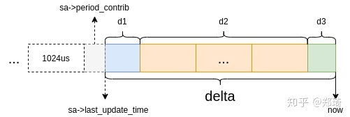
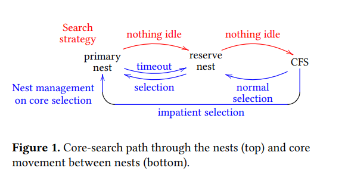

调度子系统 (scheduling)
=====================


# 0 调度子系统 (开篇)
-------


## 0.1 调度子系统概述
-------


** 概述: **Linux 是一个遵循 POSIX 标准的类 Unix 操作系统 (然而它并不是 Unix 系统 [<sup>1</sup>](#refer-anchor-1)), POSIX 1003.1b 定义了调度相关的一个功能集合和 API 接口 [<sup>2</sup>](#refer-anchor-2). 调度器的任务是分配 CPU 运算资源, 并以协调效率和公平为目的. ** 效率 ** 可从两方面考虑: 1) 吞吐量 (throughput) 2) 延时 (latency). 不做精确定义, 这两个有相互矛盾的衡量标准主要体现为两大类进程: 一是 CPU 密集型, 少量 IO 操作, 少量或无与用户交互操作的任务 (强调吞吐量, 对延时不敏感, 如高性能计算任务 HPC), 另一则是 IO 密集型, 大量与用户交互操作的任务 (强调低延时, 对吞吐量无要求, 如桌面程序). ** 公平 ** 在于有区分度的公平, 多媒体任务和数值计算任务对延时和限定性的完成时间的敏感度显然是不同的.
为此,  POSIX 规定了操作系统必须实现以下 ** 调度策略 (scheduling policies),** 以针对上述任务进行区分调度:

**- SCHED\_FIFO**

**- SCHED\_RR**

这两个调度策略定义了对实时任务, 即对延时和限定性的完成时间的高敏感度的任务. 前者提

供 FIFO 语义, 相同优先级的任务先到先服务, 高优先级的任务可以抢占低优先级的任务; 后 者提供 Round-Robin 语义, 采用时间片, 相同优先级的任务当用完时间片会被放到队列尾

部, 以保证公平性, 同样, 高优先级的任务可以抢占低优先级的任务. 不同要求的实时任务可

以根据需要用 **_sched\_setscheduler()_** API 设置策略.
**- SCHED\_OTHER**

此调度策略包含除上述实时进程之外的其他进程, 亦称普通进程. 采用分时策略, 根据动态优

先级 (可用 **nice()** API 设置), 分配 CPU 运算资源.  **注意: 这类进程比上述两类实时进程优先级低, 换言之, 在有实时进程存在时, 实时进程优先调度**.

Linux 除了实现上述策略, 还额外支持以下策略:

- **SCHED\_IDLE** 优先级最低, **在系统空闲时才跑这类进程**(如利用闲散计算机资源跑地外文明搜索, 蛋白质结构分析等任务, 是此调度策略的适用者)

- **SCHED\_BATCH** 是 SCHED\_OTHER 策略的分化, 与 SCHED\_OTHER 策略一样, 但针对吞吐量优化

- **SCHED\_DEADLINE** 是新支持的实时进程调度策略, 针对突发型计算, 且对延迟和完成时间高度敏感的任务适用.


除了完成以上基本任务外, Linux 调度器还应提供高性能保障, 对吞吐量和延时的均衡要有好的优化; 要提供高可扩展性 (scalability) 保障, 保障上千节点的性能稳定; 对于广泛作为服务器领域操作系统来说, 它还提供丰富的组策略调度和节能调度的支持.


## 0.2 主线内存管理分支合并窗口
-------

Mainline Merge Window

- [x] Merge tag 'sched-core-date'

- [x] Merge tag 'sched-urgent-date'


```cpp
git log --oneline v5.15...v5.16 | grep -E "Merge tag | Linux"  | grep -E "sched| Linux"
```

| 版本 | 发布时间 | 合并链接 |
|:---:|:-------:|:-------:|
| 5.13 | 2021/06/28 | [Merge tag'sched-core-2021-04-28', 5.13-rc1](https://git.kernel.org/pub/scm/linux/kernel/git/torvalds/linux.git/commit/?id=16b3d0cf5bad844daaf436ad2e9061de0fe36e5c)<br>[Merge tag'sched-urgent-2021-05-09', 5.13-rc1](https://git.kernel.org/pub/scm/linux/kernel/git/torvalds/linux.git/commit/?id=9819f682e48c6a7055c5d7a6746411dd3969b0e5)<br>[Merge tag'sched-urgent-2021-05-15', 5.13-rc2](https://git.kernel.org/pub/scm/linux/kernel/git/torvalds/linux.git/commit/?id=c12a29ed9094b4b9cde8965c12850460b9a79d7c)<br>[Merge tag'sched-urgent-2021-06-12', 5.13-rc6](https://git.kernel.org/pub/scm/linux/kernel/git/torvalds/linux.git/commit/?id=99f925947ab0fd5c17b74460d8b32f1aa1c86e3a)<br>[Merge tag'sched_urgent_for_v5.13_rc6', 5.13-rc7, 2021/06/20](https://git.kernel.org/pub/scm/linux/kernel/git/torvalds/linux.git/commit/?id=cba5e97280f53ec7feb656fcdf0ec00a5c6dd539)<br>[Merge tag'sched-urgent-2021-06-24', 5.13](https://git.kernel.org/pub/scm/linux/kernel/git/torvalds/linux.git/commit/?id=666751701b6e4b6b6ebc82186434806fa8a09cf3)<br> |
| 5.14 | 2021/08/29 | [Merge tag'sched-core-2021-06-28', 5.14-rc1](https://git.kernel.org/pub/scm/linux/kernel/git/torvalds/linux.git/commit/?id=54a728dc5e4feb0a9278ad62b19f34ad21ed0ee4)<br>[Merge tag'sched-urgent-2021-06-30', 5.14-rc1](https://git.kernel.org/pub/scm/linux/kernel/git/torvalds/linux.git/commit/?id=a6eaf3850cb171c328a8b0db6d3c79286a1eba9d)<br>[Merge tag'sched-urgent-2021-07-11', 5.14-rc1](https://git.kernel.org/pub/scm/linux/kernel/git/torvalds/linux.git/commit/?id=877029d9216dcc842f50d37571f318cd17a30a2d)<br>[Merge tag'sched-urgent-2021-08-08', 5.14-rc5](https://git.kernel.org/pub/scm/linux/kernel/git/torvalds/linux.git/commit/?id=713f0f37e8128e8a0190a98f5a4be71fb32a671a)<br>[Merge tag'sched_urgent_for_v5.14', 5.14](https://git.kernel.org/pub/scm/linux/kernel/git/torvalds/linux.git/commit/?id=537b57bd5a202af145c266d4773971c2c9f90cd9) |
| 5.15 | 2021/11/1 | NA | [Merge tag'sched-core-2021-08-30'](https://git.kernel.org/pub/scm/linux/kernel/git/torvalds/linux.git/commit/?id=5d3c0db4598c5de511824649df2aa976259cf10a)<br>[Merge remote-tracking branch'tip/sched/arm64'](https://git.kernel.org/pub/scm/linux/kernel/git/torvalds/linux.git/commit/?id=65266a7c6abf)<br>[Merge tag'sched_urgent_for_v5.15_rc1'](https://git.kernel.org/pub/scm/linux/kernel/git/torvalds/linux.git/commit/?id=56c244382fdb)<br>[Merge tag'sched_urgent_for_v5.15_rc4'](https://git.kernel.org/pub/scm/linux/kernel/git/torvalds/linux.git/commit/?id=777feabaea77)<br>[Merge tag'sched_urgent_for_v5.15_rc7'](https://git.kernel.org/pub/scm/linux/kernel/git/torvalds/linux.git/commit/?id=6c62666d8879)
| 5.16 | 2022/01/09 | [Merge tag'sched-core-2021-11-01', 5.16-rc1](https://git.kernel.org/pub/scm/linux/kernel/git/torvalds/linux.git/commit/?id=9a7e0a90a454a7826ecbca055a6ec9271b70c686)<br>[Merge tag'sched_urgent_for_v5.16_rc1', 5.16-rc3](https://git.kernel.org/pub/scm/linux/kernel/git/torvalds/linux.git/commit/?id=fc661f2dcb7e)<br>[Merge tag'sched-urgent-2021-11-28', 5.16-rc3](https://git.kernel.org/pub/scm/linux/kernel/git/torvalds/linux.git/commit/?id=97891bbf38f7)<br>[Merge tag'sched_urgent_for_v5.16_rc4', 5.16-rc4](https://git.kernel.org/pub/scm/linux/kernel/git/torvalds/linux.git/commit/?id=1d213767dc6f)<br>[Merge tag'sched-urgent-2021-12-12', 5.16-rc5](https://git.kernel.org/pub/scm/linux/kernel/git/torvalds/linux.git/commit/?id=773602256a2ca73455b0baeae5737c4a9ed6ef49) |
| 5.17 | 2022/03/20 | [sched_core_for_v5.17_rc1, 5.17-rc1](https://git.kernel.org/pub/scm/linux/kernel/git/torvalds/linux.git/commit/?id=6ae71436cda7)<br>[sched_urgent_for_v5.17_rc2, 5.17-rc2](https://git.kernel.org/pub/scm/linux/kernel/git/torvalds/linux.git/commit/?id=10c64a0f2806)<br>[sched_urgent_for_v5.17_rc2_p2, 5.17-rc2](https://git.kernel.org/pub/scm/linux/kernel/git/torvalds/linux.git/commit/?id=24f4db1f3a27)<br>[sched_urgent_for_v5.17_rc4, 5.17-rc4](https://git.kernel.org/pub/scm/linux/kernel/git/torvalds/linux.git/commit/?id=6f3573672324)<br>[sched_urgent_for_v5.17_rc5, 5.17-rc5](https://git.kernel.org/pub/scm/linux/kernel/git/torvalds/linux.git/commit/?id=0b0894ff78cc) |
| 5.18 | NA | [sched-core-2022-03-22, 5.18-rc1](https://git.kernel.org/pub/scm/linux/kernel/git/torvalds/linux.git/commit/?id=3fe2f7446f1e029b220f7f650df6d138f91651f2), [scheduler updates for v5.18](https://lore.kernel.org/lkml/YjhZUezhnamHAl0H@gmail.com) |
| 6.3 | NA | [Linux 6.3 Scheduler Updates Bring Fixes & Minor Optimizations](https://www.phoronix.com/news/Linux-6.3-Scheduler), [scheduler changes for v6.3](https://lore.kernel.org/lkml/Y%2FNttaqRZ+zaHIjo@gmail.com) |
| 6.4 | NA | NA |
| 6.5 | NA | [Linux 6.5 To Enhance Load Balancing For Intel Hybrid CPUs](https://www.phoronix.com/news/Linux-6.5-Intel-Hybrid-Sched), [Scheduler changes for v6.5](https://lore.kernel.org/lkml/ZJq3HtUKZp2uMWLu@gmail.com) |
| 6.10 | NA | [Linux 6.10 Scheduler Changes Bring More Refinements](https://phoronix.com/news/Linux-6.10-Scheduler), [[GIT PULL] Scheduler changes for v6.10](https://lore.kernel.org/lkml/ZkG0nxxBPB%2F03Q%2Fl@gmail.com) |

cgit 上查看 sched 所有的 log 信息 :

[GIT LOG: linux/kernel/sched](https://git.kernel.org/pub/scm/linux/kernel/git/torvalds/linux.git/log/kernel/sched)

## 0.3 社区会议
-------


### 0.3.1 Linux Plumbers Conference
-------

Scheduler Microconference Accepted into Linux Plumbers Conference

`2010~2017` 年的内容, 可以在 [wiki](http://wiki.linuxplumbersconf.org/?do=search&id=scheduler) 检索.

| 日期 | 官网 | LKML | LWN |
|:---:|:----:|:----:|:---:|
| [2021](https://linuxplumbersconf.org/event/11/page/104-accepted-microconferences) | [LPC 2021 - Overview](https://www.linuxplumbersconf.org/event/11/page/103-lpc-2021-overview) | [[ANNOUNCE] CFP: Scheduler Microconference - Linux Plumbers Conference 2021](https://lkml.org/lkml/2021/8/9/718) | [A look forward to Linux Plumbers 2021](https://lwn.net/Articles/864016) |
| [2020](https://linuxplumbersconf.org/event/7/page/44-microconferences) | [Scheduler Microconference 2020](https://www.linuxplumbersconf.org/blog/2020/scheduler-microconference-accepted-into-2020-linux-plumbers-conference) | NA | NA |
| [2019](https://linuxplumbersconf.org/event/4/page/38-microconferences) | [Scheduler Microconference 2019](https://www.linuxplumbersconf.org/blog/2019/scheduler-microconference-accepted-into-2019-linux-plumbers-conference) | NA | NA |
| [2018](https://www.linuxplumbersconf.org/2018) | [Power Management and Energy-awareness Microconference 2018](https://blog.linuxplumbersconf.org/2018/power-management-mc)<br>[timeline](https://www.linuxplumbersconf.org/event/2/timetable/?view=lpc) | NA | [Notes from the LPC scheduler microconference](https://lwn.net/Articles/734039) |
| [2017](https://blog.linuxplumbersconf.org/2017) | [Scheduler Workloads Microconference 2017](http://wiki.linuxplumbersconf.org/2017:scheduler_workloads) | | [Notes from the LPC scheduler microconference](https://lwn.net/Articles/734039)

### 0.3.2 讲义课程
-------

[CPU Scheduling](https://www.scs.stanford.edu/07au-cs140/notes/l5.pdf)


## 0.4 社区几个调度的大神
-------

- [x] [Mel Gorman mgorman@techsingularity.net](https://lore.kernel.org/patchwork/project/lkml/list/?submitter=19167)

- [x] [Alex Shi](https://lore.kernel.org/patchwork/project/lkml/list/?submitter=25695&state=%2A&series=&q=&delegate=&archive=both)

- [x] [Valentin Schneider](https://lore.kernel.org/patchwork/project/lkml/list/?series=&submitter=23332&state=*&q=&archive=both&delegate=)

- [x] [Vincent Guittot](https://lore.kernel.org/patchwork/project/lkml/list/?submitter=11990&archive=both&state=*)

- [x] [Thomas Gleixner <tglx@linutronix.de>](git://git.kernel.org/pub/scm/linux/kernel/git/tglx/devel.git)

## 0.5 目录
-------

- [x] 1. 进程调度类

- [x] 2. 组调度支持 (Group Scheduling)

- [x] 3. 负载跟踪机制

- [x] 4. 基于调度域的负载均衡

- [x] 5. SELECT_TASK_RQ

- [x] 6. PICK_NEXT_TASK

- [x] 7. 调度与节能

- [x] 8. 实时性 linux PREEMPT_RT

- [x] 9. IDLE

- [x] 10. 进程管理

- [x] 11. 其他

- [x] 12. 调试信息


# 1 进程调度类
-------

## 1.1 普通进程调度器 (SCHED\_NORMAL) 之纠极进化史
-------

Linux 一开始, 普通进程和实时进程都是基于优先级的一个调度器, 实时进程支持 100 个优先级, 普通进程是优先级小于实时进程的一个静态优先级, 所有普通进程创建时都是默认此优先级, 但可通过 **nice()** 接口调整动态优先级 (共 40 个). 实时进程的调度器比较简单, 而普通进程的调度器, 则历经变迁 [<sup>5</sup>](#refer-anchor-5):

在 CFS 算法引入之前, Linux 使用过几种不同的调度算法, 一开始的调度器是复杂度为 O(n) 的始调度算法 (实际上每次会遍历所有任务, 所以复杂度为 O(n)), 这个算法的缺点是当内核中有很多任务时, 调度器本身就会耗费不少时间, 所以, 从 linux 2.5 开始引入赫赫有名的 O(1) 调度器, 然而, linux 是集全球很多程序员的聪明才智而发展起来的超级内核, 没有最好, 只有更好, 在 O(1) 调度器风光了没几天就又被另一个更优秀的调度器取代了, 它就是 CFS 调度器 Completely Fair Scheduler. 这个也是在 2.6 内核中引入的, 具体为 2.6.23, 即从此版本开始, 内核使用 CFS 作为它的默认调度器, O (1) 调度器被抛弃了.


### 1.1.1 O(N) 调度器 (Scalable Scheduler)
-------

O(n) 调度理解起来简单:

在每次进程切换时, 内核依次扫描就绪队列上的每一个进程, 计算每个进程的优先级, 再选择出优先级最高的进程来运行; 尽管这个算法理解简单, 但是它花费在选择优先级最高进程上的时间却不容忽视. 系统中可运行的进程越多, 花费的时间就越大, 时间复杂度为 O (n).


### 1.1.2 O(1) 调度器
-------

2.6 时代开始支持 (2002 年引入).

顾名思义, 此调度器为 O(1) 时间复杂度. 该调度器修正之前的 O(n) 时间复杂度调度器, 以解决扩展性问题. 为每一个动态优先级维护队列, 从而能在常数时间内选举下一个进程来执行.

其基本思想是根据进程的优先级进行调度. 进程有两个优先级, 一个是静态优先级, 一个是动态优先级. 静态优先级是用来计算进程运行的时间片长度的, 动态优先级是在调度器进行调度时用到的, 调度器每次都选取动态优先级最高的进程运行. 由于其数据结构设计上采用了一个优先级数组, 这样在选择最优进程时时间复杂度为 O(1), 所以被称为 O(1) 调度.

[commit v2.5.1.9 -> v2.5.1.10 ("Ingo Molnar: scalable scheduler")](https://git.kernel.org/pub/scm/linux/kernel/git/torvalds/linux.git/diff/kernel/sched.c?id=908920b1d370e7a5c301d14cfce10c310be19be3)

| 时间  | 作者 | 特性 | 描述 | 是否合入主线 | 链接 |
|:-----:|:---:|:---:|:---:|:-----------:|:----:|
| 2002/02/05 | Ingo Molnar <mingo@earth2.(none)> | [v2.5.1.9 -> v2.5.1.10 ("Ingo Molnar: scalable scheduler")](https://git.kernel.org/pub/scm/linux/kernel/git/torvalds/linux.git/commit/?id=908920b1d370e7a5c301d14cfce10c310be19be3) | 优化 O(N) 调度器的可扩展性, 实现了 O(1) 调度器. | v1 ☑✓ 2.5.1.10 | [COMMIT](https://git.kernel.org/pub/scm/linux/kernel/git/torvalds/linux.git/diff/kernel/sched.c?id=908920b1d370e7a5c301d14cfce10c310be19be3) |
| 2002/02/11 |  Ingo Molnar <mingo@earth2.(none)> | [merge to the -K3 scheduler.](https://git.kernel.org/pub/scm/linux/kernel/git/torvalds/linux.git/commit/?id=908920b1d370e7a5c301d14cfce10c310be19be3) | TODO | v1 ☑✓ 2.5.2 | [COMMIT](https://git.kernel.org/pub/scm/linux/kernel/git/torvalds/linux.git/commit/?id=7e54bc75751cfb3c3eb5da7bdc900b8adcc2cda4) |


### 1.1.3 夭折的 RSDL(The Rotating Staircase Deadline Scheduler) 调度器
-------

**2007 年 4 月提出, 预期进入 2.6.22, 后夭折.**

O(1) 调度器存在一个比较严重的问题: 复杂的交互进程识别启发式算法 - 为了识别交互性的和批处理型的两大类进程, 该启发式算法融入了睡眠时间作为考量的标准, 但对于一些特殊的情况, 经常判断不准, 而且是改完一种情况又发现一种情况.


Con Kolivas (八卦: 这家伙白天是个麻醉医生) 为解决这个问题提出 **RSDL(The Rotating Staircase Deadline Scheduler)** 算法. 该算法的亮点是对公平概念的重新思考: ** 交互式 (A)** 和 ** 批量式 (B)** 进程应该是被完全公平对待的, 对于两个动态优先级完全一样的 A, B 进程, ** 它们应该被同等地对待, 至于它们是交互式与否 (交互式的应该被更快调度),　应该从他们对分配给他们的时间片的使用自然地表现出来, 而不是应该由调度器自作高明地根据他们的睡眠时间去猜测 **. 这个算法的核心是 **Rotating Staircase**, 是一种衰减式的优先级调整, 不同进程的时间片使用方式不同, 会让它们以不同的速率衰减 (在优先级队列数组中一级一级下降, 这是下楼梯这名字的由来), 从而自然地区分开来进程是交互式的 (间歇性的少量使用时间片) 和批量式的 (密集的使用时间片). 具体算法细节可看这篇文章: [The Rotating Staircase Deadline Scheduler [LWN.net]](https://link.zhihu.com/?target=https%3A//lwn.net/Articles/224865)

[2007/03/04, RSDL completely fair starvation free interactive cpu scheduler](https://lwn.net/Articles/224654)

[2007/03/23, RSDL cpu scheduler v0.33](https://lore.kernel.org/lkml/200703232005.05839.kernel@kolivas.org)

[2007/03/24, debug rsdl 0.33](https://lore.kernel.org/lkml/200703241026.57143.kernel@kolivas.org)

[2007/04/21, [REPORT] cfs-v4 vs sd-0.44](https://lore.kernel.org/lkml/20070421121235.GA2044@1wt.eu)

[2007/04/24, rsdl v46 report,numbers,comments](https://lore.kernel.org/lkml/20070424112601.56f5bfb6@reforged/)

[cheduler Situation](https://lore.kernel.org/all/cdc89fe60708030507r29283942mbb9947edbe04e23a@mail.gmail.com)

### 1.1.4 nicksched
-------

[nicksched v33](https://lwn.net/Articles/229250)

### 1.1.3 完全公平的调度器 (CFS)
-------

| 日期 | LWN | 翻译 |
|:---:|:----:|:---:|
| 2007/04/17 | [Schedulers: the plot thickens](https://lwn.net/Articles/230574) | [LWN 230574: 内核调度器替换方案的激烈竞争](https://tinylab.org/lwn-230574), [知乎--草莓熊麦昆的翻译](https://zhuanlan.zhihu.com/p/697235380) |

**2.6.23(2007 年 10 月发布)**

Con Kolivas 的完全公平的想法启发了原 O(1) 调度器作者 Ingo Molnar, 他重新实现了一个新的调度器, 叫 CFS(Completely Fair Scheduler). 它从 RSDL/SD 中吸取了完全公平的思想, 不再跟踪进程的睡眠时间, 也不再企图区分交互式进程. 它将所有的进程都统一对待, 这就是公平的含义. CFS 的算法和实现都相当简单, 众多的测试表明其性能也非常优越.参见 [2007/04/13, [patch] Modular Scheduler Core and Completely Fair Scheduler [CFS]](https://lwn.net/Articles/230501).

> 新的 CFS 调度器的核心同样是 完全公平性, 即平等地看待所有普通进程, 让它们自身行为彼此区分开来, 从而指导调度器进行下一个执行进程的选举.


不管是 O(n) 还是 O(1) 调度算法, 其基本思路都是通过一系列运行指标确定进程的优先级, 然后根据进程的优先级确定调度哪个进程, 而 CFS 则转换了一种思路, 它不计算优先级, 而是通过计算进程消耗的 CPU 时间 (标准化以后的虚拟 CPU 时间) 来确定谁来调度. 从而到达所谓的公平性.

| 公平性 | 描述 |
| 绝对公平性 | CFS 定义了一种新的模型, 其基本思路很简单, 他把 CPU 当做一种资源, 并记录下每一个进程对该资源使用的情况, 在调度时, 调度器总是选择消耗资源最少的进程来运行. 这就是所谓的 "完全公平". 但这种绝对的公平有时也是一种不公平, 因为有些进程的工作比其他进程更重要, 我们希望能按照权重来分配 CPU 资源. |
| 相对公平性 | 为了区别不同优先级的进程, 就是会根据各个进程的权重分配运行时间. |

具体说来, 此算法基于一个理想模型. 想像你有一台无限个 相同计算力的 CPU, 那么完全公平很容易, 每个 CPU 上跑一个进程即可. 但是, 现实的机器 CPU 个数是有限的, 超过 CPU 个数的进程数不可能完全同时运行. 因此, 算法为每个进程维护一个理想的运行时间, 及实际的运行时间, 这两个时间差值大的, 说明受到了不公平待遇, 更应得到执行.

至于这种算法如何区分交互式进程和批量式进程, 很简单. 交互式的进程大部分时间在睡眠, 因此它的实际运行时间很小, 而理想运行时间是随着时间的前进而增加的, 所以这两个时间的差值会变大. 与之相反, 批量式进程大部分时间在运行, 它的实际运行时间和理想运行时间的差距就较小. 因此, 这两种进程被区分开来.


CFS 的算法和实现都相当简单, 众多的测试表明其性能也非常优越. 并得到更多的开发者支持, 所以它最终替代了 RSDL 在 2.6.23 进入内核, 一直使用到现在.

[Linux 的公平调度 (CFS) 原理 - kummer 话你知](https://www.jianshu.com/p/673c9e4817a8)

[CFS scheduler, -v16](https://lore.kernel.org/lkml/20070608195840.GA14928@elte.hu)

[[Announce] [patch] Modular Scheduler Core and Completely Fair Scheduler [CFS]](https://lore.kernel.org/lkml/20070413202100.GA9957@elte.hu/)

#### 1.1.3.1 CFS 调度器
-------

| 时间  | 作者 | 特性 | 描述 | 是否合入主线 | 链接 |
|:-----:|:----:|:----:|:----:|:------------:|:----:|
| 2007/07/09 | Ingo Molnar <mingo@elte.hu> | [CFS Scheduler](https://git.kernel.org/pub/scm/linux/kernel/git/torvalds/linux.git/commit/?id=c31f2e8a42c41efa46397732656ddf48cc77593e) | 实现 CFS 调度器. | v1 ☑✓ 2.6.23-rc1 | [LORE](https://git.kernel.org/pub/scm/linux/kernel/git/torvalds/linux.git/commit/?id=c31f2e8a42c41efa46397732656ddf48cc77593e) |
| 2007/10/15 | Ingo Molnar <mingo@elte.hu> | [CFS Group Scheduler](https://git.kernel.org/pub/scm/linux/kernel/git/torvalds/linux.git/commit/?id=9c63d9c021f375a2708ad79043d6f4dd1291a085) | CFS 支持组调度 | v1 ☑✓ 2.6.24-rc1| [LORE](https://git.kernel.org/pub/scm/linux/kernel/git/torvalds/linux.git/commit/?id=9c63d9c021f375a2708ad79043d6f4dd1291a085) |

#### 1.1.3.2 load_weight
-------

[Linux CFS 调度器之负荷权重 load_weight--Linux 进程的管理与调度 (二十五)](https://blog.csdn.net/gatieme/article/details/52067665)


不少同学发现, `{sched_}prio_to_weight` 的值并不是严格的 1.25 倍. 这是因为 CPU 在计算的过程中会损失精度, 为了使得 prio_to_weight * prio_to_wmult 与 2^32 的值会存在较大的偏差. 为了使得偏差尽可能的小, 因此 [commit 254753dc321e ("sched: make the multiplication table more accurate")](https://git.kernel.org/pub/scm/linux/kernel/git/torvalds/linux.git/commit/?id=254753dc321ea2b753ca9bc58ac329557a20efac) 对 prio_to_weight 和 prio_to_wmult 的值做了一定的调整. 社区邮件列表中后期曾有人咨询过这个问题, 参见讨论 [Question about sched_prio_to_weight values](https://lkml.org/lkml/2019/10/7/1117). 提问的同学在了解了问题之后, 制作了一个脚本来模拟调整的思路和过程.

| 时间  | 作者 | 特性 | 描述 | 是否合入主线 | 链接 |
|:----:|:----:|:---:|:----:|:---------:|:----:|
| 2007/08/09 | Ingo Molnar <mingo@elte.hu> | [sched: make the multiplication table more accurate](https://git.kernel.org/pub/scm/linux/kernel/git/torvalds/linux.git/commit/?id=254753dc321ea2b753ca9bc58ac329557a20efac) | 对 prio_to_weight 和 prio_to_wmult 做一定的调整. | v1 ☐ | [2020/12/17 v1](https://lore.kernel.org/patchwork/cover/1396878) |


### 1.1.4 CK 的 BFS 和 MuQSS
-------

可以八卦的是, Con Kolivas (因此) 离开了社区, 不过他本人否认是因为此事而心生龃龉. 后来, 2009 年, 他对越来越庞杂的 CFS 不满意, 认为 CFS 过分注重对大规模机器, 而大部分人都是使用少 CPU 的小机器, 因此于 2009 年 8 月 31 日发布了 BFS 调度器 (Brain Fuck Scheduler)[<sup>48</sup>](#refer-anchor-48).

BFS 调度器的原理十分简单, 是为桌面交互式应用专门设计, 使得用户的桌面环境更为流畅, 早期使用 CFS 编译内核时, 音讯视讯同时出现会出现严重的停顿 (delay), 而使用 BFS 则没有这些问题. 【注意】

BFS 的原理是将所有行程被安排到 103 组伫列 (queue) 之中. BFS 本身是 O(n) 调度器, 但大部份的时间比目前 Linux 上拥有 O(log n) 效能的主流调度器 CFS 还优异. [2]Con Kolivas 并没有打算将 BFS 应用在 mainline Linux[3]. 他再度以 -ck 的补丁来维护这套原始码.

Android 曾经在试验性的分支, 使用 BFS 作为其操作系统排程器. 但是经过测试发现对使用者并没有明显的改进, 因此并未合入之后发表的正式版本. 初次之外当时很多人和厂商都做过 BFS 和 CFS 的对比测试.

[Linux 调度器 BFS 简介](https://www.ibm.com/developerworks/cn/linux/l-cn-bfs)

[BFS vs. mainline scheduler benchmarks and measurements](https://lwn.net/Articles/351058/)

[BFS vs. CFS - Scheduler Comparison](https://www.cs.unm.edu/~eschulte/classes/cs587/data/bfs-v-cfs_groves-knockel-schulte.pdf)

[bfs-faq](http://ck.kolivas.org/patches/bfs/bfs-faq.txt)

https://lkml.org/lkml/2007/8/30/307
https://www.wikiwand.com/zh-hans / 腦殘排程器


BFS 的最后版本是 2016 年 12 月发布的 v0.512, 基于 v4.8 内核.

之后 CK 发布了更现代化的 MuQSS(多队列跳过列表调度程序) [The MuQSS CPU scheduler](https://lwn.net/Articles/720227), CK 称之为原始 BFS 调度程序基于 per-CPU 运行队列改进版. 截止目前 MuQSS 都在不断维护.


### 1.1.5 不那么重要的进程 SCHED\_IDLE
-------

**2.6.23(2007 年 10 月发布)**


~~ 此调度策略和 CFS 调度器在同一版本引入. 系统在空闲时, 每个 CPU 都有一个 idle 线程在跑, 它什么也不做, 就是把 CPU 放入硬件睡眠状态以节能 (需要特定 CPU 的 driver 支持), 并等待新的任务到来, 以把 CPU 从睡眠状态中唤醒. 如果你有任务想在 CPU 完全 idle 时才执行, 就可以用 **sched\_setscheduler()** API 设置此策略.~~


注意上面的描述是有问题的, SCHED_IDLE 和 idle 进程是完全不同的东西

SCHED_IDLE 跟 SCHED_BATCH 一样, 是 CFS 中的一个策略, SCHED\_IDLE 的进程也是 CFS 调度类的一员, CFS 内部的家务事, 意味着 SCHED\_IDLE 进程也是需要按照权重来分配 CPU 时间的, 只是权重很低而已, 权重默认被 [设置为 WEIGHT_IDLEPRIO(3), 参见 [cce7ade80369 sched: SCHED_IDLE weight change](https://git.kernel.org/pub/scm/linux/kernel/git/torvalds/linux.git/commit/?id=cce7ade803699463ecc62a065ca522004f7ccb3d).

另一方面, SCHED_IDLE 是用户赋予的, 的确可以用 **sched\_setscheduler()** API 设置此策略

使用了 SCHED_IDLE 策略, 这意味着这些进程是不重要的, 但是 CFS 又号称完全公平, 这体现在哪些方面呢?

- 首先设置了 SCHED_IDLE 策略的进程优先级 (nice 值) 都很低, 这将影响到进程的时间片和负载信息
- SCHED_IDLE 调度策略只在进行抢占处理的时候有一些特殊处理, 比如 check_preempt_curr() 中, 这里当前正在运行的如果是 SCHED_IDLE task 的话, 会马上被新唤醒的 SCHED_NORMAL task 抢占, 即 SCHED_NORMAL 的进程可以抢占 SCHED_IDLE 的进程.

因此 Linux 社区里面并没有多少人会使用 SCHED_IDLE 调度策略, 因此自从 Linux 2.6.23 引入之后, 就没人对它进行改进.

#### 1.1.5.1 引入 SCHED_IDLE
-------

| 时间  | 作者 | 特性 | 描述 | 是否合入主线 | 链接 |
|:----:|:----:|:---:|:----:|:---------:|:----:|
| 2007/07/09 | Ingo Molnar <mingo@elte.hu> | [0e6aca43e08a sched: add SCHED_IDLE policy](https://git.kernel.org/pub/scm/linux/kernel/git/torvalds/linux.git/commit/?id=0e6aca43e08a) | NA | v1 ☑ 2.6.23-rc1 | [PATCH HISTORY](https://git.kernel.org/pub/scm/linux/kernel/git/torvalds/linux.git/commit/?id=0e6aca43e08a) |
| 2007/07/09 | Ingo Molnar <mingo@elte.hu> | [dd41f596cda0 sched: cfs core code](https://git.kernel.org/pub/scm/linux/kernel/git/torvalds/linux.git/commit/?id=dd41f596cda0) | NA | v1 ☑ 2.6.23-rc1 | [PATCH HISTORY](https://git.kernel.org/pub/scm/linux/kernel/git/torvalds/linux.git/commit/?id=dd41f596cda0) |
| 2009/01/15 | Peter Zijlstra <a.p.zijlstra@chello.nl> | [cce7ade80369 sched: SCHED_IDLE weight change](https://git.kernel.org/pub/scm/linux/kernel/git/torvalds/linux.git/commit/?id=cce7ade80369) | 将 SCHED\_IDLE 权重从 2 增加到 3, 这将提供更稳定的 vruntime. | v1 ☑ 2.6.23-rc1 | [PATCH HISTORY](https://git.kernel.org/pub/scm/linux/kernel/git/torvalds/linux.git/commit/?id=cce7ade80369) |


#### 1.1.5.2 Fallback to sched-idle CPU
-------

注意, 在 select_task_rq() 调用中并没有针对 SCHED\_IDLE 调度策略的相应处理, 因此我们并没能做到尽量把新唤醒的 SCHED_NORMAL task 放到当前正在运行 SCHED_IDLE task 的 CPU 上去. 之前的 select_task_rq_fair() 中更倾向于寻找一个 IDLE 的 CPU.

那么这就有一个矛盾的地方了, 那就是在选核的时候, 如果当前 CPU 上正运行 SCHED_IDLE 的进程. 那么选择这样的 CPU 更合适, 还是继续往下寻找 idle 的 CPU 更合适?

*   当前的策略是倾向于是唤醒完全 idle 的 CPU, 而保持 SCHED_IDLE 进程继续占有原来的 CPU. 这显然与 SCHED_NORMAL 可以抢占 SCHED_IDLE 的初衷相违背. 这样的好处是系统会更加均衡一些, 但是另外一方面唤醒 idle 的 CPU 是有一定延迟的, 在当前的 CPU 上这样的操作往往可能耗时若干 ms 的时间, 远远比一次抢占的时间要长.

*   另外一种策略就是抢占 SCHED_IDLE 进程, 这样可以保持完全 idle 的 CPU 继续 idle, 降低功耗;

第二种策略虽然从负载均衡看来, 系统貌似不那么均衡了, 但是看起来有诸多的好处. 于是一组特性 [sched/fair: Fallback to sched-idle CPU in absence of idle CPUs](https://lwn.net/Articles/805317), [patchwork](https://lore.kernel.org/patchwork/cover/1094197), [lkml-2019-06-26](https://lkml.org/lkml/2019/6/26/16) 被提出, 并于 5.4-rc1 合入主线.

后续对此补丁还有一些细微的优化, 比如 [sched/fair: Make sched-idle cpu selection consistent throughout 1143783 diffmboxseries](https://lore.kernel.org/patchwork/patch/1143783), 优化了选核的逻辑, 之前的逻辑中认为, 如果 find_idlest_group_cpu/sched_idle_core 中如果查找不到 avaliable_idle_cpu(处于 IDLE 状态的 CPU), 才寻找 sched_idle_cpu(运行 SCHED_IDLE 的 CPU), 即优先 IDLE, 其次 SCHED_IDLE. 而 select_idle_sibling 中则认为 avaliable_idle_cpu 和 sched_idle_cpu 都是可以接受的, 找到了任何一个满足要求的则返回. 可以看到不同的选核流程下, 对 avaliable_idle_cpu 和 sched_idle_cpu 的接受程度不同. 但是这其实本身就是一个没有对错的问题, 其实我们选核的时候, 不一定 IDLE 一定是最优的, 如果直接选一个 sched_idle_cpu 的 CPU 有时候是优于 avaliable_idle_cpu 的, 因为这些核是不需要 (发 IPI) 唤醒的. 因此这个补丁就将选核流程上做了归一, 所有的选核流程都将 avaliable_idle_cpu 和 sched_idle_cpu 同等对待, 只要找到了一个 avaliable_idle_cpu 或者 sched_idle_cpu 都是可以接受的, 没必要在 avaliable_idle_cpu 找不到的时候才去选则 sched_idle_cpu

| 时间  | 作者 | 特性 | 描述 | 是否合入主线 | 链接 |
|:----:|:----:|:---:|:---:|:-----------:|:---:|
| 2019/6/26 | Viresh Kumar <viresh.kumar@linaro.org> | [sched/fair: Fallback to sched-idle CPU in absence of idle CPUs](https://git.kernel.org/pub/scm/linux/kernel/git/torvalds/linux.git/log/?id=3c29e651e16dd3b3179cfb2d055ee9538e37515c) | CFS SCHED_NORMAL 进程在选核的时候, 之前优先选择 IDLE 的 CPU, 现在在没有 IDLE 的 CPU 可选的时候, 也倾向于选择只有 SCHED_IDLE 的进程在运行的 CPU | v3 ☑ [5.4-rc1](https://kernelnewbies.org/Linux_5.4#Core_.28various.29) | [LWN](https://lwn.net/Articles/805317), [PatchWork](https://lore.kernel.org/patchwork/cover/1094197), [lkml](https://lkml.org/lkml/2019/6/26/16)<br>*-*-*-*-*-*-*-* <br>[LORE v3,0/2](https://lore.kernel.org/all/cover.1561523542.git.viresh.kumar@linaro.org) |
| 2019/10/24 | NA | [sched/fair: Make sched-idle cpu selection consistent throughout](https://lore.kernel.org/patchwork/patch/1143783) | 重构了 SCHED_IDLE 时的选核逻辑, 所有的选核流程都将 avaliable_idle_cpu 和 sched_idle_cpu 同等对待 | v1 ☑ 5.4-rc1 | [PatchWork](https://lore.kernel.org/patchwork/patch/1143783) |

#### 1.1.5.3 sched-idle Load Balancing
-------

| 时间  | 作者 | 特性 | 描述 | 是否合入主线 | 链接 |
|:----:|:----:|:---:|:---:|:-----------:|:---:|
| 2019/12/24 | Viresh Kumar <viresh.kumar@linaro.org> | [sched/fair: Load balance aggressively for SCHED_IDLE CPUs](https://git.kernel.org/pub/scm/linux/kernel/git/torvalds/linux.git/log/?id=323af6deaf70f204880caf94678350802682e0dc) | LOAD_BALANCE 感知 SCHED_IDLE 优化, SCHED_IDLE 的 CPU 虽然运行着进程但是在调度器看来其实也是空闲的, 应该积极地进行负载均衡 | v1 ☑✓ 5.6-rc1 | [LORE](https://lore.kernel.org/all/885b1be9af68d124f44a863f54e337f8eb6c4917.1577090998.git.viresh.kumar@linaro.org)<br>*-*-*-*-*-*-*-* <br>[LKML](https://lkml.org/lkml/2020/1/8/112) |
| 2021/02/22 | NA | [sched: pull tasks when CPU is about to run SCHED_IDLE tasks](https://lore.kernel.org/patchwork/patch/1382990) | 在 CPU 从 SCHED_NORMAL 进程切换到 SCHED_IDLE 任务之前, 尝试通过 load_balance 从其他核上 PULL SCHED_NORMAL 进程过来执行. | v2 | [2020/12/27 v1](https://lore.kernel.org/patchwork/patch/1356241), [2021/02/22 v2](https://lore.kernel.org/patchwork/patch/1143783) |
| 2022/02/17 | Abel Wu <wuyun.abel@bytedance.com> | [introduce sched-idle balancing](https://lore.kernel.org/all/20220217154403.6497-1-wuyun.abel@bytedance.com) | 当前负载平衡主要基于 cpu capacity 和 task util, 这在整体吞吐量的 POV 中是有意义的. 虽然如果存在 sched 闲置或闲置 RQ, 则可以通过减少过载 CFS RQ 的数量来完成一些改进. 当 CFS RQ 上有多个可伸缩的非闲置任务时 (因为 schedidle CPU 被视为闲置 CPU), CFS RQ 被认为是过载的. 空闲任务计入 rq->cfs.idle_h_nr_running.<br> 过载的 CFS RQ 可能会导致两种任务类型的性能问题:<br>1. 对于诸如 SCHED_NORMAL 之类的延迟关键任务, RQ 中的等待时间将增加并导致更高的 PCT99 延迟, 并且如果存在 SCHED_DILE, 批处理任务 SCHED_BATCH 可能无法充分利用 CPU 容量, 因此吞吐量较差.<br> 所以简而言之, sched-idle balancing 的目标是让非闲置任务充分利用 CPU 资源.<br> 为此, 我们主要做两件事:<br>1. 为 sched-idle 的 CPU 拉取 non-idle 的任务来运行, 或者将 overload CPU 上的任务拉取到 idle 的 CPU 上.<br>2. 防止在 RQ 中 PULL 出最后一个非闲置任务. 此外 overloaded CPUs 的掩码会周期性更新, 空闲路径在 LLC 域上. 这个 cpumask 还将在 SIS 中用作过滤器, 改善空闲的 CPU 搜索. | v1 ☐☑✓ | [LORE v1,0/5](https://lore.kernel.org/all/20220217154403.6497-1-wuyun.abel@bytedance.com)<br>*-*-*-*-*-*-*-* <br>[LORE v2,0/2](https://lore.kernel.org/lkml/20220409135104.3733193-1-wuyun.abel@bytedance.com) |
| 2022/08/09 | zhangsong <zhangsong34@huawei.com> | [sched/fair: Introduce priority load balance for CFS](https://lore.kernel.org/all/20220809132945.3710583-1-zhangsong34@huawei.com) | 对于 NORMAL 和 IDLE 任务的共存, 当 CFS 触发负载均衡时, 将 NORMAL(Latency Sensitive) 任务从繁忙的 src CPU 迁移到 dst CPU, 最后迁移 IDLE 任务是合理的. 这对于减少 SCHED_IDLE 任务的干扰非常重要.<br> 但是当前的 cfs_tasks 链表同时包含了 NORMAL 任务和 SCHED_IDLE 等任务, 且没有按照优先级进行排序, 因此无法保证能及时从 busiest 的等待队列中拉出一定数量的正常任务而不是空闲任务 <br> 因此需要将 cfs_tasks 分成两个不同的列表, 并确保非空闲列表中的任务能够首先迁移. 该补丁引入 cfs_idle_tasks 链表维护 SCHED_IDLE 的任务, 原来的 cfs_tasks 只维护 SCHED_NORMAL 的任务. 负载均衡时优先迁移 SCHED_NORMAL 的任务.<br> 测试发现: 少量的 NORMAL 任务与大量的 IDLE 任务搭配, 通过该补丁, NORMAL 任务延迟较当前降低约 5~10%. | v1 ☐☑✓ | [LORE](https://lore.kernel.org/all/20220809132945.3710583-1-zhangsong34@huawei.com)<br>*-*-*-*-*-*-*-* <br>[LORE v2](https://lore.kernel.org/lkml/20220810015636.3865248-1-zhangsong34@huawei.com)<br>*-*-*-*-*-*-*-* <br>[LORE v3](https://lore.kernel.org/lkml/20220810092546.3901325-1-zhangsong34@huawei.com))<br>*-*-*-*-*-*-*-* <br>[LORE v4](https://lore.kernel.org/all/20221102035301.512892-1-zhangsong34@huawei.com) |
| 2022/08/25 | Vincent Guittot <vincent.guittot@linaro.org> | [sched/fair: fixes in presence of lot of sched_idle tasks](https://lore.kernel.org/all/20220825122726.20819-1-vincent.guittot@linaro.org) | TODO | v1 ☐☑✓ | [LORE v1,0/4](https://lore.kernel.org/all/20220825122726.20819-1-vincent.guittot@linaro.org) |
| 2022/10/03 | Vincent Guittot <vincent.guittot@linaro.org> | [sched/fair: limit sched slice duration](https://lore.kernel.org/all/20221003122111.611-1-vincent.guittot@linaro.org) | TODO | v3 ☐☑✓ | [LORE](https://lore.kernel.org/all/20221003122111.611-1-vincent.guittot@linaro.org)<br>*-*-*-*-*-*-*-* <br>[LORE v4](https://lore.kernel.org/all/20230113133613.257342-1-vincent.guittot@linaro.org) |


#### 1.1.5.4 cgroup SCHED_IDLE support
-------

| 时间  | 作者 | 特性 | 描述 | 是否合入主线 | 链接 |
|:----:|:----:|:---:|:---:|:-----------:|:---:|
| 2021/08/20 | Josh Don <joshdon@google.com> |[cgroup SCHED_IDLE support/SCHED_IDLE extensions](https://git.kernel.org/pub/scm/linux/kernel/git/torvalds/linux.git/log/?id=304000390f88d049c85e9a0958ac5567f38816ee) | 1. cgroup [组支持 SCHED_IDLE](https://git.kernel.org/pub/scm/linux/kernel/git/torvalds/linux.git/commit/?id=304000390f88)<br>2. RQ 上维护了 [idle_nr_running](https://git.kernel.org/pub/scm/linux/kernel/git/torvalds/linux.git/commit/?id=a480addecc0d) 的跟踪.<br>3. 引入 [`sysctl_sched_idle_min_granularity`](https://git.kernel.org/pub/scm/linux/kernel/git/torvalds/linux.git/commit/?id=51ce83ed523b), 当 SCHED_IDLE 任务与正常任务竞争时适用, 表示 SCHED_IDLE 任务的最小抢占粒度. 这样在与普通实体竞争时, 通过对 SCHED_IDLE 的调度实体使用较小的、无伸缩性的最小抢占粒度 (由 sched_slice 计算). 可以减少普通调度实体切回来的延迟, 但代价是增加了 SCHED_IDLE 实体的上下文切换频率. 有效地减少了普通调度实体在与 SCHED_IDLE 调度实体竞争时的轮询延迟.<br>4. 在 place_entity() 中对于 `SCHED_IDLE` 实体唤醒时得到的补偿减少到 `sysctl_sched_min_granularity`. 因此, 唤醒的 SCHED_IDLE 实体将花费更长的时间来抢占正常实体. 此更改的好处是, 降低了新唤醒的 `SCHED_IDLE` 实体在阻塞之前抢占短期运行的普通调度实体的可能性. | v3 ☑ [5.15-rc1](https://kernelnewbies.org/LinuxChanges#Linux_5.15.cgroup_support_for_SCHED_IDLE) | [2021/06/08 v1](https://lore.kernel.org/lkml/20210608231132.32012-1-joshdon@google.com)<br>*-*-*-*-*-*-*-* <br>[2021/7/29 LKML v2 0/2](https://lkml.org/lkml/2021/7/29/1201)<br>*-*-*-*-*-*-*-* <br>[2021/08/20 LORE v3,0/4](https://lore.kernel.org/all/20210820010403.946838-1-joshdon@google.com)<br>*-*-*-*-*-*-*-* <br>[关键 commit](https://git.kernel.org/pub/scm/linux/kernel/git/torvalds/linux.git/commit/?id=304000390f88d049c85e9a0958ac5567f38816ee) |
| 2022/10/27 | Chuyi Zhou <zhouchuyi@bytedance.com> | [sched/fair: favor non-idle group in tick preemption](https://lore.kernel.org/all/20221027081630.34081-1-zhouchuyi@bytedance.com) | [commit 304000390f88 ("sched: Cgroup SCHED_IDLE support")](https://git.kernel.org/pub/scm/linux/kernel/git/torvalds/linux.git/commit/?id=304000390f88d049c85e9a0958ac5567f38816ee) 在支持了 group 级别的 SCHED_IDLE 时, 在 check_preempt_wakeup() 路径下, 实现了 SCHED_IDLE 的感知, 总是 [倾向于抢占空闲的 group sched_entity 而不是非空闲 group sched_entity 组](https://elixir.bootlin.com/linux/v5.15/source/kernel/sched/fair.c#L7125), 反之不允许抢占. 但是 check_preempt_tick() 中却没有感知 SCHED_IDLE, 类似地非空闲的 sched_entity 相对于空闲 sched_entity 应该更具有竞争优势. | v1 ☐☑✓ | [LORE](https://lore.kernel.org/all/20221027081630.34081-1-zhouchuyi@bytedance.com) |
| 2024/06/24 | Tianchen Ding <dtcccc@linux.alibaba.com> | [sched/fair: Make SCHED_IDLE se be preempted in strict hierarchy](https://lore.kernel.org/all/20240624073900.10343-1-dtcccc@linux.alibaba.com) | 考虑如下分组配置情况, ROOT 分组下, 有一个 normal_group, 但是其中有一个 SCHED_IDLE 的任务 A, 还有一个 idle_cgroup, 其中有一个 SCHED_NORMAL 的任务 B. 正常情况下 A 应抢占 B. check_preempt_wakeup_fair() 将 cgroup se 和任务分开处理, 因此 B 会意外抢占 A 的位置. 仅通过 {p}se_is_idle 统一唤醒逻辑. 同时修正了一个关于 se_is_idle() 定义的 bug，当 !config_fair_group_sched. | v1 ☐☑✓ | [LORE](https://lore.kernel.org/all/20240624073900.10343-1-dtcccc@linux.alibaba.com) |


#### 1.1.5.5 Idle Injection Framework
-------


| 时间  | 作者 | 特性 | 描述 | 是否合入主线 | 链接 |
|:----:|:----:|:---:|:---:|:-----------:|:---:|
| 2018/06/12 | Daniel Lezcano <daniel.lezcano@linaro.org> | [powercap/drivers/idle_injection: Add an idle injection framework](https://git.kernel.org/pub/scm/linux/kernel/git/torvalds/linux.git/log/?id=88763a5cf80ca59a7c3bea32681ce8f697d9995f) | 最初, 通过添加一个插入空闲周期的新策略, 对 ARM 的 cpu_cooling 设备进行了更改. intel_powerclamp 驱动程序执行类似的操作. 与其在 cpuColing 设备中私下实现空闲注入, 不如在专用框架中移动空闲注入代码, 并让其他框架有机会利用它. 该框架依赖于 smpboot kthreads, 该线程通过其主循环处理热插拔和 [un] 驻车的公共代码. 此代码之前曾使用 CPU 冷却设备进行过测试, 并经历了多次迭代. 它现在导致拆分代码和 API 在头文件中导出. 它在 CPU 冷却设备上测试成功. | v6 ☐☑✓ v4.19-rc1 | [LORE](https://lore.kernel.org/all/1528804816-32636-1-git-send-email-daniel.lezcano@linaro.org) |
| 2022/11/07 | Srinivas Pandruvada <srinivas.pandruvada@linux.intel.com> | [Per CPU idle injection](https://lore.kernel.org/all/20221108030342.1127216-1-srinivas.pandruvada@linux.intel.com) | TODO | v1 ☐☑✓  | [LORE v1,0/4](https://lore.kernel.org/all/20221108030342.1127216-1-srinivas.pandruvada@linux.intel.com) |
| 2023/02/01 | Srinivas Pandruvada <srinivas.pandruvada@linux.intel.com> | [Use idle_inject framework for intel_powerclamp](https://git.kernel.org/pub/scm/linux/kernel/git/torvalds/linux.git/log/?id=acbc661032b8aa0e8359ac77074769ade34a176c) | TODO | v5 ☐☑✓ v6.3-rc1 | [LORE v5,0/4](https://lore.kernel.org/all/20230201182854.2158535-1-srinivas.pandruvada@linux.intel.com) |
| 2023/01/17 | Srinivas Pandruvada <srinivas.pandruvada@linux.intel.com> | [thermal/idle_inject: Support 100% idle injection](https://git.kernel.org/pub/scm/linux/kernel/git/torvalds/linux.git/commit/?id=c7cd6f04c0dfb6d44337f92b4c32126d20339873) | TODO | v1 ☐☑✓ v6.3-rc1 | [LORE](https://lore.kernel.org/all/20230117182240.2817822-1-srinivas.pandruvada@linux.intel.com) |


### 1.1.6 吭哧吭哧跑计算 SCHED\_BATCH
-------

**2.6.16(2006 年 3 月发布)**


概述中讲到 SCHED\_BATCH 并非 POSIX 标准要求的调度策略, 而是 Linux 自己额外支持的.
它是从 SCHED\_OTHER 中分化出来的, 和 SCHED\_OTHER 一样, 不过该调度策略会让采用策略的进程比 SCHED\_OTHER 更少受到 调度器的重视. 因此, 它适合非交互性的, CPU 密集运算型的任务. 如果你事先知道你的任务属于该类型, 可以用 **sched\_setscheduler()** API 设置此策略.


在引入该策略后, 原来的 SCHED\_OTHER 被改名为 SCHED\_NORMAL, 不过它的值不变, 因此保持 API 兼容, 之前的 SCHED\_OTHER 自动成为 SCHED\_NORMAL, 除非你设置 SCHED\_BATCH.


从 Linux 2.6.16 开始, SCHED\_BATCH 可以用于静态优先级为 0 的线程. 该策略类似 SCHED_NORMAL, 并根据动态优先级 (nice 值) 进行调度. 区别是使用该策略时, 调度器会假设线程是 CPU 密集型的, 因此, 该调度器会根据线程的唤醒行为施加调度惩罚, 因此这种调度策略比较不受欢迎.

该策略比较适用于非交互且不期望降低 nice 值的负载, 以及需要不因为交互而 (在负载之间) 造成额外抢占的调度策略的负载


[batch/idle priority scheduling, SCHED_BATCH](https://lwn.net/Articles/3866)

| 时间  | 作者 | 特性 | 描述 | 是否合入主线 | 链接 |
|:----:|:----:|:---:|:----:|:---------:|:----:|
| 2006/01/14 | Ingo Molnar <mingo@elte.hu> | [b0a9499c3dd5 sched: add new SCHED_BATCH policy](https://git.kernel.org/pub/scm/linux/kernel/git/torvalds/linux.git/commit/?id=b0a9499c3dd5) | NA | v1 ☑ 2.6.24-rc1 | [PATCH HISTORY](https://git.kernel.org/pub/scm/linux/kernel/git/torvalds/linux.git/commit/?id=b0a9499c3dd5) |
| 2007/12/04 | Ingo Molnar <mingo@elte.hu> | [8ca0e14ffb12 sched: disable sleeper_fairness on SCHED_BATCH](https://git.kernel.org/pub/scm/linux/kernel/git/torvalds/linux.git/commit/?id=8ca0e14ffb12) | NA | v1 ☑ 2.6.24-rc1 | [PATCH HISTORY](https://git.kernel.org/pub/scm/linux/kernel/git/torvalds/linux.git/commit/?id=8ca0e14ffb12) |
| 2007/12/04 | Ingo Molnar <mingo@elte.hu> | [91c234b4e341 sched: do not wakeup-preempt with SCHED_BATCH tasks](https://git.kernel.org/pub/scm/linux/kernel/git/torvalds/linux.git/commit/?id=91c234b4e341) | 不要用 SCHED\_BATCH 任务唤醒时抢占其他进程, 它们的抢占由 tick 驱动. | v1 ☑ 2.6.24-rc5 | [PATCH HISTORY](https://git.kernel.org/pub/scm/linux/kernel/git/torvalds/linux.git/commit/?id=91c234b4e341) |
| 2007/12/04 | Ingo Molnar <mingo@elte.hu> | [db292ca302e8 sched: default to more agressive yield for SCHED_BATCH tasks](https://git.kernel.org/pub/scm/linux/kernel/git/torvalds/linux.git/commit/?id=db292ca302e8) | 对 SCHED\_BATCH 调优的任务执行更积极的 yield. | v1 ☑ 2.6.24-rc5 | [PATCH HISTORY](https://git.kernel.org/pub/scm/linux/kernel/git/torvalds/linux.git/commit/?id=db292ca302e8) |
| 2007/12/18 | Ingo Molnar <mingo@elte.hu> | [6cbf1c126cf6 sched: do not hurt SCHED_BATCH on wakeup](https://git.kernel.org/pub/scm/linux/kernel/git/torvalds/linux.git/commit/?id=6cbf1c126cf6) | Yanmin Zhang 的测量表明, 如果 SCHED\_BATCH 任务运行与 SCHED\_OTHER 任务相同的 place_entity() 逻辑, 则它们将受益. 因此统一该领域的行为. SCHED\_BATCH 进程唤醒时 vruntime 也将进行补偿. | v1 ☑ 2.6.24-rc6 | [PATCH HISTORY](https://git.kernel.org/pub/scm/linux/kernel/git/torvalds/linux.git/commit/?id=6cbf1c126cf6) |
| 2011/02/22 | Darren Hart <dvhart@linux.intel.com> | [a2f5c9ab79f7 sched: Allow SCHED_BATCH to preempt SCHED_IDLE tasks](https://git.kernel.org/pub/scm/linux/kernel/git/torvalds/linux.git/commit/?id=a2f5c9ab79f7) | 非交互式任务 SCHED\_BATCH 仍然比 SCHED_BATCH 的任务重要, 因此应该优先于 SCHED\_IDLE 的任务唤醒和运行. | v1 ☑ 2.6.39-rc1 | [PATCH HISTORY](https://git.kernel.org/pub/scm/linux/kernel/git/torvalds/linux.git/commit/?id=a2f5c9ab79f7) |
| 2022/03/11 | Chen Ying <chenying.kernel@bytedance.com> | [sched/fair: prioritize normal task over sched_idle task with vruntime offset](https://lore.kernel.org/all/f87a8c0d-527d-a9bc-9653-ff955e0e95b4@bytedance.com) | 对 SCHED_IDLE 类型的进程, 将其 vruntime 添加一个 sched_idle_vruntime_offset 的增量, 从而保证 SCHED_IDLE 进程的 sched_entity 在 CFS 红黑树中总是在非 SCHED_IDLE sched_entity 的右侧. 这可以允许选择非 SCHED_IDLE 任务, 并在空闲任务之前运行. | v1 ☐☑✓ | [LORE](https://lore.kernel.org/all/f87a8c0d-527d-a9bc-9653-ff955e0e95b4@bytedance.com) |


### 1.1.7 EEVDF
-------

但是, CFS 调度器不强制执行任何调度截止时间, 并且存在许多延迟关键任务未按时调度的极端情况 - 延迟关键任务的这种调度延迟会导致高尾延迟. 例如, Wine(Linux 上的一个 Windows-API 仿真层) 有一个 wineserver 进程. 该 wineserver 进程是一个单线程事件路由器, 它将 Window 事件中继到其他进程. 它对延迟非常关键, 因此触发器的 wineserver 调度延迟会级联相关任务的延迟. 但是, CFS 并不总是立即安排 wineserver . 由于 wineserver 作为中央事件轮回器消耗了相当多的 CPU 时间, 因此其 vruntime 值将非常高, 因此 CFS 不会一直立即选择 wineserver 任务.

由于这些限制, CFS 调度程序在服务了 15+ 年后最近退休了. 最早符合条件的虚拟截止时间优先 (EEVDF) 调度程序是在 Linux 内核 6.6 版本 (2023 年 11 月) 中作为新的默认调度程序引入的.

## 1.2  实时线程 SCHED\_RT
-------

RT 有两种调度策略, SCHED_FIFO 先到先服务 和 SCHED_RR 时间片轮转

系统中的实时进程将比 CFS 优先得到调度, 实时进程根据实时优先级决定调度权值

RR 进程和 FIFO 进程都采用实时优先级做为调度的权值标准, RR 是 FIFO 的一个延伸. FIFO 时, 如果两个进程的优先级一样, 则这两个优先级一样的进程具体执行哪一个是由其在队列中的位置决定的, 这样导致一些不公正性 (优先级是一样的, 为什么要让你一直运行?), 如果将两个优先级一样的任务的调度策略都设为 RR, 则保证了这两个任务可以循环执行, 保证了公平.


SHCED_RR 和 SCHED_FIFO 的不同:

1.  当采用 SHCED_RR 策略的进程的时间片用完, 系统将重新分配时间片, 并置于就绪队列尾. 放在队列尾保证了所有具有相同优先级的 RR 任务的调度公平.

2.  SCHED_FIFO 一旦占用 cpu 则一直运行. 一直运行直到有更高优先级任务到达或自己放弃.

3.  如果有相同优先级的实时进程 (根据优先级计算的调度权值是一样的) 已经准备好, FIFO 时必须等待该进程主动放弃后才可以运行这个优先级相同的任务. 而 RR 可以让每个任务都执行一段时间.


相同点:

1.  RR 和 FIFO 都只用于实时任务.

2.  创建时优先级大于 0(1-99).

3.  按照可抢占优先级调度算法进行.

4.  就绪态的实时任务立即抢占非实时任务.


由于 RT 比 NORMAL 进程拥有较高的优先级, 因此当系统中存在长时间运行的 RT 进程时, 系统通常通过默认的 RT_BANGWIDTH 机制来限制 RT 的带宽, 默认是 95%, 因此每 1S 种, CPU 将让出 0.05s 的时间给优先级较低的 NORMAL 进程运行.

用户总是期望 RT 来完成一些非常紧急, 尽管 linux 不是一个严格意义上的实时内核, 但是也要保证 RT 的实时性, 但是总有一些场景会打破这种限制. 一个进程组中的 RT 任务或者不同用户的 RT 任务, 在一个环境下运行. 如果某些 RT 进程负载非常大, 经常在一段时间内把整个 CPU 占满了, 还有一些 RT 进程往往只是偶尔在非常紧急的时候出来运行.
由于 RT_BANDWIDTH 机制的存在, 当一个 CPU 上的 RT 配额被某个 RT 进程吃掉的时候, 如果这时候也放弃其他的 CPU 是非常不公平, 不实时的. 假如车载事实场景上, 发现系统故障了, 要紧急刹车, 这个处理任务是个 RT 进程, 当他被唤醒了, 但是却发现没有配额无法运行. 那岂不是要出大问题的. 因此内核提供了 RT_RUNTIME_SHARE 特性. 如果当前 RT 队列的运行时间超过了最大运行时间, 则可以从其他 cpu 上借用时间. 只要整个系统中其他 CPU 上有 RT 的配额, 那这个 CPU 上 RT 进程就可以继续运行. 从而可以尽可能的保证 RT 的实时性要求.

RT_RUNTIME_SHARE 这个机制本身是为了解决不同 CPU 上, 以及不同分组的 RT 进程繁忙程度不同, 从而一些运行时间不长的进程因为其他繁忙的 RT 进程占用 CPU 导致被限流的不公平性 / 不实时的问题. 但是却导致了上述提到的 RT_BANDWIDTH 失效. 因此当 RT 可以源源不断的从其他 CPU 上窃取时间, 将会造成本核上 CFS 进程无法得到调度而出现饿死.

内核社区对此特性多有异议, 但是却一直没有什么完美的解决方案, 之前提出的一些方案也都没有被接受:
[sched/rt: RT_RUNTIME_GREED sched feature](https://lore.kernel.org/patchwork/patch/732374) 实现了一套有环保意识的解决方案, 当发现当前 RT 可以窃取时间, 但是有其他 CFS 进程已经在等待的时候, 那么他将主动放弃窃取的机会, 让位给 CFS 进程运行.

[sched/rt: disable RT_RUNTIME_SHARE by default and document it](https://lore.kernel.org/patchwork/cover/735472) 既然解决方案不被认可, 那就接受他. 但是默认把他禁用, 同时在注释中强烈的标注这个问题, 来表达自己迫切不想再出问题的愿望.

> 通过设置 / proc/sys/kernel/sched_rt_runtime_us 和 / proc/sys/kernel/sched_rt_period_us 配合实现; sched_rt_period_us 默认值是 1s(1000000us), sched_rt_runtime_us 默认是 0.95s(950000us); 通过此项配置的 RT 进程利用率, 是针对整个 CPU 的, 对于多核处理器, 每个 CPU 仍然可以跑到 100%, 那么怎么让每 cpu 的利用率都是 95% 呢？可以设置
> echo NO_RT_RUNTIME_SHARE > /sys/kernel/debug/sched_features; 这样每个核不去借用别的 cpu 时间, 可以达到 95% 的限制


| 时间  | 作者 | 特性 | 描述 | 是否合入主线 | 链接 |
|:----:|:----:|:---:|:----:|:---------:|:----:|
| 2016/11/07 | Daniel Bristot de Oliveira <bristot@redhat.com> | [sched/rt: RT_RUNTIME_GREED sched feature](https://lore.kernel.org/patchwork/patch/732374) | 限制 RT_RUNTIME_SHARE 的生效场景, 开启了 RT_RUNTIME_GREED 的情况下, RT_RUNTIME_SHARE 将尽量的绿色无害. 即当发现当前 RT 可以窃取时间, 但是有其他 CFS 进程已经在等待的时候, 那么他将主动放弃窃取的机会, 让位给 CFS 进程运行. | v1 ☐ | [PatchWork](https://lore.kernel.org/patchwork/patch/732374) |
| 2016/11/15 | Daniel Bristot de Oliveira <bristot@redhat.com> | [sched/rt: disable RT_RUNTIME_SHARE by default and document it](https://lore.kernel.org/patchwork/cover/735472) | RT_RUNTIME_GREED 无法合入主线后, 作者尝试默认关掉 RT_RUNTIME_SHARE | v1 ☐ | [PatchWork](https://lore.kernel.org/patchwork/patch/735472) |
| 2020/09/21 | Daniel Bristot de Oliveira <bristot@redhat.com> | [sched/rt: Disable RT_RUNTIME_SHARE by default](https://lore.kernel.org/patchwork/patch/1309182) | 最后一次尝试默认关掉 RT_RUNTIME_SHARE, 终于被主线接受 | RFC ☑ 5.10-rc1 | [PatchWork](https://lore.kernel.org/patchwork/patch/1309182)<br>*-*-*-*-*-*-*-* <br>[commit 2586af1ac187](https://git.kernel.org/pub/scm/linux/kernel/git/torvalds/linux.git/commit/?id=2586af1ac187f6b3a50930a4e33497074e81762d) |
| 2024/04/10 | Atul Pant <quic_atulpant@quicinc.com> | [Disable RT-throttling for idle-inject threads](https://lore.kernel.org/all/20240410045417.3048209-1-quic_atulpant@quicinc.com) | 作者正试图通过在 CPU 上使用空闲注入来实现一种散热解决方案. 然而, 作者在当前的空闲注入框架中面临一些限制. 作者希望开始在 CPU 上无限期地注入空闲周期(直到 CPU 的温度/功率降至阈值以下). 这将允许将热 CPU 保持在睡眠状态, 直到我们看到温度 / 功率的提高. 如果我们将空闲持续时间设置为一个大值或具有 100% 的空闲注入率, 则空闲注入 RT 线程会受到 RT 节流的影响. 这导致 CPU 退出睡眠状态并消耗一些电力. 为了解决这一限制, 我们提出了一种解决方案, 在空闲注入线程运行时禁用 RT 节流. 我们通过不计算空闲注入线程的运行时来实现这一点. | v1 ☐☑✓ | [LORE v1,0/2](https://lore.kernel.org/all/20240410045417.3048209-1-quic_atulpant@quicinc.com) |
| 2024/04/19 | Zhang Qiao <zhangqiao22@huawei.com> | [sched/Documentation: Add RT_RUNTIME_SHARE documentation](https://lore.kernel.org/all/20240419090432.1935211-1-zhangqiao22@huawei.com) | RT_RUNTIME_SHARE 的文档. | v2 ☐☑✓ | [LORE](https://lore.kernel.org/all/20240419090432.1935211-1-zhangqiao22@huawei.com) |


## 1.3 十万火急, 限期完成 SCHED\_DEADLINE
-------

**3.14(2014 年 3 月发布)**


此策略支持的是一种实时任务. 对于某些实时任务, 具有阵发性 (sporadic),　它们阵发性地醒来执行任务, 且任务有 deadline 要求, 因此要保证在 deadline 时间到来前完成. 为了完成此目标, 采用该 SCHED\_DEADLINE 的任务是系统中最高优先级的, 它们醒来时可以抢占任何进程.


如果你有任务属于该类型, 可以用 **_sched\_setscheduler()_** 或 **_sched\_setattr()_** API 设置此策略.


更多可参看此文章: [Deadline scheduling: coming soon? [LWN.net]](https://link.zhihu.com/?target=https%3A//lwn.net/Articles/575497).


### 1.3.1 SCHED_DEADLINE server infrastructure
-------


当高优先级任务垄断 CPU 周期时, SCHED_DEADLINE 服务器有助于解决低优先级任务(如 SCHED_OTHER)的饥饿问题. DEADLINE 服务器用来取代并改进 RT Throttling.

[1½ Topics: realtime throttling and user-space adaptive spinning](https://lwn.net/Articles/931789)

| 日期 | LWN | 翻译 |
|:---:|:----:|:---:|
| 2013/01/29 | [Deadline servers as a realtime throttling replacement](https://lwn.net/Articles/934415) | [LinuxNews搬运工--LWN: 用 deadline server 来实现实时任务的限制!](https://blog.csdn.net/Linux_Everything/article/details/131388431), [知乎--草莓熊麦昆的翻译](https://zhuanlan.zhihu.com/p/697548424) |

SCHED_DEADLINE server  最终于 v6.12 合入, Linux 6.12 调度的 Merge Request [`Merge tag 'sched-core-2024-09-19' of git://git.kernel.org/pub/scm/linux/kernel/git/tip/tip`](https://git.kernel.org/pub/scm/linux/kernel/git/torvalds/linux.git/commit/?id=2004cef11ea072838f99bd95cefa5c8e45df0847) 首先就介绍了 SCHED_DEADLINE 服务器基础架构. SCHED_DEADLINE 服务器工作由已故的 Daniel Bristot de Oliveira 领导. 当高优先级任务垄断 CPU 周期时, SCHED_DEADLINE 服务器可以帮助解决低优先级任务(例如 SCHED_OTHER)的匮乏问题. DEADLINE 服务器能够替换和改进 RT Throttling 机制. 参见 [phoronix, 2024/09/19, Linux 6.12 Scheduler Code Adds SCHED_DEADLINE Servers & Complete EEVDF](https://www.phoronix.com/news/Linux-6.12-Scheduler).

| 时间  | 作者 | 特性 | 描述 | 是否合入主线 | 链接 |
|:----:|:----:|:---:|:----:|:---------:|:----:|
| 2023/06/08 | Daniel Bristot de Oliveira <bristot@kernel.org> | [sched/deadline: Introduce deadline servers](https://git.kernel.org/pub/scm/linux/kernel/git/torvalds/linux.git/log/?id=63ba8422f876e32ee564ea95da9a7313b13ff0a1) | 如果具有较高优先级的任务 (例如 SCHED_FIFO) 独占 CPU, 则低优先级任务 (例如, SCHED_OTHER) 可能会出现饥饿. RT Throttling 是不久前引入的一种 (主要是调试) 对策, 可以用来为低优先级任务 (通常是后台类型的工作, 例如工作队列、计时器等) 保留一些 CPU 时间. 然而, 它也有自己的问题 (请参阅文档), 并且即使不需要运行优先级较低的活动, 也会无条件地限制 FIFO 任务, 这会产生不希望的影响 (也有一些机制可以解决这个问题, 但同样也有其自身的问题). 引入截止日期服务器, 为饥饿条件下的低优先级任务需求提供服务. 最后期限服务器是通过扩展 SCHED_Deadline 实现来构建的, 以允许两级调度 (即, deadline 实体成为低优先级调度实体的容器). | v3 ☐☑✓ v6.8-rc1 | [LORE v1,00/13](https://lore.kernel.org/all/20190726145409.947503076@infradead.org)<br>*-*-*-*-*-*-*-* <br>[LORE v2,0/6](https://lore.kernel.org/all/20200807095051.385985-1-juri.lelli@redhat.com)<br>*-*-*-*-*-*-*-* <br>[LORE v3,0/6](https://lore.kernel.org/all/cover.1686239016.git.bristot@kernel.org)<br>*-*-*-*-*-*-*-* <br>[LORE v5,0/7](https://lore.kernel.org/all/cover.1699095159.git.bristot@kernel.org)<br>*-*-*-*-*-*-*-* <br>[LORE v6,0/6](https://lore.kernel.org/all/cover.1712337227.git.bristot@kernel.org) |
| 2024/03/12 | Joel Fernandes (Google) <joel@joelfernandes.org> | [Fair scheduling deadline server fixes](https://lore.kernel.org/all/20240313012451.1693807-1-joel@joelfernandes.org) | 截止日期服务器 [SCHED_DEADLINE server infrastructure](https://lore.kernel.org/all/cover.1699095159.git.bristot@kernel.org) 允许 RT 任务在系统上安全运行, 而不是由于 RT 节流, 浪费了 RT 任务可能无法在空闲系统上执行的 CPU. 以下是我们在测试 ChromeOS 的截止日期服务器时发现的修补程序. 当我发现我的单元测试正在崩溃时, 它像滚雪球一样从 10 个补丁增加到 15 个补丁, 然后我们也看到了与 dl_timer 相关的领域中的一些崩溃! 所有这些都是固定的. 在其他几个修复程序中, 还有一个对核心调度的修复程序. 感谢您的全面审查. 我把所有的补丁都放在 Daniel 和 Peter 的补丁之上, 因为我会让他们把它压缩掉, 并适当地归因于贡献者. | v2 ☐☑✓ | [LORE 00/10](https://lore.kernel.org/all/20240216183108.1564958-1-joel@joelfernandes.org)<br>*-*-*-*-*-*-*-* <br>[LORE v2,0/15](https://lore.kernel.org/all/20240313012451.1693807-1-joel@joelfernandes.org) |
| 2023/06/08 | Daniel Bristot de Oliveira <bristot@kernel.org> | [SCHED_DEADLINE server infrastructure](https://git.kernel.org/pub/scm/linux/kernel/git/torvalds/linux.git/log/?id=cea5a3472ac43f18590e1bd6b842f808347a810c) | 使用 deadline 服务器为公平任务提供服务. 此补丁集添加并使能了一个 fair_server deadline 实体, 它充当了 CFS 调度实体的容器, 可用于解决优先级较高时的饥饿问题. | v3 ☐☑✓ v6.12-rc1 | [LORE v6,0/6](https://lore.kernel.org/all/cover.1712337227.git.bristot@kernel.org)<br>*-*-*-*-*-*-*-* <br>[2024/05/27, LORE v9,0/9](https://lore.kernel.org/all/cover.1716811043.git.bristot@kernel.org) |


## 1.4 其他一些调度类的尝试
-------

历史上昙花一现的调度算法 ARTiS


| 时间  | 作者 | 特性 | 描述 | 是否合入主线 | 链接 |
|:-----:|:----:|:----:|:----:|:------------:|:----:|
| 2005/05/03 | Eric Piel <Eric.Piel@lifl.fr> | [ARTiS, an asymmetric real-time scheduler](https://lore.kernel.org/all/42778532.7090806@lifl.fr) | NA | v1 ☐☑✓ | [LORE v1,0/3](https://lore.kernel.org/all/42778532.7090806@lifl.fr) |
| 2012/06/17 | Chen <hi3766691@gmail.com> | [[ANNOUNCE]RIFS-ES Scheduling V1 release.](https://lore.kernel.org/all/CANQmPXip+fKaSYsKaY5TF3Rax=XFFgyh=+BY61snVsgpReL7RA@mail.gmail.com) | NA | v1 ☐☑✓ | [LORE](https://lore.kernel.org/all/CANQmPXip+fKaSYsKaY5TF3Rax=XFFgyh=+BY61snVsgpReL7RA@mail.gmail.com) |
| 2012/06/17 | Roman Zippel <zippel@linux-m68k.org> | [[ANNOUNCE/RFC] Really Fair Scheduler](https://lore.kernel.org/all/Pine.LNX.4.64.0708310139280.1817@scrub.home) | NA | v1 ☐☑✓ | [LORE](https://lore.kernel.org/all/Pine.LNX.4.64.0708310139280.1817@scrub.home) |

此外业界比较有名的私有内核补丁集, 包括了: CachyOS, xanmod 以及 linux-tkg 等.

首先是 CachyOS 集成了诸多内核领域特别是调度器的优化补丁. 其中 ARCHLINUX 的开发者 [hamadmarri](https://github.com/hamadmarri) 为 linux/archlinux/CachyOS 开发和移植了很多调度器, 并开源在了其 github. ARCHLINUX 的开发者 ptr1337, 同样移植了 [CacULE Scheduler](https://github.com/ptr1337/linux-cacule), [CachyOS/linux-cachyos](https://github.com/CachyOS/linux-cachyos). [libhunt](https://www.libhunt.com/compare-linux-cacule-vs-linux-cachyos) 提供了两个 GITHUB 仓库的对比信息.

此外还有 [xanmod](https://github.com/xanmod/linux) 补丁集.

同样 [linux-tkg](https://github.com/Frogging-Family/linux-tkg) 是一个高度可定制的内核构建系统, 提供一系列补丁和调整, 旨在提高桌面和游戏性能. 它由 Etienne Juvigny 维护. 在其他补丁中, 它提供了各种 CPU 调度程序: CFS, Project C PDS, Project C BMQ, MuQSS 和 CacULE.

参考 [ARCHLINUX Kernel WIKI](https://wiki.archlinux.org/title/kernel).

## 1.6 调度类的一些其他优化点
-------

调度器的演进是 linux 不断发展和完善的风向标之一. 调度器对性能的追求是无止境的, 不光调度本身对性能的影响比较大. 另外一方面, 调度器本身的性能影响也要最小. 于是内核开发者们在这条路上, 不断前行. 调度器的终极目标就是: 用最小的性能开销, 发挥 CPU 的最大能力.

### 1.5.1  lockless scheduler 调度器减少 rq->lock 的争抢
-------

| 时间  | 作者 | 特性 | 描述 | 是否合入主线 | 链接 |
|:----:|:----:|:---:|:----:|:---------:|:----:|
| 2011/04/05 | Peter Zijlstra | [sched: Reduce runqueue lock contention -v6](https://lore.kernel.org/patchwork/cover/244310) | 优化调度器的路径, 减少对 rq->lock 的争抢, 实现 lockless. | RFC ☑ 3.0-rc1 | [PatchWork v6](https://lore.kernel.org/patchwork/cover/244310) |

这组补丁是当年亮点的补丁, 虽然做了较大的重构, 但是通过去锁和无锁话, 性能得到了提升. 虽然也引入了不少问题, 但是毋庸置疑, 这是调度器历史上的一次飞跃.


### 1.5.2 直接比较两个调度类的优先级
-------

linux 调度器定义了多个调度类, 不同调度类的调度优先级不同, 通过链表的方式进行排列, 高优先级调度类的 next 指针域指向低优先级的调度类. 从而可以使用 for_each_class 的方式进行遍历. 这其实是有缺陷的:

*   首先, 我们需要频繁的遍历这个链表, 但是 list next 的方式不像数组, 编译器无法对其做必要的优化, 他们的地址可能不集中, 因此无法使用数据预取, 严重的可能还会频繁的触发 cache-miss.

*   很多时候, 我们期望能直接比较两个调度类的优先级高低, 但是很抱歉, 目前这种链表的组织形式, 对这种方式很不友好. 如果非要比较, 我们也不得不遍历一次.

调度器中的两个热点函数 `pick_next_task()` 和 `check_preempt_curr()` 都需要使用 for_each_class, 也迫切期望能直接比较两个调度类的优先级.

那怎么解决这个问题呢? 最简单的问题, 就是在链接时, 显式按照优先级对调度类进行排布. 于是 Kirill Tkhai 发出了这组补丁 [sched: Micro optimization in pick_next_task() and in check_preempt_curr()](https://lore.kernel.org/patchwork/cover/1170249), 对于这组补丁 Steven Rostedt 给出了很多意见, 并在作者发出 [v2 之后](https://lore.kernel.org/patchwork/cover/1170294), 进行了改进, 发出了一组补丁 [sched: Optimizations to sched_class processing](https://lore.kernel.org/patchwork/cover/1170901). 保证了链接时候按照调度类优先级进行排布, 并将他们放到了一个单独的段中.

| 时间  | 作者 | 特性 | 描述 | 是否合入主线 | 链接 |
|:----:|:----:|:---:|:----:|:---------:|:----:|
| 2019/12/19 | Kirill Tkhai | [sched: Micro optimization in pick_next_task() and in check_preempt_curr()](https://lore.kernel.org/patchwork/cover/1170294) | 在二进制中通过 xxx_sched_class 地址顺序标记调度类的优先级, 从而可以通过直接比较两个 xxx_sched_class 地址的方式, 优化调度器中两个热点函数 pick_next_task() 和 check_preempt_curr(). | v2 ☐ |[PatchWork RFC](https://lore.kernel.org/patchwork/cover/1170249)<br>*-*-*-*-*-*-*-* <br>[PatchWork v2](https://lore.kernel.org/patchwork/cover/1170294) |
| 2019/12/19 | Steven Rostedt | [sched: Optimizations to sched_class processing](https://lore.kernel.org/patchwork/cover/1170901) | 对上面补丁的进一步优化, 对齐数据结构保证 cache 对齐, 通过链接脚本保证数据的排布顺序. | RFC ☑ 5.9-rc1 | [PatchWork](https://lore.kernel.org/patchwork/cover/1170901) |


这组补丁在 5.9-rc1 时合入主线, 至此, 我们可以 [直接在调度器中通过比较地址高低, 直接判断两个调度类的优先级](https://git.kernel.org/pub/scm/linux/kernel/git/torvalds/linux.git/commit/?id=aa93cd53bc1b91b5f99c7b55e3dcc1ac98e99558). 当然这组补丁还有个附带的好处, 就是 `kernel/sched/core.o` 的二进制体积更小了.

从这组补丁可以看出来, 调度器中的算法和数据结构对性能简直到了吹毛求疵的地步, 这里也不得不佩服社区调度和性能大神的脑洞和技术能力.

### 1.5.3 ASYM_PACKING
-------

非对称 SMT 封装 (SD_ASYM_PCAKING), 最早由 POWER7 在支持 SMT4 时引入了内核.

后来在对 Intel ITMT 技术以及 Alder Lake 等混合架构的 CPU 进行支持的过程中, 不断地对 ASYM_PACKING 进行优化.

其大致思想是通过设置调度域域内不同 CPU 的优先级, 从而使得调度器在为进程选择 CPU(select_task_rq) 时, 按照优先级从高到低的顺序来选择 CPU. 主要使用场景如下:

1.  POWERPC4 等 SMT4 的 CPU 支持动态 SMT 模式, lower SMT 模式因为 CPU 之间共享资源更少 (独享的资源更多), 因此性能会更好. 这样进程负载不大的时候, 倾向于使用 lower SMT 模式可以获得更好的性能.

2.  ITMT 技术将 CPU package 中的某些 CPU 提升到更高的 Turbo 频率, 可以获得更好的性能, 这样倾向于将进程打包到 Turbo 的 CPU 上, 也可以获得更好的性能.

3.  Alder Lake 等混合架构的 CPU, P-core 支持 SMT, E-core 不支持 SMT. 这样 CPU 的选择顺序应该倾向于 P-core(ST) > E-core > P-core(SMT).

| 时间  | 作者 | 特性 | 描述 | 是否合入主线 | 链接 |
|:----:|:----:|:---:|:----:|:---------:|:----:|
| 2010/6/8 | Michael Neuling <mikey@neuling.org> | [sched: asymmetrical packing for POWER7 SMT4](https://lkml.org/lkml/2010/6/8/6) | POWER7 是 SMT4, 并且支持动态 SMT 模式切换, 为内核调度器带来了挑战.<br>1. 首先是 [对 CPU power 和 capacity 的处理](https://git.kernel.org/pub/scm/linux/kernel/git/torvalds/linux.git/commit/?id=9d5efe05eb0c904545a28b19c18b949f23334de0), 如果简单的认为每个 CPU power 为 total/4, 则值很小, 极容易被调度器认为 CPU capacity 为 0, 无法再容纳新的进程, 从而导致进程在核间来回跳跃.<br>2. POWER7 硬件动态 SMT 模式切换, 但是只有当更高编号的 CPU thread 处于空闲状态时, 它才能转移到 lower SMT 模式 (比如从 SMT4 切换到 SMT2/SMT1). 在 lower SMT 模式下, 进程的性能会更好, 因为它们共享的核心资源更少. 为了解决 SMT4 上线程性能下降的问题, 倾向于将进程打包运行在编号小的 CPU 上. 通过 check_asym_packing() 来检查是否需要主动进行打包. 并增加了 [SD_ASYM_PACKING](https://git.kernel.org/pub/scm/linux/kernel/git/torvalds/linux.git/commit/?id=532cb4c401e225b084c14d6bd6a2f8ee561de2f1) 标志, 从而可以以在任何调度域级别启用该特性. 当前 [只在 SMT 域级别开启](https://git.kernel.org/pub/scm/linux/kernel/git/torvalds/linux.git/commit/?id=76cbd8a8f8b0dddbff89a6708bd5bd13c0d21a00). | v1 ☑ 2.6.36-rc1 | [PatchWork 0/3](https://patchwork.ozlabs.org/project/linuxppc-dev/patch/20100608045702.2936CCC897@localhost.localdomain), [LORE 0/3](https://lore.kernel.org/lkml/1275973022.91203.586435002889.qpush@pale) |
| 2016/11/11 | Tim Chen <tim.c.chen@linux.intel.com> | [Support Intel Turbo Boost Max Technology 3.0](https://git.kernel.org/pub/scm/linux/kernel/git/torvalds/linux.git/log/?id=17669006adf64d35a74cb21e3c8dfb6fb8be689f) | 支持 [Intel Turbo Boost Max Technology 3.0 (ITMT)](http://www.intel.com/content/www/us/en/architecture-and-technology/turbo-boost/turbo-boost-max-technology.html) 技术, 通过 ITMT 技术硬件可以将 package 中的某些 CPU 提升到更高的 Turbo 频率, 调度器通过对非对称打包 (ASYM_PACKING) 功能进行扩展, 将关键任务等移动到 Turbo 的 CPU, 从而提升性能. | v8 ☑ 4.10-rc1 | [PatchWork v8,0/8](https://lore.kernel.org/all/cover.1479844244.git.tim.c.chen@linux.intel.com) |
| 2016/04/06 | Srikar Dronamraju <srikar@linux.vnet.ibm.com> | [sched/fair: Fix asym packing to select correct cpu](https://lore.kernel.org/all/1459948660-16073-1-git-send-email-srikar@linux.vnet.ibm.com) | NA | v2 ☑ 4.7-rc1 | [PatchWork v2](https://lore.kernel.org/all/1459948660-16073-1-git-send-email-srikar@linux.vnet.ibm.com) |
| 2016/12/29 | Peter Oskolkov <posk@google.com> | [sched/x86: Change CONFIG_SCHED_ITMT to CONFIG_SCHED_MC_PRIO](https://lore.kernel.org/all/2b2ee29d93e3f162922d72d0165a1405864fbb23.1480444902.git.tim.c.chen@linux.intel.com) | 将 ITMT 的 CONFIG_SCHED_ITMT 更新为 CONFIG_SCHED_MC_PRIO, 这使得该配置在将来可以扩展到希望在调度器中类似地建立 CPU 核心优先级支持的其他体系结构. | v1 ☑ 4.10-rc1 | [PatchWork](https://lore.kernel.org/all/2b2ee29d93e3f162922d72d0165a1405864fbb23.1480444902.git.tim.c.chen@linux.intel.com) |
| 2019/1/17 | Vincent Guittot <vincent.guittot@linaro.org> | [sched/fair: some fixes for asym_packing](https://lkml.org/lkml/2019/1/17/658) | NA | v2 ☑ 5.1-rc1 | [LKML v3,0/3](https://lkml.org/lkml/2018/12/20/616), [PatchWork v3,0/3](https://lore.kernel.org/all/1545292547-18770-1-git-send-email-vincent.guittot@linaro.org)<br>*-*-*-*-*-*-*-* <br>[LKML v4,0/3](https://lkml.org/lkml/2019/1/17/658) |
| 2021/09/10 | Ricardo Neri <ricardo.neri-calderon@linux.intel.com> | [sched/fair: Fix load balancing of SMT siblings with ASYM_PACKING](https://git.kernel.org/pub/scm/linux/kernel/git/torvalds/linux.git/log/?id=4006a72bdd93b1ffedc2bd8646dee18c822a2c26) | 在使用非对称封装 (ASM_PACKING) 时, 可能存在具有三个优先级的 CPU 拓扑, 其中只有物理核心的子集支持 SMT. 这种架构下 ASM_PACKING 和 SMT 以及 load_balance 都存在冲突.<br> 这种拓扑的一个实例是 Intel Alder Lake. 在 Alder Lake 上, 应该通过首先选择 Core(酷睿) cpu, 然后选择 Atoms, 最后再选择 Core 的 SMT 兄弟 cpu 来分散工作. 然而, 当前负载均衡器的行为与使用 ASYM_PACKING 时描述的不一致. 负载平衡器将选择高优先级的 CPU (Intel Core) 而不是中优先级的 CPU (Intel Atom), 然后将负载溢出到低优先级的 SMT 同级 CPU. 这使得中等优先级的 Atoms cpu 空闲, 而低优先级的 cpu sibling 繁忙.<br>1. 首先改善了 SMT 中 sibling cpu 优先级的计算方式, 它将比单个 core 优先级更低.<br>2. 当决定目标 CPU 是否可以从最繁忙的 CPU 提取任务时, 还检查执行负载平衡的 CPU 和最繁忙的候选组的 SMT 同级 CPU 的空闲状态. | v5 ☑ 5.16-rc1 | [PatchWork v1](https://lore.kernel.org/patchwork/cover/1408312)<br>*-*-*-*-*-*-*-* <br>[PatchWork v2](https://lore.kernel.org/patchwork/cover/1413015)<br>*-*-*-*-*-*-*-* <br>[PatchWork v3 0/6](https://lore.kernel.org/patchwork/cover/1428441)<br>*-*-*-*-*-*-*-* <br>[PatchWork v4,0/6](https://lore.kernel.org/patchwork/cover/1474500)<br>*-*-*-*-*-*-*-* <br>[LKML v5,0/6](https://lkml.org/lkml/2021/9/10/913), [LORE v5,0/6](https://lore.kernel.org/all/20210911011819.12184-1-ricardo.neri-calderon@linux.intel.com) |


### 1.5.4 SMT
-------

| 资料 | 描述 |
|:---:|:----:|
| [同时多线程](https://zh.alegsaonline.com/art/90586) | 一句话介绍 交错式多线程 (IMT), 同步多线程 (SMT), 芯片级多处理 (CMP 或多核处理器) |
| [超能课堂 (104)-- 超线程 / SMT 多线程技术有什么用？](https://www.expreview.com/56674.html) | 简单介绍了 SMT 的工作原理 |
| [说一说超线程 / 同步多线程 (HT/SMT) 技术那些事儿](https://zhuanlan.zhihu.com/p/352676442) | SMT 一些疑惑解答 |
| [被误解的 CPU 利用率、超线程、动态调频 —— CPU 性能之迷 Part 1](https://zhuanlan.zhihu.com/p/534119705) | 介绍了 ITMT 3.0 以及 SMT 技术 |
| [曲速未来 揭露: 新的 PortSmash 超线程 CPU Vuln 可以窃取解密密钥](https://zhuanlan.zhihu.com/p/48625343) | PortSmash 漏洞 (CVE-2018-5407), 该漏洞使用定时攻击来窃取来自同一 CPU 核心中运行 SMT / 超线程的其他进程的信息 |
| [超线程技术究竟好不好？](https://www.zhihu.com/question/290385913) | NA |
| [超威半导体 (AMD) 的超线程技术和英特尔 (Intel) 的超线程技术有差别吗？](https://www.zhihu.com/question/350083255) | NA |
| [CPU 的超线程技术提升 IPC 吗?](https://www.zhihu.com/question/404826890), [关于 SMT 的性能收益](https://zhuanlan.zhihu.com/p/164603076) | NA |
| [超线程的两个线程资源是动态分配的还是固定一半一半的？](https://www.zhihu.com/question/59721493) | NA |
| [英特尔超线程技术](https://baike.baidu.com/item / 英特尔超线程技术 / 10233952) | NA |
| [为什么 cinebench r15 和 r20 在 CPU 满载渲染时超线程可以显著提高跑分？](https://www.zhihu.com/question/319200765/answer/646240231) | 介绍了 TOPDOWN 以及 Intel Vtune 工具 |
| [Will Hyper-Threading Improve Processing Performance?](https://www.dasher.com/will-hyper-threading-improve-processing-performance) | 解释 SMT 如何提升系统的性能 |

#### 1.5.4.1 SMT aware
-------

| 时间  | 作者 | 特性 | 描述 | 是否合入主线 | 链接 |
|:----:|:----:|:---:|:----:|:---------:|:----:|
| 2011/12/15 | Peter Zijlstra <peterz@infradead.org> | [sched: Avoid SMT siblings in select_idle_sibling() if possible](https://git.kernel.org/pub/scm/linux/kernel/git/torvalds/linux.git/commit/?id=4dcfe1025b513c2c1da5bf5586adb0e80148f612) | 如果有共享缓存的空闲核心, 避免 select_idle_sibling() 选择兄弟线程. | v1 ☑✓ 3.2-rc5 | [PatchWork v1](https://lore.kernel.org/lkml/1321350377.1421.55.camel@twins) |
| 2020/10/23 | Josh Don <joshdon@google.com> | [sched: better handling for busy polling loops](https://lore.kernel.org/all/20201023032944.399861-1-joshdon@google.com) | 20201023032944.399861-1-joshdon@google.com | v1 ☐☑✓ | [LORE v1,0/3](https://lore.kernel.org/all/20201023032944.399861-1-joshdon@google.com) |
| 2021/11/16 | Peng Wang <rocking@linux.alibaba.com> | [Add busy loop polling for idle SMT](https://lore.kernel.org/all/cover.1637062971.git.rocking@linux.alibaba.com) | SMT 级别的忙轮询等待. 当启用硬件 SMT 时, 在一个 CPU 的空闲和忙碌状态之间切换将导致同一核心上的同级 CPU 的性能波动. 在一个 SMT CPU 上需要稳定的性能时, 无论同一核心上的同级 CPU 是否空闲, 都需要一致的反馈, 而不期望有噪音. 原始 cpu_idle_force_poll 使用 cpu_relax() 等待被 IPI 唤醒, 而此 smt_idle_force_poll 使用忙循环来提供一致的 SMT 管道干扰. 可以使用 cgroup 的 cpu.smt_idle_poll 为特定任务配置启用忙循环轮询. | v1 ☐ | [PatchWork v1](https://lore.kernel.org/all/cover.1637062971.git.rocking@linux.alibaba.com) |
| 2023/07/20 | Kenan.Liu <Kenan.Liu@linux.alibaba.com> | [Adjust CFS loadbalance to adapt QEMU CPU topology.](https://lore.kernel.org/all/1689842053-5291-1-git-send-email-Kenan.Liu@linux.alibaba.com) | 使用 Qemu 的 VM 中的多线程工作负载可能会遇到意外现象: 物理核心的一个超线程繁忙, 而其同级处于空闲状态. 主要原因是 qemu 原生 x86 CPU 型号中的超线程索引是连续的, 这与物理拓扑不同. 作为当前的内核调度程序实现, 在负载平衡和负载部署期间, 具有偶数 ID 号的超线程将以更高的概率被拾取. 此 RFC 旨在通过调整 CFS 负载平衡策略来解决此问题:<br>1. 探索 CPU 拓扑, 并在发现具有 qemu 本机 CPU 拓扑的机器时调整 CFS 负载均衡策略.<br>2. 导出 procfs 以控制选择空闲 CPU 时的遍历长度. 参见 [Alibaba Eyes Linux CPU Scheduler Changes To Better Handle QEMU With SMT/HT Threads](https://www.phoronix.com/news/Linux-Sched-QEMU-SMT-Better). | v1 ☐☑✓ | [LORE v1,0/2](https://lore.kernel.org/all/1689842053-5291-1-git-send-email-Kenan.Liu@linux.alibaba.com) |
| 2023/07/05 | Laurent Dufour <ldufour@linux.ibm.com> | [Introduce SMT level and add PowerPC support](https://lore.kernel.org/all/20230705145143.40545-1-ldufour@linux.ibm.com) | [Linux 6.6 To Make It Easier To Enable Partial SMT For POWER](https://www.phoronix.com/news/Linux-6.6-Partial-SMT-Control). | v4 ☐☑✓ | [LORE v4,0/10](https://lore.kernel.org/all/20230705145143.40545-1-ldufour@linux.ibm.com) |


#### 1.5.4.2 SMT scheduling/core scheduling vs coscheduling
-------


2018 年, 研究人员先后揭露的 TLBleed 和 PortSmash 两大 [侧信道攻击漏洞](https://github.com/nsacyber/Hardware-and-Firmware-Security-Guidance) 对 SMT 的安全性提出了挑战, 该漏洞影响了所有支持超线程的英特尔 CPU. 并甚至影响 AMD, POWER 等所有支持 SMT 的 CPU.

| 漏洞 | 描述 | 技术手段 | POC |
|:---:|:----:|:------:|:----:|
| [TLBleed](https://www.vusec.net/projects/tlbleed) | 通过窥探 TLB 泄漏信息. 研究人员 Gras 在 Blackhat 2018 大会上介绍了该漏洞, 可提取 GPG 所使用的加密密钥, 成功获取 libgcrypt(在 GPG 中使用) 的 256 位 EdDSA 密钥, 成功率为 98％, 只需单独监视共驻超线程上的签名操作, 分析耗时 17 秒. | TLB 是一种缓存, 用于加快将常用虚拟地址转换为物理内存地址的速度. TLBleed 通过使用 TLB 来检测 CPU 寄存器中有用的信息, 为超线程访问运行在同一内核上的另一个超线程的信息提供了一种方式. 此漏洞与 Spectre 和 Meltdown 无关, 这两个漏洞都利用推测执行故障泄漏 CPU 缓存中的信息. 参见 [TLBleed 漏洞竟是通过探测 TLB 获取 CPU 秘钥, 你知道吗?](https://www.linuxprobe.com/tlb-cpu-bug.html) 以及研究报告 [Cache Missing for Fun and Profit](https://www.daemonology.net/papers/htt.pdf). | [Arsalaan-Hameed/CS665-TLBLEED](https://github.com/Arsalaan-Hameed/CS665-TLBLEED) |
| [PortSmash](https://github.com/bbbrumley/portsmash) | 2018 年研究人员 Billy Bob Brumley, Cesar Pereida Garcia, Sohaib ul Hassan 和来自芬兰坦佩雷理工大学的 Nicola Tuveri 和古巴哈瓦那大学的 Alejandro Cabrera Aldaya 发现发现了一个名为 [PortSmash](https://github.com/bbbrumley/portsmash) 的新的侧信道攻击漏洞, 它使用定时攻击来窃取同一 CPU 核心中运行 SMT / 超线程的其他进程的信息. 利用这种攻击, 研究人员能够从与其利用相同的核心运行的 OpenSSL 线程窃取私人密钥. 对应的 [CVE-2018-5407](https://cve.mitre.org/cgi-bin/cvename.cgi?name=CVE-2018-5407). Brumley 等人描述的攻击有效地利用了 OpenSSL 1.1.0h 中的一个弱点, 该弱点将秘密做了一个分支, 因此可以通过测量竞争次数来推断私钥. OpenSSL 已经为打上 [补丁](https://github.com/openssl/openssl/commit/aab7c770353b1dc4ba045938c8fb446dd1c4531e), 并防御了这种特定的攻击. | 研究人员提供了一份研究报告 [Port Contention for Fun and Profit](https://ieeexplore.ieee.org/document/8835264). 报告中指出这个漏洞是由 SMT 的端口争用所引发的, 端口争用被用于衡量 OpenSSL 执行操作所需的时间, 通过这些测量数据, 研究人员能够逆向查找以恢复私钥.<br> 在一个线程上运行的进程会拥有自己的指令和数据, 但它将与在并行线程上运行的进程共享一些硬件资源. 指令将在更简单的操作中独立解码, 并在 CPU 中流水线化到相应的执行单元. 每个核心都有一个完整的一组执行单元支持整个指令集, 同一核心的线程共享访问执行单元.<br> 执行单元被捆绑在一起, 每个单元都可以通过一个端口访问: 来自两个线程的微型组件被分配到 (一个) 可用端口, 而另一个微组件, 即核心调度器, 当相同的微型组件被分配到不同的等效执行单元时, 可以优化公平性和性能端口. 这些端口是就争用的对象.<br> 例如, 假设在特定加密操作期间受害者进程使用端口 5: 当受害者进程未使用端口 5 时, 在另一个线程上运行的间谍进程将具有在端口 5 上重复执行的访问; 一旦受害者进程在端口 5 上进行操作, 调度程序就会将操作从间谍进程中延迟以确保公平. 因此, 间谍过程可以测量端口 5 的操作执行的延迟, 并确定受害者进程何时使用相同的端口. 这象征着输入信息可被处理, 恢复私钥. 参见 [英特尔 CPU 曝严重的 PortSmash 超线程漏洞 敏感数据可被盗](https://www.linuxprobe.com/intel-cpu-portsmash.html) 以及 [TLBleed: When Protecting Your CPU Caches is not Enough.](https://i.blackhat.com/us-18/Thu-August-9/us-18-Gras-TLBleed-When-Protecting-Your-CPU-Caches-is-Not-Enough.pdf) | [bbbrumley/portsmash](https://github.com/bbbrumley/portsmash) |

core_scheduling 与 coscheduling

*   core_scheduling 是近几年 (笔者当前时间 2021 年 1 月) 争议颇大的一个功能.

随着 Intel CPU 漏洞的公布, 内核也开始关注之前硬件的一些设计所带来性能提升的同时, 引入的一些安全问题. SMT 超线程技术 (simultaneous multi-threading, 或者"hyperthreading", 超线程), 通过将一个物理 core 虚拟成 2 个或者多个 CPU thread(PE), 从而充分使用 CPU 的流水线技术, 为了提升性能, CPU 上进程运行时的数据不可避免会被加载到 cache 中, 由于这些 cpu thread 物理上是一个 core, 因此不能排除某些不怀好意的用户或者进程可以通过窥测的方式, 窥测同一个 core 上其他进程的隐私数据, 虽然这较难实施, 但是目前是不可屏蔽的. 这被称为 侧信道攻击.

>  一个 SMT 核包含两个或者更多的 CPU(有时候也被称为"hardware threads") 都共享很多底层硬件.  这里共享的包括一部分 cache, 这样导致 SMT 可能会受基于 cache 进行的 side-channel 攻击.

Core scheduling 最开始的讨论来自 Julien Desfossez 和 Vineeth Remanan Pillai. 主要目的是为了让 SMT 能更加安全, 不受 speculative-execution 类型的攻击. 它的主要思路是通过一些手段 (当前实现是 cgoup cpu subsystem) 标记一组进程之间的相互信任的, 这组进程通常是一个单独的用户, 或者一组单独的进程, 假设他们至少彼此任务自己不是不怀好意的, 或者即使是不怀好意的, 也是用户有意为之, 影响也只是自己. 那么 core scheduling 将只允许两个相互之间信任的进程运行在一个 SMT 的两个 thread 上. 不信任的线程, 将不能在一个 core 上协同运行.

Core scheduling 势必带来一些性能的下降, 但是理论上性能比开了 SMT 要差一些, 但是至少会比关掉 SMT 要好一些. 但是实施起来你会发现这只是大家一厢情愿了. 不同组之间相互是独占 CPU core 的, 那么不同组之间频繁争抢 CPU 资源和频繁开销所引入的影响, 在不同场景会被无限制放大. 而且不同组之间并没有优先级的概念, 因此混布场景性能下降最明显.

> 对于担心这类攻击的服务器来说, 最好现在就把 SMT 关掉, 当然这会让一些 workload(负载) 的性能有不少下降.
> 在 2019 Linux Plumbers Conference 会议上至少有三个议题都提到了它. 其中主要的收获, 可能就是在最早的 “防止 side-channel attack” 的目标之外, 又找到了其他一些应用场景.

*   coscheduling 近年来已经很少能看到调度里面 60 个补丁的大特性了

乍看起来, 真的以为是 core_scheduling 拼错了, 但是也在 SMT 安全问题的时候再次被提出来.

coscheduling 协同调度是为了解决云服务场景, 为不同用户提供稳定的系统资源. 思路跟 core_scheduling 类似, 都是希望相互信任的一组进程可以互斥的占有 CPU 资源. 但是 coscheduling 的实现要比 core_scheduling 复杂的多. coscheduling 允许用户动态的指定互斥使用的 CPU 拓扑层级, 你可以限制 core 层次的 CPU 只能运行一组信任的进程, 也可以继续扩大限制的范围, 限制 MC 甚至是系统所有的 CPU 都只能运行一组进程. 因此他引入了 RD_RQ 的概念, 即调度域层级的 RQ 结构.

而 core_scheduling 顾名思义只是提供了 core 级别的互斥调度. 因此将 coscheduling 的层次设置到 core 级别, 就完成了 core_scheduling 一样的功能. 因此在侧信道攻击被关注的时机, 作者非常适时的把这组补丁发出来给大家探讨. 当然这组补丁目前被社区接受的概念几乎可以忽略, 但是却总是让人眼前一亮.

| 时间  | 作者 | 特性 | 描述 | 是否合入主线 | 链接 |
|:----:|:----:|:---:|:----:|:---------:|:----:|
| 2018/09/07 | Jan H. Schönherr | [[RFC,00/60] Coscheduling for Linux](https://lore.kernel.org/lkml/20180907214047.26914-1-jschoenh@amazon.de) | 亚马逊的协同调度方案. 参见 LWN 报道 [Coscheduling: simultaneous scheduling in control groups](https://lwn.net/Articles/764482) 以及 [Linux Coscheduling 调度器简介](https://blog.csdn.net/dog250/article/details/101752290). | RFC ☐ | [LORE RFC,00/60](https://lore.kernel.org/lkml/20180907214047.26914-1-jschoenh@amazon.de) |
| 2019/02/18 | Peter & Kirill Tkhai 等 | [Core scheduling](https://git.kernel.org/pub/scm/linux/kernel/git/torvalds/linux.git/log/?id=67692435c411e5c53a1c588ecca2037aebd81f2e) | 核调度器, 限制同一个 SMT 域内的两个 CPU 只能运行同一组进程.<br>1. v3 合入了 8 个重构的补丁.<br>2. | v9 ☑ 5.4-rc1 | [2019/02/18 LORE RFC](https://lore.kernel.org/lkml/20190218165620.383905466@infradead.org)<br>*-*-*-*-*-*-*-* <br>[2019/04/23 LORE v2,00/17](https://lore.kernel.org/lkml/cover.1556025155.git.vpillai@digitalocean.com)<br>*-*-*-*-*-*-*-* <br>[2019/05/29 LORE v3,00/16](https://lore.kernel.org/all/cover.1559129225.git.vpillai@digitalocean.com)<br>*-*-*-*-*-*-*-* <br>[2019/10/30 LORE v4,00/19](https://lore.kernel.org/lkml/cover.1572437285.git.vpillai@digitalocean.com)<br>*-*-*-*-*-*-*-* <br>[2020/03/04 LORE v5,00/13](https://lore.kernel.org/lkml/cover.1583332764.git.vpillai@digitalocean.com)<br>*-*-*-*-*-*-*-* <br>[2020/06/30 LORE v6,00/16](https://lore.kernel.org/lkml/cover.1593530334.git.vpillai@digitalocean.com)<br>*-*-*-*-*-*-*-* <br>[2020/08/28 LORE v7,00/23](https://lore.kernel.org/lkml/cover.1598643276.git.jdesfossez@digitalocean.com)<br>*-*-*-*-*-*-*-* <br>[2020/10/19 LORE v8,00/26](https://lore.kernel.org/lkml/20201020014336.2076526-1-joel@joelfernandes.org)<br>*-*-*-*-*-*-*-* <br>[2020/11/17 LORE v9,00/32](https://lore.kernel.org/lkml/20201117232003.3580179-1-joel@joelfernandes.org) |
| 2021/03/25 | Joel Fernandes 等 | [Core scheduling remaining patches rebase](https://lore.kernel.org/patchwork/cover/1369931) | Core scheduling v9 的大部分补丁都已经在 TIP 分支了, 部分未合入补丁的重构与适配. | v10 ☐ | [2021/01/23 LORE v10,0/5](https://lore.kernel.org/lkml/20210123011704.1901835-1-joel@joelfernandes.org)<br>*-*-*-*-*-*-*-* <br>[2021/03/24 LORE v10 resend,0/8](https://lore.kernel.org/lkml/20210324214020.34142-1-joel@joelfernandes.org) |
| 2021/04/01 | Peter Zijlstra | [sched: Core scheduling interfaces](https://lore.kernel.org/lkml/20210401131012.395311786@infradead.org/) | Peter 将 TIP 分支 core scheduling 进行了重构. 重新设计了 Core scheduling 的接口. | v11 ☐ |[2021/04/01 v11,0/9](https://lore.kernel.org/lkml/20210401131012.395311786@infradead.org) |
| 2021/04/22 | Peter Zijlstra | [sched: Core Scheduling](https://git.kernel.org/pub/scm/linux/kernel/git/torvalds/linux.git/log/?id=9f26990074931bbf797373e53104216059b300b1) | Peter 重构后完整的 Core scheduling. | v12 ☑ 5.14-rc1 |[2021/04/22 LORE v12,00/19](https://lore.kernel.org/lkml/20210422120459.447350175@infradead.org) |
| 2021/10/18 | Josh Don <joshdon@google.com> | [sched/core: forced idle accounting](https://lkml.org/lkml/2021/10/7/1187) | 增加了 "强制空闲" 时间的统计. 当 SMT 某个 CPU pick 了一个任务, 但是 sibling CPU 上找不到与其相互信任 (cookie 相同) 的任务时, sibling CPU 将不得不进入 force idle 状态, 即使有其他进程 (互不信任的) 在 RQ 中等待.<br> 强制空闲时间是衡量启用 core scheduling 的一种指标. 可以估计强制闲置而导致的 CPU 容量损失. | v10 ☑ 5.14-rc1 | [2021/10/08 LKML v1](https://lkml.org/lkml/2021/10/7/1187)<br>*-*-*-*-*-*-*-* <br>[2021/10/18 LKML v2](https://lkml.org/lkml/2021/10/18/1529) |
| 2021/11/23 | Christian Brauner | [core scheduling: add PR_SCHED_CORE_SHARE](https://lkml.org/lkml/2021/11/23/474) | NA | v10 ☑ 5.14-rc1 | [2021/10/08 LKML v1](https://lkml.org/lkml/2021/11/23/474) |
| 2021/12/16 | Joel Fernandes <joel@joelfernandes.org> | [High latency with core scheduling](https://lore.kernel.org/all/Ybvcu5RIwV+Vko09@google.com) | Ybvcu5RIwV+Vko09@google.com | v1 ☐☑✓ | [LORE](https://lore.kernel.org/all/Ybvcu5RIwV+Vko09@google.com) |
| 2022/06/28 | Cruz Zhao <CruzZhao@linux.alibaba.com> | [sched/core: Optimize load balance of core scheduling](https://lore.kernel.org/all/1656403045-100840-1-git-send-email-CruzZhao@linux.alibaba.com) | 相同 cookie 的任务被认为是相互信任的, 可以在 SMT 上的两个兄弟 CPU 上运行, 它们可以在选择下一个任务时配对, 并且可以避免强制闲置. 为了实现这个目标, 必须统计运行队列中有多少带有此 cookie 的任务. 当进行此统计时, 作者也发现一个错误, 当我们更新一个未写入 cookie 的任务的 cookie 时, 任务不会进入 core 的 rbtree, 所以作者同时也修复了这个错误. | v1 ☐☑✓ | [LORE v1,0/3](https://lore.kernel.org/all/1656403045-100840-1-git-send-email-CruzZhao@linux.alibaba.com) |
| 2022/09/29 | Cruz Zhao <CruzZhao@linux.alibaba.com> | [sched/core: Optimize the process of picking the max prio task for the core](https://lore.kernel.org/all/1664435913-57227-1-git-send-email-CruzZhao@linux.alibaba.com) | TODO | v1 ☐☑✓ | [LORE](https://lore.kernel.org/all/1664435913-57227-1-git-send-email-CruzZhao@linux.alibaba.com)<br>*-*-*-*-*-*-*-* <br>[LORE](https://lore.kernel.org/all/1664767168-30029-1-git-send-email-CruzZhao@linux.alibaba.com) |
| 2021/08/17 | Josh Don <joshdon@google.com> | [sched/core: Simplify core-wide task selection](https://git.kernel.org/pub/scm/linux/kernel/git/torvalds/linux.git/commit/?id=bc9ffef31bf59819c9fc032178534ff9ed7c4981) | 对于 Core Scheduling, 如果 cookie 不匹配, pick_next_task 将更新 "max" 任务 (因为在这种情况下, 新任务的优先级必须高于当前最大值). 然而, 如果我们找到一个具有匹配 cookie 且优先级高于 "max" 的任务, 却无法更新 "max". 这可能导致 SMT-X(X> 2) 机器上的额外迭代. Josh Don 尝试通过 [sched/core: fix pick_next_task'max'tracking](https://lore.kernel.org/all/20210818005615.138527-1-joshdon@google.com) 修复此问题. 最终经过讨论. Tao 建议采用两次任务选择来避免重试循环. 第一次遍历从所有 SMT 上查找 max, 找到其 max->core_cookie, 第二次遍历基于此 core_cookie 为每个 SMT CPU Thread pick_task, 它不仅避免了重试循环, 还使代码更简单. 同时修复了 Josh Don 发现的问题. | v1 ☑✓ 5.16-rc1 | [LORE](https://lore.kernel.org/all/YSS9+k1teA9oPEKl@hirez.programming.kicks-ass.net) |
| 2023/03/22 | Hao Jia <jiahao.os@bytedance.com>| [sched/core: Avoid selecting the task that is throttled to run when core-sched enable](https://git.kernel.org/pub/scm/linux/kernel/git/torvalds/linux.git/commit/?id=530bfad1d53d103f98cec66a3e491a36d397884d) | 当 `{rt, cfs}_rq` 或 `dl` 任务被节流时, 由于 cookie 任务不会从核心树中退出队列, 因此 sched_core_find() 和 sched_core_next() 可能返回 throttledtask, 这可能导致 throttledtask 在 CPU 上运行. 因此, 我们在 sched_core_find() 和 sched_core_next() 中添加检查, 以确保返回的是一个未受限制的可运行任务. | v1 ☐☑✓ 6.4-rc1 | [LORE](https://lore.kernel.org/all/167947694502.5837.16156353798978583164.tip-bot2@tip-bot2) |
| 2024/03/07 | Cruz Zhao <CruzZhao@linux.alibaba.com> | [introduce CPUTIME_FORCEIDLE_TASK and add](https://lore.kernel.org/all/20240307101945.11280-1-CruzZhao@linux.alibaba.com) | 由于 core sched 使用 rq_clock() 作为时钟源来计算 forceidle 时间, irq 时间将被计入 forceidle. 然而, 在某些情况下, forceidle sum 将比 exec 运行时大得多, 例如, 我们观察到调用 futex_wake() 的任务的 forceidle 时间比 exec 运行时大 50%, 这令人困惑. 我们使用 rq_clock_TASK() 作为时钟源, 引入 cpustat[CPUTIME_FORCEIDLE_TASK] 来计算 SMT 兄弟被强制空闲时任务实际运行的时间. | v2 ☐☑✓ | [2024/02/19, LORE](https://lore.kernel.org/all/20240219084134.10673-1-CruzZhao@linux.alibaba.com)<br>*-*-*-*-*-*-*-* <br>[2024/03/07, LORE v2,0/3](https://lore.kernel.org/all/20240307101945.11280-1-CruzZhao@linux.alibaba.com) |


#### 1.5.4.3 SMT 驱离 (SMT expeller) 技术
-------

| 资料 | 描述 |
|:---:|:----:|
| [openEuler 资源利用率提升之道 04: CPU 抢占和 SMT 隔离控制](https://blog.csdn.net/openEuler_/article/details/127021735) | 本文详细介绍并分享关于提升 CPU 资源隔离的混部技术细节: ① CPU 抢占, ② SMT 隔离控制. |

在某些线上业务场景中, 使用超线程情况下的 QPS 比未使用超线程时下降明显, 并且相应 RT 也增加了不少. 根本原因跟超线程的物理性质有关, 超线程技术在一个物理核上模拟两个逻辑核, 两个逻辑核具有各自独立的寄存器 (eax、ebx、ecx、msr 等等) 和 APIC, 但会共享使用物理核的执行资源, 包括执行引擎、L1/L2 缓存、TLB 和系统总线等等. 这就意味着, 如果一对 HT 的一个核上跑了在线任务, 与此同时它对应的 HT 核上跑了一个离线任务, 那么它们之间是会发生竞争的, 这就是我们需要解决的问题.

为了尽可能减轻这种竞争的影响, 我们想要让一个核上的在线任务执行的时候, 它对应的 HT 上不再运行离线任务; 或者当一个核上有离线任务运行的时候, 在线任务调度到了其对应的 HT 上时, 离线任务会被驱赶走. 听起来离线混得很惨对不对？但是这就是我们保证 HT 资源不被争抢的机制.

SMT expeller 特性是基于 Group Identity 框架进一步实现了超线程 (HT) 隔离调度, 保障高优先级业务不会受到来自 HT 的低优先级任务干扰. 通过 Group Identity 框架进一步实现的超线程调度隔离,
可以很好保障高优先级业务不会受到来自对应 HT 上的低优先级任务的干扰.


openEuler-22.03 提供了内核驱离的特性, 通过 CONFIG_QOS_SCHED_SMT_EXPELLER 控制.

```cpp
8090ab77223b sched: Add tracepoint for qos smt expeller
42f42feeaae6 sched: Add statistics for qos smt expeller
fd5207be48fa sched: Implement the function of qos smt expeller
4e57e412b84a sched: Introduce qos smt expeller for co-location
```

OpenAnolis 通过 Group Identity 提供了 SMT Expeller 的能力.

```cpp
96025a924590 ck: sched: enable group identity
f0f2e04c7120 ck: sched: fix the performence regression caused by update_rq_on_expel()
90a0ac11f9ce ck: sched: Introduce sched_feat ID_LAST_HIGHCLASS_STAY
8915a69b71ea ck: sched: fix the bug that nr_high_running underflow
4901599bcf78 ck: sched: rescue the expellee on migration
a789992b7674 ck: sched: introduce 'idle seeker' and ID_IDLE_AVG
4f4324674078 ck: sched: introduce group identity 'idle saver'
9372f9beab42 ck: sched: introduce group identity 'smt expeller'
b37e67a6c648 ck: sched: introduce per-cgroup identity
```

#### 1.5.4.4 SMT control
-------

| 时间 | 作者 | 特性 | 描述 | 是否合入主线 | 链接 |
|:---:|:----:|:---:|:----:|:---------:|:----:|
| 2023/07/05 | Laurent Dufour <ldufour@linux.ibm.com> | [Introduce SMT level and add PowerPC support](https://lore.kernel.org/all/20230705145143.40545-1-ldufour@linux.ibm.com) | [Partial SMT Enablement Support Lands For Linux 6.6](https://www.phoronix.com/news/Linux-6.6-Partial-SMT-Enable) | v4 ☐☑✓ | [LORE v4,0/10](https://lore.kernel.org/all/20230705145143.40545-1-ldufour@linux.ibm.com) |
| 2024/10/15 | Yicong Yang <yangyicong@huawei.com> | [Support SMT control on arm64](https://lore.kernel.org/all/20230919123319.23785-1-yangyicong@huawei.com) | [HiSilicon Posts SMT Run-Time Control Patches For ARM64 Linux](https://www.phoronix.com/news/Linux-ARM64-Run-Time-SMT-Switch) 以及 [phoronix, 2024/10/15, ARM64 SMT Control Patches Updated For The Linux Kernel](https://www.phoronix.com/news/ARM64-SMT-Controls-Linux) | v1 ☐☑✓ | [LORE](https://lore.kernel.org/all/20230919123319.23785-1-yangyicong@huawei.com)<br>*-*-*-*-*-*-*-* <br>[2024/10/15, LORE v6,0/4](https://lore.kernel.org/lkml/20241015021841.35713-1-yangyicong@huawei.com) |


# 2 组调度支持 (Group Scheduling)
-------

## 2.1 普通进程的组调度支持 (Fair Group Scheduling)
-------

### 2.1.1 CFS 组调度
-------

**2.6.24(2008 年１月发布)**


2.6.23 引入的 CFS 调度器对所有进程完全公平对待. 但这有个问题, 设想当前机器有２个用户, 有一个用户跑着 9 个进程, 还都是 CPU 密集型进程; 另一个用户只跑着一个 X 进程, 这是交互性进程. 从 CFS 的角度看, 它将平等对待这 10 个进程, 结果导致的是跑 X 进程的用户受到不公平对待, 他只能得到约 10% 的 CPU 时间, 让他的体验相当差.


基于此, [组调度](https://lwn.net/Articles/240474) 的概念被引入. CFS 处理的不再是一个进程的概念, 而是调度实体 (sched entity), 一个调度实体可以只包含一个进程, 也可以包含多个进程. 因此, 上述例子的困境可以这么解决: 分别为每个用户建立一个组, 组里放该用户所有进程, 从而保证用户间的公平性.

| 时间  | 作者 | 特性 | 描述 | 是否合入主线 | 链接 |
|:----:|:----:|:---:|:----:|:---------:|:----:|
| 2007/06/23 | Ingo Molnar <mingo@elte.hu> | [Add group awareness to CFS - v2](https://lwn.net/Articles/239619) | 实现 CFS 组调度. | v2 ☑ 2.6.23 | [LWN](https://lwn.net/Articles/239619) |


该功能是基于控制组 (control group, cgroup) 的概念, 需要内核开启 CGROUP 的支持才可使用.

[内核工匠 - CFS 组调度](https://blog.csdn.net/feelabclihu/article/details/128586905)

[内核工匠 - CFS 线程调度机制分析](https://blog.csdn.net/feelabclihu/article/details/127699138)

### 2.1.2 autogroup
-------

CFS 用户反复在社区抱怨并行 kbuild 对桌面交互性有负面影响

完全公平的调度程序背后的核心思想是它的完全公平性: 如果有 N 个进程争夺 CPU, 每个进程具有相等的优先级, 那么每个进程将获得可用 CPU 时间的 1/N. 此策略取代了 O(1) 调度程序中发现的相当复杂的 "交互性" 启发式方法; 在大多数情况下, 它可以产生更好的桌面响应. 但是, 这种方法在某些地方会失败. 如果用户使用 make -j10 运行十个编译器实例以及一个视频播放应用程序, 则每个进程将获得 "公平" 的 9% 的 CPU. 这 9% 可能不足以提供用户所希望的视频体验. 因此, 许多用户对 "公平" 的看法不同也就不足为奇了. 如果编译工作作为一个整体得到 50%, 而视频应用程序得到另一半, 那不是很好吗?

借助组调度可能很好的解决问题, 这正是 Mike Galbraith 的 每 TTY 任务分组特性 [sched: automated per session task groups](https://lore.kernel.org/all/1290281700.28711.9.camel@maggy.simson.net) 想要完成的, 参见 [TTY-based group scheduling](https://lwn.net/Articles/415740). 其基本思想是, 会自动创建一个附加到系统中的每个 TTY 的任务组. 所有具有给定 TTY 作为其控制终端的进程都将放置在适当的分组中; 然后, 组调度代码可以在由其控制终端确定的进程组之间共享时间. 编译作业通常通过在终端仿真器窗口中键入 make 来启动. 该作业将具有与视频播放器不同的控制 TTY, 后者可能根本没有控制终端. 因此, 最终结果是, 每个 TTY 分组自动将终端中运行的任务与通过窗口系统运行的任务分开.

但是社区不少人对此特性持反对态度, 一些开发者认为这种做法明明不需要内核补丁, 只需要 [用户态配置](https://lore.kernel.org/all/20101116181603.GC19327@tango.0pointer.de) 就可以达到同样地效果. 通过与 systemd 结合自动为登录的用户配置会话 session, 就可以解决问题. 另外一些开发者则对基于 TTY 的分组方式不太满意, 认为基于会话 (session) 的方式可能更合适一些. 参见 [Group scheduling and alternatives](https://lwn.net/Articles/418884).

最终基于 session 的自动创建任务组方案 autogroup(CONFIG_SCHED_AUTOGROUP) 于 v2.6.38 合入主线, 并得到 Linus 的好评.

| 时间  | 作者 | 特性 | 描述 | 是否合入主线 | 链接 |
|:----:|:----:|:---:|:----:|:---------:|:----:|
| 2010/11/20 | Mike Galbraith <efault@gmx.de> | [sched: automated per tty task groups](https://lore.kernel.org/all/1287479765.9920.9.camel@marge.simson.net) | 参见 [TTY-based group scheduling](https://lwn.net/Articles/415740) | v4 ☐☑✓ | [LORE](https://lore.kernel.org/all/1290281700.28711.9.camel@maggy.simson.net) |
| 2010/12/05 | Mike Galbraith <efault@gmx.de> | [sched: automated per session task groups](https://git.kernel.org/pub/scm/linux/kernel/git/torvalds/linux.git/commit/?id=5091faa449ee0b7d73bc296a93bca9540fc51d0a) | 实现 CFS 组调度. | v4 ☑ [2.6.38-rc1](https://kernelnewbies.org/2.6.38-rc1#Automatic_process_grouping_.28a.k.a._.22the_patch_that_does_wonders.22.29) | [LWN](https://lwn.net/Articles/239619), [COMMIT](https://git.kernel.org/pub/scm/linux/kernel/git/torvalds/linux.git/commit/?id=5091faa449ee0b7d73bc296a93bca9540fc51d0a) |
| 2011/01/10 | Bharata B Rao <bharata@linux.vnet.ibm.com> | [sched: Get group names back in /proc/sched_debug](https://git.kernel.org/pub/scm/linux/kernel/git/torvalds/linux.git/log/?id=8ecedd7a06d27a31dbb36fab88e2ba6e6edd43ca) | 在 `/proc/sched_debug` 路径下显示 group name. | v1 ☑✓ | [LORE v1,0/2](https://lore.kernel.org/all/20110110051445.GB2772@in.ibm.com) |


### 2.1.3 CFS BANDWIDTH 带宽控制
-------

#### 2.1.3.1 CFS BANDWIDTH 带宽控制
-------

内核中的 [`CFS BANDWIDTH Controller`](https://lwn.net/Articles/428230) 是控制每个 CGROUP 可以使用多少 CPU 时间的一种有效方式. 它可以避免某些进程消耗过多的 CPU 时间, 并确保所有需要 CPU 的进程都能拿到足够的时间.

| 时间  | 作者 | 特性 | 描述 | 是否合入主线 | 链接 |
|:----:|:----:|:---:|:----:|:---------:|:----:|
| 2010/01/05 | Paul Turner <pjt@google.com> | [CFS Hard limits - v5](https://lwn.net/Articles/368685) | 实现 CFS 组调度. | v5 ☐ | [LWN v5,0/8](https://lwn.net/Articles/368685) |
| 2011/02/15 | Paul Turner <pjt@google.com> | [CFS Bandwidth Control: Introduction](https://lwn.net/Articles/428175) | 实现 CFS Bandwidth. | v7.2 ☑ 2.6.23 | [LWN](https://lore.kernel.org/all/20110721164325.231521704@google.com) |
| 2022/05/18 | Fam Zheng <fam.zheng@bytedance.com> | [sched: Enable root level cgroup bandwidth control](https://lore.kernel.org/all/20220518100841.1497391-1-fam.zheng@bytedance.com) | TODO | v1 ☐☑✓ | [LORE](https://lore.kernel.org/all/20220518100841.1497391-1-fam.zheng@bytedance.com) |
| 2022/10/19 | Chuyi Zhou <zhouchuyi@bytedance.com> | [sched/fair: Add min_ratio for cfs bandwidth_control](https://lore.kernel.org/all/20221019031551.24312-1-zhouchuyi@bytedance.com) | 如果用户设置的配额 / 周期比过小, 在当前的 cfs 带宽控制机制下, 长时间持锁可能会导致任务被节流, 导致整个 [系统卡住](https://lore.kernel.org/lkml/5987be34-b527-4ff5-a17d-5f6f0dc94d6d@huawei.com). 为了防止上述情况的发生, 本补丁在 `procfs` 中增加了 `sysctl_sched_cfs_bandwidth_min_ratio`, 它表示用户可以设置的配额 / 周期的最小百分比. 默认值为 0, 用户可以设置配额和周期而不触发此约束. | v1 ☐☑✓ | [LORE](https://lore.kernel.org/all/20221019031551.24312-1-zhouchuyi@bytedance.com) |
| 2022/10/17 | Josh Don <joshdon@google.com> | [sched: async unthrottling for cfs bandwidth](https://lore.kernel.org/all/20221017234750.454419-1-joshdon@google.com) | CFS 带宽目前分配新的运行时, 并在 hrtimer 回调中取消 cfs_rq 的内联. 运行时分发是一个每个 CPU 的操作, 而取消节流是一个每个 cgroup 的操作, 因为需要 tg 遍历. 在拥有大量 CPU 和大型 cgroup 层次结构的机器上, CPU *cgroups 的工作可能在单个 hrtimer 回调中无法完成: 由于 IRQ 被禁用, 很容易发生 hard lockup. 具体来说, 我们发现在 256 个 CPU、O(1000) 个 cCGROUP 在层次结构中被限制以及高内存带宽使用的配置中存在可伸缩性问题. 要解决这个问题, 我们可以通过 CSD 异步取消 cfs_rq 的节流. 每个 CPU 负责自己进行节流, 从而在整个系统中更公平地划分总体工作, 并避免 hard lockup. | v1 ☐☑✓ | [LORE](https://lore.kernel.org/all/20221017234750.454419-1-joshdon@google.com)<br>*-*-*-*-*-*-*-* <br>[LORE v2](https://lore.kernel.org/all/20221026224449.214839-1-joshdon@google.com) |
| 2022/11/16 | Josh Don <joshdon@google.com> | [sched: async unthrottling for cfs bandwidth](https://git.kernel.org/pub/scm/linux/kernel/git/torvalds/linux.git/commit?id=8ad075c2eb1f6b4b33436144ea1ef2619f3b6398) | CFS 带宽当前分配新的运行时, 并在 hrtimer 回调中解除 cfs_rq 的 throttle 限制. 运行时分发是每个 CPU 的操作, 而解节流是每个组的操作, 因为需要执行 tg 遍历. 在具有大量 CPU 和大型 CGROUP 层次结构的机器上, 这种 CPU CGROUP 工作在单个 hrtimer 回调中可能做得太多: 由于 IRQ 被禁用, 可能很容易发生 Hard Lockup.<br> 具体来说, 我们在 256 个 cpu 的配置中发现了这个可伸缩性问题, 层次结构中的 0(1000) 个 cgroups 被限制, 并且内存带宽使用率很高.<br> 为了解决这个问题, 我们可以通过 CSD 异步地解除 cfs_rq 的限制. 每个 cpu 都负责解除自身的限制, 从而在整个系统中更公平地分配总工作, 并避免 Hard Lockup. | v3 ☐☑✓ 6.3-rc1 | [LORE](https://lore.kernel.org/all/20221117005418.3499691-1-joshdon@google.com) |
| 2023/02/24 | Shrikanth Hegde <sshegde@linux.vnet.ibm.com> | [Interleave cfs bandwidth timers for improved single thread performance at low utilization](https://git.kernel.org/pub/scm/linux/kernel/git/torvalds/linux.git/commit/?id=41abdba9374734b743019fc1cc05e3225c82ba6b) | CPU CFS 带宽控制器使用 hrtimer. 目前没有初始值设置. 因此, 所有周期计时器将在到期时对齐. 当有多个 CPU CGROUP 时, 就会发生这种情况. 如果在每个 CPU CGROUP 组的利用率较低且所有 CPU CGROUP 组的总利用率低于 50% 时交错使用计时器, 则可以实现性能增益. 如果计时器是交错的, 那么不受限制的 CGROUP 组可以自由运行, 而不需要许多上下文切换, 并且还可以从 SMT 折叠中受益. 这个提交在初始化每个 hrtimer 后添加一个随机偏移量. 这将导致在过期时交错使用计时器, 这有助于实现上述性能增益. | v3 ☐☑✓ 6.4-rc1 | [LORE](https://lore.kernel.org/all/20230223185153.1499710-1-sshegde@linux.vnet.ibm.com) |


这个 bandwidth controller 提供了两个参数来管理针对各个 cgroup 的限制.

| 参数 | 描述 |
|:---:|:----:|
| cpu.cfs_quota_us | 是这个 cgroup 在每个统计周期 (accounting period) 内可用的 CPU 时间 (以微秒为单位).  |
| cpu.cfs_period_us | 是统计周期的长度, 也是以微秒为单位 |

因此, 假如我们将 cpu.cfs_quota_us 设置为 50000, cpu.cfs_period_us 设置为 100000, 将使该组在每 100ms 周期内消耗 50ms 的 CPU 时间. 将这些值减半 (将 cpu.cfs_quota_us 设置为 25000, cpu.cfs_period_us 设置为 50000) 的话, 就是每 50ms 消耗 25ms 的 CPU 时间. 在这两种情况下, 这个 cgroup 就被授权可以占用一个 CPU 的 50% 资源, 但在后一种设置下, 可供使用的 CPU 时间会来得更频繁, 更小块.

这两种情况的区别很重要. 想象一下, 某个 cgroup 中只有一个进程, 需要运行 30ms. 在第一种情况下, 30ms 小于被授予的 50ms 时长, 所以进程能够完成任务, 不会被限制. 在第二种情况下, 进程在运行 25ms 后将被停止执行, 不得不等待下一个 50ms 周期再继续运行来完成工作. 如果 workload 对延迟敏感的话, 就需要仔细考虑 bandwidth controller 参数的设置.


#### 2.1.3.2 flatten RQ 优化整体吞吐量
-------


| 时间 | 作者 | 特性 | 描述 | 是否合入主线 | 链接 |
|:---:|:----:|:---:|:----:|:---------:|:----:|
| 2019/09/06 | Rik van Riel <riel@surriel.com> | [sched,fair: flatten CPU controller runqueues](https://lore.kernel.org/lkml/20190906191237.27006-1-riel@surriel.com/) | 当前 CPU cgroup 的实现使用了分层的运行队列, 当一个任务被唤醒时, 它会被放到它所在组的运行队列中, 这个组也会被放到它上面的组的运行队列中, 以此类推. 对于每秒进行大量唤醒的工作负载, 这将增加相当大的开销, 特别是在默认的 systemd 层次结构为 2 或 3 级的情况下. 这个补丁系列试图通过将所有任务放在相同层次的运行队列上, 并根据组的优先级来调整任务优先级, 从而减少这种开销. 组的优先级是周期性计算的.<br> 后续版本还计划完成 CONFIG_CFS_BANDWIDTH 的重构:<br>1. 当一个 cgroup 被 throttle 时, 将该 cgroup 及其子组标记为 throttle.<br>2. 当 pick_next_entity 发现一个任务在一个 throttched cgroup 上, 将它隐藏在 cgroup 运行队列 (它不再用于可运行的任务). 保持 vruntime 不变, 并调整运行队列的 vruntime 为最左边的任务的 vruntime.<br>3. 当一个 cgroup 被 unthrottle, 并且上面有任务时, 把它放在一个 vruntime 排序的堆上, 与主运行队列分开.<br>4. 让 pick_next_task_fair 在每次调用时从堆中抓取一个任务, 并且该堆的最小 vruntime 低于 CPU 的 cfs_rq 的 vruntime (或者 CPU 没有其他可运行的任务).<br>5. 将选中的任务放置在 CPU 的 cfs_rq 上, 将其 vruntime 与 GENTLE_FAIR_SLEEPERS 逻辑重新规范化. 这应该有助于将已经可运行的任务与最近未被限制的组交织在一起, 并防止严重的群体问题.<br>6. 如果组在所有的任务都有机会运行之前再次被节流, 那么 vruntime 排序将确保被节流的 cgroup 中的所有任务都有机会运行一段 | v9 ☑ 4.6-rc1 | [LKML v8,0/5](https://lore.kernel.org/all/1455871601-27484-1-git-send-email-wagi@monom.org) |


#### 2.1.3.3 bursty 应对进程的突发负载
-------


可以想象, Bandwidth Controller 并未完全满足每一个 workload 的全部需求. 这种机制对于那些需要持续执行特定 CPU 时长的工作负载来说效果相当不错. 不过, 对于突发性的工作负载, 会比较尴尬. 某个进程在大多数时间段内需要使用的时间可能远远少于它的配额 (quota), 但偶尔会出现一个突发的工作, 此时它所需要用到的 CPU 时间可能又比配额要多. 在延迟问题并不敏感的情况下, 当然可以让该进程等待到下一个周期来完成它的工作, 但如果延迟问题确实影响很大的话, 那么我们不应该让它再等到下个周期.


人们尝试了一些方法来解决这个问题.

1.  大家都能想到的一种方法是直接给这个进程分配足够大的配额, 就可以处理这类突发事件了, 但这样做会使该进程总体上消耗更多的 CPU 时间. 系统管理员可能不喜欢这种做法, 尤其是如果用户只付费购买了一部分 CPU 时间的情况下, 系统管理员不希望给他分配更多时间.

2.  另一种选择就是同时增加配额和周期, 但如果进程最终还是要等到下一个周期才能完成工作的话, 那也会导致延迟增加.


社区提出的一组 patch 旨在让它更好地适用于突发的 (bursty)、对延迟敏感 (latency-sensitive) 的 workload.

Chang 的 patch set 采用了与之前不同的方法: 允许 cgroup 将一些未使用的配额从一个周期转到下一个周期. 引入的新参数 cpu.cfs_burst_us 就设置了这种方式可以累积的时长上限. 举个例子, 继续讨论配额为 25ms, 周期为 50ms 的 cgroup 配置. 如果将 cpu.cfs_burst_us 设置为 40000(40ms), 那么这个 cgroup 中的进程在某个周期内最多可以运行 40ms, 但前提是它已经在之前的周期中省下了这次额外所需的 15ms. 这样一来, 这个 cgroup 就可以既满足它的突发性工作需求, 又能够在长时间的统计中保证它的 CPU 耗时仍然不超过配额上限.

可以用另一种方式来解释这个做法, 当使用了 cpu.cfs_burst_us 的时候, 配额 (quota) 的定义就跟从前不一样了. 配额不再是绝对的数值上限, 而是在每个周期内向此 CPU 时间账户内存入的时长, cfs_burst_us 值就是这个账户的封顶值. 需要预先为突发事件做准备的 cgroup 就可以在该账户中来储蓄一些 (有限的) CPU 时间, 在需要时使用.

默认情况下, cpu.cfs_burst_us 为 0, 这就禁用了 burst 机制, 而遵照传统行为执行. 系统中有一个 sysctl 开关可以用来在整个系统中禁止使用 burst 方式. 还有另一个开关 (sysctl_sched_cfs_bw_burst_onset_percent), 用来每个周期开始时给每个组一个规定百分比的突发配额 (burst quota), 不管以前的周期中是否积累出了这些时间.

这组 patch set 附带了一些 benchmark 数据, 结果显示当使用 burstable controller 时, 最坏情况延迟数据有数量级的减少. 这个想法目前已经在 mailing list 上看到过好几次, 既有当前这个版本, 也有 Cong Wang 和 Konstantin Khlebnikov 独立实现的版本. 目前看来, 最大的障碍已经被克服了, 所以这个改动可能会在 5.13 合并窗口中进入 mainline.


| 日期 | LWN | 翻译 |
|:---:|:----:|:---:|
| 2021/02/08 | [The burstable CFS bandwidth controller](https://lwn.net/Articles/844976) | [LWN: 针对突发情况改善 CFS 分配器](https://blog.csdn.net/Linux_Everything/article/details/113874581) |

| 时间  | 作者 | 特性 | 描述 | 是否合入主线 | 链接 |
|:----:|:----:|:---:|:----:|:---------:|:----:|
| 2018/05/21 | Cong Wang <xiyou.wangcong@gmail.com> | [sched/fair: improve CFS throttle](https://lore.kernel.org/all/20180522062017.5193-1-xiyou.wangcong@gmail.com) | TODO | v1 ☐☑✓ | [LORE v1,0/3](https://lore.kernel.org/all/20180522062017.5193-1-xiyou.wangcong@gmail.com) |
| 2019/11/26 | Konstantin Khlebnikov <khlebnikov@yandex-team.ru> | [sched/fair: add burst to cgroup cpu bandwidth controller](https://lore.kernel.org/all/157476581065.5793.4518979877345136813.stgit@buzz) | TODO | v2 ☐☑✓ | [LORE](https://lore.kernel.org/all/157476581065.5793.4518979877345136813.stgit@buzz) |
| 2021/06/21 | JHuaixin Chang | [sched/fair: Burstable CFS bandwidth controller](https://git.kernel.org/pub/scm/linux/kernel/git/torvalds/linux.git/log?id=f4183717b370ad28dd0c0d74760142b20e6e7931) | 突发任务的带宽控制优化, 通过临时之前剩余累计的配额, 使得突发进程在当前周期的配额突然用尽之后, 还可以临时使用之前累计的配额使用, 从而降低突发任务的时延. | v6 ☑ 5.14-rc1 | [2020/12/17 v1](https://lore.kernel.org/patchwork/cover/1354613)<br>*-*-*-*-*-*-*-*<br>[2021/01/20 v2](https://lore.kernel.org/patchwork/cover/1368037)<br>*-*-*-*-*-*-*-*<br>[2021/01/21 v3](https://lore.kernel.org/lkml/20210121110453.18899-1-changhuaixin@linux.alibaba.com)<br>*-*-*-*-*-*-*-*<br>[2021-02-02 v4](https://lore.kernel.org/lkml/20210316044931.39733-1-changhuaixin@linux.alibaba.com)<br>*-*-*-*-*-*-*-*<br>[2021/05/20 v5](https://lore.kernel.org/lkml/20210520123419.8039-1-changhuaixin@linux.alibaba.com)<br>*-*-*-*-*-*-*-*<br>[2021/06/21 v6](https://lore.kernel.org/all/20210621092800.23714-2-changhuaixin@linux.alibaba.com)<br>*-*-*-*-*-*-*-*<br>[commit](https://git.kernel.org/pub/scm/linux/kernel/git/torvalds/linux.git/commit/?id=f4183717b370ad28dd0c0d74760142b20e6e7931) |
| 2021/08/30 | Huaixin Chang <changhuaixin@linux.alibaba.com> | [Add statistics and ducument for cfs bandwidth burst](https://git.kernel.org/pub/scm/linux/kernel/git/torvalds/linux.git/log?id=d73df887b6b8174dfbb7f5f878fbd1e0e2eb3f08) | 为 Burstable CFS bandwidth 添加统计信息和文档. | v1 ☑ 5.16-rc1 | [2020/12/17 v1](https://lore.kernel.org/patchwork/cover/1396878)<br>*-*-*-*-*-*-*-*<br>[2021/08/30 LORE v2 0/2](https://lore.kernel.org/all/20210830032215.16302-1-changhuaixin@linux.alibaba.com) |
| 2021/11/29 | Honglei Wang <wanghonglei@didichuxing.com> | [sched/fair: prevent cpu burst too many periods](https://lore.kernel.org/patchwork/cover/1396878) | commit f4183717b370 ("sched/fair: Introduce the burstable CFS controller") 引入了一个问题, 任务在持久性期间可能获得比配额更多的 cpu. 例如, 一个任务组的配额为每周期 100ms, 可以获得 100ms 突发, 其平均利用率约为每周期 105ms. 一旦这个组获得了一个空闲时间段, 它就有机会在公共带宽配置中获得超过其配额的 10 个或更多时间段的计算能力 (例如, 100 毫秒作为时间段). 这意味着任务获得了可以 "偷走" 完成日常工作的能力, 因为所有任务都可以安排出去或睡觉, 以帮助团队获得空闲时间. cpu burst 的本来目的是帮助处理突发性工作负载. 但是, 如果一个任务组在没有突发性工作负载的情况下, 能够在持续时间内获得超过其配额的计算能力, 那么它违背了初衷. 此修补程序将突发限制为一个时段, 以便在很长时间内不会突破配额限制. 有了这个, 我们可以给任务组更多的 cpu 突发能力来处理真正的突发性工作负载,  而不必担心被恶意 "窃取". | v1 ☑ 5.16-rc1 | [LKML](https://lkml.org/lkml/2021/11/29/663) |
| 2022/05/18 | Fam Zheng <fam.zheng@bytedance.com> | [sched: Enable root level cgroup bandwidth control](https://lore.kernel.org/all/20220518100841.1497391-1-fam.zheng@bytedance.com) | TODO | v1 ☐☑✓ | [LORE](https://lore.kernel.org/all/20220518100841.1497391-1-fam.zheng@bytedance.com) |


#### 2.1.3.5 Defer CFS throttle to user entry
-------


| 时间  | 作者 | 特性 | 描述 | 是否合入主线 | 链接 |
|:----:|:----:|:---:|:----:|:---------:|:----:|
| 2022/12/12 | Peng Zhang <zhangpeng.00@bytedance.com> | [sched: Throttling through task work for cfs bandwidth](https://lore.kernel.org/all/20221212061321.36422-1-zhangpeng.00@bytedance.com) | 若任务占用资源并在内核空间中被限制, 则可能会导致阻塞, 从而造成或者加剧优先级翻转的问题. 这组补丁试图通过在任务返回到用户模式时使用 task_work 来限制任务来解决此问题.<br> 这个补丁使用 task_work 在任务返回到用户空间时将 throttle 的任务出队, 然后在 unthrottle 时再将其入列. 当前能正常工作, 但目前的实现并没有考虑到所有的细节, 比如竞争条件、负载跟踪等. 作者认为这种解决方案的最大缺点是, 在解锁过程中可能有太多的任务需要排队, 从而导致巨大的开销和延迟. | v1 ☐☑✓ | [LORE](https://lore.kernel.org/all/20221212061321.36422-1-zhangpeng.00@bytedance.com) |
20220526103929.14976-1-zhouchengming@bytedance.com) |
| 2023/10/30 | Valentin Schneider <vschneid@redhat.com> | [sched/fair: Make the BW replenish timer expire in hardirq context for PREEMPT_RT](https://lore.kernel.org/all/20231030145104.4107573-1-vschneid@redhat.com) | TODO | v1 ☐☑✓ | [LORE](https://lore.kernel.org/all/20231030145104.4107573-1-vschneid@redhat.com) |
| 2024/02/02 | Valentin Schneider <vschneid@redhat.com> | [sched/fair: Defer CFS throttle to user entry](https://lore.kernel.org/all/20231130161245.3894682-1-vschneid@redhat.com) | Peter 之前再 [Re: [PATCH] sched/fair: Make the BW replenish timer expire in hardirq context for PREEMPT_RT](https://lore.kernel.org/all/20231031160120.GE15024@noisy.programming.kicks-ass.net) 提到 , 对 CFS 任务进行 BW throttle 的时候, 并不在更新运行时统计信息发现 cfs_rq 已经耗尽其配额时, 立即执行 throttle, 而是等待任务即将返回到用户空间时再进行 throttle, 这是非常安全的, 在 PREEMPT_RT 的内核上可以有效地防止内核态优先级翻转, 因为如果它在用户空间中, 则无法持有任何内核内锁. | v1 ☐☑✓ | [2023/11/30, LORE v1,0/2](https://lore.kernel.org/all/20231130161245.3894682-1-vschneid@redhat.com)<br>*-*-*-*-*-*-*-* <br>[2024/02/02, LORE v2,0/5](https://lore.kernel.org/all/20240202080920.3337862-1-vschneid@redhat.com) |


### 2.1.4 leaf_cfs_rq
-------

| 时间  | 作者 | 特性 | 描述 | 是否合入主线 | 链接 |
|:----:|:----:|:---:|:----:|:---------:|:----:|
| 2022/05/26 | Chengming Zhou <zhouchengming@bytedance.com> | [sched/fair: optimize and simplify rq](https://lore.kernel.org/all/20220526103929.14976-1-zhouchengming@bytedance.com) | TODO | v3 ☐☑✓ | [LORE v3,0/2](https://lore.kernel.org/all/


## 2.2 实时进程的组调度支持 (RT Group Scheduling)
-------


**2.6.25(2008 年 4 月发布)**

该功能同普通进程的组调度功能一样, 只不过是针对实时进程的.


## 2.3 组调度带宽控制 (CFS bandwidth control)
-------

**3.2(2012 年 1 月发布)**

组调度的支持, 对实现多租户系统的管理是十分方便的, 在一台机器上, 可以方便对多用户进行 CPU 均分．然后, 这还不足够, 组调度只能保证用户间的公平, 但若管理员想控制一个用户使用的最大 CPU 资源, 则需要带宽控制．3.2 针对 CFS 组调度, 引入了此功能 [<sup>8</sup>](#refer-anchor-8), 该功能可以让管理员控制在一段时间内一个组可以使用 CPU 的最长时间．


## 2.4 极大提高体验的自动组调度 (Auto Group Scheduling)
-------

**2.6.38(2011 年 3 月发布)**

试想, 你在终端里熟练地敲击命令, 编译一个大型项目的代码, 如 Linux 内核, 然后在编译的同时悠闲地看着电影等待, 结果电脑却非常卡, 体验一定很不爽．


2.6.38 引入了一个针对桌面用户体验的改进, 叫做自动组调度．短短 400 多行代码 [<sup>9</sup>](#refer-anchor-9), 就很大地提高了上述情形中桌面使用者体验, 引起不小轰动．


其实原理不复杂, 它是基于之前支持的组调度的一个延伸．Unix 世界里, 有一个 ** 会话 (session)** 的概念, 即跟某一项任务相关的所有进程, 可以放在一个会话里, 统一管理．比如你登录一个系统, 在终端里敲入用户名, 密码, 然后执行各种操作, 这所有进程, 就被规划在一个会话里．


因此, 在上述例子里, 编译代码和终端进程在一个会话里, 你的浏览器则在另一个会话里．自动组调度的工作就是, 把这些不同会话自动分成不同的调度组, 从而利用组调度的优势, 使浏览器会话不会过多地受到终端会话的影响, 从而提高体验．


该功能可以手动关闭.


# 3 负载跟踪机制
-------


[PELT vs Window tracking and EAS on SMP multi-cluster](https://static.linaro.org/connect/bkk16/Presentations/Tuesday/BKK16-208.pdf)

[CPU 负载均衡之 loadavg、pelt、walt 涉及到结构体记录](https://blog.csdn.net/xiaoqiaoq0/article/details/107499007)

## 3.1 WALT
-------

原谅我在这里跳过了主线默认强大的 PELT, 而先讲 WALT.

[improving exynos 9810 galaxy s9](https://www.anandtech.com/show/12620/improving-the-exynos-9810-galaxy-s9-part-2)

[悟空明镜 - CSDN 博客 --[scheduler for WALT] task 运行时间, util 和 frequency 三者之前的关系](https://blog.csdn.net/wukongmingjing/article/details/100164365)

[CPU 负载均衡之 WALT 学习](https://blog.csdn.net/xiaoqiaoq0/article/details/107135747)

[when_walt_load_update_happened](https://github.com/Rust401/OS-kernel-dev-config/blob/main/notes/walt/when_walt_load_update_happened.md)

WALT 以一个窗口 walt_ravg_window 内 TASK/RQ 的平均执行速率作为其 utilization. 通过窗口内每个周期对进程的运行时间 delta 按照 capacity_curr_of 进行缩放得到 scale\_exec\_time, 然后窗口内所有 scale\_exec\_time 累计求和, 即可得到窗口内 TASK/RQ 的负载信息. 即:

$scale\_exec\_time=delta \times \frac{capacity\_curr\_of}{1024}$

$ravg\_sum=\sum_{1}^{n}scale\_exec\_time$

$walt\_util=\frac{ravg\_sum}{walt\_ravg\_window} \times 1024$


| 时间 | 作者 | 特性 | 描述 | 是否合入主线 | 链接 |
|:---:|:----:|:---:|:----:|:---------:|:----:|
| 2016/10/28 | Vikram Mulukutla <markivx@codeaurora.org> | [sched: Introduce Window Assisted Load Tracking](https://lore.kernel.org/all/1477638642-17428-1-git-send-email-markivx@codeaurora.org) | TODO | v1 ☐☑✓ | [LORE v1,0/3](https://lore.kernel.org/all/1477638642-17428-1-git-send-email-markivx@codeaurora.org) |

### 3.1.1 WALT @ QCOM-4.4
-------

QCOM-4.4 时采用的计算方法如下所示

$ravg\_sum=\sum_{1}^{n}scale\_exec\_time=\sum_{1}^{n}{\frac{delta \times capacity\_curr\_of}{1024}}$

$walt\_util=\frac{\sum_{1}^{n}scale\_exec\_time}{walt\_ravg\_window} \times 1024 =\frac{\sum_{1}^{n}{\frac{delta \times capacity\_curr\_of}{1024}}}{walt\_ravg\_window} \times 1024=\frac{\sum_{1}^{n}delta \times capacity\_curr\_of}{walt\_ravg\_window}$

如果整个 WALT 窗口内, CPU 频率没有发生变化, 则 capacity\_curr\_of 保持不变, 那么

$walt\_util=\frac{\sum_{1}^{n}delta}{walt\_ravg\_window} \times capacity\_curr\_of$

ARM big.LITTLE 上, 一个进程以大核最高频 (capacity = 1024) 跑满一个窗口, 其 util 即为 1024.


### 3.1.2 WALT @ QCOM-4.14
-------

随后 QCOM 4.14, 引入了 use_cycle_counter 方式, 在计算 scale\_exec\_time 的时候, 不再通过 capacity\_curr\_of 计算, 而是借助 CPU cycles 信息.

capacity\_curr\_of=\frac {\frac{rq->cc.cycles}{rq->cc.time}}{max\_possible\_freq} \times rq->cluster->exec\_scale\_factor

$scale\_exec\_time=delta \times \frac{capacity\_curr\_of}{1024}=delta \times \frac{\frac{\frac{rq->cc.cycles}{rq->cc.time}}{max\_possible\_freq} \times rq->cluster->exec\_scale\_factor}{1024}$

通过 `update_task_rq_cpu_cycles()` 更新 TASK/RQ 的 cpu_cycle 信息 rq->cc.

$cc.cycles = (curr\_cpu\_cycles - last_cpu_cycles) \times NSEC\_PER\_MSEC$

$cc.time = wallclock - p->ravg.mark\_start$

如果硬件不支持 use_cycle_counter, 则 cc.cycles = cpu_cur_freq(cpu), cc.time = 1.

```cpp
update_task_rq_cpu_cycles(struct task_struct *p, struct rq *rq, int event, u64 wallclock, u64 irqtime)
{if (!use_cycle_counter) {rq->cc.cycles = cpu_cur_freq(cpu);
        rq->cc.time = 1;
        return;
    }
}
```

而我们知道 $freq = \frac{cycles}{times}$, 因此 capacity\_curr\_of 最终还是换算到了当前频率的折算. 而同时从频率折算到 capacity 是跟微架构强相关的, 对于不同的微架构, 比如大核和小核, 不同的频率下其 capacity 是不同的, 因此引入了不同 cluster 的折算系数 rq->cluster->exec\_scale\_factor.

$exec\_scale\_factor_{cluster} = \frac{efficiency_{cluster}}{max\_possible\_efficiency} \times 1024$


### 3.1.3 WALT @ QCOM-4.19
-------

QCOM 4.19 的时候, 不再使用 cluster->exec\_scale\_factor 来计算, 而是直接使用 cpu_scale(即 topology_get_cpu_scale(NULL, cpu)), 也就是 CPU 能提供的最大的 capacity. 这是一个不受限频影响的值.

$task\_exec\_scale_{rq} = \frac{delta\_avg\_freq}{max\_possible\_freq_{cluster}} \times cpu\_scale = \frac{cycles\_delta \times cpu\_scale}{time\_delta \times max\_possible\_freq_{cluster}}$

$scale\_exec\_time=\frac{delta\_time \times task\_exec\_scale_{rq}}{1024}$

至此 5.4 和 5.10, 逻辑上没有变化, 只是计算 $task\_exec\_scale_{rq}$ 的时候, 不再使用 topology_get_cpu_scale(NULL, cpu)), 而是使用了 arch_scale_cpu_capacity(cpu). 但是实现上没有区别, 两者都是 cpu_scale.

### 3.1.4 TOP_TASK @WALT
-------

[WALT--TOP_TASK 相关代码详解](https://www.cnblogs.com/cyrusandy/p/17949302).


## 3.2 PELT
-------

v3.8 合入了 [LWN-2013/01/29, Per-entity load tracking](https://lwn.net/Articles/531853).

从 Arm 的资源来看, 这很像该公司意识到性能问题, 并正在积极尝试改善 PELT 的行为以使其更接近 WALT.


1.  一个重要的变化是称为 [util_est 利用率估计的特性](http://retis.santannapisa.it/~luca/ospm-summit/2017/Downloads/OSPM_PELT_DecayClampingVsUtilEst.pdf), [Utilization estimation (util_est) for FAIR tasks](https://lore.kernel.org/patchwork/cover/932237)

2.  改善 PELT 的另一种简单方法是 [减少斜坡 / 衰减时间](https://lore.kernel.org/lkml/20180409165134.707-1-patrick.bellasi@arm.com/#r), 主线默认的 PELT 衰减周期为 32MS, 该补丁提供了 8MS/16MS/32MS 的可选择衰减周期. 通常的测试结果会认为 8ms 的半衰期是一种偏性能的选择, 默认的 32ms 设置, 无法满足终端场景突发的负载变化, 因此往往 16ms 的折中方案能提供最佳性能和电池折衷.

| 日期 | LWN | 翻译 |
|:---:|:----:|:---:|
| 2013/01/29 | [Per-entity load tracking](https://lwn.net/Articles/531853) | [郭健 - 蜗窝科技 --PELT](http://www.wowotech.net/process_management/PELT.html), [郭健 - 蜗窝科技 --PELT tag](http://www.wowotech.net/tag/pelt) |

| 时间  | 作者 | 特性 | 描述 | 是否合入主线 | 链接 |
|:----:|:----:|:---:|:----:|:---------:|:----:|
| 2012/08/23 | pjt@google.com <pjt@google.com> | [sched: per-entity load-tracking](https://git.kernel.org/pub/scm/linux/kernel/git/torvalds/linux.git/log/?id=e9c84cb8d5f1b1ea6fcbe6190d51dc84b6975938) | PELT | v1 ☐☑✓ | [LORE v1,0/16](https://lore.kernel.org/all/20120823141422.444396696@google.com) |
| 2018/04/09 | Patrick Bellasi <patrick.bellasi@arm.com> | [sched/fair: add support to tune PELT ramp/decay timings](https://lore.kernel.org/all/20180409165134.707-1-patrick.bellasi@arm.com) | 内核支持不同的 PELT 半衰期设置, 通过 CONFIG_PELT_HALFLIFE_32/CONFIG_PELT_HALFLIFE_16/CONFIG_PELT_HALFLIFE_8 选择. | v1 ☐☑✓ | [LORE](https://lore.kernel.org/all/20180409165134.707-1-patrick.bellasi@arm.com) |
| 2019/01/16 | [sched/fair: update scale invariance of PELT](https://lore.kernel.org/patchwork/cover/1034952) | 内核支持不同的 PELT 半衰期设置 | v9 ☑  5.1-rc1 | [v3](https://lore.kernel.org/lkml/1493389435-2525-1-git-send-email-vincent.guittot@linaro.org)<br>*-*-*-*-*-*-*-*<br>[v9](https://lore.kernel.org/lkml/1548257214-13745-1-git-send-email-vincent.guittot@linaro.org) |
| 2022/08/29 | Dietmar Eggemann <dietmar.eggemann@arm.com> | [sched/pelt: Change PELT halflife at runtime](https://lore.kernel.org/all/20220829055450.1703092-1-dietmar.eggemann@arm.com) | [sched/pelt: Introduce PELT multiplier](https://lore.kernel.org/all/20220829055450.1703092-1-dietmar.eggemann@arm.com) 允许系统运行时设置 PELT 的半衰期. 新的 sysctl sched_pelt_multiplier 允许用户将时钟乘数设置为 x1, x2 或 x4. 该时钟倍增器 (clock multiplier artificially) 加速 PELT 斜坡上升 / 下降, 它将影响 PELT 的半衰期 (x1 对应 32ms, x2 对应 16ms, x3 对应 8ms). | v1 ☐☑✓ | [LORE v1,1/1](https://lore.kernel.org/all/20220829055450.1703092-2-dietmar.eggemann@arm.com) |

| 扩展资料 | 描述 |
|:-------:|:---:|
| [linux 中的 pelt](https://blog.hidva.com/2022/01/13/pelt) | 关于 PELT 的一些总结和思考 <br>1. 介绍了 util 与 load 以及 capacity 的差异.<br>2. 总结了 cfs_rq, group se pelt 的计算. |
| [Evolution of load tracking mechanism in scheduler](https://static.linaro.org/connect/yvr18/presentations/yvr18-205.pdf) | 介绍了 linux PELT 算法和实现的演进 |
| [Improve utilization and load tracking in the scheduler](https://blog.linuxplumbersconf.org/2016/ocw/proposals/3603.html) | LPC-2016 的议题, 介绍了 PELT 的一些优化. |

### 3.2.1 PELT 算法思想
-------

[Rust401/OS-kernel-dev-config- PELT 专栏](https://github.com/Rust401/OS-kernel-dev-config/blob/main/notes/pelt)


进程消耗的 CPU 时间 和 负载 load 是否有区别, 是的, 当然有区别, Paul Turner 在提交 per-entity load tracking 补丁集的时候对这个问题做了回答.

*   一个进程即便当前没有在 CPU 上运行, 该进程仅仅是挂入 runqueue 等待执行, 它也能够对 CPU 负载作出贡献. "负载" 是一个瞬时量, 表示当前时间点的进程对系统产生的 "压力" 是怎样的? 显然 runqueue 中有 10 个等待运行的进程对系统造成的 "压力" 要大于一个 runqueue 中只有 1 个等待进程的场景.

*   与之相对的 "CPU 使用率 (usage) 不一样, 它不是瞬时量, 而是一个累积量. 有一个长时间运行的进程, 它可能上周占用大量的处理器时间, 但是现在可能占用很少的 CPU 时间, 尽管它过去曾经 "辉煌" 过 (占用大量 CPU 时间), 但这对现在的系统负荷贡献很小.

PELT 很好地解决了这些问题, 这是通过把负载跟踪从 per rq 推进到 per-entity 的层次. 所谓调度实体 (scheduling entity) 其实就是一个进程或者 control group 中的一组进程. 为了做到 Per-entity 的负载跟踪:

*   将时间切分为以 1ms 为单位的 period, 为了便于计算, 将 1ms 设置为 1024us.

*   在一个单位 period 中, 一个 scheduling entity 对系统的负载贡献, 可以根据该 entity 处于 runnable 状态的时间进行计算. 如果在该 period 中, runnable 的时间为 delta, 那么对系统负载的贡献 $L = \frac{delta}{1024}$.

*   离当前越近的历史负载对当前负载的贡献越高, 越早之前的历史负载对当前负载的贡献越小. 因此对于过去的负载, 要乘上一个衰减因子 (decay factor) 进行负载衰减.

*   以上这个系统负载值也可能会超过 1024us, 这是因为我们会累积过去 period 中的负载.

如果我们用 $L_i$ 表示在周期 $P_i$ 中该 scheduling entity 对系统负载的贡献, 然后用 y 表示衰减因子, 那么 i 个周期之间该 entity 的负载 $L_i$ 对当前周期的负载贡献 (需要衰减 i 次) 就是 $L_iy^i$, 那么该 entity 对系统负载的总贡献 (累积负载) 就是自 entity 最早开始运行开始到现在为止所有周期 $P_i$ 的历史负载贡献 $L_iy^i$ 之和表示为:

$load = \displaystyle \sum^{n}_{i = 0}{{L_i}{y^i}} = L_0+L_1y+L_2y^2+L_3y^3......+L_ny^n$

### 3.2.2 decay_load 计算衰减
-------

#### 3.2.2.1 衰减因子 y 与无穷级数
-------

那么衰减因子 y 是多少呢, 内核假设 PELT 的半衰期为 32ms(即 32 个窗口期), 也就是说

*   32 个 period 之前负载对当前 period 的影响力降到原来一半. 也就是说 $y^{32} = 0.5$, 即 $y \approx 0.97857206$

*   period [超过 $32^63-1$ 之后, 就会将 load 衰减为 0](https://elixir.bootlin.com/linux/v4.12/source/kernel/sched/fair.c#L2738), 也就是只会统计前 `64*63-1` 个 perod 的 load.


很明显这是一个无穷级数, 那么一个 entity, 从创建开始如果一直运行, 那么 $L_i$ 一直为 1, 那么就成为一个等比数列求和 (公比为衰减因子 y).

$Sum_n = L_i{\frac{1-q^n}{1-q}}$

该公式的图像参见 [函数图像绘制工具](https://zh.numberempire.com/graphingcalculator.php?functions=y%3D1024*(1-0.9785%5Ex)%2F(1-0.9785)&xmin=0&xmax=603.054551&ymin=0&ymax=47628&var=x) 以及 [desmos.com/calculator](https://www.desmos.com/calculator?lang=zh-CN).

对于一个无穷递降数列, 数列的公比 y < 1, 因此无穷级数是收敛的, 当上式得 n 趋向于正无穷大时, 分子括号中的值趋近于 1, 取极限即得无穷递减数列求和公式.

$Sum_{\infty} = L_i{\frac{1}{1-q}}$

为了方便计算, 每个 $L_i$ 都乘以 1024 做归一化. 理论上能达到的 load 最大值 LOAD_AVG_MAX 为:

$load_{\infty} = {1024} \times {L_i{\frac{1}{1-q}}} = {\frac{1024}{1-0.97857206}} \approx 47788.07482193801$

但是计算机计算误差的存在, PELT 算法所能达到的 LOAD_AVG_MAX 的值计算结果为 47742. 而我们知道, 无穷级数最终会越来越趋近于最大值, 但是永远达不到. 而这个误差值 47742 是可以达到的, 达到 LOAD_AVG_MAX 理论上需要经过的周期 LOAD_AVG_MAX_N 大约 (同样存在误差) 为 345. 而半衰期就用 LOAD_AVG_PERIOD(32 个周期) 表示.

> 此无穷级数还有一个很关键的信息是:
>
> 约 32 个周期 (32ms), 负载可以增长为最大负载 LOAD_AVG_MAX 的一半.

#### 3.2.2.1 runnable_avg_yN_inv[] 与衰减函数 decay_load()
-------

内核通过 decay_load(u64 val, u64 n) 来完成对历史 load 的衰减, 将 val 衰减 n 个周期,  即计算 $val \times {y^n}$.

最开始引入 PELT 的时候, 内核采用了最暴力的计算方法, 每次 $ \times y^n$, 而 $$y \approx \frac{4008}{2^{12}} \approx 0.978515625$, 因此每次计算都要乘上 4008 再右移 12 位. 参见 [COMMIT @v3.8](https://git.kernel.org/pub/scm/linux/kernel/git/torvalds/linux.git/commit/?id=9d85f21c94f7f7a84d0ba686c58aa6d9da58fdbb).

这个暴力的求解肯定不是社区开发者所能承受的, 紧随其后, [commit 5b51f2f80b3b ("sched: Make `__update_entity_runnable_avg()` fast")](https://git.kernel.org/pub/scm/linux/kernel/git/torvalds/linux.git/commit/?id=5b51f2f80b3b906ce59bd4dce6eca3c7f34cb1b9) 就对算法进行了优化. 将一些 PELT 运算过程中经常使用的一些常量硬编码到 code 中, 从而避免重复计算的开销. 这个补丁的 commit mesage 中展示了计算 PELT 中一些常用常量的工具程序. 后来 v4.12-rc1 [commit 76d034edcf658 ("sched/Documentation: Add 'sched-pelt' tool")](https://git.kernel.org/pub/scm/linux/kernel/git/torvalds/linux.git/commit/?id=76d034edcf658e3c74fd90b149882ab1464e4af9) 提交了此工具的最新版本到内核 `Documentation/scheduler/sched-pelt.c`.

那么 decay_load() 是怎么计算对一个 load 衰减 n 个周期呢?

首先我们对 $y^n$ 的计算做了一个推导, 借助 $y^{32}= 0.5 = \frac{1}{2}$, 而对 $2^i$ 的运算, 可以很方便的通过位运算来完成, 因此我们尽量将 $y^n$ 转换为 $2^i$ 的运算来完成:

$$
y^n =
\\ = y^{\frac {32 \times n}{32}}
\\ = ({\frac{1}{2}})^{\frac{n}{32}} \times y^{n\%32}
\\ = \frac{1}{2^{\frac{n}{32}}} \times y^{n\%32}
$$

^{\frac{n}{32}}&space;\times&space;y^{n\%32}\\&space;=&space;\frac{1}{2^{\frac{n}{32}}}&space;\times&space;y^{n\%32})

首先内核通过 `runnable_avg_yN_inv` 数组缓存了 $y^n$ 的值. 即

$runnable\_avg\_yN\_inv_{n} = (2^{32} - 1) \times y^{n}$

那么套用上面的公式:

$y^n = (runnable\_avg\_yN\_inv_{n\%32}) >> (\frac{n}{32})$

每次 decay_load() 将 load 衰减 n 个周期的时候, 只需要将其右移 `n/LOAD_AVG_PERIOD` 位, 再乘上 runnable_avg_yN_inv[n%32], 由于 runnable_avg_yN_inv 数组计算时放大了 $2^32$, 因此最终结果需要再右移 32 位. 参见 [decay_load(), v3.8](https://elixir.bootlin.com/linux/v3.8/source/kernel/sched/fair.c#L1146).

随后这个计算方法一直延续至今, 中间只经历了一些小小地 cleanup, 参见 [COMMIT1 @v3.13-rc5](https://git.kernel.org/pub/scm/linux/kernel/git/torvalds/linux.git/commit/?id=9dbdb155532395ba000c5d5d187658b0e17e529f) 引入 mul_u64_u32_shr() 函数, [COMMIT2 @v4.3-rc1](https://git.kernel.org/pub/scm/linux/kernel/git/torvalds/linux.git/commit/?id=9d89c257dfb9c51a532d69397f6eed75e5168c35) 使用 mul_u64_u32_shr(val, runnable_avg_yN_inv[local_n], 32) 封装了乘上 runnable_avg_yN_inv, 并右移 32 位的操作.

### 3.2.3 PELT 累计负载的分段计算方法
-------

[PELT(Per-Entity Load Tracking)](https://blog.csdn.net/weixin_30911451/article/details/102086050)

[内核工匠 --PELT 算法浅析](https://blog.csdn.net/feelabclihu/article/details/108414156)

但是我们 PELT 在计算负载时不能使用这种无穷级数或者等比数列求和极简的公式去计算, 我们只能从当前的输入出来来计算 entity 的负载.


首先对问题进行分解.

| 信息 | 描述 |
|:---:|:----:|
| 已知变量 | 在当前周期 $P_0$, 我们已知的信息包括: 当前 entity 上次更新 load 的时间 sa->last_update_time 及其对应的累计负载 util, 当前周期距上次更新所经历的时间 delta. |
| 带求解变量 | 我们需要通过这些信息计算当前周期 $P_0$ 的累计负载 util' |



sa->last_update_time 记录上一次更新计算的时间, 灰色部分为上次负载贡献计算时, 未满 1024us 的部分, 该值记录在 sa->period_contrib 中. 这样 delta 可以分为三个部分:


| 阶段 | 描述 | 衰减信息 |
|:---:|:---:|:--------:|
| d1 | 蓝色部分为填充上次更新是未满 1024us 的 d1 时间, 即 (d1 = 1024 - sa->period_contrib + d1) | 由于经历了一个完成的 p 周期, 因此 $(u + d_1)$ 构成了完成的 `N * 1024` 的窗口期, 这部分负载要衰减 p 个周期, 即 $\times y^p$ |
| d2 | 黄色部分为本次计算时满 1024us 的 d2 时间, 记为 (p-1) 个周期, 即 d2 / 1024 = p - 1, 且 d2 % 1024 == 0. | 这部分负载每个周期由远及近依次衰减 p-1 ~ 1 个周期 |
| d3 | 最后的绿色部分即为本次计算时未满 1024us 的 d3 时间, 该值会更新到 sa->period_contrib 中 | 这部分是当前周期的负载, 不做任何衰减 |


整个 PELT 累计负载的计算, 就是不断地追踪三个时间段 (d1/d2/d3), 对其 load 分别做衰减, 从而来计算 now 时刻的 load, 周而复始, 生生不息.

记三个时间区段分比为 d1, d2, d3, 上次 d1 段之前 (上次更新累计负载贡献的时刻) 到 now 时刻总计经历了 p 个周期, 上次计算出的累计负载贡献为 u, 当前时刻 now 的累计负载贡献为 u', 则:

$$u'= (u + d_1) \times {y^p}+  1024 \times \displaystyle \sum^{p-1}_{n = 0}{y^n} + {d_3} \times {y^0}$$


#### 3.2.3.1 runnable_avg_yN_sum[] 与 `__compute_runnable_contrib()`
-------

v4.12 之前, 内核采用了与 decay_load() 类似的查表法来计算 entity 的累计负载贡献值. 参见 [悟空明镜 - CSDN 博客 --[scheduler] 八. CFS 调度算法怎么计算进程 (PELT 算法)/cpu/ 系统 利用率的](https://blog.csdn.net/wukongmingjing/article/details/82531950)

runnable_avg_yN_sum[] 数组缓存了用于查表的 32 以内等比队列的和, 即:

$runnable\_avg\_yN\_sum_n= \displaystyle \sum^{n}_{i = 0}{{L_i}{y^i}} = L_0+L_1y+L_2y^2+L_3y^3......+L_ny^n$


首先是

1.  首先是历史累计负载贡献 [补齐了 1024us 的窗口](https://elixir.bootlin.com/linux/v3.8/source/kernel/sched/fair.c#L1272) 后, 直接使用 [同步 decay_load() 衰减 p 个周期](https://elixir.bootlin.com/linux/v3.8/source/kernel/sched/fair.c#L1282) 即可.

2.  对中间 d2 窗口内的, 每个 1024us 的周期由近及远依次衰减 p-1 ~ 1 个周期. 使用 [`__compute_runnable_contrib()`](https://elixir.bootlin.com/linux/v3.8/source/kernel/sched/fair.c#L1286) 借助 runnable_avg_yN_sum[] 来完成.

3.  d3 阶段的负载 [不需要衰减](https://elixir.bootlin.com/linux/v3.8/source/kernel/sched/fair.c#L1295).

主要是看 [`__compute_runnable_contrib()`](https://elixir.bootlin.com/linux/v3.8/source/kernel/sched/fair.c#L1286) 怎么使用 runnable_avg_yN_sum[] 辅助完成 d2 的累计负载贡献的计算和衰减.

*   如果 d2 <= LOAD_AVG_PERIOD, 那么 [直接返回缓存好的 runnable_avg_yN_sum[n]](https://elixir.bootlin.com/linux/v3.8/source/kernel/sched/fair.c#L1187) 即可.

*   同样如果 d2 >= LOAD_AVG_MAX_N, 那么已经趋于收敛了, 直接返回 LOAD_AVG_MAX.

*   问题的关键在于, LOAD_AVG_PERIOD < d2 < LOAD_AVG_MAX_N 时, 怎么计算.


跟计算累计负载贡献把窗口拆成 1024us 一个个小周期来计算类似, 这里同样采用分治的思想, 我们把 d2 按照 LOAD_AVG_PERIOD 一个大窗口.

$$
d_2
\\ = \frac{d_{2}}{32} \times 32 + (d_{2} \% 32)
\\ = M \times LOAD\_AVG\_PERIOD + N
$$

\\&space;=&space;M&space;\times&space;LOAD\_AVG\_PERIOD&space;&plus;&space;N)

其中 $N = d_{2} \% 32$ 比较好计算, 直接就是 runnable_avg_yN_sum[N - 1].

假设在 d2 阶段之前, 当前 entity 的累计负载贡献为 u, 则每执行 32 个周期, 其负载累计贡献都为:

$$
u'= \frac{u + 1024 \times \displaystyle \sum^{32}_{i = 0}{y^i}}{2}
= \frac{u + runnable\_avg\_yN\_sum_{31}}{2}
$$


每次执行 32 个周期, 都会经历一次上述的运算, 那么经历 $M =\frac{d_{2}}{32}$ 个周期, 就递归执行上述操作 M 次. 最后再加上 runnable_avg_yN_sum[N - 1] 即可. 参见 [`__compute_runnable_contrib()`, v3.8](https://elixir.bootlin.com/linux/v3.8/source/kernel/sched/fair.c#L1191).

可见 [`__compute_runnable_contrib()`, v3.8](https://elixir.bootlin.com/linux/v3.8/source/kernel/sched/fair.c#L1191) 其实就是上述递归操作的非递归实现版本. 整体算法还是比较耗时的.

#### 3.2.3.2 分段计算 PELT load
-------

v4.12 开始, 对 PELT 分段计算累计负载贡献的算法进行了重构与优化, 参见 [CFS 调度器: 负载跟踪与更新](https://zhuanlan.zhihu.com/p/158185705)

其实从之前的分析就可以看出, 耗时的操作主要在对 $\displaystyle \sum^{p-1}_{n = 0}{y^n}$ 的计算上, 之前的算法已 32 个周期为一个大窗口进行划分, 不算的递归求解, 那有没有一种更简单的方式呢?

我们对它继续进行转换和推到:

$$
1024 \times \displaystyle \sum^{p-1}_{n = 0}{y^n}
\\ = 1024 \times (\displaystyle \sum^{\infty}_{n = 0}{y^n} - \displaystyle \sum^{\infty}_{n = p}{y^n} - y^0)
\\ = 1024 \times (\displaystyle \sum^{\infty}_{n = 0}{y^n} - y^p \times \displaystyle \sum^{\infty}_{n = 0}{y^n} - y^0)
\\ = LOAD\_AVG\_MAX - LOAD\_AVG\_MAX \times {y^p} - 1024
$$

\\&space;=&space;1024&space;\times&space;(\displaystyle&space;\sum^{\infty}_{n&space;=&space;0}{y^n}&space;-&space;y^p&space;\times&space;\displaystyle&space;\sum^{\infty}_{n&space;=&space;0}{y^n}&space;-&space;y^0)\\&space;=&space;LOAD\_AVG\_MAX&space;-&space;LOAD\_AVG\_MAX&space;\times&space;{y^p}&space;-&space;1024)

因为整个周期 delta = (d1 + d2 + d3), 计算累计负载的公式可以继续展开, 如下所示:

$$
u'\\ = (u + d_1) \times {y^p}+  1024 \times \displaystyle \sum^{p-1}_{n = 0}{y^n} + {d_3} \times {y^0}
\\ = u \times {y^p} + d_1 \times {y^p} + 1024 \times \displaystyle \sum^{p-1}_{n = 0}{y^n} + {d_3}
\\ = u \times {y^p} + d_1 \times {y^p} + 1024 \times ({\displaystyle \sum^{\infty}_{n = 0}{y^n}} - {\displaystyle \sum^{\infty}_{n = p}{y^n}} - {y^0}) + {d_3}
\\ = u \times {y^p} + d_1 \times {y^p} + 1024 \times ({\displaystyle \sum^{\infty}_{n = 0}{y^n}} - {\displaystyle \sum^{\infty}_{n = 0}{y^{n+p}}} - {y^0}) + {d_3}
\\ = u \times {y^p} + d_1 \times {y^p} + 1024 \times ({Sum_{\infty}} - {Sum_{\infty}} \times {y^p} - 1) + {d_3}
\\ = u \times {y^p} + d_1 \times {y^p} + (LOAD\_AVG\_MAX - LOAD\_AVG\_MAX \times {y^p} - 1024) + {d_3}
\\ = u \times {y^p} \qquad \qquad \qquad\qquad \qquad \qquad \qquad \qquad(Step 1)
\\ + d_1 \times {y^p} + (LOAD\_AVG\_MAX - LOAD\_AVG\_MAX \times {y^p} - 1024) + {d_3}\qquad \qquad (Step 2)
$$

&space;\times&space;{y^p}&plus;&space;&space;1024&space;\times&space;\displaystyle&space;\sum^{p-1}_{n&space;=&space;0}{y^n}&space;&plus;&space;{d_3}&space;\times&space;{y^0}\\&space;=&space;u&space;\times&space;{y^p}&space;&plus;&space;d_1&space;\times&space;{y^p}&space;&plus;&space;1024&space;\times&space;\displaystyle&space;\sum^{p-1}_{n&space;=&space;0}{y^n}&space;&plus;&space;{d_3}\\&space;=&space;u&space;\times&space;{y^p}&space;&plus;&space;d_1&space;\times&space;{y^p}&space;&plus;&space;1024&space;\times&space;({\displaystyle&space;\sum^{\infty}_{n&space;=&space;0}{y^n}}&space;-&space;{\displaystyle&space;\sum^{\infty}_{n&space;=&space;p}{y^n}}&space;-&space;{y^0})&space;&plus;&space;{d_3}\\&space;=&space;u&space;\times&space;{y^p}&space;&plus;&space;d_1&space;\times&space;{y^p}&space;&plus;&space;1024&space;\times&space;({\displaystyle&space;\sum^{\infty}_{n&space;=&space;0}{y^n}}&space;-&space;{\displaystyle&space;\sum^{\infty}_{n&space;=&space;0}{y^{n&plus;p}}}&space;-&space;{y^0})&space;&plus;&space;{d_3}\\&space;=&space;u&space;\times&space;{y^p}&space;&plus;&space;d_1&space;\times&space;{y^p}&space;&plus;&space;1024&space;\times&space;({Sum_{\infty}}&space;-&space;{Sum_{\infty}}&space;\times&space;{y^p}&space;-&space;1)&space;&plus;&space;{d_3}\\&space;=&space;u&space;\times&space;{y^p}&space;&plus;&space;d_1&space;\times&space;{y^p}&space;&plus;&space;(LOAD\_AVG\_MAX&space;-&space;LOAD\_AVG\_MAX&space;\times&space;{y^p}&space;-&space;1024)&space;&plus;&space;{d_3}\\&space;=&space;u&space;\times&space;{y^p}&space;\qquad&space;\qquad&space;\qquad\qquad&space;\qquad&space;\qquad&space;\qquad&space;\qquad(Step&space;1)\\&space;&plus;&space;d_1&space;\times&space;{y^p}&space;&plus;&space;(LOAD\_AVG\_MAX&space;-&space;LOAD\_AVG\_MAX&space;\times&space;{y^p}&space;-&space;1024)&space;&plus;&space;{d_3}\qquad&space;\qquad&space;(Step&space;2))

PELT 计算过程中, 将计算 u'拆分成 2 个 step 来计算, 参见 [accumulate_sum, v4.12](https://elixir.bootlin.com/linux/v4.12/source/kernel/sched/fair.c#L2786).

| step 1 | step 2 |
|:------:|:------:|
| $u \times {y^p}$ | $d_1 \times {y^p} + 1024 \times (LOAD\_AVG\_MAX - LOAD\_AVG\_MAX \times {y^p} - 1) + {d_3}$ |

step 2 的计算再被拆分成 3 个小段 (segments) 来完成, 参见 [`__accumulate_pelt_segments()`, v4.12](https://elixir.bootlin.com/linux/v4.12/source/kernel/sched/fair.c#L2760).

| c1 | c2 | c3 |
|:--:|:--:|:--:|
| $d_1 \times {y^p}$ | $LOAD\_AVG\_MAX - LOAD\_AVG\_MAX \times {y^p} - 1024$ | ${d_3}$ |

PELT 算法几个关键的函数:

| 函数 | 功能 |
|:---:|:---:|
| `u64 decay_load(u64 val, u64 n)` | 将 val 衰减 n 个周期, 即计算 $val \times {y^n}$ |
| `u32 __accumulate_pelt_segments(u64 periods, u32 d1, u32 d3)` | 分段计算 step 2, 即计算 c1 + c2 + c3 |
| `accumulate_sum()` | 分段式求解 entity 当前的累计负载 |

| 时间  | 作者 | 特性 | 描述 | 是否合入主线 | 链接 |
|:-----:|:--:|:----:|:---:|:----------:|:----:|
| 2017/02/13 | Yuyang Du <yuyang.du@intel.com> | [sched/fair: Add documentation and optimize `__update_sched_avg()`](https://git.kernel.org/pub/scm/linux/kernel/git/torvalds/linux.git/log/?id=a481db34b9beb7a9647c23f2320dd38a2b1d681f) | 优化 PELT load_avg 的计算算法. 引入三段式的注释. | v1 ☑✓ 4.12-rc1 | [LORE v1,0/2](https://lore.kernel.org/all/1486935863-25251-1-git-send-email-yuyang.du@intel.com) |
| 2017/03/31 | Peter Zijlstra <peterz@infradead.org> | [sched/fair: Fix corner case in `__accumulate_sum()`](https://git.kernel.org/pub/scm/linux/kernel/git/torvalds/linux.git/commit/?id=05296e7535d67ba4926b543a09cf5d430a815cb6) | 修复上述补丁引入的问题. | v1 ☑✓ 4.12-rc1 | [LORE](https://git.kernel.org/pub/scm/linux/kernel/git/torvalds/linux.git/commit/?id=05296e7535d67ba4926b543a09cf5d430a815cb6) |


### 3.2.4 PELT 支持其他调度类
-------

为了更好的支持 EAS(Capacity Aware) 和 schedutil 的工作, 为 RT_RQ, DL_RQ 以及 IRQ 实现了 PELT 跟踪负载的功能, 与 CFS_RQ 的负载用 cpu_util_cfs() 类似, 可以用 cpu_util_rt(), cpu_util_dl(), cpu_util_irq() 分别获取. 并让 schedutil 调频时参考这些 RQ 的负载信息. 注意这里只对其他调度类 RQ 的负载均衡进行了跟踪, 并没有完成 Per-Task 的 Load Tracking.

| 时间 | 作者 | 特性 | 描述 | 是否合入主线 | 链接 |
|:---:|:----:|:---:|:----:|:---------:|:----:|
| 2018/06/28 | Vincent Guittot <vincent.guittot@linaro.org> | [track CPU utilization](https://git.kernel.org/pub/scm/linux/kernel/git/torvalds/linux.git/log/?id=5fd778915ad29184a5ff8eb82d1118f6916b79e4) | TODO | v7 ☑✓ 4.19-rc1 | [LORE v7,0/11](https://lore.kernel.org/all/1530200714-4504-1-git-send-email-vincent.guittot@linaro.org) |
| 2024/02/22 | zhaoyang.huang <zhaoyang.huang@unisoc.com> | [sched: introduce helper function to calculate distribution over sched class](https://lore.kernel.org/all/20240222092220.642294-1-zhaoyang.huang@unisoc.com) | 由于 RT、DL、IRQ 时间可被视为 CFS 任务的损失时间, 因此一些时序值希望了解这些时间的分布情况. 时序值希望通过利用率(nivcsw 有时不够用)了解这些时间的分布情况. 这组补丁希望引入一个辅助函数 cfs_prop_by_util() 来实现这一目标. 计算该内核的指定 tsk 任务和所有 cfs 任务消耗的时序值的大致比例. 该函数实际上源于 effective_cpu_util, 但没有将 util 限制在内核容量范围内. se_prop 和 rq_prop 仅在返回值为 1 时有效. | v2 ☐☑✓ | [LORE v2,0/2](https://lore.kernel.org/all/20240222092220.642294-1-zhaoyang.huang@unisoc.com) |

### 3.2.5 Utilization Estimation(UTIL_EST)
-------

Per Entity Load Tracking(PELT) 算法本身是高效. 然而, 它不能完全通用地描述所有可能的任务类.

1.  首先, PELT 的值爬升非常缓慢缓慢爬升, 例如, PELT 默认使用的半衰期为 32ms. 这意味着任务的利用率需要 32ms 才能从 0% 上升到 50%, 大约 100ms 才能产生约 90% 的利用率.

2.  其次, 如果 PELT 衰减的存在 (且衰减永远不会被限制), 因此通常一个历史上高负载的任务, 在长时间的阻塞后醒来, 可能会使其负载衰减到一定阈值以下甚至完全衰减.

为了应对 PELT 的上述问题, 在 [2016 年的 LPC 会议](http://wiki.linuxplumbersconf.org/2016:power_management_and_energy-awareness) 上, Paul Turner 建议实施 Decay Clamping 机制. 它的基本思想是, 一旦任务睡眠, 任务的负载只会在一定的时间 (可动态配置) 内衰减, 因此实际上在唤醒时保留我们在上次运行期间负载的一部分. Morten 已经实现了这种方法, 并将原型实现用于测试和评估. 总体结论是这种方法无法胜任这项工作

随后 Morten Rasmussen, Patrick Bellasi 提出了一种新的思路 Utilization Estimation, 并在 [2017 年的 LPC](https://blog.linuxplumbersconf.org/2017/ocw/proposals/4771.html) 上进行了演示, 通过与 Decay Clamping 机制对比, 可预见性地证实 Utilization Estimation 机制更合理一些. 参见 [Slides--Improving PELT--Decay Clamping vs Utilization Estimation](http://retis.sssup.it/luca/ospm-summit/2017/Downloads/OSPM_PELT_DecayClampingVsUtilEst.pdf).

预估负载 (Utilization Estimation) 于 v4.17 合入主线, 为了提供更稳定的 PELT 负载, 在任务 (休眠) 出队列时更新任务的预估负载, 当任务入队列时将出队列时的负载加到 cfs_rq 的预估负载上.

[调度器 12—PELT 算法中的预估利用率 util_est](https://www.cnblogs.com/hellokitty2/p/15452178.html)


#### 3.2.5.1 util_est on top of PELT
-------

cfs_rq->avg.util_est.enqueued 记录了所有 enqueue 到 rq 上的任务 (包括 runnable + runing) 的 util_est 之和. 参见 [commit 7f65ea42eb00 ("sched/fair: Add util_est on top of PELT")](https://git.kernel.org/pub/scm/linux/kernel/git/torvalds/linux.git/commit/?id=7f65ea42eb00bc902f1c37a71e984e4f4064cfa9).

1.  进程发生阻塞, 当任务 p 出队 dequeue 时:

```cpp
dequeue_task()
	-=> dequeue_task_fair(rq, p, flags)
		-=> util_est_dequeue(cfs_rq, p)
```

*  先将其 `_task_util_est(p)` [从 `cfs_rq->avg.util_est.enqueued` 中移除](https://elixir.bootlin.com/linux/v4.17/source/kernel/sched/fair.c#L3919)

*  然后再更新任务的 util_est, [ue.enqueue 被设置为 task_util(p)](https://elixir.bootlin.com/linux/v4.17/source/kernel/sched/fair.c#L3943), ue.ewma 则是 task_util(p) 和 ewma 的加权和. 具体计算方式如下:

$$
ewma_t
\\ = w \times task\_util_p + (1-w) * ewma_{t-1}
\\ = w \times task\_util_p + ewma_{t-1} - w * ewma_{t-1}
\\ = w \times (task\_util_p - ewma_{t-1}) + ewma_{t-1}
\\ = w \times (last\_ewma\_diff) + ewma_{t-1}
\\ = w \times (last\_ewma\_diff + \frac{ewma_{t-1}}{w})
$$

2.  进程入队时, 则直接将此任务的 util_est `_task_util_est(p)` 加回到 cfs_rq 的 `cfs_rq->avg.util_est.enqueued`.

```cpp
enqueue_task()
	-=> enqueue_task_fair(rq, p, flags)
		-=> util_est_enqueue(&rq->cfs, p)
```

[commit f9be3e5961c5 ("sched/fair: Use util_est in LB and WU paths")](https://git.kernel.org/pub/scm/linux/kernel/git/torvalds/linux.git/commit/?id=f9be3e5961c5554879a491961187472e923f5ee0)

[commit a07630b8b2c1 ("sched/cpufreq/schedutil: Use util_est for OPP selection")](https://git.kernel.org/pub/scm/linux/kernel/git/torvalds/linux.git/commit/?id=a07630b8b2c16f82fd5b71d890079f4dd7599c1d)


| 时间 | 作者 | 特性 | 描述 | 是否合入主线 | 链接 |
|:---:|:----:|:---:|:----:|:---------:|:----:|
| 2018/03/09 | Patrick Bellasi <patrick.bellasi@arm.com> | [Utilization estimation (util_est) for FAIR tasks](https://git.kernel.org/pub/scm/linux/kernel/git/torvalds/linux.git/log/?id=d519329f72a6f36bc4f2b85452640cfe583b4f81) | TODO | v6 ☑✓ 4.17-rc1 | [LKML RFC,0/3](https://lkml.org/lkml/2017/8/25/195)<br>*-*-*-*-*-*-*-* <br>[LKML 0/4](https://lkml.org/lkml/2017/11/9/546)<br>*-*-*-*-*-*-*-* <br>[LORE v2,0/4](https://lore.kernel.org/all/20171205171018.9203-1-patrick.bellasi@arm.com)<br>*-*-*-*-*-*-*-* <br>[LORE v3,0/3](https://lore.kernel.org/lkml/20180123180847.4477-1-patrick.bellasi@arm.com)<br>*-*-*-*-*-*-*-* <br>[LORE v5,0/4](https://lore.kernel.org/all/20180222170153.673-1-patrick.bellasi@arm.com)<br>*-*-*-*-*-*-*-* <br>[LORE v6,0/4](https://lore.kernel.org/all/20180309095245.11071-1-patrick.bellasi@arm.com) |


### 3.2.6 PELT Simulator
-------

为了方便演示 Utilization Estimation(UTIL_EST) 的作者 Patrick Bellasi(derkling) 制作了几个 PELT 的示例 DEMO, 参见 [Analysis of PELT behaviours and DecayClamping effects](https://gist.github.com/derkling/6d1d3a3164b0291ef64fa409f61a81cb) 和 [pelt/PELT_Analysis.ipynb](https://gist.github.com/derkling/a0c6e03310a03e9721edbf453e131d25).


[博客园 -- 调度器 3—PELT 算法下 util_avg 的增速和减速](https://www.cnblogs.com/hellokitty2/p/15361706.html) 则使用示例程序演示了不同半衰期下 util_avg 的增长和衰减.


### 3.2.7 PELT Optimization
-------


| 时间 | 作者 | 特性 | 描述 | 是否合入主线 | 链接 |
|:---:|:----:|:---:|:----:|:---------:|:----:|
| 2022/07/13 | Chengming Zhou <zhouchengming@bytedance.com> | [sched: task load tracking optimization and cleanup](https://lore.kernel.org/all/20220713040430.25778-1-zhouchengming@bytedance.com) | TODO | v2 ☐☑✓ | [LORE v1,0/8](https://lore.kernel.org/lkml/20220709151353.32883-1-zhouchengming@bytedance.com)<br>*-*-*-*-*-*-*-* <br>[LORE v2,0/10](https://lore.kernel.org/all/20220713040430.25778-1-zhouchengming@bytedance.com) |


# 4 基于调度域的负载均衡
-------

## 4.1 拓扑域构建
-------


### 4.1.1 拓扑域
-------

| 时间  | 作者 | 特性 | 描述 | 是否合入主线 | 链接 |
|:----:|:----:|:----:|:---:|:----------:|:---:|
| 2004/05/09 | Nick Piggin <piggin@cyberone.com.au> | [sched: scheduler domain support](https://git.kernel.org/pub/scm/linux/kernel/git/torvalds/linux.git/log/?id=4b35ee7fea60f42b5b205c23372b3f90e90064a4)| sched_domain 支持. | v1 ☑✓ 2.6.7-rc1 | [LORE](https://git.kernel.org/pub/scm/linux/kernel/git/torvalds/linux.git/commit/?id=870d3c0a86538c98d81849fa58d13f443d30ca2c)|
| 2017/04/13 | Lauro Ramos Venancio <lvenanci@redhat.com> | [sched/topology: fix sched groups on NUMA machines with mesh topology](https://lore.kernel.org/all/1492091769-19879-1-git-send-email-lvenanci@redhat.com) | 目前, 调度器不能在网格拓扑机器上的 NUMA 节点之间直接移动任务. 这是因为一些 NUMA 节点属于所有调度组. 这个 BUG 在 [The Linux Scheduler: a Decade of Wasted Cores](http://www.ece.ubc.ca/~sasha/papers/eurosys16-final29.pdf) 中被报告为调度组构造 BUG. 这个补丁集从每个 CPU 的角度构造调度组. 因此, 每个 NUMA 节点可以在最后一个 NUMA 调度域级别拥有不同的组. SPECjbb2005 的结果显示, 在具有 8 个 NUMA 节点和网格拓扑的机器上, 性能提高了 63%, 并大幅降低了抖动. Patch 1 只是准备 Patch 2 的代码, Patch 2 改变调度组的构造, Patch 3 修复了不同组从同一个 CPU 开始的问题. | RFC ☐ | [LORE RFC,0/3](https://lore.kernel.org/all/1492091769-19879-1-git-send-email-lvenanci@redhat.com) |
| 2018/05/30 | Srikar Dronamraju <srikar@linux.vnet.ibm.com> | [Skip numa distance for offline nodes](https://lore.kernel.org/patchwork/patch/1433871) | NA | v1 ☐ | [LORE 0/3](https://lore.kernel.org/lkml/20210520154427.1041031-1-srikar@linux.vnet.ibm.com) |
| 2019/5/13 | Len Brown <len.brown@intel.com> | [v6 multi-die/package topology support](https://lore.kernel.org/patchwork/patch/1433871) | 支持 DIE 拓扑层级. | v6 ☑ 5.3-rc1 | [LKML 0/19](https://lkml.org/lkml/2019/5/13/768) |
| 2020/03/11 | Valentin Schneider <valentin.schneider@arm.com> | [sched: Instrument sched domain flags](https://lore.kernel.org/patchwork/cover/1224722) | 基于上一组补丁, 重构了 SD_FLAGS 的定义 | v4 ☑ 5.10-rc1 | [PatchWork v5,00/17](https://lore.kernel.org/patchwork/cover/1224722)<br>*-*-*-*-*-*-*-* <br>[LORE v6,00/17](https://lore.kernel.org/all/20200817113003.20802-1-valentin.schneider@arm.com) |
| 2022/07/04 | Sudeep Holla <sudeep.holla@arm.com> | [arch_topology: Updates to add socket support and fix cluster ids](https://lore.kernel.org/all/20220704101605.1318280-1-sudeep.holla@arm.com) | [Impact of recent CPU topology changes on Android's phantom domains](https://lpc.events/event/16/contributions/1342) | v6 ☐☑✓ | [LORE v6,0/21](https://lore.kernel.org/all/20220704101605.1318280-1-sudeep.holla@arm.com) |
| 2023/07/24 | Thomas Gleixner <tglx@linutronix.de> | [x86/cpu: Rework the topology evaluation](https://git.kernel.org/pub/scm/linux/kernel/git/torvalds/linux.git/log/?id=bcccdf8b30736250d5057e0940468a41d633e672) | [Cleaning Up A Mess: Linux 6.9 Likely To Land Rework Of x86 CPU Topology Code](https://www.phoronix.com/news/Linux-6.9-x86-CPU-Topology-Code) 和 [Linux 6.9 Lands Reworked Topology Code For Better Hybrid CPU Support](https://www.phoronix.com/news/Linux-6.9-APIC-x86-CPU-Topology). | v1 ☐☑✓ 6.9-rc1 | [2023/07/24 LORE v1,0/29](https://lore.kernel.org/all/20230724155329.474037902@linutronix.de)<br>*-*-*-*-*-*-*-* <br>[2024/02/13 V6,01/19] x86/cpu: Provide cpuid_read() et al.](https://lore.kernel.org/all/20240212153624.516965279@linutronix.de) |
| 2023/08/07 | Thomas Gleixner <tglx@linutronix.de> | [x86/topology: The final installment](https://git.kernel.org/pub/scm/linux/kernel/git/torvalds/linux.git/log/?id=89b0f15f408f7c4ee98c1ec4c3224852fcbc3274) | APIC id 描述了多个域级别的系统拓扑. CPUID 拓扑解析器提供了 APIC ID 的哪一部分与各个级别 (英特尔术语) 相关联的信息: `[ROOT][PACKAGE][DIE][TILE][MODULE][CORE][THREAD]`, 如果不支持 SMT, 则仍然使用 THREAD 域. 然后, 它与 CORE 域具有相同的物理 ID, 并且是 CORE 域的唯一子域. 这允许独立于枚举域级别的系统统一视图, 而不需要代码中的任何条件. 参见 [Linux 6.9 Lands Reworked Topology Code For Better Hybrid CPU Support](https://www.phoronix.com/news/Linux-6.9-APIC-x86-CPU-Topology). | v1 ☐☑✓ 6.9-rc1 | [LORE v1,0/53](https://lore.kernel.org/all/20230807130108.853357011@linutronix.de)<br>*-*-*-*-*-*-*-* <br>[x86/topology: More cleanups and preparatory work, V3, 00/22, STEP1](https://lore.kernel.org/all/20240212154639.057209154@linutronix.de)<br>*-*-*-*-*-*-*-* <br>[x86/apic: Rework APIC registration, V1, 00/30, STEP2](https://lore.kernel.org/all/20240213210253.176147806@linutronix.de) |


### 4.1.2 3-hops 问题
-------


最早的时候是 Valentin Schneider 在 HUAWEI KunPeng 920 上发现了一个问题, 构建调度域的过程中在部分 CPU 构建时 报了 `ERROR: groups don't span domain->span`. 参见 [sched/topology: Fix overlapping sched_group build](https://lore.kernel.org/lkml/20200324125533.17447-1-valentin.schneider@arm.com). 这台机器由 2 socket(每个 scoker 由 2 个 DIE 组成, 每个 DIE 包含 24 个 CPU).

社区经过讨论发现, 这是由于内核当前调度域构建的方式存在诸多限制, 对超过 2 个 NUMA 层级的系统支持不完善. 因此我们称这个问题为 3 跳问题 (3 htops) 暂时没有想到好的解决方法. 因此 Valentin Schneider 决定先通过 WARN_ON 警告此问题 [sched/topology: Warn when NUMA diameter> 2](https://lore.kernel.org/lkml/20201110184300.15673-1-valentin.schneider@arm.com).


| 时间  | 作者 | 特性 | 描述 | 是否合入主线 | 链接 |
|:----:|:----:|:----:|:---:|:----------:|:---:|
| 2020/3/24 | Valentin Schneider <valentin.schneider@arm.com> | [sched/topology: Fix overlapping sched_group build](https://lore.kernel.org/lkml/20200324125533.17447-1-valentin.schneider@arm.com) | NA | v1 ☐ | [LKML](https://lkml.org/lkml/2020/3/24/615) |
| 2020/8/14 | Valentin Schneider | [sched/topology: NUMA topology limitations](https://lkml.org/lkml/2020/8/14/214) | 修复 | v1 ☐ | [LKML](https://lkml.org/lkml/2020/8/14/214) |
| 2020/11/10 | Valentin Schneider | [sched/topology: Warn when NUMA diameter> 2](https://git.kernel.org/pub/scm/linux/kernel/git/torvalds/linux.git/commit/?id=b5b217346de85ed1b03fdecd5c5076b34fbb2f0b) | WARN | v1 ☑ 5.11-rc1 | [PatchWork](https://lore.kernel.org/lkml/20201110184300.15673-1-valentin.schneider@arm.com), [LKML](https://lkml.org/lkml/2020/11/10/925), [commit](https://git.kernel.org/pub/scm/linux/kernel/git/torvalds/linux.git/commit/?id=b5b217346de85ed1b03fdecd5c5076b34fbb2f0b) |

随后告警的合入, 越来越多的人发现了这个问题, 并进行了讨论 [5.11-rc4+git: Shortest NUMA path spans too many nodes](https://lkml.org/lkml/2021/1/21/726).

| 时间  | 提问者 | 问题描述 |
|:----:|:-----:|:-------:|
| 2021/1/21 | Meelis Roos | [Shortest NUMA path spans too many nodes](https://lkml.org/lkml/2021/1/21/726) |

3-hops 目前来看存在两个问题:

1.  sched_init_numa() 中在构建 numa 距离表的时候, 假定以 NODE 0 为起点的距离阶梯包含了系统中所有节点的距离步长. 这种假定在以 NODE 0 为边缘结点的 NUMA 系统中工作的很好, 但是对于不以 NODE 0 为边缘结点的 NUMA 系统中并不适用. 这会造成以 NODE 0 构建的 NUMA 距离表缺失了一部分距离, 造成真正的边缘结点缺失了一层调度域, 并没有包含系统中所有的结点.

| 时间  | 作者 | 特性 | 描述 | 是否合入主线 | 链接 |
|:----:|:----:|:--:|:----:|:---------:|:----:|
| 2021/01/22 | Valentin Schneider | [sched/topology: Make sched_init_numa() use a set for the deduplicating sort](https://git.kernel.org/pub/scm/linux/kernel/git/torvalds/linux.git/commit/?id=620a6dc40754dc218f5b6389b5d335e9a107fd29) | 修复问题 1. 解决方案是 sched_init_numa() 中 | v1 ☑ 5.12-rc1 | [LORE](https://lkml.kernel.org/r/20210122123943.1217-2-valentin.schneider@arm.com), [LKML](https://lkml.org/lkml/2021/1/22/460), [COMMIT](https://git.kernel.org/pub/scm/linux/kernel/git/torvalds/linux.git/commit/?id=620a6dc40754dc218f5b6389b5d335e9a107fd29) |
| 2021/01/22 | Valentin Schneider | [sched/topology: Fix sched_domain_topology_level alloc in sched_init_numa](https://git.kernel.org/pub/scm/linux/kernel/git/torvalds/linux.git/commit/?id=71e5f6644fb2f3304fcb310145ded234a37e7cc1) | 上面的修复补丁 1 引入了一个问题. 这个补丁修复了这个问题. | v1 ☑ 5.12-rc1 | [LORE](https://lkml.kernel.org/r/6000e39e-7d28-c360-9cd6-8798fd22a9bf@arm.com), [COMMIT](https://git.kernel.org/pub/scm/linux/kernel/git/torvalds/linux.git/commit/?id=71e5f6644fb2f3304fcb310145ded234a37e7cc1) |


```cpp
以 0 为结点的 NUMA 系统 :
      2       10      2
  0 <---> 1 <---> 2 <---> 3

以 1 为结点的 NUMA 系统 :
      2       10      2
  1 <---> 0 <---> 2 <---> 3
```

2.  build_overlap_sched_groups() 中构建顶层调度域时, 为边缘节点构建高层级调度域时, 当前域中可能只想包含 3 个结点, 但是 sched_group 却意外的把另外一个结点也包含进来了. 从而造成上报了 `ERROR: groups don't span domain->span` 等错误.

| 时间  | 作者 | 特性 | 描述 | 是否合入主线 | 链接 |
|:----:|:----:|:--:|:----:|:---------:|:----:|
| 2021/01/15 | Song Bao Hua (Barry Song) | [sched/fair: first try to fix the scheduling impact of NUMA diameter> 2](https://lore.kernel.org/lkml/20210115203632.34396-1-song.bao.hua@hisilicon.com/) | 修复问题 2 | RFC ☐ | [LORE](https://lore.kernel.org/lkml/20210115203632.34396-1-song.bao.hua@hisilicon.com) |
| 2021/2/23 | Song Bao Hua (Barry Song) | [sched/topology: fix the issue groups don't span domain->span for NUMA diameter > 2](https://lore.kernel.org/patchwork/patch/1371875) | 修复问题 2<br>build_overlap_sched_groups() 中构建调度域的时候如果将某个 (child) sched_domain 作为 sched_group 加进 (parent) sched_domain 的时候, 如果发现其 sched_group_span 不是 parent sched_domain_span 子集的情况, 则通过 find_descended_sibling() 查找该 (child) sched_doman 的 child, 将符合要求的 child 作为 sched_group 加进来. | v4 ☑ 5.13-rc1 | [PatchWork](https://lore.kernel.org/patchwork/cover/1371875), [LKML](https://lkml.org/lkml/2021/2/23/1010), [commit](https://git.kernel.org/pub/scm/linux/kernel/git/torvalds/linux.git/commit/?id=585b6d2723dc927ebc4ad884c4e879e4da8bc21f) |


### 4.1.3 Fake NUMA
-------

X86 下提供了一种 Fake Numa 的方式来模拟 NUMA 配置.

| 时间  | 作者 | 特性 | 描述 | 是否合入主线 | 链接 |
|:----:|:----:|:---:|:---:|:----------:|:----:|
| 2004/08/30 | Andi Kleen <ak@suse.de> | [x86_64: emulate NUMA on non-NUMA hardware](https://git.kernel.org/pub/scm/linux/kernel/git/torvalds/linux.git/commit/?id=60b292cab32ba482d8119906fbd4f73c7117c70b) | 实现 numa_emulation() 功能. | v1 ☑✓ 2.6.9-rc2 | [LORE](https://git.kernel.org/pub/scm/linux/kernel/git/torvalds/linux.git/commit/?id=60b292cab32ba482d8119906fbd4f73c7117c70b) |
| 2004/08/30 | Andi Kleen <ak@suse.de> | [x86_64 Kconfig: Split CONFIG_NUMA_EMU and CONFIG_K8_NUMA](https://git.kernel.org/pub/scm/linux/kernel/git/torvalds/linux.git/commit/?id=c47f0fce497e6f86e02ff448812b542c6732ea2c) | 为 numa_emulation() 通过宏 CONFIG_NUMA_EMU 隔离. | v1 ☑✓ 2.6.10-rc1 | [LORE](https://git.kernel.org/pub/scm/linux/kernel/git/torvalds/linux.git/commit/?id=c47f0fce497e6f86e02ff448812b542c6732ea2c) |
| 2011/01/19 | Jan Beulich <JBeulich@novell.com> | [x86: Unify"numa="command line option handling](https://git.kernel.org/pub/scm/linux/kernel/git/torvalds/linux.git/commit/?id=9032160275ba) | 使用 `numa=` 内核启动参数统一管理 NUMA 配置. | v1 ☐☑✓ | [LORE](https://git.kernel.org/pub/scm/linux/kernel/git/torvalds/linux.git/commit/?id=9032160275ba) |
| 2011/02/14 | Tejun Heo <tj@kernel.org> | [x86-64, NUMA: bring sanity to NUMA emulation](https://git.kernel.org/pub/scm/linux/kernel/git/torvalds/linux.git/log/?id=e23bba604433a202cd301a976454a90ea6b783ef) | TODO | v1 ☑✓ 2.6.39-rc1 | [LORE](https://lore.kernel.org/all/1297711715-3086-1-git-send-email-tj@kernel.org) |
| 2012/05/01 | Peter Zijlstra <a.p.zijlstra@chello.nl> | [x86/numa: Allow specifying node_distance() for numa=fake](https://git.kernel.org/pub/scm/linux/kernel/git/torvalds/linux.git/log/?id=ad7687dde8780a0d618a3e3b5a62bb383696fc22) | TODO | v1 ☑✓ 3.5-rc1 | [LORE v1,0/5](https://lore.kernel.org/all/20120501181430.007891123@chello.nl) |
| 2024/06/25 | Tvrtko Ursulin <tursulin@igalia.com> | [NUMA emulation for arm64](https://lore.kernel.org/all/20240625125803.38038-1-tursulin@igalia.com) | [UMA Emulation Yields "Significant Performance Uplift" To Raspberry Pi 5](https://www.phoronix.com/news/ARM64-NUMA-Emulation-RPi5). | v1 ☐☑✓ | [LORE v1,0/2](https://lore.kernel.org/all/20240625125803.38038-1-tursulin@igalia.com) |


### 4.1.4 NUMA Distance
-------


[NVIDIA Improving Linux NUMA Distance Interface To Enhance Performance](https://www.phoronix.com/scan.php?page=news_item&px=NVIDIA-NUMA-Distance-Metrics)

| 时间 | 作者 | 特性 | 描述 | 是否合入主线 | 链接 |
|:---:|:----:|:---:|:----:|:---------:|:----:|
| 2022/07/19 | Tariq Toukan <tariqt@nvidia.com> | [Introduce and use NUMA distance metrics](https://lore.kernel.org/all/20220719162339.23865-1-tariqt@nvidia.com) | NVIDIA 工程师一直在 Linux 内核中研究 NUMA 距离指标, 以取代某些驱动程序目前用于 NUMA 感知内存分配的简单本地 / 远程 NUMA 首选项接口. 在他们的测试中, 这种改进的 NUMA 距离处理对吞吐量和 CPU 利用率产生了 "显著的性能影响". 根据调度程序的 sched_numa_find_closest() 实现并公开 CPU spread API sched_cpus_set_spread(). 在给定 NUMA 节点的情况下, 基于距离设置 CPU 分布替代基于 cpumask_local_spread() 的传统逻辑. 在 mlx5 和 enic 设备驱动程序中使用它. 这将使得 NUMA 首选项 (本地 / 远程) 替换为考虑实际距离的改进首选项, 因此短距离的远程 NUMA 优先于较远的 NUMA. | v3 ☐☑✓ | [LORE v3,0/3](https://lore.kernel.org/all/20220719162339.23865-1-tariqt@nvidia.com)<br>*-*-*-*-*-*-*-* <br>[2022/07/28 LORE v4,0/3](20220728191203.4055-1-tariqt@nvidia.com) |
| 2022/08/17 | Valentin Schneider <vschneid@redhat.com> | [cpumask, sched/topology: NUMA-aware CPU spreading interface](https://lore.kernel.org/all/20220816180727.387807-1-vschneid@redhat.com) | TODO | v1 ☐☑✓ | [2022/08/16 LORE v1,0/5](https://lore.kernel.org/all/20220816180727.387807-1-vschneid@redhat.com)<br>*-*-*-*-*-*-*-* <br>[2022/08/17 LORE v2,0/5](https://lore.kernel.org/lkml/20220817175812.671843-1-vschneid@redhat.com)<br>*-*-*-*-*-*-*-* <br>[LORE v5,0/3](https://lore.kernel.org/all/20221021121927.2893692-1-vschneid@redhat.com) |
| 2023/01/20 | Yury Norov <yury.norov@gmail.com> | [sched: cpumask: improve on cpumask_local_spread() locality](https://lore.kernel.org/all/20230121042436.2661843-1-yury.norov@gmail.com) | cpumask_local_spread() 当前检查本地节点是否存在第 i 个 CPU, 如果没有发现, 则在所有非本地 CPU 之间进行平面搜索. 我们可以通过检查每个 NUMA 跳的 CPU 来做得更好. 这对 NUMA 机器有显著的性能影响, 例如, 当使用 NUMA 感知的分配内存和 NUMA 感知 IRQ 关联提示时. | v1 ☐☑✓ | [LORE v1,0/9](https://lore.kernel.org/all/20230121042436.2661843-1-yury.norov@gmail.com) |
| 2024/08/19 | Mathieu Desnoyers <mathieu.desnoyers@efficios.com> | [sched: NUMA-aware concurrency IDs](https://lore.kernel.org/all/20240819142406.339084-1-mathieu.desnoyers@efficios.com) | 这组补丁的主要目的是使调度器中的并发 ID(concurrency IDs) 具备 NUMA(Non-Uniform Memory Access) 感知能力, 以提高多线程应用在 NUMA 系统上的性能. 在 NUMA 系统中, 多个线程可能会被分配相同的并发 ID(例如 mm_cid), 导致它们访问相同的内存页面. 这会导致至少一个线程需要进行远程 NUMA 访问, 从而降低性能. 使 rseq 并发 ID(mm_cid) 具备 NUMA 感知能力. 在 NUMA 系统上, 当用户空间观察到 NUMA 感知的并发 ID 时, 确保线程尽可能访问本地内存, 减少远程 NUMA 访问. | v1 ☐☑✓ | [LORE v1,0/5](https://lore.kernel.org/all/20240819142406.339084-1-mathieu.desnoyers@efficios.com) |


## 4.2 负载均衡总概
-------


**2.6.7(2004 年 6 月发布)**

计算机依靠并行度来突破性能瓶颈, CPU 个数也是与日俱增. 最早的是 SMP(对称多处理), 所以 CPU 共享内存, 并访问速度一致. 随着 CPU 个数的增加, 这种做法不适应了, 因为 CPU 个数的增多, 增加了总线访问冲突, 这样 CPU 增加的并行度被访问内存总线的瓶颈给抵消了, 于是引入了 NUMA(非一致性内存访问) 的概念. 机器分为若干个 node, 每个 node(其实一般就是一个 socket) 有本地可访问的内存, 也可以通过 interconnect 中介机构访问别的 node 的内存, 但是访问速度降低了, 所以叫非一致性内存访问. Linux 2.5 版本时就开始了对 NUMA 的支持 [<sup>7</sup>](#refer-anchor-7).


而在调度器领域, 调度器有一个重要任务就是做负载均衡. 当某个 CPU 出现空闲, 就要从别的 CPU 上调整任务过来执行; 当创建新进程时, 调度器也会根据当前负载状况分配一个最适合的 CPU 来执行. 然后, 这些概念是大大简化了实际情形.


在一个 NUMA 机器上, 存在下列层级:

> 1. 每一个 NUMA node 是一个 CPU socket(你看主板上 CPU 位置上那一块东西就是一个 socket).
> 2. 每一个 socket 上, 可能存在两个核, 甚至四个核.
> 3. 每一个核上, 可以打开硬件多纯程 (HyperThread).


如果一个机器上同时存在这三人层级, 则对调度器来说, 它所见的一个逻辑 CPU 其实是一人 HyperThread．处理同一个 core 中的 CPU , 可以共享 L1, 乃至 L2 缓存, 不同的 core 间, 可以共享 L3 缓存 (如果存在的话)．


基于此, 负载均衡不能简单看不同 CPU 上的任务个数, 还要考虑缓存, 内存访问速度．所以, 2.6.7 引入了 ** 调度域 (sched domain)** 的概念, 把 CPU 按上述层级划分为不同的层级, 构建成一棵树, 叶子节点是每个逻辑 CPU, 往上一层, 是属于 core 这个域, 再往上是属于 socket 这个域, 再往上是 NUMA 这个域, 包含所有 CPU.


当进行负载均衡时, 将从最低一级域往上看, 如果能在 core 这个层级进行均衡, 那最好; 否则往上一级, 能在 socket 一级进行均衡也还凑合; 最后是在 NUMA node 之间进行均衡, 这是代价非常大的, 因为跨 node 的内存访问速度会降低, 也许会得不偿失, 很少在这一层进行均衡．


这种分层的做法不仅保证了均衡与性能的平衡, 还提高了负载均衡的效率．


关于这方面, 可以看这篇文章: [Scheduling domains [LWN.net]](https://link.zhihu.com/?target=https%3A//lwn.net/Articles/80911/)


| 时间  | 作者 | 特性 | 描述 | 是否合入主线 | 链接 |
|:----:|:----:|:---:|:---:|:----------:|:----:|
| 2009/09/01 | Peter Zijlstra <a.p.zijlstra@chello.nl> | [load-balancing and cpu_power -v2](https://lore.kernel.org/patchwork/patch/169381) | load balance 感知 CPU PWOER, 对于 RT 任务, 引入了 sched_time_avg 来平均一段时间内实时任务的 CPU 消耗. 用得到的平均值来调整非实时任务的 CPU 功率, 以确保实时任务不必争抢 CPU. | v4 ☑ |[PatchWork](https://lore.kernel.org/patchwork/patch/169381) |

[内核工匠 - 负载均衡情景分析](https://blog.csdn.net/feelabclihu/article/details/112057633)

[干货｜CPU 可运行进程队列的负载均衡](https://zhuanlan.zhihu.com/p/489829757)

一般我们提到的负载均衡器都特指 CFS 任务的负载均衡器, 它在两个时机进行负载均衡的工作:

1.  是为繁忙 CPU 们准备的周期性调度器 periodic balancer, 用于 CFS 任务在 busy CPU 上的均衡.

2.  是为 idle CPU 们准备的空闲调度器 idle balancer, 用于把繁忙 CPU 上的任务均衡到 idle CPU 上来. idle balancer 有两种, 一种是 nohz idle balancer, 另外一种是 new idle balancer.

周期性负载均衡 (periodic load balance 或者 tick load balance) 是指在 tick 中, 周期性的检测系统的负载均衡状况, 找到系统中负载最重的 sched_domain、 sched_group 和 CPU, 将其上的 runnable 任务拉到本 CPU 以便让系统的负载处于均衡的状态.

周期性负载均衡只能在 busy CPU 之间均衡, 要想让系统中的 idle CPU "燥起来" 就需要借助 idle load balance.

1.  NOHZ load balance 是指其他的 CPU 已经进入 idle, 本 CPU 任务太重, 需要通过 ipi 将其他 idle 的 CPUs 唤醒来进行负载均衡. 为什么叫 NOHZ load balance 呢? 那是因为这个 balancer 只有在内核配置了 NOHZ(即 tickless mode) 下才会生效. 如果 CPU 进入 idle 之后仍然有周期性的 tick, 那么通过 tick load balance 就能完成负载均衡了, 不需要 IPI 来唤醒 idle 的 CPU. 和周期性均衡一样, NOHZ idle load balance 也是通过 busy CPU 上 tick 驱动的, 如果需要 kick idle load balancer, 那么就会通过 GIC 发送一个 ipi 中断给选中的 idle CPU, 让它代表系统所有的 idle CPU 们进行负载均衡.

2.  new idle load balance 比较好理解, 就是在 CPU 上没有任务执行, 马上要进入 idle 状态的时候, 看看其他 CPU 是否需要帮忙, 从来从 busy CPU 上拉任务, 让整个系统的负载处于均衡状态. NOHZ load balance 涉及系统中所有的 idle CPU, 但 New idle load balance 只是和即将进入 idle 的本 CPU 相关.


## 4.3 Load Balance
-------

[Load_balance 函数情景分析](https://blog.csdn.net/feelabclihu/article/details/121173563)


### 4.3.1 Balance Framework
-------

#### 4.3.1.1 Balance Iterator
-------

最初实现的 Balance Framework 是 sched_class 感知的. 在 Load Balancing 过程中, 通过 Balance Iterator 遍历所有 sched_class 的 Balance Hook Handle 函数 (主要是 sched_class->load_balance() 和 sched_clas->move_one_task()).

随后在 v2.6.25, Steven 为 RT sched_class 引入了独立的 RT Load Balancing, 不依赖于 Iterator 框架. 参见 [New RT Balancing](https://git.kernel.org/pub/scm/linux/kernel/git/torvalds/linux.git/log/?id=6d082592b62689fb91578d0338d04a9f50991990).

因此 Iterator 框架已经没有存在的必要, 被移除, 然后原本一些框架的内容只为 FAIR Load Balancing 工作. 参见 [Some load-balancer cleanups](https://git.kernel.org/pub/scm/linux/kernel/git/torvalds/linux.git/log/?id=7c9414385ebfdd87cc542d4e7e3bb0dbb2d3ce25).

| 时间  | 作者 | 特性 | 描述 | 是否合入主线 | 链接 |
|:----:|:----:|:---:|:----:|:--------:|:----:|
| 2007/11/20 | Steven Rostedt <rostedt@goodmis.org> | [New RT Balancing](https://git.kernel.org/pub/scm/linux/kernel/git/torvalds/linux.git/log/?id=6d082592b62689fb91578d0338d04a9f50991990) | 为 RT 实现新的 Load Balancing. | v4 ☑✓ 2.6.25-rc1 | [LORE v3,00/17](https://lore.kernel.org/all/20071117062104.177779113@goodmis.org)<br>*-*-*-*-*-*-*-* <br>[LORE v4,0/20](https://lore.kernel.org/all/20071121010054.663842380@goodmis.org)<br>*-*-*-*-*-*-*-* <br>[LORE v7,00/23](https://lore.kernel.org/all/20071204204236.3567.65491.stgit@novell1.haskins.net) |
| 2010/01/21 | Peter Zijlstra <a.p.zijlstra@chello.nl> | [Some load-balancer cleanups](https://git.kernel.org/pub/scm/linux/kernel/git/torvalds/linux.git/log/?id=7c9414385ebfdd87cc542d4e7e3bb0dbb2d3ce25) | 因为 RT 已经发展了自己的负载均衡器, 它完全独立于 CFS, 所以我们可以删除以前遗留下来的一些负载均衡器. 因此移除了 sched_class 的 load_balance 和 move_one_task 调用, 并删除 rq_iterator. | v1 ☑✓ 2.6.34-rc1 | [LORE v1,0/6](https://lore.kernel.org/all/20091217185021.684424629@chello.nl) |


#### 4.3.1.2 FBG(find_busiest_group())
-------

| 时间  | 作者 | 特性 | 描述 | 是否合入主线 | 链接 |
|:----:|:----:|:---:|:----:|:--------:|:----:|
| 2009/03/25 | Gautham R Shenoy <ego@in.ibm.com> | [sched: Refactor the power savings balance code](https://git.kernel.org/pub/scm/linux/kernel/git/torvalds/linux.git/log/?id=c071df18525a95b37dd5821a6dc4af83bd18675e) | 重构 find_busiest_group() 的逻辑, 这构成了整个 FBG 最基础的框架. 引入了 [struct sg_lb_stats](https://git.kernel.org/pub/scm/linux/kernel/git/torvalds/linux.git/commit/?id=381be78fdc829a22f6327a0ed09f54b6270a976d) 和 [update_sg_lb_stats()](https://git.kernel.org/pub/scm/linux/kernel/git/torvalds/linux.git/commit/?id=1f8c553d0f11d85f7993fe21015695d266771c00) 来更新 sched_group 的统计信息. [sd_lb_stats](https://git.kernel.org/pub/scm/linux/kernel/git/torvalds/linux.git/commit/?id=37abe198b1246ddd206319c43502a687db62d347) 和 [update_sd_lb_stats()](https://git.kernel.org/pub/scm/linux/kernel/git/torvalds/linux.git/commit/?id=37abe198b1246ddd206319c43502a687db62d347) 更新 sched_domain 的统计信息. [calculate_imbalance()](https://git.kernel.org/pub/scm/linux/kernel/git/torvalds/linux.git/commit/?id=dbc523a3b86f9e1765b5e70e6886913b99cc5cec) 和 [fix_small_imbalance()](https://git.kernel.org/pub/scm/linux/kernel/git/torvalds/linux.git/commit/?id=2e6f44aeda426054fc58464df1ad571aecca0c92) 了计算 imabalace 的程度. | v1 ☑✓ 2.6.30-rc1 | [LORE](https://git.kernel.org/pub/scm/linux/kernel/git/torvalds/linux.git/log/?id=c071df18525a95b37dd5821a6dc4af83bd18675e) |
| 2012/03/01 | Peter Zijlstra <a.p.zijlstra@chello.nl> | [sched: Ditch per cgroup task lists for load-balancing](https://git.kernel.org/pub/scm/linux/kernel/git/torvalds/linux.git/log/?id=c308b56b5398779cd3da0f62ab26b0453494c3d4) | 引入了 struct lb_env 封装了 Load Balancing 需要的参数信息. 原来的 pull_task() 被重命名为 move_task(). | v1 ☑✓ 3.4-rc1 | [LORE v1,0/3](https://git.kernel.org/pub/scm/linux/kernel/git/torvalds/linux.git/log/?id=c308b56b5398779cd3da0f62ab26b0453494c3d4) |
| 2014/08/20 | Kirill Tkhai <ktkhai@parallels.com> | [sched/fair: Remove double_lock_balance()](https://git.kernel.org/pub/scm/linux/kernel/git/torvalds/linux.git/log/?id=163122b7fcfa28c0e4a838fcc8043c616746802e) | 引入 TASK_ON_RQ_QUEUED/TASK_ON_RQ_MIGRATING, 减少调度路径下 double_lock_balance() 的使用情况. | v5 ☑✓ 3.18-rc1 | [LORE v5,0/5](https://lore.kernel.org/all/1408528052.23412.87.camel@tkhai) |

```cpp
load_balance()
    -=> find_busiest_group()
    -=> find_busiest_queue()
    -=> move_tasks()
        -=> load_balance_fair()
            -=> list_for_each_entry_rcu(tg, &task_groups, list) -=> balance_tasks()
                -=> list_for_each_entry_safe(p, n, &busiest_cfs_rq->tasks, se.group_node) -=> pull_task()
```

随后 v3.4 [commit c308b56b5398 ("sched: Ditch per cgroup task lists for load-balancing")](https://git.kernel.org/pub/scm/linux/kernel/git/torvalds/linux.git/log/?id=c308b56b5398779cd3da0f62ab26b0453494c3d4) 引入了 PER-CPU 的 Task Lists, 进一步重构了 Load Balancing 的逻辑.

```cpp
rebalance_domains()
-=> load_balance()
    -=> group = find_busiest_group()
    -=> busiestmove_tasks = find_busiest_queue()
    -=> move_tasks(&env);
        -=> 遍历 env->src_rq->cfs_tasks -=> move_task(p, env);
```

最后 v3.18 [sched/fair: Remove double_lock_balance(), 0/5](https://git.kernel.org/pub/scm/linux/kernel/git/torvalds/linux.git/log/?id=163122b7fcfa28c0e4a838fcc8043c616746802e) 通过将 task->on_rq 分解为 [TASK_ON_RQ_QUEUED](https://git.kernel.org/pub/scm/linux/kernel/git/torvalds/linux.git/commit/?id=da0c1e65b51a289540159663aa4b90ba2366bc21)/[TASK_ON_RQ_MIGRATING](https://git.kernel.org/pub/scm/linux/kernel/git/torvalds/linux.git/commit/?id=cca26e8009d1939a6a5bf0200d276fa26f03e536) 多个状态, 减少调度路径下 double_lock_balance() 的使用情况.

1.  [commit a1e01829796a ("sched: Remove double_rq_lock() from `__migrate_task()`")](https://git.kernel.org/pub/scm/linux/kernel/git/torvalds/linux.git/commit/?id=a1e01829796aa7a993e28ffd7fee5c8d525be175) 将 `__migrate_task()` 中对 src_rq 和 dest_rq 的 double_rq_lock() 修改为对 src_rq 和 dest_rq 的分别持锁.

2.  [commit 163122b7fcfa ("sched/fair: Remove double_lock_balance() from load_balance()")](https://git.kernel.org/pub/scm/linux/kernel/git/torvalds/linux.git/commit/?id=163122b7fcfa28c0e4a838fcc8043c616746802e) 引入了 lb_env->tasks 来缓存待迁移的进程. 通过 detach_tasks() 将带迁移的任务添加到 env->tasks 上, 通过 attach_tasks() 遍历 env->tasks 将任务添加到目标 RQ 上.

3.  [commit ("sched/fair: Remove double_lock_balance() from active_load_balance_cpu_stop()")](https://git.kernel.org/pub/scm/linux/kernel/git/torvalds/linux.git/commit/?id=e5673f280501298dbb56efa46e333cf64ee5080a) 将 active_load_balance_cpu_stop() 分解为 detach_one_task() attach_one_task() 两个流程, 同样分别对 src_rq 和 dest_rq 分别持锁.


```cpp
rebalance_domains()
-=> load_balance()
    -=> group = find_busiest_group()
    -=> busiest = find_busiest_queue()
    -=> cur_ld_moved = detach_tasks(&env);
        -=> 遍历 env->src_rq->cfs_tasks -=> detach_task(p, env);
            -=> deactivate_task(env->src_rq, p, 0);
            -=> list_add(&p->se.group_node, &env->tasks);
    -=> attach_tasks(&env);
        -=> 遍历 env->tasks -=> attach_task(env->dst_rq, p);
            -=> list_del_init(&p->se.group_node);
            -=> activate_task(rq, p, 0);
```

#### 4.3.1.3 新的命名方式
-------

| 时间  | 作者 | 特性 | 描述 | 是否合入主线 | 链接 |
|:----:|:----:|:---:|:----:|:--------:|:----:|
| 2024/03/08 | Ingo Molnar <mingo@kernel.org> | [sched/balancing: Misc updates & cleanups](https://git.kernel.org/pub/scm/linux/kernel/git/torvalds/linux.git/log/?id=e492e1b0e0721f3929ef9d9708d029144b396dd7) | 修正 load_balancing 路径下部分数据结构以及变量的命名方式. | v1 ☐☑✓ | [LORE v4,00/10](https://lore.kernel.org/all/20240308105901.1096078-1-mingo@kernel.org) |
| 2024/03/08 | Ingo Molnar <mingo@kernel.org> | [sched/balancing: Standardize the naming of scheduler load-balancing functions](https://git.kernel.org/pub/scm/linux/kernel/git/torvalds/linux.git/log?id=b9e6e28663928cab836a19abbdec3d036a07db3b) | 多年来, 我们已经发展出了一个丰富多彩的调度器负载平衡函数名称动物园——两者都遵循随机, 独特的模式, 以及获得不再准确的历史性误称. 我们有 "newidle_balance()" 来重新平衡新空闲的任务, 有 "rebalance_domains()" 用来重新平衡域. 我们有一个 find_idlest_cpu()函数, 其目的不再是查找空闲的 cpu, 以及一个 find_businest_queue()函数, 其目的不再是寻找最繁忙的运行队列. 因此 Ingo 发送了一组补丁集, 对负载均衡中不当的函数名进行了修正, 并沿着 sched_balance_*() 命名空间组织函数. | v1 ☐☑✓ v6.10-rc1 | [LORE v1,0/13](https://lore.kernel.org/all/20240308111819.1101550-1-mingo@kernel.org) |
| 2024/04/07 | Ingo Molnar <mingo@kernel.org> | [sched: Split out kernel/sched/fair_balance.c, numa_balancing.c and syscalls.c, plus other updates](https://git.kernel.org/pub/scm/linux/kernel/git/torvalds/linux.git/log/?id=04746ed80bcf3130951ed4d5c1bc5b0bcabdde22) | 主要目的是重构 Linux 内核调度器代码, 以提高其可读性和可维护性.<br>Ingo Molnar 指出 kernel/sched/core.c 和 fair.c 文件变得杂乱无章, 混合了调度器的多种功能, 这影响了核心调度和公平平衡类调度功能的核心性.<br>重构内容:<br>1. 将 syscall.c 从 core.c 中分离出来.<br>2. 将 fair_balance.c 和 numa_balancing.c 从 fair.c 中分离出来. | v1 ☐☑✓ v6.11-rc1 | [LORE v1,0/5](https://lore.kernel.org/all/20240407084319.1462211-1-mingo@kernel.org) |


### 4.3.2 CFS Task Lists
-------

#### 4.3.2.1 Per-CFS_RQ Task Lists
-------

v2.6.26 引入了单 RQ 组调度 [Single RQ group scheduling](https://git.kernel.org/pub/scm/linux/kernel/git/torvalds/linux.git/log/?id=486fdae21458bd9f4e125099bb3c38a4064e450e).

1.  引入了 [基于 cfs_rq 维护的](https://git.kernel.org/pub/scm/linux/kernel/git/torvalds/linux.git/commit/?id=4a55bd5e97b1775913f88f11108a4f144f590e89) 进程链表 cfs_rq->tasks, 在进行 Group Load Balancing 的过程中 `__load_balance_iterator()` 基于 [此链表进行遍历](https://elixir.bootlin.com/linux/v2.6.26/source/kernel/sched_fair.c#L1285), 替代了直接 [使用 rbtree 进行遍历](https://elixir.bootlin.com/linux/v2.6.25/source/kernel/sched_fair.c#L1207) 的方式. 参见 [COMMIT](https://git.kernel.org/pub/scm/linux/kernel/git/torvalds/linux.git/commit/?id=4a55bd5e97b1775913f88f11108a4f144f590e89).

2.  引入了 `__load_balance_fair()` 辅助 load_balance_fair 完成 Load Balancing 工作.

#### 4.3.2.2 Per-CPU Task Lists
-------

v3.4 [commit c308b56b5398 ("sched: Ditch per cgroup task lists for load-balancing")](https://git.kernel.org/pub/scm/linux/kernel/git/torvalds/linux.git/log/?id=c308b56b5398779cd3da0f62ab26b0453494c3d4) 修复了 PER-cgroup Load Balancing 的一系列问题. 通过限制负载均衡迁移的循环次数, 限制整体持锁关中断的时间.

1.  PER-cgroup Load Balancing 有许多问题, 其中最主要的问题是没有真正合理的顺序. 因此把所有的任务从 PER-cgroup PER-CPU 的 cfs_rq->tasks 链表转换到一个 [PER CPU 的 rq->cfs_tasks 链表](https://elixir.bootlin.com/linux/v3.4/source/kernel/sched/fair.c#L787) 上. 这样 cfs_tasks 链表就维护运行队列上的全部 CFS 任务, 在迁移失败时 [旋转该列表](https://elixir.bootlin.com/linux/v3.4/source/kernel/sched/fair.c#L3289), 通过 list_move_tail() 将 task 移动到末尾.

2.  这也允许我们更容易地修复因为过度持锁 (时间太久) 而导致的 fwd 进程问题, 当 dest rq 上的任务数比较多的时候, 并且需要迁移大量的任务才能完成均衡时, 可能造成 Load Balancing 迁移过程中长时间关中断持锁. 为了减少关中断的区间. ① 首先 lb_env 引入了限制循环次数的控制变量, 将 [总迭代次数 env.loop 限制 env.loop_max 在 nr_running 以内](https://elixir.bootlin.com/linux/v3.4/source/kernel/sched/fair.c#L4453), 这有效地限制了关中断的时间. ② , 迁移需要分段进行 ([每 sched_nr_migrate_break 暂停一下 LBF_NEED_BREAK](https://elixir.bootlin.com/linux/v3.4/source/kernel/sched/fair.c#L3246)), 从而把大的临界区分成几个小的临界区, 确保系统的延迟性能.

3.  还添加了一个过滤器 (可以 [用 sched-feature LB_MIN 来控制](https://git.kernel.org/pub/scm/linux/kernel/git/torvalds/linux.git/commit/?id=eb95308ee2a69403909e111837b9068c64cfc349)), 在第一次尝试列表时 [跳过非常轻的任务](https://elixir.bootlin.com/linux/v3.4/source/kernel/sched/fair.c#L3257), 这试图避免在不影响过度平衡的情况下遍历整个 cgroup.

#### 4.3.2.3 MRU Task Lists
-------

[commit 93824900a2e2 ("sched/fair: search a task from the tail of the queue")](https://git.kernel.org/pub/scm/linux/kernel/git/torvalds/linux.git/log/?id=93824900a2e242766f5fe6ae7697e3d7171aa234) 将 cfs_tasks 列表作为 MRU 列表.

1.  当选择下一个任务在物理 CPU 上运行时, 它被移动到列表的前面. 因此, cfs_tasks 列表或多或少是排序的 (除了唤醒的任务), 从最近给定的 CPU 时间任务开始, 到运行队列中等待时间最长的任务结束. 这个链表的头部是最近访问的任务, 从尾部摘任务可以保证任务是 cache cold 的. 即这是 MRU 列表.

2.  作为负载平衡操作的一部分, detach_tasks()/detach_one_task() 使用 list_for_each_entry_reverse() 从队列尾部而不是头部开始遍历, 因为位于尾部的任务等待时间的最长, 不太可能是 cache hot 的, 从而 can_migrate_task() 决策更高, 倾向于从尾部开始选择任务使迁移更高效.

这个补丁为 Hackbench 带来了性能提升. 在 i5-3320M CPU 上做 1000 个样本和 40 组, avg 从 0.657 ~ 0.646.

| 时间  | 作者 | 特性 | 描述 | 是否合入主线 | 链接 |
|:----:|:----:|:---:|:----:|:--------:|:----:|
| 2008/02/18 | Peter Zijlstra <a.p.zijlstra@chello.nl> | [Single RQ group scheduling](https://git.kernel.org/pub/scm/linux/kernel/git/torvalds/linux.git/log/?id=486fdae21458bd9f4e125099bb3c38a4064e450e) | TODO | v1 ☑✓ 2.6.26-rc1 | [LORE v1,0/7](https://lore.kernel.org/all/20080218095535.629736000@chello.nl)<br>*-*-*-*-*-*-*-* <br>[LORE 00/17](https://lore.kernel.org/all/20080309170850.256853000@chello.nl) |
| 2012/03/01 | Peter Zijlstra <a.p.zijlstra@chello.nl> | [sched: Ditch per cgroup task lists for load-balancing](https://git.kernel.org/pub/scm/linux/kernel/git/torvalds/linux.git/log/?id=c308b56b5398779cd3da0f62ab26b0453494c3d4) | 引入了 struct lb_env 封装了 Load Balancing 需要的参数信息. 原来的 pull_task() 被重命名为 move_task(). | v1 ☑✓ 3.4-rc1 | [LORE v1,0/3](https://git.kernel.org/pub/scm/linux/kernel/git/torvalds/linux.git/log/?id=c308b56b5398779cd3da0f62ab26b0453494c3d4) |
| 2012/05/01 | Peter Zijlstra <a.p.zijlstra@chello.nl> | [various sched and numa bits](https://git.kernel.org/pub/scm/linux/kernel/git/torvalds/linux.git/log/?id=cb83b629bae0327cf9f44f096adc38d150ceb913) | TODO | v1 ☑✓ 3.5-rc1 | [LORE v1,0/5](https://lore.kernel.org/all/20120501181430.007891123@chello.nl) |
| 2017/09/13 | Uladzislau Rezki (Sony) <urezki@gmail.com> | [sched/fair: search a task from the tail of the queue](https://git.kernel.org/pub/scm/linux/kernel/git/torvalds/linux.git/log/?id=93824900a2e242766f5fe6ae7697e3d7171aa234) | TODO | v2 ☑✓ 4.15-rc1 | [LORE RFC,v2](https://lore.kernel.org/all/20170913102430.8985-1-urezki@gmail.com) |


### 4.3.3 Imbalance Logic

#### 4.3.3.1 Group Imbalance 检测
-------

v3.13 [Various load-balance cleanups/optimizations -v2](https://git.kernel.org/pub/scm/linux/kernel/git/torvalds/linux.git/log/?id=c61037e905a5cb74c7d786c35ee2cdbab9ed63af) 对 Load Balancing 的逻辑又做了不少优化和重构.

1.  首先是对 [struct sd_lb_stat](https://elixir.bootlin.com/linux/v3.13/source/kernel/sched/fair.c#L5202) 结构做了精简, 在 sd_lb_stat 中为 this_group 和 busiest_group 重复维护 truct sg_lb_stats 中已有的统计信息是没有意义的. 由于这个结构总是在堆栈中分配, peterz 认为这有效地减少堆栈占用, 可读性也增加足够多. [sched: Clean-up struct sd_lb_stat](https://git.kernel.org/pub/scm/linux/kernel/git/torvalds/linux.git/commit/?id=56cf515b4b1567c4e8fa9926175b40c66b9ec472).

2.  最重要的是 [commit 6263322c5e8f ("sched/fair: Rewrite group_imb trigger")](https://git.kernel.org/pub/scm/linux/kernel/git/torvalds/linux.git/commit/?id=6263322c5e8ffdaf5eaaa29e9d02d84a786aa970) 将 group_imb 检测从旧的 "load-spike" 检测更改为实际的失衡检测. 当它无法在任务亲和性存在的情况 (LBF_SOME_PINNED) 下完成负载平衡时, 允许在 [较低的域平衡通道](https://elixir.bootlin.com/linux/v3.13/source/kernel/sched/fair.c#L6266) 设置它. 这样做的好处是, 它将不再产生假阳性的 group_imb 条件, group_imb 条件是由正常的平衡 / 批量唤醒等行为产生的瞬态负载峰值产生的.

v3.18 使用了 enum group_type 替代原来 group_imb 的表达方式. update_sd_pick_busiest() 用于检查当前探测的 sched_group 是不是比之前找到的 busier_group 更 BUSY, 如果是的, 就会返回 true, 但是当前只能标识 [过载](https://elixir.bootlin.com/linux/v3.17/source/kernel/sched/fair.c#L5974) 或 [组失衡](https://elixir.bootlin.com/linux/v3.17/source/kernel/sched/fair.c#L5977) 的最繁忙的 sd. 当没有 sd 不均衡或负载过重时, 负载均衡器无法找到最繁忙的域 busiest_group. 特别是 !SD_ASYM_PACKING 情况下, 直接打破了未过载域之间的负载平衡.

于是 [commit caeb178c60f4 ("sched/fair: Make update_sd_pick_busiest() return'true'on a busier sd")](https://git.kernel.org/pub/scm/linux/kernel/git/torvalds/linux.git/commit/?id=caeb178c60f4f93f1b45c0bc056b5cf6d217b67f) 优化了当前 sched_group 和已经查找到的 busiest 的比较逻辑, 使得 update_sd_pick_busiest() 在遇到更繁忙的 sd 时总能正确返回 true. 在 Peter Zijlstra 的建议下, 使用 enum group_type 标记和分类 sched_group 的当前不均衡状态, 当前的排列顺序是超载 group_overloaded> 不平衡 group_imbalanced > 其他 group_other, 即使负载较低, 级别较高的组也获得优先级, 这通过直接 [比较两个 sched_group 的 group_type 来确定](https://elixir.bootlin.com/linux/v3.18/source/kernel/sched/fair.c#L6067). 并且直接 [考虑了 SD_ASYM_PACKING 的情况](https://elixir.bootlin.com/linux/v3.18/source/kernel/sched/fair.c#L6085), 组内的域之间可能存在不平等的容量和 cpumask.

这样是为了确保系统中的负载平衡不会过载, 但是他也有副作用. 这样修改后, update_sd_pick_busiest() 总是返回一个最繁忙的 sched_group, 但是这个 sched_group 可能是一个既不平衡也不超载的组, 它只是比其他 sched_group 负载更大, 这就造成它可能在 sched_group 之间生成无用的主动迁移 (active load_balance()).

让我们以四核系统上的 3 个任务为例. 我们总是有一个空闲的 CPU, 所以每当 ILB 被触发时, 负载均衡就会找到一个最繁忙的 CPU, 它会强制一个主动迁移 (一旦超过 nr_balance_failed 阈值), 这样空闲的 CPU 会变得繁忙, 而另一个 CPU 会变得空闲. 在下一个 ILB 中, 新空闲的 CPU 将尝试拉出一个繁忙的 CPU 的任务. 这造成了任务频繁地颠簸. 在四核系统中, 由于 ILB 的触发较少, 假主动迁移的数量并不大. 但是, 如果您有多个 sched_domain 级别, 比如在四核的双集群中, 当有一个以上的 busy_cpu 时, 每隔一次就会触发 ILB, 那么这个问题就变得更加严重. 因此我们需要确保迁移生成一个真正的 improveùent, 而不仅仅是移动另一个 CPU 上的 avg_load 不平衡. 在 v3.18 之前, 这是通过在 FBG(find_busiest_group()) 中进行以下测试来确保该用例的过滤:


```cpp
// https://elixir.bootlin.com/linux/v3.17/source/kernel/sched/fair.c#L6369
static struct sched_group *find_busiest_group(struct lb_env *env)
{
    // ......
    if (env->idle == CPU_IDLE) {
        /*
         * This cpu is idle. If the busiest group load doesn't
         * have more tasks than the number of available cpu's and
         * there is no imbalance between this and busiest group
         * wrt to idle cpu's, it is balanced.
         */
        if ((local->idle_cpus <busiest->idle_cpus) &&
            busiest->sum_nr_running <= busiest->group_weight)
            goto out_balanced;
    } else {// ......}
```

[commit 43f4d66637bc ("sched: Improve sysbench performance by fixing spurious active migration")](https://git.kernel.org/pub/scm/linux/kernel/git/torvalds/linux.git/log/?id=43f4d66637bc752e93a77ff2536474a5a3888442) 修改了此判断条件, 以考虑最忙组未过载的情况: 如果两个组中空闲 CPU 的数量之差小于或等于 1, 并且最忙的 sched_group 未过载, 则迁移任务不会改善负载平衡.

```cpp
        /*
         * This cpu is idle. If the busiest group is not overloaded
         * and there is no imbalance between this and busiest group
         * wrt idle cpus, it is balanced. The imbalance becomes
         * significant if the diff is greater than 1 otherwise we
         * might end up to just move the imbalance on another group
         */
        if ((busiest->group_type != group_overloaded) &&
                (local->idle_cpus <= (busiest->idle_cpus + 1)))
            goto out_balanced;
```


| 时间  | 作者 | 特性 | 描述 | 是否合入主线 | 链接 |
|:----:|:----:|:---:|:---:|:----------:|:----:|
| 2013/08/19 | Peter Zijlstra <peterz@infradead.org> | [Various load-balance cleanups/optimizations -v2](https://git.kernel.org/pub/scm/linux/kernel/git/torvalds/linux.git/log/?id=c61037e905a5cb74c7d786c35ee2cdbab9ed63af) | TODO | v2 ☑✓ 3.13-rc1 | [LORE v2,0/10,14](https://lore.kernel.org/all/20130819160058.539049611@infradead.org)<br>*-*-*-*-*-*-*-* <br>[PATCHSET PART1,0/9](https://git.kernel.org/pub/scm/linux/kernel/git/torvalds/linux.git/log/?id=10866e62e8a6907d9072f10f9a0561db0c0cf50b), [PATCHSET PART2, 10/14](https://git.kernel.org/pub/scm/linux/kernel/git/torvalds/linux.git/log/?id=c61037e905a5cb74c7d786c35ee2cdbab9ed63af) |
| 2014/07/28 | riel@redhat.com <riel@redhat.com> | [load balancing fixes](https://git.kernel.org/pub/scm/linux/kernel/git/torvalds/linux.git/log/?id=9a5d9ba6a3631d55c358fe1bdbaa162a97471a05) | TODO | v1 ☑✓ 3.18-rc1 | [LORE v1,0/2](https://lore.kernel.org/all/1406571388-3227-1-git-send-email-riel@redhat.com) |
| 2014/10/01 | Vincent Guittot <vincent.guittot@linaro.org> | [sched: Improve sysbench performance by fixing spurious active migration](https://git.kernel.org/pub/scm/linux/kernel/git/torvalds/linux.git/log/?id=43f4d66637bc752e93a77ff2536474a5a3888442) | TODO | v2 ☑✓ 3.18-rc1 | [LORE](https://lore.kernel.org/all/1412170735-5356-1-git-send-email-vincent.guittot@linaro.org) |
| 2014/11/05 | Wanpeng Li <wanpeng.li@linux.intel.com> | [sched/fair: fix use stale overloaded status to find busiest group](https://git.kernel.org/pub/scm/linux/kernel/git/torvalds/linux.git/log/?id=c51b8ab5ad972df26fd9c0ffad34870e98273c4c) | TODO | v2 ☑✓ 3.19-rc1 | [LORE](https://lore.kernel.org/all/1415144690-25196-1-git-send-email-wanpeng.li@linux.intel.com) |
| 2017/12/18 | Vincent Guittot | [sched/fair: Improve fairness between cfs tasks](https://lore.kernel.org/patchwork/cover/1308748) | 当系统没有足够的周期用于所有任务时, 调度器必须确保在 CFS 任务之间公平地分配这些 cpu 周期. 某些用例的公平性不能通过在系统上静态分配任务来解决, 需要对系统进行周期性的再平衡但是, 这种动态行为并不总是最优的, 也不总是能够确保 CPU 绑定的公平分配. <br> 这组补丁通过减少选择可迁移任务的限制来提高公平性. 这个更改可以降低不平衡阈值, 因为  1st LB 将尝试迁移完全匹配不平衡的任务.  | v1 ☑ [5.10-rc1](https://kernelnewbies.org/Linux_5.10#Memory_management) | [PatchWork](https://lore.kernel.org/patchwork/cover/1308748) |
| 2021/01/06 | Vincent Guittot | [Reduce number of active LB](https://lore.kernel.org/patchwork/cover/1361676) | 减少 ACTIVE LOAD_BALANCE 的次数 | v2 ☑ 5.12-rc1 | [PatchWork](https://lore.kernel.org/patchwork/cover/1361676) |
| 2020/01/14 | Mel Gorman <mgorman@techsingularity.net> | [sched, fair: Allow a small load imbalance between low utilisation SD_NUMA domains v4](https://git.kernel.org/pub/scm/linux/kernel/git/torvalds/linux.git/commit/?id=b396f52326de20ec974471b7b19168867b365cbf) | TODO | v4 ☑✓ 5.6-rc2 | [LORE v4](https://lore.kernel.org/all/20200114101319.GO3466@techsingularity.net) |
| 2024/02/05 | David Vernet <void@manifault.com> | [sched/fair: Simplify and optimize update_sd_pick_busiest()](https://lore.kernel.org/all/20240206043921.850302-1-void@manifault.com) | update_sd_pick_business(及其调用者) 有一些小的优化空间, 并且在可读性方面有一些改进.<br>1. 在 update_sd_lb_stats() 中, 我们使用 goto 跳过单个 if 检查. 让我们删除 goto, 然后在 if 中添加另一个条件.<br>2. 在 update_sd_pick_business() 中, 如果 group_misfit_task 组的负载严格大于当前最繁忙的任务, 而不是>= 负载, 则仅将其更新为最繁忙的组.<br>3. 在 update_sd_pick_business() 中将当前结构体 sched_group 与最繁忙的域进行比较时, 如果这两个组具有相同的组类型, 则我们当前正在为任何>=group_misfit_task 组做一些不必要的工作. 我们比较这两个组, 然后只有在错误的情况下才返回 (有问题的组不是最忙的). 另一方面, 我们中断, 对任何组类型 > group_fully_busy 进行额外的不必要的条件检查, 该检查完全为 false, 然后总是返回 true. 这个补丁系列让我们直接在 switch 语句中返回, 在 load_balance() 中保存一些字节. | v3 ☐☑✓ | [LORE v3,0/3](https://lore.kernel.org/all/20240206043921.850302-1-void@manifault.com)|


#### 4.3.3.2 Calculate Imbalance
-------


*   calculate_imbalance()

早在 v2.6.0 的时代, find_busiest_queue() 就通过计算 imbalance 来表示两个 sched_group 之间负载不均衡的程序, 然后尝试 PULL 迁移 imbalane/2 的负载量从 busiest 到 local, 从而让两者之间负载均衡. 参见 [COMMIT1](https://git.kernel.org/pub/scm/linux/kernel/git/torvalds/linux.git/commit/?id=468e6d17ff42e6f291a88c87681b2b5e34e9ab33), [COMMIT2](https://git.kernel.org/pub/scm/linux/kernel/git/torvalds/linux.git/commit/?id=97db62cc99a0d92650fbf23b7fbc034107eb01f3), [COMMIT3](https://git.kernel.org/pub/scm/linux/kernel/git/torvalds/linux.git/commit/?id=875ee1e15641e6662264f9279b12cba1f1d3c4fc).

彼时没有 sched_domain 等机制, cpu load 也是用 nr_running 近似表示的, 因此 imbalance 计算非常简单.

1.  遍历所有 CPU, 查找到负载最高的 CPU 及其 Load max_load. 那么 imbalance = max_load - nr_running;

2.  保持 [至少 25% 以上的不均衡差异](https://elixir.bootlin.com/linux/v2.6.0/source/kernel/sched.c#L1109) 才触发负载均衡, 否则就认为不均衡的程度很细微, 没必要触发负载均衡.

3.  尝试从 busiest_rq 上 [迁移 imbalance/2 的负载量](https://elixir.bootlin.com/linux/v2.6.0/source/kernel/sched.c#L1193) 过来. 由于 load 近似用 nr_running 表示的, 则自然就是通过 pull_task() [迁移 imbalance/2 个进程](https://elixir.bootlin.com/linux/v2.6.0/source/kernel/sched.c#L1243) 过来.


随后 v2.6.7 引入了 sched_domain 的支持, 也对 CPU Capacity/Power 做了最基础的感知, 此时 load 不是直接用 nr_running 表示, 而是用 nr_running * SCHED_LOAD_SCALE 类似的形式表达, 参见 [COMMIT1](https://git.kernel.org/pub/scm/linux/kernel/git/torvalds/linux.git/commit/?id=8c136f71934b05aebb7ffb9631415b74f0906bad), [COMMIT2](https://git.kernel.org/pub/scm/linux/kernel/git/torvalds/linux.git/commit/?id=3dfa303d9839496fc21d3ac47d10ff017dbb1c3a), [COMMIT3](https://git.kernel.org/pub/scm/linux/kernel/git/torvalds/linux.git/commit/?id=482b99334b6998fbd3f2b048f90c56de33dd667b).

1.  Load Balancing 总是期望让所有的 cpu 都达到 average_load, 因此 find_busiest_group() 通过 busiest_group 的 max_load 和 local_group 的 this_load 到平均负载 avg_load 的差距来计算 imbalance.

2.  此时计算出的 imbalance 值依旧表示了需要迁移的进程的个数.

```cpp
static struct sched_group *
find_busiest_group(struct sched_domain *sd, int this_cpu,
           unsigned long *imbalance, enum idle_type idle)
{
    /*
     * We're trying to get all the cpus to the average_load, so we don't
     * want to push ourselves above the average load, nor do we wish to
     * reduce the max loaded cpu below the average load, as either of these
     * actions would just result in more rebalancing later, and ping-pong
     * tasks around. Thus we look for the minimum possible imbalance.
     * Negative imbalances (*we* are more loaded than anyone else) will
     * be counted as no imbalance for these purposes -- we can't fix that
     * by pulling tasks to us.  Be careful of negative numbers as they'll
     * appear as very large values with unsigned longs.
     */
    *imbalance = min(max_load - avg_load, avg_load - this_load);

    // ......

    /* How much load to actually move to equalise the imbalance */
    *imbalance = (*imbalance * min(busiest->cpu_power, this->cpu_power))
                / SCHED_LOAD_SCALE;
    // ......

    /* Get rid of the scaling factor, rounding down as we divide */
    *imbalance = (*imbalance + 1) / SCHED_LOAD_SCALE;
}
```

v2.6.12  通过 [sched: find_busiest_group fixlets](https://git.kernel.org/pub/scm/linux/kernel/git/torvalds/linux.git/commit/?id=9ef1a7bf81c5f5e6c1ab5f6d98a04feb5363ceef)


```cpp
// https://elixir.bootlin.com/linux/v2.6.12/source/kernel/sched.c#L1825
static struct sched_group *
find_busiest_group(struct sched_domain *sd, int this_cpu,
           unsigned long *imbalance, enum idle_type idle)
{*imbalance = min((max_load - avg_load) * busiest->cpu_power,
                (avg_load - this_load) * this->cpu_power)
            / SCHED_LOAD_SCALE;
    // ......

    /* Get rid of the scaling factor, rounding down as we divide */
    *imbalance = *imbalance / SCHED_LOAD_SCALE;
}
```

| 时间  | 作者 | 特性 | 描述 | 是否合入主线 | 链接 |
|:-----:|:---:|:---:|:----:|:---------:|:----:|
| 2004/05/09 | Nick Piggin <nickpiggin@yahoo.com.au> | [sched: scheduler domain support](https://git.kernel.org/pub/scm/linux/kernel/git/torvalds/linux.git/commit/?id=8c136f71934b05aebb7ffb9631415b74f0906bad) | TODO | v1 ☑✓ 2.6.7-rc1 | [COMMIT1](https://git.kernel.org/pub/scm/linux/kernel/git/torvalds/linux.git/commit/?id=8c136f71934b05aebb7ffb9631415b74f0906bad), [COMMIT2](https://git.kernel.org/pub/scm/linux/kernel/git/torvalds/linux.git/commit/?id=3dfa303d9839496fc21d3ac47d10ff017dbb1c3a), [COMMIT3](https://git.kernel.org/pub/scm/linux/kernel/git/torvalds/linux.git/commit/?id=482b99334b6998fbd3f2b048f90c56de33dd667b) |
| 2005/02/24 | Nick Piggin <nickpiggin@yahoo.com.au> | [sched: find_busiest_group fixlets](https://git.kernel.org/pub/scm/linux/kernel/git/torvalds/linux.git/commit/?id=9ef1a7bf81c5f5e6c1ab5f6d98a04feb5363ceef) | [Multiprocessor CPU scheduler patches](https://git.kernel.org/pub/scm/linux/kernel/git/torvalds/linux.git/log/?id=cfec4ab5852be481742b5af1880ebc185d1201e3) | v1 ☑✓ v2.6.12 | [LORE v1,0/13](https://lore.kernel.org/all/1109229293.5177.64.camel@npiggin-nld.site) |


*   max_pull 与 load_per_task 通过限制 imbalance 从而限制迁移量

如果 PULL 操作会导致当前 sched_group 的总负载降至其 CPU Capacity 以下 (即导致 sched_group 开始空闲), 则不要从组中提取任务. 于是 v2.6.14 通过限制 max_pull 来完成这项工作. 参见 [sched: allow the load to grow upto its cpu_power](https://git.kernel.org/pub/scm/linux/kernel/git/torvalds/linux.git/log/?id=0c117f1b4d14380baeed9c883f765ee023da8761). max_pull 被限制在 min(max_load - avg_load, max_load - SCHED_LOAD_SCALE) 以内. 这最终会影响 group imbalance 的计算.

```cpp
// https://elixir.bootlin.com/linux/v2.6.14/source/kernel/sched.c#L1988
static struct sched_group *
find_busiest_group(struct sched_domain *sd, int this_cpu,
           unsigned long *imbalance, enum idle_type idle, int *sd_idle)
{/* Don't want to pull so many tasks that a group would go idle */
    max_pull = min(max_load - avg_load, max_load - SCHED_LOAD_SCALE);

    /* How much load to actually move to equalise the imbalance */
    *imbalance = min(max_pull * busiest->cpu_power,
                (avg_load - this_load) * this->cpu_power)
            / SCHED_LOAD_SCALE;

    // ......

    /* Get rid of the scaling factor, rounding down as we divide */
    *imbalance = *imbalance / SCHED_LOAD_SCALE;
}
```

随后 v2.6.18 引入了 average load per runnable task(load_per_task) 用于不同 sched_group 之间负载的比较以及 imbalance 的计算. max_pull 也被限制在了更合理地 max_load - busiest_load_per_task 以内.

自然而然, v2.6.30 对 FBG 逻辑 cleanup 的时候, 这部分逻辑就封装到了 [calculate_imbalance()](https://git.kernel.org/pub/scm/linux/kernel/git/torvalds/linux.git/commit/?id=dbc523a3b86f9e1765b5e70e6886913b99cc5cec) 的逻辑中.

Load Balancing 总是期望让所有的 cpu 都达到 average_load, 所以我们不想让自己的负载超过平均负载, 也不想让最大负载 CPU 低于平均负载. 同时我们也不希望将组负载降低到组容量以下 (这样我们就可以实施节能策略等). 因此, v2.6.34 [sched: Fix SCHED_MC regression caused by change in sched cpu_power](https://git.kernel.org/pub/scm/linux/kernel/git/torvalds/linux.git/commit/?id=dd5feea14a7de4edbd9f36db1a2db785de91b88d) 尝试寻求尽可能最小的不平衡. 引入 load_above_capacity 表示超出 capcity 那部分负载, 进一步地将 max_pull 限制在 max_pull = min(sds->max_load - sds->avg_load, load_above_capacity).

最终 [sched/fair: Rework load_balance()](https://git.kernel.org/pub/scm/linux/kernel/git/torvalds/linux.git/commit/?id=0b0695f2b34a4afa3f6e9aa1ff0e5336d8dad912) 统一了 calculate_imbalance() 的逻辑, 移除了 max_pul 的复杂逻辑, 直接用两个 sched_group 负载的差值 busiest->avg_load - sds->avg_load 来计算 imbalance.

| 时间  | 作者 | 特性 | 描述 | 是否合入主线 | 链接 |
|:----:|:----:|:---:|:---:|:----------:|:----:|
| 2005/08/09 | Siddha, Suresh B <suresh.b.siddha@intel.com> | [sched: allow the load to grow upto its cpu_power](https://git.kernel.org/pub/scm/linux/kernel/git/torvalds/linux.git/log/?id=0c117f1b4d14380baeed9c883f765ee023da8761) | TODO | v1 ☑✓ 2.6.14-rc1 | [LORE](https://lore.kernel.org/all/20050801174221.B11610@unix-os.sc.intel.com), [LORE](https://lore.kernel.org/all/20050809160813.B1938@unix-os.sc.intel.com) |
| 2006/06/27 | Peter Williams <pwil3058@bigpond.net.au> | [sched: implement smpnice](https://git.kernel.org/pub/scm/linux/kernel/git/torvalds/linux.git/log/?id=615052dc3bf96278a843a64d3d1eea03532028c3) | TODO | v1 ☑✓ 2.6.18-rc1 | [COMMIT](https://git.kernel.org/pub/scm/linux/kernel/git/torvalds/linux.git/log/?id=615052dc3bf96278a843a64d3d1eea03532028c3) |
| 2010/02/23 | Suresh Siddha <suresh.b.siddha@intel.com> | [sched: Fix SCHED_MC regression caused by change in sched cpu_power](https://git.kernel.org/pub/scm/linux/kernel/git/torvalds/linux.git/commit/?id=dd5feea14a7de4edbd9f36db1a2db785de91b88d) | TODO | v1 ☑✓ 2.6.34-rc1 | [LORE](https://git.kernel.org/pub/scm/linux/kernel/git/torvalds/linux.git/commit/?id=dd5feea14a7de4edbd9f36db1a2db785de91b88d) |

*   Small Imbalance

我们在计算最大负载时跳过了低于 CPU capacity 的 sched_group, 这就造成在 sched_group 未过载的场景下, 某些场景的最大负载可能小于平均负载, 这将造成即使有细微的不平衡, 我们却可能无法迁移任何进程, 因此 v2.6.18 [commit 2dd73a4f09be ("sched: implement smpnice")](https://git.kernel.org/pub/scm/linux/kernel/git/torvalds/linux.git/commit/?id=2dd73a4f09beacadde827a032cf15fd8b1fa3d48) 引入了 small_imbalance 流程, 考虑提高 imbalance 的值, 从而保证至少能迁移一个进程过去.

随后 v2.6.30 [commit 2e6f44aeda42 ("sched: Create helper to calculate small_imbalance in fbg()")](https://git.kernel.org/pub/scm/linux/kernel/git/torvalds/linux.git/log/?id=2e6f44aeda426054fc58464df1ad571aecca0c92) 重构过程中, 引入了 fix_small_imbalance() 封装了整个 small_imbalance 的流程, 并被 calculate_imbalance() 直接使用.

至此整体 calculate_imbalance() 的框架如下所示:

```cpp
// https://elixir.bootlin.com/linux/v5.4/source/kernel/sched/fair.c#L8406
static inline void calculate_imbalance(struct lb_env *env, struct sd_lb_stats *sds)
{
    /*
     * Avg load of busiest sg can be less and avg load of local sg can
     * be greater than avg load across all sgs of sd because avg load
     * factors in sg capacity and sgs with smaller group_type are
     * skipped when updating the busiest sg:
     */
    if (busiest->group_type != group_misfit_task &&
        (busiest->avg_load <= sds->avg_load ||
         local->avg_load >= sds->avg_load)) {env->imbalance = 0;
        return fix_small_imbalance(env, sds);
    }

    // ......

    /*
     * We're trying to get all the CPUs to the average_load, so we don't
     * want to push ourselves above the average load, nor do we wish to
     * reduce the max loaded CPU below the average load. At the same time,
     * we also don't want to reduce the group load below the group
     * capacity. Thus we look for the minimum possible imbalance.
     */
    max_pull = min(busiest->avg_load - sds->avg_load, load_above_capacity);

    /* How much load to actually move to equalise the imbalance */
    env->imbalance = min(max_pull * busiest->group_capacity,
        (sds->avg_load - local->avg_load) * local->group_capacity
    ) / SCHED_CAPACITY_SCALE;

    /* Boost imbalance to allow misfit task to be balanced. */
    if (busiest->group_type == group_misfit_task) {env->imbalance = max_t(long, env->imbalance,
                       busiest->group_misfit_task_load);
    }

    /*
     * if *imbalance is less than the average load per runnable task
     * there is no guarantee that any tasks will be moved so we'll have
     * a think about bumping its value to force at least one task to be
     * moved
     */
    if (env->imbalance <busiest->load_per_task)
        return fix_small_imbalance(env, sds);
}
```

最终在 v5.5 [LWN: Reworking CFS load balancing](https://lwn.net/Articles/793427) 对整体 Load Balancing 框架进行优化时

1.  [commit fcf0553db6f4 ("sched/fair: Remove meaningless imbalance calculation")](https://git.kernel.org/pub/scm/linux/kernel/git/torvalds/linux.git/commit/?id=fcf0553db6f4c79387864f6e4ab4a891601f395e) 移除了 fix_small_imbalance() 和 load_per_task 这种毫无任何理论依旧的代码.

2.  [commit 0b0695f2b34a ("sched/fair: Rework load_balance()")](https://git.kernel.org/pub/scm/linux/kernel/git/torvalds/linux.git/commit/?id=0b0695f2b34a4afa3f6e9aa1ff0e5336d8dad912) 移除了 max_pull 机制.

3.  引入了基于 group_type 和 migration_type 的负载均衡 imbalance 计算方式. 对于不同的 migration_type, imbalance 可以表示待迁移的进程数量以及待迁移的负载量.


#### 4.3.3.3 Reworking CFS load balancing
-------

[OSPM_19 的议题](http://retis.sssup.it/luca/ospm-summit/2019/Downloads/01_05-Rework_load_balance_OSPM_19.pdf)

[LPC-2020 的议题](https://linuxplumbersconf.org/event/4/contributions/480).

[Linux 5.5's Scheduler Sees A Load Balancing Rework For Better Perf But Risks Regressions](https://www.phoronix.com/news/Linux-5.5-Scheduler)

2019 年的 [Vincent Guittot](https://www.youtube.com/watch?v=cfv63BMnIug) 的 [LWN: Reworking CFS load balancing](https://lwn.net/Articles/793427) 是近几年特别有亮点的补丁.

博主个人一直是计算机先驱 "高德纳" 教授 "文学化编程" 思想的坚定追随者, 小米创始人雷军雷布斯先生也说 "写代码要有写诗一样的感觉". 这种代码才真的让人眼前一亮, 如沐春风. 这个就是我看到 [rework_load_balance 这组补丁](https://lore.kernel.org/patchwork/cover/1141687) 的感觉. 这组补丁通过重构 (CFS) load_balance 的逻辑, 将原来逻辑混乱的 load_balance 变成了内核中一抹亮丽的风景, 不光使得整个 load_balance 的框架更清晰, 可读性更好. 更带来了性能的提升.

*   它将系统中调度组的状态 [归结于几种类型](https://lore.kernel.org/lkml/1571405198-27570-5-git-send-email-vincent.guittot@linaro.org), 对于其中的负载不均衡状态分别采用不同的处理方式.

group_type 标记了当前 sched_group 的不平衡状态. 可以通过 group_classify() 获取当前 sched_group 的 group_type. 然后在 BALANCE_FORK/WAKE 等路径 find_idlest_group() 以及 Load Balancing 常规路径 find_busiest_group 都通过分析和比较 group_type, 来查找更 idlest/busiest 的 sched_group. 指导后续工作.

env->migration_type 和 env->imbalance 则记录了当前 Load Balancing 针对当前的不均衡所需要做的迁移动作和迁移的量.


*   BALANCE_FORK/WAKE 等路径下


```cpp
select_task_rq_fair() -=> find_idlest_cpu()
    -=> group = find_idlest_group(sd, p, cpu);
        -=> 遍历当前 SD 下所有 sched_group
            -=> update_sg_wakeup_stats();
                -=> sgs->group_type = group_classify(env->sd->imbalance_pct, group, sgs);
            -=> update_pick_idlest();   分析和比较当前 sched_group 和当前查找到 idlest sched_group, 找到更 idlest 的 sched_group.
    -=> new_cpu = find_idlest_group_cpu(group, p, cpu);
```

*   Load Balancing 路径下:


```cpp
load_balance()
    -=> group = find_busiest_group(&env);
        -=> update_sd_lb_stats(env, &sds);
            -=> 遍历当前 SD 下所有的 sched_group
                -=> update_sg_lb_stats(env, sds, sg, sgs, &sg_status); // 更新 sched_group 的 struct sg_lb_stats
                    -=> sgs->group_type = group_classify(env->sd->imbalance_pct, group, sgs);
                -=> update_sd_pick_busiest(env, sds, sg, sgs);  // 如果当前 sched_group 比 sds->busiest 更繁忙, 则更新 busiest
        -=> calculate_imbalance(env, &sds);                     // 根据 busiest_group 和 local_group 的 group_type, 设置 env->migration_type, 记录 env->imbalance
    -=> busiest = find_busiest_queue(&env, group);
        -=> 遍历 sched_group 中的所有 CPU -=> 根据 env->migration_type 按照不同策略查找 busiest 的 CPU
    -=> cur_ld_moved = detach_tasks(&env);
    -=> attach_tasks(&env);
```


1.  find_busiest_group() 通过分析和比较 [busiest_group](https://elixir.bootlin.com/linux/v5.5/source/kernel/sched/fair.c#L8800) 和 【local_group](https://elixir.bootlin.com/linux/v5.5/source/kernel/sched/fair.c#L8819) 的 group_type, 采取了不同的策略查找更 busiest 的 sched_group.

2.  find_busiest_group() -=> calculate_imbalanc() 根据 busiest_group 和 [local_group](https://elixir.bootlin.com/linux/v5.5/source/kernel/sched/fair.c#L8656) 的 group_type, 设置 [env->migration_type](https://elixir.bootlin.com/linux/v5.5/source/kernel/sched/fair.c#L8666), 记录 [env->imbalance](https://elixir.bootlin.com/linux/v5.5/source/kernel/sched/fair.c#L8667).

3.  find_busiest_queue() 根据 [env->migration_type](https://elixir.bootlin.com/linux/v5.5/source/kernel/sched/fair.c#L8953), 采取 [不同的策略查找更 busiest 的 RQ](https://elixir.bootlin.com/linux/v5.5/source/kernel/sched/fair.c#L8985).

4.  detach_tasks() 根据 [env->migration_type](https://elixir.bootlin.com/linux/v5.5/source/kernel/sched/fair.c#L7324), 选择不同的策略去迁移进程, 具体迁移的量 [由 env->imbalance 指定](https://elixir.bootlin.com/linux/v5.5/source/kernel/sched/fair.c#L7350).


| 时间  | 作者 | 特性 | 描述 | 是否合入主线 | 链接 |
|:----:|:----:|:---:|:---:|:----------:|:----:|
| 2019/10/18 | Vincent Guittot <vincent.guittot@linaro.org> | [sched/fair: rework the CFS load balance](https://git.kernel.org/pub/scm/linux/kernel/git/torvalds/linux.git/log/?id=57abff067a084889b6e06137e61a3dc3458acd56) | 重构 load balance, 参见 [LPC](https://linuxplumbersconf.org/event/4/contributions/480)) | v4 ☑ 5.5-rc1 | [LWN](https://lwn.net/Articles/793427), [PatchWork](https://lore.kernel.org/all/1571405198-27570-1-git-send-email-vincent.guittot@linaro.org), [lkml](https://lkml.org/lkml/2019/10/18/676), [COMMIT](https://git.kernel.org/pub/scm/linux/kernel/git/torvalds/linux.git/commit/?id=0b0695f2b34a4afa3f6e9aa1ff0e5336d8dad912) |
| 2019/10/22 | | [sched/fair: fix rework of find_idlest_group()](https://lore.kernel.org/patchwork/patch/1143049) | fix 补丁 | | |
| 2019/11/29 | | [sched/cfs: fix spurious active migration](https://lore.kernel.org/patchwork/patch/1160934) | fix 补丁 | | |
| 2020/11/02 | Vincent Guittot <vincent.guittot@linaro.org> | [sched/fair: ensure tasks spreading in LLC during LB](https://git.kernel.org/pub/scm/linux/kernel/git/torvalds/linux.git/log/?id=16b0a7a1a0af9db6e008fecd195fe4d6cb366d83) | 之前的重构导致 schbench 延迟增加 95% 以上, 因此将 load_balance 的行为与唤醒路径保持一致, 尝试为任务选择一个同属于 LLC 的空闲 CPU. 从而在空闲 CPU 上更好地分散任务. | v1 ☑✓ 5.10-rc4 | [LORE](https://lore.kernel.org/all/20201102102457.28808-1-vincent.guittot@linaro.org) |
| 2023/01/31 | Xi Wang <xii@google.com> | [sched: Consider capacity for certain load balancing decisions](https://lore.kernel.org/all/20230201012032.2874481-1-xii@google.com) | 在将负载平衡划分为不同的场景后, 对于 "migrate_task" 情况, CPU Capacity 被忽略, 这意味着线程可以在更长的时间内停留在 softirq 高负载 CPU 上. 通过比较 nr_running/capacity 而不是 nr_running, 可以将 CPU Capacity 重新添加到 "migrate_task" 决策中. 这有利于在网络流量大的机器上运行的工作负载. 这一变化不太可能对其他工作负载造成严重问题, 但可能仍然需要考虑一些极端情况. | v1 ☐☑✓ | [LORE](https://lore.kernel.org/all/20230201012032.2874481-1-xii@google.com) |


CPU 负载均衡器在不同的域之间进行平衡, 以分散负载, 并努力在所有域之间保持平衡. 同时期望相互之间有通信的任务可以迁移到接近的拓扑上, 以便于通信的时延最小. 但是这些决策是独立的. 因此在负载较轻的 NUMA 机器上, 两个在唤醒时本来应该拉在一起的通信任务可以被负载平衡器推开.

1.  使用了核隔离或者绑核状态下, 可以规避类似的问题, 但它忽略了进程与其所使用的数据之间的位置关系, 忽略了唤醒路径与 Load Balance 路径的冲突.

2.  NUMA 平衡也是一个因素, 但它也与负载平衡器冲突.

因此为了获得更好的性能和扩展性, 要求 load balance 在 NUMA 层次做一些感知和优化.

首先在 Vincent 进行重构的基础上, Mel Gorman 也进行了 NUMA Balancing 的重构和修正 [Reconcile NUMA balancing decisions with the load balancer](https://lore.kernel.org/patchwork/cover/1199507).

| 时间  | 作者 | 特性 | 描述 | 是否合入主线 | 链接 |
|:----:|:----:|:---:|:---:|:----------:|:----:|
| 2020/01/14 | Kefeng Wang <wangkefeng.wang@huawei.com> | [sched/fair: Allow a small load imbalance between low utilisation SD_NUMA domains](https://git.kernel.org/pub/scm/linux/kernel/git/torvalds/linux.git/commit/?id=b396f52326de20ec974471b7b19168867b365cbf) | 此补丁允许 NUMA 域之间存在固定程度的两个任务不平衡, 而不管利用率如何. 在许多情况下, 这可以防止通信任务被分离. 一般来说, 补丁只是仅当目标节点几乎完全空闲时才允许出现不平衡, 倾向于在不平衡很小的基本情况下, 寻求避免不必要的跨节点迁移. 对于低利用率的通信工作负载, 这个补丁通常表现得更好, 更少的 NUMA 平衡活动. 对于高使用率而言, 行为没有变化. 评估了不平衡是否应按域大小进行缩放. | v4 ☑ 5.6-rc2 | [LORE v2](https://lore.kernel.org/lkml/20191220084252.GL3178@techsingularity.net)<br>*-*-*-*-*-*-*-* <br>[PatchWork v4](https://lore.kernel.org/all/20200114101319.GO3466@techsingularity.net), [LKML](https://lkml.org/lkml/2020/1/14/376), [COMMIT](https://git.kernel.org/pub/scm/linux/kernel/git/torvalds/linux.git/commit/?id=b396f52326de20ec974471b7b19168867b365cbf) |
| 2020/02/24 | Mel Gorman <mgorman@techsingularity.net> | [Reconcile NUMA balancing decisions with the load balancer](https://linuxplumbersconf.org/event/4/contributions/480) | NUMA Balancing 和 Load Blance 经常会做出一些相互冲突的决策 (任务放置和页面迁移), 导致不必要的迁移, 这组补丁减少了冲突. 其中 [sched/numa: Use similar logic to the load balancer for moving between domains with spare capacity](https://git.kernel.org/pub/scm/linux/kernel/git/torvalds/linux.git/commit/?id=fb86f5b2119245afd339280099b4e9417cc0b03a) 引入了 adjust_numa_imbalance() 单独处理和计算 NUMA 层次的不均衡. | v6 ☑ 5.7-rc1 | [LWN](https://lwn.net/Articles/793427), [PatchWork](https://lore.kernel.org/patchwork/cover/1199507) |
| 2020/2/21 | Vincent Guittot | [remove runnable_load_avg and improve group_classify](https://lore.kernel.org/patchwork/cover/1198654) | 重构组调度的 PELT 跟踪, 在每次更新平均负载的时候, 更新整个 CFS_RQ 的平均负载 | V10 ☑ 5.7 | [PatchWork](https://lore.kernel.org/patchwork/cover/1198654), [lkml](https://lkml.org/lkml/2020/2/21/1386) |
| 2020/02/03 | Mel Gorman <mgorman@techsingularity.net> | [Accumulated fixes for Load/NUMA Balancing reconcilation series](https://lore.kernel.org/patchwork/cover/1203922) | 解决一个负载平衡问题 | | [PatchWork](https://lore.kernel.org/patchwork/cover/1203922) |
| 2020/02/03 | Mel Gorman <mgorman@techsingularity.net> | [Revisit NUMA imbalance tolerance and fork balancing](https://lore.kernel.org/patchwork/patch/1340184) | 解决一个负载平衡问题 <br> 之前解决 NUMA Balancing 和 Load Balancing 被调和时, 尝试允许在一定程度的不平衡, 但是也引入了诸多问题. 因此当时限制不平衡只允许在几乎空闲的 NUMA 域. 现在大多数问题都已经解决掉了, 现在 [允许不平衡扩大一定的范围](https://git.kernel.org/pub/scm/linux/kernel/git/torvalds/linux.git/commit/?id=7d2b5dd0bcc48095651f1b85f751eef610b3e034). 同时该补丁还解决了 fork 时候 balance 的问题. 性能测试发现, 这个补丁可以提升约 1.5% unixbench 的跑分, 参见 [e7f28850ea:  unixbench.score 1.5% improvement](https://lore.kernel.org/lkml/20201122150415.GJ2390@xsang-OptiPlex-9020) | RFC ☑ 5.11-rc1 | [PatchWork](https://lore.kernel.org/patchwork/cover/1340184) |

此外 load_balance 上还有一些接口层次的变化.

| 时间  | 作者 | 特性 | 描述 | 是否合入主线 | 链接 |
|:----:|:----:|:---:|:---:|:----------:|:----:|
| 2020/03/11 | Valentin Schneider <valentin.schneider@arm.com> | [sched: Streamline select_task_rq() & select_task_rq_fair()](https://git.kernel.org/pub/scm/linux/kernel/git/torvalds/linux.git/log/?id=36c5bdc4387056af3840adb4478c752faeb9d15e) | 选核流程上的重构和优化, 当然除此之外还做了其他操作, 比如清理了 sd->flags 信息, 甚至 sysfs 接口都变成只读了. 只合入了补丁集的前 4 个补丁. | v3 ☑ 5.8-rc1 | [LORE v2,0/9](https://lore.kernel.org/lkml/20200311181601.18314-1-valentin.schneider@arm.com)<br>*-*-*-*-*-*-*-* <br>[LORE v3,0/9](https://lore.kernel.org/all/20200415210512.805-1-valentin.schneider@arm.com) |

#### 4.3.3.4 power aware scheduling
-------

| 时间  | 作者 | 特性 | 描述 | 是否合入主线 | 链接 |
|:-----:|:---:|:---:|:----:|:---------:|:----:|
| 2012/01/09 | Peter Zijlstra <peterz@infradead.org> | [sched: Remove stale power aware scheduling remnants and dysfunctional](https://git.kernel.org/pub/scm/linux/kernel/git/torvalds/linux.git/commit/?id=8e7fbcbc22c1) | TODO | v1 ☐☑✓ | [LORE](https://git.kernel.org/pub/scm/linux/kernel/git/torvalds/linux.git/commit/?id=8e7fbcbc22c1) |

### 4.3.4 load_balance vs wake_affine
-------

Mel Gorman 深耕与解决 load_balance 以及 wake_affine 流程中一些不合理的行为.

| 时间  | 作者 | 特性 | 描述 | 是否合入主线 | 链接 |
|:----:|:----:|:---:|:---:|:----------:|:----:|
| 2017/12/18 | Mel Gorman | [Reduce scheduler migrations due to wake_affine](https://lore.kernel.org/patchwork/cover/864391) | 减少 wake_affine 机制和 load_balance 的冲突 | | [PatchWork](https://lore.kernel.org/patchwork/cover/864391) |
| 2018/01/30 | Mel Gorman | [Reduce migrations and unnecessary spreading of load to multiple CPUs](https://lore.kernel.org/patchwork/cover/878789) | 减少不合理的迁移 | v1 ☑ 4.16-rc1 | [PatchWork](https://lore.kernel.org/patchwork/cover/878789) |
| 2018/02/12 | Mel Gorman | [Reduce migrations due to load imbalance and process exits](https://lore.kernel.org/patchwork/cover/886577) | 优化退出场景时的不合理迁移行为 | v1 ☑ 4.17-rc1 | [PatchWork](https://lore.kernel.org/patchwork/cover/886577) |
| 2018/02/12 | Mel Gorman | [Stop wake_affine fighting with automatic NUMA balancing](https://lore.kernel.org/patchwork/cover/886622) | 处理 NUMA balancing 和 wake_affine 的冲突 | v1 ☑ 4.17-rc1 | [PatchWork](https://lore.kernel.org/lkml/20180212171131.26139-1-mgorman@techsingularity.net), [LKML](https://lkml.org/lkml/2018/2/12/625) |
| 2018/02/13 | Mel Gorman | [Reduce migrations and conflicts with automatic NUMA balancing v2](https://lore.kernel.org/patchwork/cover/886940) | 处理 NUMA balancing 与负载均衡的冲突 | v1 | [PatchWork](https://lore.kernel.org/patchwork/cover/886940) |


### 4.3.4 update_blocked_averages
-------


此外 update_blocked_averages 也是内核调度器一个非常耗时的操作.

#### 4.3.4.1 前世的 update_shares, 今生的 update_blocked_averages
-------

| 时间  | 作者 | 特性 | 描述 | 是否合入主线 | 链接 |
|:----:|:----:|:---:|:---:|:----------:|:----:|
| 2022/05/05 | Peter Zijlstra <a.p.zijlstra@chello.nl> | [sched: simplify the group load balancer](https://git.kernel.org/pub/scm/linux/kernel/git/torvalds/linux.git/log/?id=55e12e5e7b1d7e7c05a4be10cb5fd092c039aa78) | 引入 update_shares() 更新 sched_domain 下所有 task_group 之间的相对负载. 这是一项非常耗时的操作, 通过 walk_tg_tree() 遍历所有的 task_group, 然后 [使用 `tg_shares_up() -=> __update_group_shares_cpu()`](https://elixir.bootlin.com/linux/v2.6.27/source/kernel/sched.c#L1490) 更新其 [各个 sched_domain 层级之间](https://elixir.bootlin.com/linux/v2.6.27/source/kernel/sched.c#L1510) 的相对负载. 这需要以自下而上的方式进行, 因为父 task_group 的 rq 权重 rq_weight 取决于其子组的份额 tg->shares. | v1 ☑✓ 2.6.27-rc1 | [LORE](https://git.kernel.org/pub/scm/linux/kernel/git/torvalds/linux.git/commit/?id=55e12e5e7b1d7e7c05a4be10cb5fd092c039aa78) |
| 2010/11/15 | Paul Turner <pjt@google.com> | [reduce overhead for tg->shares distribution](https://git.kernel.org/pub/scm/linux/kernel/git/torvalds/linux.git/log/?id=9437178f623a19af5951808d880a8599f66ac150) | 重构了整个 update_shares() -=> update_shares_cpu() 的逻辑, 优化了其整体开销. update_shares_cpu() 的工作被拆分成了两个主要流程, 各层级 task_group [相对权重的更新](https://elixir.bootlin.com/linux/v2.6.38/source/kernel/sched_fair.c#L2126) 被 update_cfs_shares() 接管, 而 update_cfs_load() 则完成了 [相对负载的更新](https://elixir.bootlin.com/linux/v2.6.38/source/kernel/sched_fair.c#L2120). | v4 ☑✓ 2.6.38-rc1 | [LORE v4,0/11](https://lore.kernel.org/all/20101115234659.610333554@google.com) |
| 2012/8/23 | Paul Turner <pjt@google.com> | [sched: Refactor update_shares_cpu() -> update_blocked_averages()](https://git.kernel.org/pub/scm/linux/kernel/git/torvalds/linux.git/commit/?id=48a1675323fa1b7844e479ad2a4469f4558c0f79) | [per-entity load-tracking](https://git.kernel.org/pub/scm/linux/kernel/git/torvalds/linux.git/log/?id=e9c84cb8d5f1b1ea6fcbe6190d51dc84b6975938) 的其中 2 个补丁. [COMMIT1](https://git.kernel.org/pub/scm/linux/kernel/git/torvalds/linux.git/commit/?id=82958366cfea1a50e7e90907b2d55ae29ed69974) 将 update_cfs_shares() 从 update_shares_cpu() 中移除, 自此 update_shares() -=> update_shares_cpu() 中要完成的工作已经脱离了之前的语义, 其最主要的工作已经被局限于被阻塞调度实体负载的周期性衰减, 即 Blocked Load 的更新. 因此 [COMMIT2](https://git.kernel.org/pub/scm/linux/kernel/git/torvalds/linux.git/commit/?id=48a1675323fa1b7844e479ad2a4469f4558c0f79) 将函数重命名为 `update_blocked_averages() -=> __update_blocked_averages_cpu()`, 并放大了 rq-lock 的持有范围. | v1 ☑✓ 3.8 | [LWN](https://lwn.net/Articles/531853), [LORE v1,00/16](https://lore.kernel.org/lkml/20120823141422.444396696@google.com) |
| 2012/8/23 | Yuyang Du <yuyang.du@intel.com> | [Rewrite runnable load and utilization average tracking](https://git.kernel.org/pub/scm/linux/kernel/git/torvalds/linux.git/log/?id=7ea241afbf4924c58d41078599f7a32ba49fb985) | 重构组调度的 PELT 跟踪, 在每次更新平均负载的时候, 更新整个 CFS_RQ 的平均负载 | v10 ☑ 4.3-rc1 | [LWN](https://lwn.net/Articles/579066), [LORE v10,0/7](https://lore.kernel.org/all/1436918682-4971-1-git-send-email-yuyang.du@intel.com/), [lkml](https://lkml.org/lkml/2015/7/15/159) |


#### 4.3.4.2 optimize update_blocked_averages to O(nr_cgroups)
-------


update_blocked_averages() 在多个场景都被发现成为非常严重的性能瓶颈, [OOM and High CPU utilization in update_blocked_averages because of too many cfs_rqs in rq->leaf_cfs_rq_list](https://bugs.launchpad.net/ubuntu/+source/linux/+bug/1747896). 原因在于 rq->leaf_cfs_rq_list 是当前 CPU 上所有处于活动状态的 cfs_rq 的有序队列, update_blocked_averages 大多数 cgroup 中启用 CPU 控制器的系统中的负载均衡路径中, CPU 消耗较少, 调度延迟增加. 特别是在临时创建了多个 cgroup 分组 (称为 cgroup 泄漏) 的特殊情况下, 这会导致内核在运行 update_blocked_average() 耗时过程, 每次运行都要花费数毫秒. perf top 查看, update_blocked_averages 函数的热点占比甚至达到 30% 左右.

为此主线体现了解决思路, 通过删除空的和完全衰减的 cfs_rq 来减低遍历的层次和开销.

*   在 update_blocked_averages 中如果发现当前 CFS_RQ 是 decayed 的, 则直接将其移出

*   由于在遍历的过程中, 可能会遇到删除链表的情况, 因此 for_each 需要使用 safe 接口.

修复补丁 4.13-rc1 合入主线, [sched/fair: Fix O(nr_cgroups) in load balance path](https://git.kernel.org/pub/scm/linux/kernel/git/torvalds/linux.git/commit/?id=a9e7f6544b9cebdae54d29f87a7ba2a83c0471b5).

但是后来 4.19 测试过程中触发了一个调度的 BUG. 修复补丁发到社区 [sched: fix infinity loop in update_blocked_averages](https://lkml.org/lkml/2018/12/26/541), 但是补丁的修改只是规避了问题, 并没有解决问题. Linus Torvalds 本着让大家好好过圣诞的心情, 直接回退了引起问题的优化补丁 [sched/fair: Fix infinite loop in update_blocked_averages() by reverting a9e7f6544b9c](https://git.kernel.org/pub/scm/linux/kernel/git/torvalds/linux.git/commit/?id=c40f7d74c741a907cfaeb73a7697081881c497d0).


| 时间  | 作者 | 特性 | 描述 | 是否合入主线 | 链接 |
|:----:|:----:|:---:|:---:|:----------:|:----:|
| 2017/04/24 | Tejun Heo | [sched/fair: Fix O(nr_cgroups) in load balance path](https://git.kernel.org/pub/scm/linux/kernel/git/torvalds/linux.git/log/?id=a9e7f6544b9cebdae54d29f87a7ba2a83c0471b5) | 优化 update_blocked_averages 的负载  | v1 ☑✓ 4.13-rc1 | [LORE 1/2](https://lore.kernel.org/lkml/20170426004039.GA3222@wtj.duckdns.org) |
| 2018/12/27 | Xie XiuQi <xiexiuqi@huawei.com> | [sched: fix infinity loop in update_blocked_averages](https://lore.kernel.org/all/1545879866-27809-1-git-send-email-xiexiuqi@huawei.com) | 华为复现出死循环问题后的修复补丁. | v1 ☐☑✓ | [LORE](https://lore.kernel.org/all/1545879866-27809-1-git-send-email-xiexiuqi@huawei.com) |
| 2018/12/27 | Linus Torvalds <torvalds@linux-foundation.org> | [sched/fair: Fix infinite loop in update_blocked_averages() by reverting a9e7f6544b9c](https://git.kernel.org/pub/scm/linux/kernel/git/torvalds/linux.git/commit/?id=c40f7d74c741a907cfaeb73a7697081881c497d0) | Linus 直接 revert 了引入死循环的优化补丁. | v1 ☑✓ 5.0-rc1 | [LORE](https://git.kernel.org/pub/scm/linux/kernel/git/torvalds/linux.git/commit/?id=c40f7d74c741a907cfaeb73a7697081881c497d0) |
| 2019/01/30 | Vincent Guittot <vincent.guittot@linaro.org> | [sched/fair: Fix insertion in rq->leaf_cfs_rq_list](https://git.kernel.org/pub/scm/linux/kernel/git/torvalds/linux.git/log/?id=f6783319737f28e4436a69611853a5a098cbe974) | 修复坏链导致的死循环问题. | v2 ☑✓ 5.1-rc1 | [LORE](https://lore.kernel.org/all/1548825767-10799-1-git-send-email-vincent.guittot@linaro.org) |
| 2019/02/06 | Vincent Guittot | [sched/fair: Fix O(nr_cgroups) in load balance path]()](https://git.kernel.org/pub/scm/linux/kernel/git/torvalds/linux.git/log/?id=039ae8bcf7a5f4476f4487e6bf816885fb3fb617) | 优化 update_blocked_averages 的负载 | v1 ☑✓ 5.1-rc1 | [LORE 0/2](https://lore.kernel.org/lkml/1549469662-13614-1-git-send-email-vincent.guittot@linaro.org) |


### 4.3.5 active load_balance
-------


最早的时候, Valentin Schneider 阅读代码发现, active load_balance 和 sched_switch 之间存在一个 race, 因为当前 CPU/RQ 永远无法感知到远程的 RQ 上正在运行着什么样的进程, 因此可能会发生,  cpu_stopper 触发 migration/N 抢占高优先级进程 (比如 RT) 的情况. 并提出了自己的优化方案 [sched/fair: Active balancer RT/DL preemption fix](https://lore.kernel.org/patchwork/patch/1115663).

后来 Yafang Shao 上报了一个现象, 经过分析, 就是 Valentin Schneider 之前走读代码发现的那种情况, [migration 进程抢占了一个 RT 进程](https://lkml.org/lkml/2021/6/14/204). 它尝试直接规避这种方式, [阻止抢占非 CFS 的高优先级进程](https://lore.kernel.org/patchwork/patch/1446860)

| 时间  | 作者 | 特性 | 描述 | 是否合入主线 | 链接 |
|:----:|:----:|:---:|:---:|:----------:|:----:|
| 2021/06/02 | Valentin Schneider <valentin.schneider@arm.com> | [sched/fair: Active balancer RT/DL preemption fix](https://lore.kernel.org/patchwork/patch/1115663) | NA | v2 ☐ | [PatchWork v1](https://lore.kernel.org/patchwork/patch/1115663) |
| 2021/06/02 | Yafang Shao <laoar.shao@gmail.com> | [sched, fair: try to prevent migration thread from preempting non-cfs task](https://lore.kernel.org/patchwork/patch/1440172) | 规避问题 [a race between active_load_balance and sched_switch](https://lkml.org/lkml/2021/6/14/204) | v1 ☐ | [PatchWork v1 old](https://lore.kernel.org/patchwork/patch/1440172), [PatchWork v1](https://lore.kernel.org/patchwork/patch/1446860) |
| 2021/11/04 | Yafang Shao <laoar.shao@gmail.com> | [sched: Introduce cfs_migration](https://lore.kernel.org/all/20211104145713.4419-1-laoar.shao@gmail.com) | 实现了 per-cpu 的 FIFO 进程 cfs_migration 替代原来的 migration stopper 进程, 在 CFS active load balance 迁移当前进程时使用, 这样如果当前进程已经切换到 RT 进程就不会进行抢占. 从而解决该问题. | RFC ☐ | [LORE 0/4](https://lore.kernel.org/all/20211104145713.4419-1-laoar.shao@gmail.com) |


## 4.4 Idle Balance
-------


### 4.4.1 Limiting idle_balance
-------


avg_idle 可以反应目前 RQ 进入 idle 的时间长短. 用来评估 idle balance 的收益. 如果一个 CPU 的 rq->avg_idle 小于 sysctl_sched_migration_cost, 则不再进行 idle balance.

| 时间  | 作者 | 特性 | 描述 | 是否合入主线 | 链接 |
|:----:|:----:|:----:|:---:|:----------:|:---:|
| 2009/11/04 | Valentin Schneider | [sched: Rate-limit newidle](https://git.kernel.org/pub/scm/linux/kernel/git/torvalds/linux.git/commit/?id=1b9508f6831e10d53256825de8904caa22d1ca2c) | 引入 rq->avg_idle 跟踪 CPU 的平均 idle 时间, 如果 rq->avg_idle 小于 sysctl_sched_migration_cost, 则不再进行 idle balance. 因为有可能 CPU 还没把进程 pull 过来运行, CPU 上原来的进程可能已经唤醒投入运行了, 执行 idle balance 反而会造成 CPU 的负载和调度时延增大. | v1 ☑ 2.6.33-rc1 | [2021/06/15 v2](https://git.kernel.org/pub/scm/linux/kernel/git/torvalds/linux.git/commit/?id=1b9508f6831e10d53256825de8904caa22d1ca2c) |
| 2020/03/30 | Valentin Schneider | [sched: Align rq->avg_idle and rq->avg_scan_cost](https://lore.kernel.org/patchwork/patch/1217584) | NA | RFC | [2021/06/15 v2](https://lore.kernel.org/patchwork/patch/1217584) |

max_idle_balance_cost 则跟踪了当前调度域最近一段时间执行 idle balance 的最大开销.

| 时间  | 作者 | 特性 | 描述 | 是否合入主线 | 链接 |
|:----:|:----:|:---:|:---:|:----------:|:----:|
| 2013/09/13 | Jason Low <jason.low2@hp.com> | [sched: Limiting idle balance](https://git.kernel.org/pub/scm/linux/kernel/git/torvalds/linux.git/log/?id=f48627e686a69f5215cb0761e731edb3d9859dd9) | 这些补丁修改和添加了限制 idle balance 的方式. [第一个补丁](https://git.kernel.org/pub/scm/linux/kernel/git/torvalds/linux.git/commit/?id=abfafa54db9aba404e8e6763503f04d35bd07138) 减少了我们高估 avg_idle 的可能性. [第二个补丁](https://git.kernel.org/pub/scm/linux/kernel/git/torvalds/linux.git/commit/?id=9bd721c55c8a886b938a45198aab0ccb52f1f7fa) 引入了 sd->max_idle_balance_cost 跟踪了跟踪每个调度域执行 idle balance 所花费的最大成本, 如果当前 CPU 的平均 idle 时间 rq->avg_idle 小于 sd->max_idle_balance_cost, 则限制 idle balance, 此时没必要再通过 idle balance 从其他 CPU 上 pull 一个进程过来, 因此可能 idle balance 还没有完成, 就本核上其他进程就可以已经唤醒准备投入运行. [第三个补丁](https://git.kernel.org/pub/scm/linux/kernel/git/torvalds/linux.git/commit/?id=f48627e686a69f5215cb0761e731edb3d9859dd9) 则周期性地衰减每个 sched_domain 的 max_idle_balance_cost. 当 CPU 保持空闲的时间很短且不超过执行平衡的成本时, 这些更改进一步减少了我们尝试 idle balance 的机会. | v5 ☑ 3.13-rc1 | [LORE v5,0/3](https://lore.kernel.org/all/1379096813-3032-1-git-send-email-jason.low2@hp.com) |
| 2023/06/13 | Chen Yu <yu.c.chen@intel.com> | [Limit the scan depth to find the busiest sched group during newidle balance](https://lore.kernel.org/all/cover.1686554037.git.yu.c.chen@intel.com) | 这是为了降低新空闲平衡的成本, 在一些高核数系统上, 新空闲平衡占用了明显的 CPU 周期.<br> 提议 ILB_UTIL 主要根据当前调度域中的系统利用率来调整该域内的新空闲平衡扫描深度. 域中的空闲时间越多, 每个新空闲余额用于扫描繁忙组的时间就越多. 尽管 newidle 平衡具有每个域的 max_newidle_lb_cost 来决定是否启动平衡, 但 ILB_UTIL 提供了较小的粒度来决定每个域有多少组. | v1 ☐☑✓ | [LORE v1,0/4](https://lore.kernel.org/all/cover.1686554037.git.yu.c.chen@intel.com) |


### 4.4.2 Improve cost accounting of newidle_balance
-------


idle balance 中执行 update_blocked_average 是很费时费力的, 可以做不少优化.

[sched/fair: remote load updates for idle CPUs](https://lkml.org/lkml/2017/10/24/388)

[sched/fair: Rate limit calls to update_blocked_averages() for NOHZ](https://lkml.kernel.org/lkml/20210122154600.1722680-1-joel@joelfernandes.org)


| 时间  | 作者 | 特性 | 描述 | 是否合入主线 | 链接 |
|:----:|:----:|:---:|:---:|:----------:|:----:|
| 2021/02/05 | Vincent Guittot <vincent.guittot@linaro.org> | [move update blocked load outside newidle_balance](https://git.kernel.org/pub/scm/linux/kernel/git/torvalds/linux.git/log/?id=39b6a429c30482c349f1bb3746470fe473cbdb0f) | Joel 报告了 newidle_balance 中的抢占和 irq 关闭序列很长, 因为大量的 CPU cgroup 正在使用, 并且需要更新. 这个补丁集优化 NEWLY_IDLE CPU 的 Blocked Load 更新. | v1 ☑✓ 5.13-rc1 | [LORE v1,0/6](https://lore.kernel.org/all/20210205114830.781-1-vincent.guittot@linaro.org)<br>*-*-*-*-*-*-*-* <br>[LORE v4,0/7](https://lore.kernel.org/all/20210224133007.28644-1-vincent.guittot@linaro.org) |
| 2021/02/24 | Aubrey Li <aubrey.li@intel.com> | [sched/fair: reduce long-tail newly idle balance cost](https://git.kernel.org/pub/scm/linux/kernel/git/torvalds/linux.git/log/?id=acb4decc1e900468d51b33c5f1ee445278e716a7) | TODO | v2 ☑✓ 5.13-rc1 | [LORE](https://lore.kernel.org/all/1614154549-116078-1-git-send-email-aubrey.li@intel.com) |
| 2021/10/19 | Vincent Guittot <vincent.guittot@linaro.org> | [Improve newidle lb cost tracking and early abort](https://git.kernel.org/pub/scm/linux/kernel/git/torvalds/linux.git/log/?id=8ea9183db4ad8afbcb7089a77c23eaf965b0cacd) | 通过考虑更新阻塞负载 update_blocked_averages() 所花费的时间, 在没有机会运行至少一个负载平衡循环的情况下完全跳过负载平衡循环. 因此在 newidle_balance() 中, 当 this_rq 的第一个 sd 满足 `this_rq->avg_idle <sd->max_newidle_lb_cost` 时, 认为执行 update_blocked_averages() 是非常昂贵且没有收益的, 只会增加开销. 因此在 newidle_balance() 中尽早检查条件, 尽可能跳过 update_blocked_averages() 的执行. | v3 ☑ [5.16-rc1](https://git.kernel.org/pub/scm/linux/kernel/git/torvalds/linux.git/commit/?id=9a7e0a90a454) | [2021/10/4 LKML v1](https://lkml.org/lkml/2021/10/4/1188)<br>*-*-*-*-*-*-*-* <br>[2021/10/04 PatchWork](https://lore.kernel.org/lkml/20211004171451.24090-1-vincent.guittot@linaro.org), [LKML](https://lkml.org/lkml/2021/10/4/1188)<br>*-*-*-*-*-*-*-* <br>[LKML v3,0/5](https://lkml.org/lkml/2021/10/19/590), [LORE v3,0/5](https://lore.kernel.org/all/20211019123537.17146-1-vincent.guittot@linaro.org), [关键 COMMIT](https://git.kernel.org/pub/scm/linux/kernel/git/torvalds/linux.git/commit/?id=9d783c8dd112) |
| 2022/06/08 | Josh Don <joshdon@google.com> | [sched: allow newidle balancing to bail out of load_balance](https://git.kernel.org/pub/scm/linux/kernel/git/torvalds/linux.git/commit/?id=792b9f65a568f48c50b3175536db9cde5a1edcc0) | 在执行 newidle 负载平衡时, 可能会有新任务到达, 也可能有挂起的唤醒. 如果检测到这些情况, newidle_balance() 已经通过退出 sched_domain load_balance() 解决了这个问题. 这对于最小化唤醒延迟非常重要.<br> 然而, 如果我们已经在 load_balance() 中, 在返回到 newidle_balance() 之前, 我们可能会在那里停留一段时间. 如果我们在 LBF_ALL_PINNED 情况下输入 "goto redo" 循环, 情况会更加恶化. 一个非常直接的解决方法是调整 should_we_balance(), 以便在执行 CPU_NEWLY_IDLE Balance 且检测到新任务时释放. 测试发现, 两个轮流休眠和相互唤醒的线程绑定到两个核上, 其他大量利用率为 100% 的线程被绑定到所有其他核上, 如果没有这个补丁, 这对线程的唤醒延迟约为 120us, 几乎全部花费在 load_balance() 中. 合入这个补丁后, 唤醒延迟降低到 6us. | v1 ☑✓ 6.0-rc1 | [LORE](https://lore.kernel.org/all/20220609025515.2086253-1-joshdon@google.com) |
| 2023/07/27 | Chen Yu <yu.c.chen@intel.com> | [Optimization to reduce the cost of newidle balance](https://lore.kernel.org/all/cover.1690273854.git.yu.c.chen@intel.com) | 这是新空闲平衡优化  [Limit the scan depth to find the busiest sched group during newidle balance](https://lore.kernel.org/all/cover.1686554037.git.yu.c.chen@intel.com) 的新版本. 它旨在降低新空闲平衡的成本, 在一些高核计数系统上, 新空闲平衡被发现占用了明显的 CPU 周期. 例如, 当在 Intel Sapphire Rapids 上运行 sqlite 时, 它有 2 x 56C/112T = 224 个 cpu: newidle_balance 以及 update_sd_lb_stats 的热点达到 5% 以上. 为了减少这一开销, Tim 提出的问题启发了我们进行优化:<br>1. 第一个是 ILB_UTIL. 建议在 update_sd_lb_stats() 中限制扫描深度. 扫描深度取决于该调度域的总体利用率. 利用率越高, update_sd_lb_stats() 扫描的数据就越少. 亦然.<br>2. 第二个是 ILB_FAST. 与其总是在 update_sd_lb_stats() 中查找最繁忙的组, 不如降低标准并尝试查找相对繁忙的组. 当本地组为 group_has_spare 时, ILB_FAST 生效. 因为当有许多 cpu 并发地运行 newidle_balance() 时, 计划组应该有很高的空闲百分比.<br>3. 与 ILB_UTIL 和 ILB_FAST 相比, ILB_UTIL 抑制了系统繁忙时的调度组扫描. 后者在系统不忙时选择折衷的忙群. 它们相互补充, 独立工作. | v1 ☐☑✓ | [LORE v1,0/7](https://lore.kernel.org/all/cover.1690273854.git.yu.c.chen@intel.com) |
| 2024/01/19 | K Prateek Nayak <kprateek.nayak@amd.com> | [sched/fair: Skip newidle_balance() when an idle CPU is woken up to process an IPI](https://lore.kernel.org/all/20240119084548.2788-1-kprateek.nayak@amd.com) | 当使用 Anton Blanchard 的 [ipistorm 基准 BenckMark](https://github.com/antonblanchard/ipistorm) 的修改版本测量 IPI 吞吐量时, 配置为测量执行固定数量的 smp_call_function_single() 所花费的时间 (等待设置为 1), 在 v5.7 和 v5.8 之间观察到基准时间的增加. Bissection 指出, [commit b2a02fc43a1f ("smp:Optimize send_call_function_single_ip()")](https://git.kernel.org/pub/scm/linux/kernel/git/torvalds/linux.git/log/?id=b2a02fc43a1f40ef4eb2fb2b06357382608d4d84) 是运行时间增加的原因. 由于最新的内核不可能进行干净的恢复, 为了恢复旧的行为, 跳过了 send_call_function_single_prep_ipi() 中的 call_function_single_pip() 检查, 导致 send_call_function_single_ip() 始终调用 arch_send_call_formation_singe_ipi(). 这个相同提交在 do_idle() 中引入的 flush_smp_call_function_queue() 也被删除, 因为上述更改将无条件地在 TIF_POLLING 模式下向空闲 CPU 发送 IPI. | v1 ☐☑✓ | [LORE](https://lore.kernel.org/all/20240119084548.2788-1-kprateek.nayak@amd.com) |


### 4.4.3 Task Stealing From LLC
-------

#### 4.4.3.1 steal tasks to improve CPU utilization
-------


[Load balancing via scalable task stealing](http://linuxplumbersconf.org/event/2/contributions/155/attachments/13/12/lpc2018_steal.pdf)

[Can better task stealing make Linux faster?](https://blogs.oracle.com/linux/post/can-better-task-stealing-make-linux-faster)

Steal Task 通过将唤醒任务推送到空闲 CPU, 并在 CPU 空闲时从繁忙的 CPU 中提取任务来平衡整个系统中的负载. 高效扩展是大型系统上推拉双方的挑战.

对于 Pull Task 操作来说, 调度器在连续较大的调度域中搜索所有 CPU, 先找到最繁忙的 sched_group, 再直到找到过载的 CPU. 这是非常耗时的. 社区通过 SIS_PROP 限制搜索的范围, 将搜索时间限制到 CPU 的平均空闲时间, 这虽然降低了搜素的开销, 但是也导致某些域不会被搜索, 系统并不总是达到平衡.

因此 Steal Task 通过稀疏矩阵 bitmap 存储了过载 CPU 的位图, 将搜索过载 CPU 的开销从 `10-100us` 降低到 `1-2us`.

| 编号 | 优化点 | 详细描述 |
|:----:|:----:|:-------:|
| 1 | 过载 CPU 的稀疏矩阵减少并发读写的竞争. | 过载 CPU 的叙述由于采用稀疏矩阵, 可以避免多个 CPU 对同一块 bitmap 进行更新引起伪共享的问题. 减少 CPU 之间的竞争. |
| 2 | 加速过载 CPU 的搜索, 实现快速 PULLTask | 当一个 CPU 即将进入 IDLE 时, 在进行 idle_balance() 没有找到合适的任务之后, 通过 bitmap 快速查找到第一个过载的 CPU. 然后从该 CPU 上窃取一个进程来运行, 可以有效地提高 CPU 利用率. |
| 3 | 限定搜索范围减少性能抖动. | 将查找过载 CPU 的范围限定在一个 LLC 域, 减少跨 NUMA 迁移所造成的性能抖动. |

当 CPU 空闲时, 它会搜索位图以查找具有可迁移任务的第一个过载 CPU, 并窃取该 CPU. 这种简单的窃取比单独 idle_balance() 产生更高的 CPU 利用率, 因为搜索开销很低, 因此每次 CPU 即将空闲时都可以调用它. 窃取操作不一定会减轻全局最繁忙的 CPU 的负载, 因此并不总是非常均衡的, 但它比什么都不运行要好得多.

| 时间  | 作者 | 特性 | 描述 | 是否合入主线 | 链接 |
|:----:|:----:|:---:|:---:|:----------:|:----:|
| 2013/08/29 | Jason Low <jason.low2@hp.com> | [steal tasks to improve CPU utilization](http://lwn.net/Articles/769225) | newidle balance 时从同一个 LLC 域内的其他 CPU 上 steal tasks. | v1 ☑ 4.13-rc1 | [PatchWork v1](https://lore.kernel.org/lkml/1540220381-424433-1-git-send-email-steven.sistare@oracle.com)<br>*-*-*-*-*-*-*-* <br>[LORE v2,00/10](https://lore.kernel.org/lkml/1541448489-19692-1-git-send-email-steven.sistare@oracle.com)<br>*-*-*-*-*-*-*-* <br>[LORE v3,00/10](https://lore.kernel.org/lkml/1541767840-93588-1-git-send-email-steven.sistare@oracle.com)<br>*-*-*-*-*-*-*-* <br>[LORE v4,00/10](https://lore.kernel.org/lkml/1544131696-2888-1-git-send-email-steven.sistare@oracle.com) |

#### 4.4.3.2 shared wakequeue for newidle balance
-------

为每个 LLC 创建一个 struct swqueue, 确保它们在自己的缓存中, 以避免在不同 LLC 上的 cpu 之间错误共享. 当一个任务第一次被唤醒时, 它会在 enqueue_task_fair() 结束时将自己加入当前 LLC 的 swqueue 中. 只有当任务没有通过 select_task_rq() 手动迁移到当前核心, 并且没有固定到特定的 CPU 时, 才会发生队列. 在调用 newidle_balance() 之前, 内核将从其 LLC 的 swqueue 中拉出一个任务.

与 SIS_NODE 之间的差异, Peter 提出了 [sched/fair: Multi-LLC select_idle_sibling()](https://lore.kernel.org/all/20230530113249.GA156198@hirez.programming.kicks-ass.net), 该补丁解决了 Tejun 的问题, 即当工作队列针对具有小型 CCX 的 Zen2 机器上的特定 LLC 时, 由于 select_idle_sbling() 没有考虑当前 LLC 之外的任何内容, 将有大量空闲时间. 这个补丁 (SIS_NODE) 本质上是对这里的提议的补充. SID_NODE 唤醒任务时在同一 DIE 上的相邻 LLC 中寻找空闲内核, 而 swqueue 则允许即将空闲的内核从 LLC 内寻找排队的任务. 也就是说, 在目前的形式中, 由于 SIS_NODE 在 LLC 之间搜索空闲内核, 而 swqueue 在单个 LLC 内将任务排队, 因此处的两个功能处于不同的范围.

参见 phoronix 报道 [Meta Proposes Shared Workqueue For Linux's CFS - Small Throughput Win](https://www.phoronix.com/news/Meta-Linux-CFS-swqueue-RFC).

从原理上这个实现和前面 Steal Task 很类似. 只是 Steal Task 维护了过载 CPU 的稀疏矩阵和位图, 而 shared wakequeue 则是从维护了 LLC 域内就绪任务的队列 (shared wakequeue).

| 时间  | 作者 | 特性 | 描述 | 是否合入主线 | 链接 |
|:----:|:----:|:---:|:---:|:----------:|:----:|
| 2023/06/13 | David Vernet <void@manifault.com> | [sched: Implement shared wakequeue in CFS](https://lore.kernel.org/all/20230613052004.2836135-1-void@manifault.com) | 引入 swqueue, newidle balance 时用于从 LLC 内拉取任务. | v1 ☐☑✓ | [LORE v1,0/3](https://lore.kernel.org/all/20230613052004.2836135-1-void@manifault.com) |


## 4.5 NOHZ Idle Balance
-------

nohz_load_balance() 发生在其他 CPU 已经进入 IDLE, 但是本 CPU 任务依旧比较繁重, 这时候需要通过 IPI 将其他 IDLE CPU 唤醒来做负载均衡. 同样 nohz_idle_balance 就是通过 busy CPU 上 kick 其他 IDLE 的 CPU 来驱动的. 通过 GIC 发送 IPI 唤醒一个选中的 IDLE CPU, 他将代表系统所有的 IDLE CPU 们来做负载均衡.

dynticks 刚引入内核的时候, 空闲负载平衡并不能很好的工作. 因为 CPU 休眠后将停掉 TICK, 直到下一个事件将其唤醒. 这可能持续很长时间, 在此期间没法进行空闲负载平衡.

2006 年 LKML 上有一些关于这个话题的讨论, 其中有两种主要的方法被讨论.

1.  一种是在一个比较长的时间间隔后退出空闲负载平衡.

2.  另一种是看门狗机制, 繁忙的 CPU 将在发现不均衡时主动唤醒空闲 CPU, 触发空闲负载平衡.

这两种机制都有其缺点.

1.  对于第一种机制, 时间间隔的设定会很棘手, 如果间隔太大, 那么响应延迟也会很高, 我们将无法对负载的突然变化做出响应. 如果它很小, 那么 dynticks 就没有什么意义了, 并不能有效地节省功耗.

2.  第二种机制将进一步加重繁忙 CPU 上的负载, 它将执行更多的负载平衡工作, 而该 CPU 上的其他任务正在急切地等待 CPU 周期. 况且负载平衡 (busy load balancing) 的时间间隔与空闲负载平衡的时间间隔也有很大的不同. 与第一种机制类似, 我们依旧无法对负载变化做出快速反应. 此外, 要弄清楚 CPU 负载过重以及需要将额外负载转移到哪里, 本身是一件非常困难的工作.


### 4.5.1 dynticks: idle load balancing @2.6.22
-------

于是 v2.6.22, [commit 46cb4b7c88fa ("dynticks: idle load balancing")](https://git.kernel.org/pub/scm/linux/kernel/git/torvalds/linux.git/log/?id=46cb4b7c88fa5517f64b5bee42939ea3614cddcb) 实现了 NOHZ Idle Balance 来解决这个问题, 并且采用了与之前的讨论截然不同的 PULL 的方式:

在空闲的 CPUs 中指定一个 ILB owner, 由 [全局的 struct nohz.load_balancer](https://elixir.bootlin.com/linux/v2.6.22/source/kernel/sched.c#L3046) 记录该 ILB owner 的 CPU 编号, 是 struct nohz.cpu_mask 的一个 CPU. 该 ILB owner 代替其他空闲 CPU 进行空闲负载均衡. 对于 ILB owner, 其 tick 不会停止.

*   ILB owner(nohz.load_balancer) 的更新

在 CPU 进入和退出 NO_HZ 停掉和重启自己的 TICK 时, 会通过 select_nohz_load_balancer(int stop_tick) 更新 ILB owner.

1.  在停止 TICK 时, 如果没有其他的 owner, 则这个 CPU 将成为 ILB 的 owner

2.  一旦所有的 CPU 都完全空闲, 那么就也可以停止这种空闲负载平衡, 此时 [不再需要任何 ILB owner](https://elixir.bootlin.com/linux/v2.6.22/source/kernel/sched.c#L3091).

3.  而当 ILB owner 重新变得繁忙时, 会 [清掉 ILB owner](https://elixir.bootlin.com/linux/v2.6.22/source/kernel/sched.c#L3108), 而内核将在下一个繁忙 CPU 的 [scheduler_tick() -=> trigger_load_balance()](https://elixir.bootlin.com/linux/v2.6.22/source/kernel/sched.c#L3256) 期间重新指定所有者, 这时候会直接通过 [first_cpu(nohz.cpu_mask)](https://elixir.bootlin.com/linux/v2.6.22/source/kernel/sched.c#L3256) 从 nohz.cpu_mask 中选择第一个 CPU 执行空闲负载均衡, 但是并不设置它为 ILB owner.

*   PULL 模式的空闲负载均衡

只要系统中有繁忙的 CPU, 就会有一个空闲 CPU 作为 ILB owner 执行系统范围的空闲负载平衡. 让 ILB owner 执行空闲负载均衡的方式非常简单粗暴. 借助了 idle_balance 的原生流程, 直接 [resched_cpu(cpu)](https://elixir.bootlin.com/linux/v2.6.22/source/kernel/sched.c#L3269) -=> resched_task() 触发一次 RESCHED 即可. 空闲的 CPU 从 IDLE 唤醒执行 schedule 时, 发现没有任何可执行, 就会 [触发 idle_balance](https://elixir.bootlin.com/linux/v2.6.22/source/kernel/sched.c#L3641).

这种方式引入了 struct nohz, 采用了 PULL Task 的 Balancing 方式, 借助了 idle_balance 的原生流程来实现 NOHZ Idle Balancing, 对系统的原有流程的改动最小, 只增加了必要的 ILB owner 和 nohz.cpu_mask 的维护和检查.

| 时间  | 作者 | 特性 | 描述 | 是否合入主线 | 链接 |
|:----:|:----:|:---:|:---:|:----------:|:----:|
| 2007/02/16 | Siddha, Suresh B <suresh.b.siddha@intel.com> | [dynticks: idle load balancing](https://git.kernel.org/pub/scm/linux/kernel/git/torvalds/linux.git/log/?id=46cb4b7c88fa5517f64b5bee42939ea3614cddcb) | NA | v1 ☑✓ 2.6.22-rc1 | [LORE RFC](https://lore.kernel.org/all/20061211155304.A31760@unix-os.sc.intel.com)<br>*-*-*-*-*-*-*-* <br>[LORE v1,0/2](https://lore.kernel.org/all/20070216180335.A8744@unix-os.sc.intel.com)<br>*-*-*-*-*-*-*-* <br>[LORE v2,2/2](https://lore.kernel.org/all/20070216180842.B8744@unix-os.sc.intel.com)<br>*-*-*-*-*-*-*-* <br>[LORE v3](https://lore.kernel.org/all/20070223180137.A2120@unix-os.sc.intel.com) |

### 4.5.2 Nominate a power-efficient ILB @2.6.31
-------

trigger_load_balance() 执行空闲负载均衡时, 如果没有设置 ILB owner, 那么将直接使用 first_cpu(nohz.CPU_mask) 来执行空闲负载均衡, 这个策略非常简单. 因为如果不考虑功耗, 那么从所有的 IDLE CPU 中随便选择一个 (比如 first_cpu(nohz.CPU_mask)) 就 OK 了, 然而, 在异构系统中 (例如手机环境), 我们要考虑更多. 例如: 如果大核 CPU 和小核 CPU 都处于 IDLE 状态, 那么选择唤醒大核 CPU 还是小核 CPU? 大核 CPU 虽然算力强, 但是功耗高. 如果选择小核, 虽然能省功耗, 但是提供的算力是否足够. 此外, 发起 idle balance 请求的 CPU 在那个 cluster? 是否首选同一个 cluster 的 cpu 来执行 nohz idle balance? 还有 cpu IDLE 的深度如何?

而 v2.6 的时代, 其他节能设置, 如 sched_mc_power_savings/sched_smt_power_savings 和感知功耗的 IRQ 负载均衡, 都尝试通过考虑系统拓扑来使系统的任务和 IRQ 更加均衡, 其目的是让尽可能多的 "电源域" 处于低功耗状态. 例如, 我们可以让任务和中断大部分在第一个 socket 上运行, 目的是让第二个 socket 保持空闲, 从而节省更多的功耗.

而当前 NO_HZ Idle Balacning 的策略明显没有考虑电源域的配置. [sched: Nominate a power-efficient ILB.](https://git.kernel.org/pub/scm/linux/kernel/git/torvalds/linux.git/log/?id=e790fb0ba64bfec158e1219d899cb588275d12ab) 通过考虑系统拓扑, 改进了空闲负载均衡器的提名 ILB owner 的逻辑.

| 时间  | 作者 | 特性 | 描述 | 是否合入主线 | 链接 |
|:----:|:----:|:---:|:---:|:----------:|:----:|
| 2009/04/02 | Gautham R Shenoy <ego@in.ibm.com> | [sched: Nominate a power-efficient ILB.](https://git.kernel.org/pub/scm/linux/kernel/git/torvalds/linux.git/log/?id=e790fb0ba64bfec158e1219d899cb588275d12ab) | 20090402123607.14569.33649.stgit@sofia.in.ibm.com | v2 ☑✓ 2.6.31-rc1 | [LORE v1,0/2](https://lore.kernel.org/all/20090402123607.14569.33649.stgit@sofia.in.ibm.com)<br>*-*-*-*-*-*-*-* <br>[LORE v2,0/2](https://lore.kernel.org/all/20090414045356.7645.33369.stgit@sofia.in.ibm.com) |

内核引入了 find_new_ilb() 用来在功耗域中查询最合适的 CPU, 来承担 NO_HZ Idle Balancing 的工作.

### 4.5.3 change nohz idle load balancing logic to push model @2.6.36
-------

使用了 ILB owner 的 NO_HZ Idle Balancing 逻辑下的两个问题:

1.  ILB owner CPU 的 TICK 不能被停掉, 从而该 CPU 会周期性地从 IDLE 被唤醒来执行空闲负载均衡, 即使当前系统并不需要它代替任何空闲 CPU 进行任何的负载平衡.

2.  在 x86 和在空闲 CPU 上有 APIC 定时器停止的 CPU 上, 如果此时 CPU 正在进行定时器广播, 这个周期性唤醒可能会导致一个周期性的额外中断.

为了解决这个问题, v2.6.36 [commit 83cd4fe27ad8 ("sched: change nohz idle load balancing logic to push model")](https://git.kernel.org/pub/scm/linux/kernel/git/torvalds/linux.git/commit/?id=83cd4fe27ad8446619b2e030b171b858501de87d) 实现了一种新的 PUSH 模式的 NO_HZ Idle Balancing, 在这种 PUSH 模式下, 允许所有空闲的 CPU 都进入 NO_HZ 模式. 仍然由 NO_HZ balancer(即 nohz.load_balancer 所指向的 CPU, 也就是 ILB owner) 代表所有的空闲 CPU 执行空闲负载平衡.

*   ILB owner(nohz.load_balancer) 的更新

ILB owner(nohz.load_balancer) 的更新, 还是由 select_nohz_load_balancer(tick_stop) 来完成,

1.  当 ILB 的 owner 变得繁忙时, 同样 [只清除 ILB owner](https://elixir.bootlin.com/linux/v2.6.36/source/kernel/sched_fair.c#L3483), 并不主动设置它, 直到 [某个 CPU 回到空闲状态](https://elixir.bootlin.com/linux/v2.6.36/source/kernel/sched_fair.c#L3460).

2.  不再需要保留 nohz.load_balancer 的 TICK, ILB owner 的 TICK 也会停止, 而只在当 [nohz_kick_needed()](https://elixir.bootlin.com/linux/v2.6.36/source/kernel/sched_fair.c#L3624) 检查发现任何 NO_HZ CPU 有必要做空闲负载均衡时, Busy CPU(kicker) 才会 kicks NO_HZ balancer(kickee), kickee CPU 将代表所有空闲 CPU 进行空闲负载均衡.

3.  某个繁忙的 CPU 试图 [通过 nohz_balancer_kick() KICK 一个空闲 CPU 来进行空闲负载均衡](https://elixir.bootlin.com/linux/v2.6.36/source/kernel/sched_fair.c#L3698), 这个负责执行空闲负载均衡的一般是 nohz.load_balancer(get_nohz_load_balancer()), 但是如果 nohz.load_balancer 未设定 CPU, 则依旧直接 [从 nohz.idle_cpus_mask 中选取第一个空闲 CPU](https://elixir.bootlin.com/linux/v2.6.36/source/kernel/sched_fair.c#L3401) 来完成, 注意此时并没有设置该 CPU 为 nohz.load_balancer.

*   启发式的空闲负载均衡触发算法

nohz_kick_needed() 实现了一个启发式的空闲负载均衡触发算法, 通过 first_pick_cpu 和 second_pick_cpu 记录了系统中两个比较繁忙的 CPU, trigger_load_balance() -=> nohz_kick_needed() 中只要检查发现这些繁忙 CPU 任务比较繁重, 或者有多于 1 个的繁忙 CPU, 那么 NO_HZ Idle Balancing 都会被触发.

1.  如果 [first_pick_cpu 一个是繁忙](https://elixir.bootlin.com/linux/v2.6.36/source/kernel/sched_fair.c#L3644) 的 CPU, 当它上面有 [多个进程处于活动状态 (即 rq->nr_running > 1)](https://elixir.bootlin.com/linux/v2.6.36/source/kernel/sched_fair.c#L3646) 时, 它将启动空闲的负载均衡器. 因为当系统中只有一个正在运行的进程时, 是没有必要使用空闲负载平衡的.

2.  而如果有多个繁忙的 CPU, 空闲的负载均衡器可能需要运行 active_load_balance 才能运行 (即, 两个繁忙的 CPU 是 SMT 或核心兄弟, 如果它们迁移到不同的物理 CPU 上, 可以运行得更好). 因此, second_pick_cpu 是第二个繁忙的 cpu, [一旦有负载 (即 rq->nr_running != 0](https://elixir.bootlin.com/linux/v2.6.36/source/kernel/sched_fair.c#L3651), 它就会启动空闲的负载均衡器.

*   PUSH 的空闲负载均衡

繁忙的 CPU(Kicker) [通过 nohz_balancer_kick()](https://elixir.bootlin.com/linux/v2.6.36/source/kernel/sched_fair.c#L3698) KICK 了一个空闲的 CPU(Kickee) ilb_cpu 来进行空闲负载均衡. nohz_balancer_kick() 将 ilb_cpu 的 rq->nohz_balance_kick 设置为 1, 同时通过 `__smp_call_function_single` 通知 ilb_cpu 触发 callback, 整个流程如下

```cpp
nohz_balancer_kick()
    -=> __smp_call_function_single(ilb_cpu, cp, 0); // CallBack remote_sched_softirq_cb
        -=> trigger_sched_softirq()
            -=> raise_softirq_irqoff(SCHED_SOFTIRQ);    //  Trigger run_rebalance_domains

run_rebalance_domains()
    -=> rebalance_domains(this_cpu, idle);
    -=> nohz_idle_balance(this_cpu, idle);
        -=> rebalance_domains(balance_cpu, CPU_IDLE);
```

通过这种方式, kickee 将执行 nohz_idle_balance() -=> rebalance_domains() 进行空闲负载均衡.


*   触发间隔 nohz.next_balance

NO_HZ Idle Balancing 的触发间隔是通过全局 struct nohz.next_balance 来控制的.

1.  检查是否要 KICK ILB owner CPU 时, nohz_kick_needed() 中 [当前时间 now 不超过 nohz.next_balance](https://elixir.bootlin.com/linux/v2.6.36/source/kernel/sched_fair.c#L3630), 是不会允许 KICK ILB owner CPU 的.

2.  每次 KICK 了 ILB ownrer CPU, [nohz_balancer_kick()]https://elixir.bootlin.com/linux/v2.6.36/source/kernel/sched_fair.c#L3396) 中会把 [nohz.next_balance++](https://elixir.bootlin.com/linux/v2.6.36/source/kernel/sched_fair.c#L3396).

3.  nohz_idle_balance() 中执行完 NO_HZ Idle Balancing 之后, 会 [把 nohz.next_balance 更新为当前 ILB owner CPU 下次负载均衡的时间 this_rq->next_balance](https://elixir.bootlin.com/linux/v2.6.36/source/kernel/sched_fair.c#L3608)


| 时间  | 作者 | 特性 | 描述 | 是否合入主线 | 链接 |
|:----:|:----:|:---:|:---:|:----------:|:----:|
| 2010/05/17 | Suresh Siddha <suresh.b.siddha@intel.com> | [sched: change nohz idle load balancing logic to push model](https://git.kernel.org/pub/scm/linux/kernel/git/torvalds/linux.git/commit/?id=83cd4fe27ad8446619b2e030b171b858501de87d) | 现有的 nohz 空闲负载平衡逻辑使用 PULL 模式, 在部分 CPU 空闲的系统上指定一个空闲的 CPU 来做负载均衡 (balancer CPU), 并且该平衡器 CPU 不进入 NO_HZ 模式. 通过周期性的 TICK, 平衡器在 NO_HZ 模式下代表所有 CPU 进行空闲平衡. 另一种选择是使用 PUSH 模式, 在这种模式下, 所有空闲 CPU 都可以进入 NO_HZ 模式, 任何忙碌的 CPU 都可以 kick 一个空闲 CPU, 以代表一组空闲 CPU 处理 idle balancing. 这个补丁就将 NOHZ Idle Balance 切换到了 PUSH 模式. | RFC ☑ 2.6.36-rc1 | [LORE v1,0/2](https://lore.kernel.org/all/20090617182649.604970000@intel.com)<br>*-*-*-*-*-*-*-* <br>[LORE 0/7](https://lore.kernel.org/all/20100517184027.862696498@sbs-t61.sc.intel.com), [LORE](https://lore.kernel.org/all/1273886490-15627-1-git-send-email-venki@google.com)<br>*-*-*-*-*-*-*-* <br>[COMMIT](https://git.kernel.org/pub/scm/linux/kernel/git/torvalds/linux.git/commit/?id=83cd4fe27ad8446619b2e030b171b858501de87d) |
| 2011/10/19 | Tim Chen | [Idle balancer: cache align nohz structure to improve idle load balancing scalability](https://lkml.org/lkml/2011/10/19/390) | NA | v1 ☐ | [LKML](https://lkml.org/lkml/2011/10/19/390) |


### 4.5.4 sched_{group|domain} aware NO_HZ Idle Load Balancing
-------

v2.6.31 实现了调度域感知的 ILB owner selector 函数 find_new_ilb(), 但是并没有把选择到的 CPU 设置为 nohz.load_balancer, 因此真正执行空闲负载均衡的 CPU 除了是参考了电源域选择的 find_new_ilb(), 还可能是 nohz.load_balancer(前一个进入 NO_HZ) 的 CPU. 这存在诸多问题:

1.  当有许多 CPU 频繁经常进入和退出 NO_HZ 状态时, 全局 nohz 数据结构的成员被频繁地修改, 导致大量 cache-line 争用.

2.  整体上 ILB owner 的管理是非常混乱的, 并且没有做到功耗感知和调度域感知.

v3.3 [commit 0b005cf54eac ("sched, nohz: Implement sched group, domain aware nohz idle load balancing")](https://git.kernel.org/pub/scm/linux/kernel/git/torvalds/linux.git/commit/?id=0b005cf54eac170a8f22540ab096a6e07bf49e7c) 真正实现了 sched_domain aware NO_HZ Idle Load Balancing.

1.  [去掉了之前 struct nohz 结构中的 load_balancer, first_pick_cpu, second_pick_cpu 等字段以及 select_nohz_load_balancer() 中对应的更新 ILB owner 的逻辑](https://git.kernel.org/pub/scm/linux/kernel/git/torvalds/linux.git/commit/?id=0b005cf54eac170a8f22540ab096a6e07bf49e7c). 所有 ILB owner selector 的逻辑都被 find_new_ilb() 接管.

2.  rq->nohz_flags 替代了 rq->nohz_balance_kick 的形式, 支持更多的状态, NOHZ_TICK_STOPPED, NOHZ_TICK_STOPPED (参见 [COMMIT1](https://git.kernel.org/pub/scm/linux/kernel/git/torvalds/linux.git/commit/?id=1c792db7f7957e2e34b9a164f08200e36a25dfd0)) 和 NOHZ_IDLE(参见 [COMMIT2](https://git.kernel.org/pub/scm/linux/kernel/git/torvalds/linux.git/commit/?id=69e1e811dcc436a6b129dbef273ad9ec22d095ce)).

3.  通过使用调度域拓扑和结构 [sched_group_power 中的"nr_busy_cpu"](https://git.kernel.org/pub/scm/linux/kernel/git/torvalds/linux.git/commit/?id=786d6dc7aeb2bfbfe417507b7beb83919f319db3), 使 NO_HZ Idle Balancing 更具可伸缩性.

| rq->nohz_flags | 描述 |
|:--------------:|:---:|
| NOHZ_TICK_STOPPED | 跟踪 CPU 的 TICK 停止状态, 重点用于更新空闲负载平衡器的全局 struct nohz 数据结构, 每次 CPU 进入和推出 NO_HZ 时, 更新 struct nohz 全局数据结构时进行置位和清除. 辅助维护的 nohz.nr_cpus 和 nohz.idle_cpus_mask 分别记录了处理 NO_HZ 状态的 CPU 数目和 CPUMASK.<br>1. SET: 在 CPU 的 TICK 被停掉后更新 struct nohz 时, select_nohz_load_balancer() 中将该 CPU [对应的 NOHZ_TICK_STOPPED 被设置](https://elixir.bootlin.com/linux/v3.3/source/kernel/sched/fair.c#L4930).<br>2. CLEAR: 在 CPU 从 NO_HZ 退出 (TICK 被重启) 后, 第一次 TICK 到来时, nohz_kick_needed() 中 [NOHZ_TICK_STOPPED 标志将被重置](https://elixir.bootlin.com/linux/v3.3/source/kernel/sched/fair.c#L5102).<br> 这将最小化当前每一次无 TICK 退出时发生的 NO_HZ 空闲负载均衡器状态更新, 使其在有许多逻辑 CPU 频繁进入和退出 NO_HZ 时, 对全局 struct nohz 数据结构的冲突和争用最小, 提高可伸缩性. |
| NOHZ_BALANCE_KICK | 将跟踪此 rq 上对 nohz 空闲负载平衡的需求. 替代 rq->nohz_balance_kick 的形式, 后者不是以原子方式更新的. 每次 ILB owner 被 kicked 时置位, 完成 ILB 后清除.<br>1. SET: 每次 busy CPU KICK idle CPU 时, [nohz_balancer_kick() 中](https://elixir.bootlin.com/linux/v3.3/source/kernel/sched/fair.c#L4859) 将 ILB owner 的 NOHZ_BALANCE_KICK 置位 <br>2. CLEAR: nohz_idle_balance() 中完成 NO_HZ Idle Balancing 后, 再将 [该位清除](https://elixir.bootlin.com/linux/v3.3/source/kernel/sched/fair.c#L5077). |
| NOHZ_IDLE | 跟踪 CPU 的繁忙状态, CPU 开始进入 NO_HZ 时置位, 退出 NO_HZ 第一次 TICK 到来时清除. 辅助维护的 `sd->groups->sgp->nr_busy_cpus` 跟踪了调度域上 busy CPUs 的数量.<br>1. SET: 每次 CPU 进入 NO_HZ 状态时, tick_nohz_idle_enter() -=> set_cpu_sd_state_idle() 中会设置 NOHZ_IDLE 位.<br>2. CLEAR: 每次 CPU 退出 NO_HZ 状态第一次 TICK 到来时, nohz_kick_needed() -=> set_cpu_sd_state_busy() 中 [清除 NOHZ_IDLE 标记](https://elixir.bootlin.com/linux/v3.3/source/kernel/sched/fair.c#L5101). |

至此已经没有 load_balancer selector 了, 所有的 ILB owner 的设置, 都被 find_new_il() 接管, 因此 select_nohz_load_balancer() 和 clear_nohz_tick_stopped() 函数名字已经非常不合适, 对它们重命名. select_nohz_load_balancer() -=> nohz_balance_enter_idle(), clear_nohz_tick_stopped() -=> nohz_balance_exit_idle(). 随后 v4.17 彻底 [移除了 NOHZ_TICK_STOPPED 标记](https://git.kernel.org/pub/scm/linux/kernel/git/torvalds/linux.git/commit/?id=00357f5ec5d67a52a175da6f29f85c2c19d59bc8), 退回到用 rq->nohz_tick_stopped 来标记的实现.

| 时间  | 作者 | 特性 | 描述 | 是否合入主线 | 链接 |
|:----:|:----:|:---:|:---:|:----------:|:----:|
| 2011/11/18 | Suresh Siddha <suresh.b.siddha@intel.com> | [nohz idle load balancing patches](https://git.kernel.org/pub/scm/linux/kernel/git/torvalds/linux.git/log/?id=786d6dc7aeb2bfbfe417507b7beb83919f319db3) | NA | v1 ☑✓ 3.3-rc1 | [LORE](https://lore.kernel.org/all/1320191558.28097.44.camel@sbsiddha-desk.sc.intel.com)<br>*-*-*-*-*-*-*-* <br>[LORE v1,0/6](https://lore.kernel.org/all/20111118230323.592022417@sbsiddha-desk.sc.intel.com)<br>*-*-*-*-*-*-*-* <br>[LORE v3,0/6](https://lore.kernel.org/all/20111202010731.344451602@sbsiddha-desk.sc.intel.com) |
| 2012/09/10 | Alex Shi <alex.shi@intel.com> | [nohz: clean up select_nohz_load_balancer()](https://git.kernel.org/pub/scm/linux/kernel/git/torvalds/linux.git/commit/?id=c1cc017c59c44d9ede7003631c43adc0cfdce2f9) | 现在已经没有 load_balancer selector. 因此重新命名函数. nohz_balance_exit_idle | v1 ☑✓ 3.7-rc1 | [LORE v1,0/2](https://lore.kernel.org/all/1347261059-24747-1-git-send-email-alex.shi@intel.com) |

此后经历了诸多 bugfix 修复.

| 时间  | 作者 | 特性 | 描述 | 是否合入主线 | 链接 |
|:----:|:----:|:---:|:---:|:----------:|:----:|
| 2013/04/23 | Vincent Guittot <vincent.guittot@linaro.org> | [sched: fix init NOHZ_IDLE flag](https://git.kernel.org/pub/scm/linux/kernel/git/torvalds/linux.git/commit/?id=25f55d9d01ad7a7ad248fd5af1d22675ffd202c5) | 移除了 rq_nohz_flag_bits 的 NOHZ_IDLE. | v8 ☐☑✓ | [LORE](https://lore.kernel.org/all/1366729142-14662-1-git-send-email-vincent.guittot@linaro.org) |
| 2012/01/26 | Suresh Siddha <suresh.b.siddha@intel.com> | [sched/nohz: Fix nohz cpu idle load balancing state with cpu hotplug](https://git.kernel.org/pub/scm/linux/kernel/git/torvalds/linux.git/commit/?id=71325960d16cd68ea0e22a8da15b2495b0f363f7) | 引入了 sched_ilb_notifier(). | v1☐☑✓ | [LORE](http://lkml.kernel.org/r/1327026538.16150.40.camel@sbsiddha-desk.sc.intel.com) |
| 2017/06/19 | Frederic Weisbecker <fweisbec@gmail.com> | [sched: A few nohz_full improvements](https://git.kernel.org/pub/scm/linux/kernel/git/torvalds/linux.git/log/?id=387bc8b5536eeb0a92f4b4ab553539eaea2ac0ba) | 1497838322-10913-1-git-send-email-fweisbec@gmail.com | v1 ☐☑✓ | [LORE v1,0/3](https://lore.kernel.org/all/1497838322-10913-1-git-send-email-fweisbec@gmail.com) |

### 4.5.5 Capacity Aware NO_HZ Idle Balancing
-------

| 时间  | 作者 | 特性 | 描述 | 是否合入主线 | 链接 |
|:----:|:----:|:---:|:---:|:----------:|:----:|
| 2015/02/27 | Vincent Guittot <vincent.guittot@linaro.org> | [sched: Move CFS tasks to CPUs with higher capacity](https://git.kernel.org/pub/scm/linux/kernel/git/torvalds/linux.git/commit/?id=1aaf90a4b88aae26a4535ba01dacab520a310d17) | [sched: consolidation of CPU capacity and usage](https://git.kernel.org/pub/scm/linux/kernel/git/torvalds/linux.git/log/?id=1aaf90a4b88aae26a4535ba01dacab520a310d17) 的其中一个补丁. | v10 ☑✓ 4.1-rc1 | [LORE v10,0/11](https://lore.kernel.org/all/1425052454-25797-1-git-send-email-vincent.guittot@linaro.org) |
| 2019/01/17 | Valentin Schneider <valentin.schneider@arm.com> | [sched/fair: NOHZ cleanups and misfit improvement](https://git.kernel.org/pub/scm/linux/kernel/git/torvalds/linux.git/log/?id=b9a7b8831600afc51c9ba52c05f12db2266f01c7) | 降低 ARM big.LITTLE 平台 NOHZ 下不必要的 kick 操作. | v1 ☑✓ 5.1-rc2 | [LORE v1,0/5](https://lore.kernel.org/all/20190117153411.2390-1-valentin.schneider@arm.com)<br>*-*-*-*-*-*-*-* <br>[LORE v2,0/3](https://lore.kernel.org/lkml/20190211175946.4961-1-valentin.schneider@arm.com) |


### 4.5.6 Blocked Load Update for NO_HZ
-------

#### 4.5.6.1 Update Blocked Load When NEWLY_IDLE @4.17
-------

社区普遍认为, 借助 IDLE CPU(特别是即将陷入 IDLE 的 NEWLY_IDLE CPU) 来完成 Blocked Load 的更新 (update_blocked_average) 是一件特别划算的 事情. 因为这些 CPU 并不是 busy 的, 这些不占用业务主路径, 不会对系统的吞吐量起到反作用. 于是 v4.17 [sched: Update blocked load](https://git.kernel.org/pub/scm/linux/kernel/git/torvalds/linux.git/log/?id=31e77c93e432dec79c7d90b888bbfc3652592741) 和 [sched: On remote stats updates..](https://git.kernel.org/pub/scm/linux/kernel/git/torvalds/linux.git/log/?id=31e77c93e432dec79c7d90b888bbfc3652592741) 完成了这项工作.

将 rq->nohz_flags 从 unsigned long 的 转变成了 atomic_t, 原来 set_bit/clear_bit 的方式 [变成了 atomic 操作](https://git.kernel.org/pub/scm/linux/kernel/git/torvalds/linux.git/commit/?id=a22e47a4e3f5a9e50a827c5d94705ace3b1eac0b), [引入了 NOHZ_STATS_KICK](https://git.kernel.org/pub/scm/linux/kernel/git/torvalds/linux.git/commit/?id=b7031a02ec753bf9b52a94a966b05e1abad3b7a9), [移除了 NOHZ_TICK_STOPPED](https://git.kernel.org/pub/scm/linux/kernel/git/torvalds/linux.git/commit/?id=00357f5ec5d67a52a175da6f29f85c2c19d59bc8).

[commit 4550487a993d ("sched/fair: Restructure nohz_balance_kick()")](https://git.kernel.org/pub/scm/linux/kernel/git/torvalds/linux.git/commit/?id=4550487a993d579c7329bb5b19e516d36800c8bf) 重构了 nohz_balance_kick() 的逻辑, 移除了 nohz_kick_needed(), 将整个 nohz_kick_needed() 的逻辑内联到了 nohz_balancer_kick() 中, 并引入 [kick_ilb() 封装了其原始的 KICK 操作](https://elixir.bootlin.com/linux/v4.17/source/kernel/sched/fair.c#L9301), 供 [新的 nohz_balancer_kick() 函数](https://elixir.bootlin.com/linux/v4.17/source/kernel/sched/fair.c#L9413) 以及 [nohz_newidle_balance()](https://elixir.bootlin.com/linux/v4.17/source/kernel/sched/fair.c#L9688) 调用. 参见 [COMMIT](https://git.kernel.org/pub/scm/linux/kernel/git/torvalds/linux.git/commit/?id=4550487a993d579c7329bb5b19e516d36800c8bf)

将 NOHZ idle balancer 拆分成两个两个单独的操作:

1.  更新阻塞负载统计信息 update_blocked_averages()

2.  实际上是负载平衡 nohz_idle_balance()

因为后者需要前者, 所以要确保做到这一点. 分别用 [NOHZ_STATS_KICK](https://git.kernel.org/pub/scm/linux/kernel/git/torvalds/linux.git/commit/?id=b7031a02ec753bf9b52a94a966b05e1abad3b7a9) 和 NOHZ_BALANCE_KICK 标记两个步骤.


| rq->nohz_flags | 描述 |
|:--------------:|:---:|
| NOHZ_TICK_STOPPED | v4.17 彻底 [移除了 NOHZ_TICK_STOPPED 标记](https://git.kernel.org/pub/scm/linux/kernel/git/torvalds/linux.git/commit/?id=00357f5ec5d67a52a175da6f29f85c2c19d59bc8), 退回到用 rq->nohz_tick_stopped 来标记的实现. NO_HZ 的进入和退出总是来自当前的 CPU, 实在没必要用原子变量来实现. |
| NOHZ_IDLE | 被移除 |
| NOHZ_STATS_KICK | 跟踪 NO_HZ Idle Balancing 过程中的 Blocked Load 更新过程. |
| NOHZ_BALANCE_KICK | 将跟踪此 rq 上对 nohz 空闲负载平衡的需求. 替代 rq->nohz_balance_kick 的形式, 后者不是以原子方式更新的. 每次 ILB owner 被 kicked 时置位, 完成 ILB 后清除.<br>1. SET: 每次 busy CPU KICK IDLE CPU 时, [nohz_balancer_kick() 中](https://elixir.bootlin.com/linux/v3.3/source/kernel/sched/fair.c#L4859) 将 ILB owner 的 NOHZ_BALANCE_KICK 置位 <br>2. CLEAR: nohz_idle_balance() 中完成 NO_HZ Idle Balancing 后, 再将 [该位清除](https://elixir.bootlin.com/linux/v3.3/source/kernel/sched/fair.c#L5077). |

| 时间  | 作者 | 特性 | 描述 | 是否合入主线 | 链接 |
|:----:|:----:|:---:|:---:|:----------:|:----:|
| 2017/12/01 | Brendan Jackman <brendan.jackman@arm.com> | [sched/fair: remote load updates for idle CPUs](https://lore.kernel.org/all/20171201180157.18937-1-brendan.jackman@arm.com) | NA | v2 ☐☑✓ | [LORE v2,0/2](https://lore.kernel.org/all/20171201180157.18937-1-brendan.jackman@arm.com) |
| 2017/12/21 | Peter Zijlstra <peterz@infradead.org> | [sched: On remote stats updates..](https://git.kernel.org/pub/scm/linux/kernel/git/torvalds/linux.git/log/?id=31e77c93e432dec79c7d90b888bbfc3652592741) | 引入 update_nohz_stats(), 通过其他 CPU 更新 nohz CPU 的 blocked_averages. | v1 ☑✓ 4.17-rc1 | [LORE v1,0/5](https://lore.kernel.org/all/20171221102139.177253391@infradead.org) |
| 2018/02/14 | Vincent Guittot <vincent.guittot@linaro.org> | [sched: Update blocked load](https://git.kernel.org/pub/scm/linux/kernel/git/torvalds/linux.git/log/?id=31e77c93e432dec79c7d90b888bbfc3652592741) | 1518622006-16089-1-git-send-email-vincent.guittot@linaro.org | v5 ☑✓ 4.17-rc1 | [LORE v5,0/3](https://lore.kernel.org/all/1518622006-16089-1-git-send-email-vincent.guittot@linaro.org) |
| 2019/06/03 | Valentin Schneider <valentin.schneider@arm.com> | [sched/fair: Cleanup definition of NOHZ blocked load functions](https://git.kernel.org/pub/scm/linux/kernel/git/torvalds/linux.git/commit/?id=b0c792244138d3ef099e7fce978675dc4acae570) | 引入了 update_blocked_load_status() 精简了部分逻辑. | v2 ☑✓ 5.3-rc1 | [LORE](https://lore.kernel.org/all/20190603115424.7951-1-valentin.schneider@arm.com) |

内核通过 rq->has_blocked_load 标记了当前 IDLE CPU 上是否有 Blocked Load 需要被更新, 参见 [commit f643ea220701 ("sched/nohz: Stop NOHZ stats when decayed")](https://git.kernel.org/pub/scm/linux/kernel/git/torvalds/linux.git/commit/?id=f643ea2207010db26f17fca99db031bad87c8461)

借助 NO_HZ Idle Balancing 的流程, 让 ILB owner CPU 去更新 Blocked Load 是非常有意义的, 首先这不占用 Busy CPU 的负载. 进一步地直接借用即将 IDLE 的 CPU 来更新 Blocked Load 则显得更加有效, 因为这个 CPU 即将 IDLE, 而我们无需再 KICK 一个 ILB owner CPU 去完成更新.

1.  NEWLY_IDLE 的 CPU 会首先通过 idle_balance() 看是否可以 PULL 一个进程过来, 即 NEWLY_IDLE Load Balancing, 这个过程中借助了 load_balance() 流程, 使用 LBF_NOHZ_STATS 标记通过 update_nohz_stats() 直接进行 Blocked Load 的更新. 参见 [commit a4064fb614f8 ("sched/fair: Add NOHZ stats balancing")](https://git.kernel.org/pub/scm/linux/kernel/git/torvalds/linux.git/commit/?id=a4064fb614f83c0a097c5ff7fe433c4aa139c7af).

```cpp
idle_balance
    -=> load_balance
        -=> find_busiest_group
            -=> update_sd_lb_stats
                -=> update_sg_lb_stats

static inline void update_sd_lb_stats(struct lb_env *env, struct sd_lb_stats *sds)
{
#ifdef CONFIG_NO_HZ_COMMON
    if (env->idle == CPU_NEWLY_IDLE && READ_ONCE(nohz.has_blocked))
        env->flags |= LBF_NOHZ_STATS;
#endif
    do {update_sg_lb_stats(env, sg, load_idx, local_group, sgs, &overload);
            sg = sg->next;
    } while (sg != env->sd->groups);
}

static inline void update_sg_lb_stats(struct lb_env *env, struct sched_group *group, int load_idx, int local_group, struct sg_lb_stats *sgs, bool *overload)
{for_each_cpu_and(i, sched_group_span(group), env->cpus) {if ((env->flags & LBF_NOHZ_STATS) && update_nohz_stats(rq, false))
            env->flags |= LBF_NOHZ_AGAIN;
    }
}
```

2.   但是 NEWLY_IDLE Load Balancing 并不总是会发生, 比如检测 [发现 CPU 的平均休眠时间 avg_idle 远小于迁移成本](https://elixir.bootlin.com/linux/v4.17/source/kernel/sched/fair.c#L9735), 那么这时候 idle balance 是没有意义的, 因此你还没有把进程 PULL 过来, 这个 CPU 就从 IDLE 被唤醒了, 这种情况下 [NEWLY_IDLE load balance 不会触发](https://elixir.bootlin.com/linux/v4.17/source/kernel/sched/fair.c#L9744) 的时候, 但是我们却可以更新 Blocked Load, 此时使用 `nohz_newidle_balance(this_rq) -=> _nohz_idle_balance() -=> update_nohz_stats() -=> update_blocked_averages()` 来 [更新其他所有 IDLE CPUs 的 Blocked Load](https://elixir.bootlin.com/linux/v4.17/source/kernel/sched/fair.c#L9682). 此时 NEWLY_IDLE 的 CPU 即将休眠, 没有 Blocked Load 需要被更新. 而如果 NEWLY_IDLE CPU 更新 Blocked Load 也失败了, 那我们不得不 KICK 一个 IDLE CPU 通过 [kick_ilb(NOHZ_STATS_KICK)](https://elixir.bootlin.com/linux/v4.17/source/kernel/sched/fair.c#L9688) 来执行这项工作.


```cpp
static int idle_balance(struct rq *this_rq, struct rq_flags *rf)
{if (this_rq->avg_idle < sysctl_sched_migration_cost ||  // CPU 的平均休眠时间 avg_idle 远小于迁移成本, 不进行 NEWLY_IDLE Load Balancing
    !this_rq->rd->overload) {                               // 这个 CPU 所在的调度域没有过载, 也没有必要做 NEWLY_IDLE Load Balancing
        nohz_newidle_balance(this_rq);
        goto out;
    }

    update_blocked_averages(this_cpu);
    for_each_domain(this_cpu, sd) {pulled_task = load_balance(this_cpu, this_rq, sd, CPU_NEWLY_IDLE, &continue_balancing);
    }
}

static void nohz_newidle_balance(struct rq *this_rq)
{if (!_nohz_idle_balance(this_rq, NOHZ_STATS_KICK, CPU_NEWLY_IDLE))
        kick_ilb(NOHZ_STATS_KICK);
}

static bool _nohz_idle_balance(struct rq *this_rq, unsigned int flags, enum cpu_idle_type idle)
{for_each_cpu(balance_cpu, nohz.idle_cpus_mask) {if (balance_cpu == this_cpu || !idle_cpu(balance_cpu))  // 跳过当前 ILB owner CPU
            continue;
        has_blocked_load |= update_nohz_stats(rq, true);    // 更新 balance_cpu 的 Blocked Load
        if (time_after_eq(jiffies, rq->next_balance)) {if (flags & NOHZ_BALANCE_KICK)
                rebalance_domains(rq, CPU_IDLE);            // 触发 Load Balancing
        }
    }

    /* Newly idle CPU doesn't need an update */
    if (idle != CPU_NEWLY_IDLE) {                           // NEWLY_IDLE 的 CPU 即将休眠, 没有 Blocked Load 需要被更新
        update_blocked_averages(this_cpu);                  // 更新 ILB owner CPU 的 Blocked Load
        has_blocked_load |= this_rq->has_blocked_load;
    }

    if (flags & NOHZ_BALANCE_KICK)
        rebalance_domains(this_rq, CPU_IDLE);               // 触发 ILB owner CPU 的 Load Balancing

}

static void kick_ilb(unsigned int flags)
{
    nohz.next_balance++;

    ilb_cpu = find_new_ilb();
    smp_send_reschedule(ilb_cpu);
}
```

2.  其他情况下, 都通过 NO_HZ Load Balancing 来更新 IDLE CPUs 的 Blocked Load, 这个时候所有 IDLE CPUs(包括 ILB owner CPU) 的 Blocked Load 都会被更新. 通过 `nohz_idle_balance() -=> _nohz_idle_balance() -=> update_nohz_stats()` 完成更新.

```cpp
static __latent_entropy void run_rebalance_domains(struct softirq_action *h)
{struct rq *this_rq = this_rq();
    enum cpu_idle_type idle = this_rq->idle_balance ? CPU_IDLE : CPU_NOT_IDLE;
    /*
     * If this CPU has a pending nohz_balance_kick, then do the
     * balancing on behalf of the other idle CPUs whose ticks are
     * stopped. Do nohz_idle_balance *before* rebalance_domains to
     * give the idle CPUs a chance to load balance. Else we may
     * load balance only within the local sched_domain hierarchy
     * and abort nohz_idle_balance altogether if we pull some load.
     */
    if (nohz_idle_balance(this_rq, idle))
        return;

    update_blocked_averages(this_rq->cpu);
    rebalance_domains(this_rq, idle);
}

static bool nohz_idle_balance(struct rq *this_rq, enum cpu_idle_type idle)
{
    ////// return false;

    _nohz_idle_balance(this_rq, flags, idle);
    return true;
}
```


#### 4.5.6.2 Update Blocked Load Outside newidle_balance @5.13
-------

Blocked Load 的更新本身可能成为一项非常繁重的工作. 2021 年左右, Joel 在社区报告了 newidle_balance() 路径中长时间的关抢占和关中断所造成的延迟. 这是由于系统中存在有大量的 CPU cgroup 正在使用并且需要更新, 因此造成 update_blocked_averages() 的工作非常繁重, 这导致了 newilde_balance() 有时需要最多 500us 才能完成. Joel 尝试通过限制 update_blocked_averages() 调用的频率来规避问题, 参见 [sched/fair: Rate limit calls to update_blocked_averages() for NOHZ](https://lore.kernel.org/lkml/20210122154600.1722680-1-joel@joelfernandes.org). 但是这显然治标不治本.

分析来看, 之前通过 NEWLY_IDLE CPU 更新 Blocked Load 的方式存在诸多问题, 于是 v5.13 [move update blocked load outside newidle_balance](https://git.kernel.org/pub/scm/linux/kernel/git/torvalds/linux.git/log/?id=39b6a429c30482c349f1bb3746470fe473cbdb0f) 将 update_blocked_averages() 更新移到 newidle_balance() 路径的外面, 从而从根本上解决问题.

之前 NEWLY_IDLE CPU 下 newidle_balance()(原来的 idle_balance()) 更新 Blocked Load 的操作, 经历了较大的重构, :

1.  newidle_balance() 中触发 NEWLY_IDLE Balancing 的情况下, 不再允许更新 Blocked Load. 即 load_balance() 路径下 update_sg_lb_stats() 过程中不再使用 LBF_NOHZ_STATS 标记和 update_nohz_stats() 更新 Blocked Load. 参见 [commit 0826530de3cb ("sched/fair: Remove update of blocked load from newidle_balance")](https://git.kernel.org/pub/scm/linux/kernel/git/torvalds/linux.git/commit/?id=0826530de3cbdc89e60a89e86def94a5f0fc81ca).

2.  newidle_balance() 中没有触发 NEWLY_IDLE Balancing 的情况下, 参见 [commit c6f886546cb8 ("sched/fair: Trigger the update of blocked load on newly idle cpu")](https://git.kernel.org/pub/scm/linux/kernel/git/torvalds/linux.git/commit/?id=c6f886546cb8a38617cdbe755fe50d3acd2463e4).

*    newidle_balance() 依旧会尝试 [使用 nohz_newidle_balance(this_rq) (来通知需要) 更新 Blocked Load](https://elixir.bootlin.com/linux/v5.13/source/kernel/sched/fair.c#L10730). 只是整个 [过程不再持有 this_rq->lock](https://elixir.bootlin.com/linux/v5.13/source/kernel/sched/fair.c#L10667).

*   nohz_newidle_balance(this_rq) 的更新的方式上也做了优化, 引入了 NOHZ_NEWILB_KICK, 在 NEWLY_IDLE CPU 即将休眠前来更新 Blocked Load. 之前通过 NEWLY_IDLE CPU 使用 `nohz_newidle_balance()` [更新其他所有 IDLE CPUs 的 Blocked Load](https://elixir.bootlin.com/linux/v4.17/source/kernel/sched/fair.c#L9682). 首先先通过 `_nohz_idle_balance()` 尝试通过当前这个 NEWLY_IDLE 的 CPU 来直接更新 Blocked Load, 如果更新失败了, 才 KICK 一个 IDLE CPU 通过 [kick_ilb(NOHZ_STATS_KICK)](https://elixir.bootlin.com/linux/v4.17/source/kernel/sched/fair.c#L9688) 来执行这项工作. 但是优化后, nohz_newidle_balance() 只作为一个通知机制, 不再直接更新 Blocked Load, 它只是 [将 NOHZ_NEWILB_KICK 标记设置到当前 NEWLY_IDLE CPU 的 this_rq->nohz_flags](https://elixir.bootlin.com/linux/v5.13/source/kernel/sched/fair.c#L10603) 中, 在 [当前 NEWLY_IDLE CPU 真正将陷入 IDLE(C-State) 的时候](https://elixir.bootlin.com/linux/v5.13/source/kernel/sched/idle.c#L268), 才使用 `do_idle() -=> nohz_run_idle_balance() -=> _nohz_idle_balance()` 去更新 Blocked Load, nohz_run_idle_balance() 中会 [检查设置了 NOHZ_NEWILB_KICK 标记](https://elixir.bootlin.com/linux/v5.13/source/kernel/sched/fair.c#L10575), 才会调用 `_nohz_idle_balance()` 进行 Blocked Load 的更新.

整个更新流程如下所示:

```cpp
static int newidle_balance(struct rq *this_rq, struct rq_flags *rf)
{if (pulled_task)
        this_rq->idle_stamp = 0;
    else
        nohz_newidle_balance(this_rq);
}

static void nohz_newidle_balance(struct rq *this_rq)
{
    /*
     * Set the need to trigger ILB in order to update blocked load
     * before entering idle state.
     */
    atomic_or(NOHZ_NEWILB_KICK, nohz_flags(this_cpu));
}

static void do_idle(void)
{
    /*
     * Check if we need to update blocked load
     */
    nohz_run_idle_balance(cpu);
}

void nohz_run_idle_balance(int cpu)
{
    unsigned int flags;

    flags = atomic_fetch_andnot(NOHZ_NEWILB_KICK, nohz_flags(cpu));

    /*
     * Update the blocked load only if no SCHED_SOFTIRQ is about to happen
     * (ie NOHZ_STATS_KICK set) and will do the same.
    */
    if ((flags == NOHZ_NEWILB_KICK) && !need_resched())
        _nohz_idle_balance(cpu_rq(cpu), NOHZ_STATS_KICK, CPU_IDLE);
}
```

| 时间  | 作者 | 特性 | 描述 | 是否合入主线 | 链接 |
|:----:|:----:|:---:|:---:|:----------:|:----:|
| 2021/01/22 | Joel Fernandes (Google)" <joel@joelfernandes.org> | [sched/fair: Rate limit calls to update_blocked_averages() for NOHZ](https://lore.kernel.org/lkml/20210122154600.1722680-1-joel@joelfernandes.org) | 在运行 ChromeOS Linux kernel v5.4 的 octacore ARM64 设备上, 发现有很多对 update_blocked_averages() 的调用, 导致调度的开销增大, 造成 newilde_balance() 有时需要最多 500 微秒. 我在周期平衡器中也看到了这一点. 将 update_blocked_averages() 调用速率限制为每秒 20 次 | v1 ☐ | [PatchWork](https://lore.kernel.org/lkml/20210122154600.1722680-1-joel@joelfernandes.org) |
| 2021/02/05 | Vincent Guittot <vincent.guittot@linaro.org> | [move update blocked load outside newidle_balance](https://git.kernel.org/pub/scm/linux/kernel/git/torvalds/linux.git/log/?id=39b6a429c30482c349f1bb3746470fe473cbdb0f) | 优化 NEWLY_IDLE CPU 的 Blocked Load 更新. | v1 ☑✓ 5.13-rc1 | [LORE v1,0/6](https://lore.kernel.org/all/20210205114830.781-1-vincent.guittot@linaro.org)<br>*-*-*-*-*-*-*-* <br>[LORE v4,0/7](https://lore.kernel.org/all/20210224133007.28644-1-vincent.guittot@linaro.org) |
| 2021/11/12 | Vincent Guittot <vincent.guittot@linaro.org> | [avoid spurious blocked load update](https://lore.kernel.org/all/20211112095857.7016-1-vincent.guittot@linaro.org) | 20211112095857.7016-1-vincent.guittot@linaro.org | v1 ☐☑✓ | [LORE v1,0/2](https://lore.kernel.org/all/20211112095857.7016-1-vincent.guittot@linaro.org) |


| 时间  | 作者 | 特性 | 描述 | 是否合入主线 | 链接 |
|:----:|:----:|:---:|:---:|:----------:|:----:|
| 2014/1/28 | Mike Galbraith <mgalbraith@suse.de> | [sched, nohz: Exclude isolated cores from load balancing](https://git.kernel.org/pub/scm/linux/kernel/git/torvalds/linux.git/commit/?id=d987fc7f3228) | isolated CPU 不再进行负载均衡. | v1 ☑ 3.15-rc1 | [LKML](https://lkml.org/lkml/2014/2/21/736) |


### 4.5.7 NO_HZ Idle Balancing 的其他更新
-------


#### 4.5.7.1 nohz.next_balance for NO_HZ Idle Balancing
-------

*   使用 rq->next_balance 作为执行 ILB 的必要条件

之前 NO_HZ Idle Balancing 所有 空闲 CPU 都进行了负载平衡, 而不考虑负载均衡的间隔 interval, 这引入了比必要时高得多的负载平衡开销. v3.16 [commit ed61bbc69c77 ("sched/balancing: Reduce the rate of needless idle load balancing")](https://git.kernel.org/pub/scm/linux/kernel/git/torvalds/linux.git/commit/?id=ed61bbc69c773465782476c7e5869fa5607fa73a) 只会 [在需要进行负载平衡 (即 time_after_eq(jiffies, rq->next_balance)) 时](https://elixir.bootlin.com/linux/v3.16/source/kernel/sched/fair.c#L7204), ILB owner 才会代表空闲 CPU 进行空闲负载平衡. 至此除了 nohz.next_balance 作为触发 KICK 和 ILB 的检查条件外, ILB owner CPU 的 rq->next_balance 也作为执行 ILB 的必要条件.

| 时间  | 作者 | 特性 | 描述 | 是否合入主线 | 链接 |
|:----:|:----:|:---:|:---:|:----------:|:----:|
| 2014/06/05 | Tim Chen <tipbot@zytor.com> | [sched/balancing: Reduce the rate of needless idle load balancing](https://git.kernel.org/pub/scm/linux/kernel/git/torvalds/linux.git/commit/?id=ed61bbc69c773465782476c7e5869fa5607fa73a) | nohz_idle_balance() 也使用 rq->next_balance 作为时间间隔来限制 ILB 的触发. | v1 ☑✓ 3.16-rc1 | [LORE v1](https://lore.kernel.org/all/1400617046.2970.270.camel@schen9-DESK)<br>*-*-*-*-*-*-*-* <br>[LORE v2](https://lore.kernel.org/all/1400621967.2970.280.camel@schen9-DESK) |

*   ILB owner CPU 先执行 NO_HZ Idle Balancing 再进行 Load Balancing

当一个 CPU 被 KICK 去做 NO_HZ 的 Idle Balancing 时, run_rebalance_domains() 中它会在自身上进行负载平衡 rebalance_domains(this_rq, idle), 然后代表空闲 CPU 进行负载平衡 nohz_idle_balance(this_rq, idle). 但是在尝试对自身进行负载平衡之后, 它可能会以负载结束. 这将造成 NO_HZ Idle Balancing 也被中止. 这样一来, 就会有几个空闲的 CPU 没有任务, 直到 ILB CPU 发现自己不适合拉任务. 这会延迟在空闲 CPU 上的负载分配, 更糟糕的是, 只会使少数 CPU 上的任务变得混乱.

在具有 2 级 NUMA 域的 SMT8 POWER 服务器上可以观察到上述问题的影响. 启动与 CPU 核数量相等的死循环程序来进行测试. 由于不鼓励跨 NUMA 域在 fork/exec 上进行负载平衡, 所以所有死循环程序都将在其中一个 NUMA 域上启动. 然后由于 NO_HZ Idle Balancing, 预计最终每个核上都会运行一个死循环的程序. 但是可以观察到, 将所有的死循环程序分散到各个 NUMA 域需要花费 10s 的时间. 造成这个问题的原因是:

1. 从第一个 NUMA 域中选择一个 ILB CPU 来触发 NO_HZ Idle Balancing [根据实验, 在这个域中, 每个核可能有 6 个 CPU 处于空闲状态].

2. 然而, ILB CPU 被 KICK 后, 在执行 run_rebalance_domains() 时会在 [nohz 空闲负载均衡 nohz_idle_balance(this_rq, idle)](https://elixir.bootlin.com/linux/v4.0/source/kernel/sched/fair.c#L7672) 之前调用 [rebalance_domains(this_rq, idle)](https://elixir.bootlin.com/linux/v4.0/source/kernel/sched/fair.c#L7665).

3. 如果内核是 SMT8, ILB CPU 就有足够的机会将任务从它的 Sibling CPU 中 PULL 出来, 以平衡负载.

4. 现在 ILB CPU 不再空闲, 它将中止 NO_HZ Idle Balancing.

因此, 在第一个 NUMA 域中的核之间有相同数量的任务时, 就失去了跨 NUMA 域分配负载的机会. 这是一个非常糟糕的场景, 因为第一个 NUMA 域中的核将有多达 4 个任务, 而邻近 NUMA 域中的核将全部保持空闲.

[commit d4573c3e1c99 ("sched: Improve load balancing in the presence of idle CPUs")](https://git.kernel.org/pub/scm/linux/kernel/git/torvalds/linux.git/commit/?id=d4573c3e1c992668f5dcd57d1c2ced56ae9650b9) 修复了这个问题, 在它对自己进行负载平衡之前, 检查 CPU 是否被唤醒来做 NO_HZ Idle Balancing, 通过这种方式, 我们允许系统中的空闲 CPU 进行负载均衡, 从而更快地分配负载, 而不是在上述情况下单独在 ILB CPU 的本地调度域层次结构内执行负载均衡.

| 时间  | 作者 | 特性 | 描述 | 是否合入主线 | 链接 |
|:----:|:----:|:---:|:---:|:----------:|:----:|
| 2015/03/26 | Preeti U Murthy <preeti@linux.vnet.ibm.com> | [sched: Improve load balancing in the presence of idle CPUs](https://git.kernel.org/pub/scm/linux/kernel/git/torvalds/linux.git/commit/?id=d4573c3e1c992668f5dcd57d1c2ced56ae9650b9) | NA | v2 ☑✓ 4.1-rc1 | [LORE](https://lore.kernel.org/all/20150326130014.21532.17158.stgit@preeti.in.ibm.com) |
| 2015/08/03 | Vincent Guittot <vincent.guittot@linaro.org> | [sched: fix nohz.next_balance update](https://git.kernel.org/pub/scm/linux/kernel/git/torvalds/linux.git/commit/?id=c5afb6a87f2386bcf09fa051e6ca390d43e2222e) | NA | v2 ☑✓ 4.4-rc1 | [LORE](https://lore.kernel.org/all/1438595750-20455-1-git-send-email-vincent.guittot@linaro.org) |
| 2021/08/23 | Valentin Schneider <valentin.schneider@arm.com> | [sched/fair: nohz.next_balance vs newly-idle CPUs](https://git.kernel.org/pub/scm/linux/kernel/git/torvalds/linux.git/log/?id=7fd7a9e0caba10829b4f8db1aa7711b558681fd4) | NA | v3 ☑✓ 5.16-rc1 | [LORE v3,0/2](https://lore.kernel.org/all/20210823111700.2842997-1-valentin.schneider@arm.com) |

#### 4.5.7.2 nohz_flags for NO_HZ Idle Balancing
-------


由于 smp_send_reschedule/IPI_RESCHEDULE 的处理函数 scheduler_ipi(), 包含了太多无关紧要的东西, 因此, v5.8-rc1 的时候进行了重构, scheduler_ipi() 仅剩下设置 need_resched 标记的 preempt_fold_need_resched()

1.  之前 got_nohz_idle_kick() 的情况下通过 raise_softirq_irqoff(SCHED_SOFTIRQ), 触发 Load Balancing 的操作被分离到了 rq->nohz_csd/nohz_csd_func() 中, kick_ilb() 中通过 smp_call_function_single_async() 异步地执行 nohz_csd_func().

2.  之前 ttwu_queue_remote() 中 sched_ttwu_pending() 的操作拆解到了 wake_csd_func, 同样通过 smp_call_function_single_async() 异步执行.

3.  其他真正需要设置 NEED_RESCHED 的地方, 则直接使用 smp_send_reschedule() 发送 IPI_RESCHEDULE.

| 时间  | 作者 | 特性 | 描述 | 是否合入主线 | 链接 |
|:-----:|:----:|:----:|:----:|:------------:|:----:|
| 2020/03/27 | "Peter Zijlstra (Intel)" <peterz@infradead.org> | [sched: Clean up scheduler_ipi()](https://git.kernel.org/pub/scm/linux/kernel/git/torvalds/linux.git/commit/?id=90b5363acd4739769c3f38c1aff16171bd133e8c) | TODO | v1 ☑✓ 5.8-rc1 | [LORE](https://git.kernel.org/pub/scm/linux/kernel/git/torvalds/linux.git/commit/?id=90b5363acd4739769c3f38c1aff16171bd133e8c) |
| 2020/05/26 | Peter Zijlstra <peterz@infradead.org> | [Fix the scheduler-IPI mess.](https://git.kernel.org/pub/scm/linux/kernel/git/torvalds/linux.git/commit/?id=19a1f5ec699954d21be10f74ff71c2a7079e99ad) | TODO | v1 ☐☑✓ | [LORE v1,0/7](https://lore.kernel.org/all/20200526161057.531933155@infradead.org) |


## 4.6 自动 NUMA 均衡 (Automatic NUMA balancing)
-------

### 4.6.1 PROT_NONE Fault Driven 的 Automatic NUMA balancing
-------

**3.8(2013 年 2 月发布)**

NUMA 机器一个重要特性就是不同 node 之间的内存访问速度有差异, 访问本地 node 很快, 访问别的 node 则很慢．所以进程分配内存时, 总是优先分配所在 node 上的内存．然而, 前面说过, 调度器的负载均衡是可能把一个进程从一个 node 迁移到另一个 node 上的, 这样就造成了跨 node 的内存访问; Linux 支持 CPU 热插拔, 当一个 CPU 下线时, 它上面的进程会被迁移到别的 CPU 上, 也可能出现这种情况．

调度者和内存领域的开发者一直致力于解决这个问题．由于两大系统都非常复杂, 找一个通用的可靠的解决方案不容易, 开发者中提出两套解决方案:

1.  Peter Zijlstra 的 sched/numa 方案, 参见 [Toward better NUMA scheduling](https://lwn.net/Articles/486858).

2.  Andrea Arcangeli 的 AutoNUMA 方案, 参见 [AutoNUMA: the other approach to NUMA scheduling](https://lwn.net/Articles/488709)

两种方案各有优劣, 随后 Ingo Rik 等都加入到讨论中, 但是一直未能达成一致意见.

Peter 将 sched/numa 的整体思路上也做了不断的调整和改动, 也开始使用 [PROT_NONE fault 驱动的内存迁移策略](https://lore.kernel.org/lkml/20120731191204.540691987@chello.nl), 甚至还提出了 [Announcement: Enhanced NUMA scheduling with adaptive affinity](https://lore.kernel.org/lkml/20121112160451.189715188@chello.nl)．介绍 3.8 前两套竞争方案的文章: [A potential NUMA scheduling solution](https://lwn.net/Articles/522093). 但是总体上仍然有很多未能达成一致的问题.

在 v3.8 快要发布的时候, 意见还没有统一, 于是内存领域的知名黑客 Mel Gorman 基于此情况, 引入一个叫自动 NUMA 均衡 (Automatic NUMA Balancing) 的框架, 以期将现存的两套解决方案可以在此框架上进行整合; 同时, 他在此框架上实现了简单的策略: 每当发现有跨 node 访问内存的情况时, 就马上把该内存页面迁移到当前 node 上．参见 [NUMA in a hurry [LWN.net]](https://lwn.net/Articles/524977). 第一版本的 RFC 见 [Foundation for automatic NUMA balancing [LORE]](https://lore.kernel.org/lkml/1352193295-26815-1-git-send-email-mgorman@suse.de). [RFC: Unified NUMA balancing tree, v1](https://lkml.org/lkml/2012/12/2/87)

不过到 v4.2, 似乎也没发现之前的两套方案有任意一个迁移到这个框架上, 倒是, 在前述的简单策略上进行更多改进．

首先 Mel 继续开发了 [Basic scheduler support for automatic NUMA balancing V9](https://git.kernel.org/pub/scm/linux/kernel/git/torvalds/linux.git/log/?id=2739d3eef3a93a92c366a3a0bb85a0afe09e8b8c), 参见 [NUMA scheduling progress [LWN.net]](https://lwn.net/Articles/568870).

但是 NUMA balancing 的优化并没有结束,  PROT_NONE fault driven 的 Automatic NUMA balancing 效果并不好, 开销还大, 在实际的环境上开发人员仍然可以从精心调整的配置中获得比 Automatic NUMA balancing 更好的性能. [NUMA placement problems
[LWN.net]](https://lwn.net/Articles/591995)

> 更多详细的细节可以查阅: [Scheduler/NUMA](https://lwn.net/Kernel/Index/#Scheduler-NUMA)

[Announcement: Enhanced NUMA scheduling with adaptive affinity,0/8](https://lore.kernel.org/all/20121112160451.189715188@chello.nl/)


| 时间  | 作者 | 特性 | 描述 | 是否合入主线 | 链接 |
|:----:|:----:|:---:|:---:|:----------:|:----:|
| 2012/12/02 | Ingo Molnar <mingo@kernel.org> | [RFC: Unified NUMA balancing tree, v1](https://lore.kernel.org/all/1354473824-19229-1-git-send-email-mingo@kernel.org) | TODO | v1 ☐☑✓ | [LORE v1,0/52](https://lore.kernel.org/all/1354473824-19229-1-git-send-email-mingo@kernel.org) |
| 2012/11/20 | Ingo Molnar <mingo@kernel.org> | [Latest numa/core patches](https://lore.kernel.org/all/20121120160918.GA18167@gmail.com) | TODO | v2 ☐☑✓ | [LORE v15,00/31](https://lore.kernel.org/all/20121120160918.GA18167@gmail.com)<br>*-*-*-*-*-*-*-* <br>[LORE v16,00/27](https://lore.kernel.org/all/1353291284-2998-1-git-send-email-mingo@kernel.org)<br>*-*-*-*-*-*-*-* <br>[LORE v17,00/33](https://lore.kernel.org/all/1353624594-1118-1-git-send-email-mingo@kernel.org) |
| 2012/11/13 | Peter Zijlstra <a.p.zijlstra@chello.nl> | [sched/numa](https://lore.kernel.org/lkml/20120316144028.036474157@chello.nl/) | 参见 LWN 的报道 [Toward better NUMA scheduling](https://lwn.net/Articles/486858). | v15 ☐ | [LORE RFC,00/26](https://lore.kernel.org/lkml/20120316144028.036474157@chello.nl)<br>*-*-*-*-*-*-*-* <br>[LORE v15,00/31](https://lore.kernel.org/lkml/1352826834-11774-1-git-send-email-mingo@kernel.org) |
| 2012/03/26 | Andrea Arcangeli <aarcange@redhat.com> | [AutoNUMA](https://lore.kernel.org/lkml/20120316144028.036474157@chello.nl/) | 参见 LWN 的报道 [AutoNUMA: the other approach to NUMA scheduling](https://lwn.net/Articles/488709) | v15 ☐ | [LKML RFC,00/39](https://lore.kernel.org/lkml/1332783986-24195-1-git-send-email-aarcange@redhat.com) |
| 2012/12/07 | Mel Gorman <mgorman@suse.de> | [Automatic NUMA Balancing V11](https://git.kernel.org/pub/scm/linux/kernel/git/torvalds/linux.git/log/?id=d28d433512f4f387e2563c14db45a7bb8a338b1a) | 方案大量借鉴了 Peter sched/numa 的方案 [Latest numa/core patches, v15](https://lore.kernel.org/lkml/1352826834-11774-1-git-send-email-mingo@kernel.org) | v11 ☑ 3.8-rc1 | [LORE v4 00/46](https://lore.kernel.org/lkml/1353493312-8069-1-git-send-email-mgorman@suse.de)<br>*-*-*-*-*-*-*-* <br>[LORE v10,00/49](https://lore.kernel.org/lkml/1354875832-9700-1-git-send-email-mgorman@suse.de), [LKML v10,00/49](https://lkml.org/lkml/2012/12/7/119)<br>*-*-*-*-*-*-*-* <br>[LORE v11,00/50](https://lore.kernel.org/lkml/20121212100338.GS1009@suse.de) |
| 2013/10/07 | Mel Gorman <mgorman@suse.de> | [Basic scheduler support for automatic NUMA balancing V9](https://git.kernel.org/pub/scm/linux/kernel/git/torvalds/linux.git/log/?id=2739d3eef3a93a92c366a3a0bb85a0afe09e8b8c) | NUMA Blancing Task Placement 的最早的实现, 将进程迁移到 NUMA Faults 最多的节点上. | v9 ☑ 3.13-rc1 | [LORE v2,00/13](https://lore.kernel.org/lkml/1372861300-9973-1-git-send-email-mgorman@suse.de), [LKML v8](https://lkml.org/lkml/2013/9/27/211), [LORE 00/63](https://lore.kernel.org/all/1381141781-10992-1-git-send-email-mgorman@suse.de) |
| 2015/06/25 | Srikar Dronamraju <srikar@linux.vnet.ibm.com> | [sched/numa: Update numa_balancing stats in /proc](https://git.kernel.org/pub/scm/linux/kernel/git/torvalds/linux.git/log/?id=397f2378f136128623fc237746157aa2564d1082) | 添加 numa_balancing 的统计调试信息.<br>1. `/proc/sched_debug` 中显示进程所在 NUMA node task_node(p) 以及其 numa_group id task_numa_group_id(p).<br>2. `/proc/pid/sched` 中显示进程 numa_balancing 更详细的信息. | v1 ☑✓ 4.2-rc1 | [LORE v1,0/3](https://lore.kernel.org/all/1435252903-1081-1-git-send-email-srikar@linux.vnet.ibm.com) |


### 4.6.2 Automatic NUMA balancing 的优化
-------

| 时间  | 作者 | 特性 | 描述 | 是否合入主线 | 链接 |
|:----:|:----:|:---:|:---:|:----------:|:----:|
| 2021/10/27 | Gang Li <ligang.bdlg@bytedance.com> | [sched/numa: add per-process numa_balancing](https://lkml.org/lkml/2021/10/27/517) | 这个补丁在 prctl 中添加了一个新的 api PR_NUMA_BALANCING 来控制当个进程参与和禁止 numa_balancing. 在执行 numa_balancing 时, 大量的页面错误会导致性能损失. 因此, 那些关心最坏情况下性能的进程需要禁用 numa_balancing. 相反, 另一些则允许暂时的性能损失以换取更高的平均性能, 因此启用 numa 平衡对它们来说更好. 但是当前 numa balancing 只能由 `/proc/sys/kernel/numa_balancing` 全局控制. 因此这个特性希望禁用 / 启用每个进程的 numa_balancing. 在 mm_struct 下添加 numa_balancing. 然后在 task_tick_numa 中使用来控制. mm ->numa_balancing 仅在全局 numa_balancing 启用时有效. 当全局 numa_balancing 被禁用时, mm->numa_blancing 不会改变, 当你想要获得进程 numa_balancing 状态时, 你总是会得到 0, 并且当你使用 prctl set 它时, 内核将返回 err. | v1 ☐ | [LKML](https://lkml.org/lkml/2021/10/27/517)<br>*-*-*-*-*-*-*-* <br>[LORE v1,0/1](https://lore.kernel.org/r/20220224075227.27127-1-ligang.bdlg@bytedance.com)<br>*-*-*-*-*-*-*-* <br>[2022/09/29 LORE v4](https://lore.kernel.org/all/20220929064359.46932-1-ligang.bdlg@bytedance.com)<br>*-*-*-*-*-*-*-* <br>[2022/10/27 LORE v5,0/2](https://lore.kernel.org/all/20221027025302.45766-1-ligang.bdlg@bytedance.com)<br>*-*-*-*-*-*-*-* <br>[2023/04/13 LORE v6,0/2](https://lore.kernel.org/all/20230412140701.58337-1-ligang.bdlg@bytedance.com) |
| 2014/05/14 | Rik van Riel <riel@redhat.com> | [sched/numa: Allow task switch if load imbalance improves](https://linuxplumbersconf.org/event/4/contributions/480) | 目前 NUMA 平衡代码只允许在 NUMA 节点上的负载处于平衡状态时在 NUMA 节点之间移动任务. 当负载开始不平衡时, 它就崩溃了. 因此这个补丁引入 load_too_imbalanced() 来判定, 如果不平衡较小, 或者新的不平衡小于原来的不平衡, 则允许在 NUMA 节点之间移动任务. | v1 ☑ 3.16-rc1 | [COMMIT](https://git.kernel.org/pub/scm/linux/kernel/git/torvalds/linux.git/commit/?id=e63da03639cc9e6e83b62e7ef8ffdbb92421416a) |
| 2018/09/21 | Srikar Dronamraju <srikar@linux.vnet.ibm.com> | [sched/numa: Avoid task migration for small NUMA improvement](https://git.kernel.org/pub/scm/linux/kernel/git/torvalds/linux.git/commit/?id=6fd98e775f24fd41520928d345f5db3ff52bb35d) | 如果 NUMAC 层次的任务迁移带来的改进非常小 (小于 SMALLIMP), 那么应该尽量避免任务迁移. 否则可能会带来 pingpong(进程来回迁移颠簸), 甚至 cache-miss 引起的性能下降. | v1 ☑ 4.19-rc7 | [COMMIT](https://git.kernel.org/pub/scm/linux/kernel/git/torvalds/linux.git/commit/?id=6fd98e775f24fd41520928d345f5db3ff52bb35d) |

### 4.6.3 Scan Period Rate
-------

#### 4.6.3.1 Per Task Working Set Sampling (WSS) rate
-------

commit [6e5fb223e89d ("mm: sched: numa: Implement constant, per task Working Set Sampling (WSS) rate")](https://git.kernel.org/pub/scm/linux/kernel/git/torvalds/linux.git/commit/?id=6e5fb223e89dbe5cb5c563f8d4a4a0a7d62455a8) 实现了一种自适应的 per task Working Set Sampling (WSS) 控制扫描的频率和范围, 从而尽可能地减少开销.

参见 [update_task_scan_period()](https://elixir.bootlin.com/linux/v5.16/source/kernel/sched/fair.c#L2119), 它以不同的速率对工作集进行采样, 使某些任务的采样质量优于其他任务. 但是这种方式也为工作集非常大的任务带来性能问题, 具有较大地址空间但很少执行的过采样进程通过在标记扫描当前位置的地址空间中保持旋转偏移来改进该方法, 并以恒定速率 (以 CPU 周期执行成比例的方式) 推进它. 如果偏移量到达 mm 的最后一个映射地址, 那么它将从第一个地址重新开始.


| 参数 | 描述 |
|:---:|:----:|
| numa_balancing_scan_delay_ms | 线程在扫描其数据之前必须消耗的 CPU 时间量. 这可以防止由于进程持续时间较短而产生开销. |
| numa_balancing_scan_period_min_ms 和 numa_balancing_scan_period_max_ms | 控制任务数据的扫描频率. 根据故障的位置, 扫描速率将增加或减少. 这些设置控制最小和最大扫描速率.  |
| numa_balancing_scan_size_mb | 控制任务扫描程序处于活动状态时扫描的地址空间量. |

#### 4.6.3.2 Limit Scan Rate
-------

| 时间  | 作者 | 特性 | 描述 | 是否合入主线 | 链接 |
|:----:|:----:|:---:|:---:|:----------:|:----:|
| 2015/03/25 | Mel Gorman <mgorman@suse.de> | [mm: numa: slow PTE scan rate if migration failures occur](https://git.kernel.org/pub/scm/linux/kernel/git/torvalds/linux.git/commit/?id=074c238177a75f5e79af3b2cb6a84e54823ef950) | 通常情况下, 扫描速率会根据故障的位置按任务进行调整. 但是, 如果由于任何原因迁移失败, 那么如果故障仍然是远程的, PTE 扫描可能会扫描得更快. 这意味着在我们知道迁移不可能发生的时候, 系统 CPU 开销和 FAULT 的速率获会更高. 因此跟踪迁移失败的时间, 减慢 PTE 扫描的速度. | v1 ☑ 4.0-rc6 | [COMMIT](https://git.kernel.org/pub/scm/linux/kernel/git/torvalds/linux.git/commit/?id=074c238177a75f5e79af3b2cb6a84e54823ef950) |
| 2015/11/23 | Rik van Riel <riel@redhat.com> | [sched,numa: cap pte scanning overhead to 3% of run time](https://git.kernel.org/pub/scm/linux/kernel/git/torvalds/linux.git/log/?id=51170840fe91dfca10fd533b303ea39b2524782a) | task 级别基于运行时的 NUMA 扫描与 mm 级别的 NUMA 扫描之间存在根本性的不匹配. 在一个严重过载、进程非常大的系统上, 这种不匹配可能会导致系统将所有时间都花在 change_prot_numa() 上. 如果任务在 change_prot_numa() 中花费至少两个 ticks 的时间, 并且在 mm 的两个扫描间隔之间进程仅获得两个 ticks 的运行时间, 则可能会发生这种情况.<br> 这组补丁确保任务在扫描 PTE 时的花费不会超过运行时的 3%. 它通过确保在 task_numa_work() 运行之间, 任务在其他事情上花费的时间至少是 task_numa_work() 的 32 倍.<br> 如果在 task_numa_work() 期间发生 tick, 或者任务被重新调度, 我们会延迟 task_numa_work() 的未来运行, 直到任务在 task_numa_work() 内花费的 CPU 时间至少是其他事情的 32 倍. | v1 ☑ 4.5-rc1 | [LORE 0/2](https://lore.kernel.org/all/1446756983-28173-1-git-send-email-riel@redhat.com) |
| 2017/07/31 | riel@redhat.com <riel@redhat.com> | [numa,sched: improve performance for multi-threaded workloads](https://git.kernel.org/pub/scm/linux/kernel/git/torvalds/linux.git/log/?id=b5dd77c8bdada7b6262d0cba02a6ed525bf4e6e1) | NUMA Balancing 在运行多线程工作负载时花费了太多的 CPU 时间进行扫描和故障处理. 当存在大量共享故障时, 以及在处理具有大量共享故障的大型 NUMA 组时, 此补丁集会降低 NUMA PTE 扫描的速度. | v1 ☑✓ v4.14-rc1 | [LORE v1,0/2](https://lore.kernel.org/all/20170731192847.23050-1-riel@redhat.com) |
| 2018/05/04 | Mel Gorman <mgorman@techsingularity.net> | [sched/numa: Stagger NUMA balancing scan periods for new threads v2](https://git.kernel.org/pub/scm/linux/kernel/git/torvalds/linux.git/commit/?id=1378447598432513d94ce2c607c412dc4f260f31) | 线程共享一个地址空间, 每个线程都可以更改同一地址空间的保护以捕获 NUMA 故障. 这是多余的, 而且可能会适得其反, 因为任何执行更新的线程都已足够. 可能只需要一个线程, 但该线程可能处于空闲状态, 或者可能没有任何局部性问题, 并选择了不合适的扫描速率.<br> 该补丁使用独立的扫描周期, 但它们是根据创建线程时地址空间用户的数量错开的. 其目的是, 线程将避免同时扫描, 并有机会在必要时调整其扫描速率. 这会减少线程生命周期早期的总扫描活动.<br> 性能测试表明: 总体性能差异不大, 但系统 CPU 使用率和总体扫描活动都有所降低. | v2 ☑ 4.18-rc1 | [LORE v2,0/5](https://lore.kernel.org/all/20180504154109.mvrha2qo5wdl65vr@techsingularity.net) |

#### 4.6.3.3 Limit Scan Range
-------

最早的 commit [6e5fb223e89d ("mm: sched: numa: Implement constant, per task Working Set Sampling (WSS) rate")](https://git.kernel.org/pub/scm/linux/kernel/git/torvalds/linux.git/commit/?id=6e5fb223e89dbe5cb5c563f8d4a4a0a7d62455a8) 通过 sysctl_numa_balancing_scan_size 来限制每次扫描的大小.

随后 commit [("sched/numa: Set the scan rate proportional to the memory usage of the task being scanned")](https://git.kernel.org/pub/scm/linux/kernel/git/torvalds/linux.git/commit/?id=598f0ec0bc996e90a806ee9564af919ea5aad401) 将扫描划分为 window 去扫描.

| 时间  | 作者 | 特性 | 描述 | 是否合入主线 | 链接 |
|:----:|:----:|:---:|:---:|:----------:|:----:|
| 2015/09/11 | Rik van Riel <tipbot@zytor.com> | [sched/numa: Limit the amount of virtual memory scanned in task_numa_work()](https://git.kernel.org/pub/scm/linux/kernel/git/torvalds/linux.git/commit/?id=4620f8c1fda2af4ccbd11e194e2dd785f7d7f279) | 20150911090027.4a7987bd@annuminas.surriel.com | v1 ☑✓ | [LORE](https://lore.kernel.org/all/20150911090027.4a7987bd@annuminas.surriel.com) |
| 2022/10/21 | Hao Jia <jiahao.os@bytedance.com> | [Optimize the process of scanning CPU for some functions](https://lore.kernel.org/all/20221021061558.34767-1-jiahao.os@bytedance.com) | 这两个补丁通过调整搜索顺序或打破循环来优化扫描 CPU 的过程.<br>1. 在 update_numa_stats() 中, 我们尝试在 NUMA 节点上找到一个空闲的 CPU, 最好是一个空闲的内核. 当我们找到一个闲置的核心, 我们可以停止搜索.<br>2. select_idle_capacity()/task_numa_assign() 等函数中扫描空闲 CPU 时, 它从已经在 select_idle_sibling() 中检查过的目标 CPU 开始, 因此第一次扫描必须失败, 建议直接从下一个 CPU 开始扫描. | v1 ☐☑✓ | [LORE v1,0/2](https://lore.kernel.org/all/20221021061558.34767-1-jiahao.os@bytedance.com) |


#### 4.6.3.4 Process Adaptive
-------

现有的扫描周期机制涉及从每线程统计数据导出的扫描周期, 这样的开销很大.

在之前讨论过程中, Mel 提出了几个增强当前 NUMA Balancing 的想法. 其中一个建议如下: 跟踪哪些线程访问 VMA. 建议使用 unsigned long pid_mask, 并使用较低的位来标记大约哪些线程访问 VMA. 跳过未捕获故障的 vma. 由于 PID 冲突, 这将是近似的, 但会减少线程不感兴趣的区域的扫描. 上述建议不会惩罚对 vma 不感兴趣的线程, 从而减少扫描开销.

| 时间  | 作者 | 特性 | 描述 | 是否合入主线 | 链接 |
|:----:|:----:|:---:|:---:|:----------:|:----:|
| 2022/01/28 | Bharata B Rao <bharata@amd.com> | [sched/numa: Process Adaptive autoNUMA](https://lore.kernel.org/lkml/20220128052851.17162-1-bharata@amd.com) | 实现了一种进程自适应 autoNUMA 算法 (Process Adaptive autoNUMA, PAN). 在每个进程级别上收集 NUMA 故障统计信息, 以更好地捕获应用程序行为, 计算 autoNUMA 扫描周期.<br> 在现有的扫描周期计算机制中: 1.  扫描周期是从每线程的统计数据中派生出来的. 2.  静态阈值 (NUMA_PERIOD_threshold) 用于更改扫描速率.<br> 这组补丁集将 NUMA fault 按照不同的维护划分, 如本地的与远程的 (local vs. remote), 私有的和共享的 (private vs. shared). 然后在每个进程级别收集 numa faults 统计数据, 从而更好地捕获应用程序行为. 不再使用静态阈值, 而是根据远程故障率来学习和调整扫描速率, 可以更好地响应不同的工作负载行为. 由于进程的线程已经被视为一个 numa_group, 因此我们在任务的 [内存管理] 中添加了一组度量标准, 以跟踪各种类型的错误并从中推导出扫描速度. 新的每进程故障统计数据只对每进程扫描周期计算有贡献, 而现有的每线程统计数据继续对 numa_group 统计数据有贡献, 后者最终确定跨节点迁移内存和线程的阈值. 参见 phoronix 的报道 [AMD Cooking Up A"PAN"Feature That Can Help Boost Linux Performance](https://www.phoronix.com/scan.php?page=news_item&px=AMD-PAN-Linux-RFC) | v0 ☐ | [LKML v0,0/5](https://lkml.org/lkml/2022/1/28/16), [LORE](https://lore.kernel.org/lkml/20220128052851.17162-1-bharata@amd.com) |
| 2023/01/16 | Raghavendra K T <raghavendra.kt@amd.com> | [sched/numa: Enhance vma scanning](https://git.kernel.org/pub/scm/linux/kernel/git/torvalds/linux.git/log/?id=d46031f40e0f7f7bf63914bb3f2e404ad3886ecd) | 借助了 Mel 的建议核想法, 不同于 Process Adaptive autoNUMA. 本补丁集 <br>1. 最多跟踪 4 个最近访问 vma 的线程, 只扫描访问 vma 的线程. (注意: 只使用 unsigned int. 实验表明, 追踪 8 种不同的 pid 开销更大)<br>2. 前 2 次无条件允许线程扫描 vmas, 以保持扫描的初衷.<br>3. 如果有超过 4 个线程 (即超过我们可以记住的 pid), 默认允许扫描, 因为我们可能会错过记录当前线程是否对 vma 有任何兴趣.<br> 通过这个补丁集, 可以看到扫描开销 (AutoNuma 开销) 大幅减少, 其中一些 enchmark 提高了性能, 而其他的几乎没有倒退. 参见 [知乎 - sched/numa: Enhance vma scanning](https://zhuanlan.zhihu.com/p/614407036) | v1 ☐☑✓ v6.4-rc1 | [LORE v1,0/1](https://lore.kernel.org/all/cover.1673610485.git.raghavendra.kt@amd.com)<br>*-*-*-*-*-*-*-* <br>[LORE v2,0/3](https://lore.kernel.org/all/cover.1675159422.git.raghavendra.kt@amd.com)<br>*-*-*-*-*-*-*-* <br>[LORE v3,0/4](https://lore.kernel.org/all/cover.1677557481.git.raghavendra.kt@amd.com)<br>*-*-*-*-*-*-*-* <br>[LORE v3,0/4](https://lore.kernel.org/all/cover.1677672277.git.raghavendra.kt@amd.com) |
| 2023/10/10 | Mel Gorman <mgorman@techsingularity.net> | [sched/numa: Complete scanning of partial and inactive VMAs](https://git.kernel.org/pub/scm/linux/kernel/git/torvalds/linux.git/log/?id=f169c62ff7cd1acf8bac8ae17bfeafa307d9e6fa) | NUMA 平衡当前使用 VMA 中的 PID 故障活动来确定是否值得更新 PTE 以捕获 NUMA 提示故障, 虽然这减少了开销, 但它错过了两个重要的角落案例.<br>1. 如果任务 A 部分扫描活动的 VMA, 并且任务 B 恢复扫描但不活动, 则可能会错过 VMA 的剩余部分.<br>2. 如果 VMA 在一段时间内处于非活动状态, 则可能再也不会对其进行扫描. 这组补丁集的前 3 个补丁改进了当前每个 VMA 跟踪的记录, 并为扫描活动添加了一个跟踪点. 补丁 4 解决了 PID 活动信息在预期超时之后可能不会被重置的角落情况. 补丁 5-6 完成扫描序列内的部分和非活动 VMA 的扫描. | v1 ☐☑✓ 6.7-rc1 | [LORE v1,0/6](https://lore.kernel.org/all/20231010083143.19593-1-mgorman@techsingularity.net) |
| 2024/03/22 | Raghavendra K T <raghavendra.kt@amd.com> | [A Summary of VMA scanning improvements explored](https://lore.kernel.org/all/cover.1710829750.git.raghavendra.kt@amd.com) | NUMA Balancing 改进的第一个版本, 参考了 Ingo 和 PeterZ 的建议. | v1 ☐☑✓ | [LORE](https://lore.kernel.org/all/cover.1710829750.git.raghavendra.kt@amd.com) |
| 2023/05/03 | Raghavendra K T <raghavendra.kt@amd.com> | [sched/numa: Disjoint set vma scan improvements](https://lore.kernel.org/all/cover.1683033105.git.raghavendra.kt@amd.com) | TODO | v1 ☐☑✓ | [LORE v1,0/2](https://lore.kernel.org/all/cover.1683033105.git.raghavendra.kt@amd.com) |
| 2023/08/29 | Raghavendra K T <raghavendra.kt@amd.com> | [sched/numa: Enhance disjoint VMA scanning](https://lore.kernel.org/all/cover.1693287931.git.raghavendra.kt@amd.com) | 针对 NUMA 平衡增强 VMA 扫描的延续, 试图通过增强无条件 VMA 扫描逻辑来解决上述问题. | v1 ☐☑✓ | [LORE v1,0/6](https://lore.kernel.org/all/cover.1693287931.git.raghavendra.kt@amd.com) |


### 4.6.4 NUMA Balancing Placement And Migration
-------

Mel 在 2012 年最早的 [Automatic NUMA Balancing v10,00/49](https://lore.kernel.org/lkml/1354875832-9700-1-git-send-email-mgorman@suse.de) 方案中实现了 fault driven 的进程迁移 (Task Placement) 和页面迁移 (Page Migration) 策略的框架.

#### 4.6.4.1 基于 NUMA Hinting Fault 的 Page Migration 策略
-------

但是最初版本只完成了 NUMA Balancin 页面迁移 (Page Migration) 的功能.

1. commit [d10e63f29488 ("mm: numa: Create basic numa page hinting infrastructure")](https://git.kernel.org/pub/scm/linux/kernel/git/torvalds/linux.git/commit/?id=d10e63f29488b0f312a443f9507ea9b6fd3c9090). 如果发现页面是 PROT_NONE 的页面, 则通过 do_numa_page().

2. do_numa_page() 中则通过 numa_migrate_prep()-=>mpol_misplaced() 和 migrate_misplaced_page() 完成了页面的迁移. 参见 commit1 [4daae3b4b9e4 ("mm: mempolicy: Use `_PAGE_NUMA` to migrate pages")](https://git.kernel.org/pub/scm/linux/kernel/git/torvalds/linux.git/commit/?id=4daae3b4b9e49b7e0935499a352f1c59d90287d2) 和 commit2 [9532fec118d4 ("mm: numa: Migrate pages handled during a pmd_numa hinting fault")](https://git.kernel.org/pub/scm/linux/kernel/git/torvalds/linux.git/commit/?id=9532fec118d485ea37ab6e3ea372d68cd8b4cd0d). 其中 mpol_misplaced() 检查并分析页面最适合的 NUMA NODE, 如果需要迁移, 则通过 migrate_misplaced_page() 完成迁移.

| 时间  | 作者 | 特性 | 描述 | 是否合入主线 | 链接 |
|:----:|:----:|:---:|:---:|:----------:|:----:|
| 2020/11/13 | Yang Shi <shy828301@gmail.com> | [skip shared exec THP for NUMA balancing](https://git.kernel.org/pub/scm/linux/kernel/git/torvalds/linux.git/log/?id=d532e2e57e3c53ce74e519a07d7d2244482b7bd8) | 该补丁随后因与 THP 的兼容性问题 (导致死锁) 而被 [revert](https://git.kernel.org/pub/scm/linux/kernel/git/torvalds/linux.git/commit/?id=7ee820ee72388279a37077f418e32643a298243a) | v3 ☑ 5.11-rc1 | [LKML v3,0/5](https://lore.kernel.org/all/20201113205359.556831-1-shy828301@gmail.com), [关键 COMMIT](https://git.kernel.org/pub/scm/linux/kernel/git/torvalds/linux.git/commit/?id=c77c5cbafe549eb330e8909861a3e16cbda2c848) |
| 2021/01/20 | Huang Ying <ying.huang@intel.com> | [numa balancing: Migrate on fault among multiple bound nodes](https://git.kernel.org/pub/scm/linux/kernel/git/torvalds/linux.git/log/?id=bda420b985054a3badafef23807c4b4fa38a3dff) | 即使应用程序的内存绑定到多个 NUMA 节点, 也可以使用 AutoNUMA 优化跨套接字内存访问. | v9 ☑ 5.12-rc1 | [LKML v9,0/3](https://lore.kernel.org/all/20210120061235.148637-1-ying.huang@intel.com), [COMMIT](https://git.kernel.org/pub/scm/linux/kernel/git/torvalds/linux.git/commit/?id=bda420b985054a3badafef23807c4b4fa38a3dff) |
| 2019/07/01 | Philip Yang <Philip.Yang@amd.com> | [mm/hmm: support automatic NUMA balancing](https://git.kernel.org/pub/scm/linux/kernel/git/torvalds/linux.git/log/?id=789c2af88f24d1db983aae49b5c4561e6e02ff5b) | NA | v1 ☑ 5.3-rc1 | [PatchWork 04/22](https://patchwork.kernel.org/project/linux-pci/patch/20190701062020.19239-5-hch@lst.de), [关键 COMMIT](https://git.kernel.org/pub/scm/linux/kernel/git/torvalds/linux.git/commit/?id=789c2af88f24d1db983aae49b5c4561e6e02ff5b) |

主要工作流程如下所示:

```cpp
handle_pte_fault() -=> do_numa_page()/__handle_mm_fault -=> do_huge_pmd_numa_page()

numa_migrate_prep()
    -=> mpol_misplaced()
        -=> should_numa_migrate_memory()
    -=> migrate_misplaced_page()
```


#### 4.6.4.2 NUMA Balancing Task Placement(task_numa_placement/numa_migrate_preferred)
-------

[Automatic NUMA Balancing v10,00/49](https://lore.kernel.org/lkml/1354875832-9700-1-git-send-email-mgorman@suse.de) 方案中实现的 task_numa_placement() 却只有框架, 并不包含实际的策略信息. 最终实际的进程迁移 (Task Placement) 功能是在 2013 年 (linux v3.13) 的时候 [Basic scheduler support for automatic NUMA balancing V9](https://git.kernel.org/pub/scm/linux/kernel/git/torvalds/linux.git/log/?id=2739d3eef3a93a92c366a3a0bb85a0afe09e8b8c) 中完成的.


1.  在 task_struct 中新增 numa_faults 来跟踪进程在各个 NUMA 节点上进行的 numa fault 次数, 同时使用 numa_preferred_nid 标记进程更亲和的 NUMA NODE. task_numa_placement() 中寻找 numa_faults 最多的 NUMA 节点, 然后通过 sched_setnuma 设置其为 numa_preferred_nid, 进程将在随后迁移到这个节点上运行. 参见 commit1 [688b7585d16a ("sched/numa: Select a preferred node with the most numa hinting faults")](https://git.kernel.org/pub/scm/linux/kernel/git/torvalds/linux.git/commit/?id=688b7585d16ab57a17aa4422a3b290b3a55fa679), commit2 [f809ca9a554d ("sched/numa: Track NUMA hinting faults on per-node basis")](https://git.kernel.org/pub/scm/linux/kernel/git/torvalds/linux.git/commit/?id=f809ca9a554dda49fb264c79e31c722e0b063ff8).

2.  进程之间往往有共享数据, 为了处理共享页面 numa fault 的情况, 引入了 [numa_group](https://git.kernel.org/pub/scm/linux/kernel/git/torvalds/linux.git/commit/?id=8c8a743c5087bac9caac8155b8f3b367e75cdd0b) 结构, task_struct 中 numa_entry 加入到每个 numa_group 的 task_list 链表中. 每个页面用 [`{cpu, pid}`](https://git.kernel.org/pub/scm/linux/kernel/git/torvalds/linux.git/commit/?id=90572890d202527c366aa9489b32404e88a7c020) 对存储了页面的最近一次访问的信息. 如果连续访问的 PID 都没有变化, 则页面被视为私有的, 否则说明这个页面是被多个进程共享的, 则通过 [task_numa_group()](https://elixir.bootlin.com/linux/v3.13/source/kernel/sched/fair.c#L1634) 创建页面的 numa_group 信息. 如果一个进程的多个线程同时访问一个页面, 而他们又有不同的 numa_group 时, 则会 [对 numa_group 进行归一合并](https://elixir.bootlin.com/linux/v3.13/source/kernel/sched/fair.c#L1538). [task_numa_placement()](https://git.kernel.org/pub/scm/linux/kernel/git/torvalds/linux.git/commit/?id=83e1d2cd9eabec5164afea295ff06b941ae8e4a9) 在考虑任务的 numa_faults 的时候, 会进一步地把 numa_group 的 numa_faults 也考虑进来. 使用特定节点上的任务和组的 numa faults 比例, 找出放置任务的最佳节点. 如果任务和组统计数据做出了不一致的首选节点决策, 那么会 [再次扫描所有节点来选择具有最佳组合权重的节点](https://elixir.bootlin.com/linux/v3.13/source/kernel/sched/fair.c#L1428). 通过这种方式, 对于进程的私有页面 (内存), 可以很容易就保证进程访问私有页面尽可能都是本地的.

> 注意
>
> commit [753899183c53 ("sched/fair: Kill task_struct::numa_entry and numa_group::task_list")](https://git.kernel.org/pub/scm/linux/kernel/git/torvalds/linux.git/commit/?id=753899183c53aa609375b214ea8e040da89119c3) 移除了 numa_group 的链表结构.


3.  但是共享页面的处理就变得不那么容易了, 共享页面的 numa fault 可能导致大量不必要的页面迁移, 降低系统速度, 并导致私有错误达到每个 pgdat 迁移速率限制. 这个 commit [de1c9ce6f07f ("sched/numa: Skip some page migrations after a shared fault")](https://git.kernel.org/pub/scm/linux/kernel/git/torvalds/linux.git/commit/?id=de1c9ce6f07fec0381a39a9d0b379ea35aa1167f) 添加了 sysctl numa_balancing_migrate_deferred, 它指定在因为共享错误而跳过每个页面迁移之后, 无条件跳过多少共享页面迁移. 这减少了在共享故障情况下来回进行页面迁移的次数. 它还对已经运行的大部分内存的任务提供了强烈的偏好, 并将其他任务移到内存附近. 这使得使用共享页面的工作负载更多地依赖于 "将任务移到内存附近", 而不是 "将内存移到任务附近", 这正是早期 NUMA Balancing 想要的.

> commit [b795854b1fa7 ("sched/numa: Set preferred NUMA node based on number of private faults")](https://git.kernel.org/pub/scm/linux/kernel/git/torvalds/linux.git/commit/?id=b795854b1fa70f6aee923ae5df74ff7afeaddcaa) 实现了一种简单的方式来探测 NUMA hinting fault 的页面是 private 的还是 share 的. 首次 hinting 的页面默认为 private 的, 否则如果前后两次访问此页面的 PID 没有变化, 则也认为是私有的.

[Basic scheduler support for automatic NUMA balancing V9](https://git.kernel.org/pub/scm/linux/kernel/git/torvalds/linux.git/log/?id=2739d3eef3a93a92c366a3a0bb85a0afe09e8b8c) 实现了最基础的 NUMA Task Placement 策略. 彼时的迁移操作也很简单, task_numa_fault() 过程中, 如果发现进程有更合适的 numa_preferred_nid, 则尝试通过 task_numa_find_cpu() 查找其中最合适的 CPU 迁移过去 migrate_task_to(), 或者更好的方式是正好找到了一个线程与自己交换 migrate_swap().

主要流程如下所示:

```cpp
handle_pte_fault() -=> do_numa_page()/__handle_mm_fault -=> do_huge_pmd_numa_page()

task_numa_fault()
    -=> task_numa_placement()
        -=> numa_migrate_preferred()
            -=> task_numa_migrate()                                     # NUMA Balancing Task Migration 的主流程
                -=> task_numa_find_cpu(&env, taskimp, groupimp);        # 查找最合适的 CPU env.best_cpu 以及最合适交换的进程 env.best_task.
                    -=> for_each_cpu -=> task_numa_compare()            # 遍历当前 NUMA NODE 上所有 CPU 查找迁移后带来的收益 Move Improve 最大的 CPU 作为 env.best_cpu, 对应 RQ 上 curr 线程作为 env.best_task.
                        -=> task_numa_assign()                          # 更新 env.best_cpu 和 env.best_task
                -=> migrate_swap(p, env.best_task);                     # 如果有 env.best_task 用来交换, 则优先交换
                -=> migrate_task_to(p, env.best_cpu);                   # 没有 env.best_task 来交换, 则将任务迁移过去

```


#### 4.6.4.3 pseudo-interleaving(伪交错) 的 NUMA placement 方案 (优化页面迁移)
-------

*   3.15 引入的 pseudo-interleaving

然而, 事实证明, p->numa_migrate_deferred 确实降低了迁移率, 但实际上并没有提高性能. 因此并不显得十分有用 (p->numa_migrate_deferred knob is a really big hammer). 因此 v3.15 期间, [删除了 numa_balancing_migrate_deferred](https://git.kernel.org/pub/scm/linux/kernel/git/torvalds/linux.git/commit/?id=52bf84aa206cd2c2516dfa3e03b578edf8a3242f), 转而使用一种更加智能的被称为 pseudo-interleaving(伪交错) 的 NUMA placement 方案. 参见补丁集 [numa,sched,mm: pseudo-interleaving for automatic NUMA balancing v5,0/9](https://lore.kernel.org/all/1390860228-21539-1-git-send-email-riel@redhat.com)

原来的 numa_faults_memory 存储了扫描窗口内进程访问指定 mem_node 上内存页面的 NUMA hinting fault 统计量, 新增了 [numa_faults_cpu](https://git.kernel.org/pub/scm/linux/kernel/git/torvalds/linux.git/commit/?id=50ec8a401fed6d246ab65e6011d61ac91c34af70) 存储了扫描窗口内进程运行在 cpu_node 上访问指定内存页面的 NUMA hinting fault 统计量, 然后通过 numa_faults_cpu 可以快捷的找到进程较多运行的 NUMA node, 用 [active_nodes 的 nodemask 来标记](https://git.kernel.org/pub/scm/linux/kernel/git/torvalds/linux.git/commit/?id=20e07dea286a90f096a779706861472d296397c6). 为了防止切换和过度的页面迁移, 当某个 node 上 numa_faults_cpu 导致的故障超过最大数量的 6/16 时, 节点会被添加, 但只有当节点低于 3/16 时, 节点才会被移出 active_nodes. 引入了 [should_numa_migrate_memory() 封装了所有 numa page migration 的决策逻辑](https://git.kernel.org/pub/scm/linux/kernel/git/torvalds/linux.git/commit/?id=10f39042711ba21773763f267b4943a2c66c8bef), 其中关键地, 如果 dst_nid 不在 active_nodes 范围内, 则不会尝试进行进程迁移, 同理如果 src_nid 不在, 而 dst_nid 在, 则应该积极地进行进程迁移. 在 numa_group 中的一组活动节点 active_nodes 中, 仅从 numa hinting faults 较多的节点迁移到 numa hinting faults 较少的节点, 留有 25% 的余量以避免乒乓. 通过这种策略可以保证进程组的大多数页面尽量出现在活跃使用的节点上, 从而减少这些节点之间的页面乒乓.

至此整个 Page Migration 策略基于如下原则, 详细信息可以参见 [should_numa_migrate_memory()](https://elixir.bootlin.com/linux/v3.15/source/kernel/sched/fair.c#L954) 函数的实现.

| 原则 | 具体实现 |
|:---:|:----:|
| 对于私有内存, 使每个线程的私有内存保持在本地. | 总是倾向于在 [私有的 NUMA hinting fault 上进行页面迁移](https://elixir.bootlin.com/linux/v3.15/source/kernel/sched/fair.c#L986). |
| 尽量避免页面的频繁地在 NUMA 节点之间迁移. | 永远 [不要将页面迁移到不在 numa_group 的活动节点中的节点](https://elixir.bootlin.com/linux/v3.15/source/kernel/sched/fair.c#L997) 上 <br> 积极地 [将页面从活动节点集之外迁移到活动节点上](https://elixir.bootlin.com/linux/v3.15/source/kernel/sched/fair.c#L1004). |
| 对于共享内存, 在活动节点 active_nodes 之间分配共享内存, 以最大化工作负载可用的内存带宽此补丁系列识别工作负载在其上活动运行的 NUMA 节点, 并在这些节点之间平衡内存. | 对于 numa_group 的一组活动节点 active_nodes 之间, 仅 [从 numa 页面错误较多的节点迁移到 numa 页面错误较少的节点, 留有 25% 的余量](https://elixir.bootlin.com/linux/v3.15/source/kernel/sched/fair.c#L1014) 以避免乒乓. |

在某些工作负载中, 一些执行清理或者回收工作的进程将访问比执行所有活动工作的线程多几个数量级的内存, 但是他们其实负载很小, 而且并不是业务的关键进程, 在这种情况下, 简单地通过每个线程发生了 NUMA hinting fault 次数直接衡量进程的 NUMA 亲和性是不合适的, 这会导致垃圾收集器所在的节点被标记为组中唯一的活动节点. 因此如果进一步考虑组中每个任务的 CPU 使用情况就可以轻松避免这个问题. 为了实现这一点, 我们 [将故障数 numa_faults_cpu 标准化为每个节点上发生的故障的加权分数](https://git.kernel.org/pub/scm/linux/kernel/git/torvalds/linux.git/commit/?id=7e2703e6099609adc93679c4d45cd6247f565971), 然后将该分数乘以自上次调用 task_numa_placement 以来任务使用的 CPU 时间分数. 这样, 活动节点掩码中的节点将是 numa 组中任务最活跃运行的节点, 并且那些无关紧要的轻载任务的影响被适当地最小化.

> 随后 v3.19, 开发人员 Iulia Manda 发现使用 numa_faults_memory 和 numa_faults_cpu 的方式管理所有的 NUMA hinting fault 统计量看起来不是那么优雅, commit [("sched: Refactor task_struct to use numa_faults instead of numa_* pointers")](https://git.kernel.org/pub/scm/linux/kernel/git/torvalds/linux.git/commit/?id=44dba3d5d6a10685fb15bd1954e62016334825e0), 将这些统计量全部统一到 numa_faults 中, 引入了一个枚举 numa_faults_stats 来管理, 通过 task_faults_idx() 来通过下标的方式来直接访问.


*   v3.16 进一步降低 NUMA 页面迁移频率

[sched,numa: reduce page migrations with pseudo-interleaving 0/3](https://lore.kernel.org/all/1397235629-16328-1-git-send-email-riel@redhat.com) 通过减少页面迁移数量来进一步 NUMA Balancing 的开销.

1.  之前只有 [本地私有页面访问才被认为是 local 的](https://elixir.bootlin.com/linux/v3.15/source/kernel/sched/fair.c#L1804), 现在对于共享页面, 在 active_nodes 上访问共享页面, 以及对 active_nodes 上共享页面的访问也会 [被认为是 local 的](https://git.kernel.org/pub/scm/linux/kernel/git/torvalds/linux.git/commit/?id=792568ec6a31ca560ca4d528782cbc6cd2cea8b0).

2.  当任务还没有被迁移到它的首选节点 numa_preferred_nid  上时, 我们希望 [定期进行重试](https://git.kernel.org/pub/scm/linux/kernel/git/torvalds/linux.git/commit/?id=6b9a7460b6baf6c77fc3d23d927ddfc3f3f05bf3), 以确保不会将任务的内存迁移到不希望的位置, 最初默认 [隔 1S 就会重试](https://git.kernel.org/pub/scm/linux/kernel/git/torvalds/linux.git/commit/?id=2739d3eef3a93a92c366a3a0bb85a0afe09e8b8c), 从而后面不得不再次移动它.

*   v4.6 渐进式 active_node 识别

pseudo-interleaving 中 active_nodes 引入的目标是为了让共享页面在进程稳定在经常运行地 (比较热) 的 NUMA node 上. 通过限制共享内存页面的迁移, 防止共享内存频繁迁移出现颠簸, 或者内存 "困" 在任务几乎不运行的节点上. 但是其 [设计的设置和清除 active_nodes](https://git.kernel.org/pub/scm/linux/kernel/git/torvalds/linux.git/commit/?id=20e07dea286a90f096a779706861472d296397c6) 的 [硬编码的阈值 6/16 和 3/16](https://elixir.bootlin.com/linux/v3.15/source/kernel/sched/fair.c#L1370) 却显得笨拙. 因此为了使工作负载正确聚合, 不应在节点达到阈值时就停止内存迁移, 而应根据每个节点的内存使用量进行分配. 因此 v4.6 commit [4142c3ebb685 ("sched/numa: Spread memory according to CPU and memory use")](https://git.kernel.org/pub/scm/linux/kernel/git/torvalds/linux.git/commit/?id=4142c3ebb685bb338b7d96090d8f90ff49065ff6) 从 pseudo-interleavin 的实现中删除硬阈值, 而是使用了更渐进的内存放置策略. active_nodes 不再记录活跃节点的 mask, 而是 [记录活跃节点的个数](https://elixir.bootlin.com/linux/v4.6/source/kernel/sched/fair.c#L1684). 引入了一个超限阈值 [ACTIVE_NODE_FRACTION](https://elixir.bootlin.com/linux/v4.6/source/kernel/sched/fair.c#L1163), [超过 numa_group 的 max_faults_cpu 总数 1/ACTIVE_NODE_FRACTION](https://elixir.bootlin.com/linux/v4.6/source/kernel/sched/fair.c#L1005) 的 NUMA node 会被认为是 active 的. [从 inactive 的节点到 active 节点的迁移](https://elixir.bootlin.com/linux/v4.6/source/kernel/sched/fair.c#L1162), 同样参考了 ACTIVE_NODE_FRACTION 阈值. 一旦工作负载在几个活跃使用的节点上稳定下来, 我们仍然希望降低 NUMA 扫描和迁移的速度, [因此 active_node 节点之间的迁移保持 3/4 滞后](https://elixir.bootlin.com/linux/v4.6/source/kernel/sched/fair.c#L1174). 通过这种渐进的内存放置策略, 内存迁移和任务迁移相互加强, 而不是一个对另一个施加限制. 跟踪工作负载是否在多个节点上积极运行, 以便 task_numa_migrate() 对系统进行全面扫描, 以便更好地放置任务.

| 时间  | 作者 | 特性 | 描述 | 是否合入主线 | 链接 |
|:----:|:----:|:---:|:---:|:----------:|:----:|
| 2014/01/27 | Rik van Riel <riel@redhat.com> | [numa,sched,mm: pseudo-interleaving for automatic NUMA balancing](https://git.kernel.org/pub/scm/linux/kernel/git/torvalds/linux.git/log/?id=be1e4e760d940c14d119bffef5eb007dfdf29046) | NA | v1 ☑ 3.15-rc1 | [LORE v5,0/9](https://lore.kernel.org/all/1390860228-21539-1-git-send-email-riel@redhat.com) |
| 2014/04/11 | riel@redhat.com <riel@redhat.com> | [sched,numa: reduce page migrations with pseudo-interleaving](https://git.kernel.org/pub/scm/linux/kernel/git/torvalds/linux.git/commit/?id=68d1b02a58f5d9f584c1fb2923ed60ec68cbbd9b) | 1397235629-16328-1-git-send-email-riel@redhat.com | v1 ☑✓ 3.16-rc1 | [LORE v1,0/3](https://lore.kernel.org/all/1397235629-16328-1-git-send-email-riel@redhat.com) |
| 2014/10/31 | Iulia Manda <iulia.manda21@gmail.com> | [`sched: Refactor task_struct to use numa_faults instead of numa_* pointers`](https://git.kernel.org/pub/scm/linux/kernel/git/torvalds/linux.git/log/?id=44dba3d5d6a10685fb15bd1954e62016334825e0) | 使用 numa_faults 统一管理所有的 NUMA hinting fault 统计量. 引入了一个枚举 numa_faults_stats 来管理, 通过 task_faults_idx() 来通过下标的方式来直接访问. | v1 ☑ 3.19-rc1 | [LORE v5,0/9](https://lore.kernel.org/all/20141031001331.GA30662@winterfell), [COMMIT](https://git.kernel.org/pub/scm/linux/kernel/git/torvalds/linux.git/commit/?id=44dba3d5d6a10685fb15bd1954e62016334825e0) |
| 2016/01/25 | Rik van Riel <riel@redhat.com> | [sched,numa,mm: spread memory according to CPU and memory use](https://git.kernel.org/pub/scm/linux/kernel/git/torvalds/linux.git/commit/?id=4142c3ebb685bb338b7d96090d8f90ff49065ff6) | 不再使用硬阈值 3/16, 6/16 来识别 active_nodes, 引入 ACTIVE_NODE_FRACTION 阈值来判别 active_nodes. 实现了一种更加渐进式的 NUMA 页面迁移策略. | v1 ☑ 4.6-rc1 | [LORE](https://lore.kernel.org/all/20160125170739.2fc9a641@annuminas.surriel.com) |


#### 4.6.4.4 Task Placement 优化
-------


| 时间  | 作者 | 特性 | 描述 | 是否合入主线 | 链接 |
|:----:|:----:|:---:|:---:|:----------:|:----:|
| 2024/03/29 | Baolin Wang <baolin.wang@linux.alibaba.com> | [support multi-size THP numa balancing](https://lore.kernel.org/all/cover.1711683069.git.baolin.wang@linux.alibaba.com) | 这个补丁试图支持 THP 页面 的 NUMA Balancing.<br>问题背景: 当前的匿名页面分配已经支持多尺寸 THP, 但是 NUMA 平衡仍然禁止 mTHP 迁移, 即使它是独占映射, 这被认为是不合理的.<br>mTHP 扫描: 以前的提交(commit 859d4adc3415)跳过了共享 CoW 页面的 NUMA 页面迁移, 以避免共享数据段迁移. 另一个 commit 80d47f5de5e3, 它使用 page_count() 来避免 GUP 页面迁移, 这也会跳过 mTHP 的 NUMA 扫描, 理论上可以使用 folio_maybe_dma_pinned() 来检测 GUP(get_user_pages)问题, 尽管存在 GUP 竞争, 但似乎已经被之前的提交解决.<br>mTHP 迁移: 大尺寸的 folio(包括 THP)比 4K 基本页面更容易受到线程间虚假共享问题的影响, 导致页面在 NUMA 平衡过程中来回移动. 作为支持 mTHP NUMA 平衡的第一步, 可以采用 PMD(Page Middle Directories) 映射 THP 的策略, 使用 should_numa_migrate_memory() 中的两阶段过滤器来检查 mTHP 是否在线程间高度竞争, 以避免一定程度的虚假共享.<br>性能数据: 补丁提供了在不同 mTHP 尺寸(16K、64K、128K)下, 补丁版本与基础版本在 autonuma 基准测试中的表现对比. 数据显示补丁版本在某些测试场景下性能有显著提升. | v2 ☐☑✓ | [2024/03/26, LORE,0/2](https://lore.kernel.org/all/cover.1711453317.git.baolin.wang@linux.alibaba.com)<br>*-*-*-*-*-*-*-* <br>[2024/04/01, LORE v2,0/2](https://lore.kernel.org/all/cover.1711683069.git.baolin.wang@linux.alibaba.com)<br>*-*-*-*-*-*-*-* <br>[2024/04/03, LORE v3,0/2](https://lore.kernel.org/all/cover.1712132950.git.baolin.wang@linux.alibaba.com) |


#### 4.6.4.5 Task Placement 优化
-------

*   v3.13 把 NUMA Hinting Fault 最多的结点设置为 numa_preferred_nid

[Automatic NUMA Balancing v10,00/49](https://lore.kernel.org/lkml/1354875832-9700-1-git-send-email-mgorman@suse.de) 方案中实现的 task_numa_placement() 却只有框架, 并不包含实际的策略信息. 最终实际的进程迁移 (Task Placement) 功能是在 2013 年 (linux v3.13) 的时候 [Basic scheduler support for automatic NUMA balancing V9](https://git.kernel.org/pub/scm/linux/kernel/git/torvalds/linux.git/log/?id=2739d3eef3a93a92c366a3a0bb85a0afe09e8b8c) 中完成的. 这个前面已经提及. 其中:

commit [688b7585d16a ("sched/numa: Select a preferred node with the most numa hinting faults")](https://git.kernel.org/pub/scm/linux/kernel/git/torvalds/linux.git/commit/?id=688b7585d16ab57a17aa4422a3b290b3a55fa679) 将进程 NUMA Hinting Fault 最多的那个 NUMA node 标记为 numa_preferred_nid, 然后将进程迁移过去.

commit [0ec8aa00f2b4 ("sched/numa: Avoid migrating tasks that are placed on their preferred node")](https://git.kernel.org/pub/scm/linux/kernel/git/torvalds/linux.git/commit/?id=0ec8aa00f2b4dc457836ef4e2662b02483e94fb7) 将调度域和运行队列 NUMA 位置敏感的任务数量和当前在其首选节点上运行的任务数量分类为不同 fbq_type 类型. 为了实现这一点, 这个补丁会跟踪首选节点 numa_preferred_nid 的任务数量 rq->nr_preferred_running 和关心其位置的运行任务数量 nr_numa_running. 通过分析这些信息, 只要存在更好的选择, Load Balance 就会 [避免频繁或者不恰当的 NUMA 任务迁移](https://elixir.bootlin.com/linux/v3.13/source/kernel/sched/fair.c#L6026). 比如, 它 [不会考虑在任务都被完美放置的组 all 和任务都被远程放置的组 remote 之间](https://elixir.bootlin.com/linux/v3.13/source/kernel/sched/fair.c#L6026) 进行平衡.


当前分类的类型如下, 参见 [fbq_classify_group()](https://elixir.bootlin.com/linux/v3.13/source/kernel/sched/fair.c#L5604) 和 [fbq_classify_rq()](https://elixir.bootlin.com/linux/v3.13/source/kernel/sched/fair.c#L5613).

| 类型 | 描述 |
|:---:|:----:|
| regular | 有些正在运行的任务压根不关心它们的 NUMA 位置. 即 nr_running > nr_numa_running |
| remote | 所有正在运行的任务都很在意它们所在的 NUMA NODE, 但部分进程当前运行的 NUMA NODE 并不是他们期望的理想位置, 即 nr_running == nr_numa_running AND nr_running > nr_preferred_running |
| all | 没有区别, 任务都被完美地放置在理想的位置. |


[sched/numa: Rework best node setting in task_numa_migrate()](https://git.kernel.org/pub/scm/linux/kernel/git/torvalds/linux.git/log/?id=db015daedb56251b73f956f70b3b8813f80d8ee1)

[sched/numa: Set preferred_node based on best_cpu](https://git.kernel.org/pub/scm/linux/kernel/git/torvalds/linux.git/log/?id=8cd45eee43bd46b933158b25aa7c742e0f3e811f)

*   v3.19 NUMA 拓扑类型感知的 Task Placement 评分机制以及 NUMA 聚合

v3.19 期间 [sched,numa: weigh nearby nodes for task placement on complex NUMA topologies v2,0/6](https://git.kernel.org/pub/scm/linux/kernel/git/torvalds/linux.git/log/?id=9de05d48711cd5314920ed05f873d84eaf66ccf1) 通过区分不同类型的 NUMA 拓扑结构, 实现更完善的 NUMA 拓扑感知的的 Task Placement 策略, 使得进程倾向于使用临近的 NUMA node.

1. 首先 [对系统复杂 NUMA 的拓扑使用 numa_topology_type 进行了区分和分类](https://git.kernel.org/pub/scm/linux/kernel/git/torvalds/linux.git/commit/?id=e3fe70b1f72e3f83a00d9c332ec09ab347a981e2), 分为 NUMA_DIRECT, NUMA_GLUELESS_MESH, NUMA_BACKPLANE 3 种类型的 NUMA 系统.

2. 进程对不同的节点会有不同的评分, 引入 [score_nearby_nodes()](https://git.kernel.org/pub/scm/linux/kernel/git/torvalds/linux.git/commit/?id=6c6b1193e71fed1a58dc3fab9d967d245177f87b) 节点评分, 计算 task_weight() 和 group_weight() 的时候, 会考虑 NUMA 节点的评分, 以允许工作负载汇聚到彼此相邻的节点上.

3. 对于有共享页面的进程 (处于 numa_group 中) [实现 preferred_group_nid()](https://git.kernel.org/pub/scm/linux/kernel/git/torvalds/linux.git/commit/?id=54009416ac3b5f219c0df68559ce534287ae97b1) 探测其 numa_preferred_nid, 确保了在相邻节点上聚合任务.

不同类型的 NUMA 系统采用了不同的探测算法

| NUMA 系统 | 描述 | 策略 | 实现 |
|:--------:|:---:|:----:|:----:|
| NUMA_DIRECT | NA | 依旧 numa_faults 最多的 NUMA NODE. | [score_nearby_nodes() 直接返回 0](https://elixir.bootlin.com/linux/v3.19/source/kernel/sched/fair.c#L949), 没有任何加权. preferred_group_nid() [直接返回 nid](https://elixir.bootlin.com/linux/v3.19/source/kernel/sched/fair.c#L1698). |
| NUMA_GLUELESS_MESH | NA | 选择 group_weight() (根据节点本身和附近节点上 NUMA hinting faults 数量对节点进行 score_nearby_nodes() 评分) 评分最高的 NUMA node. | score_nearby_nodes() 中遍历所有的 NODE, [按照 NUMA 距离做加权评分](https://elixir.bootlin.com/linux/v3.19/source/kernel/sched/fair.c#L992), 计算方式: $\displaystyle \sum^{N}_{node = 0}{faults_{node} \times \frac{sched\_max\_numa\_distance - dist_{node}}{sched\_max\_numa\_distance - LOCAL\_DISTANCE}}$, preferred_group_nid() 最终 [返回评分最高的 NUMA NODE](https://elixir.bootlin.com/linux/v3.19/source/kernel/sched/fair.c#L1705). |
| NUMA_BACKPLANE | NA | 这种系统下情况稍微复杂一些, 为了查找彼此相邻的 numa_groups 中的任务, 需要向下搜索节点组的层次结构, 递归地搜索得分最高的节点组. | score_nearby_nodes() 中探索所有的 NODE 计算评分, 但是 [不按照 NUMA 距离加权](https://elixir.bootlin.com/linux/v3.19/source/kernel/sched/fair.c#L997), 计算方式: $\displaystyle \sum^{N}_{node = 0}{faults_{node}}$, preferred_group_nid() 则需要 [递归地向下搜索出评分最高的 NUMA 节点](https://elixir.bootlin.com/linux/v3.19/source/kernel/sched/fair.c#L1721). |

| 时间  | 作者 | 特性 | 描述 | 是否合入主线 | 链接 |
|:----:|:----:|:---:|:---:|:----------:|:----:|
| 2014/06/04 | Rik van Riel <riel@redhat.com> | [sched/numa: Always try to migrate to preferred node at task_numa_placement() time](https://git.kernel.org/pub/scm/linux/kernel/git/torvalds/linux.git/log/?id=bb97fc31647539f1f102eed646a95e200160a150) | NA | v1 ☑ 3.17-rc1 | [LORE](https://lore.kernel.org/all/20140604163315.1dbc7b56@cuia.bos.redhat.com) |
| 2014/06/23 | Rik van Riel <riel@redhat.com> | [sched,numa: improve NUMA convergence times](https://git.kernel.org/pub/scm/linux/kernel/git/torvalds/linux.git/log/?id=a22b4b012340b988dbe7a58461d6fcc582f34aa0) | 通过 `perf bench numa mem -m -0 -P 1000 -p X -t Y` 测试发现, 当前版本 NUMA 调度负载均衡的收敛周期较长, 因此进行了优化. | v1 ☑ 3.17-rc1 | [LORE 0/7](https://lore.kernel.org/all/1403538095-31256-1-git-send-email-riel@redhat.com) |
| 2014/10/17 |  Rik van Riel <riel@redhat.com> | [sched,numa: weigh nearby nodes for task placement on complex NUMA topologies (v2)](https://git.kernel.org/pub/scm/linux/kernel/git/torvalds/linux.git/log/?id=9de05d48711cd5314920ed05f873d84eaf66ccf1) | 1413530994-9732-1-git-send-email-riel@redhat.com | v2 ☑ 3.19-rc1 | [LORE v1,0/4](https://lore.kernel.org/all/1399569811-14362-1-git-send-email-riel@redhat.com)<br>*-*-*-*-*-*-*-* <br>[LORE v2,0/6](https://lore.kernel.org/all/1413530994-9732-1-git-send-email-riel@redhat.com) |
| 2018/06/20 | Srikar Dronamraju <srikar@linux.vnet.ibm.com> | [Fixes for sched/numa_balancing](https://git.kernel.org/pub/scm/linux/kernel/git/torvalds/linux.git/log/?id=b6a60cf36d497e7fbde9dd5b86fabd96850249f6) | NA | v2 ☑ 4.19-rc1 | [LORE v1,00/19](https://lore.kernel.org/lkml/1528106428-19992-1-git-send-email-srikar@linux.vnet.ibm.com)<br>*-*-*-*-*-*-*-* <br>[LORE v2,00/19](https://lore.kernel.org/all/1529514181-9842-1-git-send-email-srikar@linux.vnet.ibm.com) |


### 4.6.5 处理 Numa Balancing Migration vs Load Balance 的冲突
-------

#### 4.6.5.1 最早的时代 - 避免 NUMA Blancing 和 Load Balance 的正面交锋 @v3.13
-------

*   NUMA Task Placement 策略 (迁移与交换)

v3.13-rc1 实现 [Basic scheduler support for automatic NUMA balancing V9](https://git.kernel.org/pub/scm/linux/kernel/git/torvalds/linux.git/log/?id=2739d3eef3a93a92c366a3a0bb85a0afe09e8b8c) 的时候, 实现了最基础的 NUMA Task Placement 策略. 但是彼时的迁移操作也很简单, task_numa_fault() 过程中, 如果发现进程有更合适的 numa_preferred_nid, 则尝试通过 task_numa_find_cpu() 查找其中最合适的 CPU 迁移过去 migrate_task_to(), 或者更好的方式是正好找到了一个线程与自己交换 migrate_swap().


*   迁移决策 (正向决策 migrate_improves_locality & 反向决策 migrate_degrades_locality) @v3.13


可以看到 NUMA Balacning Task Placement/Migration 这条路径与原生 Load Blancing 是截然不同的两条路, 因此决策上可能存在一定得冲突, Load Balancing 执行迁移决策的关键函数是 can_migration_task. 于是 NUMA Balancing 直接在 can_migration_task() 中引入了正向 / 反向两个决策函数 migrate_improves_locality() 和 migrate_degrades_locality().

| 决策 | 描述 | 实现 |
|:---:|:----:|:---:|
|  正向决策 | [commit 3a7053b3224f ("sched/numa: Favour moving tasks towards the preferred node")](https://git.kernel.org/pub/scm/linux/kernel/git/torvalds/linux.git/commit/?id=3a7053b3224f4a8b0e8184166190076593621617) 倾向于将任务移动到记录的 NUMA Faults 较高的节点 numa_preferred_nid. | [migrate_improves_locality()](https://elixir.bootlin.com/linux/v3.13/source/kernel/sched/fair.c#L4793) 返回 true, 表明从 src_nid 向 dst_nid 迁移会改善程序的局部性, 这通过来检查 dst_nid 和 src_nid 的 NUMA Faults 数量来完成. 如果 [can_migrate_task() -=> migrate_improves_locality()](https://elixir.bootlin.com/linux/v3.13/source/kernel/sched/fair.c#L4928) 检查如果 dst_nid 拥有比 src_nid 更多的 NUMA Faults, 则应该把进程迁移到 dst_nid 上. |
| 反向决策 | [commit 7a0f308337d1 ("sched/numa: Resist moving tasks towards nodes with fewer hinting faults")](https://git.kernel.org/pub/scm/linux/kernel/git/torvalds/linux.git/commit/?id=7a0f308337d11fd5caa9f845c6d08cc5d6067988) 则阻止将任务迁移到 NUMA Faults 较低的节点. | [migrate_degrades_locality()](https://elixir.bootlin.com/linux/v3.13/source/kernel/sched/fair.c#L4821) 返回 true, 表明 src_nid 向 dst_nid 迁移会降低程序的局部性. [can_migrate_task() -=> migrate_degrades_locality()](https://elixir.bootlin.com/linux/v3.13/source/kernel/sched/fair.c#L4926) 直接把进程在 numa_preferred_nid 的情况当作是是 cache-hot 的, 从而避免进程被迁移出去. |

如果 NUMA Balancing 总是将进程迁移到 numa_preferred_nid, 这套机制可能工作的非常好, 但是往往事与愿违.


*   migrate_improves/degrades_locality 与 task_numa_find_cpu() 的决策分歧 @v3.13

numa_preferred_nid 并不总是满足要求的 (比如没有足够的 capacity 等等), 此外对于共享访问比较多的情况, 可能需要在 numa_group 的 active_nodes 中选取更合适的 NUMA NODE 以均衡带宽, 因此 task_numa_migrate() 并不总是能从 numa_preferred_nid 中选择到 best_cpu. 有时候也不得不遍历其他 NUMA NODE, 通过 task_numa_find_cpu() 查找更合适的 CPU.

可见 NUMA Task Placement 策略, 特别是 task_numa_find_cpu() 的逻辑会影响整体的迁移行为, 因此有必要让 task_numa_find_cpu() 感知 migrate_improves/degrades_locality 的行为. 内核随后在这方面做了较多的优化, 比如 [commit 887c290e82e8 ("sched/numa: Decide whether to favour task or group weights based on swap candidate relationships")](https://git.kernel.org/pub/scm/linux/kernel/git/torvalds/linux.git/commit/?id=887c290e82e8950d854730c084904c115fc367ac) 在 NUMA Task Placement 为任务选核或者选择交换的 Task 时, 这个补丁会单独考虑 task 和 numa_group 的亲和性. 如果任务不属于一个组或同一组, 则考虑任务权重. migrate_improves/degrades_locality 中也同步引入了 task_weight() 和 group_weight().


*   fbq_type 决策机制 (与 Load Balance 的决策冲突) @v3.13

于是 [commit 0ec8aa00f2b4 ("sched/numa: Avoid migrating tasks that are placed on their preferred node")](https://git.kernel.org/pub/scm/linux/kernel/git/torvalds/linux.git/commit/?id=0ec8aa00f2b4dc457836ef4e2662b02483e94fb7) 引入了 fbq_type(fbq_classify_group/fbq_classify_rq) 机制, 跟踪 sched_group 和 RQ 上的 nr_numa_running nr_preferred_running 数量来判断当前调度域上所有进程的 NUMA Task Placement 情况. 对于 fbq_type == all 的 sched_group, 内核认为这个域内所有任务都完美的放置在自己最理想 NUMA NODE 上, 那么让它与其他 NUMA Placement 不平衡的 sched_group 之间做进程迁移是不合理的, 通过这种方式内核尽量避免 NUMA Blancing 和 Load Balance 的正面冲突. 显然这是一次相当粗糙的尝试.

这些问题下面我们拆开来依次分析.

#### 4.6.5.2 NUMA Balancing 的内部矛盾
-------

NUMA Balancing 的内部矛盾主要是 migrate_improves/degrades_locality, task_numa_find_cpu() 以及 fbq_type 之间的决策分歧. 造成这样的分歧主要是因为大家策略上参考的信息以及决策算法的差异. 主要优化方向就是将决策的思路进行统一, 各种决策之间相互感知.


*   migrate_improves/degrades_locality 考虑 task 和 numa_group @v3.13

migrate_improves/degrades_locality() 与 task_numa_find_cpu() 的决策存在一定程度地分歧, 在 v3.13 就已经识别了这个问题, 并做了一定程度的处理. [commit 887c290e82e8 ("sched/numa: Decide whether to favour task or group weights based on swap candidate relationships")](https://git.kernel.org/pub/scm/linux/kernel/git/torvalds/linux.git/commit/?id=887c290e82e8950d854730c084904c115fc367ac) 在 NUMA Task Placement 为任务选核或者选择交换的 Task 时, 会单独考虑 task 和 numa_group 的亲和性.

*   migrate_improves/degrades_locality 感知 pseudo-interleaving @v3.16

v3.16 使得 migrate_improves/degrades_locality 感知到了 pseudo-interleaving 的行为. migrate_improves/degrades_locality [不再将在 numa_group 的活动节点 active_nodes 集中移动任务视为改进或降低局部性](https://elixir.bootlin.com/linux/v3.16/source/kernel/sched/fair.c#L5146). 相反, 应该让 Load Balance 空闲, 以便在 numa_group 的活动节点之间平衡负载. 另外, 从 task_weight()/group_weight() 切换到 group_fault()/task_fault(). 参见 [commit b1ad065e65f5 ("sched,numa: update migrate_improves/degrades_locality")](https://git.kernel.org/pub/scm/linux/kernel/git/torvalds/linux.git/commit/?id=b1ad065e65f56103db8b97edbd218a271ff5b1bb).

*   migrate_improves/degrades_locality 感知 fbq_type @v4.2

migrate_{improves|degrades}locality 和 fbq_type 机制都是想要避免 NUMA Blancing 和 Load Balance 的正面交锋, 虽然它们在尝试解决一类问题, 但是他们相互之间却不感知.

fbq_classify_rq() 反映了当前 CPU 上进程的 NUMA affinity 状态, RQ 上可能有一些进程期望自己被迁移 / 交换到首选节点上, 但是 migrate_improves/degrades_locality 并不感知这点.

因此 v4.2 [commit c1ceac6276e4 ("numa,sched: reduce conflict between fbq_classify_rq and migration")](https://git.kernel.org/pub/scm/linux/kernel/git/torvalds/linux.git/commit/?id=c1ceac6276e4ee12e4129afd380db10fae0db7df) 尝试修复了这个问题. 首先优先考虑首选节点, 其次只在评估较大 NUMA 系统上的两个非首选节点之间的移动时检查故障的数量.

*   Prefer NUMA hotness over cache hotness 解决 migrate_degrades_locality() 失效 @v4.3

但是彼时在实际使用过程中, Load Balance 可能不会试图阻止任务从首选节点移动到不太 NUMA affinity 的节点. 原因是:

1.  默认情况下禁用了 sched-features 的 [NUMA](https://elixir.bootlin.com/linux/v4.2/source/kernel/sched/features.h#L82) 和 [NUMA_RESIST_LOWER](https://elixir.bootlin.com/linux/v4.2/source/kernel/sched/features.h#L97) 功能, 因此 [migrate_degrades_locality() 始终返回 false](https://elixir.bootlin.com/linux/v4.2/source/kernel/sched/fair.c#L5720).

2.  即使启用了 NUMA_RESIST_LOWER, 如果其是 cache-hot 的, [can_migrate_task() 中 migrate_degrades_locality() 也不会被调用](https://elixir.bootlin.com/linux/v4.2/source/kernel/sched/fair.c#L5830).

上述行为就造成 migrate_degrades_locality() 机制失效, 这可能意味着任务可以移出其首选节点 numa_preferred_nid, 但它们最终又可能会被 NUMA Balancing 带回其首选节点 (因为首选节点拥有较高的 NUMA Faults). 为了避免上述情况, v4.3 [commit 44dcb04f0ea8 ("sched/numa: Prefer NUMA hotness over cache hotness")](https://git.kernel.org/pub/scm/linux/kernel/git/torvalds/linux.git/log/?id=44dcb04f0ea8eaac3b9c9d3172416efc5a950214) 用一个统一的 sched-features NUMA 替换了 3 个 sched 功能 NUMA、NUMA_UPPER 和 NUMA_RESIST_LOWER, 并合并了 migrate_improves_locality() 到 migrate_degrades_locality().

至此 migrate_degrades_locality() 同时进行正向和反向决策, 通过返回值来决定倾向于迁移与否.

| [migrate_degrades_locality()](https://elixir.bootlin.com/linux/v4.3/source/kernel/sched/fair.c#L5522) 返回值 | 描述 |
|:---------------------------------:|:---:|
|  1 | 进程迁移到 dst_nid 会降低局部性 |
|  0 | 进程迁移到 dst_nid 会提到局部性 |
| -1 | 进程并不关心其所在的 NUMA NODE, 迁移不会影响进程的局部性 |

migrate_degrades_locality() 决策依旧在 can_migrate_task() 中影响 task_cache_hot 的逻辑. 但是是先 [通过 migrate_degrades_locality() 优先判定 NUMA task_cache_hot](https://elixir.bootlin.com/linux/v4.3/source/kernel/sched/fair.c#L5635), 只有对于那些 [不关心其 NUMA Placement 的任务 (返回值为 -1)](https://elixir.bootlin.com/linux/v4.3/source/kernel/sched/fair.c#L5636), 才使用常规的 task_hot() 来进行 task_cache_hot 的判定.

```cpp
static int can_migrate_task(struct task_struct *p, struct lb_env *env)
{
    // ......
    /*
     * Aggressive migration if:
     * 1) destination numa is preferred
     * 2) task is cache cold, or
     * 3) too many balance attempts have failed.
     */
    tsk_cache_hot = migrate_degrades_locality(p, env);
    if (tsk_cache_hot == -1)
        tsk_cache_hot = task_hot(p, env);
}
```

*   考虑 CPU IDLE 的情况 @v4.13

随后引入 NUMA WAKE AFFINE 的时候测试发现, CPU 的空闲造成了 NAS 基准测试中的几个测试在启用 NUMA 平衡的情况下运行速度下降, 因此 v4.3 [commit 739294fb03f5 ("sched/numa: Override part of migrate_degrades_locality() when idle balancing")](https://git.kernel.org/pub/scm/linux/kernel/git/torvalds/linux.git/commit/?id=739294fb03f590401bbd7faa6d31a507e3ffada5) 修改 migrate_degrades_locality() 如果 CPU IDLE 直接返回 -1.

*   考虑 score_nearby_nodes() @v4.19

v3.19 通过临近 NUMA NODES 的评分机制实现了 NUMA 聚合功能, 从而支持各种复杂 NUMA 拓扑结构的 NUMA Task Placement, 参见 [sched,numa: weigh nearby nodes for task placement on complex NUMA topologies v2,0/6](https://git.kernel.org/pub/scm/linux/kernel/git/torvalds/linux.git/log/?id=9de05d48711cd5314920ed05f873d84eaf66ccf1). 在 NUMA_BACKPLANE 和 NUMA_GLUELESS_MESH 系统上, 总是倾向于将任务或者内存聚合到临近的一组 NUMA NODE 中. 在这种情况下, 依赖 group_fault() 度量可能并不总是有助于 NUMA 聚合. 在这种情况下, 靠近首选节点的节点可能比远离首选节点的 NUMA Faults 更少. 在这种情况下, 移动到有更多故障的节点可能会避免 NUMA consolidations. 因此使用 group_weight() 将有助于整合围绕 preferred_node 的任务 / 内存. 在 v4.19 [Fixes for sched/numa_balancing](https://git.kernel.org/pub/scm/linux/kernel/git/torvalds/linux.git/log/?id=b6a60cf36d497e7fbde9dd5b86fabd96850249f6) 时 [commit f35678b6a170 ("sched/numa: Use group_weights to identify if migration degrades locality")](https://git.kernel.org/pub/scm/linux/kernel/git/torvalds/linux.git/commit/?id=f35678b6a17063f3b0d391af5ab8f8c83cf31b0c) 开始在 migrate_degrades_locality() 中使用带 score_nearby_nodes 评分的 group_weight  而不是 group_faults() 来做决策.

| 时间  | 作者 | 特性 | 描述 | 是否合入主线 | 链接 |
|:----:|:----:|:---:|:---:|:----------:|:----:|
| 2013/10/07 | Mel Gorman <mgorman@suse.de> | [Basic scheduler support for automatic NUMA balancing V9](https://git.kernel.org/pub/scm/linux/kernel/git/torvalds/linux.git/log/?id=2739d3eef3a93a92c366a3a0bb85a0afe09e8b8c) | NUMA Blancing Task Placement 的最早的实现, 将进程迁移到 NUMA Faults 最多的节点上.<br>1. 引入了正向决策 migrate_improves_locality() 和反向决策 migrate_degrades_locality() 来规避与 Load Balancing 迁移的冲突. 引入 fbq_classify_group()/fbq_classify_rq() 来使得 Load Balancing 路径也感知 NUMA Blancing. | v9 ☑ 3.13-rc1 | [LORE v2,00/13](https://lore.kernel.org/lkml/1372861300-9973-1-git-send-email-mgorman@suse.de), [LKML v8](https://lkml.org/lkml/2013/9/27/211), [LORE 00/63](https://lore.kernel.org/all/1381141781-10992-1-git-send-email-mgorman@suse.de) |
| 2014/05/15 | Rik van Riel <riel@redhat.com> | [sched,numa: update migrate_improves/degrades_locality](https://git.kernel.org/pub/scm/linux/kernel/git/torvalds/linux.git/commit/?id=b1ad065e65f56103db8b97edbd218a271ff5b1bb) | TODO | v1 ☑✓ 3.16-rc1 | [LORE](https://lore.kernel.org/all/20140515130306.61aae7db@cuia.bos.redhat.com) |
| 2015/05/14 | Rik van Riel <riel@redhat.com> | [numa,sched: reduce conflict between fbq_classify_rq and migration](https://git.kernel.org/pub/scm/linux/kernel/git/torvalds/linux.git/commit/?id=c1ceac6276e4ee12e4129afd380db10fae0db7df) | NA | v1 ☑✓ 4.2-rc1 | [LORE](https://lore.kernel.org/all/20150514225936.35b91717@annuminas.surriel.com) |
| 2015/06/16 | Srikar Dronamraju <srikar@linux.vnet.ibm.com> | [Improve numa load balancing](https://git.kernel.org/pub/scm/linux/kernel/git/torvalds/linux.git/log/?id=44dcb04f0ea8eaac3b9c9d3172416efc5a950214) | 依旧存在一些情况进程会被移出其首选节点, 但它们最终可能会被 NUMA Balancing 再带回其首选节点. 为了避免上述情况, [实现 migrate_degrades_locality() 替代 migrate_improves_locality()](https://git.kernel.org/pub/scm/linux/kernel/git/torvalds/linux.git/commit/?id=2a1ed24ce94036d00a7c5d5e99a77a80f0aa556a) 来处理 NUMA 下 can_migrate_task 的 cache hot.  它还用 NUMA sched_feature 替换了 3 个 sched_feature NUMA、NUMA_Upper 和 NUMA_RESIST_LOWER. 此外 [比较 NUMA 域负载的时候使用了 imbalance_pct](https://git.kernel.org/pub/scm/linux/kernel/git/torvalds/linux.git/commit/?id=44dcb04f0ea8eaac3b9c9d3172416efc5a950214). 补丁集只合入了前两个补丁. | v2 ☑✓ 4.3-rc1 | [LORE v2,0/4](https://lore.kernel.org/all/1434455762-30857-1-git-send-email-srikar@linux.vnet.ibm.com) |
| 2017/06/23 | riel@redhat.com <riel@redhat.com> | [sched/numa: Override part of migrate_degrades_locality() when idle balancing](https://git.kernel.org/pub/scm/linux/kernel/git/torvalds/linux.git/commit/?id=739294fb03f590401bbd7faa6d31a507e3ffada5) | [NUMA improvements with task wakeup and load balancing](https://git.kernel.org/pub/scm/linux/kernel/git/torvalds/linux.git/log/?id=815abf5af45f04f759f12f3172afd15226fd7f71) 的其中一个补丁. | v1 ☑✓ 4.13-rc1 | [LORE v1,0/4](https://lore.kernel.org/all/20170623165530.22514-1-riel@redhat.com) |
| 2017/06/23 | riel@redhat.com <riel@redhat.com> | [sched/fair: Fix wake_affine() for !NUMA_BALANCING](https://git.kernel.org/pub/scm/linux/kernel/git/torvalds/linux.git/commit/?id=90001d67be2fa2acbe3510d1f64fa6533efa30ef) | TODO | v1 ☑✓ 4.14-rc1 | [LORE v1,0/4](https://lore.kernel.org/all/20170801121912.fnykqlq3r5jcbtn2@hirez.programming.kicks-ass.net) |
| 2018/06/20 | Srikar Dronamraju <srikar@linux.vnet.ibm.com> | [sched/numa: Use group_weights to identify if migration degrades locality](https://git.kernel.org/pub/scm/linux/kernel/git/torvalds/linux.git/commit/?id=f35678b6a17063f3b0d391af5ab8f8c83cf31b0c) | [Fixes for sched/numa_balancing](https://git.kernel.org/pub/scm/linux/kernel/git/torvalds/linux.git/log/?id=b6a60cf36d497e7fbde9dd5b86fabd96850249f6) 的其中一个补丁. | v2 ☑✓ 4.19-rc1 | [LORE v1,00/19](https://lore.kernel.org/lkml/1528106428-19992-1-git-send-email-srikar@linux.vnet.ibm.com)<br>*-*-*-*-*-*-*-* <br>[LORE v2,0/19](https://lore.kernel.org/all/1529514181-9842-21-git-send-email-srikar@linux.vnet.ibm.com) |


#### 4.6.5.3 NUMA Balancing 与 Load Balancing 的冲突 (NUMA 聚合与不聚合的冲突)
-------

NUMA Balancing 与 Load Balancing 的主要矛盾比较麻烦, 因为两者虽然都是想做负载均衡, 但是所参考的信息和目标有差异. Load Balancing 更看重进程和 RQ 的短期负载, 希望系统整体越均衡越好, 整体吞吐量更高. 而 NUMA Balancing 则希望基于的长期负载, 它更看重进程长期的内存访问分布, 期望进程离自己长期经常使用的内存更近.

##### 4.6.5.3.1 早期的问题描述 @v3.13
-------

通常情况下, NUMA Balancing 总是倾向于将进程迁移到 numa_preferred_nid 上, 如果 numa_preferred_nid 也不能满足要求 (比如容量不足), 那么将遍历系统的其他 NODE 去查找更合适的 NUMA node. 迁移最终由 task_numa_migrate() 完成, 这个过程中会通过 task_numa_find_cpu() 查找合适的 CPU.

这其中涉及到多处逻辑:

1.  首先是 task_numa_find_cpu() 的执行, 何时? 对哪个 NUMA NODE 执行 task_numa_find_cpu() 是合适的.

这个其实主要是首选节点 (numa_preferred_nid) 和备选节点 (其他临近结点) 的倾向性问题.

numa_has_capacity() 检查 numa_preferred_nid 上是否有足够的 capacity 来安放当前任务, 如果 capacity 不足, 应该怎么处理, 是否依旧将 numa_preferred_nid 作为首选项. 这个早期 (v3.13) 的实现也比较粗糙, 如果 numa_preferred_nid 上没有剩余的 capacity 来承载当前进程, 则会遍历系统中的其他 NUMA nodes. 参照 [sched/numa: Favor placing a task on the preferred node](https://git.kernel.org/pub/scm/linux/kernel/git/torvalds/linux.git/commit/?id=2c8a50aa873a7e1d6cc0913362051ff9912dc6ca) 和 [sched/numa: Fix placement of workloads spread across multiple nodes](https://git.kernel.org/pub/scm/linux/kernel/git/torvalds/linux.git/commit/?id=e1dda8a797b59d7ec4b17e393152ec3273a552d5).

引入 pseudo-interleaving 后, 倾向于在各个 active nodes 上均匀的分配共享页面, 这时候怎么处理 numa_preferred_nid 和 active-nodes 的优先级, 通常的做法是把 active nodes 作为 numa_preferred_nid 的 FallBack 机制提供, 那么何时进行 FallBack, 怎么进行 FallBack. v3.15 实现的 pseudo-interleaving 功能引入了 active_nodes 标记了当前 numa_group 组的进程经常运行的 NUMA nodes(或者其个数), 倾向于将共享内存均匀的分布在这些 NUMA node 上.

2.  其次是 task_numa_find_cpu() 的决策, 如何决策是否将进程迁移到当前 nid, 如果决策允许迁移, 那么接下来如何搜索 best_cpu 或者 best_task.

v3.13 实现 NUMA Balancing 执行 Task Placement 的过程中, task_numa_find_cpu() 通过 task_numa_compare() 检查如果将任务迁移到目标 dst_cpu 上, 系统的整体计算和 NUMA  访问是否会得到改善, 这时候会进一步考虑在 dst_cpu 上运行的任务 dst_rq->curr 是不是与源任务交换可能是最好的选择. 参见 [commit fb13c7ee0ed3 ("sched/numa: Use a system-wide search to find swap/migration candidates")](https://git.kernel.org/pub/scm/linux/kernel/git/torvalds/linux.git/commit/?id=fb13c7ee0ed387bd6bec4b4024a4d49b1bd504f1). 但是为了防止与 NUMA Balancing 产生冲突, 目前 NUMA Balancing 仅允许 [在两个 NUMA 节点上的负载平衡时](https://elixir.bootlin.com/linux/v3.15/source/kernel/sched/fair.c#L1202) 在 NUMA 节点之间移动或者交换任务. task_numa_compare() 中一旦两个 NUMA 节点之间不均衡, 则不会通过 task_numa_assign() 更新 env->best_cpu 或 env->best_task.

于是 v3.16 的时候, [commit e63da03639cc ("sched/numa: Allow task switch if load imbalance improves")](https://git.kernel.org/pub/scm/linux/kernel/git/torvalds/linux.git/commit/?id=e63da03639cc9e6e83b62e7ef8ffdbb92421416a) 对 task_numa_compare() 的逻辑做了一定程度的优化, 如果 [不平衡较小](https://elixir.bootlin.com/linux/v3.16/source/kernel/sched/fair.c#L1110), 或者迁移后 [新的不平衡小于原始不平衡](https://elixir.bootlin.com/linux/v3.16/source/kernel/sched/fair.c#L1124), 则允许在 NUMA 节点之间移动任务. 理论上讲这种情况下, 进行迁移对系统整体性能是有好处的, 至少不会造成 imbalance 的程度加剧. 引入了 [load_too_imbalanced()](https://elixir.bootlin.com/linux/v3.16/source/kernel/sched/fair.c#L1099) 来完成这项检查, 当两个 NUMA 节点之间极度不均衡的时候, 这个函数返回 true.

而 load_too_imbance() 的决策开启了一扇门, 一扇稍有不慎就会导致聚合冲突的问题.


从这个时候的实现上来看, 这些都是 NUMA Balancing 决策的关键路径, 我们简单做个总结:

1.  numa_has_capacity() 直接决定了是否从 numa_preferred_nid 进行 task_numa_find_cpu(), 还是 FallBack 到备选的其他 NUMA Node 上进行.

2.  load_too_imbance() 的决策必须异常小心, 因为它直接决定了待选 NUMA NODE 上能否迁移, 其次才是迁移到具体哪个 CPU. 稍有不慎, 将对聚合产生正面或者反向的作用力.

3.  对 numa_preferred_nid 以及 active-nodes 进行 task_numa_finc_cpu() 的决策至关重要.


| 时间  | 作者 | 特性 | 描述 | 是否合入主线 | 链接 |
|:----:|:----:|:---:|:---:|:----------:|:----:|
| 2013/10/07 | Mel Gorman <mgorman@suse.de> | [sched/numa: Use a system-wide search to find swap/migration candidates](https://git.kernel.org/pub/scm/linux/kernel/git/torvalds/linux.git/commit/?id=fb13c7ee0ed387bd6bec4b4024a4d49b1bd504f1) | [Basic scheduler support for automatic NUMA balancing V9](https://git.kernel.org/pub/scm/linux/kernel/git/torvalds/linux.git/log/?id=2739d3eef3a93a92c366a3a0bb85a0afe09e8b8c) 的其中一个补丁. NUMA Blancing Task Placement 的最早的实现, 引入 task_numa_compare() 辅助用于 task_numa_find_cpu(), 用来查找待迁移的 best_cpu 或者待交换的 best_task. | v9 ☑ 3.13-rc1 | [LORE v2,00/13](https://lore.kernel.org/lkml/1372861300-9973-1-git-send-email-mgorman@suse.de), [LKML v8](https://lkml.org/lkml/2013/9/27/211), [LORE 00/63](https://lore.kernel.org/all/1381141781-10992-1-git-send-email-mgorman@suse.de) |
| 2014/10/09 | Rik van Riel <riel@redhat.com> | [sched,numa: check all nodes when placing a pseudo-interleaved group](https://git.kernel.org/pub/scm/linux/kernel/git/torvalds/linux.git/commit/?id=9de05d48711cd5314920ed05f873d84eaf66ccf1) | 20141009172747.0d97c38c@annuminas.surriel.com | v1 ☑✓ v3.19-rc1 | [LORE](https://lore.kernel.org/all/20141009172747.0d97c38c@annuminas.surriel.com) |
| 2014/05/22 | Rik van Riel <riel@redhat.com> | [sched/numa: Allow task switch if load imbalance improves](https://git.kernel.org/pub/scm/linux/kernel/git/torvalds/linux.git/commit/?id=e63da03639cc9e6e83b62e7ef8ffdbb92421416a) | 引入 [load_too_imbalanced()](https://elixir.bootlin.com/linux/v3.16/source/kernel/sched/fair.c#L1099), 允许两个存在细微不均衡的 NUMA NODE 之间进行 NUMA Migration/Swap. 只有 NUMA 节点之间极度不均衡的时候, 才阻止 NUMA Migration/Swap. | v1 ☑✓ 3.16-rc1 | [LORE](https://lore.kernel.org/all/tip-e63da03639cc9e6e83b62e7ef8ffdbb92421416a@git.kernel.org), [FIX 补丁](https://git.kernel.org/pub/scm/linux/kernel/git/torvalds/linux.git/commit/?id=1662867a9b2574bfdb9d4e97186aa131218d7210) |


##### 4.6.5.3.2 NUMA 聚合还是不聚合? 这是个问题 (numa_has_capacity() 与 load_too_imbance())
-------

最早的时候, task_numa_migrate() 进行迁移决策的时候, 如果 numa_preferred_nid 上没有剩余 capacity, 就会跳过使用 task_numa_find_cpu() 从 numa_preferred_nid 上选择 dest_cpu/dest_task 的操作, 选择遍历系统中的其他 NUMA nodes 来查找 best_cpu(), 参照 [sched/numa: Favor placing a task on the preferred node](https://git.kernel.org/pub/scm/linux/kernel/git/torvalds/linux.git/commit/?id=2c8a50aa873a7e1d6cc0913362051ff9912dc6ca) 和 [sched/numa: Fix placement of workloads spread across multiple nodes](https://git.kernel.org/pub/scm/linux/kernel/git/torvalds/linux.git/commit/?id=e1dda8a797b59d7ec4b17e393152ec3273a552d5). 这直接造成了在完全过载的系统上工作负载 ** 无法进行 NUMA 聚合 ** 的问题.

因此 v3.17 Rik van Riel 通过 [sched/numa: Ensure task_numa_migrate() checks the preferred node](https://git.kernel.org/pub/scm/linux/kernel/git/torvalds/linux.git/commit/?id=a43455a1d572daf7b730fe12eb747d1e17411365) 修复了问题. 移除了 task_numa_migrate() 中 has_free_capacity,  如果 numa_preferred_nid 上没有足够的 free_capacity, 也应该通过 task_numa_find_cpu() 选出一个 CPU 把进程迁移到 numa_preferred_nid 上. 通过即使首选节点完全繁忙时, 也依旧在其上寻找 best_cpu 来解决问题. 这种方法可以明显加快繁忙系统上任务的 NUMA 聚合. 作者测试在 4 节点系统上将 "perf bench numa mem-P4-T20-m-0-P1000" 从 15 分钟内不收敛改为在 10-20 秒内收敛. 当然可想可知, 这种策略暴力且直接, 但是又会 ** 造成 NUMA 过度聚合的问题 **, 工作负载集中在几个 NUMA 节点上, 而不是适当地分布在整个系统中, 导致系统可用内存带宽和可用 CPU 缓存减少, 从而导致可预测的性能问题.

接着 Rik van Riel 继续对 NUMA 聚合进行了优化, 进一步加快了其聚合速度, 参见 [sched,numa: improve NUMA convergence times](https://git.kernel.org/pub/scm/linux/kernel/git/torvalds/linux.git/log/?id=a22b4b012340b988dbe7a58461d6fcc582f34aa0). 在 [load_too_imbalanced()](https://git.kernel.org/pub/scm/linux/kernel/git/torvalds/linux.git/commit/?id=0132c3e1777ceabc24c7d209b7cbe78c28c03c09) 中 [增加了 capacity 感知](https://git.kernel.org/pub/scm/linux/kernel/git/torvalds/linux.git/commit/?id=28a21745190a0ca613cab817bfe3dc65373158bf), 并进一步扩大了 [其使用场景](https://git.kernel.org/pub/scm/linux/kernel/git/torvalds/linux.git/commit/?id=0132c3e1777ceabc24c7d209b7cbe78c28c03c09). 如果单纯迁移任务所能带来的改善 moveimp(Move Improve) 比交换带来的收益 env->best_imp 要高, 则倾向于进行迁移而不是交换, 此时会通过 [load_too_imbalanced() 决策是否允许迁移](https://elixir.bootlin.com/linux/v3.17/source/kernel/sched/fair.c#L1236), 注意此时有意设置改善的收益评分 imp 比 moveimp 略小, 即 imp = moveimp - 1, 这样 IDLE 的 CPU 仍然可以在后续的比较中胜出.

而彼时 v3.16 刚引入 load_too_imbalance(), 这个允许在两个不均衡的 NUMA NODE 进行 NUMA Balancing Mirgarion. 在 task_numa_compare() 时只计算当前正在运行的任务, 但是如果页面被其他任务锁定, NUMA Hinting Faults 可能会导致任务阻塞. 这可能导致一个大型单一实例工作负载 (如 SPECjbb2005) 的所有线程迁移到同一个 NUMA 节点. 因为有时它们都在相同的几个页面上触发 NUMA Hinting Faults, 但是由于页面被 LOCKED 了, 所以每次只有持有页面的线程仍然可以运行, 然后该线程会被迁移到其首选的 NUMA 节点, 而由于其他进程都被 BLOCKED 了, 此时迁移并不会加剧不平衡. 最终造成所有的线程都依次被迁移到同一个节点上, 这种 NUMA 过度聚合的情况下有必要采取必要的手段 ** 阻止 NUMA 过度向同一节点聚合 **. v4.1 [commit 095bebf61a46 ("sched,numa: do not move past the balance point if unbalanced")](https://git.kernel.org/pub/scm/linux/kernel/git/torvalds/linux.git/commit/?id=095bebf61a460ad7f6a45bb17ddbf3a9df2b4397) 在 load_too_imbalanced() 中引入 move_load 流量限制, 通过对迁移负载 move_load 流量进行校验尝试解决 v3.16 可能引入的 NUMA 过度聚合的问题. 通过检查 NUMA Balancing Migration 的 [净移动的方向和流量 [move_load](https://elixir.bootlin.com/linux/v4.1/source/kernel/sched/fair.c#L1243), 并拒绝 NUMA 移动, 如果它会导致系统移动超过平衡点. 在不平衡状态下, 只有使我们更接近平衡点的动作才被允许. 但是这种改动只能单点规避问题, 阻止任务向同一个 NUMA 节点中过度聚合. 类似的问题依旧有很多. 另外任务的分散程度不可控, 这个修改策略在一些期望聚合场景下, 可能会进一步 ** 阻止 NUMA 聚合 **, 造成任务过于分散, 而在一些期望均衡 (分散) 的场景下, 可能又显得稍微有点集中.

很快 v4.2 期间就发现上述这种粗暴的方式在系统负载没有过载的情况下又引入了性能回归, 特定工作负载集中在几个 NUMA 节点上, 而不是在整个系统中适当地分散. 这会导致可用内存带宽和可用 CPU 缓存的减少, 从而造成性能下降. 很明显, 造成这样的根本原因是 Load Balance 和 NUMA Balacning 之间的冲突和相互作用, 其中 Load Balance 关注的的短期负载与 NUMA Balacning 期望的基于的长期负载的统计不同. 因此如果过度聚合, 不合适. 如果分散, 那么分散到什么样的程度才比较合适的呢? v4.2 的 [numa,sched: resolve conflict between load balancing and NUMA balancing](https://git.kernel.org/pub/scm/linux/kernel/git/torvalds/linux.git/log/?id=6f9aad0bc37286c0441b57f0ba8cffee50715426) 中 [sched/numa: Only consider less busy nodes as numa balancing destinations](https://git.kernel.org/pub/scm/linux/kernel/git/torvalds/linux.git/commit/?id=6f9aad0bc37286c0441b57f0ba8cffee50715426) 尝试对此问题进行了修复, 尝试在 numa_preferred_nid 过载时, 通过考虑一个负载较轻的节点作为 NUMA Balacning 的目的地, 来弥补 Load Balance 和 NUMA Balacning 之间的冲突, 而不管任务是试图移动到首选节点, 还是转移到另一个节点. 这个补丁又重新引入了对 numa_preferred_nid 节点 numa_has_capacity() 的检查, 显然也解决了 v3.17 [COMMIT](https://git.kernel.org/pub/scm/linux/kernel/git/torvalds/linux.git/commit/?id=a43455a1d572daf7b730fe12eb747d1e17411365) 所引入的那个无法聚合的问题, 当时就是因为去掉了 numa_preferred_nid 的 capacity 的检查后, 造成 过载后线程永远不会迁移到它所使用内存的附近. 有了这种看起来很棒的机制, 那自然就对迁移负载 move_load 流量校验的规避方式进行了回退 [COMMIT](https://git.kernel.org/pub/scm/linux/kernel/git/torvalds/linux.git/commit/?id=e4991b240c622f0441c21f4869e13209abc08c5e). Jirka 在几个系统上运行了许多性能测试: 单实例 SpecJBB 2005 在 4 节点系统上的性能提高了 7-15%, 在每个 SOCKET 上拥有更多 CPU 的系统上有更高的增益. 多实例情况下, 性能也没有下降.

至 v4.2 版本, 整个流程的逻辑框架如下所示:

```cpp
// https://elixir.bootlin.com/linux/v4.2/source/kernel/sched/fair.c#L1425
static int task_numa_migrate(struct task_struct *p)
{
    // ......
    /* Try to find a spot on the preferred nid. */
    if (numa_has_capacity(&env))
        task_numa_find_cpu(&env, taskimp, groupimp);
    // ......
    if (env.best_cpu == -1 || (p->numa_group &&
            nodes_weight(p->numa_group->active_nodes) > 1)) {for_each_online_node(nid) {
                // ......
                if (numa_has_capacity(&env))
                    task_numa_find_cpu(&env, taskimp, groupimp);
            }
}

// https://elixir.bootlin.com/linux/v4.2/source/kernel/sched/fair.c#L1386
static void task_numa_find_cpu(struct task_numa_env *env,
                long taskimp, long groupimp)
{
    int cpu;

    for_each_cpu(cpu, cpumask_of_node(env->dst_nid)) {
        /* Skip this CPU if the source task cannot migrate */
        if (!cpumask_test_cpu(cpu, tsk_cpus_allowed(env->p)))
            continue;

        env->dst_cpu = cpu;
        task_numa_compare(env, taskimp, groupimp);
    }
}


// https://elixir.bootlin.com/linux/v4.2/source/kernel/sched/fair.c#L1248
static void task_numa_compare(struct task_numa_env *env, long taskimp, long groupimp)
{
balance:
    // ......
    if (moveimp> imp && moveimp > env->best_imp) {
        /*
         * If the improvement from just moving env->p direction is
         * better than swapping tasks around, check if a move is
         * possible. Store a slightly smaller score than moveimp,
         * so an actually idle CPU will win.
         */
        if (!load_too_imbalanced(src_load, dst_load, env)) {
            imp = moveimp - 1;
            cur = NULL;
            goto assign;
        }
    }
    // ......
    if (load_too_imbalanced(src_load, dst_load, env))
        goto unlock;
    // ......
assign:
    task_numa_assign(env, cur, imp);
}
```

| 时间  | 作者 | 特性 | 描述 | 是否合入主线 | 链接 |
|:----:|:----:|:---:|:---:|:----------:|:----:|
| 2014/06/19 | Rik van Riel <tipbot@zytor.com> | [sched/numa: Always try to migrate to preferred node at task_numa_placement() time](https://git.kernel.org/pub/scm/linux/kernel/git/torvalds/linux.git/log/?id=bb97fc31647539f1f102eed646a95e200160a150) | TODO | v1 ☑✓ 3.17-rc1 | [LORE](https://lore.kernel.org/all/tip-bb97fc31647539f1f102eed646a95e200160a150@git.kernel.org) |
| 2014/06/04 | Rik van Riel <riel@redhat.com> | [sched/numa: Ensure task_numa_migrate() checks the preferred node](https://git.kernel.org/pub/scm/linux/kernel/git/torvalds/linux.git/commit/?id=a43455a1d572daf7b730fe12eb747d1e17411365) | 移除了 task_numa_migrate() 中 has_free_capacity,  如果 numa_preferred_nid 上没有足够的 free_capacity, 也应该通过 task_numa_find_cpu() 选出一个 CPU 把进程迁移到 numa_preferred_nid 上. 通过即使首选节点完全繁忙时, 也依旧在其上寻找 best_cpu 来解决问题. | v1 ☑✓ 3.17-rc1 | [LORE](https://lore.kernel.org/all/20140604160942.6969b101@cuia.bos.redhat.com) |
| 2014/06/23 | Rik van Riel <riel@redhat.com> | [sched,numa: improve NUMA convergence times](https://git.kernel.org/pub/scm/linux/kernel/git/torvalds/linux.git/log/?id=a22b4b012340b988dbe7a58461d6fcc582f34aa0) | 通过 `perf bench numa mem -m -0 -P 1000 -p X -t Y` 测试发现, 当前版本 NUMA 调度负载均衡的收敛周期较长, 因此进行了优化. | v1 ☑ 3.17-rc1 | [LORE 0/7](https://lore.kernel.org/all/1403538095-31256-1-git-send-email-riel@redhat.com), [LORE 2/7](https://lore.kernel.org/all/tip-28a21745190a0ca613cab817bfe3dc65373158bf@git.kernel.org) |
| 2015/02/03 | Rik van Riel <riel@redhat.com> | [sched,numa: do not move past the balance point if unbalanced](https://git.kernel.org/pub/scm/linux/kernel/git/torvalds/linux.git/commit/?id=095bebf61a460ad7f6a45bb17ddbf3a9df2b4397) | 通过对迁移负载 move_load 流量进行校验避免出现所有的任务被迁移到一个 NUMA NODE 的情况. | v2 ☑✓ 4.1-rc1 | [LORE](https://lore.kernel.org/all/20150203165648.0e9ac692@annuminas.surriel.com) |
| 2015/05/27 | riel@redhat.com <riel@redhat.com> | [numa,sched: resolve conflict between load balancing and NUMA balancing](https://git.kernel.org/pub/scm/linux/kernel/git/torvalds/linux.git/log/?id=6f9aad0bc37286c0441b57f0ba8cffee50715426) | NA | v2 ☑✓ 4.2-rc1 | [LORE v2,0/2](https://lore.kernel.org/all/1432753468-7785-1-git-send-email-riel@redhat.com) |

##### 4.6.5.3.3 统一全局观的 task_numa_migrate() 决策 @v4.19

之前的修修补补都显得过于暴力, 单点对特定的问题进行规避, 没有全局观. 而 task_numa_migrate() 作为 NUMA Balancing Task Placement 的主体流程, 从这里开始统一所有的迁移决策是非常合理的.

v4.19 [Fixes for sched/numa_balancing](https://git.kernel.org/pub/scm/linux/kernel/git/torvalds/linux.git/log/?id=b6a60cf36d497e7fbde9dd5b86fabd96850249f6) 进行了大量的修复, 统一各个子模块之间的相互关联, 防止各个策略之间冲突.

其中主要对 task_numa_migrate() 的决策 (是否迁移 load_too_imbalanced()) 以及迁移目的地的搜索 (task_numa_find_cpu()) 做了较多的优化.

1.  task_numa_compare() 辅助 task_numa_find_cpu() 选择移动或交换所选任务的最佳 CPU. 但是要实现此任务, 需要为节点中的每个 CPU 调用都执行 task_numa_compare(). 但是其实, 移动的决策基本上独立于 CPU 的, 因此只需要每个 NUMA NODE 进行一次移动决策即可, 因此在 task_numa_compare() 引入 maymove 机制, task_numa_find_cpu() 中先通过 maymove = !load_too_imbalanced(src_load, dst_load, env) 决策是否倾向于迁移, 再遍历所有 CPU 进行 task_numa_compare() 寻找 best_cpu/best_task. 对于 maymove 的场景, 可以直接旁路 task_numa_compare() 中的部分重复逻辑, 对于单个 NUMA NODE 只需要决策一次 maymove, 这有效地降低了 task_numa_find_cpu() 的整体开销. 参见 [COMMIT1](https://git.kernel.org/pub/scm/linux/kernel/git/torvalds/linux.git/commit/?id=305c1fac3225dfa7eeb89bfe91b7335a6edd5172).

2.   在有了 [COMMIT1](https://git.kernel.org/pub/scm/linux/kernel/git/torvalds/linux.git/commit/?id=305c1fac3225dfa7eeb89bfe91b7335a6edd5172) 的修改后, [在 task_numa_find_cpu() 中直接通过 load_too_imbalanced() 来决策迁移和交换的可能性](https://git.kernel.org/pub/scm/linux/kernel/git/torvalds/linux.git/commit/?id=305c1fac3225dfa7eeb89bfe91b7335a6edd5172). 而由于 load_too_imbalanced() 中已经提供了 [类似于 numa_has_capacity() 的检查](https://git.kernel.org/pub/scm/linux/kernel/git/torvalds/linux.git/commit/?id=5f95ba7a43057f28a349ea1f03ee8d04e0f445ea), 因此 task_numa_migrate() 中不再简单地 [通过判断 numa_preferred_nid 容量不足 (!numa_has_capacity()), 就阻止任务交换](https://git.kernel.org/pub/scm/linux/kernel/git/torvalds/linux.git/commit/?id=2d4056fafa196e1ab4e7161bae4df76f9602d56d), 而是通过 load_too_imbalanced() 来决策倾向于迁移 maymove 还是交换.

3.   task_numa_migrate() 中 [基于 task_numa_find_cpu() 查找到的 best_cpu 使用 sched_setnuma() 来设置首选节点 numa_preferred_nid](https://git.kernel.org/pub/scm/linux/kernel/git/torvalds/linux.git/commit/?id=8cd45eee43bd46b933158b25aa7c742e0f3e811f). 对于 numa_group 的情况, 之前只有 nr_active_nodes > 1, 且查找到的 best_cpu 所在的 NUMA NODE 在 active_nodes 范围内时, 才会更新 numa_preferred_nid. 这种策略看起来很好, 但是由于 nr_active_nodes 为 1, 跳过设置首选节点的可能, 直接导致任务在常规负载平衡期间从首选节点移动到随机节点的颠簸. 因此 v4.19 优化时不会再检查 active_nodes, 查询到 best_cpu 之后, 直接设置 numa_preferred_nid 为 best_cpu 所在的 NUMDE NODE. 这就将所有的 NUMA 迁移动作, 都变成了向 numa_preferred_nid 的正向迁移. 不会再有违例, 避免各种奇怪的决策导致任务不在 numa_preferred_nid 上.

当然影响 task_numa_migrate() 的是否迁移决策的关键除了 load_too_imbalanced() 还有 task_numa_compare() 中迁移收益的评估. load_too_imbalanced() 用于拒绝那么引入太多不平衡的迁移动作, task_numa_compare() 则具体评估迁移所能带来的具体收益, 迁移收益自然是越大越好. 因此紧随其后 [numabalancing patches](https://git.kernel.org/pub/scm/linux/kernel/git/torvalds/linux.git/log/?id=6fd98e775f24fd41520928d345f5db3ff52bb35d) 就针对 task_numa_compare() 进行了逻辑的修正和优化.

1.  首先是 [commit a4739eca4456 ("sched/numa: Stop multiple tasks from moving to the CPU at the same time")](https://git.kernel.org/pub/scm/linux/kernel/git/torvalds/linux.git/commit/?id=a4739eca4456e3d140cc656c5331d42b7465f91d) 阻止了同一个 RQ 上的 NUMA Balancing Task Placement 并发执行. 因为多个任务可能同时选择迁移到同一个 CPU. 这可能会导致任务频繁的迁移颠簸或者系统整体的不均衡. 这使用 per-RQ 的 numa_migrate_on 标记来检查对应 RQ 上的是否正在进行 NUMA Balancing. 在搜索 best_cpu 时, 如果对应的 CPU 上正在执行 NUMA Balancing 则 [task_numa_compare()](https://elixir.bootlin.com/linux/v4.19/source/kernel/sched/fair.c#L1604) 和 [task_numa_assigin()](https://elixir.bootlin.com/linux/v4.19/source/kernel/sched/fair.c#L1530) 都直接返回, 否则 task_numa_assigin() 入口处会 [将 numa_migrate_on 置位](https://elixir.bootlin.com/linux/v4.19/source/kernel/sched/fair.c#L1530), 随后将当前 RQ 更新为 best_cpu, 并 [清除旧的 bes_cpu 上的 numa_migrate_on 标记](https://elixir.bootlin.com/linux/v4.19/source/kernel/sched/fair.c#L1539). 其他情况下都会 [在迁移完成后, 再清除标记](https://elixir.bootlin.com/linux/v4.19/source/kernel/sched/fair.c#L1853).

2.  其次 [commit 6fd98e775f24 ("sched/numa: Avoid task migration for small NUMA improvement")](https://git.kernel.org/pub/scm/linux/kernel/git/torvalds/linux.git/commit/?id=6fd98e775f24fd41520928d345f5db3ff52bb35d) 阻止了那些迁移后带来的收益提升较小的迁移动作. [task_numa_finc_cpu() -=> task_numa_compare()](https://elixir.bootlin.com/linux/v4.18/source/kernel/sched/fair.c#L1731) 依次遍历所有的 CPU, 找到将进程迁移或者交换到后所能带来的 [性能提升 moveimp(Move Improve) 最高 (moveimp>= env->best_imp) 的那个 CPU, 作为 env->best_cpu](https://elixir.bootlin.com/linux/v4.18/source/kernel/sched/fair.c#L1648). 但是却忽略了 moveimp 的量级, 如果能带来的改进 moveimp 非常小, 那么迁移本身没有带来多少提升, 反而可能由于成进程频繁地迁移颠簸或者迁移后的 cache miss 等, 造成性能劣化. 因此这个补丁引入了改阈值 SMALLIMP, 如果最终发现 NUMA 迁移或者交换所能带来的提升 imp 很有限 [(imp < SMALLIMP || imp <= env->best_imp + SMALLIMP / 2)](https://elixir.bootlin.com/linux/v4.19/source/kernel/sched/fair.c#L1675), 则阻止向目标 CPU 的迁移.

Mel Gorman 在 Srikar Dronamraju 工作的基础上, 进一步优化了流式工作负载 (STREAM workload) 开启了 NUMA Balancing 后的性能回归, 流式工作负载有点特殊, 因为只有当任务固定到内存通道时, 它才能作为有效的基准. 否则, 它对基准的起始条件非常敏感. Srikar Dronamraju 最近的优化通过限制任务的 NUMA 迁移, 可防止过早地将工作负载分散到多个 NUMA NODE 上, 这对许多工作负载有利, 但对流式的工作负载没有好处.

1.  早期内核通过使用迁移速率限制 NUMA Balancing 的频繁迁移, 但是彼时 automatic NUMA balancing 的迁移决策已经足够成熟, 因此 [COMMIT1](https://git.kernel.org/pub/scm/linux/kernel/git/torvalds/linux.git/commit/?id=efaffc5e40aeced0bcb497ed7a0a5b8c14abfcdf) 移除了迁移速率的限制.

2.  第二个补丁在进程生命周期的早期更快地迁移页面, 如果负载平衡器将工作负载分散到远程节点, 则会产生影响.

| 时间  | 作者 | 特性 | 描述 | 是否合入主线 | 链接 |
|:----:|:----:|:---:|:---:|:----------:|:----:|
| 2018/06/20 | Srikar Dronamraju <srikar@linux.vnet.ibm.com> | [Fixes for sched/numa_balancing](https://git.kernel.org/pub/scm/linux/kernel/git/torvalds/linux.git/log/?id=b6a60cf36d497e7fbde9dd5b86fabd96850249f6) | NA | v2 ☑ 4.19-rc1 | [LORE v1,00/19](https://lore.kernel.org/lkml/1528106428-19992-1-git-send-email-srikar@linux.vnet.ibm.com)<br>*-*-*-*-*-*-*-* <br>[LORE v2,00/19](https://lore.kernel.org/all/1529514181-9842-1-git-send-email-srikar@linux.vnet.ibm.com) |
| 2018/09/21 | Srikar Dronamraju <srikar@linux.vnet.ibm.com> | [numabalancing patches](https://git.kernel.org/pub/scm/linux/kernel/git/torvalds/linux.git/log/?id=6fd98e775f24fd41520928d345f5db3ff52bb35d) | NA | v2 ☑✓ 4.19-rc7 | [LORE v2,0/6](https://lore.kernel.org/all/1537552141-27815-1-git-send-email-srikar@linux.vnet.ibm.com) |
| 2018/10/01 | Mel Gorman <mgorman@techsingularity.net> | [Faster migration for automatic NUMA balancing](https://git.kernel.org/pub/scm/linux/kernel/git/torvalds/linux.git/log/?id=37355bdc5a129899f6b245900a8eb944a092f7fd) | NA | v1 ☑✓ 4.19-rc7 | [LORE v1,0/2](https://lore.kernel.org/all/20181001100525.29789-1-mgorman@techsingularity.net) |

至 v4.19, 整体逻辑框架如下所示:

```cpp
// https://elixir.bootlin.com/linux/v4.19/source/kernel/sched/fair.c#L1712
static void task_numa_find_cpu(struct task_numa_env *env, long taskimp, long groupimp)
{
    bool maymove = false;
    // ......
    /*
     * If the improvement from just moving env->p direction is better
     * than swapping tasks around, check if a move is possible.
     */
    maymove = !load_too_imbalanced(src_load, dst_load, env);

    for_each_cpu(cpu, cpumask_of_node(env->dst_nid)) {
        /* Skip this CPU if the source task cannot migrate */
        if (!cpumask_test_cpu(cpu, &env->p->cpus_allowed))
            continue;

        env->dst_cpu = cpu;
        task_numa_compare(env, taskimp, groupimp, maymove);
    }
}

// https://elixir.bootlin.com/linux/v4.19/source/kernel/sched/fair.c#L1593
static void task_numa_compare(struct task_numa_env *env, long taskimp, long groupimp, bool maymove)
{
    // ......
    if (!cur) {if (maymove && moveimp>= env->best_imp)                    // IDLE 的 CPU 是一个很适合迁移的选择
            goto assign;
        else
            goto unlock;
    }
    // ......
    if (maymove && moveimp> imp && moveimp > env->best_imp) {// 如果迁移带来的收益 moveimp 比交换带来的收益 imp/env->best_imp, 同样倾向于迁移而不是交换
        imp = moveimp;
        cur = NULL;
        goto assign;
    }
}

// https://elixir.bootlin.com/linux/v4.19/source/kernel/sched/fair.c#L1739
static int task_numa_migrate(struct task_struct *p)
{
    // ......
    /* Try to find a spot on the preferred nid. */
    task_numa_find_cpu(&env, taskimp, groupimp);
    if (env.best_cpu == -1 || (p->numa_group && p->numa_group->active_nodes > 1)) {for_each_online_node(nid) {task_numa_find_cpu(&env, taskimp, groupimp);
        }
    }
    // ......
    if (p->numa_group) {if (env.best_cpu == -1)
            nid = env.src_nid;
        else
            nid = cpu_to_node(env.best_cpu);

        if (nid != p->numa_preferred_nid)
            sched_setnuma(p, nid);
    }
    // ......
    if (env.best_task == NULL) {
        // ......
        ret = migrate_task_to(p, env.best_cpu);
    }
    // ......
    ret = migrate_swap(p, env.best_task, env.best_cpu, env.src_cpu);
}
```

##### 4.6.5.3.4 Reconcile NUMA balancing decisions with the load balancer @5.7
-------

v5.5 [Reworking CFS load balancing](https://lwn.net/Articles/793427) 合入后, 有效地改善了 Load Balancing 的效果. 那么也是时候优化 NUMA Balancing 了.

1.  首先是 NUMA Balancing 和 Load Balancing 之间使用相似的代码模式和逻辑, 两者从逻辑上实现了统一 (adjust_numa_imbalance and load_too_imbalanced).

类比 Load Balancing 路径下, 使用 load_avg 替代 runnable_load_avg 来用于 [load_balance](https://git.kernel.org/pub/scm/linux/kernel/git/torvalds/linux.git/commit/?id=b0fb1eb4f04ae4768231b9731efb1134e22053a4) 以及 [BALANCE_WAKE](https://git.kernel.org/pub/scm/linux/kernel/git/torvalds/linux.git/commit/?id=b0fb1eb4f04ae4768231b9731efb1134e22053a4) 路径下负载的计算和比较, [commit 6499b1b2dd1b ("sched/numa: Replace runnable_load_avg by load_avg")](https://git.kernel.org/pub/scm/linux/kernel/git/torvalds/linux.git/commit/?id=6499b1b2dd1b8d404a16b9fbbf1af6b9b3c1d83d) 将 NUMA Balancing 路径下也使用 load_avg 替换 runnable_load_avg 来比较负载. 同时跟 Load Balancing 的 enum group_type 分类方式类似, NUMA Balancing 也引入了 enum numa_type 以便更好地查看节点的当前状态, 同时 [struct numa_stats](https://elixir.bootlin.com/linux/v5.7/source/kernel/sched/fair.c#L1508) 中也开始跟踪利用率 util, 正在运行的任务数 nr_running 以及当前 NUMA 状态 numa_type 等信息, 并通过 [update_numa_stats()](https://elixir.bootlin.com/linux/v5.7/source/kernel/sched/fair.c#L1602) 和 [numa_classify()](https://elixir.bootlin.com/linux/v5.7/source/kernel/sched/fair.c#L1557) 更新.

[commit fb86f5b21192 ("sched/numa: Use similar logic to the load balancer for moving between domains with spare capacity")](https://git.kernel.org/pub/scm/linux/kernel/git/torvalds/linux.git/commit/?id=fb86f5b2119245afd339280099b4e9417cc0b03a) 则避免了 NUMA Balancing 引入严重的不平衡问题. Load Balancing 通常尝试在 NUMA 域之间 [保持正在运行的任务或空闲 CPU 的数量平衡](https://elixir.bootlin.com/linux/v5.6/source/kernel/sched/fair.c#L8727), 即 (busiest->sum_nr_running <= imbalance_min), 参见 [commit b396f52326de ("sched/fair: Allow a small load imbalance between low utilisation SD_NUMA domains")](https://git.kernel.org/pub/scm/linux/kernel/git/torvalds/linux.git/commit/?id=b396f52326de20ec974471b7b19168867b365cbf), 但是 NUMA Balancing 在迁移时如果发现目标 NUMA NODE 有空闲容量, 就可能允许任务迁移. 因此这个补丁将策略修改为: 当 [目标 NUMA NODE 上有足够的剩余 capactiy](https://elixir.bootlin.com/linux/v5.7/source/kernel/sched/fair.c#L1918), 即 (env->dst_stats.node_type == node_has_spare), NUMA Balancing 和 Load Balancing 之间使用类似的逻辑 [adjust_numa_imbalance()](https://elixir.bootlin.com/linux/v5.7/source/kernel/sched/fair.c#L1931), 始终保持保持正在运行的任务或空闲 CPU 的数量平衡, 而没有剩余 capacity 时 NUMA Balancing 依旧 [使用 load_too_imbalanced() 来决策](https://elixir.bootlin.com/linux/v5.7/source/kernel/sched/fair.c#L1951) 是否迁移.

2.  其次是对 NUMA Balancing 的 dest_cpu 和 best_task 搜索优化和改进

首先是对 env.best_cpu 的搜索优化, task_numa_migrate() 对 NUMA 节点以及其 CPU 进行了多次扫描, 但是结果可能还是不尽人意. 因此 v5.7 在 update_numa_stats() 更新 dest_nid 的 NUMA stats 信息时, 同步将查询到 IDLE 的 PU 记录在 numa_stats->idle_cpu 中. task_numa_compare() 的时候优先使用 numa_stats->idle_cpu, 只有在这个 CPU 当前不再 IDLE 或者正在处于 rq->numa_migrate_on 时, 才通过跟 select_idle_sibling() 类似的流程, 从 LLC 域搜索其他 IDLE 的且不处于 rq->numa_migrate_on 的 CPU. 减少 task_numa_migrate() 对 NUMA 节点 CPU 的扫描开销. 这有效地降低了整个 task_numa_migrate() 的扫描开销和搜索到的 best_cpu 的成功率. 参见 [COMMIT1](https://git.kernel.org/pub/scm/linux/kernel/git/torvalds/linux.git/commit/?id=ff7db0bf24db919f69121bf5df8f3cb6d79f49af), [COMMIT2](https://git.kernel.org/pub/scm/linux/kernel/git/torvalds/linux.git/commit/?id=5fb52dd93a2fe9a738f730de9da108bd1f6c30d0).

其次是对 env.bes_task 的改进, 在 NUMA Balancing 选择 env.best_task 时, 最好将任务移动到或保留在其首选节点 numa_preferred_nid 上. 当考虑到不平衡时, 鼓励任务移动到其首选节点, 并阻止任务离开其首选节点. 这可以有效地减少 NUMA Balancing 自身决策的冲突. 参见 [COMMIT1](https://git.kernel.org/pub/scm/linux/kernel/git/torvalds/linux.git/commit/?id=88cca72c9673e631b63eca7a1dba4a9722a3f414).

最后在 task_numa_compare() 中引入 stopsearch 机制. 如果发现找到了合适的 best_cpu/best_task 就提前停止搜索. 把进程 [迁移到一个 IDLE CPU](https://elixir.bootlin.com/linux/v5.7/source/kernel/sched/fair.c#L1891), 或者跟一个首选节点刚好是当前进程所在的 NUMA NODE(src_nid) 的进程进行交换都是恰当好处的, 可以 stopsearch 没必要再继续搜索.

| 时间  | 作者 | 特性 | 描述 | 是否合入主线 | 链接 |
|:----:|:----:|:---:|:---:|:----------:|:----:|
| 2020/02/24 | Mel Gorman <mgorman@techsingularity.net> | [Reconcile NUMA balancing decisions with the load balancer v6](https://git.kernel.org/pub/scm/linux/kernel/git/torvalds/linux.git/log/?id=a0f03b617c3b2644d3d47bf7d9e60aed01bd5b10) | NUMA Balancing 和 Load Blance 经常会做出一些相互冲突的决策 (任务放置和页面迁移), 导致不必要的迁移, 这组补丁减少了冲突. 其中 [sched/numa: Use similar logic to the load balancer for moving between domains with spare capacity](https://git.kernel.org/pub/scm/linux/kernel/git/torvalds/linux.git/commit/?id=fb86f5b2119245afd339280099b4e9417cc0b03a) 引入了 adjust_numa_imbalance() 单独处理和计算 NUMA 层次的不均衡. | v6 ☑✓ 5.7-rc1 | [LORE RFC,v1,00/11](https://lore.kernel.org/all/20200212093654.4816-1-mgorman@techsingularity.net)<br>*-*-*-*-*-*-*-* <br>[LORE v2,00/12](https://lore.kernel.org/all/20200214081219.26352-1-mgorman@techsingularity.net)<br>*-*-*-*-*-*-*-* <br>[LORE v3,00/13](https://lore.kernel.org/all/20200224095223.13361-1-mgorman@techsingularity.net)<br>*-*-*-*-*-*-*-* <br>[LORE v6,00/13](https://lore.kernel.org/all/20200224095223.13361-1-mgorman@techsingularity.net) |
| 2020/02/03 | Mel Gorman <mgorman@techsingularity.net> | [Accumulated fixes for Load/NUMA Balancing reconcilation series](https://lore.kernel.org/patchwork/cover/1203922) | 解决一个负载平衡问题 | v1 ☐☑✓ | [LORE](https://lore.kernel.org/lkml/20200303110258.1092-1-mgorman@techsingularity.net) |

至此, 整个 task_numa_find_cpu 的主体流程如下所示:

```cpp
static void task_numa_find_cpu(struct task_numa_env *env, long taskimp, long groupimp)
{if (env->dst_stats.node_type == node_has_spare) {                   // 如果目标 NUMA NODE 仍有足够的 CAPACITY
        // ......
        imbalance = adjust_numa_imbalance(imbalance, src_running);      // 正在运行的任务或空闲 CPU 的数量平衡
        /* Use idle CPU if there is no imbalance */
        if (!imbalance) {
            maymove = true;
            if (env->dst_stats.idle_cpu >= 0) {                         // 如果目标 NUMA NODE 有足够 capacity, 且两个 NUMA NODE 之间没有不平衡, 则使用缓存的 IDLE CPU 作为目标 best_cpu.
                env->dst_cpu = env->dst_stats.idle_cpu;
                task_numa_assign(env, NULL, 0);
                return;
            }
    } else {
        // ......
        maymove = !load_too_imbalanced(src_load, dst_load, env);        //  检查 NUMA 迁移是否能会引起较大的不平衡.
    }
    // ......
    for_each_cpu(cpu, cpumask_of_node(env->dst_nid)) {if (task_numa_compare(env, taskimp, groupimp, maymove))
            break;
    }
}
```

##### 4.6.5.3.5 Allow a floating imbalance @v5.11
-------

至此已经做了足够多的优化来处理 NUMA Balancing 和 Load Balancing 的冲突问题, 从最早的不允许在不平衡的 NUMA 之间迁移, 到引入 load_too_imbalanced() 以及后来的 numa_has_capacity() 开始, 直至 adjust_numa_imbalance() 和 load_too_imbalanced() 相辅相成的方式. 在这方面已经做了足够多的优化, NUMA Balancing 和 Load Balancing 的决策逻辑已经逐渐趋于统一. 那么是时候放开 NUMA 下不平衡迁移的限制了.

当前的决策 node_has_spare 时, 使用 adjust_numa_imbalance() 来决策是否需要进行迁移, 它通过判断正在运行的任务或空闲 CPU 的数量来决策, 仅 [当目标节点几乎完全空闲时 (即 nr_running <= imbalance_min == 2) 才允许出现不平衡](https://elixir.bootlin.com/linux/v5.10/source/kernel/sched/fair.c#L9001), 当前这种做法是非常保守的.

```cpp
// https://elixir.bootlin.com/linux/v5.7/source/kernel/sched/fair.c#L8931
static inline long adjust_numa_imbalance(int imbalance, int nr_running)
{
    unsigned int imbalance_min;

    /*
     * Allow a small imbalance based on a simple pair of communicating
     * tasks that remain local when the source domain is almost idle.
     */
    imbalance_min = 2;
    if (nr_running <= imbalance_min)
        return 0;

    return imbalance;
}
```

在低负载情况下, 贸然追求 NUMA 之间的负载均衡是非常不值得的. 因此 v5.11-rc1 通过 [commit 7d2b5dd0bcc4 ("sched/numa: Allow a floating imbalance between NUMA nodes")](https://git.kernel.org/pub/scm/linux/kernel/git/torvalds/linux.git/commit/?id=7d2b5dd0bcc48095651f1b85f751eef610b3e034) 允许 NUMA 之间一直保持这种不均衡, 直到系统达到 25% 的 CPU Utilisations. 这种修改并不见得比原来的做法 (限制不平衡在 imbalance_min 个任务之间) 更明智. 测试结果表明并不是所有的性能测试都看到了收益. 任何希望在有限的通信范围内尽可能广泛地扩展的基准测试都将倾向于旧的行为, 因为有更多的内存带宽. 而对大量成对通信的工作负载 (如 netperf 或 tbench) 会带来好处. 当然对于作者的测试, 绝大多数工作负载都看到了性能收益. 因此这 (似乎) 依旧是一个值得的尝试.

[commit 7d2b5dd0bcc4 ('sched/numa: Allow a floating imbalance between NUMA nodes")](https://git.kernel.org/pub/scm/linux/kernel/git/torvalds/linux.git/commit/?id=7d2b5dd0bcc48095651f1b85f751eef610b3e034) 进一步放开了 adjust_numa_imbalance() 的平衡限制. 使用 allow_numa_imbalance() 来检查, 如果 NUMA 域内 BUSY CPU 的数量小于小于域内 CPU 数量的 25%, 则允许 NUMA 不平衡. 实现上直接用目标 NUMA 域上的可运行的任务数量 dst_running 近似表示了 BUSY CPU 的数量, 因此这个策略是一个模糊的策略, 因为可运行的任务的数量 numa_stat.nr_running 可能与繁忙 CPU 的数量无关.

同样 allow_numa_imbalance() 的逻辑被用 [到了 find_idlest_group() 路径](https://elixir.bootlin.com/linux/v5.11/source/kernel/sched/fair.c#L8927) 下, 在本 NUMA 域仍有剩余 capacity(处于 group_has_spare 状态), 将正在运行的任务数将保持在阈值以下, 这样可以保证 BALANCE_FORK/BALANCE_WAKEUP 等路径下, 任务保持在唤醒源附近. 如果后期确实需要迁移, 那么定期的 Load Balancing 将解决这个问题.

```cpp
// https://elixir.bootlin.com/linux/v5.11/source/kernel/sched/fair.c#L8790
/*
 * Allow a NUMA imbalance if busy CPUs is less than 25% of the domain.
 * This is an approximation as the number of running tasks may not be
 * related to the number of busy CPUs due to sched_setaffinity.
 */
static inline bool allow_numa_imbalance(int dst_running, int dst_weight)
{return (dst_running < (dst_weight>> 2));
}

#define NUMA_IMBALANCE_MIN 2

// https://elixir.bootlin.com/linux/v5.11/source/kernel/sched/fair.c#L9031
static inline long adjust_numa_imbalance(int imbalance,
                int dst_running, int dst_weight)
{if (!allow_numa_imbalance(dst_running, dst_weight))
        return imbalance;

    /*
     * Allow a small imbalance based on a simple pair of communicating
     * tasks that remain local when the destination is lightly loaded.
     */
    if (imbalance <= NUMA_IMBALANCE_MIN)
        return 0;

    return imbalance;
}
```

| 时间  | 作者 | 特性 | 描述 | 是否合入主线 | 链接 |
|:----:|:----:|:---:|:---:|:----------:|:----:|
| 2020/11/20 | Mel Gorman <mgorman@techsingularity.net> | [Revisit NUMA imbalance tolerance and fork balancing](https://git.kernel.org/pub/scm/linux/kernel/git/torvalds/linux.git/log/?id=23e6082a522e32232f7377540b4d42d8304253b8) | 解决一个负载平衡问题 <br> 之前解决 NUMA Balancing 和 Load Balancing 被调和时, 尝试允许在一定程度的不平衡, 但是也引入了诸多问题. 因此当时限制不平衡只允许在几乎空闲的 NUMA 域. 现在大多数问题都已经解决掉了, 现在 [允许不平衡扩大一定的范围](https://git.kernel.org/pub/scm/linux/kernel/git/torvalds/linux.git/commit/?id=7d2b5dd0bcc48095651f1b85f751eef610b3e034). 同时该补丁还解决了 fork 时候 balance 的问题. 性能测试发现, 这个补丁可以提升约 1.5% unixbench 的跑分, 参见 [e7f28850ea:  unixbench.score 1.5% improvement](https://lore.kernel.org/lkml/20201122150415.GJ2390@xsang-OptiPlex-9020) | v3 ☑✓ 5.11-rc1 | [LORE RRC,0/3](https://lore.kernel.org/lkml/20201117134222.31482-1-mgorman@techsingularity.net)<br>*-*-*-*-*-*-*-* <br>[LORE v3,0/4](https://lore.kernel.org/all/20201120090630.3286-1-mgorman@techsingularity.net) |
| 2021/12/01 | Mel Gorman <mgorman@techsingularity.net> | [Adjust NUMA imbalance for multiple LLCs](https://git.kernel.org/pub/scm/linux/kernel/git/torvalds/linux.git/log/?id=e496132ebedd870b67f1f6d2428f9bb9d7ae27fd) | [commit 7d2b5dd0bcc4 ("sched/numa: Allow a floating imbalance between NUMA nodes")](https://git.kernel.org/pub/scm/linux/kernel/git/torvalds/linux.git/commit/?id=7d2b5dd0bcc4) 允许 NUMA 节点之间的不平衡, 这样通信任务不会被 load balance 分开. 当 LLC 和 node 之间有 1:1 的关系时, 这种方法可以很好地工作, 但是对于多个 LLC, 如果独立的任务过早地使用 CPU 共享缓存, 这种方法就不太理想了. 本系列解决了两个问题:<br>1. 调度程序域权重的使用不一致, 以及当每个 NUMA 节点有许多 LLC 时性能不佳. NUMA 之间允许的不均衡的进程数目不再是一个固定的值 NUMA_IMBALANCE_MIN(2), 而是在 build_sched_domains() 中实际探测 NUMA 域下辖的 LLC 的数目, 作为 sd->imb_numa_nr. | v4 ☑✓ 5.18-rc1 | [PatchWork v3,0/2](https://lore.kernel.org/lkml/20211201151844.20488-1-mgorman@techsingularity.net)<br>*-*-*-*-*-*-*-* <br>[LORE v4,0/2](https://lore.kernel.org/lkml/20211210093307.31701-1-mgorman@techsingularity.net)<br>*-*-*-*-*-*-*-* <br>[LORE v6,0/2](https://lore.kernel.org/all/20220208094334.16379-1-mgorman@techsingularity.net) |
| 2022/05/11 | Mel Gorman <mgorman@techsingularity.net> | [Mitigate inconsistent NUMA imbalance behaviour](https://lore.kernel.org/all/20220511143038.4620-1-mgorman@techsingularity.net) | [Linux Patches Aim To Mitigate An Inconsistent Performance / NUMA Imbalancing Issue](https://www.phoronix.com/scan.php?page=news_item&px=Linux-Fix-Inconsistent-NUMA) | v1 ☐☑✓ | [LORE v1,0/4](https://lore.kernel.org/all/20220511143038.4620-1-mgorman@techsingularity.net)<br>*-*-*-*-*-*-*-* <br>[LORE v2,0/4](https://lore.kernel.org/lkml/20220520103519.1863-1-mgorman@techsingularity.net) |


##### 4.6.5.3.6 NUMA Imbalance for Multiple LLCs
-------

前面提到 v5.11 [commit 7d2b5dd0bcc4 ("sched/numa: Allow a floating imbalance between NUMA nodes")](https://git.kernel.org/pub/scm/linux/kernel/git/torvalds/linux.git/commit/?id=7d2b5dd0bcc48095651f1b85f751eef610b3e034) 的做法不再保守, 因此并不是所有平台所有负载都能看到性能收益的. 很快开发者发现: 之前都隐含 LLC 和 NUMA NODE 之间存在 1:1 的对应关系, 但是在  AMD Zen 处理器上这种情况被打破. 之前的测策略对这种平台并不友好.

v5.18 通过 [Adjust NUMA imbalance for multiple LLCs](https://git.kernel.org/pub/scm/linux/kernel/git/torvalds/linux.git/log/?id=e496132ebedd870b67f1f6d2428f9bb9d7ae27fd) 通过在 NUMA Balancing 时考虑到多个 LLC 的情况, 修复了这个问题, 从有效地提升性能. 参见 [2021/12/01, New Linux Scheduler Patches Can Improve AMD Zen Performance For Some Workloads](https://www.phoronix.com/news/Linux-Sched-NUMA-Imbalance-Zen), [2022/02/18, Linux 5.18 Scheduler Change To Further Boost AMD EPYC Performance For Some Workloads](https://www.phoronix.com/scan.php?page=news_item&px=AMD-Linux-5.18-Sched-Zen-LLC).

之前的逻辑:  NUMA 域内负载不超过 25% 的时候, 则允许 NUMA 域间保持这种不平衡的状态, 而不会倾向于均衡. 为了方便比较, adjust_numa_imbalance() 中直接使用 nr_running 和 NUMA 域的 CPU 数量 group_weight 比较, 判定 NUMA 域的负载是否超过 25%.
感知了 NUMA 域内 LLC 的数量后: NUMA 之间允许的不均衡的进程数目不再是一个固定的值整个 NUMA 域 CPU 数量 group_weight 的 25%(group_weight>> 2), 而是在 build_sched_domains() 中实际探测 NUMA 域下辖的 LLC 的数目 sd->imb_numa_nr.

在 AMD 平台测试, 感知了 NUMA 域内的 LLC 数量后, 性能得到了不小的优化:

1.  通过 Gorman 进行的基准测试, 在 AMD Zen 3 系统上运行基于 Stream OpenMP 的内存基准测试时, 性能提升达到 `180%~268%`.

2.  对于 Coremark CPU 综合基准测试, 平均值和最大性能也提高了 15%, 而最低分数也提高了近 10%.

3.  对于 SPECjbb Java 工作负载, 也普遍获得了更好的性能.

随后 phoronix 在 AMD 平台上进行了性能测试, 参见 [2022/02/28, Benchmarking The AMD EPYC Speed Boost Coming To Linux 5.18, Thanks To Scheduler/NUMA Improvement](https://www.phoronix.com/scan.php?page=article&item=linux-imbalance-epyc&num=1) 中在 AMD EPYC 上进行了性能测试.


[With A Few Lines Of Code, AMD's Nice Performance Optimization For Linux 5.20](https://www.phoronix.com/scan.php?page=news_item&px=Linux-5.20-AMD-NUMA-Imbalance), [6 行代码的补丁优化 Linux 5.20, Stream 性能提升 40%!](https://mp.weixin.qq.com/s/tOR8j_3sw4OyRFDAP32uLw)


当前的调度程序代码只是检查本地组中的任务数是否小于允许的 NUMA 不平衡阈值. 该阈值以前是 25%, 但在 Mel 补丁集 "Adjust NUMA imbalance for multiple LLCs" 中 commit e496132ebedd ("sched/fair: Adjust the allowed NUMA imbalance when SD_NUMA spans multiple LLCs" 现在等于 NUMA 域中的 LLC 数目, 通常情况下这种机制运行良好.

但是对于进程都通过 numactl/taskset PIN 到一组分散的 CPU 上的情况 (比如每个 LLC 域中选一个 CPU), 任务的数量将始终在阈值内, 因此所有 8 个流线程将在第一个 SOCKET 上唤醒, 从而导致次优性能. 在最初的少量 CPU 上堆积之后, 虽然负载平衡器可以工作, 但是稳定的均衡状态, 并且需要频繁的迁移 PING PONG.<br> 我们可以通过检查本地组中允许的 CPU 数量是否少于本地组中运行的任务数量来检测并避免这种堆积, 并使用此信息将本来会堆积的县城分散到下一个 SOCKET 中 (毕竟, 这个慢路径的目标是在初始放置期间找到最空闲的组和最空闲的 CPU).


| 时间  | 作者 | 特性 | 描述 | 是否合入主线 | 链接 |
|:----:|:----:|:----:|:---:|:----------:|:---:|
| 2021/12/01 | Mel Gorman <mgorman@techsingularity.net> | [Adjust NUMA imbalance for multiple LLCs](https://git.kernel.org/pub/scm/linux/kernel/git/torvalds/linux.git/log/?id=e496132ebedd870b67f1f6d2428f9bb9d7ae27fd) | [commit 7d2b5dd0bcc4 ("sched/numa: Allow a floating imbalance between NUMA nodes")](https://git.kernel.org/pub/scm/linux/kernel/git/torvalds/linux.git/commit/?id=7d2b5dd0bcc4) 允许 NUMA 节点之间的不平衡, 这样通信任务不会被 load balance 分开. 当 LLC 和 node 之间有 1:1 的关系时, 这种方法可以很好地工作, 但是对于多个 LLC, 如果独立的任务过早地使用 CPU 共享缓存, 这种方法就不太理想了. 本系列解决了两个问题:<br>1. 调度程序域权重的使用不一致, 以及当每个 NUMA 节点有许多 LLC 时性能不佳. NUMA 之间允许的不均衡的进程数目不再是一个固定的值整个 NUMA 域 CPU 数量 group_weight 的 25%(group_weight>> 2), 而是在 build_sched_domains() 中实际探测 NUMA 域下辖的 LLC 的数目, 作为 sd->imb_numa_nr. | v4 ☑✓ 5.18-rc1 | [PatchWork v3,0/2](https://lore.kernel.org/lkml/20211201151844.20488-1-mgorman@techsingularity.net)<br>*-*-*-*-*-*-*-* <br>[LORE v4,0/2](https://lore.kernel.org/lkml/20211210093307.31701-1-mgorman@techsingularity.net)<br>*-*-*-*-*-*-*-* <br>[LORE v6,0/2](https://lore.kernel.org/all/20220208094334.16379-1-mgorman@techsingularity.net) |
| 2022/05/20 | Mel Gorman <mgorman@techsingularity.net> | [Mitigate inconsistent NUMA imbalance behaviour](https://git.kernel.org/pub/scm/linux/kernel/git/torvalds/linux.git/log/?id=026b98a93bbdbefb37ab8008df84e38e2fedaf92) | TODO | v2 ☑✓ 6.0-rc1 | [LORE v1,0/4](https://lore.kernel.org/all/20220511143038.4620-1-mgorman@techsingularity.net)<br>*-*-*-*-*-*-*-* <br>[LORE v2,0/4](https://lore.kernel.org/lkml/20220520103519.1863-1-mgorman@techsingularity.net) |
| 2022/04/07 | K Prateek Nayak <kprateek.nayak@amd.com> | [sched/fair: Consider cpu affinity when allowing NUMA imbalance in find_idlest_group](https://git.kernel.org/pub/scm/linux/kernel/git/torvalds/linux.git/log/?id=f5b2eeb49991047f8f64785e7a7857d6f219d574) | 当前的调度程序代码只是检查本地组中的任务数是否小于允许的 NUMA 不平衡阈值. 该阈值以前是 NUMA 域跨度的 25%), 但在 Mel 补丁集 "Adjust NUMA imbalance for multiple LLCs" 中 commit e496132ebedd ("sched/fair: Adjust the allowed NUMA imbalance when SD_NUMA spans multiple LLCs" 现在等于 NUMA 域中的 LLC 数目, 通常情况下这种机制运行良好.<br> 但是对于进程都通过 numactl/taskset PIN 到一组分散的 CPU 上的情况 (比如每个 LLC 域中选一个 CPU), 任务的数量将始终在阈值内, 因此所有 8 个流线程将在第一个 SOCKET 上唤醒, 从而导致次优性能. 在最初的少量 CPU 上堆积之后, 虽然负载平衡器可以工作, 但是稳定的均衡状态, 并且需要频繁的迁移 PING PONG.<br> 我们可以通过检查本地组中允许的 CPU 数量是否少于本地组中运行的任务数量来检测并避免这种堆积, 并使用此信息将本来会堆积的县城分散到下一个 SOCKET 中 (毕竟, 这个慢路径的目标是在初始放置期间找到最空闲的组和最空闲的 CPU).  | v4 ☑✓ 6.0-rc1 | [LORE](https://lore.kernel.org/all/20220217055408.28151-1-kprateek.nayak@amd.com)<br>*-*-*-*-*-*-*-* <br>[LORE v7](https://lore.kernel.org/all/20220407111222.22649-1-kprateek.nayak@amd.com) |


##### 4.6.5.3.7 Allow NUMA imbalance 总结
-------

CPU 负载均衡器在不同的调度域之间进行平衡, 以分散负载, 并努力使所有的域都达到平等的平衡. 但是由于 NUMA 级别的迁移以及负载均衡开销较大, 需谨慎小心. 之前的负载均衡器并没有考虑这点. 即使在负载较轻的 NUMA 机器上, 两个在唤醒时拉在一起的通信任务 (比如 pipeline 通信) 本应一直在一个 NUMA 内运行, 但是却被负载均衡器分开. 这在一定程度上造成了性能的下降.

1. 因此 v5.6-rc2 [commit b396f52326de ("sched/fair: Allow a small load imbalance between low utilisation SD_NUMA domains")](https://git.kernel.org/pub/scm/linux/kernel/git/torvalds/linux.git/commit/?id=b396f52326de20ec974471b7b19168867b365cbf) 在系统接近完全空闲时, 允许 NUMA 域上存在两个任务 (busiest->sum_nr_running <= imbalance_min == 2) 的不平衡. 此时这个逻辑只在 Load Balancing 逻辑 calculate_imbalance() 中生效, 还未扩展到 NUMA Balancing. 在大多数情况下, 这将有效地防止两个相互通信的任务因为负载均衡器被分开到两个 NUMA 域.

2. 随后 v5.7-rc1 [commit fb86f5b21192 ("sched/numa: Use similar logic to the load balancer for moving between domains with spare capacity")](https://git.kernel.org/pub/scm/linux/kernel/git/torvalds/linux.git/commit/?id=fb86f5b2119245afd339280099b4e9417cc0b03a) 在避免 NUMA Balancing 引入严重的不平衡问题. 将 NUMA 域之间允许的 Small Imbalance 逻辑封装成 adjust_numa_imbalance(), 并将此逻辑扩展到 NUMA Balancing 的 task_numa_compare() 中.

3. 一般来说, 这种被允许的 NUMA 之前的不均衡只是仅当目标节点几乎完全空闲时才允许出现不平衡, 倾向于在不平衡很小的基本情况下, 寻求避免不必要的跨节点迁移. 对于低利用率的通信工作负载, 这个补丁通常表现得更好, 更少的 NUMA 平衡活动. 对于高使用率而言, 行为没有变化. 评估了不平衡是否应按域大小进行缩放. 至此只有当目标节点几乎完全空闲时才允许出现 imbalance_min(值为 2) 个任务的不平衡. 这解决了一类基本问题 (比如两个进程做 pipeline 通信, 这正是 hackbench 等测试套的一些测试方法), 是一种谨慎的做法. 接着 v5.11-rc1 重新考虑了 NUMA 节点不平衡的可能性, 不再直接通过 imbalance_min 来限制, 而是考虑 CPU Utilisations. 通过 [commit 7d2b5dd0bcc4 ("sched/numa: Allow a floating imbalance between NUMA nodes")](https://git.kernel.org/pub/scm/linux/kernel/git/torvalds/linux.git/commit/?id=7d2b5dd0bcc48095651f1b85f751eef610b3e034) 和 []() 允许 NUMA 之间一直保持这种不均衡, 直到 25% 的 CPU Utilisations 被占用. 在更高的 CPU 利用率下, 系统应该倾向于保持负载平衡.


#### 4.6.5.4 NUMA Blancing VS BALANCE_WAKE 的决策分歧
-------

v4.13 引入了 numa_wake_affine() 机制.

| 时间  | 作者 | 特性 | 描述 | 是否合入主线 | 链接 |
|:----:|:----:|:---:|:---:|:----------:|:----:|
| 2017/06/23 | riel@redhat.com <riel@redhat.com> | [NUMA improvements with task wakeup and load balancing](https://git.kernel.org/pub/scm/linux/kernel/git/torvalds/linux.git/log/?id=815abf5af45f04f759f12f3172afd15226fd7f71) | TODO | v1 ☑✓ 4.13-rc1 | [LORE v1,0/4](https://lore.kernel.org/all/20170623165530.22514-1-riel@redhat.com) |
| 2018/02/13 | Mel Gorman <mgorman@techsingularity.net> | [Reduce migrations and conflicts with automatic NUMA balancing v2](https://git.kernel.org/pub/scm/linux/kernel/git/torvalds/linux.git/log/?id=7347fc87dfe6b7315e74310ee1243dc222c68086) | NA | v2 ☑✓ 4.17-rc1 | [LORE v2,0/6](https://lore.kernel.org/all/20180213133730.24064-1-mgorman@techsingularity.net) |

#### 4.6.5.5 NUMA Blancing VS IDLE_BALANCE 的决策分歧
-------

v4.13 引入 NUMA WAKE AFFINE 的时候测试发现, CPU 的空闲造成了 NAS 基准测试中的几个测试在启用 NUMA 平衡的情况下运行速度下降, 因此立即通过 [commit 739294fb03f5 ("sched/numa: Override part of migrate_degrades_locality() when idle balancing")](https://git.kernel.org/pub/scm/linux/kernel/git/torvalds/linux.git/commit/?id=739294fb03f590401bbd7faa6d31a507e3ffada5) 修改 migrate_degrades_locality() 如果 CPU IDLE 直接返回 -1.

由于一个 NUMA NODE 上的 CPU 评分是相同的, 因此 task_numa_compare() 将 [只检查每个节点最多一个空闲 CPU](https://elixir.bootlin.com/linux/v3.18/source/kernel/sched/fair.c#L1239). 然而, 由于 SMT 同级繁忙或空闲等原因, 一些空闲 CPU 比其他 CPU 更适合作为候选 CPU. 因此 v3.18 [commit ba7e5a279e72 ("sched/numa: Use select_idle_sibling() to select a destination for task_numa_move()")](https://git.kernel.org/pub/scm/linux/kernel/git/torvalds/linux.git/commit/?id=ba7e5a279e72f4b246dc7a419ac707e1936ede3e) 在 task_numa_compare() 中使用 [select_idle_sibling() 用来在 LLC 中空闲 CPU 作为 env->best_cpu 以迁移任务](https://elixir.bootlin.com/linux/v3.18/source/kernel/sched/fair.c#L1290). 但是这样仍然有不尽人意的地方


整个 task_numa_migrate() 要经历对 NUMA 节点以及其 CPU 的多次扫描, 因此 v5.7 对扫描做了一些优化.

1.  首先会 update_numa_stats() 扫描各个 CPU 收集 NUMA 的统计数据, 然后再通过 task_numa_find_cpu() 扫描所有 CPU 查询合适的 best_cpu, 这其中可能还要通过 select_idle_sibling() 寻找 IDLE CPU. [commit ff7db0bf24db ("sched/numa: Prefer using an idle CPU as a migration target instead of comparing tasks")](https://git.kernel.org/pub/scm/linux/kernel/git/torvalds/linux.git/commit/?id=ff7db0bf24db919f69121bf5df8f3cb6d79f49af) 在 update_numa_stats() 更新 dest_nid 的 NUMA stats 信息时, 同步查询到 IDLE 的 CPU 记录在 numa_stats->idle_cpu 中. 这样 task_numa_compare() 的时候优先使用 numa_stats->idle_cpu, 只有在这个 CPU 当前不再 IDLE 时, 才通过 select_idle_sibling() 从 LLC 域搜索其他 IDLE CPU.

2.  之前的流程是不允许同一个 RQ 上并发地进行 NUMA Balancing Migration 的, 因此 task_numa_compare() -=> task_numa_assign() 中, 如果发现目标 RQ 的正在 NUMA Migration(即 numa_migrate_on 为 1), 就不会将此 CPU 设置为 best_cpu. 因此即使 CPU 可能已经是 task_numa_compare() -=> select_idle_sibling() 好不容易扫描到的 IDLE CPU, 仍然可能因为这个 RQ 上正在 NUMA Migration 而不能设置为 best_cpu. 因此重构这块选择 IDLE CPU 的流程, [commit 5fb52dd93a2f ("sched/numa: Find an alternative idle CPU if the CPU is part of an active NUMA balance")](https://git.kernel.org/pub/scm/linux/kernel/git/torvalds/linux.git/commit/?id=5fb52dd93a2fe9a738f730de9da108bd1f6c30d0) 将搜索 IDLE CPU 的流程, 直接统一到 task_numa_assign() 流程中, 同时判断 IDLE CPU 和 numa_migrate_on 标记, 力求选到一个满足要求的 dest_cpu.

| 时间  | 作者 | 特性 | 描述 | 是否合入主线 | 链接 |
|:----:|:----:|:---:|:---:|:----------:|:----:|
| 2017/06/23 | riel@redhat.com <riel@redhat.com> | [sched/numa: Override part of migrate_degrades_locality() when idle balancing](https://git.kernel.org/pub/scm/linux/kernel/git/torvalds/linux.git/commit/?id=739294fb03f590401bbd7faa6d31a507e3ffada5) | [NUMA improvements with task wakeup and load balancing](https://git.kernel.org/pub/scm/linux/kernel/git/torvalds/linux.git/log/?id=815abf5af45f04f759f12f3172afd15226fd7f71) 的其中一个补丁. | v1 ☑✓ 4.13-rc1 | [LORE v1,0/4](https://lore.kernel.org/all/20170623165530.22514-1-riel@redhat.com) |
| 2014/09/04 | Rik van Riel <riel@redhat.com> | [sched/numa: Use select_idle_sibling() to select a destination for](https://git.kernel.org/pub/scm/linux/kernel/git/torvalds/linux.git/commit/?id=ba7e5a279e72f4b246dc7a419ac707e1936ede3e) | task_numa_compare() 使用 [select_idle_sibling() 用来在 LLC 中空闲 CPU 作为 env->best_cpu 以迁移任务](https://elixir.bootlin.com/linux/v3.18/source/kernel/sched/fair.c#L1290). | v1 ☑✓ 3.18-rc1 | [LORE](https://git.kernel.org/pub/scm/linux/kernel/git/torvalds/linux.git/commit/?id=ba7e5a279e72f4b246dc7a419ac707e1936ede3e) |
| 2020/02/24 | Mel Gorman <mgorman@techsingularity.net> | [Prefer using an idle CPU as a migration target instead of comparing tasks](https://git.kernel.org/pub/scm/linux/kernel/git/torvalds/linux.git/commit/?id=ff7db0bf24db919f69121bf5df8f3cb6d79f49af) | [Reconcile NUMA balancing decisions with the load balancer v6](https://git.kernel.org/pub/scm/linux/kernel/git/torvalds/linux.git/log/?id=a0f03b617c3b2644d3d47bf7d9e60aed01bd5b10) 解决 NUMA Balancing 与 Load Balancing 冲突的其中一个补丁. | v6 ☑✓ 5.7-rc1 | [LORE RFC,v1,00/11](https://lore.kernel.org/all/20200212093654.4816-1-mgorman@techsingularity.net)<br>*-*-*-*-*-*-*-* <br>[LORE v2,00/12](https://lore.kernel.org/all/20200214081219.26352-1-mgorman@techsingularity.net)<br>*-*-*-*-*-*-*-* <br>[LORE v3,00/13](https://lore.kernel.org/all/20200224095223.13361-1-mgorman@techsingularity.net)<br>*-*-*-*-*-*-*-* <br>[LORE v6,00/13](https://lore.kernel.org/all/20200224095223.13361-1-mgorman@techsingularity.net)<br>*-*-*-*-*-*-*-* <br>[关注 COMMIT1](https://git.kernel.org/pub/scm/linux/kernel/git/torvalds/linux.git/commit/?id=ff7db0bf24db919f69121bf5df8f3cb6d79f49af), [关注 COMMIT2](https://git.kernel.org/pub/scm/linux/kernel/git/torvalds/linux.git/commit/?id=a0f03b617c3b2644d3d47bf7d9e60aed01bd5b10) |


#### 4.6.5.6 NUMA Blancing VS BALANCE_FORK 的决策分歧
-------


### 4.6.6 硬件辅助 NUMA FAULT
-------

| 论文 | 描述 | 实现 |
|:---:|:----:|:---:|
| [Traffic management: a holistic approach to memory placement on NUMA systems, ASPLOS 2013](https://dl.acm.org/doi/10.1145/2451116.2451157)| Carrefour 方案, 通过 AMD IBS 采样内存访问信息, 优化页面迁移. 减少不必要的迁移. | [Carrefour](https://github.com/Carrefour) |
| [Large pages may be harmful on NUMA systems](https://dl.acm.org/doi/10.5555/2643634.2643659)<br>[Large Pages May Be Harmful on NUMA Systems](https://www.usenix.org/sites/default/files/conference/protected-files/atc14_slides_gaud.pdf) | 传统的 NUMA Balancing 在大页的场景遇到了两个问题: 热页效应 (hot-page effect) 和页面伪共享 (page-level false sharing), 这不能通过页面迁移来解决. 为了解决这些问题, 论文提出了 Carrefour-LP: 对支持 NUMA 的页面放置算法 Carrefour 的大页面扩展. | NA |

| 时间  | 作者 | 特性 | 描述 | 是否合入主线 | 链接 |
|:----:|:----:|:---:|:---:|:----------:|:----:|
| 2023/02/08 | Bharata B Rao <bharata@amd.com> | [Memory access profiler(IBS) driven NUMA balancing](https://lore.kernel.org/all/20230208073533.715-1-bharata@amd.com) | 一些硬件平台可以提供有关内存访问的信息, 这些信息可用于在 NUMA 系统上进行最佳页面和任务放置. AMD 处理器有一个称为基于指令的采样 (IBS) 的硬件设施, 可用于收集与指令获取和执行活动相关的特定度量. 此工具可用于基于统计采样执行内存访问分析. 这组补丁实现了基于硬件获得的访问信息进行驱动 NUMA 平衡. 这样, 就不再需要周期性地扫描地址空间并引入 NUMA FAULT 来构建任务到页面的访问关联. 因此, 这里采用的方法是用硬件提供的访问信息替换地址空间扫描加提示错误. 从硬件获得的访问样本作为 NUMA FAULT 的等价信息被反馈到 NUMA BALANCING. NUMA BALANCING 逻辑的其余部分 (收集 / 聚合共享 / 私有 / 本地 / 远程故障并根据故障执行页面 / 任务迁移) 将保留, 但访问替换故障除外. [知乎-PMU 驱动的 NUMA Balancing](https://zhuanlan.zhihu.com/p/697689798). | v1 ☐☑✓ | [LORE v1,0/5](https://lore.kernel.org/all/20230208073533.715-1-bharata@amd.com) |


### 4.6.7 学术研究
-------

| 论文 | 描述 | 实现 |
|:---:|:----:|:----:|
| [Thread and memory placement on NUMA systems: asymmetry matters, ATC 2015](https://dl.acm.org/doi/10.5555/2813767.2813788) | Asymsched 方案, NUMA Balancing 的时候, 不仅考虑 NUMA Distance 还考虑节点之间的互联方式 <br> 比如当节点通过不同带宽的链路连接时, 不仅要考虑线程和数据是放在相同还是不同的节点上, 还要考虑这些节点是如何连接的. | [paper](https://www.usenix.org/system/files/conference/atc15/atc15-paper-lepers.pdf), [slide](https://www.usenix.org/sites/default/files/conference/protected-files/atc15_slides_lepers.pdf) |
| [Communication-aware process and thread mapping using online communication detection](https://dl.acm.org/doi/10.1016/j.parco.2015.01.005) | 提出了 CDSM, 共享内存中的通信检测, 从页面错误中检测通信并使用此信息来执行映射 (重点关注页面迁移) 的机制. CDSM 在并行应用程序执行期间在操作系统级别工作, 并支持使用共享内存进行通信的所有并行化模型. 它不需要修改应用程序、以前了解其行为或更改硬件和运行时库. | [matthiasdiener/cdsm](https://github.com/matthiasdiener/cdsm) |
| [kMAF: Automatic kernel-level management of thread and data affinity](https://ieeexplore.ieee.org/document/7855906)<br>[Kernel-Based Thread and Data Mapping for Improved Memory Affinity](https://dl.acm.org/doi/10.1109/TPDS.2015.2504985) | 提出 kMAF, 内核中自动管理线程和数据亲和性的机制. 正在运行的应用程序的内存访问行为在其执行期间通过分析其页面错误来确定. kMAF 使用此信息迁移线程和内存页, 从而优化整体内存访问局部性.  | [matthiasdiener/kmaf](https://github.com/matthiasdiener/kmaf) |
| [Bandwidth-Aware Page Placement in NUMA, IPDPS 2020](https://arxiv.org/abs/2003.03304) | 论文提出了 BWAP, 一种基于非对称加权页面交错的新型页面放置机制. 通过识别进程的访存特征, 分析程序的内存映射特征, 通过 PMU 检测内存访问 STALL 率, 指导页面迁移. 将目标 NUMA 系统的分析性能模型与给定内存密集型应用程序的页面分发的在线迭代调整相结合. | [slide_bwap.pdf](https://gureya.github.io/ppt/bwap.pdf), [epeec/BWAP](https://github.com/epeec/BWAP) |
| [NrOS: Effective Replication and Sharing in an Operating System, OSDI 2021](https://www.usenix.org/conference/osdi21/presentation/bhardwaj) | NrOS, 这是一种新的操作系统内核, 具有更安全的同步方法, 可以运行许多 POSIX 程序. NrOS 主要构造为一个简单的顺序内核, 没有并发性, 因此更容易开发和推理其正确性. 此内核使用节点复制跨 NUMA 节点进行扩展, 节点复制 (Node Replicated) 是一种受分布式系统中的状态机复制启发的方案. NrOS 在每个 NUMA 节点上复制内核状态, 并使用操作日志来维护副本之间的强一致性. 内核可以安全、并发地从其本地内核副本读取, 从而消除了远程 NUMA 访问. 参见 [NrOS: 一个基于 numa node replica 的操作系统的理念](https://zhuanlan.zhihu.com/p/411531730) 和 [osdi21_slides](https://www.usenix.org/system/files/osdi21_slides_bhardwaj.pdf) | [node-replicated-kernel](https://nrkernel.systems/book/#node-replicated-kernel) |


## 4.7 WAKEUP
-------

通常我们将 WAKEUP 的流程划分为两块:

- [x] 1. TTWU: waker 唤醒 wakee 线程, 将 wakee 线程从 S/D 等状态唤醒到 R 状态.

- [x] 2. select_task_rq WF_TTWU: waker 为 wakee 选择一个合适的 CPU 供其运行.


[深入理解 Linux 内核之进程唤醒](https://blog.csdn.net/21cnbao/article/details/119881140)

[郑琦 - Linux 源代码跟读 - Linux 抢占调度](https://zhuanlan.zhihu.com/p/339378819)

### 4.7.1 Optimize TTWU(try_to_wake_up)
-------

在 v2.6.39 之前的时候, [try_to_wake_up](https://elixir.bootlin.com/linux/v2.6.39/source/kernel/sched.c#L2456) 流程基本上是全程持有 rq->lock 的. 只是有一点, 由于唤醒可能会通过 select_task_rq 为进程重新选择 CPU, 因此前面部分的 task_rq 和后面部分的 task_rq 可能会不一样, 因此在 set_task_cpu() 之后, 会通过 `__task_rq_unlock(rq)` 对旧的 CPU RQ lock 解锁, 并重新 raw_spin_lock(&rq->lock) 对新的 CPU RQ lock 加锁.

v3.0 版本 [sched: Reduce runqueue lock contention -v6](https://git.kernel.org/pub/scm/linux/kernel/git/torvalds/linux.git/log/?id=bd8e7dded88a3e1c085c333f19ff31387616f71a) 对唤醒等流程做了 rq->lock LockLess 的优化, 将 try_to_wake_up() 分成了上下两半部分. 并使用 [sembench](http://oss.oracle.com/~mason/sembench.c) 进行了测试.

1.  上半部分是不持有 rq->lock 的, 但是 [持有 task_struct 的 pi_lock](https://elixir.bootlin.com/linux/v3.0/source/kernel/sched.c#L2680), 整个 task_struct 的状态检查以及 [select_task_rq()](https://elixir.bootlin.com/linux/v3.0/source/kernel/sched.c#L2721) 都在这个阶段. 引入了 [task_struct->on_rq](https://elixir.bootlin.com/linux/v3.0/source/kernel/sched.c#L2687) 以及 [task_struct->on_cpu](https://elixir.bootlin.com/linux/v3.0/source/kernel/sched.c#L2695) 标记进程的 RUNNABLE 以及 RUNNING 状态, TTWU 阶段通过监听和等待这些状态的更新与变化从而实现无锁化. 参见 [commit e4a52bcb9a18 ("sched: Remove rq->lock from the first half of ttwu()")](https://git.kernel.org/pub/scm/linux/kernel/git/torvalds/linux.git/commit/?id=e4a52bcb9a18142d79e231b6733cabdbf2e67c1f)

2.  下半部分则持有 rq->lock, 这个阶段 [通过 ttwu_queue() 真正完成任务唤醒 (主要是任务入队)](https://elixir.bootlin.com/linux/v3.0/source/kernel/sched.c#L2728), 由于第一阶段已经在不持有任何 rq->lock 的情况下完成了 select_task_rq(), 因此我们可以确保在希望任务运行的实际 CPU 上远程完成唤醒. 引入了 [TTWU_QUEUE sched_features](https://elixir.bootlin.com/linux/v3.0/source/kernel/sched.c#L2646) 来控制这项工作, 它实际上通过 [ttwu_queue_remote(p, cpu)](https://elixir.bootlin.com/linux/v3.0/source/kernel/sched.c#L2603) 完成. 这避免了必须使用 rq->lock 并远程执行任务入队, 不光节省了大量的 cache remote access, 甚至可能还需要 double_rq_lock() 这种费时费力的操作. 参见 [commit 317f394160e9 ("sched: Move the second half of ttwu() to the remote cpu")](https://git.kernel.org/pub/scm/linux/kernel/git/torvalds/linux.git/commit/?id=317f394160e9beb97d19a84c39b7e5eb3d7815a8).


| 时间  | 特性 | 描述 | 是否合入主线 | 链接 |
|:----:|:----:|:---:|:----------:|:---:|
| 2011/04/05 | Peter Zijlstra <a.p.zijlstra@chello.nl> | [sched: Reduce runqueue lock contention -v6](https://git.kernel.org/pub/scm/linux/kernel/git/torvalds/linux.git/log/?id=bd8e7dded88a3e1c085c333f19ff31387616f71a) | 缩短整个调度路径下 rq->lock 的持有范围, 减少对 rq->lock 锁的竞争. 引入了 task_struct->on_cpu 以及 task_struct->on_rq 标记进程的 RUNNING 以及 RUNNABLE 状态. | v6 ☑✓ 3.0-rc1 | [LORE v6,0/21](https://lore.kernel.org/all/20110405152338.692966333@chello.nl) |
| 2012/09/12 | Peter Zijlstra <a.p.zijlstra@chello.nl> | [`sched: Remove __ARCH_WANT_INTERRUPTS_ON_CTXSW`](https://git.kernel.org/pub/scm/linux/kernel/git/torvalds/linux.git/commit/?id=f3e947867478af9a12b9956bcd000ac7613a8a95) | TODO | v1 ☐☑✓ 3.7-rc1 | [LORE](http://lkml.kernel.org/n/tip-g9p2a1w81xxbrze25v9zpzbf@git.kernel.org) |
| 2013/08/09 | Oleg Nesterov <oleg@redhat.com> | [sched: fix the theoretical signal_wake_up() vs schedule() race](https://git.kernel.org/pub/scm/linux/kernel/git/torvalds/linux.git/commit/?id=e0acd0a68ec7dbf6b7a81a87a867ebd7ac9b76c4) | 20130812170257.GA32358@redhat.com | v1 ☑✓ 3.11-rc6 | [LORE v1](https://lore.kernel.org/lkml/20130812170257.GA32358@redhat.com) |
| 2015/08/03 | tip-bot for Peter Zijlstra <tipbot@zytor.com> | [sched: Introduce the'trace_sched_waking'tracepoint](https://git.kernel.org/pub/scm/linux/kernel/git/torvalds/linux.git/commit/?id=fbd705a0c6184580d0e2fbcbd47a37b6e5822511) | NA | v1 ☑✓ 4.3-rc1 | [LORE](https://lore.kernel.org/all/tip-fbd705a0c6184580d0e2fbcbd47a37b6e5822511@git.kernel.org/) |
| 2020/05/24 | Mel Gorman | [Optimise try_to_wake_up() when wakee is descheduling](https://git.kernel.org/pub/scm/linux/kernel/git/torvalds/linux.git/log/?id=2ebb17717550607bcd85fb8cf7d24ac870e9d762) | 唤醒时如果 wakee 进程正在睡眠或者调度 (释放 CPU), 优化在 on_cpu 的自旋等待时间 | v1 ☑ 5.8-rc1 | [LORE 0/2](https://lore.kernel.org/lkml/20200524202956.27665-1-mgorman@techsingularity.net) |
| 2022/08/24 | Peng Wang <rocking@linux.alibaba.com> | [sched/fair: select waker's cpu for wakee on sync wakeup](https://lore.kernel.org/all/1508aa17d1a169077c8d8d8c22d2bd529101af0e.1661313074.git.rocking@linux.alibaba.com) | TODO | v1 ☐☑✓ | [LORE](https://lore.kernel.org/all/1508aa17d1a169077c8d8d8c22d2bd529101af0e.1661313074.git.rocking@linux.alibaba.com) |


#### 4.7.1.1 TTWU 上半部中的内存屏障
-------

[<奔跑吧 Linux 内核> 卷 2-- 附录 E 关于 try_to_wake_up() 里的内存屏障使用](https://blog.csdn.net/rlk8888/article/details/123352327)

try_to_wake_up() 中有 4 处内存屏障 (Memory Barrier), 截至 v5.8 版本 [try_to_wake_up()](https://elixir.bootlin.com/linux/v5.8/source/kernel/sched/core.c#L2513) 中内存屏障如下所示:

```cpp
static int
try_to_wake_up(struct task_struct *p, unsigned int state, int wake_flags)
{
        /*
         * If we are going to wake up a thread waiting for CONDITION we
         * need to ensure that CONDITION=1 done by the caller can not be
         * reordered with p->state check below. This pairs with mb() in
         * set_current_state() the waiting thread does.
         */
        raw_spin_lock_irqsave(&p->pi_lock, flags);
        smp_mb__after_spinlock();                           // 第一处内存屏障
        if (!(p->state & state))
                goto unlock;

        trace_sched_waking(p);
        /* We're going to change ->state: */
        success = 1;

        smp_rmb();                                          // 第二处内存屏障
        if (READ_ONCE(p->on_rq) && ttwu_remote(p, wake_flags))
                goto unlock;
        // ......
#ifdef CONFIG_SMP
        smp_acquire__after_ctrl_dep();                      // 第三处内存屏障
        p->state = TASK_WAKING;

        if (smp_load_acquire(&p->on_cpu) &&
            ttwu_queue_wakelist(p, task_cpu(p), wake_flags | WF_ON_CPU))
                goto unlock;

        smp_cond_load_acquire(&p->on_cpu, !VAL);            // 第四处内存屏障

        cpu = select_task_rq(p, p->wake_cpu, SD_BALANCE_WAKE, wake_flags);
        // ......
}
```

这些内存屏障在内核各个阶段的严禁如下表所示:

| 描述   | v2.6.25-rc3 | v3.0 | v3.11-rc6 | v4.4-rc4 | v4.5-rc1 | v4.8-rc7 | v4.14-rc1 | v5.8-rc6 |
|:-----:|:-----------:|:----:|:---------:|:--------:|:--------:|:--------:|:---------:|:---------:|
| 第一处 | [smp_wmb()](https://elixir.bootlin.com/linux/v2.6.25/source/kernel/sched.c#L1842), [COMMIT](https://git.kernel.org/pub/scm/linux/kernel/git/torvalds/linux.git/log/?id=04e2f1741d235ba599037734878d72e57cb302b5) | [smp_wmb()](https://elixir.bootlin.com/linux/v2.6.25/source/kernel/sched.c#L1842) | [smp_mb__before_spinlock()](https://elixir.bootlin.com/linux/v3.11/source/kernel/sched/core.c#L1502), [COMMIT](https://git.kernel.org/pub/scm/linux/kernel/git/torvalds/linux.git/commit/?id=e0acd0a68ec7dbf6b7a81a87a867ebd7ac9b76c4) | [smp_mb__before_spinlock()](https://elixir.bootlin.com/linux/v4.4/source/kernel/sched/core.c#L1935) | [smp_mb__before_spinlock()](https://elixir.bootlin.com/linux/v4.5/source/kernel/sched/core.c#L2038) | [smp_mb__before_spinlock()](https://elixir.bootlin.com/linux/v4.8/source/kernel/sched/core.c#L2009) | [smp_mb__after_spinlock()](https://elixir.bootlin.com/linux/v4.14/source/kernel/sched/core.c#L1980), [COMMIT](https://git.kernel.org/pub/scm/linux/kernel/git/torvalds/linux.git/log/?id=d89e588ca4081615216cc25f2489b0281ac0bfe9) | [smp_mb__after_spinlock()](https://elixir.bootlin.com/linux/v5.8/source/kernel/sched/core.c#L2547) |
| 第二处 | NA | NA | NA | NA | NA | [smp_rmb()](https://elixir.bootlin.com/linux/v4.8/source/kernel/sched/core.c#L2040), [COMMIT](https://git.kernel.org/pub/scm/linux/kernel/git/torvalds/linux.git/commit/?id=135e8c9250dd5c8c9aae5984fde6f230d0cbfeaf) | [smp_rmb()](https://elixir.bootlin.com/linux/v4.14/source/kernel/sched/core.c#L2011) | [smp_rmb()](https://elixir.bootlin.com/linux/v5.8/source/kernel/sched/core.c#L2579) |
| 第三处 | NA | NA | NA | [smp_rmb()](https://elixir.bootlin.com/linux/v4.4/source/kernel/sched/core.c#L1966), [COMMIT](https://git.kernel.org/pub/scm/linux/kernel/git/torvalds/linux.git/commit/?id=ecf7d01c229d11a44609c0067889372c91fb4f36) | [smp_rmb()](https://elixir.bootlin.com/linux/v4.5/source/kernel/sched/core.c#L2069) | [smp_rmb()](https://elixir.bootlin.com/linux/v4.8/source/kernel/sched/core.c#L2062) | [smp_rmb()](https://elixir.bootlin.com/linux/v4.14/source/kernel/sched/core.c#L2033) | [smp_acquire__after_ctrl_dep()](https://elixir.bootlin.com/linux/v5.8/source/kernel/sched/core.c#L2612) |
| 第四处 | NA | [smp_rmb()](https://elixir.bootlin.com/linux/v3.0/source/kernel/sched.c#L2713) | [smp_rmb()](https://elixir.bootlin.com/linux/v3.11/source/kernel/sched/core.c#L1523) | [smp_rmb()](https://elixir.bootlin.com/linux/v4.4/source/kernel/sched/core.c#L1983) | [smp_cond_acquire(!p->on_cpu)](https://elixir.bootlin.com/linux/v4.5/source/kernel/sched/core.c#L2080), [COMMIT](https://git.kernel.org/pub/scm/linux/kernel/git/torvalds/linux.git/commit/?id=b3e0b1b6d841a4b2f64fc09ea728913da8218424) | [smp_cond_load_acquire(&p->on_cpu, !VAL)](https://elixir.bootlin.com/linux/v4.8/source/kernel/sched/core.c#L2073) | [smp_cond_load_acquire(&p->on_cpu, !VAL)](https://elixir.bootlin.com/linux/v4.14/source/kernel/sched/core.c#L2044) | [smp_cond_load_acquire(&p->on_cpu, !VAL)](https://elixir.bootlin.com/linux/v5.8/source/kernel/sched/core.c#L2654) |

*   第一处内存屏障 smp_wmb() -=> smp_mb__before_spinlock() -=> smp_mb__after_spinlock()


| 时间  | 特性 | 描述 | 是否合入主线 | 链接 |
|:----:|:----:|:---:|:----------:|:---:|
| 2008/02/23 | Linus Torvalds <torvalds@woody.linux-foundation.org> | [Add memory barrier semantics to wake_up() & co](https://git.kernel.org/pub/scm/linux/kernel/git/torvalds/linux.git/commit/?id=04e2f1741d235ba599037734878d72e57cb302b5) | 在 try_to_wake_up() 的入口位置添加了 smp_wmb(). | v1 ☑✓ v2.6.25-rc3 | [LORE](https://git.kernel.org/pub/scm/linux/kernel/git/torvalds/linux.git/commit/?id=04e2f1741d235ba599037734878d72e57cb302b5) |
| 2013/08/12 | Oleg Nesterov <oleg@redhat.com> | [sched: fix the theoretical signal_wake_up() vs schedule() race](https://git.kernel.org/pub/scm/linux/kernel/git/torvalds/linux.git/commit/?id=e0acd0a68ec7dbf6b7a81a87a867ebd7ac9b76c4) | 在 try_to_wake_up 路径引入了 smp_mb__before_spinlock(), 入口位置的 smp_wmb() 就被替换为 smp_mb__before_spinlock(). | v1 ☑✓ v3.11-rc6 | [LORE](https://git.kernel.org/pub/scm/linux/kernel/git/torvalds/linux.git/commit/?id=e0acd0a68ec7dbf6b7a81a87a867ebd7ac9b76c4) |
| 2016/09/05 | Peter Zijlstra <peterz@infradead.org> | [locking: Introduce smp_mb__after_spinlock()](https://git.kernel.org/pub/scm/linux/kernel/git/torvalds/linux.git/commit/?id=d89e588ca4081615216cc25f2489b0281ac0bfe9) | 将 smp_mb__before_spinlock() 全部修改为 smp_mb__after_spinlock(). | v1 ☑✓ v4.14-rc1 | [LORE](https://git.kernel.org/pub/scm/linux/kernel/git/torvalds/linux.git/commit/?id=d89e588ca4081615216cc25f2489b0281ac0bfe9) |


关于此 waker 和 wakee 之间 Barrier 的相关文档 [SLEEP AND WAKE-UP FUNCTIONS @Documentation/memory-barriers.txt,](https://elixir.bootlin.com/linux/v5.8/source/Documentation/memory-barriers.txt#L2106) 和注释, 如下所示:

| 时间  | 特性 | 描述 | 是否合入主线 | 链接 |
|:----:|:----:|:---:|:----------:|:---:|
| 2009/04/28 | David Howells <dhowells@redhat.com> | [Document memory barriers implied by sleep/wake-up primitives](https://git.kernel.org/pub/scm/linux/kernel/git/torvalds/linux.git/commit/?id=50fa610a3b6ba7cf91d7a92229177dfaff2b81a1) | NA | v1 ☑✓ 2.6.31-rc1 | [LORE](https://lore.kernel.org/all/20090428140138.1192.94723.stgit@warthog.procyon.org.uk) |
| 2018/07/16 | Paul E. McKenney <paulmck@linux.vnet.ibm.com> | [sched/Documentation: Update wake_up() & co. memory-barrier guarantees](https://git.kernel.org/pub/scm/linux/kernel/git/torvalds/linux.git/commit/?id=7696f9910a9a40b8a952f57d3428515fabd2d889) | [Updates to the formal memory model](https://git.kernel.org/pub/scm/linux/kernel/git/torvalds/linux.git/log/?id=71b7ff5ebc9b1d5aa95eb48d6388234f1304fd19) 的其中一个补丁. | v1 ☑✓ 4.19-rc1 | [LORE v1,0/14](https://lore.kernel.org/all/20180716180605.16115-12-paulmck@linux.vnet.ibm.com) |

整个唤醒阶段涉及两个进程 (Waker/Wakee) 之间的状态交互

*   Wakee 由于某个条件 CONDITION 不满足, 因此不得不阻塞. 这个是一个 {STORE wakee->state, LOAD CONDITION} 的序列.

*   Waker 在将 CONDITION 条件设置后, 然后尝试唤醒 Wakee, 这个阶段是一个 {STORE CONDITION, LOAD wakee->state} 的序列.

```cpp
    CPU 1 (Wakee/Sleeper)
    ===============================
    set_current_state(TASK_UNINTERRUPTIBLE);                // STORE wakee->state
        -=> smp_store_mb();
            -=> WRITE_ONCE(&p->state, TASK_UNINTERRUPTIBLE);
            -=> smp_mb();                                   // ① Wakee(Sleeper) 在判断 CONDITION_event 前添加 barrier
    if (CONDITION)                                          // LOAD CONDITION
        return;
    schedule();

    CPU 2 (Waker)
    ===============================
    CONDITION = 1;                                          // WRITE CONDITION
    wake_up_process(p);
        -=> try_to_wake_up();
            -=> smp_wmb()                                   // ② Waker 在 CONDITION_event = 1 后, 添加 smp_wmb
    if (!(p->state & state))                                // LOAD wakee->state
        goto out;
```

由于这两个流程 wakee->state 和 CONDITION 是没有明确的数据依赖关系的, 本地 CPU 上由硬件保证指令即使是乱序执行的, 也是顺序提交的, 不会出问题, 但是 多 CPU 并发场景, 部分架构下 (比如 ARM/ARM64 等), 一个变量被 STORE 后, 它在不同 CPU 上的可见性可能并不能按照你所看到的代码 (指令) 顺序被保证. 不加内存屏障, 就不能假定 Waker 在 LOAD wakee->state 一定能看到 wakee->state 已经被设置为 !TASK_RUNNING. 这样 Wakee 正在睡去, 而 Waker 却误以为它没有阻塞, 这样将错失将其唤醒的机会, 造成 Wakee 永久性阻塞. 这种情况下可以通过加锁或者内存屏障的方式来解决.

[set_current_state()](https://git.kernel.org/pub/scm/linux/kernel/git/torvalds/linux.git/diff/include/linux/sched.h?id=b92b8b35a2e38bde319fd1d68ec84628c1f1b0fb) 通过 smp_store_mb() -=> smp_mb() 已经添加了 Wakee 端的内存屏障. 于是 [v2.6.31-rc1](https://git.kernel.org/pub/scm/linux/kernel/git/torvalds/linux.git/commit/?id=04e2f1741d235ba599037734878d72e57cb302b5) 在 try_to_wake_up() 函数的入口位置添加了一个内存屏障 [smp_wmb()](https://elixir.bootlin.com/linux/v2.6.25/source/kernel/sched.c#L1842).

但是细心的开发者会发现, try_to_wake_up() 入口位置的内存屏障完全没有必要用 smp_wmb() 这样的强屏障. 因为这个位置后面紧随着就是一个对 p->pi_lock 的 spin_lock 请求. spin_lock 本身已经有隐含的内存屏障原语, 虽然对 ARM64 等弱内存序架构来说, 这个屏障原语可能只有一半, 这个跟架构和具体实现有关系. 因此内核提供了诸如 smp_mb_after_spinlock() 和 smp_mb__after_lock() 的接口用来在 LOCK 后, 提供内存屏障原语的支持. 这些函数在一些强内存序的架构下是空函数, 在一些弱内存序的架构下, 由于 spin_lock 本身已经提供了一半屏障原语, 这些 after_lock 的内存屏障通常只提供另外一半即可, 他与锁本身保障的屏障原语共同保证整个内存屏障的功能.

随后 [v3.11-rc6](https://git.kernel.org/pub/scm/linux/kernel/git/torvalds/linux.git/commit/?id=e0acd0a68ec7dbf6b7a81a87a867ebd7ac9b76c4) 将其修改为 smp_mb__before_spinlock(), ARM64 下它依旧是一个 smp_wmb(). 随后 [v4.14-rc1](https://git.kernel.org/pub/scm/linux/kernel/git/torvalds/linux.git/commit/?id=d89e588ca4081615216cc25f2489b0281ac0bfe9) 它被替换为 smp_mb__after_spinlock(), 这仅仅是个 smp_mb().


*   第二处内存屏障 smp_rmb()

第二处内存屏障 smp_rmb() 在 READ_ONCE(p->on_rq) 之前, 确保 p->on_rq 的读取在 p->state 的后面. 这是为了处理并发唤醒同一个进程 p 的场景.

| 时间  | 特性 | 描述 | 是否合入主线 | 链接 |
|:----:|:----:|:---:|:----------:|:---:|
| 2016/09/05 | Balbir Singh <bsingharora@gmail.com> | [sched/core: Fix a race between try_to_wake_up() and a woken up task](https://git.kernel.org/pub/scm/linux/kernel/git/torvalds/linux.git/commit/?id=135e8c9250dd5c8c9aae5984fde6f230d0cbfeaf) | 引入了 try_to_wake_up() 又一个 smp_rmb(). | v1 ☑✓ v4.8-rc7 | [LORE](https://git.kernel.org/pub/scm/linux/kernel/git/torvalds/linux.git/commit/?id=135e8c9250dd5c8c9aae5984fde6f230d0cbfeaf) |
| 2018/07/16 | Paul E. McKenney <paulmck@linux.vnet.ibm.com> | [locking/spinlock, sched/core: Clarify requirements for smp_mb__after_spinlock()](https://git.kernel.org/pub/scm/linux/kernel/git/torvalds/linux.git/log/?id=71b7ff5ebc9b1d5aa95eb48d6388234f1304fd19) | [Updates to the formal memory model](https://lore.kernel.org/all/20180716180540.GA14222@linux.vnet.ibm.com) 的其中一个补丁, 修改了第二三处内存屏障的注释. | v1 ☑✓ 4.19-rc1 | [LORE v1,0/14](https://lore.kernel.org/all/20180716180605.16115-11-paulmck@linux.vnet.ibm.com) |


*   第三处内存屏障 smp_rmb() -=> smp_acquire__after_ctrl_dep()

第三处与第二处类似, 在读取 p->on_rq 之后, p->on_cpu 之前添加了一个 smp_rmb(), 同样是并发唤醒同一个进程 p 的场景, 保证 waker CPU 读到了正确的 p->on_cpu.

| 时间  | 特性 | 描述 | 是否合入主线 | 链接 |
|:----:|:----:|:---:|:----------:|:---:|
| 2015/10/07 | Peter Zijlstra <peterz@infradead.org> | [sched/core: Fix an SMP ordering race in try_to_wake_up() vs.](https://git.kernel.org/pub/scm/linux/kernel/git/torvalds/linux.git/commit/?id=ecf7d01c229d11a44609c0067889372c91fb4f36) | 引入了 try_to_wake_up() 中的 [另外一个 smp_rmb()](https://elixir.bootlin.com/linux/v4.4/source/kernel/sched/core.c#L1966). | v1 ☑✓ v4.4-rc4 | [LORE](https://git.kernel.org/pub/scm/linux/kernel/git/torvalds/linux.git/commit/?id=ecf7d01c229d11a44609c0067889372c91fb4f36) |
| 2020/07/03 | Peter Zijlstra <peterz@infradead.org> | [sched: Fix loadavg accounting race](https://git.kernel.org/pub/scm/linux/kernel/git/torvalds/linux.git/commit/?id=dbfb089d360b1cc623c51a2c7cf9b99eff78e0e7) | 将这个 smp_rmb() 替换为 smp_acquire__after_ctrl_dep(). | v1 ☑✓ v5.8-rc6 | [LORE](https://git.kernel.org/pub/scm/linux/kernel/git/torvalds/linux.git/commit/?id=dbfb089d360b1cc623c51a2c7cf9b99eff78e0e7) |


*   第四处内存屏障 smp_rmb() -=> smp_cond_acquire()

第四处内存屏障用于循环读取 p->on_cpu.

| 2011/04/05 | Peter Zijlstra <a.p.zijlstra@chello.nl> | [sched: Remove rq->lock from the first half of ttwu()](https://git.kernel.org/pub/scm/linux/kernel/git/torvalds/linux.git/commit/?id=e4a52bcb9a18142d79e231b6733cabdbf2e67c1f) | 添加了 try_to_wake_up() 中的首个 smp_rmb(). | v1 ☑✓ v3.0-rc1 | [LORE](https://git.kernel.org/pub/scm/linux/kernel/git/torvalds/linux.git/commit/?id=e4a52bcb9a18142d79e231b6733cabdbf2e67c1f) |
| 2015/10/06 | Peter Zijlstra <peterz@infradead.org> | [sched/core: Better document the try_to_wake_up() barriers](https://git.kernel.org/pub/scm/linux/kernel/git/torvalds/linux.git/commit/?id=b75a22531588e77aa8c2daf228c9723916ae2cd0) | 给这个 smp_rmb 添加了更清晰的注释. | v1 ☑✓ v4.4-rc4 | [LORE](https://git.kernel.org/pub/scm/linux/kernel/git/torvalds/linux.git/commit/?id=b75a22531588e77aa8c2daf228c9723916ae2cd0) |
| 2015/10/16 | Peter Zijlstra <peterz@infradead.org> | [locking, sched: Introduce smp_cond_acquire() and use it](https://git.kernel.org/pub/scm/linux/kernel/git/torvalds/linux.git/commit/?id=b3e0b1b6d841a4b2f64fc09ea728913da8218424) | 将这个 smp_rmb() 修改为对 p->on_cpu 的 smp_cond_acquire(). | v1 ☑✓ v4.5-rc1 | [LORE](https://git.kernel.org/pub/scm/linux/kernel/git/torvalds/linux.git/commit/?id=b3e0b1b6d841a4b2f64fc09ea728913da8218424) |


```cpp
while (p->on_cpu)
    cpu_relax();
smp_rmb();

上述逻辑 -=>  被替换为

smp_cond_acquire(!p->on_cpu);
```


| 时间  | 特性 | 描述 | 是否合入主线 | 链接 |
|:----:|:----:|:---:|:----------:|:---:|
| 2015/11/02 | Peter Zijlstra <peterz@infradead.org> | [scheduler ordering bits](https://git.kernel.org/pub/scm/linux/kernel/git/torvalds/linux.git/log/?id=8643cda549ca49a403160892db68504569ac9052) | NA | v1 ☑✓ 4.4-rc4 | [LORE v1,0/4](https://lore.kernel.org/all/20151102132901.157178466@infradead.org) |
| 2017/06/07 | Peter Zijlstra <peterz@infradead.org> | [Getting rid of smp_mb__before_spinlock](https://git.kernel.org/pub/scm/linux/kernel/git/torvalds/linux.git/log/?id=ae813308f4630642d2c1c87553929ce95f29f9ef) | NA | v1 ☑✓ 4.14-rc1 | [LORE v1,0/5](https://lore.kernel.org/all/20170607161501.819948352@infradead.org)[LORE v2,0/4](https://lore.kernel.org/all/20170802113837.280183420@infradead.org) |
| 2018/07/16 | Paul E. McKenney <paulmck@linux.vnet.ibm.com> | [locking/spinlock, sched/core: Clarify requirements for smp_mb__after_spinlock()](https://git.kernel.org/pub/scm/linux/kernel/git/torvalds/linux.git/log/?id=71b7ff5ebc9b1d5aa95eb48d6388234f1304fd19) | [Updates to the formal memory model](https://lore.kernel.org/all/20180716180540.GA14222@linux.vnet.ibm.com) | v1 ☑✓ 4.19-rc1 | [LORE v1,0/14](https://lore.kernel.org/all/20180716180605.16115-11-paulmck@linux.vnet.ibm.com) |

*   wait ON_CPU

| 时间  | 特性 | 描述 | 是否合入主线 | 链接 |
|:----:|:----:|:---:|:----------:|:---:|
| 2014/08/20 | Kirill Tkhai <ktkhai@parallels.com> | [sched: Wrapper for checking task_struct::on_rq](https://git.kernel.org/pub/scm/linux/kernel/git/torvalds/linux.git/log/?id=163122b7fcfa28c0e4a838fcc8043c616746802e) | 1408528052.23412.87.camel@tkhai | v5 ☐☑✓ | [LORE v5,0/5](https://lore.kernel.org/all/1408528052.23412.87.camel@tkhai) |
| 2017/06/29 | "Paul E. McKenney" <paulmck@linux.vnet.ibm.com> | [sched: Replace spin_unlock_wait() with lock/unlock pair](https://git.kernel.org/pub/scm/linux/kernel/git/torvalds/linux.git/commit/?id=23a9b748a3d27f67cdb078fcb891a920285e75d9) | TODO | v1 ☐☑✓ | [LORE](https://git.kernel.org/pub/scm/linux/kernel/git/torvalds/linux.git/commit/?id=23a9b748a3d27f67cdb078fcb891a920285e75d9) |
| 2018/04/30 | Peter Zijlstra <peterz@infradead.org> | [sched,kthread: Fix TASK_PARKED and special sleep states](https://git.kernel.org/pub/scm/linux/kernel/git/torvalds/linux.git/log/?id=b5bf9a90bbebffba888c9144c5a8a10317b04064) | 20180430141751.377491406@infradead.org | v1 ☑✓ | [LORE v1,0/2](https://lore.kernel.org/all/20180430141751.377491406@infradead.org) |
| 2020/05/24 | Mel Gorman | [Optimise try_to_wake_up() when wakee is descheduling](https://git.kernel.org/pub/scm/linux/kernel/git/torvalds/linux.git/log/?id=2ebb17717550607bcd85fb8cf7d24ac870e9d762) | 唤醒时如果 wakee 进程正在睡眠或者调度 (释放 CPU), 优化在 on_cpu 的自旋等待时间 | v1 ☑ 5.8-rc1 | [LORE 0/2](https://lore.kernel.org/lkml/20200524202956.27665-1-mgorman@techsingularity.net) |


*   IO

| 时间  | 特性 | 描述 | 是否合入主线 | 链接 |
|:----:|:----:|:---:|:----------:|:---:|
| 2016/10/28 | Tejun Heo <tj@kernel.org> | [sched/core: move IO scheduling accounting from io_schedule_timeout() into scheduler](https://git.kernel.org/pub/scm/linux/kernel/git/torvalds/linux.git/log/?id=e33a9bba85a869b85fd0a7f16e21a5ec8977e325) | 20161207204841.GA22296@htj.duckdns.org | v1 ☐☑✓ | [LORE](https://lore.kernel.org/all/1477673892-28940-1-git-send-email-tj@kernel.org) |
| 2017/12/18 | Josh Snyder <joshs@netflix.com> | [delayacct: Account blkio completion on the correct task](https://git.kernel.org/pub/scm/linux/kernel/git/torvalds/linux.git/log/?id=c96f5471ce7d2aefd0dda560cc23f08ab00bc65d) | 1513613712-571-1-git-send-email-joshs@netflix.com | v2 ☑✓ 4.15-rc9 | [LORE](https://lore.kernel.org/all/1513613712-571-1-git-send-email-joshs@netflix.com) |


#### 4.7.1.2 TTWU 下半部
-------

v3.0 [commit 317f394160e9 ("sched: Move the second half of ttwu() to the remote cpu")](https://git.kernel.org/pub/scm/linux/kernel/git/torvalds/linux.git/commit/?id=317f394160e9beb97d19a84c39b7e5eb3d7815a8) 将 try_to_wake_up() 拆分成了两半部分, 下半部分持有 rq->lock 并 [通过 ttwu_queue() 真正完成任务唤醒 (主要是任务入队)](https://elixir.bootlin.com/linux/v3.0/source/kernel/sched.c#L2728), 由于第一阶段已经在不持有任何 rq->lock 的情况下完成了 select_task_rq(), 因此如果 [开启了 TTWU_QUEUE](https://elixir.bootlin.com/linux/v3.0/source/kernel/sched.c#L2646), ttwu_queue() 唤醒时将允许在任务运行的 CPU 上通过 [ttwu_queue_remote()](https://elixir.bootlin.com/linux/v3.0/source/kernel/sched.c#L2603) 完成远程唤醒.

1.  引入唤醒列表 rq->wake_list 维护 RQ 上待唤醒的 task_struct, 每次远程唤醒只需要将待唤醒进程插入到唤醒列表 rq->wake_list 上. 然后给对应 RQ smp_send_reschedule() 发送 IPI_RESCHEDULE 即可.

2.  然后在 IPI_RESCHEDULE 的 handler 中, 通过 sched_ttwu_pending() 遍历当前 RQ 的 wake_list, 执行 ttwu_do_activate() 将进程唤醒.

可见远程唤醒路径下, 进程真正的唤醒操作是在 wakee CPU 上执行的. 因此 v4.3-rc1 [COMMIT](https://git.kernel.org/pub/scm/linux/kernel/git/torvalds/linux.git/commit/?id=fbd705a0c6184580d0e2fbcbd47a37b6e5822511) 引入了 sched_waking TRACEPOINT, wakeup 标记了 waker CPU 执行的上半段, waking 则记录了 wakee CPU 的下半段.

随后, Mike 报告了一起由于远程唤醒造成的 netperf TCP_RR 性能下降了 13%. Suresh 也注意到了它的一些其他性能问题. 因此 [commit 518cd6234178 ("sched: Only queue remote wakeups when crossing cache boundaries")](https://git.kernel.org/pub/scm/linux/kernel/git/torvalds/linux.git/commit/?id=518cd62341786aa4e3839810832af2fbc0de1ea4) 不允许同一个 LLC 域内进行远程唤醒, 将 IPIs 减少到跨 LLC 缓存域, 从而可以解决观察到的性能问题. 这个过程中引入了 update_top_cache_domain() 来设置 per-CPU sd_llc 和 sd_llc_id.

| 时间  | 特性 | 描述 | 是否合入主线 | 链接 |
|:----:|:----:|:---:|:----------:|:---:|
| 2011/09/08 | Huang Ying <ying.huang@intel.com> | [sched: Convert to struct llist](https://git.kernel.org/pub/scm/linux/kernel/git/torvalds/linux.git/log/?id=fa14ff4accfb24e59d2473f3d864d6648d80563b) | [Convert to use llist](https://git.kernel.org/pub/scm/linux/kernel/git/torvalds/linux.git/commit/?id=f0f1d32f931b705c4ee5dd374074d34edf3eae14) 的其中一个补丁. 将 rq->wake_list 从 task_struct 的链表切换到 list_head 的实现. | v1 ☑✓ 3.2-rc1 | [LORE v1,0/5](https://lore.kernel.org/all/1315836353.26517.42.camel@twins) |
| 2011/12/07 | Peter Zijlstra <a.p.zijlstra@chello.nl> | [sched: Only queue remote wakeups when crossing cache boundaries](https://git.kernel.org/pub/scm/linux/kernel/git/torvalds/linux.git/commit/?id=518cd62341786aa4e3839810832af2fbc0de1ea4) | 不允许同一个 LLC 域内进行远程唤醒, 将 IPIs 减少到跨 LLC 缓存域, 从而可以解决观察到的性能问题. | v1 ☐☑✓ 3.3-rc1| [LORE](https://lore.kernel.org/all/1323338531.17673.7.camel@twins) |


*   sched_wake_idle_without_ipi

随后 v3.16 进一步减少了 TTWU 路径下的 IPIs.

1.  首先每次 poll_idle 准备进入 polling 操作之前就通过 [current_set_polling_and_test()](https://elixir.bootlin.com/linux/v3.16/source/drivers/cpuidle/driver.c#L190) 把 TIF_POLLING_NRFLAG 设置, 然后 polling 结束后再通过 current_clr_polling() 将 TIF_POLLING_NRFLAG 标志位清掉. 这样通过 [检查 TIF_POLLING_NRFLAG 标记](https://git.kernel.org/pub/scm/linux/kernel/git/torvalds/linux.git/commit/?id=84c407084137d4e491b07ea5ff8665d19106a5ac) 就可以知道 CPU 是否处于 polling 状态, 还没有进入 C-state. 这样的 IDLE CPU 是不需要发送 IPI 唤醒的.

2.  这样唤醒路径下, ttwu_queue_remote() 中, 通过 set_nr_if_polling() 检查对应 wakee CPU 是否处在 polling 状态 (直接检查 TIF_POLLING_NRFLAG 标志是否被设置即可) 下, 如果是则不需要发送 IPI 去唤醒, 只需要设置抢占标记 nr(TIF_NEED_RESCHED) 即可.

3.  之前都是在 IPI_RESCHEDULE 的处理函数 scheduler_ipi() 中使用 sched_ttwu_pending() 来将本地 wake_list 上的 task 唤醒的, 现在 polling 的 CPU 并不会收到 IPI_RESCHEDULE, 因此 IDLE 的 loop 循环 cpu_idle_loop() 中也需要通过 [sched_ttwu_pending()](https://elixir.bootlin.com/linux/v3.16/source/kernel/sched/idle.c#L249) 来处理唤醒.

| 时间  | 特性 | 描述 | 是否合入主线 | 链接 |
|:----:|:----:|:---:|:----------:|:---:|
| 2014/06/04 | Andy Lutomirski <luto@amacapital.net> | [sched: Cleanup and improve polling idle loops](https://git.kernel.org/pub/scm/linux/kernel/git/torvalds/linux.git/log/?id=e3baac47f0e82c4be632f4f97215bb93bf16b342) | 这组补丁将系统 IPI 数量减少了 99% 左右, 从每秒数百次下降到了很少. 主要思想是使 TIF_POLLING_NRFLAG 成为 [poll_idle()](https://git.kernel.org/pub/scm/linux/kernel/git/torvalds/linux.git/commit/?id=84c407084137d4e491b07ea5ff8665d19106a5ac) 正在轮询的可靠指示. 对于正在轮询的 IDLE CPU 不需要对其发送 IPI 的. 诸如此类的 CPU, 唤醒路径下也 [不需要通过 smp_send_reschedule() 来发送 IPI](https://git.kernel.org/pub/scm/linux/kernel/git/torvalds/linux.git/commit/?id=e3baac47f0e82c4be632f4f97215bb93bf16b342) 去触发 RESCHED, 同时 [新增了 sched_wake_idle_without_ipi TRACEPOINT](https://git.kernel.org/pub/scm/linux/kernel/git/torvalds/linux.git/commit/?id=dfc68f29ae67f2a6e799b44e6a4eb3417dffbfcd) 来标记这种情况的发生. | v2 ☑✓ 3.16-rc1 | [LORE v2,0/5](https://lore.kernel.org/all/cover.1401902905.git.luto@amacapital.net) |
| 2014/09/04 | Chuansheng Liu <chuansheng.liu@intel.com> | [sched: Add new API wake_up_if_idle() to wake up the idle cpu](https://git.kernel.org/pub/scm/linux/kernel/git/torvalds/linux.git/log/?id=2ed903c5485bad0eafdd3d59ff993598736e4f31) | 引入 wake_up_if_idle() | v1 ☑✓ 3.18-rc1 | [LORE v1,0/3](https://lore.kernel.org/all/1409815075-4180-1-git-send-email-chuansheng.liu@intel.com) |
| 2020/05/26 | Peter Zijlstra <peterz@infradead.org> | [Fix the scheduler-IPI mess.](https://git.kernel.org/pub/scm/linux/kernel/git/torvalds/linux.git/log/?id=a148866489fbe243c936fe43e4525d8dbfa0318f) | TODO | v1 ☐☑✓ | [LORE v1,0/7](https://lore.kernel.org/all/20200526161057.531933155@infradead.org) |

*   fairness problems on migration

| 时间 | 特性 | 描述 | 是否合入主线 | 链接 |
|:---:|:----:|:---:|:----------:|:---:|
| 2016/05/11 | Peter Zijlstra <peterz@infradead.org> | [sched/fair: Fix fairness issue on migration](https://git.kernel.org/pub/scm/linux/kernel/git/torvalds/linux.git/log/?id=2f950354e6d535b892f133d20bd6a8b09430424c) | TODO | v1 ☐☑✓ 4.7-rc1 | [LORE](https://git.kernel.org/pub/scm/linux/kernel/git/torvalds/linux.git/commit/?id=2f950354e6d535b892f133d20bd6a8b09430424c) |
| 2022/05/13 | Tianchen Ding <dtcccc@linux.alibaba.com> | [sched: Queue task on wakelist in the same llc if the wakee cpu is idle](https://lore.kernel.org/all/20220513062427.2375743-1-dtcccc@linux.alibaba.com) | TODO | v1 ☐☑✓ | [LORE](https://lore.kernel.org/all/20220513062427.2375743-1-dtcccc@linux.alibaba.com)<br>*-*-*-*-*-*-*-* <br>[LORE v2](https://lore.kernel.org/lkml/20220527090544.527411-1-dtcccc@linux.alibaba.com) |
| 2021/08/15 | Thomas Gleixner <tglx@linutronix.de> | [sched: Split out the wakeup state check](https://git.kernel.org/pub/scm/linux/kernel/git/torvalds/linux.git/commit/?id=43295d73adc8d3780e9f34206663e336678aaff8) | [locking, sched: The PREEMPT-RT locking infrastructure](https://git.kernel.org/pub/scm/linux/kernel/git/torvalds/linux.git/log/?id=026659b9774e4c586baeb457557fcfc4e0ad144b) 的其中一个补丁. | v5 ☑✓ 5.15-rc1 | [LORE v5,03/72](https://lore.kernel.org/all/20210815211302.088945085@linutronix.de) |

### 4.7.1.3 lockless wake-queues
-------

[commit 7675104990ed ("sched: Implement lockless wake-queues")](https://git.kernel.org/pub/scm/linux/kernel/git/torvalds/linux.git/commit/?id=7675104990ed255b9315a82ae827ff312a2a88a2) 实现了一个轻量级的 lockless wake-queues(WAKE_Q) 机制. [Linux 中的 wake_q_add () 函数](https://coderatwork.cn/posts/linux-wake_q_add)

| interface | 描述 |
|:---------:|:---:|
| WAKE_Q | 创建 struct wake_q_head, 维护所有待唤醒任务的队列. |
| void wake_q_add(struct wake_q_head *head, struct task_struct *task) | 将 task 的插入到唤醒队列 head. |
| void wake_up_q(struct wake_q_head *head) | 将唤醒队列 head 中的所有 task 唤醒 |

引入 lockless wake-queues 后, 第一次的用户是 [futex](https://git.kernel.org/pub/scm/linux/kernel/git/torvalds/linux.git/commit/?id=1d0dcb3ad9d336e6d6ee020a750a7f8d907e28de) 和 [ipc/mqueue](https://git.kernel.org/pub/scm/linux/kernel/git/torvalds/linux.git/commit/?id=fa6004ad4528153b699a4d5ce5ea6b33acce74cc).


| 时间  | 特性 | 描述 | 是否合入主线 | 链接 |
|:----:|:----:|:---:|:----------:|:---:|
| 2015/05/01 | Davidlohr Bueso <dave@stgolabs.net> | [kernel: lockless wake-queues](https://git.kernel.org/pub/scm/linux/kernel/git/torvalds/linux.git/log/?id=fa6004ad4528153b699a4d5ce5ea6b33acce74cc) | TODO | v2 ☑✓ 4.2-rc1 | [LORE v2,0/3](https://lore.kernel.org/all/1430494072-30283-1-git-send-email-dave@stgolabs.net) |


整个 IPC 机制里面 msg 和 sem 也都切换到了 WAKE_Q.

| 时间  | 特性 | 描述 | 是否合入主线 | 链接 |
|:----:|:----:|:---:|:----------:|:---:|
| 2016/07/28 | Davidlohr Bueso <dave@stgolabs.net> | [ipc/msg: Sender/receiver optimizations](https://git.kernel.org/pub/scm/linux/kernel/git/torvalds/linux.git/log/?id=ed27f9122c541a1720898739ac55f824f820b7ff) | IPC/msg 使用 WAKE_Q. | v1 ☑✓ 4.9-rc1 | [LORE v1,0/5](https://lore.kernel.org/all/1469748819-19484-1-git-send-email-dave@stgolabs.net)|
| 2016/09/21 | Davidlohr Bueso <dave@stgolabs.net> | [ipc/sem: optimize perform_atomic_semop()](https://git.kernel.org/pub/scm/linux/kernel/git/torvalds/linux.git/log/?id=f150f02cfbc7b6b980e260856555abd73235a6b0) | IPC/sem 使用 WAKE_Q. | v3 ☑✓ 4.10-rc1 | [LORE](https://lore.kernel.org/all/20160921194603.GB21438@linux-80c1.suse) |

锁相关的, 除了之前的 futex, [rtmutex](https://git.kernel.org/pub/scm/linux/kernel/git/torvalds/linux.git/commit/?id=45ab4effc3bee6f8a5cb05652b7bb895ec5b6a7a), [mutex](https://git.kernel.org/pub/scm/linux/kernel/git/torvalds/linux.git/commit/?id=1329ce6fbbe4536592dfcfc8d64d61bfeb598fe6), 和 [rwsem](https://git.kernel.org/pub/scm/linux/kernel/git/torvalds/linux.git/commit/?id=133e89ef5ef338e1358b16246521ba17d935c396).

| 时间  | 特性 | 描述 | 是否合入主线 | 链接 |
|:----:|:----:|:---:|:----------:|:---:|
| 2015/06/17 | Sebastian Andrzej Siewior <bigeasy@linutronix.de> | [futex: Lower the lock contention on the HB lock during wake up](https://git.kernel.org/pub/scm/linux/kernel/git/torvalds/linux.git/commit/?id=802ab58da74bb49ab348d2872190ef26ddc1a3e0) | TODO | v1 ☑✓ 4.2-rc1 | [LORE v2](https://lore.kernel.org/all/20150617083350.GA2433@linutronix.de) |
| 2015/06/17 | Davidlohr Bueso <dave@stgolabs.net> | [locking/rtmutex: Implement lockless top-waiter wakeup](https://git.kernel.org/pub/scm/linux/kernel/git/torvalds/linux.git/commit/?id=45ab4effc3bee6f8a5cb05652b7bb895ec5b6a7a) | TODO | v2 ☑✓ 4.2-rc1 | [LORE](https://lore.kernel.org/all/1432056298-18738-2-git-send-email-dave@stgolabs.net) |
| 2016/02/29 | Davidlohr Bueso <tipbot@zytor.com> | [locking/mutex: Allow next waiter lockless wakeup](https://git.kernel.org/pub/scm/linux/kernel/git/torvalds/linux.git/commit/?id=1329ce6fbbe4536592dfcfc8d64d61bfeb598fe6) | TODO | v1 ☑✓ 4.6-rc1 | [LORE](https://lore.kernel.org/all/tip-1329ce6fbbe4536592dfcfc8d64d61bfeb598fe6@git.kernel.org) |
| 2016/05/13 | Davidlohr Bueso <dave@stgolabs.net> | [locking/rwsem (xadd): Waiter enhacements.](https://git.kernel.org/pub/scm/linux/kernel/git/torvalds/linux.git/commit/?id=e38513905eeaae59056eac2c9ac55a43b1fc41b2) | TODO | v2 ☑✓ 4.8-rc1 | [LORE v2,0/2](https://lore.kernel.org/all/1463165787-25937-1-git-send-email-dave@stgolabs.net) |

之前 futex 以及 rwsem 的实现存在一些问题, 可能导致一些进程无法被唤醒, 永久的陷入 D 状态, 从而导致 HungTask 等问题. 这个问题在 v5.0 版本进行了修复.

| 时间  | 特性 | 描述 | 是否合入主线 | 链接 |
|:----:|:----:|:---:|:----------:|:---:|
| 2018/11/29 | Peter Zijlstra <peterz@infradead.org> | [futex: Fix (possible) missed wakeup](https://git.kernel.org/pub/scm/linux/kernel/git/torvalds/linux.git/commit/?id=b061c38bef43406df8e73c5be06cbfacad5ee6ad) | TODO | v1 ☑✓ 5.0-rc4 | [LORE](https://git.kernel.org/pub/scm/linux/kernel/git/torvalds/linux.git/commit/?id=b061c38bef43406df8e73c5be06cbfacad5ee6ad) |
| 2018/12/18 | Davidlohr Bueso <dave@stgolabs.net> | [locking/rwsem: Fix (possible) missed wakeup](https://git.kernel.org/pub/scm/linux/kernel/git/torvalds/linux.git/commit/?id=e158488be27b157802753a59b336142dc0eb0380) | TODO | v4 ☑✓ 5.0-rc4 | [LORE](https://lore.kernel.org/all/20181218195352.7orq3upiwfdbrdne@linux-r8p5) |


### 4.7.2 WAKE_AFFINE
-------

[numa 节点间 CPU 利用率不均衡 - wakeup affinity](https://blog.csdn.net/yiyeguzhou100/article/details/103656664)

#### 4.7.2.1 smark wake_affine
-------

| 时间  | 特性 | 描述 | 是否合入主线 | 链接 |
|:----:|:----:|:---:|:----------:|:---:|
| 2013/07/04 | Michael wang | [sched: smart wake-affine](https://lore.kernel.org/patchwork/cover/390846) | 引入 wakee 翻转次数, 通过巧妙的启发式算法, 识别系统中 1:N/N:M 等唤醒模型, 作为是否进行 wake_affine 的依据 | v3 ☑ 3.12-rc1 | [PatchWork](https://lore.kernel.org/patchwork/cover/390846)<br>*-*-*-*-*-*-*-* <br>[commit 1](https://git.kernel.org/pub/scm/linux/kernel/git/torvalds/linux.git/commit/?id=62470419e993f8d9d93db0effd3af4296ecb79a5), [commit2](https://git.kernel.org/pub/scm/linux/kernel/git/torvalds/linux.git/commit/?id=7d9ffa8961482232d964173cccba6e14d2d543b2) |
| 2017/12/18 | Mel Gorman | [Reduce scheduler migrations due to wake_affine](https://lore.kernel.org/patchwork/cover/864391) | 优化 wake_affine 减少迁移次数 | | [PatchWork](https://lore.kernel.org/patchwork/cover/864391) |
| 2018/01/30 | Mel Gorman | [Reduce migrations and unnecessary spreading of load to multiple CPUs](https://lore.kernel.org/patchwork/cover/878789) | 减少不合理的迁移 | v1 ☑ 4.16-rc1 | [PatchWork](https://lore.kernel.org/patchwork/cover/878789) |
| 2021/05/13 |  Srikar Dronamraju <srikar@linux.vnet.ibm.com> | [sched/fair: wake_affine improvements](https://lore.kernel.org/patchwork/cover/1416963) | 通过根据 LLC 域内 idle CPU 的信息, 优化 wake_affine, 如果当前待选的 LLC 域没有空闲 CPU, 尝试从之前的 LLC 域中选择. | v3 ☐ | [PatchWork](https://lore.kernel.org/patchwork/cover/1428244) |
| 2021/09/20 | Libo Chen <libo.chen@oracle.com> | [Overeager pulling from wake_wide() in interrupt heavy workloads](https://linuxplumbersconf.org/event/11/contributions/1044) | LPC2021 的议题, 当前 wake_affine() 机制并不感知 ISR 唤醒的场景, 在这种场景下, 在中断上下文发起唤醒 wakee 进程的请求, 其实的 waker 并不是真正的 waker, 而是因为唤醒发生时中断正好打断了这个 waker 进程. wake_affine() 机制仍旧比较 waker/wakee 进程的 wakee_flips 到导致错误的唤醒. 作者讲了一个 IST 唤醒的场景, 导致 CPU 唤醒到中断所在的 NUMA NODE, 但是系统中其他 NODE 却是空闲的. | v1 ☐ | [Slide](https://linuxplumbersconf.org/event/11/contributions/1044/attachments/801/1508/lpc21_wakeup_pulling_libochen.pdf) |
| 2021/09/20 | Libo Chen <libo.chen@oracle.com> | [New challenges in using LLC sched domain on wakeup path](https://linuxplumbersconf.org/event/11/contributions/1045) | LPC2021 的议题, 一些架构 LLC 域 CPU 很少, 甚至不体现 LLC 域. 如何优化这些架构下的唤醒选核路径. | v1 ☐ | [Slide](https://linuxplumbersconf.org/event/11/contributions/1045/attachments/800/1507/lpc21_sd_llc_libochen.pdf) |


*   FIX wake_affine

TencentOS-kernel 回合了主线 wake_affine 中几个优化迁移的补丁, 可以在 [kernel-4.14 修复 wake affine 进程导致性能降低的问题](https://github.com/Tencent/TencentOS-kernel/commit/985a0aad220cec1e43a35432b25dbbdb31b975ba), [kernel-5.4](https://github.com/Tencent/TencentOS-kernel/commit/822a50c9e70205cbc29fb97d72c26c7a51b58a1d)

#### 4.7.2.2 optimize wake_affine
-------

在任务迁移或唤醒期间, 将决定是否抢占当前任务. 为了限制过度调度, kernel.sched_wakeup_granularity_ns 会延迟抢占, 以便在抢占之前允许至少 1ms(可以配置) 的运行时间. 但是, 当调度域严重过载时 (例如 hackbench 等大压力测试场景), 过度调度的程度仍然很严重. 这是有问题的, 因为 CPU 在许多时间内可能被浪费在调度器重新安排任务上.

这其实是由多方面原因造成的:

1.  wakeup 路径上可能会在同一个 CPU 上堆叠过多的任务

2.  sched_wakeup_granularity_ns 的设置和存在, 造成当任务未达到其最小抢占粒度时, 任务可能会过度调度.


Mel Gorman 大佬首先发现了问题 2, 并针对性的提出了解决方案: [Scale wakeup granularity relative to nr_running](https://lore.kernel.org/lkml/20210920142614.4891-1-mgorman@techsingularity.net), 其方案根据 CPU 上正在运行的任务数在 wakeup_gran() 中扩展唤醒粒度, 默认情况下最大可达 8ms. 其目的是允许任务在过载时运行更长时间, 以便某些任务可以更快地完成, 并降低域过载的程度.

Mike Galbraith [wakeup_affine_weight() is breaked - was Re: [PATCH 2/2] sched/fair: Scale wakeup granularity relative to nr_running](https://lore.kernel.org/all/02c977d239c312de5e15c77803118dcf1e11f216.camel@gmx.de)

Mike Galbraith 调试发现, 触发这个问题的原因是因为 wake_affine_weight 中使用 cpu_load 来检查和比较 this_cpu(waker's CPU) 和 prev_cpu(wakee's CPU) 的负载. 但是在唤醒的过程中, cpu_load 并不会更新. 因此当短时间内存在大量唤醒的时候, 可能造成某个 CPU 上堆积了大量的 wakee 进程. 当 this_cpu 的 cpu_load 比较小的时候, 所有的 wakee 都会被唤醒到 this_cpu 上. 即问题 1.

因此接着 Mel Gorman 针对问题 1 也讨论出了新的方案, [sched/fair: Couple wakee flips with heavy wakers](https://lkml.org/lkml/2021/10/28/227). 代码上传到了 git 仓库 [mel](https://git.kernel.org/pub/scm/linux/kernel/git/mel/linux.git/log/?h=sched-scalewakegran-v4r1)


| 时间  | 作者 | 特性 | 描述 | 是否合入主线 | 链接 |
|:----:|:----:|:---:|:---:|:----------:|:----:|
| 2021/09/20 | Mel Gorman <mgorman@techsingularity.net> | [Scale wakeup granularity relative to nr_running](https://lore.kernel.org/lkml/20210920142614.4891-1-mgorman@techsingularity.net) | 在任务迁移或唤醒期间, 将决定是否抢占当前任务. 为了限制过度调度, 可以通过设置 sysctl_sched_wakeup_granularity 来延迟抢占, 以便在抢占之前允许至少一定的运行时间. 但是, 当任务堆叠而造成域严重过载时 (例如 hackbench 测试), 过度调度的程度仍然很严重. 而且由于许多时间被调度器浪费在重新安排任务 (切换等) 上, 这会进一步延长过载状态. 这组补丁根据 CPU 上正在运行的任务数在 wakeup_gran() 中扩展唤醒粒度, 默认情况下最大可达 8ms. 其目的是允许任务在过载时运行更长时间, 以便某些任务可以更快地完成, 并降低域过载的程度. | v1 ☐ | [PatchWork v1](https://lore.kernel.org/lkml/20210920142614.4891-1-mgorman@techsingularity.net), [LKML](https://lkml.org/lkml/2021/9/20/478) |
| 2021/10/28 | Mel Gorman <mgorman@techsingularity.net> | [Reduce stacking and overscheduling](https://lkml.org/lkml/2021/10/21/661) | Mike Galbraith 发现引起 CPU 上任务堆积的原因是 wake_affine_weight() 流程与 cpu_load() 更新路径的互不感知造成的, 因此进行了修复. | v1 ☐ | [2021/10/21 LKML 0/2](https://lkml.org/lkml/2021/10/21/661), [2021/10/28 LKML v4 0/2](https://lkml.org/lkml/2021/10/28/226),[LORE 1/1](https://lore.kernel.org/all/20211125151915.8628-1-mgorman@techsingularity.net/), [LORE v4,0/2](https://lore.kernel.org/lkml/20211028094834.1312-1-mgorman@techsingularity.net) |

### 4.7.3 WAKE_UP 选核
-------


大多数情况下所有公平任务的唤醒都遵循一个过程, 即找到一个空闲的 CPU 并在这个空闲的 CPU 上唤醒任务. 有两种主要的唤醒路径 (参见 [link1](https://lore.kernel.org/lkml/39cc4666-6355-fb9f-654d-e85e1852bc6f@linux.ibm.com), [link2](https://git.kernel.org/pub/scm/linux/kernel/git/torvalds/linux.git/commit/?id=2917406c352757642c3c1a13a4c99c96e6d22fde)):

| 路径 | 描述 |
|:----:|:---:|
| 快速路径 select_idle_sibling() | 在唤醒 CPU 的 LLC sched_domain 的空闲 CPU 上唤醒任务. 可以优化任务在 prev_cpu 或 wake_cpu 上的位置. 此路径主要用于少数情况, 如 fork() 和 exec() 期间. 一般通过 WAKE_AFFINE 来触发是否走快速路径. |
| 慢路径 find_idlest_cpu() | 通过搜索 SD_BALANCE_FORK 或 SD_BALANCE_EXEC 标记的最高 sched_domain 来唤醒处于最空闲状态的空闲 CPU 上的任务. |


### 4.7.4 Cache-to-Cache Latency
-------

多核系统运行大量频繁的上下文切换工作负载, 由于 Cache-to-Cache latency 而导致性能下降.


| 测试场景 | 现象 | 分析 |
|:-------:|:---:|:---:|
| 场景 1 | Chen Yu 发现 will-it-scale context_switch1 用例 update_cfs_group() 和 update_load_avg() 的热点极高. 如果 waker 和 wakee 是彼此的亲和性较强, 那么将它们放在同一 SMT 域中可以减少 C2C 开销. perf c2c 结果表明, 在读取器 update_cfs_group() 和写入器 update_load_avg() 之间, HITM 事件的 c2c 开销的平均成本很高. | 两者都竞争相同的缓存行 tg->load_avg.
| 场景 2 、 如果在唤醒期间有太多的跨核任务迁移, 问题会变得更加严重. Aaron Lu[使用 sysbench 在一个 docker 实例中对 Postgres 进行基准测试, 并将 sysbench 的 nr_threads 设置为 nr_cpu 时, 可以观察到 update_cfs_group() 和 update_load_avg() 在一个 2sockets/112core/224cpu 的 Intel Sapphire Rapids 节点上显示了明显的 cpu 开销 (10% 和 7.8%), 而在另一个节点的 cpu 的热点通常较低 (4% 和 3%). | 竞争时访问 tg->load_avg, 其中 update_load_avg() 是写端, update_cfs_group() 是读端. Aaron Lu 的测试为什么只有一个节点的 CPU 有更大的开销, 原因是: task_group 是根据需要从 slab 分配的, 无论哪个 CPU 进行分配, 分配的 tg 将位于该节点上, 访问 tg->load_avg 将对同一节点上的 CPU 有更低的成本, 而对远程节点的 CPU 有更高的成本. |

PeterZ 曾经提到过一种解决类似问题的方法, 即为每个节点设置一个计数器, 所以对 tg->load_avg 也做同样的事情. 优化后, 这两个节点上运行 5 分钟所看到的最坏的情况占比也才 2%. 对这个工作负载有另外一个发现: 这个工作负载存在有很多唤醒时的任务迁移, 这就是为什么 update_load_avg() 和 update_cfs_group() 显示出明显的成本. 在 N 个实例中运行这个工作负载, 其中 N >= 2, sysbench 的 nr_threads 设置为 1/N nr_cpu, 在唤醒时间上的任务迁移大大减少, 上面提到的两个函数的开销也下降了很多. 参见 [sched/fair: Make tg->load_avg per node](https://lore.kernel.org/all/20230327053955.GA570404@ziqianlu-desk2).

Chen Yu 开始提出了一种 SIS_CURRENT 的方式, 它唤醒了当前 CPU 上的短任务到 local CPU. 参见 [sched/fair: Introduce SIS_CURRENT to wake up short task on current CPU](https://lore.kernel.org/lkml/cover.1682661027.git.yu.c.chen@intel.com). Mike Galbraith 帮 Chen Yu 测试了 SIS_CURRENT, 虽然 SIS_CURRENT 在高端平台上带来了改进, 但它可能会增加任务堆积的风险, 并损害低端系统的延迟. 这种系统的 CPU 数量较少, C2C 的减少并不能抵消这种平台上对延迟的伤害. Mike 建议选择一个空闲的共享 L2 来缓解 C2C. Tim 和 Len 也建议可以借助 Cluster Scheduling 来缓解 C2C.

Chen Yu 新的思路是, 首先在 SMT 域中扫描一个空闲的同级节点. 在之前的上下文切换周期中, 如果唤醒器和唤醒器相互唤醒, 则它们可能共享资源, 并且可以将唤醒器放在唤醒器旁边的空闲兄弟节点上, 以避免 C2C 开销. 但是, 在当前代码中, SMT 域没有 SD_CLUSTER 标志, 因此目前不能重用上述补丁. 目前的补丁只处理 SMT 域, 但由于 C2C 主要是关于共享 L2 的内核之间的缓存同步, 基于集群的唤醒也可以增强到包括 SMT 域. SMT 空闲同级应该优先于唤醒前一个 CPU, 因为后者仍有 C2C 开销的风险. 参见 [sched/fair: Introduce SIS_PAIR to wakeup task on local idle core first](https://lore.kernel.org/all/20230516011159.4552-1-yu.c.chen@intel.com).


| 时间 | 作者 | 特性 | 描述 | 是否合入主线 | 链接 |
|:---:|:----:|:---:|:----:|:---------:|:----:|
| 2023/02/03 | Chen Yu <yu.c.chen@intel.com> | [sched/fair: Introduce SIS_CURRENT to wake up short task on current CPU](https://lore.kernel.org/lkml/cover.1682661027.git.yu.c.chen@intel.com) | v7 之前 title [sched/fair: Wake short task on current CPU](https://lore.kernel.org/all/cover.1675361144.git.yu.c.chen@intel.com), 其主要目的是避免在不必要时出现过多的跨 CPU 唤醒. 频繁的跨 CPU 唤醒会对某些工作负载造成严重损害, 尤其是在高核心数系统上. 如果唤醒和唤醒都是短时任务, 则通过将唤醒置于唤醒 CPU 上来禁止跨 CPU 唤醒. 短时间的任务可能会成为高负载系统的麻烦制造者, 因为它会带来频繁的上下文切换. 因此, 此策略仅在系统繁忙时生效. 此外, 当仍有空闲 CPU 时, 禁止空闲 CPU 扫描是不合理的. 首先利用第一个补丁 [sched/fair: Record the average duration of a task](https://lore.kernel.org/all/155aa36ba14b8a1f8e6c3ccda7999125edfff990.1675361144.git.yu.c.chen@intel.com) 跟踪任务的平均运行时间 dur_avg, 从而更好地定义小任务. 然后选择本地 CPU 进行唤醒. 测试发现, Intel 2 x 56C/112T 平台的性能有了显著提高. 例如, 在某些情况下, 它将缩放 (1200+%), netperf(600+%). 商业 RDBMS 对 schbench、hacksbench、tbench 和 OLTP 工作负载没有明显影响. 参见 phoronix 报道 [Linux Performance Patches Revved To Avoid Too Many Unnecessary Cross-CPU Wake-ups](https://www.phoronix.com/news/Linux-Wake-Short-Task-CPU). | v5 ☐☑✓ | [LORE](https://lore.kernel.org/all/20220915165407.1776363-1-yu.c.chen@intel.com)<br>*-*-*-*-*-*-*-* <br>[LORE v2,0/2](https://lore.kernel.org/all/cover.1666531576.git.yu.c.chen@intel.com)<br>*-*-*-*-*-*-*-* <br>[LORE v5,0/2](https://lore.kernel.org/all/cover.1675361144.git.yu.c.chen@intel.com)<br>*-*-*-*-*-*-*-* <br>[LORE v6,0/2](https://lore.kernel.org/all/cover.1677069490.git.yu.c.chen@intel.com)<br>*-*-*-*-*-*-*-* <br>[LORE v7,0/2](https://lore.kernel.org/all/cover.1682060436.git.yu.c.chen@intel.com)<br>*-*-*-*-*-*-*-* <br>[LORE v8,0/2](https://lore.kernel.org/all/cover.1682661027.git.yu.c.chen@intel.com) |
wojiush| 2023/03/27 | Aaron Lu <aaron.lu@intel.com> | [sched/fair: Make tg->load_avg per node](https://lore.kernel.org/all/20230327053955.GA570404@ziqianlu-desk2) | 使用 sysbench 在一个 docker 实例中对 Postgres 进行基准测试, 并将 sysbench 的 nr_threads 设置为 nr_cpu 时, 可以观察到 update_cfs_group() 和 update_load_avg() 在一个 2sockets/112core/224cpu 的 Intel Sapphire Rapids 节点上显示了明显的 cpu 开销 (10% 和 7.8%), 而在另一个节点的 cpu 的热点通常较低 (4% 和 3%). 分析发现热点主要是访问 tg->load_avg, 其中 update_load_avg() 是写端, update_cfs_group() 是读端.<br> 为什么只有一个节点的 CPU 有更大的开销, 原因是: task_group 是根据需要从 slab 分配的, 无论哪个 CPU 进行分配, 分配的 tg 将位于该节点上, 访问 tg->load_avg 将对同一节点上的 CPU 有更低的成本, 而对远程节点的 CPU 有更高的成本.<br>Tim Chen 告诉我, PeterZ 曾经提到过一种解决类似问题的方法, 即为每个节点设置一个计数器, 所以对 tg->load_avg 也做同样的事情.<br> 优化后, 这两个节点上运行 5 分钟所看到的最坏的情况占比也才 2%.<br> 针对这个工作负载有另外一个发现: 这个工作负载存在有很多唤醒时的任务迁移, 这就是为什么 update_load_avg() 和 update_cfs_group() 显示出明显的成本. 在 N 个实例中运行这个工作负载, 其中 N >= 2, sysbench 的 nr_threads 设置为 1/N nr_cpu, 在唤醒时间上的任务迁移大大减少, 上面提到的两个函数的开销也下降了很多. | v1 ☐☑✓ | [LORE](https://lore.kernel.org/all/20230327053955.GA570404@ziqianlu-desk2) |
| 2023/05/16 | Chen Yu <yu.c.chen@intel.com> | [sched/fair: Introduce SIS_PAIR to wakeup task on local idle core first](https://lore.kernel.org/all/20230516011159.4552-1-yu.c.chen@intel.com) | 在 SMT 域中扫描一个空闲的同级节点. 在之前的上下文切换周期中, 如果唤醒器和唤醒器相互唤醒, 则它们可能共享资源, 并且可以将唤醒器放在唤醒器旁边的空闲兄弟节点上, 以避免 C2C 开销. | v1 ☐☑✓ | [LORE](https://lore.kernel.org/all/20230516011159.4552-1-yu.c.chen@intel.com) |
| 2023/09/12 | Aaron Lu <aaron.lu@intel.com> | [Reduce cost of accessing tg->load_avg](https://git.kernel.org/pub/scm/linux/kernel/git/torvalds/linux.git/log/?id=1528c661c24b407e92194426b0adbb43de859ce0) | [New Scheduler Optimization Can Help Out PostgreSQL & More On Sapphire Rapids](https://www.phoronix.com/news/Linux-Sched-Postgres-SPR) | v2 ☐☑✓ | [LORE v2,0/1](https://lore.kernel.org/all/20230912065808.2530-1-aaron.lu@intel.com) |
| 2023/11/21 | Chen Yu <yu.c.chen@intel.com> | [Introduce SIS_CACHE to choose previous CPU during task wakeup](https://lore.kernel.org/all/cover.1700548379.git.yu.c.chen@intel.com) | [Makes it easier for the wakee to choose previous CPU](https://lore.kernel.org/all/cover.1694397335.git.yu.c.chen@intel.com) 的新版本. 本系列旨在继续讨论如何使唤醒更容易地选择以前的 CPU. 当任务 p 被唤醒时, 调度程序会利用 select_idle_sbling() 为其查找空闲 CPU. 任务 P 的前一个 CPU 通常是首选, 因为它可以提高缓存的局部性. 然而, 在许多情况下, 前一个 CPU 已经被其他唤醒占用, 因此任务 P 必须找到另一个空闲 CPU. 禁止任务迁移可以使许多工作负载受益. 受 Mathieu 关于限制任务迁移率的建议 [sched/eevdf: Rate limit task migration](https://lore.kernel.org/lkml/20230905171105.1005672-2-mathieu.desnoyers@efficios.com) 的启发, 引入了 SIS_CACHE. 它考虑了任务的睡眠时间, 以便更好地安排任务. 根据任务的短暂睡眠历史, 将 P 的前一个 CPU 标记为缓存热. 稍后当 P 被唤醒时, 它可以在 select_idle_sbling() 中选择其上一个 CPU. 当其他任务被唤醒时, 跳过此缓存热空闲 CPU, 并在可能的情况下尝试下一个空闲 CPU. SIS_CACHE 的思想是优化空闲 CPU 扫描序列. 通过将高速缓存热 CPU 的扫描深度限制为 SIS_UTIL 扫描深度的 50%, 可以最大限度地减少额外的扫描时间. | v2 ☐☑✓ |[2023/09/11, LORE v1,0/2](https://lore.kernel.org/all/cover.1694397335.git.yu.c.chen@intel.com)<br>*-*-*-*-*-*-*-* <br>[LORE v2,0/3](https://lore.kernel.org/all/cover.1700548379.git.yu.c.chen@intel.com) |
| 2023/09/11 | Chen Yu <yu.c.chen@intel.com> | [Makes it easier for the wakee to choose previous CPU](https://lore.kernel.org/all/cover.1694397335.git.yu.c.chen@intel.com) | 当任务 P 被唤醒时, 调度程序会利用 select_idle_sibling() 为其寻找空闲的 CPU. 因为它可以提高缓存的本地性. 但在很多情况下前一个 CPU 已被其他唤醒器占用, 因此 P 必须寻找另一个空闲的 CPU. 在保持调度器工作保护的同时, 引入任务迁移可以使许多工作负载受益. 受 Mathieu 关于限制任务迁移率 [sched/eevdf: Rate limit task migration](https://lore.kernel.org/lkml/20230905171105.1005672-1-mathieu.desnoyers@efficios.com) 的启发，本补丁考虑了任务的平均睡眠时间. 如果任务的睡眠时间较短, 则会将其上一个 CPU 标记为缓存热区, 并持续一小段时间. 在标记期间, 其他唤醒者不得使用该空闲 CPU, 直到超时为止. 之后, 如果该任务再次被唤醒, 它就会发现之前的 CPU 仍处于空闲状态, 并在 select_idle_sibling() 中选择它. | v1 ☐☑✓ | [LORE v1,0/2](https://lore.kernel.org/all/cover.1694397335.git.yu.c.chen@intel.com) |


### 4.7.5 sync wakeup
-------

### 4.7.5 child runs first
-------

| 时间  | 作者 | 特性 | 描述 | 是否合入主线 | 链接 |
|:----:|:----:|:---:|:---:|:----------:|:----:|
| 2021/09/12 | Yang Yang <yang.yang29@zte.com.cn>/<cgel.zte@gmail.com> | [sched: Add a new version sysctl to control child runs first](https://lkml.org/lkml/2021/9/12/4) | 旧版本的 sysctl_sched_child_runs_first 有一些问题. 首先, 它允许设置值大于 1, 这是不必要的. 其次, 它没有遵循能力法则. 第三, 它没有使用 static key. 这个新版本修复了所有问题. | v1 ☐ | [LKML](https://lkml.org/lkml/2021/9/12/4) |


## 4.8 Group Balancer
-------


### 4.8.1 Scheduler soft affinity
-------

[Scheduler soft affinity](https://lwn.net/Articles/793492)

[Soft Affinity - When Hard Partitioning Is Too Much](https://blogs.oracle.com/linux/post/soft-affinity-when-hard-partitioning-is-too-much)

Oracle 数据库具有类似的虚拟化功能, 称为 Oracle Multitenant, 其中根数据库可以作为容器数据库 (CDB) 并容纳多个轻量级可插拔数据库 (PDB), 所有这些都在同一主机中运行. 这允许非常密集的数据库合并部署. 如果对所有数据库实例的 CPU affinity 不加限制, 允许所有实例在没有任何关联的情况下分布在整个系统中, 但是当所有实例都处于繁忙状态时, 这会受到跨套接字的缓存一致性损失. 在这种情况下, 在单个 NUMA 主机中运行工作负载的多个实例时, 最好对它们进行分区, 例如为每个数据库实例提供 NUMA 节点分区以获得最佳性能. 目前, Linux 内核为硬分区实例提供了两个接口: sched_setaffinity() 系统调用或 cpuset.cpus cgroup 接口. 但是这种 CPU affinity 的方式比较强硬, 不允许一个实例突增出其分区, 并在其他分区空闲时使用其潜在可用的 CPU.

在通过 autonuma 无法解决问题之后, 因此 Oracle 想要实现一个 Soft Affinity 的方案. RFC 实现除了任务结构中现有的 cpu_allowed CPU 集之外, 还引入了新的 cpu_preferred CPU 集.

然后对 wakeup 选核的路径做了优化, 在第一级搜索 (wake_affine()) 期间, 期望使用 cpu_preferred 集来查找最后一级缓存的 LLC 域, 第二级在 LLC 域中, 首先搜索 cpu_preferred 集, 然后搜索 cpu_allowed 集中的其余 CPU.

这只会更改 wakeup 路径, 但会保持 idle balance 不变. 这是有意为之的, 因为调度程序的一半将尝试从 cpu_preferred 中进行选择, 而另一半则会不加选择地窃取线程, 从而在亲和力中赋予整体 "柔软度". 有了这样一个基本的实现, 与在双套接字系统上没有亲缘关系的情况下运行它们相比, 对两个 hackbench 实例和两个数据库实例的实验都显示出改进. 此外, 在只有一个实例运行时, 数据库的性能与没有亲缘关系类似, 但是在 hackbench 中可以看到大量的回归. 这表明在这种情况下, 软亲和力不够软, 因为系统中的所有 CPU 都没有被利用.


| 时间  | 作者 | 特性 | 描述 | 是否合入主线 | 链接 |
|:----:|:----:|:---:|:---:|:----------:|:----:|
| 2019/06/26 | subhra mazumdar <subhra.mazumdar@oracle.com> | [Scheduler Soft Affinity](https://lore.kernel.org/lkml/20190626224718.21973-1-subhra.mazumdar@oracle.com) | 为任务提供 "软亲和力" 的概念, 向调度程序指定在调度任务时首选一组 CPU, 但如果它们不全都繁忙, 则使用其他 CPU. | RFC ☐ | [LORE RFC,0/3](https://lore.kernel.org/lkml/20190626224718.21973-1-subhra.mazumdar@oracle.com) |


### 4.8.2 group balance
-------

[Alibaba Proposes A Group Balancer For The Linux Kernel Scheduler](https://www.phoronix.com/scan.php?page=news_item&px=Linux-Sched-Group-Balancer)

| 时间  | 作者 | 特性 | 描述 | 是否合入主线 | 链接 |
|:----:|:----:|:---:|:---:|:----------:|:----:|
| 2022/01/04 | 王贇 <yun.wang@linux.alibaba.com> | [sched: introduce group balancer](https://lore.kernel.org/lkml/98f41efd-74b2-198a-839c-51b785b748a6@linux.alibaba.com) | 进程组级别的负载均衡器. | RFC ☐ | [LORE RFC](https://lore.kernel.org/lkml/98f41efd-74b2-198a-839c-51b785b748a6@linux.alibaba.com) |

## 4.9 RT Balance
-------

[调度器 34—RT 负载均衡](https://www.cnblogs.com/hellokitty2/p/15974333.html)

[实时调度负载均衡](https://github.com/freelancer-leon/notes/blob/master/kernel/sched/sched_rt_load_balance.md)

### 4.9.1 RT Load Balance Core
-------

[sched: add sched-domain roots](https://git.kernel.org/pub/scm/linux/kernel/git/torvalds/linux.git/commit/?id=57d885fea0da0e9541d7730a9e1dcf734981a173)

[sched: only balance our RT tasks within our domain](https://git.kernel.org/pub/scm/linux/kernel/git/torvalds/linux.git/log/?id=637f50851b57a32f7ec67c50fc16f1601ab1a87a)

| 时间  | 作者 | 特性 | 描述 | 是否合入主线 | 链接 |
|:----:|:----:|:---:|:---:|:----------:|:----:|
| 2007/11/20 | Steven Rostedt <rostedt@goodmis.org> | [New RT Balancing version 4](https://git.kernel.org/pub/scm/linux/kernel/git/torvalds/linux.git/log/?id=0d1311a536a0face6267e7346223f2e68b002018) | 第一个版本的 RT Load Balance Part 1. | v4 ☐☑✓ 2.6.25-rc1 | [LORE v4,0/20](https://lore.kernel.org/all/20071121010054.663842380@goodmis.org)<br>*-*-*-*-*-*-*-* <br>[LORE v7,00/23](https://lore.kernel.org/all/20071204204236.3567.65491.stgit@novell1.haskins.net) |
| 2007/11/21 | Steven Rostedt <rostedt@goodmis.org> | [more RT balancing enhancements v6a](https://git.kernel.org/pub/scm/linux/kernel/git/torvalds/linux.git/log/?id=d7876a08db50895ed9808ede4a259cccf65eba47) | 第一个版本的 RT Load Balance Part 2. | v4 ☑✓ 2.6.25-rc1 | [LORE v4,0/4](https://lore.kernel.org/lkml/20071121043648.6315.29246.stgit@novell1.haskins.net)<br>*-*-*-*-*-*-*-* <br>[LORE v6a,0/4](https://lore.kernel.org/lkml/20071121194804.8226.1522.stgit@novell1.haskins.net) |
| 2007/11/05 | Gregory Haskins <ghaskins@novell.com> | [RT: scheduler migration/wakeup enhancements](https://git.kernel.org/pub/scm/linux/kernel/git/torvalds/linux.git/commit/?id=6e0534f278199f1e3dd1049b9bc19a7a5b87ada1) | 第一个版本的 RT Load Balance Part 3. | v1 ☐☑✓ | [LORE v1,0/8](https://lore.kernel.org/all/20071105234517.25384.5143.stgit@lsg) |
| 2008/04/23 | Gregory Haskins <ghaskins@novell.com> | [sched fixes for suboptimal balancing](https://git.kernel.org/pub/scm/linux/kernel/git/torvalds/linux.git/log/?id=6e0534f278199f1e3dd1049b9bc19a7a5b87ada1) | TODO | v1 ☑✓ 2.6.27-rc1 | [LORE v1,0/2](https://lore.kernel.org/all/20080423111313.4981.37345.stgit@novell1.haskins.net)<br>[COMMIT1](https://git.kernel.org/pub/scm/linux/kernel/git/torvalds/linux.git/commit/?id=45c01e824991b2dd0a332e19efc4901acb31209f), [COMMIT2](https://git.kernel.org/pub/scm/linux/kernel/git/torvalds/linux.git/commit/?id=6e0534f278199f1e3dd1049b9bc19a7a5b87ada1) |
| 2007/12/10 | Steven Rostedt <rostedt@goodmis.org> | [RT balance updates against sched-devel](https://git.kernel.org/pub/scm/linux/kernel/git/torvalds/linux.git/log/?id=cdc8eb984ce47a7c90a049f45229f7b0d59ba781) | 1. sched_class 中引入 pre_schedule、post_schedule 和 task_wake_up; 分别在调度之前、上下文切换之后和任务唤醒时调用. 被 ifdef CONFIG_SMP 包围, 因为它们当前仅由 SMP 模式下的 sched_rt 使用. 2. 解决了 Dmitry 提出的问题, 表明当前的 RT 平衡忽略了处理来自 sched_setscheduler 和 RT_mutex_setprio 的 prio 和类的更改. 添加的方法有: switched_to、switched_from 和 prio_changed; 当一个任务被分配一个新的 schedclass 时, 当它离开 schedclas 后, 以及当它更改 prio 时, 分别在中调用这些函数. | v2 ☐☑✓ | [LORE v2,0/4](https://lore.kernel.org/all/20071211030033.632581735@goodmis.org) |
| 2015/06/11 | Peter Zijlstra <peterz@infradead.org> | [sched: balance callbacks v4](https://git.kernel.org/pub/scm/linux/kernel/git/torvalds/linux.git/log/?id=cbce1a686700595de65ee363b9b3283ae85d8fc5) | Mike 偶然发现了一个可爱的错误, RT/DL 平衡操作导致了一个错误.<br> 确切的场景是 `__sched_setscheduler()` 将 (可运行的) 任务从 FIFO 更改为 OTHER. 而同时在 swiched_from_rt() 中, 在执行 pull_rt_task() 的地方临时删除 rq->lock, 这个缺口允许常规的 cfs 负载平衡介入并迁移任务. 但是此时 check_class_changed() 执行 switched_to_fair() 时, 一九假设任务仍在旧的 rq 上. 从而出现了问题.<br> 修复方式是禁止这些方法删除 rq->lock 并将当前 postschedule 内容扩展到平衡回调列表中, 然后使用它. | v4 ☑✓ 4.2-rc1 | [LORE v4,0/18](https://lore.kernel.org/all/20150611124636.448700267@infradead.org) |
| 2019/11/08 | Peter Zijlstra <peterz@infradead.org> | [sched: Fix pick_next_task() vs change pattern race](https://git.kernel.org/pub/scm/linux/kernel/git/torvalds/linux.git/commit/?id=6e2df0581f569038719cf2bc2b3baa3fcc83cab4) | [scheduler patches](https://git.kernel.org/pub/scm/linux/kernel/git/torvalds/linux.git/log/?id=a0e813f26ebcb25c0b5e504498fbd796cca1a4ba) 的第一个补丁. 引入了 sched_class->balance() 函数. RT 的 push/pull 机制基于此 balance() 完成. | v1 ☑✓ 5.5-rc1 | [LORE v1,0/7](https://lore.kernel.org/all/20191108131553.027892369@infradead.org) |


### 4.9.2 CPU 优先级管理
-------


### 4.9.2 RT Load Balance
-------

| 时间  | 作者 | 特性 | 描述 | 是否合入主线 | 链接 |
|:----:|:----:|:---:|:---:|:----------:|:----:|
| 2015/03/18 | Steven Rostedt <rostedt@goodmis.org> | [sched/rt: Use IPI to trigger RT task push migration instead of pulling](https://git.kernel.org/pub/scm/linux/kernel/git/torvalds/linux.git/log/?id=b6366f048e0caff28af5335b7af2031266e1b06b) | 引入 RT_PUSH_IPI sched features, IPI 被发送到过载的 CPU 以进行被动的任务 PUSH. 在尝试触发 PULL 操作时, 默认不再执行 PULL, 而是依次通过 IPI 通知过载的 CPU(rtp_mask) PUSH 主动将任务出来.<br>1. 通常只向第一个过载的 CPU 发送一个 IPI. 它尝试推送它可以执行的任何任务, 然后查找下一个可以推送到 lowest CPU 的过载 CPU. 当所有过载的 CPU(其具有优先级大于 lowest CPU 的 pushable 任务) 被覆盖时, IPI 停止.<br>2. 如果 lowest CPU 再次降低其优先级, 则设置一个标志, 告知 IPI 遍历在源 CPU 之后重新启动第一个 RT 过载 CPU.<br> 当 RT_PUSH_IPI 未启用时, 将实现获取 rq 锁并由 PULL CPU 主动从过载的 CPU PULL 任务出来执行的旧流程. 这用来解决极端场景下的 RQ 锁竞争问题. 通过将非过载 (比如空闲) 的 CPU 主动 PULL 的操作, 替换为过载任务被动串行的 PUSH 的操作, 减缓 RQ 锁冲突. | v5 ☑✓ 4.1-rc1 | [LORE](https://lore.kernel.org/all/20150318144946.2f3cc982@gandalf.local.home) |

## 4.10 其他 Load Balancing 优化
-------

| 时间  | 作者 | 特性 | 描述 | 是否合入主线 | 链接 |
|:----:|:----:|:---:|:---:|:----------:|:----:|
| 2023/04/11 | Mathieu Desnoyers <mathieu.desnoyers@efficios.com> | [sched: Rate limit migrations](https://lore.kernel.org/all/20230411214116.361016-1-mathieu.desnoyers@efficios.com) | 将每个任务的迁移限制为每 SCHED_MIGRATION_WINDOW_NS(10ms) 窗口 SCHED_MIGRATION_LIMIT(32) 次. 具体的迁移计数和窗口大小可以通过 `kernel/sched/sched.h` 中的以下定义进行更改. | v1 ☐☑✓ | [LORE v1,0/1](https://lore.kernel.org/all/20230411214116.361016-1-mathieu.desnoyers@efficios.com) |


# 5 select_task_rq
-------

调度器最核心的工作就两个内容 :

- [x] ** 选进程 **: 选择下一个更合适的进程 pick_next_task/Pick Next/Task Selection
- [x] ** 选核 **: 为某个进程选择更合适的 CPU 运行 select_task_rq/Task Placement

所有其他的机制都是直接或者间接服务这两个终极任务的.

1.  Linux 下各个调度类都实现了这两个接口, 各个调度类按照既定的算法和规则运行, 在选进程这方面, 各个调度类的算法很成熟, 而且经历的改动较小.

2.  调度的目标是提升系统整体的性能或者降低功耗, 从这些目标上看, 在 ** 选进程 ** 算法既定的情况下, 第二个任务 ** 选核 ** 就会显的更重要也更复杂一些, 选核选的好, 不光能及早的投入运行, 而且在运行时能充分利用 cache 等硬件优势, 让进程飞一般的运行.

3.  此外现在调度器还有一个附加功能, 为了提升系统整体的吞吐量和利用率, 大多数调度器都提供了 **load_balance 负载均衡 ** 的功能.

因此我们将这几个工作称为调度器的核心功能. 而调度器的性能优化也都围绕这几个方面来进行.
而其中对性能影响最大的, 也是最关键的任务就是 select_task_rq, 其次是 load_balance, 而 pick_next_task 的工作, 更多的是体现在公平性和扩展性方面.
那么下面我们就看看内核调度中, 近几年这部分的优化工作.


内核中主体的进程都是以 SCHED_NORMAL 为策略的普通 CFS 进程, 以 select_task_rq_fair 为例, 其代码就经过了不断的重构和优化.


## 5.1 选核核心逻辑
-------

## 5.2 慢速路径 find_idlest_cpu
-------

| 时间  | 作者 | 特性 | 描述 | 是否合入主线 | 链接 |
|:----:|:----:|:----:|:---:|:----------:|:---:|
| 2017/10/05 | Brendan Jackman <brendan.jackman@arm.com> | [sched/fair: Tweaks for select_task_rq_fair slowpath](https://lkml.org/lkml/2017/8/25/189) | 重构了选核的慢速路径, 将所有流程都归并到 find_idlest_cpu() 中. 遍历所有的 sched_domain <br>1. find_idlest_group() 查找负载最轻的 group.<br>2. find_idlest_group_cpu() 从给定的 group 中查找负载最轻的 CPU. | v3 ☑ v4.15-rc1 | [LKML v2,0/5](https://lkml.org/lkml/2017/8/25/189)<br>*-*-*-*-*-*-*-* <br>[LKML v3,0/5](https://lkml.org/lkml/2017/8/31/378), [LORE RESEND v3,0](https://lore.kernel.org/all/20171005114516.18617-1-brendan.jackman@arm.com) |


## 5.3 快速路径 select_idle_sibling
-------

| 时间  | 作者 | 特性 | 描述 | 是否合入主线 | 链接 |
|:----:|:----:|:----:|:---:|:----------:|:---:|
| 2021/09/20 | Vincent Guittot 等 | [Challenge of selecting an idle CPU](https://linuxplumbersconf.org/event/11/contributions/1117/) | LPC2021 的议题, select_idle_cpu() 主线社区当前的一些优化思路 | v1 ☐ | [Slide](https://linuxplumbersconf.org/event/11/contributions/1117/attachments/804/1514/LPC2021_scheduler_mc_selecting_idle_cpu.pdf) |


### 5.3.1 提升 CPU 的查找效率
-------

每次为进程选择一个合适的 CPU 的时候, 较好的情况可以通过 wake_affine 等走快速路径, 但是最坏的情况下, 却不得不遍历当前 SD 查找一个 IDLE CPU 或者负载较小的 CPU.
这个查找是一项大工程, 在调度里面几乎是觉难以容忍的. 因此这里一直是性能优化的战场, 炮火味十足.

2020 年 12 月 15 日, 调度的大 Maintainer Peter Zijlstra, 曾公开抨击选核的慢速流程里面 [部分代码,"The thing is, the code as it exists today makes no sense what so ever. It's plain broken batshit."](https://lkml.org/lkml/2020/12/15/93).

### 5.3.2 select_idle_sibling rework
-------


| 时间  | 作者 | 特性 | 描述 | 是否合入主线 | 链接 |
|:----:|:----:|:----:|:---:|:----------:|:---:|
| 2016/05/06 | Peter Zijlstra | [sched: select_idle_siblings rewrite](https://lore.kernel.org/lkml/20160509104807.284575300@infradead.org) | 通过这组补丁, 将 select_idle_siblings 中对 sched_domain 上 CPU 的单次扫描替换为 3 个显式的扫描.<br>1. select_idle_core 在 LLC 域内搜索一个空闲的 CORE<br>2. select_idle_cpu 在 LLC 域内搜索一个空闲的 CPU.<br>3. select_idle_smt 在目标 CORE 中搜索一个空闲的 CPU.<br>select_idle_cpu 中需要遍历 sched_domain 中所有 CPU 查找 idle CPU. 这是一个非常耗时的过程, 因此维护了 sd->avg_scan_cost 类似于查找 idle CPU 的平均耗时. 如果当前 CPU 的 aavg_idle / 512) <avg_cost, 则直接跳过这个流程. | RFC ☑ 4.9-rc1 | [LORE 0/7](https://lore.kernel.org/patchwork/cover/677017), [关键 COMMIT](https://git.kernel.org/pub/scm/linux/kernel/git/tip/tip.git/commit/?id=10e2f1acd0106c05229f94c70a344ce3a2c8008b) |
| 2018/05/30 | Peter Zijlstra <peterz@infradead.org> | [select_idle_sibling rework](https://lore.kernel.org/all/20180530142236.667774973@infradead.org) | 优化 select_idle_XXX 的性能. 核心扫描是在有空闲核心的情况下进行的, 它有一个最坏的情况, 我们总是扫描整个 LLC, 以确定在门控之前已经没有空闲核心了. CPU 扫描与剩余的平均空闲时间成正比. 由于 CPU 扫描可能实际上看不到我们自己的兄弟线程 (如果它们在 CPU 空间中很远的地方被枚举), 检查是否有空闲的兄弟线程. Rohit Jain 建议在一个比例搜索 `__select_idle_core()` 中完成所有这三件事. 它使用新的 SMT 拓扑位来执行 core/SMT 迭代. 并且依赖于 select_idle_cpu() 对 nr 的更改. 最总效果就是迭代 @nr 个 CPU, 并选择在任务关联掩码中繁忙线程数量最少的内核中的第一个空闲线程. | RFC ☐☑✓ | [LORE v1,0/11](https://lore.kernel.org/all/20180530142236.667774973@infradead.org) |
| 2019/7/1 | Subhra Mazumdar | [Improve scheduler scalability for fast path](https://lore.kernel.org/patchwork/cover/1094549) | select_idle_cpu 每次遍历 LLC 域查找空闲 CPU 的代价非常高, 因此通过限制搜索边界来减少搜索时间, 进一步通过保留 PER_CPU 的 next_cpu 变量来跟踪上次搜索边界, 来缓解此次优化引入的线程局部化问题  | v3 ☐ | [LWN](https://lwn.net/Articles/757379/), [PatchWork](https://lore.kernel.org/patchwork/cover/1094549/), [lkml](https://lkml.org/lkml/2019/7/1/450), [Blog](https://blogs.oracle.com/linux/linux-scheduler-scalabilty-like-a-boss) |
| 2018/01/30 | Mel Gorman | [Reduce migrations and unnecessary spreading of load to multiple CPUs](https://lore.kernel.org/patchwork/cover/878789) | 通过优化选核逻辑, 减少不必要的迁移 | | |
| 2019/1/21 | Srikar Dronamraju | [sched/fair: Optimize select_idle_core](https://lore.kernel.org/patchwork/patch/1163807) | | | |
| 2019/07/08 | Parth Shah | [Optimize the idle CPU search](https://lore.kernel.org/patchwork/patch/1098092) | 通过标记 idle_cpu 来降低 select_idle_sibling/select_idle_cpu 的搜索开销 | | |
| 2020/04/15 | Valentin Schneider | [sched: Streamline select_task_rq() & select_task_rq_fair()](https://lore.kernel.org/patchwork/patch/1224733) | 选核流程上的重构和优化, 当然除此之外还做了其他操作, 比如清理了 sd->flags 信息, 甚至 sysfs 接口都变成只读了 | v3 ☑ 5.8-rc1 | [PatchWork](https://lore.kernel.org/patchwork/cover/1224733) |
| 2021/03/26 | Rik van Riel | [Throttle select_idle_sibling when a target domain is overloaded](https://lore.kernel.org/patchwork/patch/1213189) | 这是 CPU/NUMA 负载平衡器协调的后续工作. 补丁中做了如下的优化 <br>1. 补丁 1-2 添加了 schedstats 来跟踪 select_idle_sibling() 的效率. 默认是禁用的 < br>2. 补丁 3 是一个细微的优化, 如果一个 CPU 已经找到, 避免清除部分 cpumask.<br>3. 补丁 4 跟踪在 select_idle_cpu() 期间域是否出现重载, 以便将来的扫描可以在必要时尽早终止. 这减少了在域超载时无用扫描的运行队列数量. | v2 ☐ | [PatchWork](https://lore.kernel.org/patchwork/patch/1213189) |
| 2021/03/26 | Rik van Riel | [sched/fair: bring back select_idle_smt, but differently](https://lore.kernel.org/patchwork/patch/1402916) | Mel Gorman 上面的补丁在 9fe1f127b913("sched/fair: Merge select_idle_core/cpu()") 中做了一些出色的工作, 从而提高了内核查找空闲 cpu 的效率, 可以有效地降低任务等待运行的时间. 但是较多的均衡和迁移, 减少的局部性和相应的 L2 缓存丢失的增加会带来一些负面的效应. 这个补丁重新将 `select_idle_smt` 引入回来, 并做了优化, 修复了性能回归, 在搜索所有其他 CPU 之前, 检查 prev 的兄弟 CPU 是否空闲. | v2 ☐ | [PatchWork](https://lore.kernel.org/patchwork/patch/1402916) |


### 5.3.3 SIS_AVG_CPU
-------

[commit 4c77b18cf8b7 sched/fair: Make select_idle_cpu() more aggressive](https://git.kernel.org/pub/scm/linux/kernel/git/torvalds/linux.git/commit/?id=4c77b18cf8b7ab37c7d5737b4609010d2ceec5f0) 增加了 SIS_AVG_CPU 开关. 在唤醒选核的快速路径上, 开启此开关, 在一定条件下, 可以跳过 select_idle_cpu(). 避免对 LLC 调度域的过度扫描. 这是一把双刃剑, 在一些场景, 可以让系统负载更均衡一些, 但是同时也引入了开销, 对唤醒延时和进程 cache 都有负面影响.> "When doing wakeups, attempt to limit superfluous scans of the LLC domain."


| 时间  | 作者 | 特性 | 描述 | 是否合入主线 | 链接 |
|:----:|:----:|:----:|:---:|:----------:|:---:|
| 2016/05/06 | Peter Zijlstra | [sched: select_idle_siblings rewrite](https://lore.kernel.org/lkml/20160509104807.284575300@infradead.org) | 通过这组补丁, 将 select_idle_siblings 中对 sched_domain 上 CPU 的单次扫描替换为 3 个显式的扫描.<br> 当前关注 select_idle_cpu() 中为了限制 for_each_cpu_wrap 遍历的开销. 因此当 `avg_idle / 512) <avg_cost` 时直接返回 -1. 不再尝试查找 idle CPU. 这个条件对于 hackbench 等测试对这里是非常敏感的.  | RFC ☑ 4.9-rc1 | [LORE 0/7](https://lore.kernel.org/patchwork/cover/677017), [关注 COMMIT](https://git.kernel.org/pub/scm/linux/kernel/git/tip/tip.git/commit/?id=10e2f1acd0106c05229f94c70a344ce3a2c8008b) |
| 2016/12/08 | Vincent Guittot <vincent.guittot@linaro.org> | [sched: improve spread of tasks during fork](https://lore.kernel.org/all/1481216215-24651-1-git-send-email-vincent.guittot@linaro.org) | select_idle_cpu() 中 `(avg_idle / 512) <avg_cost` 的条件, 引发了 hackbench 以及进程 fork 的性能回归. 1. hackbench 劣化的原因是因为这个条件导致了负载较小的 select_idle_cpu() 选核策略总是被跳过.<br>2. fork 劣化的原因则是因为这个条件跳过了 select_idle_cpu() 从而导致进程无法被分散到各个 CPU 上.<br> 但是在 fork 过程中, task_util 在 fork 的过程中其实是没有参考意义的, 因此 find_idlest_group() 查询空余容量是是否满足 task_util(p) 是不合适的. 直接跳过这个流程. | v3 ☑ v4.11-rc2 | [LORE v3,0/2](https://lore.kernel.org/all/1481216215-24651-1-git-send-email-vincent.guittot@linaro.org), [COMMIT](https://git.kernel.org/pub/scm/linux/kernel/git/torvalds/linux.git/commit/?id=f519a3f1c6b7a990e5aed37a8f853c6ecfdee945) |
| 2017/03/01 | Peter Zijlstra <peterz@infradead.org> | [sched/fair: Make select_idle_cpu() more aggressive](https://git.kernel.org/pub/scm/linux/kernel/git/torvalds/linux.git/commit/?id=4c77b18cf8b7ab37c7d5737b4609010d2ceec5f0) | 引入 SIS_AVG_CPU.<br>Kitsunyan 报告了他 Celeron 887 机器上的桌面延迟问题, 这是由 [commit 1b568f0aabf2 ("sched/core: Optimize SCHED_SMT")](https://git.kernel.org/pub/scm/linux/kernel/git/torvalds/linux.git/commit/?id=1b568f0aabf2) 引起的, 尽管他的机器不会使用 SMT. 这个引起劣化的补丁引入 static_key sched_smt_present 在非 SMT 的机器上跳过了之前为 SMT 设计的选核路径. 导致这个问题的原因是在非 SMT 的机器上运行 SMT 代码的效果基本上类似于 select_idle_cpu() 的作用, 而 select_idle_cpu() 被平均 IDLE 时间检查的条件 `(avg_idle / 512) <avg_cost` 阻断了.<br> 最终测试发现移除这个阻断条件 select_idle_cpu() 中的对 Kitsunyan 的这个场景有好处. 社区之前 facebook 也建议取消这个条件, 但是的确有一些其他工作负载对这个条件很友好. 因此引入 SIS_AVG_CPU 开关, 默认禁用它, 但是可以动态开启. | v1 ☑ v4.11-rc2 | [COMMIT](https://git.kernel.org/pub/scm/linux/kernel/git/torvalds/linux.git/commit/?id=4c77b18cf8b7ab37c7d5737b4609010d2ceec5f0) |
| 2020/12/03 | Mel Gorman | [Reduce time complexity of select_idle_sibling](https://lore.kernel.org/patchwork/cover/1348877) | 通过自己完善的 schedstat 的统计信息, 发现 select_idle_XXX 中不合理的地方 (提高了 p->recent_used_cpu 的命中率. 以减少扫描开销, 同时如果在扫描 a 时发现了一个候选, 那么补丁 4 将返回一个空闲的候选免费的核心等), 降低搜索开销 | RFC v3 ☐  | 这组补丁其实有很多名字, 作者发了几版本之后, 不断重构, 也改了名字 <br>*-*-*-*-*-*-*-* <br>2020/12/03 [Reduce time complexity of select_idle_sibling RFC,00/10](https://lore.kernel.org/patchwork/cover/1348877)<br>*-*-*-*-*-*-*-* <br>2020/12/07 RFC [Reduce worst-case scanning of runqueues in select_idle_sibling 0/4](https://lore.kernel.org/patchwork/cover/1350248)<br>*-*-*-*-*-*-*-* <br>2020/12/08 [Reduce scanning of runqueues in select_idle_sibling 0/4](https://lore.kernel.org/patchwork/patch/1350876)<br>*-*-*-*-*-*-*-* <br> 后面换标题名重发 [Scan for an idle sibling in a single pass](https://lore.kernel.org/patchwork/cover/1371921) |
| 2020/12/08 | Mel Gorman | [Scan for an idle sibling in a single pass](https://git.kernel.org/pub/scm/linux/kernel/git/torvalds/linux.git/log/?id=bae4ec13640b0915e7dd86da7e65c5d085160571) |  将上面一组补丁 [Reduce time complexity of select_idle_sibling](https://lore.kernel.org/patchwork/cover/1348877), 基于上面 Peter 的补丁的思路进行了重构, 减少 select_idle_XXX 的开销. 降低最坏情况下 select_idle_sibling 扫描运行队列的开销: 在选核时, 需要调用 select_idle_core() 和 select_idle_cpu() 分层扫描 SMT 和 core 等层次, 这两个层次覆盖的 CPU 有重复的, 优化扫描算法, 避免重复扫描 CPU, 降低开销. <br>1. 优化了 IDLE_CPU 扫描深度的计算方法 <br>2. 减少了 CPU 的遍历次数, 重构了 sched_idle_XXX 函数 <br>3. (前两个补丁) 将空闲的核心扫描调节机制转换为 SIS_PROP, 删除了 SIS_PROP_CPU. [v5.12-rc1 合入](https://git.kernel.org/pub/scm/linux/kernel/git/torvalds/linux.git/log/?id=bae4ec13640b0915e7dd86da7e65c5d085160571) | v4 ☑ v5.12-rc1 | [LORE v4,0/4 Merged](https://lore.kernel.org/all/20210125085909.4600-1-mgorman@techsingularity.net)<br>*-*-*-*-*-*-*-* <br>[LORE v5,0/4](https://lore.kernel.org/lkml/20210127135203.19633-1-mgorman@techsingularity.net) |

### 5.3.4 SIS_PROP
-------

选核快速路径的 select_idle_cpu() 流程的开销是比较大的, 特别是当 LLC 域中有非常多的 CPU 的时候. 如果说 SIS_AVG_CPU 提供了一种阻断式的方式跳过 select_idle_cpu(), 那么 SIS_PROP 则从限制循环遍历的 CPU 的次数来限制 select_idle_cpu() 的开销.

| 时间  | 作者 | 特性 | 描述 | 是否合入主线 | 链接 |
|:----:|:----:|:----:|:---:|:----------:|:---:|
| 2017/05/17 | Peter Zijlstra <peterz@infradead.org> | [sched/core: Implement new approach to scale select_idle_cpu()](https://lore.kernel.org/all/20170517105350.hk5m4h4jb6dfr65a@hirez.programming.kicks-ass.net) | [commit: c743f0a5c50f ("sched/fair, cpumask: Export for_each_cpu_wrap()")](https://git.kernel.org/pub/scm/linux/kernel/git/torvalds/linux.git/commit/?id=c743f0a5c50f) 它修复了初始 for_each_cpu_wrap() 实现中的一个 BUG, 这个 BUG 使 select_idle_cpu() 更加昂贵. 错误在于当位掩码中的位是相应的时, 它会跳过 CPU. 虽然是个 BUG, 但是给了一个修复 select_idle_cpu() 的灵感, 旧的方案是在空闲扫描上使用悬崖边缘节流, 这个补丁引入了一种更渐进的方法, 增加了一个开关 SIS_PROP, 限制了扫描 cpu 的数量, 而不是像 SIS_AVG_CPU 那样完全停止扫描. 最初的基准测试显示, 它基本上恢复了 hackbench 和, 除了 Mason 的 schbench, 没有损害其他任何 benchmark 的性能. | v1 ☑ 4.13-rc1 | [LORE](https://lore.kernel.org/all/20170517105350.hk5m4h4jb6dfr65a@hirez.programming.kicks-ass.net), [关注 COMMIT](https://git.kernel.org/pub/scm/linux/kernel/git/tip/tip.git/commit/?id=1ad3aaf3fcd2444406628a19a9b9e0922b95e2d4) |
| 2020/12/14 | Peter Zijlstra | [select_idle_sibling() wreckage](https://lore.kernel.org/patchwork/cover/1353496) | 重构 SIS_PROP 的逻辑, 重新计算 CPU 的扫描成本, 同时归一 select_idle_XXX 中对 CPU 的遍历, 统一选核的搜索逻辑来降低开销, 提升性能 | RFC ☐ | [PatchWork](https://lore.kernel.org/patchwork/cover/1353496), [LKML](https://lkml.org/lkml/2020/12/14/560) |
| 2020/12/08 | Mel Gorman | [Scan for an idle sibling in a single pass](https://lore.kernel.org/all/20210125085909.4600-1-mgorman@techsingularity.net) |  将上面一组补丁 [Reduce time complexity of select_idle_sibling](https://lore.kernel.org/patchwork/cover/1348877), 基于上面 Peter 的补丁的思路进行了重构, 减少 select_idle_XXX 的开销. 降低最坏情况下 select_idle_sibling 扫描运行队列的开销: 在选核时, 需要调用 select_idle_core() 和 select_idle_cpu() 分层扫描 SMT 和 core 等层次, 这两个层次覆盖的 CPU 有重复的, 优化扫描算法, 避免重复扫描 CPU, 降低开销. <br>1. 优化了 IDLE_CPU 扫描深度的计算方法 <br>2. 将空闲的核心扫描调节机制转换为 SIS_PROP, 删除了 SIS_PROP_CPU.<br>3. [后两个补丁](https://git.kernel.org/pub/scm/linux/kernel/git/torvalds/linux.git/log/?id=9fe1f127b913318c631d0041ecf71486e38c2c2d) 减少了 CPU 的遍历次数, 重构了 sched_idle_XXX 函数, 移除了 select_idle_smt(). select_idle_core() 和 select_idle_cpu() 都对同一个 cpumask 执行循环, 通过记录已经访问过的 CPU, 可以减少迭代次数. 只需要记住在扫描空闲核时遇到的任何非空闲 CPU. 这样每个 CPU 只遍历一次. | v4 ☑ 5.12-rc1 | [LORE v4,0/4 Merged](https://lore.kernel.org/all/20210125085909.4600-1-mgorman@techsingularity.net)<br>*-*-*-*-*-*-*-* <br>[LORE v5,0/4](https://lore.kernel.org/lkml/20210127135203.19633-1-mgorman@techsingularity.net) |
| 2021/03/26 | Rik van Riel | [sched/fair: bring back select_idle_smt, but differently](https://lore.kernel.org/patchwork/patch/1402916) | Mel Gorman 上面的补丁在 9fe1f127b913("sched/fair: Merge select_idle_core/cpu()") 中做了一些出色的工作, 从而提高了内核查找空闲 CPU 的效率, 可以有效地降低任务等待运行的时间. 但是较多的均衡和迁移, 减少的局部性和相应的 L2 缓存丢失的增加会带来一些负面的效应. 这个补丁重新将 `select_idle_smt` 引入回来, 并做了优化, 修复了性能回归, 在搜索所有其他 CPU 之前, 检查 prev 的兄弟 CPU 是否空闲. | v2 ☑ v5.12-rc7 | [PatchWork](https://lore.kernel.org/patchwork/patch/1402916), [COMMIT](https://git.kernel.org/pub/scm/linux/kernel/git/torvalds/linux.git/commit/?id=c722f35b513f807629603bbf24640b1a48be21b5) |
| 2021/07/26 | Mel Gorman <mgorman@techsingularity.net> | [Modify and/or delete SIS_PROP](https://lore.kernel.org/patchwork/cover/1467090) | NA | RFC | [PatchWork RFC,0/9](https://lore.kernel.org/patchwork/cover/1467090) |
| 2021/08/04 | Mel Gorman <mgorman@techsingularity.net> | [Reduce SIS scanning](https://git.kernel.org/pub/scm/linux/kernel/git/torvalds/linux.git/log/?id=56498cfb045d7147cdcba33795d19429afcd1d00) | 将 [Modify and/or delete SIS_PROP](https://lore.kernel.org/patchwork/cover/1467090) 拆开进行提交. | RFC ☐ | [PatchWork 0/2](https://lore.kernel.org/lkml/20210804115857.6253-1-mgorman@techsingularity.net) |
| 2021/03/26 | Rik van Riel <riel@surriel.com> | [sched/fair: bring back select_idle_smt, but differently](https://git.kernel.org/pub/scm/linux/kernel/git/torvalds/linux.git/commit/?id=c722f35b513f807629603bbf24640b1a48be21b5) | TODO | v3 ☑✓ 5.13-rc1 | [LORE](https://lore.kernel.org/all/20210326151932.2c187840@imladris.surriel.com)|
| 2023/10/20 | Peter Zijlstra <peterz@infradead.org> | [sched/fair: Remove SIS_PROP](https://git.kernel.org/pub/scm/linux/kernel/git/torvalds/linux.git/commit/?id=984ffb6a4366752c949f7b39640aecdce222607f) | SIS_UTIL 根据 CPU 的负载动态计算遍历的 CPU 数量, 从而减轻 select_idle_cpu() 的开销, 这工作得很好, 因此可以移除 SIS_PROP. | v3 ☑✓ 5.13-rc1 | [LORE](https://lore.kernel.org/all/20231020134337.GD33965@noisy.programming.kicks-ass.net)|


### 5.3.4 SIS_UTIL
-------

*   SIS_PROP to search idle CPU based on sum of util_avg

当前 select_idle_cpu() 使用 Per CPU 的平均空闲时间 rq->avg_idle 来估计其所在 LLC 域总的空闲时间, 并计算需要扫描的 CPU 数量. 这可能是不一致的, 因为 CPU 的空闲时间不一定与域的空闲时间相关. 因此, 当系统非常繁忙时, 负载可能会被低估, 从而导致过度搜索.

当 LLC 域相对繁忙时, 在 LLC 域中搜索空闲的 CPU 是非常耗时的. 更糟糕的是, 如果 domain 域内所有 CPU 都过载, 那么在迭代整个 LLC 域之后, 它可能仍然无法找到空闲的 CPU. 通过测试发现 netperf 的 99th 分位延迟 与 select_idle_cpu() 所花费的时间相当. 也就是说, 当系统过载时, 搜索空闲 CPU 可能成为瓶颈. Intel 的 Chen Yu 借助 Mel Gorman 的调度调测补丁 [sched/fair: Track efficiency of select_idle_sibling](https://lore.kernel.org/lkml/20210726102247.21437-2-mgorman@techsingularity.net) 测试了 select_idle_sibling() 的效率, 然后通过 bpftrace 显示的 histogram 很直观的反映了这个现象.

因此 Chen Yu 建议 [sched: Stop searching for idle cpu if the LLC domain is overloaded](https://lore.kernel.org/all/20220207034013.599214-1-yu.c.chen@intel.com). 通过判断如果 sd_llc_shared 域已经 overloaded, 则跳过 select_idle_cpu() 不再在 LLC 域内扫描空闲 CPU.

*  sum_util 到 nr_scan 的映射 (抛物线顶点坐标方程)


随后 [在 Peter 的建议](https://lore.kernel.org/lkml/20220207135253.GF23216@worktop.programming.kicks-ass.net) 下, Chen Yu 在 V2 实现了一种 [util_avg 到扫描 CPU 数量 nr_idle_scan 的线性映射 f(x)](https://lore.kernel.org/all/20220310005228.11737-1-yu.c.chen@intel.com). 算法改进为了一种 [基于 util_avg 来处理 SIS_PROP 的方法](https://lore.kernel.org/all/20220207034013.599214-1-yu.c.chen@intel.com), 其主要思想是用基于域的度量来代替平均 CPU 空闲时间. 选择平均 CPU 利用率 (util_avg) 作为候选者.

通常, 要扫描的 CPU 数量应该与该域中 util_avg 的总和成反比. 也就是说, util_avg 越低, select_idle_cpu() 应该扫描更多空闲 CPU, 反之亦然. 选择 util_avg 的好处是, 它是累计历史活动的度量, 似乎比瞬时度量 (如 rq->nr_running) 更准确. 此外, 还可以从周期性负载平衡中借用 util_avg, 这可以减轻 select_idle_cpu() 的开销.

这个二次函数是一个 util 占比到 nr_scan 的映射, 且包含顶点 [0, llc_weight] 和与 x 轴交点 [100 / pct * 100, 0], 满足这个条件的二次函数, 很容易联想到抛物线.

当 pct = 117 时, 与 x 轴交点为 [85, 0], 其中 117 * 85 ≈ 10000.

那么根据顶点坐标公式: y = a(x-h)^2+k, 代入可得: y  = 112 - \frac{112}{85^{2}} \times x^{2} = 112 - \frac{112 \times pct^{2}}{10000^{2}}} \times x^{2}

即 y 	= llc\_weight - \frac{llc\_weight \times pct^{2}}{10000^{2}} \times x^{2}
	= (1 - \frac{pct^{2}}{10000^{2}} \times x^{2}) \times llc\_weight

其中 x 为 sum_util 与 CPU 容量的比值, y 为 LLC 域中待扫描  CPU 的数量.

且已知 x% = \frac{sum\_util}{llc\_weight \times SCHED\_CAPACITY\_SCALE}
最终带入可得:

y = (1 - \frac{pct^{2}}{10000^{2}} \times x^{2}) \times llc\_weight
=(1 - \frac{pct^{2}}{10000^{2}} \times (\frac{util}{llc\_weight \times 1024} \times 100)^{2}) \times llc\_weight
=(1 - \frac{pct^{2}\times (\frac{util}{llc\_weight})^{2}}{10000 \times 1024^{2}} ) \times llc\_weight
=\frac{(1024 - \frac{pct^{2}\times (\frac{util}{llc\_weight})^{2}}{10000 \times 1024} )}{1024} \times llc\_weight

对于一个 LLC 域有 112 个 CPU 的平台来说, 其 nr_scan 趋势如下所示

| sum_util%  |  0  |  5  |  15 |  25 | 35 | 45 | 55 | 65 | 75  | 85  | 86 |
|:----------:|:---:|:---:|:---:|:---:|:--:|:--:|:--:|:--:|:---:|:---:|:--:|
| scan_nr  | 112 | 111 | 108 | 102 | 93 | 81 | 65 | 47 |  25 |  1  |  0 |

对于一个 LLC 域有 16 个 CPU 的平台来说, 其 nr_scan 趋势如下所示
| sum_util%  |  0  |  5  |  15 |  25 | 35 | 45 | 55 | 65 | 75  | 85  | 86 |
|:----------:|:---:|:---:|:---:|:---:|:--:|:--:|:--:|:--:|:---:|:---:|:--:|
| scan_nr    | 16  |  15 |  15 |  14 | 13 | 11 |  9 |  6 |  3  |  0  | 0  |

这个补丁与 v5.20 合入主线, 参见 phoronix 报道 [Intel Brews Linux Change For More Efficient Idle CPU Searching Under Heavy System Load](https://www.phoronix.com/scan.php?page=news_item&px=Linux-5.20-SIS_UTIL-Sched-Core).

此外 ByteDance 的 Abel Wu 也发现了这个问题, 并尝试通过过滤掉过载的 CPU 来提高 SIS 的搜索效率, [sched/fair: filter out overloaded cpus in SIS](https://lore.kernel.org/lkml/20220505122331.42696-1-wuyun.abel@bytedance.com). 如果系统过载越多, 搜索的 CPU 就会越少. 过载的 CPU 通过 LLC 共享域进行跟踪, 在 TICK 时进行更新.

| 时间  | 作者 | 特性 | 描述 | 是否合入主线 | 链接 |
|:----:|:----:|:----:|:---:|:----------:|:---:|
| 2022/06/12 | Chen Yu <yu.c.chen@intel.com> | [sched/fair: Introduce SIS_UTIL to search idle CPU based on sum of util_avg](https://git.kernel.org/pub/scm/linux/kernel/git/torvalds/linux.git/commit?id=70fb5ccf2ebb09a0c8ebba775041567812d45f86) |  | v2 ☑✓ 6.0-rc1 | [LORE v1](https://lore.kernel.org/all/20220207034013.599214-1-yu.c.chen@intel.com)<br>*-*-*-*-*-*-*-* <br>[LORE v2](https://lore.kernel.org/all/20220310005228.11737-1-yu.c.chen@intel.com)<br>*-*-*-*-*-*-*-* <br>[LORE v3](https://lore.kernel.org/lkml/20220428182442.659294-1-yu.c.chen@intel.com))<br>*-*-*-*-*-*-*-* <br>[LORE v4](https://lore.kernel.org/all/20220612163428.849378-1-yu.c.chen@intel.com) |
| 2022/07/12 | Abel Wu <wuyun.abel@bytedance.com> | [sched/fair: Minor SIS optimizations](https://git.kernel.org/pub/scm/linux/kernel/git/torvalds/linux.git/log?id=96c1c0cfe493a7ed549169a6f044bbb83e490fb5) | TODO | v1 ☑✓ 6.1 | [2022/08/20 LORE v1,0/5](https://lore.kernel.org/all/20220712082036.5130-1-wuyun.abel@bytedance.com)<br>*-*-*-*-*-*-*-*<br>[2022/09/01 LORE v2,1/5](https://lore.kernel.org/all/20220901131107.71785-1-wuyun.abel@bytedance.com)<br>*-*-*-*-*-*-*-*<br>[2022/09/01 LORE v2,1/5](https://lore.kernel.org/all/20220901131107.71785-1-wuyun.abel@bytedance.com)<br>*-*-*-*-*-*-*-*<br>[2022/09/07 LORE v4,0/5](https://lore.kernel.org/all/20220907112000.1854-1-wuyun.abel@bytedance.com) |
| 2022/06/19 | Abel Wu <wuyun.abel@bytedance.com> | [sched/fair: improve scan efficiency of SIS](https://lore.kernel.org/all/20220619120451.95251-1-wuyun.abel@bytedance.com) | 引入 SIS 过滤器 (SIS_FILTER 后来叫 SIS_CORE), 以帮助在扫描深度有限时提高扫描效率. 过滤器仅包含未占用的 CPU, 并在 SMT 级负载平衡期间更新. 预计系统过载越多, 扫描的 CPU 就越少. [introduce sched-idle balancing](https://lore.kernel.org/all/20220217154403.6497-1-wuyun.abel@bytedance.com) 的其中一个补丁, v3 之后单独发到社区 [v3 sched/fair: filter out overloaded cpus in SIS](https://lore.kernel.org/all/20220505122331.42696-1-wuyun.abel@bytedance.com). v4 之后扩展成一个补丁集. | v4 ☐☑✓ | [2022/05/05, LORE v3](https://lore.kernel.org/all/20220505122331.42696-1-wuyun.abel@bytedance.com)<br>*-*-*-*-*-*-*-* <br>[2022/06/19, LORE v4,0/7](https://lore.kernel.org/all/20220619120451.95251-1-wuyun.abel@bytedance.com)<br>*-*-*-*-*-*-*-* <br>[2022/09/05, LORE v5,0/5](https://lore.kernel.org/all/20220909055304.25171-1-wuyun.abel@bytedance.com)<br>*-*-*-*-*-*-*-* <br>[2022/10/19 LORE v6,0/4](https://lore.kernel.org/all/20221019122859.18399-1-wuyun.abel@bytedance.com) |


### 5.3.5 SIS avg_idle
-------

不管是 SIS_AVG_CPU 还是 SIS_PROP 阻断和限制 select_idle_cpu() 的现实意义都是: 不要花比 CPU 空闲时间更多的时间来扫描空闲 CPU, 否则对性能不会有任何改观, 反而会造成进程相互之间争抢 CPU.

早期 SIS_AVG_CPU/SIS_PROP 中 select_idle_cpu() 比较查询 IDLE CPU 的开销以及 CPU 空闲时间使用的是之前 [commit 1b9508f6831e ("sched: Rate-limit newidle")](https://git.kernel.org/pub/scm/linux/kernel/git/torvalds/linux.git/commit/?id=1b9508f6831e10d53256825de8904caa22d1ca2c) 所引入的 CPU 平均 IDLE 时间 rq->avg_idle. 这其实是非常不合适的. 因此 [commit 94aafc3ee31d ("sched/fair: Age the average idle time")](https://git.kernel.org/pub/scm/linux/kernel/git/torvalds/linux.git/commit/?id=94aafc3ee31dc199d1078ffac9edd976b7f47b3d) 为 wakeup 路径 select_idle_cpu() 重新计算了 CPU 的空闲时间 rq->wake_avg_idle, 这个时间刨去了 select_idle_cpu() 的耗时, 并每个 jiffies 衰减为原来的一半.

| 时间  | 作者 | 特性 | 描述 | 是否合入主线 | 链接 |
|:----:|:----:|:----:|:---:|:----------:|:---:|
| 2021/06/15 | Peter Zijlstra | [sched/fair: Age the average idle time](https://lore.kernel.org/patchwork/patch/1446838) | Peter Zijlstra [RFC select_idle_sibling rework 00/11](https://lore.kernel.org/lkml/20180530143105.977759909@infradead.org) 的其中 [一个补丁](https://lore.kernel.org/lkml/20180530142236.667774973@infradead.org), 被 Mel Gorman 重写后合入主线.<br> 当前, select_idle_cpu() 中限制 CPU 遍历层数的比例方案借用的是 CPU 平均空闲等待时间 rq->avg_idle, 这在时间上是有挑战的. 当 CPU 完全不空闲时, rq->avg_idle 将不具代表性. 为了解决这个问题, 引入一个单独的平均空闲时间 wake_avg_idle 并对它进行定期的老化.<br>1. 总的目标是不要花比 CPU 空闲时间更多的时间来扫描空闲 CPU. 否则性能不会有任何改观. 这意味着我们需要考虑连续空闲期间所有唤醒的成本. 为了跟踪这一点, 扫描成本从估计的平均空闲时间中减去.<br>2. 这个补丁的影响与具有完全繁忙或过载域的工作负载有关. 如果没有补丁, 可能会由于 CPU 未达到空闲状态, 导致扫描深度过高. 当域几乎完全繁忙或过载时, 这个补丁则有明显作用, 此时搜索可能会失败, 但空闲不会老化, 因为 cpu 处于活动状态, 所以搜索深度太大而无用. 当有空闲 cpu 时, 它可能会显示回归, 而深度搜索是有益的. 这个 tbench 结果在一个 2 插槽宽井机部分说明了这个问题. | v1 ☑ v5.13-rc6 | [LORE v2](https://lore.kernel.org/all/20210615111611.GH30378@techsingularity.net), [COMMIT](https://git.kernel.org/pub/scm/linux/kernel/git/torvalds/linux.git/commit/?id=94aafc3ee31dc199d1078ffac9edd976b7f47b3d) |

### 5.3.6 分级搜索
-------

| 时间  | 作者 | 特性 | 描述 | 是否合入主线 | 链接 |
|:----:|:----:|:---:|:---:|:----------:|:----:|
| 2020/07/28 | Xi Wang <xii@google.com> | [sched: Make select_idle_sibling search domain configurable](https://lore.kernel.org/all/20200728070131.1629670-1-xii@google.com) | select_idle_sibling() 空闲 CPU 搜索的范围是 LLC 域. 这对于 AMD 的 CCX 架构来说是一个问题, 因为 sd_llc 只有 4 个核. 在多核机器上, 搜索范围太小, 无法达到令人满意的统计复用 / 有效利用短空闲时间片的水平. 、这个补丁, 空闲的兄弟搜索就可以从 LLC 中分离出来, 并且可以在运行时进行配置. 为了减少搜索和迁移开销, 添加了一个预搜索域 (presearch domain). 在对 "主搜索域 (main search)" 搜索之前, 会先在预搜索域内进行搜索, 例如: sysctl_sched_wake_idle_domain == 2 ("MC" 域, 即 LLC), sysctl_sched_wake_idle_presearch_domain == 1 ("DIE" 域), Presearch 将遍历一个 MC 域的 4 个核心. 如果在预搜索过程中没有找到空闲的 CPU, 则全搜索将遍历 DIE 域内 CPU 的剩余内核. 包括 sd->avg_scan_cost 和 sds->have_idle_cores 在内的启发式算法只在主搜索时有效. | v1 ☐☑✓ | [LORE](https://lore.kernel.org/all/20200728070131.1629670-1-xii@google.com) |


## 5.5 Cluster Scheduler
-------

### 5.5.1 Cluster Scheduler
-------

在最后一级缓存中, 可以有多个 cluster, 每个 cluster 下的多个 CPU 有一些共享资源.

例如 ARM64 机器 (如 kunpeng920) 和 x86 机器 (如 Jacobsville) 具有一定的硬件拓扑级别 cluster, 其中一些 CPU 核 (通常为 4 核) 共享 L3 tag 或二级缓存. cluster 之间分散这些任务将带来更多的内存带宽并减少缓存争用, 但是打包任务可能有助于减少缓存同步的延迟.


在 5.16 中引入了 Cluster Scheduling Domain, 让系统调度域感知 cluster 这一层次. 通过 Cluster Scheduling 可以减少对 cluster 资源 (例如 L2 缓存) 的争用, 从而获得更好的性能.


[Cluster Scheduler Support Queued Ahead Of Linux 5.16](https://www.phoronix.com/scan.php?page=news_item&px=Linux-5.16-Cluster-Scheduler)

[CPU Cluster Scheduler Continues To Be Worked On For Linux With Promising Results](https://www.phoronix.com/scan.php?page=news_item&px=Linux-Cluster-Scheduler-v6)

[Cluster-Aware Scheduling Lands In Linux 5.16](https://www.phoronix.com/scan.php?page=news_item&px=Linux-5.16-Sched-Core)


| 计划 | 任务 | 描述 | 效果 |
|:---:|:----:|:---:|:---:|
| 第一个系列 | 增加 cluster 调度域 | 让拓扑域感知 cluster 的存在, 在 sysfs 接口中提供 cluster 的信息 (包括 id 和 cpumask 等), 并添加 CONFIG_SCHED_CLUSTER, 可以在 cluster 之间实现负载平衡, 从而使大量工作负载受益. 测试表明, 在 Jacobsville 上增加 25.1% 的 SPECrate mcf, 在 kunpeng920 上增加 13.574% 的 mcf. | 支持 CLUSTER 之间的负载平衡, 从而带来更多内存带宽并减少缓存争用. |
| 第二个系列 | wake_affine 感知 cluster | 修改 wake_affine, 内核在扫描整个 LLC 之前先选择集群内的 cpu, 这样我们就可以从单个集群内缓存一致性的低延迟中获益. 这个系列要复杂得多. 原型在这里 [Linaro-open-discussions/PATCH 0/4/cluster-scheduler upstream plan - packing path](https://op-lists.linaro.org/pipermail/linaro-open-discussions/2021-June/000219.html) | 1. select_idle_cpu() 试图在扫描整个 LLC 之前先通过 scan_cluster() 找到目标 CPU cluster 域 per_cpu(sd_cluster, target) 内空闲的 CPU, 以获得更低的延迟. |
| 第三个系列 | 允许用户启用或禁用 Tim Chen 提供的集群调度程序的 sysctl. | 原型在 [Linaro-open-discussions/RFC Patch v2 0/4/Add run time sysctl to enable/disable cluster scheduling](https://op-lists.linaro.org/pipermail/linaro-open-discussions/2021-July/000258.html) | NA |


| 时间  | 作者 | 特性 | 描述 | 是否合入主线 | 链接 |
|:----:|:----:|:----:|:---:|:----------:|:---:|
| 2021/04/20 | Barry Song <song.bao.hua@hisilicon.com> | [scheduler: expose the topology of clusters and add cluster scheduler](https://lore.kernel.org/patchwork/cover/1415806) | 增加了 cluster 层次的 CPU select. 多个架构都是有 CLUSTER 域的概念的, 比如 Kunpeng 920 一个 NODE(DIE) 24 个 CPU 分为 8 个 CLUSTER, 整个 DIE 共享 L3 tag, 但是一个 CLUSTER 使用一个 L3 TAG. 这种情况下对于有数据共享的进程, 在一个 cluster 上运行, 通讯的时延更低.  | RFC v6 ☐ | [2020/12/01 PatchWork RFC,v2,0/2](https://patchwork.kernel.org/project/linux-arm-kernel/cover/20201201025944.18260-1-song.bao.hua@hisilicon.com)<br>*-*-*-*-*-*-*-* <br>[2021/03/01 PatchWork RFC,v4,0/4](https://patchwork.kernel.org/project/linux-arm-kernel/cover/20210301225940.16728-1-song.bao.hua@hisilicon.com)<br>*-*-*-*-*-*-*-* <br>[2021/03/19 PatchWork RFC,v5,0/4](https://patchwork.kernel.org/project/linux-arm-kernel/cover/20210319041618.14316-1-song.bao.hua@hisilicon.com)<br>*-*-*-*-*-*-*-* <br>[2021/09/20 PatchWork v6,0/4](https://patchwork.kernel.org/project/linux-arm-kernel/cover/20210420001844.9116-1-song.bao.hua@hisilicon.com) |
| 2021/06/15 | Peter Zijlstra | [Represent cluster topology and enable load balance between clusters](https://git.kernel.org/pub/scm/linux/kernel/git/torvalds/linux.git/log/?id=66558b730f2533cc2bf2b74d51f5f80b81e2bad0) | 第一个系列 (series): 让拓扑域感知 cluster 的存在, 在 sysfs 接口中提供 cluster 的信息 (包括 id 和 cpumask 等), 并添加 CONFIG_SCHED_CLUSTER, 可以在 cluster 之间实现负载平衡, 从而使大量工作负载受益. 测试表明, 在 Jacobsville 上增加 25.1% 的 SPECrate mcf, 在 kunpeng920 上增加 13.574% 的 mcf. 但是社区测试在 alder lake 上造成了一定的性能回归, [Linux 5.16's New Cluster Scheduling Is Causing Regression, Further Hurting Alder Lake](https://www.phoronix.com/scan.php?page=article&item=linux-516-regress&num=1), [Windows 11 Better Than Linux Right Now For Intel Alder Lake Performance](https://www.phoronix.com/scan.php?page=article&item=alderlake-windows-linux&num=1) | RFC ☑ [5.16-rc1](https://kernelnewbies.org/Linux_5.16#Add_cluster_scheduler_support_to_the_task_scheduler) | [2021/09/20 PatchWork 0/3](https://patchwork.kernel.org/project/linux-arm-kernel/cover/20210820013008.12881-1-21cnbao@gmail.com), [2021/09/20 PatchWork RESEND,0/3](https://patchwork.kernel.org/project/linux-arm-kernel/cover/20210924085104.44806-1-21cnbao@gmail.com), [LKML](https://lkml.org/lkml/2021/9/24/178), [LWN](https://lwn.net/Articles/866914), [GIT PULL, 5.16-rc1](https://lore.kernel.org/lkml/163572864855.3357115.17938524897008353101.tglx@xen13/) |
| 2021/12/03 | Tim Chen <tim.c.chen@linux.intel.com> | [Make Cluster Scheduling Configurable](https://lkml.org/lkml/2021/12/3/891) | Cluster Scheduling 并不适用于所有场景, 因此这组补丁支持了在运行时和引导时可以动态配置 Cluster Scheduling. 可以通过启动参数 `sched_cluster={1|0}` 来在启动时开启和关闭, 也可以通过 `/proc/sys/kernel/sched_cluster` 接口在运行时动态开启和关闭.<br> 当系统负载适中时, 值得做额外的负载平衡来平衡 cluster 之间的负载, 以减少 cluster 内资源的争用. 但是如果系统负载较大, 各个资源已经得到充分利用, cluster 之间的负载平衡不太可能有助于减少 cluster 的资源争用, 因为 cluster 内已经完全繁忙.<br> 同时由于不感知性能异构的 CPU 类型, 造成了 Intel Alder Lake CPU 上性能退化, 参见 [Linux 5.16's New Cluster Scheduling Is Causing Regression, Further Hurting Alder Lake](https://www.phoronix.com/scan.php?page=article&item=linux-516-regress&num=3). 因此在 x86 hybrid 类型的 CPU 上禁用 Cluster Scheduling.<br> 在一个有 24 个 Atom 内核的 Jacobsville 系统上 (每个 cluster 有 4 个 Atom CPU 核共享一个 L2), 在 24 个 CPU 的系统上运行 mcf 基准测试, 从非常低的负载 1 个基准测试副本到 24 个基准测试副本. 我们看到, 在中等负载时吞吐量得到了提高, 但当系统满负载时, Cluster Scheduling 几乎没有什么提升.<br> 不过 Peter 最终直接选择在 x86 hybrid CPUs 上禁用 cluster. 参见 commit [cabdc3a8475b ("sched,x86: Don't use cluster topology for x86 hybrid CPUs")](https://git.kernel.org/pub/scm/linux/kernel/git/torvalds/linux.git/commit/?id=cabdc3a8475b918e55744f43719b26a82dc8fa6b). | v1 ☐ | [LORE 0/5](https://lkml.kernel.org/lkml/cover.1638563225.git.tim.c.chen@linux.intel.com), [Peter Zijlstra COMMIT](https://lore.kernel.org/all/163899885798.11128.4032422680527135079.tip-bot2@tip-bot2) |
| 2022/01/26 | Yicong Yang <yangyicong@hisilicon.com> | [sched/fair: Scan cluster before scanning LLC in wake-up path](https://git.kernel.org/pub/scm/linux/kernel/git/torvalds/linux.git/log/?id=984ffb6a4366752c949f7b39640aecdce222607f) | v5 之前叫 [sched/fair: Wake task within the cluster when possible](https://lore.kernel.org/all/20220126080947.4529-1-yangyicong@hisilicon.com). 这个补丁集负责唤醒路径的 cluster 感知, 在扫描整个 LLC 之前, 先在同一集群中其他的 CPU 尝试一下, 以使这些任务能够相互通信.<br>1. 引入 SD_CLUSTER 标记 cluster 域, 使用 per_cpu(sd_cluster, cpu) 和 per_cpu(sd_share_id, cpu) 标记 CPU 所属的 cluster 及其 ID<br>2. 接着 select_idle_cpu() 试图在扫描整个 LLC 之前先通过 scan_cluster() 找到目标 CPU cluster 域 per_cpu(sd_cluster, target) 内空闲的 CPU, 以获得更低的延迟. | v2 ☐☑✓ | [LORE 0/2](https://lore.kernel.org/lkml/20211215041149.73171-1-yangyicong@hisilicon.com)<br>*-*-*-*-*-*-*-* <br>[LORE v2,0/2](https://lore.kernel.org/all/20220126080947.4529-1-yangyicong@hisilicon.com)<br>*-*-*-*-*-*-*-* <br>[LORE v3,0/2](https://lore.kernel.org/lkml/20220608095758.60504-1-yangyicong@hisilicon.com)<br>*-*-*-*-*-*-*-* <br>[LORE v4,0/2](https://lore.kernel.org/lkml/20220609120622.47724-1-yangyicong@hisilicon.com)<br>*-*-*-*-*-*-*-* <br>[LORE v5,0/2](https://lore.kernel.org/lkml/20220720081150.22167-1-yangyicong@hisilicon.com)<br>*-*-*-*-*-*-*-* <br>[LORE v6,0/2](https://lore.kernel.org/lkml/20220726074758.46686-1-yangyicong@huawei.com)<br>*-*-*-*-*-*-*-* <br>[LORE v7,0/2](https://lore.kernel.org/all/20220822073610.27205-1-yangyicong@huawei.com) |
| 2023/04/10 | K Prateek Nayak <kprateek.nayak@amd.com> | [arch/x86: Set L2 Cache ID on AMD processors](https://lore.kernel.org/all/20230410163527.1626-1-kprateek.nayak@amd.com) | 将 Cluster Scheduler 扩展到 AMD 处理器上. 将 "l2c_id" 与拓扑扩展 "TOPOEXT" 特性连接起来, 用于在 AMD 处理器上设置, 以便共享相同 L2 缓存的线程集可以正确地映射到相同的集群 ID. 参见 phoronix 报道 [Linux Cluster-Aware Scheduling Being Extended To AMD Processors](https://www.phoronix.com/news/AMD-Linux-L2-Cluster-Scheduler) | v1 ☐☑✓ | [LORE v1,0/2](https://lore.kernel.org/all/20230410163527.1626-1-kprateek.nayak@amd.com) |
| 2023/05/04 | Tim Chen <tim.c.chen@linux.intel.com> | [Enable Cluster Scheduling for x86 Hybrid CPUs]https://git.kernel.org/pub/scm/linux/kernel/git/torvalds/linux.git/log/?id=ed74cc4995d314ea6cbf406caf978c442f451fa5) | 当集群调度首次引入 x86 时, 人们注意到, 在混合 CPU 上进行集群调度时, 单线程任务通常会在 Atom 核 (或 E 核) 上完成, 而不是在空闲的 Big 核 (或 P 核) 上, 从而导致性能降低. 因此, x86 混合 CPU 上的集群调度被禁用. 参见: [Linux 5.16's New Cluster Scheduling Is Causing Regression, Further Hurting Alder Lake](https://www.phoronix.com/review/linux-516-regress) 和 [Intel Updates Cluster Scheduling Linux Patches For Hybrid CPUs](https://www.phoronix.com/news/Intel-Cluster-Sched-Hybrid-V2). Ricardo 最近推出了 [sched: Avoid unnecessary migrations within SMT domains](https://lore.kernel.org/lkml/20230406203148.19182-1-ricardo.neri-calderon@linux.intel.com) 系列, 极大地改进了 x86 混合 CPU 上 P 核和 E 核之间的负载平衡逻辑. 然而, 该补丁系列不足以允许在混合 x86 CPU 上启用集群调度. 此补丁系列提供了一些额外的修复程序, 用于在由 Big Core 的 SMT CPU 组成的集群调度组和由 Atom CPU 组成的群集调度组之间进行负载平衡. 在 Ricardo 的补丁系列之上继续 APPLY 当前补丁, 可以在 P 核和 E 核集群之间适当平衡负载. 空闲 CPU 按正确顺序使用: 1). 空闲 P 核上的 SMT CPU, 2). 空闲 E 核, 3). 未使用的 SMT CPU 和繁忙的同级.<br> 在 x86 上,  Cluster 中的 CPU 共享 L2. 现在, 在启用 Cluster Scheduling 的情况下, Cluster 之间的负载得到了平衡, 从而可能减少 L2 争用. 参见 [Intel Posts New Linux Patches For Cluster Scheduling With Hybrid CPUs](https://www.phoronix.com/news/Intel-Hybrid-CPU-Cluster-Sched) 和 [Intel Updates x86 Hybrid CPU Cluster Scheduling For The Linux Kernel](https://www.phoronix.com/news/Intel-Hybrid-Cluster-Sched-v3). | v1 ☐☑✓ 6.6-rc1 | [LORE v1,0/4](https://lore.kernel.org/lkml/20220825225529.26465-1-ricardo.neri-calderon@linux.intel.com)<br>*-*-*-*-*-*-*-* <br>[LORE v2,0/7](https://lore.kernel.org/lkml/20221122203532.15013-1-ricardo.neri-calderon@linux.intel.com)<br>*-*-*-*-*-*-*-* <br>[LORE v3,0/10](https://lore.kernel.org/lkml/20230207045838.11243-1-ricardo.neri-calderon@linux.intel.com)<br>*-*-*-*-*-*-*-* <br>[LORE v4,00/12](https://lore.kernel.org/lkml/20230406203148.19182-1-ricardo.neri-calderon@linux.intel.com)<br>*-*-*-*-*-*-*-* <br>[LORE v2,0/6](https://lore.kernel.org/all/cover.1683156492.git.tim.c.chen@linux.intel.com)<br>*-*-*-*-*-*-*-* <br>[LORE v3,0/6](https://lore.kernel.org/lkml/cover.1688770494.git.tim.c.chen@linux.intel.com) |
| 2024/02/01 | alexs@kernel.org <alexs@kernel.org> | [sched/fair: add SD_CLUSTER in comments](https://lore.kernel.org/all/20240201115447.522627-1-alexs@kernel.org) | TODO | v3 ☐☑✓ | [LORE v3,0/4](https://lore.kernel.org/all/20240201115447.522627-1-alexs@kernel.org) |


### 5.5.2 Multiple LLCs
-------

在低负载情况下, 贸然追求 NUMA 之间的负载均衡是非常不值得的. 因此 v5.11-rc1 通过 [commit 7d2b5dd0bcc4 ("sched/numa: Allow a floating imbalance between NUMA nodes")](https://git.kernel.org/pub/scm/linux/kernel/git/torvalds/linux.git/commit/?id=7d2b5dd0bcc48095651f1b85f751eef610b3e034) 允许 NUMA 之间一直保持这种不均衡, 直到系统达到 25% 的 CPU Utilisations. 但是如果 LLC 和节点之间没有 1: 1 的关系, 例如 AMD Zen 处理器的情况, 这种隐含可能不是最佳的.


| 时间  | 作者 | 特性 | 描述 | 是否合入主线 | 链接 |
|:----:|:----:|:----:|:---:|:----------:|:---:|
| 2021/12/01 | Mel Gorman <mgorman@techsingularity.net> | [Adjust NUMA imbalance for multiple LLCs](https://git.kernel.org/pub/scm/linux/kernel/git/torvalds/linux.git/log/?id=e496132ebedd870b67f1f6d2428f9bb9d7ae27fd) | [commit 7d2b5dd0bcc4 ("sched/numa: Allow a floating imbalance between NUMA nodes")](https://git.kernel.org/pub/scm/linux/kernel/git/torvalds/linux.git/commit/?id=7d2b5dd0bcc4) 允许 NUMA 节点之间的不平衡, 这样通信任务不会被 load balance 分开. 当 LLC 和 node 之间有 1:1 的关系时, 这种方法可以很好地工作, 但是对于多个 LLC, 如果独立的任务过早地使用 CPU 共享缓存, 这种方法就不太理想了. 本系列解决了两个问题:<br>1. 调度程序域权重的使用不一致, 以及当每个 NUMA 节点有许多 LLC 时性能不佳. NUMA 之间允许的不均衡的进程数目不再是一个固定的值 NUMA_IMBALANCE_MIN(2), 而是在 build_sched_domains() 中实际探测 NUMA 域下辖的 LLC 的数目, 作为 sd->imb_numa_nr. | v4 ☑✓ 5.18-rc1 | [PatchWork v3,0/2](https://lore.kernel.org/lkml/20211201151844.20488-1-mgorman@techsingularity.net)<br>*-*-*-*-*-*-*-* <br>[LORE v4,0/2](https://lore.kernel.org/lkml/20211210093307.31701-1-mgorman@techsingularity.net)<br>*-*-*-*-*-*-*-* <br>[LORE v6,0/2](https://lore.kernel.org/all/20220208094334.16379-1-mgorman@techsingularity.net) |
| 2023/05/30 | Peter Zijlstra <peterz@infradead.org> | [sched/fair: Multi-LLC select_idle_sibling()](https://git.kernel.org/pub/scm/linux/kernel/git/torvalds/linux.git/commit/?id=c7dfd6b9122d29d0e9a4587ab470c0564d7f92ab) | Tejun 报告: Zen2 机器上有 4 LLC, 每个 LLC 上 3 个 core 的机器时, 发现系统很繁忙的情况下仍然出现大量 CPU 空间.<br> 分析发现, 这是因为 select_idle_sibling() 不会考虑本地 LLC 之外的任何事情, 而且由于所有这些任务都是短时间运行的, 所以周期性空闲负载平衡器失效了.<br> 虽然将工作缓存保存在本地很好, 但最好不要有大量的空闲时间. 因此, 当本地的 LLC 为空时, 让 select_idle_sibling() 尝试在同一节点内的其他 LLC. 参见 phoronix 的报道 [Linux 6.5 Scheduler Patch Will To Help AMD Systems With Multiple LLCs Per Die](https://www.phoronix.com/news/Multi-LLC-Select-Idle-Sibling). | v1 ☐☑✓ | [COMMIT](https://git.kernel.org/pub/scm/linux/kernel/git/torvalds/linux.git/commit/?id=c7dfd6b9122d29d0e9a4587ab470c0564d7f92ab) |


## 5.6 相关学术研究
-------


### 5.6.1 [EuroSys'22, OS scheduling with nest](https://dl.acm.org/doi/10.1145/3492321.3519585)
-------

论文参照 [EuroSys'22, OS scheduling with nest](https://dl.acm.org/doi/10.1145/3492321.3519585), 并在 LPC-2022 上做了主题演讲 [OS Scheduling with Nest: Keeping Tasks Close Together on Warm Cores](https://lpc.events/event/16/contributions/1198)

为了最好地支持高度并行的应用程序, 使系统的吞吐量最高, CFS 调度器总是倾向于在任务创建和唤醒时将任务尽可能均衡的分散到系统的各个 CPU 上. 然而, 这可能总是事与愿违的. 据观察, 在服务器环境中, 这种策略会导致任务不必要地放置在运行频率较低的长时间空闲的核心上, 而这些 IDLE 的 CPU 往往需要较长的时间才能唤醒, 从而降低了业务的性能, 而导致任务不必要地分布在各个 SCOKET 上, 也导致这些 SOCKET 不能进入低功耗模式, 从而导致功耗增加. 论文 [EuroSys'22, OS scheduling with nest: keeping tasks close together on warm cores, Julia Lawall](https://hal.inria.fr/hal-03612592/document?msclkid=ef0482efd02911ecac42ed2b3d62baa7) 中, 在 Linux 内核中实现了 Nest 调度器, 提出利用 CPU 核复用的原理, 通过构造一个多级 CPU 的集合, 使用这些集合的 priority 进行任务调度, 从而获得更高的频率和使用更少的 SOCKET. 对于高度并行的应用程序, 其性能和能耗与 CFS 不相上下, 但对于使用比核心更少任务的应用程序, Nest 调度器的的性能为原生 10% ~ 2 倍, 并且可以降低能耗.

为进程维护了一个多级 (从 WARM 到 COLD) 的 CPU 集合, 用来在选核时作为参考, 类似于多级 CPU Cache 一样.

| CPU 集合 | 描述 |
|:--------:|:---:|
| primary nest | 主要包括那些最近使用过或者正在使用, 或者预计很快就会用到的一些 CPU. 比如进程当前正在运行的 CPU 以及最近运行过的 CPU, 都属于此集合 |
| reserve nest | 主要包括曾经在 primary nest 中, 但是最近一段时间进程已经没有运行过的 CPU, 这些 CPU 后期可能不太会使用了, 但是它们至少不是 COLD 的. 还包括那些 Nest 调度器选择出来的 CPU, 但是进程还没有运行过的. |
| CFS | 进程所允许运行的所有 CPU 的集合. |


其主体目标和之前的 [Soft Affinity](https://blogs.oracle.com/linux/post/soft-affinity-when-hard-partitioning-is-too-much) 有点类似, 甚至可以结合起来工作. 思路又类似于 [sched: Make select_idle_sibling search domain configurable](https://lore.kernel.org/all/20200728070131.1629670-1-xii@google.com) 分级搜索的思想.

通过将进程集保持在一组 WARM 的 CPU 集合上, 从而让 CPU 理论用更高, 这些 CPU 可以在高频 (甚至超频运行), 而其他的 CPU 可以整体处于低功耗状态, 从而整体吞吐量更高, 功耗更低. 而当系统整体负载又很大的情况下, 又可以把其他空闲的 CPU 冲突利用起来. 整体通过对 CPU (按照冷热) 分级的来完成, 优先使用 WARM 的 CPU. 会通过系统整体的负载来调整各个 Nest 分级的 CPU 范围.

> 该论文相关补丁以及实验环境:
>
> [gitlab/nest-artifact](https://gitlab.inria.fr/nest-public/nest-artifact)
>
> [nest-artifact.tar.gz](https://doi.org/10.5281/zenodo.6344960)


#### 5.6.1.1 Building the nest
-------

其核心算法流程如下图所示:



1.  选核时按照优先级优先从 WARM CPUs 中选, 其次按照 WARM 的级数一级一级的 FallBack

红色箭头标记了进程 select_task_rq() 的流程, 选核时先在 primary nest 的 CPU 集合中选择, 如果这些 CPU 中没有查找到 IDLE 的, 则退到 reserve nest 集合中选择, 如果还不行, 则 FallBack 到 CFS 的集合中去.

2.  按照 WARMest -=> COLDest 的次序, 维护了所有 CPU 的集合. 类似于 Cache LRU 一样, CPU 在各个集合之间不断的衰减和流动

蓝色箭头标记了 CPU 在各个 nest 集合中的流向:

*   当前使用的 CPU 在 primary nest 中, 一段时间未使用后则降级到 reserve nest 集合.

*   CFS 集合中被选中的则上升到 reserve nest, reserve nest 集合中的 CPU 被选中后, 则升级到 primary nest 中.


#### 5.6.1.2 Keeping the cores in the nest warm
-------

此外, primary nest 中的 CPU 在 IDLE 而进入低功耗之间, 会先 spin 一段时间. 防止这些 CPU 因陷入深度睡眠, 而造成较大的唤醒延迟.

# 6 pick_next_task
-------

5d7d605642b2 sched/core: Optimize pick_next_task()
678d5718d8d0 sched/fair: Optimize cgroup pick_next_task_fair()
27e3e60 sched: Optimize branch hint in pick_next_task_fair()
9ee576809d8 sched/core: Optimize pick_next_task() for idle_..

| 时间  | 作者 | 特性 | 描述 | 是否合入主线 | 链接 |
|:----:|:----:|:---:|:---:|:----------:|:----:|
| 2017/01/19 | Peter Zijlstra | [sched/core: Optimize pick_next_task() for idle_sched_class](https://lkml.org/lkml/2017/1/19/687) | NA | | v1 ☑ 4.11-rc1 | [PatchWork](https://lore.kernel.org/patchwork/patch/755854), [LKML](https://lkml.org/lkml/2017/1/19/687), [commit](https://git.kernel.org/pub/scm/linux/kernel/git/torvalds/linux.git/commit/?id=49ee576809d837442624ac18804b07943267cd57) |


# 7 调度与节能
-------


从节能角度讲, 如果能维持更多的 CPU 处于深睡眠状态, 仅保持必要数目的 CPU 执行任务, 就能更好地节约电量, 这对笔记本电脑来说, 尤其重要．然而这不是一个简单的工作, 这涉及到负载均衡, 调度器, 节能模块的并互, Linux 调度器中曾经有相关的代码, 但后来发现问题, 在 3.5, 3.6 版本中, 已经把相关代码删除．整个问题需要重新思考．


在前不久, 一个新的 patch 被提交到 Linux 内核开发邮件列表, 这个问题也许有了新的眉目, 到时再来更新此小节．可阅读此文章: [Steps toward power-aware scheduling [LWN.net](https://lwn.net/Articles/655479/)


## 7.1 小任务封包
-------


通常情况下, 调度器会尽可能地保证系统整体的负载是均衡的, 不会让其中某些核太满, 也不会让另外一部分核太空. 所以即使是负载非常小的任务, 也会被均衡到各个核上去.

因此有一种思路是, 当任务的负载都很小的时候, 比如某些核比较忙 (>12.5%), 但是并不是特别满 (<80%), 这时候与其新开一个核让系统跟均衡, 倒不如把那些小任务都搬移到一个核 (可以是 ARM big.LITTLE 的大核或者被超频的核) 上.

这样的好处是那些已经繁忙的 CPU 本身频率就比较高, 但是又不是非常满, 放上去的小任务会让这些 CPU 尽快跑满. 其他核就可以尽可能多的处在 IDLE 状态, 避免了频繁唤醒. 而相反如果使用原来的策略倾向于均衡, 各个核的负载又都不大, 会被频繁的唤醒.

小任务封包本身的目标是为了降低功耗, 尽可能的提升能效比. 但是这种策略的效果是有待商榷和测试的. 不同的芯片不同的场景可能都表现有差异. 毕竟如果比较忙的核本身频率可能已经比较高, 增加新的任务如果进入了更高的频率, 有可能导致功耗提升的更快 (假如升高到的这个频点刚好跨入了一个能效比的拐点). 而此时如果选择唤醒一个新的核, 各个核的频率还都维持在比较低或者适中的水平, 功耗反而并没有增加多少.

特别是 ARM 终端芯片, 一个 cluster 往往共享一个功耗域, 在同一个 cluster 内唤醒一个新核可能并不会增加多少功耗, 但是如果新唤醒的核在另外一个 cluster, 会造成这个 cluster 的上下电, 功耗增加的相应的会多一些.

### 7.1.1 小任务封包 (Small Task Packing)
-------

小任务封包 (Small Task Packing) 是内核调度特性中少数几个隔几年就会被人换个马甲发出来的特性之一.

早在 2012 年, Linaro 的 Vincent Guittot 发出了一版 [Small-task packing](https://lwn.net/Articles/520857) 的补丁, 通过将负载较轻的任务打包在尽量少的 CPU 上, 从而在保证系统性能的前提下, 尽可能的降低功耗.
该补丁最终发到 v5 版本 [PatchWork](https://lore.kernel.org/patchwork/patch/414759), [lkml](https://lkml.org/lkml/2013/10/18/121), [git-sched-packing-small-tasks-v5](http://git.linaro.org/people/vincent.guittot/kernel.git/log/?h=sched-packing-small-tasks-v5) 后, 没有了下文.

但是请大家记住这个特性, 这个特性将在后面的特性中不断被提及并实现. 它作为一个先驱者, 为终端功耗场景在调度领域做了最初的一次尝试. 自此开始调度领域一场旷日持久的性能 vs 功耗的战役被打响.


| 时间  | 作者 | 特性 | 描述 | 是否合入主线 | 链接 |
|:----:|:----:|:---:|:---:|:----------:|:----:|
| 2013/10/18 | Vincent Guittot | [sched: packing tasks](https://lwn.net/Articles/520857) | 尝试在繁忙的内核上打包小负载的后台任务, 这样可以通过保持其他核空闲来节省电源. | v1 ☐ | [LKML v3 0/6](https://lkml.org/lkml/2013/3/22/183)<br>*-*-*-*-*-*-*-* <br>[LKML new PART1 v4 0/5](https://lkml.org/lkml/2014/4/11/137)<br>*-*-*-*-*-*-*-* <br>[LKML v5 00/14](https://lkml.org/lkml/2013/10/18/121), [LORE v5 00/14](https://lore.kernel.org/lkml/1382097147-30088-1-git-send-email-vincent.guittot@linaro.org/) |
| 2020/02/28 | Parth Shah <parth@linux.ibm.com> | [[SchedulerTaskPacking] Small background task packing](https://lore.kernel.org/all/20200228090755.22829-1-parth@linux.ibm.com) | 最新的小任务封包的实践. 为了统一消耗系统资源, 当前系统中这种选择空闲 CPU 的假设是公平的. 但是, 并不是所有的任务都应该唤醒空闲的核, 因为这可能会降低功耗. 例如, 像小的后台任务唤醒一个空闲的核心, 只运行非常小的持续时间. 减少活动核的数量可以使繁忙的核提高频率, 从而节省电力, 也可以带来性能上的好处. 现有的唤醒路径没有机制来检测小的后台任务, 这些任务可以在更少的核上打包. | v1 ☐ | [LORE v1](https://lore.kernel.org/lkml/39cc4666-6355-fb9f-654d-e85e1852bc6f@linux.ibm.com) |


### 7.1.2 TurboSched
-------

后来到 2019 年, IBM 的 Parth Shah 又往社区推送了 TurboSched.

[[SchedulerTaskPacking] Small background task packing](https://lore.kernel.org/lkml/39cc4666-6355-fb9f-654d-e85e1852bc6f@linux.ibm.com)

[TurboSched: the return of small-task packing](https://lwn.net/Articles/792471).

[TurboSched Is A New Linux Scheduler Focused On Maximizing Turbo Frequency Usage](https://www.phoronix.com/scan.php?page=news_item&px=Linux-TurboSched-V4)

| 时间  | 作者 | 特性 | 描述 | 是否合入主线 | 链接 |
|:----:|:----:|:---:|:---:|:----------:|:----:|
| 2019/10/07 |  Parth Shah <parth@linux.ibm.com> | [TurboSched: A scheduler for sustaining Turbo Frequencies for longer durations](https://lwn.net/Articles/801473) | 尝试在繁忙的内核上打包小负载的后台任务, 这样可以通过保持其他核空闲来节省电源, 并允许更繁忙的核超频运行. | | v1 ☑ 4.11-rc1 | [LORE RFC,v6,0/5](https://lore.kernel.org/lkml/20200121063307.17221-1-parth@linux.ibm.com) |

## 7.2 能耗感知
-------

### 7.2.1 能耗感知的调度器
-------

2009 年 来自 IBM 的 Gautham R Shenoy 提出了 [sched: Nominate a power-efficient ILB.](https://lwn.net/Articles/326909)


在 Linaro 开发小任务封包的同时, 2012 年 Intel 的 Alex Shi 发起的讨论中, 提出了更高大上的概念 [**能耗感知的调度器**](https://lkml.org/lkml/2012/8/13/139), 功耗和性能本身就是一个矛盾的统一体, 因此由于此特性节省的功耗和降低的性能不成正比, 因此在发到 v7 [PatchWork](https://lore.kernel.org/patchwork/cover/370834) 之后也寿终正寝.


功耗感知的调度器是如此的新颖, 以至于 2013 年 10 月, 致力于 ANDROID 调度器优化的 Morten Rasmussen [sched: Power scheduler design proposal](https://lore.kernel.org/patchwork/cover/391530) 也提出了自己的想法, 在发到了 [v2 PatchWork](https://lore.kernel.org/patchwork/cover/412619), 在这之前他刚发出了他 HMP 的补丁.

然后再 2013 年, Intel 的开发者 Yuyang Du 也不甘示弱, 提出了一个适用于能耗调度器的负载统计算法 CPU ConCurrency, 参见 [A new CPU load metric for power-efficient scheduler: CPU ConCurrency](https://lore.kernel.org/all/1399832221-8314-1-git-send-email-yuyang.du@intel.com). CC(CPU ConCurrency) 是运行队列长度加权的 CPU 利用率 (utilization). 由于 CFS 的模型化地完全公平调度器, CPU 就绪队列上的任务可以被视为并发运行, 并发度就是就绪队列的长度, 因此, CC(CPU ConCurrency) 使用任务并发度 concurrency 作为负载指示器.

$$ a = \sum_{1}^{n} \frac{concurrency \times time}{period} $$

如果 concurrency 一直是 1, 那么这个负载 a 就等价于 CPU 利用率 (utilization).

这组补丁最终没有合入主线, 但是用 runnable 数量来 RQ 的 PELT 负载, 的确能很好地反应 CFS_RQ 上的可运行压力, 因此主线在 [Reconcile NUMA balancing decisions with the load balancer v6](https://git.kernel.org/pub/scm/linux/kernel/git/torvalds/linux.git/log/?id=a0f03b617c3b2644d3d47bf7d9e60aed01bd5b10) 补丁集中, 通过 [commit 9f68395333ad ("sched/pelt: Add a new runnable average signal")](https://git.kernel.org/pub/scm/linux/kernel/git/torvalds/linux.git/commit/?id=9f68395333ad7f5bfe2f83473fed363d4229f11c) 实现了直接用 RQ 上 runnable 的数量来计算的 runnable_{sum|avg} 负载信息. 这个 runnable 负载计算方式只在意有多少进程在等待, 而不关心他们的 load_weight, 因此可以跟踪 RQ 上任务的等待压力, 有助于更好地定义 RQ 的状态. 这种计算方式与 load_{sum|avg} 的计算方式是类似的, 这样的好处是, 我们 **可以直接将 runnable 的负载和 running 的负载进行比较**. 当任务竞争同一个 RQ 时, 它们的可运行平均负载将高于 util_avg, 因为它将包含等待时间 (不再包含之前的 load_weight 信息), 我们可以使用这个负载信息更好地对 CFS_RQ 进行分类.

接着 2014 年, Preeti U Murthy 在总结了 Alex Shi 的经验之后, 接着完善了能耗感知调度器的设计, 但是由于缺少热度, 这个特性最终止步 v2 [Power Scheduler Design](https://lore.kernel.org/lkml/20140811113000.31956.52857.stgit@preeti.in.ibm.com) 版本.

| 时间 | 作者 | 特性 | 描述 | 是否合入主线 | 链接 |
|:---:|:----:|:---:|:----:|:---------:|:----:|
| 2013/10/11 | Morten Rasmussen <morten.rasmussen@arm.com> | [Power-aware scheduling v2](https://lore.kernel.org/all/1381511957-29776-1-git-send-email-morten.rasmussen@arm.com) | TODO | v2 ☐☑✓ | [LORE v2,0/7](https://lore.kernel.org/all/1381511957-29776-1-git-send-email-morten.rasmussen@arm.com) |
| 2014/05/12 | Yuyang Du <yuyang.du@intel.com> | [A new CPU load metric for power-efficient scheduler: CPU ConCurrency](https://lore.kernel.org/all/1399832221-8314-1-git-send-email-yuyang.du@intel.com) | TODO | v2 ☐☑✓ | [LORE v2,0/12](https://lore.kernel.org/all/1399832221-8314-1-git-send-email-yuyang.du@intel.com) |
| 2014/08/11 | Preeti U Murthy <preeti@linux.vnet.ibm.com> | [Power Scheduler Design](https://lore.kernel.org/all/20140811113000.31956.52857.stgit@preeti.in.ibm.com) | TODO | v2 ☐☑✓ | [LORE v2,0/19](https://lore.kernel.org/all/20140811113000.31956.52857.stgit@preeti.in.ibm.com) |


2013-2014 这几年是能耗感知的调度器的高光时刻, 赚足了社区的热点和讨论, 但是最终都难产了, 现在只有 LKML 中还依稀可见他们的身影, 但是不可否认, 能耗感知的调度器提出了很多新颖的想法, 它将会后来的调度器指明一个新的方向.


> 2014/08/27, 2014Jonathan Corbet, [The power-aware scheduling miniconference](https://lwn.net/Articles/609561)
>
> 2015/08/25, By Jonathan Corbet, [Steps toward power-aware scheduling](https://lwn.net/Articles/655479)
>
> [Another attempt at power-aware scheduling](https://lwn.net/Articles/600419)

| 时间  | 作者 | 特性 | 描述 | 是否合入主线 | 链接 |
|:----:|:----:|:---:|:---:|:----------:|:----:|
| 2014/05/26 | Nicolas Pitre <nicolas.pitre@linaro.org> | [sched: expel confusing usage of the term"power"](https://lore.kernel.org/all/1401142779-6633-1-git-send-email-nicolas.pitre@linaro.org) | TODO | v2 ☐☑✓ | [LORE v2,0/6](https://lore.kernel.org/all/1401142779-6633-1-git-send-email-nicolas.pitre@linaro.org) |
| 2014/05/23 | Vincent Guittot <vincent.guittot@linaro.org> | [sched: consolidation of cpu_power](https://lore.kernel.org/all/1400860385-14555-1-git-send-email-vincent.guittot@linaro.org) | TODO | v2 ☐☑✓ | [LORE v2,0/11](https://lore.kernel.org/all/1400860385-14555-1-git-send-email-vincent.guittot@linaro.org) |

### 7.2.2 IKS -> HMP -> EAS & CAS
-------

[The power-aware scheduling mini-summit](https://lwn.net/Articles/571414)

ARM 的 Morten Rasmussen 一直致力于 ANDROID 调度器优化的:

1.  最初版本的 IKS 调度器, [ELC: In-kernel switcher for big.LITTLE](https://lwn.net/Articles/539840)

2.  以及后来先进的 HMP 调度器 [LC-Asia: A big LITTLE MP update](https://lwn.net/Articles/541005), 虽然我们称呼他是一个调度器, 但是其实他的策略只是一个 ** 进程放置 (Task Placement, 请原谅我的这个翻译, 很抱歉我实在不知道翻译成什么好, 如果您有什么好的建议, 请联系我)** 的策略. [sched: Task placement for heterogeneous MP systems](https://lore.kernel.org/patchwork/cover/327745)

3.  直到看到了能耗感知调度器, 忽然眼前有了光, Morten 充分借鉴了能耗感知调度器的思想, 提出了自己的想法 [Another attempt at power-aware scheduling](https://lwn.net/Articles/600419), 最终发布到 v2 版本 [Power-aware scheduling v2](https://lore.kernel.org/patchwork/cover/412619).

4.  在 [Power-aware scheduling v2](https://lore.kernel.org/patchwork/cover/412619) 发布之后 版本之后. Morten 有了更多的奇思妙想, 提出了能耗模型 (energy cost model) 的雏形, 以及 energy diff 的思想, 从此一发不可收拾. 可以认为这个就是 EAS 最早的雏形, 并最终发到了 2015/07/07 v5 版本 [sched: Energy cost model for energy-aware scheduling](https://lore.kernel.org/patchwork/cover/576661).

5.  EAS 带来了划时代的想法, [EAS调度器缘起](https://zhuanlan.zhihu.com/p/60030839), 最终 [Quentin Perret](http://www.linux-arm.org/git?p=linux-qp.git;a=summary) 接手了 Morten Rasmussen 的工作, 最终在 2018/10/03 v10 版本将 EAS 合入主线 [https://lore.kernel.org/patchwork/cover/1020432/](https://lore.kernel.org/patchwork/cover/1020432)


6.  EAS 并不适用于所有场景,


### 7.2.3 EAS(Energy Aware Scheduling)
-------

ARM 关于 ANDROID 上的特性支持: [Open Source Software and Platforms/Wiki--Linux/Android](https://community.arm.com/oss-platforms/w/docs/508/linux-android)

ARM EAS 支持的主页: [Energy Aware Scheduling (EAS)](https://developer.arm.com/tools-and-software/open-source-software/linux-kernel/energy-aware-scheduling).

[Plumbers: Tweaking scheduler policy micro-conf RFP](https://lore.kernel.org/lkml/CAKfTPtDSDAOAdv0GTDswZeRM7TmACrjok+5kddSaQpvy6_6xWw@mail.gmail.com/)

[Energy Aware Scheduling (EAS) progress update](https://www.linaro.org/blog/energy-aware-scheduling-eas-progress-update)

[Teaching the scheduler about power management](https://lwn.net/Articles/602479)

| static_key | 描述 | COMMIT |
|:----------:|:---:|:------:|
| sched_asym_cpucapacity | Capacity Aware Scheduling 特性开关 | [COMMIT](https://git.kernel.org/pub/scm/linux/kernel/git/torvalds/linux.git/commit/?id=df054e8445a4011e3d693c2268129c0456108663) | sched_energy_present | EAS 的特性开关. | [COMMIT](https://git.kernel.org/pub/scm/linux/kernel/git/torvalds/linux.git/commit/?id=1f74de8798c93ce14801cc4e772603e51c841c33) |

| 时间  | 作者 | 特性 | 描述 | 是否合入主线 | 链接 |
|:----:|:----:|:---:|:---:|:----------:|:----:|
| 2014/05/23 | Morten Rasmussen <morten.rasmussen@arm.com> | [sched: Energy cost model for energy-aware scheduling](https://lore.kernel.org/all/1400869003-27769-1-git-send-email-morten.rasmussen@arm.com) | TODO | v1 ☐☑✓ | [LORE RFC v1,0/16](https://lore.kernel.org/all/1400869003-27769-1-git-send-email-morten.rasmussen@arm.com) |
| 2018/12/03 | Quentin Perret <quentin.perret@arm.com> | [Energy Aware Scheduling](https://git.kernel.org/pub/scm/linux/kernel/git/torvalds/linux.git/log/?id=732cd75b8c920d3727e69957b14faa7c2d7c3b75) | 能效感知的调度器 EAS | v10 ☑ 5.0-rc1 | [LORE v5,00/46](https://lore.kernel.org/all/1436293469-25707-1-git-send-email-morten.rasmussen@arm.com)<br>*-*-*-*-*-*-*-* <br>[LORE v8,00/15](https://lore.kernel.org/all/20181016101513.26919-1-quentin.perret@arm.com)<br>*-*-*-*-*-*-*-* <br>[LORE v10,00/15](https://lore.kernel.org/lkml/20181203095628.11858-1-quentin.perret@arm.com) |


#### 7.2.3.1 Energy-aware wake-up task placement
-------

[[scheduler] 九. EAS 如何根据能效为进程选择目标 CPU](https://blog.csdn.net/wukongmingjing/article/details/82698446)


AOSP 4.4 版本, 唤醒路径使用 select_energy_cpu_brute()/find_best_target()/energy_diff(). 其中 energy_diff() 用于计算定量的 utilization 变化 util_delta 对系统整体的功耗影响. 通过比较前后的能效变化, select_energy_cpu_brute() 很容易为一个指定负载的 task 选择能效最优的 CPU.

AOSP 4.9 版本, EAS 唤醒主流程为: select_energy_cpu_brute()/find_best_target()/select_energy_cpu_idx(). 其主要变更是对 4.4 原来的 energy_diff() 进行了优化重构.

struct energy_env 用于缓存 energy_diff() 计算中涉及的多个不同函数所需的值.

1. 其中一些函数需要附加的参数, 这些参数可以很容易地嵌入 energy_env 本身. energy_diff 的当前实现对两种不同的 energy_env 结构的使用进行硬编码, 以估计和比较与 "前" 和 "后" CPU 相关的功耗.

2. 此外它通过多次遍历 SDs/SGs 数据结构来进行能量估计.

通过更好地使用 struct energy_env 来支持对多个候选调度进行更高效和并发的评估, 可以实现更好的设计. 为此, AOSP linux-4.9 [commit cf28cf03a33e ("sched/fair: re-factor energy_diff to use a single (extensible) energy_env")](https://github.com/aosp-mirror/kernel_common/commit/cf28cf03a33ee33180628aa93fc85a940240f893) 提供了 energy_diff() 实现的完整重构实现 select_energy_cpu_idx():

1. struct energy_env 中使用 cpu[EAS_CPU_CNT] 来评估所有候选 CPU 的能效信息, 可以记录 `EAS_CPU_PRV`, `EAS_CPU_NXT` 以及 `EAS_CPU_BKP` 的能效数据.

2. 通过 `compute_energy(struct energy_env *eenv)`, 即可计算从 `EAS_CPU_PRV` 向 `EAS_CPU_NXT` 迁移 util_delta 对整体的功耗影响. 整个过程只需要一个 struct energy_env 的参数, 且只遍历一次 SDs/SGs, 效率较高.

| 时间  | 作者 | 特性 | 描述 | 是否合入主线 | 链接 |
|:----:|:----:|:---:|:---:|:----------:|:----:|
| 2015/05/09 | Morten Rasmussen <morten.rasmussen@arm.com> | [ANDROID: sched/fair: Energy-aware wake-up task placement](https://github.com/aosp-mirror/kernel_common/commit/4017a8e35c58520e2f2f1360561c1833b1611fad) | 当系统没有被过载时, 通过 energy_aware_wake_cpu() 把唤醒任务放在最节能的 CPU 上 | v1 ☐☑✓ | [COMMIT](https://github.com/aosp-mirror/kernel_common/commit/4017a8e35c58520e2f2f1360561c1833b1611fad) |
| 2016/03/30 | Morten Rasmussen <morten.rasmussen@arm.com> | [ANDROID: sched/fair: Energy-aware wake-up task placement](https://github.com/aosp-mirror/kernel_common/commit/9e31218f23c05048e18cfc0cbe94020d2e3d3abd) | 移除了 energy_aware_wake_cpu(), 转而使用 EAS 新版的 select_energy_cpu_brute(). | v1 ☐☑✓ | [COMMIT1](ttps://github.com/aosp-mirror/kernel_common/commit/0df28983b8ef2e2a6e524933949fd9ad8a8799cf), [COMMIT2](https://github.com/aosp-mirror/kernel_common/commit/9e31218f23c05048e18cfc0cbe94020d2e3d3abd) |
| 2016/07/14 | Srinath Sridharan <srinathsr@google.com> | [ANDROID: sched: EAS: take cstate into account when selecting idle core](https://github.com/aosp-mirror/kernel_common/commit/bf47bdd1807b2abdcbe989336bdc1da5c2389f29) | 引入一个新的 sysctl_sched_cstate_aware, 启用此选项后. CFS 中的 select_idle_siling() 将被修改为选择同级组中空闲状态索引最低的空闲 CPU, 由于空闲状态索引随着睡眠深度的增加而增加. 唤醒延迟也会增加. 通过这种方式, 尝试在需要空闲 CPU 时最小化唤醒延迟. | v1 ☐☑✓ | [COMMIT](https://github.com/aosp-mirror/kernel_common/commit/bf47bdd1807b2abdcbe989336bdc1da5c2389f29) |
| 2016/07/29 | Juri Lelli <juri.lelli@arm.com> | [ANDROID: sched/fair: add tunable to force selection at cpu granularity](https://github.com/aosp-mirror/kernel_common/commit/1931b93dba7f6bb270df5962787275171664833b) | 引入 find_best_target() 选择剩余容量最多的 CPU 以及 backup_cpu, 同时感知了 sysctl_sched_cstate_aware, 并为 EAS 提供同步唤醒支持, 通过 sysctl_sched_sync_hint_enable 开启. | v1 ☐☑✓ | [COMMIT](https://github.com/aosp-mirror/kernel_common/commit/1931b93dba7f6bb270df5962787275171664833b) |
| 2017/07/05 | atrick Bellasi <patrick.bellasi@arm.com> | [sched/fair: re-factor energy_diff to use a single (extensible) energy_env](https://github.com/aosp-mirror/kernel_common/commit/cf28cf03a33ee33180628aa93fc85a940240f893) | 引入 select_energy_cpu_idx() 替代 energy_diff(). | v1 ☐☑✓ | [COMMIT1](ttps://github.com/aosp-mirror/kernel_common/commit/0df28983b8ef2e2a6e524933949fd9ad8a8799cf), [COMMIT2](https://github.com/aosp-mirror/kernel_common/commit/cf28cf03a33ee33180628aa93fc85a940240f893) |

AOSP 4.14 版本, 唤醒路径使用 find_energy_efficient_cpu()/find_best_target()/select_energy_cpu_idx().

相比较 4.9 版本, 主要是重构了 select_energy_cpu_brute() 的逻辑, 为 find_energy_efficient_cpu(), 使其更适合唤醒慢路径. 这样将更容易被推送到主线.

| 时间  | 作者 | 特性 | 描述 | 是否合入主线 | 链接 |
|:----:|:----:|:---:|:---:|:----------:|:----:|
| 2016/03/30 | Morten Rasmussen <morten.rasmussen@arm.com> | [ANDROID: sched/fair: Energy-aware wake-up task placement](https://github.com/aosp-mirror/kernel_common/commit/3308a3b6c01aecbbece0907333d7c85730e8f1ec) | 当系统没有被过载时, 通过 select_energy_cpu_brute() 把唤醒任务放在最节能的 CPU 上. 以前的尝试通过在咨询能量模型之前将任务利用率匹配到 CPU 容量来减少搜索空间, 因为这是一个昂贵的操作. 搜索启发式的工作不是很好, 没有任何更好的替代方案, 这个补丁采取蛮力路线, 并尝试所有潜在的目标. 这种方法开销较大, 因此扩展性不足, 但对于许多嵌入式应用程序来说, 它可能已经足够了, 同时还在继续研究可以最小化必要计算的启发式方法. | v1 ☐☑✓ | [COMMIT](https://github.com/aosp-mirror/kernel_common/commit/3308a3b6c01aecbbece0907333d7c85730e8f1ec) |
| 2017/12/19 | Chris Redpath <chris.redpath@arm.com> | [ANDROID: refactor select_task_rq_fair et al to be cleaner](https://github.com/aosp-mirror/kernel_common/commit/83717be34de070b165e4a7683a71be924ecf0679) | 重构能效感知的唤醒 select_energy_cpu_brute() 为 find_energy_efficient_cpu(), 使其更适合唤醒慢路径. 这样将更容易被推送到主线. | v1 ☐☑✓ | [COMMIT](https://github.com/aosp-mirror/kernel_common/commit/83717be34de070b165e4a7683a71be924ecf0679) |
| 2017/12/19 | Chris Redpath <chris.redpath@arm.com> | [ANDROID: Add find_best_target to minimise energy calculation overhead](https://github.com/aosp-mirror/kernel_common/commit/f240e44406558b17ff7765f252b0bcdcbc15126f) | 引入 find_best_target(). 如果开启 sched_feat(FIND_BEST_TARGET), 则使用 find_best_target() 来筛选候选 CPU 集合, 否则依旧使用选择剩余容量最大的 CPU 作为候选集合 (随后 4.19 将此流程拆解为 select_max_spare_cap_cpus()/select_cpu_candidates()). | v1 ☐☑✓ | [COMMIT](https://github.com/aosp-mirror/kernel_common/commit/f240e44406558b17ff7765f252b0bcdcbc15126f) |
| 2017/12/19 | Chris Redpath <chris.redpath@arm.com> | [ANDROID: sched/fair: re-factor energy_diff to use a single (extensible) energy_env](https://github.com/aosp-mirror/kernel_common/commit/60664914185bef21e3abb0a804777171bd488477) | 引入 select_energy_cpu_idx() 替代 energy_diff(). | v1 ☐☑✓ | [COMMIT1](ttps://github.com/aosp-mirror/kernel_common/commit/0df28983b8ef2e2a6e524933949fd9ad8a8799cf), [COMMIT2](https://github.com/aosp-mirror/kernel_common/commit/60664914185bef21e3abb0a804777171bd488477) |


AOSP 4.19 的版本, EAS 主流程 find_energy_efficient_cpu()/find_best_target()/select_max_spare_cap_cpus()/select_cpu_candidates().

相比较 4.14 的版本, 将 find_energy_efficient_cpu() 拆解为两个主流程:

1. 首先 select_cpu_candidates() 在每个频域中寻找具有最大备用容量且 IDLE 状态最浅的 CPU, 将候选 cpumask 记录在 candidates.

2. 然后通过 compute_energy() 估计 candidates 中每个候选 CPU 对系统功耗的影响, 并于 prev CPU 比较. 从而选择全局能效最优的 CPU.


| 时间  | 作者 | 特性 | 描述 | 是否合入主线 | 链接 |
|:----:|:----:|:---:|:---:|:----------:|:----:|
| 2018/10/16 | Quentin Perret <quentin.perret@arm.com> | [ANDROID: sched/fair: Energy-aware wake-up task placement](https://github.com/aosp-mirror/kernel_common/commit/54655c9f85a92530929a49caccfa9ba51aabb638) | 如果能量模型 (EM) 可用, 并且系统没有过度利用, 则唤醒任务时使用能量感知的 find_energy_efficient_cpu() 为任务能效最有的 CPU. 这是通过估计将任务放置在每个性能域中具有最高剩余容量的 CPU 上对系统级功耗的影响来实现的. 该策略将任务分散在性能域中, 并避免过于激进的任务打包. 如果相对于 prev_CPU 节省了足够多的能量, 则选择最佳的 CPU 能量. | v1 ☐☑✓ | [COMMIT](https://github.com/aosp-mirror/kernel_common/commit/54655c9f85a92530929a49caccfa9ba51aabb638) |
| 2018/08/31 | Quentin Perret <quentin.perret@arm.com> | [ANDROID: sched/fair: Factor out CPU selection from find_energy_efficient_cpu](https://github.com/aosp-mirror/kernel_common/commit/9378697a9fb8443bd6406f7430bfee9321472270) | find_energy_efficient_cpu() 由两个步骤组成, 为了更容易实现其他 CPU 选择策略, 将两部分拆解开来: 首先 select_max_spare_cap_cpus() 在每个频域中寻找具有最大备用容量的 CPU, 将候选 cpumask 记录在 candidates, 然后通过 compute_energy() 估计 candidates 中每个候选 CPU 对系统功耗的影响, 并于 prev CPU 比较. 从而选择全局能效最优的 CPU. | v1 ☐☑✓ | [COMMIT](https://github.com/aosp-mirror/kernel_common/commit/9378697a9fb8443bd6406f7430bfee9321472270) |
| 2017/12/19 | Chris Redpath <chris.redpath@arm.com> | [ANDROID: Add find_best_target to minimise energy calculation overhead](https://github.com/aosp-mirror/kernel_common/commit/c27c56105dcaaae54ecc39ef33fbfac87a1486fc) | 引入 find_best_target(). 如果开启 sched_feat(FIND_BEST_TARGET), 则使用 find_best_target() 来筛选 candidates, 否则依旧使用旧的 select_max_spare_cap_cpus(). | v1 ☐☑✓ | [COMMIT](https://github.com/aosp-mirror/kernel_common/commit/c27c56105dcaaae54ecc39ef33fbfac87a1486fc) |
| 2019/02/28 | Quentin Perret <quentin.perret@arm.com> | [ANDROID: sched/fair: Make the EAS wake-up prefer-idle awared](https://github.com/aosp-mirror/kernel_common/commit/d0eb1f35140ee4159b2f9b6968b87f7b70a6e5d0) |  select_max_spare_cap_cpus() 也增加 prefer-idle 的能力, 同时将其重命名为 select_cpu_candidates(). | v1 ☐☑✓ | [COMMIT](https://github.com/aosp-mirror/kernel_common/commit/d0eb1f35140ee4159b2f9b6968b87f7b70a6e5d0) |


随后 2018 年, Quentin Perret 等开发的 EAS 终于在 v5.0 版本合入主线.

[commit 732cd75b8c92 ("sched/fair: Select an energy-efficient CPU on task wake-up")](https://git.kernel.org/pub/scm/linux/kernel/git/torvalds/linux.git/commit/?id=732cd75b8c920d3727e69957b14faa7c2d7c3b75) 在调度器中添加了一个 find_energy_efficient_cpu() 的函数 (简称 feec()); 它的工作是为给定的任务找到最佳位置 (从能耗的角度来看). 其核心逻辑是找到每个 perf_domain 性能域 中最不繁忙的 CPU, 并估计将任务放在该 CPU 上所产生的能源成本 (或节省). 最不繁忙的 CPU 最有可能保持低功耗状态, 因此它为一些额外工作提供了逻辑目标.

由于, 将任务从一个 CPU 移动到另一个 CPU 是有代价的. 该任务可能会留下部分或全部内存缓存, 这会减慢其速度. 这会影响性能, 也不利于能源使用, 因此应尽可能避免使用. 为了防止 CPU 之间频繁地进程迁移, find_energy_efficient_cpu() 只有在结果是 [至少节省了任务先前 CPU 所用能量的 6% 时](https://elixir.bootlin.com/linux/v5.0/source/kernel/sched/fair.c#L6576) 才会迁移任务.

| 时间  | 作者 | 特性 | 描述 | 是否合入主线 | 链接 |
|:----:|:----:|:---:|:---:|:----------:|:----:|
| 2018/12/03 | Quentin Perret <quentin.perret@arm.com> | [sched/fair: Select an energy-efficient CPU on task wake-up](https://git.kernel.org/pub/scm/linux/kernel/git/torvalds/linux.git/log/?id=732cd75b8c920d3727e69957b14faa7c2d7c3b75) | 能效感知的调度器 EAS | v10 ☑ 5.0-rc1 | [LORE v10,00/15](https://lore.kernel.org/lkml/20181203095628.11858-1-quentin.perret@arm.com) |


#### 7.2.3.2 Speed-up energy-aware wake-ups
-------

但是, 最佳能效 CPU 的计算和搜索成本很高, 以至于给调度决策增加了不必要的延迟. 因此, Perret 在 2019 年的 v5.4 版本中对其进行了重新设计. 目的是以更低的 CPU 成本获得相同的结果. 参见 [commit eb92692b2544 ("sched/fair: Speed-up energy-aware wake-ups")](https://git.kernel.org/pub/scm/linux/kernel/git/torvalds/linux.git/commit/?id=eb92692b2544d3f415887dbbc98499843dfe568b) 补丁 COMMIT 说 "没有功能更改 (No functional changes intended.)". 然而, 事实证明, 有一个微妙的变化显然逃脱了审查: 6% 规则现在与整个系统使用的能量进行了比较, 而不仅仅是运行任务的先前 CPU. 这是一个相对较高的移动门槛, 在具有足够 CPU 的系统上, 任务可能无法满足.

即使在较小的系统上, 新规则在许多情况下也能有效地阻止任务移动. 在运行相对较多的小任务的情况下尤其如此, 这种情况经常出现在 Android 设备上, 其中能效是一个真正的问题. 如果它不再能够移动任务以节省能源, 则 find_energy_efficient_cpu() 完成的所有工作都将被浪费, 并且设备的运行效率低于其他方式.

| 时间  | 作者 | 特性 | 描述 | 是否合入主线 | 链接 |
|:----:|:----:|:---:|:---:|:----------:|:----:|
| 2019/09/12 | Quentin Perret <qperret@qperret.net> | [sched/fair: Speed-up energy-aware wake-ups](https://git.kernel.org/pub/scm/linux/kernel/git/torvalds/linux.git/commit/?id=eb92692b2544d3f415887dbbc98499843dfe568b) | Speed-up energy-aware wake-ups from O(CPUS^2) to O(CPUS). | v1 ☑✓ 5.4-rc1 | [LORE](https://lore.kernel.org/all/20190912094404.13802-1-qperret@qperret.net) |


#### 7.2.3.3 energy margin removal
-------


[Removing the scheduler's energy-margin heuristic](https://lwn.net/Articles/899303)


回退 v5.4 的算法优化可以很直接的解决问题, 但是社区对此争议颇多, 因为本身 6% 这个收益阈值就没有任何理论以及数据依据, 在 EAS 的早期版本这个数字一直是 1.5%, 直到它在 v4 中被提高到 6%, 参见 [[RFC PATCH v4 00/12] Energy Aware Scheduling](https://lore.kernel.org/all/20180628114043.24724-1-quentin.perret%40arm.com) 中 "Changed energy threshold for migration to from 1.5% to 6%". 这个改动最直接的原因可能是因为 6% 可以通过右移操作近似获得. 因此, Donnefort 直接建议完全删除 6% 的阈值, 并在看起来迁移可以降低能耗时直接迁移任务.

参见 [feec() energy margin removal](https://lore.kernel.org/all/20220621090414.433602-1-vdonnefort@google.com), 根据补丁集发布时的测试数据表明, 系统确实获得了更好能效, 视频基准测试可降低 5.6%, 在某些测试中, CPU 性能略有降低, 但变化似乎并不显著.

Donnefort 称: 边距删除使内核能够充分利用能量模型, 任务更有可能放置在适合的位置, 这节省了大量的能量, 同时对性能的影响有限,
这种变化的一个可能的缺点可能是 CPU 之间任务的反弹增加, 但 Donnefort 表示, 测试 "没有显示任何问题".

| 时间  | 作者 | 特性 | 描述 | 是否合入主线 | 链接 |
|:----:|:----:|:---:|:---:|:----------:|:----:|
| 2022/06/21 | Vincent Donnefort <vdonnefort@google.com> | [feec() energy margin removal](https://git.kernel.org/pub/scm/linux/kernel/git/tip/tip.git/log/?id=b812fc9768e0048582c8e18d7b66559c1758dde1) | feec() 将迁移任务以节省能源, 前提是它至少节省了系统消耗的总能源的 6%. 这种保守的方法对于终端来说是一个问题, 在这个系统中, 许多小任务会在总体上产生巨大的负载: 很少有任务可以迁移到较小的 CPU, 这会浪费大量的能量. 与其试图确定另一个裕度, 不如尝试删除它. | v11 ☐☑✓ | [LORE v11,0/7](https://lore.kernel.org/all/20220621090414.433602-1-vdonnefort@google.com) |
| 2023/12/08 | Qais Yousef <qyousef@layalina.io> | [sched: cpufreq: Remove magic hardcoded numbers from margins](https://lore.kernel.org/all/20231208002342.367117-1-qyousef@layalina.io) | TODO | v2 ☐☑✓ | [LORE v1,0/7](https://lore.kernel.org/all/20230827233203.1315953-1-qyousef@layalina.io)<br>*-*-*-*-*-*-*-* <br>[LORE v2,0/8](https://lore.kernel.org/all/20231208002342.367117-1-qyousef@layalina.io) |
| 2024/02/05 | Qais Yousef <qyousef@layalina.io> | [sched/fair: Remove hardcoded fits_capacity() margin](https://lore.kernel.org/all/20240205223344.2280519-1-qyousef@layalina.io) | 从 [LORE v2,0/8](https://lore.kernel.org/all/20231208002342.367117-1-qyousef@layalina.io) 中分离出来的一部分. 本系列仅关注 migration margin 和 fits_capacity(). 之前没有考虑不变性, 现在解决了这个问题. 补丁 1 和 2 添加了助手函数 approximate_util_avg() 和 approximate_runtime(), 用于在 time 和 util 之间进行转换. 补丁 3 的 COMMIT 详细介绍了补丁的思路. | v1 ☐☑✓ | [LORE v1,0/3](https://lore.kernel.org/all/20240205223344.2280519-1-qyousef@layalina.io) |
| 2024/07/28 | Qais Yousef <qyousef@layalina.io> | [cpufreq: sched/schedutil: Remove LATENCY_MULTIPLIER](https://lore.kernel.org/all/20240728192659.58115-1-qyousef@layalina.io) | 这个补丁的主要目的是移除 LATENCY_MULTIPLIER. 这是一个已经存在近 20 年的常量, 用于计算 rate_limit_us. 移除这个常量是为了更好地适应现代硬件和工作负载的需求, 提高系统的响应速度. LATENCY_MULTIPLIER 会导致 rate_limit_us 始终处于毫秒范围, 这在现代硬件上显得过于保守. 例如, 在 M1 Mac mini 上, 转换延迟为 50 和 56 微秒, 但由于 1000 的乘数, 最终设置的 rate_limit_us 为 50 和 56 毫秒, 这会被限制在 2 毫秒(之前是 10 毫秒). 在 Intel i5 系统上, 转换延迟为 20 微秒, 但由于乘数, 最终设置的 rate_limit_us 为 20 毫秒, 同样会被限制在 2 毫秒. | v1 ☐☑✓ | [LORE](https://lore.kernel.org/all/20240728192659.58115-1-qyousef@layalina.io) |
| 2024/08/20 | Qais Yousef <qyousef@layalina.io> | [sched/fair/schedutil: Better manage system response time](https://lore.kernel.org/all/20240820163512.1096301-1-qyousef@layalina.io) | 这组补丁集是不久前发布的 [Remove Hardcoded Margings](https://lore.kernel.org/lkml/20231208002342.367117-1-qyousef@layalina.io) 的翻版. 主要目标是解决硬编码的 fits_capacity() 迁移阈值(migration margin) 和 DVFS headroom(参见 apply_dvfs_headroom()) 而导致的响应时间相关问题. 具体来说, 硬编码的迁移边距和固定的 25% DVFS headroom 在高性能系统上对功耗和热管理不利. 这组补丁通过自动调整这些值到最小可能值, 基于预期的最坏情况场景, 来优化功耗和响应时间. 具体改动<br>1. 移除硬编码的迁移边距: 修改 fits_capacity() 函数中的硬编码迁移边距, 使其能够根据实际情况动态调整.<br>2. 移除固定的 DVFS headroom: 移除 sugov_apply_dvfs_headroom() 函数中的固定 1.25 倍的 headroom,改为动态计算.<br>3. 引入新的响应时间管理机制: 添加新的可调参数来控制响应时间, 使系统可以根据实际需求动态调整.<br>4. 改进 PELT(Per Entity Load Tracking) 机制: 引入新的 PELT 乘数启动参数, 以改进任务的负载预测和响应时间.<br>5. 扩展 util_est 机制, 以更好地处理任务的启动时间和周期性任务.<br>6. 引入新的 QoS 接口: 添加新的 sched-qos 接口, 以支持更细粒度的调度质量控制.<br>7. 引入 rampup_multiplier QoS 参数, 以控制任务的启动速度.<br>8. 改进 waiting_avg 记录: 添加新的 waiting_avg 记录, 以记录任务在可运行但未运行时的状态.<br>9. 优化 apply_dvfs_headroom 函数: 在 apply_dvfs_headroom 函数中考虑 waiting_avg，以更准确地调整 DVFS headroom.<br>10. 忽略衰减的利用率: 当利用率正在衰减时, 忽略 DVFS headroom, 以避免不必要的频率调整.<br>11. 禁用 util_est: 通过 rampup_multiplier 参数控制是否禁用 util_est, 以适应不同的应用场景. | v1 ☐☑✓ | [LORE v1,0/16](https://lore.kernel.org/all/20240820163512.1096301-1-qyousef@layalina.io) |


#### 7.2.3.4 feec improvement
-------

| 时间 | 作者 | 特性 | 描述 | 是否合入主线 | 链接 |
|:---:|:----:|:---:|:----:|:---------:|:----:|
| 2021/05/04 | Pierre Gondois <Pierre.Gondois@arm.com> | [sched/fair: find_energy_efficient_cpu() enhancements](https://git.kernel.org/pub/scm/linux/kernel/git/torvalds/linux.git/log/?id=619e090c8e409e09bd3e8edcd5a73d83f689890c) | 防止 find_energy_efficient_cpu() 出现下溢. | v3 ☑✓ 5.14-rc1 | [LORE v3,0/2](https://lore.kernel.org/all/20210504090743.9688-1-Pierre.Gondois@arm.com) |
| 2021/12/20 | Vincent Donnefort <vincent.donnefort@arm.com> | [Fix stuck overutilized](https://lkml.kernel.org/lkml/20211220114323.22811-1-vincent.donnefort@arm.com) | NA | v1 ☐ | [LORE 0/3](https://lkml.kernel.org/lkml/20211220114323.22811-1-vincent.donnefort@arm.com) |
| 2022/10/06 | Pierre Gondois <pierre.gondois@arm.com> | [sched/fair: feec() improvement](https://lore.kernel.org/all/20221006081052.3862167-1-pierre.gondois@arm.com) | TODO | v2 ☐☑✓ | [LORE v2,0/1](https://lore.kernel.org/all/20221006081052.3862167-1-pierre.gondois@arm.com) |
| 2024/08/30 | Vincent Guittot <vincent.guittot@linaro.org> | [sched/fair: Rework EAS to handle more cases](https://lore.kernel.org/all/20240830130309.2141697-1-vincent.guittot@linaro.org) | TODO | v1 ☐☑✓ | [LORE v1,0/5](https://lore.kernel.org/all/20240830130309.2141697-1-vincent.guittot@linaro.org) |


#### 7.2.3.5 latency sensitive
-------

AOSP 4.14 中 prefer_idle 的配置.

```cpp
70a86fb70704 sched/fair: fix prefer_idle behaviour // QCOM MSM-4.14 自研补丁
e709f59a8cd2 ANDROID: restrict store of prefer_idle as boolean
dc6f7513623f ANDROID: sched/fair: return idle CPU immediately for prefer_idle
5f574ff1c8c7 ANDROID: sched/fair: add idle state filter to prefer_idle case
19c03afff299 ANDROID: sched/fair: remove order from CPU selection
03429a533a2d ANDROID:sched/fair: prefer energy efficient CPUs for !prefer_idle tasks
f240e4440655 ANDROID: Add find_best_target to minimise energy calculation overhead
c0ff131c88f6 ANDROID: sched: fair: Bypass energy-aware wakeup for prefer-idle tasks
159c14f03977 ANDROID: sched: fair/tune: Add schedtune with cgroups interface
```


AOSP 4.19 中

```cpp
f609a2239f83 ANDROID: sched/core: Move SchedTune task API into UtilClamp wrappers
d0eb1f35140e ANDROID: sched/fair: Make the EAS wake-up prefer-idle aware
c06013206c84 ANDROID: sched/fair: Bypass energy computation for prefer_idle tasks
c27c56105dca ANDROID: Add find_best_target to minimise energy calculation overhead
68dbff9ce92a ANDROID: sched: fair/tune: Add schedtune with cgroups interface
```

5.0 之后, EAS 合入主线, AOSP 5.4 及其之后的版本引入 commit 760b82c9b88d ("ANDROID: sched/fair: Bias EAS placement for latency") 为 EAS 增加 latency 感知的能力. 1232/5000
在 find_energy_efficient_cpu() 中添加一个延迟敏感 latency sensitive 的 case, 模仿 [android-4.19 以及之前版本 prefer-idle 所做的事情 ()](https://android.googlesource.com/kernel/common.git/+/c27c56105dcaaae54ecc39ef33fbfac87a1486fc).


#### 7.2.3.6 energy-aware load-balancing decisions
-------

##### 7.2.3.6.1 sched domain overutilized
-------

EAS 按照能效进行选核等操作也是有一定开销的, 因此调度器 更倾向于在系统负载不高仍有余力时使用 EAS 按照能效进行调度, 而当系统负载已经很高时, 不再使用 EAS, 而是回退到原生 SMP NICE 的情况. 这就需要一种标记系统是否过载的方法.

[commit 2802bf3cd936 ("sched/fair: Add over-utilization/tipping point indicator")](https://git.kernel.org/pub/scm/linux/kernel/git/torvalds/linux.git/commit/?id=2802bf3cd936fe2c8033a696d375a4d9d3974de4) 引入了 root-domain 的 overutilized, 当一个 CPU 的利用率 (util_avg) 超过一定阈值 (默认为 80%) 的时, 就认为当前 CPU 过载了, 同时也会认为整个系统也是过载的.


1. 当系统没有过载时, 通过 EAS 根据任务的实际利用率 (util_avg) 来进行任务的 SELECT TASK RQ, 在获得能效更高的任务分配的同时, 又不至于剥夺任何任务的执行机会. 此时将跳过 CFS 原生基于 load_avg 的 SMP NICE 的负载均衡器.

2. 当系统过载时时, 则禁用 EAS, 使能 CFS Load Balancing, 根据附加了任务权重信息的 load_avg 来进行负载均衡, 将任务分布到尽可能多的 CPU 上, 以保持 SMP NICE.

EAS 原生的 overutilized 机制非常保守, 一旦发现某个 CPU 出现了 cpu_overutilized(), 则会直接反映到 root_domain 上, 即任务整个系统都是过载的, 从而禁用 EAS, 并使能 CFS Load Balancing. 这样本来一些 CPU 或者 sched_domain 本身能从能效感知策略中获益的, 现在无法再获得任何收益.

因此不少厂商都会基于主线的策略进行优化. Linaro 为 ANDROID/AOSP 贡献了 [ANDROID: sched: Per-Sched-domain over utilization](https://git.codelinaro.org/clo/la/kernel/msm-4.14/-/commit/0dca2fc973a98de742d6df894135f04cacabb6b5) 机制, 将原来保守的 root_domain->overutilized 引入到 SD_SHARE_PKG_RESOURCES 级别. 从而一个 CPU 过载时不再会直接影响整个系统 (root_domain), 而是只影响单个 sched_domain.

1.      当 CPU 过载时, CPU 所在调度域将被标记为过载.

2.      当异构系统 CPU 上存在 misfit 的任务时, 父调度域级别的负载平衡就显的很有意义, 则标记所有 SD_ASYM_CPUCAPACITY 的层级为过载的, 已确保在异构层级上选到 fits_capacity() 的 CPU.

3.      注意标记同构层级的调度域过载是没有意义的, 因为 misfit 的情况下, 同构的调度域内 CPU capacity 相同. 当某个调度域整体负载偏高, 此时可能需要 Load Balancing 有效地对任务进行负载均衡, 则标记其父调度域过载.


| 时间 | 作者 | 特性 | 描述 | 是否合入主线 | 链接 |
|:---:|:----:|:---:|:----:|:---------:|:----:|
| 2021/05/04 | Thara Gopinath <thara.gopinath@linaro.org> | [ANDROID: sched: Per-Sched-domain over utilization](https://github.com/aosp-mirror/kernel_common/commit/addef37808728c719d8c095a75bcf81befdacdaf) | per sched-domain 级别的 utilization. | v3 ☐☑✓ | [LORE](https://github.com/aosp-mirror/kernel_common/commit/addef37808728c719d8c095a75bcf81befdacdaf) |
| 2024/03/07 | Shrikanth Hegde <sshegde@linux.ibm.com> | [sched/fair: Limit access to overutilized](https://git.kernel.org/pub/scm/linux/kernel/git/torvalds/linux.git/log?id=4d0a63e5b841c759c9a306aff158420421ef016f) | 当在大型系统 (240 核心, SMT8) 上运行 ISV 工作负载时, 从性能配置文件中可以观察到, newidle_balance 和 enque_task_fair 正在消耗更多的周期. 通过 perf 热点分析, 大部分时间都花在了访问 root domain 的 rd->overutilized 字段上. 通过对 `stress-ng --wait` 进行一些更改, 模拟了类似的 perf 配置文件. newidle_balance 和 enqueue_task_fair 的消耗都接近 5-7%. EAS(能量感知调度器)引入 overutilized 机制是为了决策是否进行负载平衡. rd->overutilized 同时被多个 CPU 访问会导致缓存失效. 非 EAS 平台不需要更新 rd->overutilized. 另外由于 rd->overutilized 和 rd->overload 在同一 Cache Line, 因此也存在伪共享的可能. 补丁 1 [sched/fair: Add EAS checks before updating overutilized](https://lore.kernel.org/all/20240307085725.444486-2-sshegde@linux.ibm.com) 这有助于减少上述问题. 带上这个补丁后, ISV 工作负载中的问题也得到了解决, 吞吐量也得到了提高. 补丁 2 和 3 代码重构, 使用 helper 函数 is_rd_overutilized() , 而不再直接访问 rd->overutilized 字段. 因为观察到的大多数模式都是 eas && !overutilzed. | v6 ☐☑✓  v6.10-rc1 | [LORE](https://lore.kernel.org/all/20240326152616.380999-1-sshegde@linux.ibm.com)<br>*-*-*-*-*-*-*-* <br>[LORE v6,0/3](https://lore.kernel.org/all/20240307085725.444486-1-sshegde@linux.ibm.com) |
| 2024/03/25 | Shrikanth Hegde <sshegde@linux.ibm.com> | [sched: Minor changes for rd->overload access](https://git.kernel.org/pub/scm/linux/kernel/git/torvalds/linux.git/log?id=4d0a63e5b841c759c9a306aff158420421ef016f) | 当在大型系统中运行工作负载时, 可以观察到对 rd->overload 的访问需要时间.<br>1. 补丁 1, 更新之前最好检查一下值, 因为值更改的频率较低.<br>补丁 2, 只有在必要时才会进行修补程序更新. CPU 总线流量有所减少. 工作负载性能没有显著提高. Qais 建议最好使用 helper 函数来访问 rd->overload. | v3 ☐☑✓ v6.10-rc1 | [LORE v3,0/2](https://lore.kernel.org/all/20240325054505.201995-1-sshegde@linux.ibm.com) |


##### 7.2.3.6.2 sched group energy
-------

AOSP 4.14

```cpp
5886acba9b69 ANDROID: sched: Disable energy-unfriendly nohz kicks
e50db003de51 ANDROID: sched: Consider a not over-utilized energy-aware system as balanced
58f9f0c7360e ANDROID: sched: Add over-utilization/tipping point indicator
15d78f226e68 ANDROID: sched/fair: Add energy_diff dead-zone margin
a35c8cc0fdee ANDROID: sched: Determine the current sched_group idle-state
19de2fa75371 ANDROID: sched: Estimate energy impact of scheduling decisions
e3126a01a1b5 ANDROID: sched: Extend sched_group_energy to test load-balancing decisions
fe23e185492d ANDROID: trace: sched: add sched blocked tracepoint which dumps out context of sleep.
3ae1b07001d6 ANDROID: sched: Calculate energy consumption of sched_group
29231563c6c9 ANDROID: sched: Relocated cpu_util() and change return type
00bbe7d605a9 ANDROID: sched: EAS & 'single cpu per cluster'/cpu hotplug interoperability
c6879df01187 ANDROID: sched: Make energy awareness a sched feature
c42f9795e6a0 ANDROID: sched/fair: Avoid unnecessary balancing of asymmetric capacity groups
5494e2edf59c ANDROID: sched: Consider misfit tasks when load-balancing
a47662b5d1b8 ANDROID: sched: Add group_misfit_task load-balance type
b523403113a5 ANDROID: sched: Enable idle balance to pull single task towards cpu with higher capacity
ac3ecee61d29 ANDROID: sched: Prevent unnecessary active balance of single task in sched group
```

##### 7.2.3.6.3 可运行提升 (runnable boosting)
-------

在 EAS 平衡器中实现可运行提升 (runnable boosting) 功能: 考虑频率中的 CPU 争用、EAS 最大效用和负载平衡最繁忙的 CPU 选择. 将 CPU runnable_avg 纳入 CPU 利用率的考虑范畴, 以此来考虑以下方面的 CPU 争用:

1.	CPU 频率
2.	EAS "最大 util"
3.	"migrate_util" 类型负载平衡最繁忙的 CPU 选择.

这提高了某些工作负载的 CPU 利用率, 同时保持其他关键工作负载不变.

移动设备中的每个实体负载跟踪 (PELT)util_avg 的响应性对于任务提升期间的利用率变化仍然被认为太低. 在 Android 中, 这表现在 UI 活动的第一帧很容易是 jankframe(一个不满足所需帧渲染时间的帧, 例如. 16ms@60Hz 因为 CPU 频率在这一点上通常较低并且必须快速上升. UI 活动的开始还表现为 CPU 争用的发生, 尤其是在小 CPU 上. 目前的小 CPU 的原始 CPU 容量只有~ 150, 这意味着在较低频率下的实际 CPU 容量甚至会小得多.

scheduleutil 通过以下方式将 CPU util_avg 映射到 CPU 频率请求中:

```cpp
sugov_next_freq_shared()
-=> sched_cpu_util();
	-=> effective_cpu_util(cpu, cpu_util_cfs(cpu), ENERGY_UTIL, NULL);
-=> get_next_freq();
	-=> util = map_util_perf(util);
	-=> freq = map_util_freq(util, freq, max);
```

引入 cpu_util_cfs_boost 考虑 cpu 的 runnable load, CFS 任务的 CPU 争用可以通过 cpu_util_cfs_boost() 中的'CPU runnable> CPU utililization 来检测和发现. 最终

1. scheduleutil 通过调用 cpu_util_cfs_boost() 来使用 (runnable boosting).

```cpp
sugov_next_freq_shared()
-=> sched_cpu_util();
	-=> effective_cpu_util(cpu, cpu_util_cfs_boost(cpu), ENERGY_UTIL, NULL);
-=> get_next_freq();
	-=> util = map_util_perf(util);
	-=> freq = map_util_freq(util, freq, max);
```

2. 为了与 schedutil 的 CPU 频率选择同步, 能量感知调度 (EAS) 还在最大 util 检测期间调用 cpuutil(…, boost=1).

```cpp
compute_energy
-=> unsigned long max_util = eenv_pd_max_util(eenv, pd_cpus, p, dst_cpu);
	-=> for_each_cpu(cpu, pd_cpus): util = cpu_util(cpu, p, dst_cpu, 1);
```

3. 此外, 当迁移类型为 "migrate_util"(即仅在未设置 SD_SHARE_PKG_RESOURCES 标志的调度域中) 时, 可运行提升 (runnable boosting) 也用于负载平衡, 以进行最繁忙的 CPU 选择.

```cpp
load_balance()
-=> group = find_busiest_group(&env);
-=> find_busiest_queue(&env, group);
	-=> case migrate_util: util = cpu_util_cfs_boost(i);
```


| 时间 | 作者 | 特性 | 描述 | 是否合入主线 | 链接 |
|:---:|:----:|:---:|:----:|:---------:|:----:|
| 2023/05/15 | Dietmar Eggemann <dietmar.eggemann@arm.com> | [sched: Consider CPU contention in frequency, EAS max util & load-balance busiest CPU selection](https://git.kernel.org/pub/scm/linux/kernel/git/torvalds/linux.git/log/?id=7d0583cf9ec7bf8e5897dc7d3a7059e8fae5464a) | 参见 [Linux 6.5 To Enhance Load Balancing For Intel Hybrid CPUs](https://www.phoronix.com/news/Linux-6.5-Intel-Hybrid-Sched). | v3 ☐☑✓ | [LORE v3,0/2](https://lore.kernel.org/all/20230515115735.296329-1-dietmar.eggemann@arm.com) |


##### 7.2.3.6.4 Check nr_balance_failed
-------


| 时间 | 作者 | 特性 | 描述 | 是否合入主线 | 链接 |
|:---:|:----:|:---:|:----:|:---------:|:----:|
| 2023/12/06 | Pierre Gondois <pierre.gondois@arm.com> | [sched/fair: Use all little CPUs for CPU-bound workload](https://git.kernel.org/pub/scm/linux/kernel/git/torvalds/linux.git/commit/?id=3af7524b14198f5159a86692d57a9f28ec9375ce) | 旨在改进 Linux 内核调度器的行为, 确保在处理 CPU 密集型工作负载时能更有效地利用所有小核心 (little CPUs).<br> 背景: 在具有非对称 CPU 容量的 n CPU 平台上运行 n 个 CPU 密集型任务时, 如果系统不是 DynamIQ 系统(即, 调度域在 PKG 级别上没有设置 SD_SHARE_PKG_RESOURCES 标志), 可能会导致任务分配不是最优的, 如两个任务运行在一个大核心上, 而一个小核心则完全空闲.<br> 使用的测试平台是 Juno-r2, 具有 2 个大核心(CPU 1-2) 和 4 个小核心 (CPU 0,3-5), 它们的最大容量分别是 1024 和 383. 运行 6 个 CPU 密集型任务. 在最初的 100 毫秒内, 除了一个保持空闲的小核心和一个承载两个任务的大核心外, 每个任务都绑定到一个 CPU 上. 100 毫秒后, 移除 CPU 亲和性限制.<br> 补丁前的行为: 在测试的第二步, 调度器从空闲的小核心运行时, 会将调度域标记为 "有备用容量" 或 "过载", 导致最繁忙的运行队列(runqueue) 是承载两个任务的大核心的运行队列, 而空闲的小核心由于容量太小而无法吸引这些任务.<br> 补丁后的行为: 随着调度失败尝试次数的增加(nr_balance_failed), 补丁使得将大任务迁移到空闲的小核心变得更加容易. 这种机制也适用于 "migrate_load" 迁移类型.<br>在测试工作负载中, 补丁能够将大核心在第二步的负载时间从大约 19.3 秒减少到 18 秒, 性能提升了 6.7%.<br>在 detach_tasks 函数中, 将判断迁移任务的条件从简单的 `util > env->imbalance` 改为 `shr_bound(util, env->sd->nr_balance_failed) > env->imbalance`, 这允许在多次平衡尝试失败后, 更容易地迁移任务. | v3 ☐☑✓ v6.8-rc1 | [LORE](https://lore.kernel.org/all/20231206090043.634697-1-pierre.gondois@arm.com) |


#### 7.2.3.x EAS timeline
-------

EAS 主线合入的特性时间线: [EAS Development for Mainline Linux](https://developer.arm.com/tools-and-software/open-source-software/linux-kernel/energy-aware-scheduling/eas-mainline-development)

| 版本 | 特性 | PatchSet |
|:----:|:---:|---------:|
| v4.13 | CPU Invariant Engine (CIE) | NA |
| v4.15 | Frequency Invariant Engine (FIE) | NA |
| v4.17 | Idle CPU Per-Entity Load-Tracking (PELT) update | NA |
| v4.17 | Util(ization) Est(imated) | NA |
| v4.20 | Misfit task, i.e. forcing migration of running tasks that do not fit on the CPU they are currently running on | [sched/fair: Migrate'misfit'tasks on asymmetric capacity systems](https://git.kernel.org/pub/scm/linux/kernel/git/torvalds/linux.git/log/?id=9c63e84db29bcf584040931ad97c2edd11e35f6c) |
| v4.20 | Runtime scheduler domain flag detection | [sched/topology: Set SD_ASYM_CPUCAPACITY flag automatically](https://git.kernel.org/pub/scm/linux/kernel/git/torvalds/linux.git/log/?id=e1799a80a4f5a463f252b7325da8bb66dfd55471) |
| v5.0  | Per-cpu Energy Model (EM) and Energy Aware Scheduling (EAS) | [Energy Aware Scheduling](https://git.kernel.org/pub/scm/linux/kernel/git/torvalds/linux.git/log/?id=732cd75b8c920d3727e69957b14faa7c2d7c3b75) |
| v5.3  | Tracepoints (PELT and over-utilzation) | [sched: Add new tracepoints required for EAS testing, v3,0/6](https://git.kernel.org/pub/scm/linux/kernel/git/torvalds/linux.git/log/?id=a056a5bed7fa67706574b00cf1122c38596b2be1) |
| v5.3  | Util(ization) clamping (core and per-task interface) | Add utilization clamping support, v10,00/11](https://git.kernel.org/pub/scm/linux/kernel/git/torvalds/linux.git/log/?id=af24bde8df2029f067dc46aff0393c8f18ff6e2f) |
| v5.4  | Util(ization) clamping (cgroup interface) | [Add utilization clamping support (CGroups API), v14,0/6](https://git.kernel.org/pub/scm/linux/kernel/git/torvalds/linux.git/log/?id=0413d7f33e60751570fd6c179546bde2f7d82dcb) |
| v5.4  | Patch-set 'sched/fair: Reduce complexity of energy calculation' | [sched/fair: Speed-up energy-aware wake-ups](https://git.kernel.org/pub/scm/linux/kernel/git/torvalds/linux.git/commit/?id=eb92692b2544d3f415887dbbc98499843dfe568b) |
| v5.5  | Thermal/Cpu Cooling as Energy Model (EM) user | NA |
| v5.7  | Activity Monitor Unit (AMU) support | NA |
| v5.8  | Streamline select_task_rq() & select_task_rq_fair() (partly (4/9 patches)) | NA |
| v5.9  | (Devfreq) devices as Energy Model user | NA |
| v5.9  | SCHED_DEADLINE capacity awareness | NA |
| v5.10 | Instrument sched domain flags | NA |
| v5.10 | Cpufreq FIE cleanup | NA |
| v5.16 | Inefficient OPPs | NA |
| NA    | Arch_topology, ACPI: populate cpu capacity from CPPC (v2 on lkml)
| NA    | Remove find_energy_efficient_cpu() energy margin (v2 on lkml)
| NA    | Runtime modifiable Energy Model
| NA    | Move Performance Domain list from Root Domain to Runqueue

### 7.2.4 CAS(Capacity Aware Scheduling) vs EAS
-------

在支持 misfit task 的过程中, [commit df054e8445a4 ("sched/topology: Add static_key for asymmetric CPU capacity optimizations")](https://git.kernel.org/pub/scm/linux/kernel/git/torvalds/linux.git/commit/?id=df054e8445a4011e3d693c2268129c0456108663) 引入了 STATIC_KEY sched_asym_cpucapacity, 来控制 CAS(Capacity Aware Scheduling).

在整个调度域过载 (sd->overutilized) 的时候, 内核将禁用 EAS, 选择使用 CAS 来作为异构平台的首选调度器. CAS 的思路很简单, 通过 task_fits_capacity() 判断当前调度域或者 CPU 的 capacity 是否能满足当前进程的要求, 然后尽可能为进程选择 capacity 满足要求的 CPU.

CAS 特性是通过 STATIC_KEY sched_asym_cpucapacity 控制的.

EAS 特性是通过 STATIC_KEY sched_energy_present 控制的.

[Linux内核 算力感知调度](https://mp.weixin.qq.com/s/6-UPioWDvED0lQMAmF9Vfw)
[cpu算力归一化](https://zhuanlan.zhihu.com/p/707011550)

#### 7.2.4.1 Capacity Asymmetry Detection
-------

*   显式指定的 SD_ASYM_CPUCAPACITY 标记 @4.9

v4.9 [sched: Clean-ups and asymmetric cpu capacity support](https://git.kernel.org/pub/scm/linux/kernel/git/torvalds/linux.git/log/?id=3273163c6775c4c21823985304c2364b08ca6ea2) 为增加了系统对 AMP 架构的支持. 这是一次最基础的尝试. 引入了 SD_ASYM_CPUCAPACITY 标记那些具有不同 capacity 的 sched_domain, 并且完成了 WAKEUP 路径的 capacityt aware. 允许 SD_ASYM_CPUCAPACITY 域内做 SD_BALANCE_WAKE, 并且 wake_affine 时引入了 wake_cap() 检查是否满足其 capacity. 但是这个实现是非常基础的, SD_ASYM_CPUCAPACITY 标记需要在 (Android 的) DTB 中显式设置.

*   DTS 支持 capacity capacity-dmips-mhz 设置 @4.10.

随后 v4.10 ARM64 支持 [DTS 解析 capacity-dmips-mhz 字段](https://git.kernel.org/pub/scm/linux/kernel/git/torvalds/linux.git/commit/?id=be8f185d8af4dbd450023a42a48c6faa8cbcdfe6), 支持 big.LITTLE 大小核架构配置 CPU Capcity, 添加 [cpu_capacity](https://git.kernel.org/pub/scm/linux/kernel/git/torvalds/linux.git/commit/?id=be8f185d8af4dbd450023a42a48c6faa8cbcdfe6) sysfs 接口, 用于显示 CPU Capacity.

*   set SD_ASYM_CPUCAPACITY automatically & STATIC_KEY sched_asym_cpucapacity @4.20

v4.20 [sched/topology: Set SD_ASYM_CPUCAPACITY flag automatically](https://git.kernel.org/pub/scm/linux/kernel/git/torvalds/linux.git/log/?id=e1799a80a4f5a463f252b7325da8bb66dfd55471) 实现了系统启动后自动识别当前系统是否是 AMP 架构 (具有相同架构, 但是 CPU 具有不同 capacity 或者微架构), 并在合适的 sched_domain 域内设置 SD_ASYM_CPUCAPACITY.

1.  启动过程中 [build_sched_domains() 时](https://git.kernel.org/pub/scm/linux/kernel/git/torvalds/linux.git/commit/?id=05484e0984487d42e97c417cbb0697fa9d16e7e9), 先通过 asym_cpu_capacity_level() 检查到具有不同 capacity 的 [那层调度域层级 tl_asym](https://elixir.bootlin.com/linux/v4.20/source/kernel/sched/topology.c#L1721), 然后所有属于这个层级的调度域都会被 [标记上 SD_ASYM_CPUCAPACITY](https://elixir.bootlin.com/linux/v4.20/source/kernel/sched/topology.c#L1732). 通过这种方式使得系统具备了自动识别 SD_ASYM_CPUCAPACITY 的能力.

2.  如果 [CPU 的 capacity 发生了变化](https://git.kernel.org/pub/scm/linux/kernel/git/torvalds/linux.git/commit/?id=bb1fbdd3c3fd12b612c7d8cdf13bd6bfeebdefa3), 可能会使得 AMP 架构发生一些变化, 此时则会通过 update_topology_flags_work 重新构建调度域. 这一功能同时支持了 [ARM](https://git.kernel.org/pub/scm/linux/kernel/git/torvalds/linux.git/commit/?id=e1799a80a4f5a463f252b7325da8bb66dfd55471) 和 [ARM64](https://git.kernel.org/pub/scm/linux/kernel/git/torvalds/linux.git/commit/?id=3ba09df4b8b6e3f01ed6381e8fb890840fd0bca3).

紧随其后, [commit df054e8445 ("sched/topology: Add static_key for asymmetric CPU capacity optimizations")](https://git.kernel.org/pub/scm/linux/kernel/git/torvalds/linux.git/log/?id=df054e8445a4011e3d693c2268129c0456108663) 借助 capacity asymmetry detection 引入了 [has_asym 标记](https://elixir.bootlin.com/linux/v4.20/source/kernel/sched/topology.c#L1733) 和 [STATIC_KEY sched_asym_cpucapacity](https://elixir.bootlin.com/linux/v4.20/source/kernel/sched/topology.c#L1787), 用来标记 AMP 系统, 并使能适合 AMP 系统的调度策略.

*   Advance SD_ASYM_CPUCAPACITY @5.14

当前版本 asym_cpu_capacity_level 存在几个问题.

1. 只能支持到最低的拓扑级别, 对全局的拓扑域不可见.

2. 不支持 NUMA 级别的异构, 因为初始化 NUMA 级别的 sd_numa_mask 中不包含其他 NODE, 最终 sched_domain_span 是在构建调度域的时候进行的更新的.

这对于大多数现有的不对称设计很实用, 但是却不支持普适的 AMP 架构. 这可能不是最好的方法, 在稍微高一些层级调度域可能看不到任何不对称. 这对于不合适的迁移和能效感知的迁移都可能会有问题. 因此, 对于受影响的平台, 它可能导致对唤醒和 CPU 选择路径的自定义更改.

因此 v5.14-rc1 [Rework CPU capacity asymmetry detection](https://git.kernel.org/pub/scm/linux/kernel/git/torvalds/linux.git/log/?id=adf3c31e18b765ea24eba7b0c1efc076b8ee3d55) 修改了执行非对称检测的方式, 允许将非对称拓扑级别固定在最低的拓扑级别上, 在最低的拓扑级别上, 给定调度域中的所有 CPU 都可以看到整个 CPU 容量范围. asym_cpu_capacity_level 还将跟踪那些观察到任何非对称范围的级别, 以使用 SD_ASYM_CPUCAPACITY 标志表示相应的调度域, 并为这些域启用不匹配迁移. 为了区分局部和全范围 CPU 容量不对称的调度域, 引入了新的调度域标志: SD_ASYM_CPUCAPACITY_FULL.

[asym_cpu_capacity_scan()](https://elixir.bootlin.com/linux/v5.16/source/kernel/sched/topology.c#L2349) -=> asym_cpu_capacity_update_data() 更新和维护了当前 AMP 系统的 capacity 多样性, capacity 的各类值 [存储在链表 asym_cap_list](https://elixir.bootlin.com/linux/v5.16/source/kernel/sched/topology.c#L1343), 包含各类 capacity 全集的 CPU 集合存储在 cpu_capacity_span(entry) 的闭包中.

```cpp
sched_init_domains()
    -=> arch_update_cpu_topology()
    -=> asym_cpu_capacity_scan()
        -=> asym_cpu_capacity_update_data()
    -=> build_sched_domains()
```

[sd_init 初始化构建调度域](https://elixir.bootlin.com/linux/v5.16/source/kernel/sched/topology.c#L1581) 时, [asym_cpu_capacity_classify()](https://elixir.bootlin.com/linux/v5.16/source/kernel/sched/topology.c#L1304) 就依据 asym_cap_list 和对应 entry 的 cpu_capacity_span 来决策当前调度域的 ASYM 标记, 系统中所有包含了不同 capacity 的 异构 CPU 的调度域层级 [都会被标记为 SD_ASYM_CPUCAPACITY](https://elixir.bootlin.com/linux/v5.16/source/kernel/sched/topology.c#L1330), 表明这是一个异构的调度域, 包含的 CPU 具有不同的 capacity. 包含了系统中所有 capacity 类型的调度域会 [被标记为 SD_ASYM_CPUCAPACITY_FULL](https://elixir.bootlin.com/linux/v5.16/source/kernel/sched/topology.c#L1333), 表明这个调度域层级下 CPU capacity 的种类是全系统 CPU capacity 的全集.


| 时间  | 作者 | 特性 | 描述 | 是否合入主线 | 链接 |
|:----:|:----:|:---:|:---:|:----------:|:----:|
| 2016/07/25 | Morten Rasmussen <morten.rasmussen@arm.com> | [sched/core: Introduce SD_ASYM_CPUCAPACITY sched_domain topology flag](https://git.kernel.org/pub/scm/linux/kernel/git/torvalds/linux.git/commit/?id=1f6e6c7cb9bcd58abb5ee11243e0eefe6b36fc8e) | [sched: Clean-ups and asymmetric cpu capacity support/PART 1](https://git.kernel.org/pub/scm/linux/kernel/git/torvalds/linux.git/log/?id=3273163c6775c4c21823985304c2364b08ca6ea2) 是调度器 Capacity Awareness 的第一次尝试. 当前补丁新增了 SD_ASYM_CPUCAPACITY 用来标记那些 AMP 架构下 CPU 具有不同 capacity 的 sched_domain. | v3 ☑✓ 4.9-rc1 | [LORE v3,0/13](https://lore.kernel.org/all/1469453670-2660-1-git-send-email-morten.rasmussen@arm.com), [关注 COMMIT](https://git.kernel.org/pub/scm/linux/kernel/git/torvalds/linux.git/commit/?id=1f6e6c7cb9bcd58abb5ee11243e0eefe6b36fc8e) |
| 2016/10/17 | Juri Lelli <juri.lelli@arm.com> | [CPUs capacity information for heterogeneous systems](https://git.kernel.org/pub/scm/linux/kernel/git/torvalds/linux.git/log/?id=be8f185d8af4dbd450023a42a48c6faa8cbcdfe6) | ARM64 支持 [DTS 解析 capacity-dmips-mhz 字段](https://git.kernel.org/pub/scm/linux/kernel/git/torvalds/linux.git/commit/?id=be8f185d8af4dbd450023a42a48c6faa8cbcdfe6), 支持 big.LITTLE 大小核架构配置 CPU Capcity, 添加 [cpu_capacity](https://git.kernel.org/pub/scm/linux/kernel/git/torvalds/linux.git/commit/?id=be8f185d8af4dbd450023a42a48c6faa8cbcdfe6) sysfs 接口, 用于显示 CPU Capacity. | v7 ☑✓ 4.10-rc1 | [LORE v7,0/9](https://lore.kernel.org/all/20161017154650.18779-1-juri.lelli@arm.com) |
| 2017/04/20 | Juri Lelli <juri.lelli@arm.com> | [Fix issues and factorize arm/arm64 capacity information code](https://git.kernel.org/pub/scm/linux/kernel/git/torvalds/linux.git/log/?id=4ca4f26a9c66103ca158689b7554f07f4968a32c) | ARM 和 ARM64 topology.c 大量与解析容量信息相关的代码存在冗余. 将这些代码抽离出来形成一个架构无关通用的模块 `drivers/base/arch_topology.c`. | v4 ☑✓ 4.13-rc1 | [LORE v4,0/8](https://lore.kernel.org/all/20170420144316.15632-1-juri.lelli@arm.com), [关键 COMMIT](https://git.kernel.org/pub/scm/linux/kernel/git/torvalds/linux.git/commit/?id=2ef7a2953c81ee6b341e3ffb33570adc894cf4a5). |
| 2018/07/20 | Morten Rasmussen <morten.rasmussen@arm.com> | [sched/topology: Set SD_ASYM_CPUCAPACITY flag automatically](https://git.kernel.org/pub/scm/linux/kernel/git/torvalds/linux.git/log/?id=e1799a80a4f5a463f252b7325da8bb66dfd55471) | 1532093554-30504-1-git-send-email-morten.rasmussen@arm.com | v1 ☑✓ 4.20-rc1 | [LORE v1,0/4](https://lore.kernel.org/all/1532093554-30504-1-git-send-email-morten.rasmussen@arm.com) |
| 2019/10/23 | Valentin Schneider <valentin.schneider@arm.com> | [sched/topology: Asymmetric topologies fixes](https://git.kernel.org/pub/scm/linux/kernel/git/torvalds/linux.git/log/?id=e284df705cf1eeedb5ec3a66ed82d17a64659150) | 允许 sched_asym_cpucapacity 被 disable.<br>[sched_asym_cpucapacity 默认是关闭](https://elixir.bootlin.com/linux/v5.16/source/kernel/sched/topology.c#L651) 的, 但是启动过程中 [build_sched_domains()](https://elixir.bootlin.com/linux/v5.16/source/kernel/sched/topology.c#L2271) 如果识别当前系统是大小核异构 (比如 ARM big.LITTLE 等) 的系统, 就会 [标记 has_asym](https://elixir.bootlin.com/linux/v5.16/source/kernel/sched/topology.c#L2220), 然后把 STATIC_KEY sched_asym_cpucapacity 开启, 但一旦打开, 它将永远保持启用状态. 这意味着, 如果我们从一个非对称系统开始, 热插拔出足够多的 CPU, 最终得到一个 SMP 系统, sched_asym_cpucapacity 依旧将保持开启状态, 这显然是错误的. 应该检测到这一点, 并关闭不匹配迁移和容量感知唤醒等功能. 这个补丁就完成了这个功能. | v4 ☑✓ 5.4-rc6 | [LORE v4,0/2](https://lore.kernel.org/all/20191023153745.19515-1-valentin.schneider@arm.com) |
| 2021/06/03 | Valentin Schneider | [Rework CPU capacity asymmetry detection](https://git.kernel.org/pub/scm/linux/kernel/git/torvalds/linux.git/log/?id=adf3c31e18b765ea24eba7b0c1efc076b8ee3d55) | 当前版本 asym_cpu_capacity_level 存在几个问题.<br>1. 只能支持到最低的拓扑级别, 对全局的拓扑域不可见.<br>2. 不支持 NUMA 级别的异构, 因为初始化 NUMA 级别的 sd_numa_mask 中不包含其他 NODE, 最终 sched_domain_span 是在构建调度域的时候进行的更新的.<br> 这对于大多数现有的不对称设计很实用, 但是却不支持普适的性能异构架构. 这可能不是最好的方法, 在一些领域可能看不到任何不对称. 这对于不合适的迁移和能量感知的安置可能会有问题. 因此, 对于受影响的平台, 它可能导致对唤醒和 CPU 选择路径的自定义更改.<br> 这组补丁修改了执行非对称检测的方式, 允许将非对称拓扑级别固定在最低的拓扑级别上, 在最低的拓扑级别上, 给定调度域中的所有 CPU 都可以看到整个 CPU 容量范围. asym_cpu_capacity_level 还将跟踪那些观察到任何非对称范围的级别, 以使用 SD_ASYM_CPUCAPACITY 标志表示相应的调度域, 并为这些域启用不匹配迁移. 为了区分局部和全范围 CPU 容量不对称的调度域, 引入了新的调度域标志: SD_ASYM_CPUCAPACITY_FULL. | v7 ☑ 5.14-rc1  | [LORE v1](https://lore.kernel.org/lkml/1618578085-29584-1-git-send-email-beata.michalska@arm.com)<br>*-*-*-*-*-*-*-* <br>[LORE v7](https://lore.kernel.org/all/20210603140627.8409-1-beata.michalska@arm.com) |
| 2022/04/27 | Vincent Donnefort <vincent.donnefort@arm.com> | [feec() energy margin removal](https://git.kernel.org/pub/scm/linux/kernel/git/torvalds/linux.git/log?id=b812fc9768e0048582c8e18d7b66559c1758dde1) | 20220427143304.3950488-1-vincent.donnefort@arm.com | v7 ☑✓ 6.0-rc1 | [LORE v7,0/7](https://lore.kernel.org/all/20220427143304.3950488-1-vincent.donnefort@arm.com)<br>*-*-*-*-*-*-*-* <br>[LORE v11,0/7](https://lore.kernel.org/all/20220621090414.433602-1-vdonnefort@google.com) |

*   Advance EAS Detection

| 时间 | 作者 | 特性 | 描述 | 是否合入主线 | 链接 |
|:---:|:----:|:---:|:----:|:---------:|:----:|
| 2023/10/05 | Pierre Gondois <pierre.gondois@arm.com> | [cpufreq: Rebuild sched-domains when removing cpufreq driver](https://git.kernel.org/pub/scm/linux/kernel/git/torvalds/linux.git/commit/?id=e7a1b32e43b194bbf930281ae7f5149c420cd122) | 之前 cpufreq 的 governor 变化的时候会通过 sched_cpufreq_governor_change() 重构调度域. 但是其实插入 / 删除 cpufreq 驱动程序时就应触发对 EAS 启用条件的重新评估, 这样可以避免在删除正在运行的 cpufreqs 驱动程序时看到 EAS 已启用. 在 schedutil 的 sugov_init()/sugov_exit() 中使用 sugov_eas_rebuild_sd() 重建调度域, 将 sched_cpufreq_governor_change() 重命名为 sugov_eas_rebuild_sd(). | v2 ☐☑✓ v6.7-rc1 | [LORE](https://lore.kernel.org/all/20231005134120.1217829-1-pierre.gondois@arm.com) |
| 2023/10/09 | Shrikanth Hegde <sshegde@linux.vnet.ibm.com> | [sched: EAS changes for EM complexity and sysctl](https://git.kernel.org/pub/scm/linux/kernel/git/torvalds/linux.git/log/?id=8f833c82cdab7b4049bcfe88311d35fa5f24e422) | sysctl sched_energy_aware 可用于管理员禁用 / 启用能量感知调度(EAS). 引入 sched_is_eas_possible() 封装了所有对 EAS 的是否支持的探测和检查. 在不支持的平台上, 写入 sysctl 将返回不支持的错误, 读取 sysctl 则返回空. | v6 ☐☑✓ v6.7-rc1 | [LORE](https://lore.kernel.org/all/20230926100046.405188-1-sshegde@linux.vnet.ibm.com)<br>*-*-*-*-*-*-*-* <br>[LORE v6,0/2](https://lore.kernel.org/all/20231009060037.170765-1-sshegde@linux.vnet.ibm.com) |


#### 7.2.4.2 Capacity Aware Wakeup & LoadBalance
-------

*   asymmetric CPU capacity support for WAKEUP @4.9

早期调度器目前并没有在 AMP 架构 (比如 ARM big.LITTLE) 上为提高性能做太多工作. v4.9 [sched: Clean-ups and asymmetric cpu capacity support](https://git.kernel.org/pub/scm/linux/kernel/git/torvalds/linux.git/log/?id=3273163c6775c4c21823985304c2364b08ca6ea2) 为调度器实现 Capacity Awareness. 这是一次最基础的尝试. 完成了 wakeup 路径的 capacityt aware. 允许 SD_ASYM_CPUCAPACITY 域内做 SD_BALANCE_WAKE, 并且 wake_affine 时引入了 wake_cap().

引入 [SD_ASYM_CPUCAPACITY 标记](https://git.kernel.org/pub/scm/linux/kernel/git/torvalds/linux.git/commit/?id=1f6e6c7cb9bcd58abb5ee11243e0eefe6b36fc8e).

为 SD_ASYM_CPUCAPACITY 域下的所有 sched_domain [开启了 SD_BALANCE_WAKE](https://git.kernel.org/pub/scm/linux/kernel/git/torvalds/linux.git/commit/?id=9ee1cda5ee25c7dd82acf25892e0d229e818f8c7).

接着进一步为 SD_ASYM_CPUCAPACITY 增加了 wake_affine 的支持, 只有 [当唤醒任务的 util 适合于 waker CPU 和 prev CPU](https://git.kernel.org/pub/scm/linux/kernel/git/torvalds/linux.git/commit/?id=3273163c6775c4c21823985304c2364b08ca6ea2), 并且他们属于 SD_SHARE_PKG_RESOURCES 域内时, 才允许 SD_WAKE_AFFINE. 否则就依旧使用 SD_BALANCE_WAKE 走 `find_idlest_{group, cpu}()` 的路径.

*   asymmetric CPU capacity support for LOAD_BALANCE @4.10

接着 v4.10 [sched: Clean-ups and asymmetric cpu capacity support](https://git.kernel.org/pub/scm/linux/kernel/git/torvalds/linux.git/log/?id=893c5d2279041afeb593f1fa8edd9d02edf5b7cb) 为调度器实现 Capacity Awareness 的时候, 针对 load_balance 路径做了优化.

在低利用率 (low-utilization scenarios) 的场景下, find_idlest_group() 中比较相对负载 [avg_load](https://elixir.bootlin.com/linux/v4.10/source/kernel/sched/fair.c#L5459) 和 [runnable_load](https://elixir.bootlin.com/linux/v4.10/source/kernel/sched/fair.c#L5461) 并不总是最优的选择. 在这些场景中, 如果系统组包含不同数量的 CPU 或不同计算能力的 CPU, 那么这时候考虑空闲容量, 系统的性能会明显优于只考虑相对负载的情况. 因此 [COMMIT2 6a0b19c0f39a("sched/fair: Consider spare capacity in find_idlest_group()](https://git.kernel.org/pub/scm/linux/kernel/git/torvalds/linux.git/commit/?id=6a0b19c0f39a7a7b7fb77d3867a733136ff059a3) 实现了 find_idlest_group() 对剩余容量的考虑, 除了现有的基于负载的搜索之外, 如果有足够的空闲容量, 还会找到并选择一个 [剩余容量最大的 sched_group most_spare_sg 作为备选](https://elixir.bootlin.com/linux/v4.10/source/kernel/sched/fair.c#L5489). 如果没有, 则保留现有的行为.

struct sched_group_capacity 当前表示 sched_group 内所有 CPU 的计算容量之和. 即使用它除以 group_weight 来得到每个 CPU 的平均容量, 它也隐藏了 AMP 系统中 CPU capacity 的差异 (例如高 RT/IRQ 负载或 ARM big.LITTLE 架构). 因此 [commit bf475ce0a3dd ("sched/fair: Add per-CPU min capacity to sched_group_capacity")](https://git.kernel.org/pub/scm/linux/kernel/git/torvalds/linux.git/commit/?id=bf475ce0a3dd75b5d1df6c6c14ae25168caa15ac) 通过扩展 struct sched_group_capacity, 添加 min_capacity 字段以指示组中 CPU 的最小容量. 可以更容易地找到针对给定任务负载的合适 sched_group, 从而可以让高负载的任务避免使用容量较少的 CPU.

有这样一个假设: 应该优先使用 CPU capacity 高的 CPU, 而不是将进程单独放在具有较低 CPU capacity 的 sched_group 中运行, 这样一个前提下, 如果低 capacity 的 CPU 从 capacity 更高的非过载 CPU 中 PULL 任务出来, 吞吐量会适得其反. 通过使用 min_capacity, [commit 9e0994c0a1c1 ("sched/fair: Avoid pulling tasks from non-overloaded higher capacity groups")](https://git.kernel.org/pub/scm/linux/kernel/git/torvalds/linux.git/commit/?id=9e0994c0a1c1f82c705f1f66388e1bcffcee8bb9) update_sd_pick_busiest() 中不再允许 [任务比较少 sgs->sum_nr_running <= sgs->group_weight](https://elixir.bootlin.com/linux/v4.10/source/kernel/sched/fair.c#L7429) 但是 [CPU 容量较高](https://elixir.bootlin.com/linux/v4.10/source/kernel/sched/fair.c#L7429) 的 sched_group 作为可能最繁忙的组, 否则可能会导致一系列失败的负载平衡尝试, 从而导致强制迁移.

*   asymmetric CPU capacity WAKEUP @5.7


当前在 AMP 系统下, 目前 [依靠 wake_cap() 来推动 select_task_rq_fair() 朝以下方向发展](https://git.kernel.org/pub/scm/linux/kernel/git/torvalds/linux.git/commit/?id=3273163c6775c4c21823985304c2364b08ca6ea2), 如果 prev 或者 waker CPU 对于唤醒任务的 capacity 太小, 不足以承载当前被唤醒的任务, 那么将走到选核心慢路径 (find_idlest_cpu()), 否则就进入 wake_affine 的快速路径 select_idle_sibling().

这种直接借助 wake_affine 的策略对于早期的 AMP 架构 (比如 ARM big.LITTLE) 工作的很好, 之前的系统上同一个 SD_LLC 域内各个 CPU 是同构的, 但是随着架构不断的演进, ARM DynamIQ 架构允许单个 LLC 域中容纳不同 capacity 的 CPU. 这种策略就不能很好的工作了.

因此 v4.10 [sched/fair: Capacity aware wakeup rework](https://git.kernel.org/pub/scm/linux/kernel/git/torvalds/linux.git/log/?id=000619680c3714020ce9db17eef6a4a7ce2dc28b) 就通过在选核快速路径 select_idle_sibling() 的显式使用 capacity aware CPU selector(select_idle_capacity()) 来替代原来 SD_BALANCE_WAKE + wake_cap()/wake_affine 的选核方式.

[commit b7a331615d25 ("sched/fair: Add asymmetric CPU capacity wakeup scan")](https://git.kernel.org/pub/scm/linux/kernel/git/torvalds/linux.git/commit/?id=b7a331615d254191e7f5f0e35aec9adcd6acdc54) 引入了 select_idle_sibling() -=> select_idle_capacity() 用于在选核快速路径下扫描 per_cpu(sd_asym_cpucapacity, target) 域中的空闲 CPU. 该函数将 CPU capacity 考虑在内. 策略是在 sd_asym_cpucapacity 域内, 选择第一个 capacity 足够大 (能够满足任务运行, 即 task_util * margin < cpu_capacity) 的空闲 CPU 来执行任务. 如果没有满足要求的, 就尝试选择具有最高 capacity 的空闲 CPU.

有了显式的 select_idle_capacity() 之后, 就移除了 [sd_asym_cpucapacity 域内的 SD_BALANCE_WAKE 标记](https://git.kernel.org/pub/scm/linux/kernel/git/torvalds/linux.git/commit/?id=a526d466798d65cff120ee00ef92931075bf3769) 以及 [wake_cap()/wake_affine 策略](https://git.kernel.org/pub/scm/linux/kernel/git/torvalds/linux.git/commit/?id=000619680c3714020ce9db17eef6a4a7ce2dc28b).

至此, 整个 capacity aware CPU selector 这个责任已经转移到 select_idle_sibling() -=> select_idle_capacity() 身上.

移除了 SD_BALANCE_WAKE 就意味着 AMP 系统在唤醒路径不会再进入选核慢速路径 find_idlest_cpu(). 不过 exec 和 fork 路径依旧会走慢速路径. 这本身不会有太大的问题.

*   asymmetric CPU capacity WAKEUP & LOAD_BALANCE @5.10

注意 v4.10 版本的 select_idle_capacity() 在 select_idle_sibling() 路径下是截断了 wake_affine 有限选择 prev 和 waker CPU 的逻辑的. 因此移除了 wake_cap() 将导致 wake_affine 的 capacity aware 缺失了对 prev 和 waker CPU 的优选. 这个问题在 v5.10 [commit b4c9c9f15649 ("sched/fair: Prefer prev cpu in asymmetric wakeup path")](https://git.kernel.org/pub/scm/linux/kernel/git/torvalds/linux.git/commit/?id=b4c9c9f15649c98a5b45408919d1ff4fd7f5531c) 被处理. select_idle_sibling() 中在优选 prev 以及 waker CPU 时必须保证它们能满足进程运行所需, 即 asym_fits_capacity(), 理所当然 [select_idle_capacity()](https://elixir.bootlin.com/linux/v5.10/source/kernel/sched/fair.c#L6285) 自然被移动到了优选 prev 以及 waker CPU 的处理后.

*   Capacity Spare Wake in the slow path

早在 4.10 就发现在 AMP 系统下, load_balance 的时候只考虑 sched_group 的相对负载 runnable_load 和 avg_load, 而不考虑其 CPU capacity 的差异是非常不合适的. 当时扩展 struct sched_group_capacity, 引入 min_capacity 字段以指示组中 CPU 的最小容量. 从而可以让高负载的任务避免使用容量较少的 CPU. 参见 [sched: Clean-ups and asymmetric cpu capacity support/PART 2](https://git.kernel.org/pub/scm/linux/kernel/git/torvalds/linux.git/log/?id=893c5d2279041afeb593f1fa8edd9d02edf5b7cb). 引入了 [cpu_util_wake(cpu, p)](https://git.kernel.org/pub/scm/linux/kernel/git/torvalds/linux.git/commit/?id=104cb16d9eb684f071d5bf3aa87c0d01af259b7c) 来记录进程 P 被唤醒后从 cpu 上被迁走的情况下, cpu 的剩余负载. 使用 capacity_spare_wake()] 则记录了 P 从 CPU 上迁走后, CPU 的剩余 capacity.

在 RT 和 IRQ 负载高的情况下, 我们选择的可能并不是选择一个合适的 sched_group. v4.16-rc1 [commit f453ae2200b0 ("sched/fair: Consider RT/IRQ pressure in capacity_spare_wake()")](https://git.kernel.org/pub/scm/linux/kernel/git/torvalds/linux.git/commit/?id=f453ae2200b0d1b7abc0c3794ce088899ac7a2af) 通过在 capacity_spare_wake() 中使用 capacity_of() 而不是 capacity_orig_of() 来修复这个问题.(与 capacity_orig_of() 不同的是 capacity_of() 刨去了 RT/DEADLINE/IRQ 的负载. 参见 [scale_rt_capacity()](https://elixir.bootlin.com/linux/v5.10/source/kernel/sched/fair.c#L8090).)

随后在 v4.20-rc1 实现 Misfit Task 的过程中, 又在 [struct sched_group_capacity 引入 max_capacity 字段](https://git.kernel.org/pub/scm/linux/kernel/git/torvalds/linux.git/commit/?id=e3d6d0cb66f2351cbfd09fbae04eb9804afe9577), 它被用来 update_sd_pick_busiest() 中用来判断 [是否可以进行 PULL 操作](https://elixir.bootlin.com/linux/v4.20/source/kernel/sched/fair.c#L7992), 如果 local sched_group 不应该从 max_capacity 比自己还小的备选 busiest sched_group 中 PULL 任务过来.

随后有一些简单的重构, 参见:

v4.20-rc3 [sched/fair: Fix cpu_util_wake() for 'execl' type workloads](https://git.kernel.org/pub/scm/linux/kernel/git/torvalds/linux.git/commit/?id=c469933e772132aad040bd6a2adc8edf9ad6f825) 在处理 Unixbench execl 的性能劣化时, 重命名 cpu_util_wake() -=> cpu_util_without(), capacity_spare_wake() -=> capacity_spare_without().

v5.13-rc1 [commit 4aed8aa41524 ("sched/fair: Introduce a CPU capacity comparison helper")](https://git.kernel.org/pub/scm/linux/kernel/git/torvalds/linux.git/log/?id=4aed8aa41524a1fc6439171881c2bb7ace197528) 引入了 capacity_greater 替代了 group_smaller_min_cpu_capacity() 和 group_smaller_max_cpu_capacity().


| 时间  | 作者 | 特性 | 描述 | 是否合入主线 | 链接 |
|:----:|:----:|:---:|:---:|:----------:|:----:|
| 2015/02/27 | Vincent Guittot <vincent.guittot@linaro.org> | [sched: consolidation of CPU capacity and usage](https://git.kernel.org/pub/scm/linux/kernel/git/torvalds/linux.git/log/?id=1aaf90a4b88aae26a4535ba01dacab520a310d17) | 1425052454-25797-1-git-send-email-vincent.guittot@linaro.org | v10 ☐☑✓ | [LORE v10,0/11](https://lore.kernel.org/all/1425052454-25797-1-git-send-email-vincent.guittot@linaro.org) |
| 2016/07/25 | Morten Rasmussen <morten.rasmussen@arm.com> | [sched: Clean-ups and asymmetric cpu capacity support/PART 1](https://git.kernel.org/pub/scm/linux/kernel/git/torvalds/linux.git/log/?id=3273163c6775c4c21823985304c2364b08ca6ea2) | 为调度器实现 Capacity Awareness. 这是一次最基础的尝试. 完成了 wakeup 路径的 capacityt aware. 允许 SD_ASYM_CPUCAPACITY 域内做 SD_BALANCE_WAKE, 并且 wake_affine 时引入了 wake_cap(). | v3 ☑✓ 4.9-rc1 | [LORE v3,0/13](https://lore.kernel.org/all/1469453670-2660-1-git-send-email-morten.rasmussen@arm.com) |
| 2016/10/14 | Morten Rasmussen <morten.rasmussen@arm.com> | [sched: Clean-ups and asymmetric cpu capacity support/PART 2](https://git.kernel.org/pub/scm/linux/kernel/git/torvalds/linux.git/log/?id=893c5d2279041afeb593f1fa8edd9d02edf5b7cb) | 本系列主要对任务唤醒路径进行了一些调整, 从而为调度器提供了 Capacity Aware 的能力, 该路径考虑了唤醒时的计算能力, 而不仅仅是 CPU 是否 IDLE 或者是不是 idlest. 这使我们在部分利用的情况下获得了一致且可能更高的吞吐量.<br>[COMMIT 1](https://git.kernel.org/pub/scm/linux/kernel/git/torvalds/linux.git/commit/?id=104cb16d9eb684f071d5bf3aa87c0d01af259b7c) 修复了唤醒路径的任务利用率不准确的问题.<br>COMMIT 2-5 为调度器改善了 capacity awareness.<br>COMMIT 6 修复了注释. | v5 ☐☑✓ 4.10-rc1 | [LORE v5,0/6](https://lore.kernel.org/all/1476452472-24740-1-git-send-email-morten.rasmussen@arm.com) |
| 2020/02/06 | Valentin Schneider <valentin.schneider@arm.com> | [sched/fair: Capacity aware wakeup rework](https://git.kernel.org/pub/scm/linux/kernel/git/torvalds/linux.git/log/?id=000619680c3714020ce9db17eef6a4a7ce2dc28b) | 异构 CPU 上 wakeup 路径优化. 实现了 select_idle_capacity(), wakeup 进程时, 为进程选择 capacity 更合适的 CPU. | v4 ☑✓ 5.7-rc1 | [LORE v4,0/4](https://lore.kernel.org/all/20200206191957.12325-1-valentin.schneider@arm.com) |
| 2020/12/19 | Vincent Guittot <vincent.guittot@linaro.org> | [sched/fair: Prefer prev cpu in asymmetric wakeup path](https://git.kernel.org/pub/scm/linux/kernel/git/torvalds/linux.git/log/?id=b4c9c9f15649c98a5b45408919d1ff4fd7f5531c) | 异构 CPU 上 wakeup 路径倾向于使用 prev CPU | v1 ☑✓ 5.10-rc4 | [LORE v3](https://lore.kernel.org/all/20201029161824.26389-1-vincent.guittot@linaro.org) |
| 2017/12/14 | Joel Fernandes <joelaf@google.com> | [sched/fair: Consider RT/IRQ pressure in capacity_spare_wake](https://git.kernel.org/pub/scm/linux/kernel/git/torvalds/linux.git/commit/?id=f453ae2200b0d1b7abc0c3794ce088899ac7a2af) | NA | v2 ☐☑✓ | [LORE](https://lore.kernel.org/all/20171214212158.188190-1-joelaf@google.com) |


*   Capacity Aware Fork

| 时间  | 作者 | 特性 | 描述 | 是否合入主线 | 链接 |
|:----:|:----:|:---:|:---:|:----------:|:----:|
| 2022/01/21 | Chitti Babu Theegala <quic_ctheegal@quicinc.com> | [sched/fair: Prefer small idle cores for forkees](https://lore.kernel.org/all/20220121050233.8708-1-quic_ctheegal@quicinc.com) | 新创建的进程还没有任何有用的 task_util 数据, 也不可能预测它们对功耗的影响. 这些新创建出来的进程 forkees 大多数情况下负载都非常小, 最终会在非常短的时间内将大核从深度睡眠中唤醒. 这个补丁将所有 fork 都偏向于小内核, 以防止从深度睡眠中唤醒大核, 从而节省功耗. | v2 ☐☑✓ | [LORE](https://lore.kernel.org/all/20220121050233.8708-1-quic_ctheegal@quicinc.com) |

#### 7.2.4.3 Misfit Task
-------

*   Migrate 'misfit' tasks on asymmetric capacity systems

在 AMP(asymmetric CPU capacity systems) 系统上, 负载密集的任务最终可能会使用不适合其计算需求的 CPU. 在这种情况下, "不匹配的" 任务应该及时迁移到具有更高 capacity 的 CPU 上, 以确保更好的吞吐量. v4.20 [sched/fair: Migrate'misfit'tasks on asymmetric capacity systems](https://git.kernel.org/pub/scm/linux/kernel/git/torvalds/linux.git/log/?id=9c63e84db29bcf584040931ad97c2edd11e35f6c) 来使得负载均衡支持 Misfit Task.

引入了 [group_misfit_task](https://elixir.bootlin.com/linux/v4.20/source/kernel/sched/fair.c#L7868) 表示这种场景. Misfit Balancing 只在每 CPU 容量较低的源组和计算容量较高的目标组之间有意义. 否则, 将忽略 misfit. group_misfit_task 具有 [最低优先级](https://elixir.bootlin.com/linux/v4.20/source/kernel/sched/fair.c#L6964), 因此任何由于 [过载造成的不平衡 group_overloaded](https://elixir.bootlin.com/linux/v4.20/source/kernel/sched/fair.c#L6966) 都将首先处理. Misfit 的不平衡值记录在 [rq->misfit_task_load](https://elixir.bootlin.com/linux/v4.20/source/kernel/sched/fair.c#L3724), 并在 update_sd_lb_stats() -=> update_sg_lb_stats() 时更新到 [struct sg_lb_stats 的 group_misfit_task_load](https://elixir.bootlin.com/linux/v4.20/source/kernel/sched/fair.c#L7947) 中.

Misfit Task 对调度器 ** 负载均衡 ** 做了如下改造, 参见 [commit cad68e552e77 ("sched/fair: Consider misfit tasks when load-balancing")](https://git.kernel.org/pub/scm/linux/kernel/git/torvalds/linux.git/commit/?id=cad68e552e7774b68ae6a2c5fedb792936098b72):

1.  只有在目标组具有 [更高的容量和空闲容量](https://elixir.bootlin.com/linux/v4.20/source/kernel/sched/fair.c#L7991) 时, 才选择包含不适合的任务的组作为最繁忙的组.

2.  对于 group_misfit_task 场景的负载均衡, find_busiest_queue() 只查询" 最大 "的不匹配任务, 将其所在 RQ 作为 busiest(即 src), 因此当当前查询的繁忙的 sched_group 是一个 "不适合" 的组时, 将直接跳过 [标准负载均衡路径的平均负载和组容量检查](https://elixir.bootlin.com/linux/v4.20/source/kernel/sched/fair.c#L8521).

3. calculate_imbalance 计算不平衡值 env->imbalance 时, 将 "misfit" 的不平衡值 env->imbalance [设置为足够高的平衡](https://elixir.bootlin.com/linux/v4.20/source/kernel/sched/fair.c#L8357), 以便将任务拉出, 忽略平均负载.

4. 如果有多个 Misfit 发生, 那么 update_sd_pick_busiest() 会选择 [不匹配最严重的 (highest misfit load, 即 group_misfit_task_load 值最高)](https://elixir.bootlin.com/linux/v4.20/source/kernel/sched/fair.c#L8022) 的 CPU 作为 busiest CPU(SRC)

5. 如果 misfit 任务单独在源 CPU 上, 就 [执行主动均衡 active load balance](https://elixir.bootlin.com/linux/v4.20/source/kernel/sched/fair.c#L8610).

此外空闲平衡 Idle balance 是 Misfit Balancing 进行 PULL Task 的一个很好的时机. 但是, 在某些情况下, 即使存在 Misfit 的任务, 但过载标志阻止了空闲平衡. 目前只有 [当任何 CPU 具有多个可运行任务时, 才会设置重载标志](https://elixir.bootlin.com/linux/v4.20/source/kernel/sched/fair.c#L7932). 因此, 当一个组被标记为具有不匹配 Misfit 的任务时, 在 update_sg_lb_stats() 中除了更新 [struct sg_lb_stats 的 group_misfit_task_load](https://elixir.bootlin.com/linux/v4.20/source/kernel/sched/fair.c#L7947) 还会设置重载标志. 参见 [COMMIT1](https://git.kernel.org/pub/scm/linux/kernel/git/torvalds/linux.git/commit/?id=5fbdfae5221a5208ed8e7653fc1c4b31de420f74), [COMMIT2](https://git.kernel.org/pub/scm/linux/kernel/git/torvalds/linux.git/commit/?id=757ffdd705ee942fc8150b17942d968601d2a15b).

当容量较低的 CPU 进行负载平衡, 需要谨慎考虑它从 capacity 较高的 sched_group 中 PULL 某些任务出来, 我们 [不应该在只有一个任务运行的情况下从 CPU 中提取任务](https://elixir.bootlin.com/linux/v4.20/source/kernel/sched/fair.c#L8538), 因为这肯定会阻碍该任务的进度. 如果有多个任务在运行, 那么高 capacity 的 sched_group 的负载平衡已经采取了任何可能的措施来解决不平衡问题, 如果还有多个任务在运行, 我们应该通过移动一个任务来更好地利用系统计算能力. 参见 [COMMIT](https://git.kernel.org/pub/scm/linux/kernel/git/torvalds/linux.git/commit/?id=4ad3831a9d4af5e36da5d44a3b9c6522d0353cee).

| 时间 | 作者 | 特性 | 描述 | 是否合入主线 | 链接 |
|:---:|:----:|:---:|:----:|:---------:|:----:|
| 2018/07/04 | Morten Rasmussen <morten.rasmussen@arm.com> | [sched/fair: Migrate'misfit'tasks on asymmetric capacity systems](https://git.kernel.org/pub/scm/linux/kernel/git/torvalds/linux.git/log/?id=9c63e84db29bcf584040931ad97c2edd11e35f6c) | TODO | v4 ☐☑✓ | [LORE v4,0/12](https://lore.kernel.org/all/1530699470-29808-1-git-send-email-morten.rasmussen@arm.com) |
| 2023/02/01 | Vincent Guittot <vincent.guittot@linaro.org> | [unlink misfit task from cpu overutilized](https://git.kernel.org/pub/scm/linux/kernel/git/torvalds/linux.git/log?id=a2e90611b9f425adbbfcdaa5b5e49958ddf6f61b) | uclamp_min 造成的任务 misfit 并不意味着 cpu overutilized, 因为这仅仅是 uclamp_min 的约束, 具有小 util_avg 的任务可能不适合所在高 capacity 的 cpu. 允许 `task_fits_cpu()/asym_fits_cpu()/cpu_overutilized() -=> util_filts_cpu()` 返回 -1 来反映 CPU 不适合指定任务只是因为 uclamp_min, 所以我们可以使用这个状态来采取额外的操作, 以选择与 uclamp_min 匹配的最佳 CPU. 当 util_filts_cpu() 返回 -1 时, 不再认为 CPU 是 overutilized 的, 因此 select_idle_capacity() 和 find_energy_efficient_cpu() 将继续寻找一种可能的性能更好的 CPU, 它用 capacity_orig_of() - thermal_load_avg 代替容量反转检测来检测容量反转. | v5 ☐☑✓ | [LORE v5,0/2](https://lore.kernel.org/all/20230201143628.270912-1-vincent.guittot@linaro.org) |
| 2023/12/09 | Qais Yousef <qyousef@layalina.io> | [sched: Generalize misfit load balance](https://lore.kernel.org/all/20231209011759.398021-1-qyousef@layalina.io) | 当前的 misfit 实现被认为是 MISFIT_PERF, 这意味着我们需要将任务移动到更好的 CPU 以满足其性能要求. 对于被 UCLAMP_MAX 所限制的(大)任务, 引入 MISFIT_POWER, 需要找到一个更好的位置来控制它对 POWER 的影响. 并且当我们有了一个 API 来注释延迟敏感任务, 预计将需要 MISFIT_LATENCY 负载均衡来帮助处理超额订阅情况, 以帮助更好地分配延迟敏感任务, 以帮助减少其唤醒延迟. | v1 ☐☑✓ | [LORE v1,0/3](https://lore.kernel.org/all/20231209011759.398021-1-qyousef@layalina.io) |

*   Misfit vs NO_HZ

[sched/fair: Kick nohz balance if rq->misfit_task_load](https://git.kernel.org/pub/scm/linux/kernel/git/torvalds/linux.git/commit/?id=5fbdfae5221a5208ed8e7653fc1c4b31de420f74)


| 时间  | 作者 | 特性 | 描述 | 是否合入主线 | 链接 |
|:----:|:----:|:---:|:---:|:----------:|:----:|
| 2018/03/15 | Morten Rasmussen | [sched/fair: Migrate'misfit'tasks on asymmetric capacity systems](https://git.kernel.org/pub/scm/linux/kernel/git/torvalds/linux.git/log/?id=9c63e84db29bcf584040931ad97c2edd11e35f6c) | misfit task 支持, 可以理解为 asymmetric aware 的 load balance, 在进程运行过程中, 如果当前 CPU capacity 已经不能满足当前进程, 则将进程迁移到拥有更合适 capacity 的 CPU 上. | v1 ☑ 4.20-rc1 | [LORE v4,00/12](https://lore.kernel.org/lkml/1530699470-29808-1-git-send-email-morten.rasmussen@arm.com) |
| 2021/03/11 | Valentin Schneider | [sched/fair: misfit task load-balance tweaks](https://git.kernel.org/pub/scm/linux/kernel/git/torvalds/linux.git/log/?id=4aed8aa41524a1fc6439171881c2bb7ace197528) | 优化 misfit task 的一些逻辑, 随后被分成两个 PART 进行合入. | v3 ☐  | [LORE v3,0/7](https://lore.kernel.org/lkml/20210311120527.167870-1-valentin.schneider@arm.com) |
| 2021/04/07 | Valentin Schneider | [sched/fair: load-balance vs capacity margins](https://lore.kernel.org/all/20210407220628.3798191-1-valentin.schneider@arm.com/) | misfit task load-balance tweaks 的补丁被拆分重构, 这个是 Part 1 | v3 ☐ 5.13-rc1 | [LORE v5,0/3](https://lore.kernel.org/all/20210407220628.3798191-1-valentin.schneider@arm.com) |
| 2021/04/16 | Valentin Schneider | [sched/fair: (The return of) misfit task load-balance tweaks](https://lore.kernel.org/patchwork/cover/1414181) | misfit task load-balance tweaks 的补丁被拆分重构, 这个是 Part 2 | v1 ☐ 5.10-rc4 | [PatchWork](https://lore.kernel.org/patchwork/cover/1414181) |


*  Check Affinity

| 时间 | 作者 | 特性 | 描述 | 是否合入主线 | 链接 |
|:---:|:----:|:---:|:----:|:---------:|:----:|
| 2023/08/20 | Qais Yousef <qyousef@layalina.io> | [sched/fair: Check a task has a fitting cpu when updating misfit](https://lore.kernel.org/all/20230820203429.568884-1-qyousef@layalina.io) | 如果一个 MISFIT 的任务与 affinity 并不是所有 CPU, 我们需要验证 CPU 是否适合它, 否则, 负载均衡器将不断触发, 导致 balance_interval 不必要地增加, 最终导致真正的不平衡需要很长时间才能解决, 因为这是不可能的不平衡状况. 在 Android 系统上这种现象非常普遍, 因为后台任务通常被限制在小核上. 同样, 如果我们不能适应最大的核心, 那么触发不匹配是毫无意义的, 因为这是我们在这个系统上所能得到的最好的结果. 为了加快搜索速度, 不要调用 task_fits_cpu(), 它会为同一任务重复调用 uclamp_eff_value(), 改为调用 util_filts_cpu(). 只有当我们看到一个 CPU 的 CAPACITY LEVEL 高于通过的 cpu_of(rq) 时, 才能这样做. | v1 ☐☑✓ | [2023/08/20, LORE](https://lore.kernel.org/all/20230820203429.568884-1-qyousef@layalina.io)<br>*-*-*-*-*-*-*-* <br>[2023/12/12, LORE v2](https://lore.kernel.org/lkml/20231212154056.626978-1-qyousef@layalina.io) |
| 2024/03/24 | Qais Yousef <qyousef@layalina.io> | [sched: Don't trigger misfit if affinity is restricted](https://git.kernel.org/pub/scm/linux/kernel/git/torvalds/linux.git/log/?id=58eeb2d79b542c678c46e245dba6b66936368a99) | 讨论了如何处理热插拔操作, 以消除容量水平并导致不必要的 LB 再次触发. 我选择现在不处理它, 早期版本 [sched/fair: Check a task has a fitting cpu when updating misfit](https://lore.kernel.org/lkml/20230820203429.568884-1-qyousef@layalina.io) 中提供了一个有效的补丁, 但是作者并不像继续推动这种实现. 补丁 4 将确保 balance_interval 和 nr_failed 不会因不必要的 MISFIT 而不必要地进行增长. 6.9 合并窗口后, 动态能量模型系列将被合并, 这可能导致 CPU 的容量在运行时发生变化. 这意味着发布后续补丁来处理这种情况, 以确保在 EM 更新后最大允许容量是正确的. | v8 ☐☑✓ v6.10-rc1 | [2023/12/31, LORE v3,0/2](https://lore.kernel.org/lkml/20231231175218.510721-1-qyousef@layalina.io)<br>*-*-*-*-*-*-*-* <br>[2024/01/05, LORE v4,0/2](https://lore.kernel.org/lkml/20240105222014.1025040-1-qyousef@layalina.io)<br>*-*-*-*-*-*-*-* <br>[2024/02/05, LORE v5,0/2](https://lore.kernel.org/lkml/20240205021123.2225933-1-qyousef@layalina.io)[2024/02/20, LORE v6,0/4](https://lore.kernel.org/lkml/20240220225622.2626569-1-qyousef@layalina.io)<br>*-*-*-*-*-*-*-* <br>[2024/03/24, LORE v8,0/4](https://lore.kernel.org/all/20240324004552.999936-1-qyousef@layalina.io) |


#### 7.2.4.4 Capacity Aware Sched Class
-------

由于 RT/Deadline 没有 PELT 的支持, 因此这几种调度类线程的 Capcity Aware 是直接依赖于 uclamp 设置的 task min util 的.

| 时间  | 作者 | 特性 | 描述 | 是否合入主线 | 链接 |
|:----:|:----:|:---:|:---:|:----------:|:----:|
| 2019/10/09 | Qais Yousef <qais.yousef@arm.com> | [sched: rt: Make RT capacity aware](https://git.kernel.org/pub/scm/linux/kernel/git/torvalds/linux.git/commit/?id=804d402fb6f6487b825aae8cf42fda6426c62867) | NA | v2 ☑✓ 5.6-rc1 | [LORE](https://lore.kernel.org/all/20191009104611.15363-1-qais.yousef@arm.com) |
| 2020/05/20 | Dietmar Eggemann | [Capacity awareness for SCHED_DEADLINE](https://git.kernel.org/pub/scm/linux/kernel/git/torvalds/linux.git/log/?id=23e71d8ba42933bff12e453858fd68c073bc5258) | DEADLINE 感知 Capacity | v3 ☑✓ 5.9-rc1 | [LORE v3,0/5](https://lore.kernel.org/lkml/20200520134243.19352-1-dietmar.eggemann@arm.com) |
| 2022/07/29 | Dietmar Eggemann <dietmar.eggemann@arm.com> | [DL capacity-aware fixes](https://git.kernel.org/pub/scm/linux/kernel/git/torvalds/linux.git/log/?id=b3f53daacc74c0ca0922e14a8cb793cb2db4c6d1) | 在性能异构的系统上测试 cpuset 时, 当 cpuset 的 cpumask 即将更改时启用的准入控制并不是 Capacity-Aware 的. | v2 ☑✓ 6.1-rc1 | [LORE v2,0/3](https://lore.kernel.org/all/20220729111305.1275158-1-dietmar.eggemann@arm.com) |


#### 7.2.4.5 Document
-------

| 时间  | 作者 | 特性 | 描述 | 是否合入主线 | 链接 |
|:----:|:----:|:---:|:---:|:----------:|:----:|
| 2020/07/31 | Valentin Schneider <valentin.schneider@arm.com> | [sched: Document capacity aware scheduling](https://lore.kernel.org/all/20200731192016.7484-1-valentin.schneider@arm.com) | 补充了 CAS(capacity aware scheduling) 的文档. | v1 ☑ 5.7-rc1 | [LORE 0/3](https://lore.kernel.org/all/20200731192016.7484-1-valentin.schneider@arm.com), [COMMIT](https://git.kernel.org/pub/scm/linux/kernel/git/torvalds/linux.git/commit/?id=65065fd70b5a0f0bbe3f9f1e82c1d38c2db620d0) |
| 2019/01/10 | Quentin Perret <quentin.perret@arm.com> | [Documentation: Explain EAS and EM](https://git.kernel.org/pub/scm/linux/kernel/git/torvalds/linux.git/log/?id=81a930d3a64a00c5adb2aab28dd1c904045adf57) | EAS 的文档, 参见 [sched: Energy cost model for energy-aware scheduling, RFC,v5,00/46](https://lkml.org/lkml/2015/7/7/754) | v1 ☑✓ 5.1-rc1 | [LORE v1,0/2](https://lore.kernel.org/all/20190110110546.8101-1-quentin.perret@arm.com) |
| 2020/05/27 | john mathew <john.mathew@unikie.com> | [Add scheduler overview documentation](https://lore.kernel.org/all/20200527081505.1783-1-John.Mathew@unikie.com) | 调度器的文档更新. | v6 ☐☑✓ | [LORE v5,0/3](https://lore.kernel.org/all/20200514092637.15684-1-John.Mathew@unikie.com)<br>*-*-*-*-*-*-*-* <br>[LORE v6,0/3](https://lore.kernel.org/all/20200527081505.1783-1-John.Mathew@unikie.com) |

### 7.2.5 Energy Model Management Framework
-------

EAS 依赖于 EM(Energy Model) 提供的能效模型等信息来计算能效最优的调度行为.


v5.0 EAS 合入主线之前, 内核通过 init_sched_energy_costs() 解析 DTB 中 sched-energy-costs, freq-energy-model, busy-cost-data 等节点和字段来构建 CPU 的能效表.

v5.0 EAS 合入主线之后, 引入了 EM, 各平台或者设备通过 [em_dev_register_perf_domain()](https://elixir.bootlin.com/linux/v5.10/A/ident/em_dev_register_perf_domain) 注册能效模型.

EAS 允许 Device Tree(cpufreq-dt), Firmware(arm_scmi) 以及其他设备通过 em_dev_register_perf_domain() 向 Energy Model Framework 注册能效表.

| 设备 | 设备驱动类型 | 能效模型 | 描述 | 源代码 | 注册接口 |
|:---:|:----------:|:-------:|:---:|:-----:|:-----:|
| Device Tree | cpufreq-dt | OF dtb 方式的能效模型 | 使用 DTB 的设备和平台都使用了此种方式注册能效模型, 参见 [Add callback to register with energy model](https://git.kernel.org/pub/scm/linux/kernel/git/torvalds/linux.git/log/?id=37f188318ea3f1da75b32df3b1a19f45d9840652). | drivers/opp/of.c, dev_pm_opp_of_register_em() |
| Firmware | arm_scmi | SCMI 的能效模型 | NA | drivers/cpufreq/scmi-cpufreq.c | NA |
| Other | misc driver | 各类能效核热感知的 DEVFREQ 设备驱动, 比如 GPU, DDR 等. | 其他设备通过 em_dev_register_perf_domain() 向 Energy Model Framework 注册能效表 | em_dev_register_perf_domain() | NA | NA |

#### 7.2.5.1 ANDROID 早期的 Energy Model
-------


早期 ANDROID 通过 DTS 描述能效表模型, 并在启动时完成并构建能效表, 如下所示.

```cpp
// android-4.9-q-release
8b35ef456fb4 ANDROID: sched: Compute cpu capacity available at current frequency
1f998b359379 ANDROID: sched: Support for extracting EAS energy costs from DT
4f569991b1d9 ANDROID: arm64, topology: Updates to use DT bindings for EAS costing data

// android-4.14-stable
04b6162839f5 ANDROID: arm64: Support for extracting EAS energy costs from DT
1973fddfbe29 ANDROID: arm: Add Energy Model to dtb for TC2
0582a4c38431 ANDROID: hisilicon: Add energy model data to hisilicon 6220 dtb
4b3cf70ef55f ANDROID: arm64: Add Energy Model to dtb for Juno-r0 and Juno-r2
0b7f0b93863c ANDROID: Documentation: DT bindings for energy model cost data required by EAS
4b319b9f25fd ANDROID: arm64, dts: add hikey cpu capacity-dmips-mhz information

// android-4.19-stable
99f3cc6e0581 ANDROID: drivers: Introduce a legacy Energy Model loading driver
a0912a31bdae ANDROID: cpufreq: scmi: Register an Energy Model
b085f79aeecc UPSTREAM: firmware: arm_scmi: add a getter for power of performance states
354f0b0c8da9 ANDROID: cpufreq: arm_big_little: Register an Energy Model
61dcd890536c ANDROID: cpufreq: scpi: Register an Energy Model
d326aa36e63a ANDROID: PM / OPP: cpufreq-dt: Move power estimation function
23977789b537 FROMLIST: cpufreq: dt: Register an Energy Model
```


| 版本 | 文档 | 示例 | DT 支持 | ENERGY 计算 | 主体流程 | 描述 |
|:---:|:---:|:----:|:------:|:-----------:|:------:|:----:|
| v4.4 的 EAS 版本 android-4.4-p-release| [`Documentation/devicetree/bindings/scheduler/sched-energy-costs.txt`](https://github.com/gatieme/aosp_kernel_common/blob/deprecated/android-4.4-p-release/Documentation/devicetree/bindings/scheduler/sched-energy-costs.txt) | [`arch/arm64/boot/dts/arm/juno-sched-energy.dtsi`](https://github.com/gatieme/aosp_kernel_common/blob/deprecated/android-4.4-p-release/arch/arm64/boot/dts/arm/juno-sched-energy.dtsi) | [commit d2b3db032e34 ("sched: Support for extracting EAS energy costs from DT")](https://github.com/gatieme/aosp_kernel_common/commit/d2b3db032e34938c970b148e71cc401fc4c541e8) | [commit 2c6a8a48a701 ("sched: Estimate energy impact of scheduling decisions")](https://github.com/gatieme/aosp_kernel_common/commit/2c6a8a48a701ca5d767f249eacb776f80858cbaa)<br>[commit c1770a521398 ("sched: Calculate energy consumption of sched_group")](https://github.com/gatieme/aosp_kernel_common/commit/c1770a521398102b6f2447502035887297b17ea0) | select_energy_cpu_brute()<br>-=>energy_diff()<br>-=>__energy_diff()<br>-=>sched_group_energy() | 最基础的 EAS 实现以及静态 EM 框架.<br>1. 通过 DTS 描述的静态能效数据来支撑 EAS 运行, 参见 init_sched_energy_costs()<br>2. 同时考虑静态功耗和动态功耗, 参见 sched_group_energy(), 其中: 动态功耗 `sg_busy_energy = (group_util * sg->sge->cap_states[cap_idx].power)`, 静态功耗 `sg_idle_energy = ((SCHED_LOAD_SCALE-group_util) * sg->sge->idle_states[idle_idx].power)` |
| v4.9 的 EAS 版本 android-4.9-q-release | [`Documentation/devicetree/bindings/scheduler/sched-energy-costs.txt`](https://github.com/gatieme/aosp_kernel_common/blob/deprecated/android-4.9-q-release/Documentation/devicetree/bindings/scheduler/sched-energy-costs.txt) | [`arch/arm64/boot/dts/arm/juno-sched-energy.dtsi`](https://github.com/gatieme/aosp_kernel_common/blob/deprecated/android-4.9-q-release/arch/arm64/boot/dts/arm/juno-sched-energy.dtsi) | [commit 2ef7a2953c81 ("arm, arm64: factorize common cpu capacity default code")](https://github.com/gatieme/aosp_kernel_common/commit/cf28cf03a33ee33180628aa93fc85a940240f893)<br>[commit 04b6162839f5 ("sched: Support for extracting EAS energy costs from DT")](https://github.com/gatieme/aosp_kernel_common/commit/04b6162839f50abacbd8e20c48c5561f673c07c5)<br>[commit 9001b8f1a599 ("ANDROID: sched: Add support for frequency/power energy model")](https://github.com/gatieme/aosp_kernel_common/commit/9001b8f1a599b974ca8f2f925c210a31c0c70d60) | [commit 60664914185b ("ANDROID: sched/fair: re-factor energy_diff to use a single (extensible) energy_env")](https://github.com/gatieme/aosp_kernel_common/commit/60664914185bef21e3abb0a804777171bd488477) | find_energy_efficient_cpu()<br>-=>find_best_target()<br>-=>select_energy_cpu_idx()<br>-=>compute_energy()<br>-=>calc_sg_energy() | 1. 依旧使用静态 EM 框架, 通过 DTS 来解析.<br>2. 引入归一的流程 select_energy_cpu_idx() 替代旧的 select_energy_cpu_brute().<br>3. 同时考虑静态功耗和动态功耗, 参见 calc_sg_energy(), 其中: 其中: 动态功耗 `busy_energy = sge->cap_states[cap_idx].power * sg_util`, 静态功耗 `idle_energy = sge->idle_states[idle_idx].power * (SCHED_CAPACITY_SCALE - sg_util)`. |
| v4.14 的 EAS 版本 android-4.14-q-release | [`Documentation/devicetree/bindings/scheduler/sched-energy-costs.txt`](https://github.com/gatieme/aosp_kernel_common/blob/deprecated/android-4.14-q-release/Documentation/devicetree/bindings/scheduler/sched-energy-costs.txt) | [`arch/arm64/boot/dts/arm/juno-sched-energy.dtsi`](https://github.com/gatieme/aosp_kernel_common/blob/deprecated/android-4.14-q-release/arch/arm64/boot/dts/arm/juno-sched-energy.dtsi) | [commit 06073ee26775 ("ARM: 8621/3: parse cpu capacity-dmips-mhz from DT")](https://github.com/gatieme/aosp_kernel_common/commit/06073ee26775809f949823ae18a3affd5f376ee0)<br>[commit 7202bde8b7ae ("arm64: parse cpu capacity-dmips-mhz from DT")](https://github.com/gatieme/aosp_kernel_common/commit/7202bde8b7aea7c914e33c7bc2dfb145587f1bdc)<br>[commit 2ef7a2953c81 ("arm, arm64: factorize common cpu capacity default code")](https://github.com/gatieme/aosp_kernel_common/commit/2ef7a2953c81ee6b341e3ffb33570adc894cf4a5)<br>[commit 04b6162839f5 ("sched: Support for extracting EAS energy costs from DT")](https://github.com/gatieme/aosp_kernel_common/commit/04b6162839f50abacbd8e20c48c5561f673c07c5)<br>[commit 9001b8f1a599 ("ANDROID: sched: Add support for frequency/power energy model")](https://github.com/gatieme/aosp_kernel_common/commit/9001b8f1a599b974ca8f2f925c210a31c0c70d60) | [commit 60664914185b ("ANDROID: sched/fair: re-factor energy_diff to use a single (extensible) energy_env")](https://github.com/gatieme/aosp_kernel_common/commit/60664914185bef21e3abb0a804777171bd488477) | find_energy_efficient_cpu()<br>-=>find_best_target()<br>-=>select_energy_cpu_idx()<br>-=>compute_energy()<br>-=>calc_sg_energy() | 1. 引入 cpu capacity-dmips-mhz, 现在可以通过从 DT 提取的值和来自 cpufreq 的信息计算 CPU 容量. 在启动时增加对 DT 信息的解析, 并辅以 cpufreq 信息.<br>2. 依旧使用静态 EM 框架, 通过 DTS 来解析.<br>3. 同时考虑静态功耗和动态功耗, 参见 calc_sg_energy(), 其中: 动态功耗 `busy_energy = sge->cap_states[cap_idx].power * sg_util`, 静态功耗 `idle_energy = sge->idle_states[idle_idx].power * (SCHED_CAPACITY_SCALE - sg_util)` |
| v4.19 的 EAS 版本 android-4.19-q-release | NA | NA | 能量感知调度程序(EAS)过去依赖于设备树中静态定义的能量模型(EM). 在新的 v4.19 之后的 EAS 版本, 依靠 EM 框架来获取 CPU 的能耗成本, [commit 9cbf2b68cabf ("FROMLIST: PM: Introduce an Energy Model management framework")](https://github.com/gatieme/aosp_kernel_common/commit/9cbf2b68cabf4660c97674d0a74d5f191c561c2f). 新的模型允许不同设备注册 EM 模型, 参见 em_register_perf_domain() 和 em_create_pd(), 新的 EM 使用 CONFIG_ENERGY_MODEL 控制, 只使用 CPU 的动态功耗, 因此旧 EM 中的集群相关成本和空闲成本将被忽略, 即不考虑动态功耗. android-4.19-q-release 提供了 CONFIG_LEGACY_ENERGY_MODEL_DT `drivers/energy_model/legacy_em_dt.ko` 驱动读取 DT 中的旧式静态 EM, 并将其输入 EM 框架, 从而使 EAS 能够在带有旧式 DT 文件的平台上使用. 随后 v5.0 合入主线时, CONFIG_LEGACY_ENERGY_MODEL_DT 并未合入主线; | 参见 em_pd_energy(), 只考虑动态功耗, 不考虑静态功耗. | 1. 旧的基于 DTS 配置的能效模型 CONFIG_LEGACY_ENERGY_MODEL_DT 逐步被废弃, 转而使用新的能效模型 CONFIG_ENERGY_MODEL, 新能效模型基于 cpu capacity-dmips-mhz, dynamic-power-coefficient 以及 OPP 表直接计算能效数据. |

#### 7.2.5.2 EAS 的能效模型框架 (Energy Model Framework) 统一管理回合感知所有设备的能效
-------

Energy Model 指示了根据不同电压频率下设备所能提供的性能 (capacity) 和消耗的功耗 (energy). EAS 调度器根据这些信息做出能效感知的调度决策.

*    DTS 解析 CPU 能效数据 @ v4.5

v4.5 实现 [Dynamic power model from device tree](https://git.kernel.org/pub/scm/linux/kernel/git/torvalds/linux.git/log/?id=2f7e8a175db72bdaf377235962fd85796edb3fbc) 时扩展了 CPU DTS 节点, 引入了 dynamic-power-coefficient 字段用来表示动态功率系数 (即电容系数), 从而有效地估计功耗.

随后 v4.10 在 [DTS 引入 capacity-dmips-mhz 字段](https://git.kernel.org/pub/scm/linux/kernel/git/torvalds/linux.git/commit/?id=be8f185d8af4dbd450023a42a48c6faa8cbcdfe6), 支持 big.LITTLE 大小核架构配置 CPU Capcity, 添加 [cpu_capacity](https://git.kernel.org/pub/scm/linux/kernel/git/torvalds/linux.git/commit/?id=be8f185d8af4dbd450023a42a48c6faa8cbcdfe6) sysfs 接口, 用于显示 CPU Capacity.


*    Energy Model Management framework @ v5.0

v5.0 [EAS(Energy Aware Scheduling)](https://git.kernel.org/pub/scm/linux/kernel/git/torvalds/linux.git/log/?id=732cd75b8c920d3727e69957b14faa7c2d7c3b75) 合入主线的时候, 使用 Energy Model 来辅助调度器进行能效感知的决策. 其中 [commit 27871f7a8a34 ("PM: Introduce an Energy Model management framework")](https://git.kernel.org/pub/scm/linux/kernel/git/torvalds/linux.git/commit/?id=27871f7a8a341ef5c636a337856369acf8013e4e) 实现了 Energy Model Management Framework.


*    CPUFREQ 驱动注册 Energy Model @ v5.1

接着 v5.1 [Register an Energy Model for Arm reference platforms](https://git.kernel.org/pub/scm/linux/kernel/git/torvalds/linux.git/log/?id=a9a744dd5b82843a9c99d9f97794fb51bc2ed8dd) 允许 CPUFREQ 驱动通过 dev_pm_opp_of_register_em() 向 Energy Model Framework 注册能效模型. 与 智能功率分配器 (IPA) 热调节器框架类似, 这同样依赖于 DTS 的 `dynamic-power-coefficient` 字段进行功耗的估计. 之前 IPA 已经在热框架中实现了该估计方法. 参见 devfreq_cooling_get_requested_power(), 它同时计算了动态功耗 dyn_power 和静态功耗 get_static_power();

这是内核支持能效模型框架 (Energy Model Framework) 的第一步, 在 PM_OPP 中引入一个辅助函数 dev_pm_opp_of_register_em(), CPUFreq 驱动程序可以使用该函数注册到 EM 框架中. 这将重复在 IPA 中进行的功率估计, 直到可以使用 EM 框架将其迁移到. 一旦 EM 框架至少支持 IPA 当前支持的所有平台, IPA 也将借助 Energy Model Framework 来进行功耗的估计和热管控.> 后来在 v5.15 时, [Add callback to register with energy model](https://git.kernel.org/pub/scm/linux/kernel/git/torvalds/linux.git/log/?id=37f188318ea3f1da75b32df3b1a19f45d9840652) dev_pm_opp_of_register_em() 使用了新的回调函数 register_em()/cpufreq_register_em_with_opp() 进行了包装. 使得直接在 CPUFREQ 框架层完成 Energy Model 的注册.

参见 [commit a4f342b9607d ("PM / OPP: Introduce a power estimation helper")](https://git.kernel.org/pub/scm/linux/kernel/git/torvalds/linux.git/commit/?id=a4f342b9607d8c2034d3135cbbb11b4028be3678). 能效模型框架 (Energy Model Framework) 提供了一个 API `dev_pm_opp_of_register_em()`, 让 CPUFREQ 等驱动程序注册 CPU 的功耗信息. 驱动程序将提供一种回调方法 `_get_cpu_power()`, 用于估计 CPU 在每个 Capacity 性能级别上的功耗. 当然, 具体硬件设备可以按照自己的实际情况来实现这个回调. 对于 CPU 来说, 最传统的实现就是 Pdyn = dynamic-power-coefficient * V^2 * f.

*    其他设备支持 Energy Model @ v5.9

接着 v5.9 [Add support for devices in the Energy Model](https://git.kernel.org/pub/scm/linux/kernel/git/torvalds/linux.git/log/?id=0e0ffa855d1590e54ec0033404a49e2e57e294fe) 允许其他设备 (比如 GPU 等) 向 Energy Model Framework 注册能效模型.

*    Thermal DEVFREQ Cooling 使用 Energy Model @ v5.11

至此基本的设备都已经完成了对 Energy Model 的支持, 是时候把 IPA 也切换到 Energy Model Framework 来了. v5.11 [Thermal devfreq cooling improvements with Energy Model](https://git.kernel.org/pub/scm/linux/kernel/git/torvalds/linux.git/log/?id=23e9d781413ab6dd2b743d61439423c575347fc4) 完成了这项工作. [移除了 Thermal devfreq cooling 中旧的功耗计算模型](https://git.kernel.org/pub/scm/linux/kernel/git/torvalds/linux.git/commit/?id=615510fe13bd2434610193f1acab53027d5146d6), 去掉了静态功耗和动态功耗, 切换到 Energy Model 后, Thermal DEVFREQ Cooling 将更易于使用.

*    ACPI/CPPC 系统支持 Energy Model @ v5.19

Energy Model Framework 统一了系统中所有能效的感知模块和设备, 但是当前它只支持 DTS 进行初始化, 对于 ACPI/CPPC 的系统支持并不友好, 因此 v5.19 [Enable EAS for CPPC/ACPI based systems](https://git.kernel.org/pub/scm/linux/kernel/git/torvalds/linux.git/log/?id=740fcdc2c20ecf855b36b919d7fa1b872b5a7eae) 进行了完善, 并在 ACPI/CPPC 的系统上支持了 EAS.

| 时间  | 作者 | 特性 | 描述 | 是否合入主线 | 链接 |
|:-----:|:---:|:----:|:---:|:---------:|:----:|
| 2018/02/23 | Sudeep Holla <sudeep.holla@arm.com> | [firmware: ARM System Control and Management Interface(SCMI) support](https://git.kernel.org/pub/scm/linux/kernel/git/torvalds/linux.git/log/?id=02f208c5c60549039445402505dea284e15f0f4f) | 内核支持 SCMI, 实现 scmi-cpufreq 驱动.<br>ARM 系统控制和管理接口 (SCMI) 比现有的任何接口都更加灵活和易于扩展, 许多供应商参与了 [ARM System Control and Management Interface Platform Design Document](https://developer.arm.com/documentation/den0056/a) 规范的制定. SCMI 通过微控制器来抽象各种电源或其他系统管理任务. | v6 ☑✓ 4.17-rc1 | [LORE v6,0/20](https://lore.kernel.org/all/1519403030-21189-1-git-send-email-sudeep.holla@arm.com) |
| 2019/02/04 | Quentin Perret <quentin.perret@arm.com> | [Register an Energy Model for Arm reference platforms](https://git.kernel.org/pub/scm/linux/kernel/git/torvalds/linux.git/log/?id=a9a744dd5b82843a9c99d9f97794fb51bc2ed8dd) | 各个 CPUFREQ 驱动通过 dev_pm_opp_of_register_em() 向 Energy Model Framework 注册能效表. | v4 ☑✓ 5.1-rc1 | [LORE v4,0/5](https://lore.kernel.org/all/20190204110952.16025-1-quentin.perret@arm.com) |
| 2020/05/27 | Lukasz Luba <lukasz.luba@arm.com> | [Add support for devices in the Energy Model](https://git.kernel.org/pub/scm/linux/kernel/git/torvalds/linux.git/log/?id=0e0ffa855d1590e54ec0033404a49e2e57e294fe) | 该补丁集引入了对能源模型 (EM) 框架中设备的支持. 它将统一热力子系统的功率模型. 这将使添加对愿意使用更高级功能 (如智能电源分配) 的新设备的支持变得更简单. 通过这种框架, 驱动程序开发人员添加具有简单能量模型的其他设备驱动, 比如 GPU 等. 热框架中更复杂的能量模型也是可能的. | v8 ☑✓ 5.9-rc1 | [LORE v3,0/4](https://lore.kernel.org/all/20200221194731.13814-1-lukasz.luba@arm.com)<br>*-*-*-*-*-*-*-* <br>[LORE v4,0/4](https://lore.kernel.org/all/20200309134117.2331-1-lukasz.luba@arm.com)<br>*-*-*-*-*-*-*-* <br>[LORE v5,0/5](https://lore.kernel.org/all/20200318114548.19916-1-lukasz.luba@arm.com)<br>*-*-*-*-*-*-*-* <br>[LORE v6,00/10](https://lore.kernel.org/all/20200410084210.24932-1-lukasz.luba@arm.com)<br>*-*-*-*-*-*-*-* <br>[LORE v7,00/15](https://lore.kernel.org/all/20200511111912.3001-1-lukasz.luba@arm.com)<br>*-*-*-*-*-*-*-* <br>[LORE v8,0/8](https://lore.kernel.org/all/20200527095854.21714-1-lukasz.luba@arm.com), [关键 commit](https://git.kernel.org/pub/scm/linux/kernel/git/torvalds/linux.git/commit/?id=a4f342b9607d8c2034d3135cbbb11b4028be3678) |
| 2020/12/10 | Lukasz Luba <lukasz.luba@arm.com> | [Thermal devfreq cooling improvements with Energy Model](https://git.kernel.org/pub/scm/linux/kernel/git/torvalds/linux.git/log/?id=23e9d781413ab6dd2b743d61439423c575347fc4) | 这个补丁集进一步将 Energy Model 添加到所有设备. 是 v5.9-rc1 合并的 [Add support for devices in the Energy Model](https://git.kernel.org/pub/scm/linux/kernel/git/torvalds/linux.git/log/?id=0e0ffa855d1590e54ec0033404a49e2e57e294fe) 补丁集的后续. 它的目的是使热的 DEVFREQ Cooling Device 使用 Energy Model 代替自己私有的功耗表和结构 (private power table and structures). 简化了能效模型, [移除了 Thermal devfreq cooling 中旧的功耗计算模型](https://git.kernel.org/pub/scm/linux/kernel/git/torvalds/linux.git/commit/?id=615510fe13bd2434610193f1acab53027d5146d6), 去掉了静态功耗和动态功耗. 其中 [commit 84e0d87c9944 ("thermal: devfreq_cooling: add new registration functions with Energy Model")](https://git.kernel.org/pub/scm/linux/kernel/git/torvalds/linux.git/commit/?id=84e0d87c9944eb36ae6037af5cb6905f67c074c5) 提供了一个新的注册接口 devfreq_cooling_em_register() 有助于在一次调用中注册 devfreq cooling 和 EM. | v4 ☑✓ 5.11-rc1 | [LORE 0/5](https://lore.kernel.org/all/20200921122007.29610-1-lukasz.luba@arm.com)<br>*-*-*-*-*-*-*-* <br>[LORE v2,0/5](https://lore.kernel.org/all/20201118120358.17150-1-lukasz.luba@arm.com)<br>*-*-*-*-*-*-*-* <br>[LORE v3,0/5](https://lore.kernel.org/all/20201209103016.10442-1-lukasz.luba@arm.com)<br>*-*-*-*-*-*-*-* <br>[LORE v4,0/5](https://lore.kernel.org/all/20201210143014.24685-1-lukasz.luba@arm.com) |
| 2021/08/12 | Viresh Kumar <viresh.kumar@linaro.org> | [Add callback to register with energy model](https://git.kernel.org/pub/scm/linux/kernel/git/torvalds/linux.git/log/?id=37f188318ea3f1da75b32df3b1a19f45d9840652) | 许多 cpufreq 驱动程序注册每个策略的能源模型, 并做完全相同的事情. 因此完全可以在 cpufreq_driver 中提供一个新的回调函数 register_em(), 以及一个通用实现 cpufreq_register_em_with_opp(). 在框架层 cpufreq_online() 时直接调用 register_em() 完成能效模型的注册, 而不需要每个驱动都在自己的代码中显式调用. | v3 ☑✓ 5.15-rc1 | [LORE v3,0/9](https://lore.kernel.org/all/cover.1628742634.git.viresh.kumar@linaro.org), [关键 COMMIT](https://git.kernel.org/pub/scm/linux/kernel/git/torvalds/linux.git/commit/?id=c17495b01b72b53bd290f442d39b060e015c7aea) |
| 2022/03/17 | Pierre Gondois <Pierre.Gondois@arm.com> | [Enable EAS for CPPC/ACPI based systems](https://git.kernel.org/pub/scm/linux/kernel/git/torvalds/linux.git/log/?id=740fcdc2c20ecf855b36b919d7fa1b872b5a7eae) | 当前的 CPU 能量模型 (EM) 要求了解 CPU 性能状态及其功耗. 但是当前 ACPI/CPPC 的系统并不支持能效模型的初始化. 因此这个补丁提供了支持.<br> 在 ACPI 中, 可以通过以下特定于臂的字段描述 CPU 的功率效率:<br>ACPI 6.4, s5.2.12.14 "GIC CPU Interface (GICC) Structure","Processor Power Efficiency Class field":<br>1. 描述关联处理器的相对电源效率. 较低的效率等级比较高的效率等级更有效 (例如, 效率等级 0 应被视为比效率等级 1 更有效).<br>2. 添加 efficiency_class 字段以描述 CPU 的相对功率效率. 依赖此字段的 CPU 将具有人为创建的性能状态 (功率和频率值). 这种 EM 将被称为 artificial EM, 被 CPPC 驱动使用. | v1 ☑✓ 5.19-rc1 | [LORE v1,0/3](https://lore.kernel.org/all/20220317133419.3901736-1-Pierre.Gondois@arm.com)<br>*-*-*-*-*-*-*-* <br>[LORE v2,0/3](https://lore.kernel.org/all/20220407081620.1662192-1-pierre.gondois@arm.com)<br>*-*-*-*-*-*-*-* <br>[LORE v3,0/2](https://lore.kernel.org/all/20220425123819.137735-1-pierre.gondois@arm.com) |


#### 7.2.5.3 如何准确的估计功耗 Energy Estimation
-------

##### 7.2.5.3.1 Energy Model 的能效数据
-------


DTB 中通过 OPP 字段标记 CPU 的电压及频率信息, 参见 [Documentation/devicetree/bindings/opp](https://www.kernel.org/doc/Documentation/devicetree/bindings/opp). 通过 CPUS 记录 CPU 的拓扑以及 capacity, 电容系数等信息, 参见 [Documentation/devicetree/bindings/arm/cpu-capacity](https://www.kernel.org/doc/Documentation/devicetree/bindings/arm/cpu-capacity.txt), 以及 [Documentation/devicetree/bindings/arm/cpus](https://www.kernel.org/doc/Documentation/devicetree/bindings/arm/cpus.yaml).

CPU 的 capacity 通过 capacity-dmips-mhz 来标记. CPU 的 power Energy Model 则提供了两种方式来注册, 一种是通过 dynamic-power-coefficient, 再结合电压和频率进行计算, 一种是不提供 dynamic-power-coefficient, 那么就要求在 OPP 表中通过 opp-microwatt 显式设置功耗数据.

> dmips-mhz
> dmips 是 Dhrystone Million Instructions Per Second 的缩写. 它是一个测量 CPU 运行一个叫 Dhrystone (整数运算)的测试程序时表现出来的相对性能高低的一个单位. Dhrystone 并不包括浮点运算, 其输出结果为每秒钟运行 Dhrystone 的次数, 即每秒钟迭代主循环的次数. Dhrystone的重要性在于其能作为处理器整数计算性能的指标.

| DTB 结构 | DTB 字段 | 描述 |
|:-------:|:--------:|:---:|
| cpu-map | clutser, core, thread | 标记 CPU 的 topology 信息. |
|---------|----------|-----|
| cpus | capacity-dmips-mhz | 标记 CPU 的 capacity. |
| cpus | dynamic-power-coefficient | 标记 CPU 的电容系数. |
|---------|----------|-----|
| opp_table | opp-hz | CPU 频点 |
| opp_table | opp-microvolt | CPU 对应频点下, 所需要的电压 |
| opp_table | opp-microamp | CPU 对应频点下, 所需要的电流 |
| opp_table | opp-microwatt | CPU 对应频点下, 所消耗的功耗 |


v4.5 实现 [Dynamic power model from device tree](https://git.kernel.org/pub/scm/linux/kernel/git/torvalds/linux.git/log/?id=2f7e8a175db72bdaf377235962fd85796edb3fbc) 时扩展了 CPU DTS 节点, 引入了 dynamic-power-coefficient 字段用来表示动态功率系数 (即电容系数), 从而有效地估计功耗.

随后 v4.10 在 [DTS 引入 capacity-dmips-mhz 字段](https://git.kernel.org/pub/scm/linux/kernel/git/torvalds/linux.git/commit/?id=be8f185d8af4dbd450023a42a48c6faa8cbcdfe6), 支持 big.LITTLE 大小核架构配置 CPU Capcity, 添加 [cpu_capacity](https://git.kernel.org/pub/scm/linux/kernel/git/torvalds/linux.git/commit/?id=be8f185d8af4dbd450023a42a48c6faa8cbcdfe6) sysfs 接口, 用于显示 CPU Capacity.

一般来说, PM_OPP 是知道 CPU 可以运行的电压和频率. 当可以将 CPU 的动态功耗估计为:

$Pdyn = C \times V^2 \times frequency = dynamic-power-coefficient \times V^2 \times frequency$

其中 C 为其电容系数, 值为 dynamic-power-coefficient, V 和 f 分别为 OPP 的电压和频率.

最早 [Register an Energy Model for Arm reference platforms](https://git.kernel.org/pub/scm/linux/kernel/git/torvalds/linux.git/log/?id=a9a744dd5b82843a9c99d9f97794fb51bc2ed8dd) 为 ARM 架构注册 Energy Model 的时候, [PM / OPP: Introduce a power estimation helper](https://git.kernel.org/pub/scm/linux/kernel/git/torvalds/linux.git/commit/?id=a4f342b9607d8c2034d3135cbbb11b4028be3678) 就引入了 `_get_cpu_power()`(随后被改名为 `_get_power()`) 作为 DTB 方式注册的 Energy Model 的 active_power() callback.

em_create_perf_table() 的过程中, 调用 cb->active_power() callback, 计算设备对应的能耗. 对于通过 DTB 注册的 CPU Energy Model 来说, 就是根据电容系数 dynamic-power-coefficient, 每个 frequency 及其对应的电压数据, 推算出其功耗 power.


##### 7.2.5.3.2 EAS 如何计算 (估计) 当前 CPU 的能耗
-------

EAS 的 Energy Model 为了快速的计算功耗, 缓存了 [每个 performance state 的 cost](https://elixir.bootlin.com/linux/v5.0/source/kernel/power/energy_model.c#L96).

$cost_{frequency} = power \times \frac{max\_frequency}{frequency}$

已知当前 CPU 的能效数据:

最大频点 $max\_frequency$, 以及每个频点 frequency 下对应的功耗数据 power;

以及当前 CPU 在 $max\_frequency$ 下所能提供的最大 capacity 为 $scale\_cpu$

则, 在对应频点 frequency 下, 当前 CPU 所能提供的 capacity 为:

$capacity = scale\_cpu \times \frac{frequency}{max\_frequency}$

在对应频点 frequency 下, 假设 CPU utilization 为 cpu\_util, 则当前 CPU 的功耗为:

$$
energy
= \frac{power \times cpu\_util}{capacity}
= \frac{power \times max\_frequency}{freq} \times \frac{cpu\_util}{scale\_cpu}
= cost_{frequency} \times \frac{cpu\_util}{scale\_cpu}
$$


[em_cpu_energy()](https://elixir.bootlin.com/linux/v5.15/source/include/linux/energy_model.h#L157) 正是通过这种计算方式估计指定 CPU (scale_cpu 一定) 在特定 CPU utilization 和频率下的功耗.

随后 v5.19 [Introduce support for artificial Energy Model](https://git.kernel.org/pub/scm/linux/kernel/git/torvalds/linux.git/log/?id=985a67709a66c456414182ed179544786e00321e) 允许 Energy Model 通过 [EM_PERF_DOMAIN_ARTIFICIAL 手动指定设备的 cost](https://elixir.bootlin.com/linux/v5.19/source/kernel/power/energy_model.c#L384), em_create_perf_table() 过程中 [可以使用 get_cost() 来获取](https://elixir.bootlin.com/linux/v5.19/source/kernel/power/energy_model.c#L164) 对应的 cost.


| 时间  | 作者 | 特性 | 描述 | 是否合入主线 | 链接 |
|:-----:|:---:|:----:|:---:|:---------:|:----:|
| 2022/03/16 | Lukasz Luba <lukasz.luba@arm.com> | [Introduce support for artificial Energy Model](https://git.kernel.org/pub/scm/linux/kernel/git/torvalds/linux.git/log/?id=985a67709a66c456414182ed179544786e00321e) | 对于无法计算实际功耗的平台和设备, 允许通过 [EM_PERF_DOMAIN_ARTIFICIAL 手动指定设备的 cost](https://elixir.bootlin.com/linux/v5.19/source/kernel/power/energy_model.c#L384), em_create_perf_table() 过程中 [可以使用 get_cost() 来获取](https://elixir.bootlin.com/linux/v5.19/source/kernel/power/energy_model.c#L164) 对应的 cost. |v1 ☑✓ 5.19-rc1 | [LORE v1,0/8](https://lore.kernel.org/all/20220316235211.29370-1-lukasz.luba@arm.com)<br>*-*-*-*-*-*-*-* <br>[LORE RESEND,0/8](https://lore.kernel.org/all/20220321095729.20655-1-lukasz.luba@arm.com) |


##### 7.2.5.3.3 Energy Model 与 CPUFreq Governor 的协同预测
-------

根据前面 em_cpu_energy() 中计算 CPU 的功耗的算法, 可知, 对于指定 CPU, 其 $scale\_cpu$ 是一定的 (不考虑限频的影响), 还需要给出出 CPU utilization 以及对应的频点 frequency 信息.

EAS 通过 feec 为进程选择能效最优的 CPU, 就需要不断地预测将进程放到不同 CPU 后系统能耗的变化, 为了估计进程迁移带来的 CPU utilization 变化所造成的功耗影响, 就需要同步了解 CPU utilization 变化对 frequency 的影响. 简言之就是: 将性能域中利用率的最高 CPU 的 utilization 映射到请求的 frequency, 比如 schedutil.

EAS 合入的时候, 使用 map_util_freq() 将 util 按照 schedutil 的调频策略换算到待调的 freq, 这被同时用来 schedutil 的 get_next_freq() 以及 Energy Model 的 em_pd_energy()( 曾经的 em_cpu_energy()).

[commit 938e5e4b0d15 ("sched/cpufreq: Prepare schedutil for Energy Aware Scheduling")](https://git.kernel.org/pub/scm/linux/kernel/git/torvalds/linux.git/commit/?id=938e5e4b0d1502a93e787985cb95b136b40717b7) schedutil 中 get_next_freq() 通过 map_util_freq() 将 util 转换到待调的 freq.

[commit 27871f7a8a34 ("PM: Introduce an Energy Model management framework")](https://git.kernel.org/pub/scm/linux/kernel/git/torvalds/linux.git/commit/?id=27871f7a8a341ef5c636a337856369acf8013e4e) 将 map_util_freq() 同时用来 em_pd_energy() 中 [根据 util 转换的待调频率估计功耗](https://elixir.bootlin.com/linux/v5.0/source/include/linux/energy_model.h#L94).

但是此时并没有温控等因素, 并没有考虑到实际频率可能比设置的要低. 因此, v5.14 [commit ("sched/cpufreq: Consider reduced CPU capacity in energy calculation")](https://git.kernel.org/pub/scm/linux/kernel/git/torvalds/linux.git/log/?id=8f1b971b4750e83e8fbd2f91a9efd4a38ad0ae51) 在 em_cpu_energy() 引入参数 allowed_cpu_cap 指示限频后允许的 CPU 最大 Capacity , 在计算有效频率之前, [将 max_util 限定在 allowed_cpu_cap 以内](https://elixir.bootlin.com/linux/v5.14/source/include/linux/energy_model.h#L127). 同时引入了 [map_util_perf()](https://elixir.bootlin.com/linux/v5.14/source/kernel/sched/cpufreq_schedutil.c#L153) 和 [map_util_freq()](https://elixir.bootlin.com/linux/v5.14/source/kernel/sched/cpufreq_schedutil.c#L154) 辅助工作. 其中 [map_util_perf()](https://elixir.bootlin.com/linux/v5.14/source/include/linux/sched/cpufreq.h#L34) 将 util 放缩 1.25 倍, 而 [map_util_freq()](https://elixir.bootlin.com/linux/v5.14/source/include/linux/sched/cpufreq.h#L29) 则仅仅将 util 直接 scale 到 freq 上.

| 时间 | 作者 | 特性 | 描述 | 是否合入主线 | 链接 |
|:---:|:----:|:---:|:----:|:---------:|:----:|
| 2021/06/14 | Lukasz Luba <lukasz.luba@arm.com> | [Add allowed CPU capacity knowledge to EAS](https://git.kernel.org/pub/scm/linux/kernel/git/torvalds/linux.git/log/?id=8f1b971b4750e83e8fbd2f91a9efd4a38ad0ae51) | TODO | v4 ☐☑✓ 5.14-rc1 | [LORE v4,0/3](https://lore.kernel.org/all/20210614185815.15136-1-lukasz.luba@arm.com) |

尽管如此, 能效模型和 schedutil 之间依旧可能存在不匹配.

| 时间 | 作者 | 特性 | 描述 | 是否合入主线 | 链接 |
|:---:|:----:|:---:|:----:|:---------:|:----:|
| 2023/12/11 | Vincent Guittot <vincent.guittot@linaro.org> | [consolidate and cleanup CPU capacity](https://git.kernel.org/pub/scm/linux/kernel/git/torvalds/linux.git/log/?id=1f023007f5e782bda19ad9104830c404fd622c5d) | 整合调度器中如何使用最大 CAPACITY 以及我们如何计算某一利用率级别的频率的第一部分. 下一步将是在 CPU 的原始最大计算容量和永久应用上限(秒或更长时间)时当前可用的容量之间进行区分. 第一部分修复在计算利用率的频率时出现的一些不公平现象. `cpuinfo.max_freq` 可以在运行时更改, 这意味着该值可能与用于计算 CPU 容量的频率不同, 性能域的最后一项并不总是用于计算 CPU CAPACITY 的频点, 这可能导致目标频率与系统的其他部分(如时间表)不同, 并可能导致错误的能量估计. 新的 `get_capacity_ref_freq() -=> arch_scale_freq_ref()` 可用于返回一个固定且一致的频率参考, 该频率参考可在计算某个利用率级别的 CPU 频率时使用, 使用这个函数得到这个参考频率. | v7 ☐☑✓ v6.8-rc1 | [LORE v7,0/7](https://lore.kernel.org/all/20231211104855.558096-1-vincent.guittot@linaro.org) |
| 2024/01/08 | Vincent Guittot <vincent.guittot@linaro.org> | [Rework system pressure interface to the scheduler](https://lore.kernel.org/all/20240108134843.429769-1-vincent.guittot@linaro.org) | 整合调度器中如何使用最大 CAPACITY 以及我们如何计算某一利用率级别的频率的第二部分. 在 [consolidate and cleanup CPU capacity](https://lore.kernel.org/all/20231211104855.558096-1-vincent.guittot@linaro.org) 中对 CPU 容量进行了整合和清理之后, 这个补丁集重新研究了调度器如何获取 CPU 的压力. 我们需要考虑 cpufreq 在数十毫秒或更长时间内对 CPU 计算能力施加的所有压力, 而不仅仅是 cpufreq cooling 设备 HW mitigiations 延迟. 我们将施加在 CPU 容量上的压力分为两部分: 1. 一个来自 cpufreq 和 freq_qos, 2. 一个来自 HW 高频抑制.<br>下一步将添加一个专用接口, 用于长期限制 CPU 容量(即几秒钟或更长时间), 如 cpufreq-sysfs 的 scaling_max_freq. | v3 ☐☑✓ | [LORE v3,0/5](https://lore.kernel.org/all/20240108134843.429769-1-vincent.guittot@linaro.org) |


#### 7.2.5.4 Energy Model Management Framework 的改进与优化
-------

通过感知系统中关键设备的能效信息, 内核中的性能的几个关键子系统 (比如调度器和热) 都可以获益. 然而, 这些信息可以以不同的格式来自不同的来源 (例如 DT 或固件), 因此在没有标准 API 的情况下很难利用它. 为了解决这个问题, 引入一个集中的能效模型管理框架, 该框架将驱动程序提供的功率值聚集到系统中每个性能域的表中. power cost tables 可以通过平台无关的 API 提供给任何对能效感兴趣的的模块 (比如, 调度器和热).

v5.0 [EAS(Energy Aware Scheduling)](https://git.kernel.org/pub/scm/linux/kernel/git/torvalds/linux.git/log/?id=732cd75b8c920d3727e69957b14faa7c2d7c3b75) 合入主线的时候, 使用 Energy Model 来辅助调度器进行能效感知的决策. 其中 [commit 27871f7a8a34 ("PM: Introduce an Energy Model management framework")](https://git.kernel.org/pub/scm/linux/kernel/git/torvalds/linux.git/commit/?id=27871f7a8a341ef5c636a337856369acf8013e4e) 实现了 Energy Model Management Framework. 内核文档参见 [Power Management » Energy Model of devices](https://www.kernel.org/doc/html/latest/power/energy-model.html)

| 角度 | 描述 |
|:---:|:----:|
| 从驱动程序等能效模型的提供者看来 | 驱动程序 (通常但不限于 CPUFreq 驱动程序) 可以使用 em_register_perf_domain() 等 API 在 EM 框架中注册能效数据. 调用驱动程序必须提供带有标准化签名的回调函数 struct em_data_callback, EM 框架将使用该回调函数构建性能域 perf_domain 的 power cost tables. 这种设计为调用驱动程序提供很大的灵活性, 这些驱动程序不需要从任何位置读取信息, 也不用使用任何技术来计算能耗. 而且, 驱动程序在 EM 框架中注册的 capacity 状态不需要与目标的真实性能状态相匹配. 这对于操作系统不知道性能状态的目标尤其重要. |
| 在调度程序等能效模型的使用者的角度看来 | EM 框架提供 API 来访问 CPU 的 power cost tables(em_cpu_get()), 以及估计性能域的 CPU 消耗的能量 (em_pd_energy()). 然后, 诸如任务调度器之类的可以使用这些 API 访问包含 CPU 能效模型的共享数据结构. |


| API | [v5.0 支持 EAS](https://git.kernel.org/pub/scm/linux/kernel/git/torvalds/linux.git/commit/?id=27871f7a8a341ef5c636a337856369acf8013e4e) | [能效模型支持各类设备](https://git.kernel.org/pub/scm/linux/kernel/git/torvalds/linux.git/log/?id=0e0ffa855d1590e54ec0033404a49e2e57e294fe) |
|:---:|:----:|:----:|
| 注册能效表 | em_register_perf_domain() | [em_dev_register_perf_domain()](https://git.kernel.org/pub/scm/linux/kernel/git/torvalds/linux.git/commit/?id=d0351cc3b0f57214d157e4d589564730af2aedae) |
| 解注册能效表 | em_register_perf_domain() | [em_dev_unregister_perf_domain()](https://git.kernel.org/pub/scm/linux/kernel/git/torvalds/linux.git/commit/?id=1bc138c622959979eb547be2d3bbc6442a5c80b0) |
| 估计功耗 | em_pd_energy() | [em_cpu_energy()](https://git.kernel.org/pub/scm/linux/kernel/git/torvalds/linux.git/commit/?id=f0b5694791ce70dba16758c3b838d5ddc7731b02) |
| 获取设备的 performance domain | NA | [em_pd_get()](https://git.kernel.org/pub/scm/linux/kernel/git/torvalds/linux.git/commit/?id=1bc138c622959979eb547be2d3bbc6442a5c80b0) |
| 获取 CPU 的 performance domain | em_cpu_get() | NA |


| 时间  | 作者 | 特性 | 描述 | 是否合入主线 | 链接 |
|:-----:|:---:|:----:|:---:|:---------:|:----:|
| 2018/12/03 | Quentin Perret <quentin.perret@arm.com> | [PM: Introduce an Energy Model management framework](https://git.kernel.org/pub/scm/linux/kernel/git/torvalds/linux.git/commit/?id=27871f7a8a341ef5c636a337856369acf8013e4e) | [Energy Aware Scheduling](https://git.kernel.org/pub/scm/linux/kernel/git/torvalds/linux.git/log/?id=732cd75b8c920d3727e69957b14faa7c2d7c3b75) 能效感知的调度器 EAS 的其中一个补丁, 实现了 Energy Model Management Framework. | v10 ☑ 5.0-rc1 | [LORE v10,00/15](https://lore.kernel.org/lkml/20181203095628.11858-1-quentin.perret@arm.com) |
| 2020/05/27 | Lukasz Luba <lukasz.luba@arm.com> | [PM / EM: update callback structure and add device pointer](https://git.kernel.org/pub/scm/linux/kernel/git/torvalds/linux.git/commit/?id=d0351cc3b0f57214d157e4d589564730af2aedae) | [Add support for devices in the Energy Model](https://git.kernel.org/pub/scm/linux/kernel/git/torvalds/linux.git/log/?id=0e0ffa855d1590e54ec0033404a49e2e57e294fe) 能效模型支持各类其他设备时的其中几个补丁. 由于不再只是支持 CPU, 因此各类 API 中添加了对 struct device 的支持. | v8 ☑✓ 5.9-rc1 | [LORE v8,0/8](https://lore.kernel.org/all/20200527095854.21714-1-lukasz.luba@arm.com), [关注 commit](https://git.kernel.org/pub/scm/linux/kernel/git/torvalds/linux.git/commit/?id=d0351cc3b0f57214d157e4d589564730af2aedae) |
| 2020/11/03 | Lukasz Luba <lukasz.luba@arm.com> | [Clarify abstract scale usage for power values in Energy Model, EAS and IPA](https://git.kernel.org/pub/scm/linux/kernel/git/torvalds/linux.git/log/?id=b56a352c0d3ca4640c3c6364e592be360ac0d6d4) | 能效模型开始使用一个统一抽象的 scale 值来表示功耗的值.<br> 不同的平台和设备之间计算功耗可能使用不同的 scale. 内核子系统可能需要检查所有能量模型 (EM) 设备是否使用相同的规模. 解决该问题并将每个设备的信息存储在 EM 中.<br> 通过 em_dev_register_perf_domain() 最后一个参数"milliwatts"(毫瓦) 设置为功耗单位的标记, EAS、IPA 和 DTPM(新的混合 PowerCap 框架) 等核心子系统将使用新的标志来捕获设备注册时是否使用了不同功率等级. 任何使用 EM 的内核 子系统可能会依赖这个标志来检查所有的 EM 设备是否使用相同的刻度. 如果有不同的刻度, 这些子系统可能决定: 返回警告 / 错误, 停止工作或崩溃 (panic). | v4 ☑✓ 5.11-rc1 | [LORE 1/2](https://lore.kernel.org/linux-doc/20200929121610.16060-1-lukasz.luba@arm.com)<br>*-*-*-*-*-*-*-* <br>[LORE v2,0/3]https://lore.kernel.org/all/20201002114426.31277-1-lukasz.luba@arm.com)<br>*-*-*-*-*-*-*-* <br>[LORE v3,0/4](https://lore.kernel.org/all/20201019140601.3047-1-lukasz.luba@arm.com)<br>*-*-*-*-*-*-*-* <br>[LORE v4,0/4](https://lore.kernel.org/all/20201103090600.29053-1-lukasz.luba@arm.com), [关键 COMMIT](https://git.kernel.org/pub/scm/linux/kernel/git/torvalds/linux.git/commit/?id=c250d50fe2ce627ca9805d9c8ac11cbbf922a4a6) |
| 2022/03/02 | Lukasz Luba <lukasz.luba@arm.com> | [Introduce"opp-microwatt"and Energy Model from DT](https://lore.kernel.org/all/20220302112917.27270-1-lukasz.luba@arm.com) | TODO | v5 ☐☑✓ | [LORE v5,0/5](https://lore.kernel.org/all/20220302112917.27270-1-lukasz.luba@arm.com) |
| 2021/06/25 | Lukasz Luba <lukasz.luba@arm.com> | [Improve EAS energy estimation and increase precision](https://git.kernel.org/pub/scm/linux/kernel/git/torvalds/linux.git/commit/?id=7fcc17d0cb12938d2b3507973a6f93fc9ed2c7a1) | 增加能耗的计算精度, 防止因为四舍五入等造成的误差. | v1 ☑✓ 5.15-rc1 | [LORE v1,0/3](https://lore.kernel.org/all/20210625152603.25960-1-lukasz.luba@arm.com)<br>*-*-*-*-*-*-*-* <br>[LORE v2,0/1](https://lore.kernel.org/all/20210720094153.31097-1-lukasz.luba@arm.com)<br>*-*-*-*-*-*-*-* <br>[LORE v3](https://lore.kernel.org/all/20210803102744.23654-1-lukasz.luba@arm.com) |
| 2022/07/07 | Lukasz Luba <lukasz.luba@arm.com> | [Energy Model power in micro-Watts and SCMI v3.1 alignment](https://git.kernel.org/pub/scm/linux/kernel/git/torvalds/linux.git/log/?id=f3ac888fc5fbdeeec1e084327de06a2765542d56) | TODO | v3 ☑✓ 6.0-rc1 | [LORE 0/4](https://lore.kernel.org/all/20220622145802.13032-1-lukasz.luba@arm.com)<br>*-*-*-*-*-*-*-* <br>[LORE v3,0/4](https://lore.kernel.org/all/20220707071555.10085-1-lukasz.luba@arm.com) |


#### 7.2.5.5 Inefficient OPPs
-------


通常的硬件平台, 能效 (性能功耗比) 往往随着频率的增长而降低. 但这在实践中并不总是正确的, 总会出现一些拐点, 因此在 EAS 最早实现 Energy Model 的时候, 如果较高的 OPP 比较低的 OPP 更省电, 则选择 [直接警告用户](https://elixir.bootlin.com/linux/v5.0/source/kernel/power/energy_model.c#L88).

但是从 CPU Energy 的估计公式, 可以看出来, $freq / power$ 的拐点本质可以从 cost 的拐点体现出来. v5.16 实现了 [Inefficient OPPs](https://git.kernel.org/pub/scm/linux/kernel/git/torvalds/linux.git/log/?id=e458716a92b57f854deb89bb40aa3554c2b6205e) 通过将这些拐点识别出来, 标记为 EM_PERF_STATE_INEFFICIENT. 如果一个低频点的 cost 比一个高频点的 cost 还要大, 则认为它是 Inefficient 的. 那么调频时我们应该跳过这些频点.

```cpp
static struct em_perf_domain *em_create_pd(cpumask_t *span, int nr_states,
						struct em_data_callback *cb)
{
	// ......
        /*
         * The hertz/watts efficiency ratio should decrease as the
         * frequency grows on sane platforms. But this isn't always
         * true in practice so warn the user if a higher OPP is more
         * power efficient than a lower one.
         */
        opp_eff = freq / power;
        if (opp_eff>= prev_opp_eff)
                pr_warn("pd%d: hertz/watts ratio non-monotonically decreasing: em_cap_state %d>= em_cap_state%d\n",
                        cpu, i, i - 1);
        prev_opp_eff = opp_eff;
}
```


[](https://elixir.bootlin.com/linux/v5.0/source/kernel/power/energy_model.c#L88)

| 时间  | 作者 | 特性 | 描述 | 是否合入主线 | 链接 |
|:-----:|:---:|:----:|:---:|:---------:|:----:|
| 2021/09/08 | Vincent Donnefort <vincent.donnefort@arm.com> | [Inefficient OPPs](https://git.kernel.org/pub/scm/linux/kernel/git/torvalds/linux.git/log/?id=e458716a92b57f854deb89bb40aa3554c2b6205e) | TODO | v7 ☑✓ 5.16-rc1 | [LORE v7,0/9](https://lore.kernel.org/all/1631109930-290049-1-git-send-email-vincent.donnefort@arm.com)<br>*-*-*-*-*-*-*-* <br>[LORE v6,0/7](https://lore.kernel.org/all/1630405453-275784-1-git-send-email-vincent.donnefort@arm.com) |


#### 7.2.5.4 Dynamic Energy Model to handle leakage power
-------

LPC-2022 [Dynamic Energy Model to handle leakage power](https://lpc.events/event/16/contributions/1341)

能量模型 (EM) 框架描述 CPU 功率模型, 用于任务调度决策或热控制. 它是在启动期间以受支持的方式之一设置的, 并且在正常运行期间不会修改. 测试发现: 首先芯片的功耗也受其温度的影响, 首先同样的 CPU 核即使同一个频点, 在不同温度下, 其功耗也存在差异, 因此不同温度下, CPU 核的能效曲线不同 (温度越高, 功耗越高, 能效越差). 其次不同芯片 (微架构 / 工艺) 对温度的敏感度也不同, 因此不同温度下, 不同 CPU 核 (大核 / 小核) 的能效曲线变化也存在差异.

为了更好地解决诸如此类问题, ARM 提出希望允许在运行时修改 EM. EM 运行时修改将引入新功能:

1.	允许提供 (启动后) 每个 OPP 的总功率值, 不限于任何公式或 DTS 数据.

2.	为芯片不同的工艺和集成方式, 允许提供适合的 SoC 的功率值.

3.	允许在运行时根据 SoC 的当前温度修改功率值, 因为与小核和中核相比, 大核的能效对温度更敏感.

| 时间 | 作者 | 特性 | 描述 | 是否合入主线 | 链接 |
|:---:|:----:|:---:|:----:|:---------:|:----:|
| 2021/08/11 | Viresh Kumar <viresh.kumar@linaro.org> | [cpufreq: Auto-register with energy model](https://lore.kernel.org/all/cover.1628682874.git.viresh.kumar@linaro.org) | TODO | v2 ☐☑✓ | [LORE v1,0/8](https://lore.kernel.org/all/cover.1628579170.git.viresh.kumar@linaro.org)<br>*-*-*-*-*-*-*-* <br>[LORE v2,0/9](https://lore.kernel.org/all/cover.1628682874.git.viresh.kumar@linaro.org) |
| 2023/11/29 | Lukasz Luba <lukasz.luba@arm.com> | [Introduce runtime modifiable Energy Model](https://git.kernel.org/pub/scm/linux/kernel/git/torvalds/linux.git/log/?id=eb1ad4d431674368bab4ef4e312f2e8c158294f9) | 本补丁集增加了一项新功能, 允许在运行时修改能量模型(EM)功率值. 它能更好地反映能耗模型. 不同的功率使用特性. 在 EAS 中进行任务分配时, 可以利用不同的功耗特性做出更好的决策. 这是动态能量模型功能集的一部分. 最近在 并在最近的 OSPM2023 会议上进行了讨论, 该补丁集实现了 EM 的第一次 改进. [LPC2022, Android MC, Dynamic Energy Model to handle leakage power](https://lpc.events/event/16/contributions/1341), [LPC2022, Power Management and Thermal Control MC](https://lpc.events/event/16/contributions/1194). | v5 ☐☑✓ v6.9-rc1 | [LORE v5,0/23](https://lore.kernel.org/all/20231129110853.94344-1-lukasz.luba@arm.com) |


#### 7.2.5.6 Energy Model Debugfs
-------

Energy Model Framework 提供了 sysfs 接口 `/sys/kernel/debug/energy_model` 帮助用户查阅 CPU 的能效表信息.


### 7.2.6 IPA(Thermal 管控)
-------


#### 7.2.6.1 Step-wise governor
-------

#### 7.2.6.1 Thermal Support
-------

| 时间  | 作者 | 特性 | 描述 | 是否合入主线 | 链接 |
|:-----:|:---:|:----:|:---:|:---------:|:----:|
| 2019/11/01 | Amit Kucheria <amit.kucheria@linaro.org> | [thermal: qcom: tsens: Add interrupt support](https://git.kernel.org/pub/scm/linux/kernel/git/torvalds/linux.git/log/?id=634e11d5b450a9bcc921219611c5d2cdc0f9066e) | NA | v7 ☑✓ 5.5-rc1 | [LORE v7,0/15](https://lore.kernel.org/all/cover.1572526427.git.amit.kucheria@linaro.org) |
| 2019/10/30 | Quentin Perret <qperret@google.com> | [Make IPA use PM_EM](https://git.kernel.org/pub/scm/linux/kernel/git/torvalds/linux.git/log/?id=163b00cde7cf2206e248789d2780121ad5e6a70b) | NA | v9 ☑✓ 5.5-rc1 | [LORE v9,0/4](https://lore.kernel.org/all/20191030151451.7961-1-qperret@google.com) |

#### 7.2.6.2 Thermal Tools
-------

| 时间  | 作者 | 特性 | 描述 | 是否合入主线 | 链接 |
|:-----:|:----:|:----:|:----:|:------------:|:----:|
| 2013/10/14 | Jacob Pan <jacob.jun.pan@linux.intel.com> | [TMON thermal monitoring/tuning tool](https://git.kernel.org/pub/scm/linux/kernel/git/torvalds/linux.git/commit/?id=94f69966faf8e70bd655ea25f9dd5b9400567b75) | 实现温控工具 tmon. | v1 ☑✓ 3.13-rc1 | [LORE v1](https://lore.kernel.org/lkml/1381791747-7458-1-git-send-email-jacob.jun.pan@linux.intel.com)<br>*-*-*-*-*-*-*-* <br>[LORE](https://lore.kernel.org/lkml/1381259024-25433-1-git-send-email-jacob.jun.pan@linux.intel.com)<br>*-*-*-*-*-*-*-* <br>[LORE v1](https://lore.kernel.org/all/1381791747-7458-1-git-send-email-jacob.jun.pan@linux.intel.com) |
| 2022/04/20 | Daniel Lezcano <daniel.lezcano@linaro.org> | [tools/thermal: thermal library and tools](https://git.kernel.org/pub/scm/linux/kernel/git/torvalds/linux.git/log/?id=cb4487d2b4043bbe98f60f2628387b40fa4896f8) | Linaro 提出了一个与 Linux 内核的热框架接口的热库. 作为其中的一部分, 它也是一个用于用户空间的温度计实用程序, 用于监视热数据. 实现了 Netlink 通知机制, 以接收散热配置发现、跳变点更改和违规以及冷却设备更改通知. 这种抽象使用户空间更容易处理 Linux 内核的热框架. 在这个库之上构建的温控工具将允许从通过配置文件指定的一组热区域捕获温度. 这个低开销的工具可以很容易地捕获热数据, 然后集成到其他工具, 如 GNU Plot. 还提供了一个基本的 "散热" 守护程序. 参见 [New Thermal Library,"Thermometer"Tool Proposed For Linux](https://www.phoronix.com/scan.php?page=news_item&px=Linux-Thermometer-RFC), [New Thermal Library & Temperature Capture Tool Readied For Linux 5.19](https://www.phoronix.com/scan.php?page=news_item&px=Linux-5.19-New-Thermal-Lib-Tool) | v3 ☑✓ 5.19-rc1 | [LORE v1,0/4](https://lore.kernel.org/lkml/20220218125334.995447-1-daniel.lezcano@linaro.org)<br>*-*-*-*-*-*-*-* <br>[LORE RFC,v1,1/4](https://lore.kernel.org/lkml/20220214210446.255780-1-daniel.lezcano@linaro.org)<br>*-*-*-*-*-*-*-* <br>[LORE v3,0/4](https://lore.kernel.org/all/20220420160933.347088-1-daniel.lezcano@linaro.org) |

#### 7.2.6.3 Thermal Pressure
-------

| 时间 | 作者 | 特性 | 描述 | 是否合入主线 | 链接 |
|:---:|:----:|:---:|:----:|:---------:|:----:|
| 2020/02/21 | Thara Gopinath <thara.gopinath@linaro.org> | [Introduce Thermal Pressure](https://git.kernel.org/pub/scm/linux/kernel/git/torvalds/linux.git/log/?id=05289b90c2e40ae80f5c70431cd0be4cc8a6038d) | TODO | v10 ☑✓ 5.7-rc1 | [LORE v10,0/9](https://lore.kernel.org/all/20200222005213.3873-1-thara.gopinath@linaro.org) |

#### 7.2.6.4 Thermal Management
-------

v4.5 实现 [Dynamic power model from device tree](https://git.kernel.org/pub/scm/linux/kernel/git/torvalds/linux.git/log/?id=2f7e8a175db72bdaf377235962fd85796edb3fbc) 时扩展了 CPU DTS 节点, 引入了 dynamic-power-coefficient 字段用来表示动态功率系数 (即电容系数), 从而有效地估计功耗.


一般来说, PM_OPP 是知道 CPU 可以运行的电压和频率. 当可以将 CPU 的动态功耗估计为:

$Pdyn = C \times V^2 \times f = dynamic-power-coefficient \times V^2 \times f$

其中 C 为其电容系数, 值为 dynamic-power-coefficient, V 和 f 分别为 OPP 的电压和频率.

| 时间  | 作者 | 特性 | 描述 | 是否合入主线 | 链接 |
|:----:|:----:|:---:|:---:|:----------:|:----:|
| 2015/11/17 | Punit Agrawal <punit.agrawal@arm.com> | [Platform support for thermal management on Junoe](https://lore.kernel.org/all/1447761983-12415-1-git-send-email-punit.agrawal@arm.com) | 该系列增加了对 ARM Juno 开发平台上热管理的支持. 添加了最基础的公共设施, 以支持注册与电源分配器热调控器一起工作的 CPU cooling device. | v5 ☐☑✓ | [LORE 0/9](https://lore.kernel.org/all/1437573763-6525-1-git-send-email-punit.agrawal@arm.com)<br>*-*-*-*-*-*-*-* <br>[LORE v2,00/10](https://lore.kernel.org/all/1438615378-14241-1-git-send-email-punit.agrawal@arm.com) |
| 2015/11/17 | Punit Agrawal <punit.agrawal@arm.com> | [Dynamic power model from device tree](https://git.kernel.org/pub/scm/linux/kernel/git/torvalds/linux.git/log/?id=2f7e8a175db72bdaf377235962fd85796edb3fbc) | 该补丁集为 CPU 构建单系数动态功率模型提供了支持. CPU 冷却设备使用该模型来提供功耗的估计, 并将分配的功率转换为性能上限.<br>[补丁 1](https://git.kernel.org/pub/scm/linux/kernel/git/torvalds/linux.git/commit/?id=3be3f8f36e7349006f19c8c8f0d686e98462a993) 扩展了 CPU DTS 节点, 增加可选的 dynamic-power-coefficient 字段用来提供动态功率系数, 该系数可用于为 CPU 创建动态功率模型. 当系统受到热管控时, 该模型用于限制设备的功耗 (使用 power_allocator 调控器).<br> 补丁 2-3 扩展了 cpufreq-dt 和 arm_big_little CPUFREQ 驱动程序, 在提供动态系数的情况下注册 CPU cooling device. | v5 ☑✓ 4.5-rc1 | [LORE 0/9](https://lore.kernel.org/all/1437573763-6525-1-git-send-email-punit.agrawal@arm.com)<br>*-*-*-*-*-*-*-* <br>[LORE v2,00/10](https://lore.kernel.org/all/1438615378-14241-1-git-send-email-punit.agrawal@arm.com)<br>*-*-*-*-*-*-*-* <br>[LORE v3,0/3](https://lore.kernel.org/all/1447090163-13700-1-git-send-email-punit.agrawal@arm.com)<br>*-*-*-*-*-*-*-* <br>[LORE v4,0/3](https://lore.kernel.org/all/1447702225-13323-1-git-send-email-punit.agrawal@arm.com)<br>*-*-*-*-*-*-*-* <br>[LORE v5,0/3](https://lore.kernel.org/all/1447761983-12415-1-git-send-email-punit.agrawal@arm.com) |

#### 7.2.6.5 Workload Hints
-------


> 数字线性电压调节器 DLVR 是 Meteor Lake 的一项功能(最初在 Raptor Lake 中发现, 但已禁用)作为附加电压调节器, 可以帮助降低处理器的功耗. 参见 phoronix 报道 [Linux Patches Posted For Intel Lunar Lake DLVR Support](https://www.phoronix.com/news/Intel-Lunar-Lake-DLVR-Linux).


 时间 | 作者 | 特性 | 描述 | 是否合入主线 | 链接 |
|:---:|:----:|:---:|:----:|:---------:|:----:|
| 2024/06/19 | Srinivas Pandruvada <srinivas.pandruvada@linux.intel.com> | [Processor thermal interrupts for Lunar Lake](https://lore.kernel.org/all/20240619172109.497639-1-srinivas.pandruvada@linux.intel.com) | 用于处理器热中断的 Lunar Lake 补丁, 增加了对工作负载提示(WLT)的支持和对英特尔 int340x 驱动程序的电源底支持. 对 Lunar Lake 的热中断支持进行了全面检查, 热设备不再支持传统的 PCI 中断. 取而代之的是, MSI 源依赖于封装热、DDR 热、电源底和工作负载类型提示. 参见 phoronix 报道 [Intel Lunar Lake Workload Hints & Power Floor Patches Posted For Linux](https://www.phoronix.com/news/Intel-LunarLake-WLT-Power-Floor). | v1 ☐☑✓ | [LORE v1,0/3](https://lore.kernel.org/all/20240619172109.497639-1-srinivas.pandruvada@linux.intel.com) |
| 2023/08/28 | Srinivas Pandruvada <srinivas.pandruvada@linux.intel.com> | [thermal: processor_thermal: Suport workload hint](https://git.kernel.org/pub/scm/linux/kernel/git/torvalds/linux.git/log/?id=27801542b2b815dad2759b7b1f85858627671a3b) | [Linux 6.7 Adds Support For Intel Meteor Lake Workload Type Hints](https://www.phoronix.com/news/Linux-6.7-Power-Management) | v3 ☐☑✓ v6.7-rc1 | [LORE v3,0/7](https://lore.kernel.org/all/20230829002346.2104251-1-srinivas.pandruvada@linux.intel.com) |


### 7.2.7 OPP(Operating Performance Points)
-------

| 时间 | 作者 | 特性 | 描述 | 是否合入主线 | 链接 |
|:---:|:----:|:---:|:----:|:---------:|:----:|
| 2010/10/01 | Nishanth Menon <nm@ti.com> | [power: introduce library for device-specific OPPs](https://git.kernel.org/pub/scm/linux/kernel/git/torvalds/linux.git/log/?id=e1f60b292ffd61151403327aa19ff7a1871820bd) | TODO | v7 ☑✓ 2.6.37-rc1 | [LORE](https://lore.kernel.org/all/1285933174-24053-1-git-send-email-nm@ti.com)<br>*-*-*-*-*-*-*-* <br>[LORE v7](https://lore.kernel.org/all/1286506969-20651-1-git-send-email-nm__19525.9201260798$1286507072$gmane$org@ti.com) |
| 2011/04/26 | MyungJoo Ham <myungjoo.ham@samsung.com> | [PM: Introduce generic DVFS framework with device-specific OPPs](https://lore.kernel.org/all/1303807401-16350-1-git-send-email-myungjoo.ham@samsung.com) | TODO | v1 ☐☑✓ | [LORE](https://lore.kernel.org/all/1303807401-16350-1-git-send-email-myungjoo.ham@samsung.com) |


### 7.2.x 社区其他相关讨论
-------

[Scheduling for heterogeneous computers](https://lore.kernel.org/lkml/20220308092141.GF748856@aluminium)


## 7.3 基于调度器的调频
-------


不管是服务器领域, 还是终端以及嵌入式 rtos 等场景, 性能与功耗都是一个永恒的话题. 因此我们经常把它们合在一起称为 "性能, 功耗与热". 而这些都离不开调度器的参与. 调度器通过之前提到的两个核心功能: 选核和选进程, 提升系统的性能和吞吐量, 再或者在满足性能的前提下通过功耗感知的调度来降低功耗. 之前我们提到的手段都是围绕着调度核心功能的. 通过选核让更多的 CPU 能够处于 IDLE 状态是可以降低功耗的, EAS 的实现已经与 CPUIDLE 紧密结合. 但是别忘了, 我们还有 DVFS, 通过调压调频也可以降低功耗. 因此 EAS 也提供了一些手段能够让调度器感知 CPUFREQ 框架.


### 7.3.1 传统 CPU 调频策略
-------

CPUFREQ 调频框架主要分为 3 块: CPUFreq 驱动和 CPUFreq 核心模块、CPUFreq Governor.

CPUFreq 驱动是处理和平台相关的逻辑, Governor 中实现了具体的调频策略, 核心模块是驱动和 Governor 连接的桥梁, 它是 CPUFreq 的抽象层, 主要是一些公共的逻辑和 API, 比如设置 CPU 的频率和电压.

为了适应不同的应用场景, CPUFreq 张抽象了多个调频 Governor. 比如有些场景需要性能最优, 那么不希望调频而是永远使用最高频, 那么就使用 Performance, 反之可以使用 Powersave. 除了这两种是固定频率外, 而其他一些策略都实现了类似于 快上快下, 快上慢下, 以及慢上快下等不同类型的策略. 而包含一个共同的部分 - 负载采样, 需要每隔一定时间就计算一次 CPU 负载. 由于他们是跟调度器分离开的, 无法感知调度的信息, 获取 CPU 的负载信息, 因此只能通过采样的方式来获取.

但是对于 CPU 的负载, 没有谁比调度器还清楚的了. 所以 cpufreq governor 完全没必要自己去做负载采样, 应该从内核调度器那里获取. 因此在 EAS 设计的早期, 基于调度器的 cpufreq governor 就是这样引出来的.

### 7.3.2 调度器驱动的调频
-------

当时内核社区中, 逐渐实现了两个成形的方案.

一个是 ARM 和 Linaro 主导的项目 - cpufreq_sched, 属于 EAS 的一部分.

而另外一个 Intel 主导的项目 - schedutil.

[cpufreq_sched](https://lkml.org/lkml/2016/2/22/1037) 本身逻辑比较简单, 当调度器发现进程运行时负载发生了变化, 就通过 update_cpu_capacity_request() 来更新当前 policy 下 CPU 的频率. 通过调度器直接更新频率, 自然响应速度快, 调频间隔短, 这固然是 cpufreq_sched 的优势, 但是把整个调频动作都放到调度器里做, 无疑会增加调度器的负担. 调度器代码路径变长, 也会增加调度器的延时. 如果某个平台的 cpufreq 驱动在设置 CPU 频率的时候会导致系统睡眠, 那么 cpufreq_sched 还需要在每一个 CPU 上额外开启一个线程, 防止对调度器造成影响. [scheduler-driven cpu frequency selection](https://lwn.net/Articles/649593)

而 [schedutil 实现成一个 Governor 的形式](https://lkml.org/lkml/2016/3/29/1041), 通过 [utilization update callback 机制](https://lkml.org/lkml/2016/2/15/734), 在 CPU 使用率变化时的注册回调, 那么就调度器期望进行调频的时候, 就通过回调通知 CPUFREQ 来进行调频. 其实跟 cpufreq_sched 大同小异, 但是由于其合理的架构, 因此最终在 4.7 时合入主线.

| 时间  | 特性 | 描述 | 是否合入主线 | 链接 |
|:----:|:----:|:---:|:----------:|:---:|
| 2016/02/23 | Steve Muckle 等 | [sched: scheduler-driven CPU frequency selection](https://lore.kernel.org/patchwork/cover/649930) | 调度器驱动的调频 cpufreq_sched | RFC v7 | [PatchWork](https://lore.kernel.org/patchwork/cover/649930), [lkml](https://lkml.org/lkml/2016/2/22/1037) |
| 2016/03/22 | Rafael J. Wysocki | [cpufreq: schedutil governor](https://lore.kernel.org/patchwork/cover/660587) | 基于 utilization update callback callback 的 schedutil 的调频 governor | v6 ☑ 4.7-rc1 | [PatchWork](https://lore.kernel.org/patchwork/cover/660587), (https://lkml.org/lkml/2016/3/29/1041) |
| 2016/03/13 | Michael Turquette <mturquette@baylibre.com> | [schedutil enhancements](https://lore.kernel.org/all/1457932932-28444-1-git-send-email-mturquette+renesas@baylibre.com) | 1457932932-28444-1-git-send-email-mturquette+renesas@baylibre.com | v1 ☐☑✓ | [LORE v1,0/8](https://lore.kernel.org/all/1457932932-28444-1-git-send-email-mturquette+renesas@baylibre.com) |


### 7.3.3 基于 schedutil 的后续优化
-------

#### 7.3.3.1 社区基于 schedutil 的进一步优化和改进
-------


| 时间  | 特性 | 描述 | 是否合入主线 | 链接 |
|:----:|:----:|:---:|:----------:|:---:|
| 2021/08/12 | Viresh Kumar <viresh.kumar@linaro.org> | [Add callback to register with energy model](https://lore.kernel.org/patchwork/cover/1424708) | 当前许多 cpufreq 驱动程序向每个策略的注册了能耗模型, 并通过相同的操作 dev_pm_opp_of_register_em() 来完成. 但是随着  thermal-cooling 的完善, 可以在 cpufreq 层次通过新的回调 register_em 来完成这个工作. | v3 ☐ | [PatchWork V3,0/9](https://patchwork.kernel.org/project/linux-arm-kernel/cover/cover.1628742634.git.viresh.kumar@linaro.org) |
| 2021/09/08| Viresh Kumar <viresh.kumar@linaro.org> | [Inefficient OPPs](https://patchwork.kernel.org/project/linux-pm/cover/1631109930-290049-1-git-send-email-vincent.donnefort@arm.com) | schedutil 中增加了对低能效 (inefficient) OPP 的感知, 引入 CPUFREQ_RELATION_E 标记来使得 CPUFREQ 只使用和引用有效的频点.<br>Arm 的 Power 团队在为谷歌的 Pixel4 开发一个实验性内核, 以评估和改进现实生活中 Android 设备上的主线性能和能耗. 发现 SD855 SoC 有几个效率低下的 OPP. 这些 OPP 尽管频率较低, 但功耗却较高, 任务这种频率下工作, 性能不光下降了, 功耗也很高. 通过将它们从 EAS 能效模型中移除, 使得最高效的 CPU 在任务分配上更有吸引力, 有助于减少中、大型 CPU 的运行时间, 同时提高了集群的空闲时间. 由于集群之间存在巨大的能源成本差异, 因此增加空闲时间对该平台来说至关重要. | v7 ☑ 5.16-rc1 | [PatchWork v7,0/9](https://patchwork.kernel.org/project/linux-pm/cover/1631109930-290049-1-git-send-email-vincent.donnefort@arm.com) |
| 2023/07/24 | Jie Zhan <zhanjie9@hisilicon.com> | [cpufreq: Support per-policy performance boost](https://git.kernel.org/pub/scm/linux/kernel/git/torvalds/linux.git/commit/?id=218a06a79d9a98a96ef46bb003d4d8adb0962056) | 通过添加 "local_boost" sysfs 接口启用按策略提升. 与全局升压开关相同, 将 1/0 写入 "local_boost" 可分别启用 / 禁用 cpufreq 策略上的升压.<br> 全局和本地增压控制的用户视图应为:<br>1. 启用全局增强最初会对所有策略启用本地增强, 然后可以对每个策略单独启用或禁用本地增强, 前提是平台确实支持.<br>2. 禁用全局 boost 会使启用本地 boost 成为非法, 而将 0 写入 "local_boost" 是可以的, 但不会生效. [Per-Policy CPU Performance Boosting Proposed For Linux](https://www.phoronix.com/news/Linux-Per-Policy-CPU-Perf-Boost) | v1 ☐☑✓ 6.6-rc1 | [LORE](https://lore.kernel.org/all/20230724075827.4160512-1-zhanjie9@hisilicon.com) |
| 2024/07/28 | Qais Yousef <qyousef@layalina.io> | [cpufreq: sched/schedutil: Remove LATENCY_MULTIPLIER](https://lore.kernel.org/all/20240728192659.58115-1-qyousef@layalina.io) | 1. 移除 LATENCY_MULTIPLIER: 旧版内核中存在一个称为 LATENCY_MULTIPLIER 的常量, 其值为 1000. 这个常量被用来放大频率转换延迟(transition latency), 以计算频率请求的速率限制(rate_limit_us). 但是, 由于现代硬件的快速响应能力, 这种放大已不再必要, 且可能导致不必要的延迟.<br>2. 更新 transition_delay_us 的计算方式: 补丁提出了一个新算法来计算 transition_delay_us, 即频率转换延迟的 1.5 倍. 这样做的目的是为了给硬件处理频率转换请求留出一定的余地, 但同时又避免了过大的延迟.<br>3. 考虑现代硬件的响应时间: 补丁指出, 现代硬件的响应时间通常很短, 例如在 M1 Mac Mini 上, 频率转换延迟仅为 50 到 56 微秒. 然而, 由于之前的 LATENCY_MULTIPLIER, 实际设置的 rate_limit_us 为 50 至 56 毫秒, 这被限制为 2 毫秒. 因此, 这个补丁旨在更好地反映现代硬件的能力.<br>4. 考虑突发负载的需求: 补丁提到现代工作负载经常需要系统能够快速响应负载的变化, 例如任务的睡眠/唤醒、迁移, 或者由于 uclamp 导致的突然提升或限制. 因此, 2 毫秒的延迟可能不再是最佳选择, 尤其是考虑到 2 毫秒大约是 120 Hz 显示刷新率周期的四分之一. | v1 ☐☑✓ | [LORE](https://lore.kernel.org/all/20240728192659.58115-1-qyousef@layalina.io) |


#### 7.3.3.2 各个手机厂商基于 schedutil 的进一步优化和改进
-------

华为针对 schedutil 进行优化, 通过 CONFIG_CPU_FREQ_GOV_SCHEDUTIL_OPT, 提供了一套与 interactive 兼容的参数和机制, 实现了用户态对 schedutil 决策的干预和优化. 参见 [mate40, cpufreq_schedutil](https://github.com/gatieme/MobileModels/blob/huawei/noh-mate40/kernel/sched/cpufreq_schedutil.c)

高通在自己基于 AOSP 的 GKI 中, 提供了一个 schedutil 类似的调频 GOVERNOR [CPUFREQ_WALT](https://source.codeaurora.cn/quic/la/kernel/msm-5.10/tree/kernel/sched/walt/cpufreq_walt.c?h=kernel.lnx.5.10.r1-rel), 与 WALT 地深度绑定和优化. 并通过 waltgov_tunables 提供了近似于 interactive 的少量参数, 允许用户态干预. 只是这里实现的 target_load 是通过 target_load_thresh 和 target_load_shift 映射得到的, 参见 [walt_map_util_freq()](https://source.codeaurora.cn/quic/la/kernel/msm-5.10/tree/kernel/sched/walt/cpufreq_walt.c?h=kernel.lnx.5.10.r1-rel#n204). 因此用户对于 target_load 的设置相比较原来 interactive 直接设置 target_loads 参数的方式更弱一些.

小米在邮件列表发布了 [Provide USF for the portable equipment.](https://lore.kernel.org/all/cover.1596612536.git.yangdongdong@xiaomi.com) 在启用 cpufreq 上的调整, 并按计划调整用户敏感系数. 它特别适用于在屏幕上显示更多电源保护和快速响应要求的移动设备.


#### 7.3.3.3 schedutil iowait_boost
-------


| 时间  | 特性 | 描述 | 是否合入主线 | 链接 |
|:----:|:----:|:---:|:----------:|:---:|
| 2016/08/01 | Rafael J. Wysocki <rjw@rjwysocki.net> | [cpufreq / sched: cpufreq_update_util() flags and iowait boosting](https://lore.kernel.org/all/3752826.3sXAQIvcIA@vostro.rjw.lan) | TODO | v1 ☐☑✓ | [LORE v1,0/7](https://lore.kernel.org/all/3752826.3sXAQIvcIA@vostro.rjw.lan) |
| 2016/09/03 | Rafael J. Wysocki <rjw@rjwysocki.net> | [cpufreq / sched: iowait boost in intel_pstate and schedutil](https://git.kernel.org/pub/scm/linux/kernel/git/torvalds/linux.git/log/?id=21ca6d2c52f8ca8638129c1dfc489d0b0ae68532) | TODO | v1 ☐☑✓ | [LORE v1,0/4](https://lore.kernel.org/all/2730042.XLMy9dAKI1@vostro.rjw.lan)<br>*-*-*-*-*-*-*-*<br>[cpufreq / sched: iowait boost in intel_pstate and schedutil](https://lore.kernel.org/all/21371892.ALJNnHKoBY@vostro.rjw.lan) | TODO | v1 ☐☑✓ v4.9-rc1 | [LORE v1,0/3](https://lore.kernel.org/all/21371892.ALJNnHKoBY@vostro.rjw.lan) |
| 2018/05/22 | Patrick Bellasi <patrick.bellasi@arm.com> | [Fix and cleanup iowait boost](https://git.kernel.org/pub/scm/linux/kernel/git/torvalds/linux.git/log/?id=fd7d5287fd65df054bdade3e52ceb645cb411e72) | TODO | v4 ☐☑✓ v4.18-rc1 | [LORE v4,0/2](https://lore.kernel.org/all/20180522110754.20832-1-patrick.bellasi@arm.com) |
| 2024/03/04 | Christian Loehle <christian.loehle@arm.com> | [Introduce per-task io utilization boost](https://lore.kernel.org/all/20240304201625.100619-1-christian.loehle@arm.com) | 引入每个任务的 I/O 利用率提升(io utilization boost), 以改善 Linux 内核调度器(schedutil)和英特尔 P-state(intel_pstate)驱动的 I/O 等待提升功能. | v1 ☐☑✓ | [LORE v1,0/2](https://lore.kernel.org/all/20240304201625.100619-1-christian.loehle@arm.com) |
| 2024/09/11 | Jens Axboe <axboe@kernel.dk> | [io_uring: gate iowait schedule on having pending requests](https://git.kernel.org/pub/scm/linux/kernel/git/torvalds/linux.git/commit/?id=7b72d661f1f2f950ab8c12de7e2bc48bdac8ed69) | 问题描述: 之前的一个提交使得所有 cqring(completion queue ring) 的等待都被标记为 iowait(I/O 等待), 这是为了提高有待处理 I/O 的短时间调度的性能. 然而, 对于那些有专门的收割线程(reaper thread)只等待 ring 上的事件的使用场景, 这会导致一个核心被错误地标记为 "忙"" 且有 100% 的 iowait, 尽管实际上并没有进行 I/O 操作.<br>解决方案: 为了避免这种情况, 补丁提出了一种方法, 即仅当等待的任务有待处理的请求时, 才将当前任务标记为处于 iowait 状态. 这通过引入一个新的函数 current_pending_io() 来检查当前任务是否有挂起的请求, 并相应地设置 current->in_iowait 标志.<br>影响: 这个改动可以减少对用户的误导, 因为它更准确地反映了任务的实际状态. 对于那些使用专门的收割线程的应用, 它们不会错误地显示高 iowait, 从而更清楚地表明系统资源的使用情况. 参见 [LWN, 2024/09/10, The trouble with iowait](https://lwn.net/Articles/989272). | v1 ☐☑✓ v6.5-rc4 | [COMMIT](https://git.kernel.org/pub/scm/linux/kernel/git/torvalds/linux.git/commit/?id=7b72d661f1f2f950ab8c12de7e2bc48bdac8ed69) |
| 2024/08/19 | Jens Axboe <axboe@kernel.dk> | [Split iowait into two states](https://lore.kernel.org/all/20240819154259.215504-1-axboe@kernel.dk) | 参见 [LWN, 2024/09/10, The trouble with iowait](https://lwn.net/Articles/989272).  | v6 ☐☑✓ | [LORE v6,0/4](https://lore.kernel.org/all/20240819154259.215504-1-axboe@kernel.dk) |
| 2024/08/19 | Jens Axboe <axboe@kernel.dk> | [Split iowait into two states](https://lore.kernel.org/all/20240819154259.215504-1-axboe@kernel.dk) | 这组补丁集将 in_iowait 分为两个状态, 以便可以分别控制它们. 第一种状态是"任务正在睡眠等待 I/O", 并希望在睡眠和唤醒延迟方面获得 cpufreq 的好处. 第二种状态是上述状态, 并且也会计入 iowait 统计数据中. 补丁 1~3 是准备补丁, 它们更改了 task_struct->nr_iowait 的类型, 并添加了帮助程序来操作 iowait 计数. 补丁 4 执行了实际的状态拆分. 参见 [LWN, 2024/09/10, The trouble with iowait](https://lwn.net/Articles/989272). | v6 ☐☑✓ | [LORE v6,0/4](https://lore.kernel.org/all/20240819154259.215504-1-axboe@kernel.dk) |
| 2024/09/05 | Christian Loehle <christian.loehle@arm.com> | [cpufreq: cpuidle: Remove iowait behaviour](https://lore.kernel.org/all/20240905092645.2885200-1-christian.loehle@arm.com) | 从 Linux 内核的 cpufreq(CPU 频率调节)和 cpuidle(CPU 空闲)管理中移除基于 iowait(I/O 等待)的行为.<br>问题描述: 当前内核中存在一些基于 iowait 的启发式方法, 这些方法长期以来似乎难以改进. 随着 I/O 工作负载的变化, 这些启发式方法可以被移除, 而只影响基准测试. iowait 的定义本身很模糊, 它在内核代码中被广泛使用. 传统上它只用于块设备 I/O, 但内核代码中存在许多反例.<br>1. cpuidle 问题: 在 cpuidle 管理器中, 使用 iowait 任务的数量来确定 CPU 的交互性需求. 依赖于 iowait 进行 cpuidle 管理存在多个问题, 包括: 没有保证 iowait 任务会在相同的 CPU 上被唤醒. iowait 状态并不能说明空闲持续时间. iowait 状态并不总是意味着性能会受到延迟增加的影响.<br>2. cpufreq 问题: cpufreq 管理器长期以来基于 iowait 行为进行调节, 但这种方法存在问题, 如: 对于异步或多线程 I/O, 假设因为设备空闲而错过了块设备吞吐量是不正确的, 假设等待 I/O 的任务将来会发送 I/O 请求.<br>性能影响: 补丁系列提供了在不同平台上, 使用带和不带 iowait 提升的调度实用程序(schedutil)进行的性能测试结果. 测试表明, 大多数真实世界的 I/O 工作负载不会受到 io 利用率问题的影响. 参见 [LWN, 2024/09/10, The trouble with iowait](https://lwn.net/Articles/989272). | v1 ☐☑✓ | [LORE v1,0/8](https://lore.kernel.org/all/20240905092645.2885200-1-christian.loehle@arm.com) |


### 7.3.5 CPU-DDR 联动调频
-------

#### 7.3.5.1 学术界探索
-------

| 日期 | 文档 | 描述 |
|:---:|:---:|:----:|
| 2023/06/07 | [JOSS: Joint Exploration of CPU-Memory DVFS and Task Scheduling for Energy Efficiency](https://arxiv.org/abs/2306.04615) | 提出了一种 CPU-MEMORY 联合调频的模型和调频策略. |


#### 7.3.5.2 工业界案例
-------


### 7.3.6 其他 governor
-------

[Google's CPUFreq "Interactive" Governor Looks To Go Mainline](https://www.phoronix.com/news/CPUFreq-Interactive-Governor)


| 时间  | 特性 | 描述 | 是否合入主线 | 链接 |
|:----:|:----:|:---:|:----------:|:---:|
| 2015/10/27 | Bálint Czobor <czoborbalint@gmail.com> | [cpufreq: interactive: New'interactive'governor](https://lore.kernel.org/all/1445967059-6897-1-git-send-email-czoborbalint@gmail.com) | TODO | v1 ☐☑✓ | [LORE v1,0/70](https://lore.kernel.org/all/1445967059-6897-1-git-send-email-czoborbalint@gmail.com) |


## 7.4 Frequency Invariance Engine
-------

频率不变引擎 (Frequency Invariance Engine, FIE) 提供了一个频率缩放校正因子, 有助于实现更精确的负载跟踪.

进程负载的计算需要把当前 CPU 的频率也考虑在内. 不同频率下的 CPU 所提供的计算能力 capacity 不同, 因此 PELT 计算负载需要将 capacity 根据频率按照一定频率比例因子放缩. 比例因子 freq_scale 使用 [arch_scale_freq_capacity()](https://elixir.bootlin.com/linux/v5.6/source/kernel/sched/pelt.c#L389) 获取.

基于 cpufreq 的 FIE 使用 [arch_set_freq_scale()](https://elixir.bootlin.com/linux/v5.6/source/drivers/base/arch_topology.c#L26) 来获取频率信息, 而基于 AMU 的 FIE 则实现 [arch_scale_freq_tick()](https://elixir.bootlin.com/linux/v5.7/source/kernel/sched/core.c#L3591) 来使用活动监视器来计算频率比例因子 freq_scale.

### 7.4.1 PELT PIE and CIE
-------

*   FIE 是系统感知同一架构的 CPU 在不同的频点下, 所能提供的计算能力 capacity 是不同的.

*   CIE 则使系统感知, 不同架构 (比如 big.LITTLE 的小核和大核虽然都使用 ARM 架构, 但是是性能异构的) 的 CPU 即使处于相同频点下, 所能提供的计算能力 capacity 也是不同的.

v4.1 [consolidation of CPU capacity and usage](https://git.kernel.org/pub/scm/linux/kernel/git/torvalds/linux.git/log/?id=dfbca41f347997e57048a53755611c8e2d792924) 通过 [commit 0c1dc6b27dac ("sched: Make sched entity usage tracking scale-invariant")](https://git.kernel.org/pub/scm/linux/kernel/git/torvalds/linux.git/log/?id=0c1dc6b27dac883ee78392189c8e20e764d79bfa) 为 PELT 实现了 PIE. 为了支持了 `frequency scale invariance`, 因此引入了利用率 utilization 的概念. 它表示进程真正占用 CPU 的比率, 这是一个跟当时运行时 CPU 频率 (影响 capacity) 有关的累计平均值. 之前计算的 runnable_avg_sum 以及 load_avg_contrib 都同时包含了调度实体 runnable 和 running 的负载信息. 并不能很好的体现利用率. 利用率更在意的是它真正的运行. 因此 sched_avg 中引入了 running_avg_sum 和 utilization_avg_contrib, 分别表示其占用 CPU 的累计负载和利用率. 在不支持 `frequency scale invariance` 之前, 那么每个 1MS(1024us) 窗口, 其如果处于 R 状态, 那么当前窗口贡献的负载值就是 1024. 感知了频率变化之后, `__update_entity_runnable_avg` 每次在更新负载的时候, delta 会根据当前频率对应的 capacity 进行一个缩放.

v4.4 [Compute capacity invariant load/utilization tracking](https://git.kernel.org/pub/scm/linux/kernel/git/torvalds/linux.git/log/?id=98d8fd8126676f7ba6e133e65b2ca4b17989d32c) 则继续通过 [commit e3279a2e6d69 ("sched/fair: Make utilization tracking CPU scale-invariant")](https://git.kernel.org/pub/scm/linux/kernel/git/torvalds/linux.git/commit/?id=e3279a2e6d697e00e74f905851ee7cf532f72b2d) 为 PELT 实现了 CIE.

| 时间  | 特性 | 描述 | 是否合入主线 | 链接 |
|:----:|:----:|:---:|:------:|:---:|
| 2012/8/23 | [consolidation of CPU capacity and usage](https://git.kernel.org/pub/scm/linux/kernel/git/torvalds/linux.git/log/?id=dfbca41f347997e57048a53755611c8e2d792924) | CPU 调频会导致 CPU capacity 的变化, 在支持 DVFS 的系统还用最大 capacity 计算负载是不合理的, 因此 PELT 需要感知 capacity 的变化, 即 FIE(Frequency Invariance Engine). [使得 sched entity usage tracking(即 running_avg_sum 与 running_avg 等) 感知 DVFS](https://git.kernel.org/pub/scm/linux/kernel/git/torvalds/linux.git/commit/?id=0c1dc6b27dac883ee78392189c8e20e764d79bfa). 通过借助 scale_freq = arch_scale_freq_capacity(NULL, cpu) 来实现. | v10 ☑ 4.1 | [LORE v10,00/11](https://lore.kernel.org/all/1425052454-25797-1-git-send-email-vincent.guittot@linaro.org), [LKML](https://lkml.org/lkml/2015/2/27/309) |
| 2015/8/14 | [Compute capacity invariant load/utilization tracking](https://git.kernel.org/pub/scm/linux/kernel/git/torvalds/linux.git/log/?id=98d8fd8126676f7ba6e133e65b2ca4b17989d32c) | PELT 支持 Capacity Invariant Engine. PELT 只感知频率的变化是不够的, 同架构但是不同微架构 (比如 big.LITTLE 的小核和大核虽然都使用 ARM 架构, 但是是性能异构的) 的 CPU 即使处于相同频点下, 所能提供的计算能力 capacity 也是不同的. 因此 PELT 也需要感知对不同微架构 CPU capacity 的差异. 通过借助 scale_cpu = arch_scale_cpu_capacity(NULL, cpu) 来实现. | v1 ☑4.4 | [LWN](https://lwn.net/Articles/531853), [LORE 0/6](https://lore.kernel.org/patchwork/cover/590249), [LKML](https://lkml.org/lkml/2015/8/14/296) |


### 7.4.2 ARM64 FIE
-------

得益于 ARM big.LITTLE 架构在 ANDROID 的广泛使用, ARM64 是最早支持 FIE 和 CIE 的架构.

| 时间  | 作者 | 特性 | 描述 | 是否合入主线 | 链接 |
|:----:|:----:|:---:|:---:|:------:|:---:|
| 2016/10/19 | Dietmar Eggemann | [CPUs capacity information for heterogeneous systems](https://git.kernel.org/pub/scm/linux/kernel/git/torvalds/linux.git/log/?id=be8f185d8af4dbd450023a42a48c6faa8cbcdfe6) | 异构系统 (比如 big.LITTLE) 上通过 DTS 获取 cpu capacity 等信息 | v7 ☑ 4.15 | [LORE v7 REPOST 0/9](https://lore.kernel.org/lkml/20161017154650.18779-1-juri.lelli@arm.com/) |
| 2017/08/26 | Dietmar Eggemann | [arm, arm64, cpufreq: frequency- and cpu-invariant accounting support for task scheduler](https://git.kernel.org/pub/scm/linux/kernel/git/torvalds/linux.git/log/?id=431ead0ff19b440b1ba25c72d732190b44615cdb) | 为 ARM/ARM64 提供 FIE/CIE 功能 | v5 ☑ 4.15 | [PatchWork](https://lore.kernel.org/lkml/20170926164115.32367-1-dietmar.eggemann@arm.com) |


### 7.4.3 X86 FIE
-------

[Frequency scale-invariance on x86_64](https://lwn.net/Articles/793393)

[Frequency-invariant utilization tracking for x86](https://lwn.net/Articles/816388)


| 时间  | 作者 | 特性 | 描述 | 是否合入主线 | 链接 |
|:----:|:----:|:---:|:----:|:---------:|:----:|
| 2020/01/22 | Giovanni Gherdovich <ggherdovich@suse.cz> | [Add support for frequency invariance for (some) x86](https://git.kernel.org/pub/scm/linux/kernel/git/torvalds/linux.git/log/?id=918229cdd5abb50d8a2edfcd8dc6b6bc53afd765) | x86 以及 Intel 主流 CPU 支持 FIE. | v5 ☑ 5.7-rc1 | [LORE v5,0/6](https://lore.kernel.org/all/20200122151617.531-1-ggherdovich@suse.cz), [关键 COMMIT](https://git.kernel.org/pub/scm/linux/kernel/git/torvalds/linux.git/commit/?id=1567c3e3467cddeb019a7b53ec632f834b6a9239) |
| 2020/11/12 | Giovanni Gherdovich <ggherdovich@suse.cz> | [Add support for frequency invariance to AMD EPYC Zen2](https://git.kernel.org/pub/scm/linux/kernel/git/torvalds/linux.git/log/?id=3149cd55302748df771dc1c8c10f34b1cbce88ed) | AMD EPYC Zen2 的 FIE 支持. 其中针对 针对 AMD 平台的基于 cppc 的 cpufreq 驱动程序参见 [CPPC optional registers AMD support v3,0/6](https://lore.kernel.org/lkml/cover.1562781484.git.Janakarajan.Natarajan@amd.com) | v4 ☑ 5.11-rc1 | [LORE v4,0/3](https://lore.kernel.org/all/20201112182614.10700-1-ggherdovich@suse.cz), [关键 COMMIT](https://git.kernel.org/pub/scm/linux/kernel/git/torvalds/linux.git/commit/?id=41ea667227bad5c247d76e6605054e96e4d95f51) |


### 7.4.2 ARMv8.4 Activity Monitors support
-------

在 5.7 之前, 对于 arm 和 arm64 平台, 这个 [比例因子 freq_scale](https://elixir.bootlin.com/linux/v5.6/source/drivers/base/arch_topology.c#L32) 是根据当前频率和 cpufreq 策略记录的最大支持频率之间的比值得到的. 这个比例因子的设置由 cpufreq 驱动程序通过调用 arch_set_freq_scale() 来获取的. 当前在内核在计算时使用的频率是调频 Governor 所要求设置的频率, 但它可能不是由平台实现的频率. 这个校正因子也可以由硬件使用 [一个核心计数器 SYS_AMEVCNTR0_CORE_EL0](https://elixir.bootlin.com/linux/v5.7/source/arch/arm64/kernel/topology.c#L275) 和 [一个常数计数器 SYS_AMEVCNTR0_CONST_EL0](https://elixir.bootlin.com/linux/v5.7/source/arch/arm64/kernel/topology.c#L274) 来获得在一段时间内的 [基于频率的性能信息来获得](https://elixir.bootlin.com/linux/v5.7/source/arch/arm64/kernel/topology.c#L297). 这种方式与当前由软件获取的方式相比, 将更准确地反映 CPU 的实际当前频率.


但是可能并不是所有的 CPU 都是支持 AMU 的. 为此, 需要注册一个 [late_initcall_sync()](https://elixir.bootlin.com/linux/v5.7/source/arch/arm64/kernel/topology.c#L254) 来触发策略的验证工作 [init_amu_fie()](https://elixir.bootlin.com/linux/v5.7/source/arch/arm64/kernel/topology.c#L212), 使用 amu_fie_cpus 存储了所有支持 AMU 的 cpumask. 如果 cpumask 不为 NULL, 则会使能 static key amu_fie_key 来启用基于 AMU 的 PIE 功能. 注意内核如果没有启用 CONFIG_CPU_FREQ, 则只有在所有可能的 cpu 正确支持 AMU 时, 才会在所有 CPU 上启用 AMU 计数器.


| 时间  | 作者 | 特性 | 描述 | 是否合入主线 | 链接 |
|:----:|:----:|:---:|:----:|:---------:|:----:|
| 2018/12/07 | Kristina Martsenko <kristina.martsenko@arm.com> | [arm64: ARMv8.4 Activity Monitors support](https://git.kernel.org/pub/scm/linux/kernel/git/torvalds/linux.git/log/?id=c265861af2af0f667e88b1b70acc234f8c61e0ae) | ARM64 AMU 支持以及基于 AMU 的 PIE 支持.<br> 这些补丁引入了对活动监视器单元 (Activity Monitors Unit, AMU) CPU 扩展的支持, 这是 ARMv8.4 的扩展. 这提供了用于系统管理的性能计数器. 然后使用其中的两个计数器来计算实现频率不变性所需的频率刻度校正因子. 通过 CONFIG_ARM64_AMU_EXTN 使用. <br> 需要注意的是, 当固件运行在呈现活动监视器扩展的 CPU 上时, 必须实现 AMU 支持: 允许从较低的异常级别访问寄存器, 启用计数器, 实现保存和恢复功能. 更多细节可以在文档中找到.<br> 考虑到活动计数器会通知 CPU 上的活动, 并且不是所有的 CPU 都可能实现扩展, 出于功能和安全的原因, [禁用了用户空间 (EL0)](https://git.kernel.org/pub/scm/linux/kernel/git/torvalds/linux.git/commit/?id=87a1f063464afd934f0f22aac710ca65bef77af3) 和 [KVM guest](https://git.kernel.org/pub/scm/linux/kernel/git/torvalds/linux.git/commit/?id=4fcdf106a4330bb5c2306a1efbb3af3b7c0db537) 对 AMU 寄存器的访问.<br> 在补丁 6/7 中, 两个 AMU 计数器用于计算调度器中实现信号频率不变性 [所需的频率比例因子](https://git.kernel.org/pub/scm/linux/kernel/git/torvalds/linux.git/commit/?id=cd0ed03a8903a0b0c6fc36e32d133d1ddfe70cd6), 其基础是增加了一个接口来支持基于计数器的频率不变性 - arch_scale_freq_tick. 基于计数器的频率比例因子的接口和更新点是基于 x86 [1] 中引入频率不变性的补丁中的类似方法, 首先通过 [cpufreq_get_hw_max_freq()](https://git.kernel.org/pub/scm/linux/kernel/git/torvalds/linux.git/commit/?id=bbce8eaa603236bf958b0d24e6377b3f3b623991) 获取. | v8 ☑ 5.7-rc1 | [LORE v2,0/6](https://lore.kernel.org/lkml/20191218182607.21607-1-ionela.voinescu@arm.com)<br>*-*-*-*-*-*-*-*<br>[LORE v3,0/7](https://lore.kernel.org/lkml/20200211184542.29585-1-ionela.voinescu@arm.com)<br>*-*-*-*-*-*-*-*<br>[LORE v6,0/7](https://lore.kernel.org/lkml/20200305090627.31908-1-ionela.voinescu@arm.com) |
| 2020/11/07 | Ionela Voinescu <ionela.voinescu@arm.com> | [arm64: cppc: add FFH support using AMUs](https://git.kernel.org/pub/scm/linux/kernel/git/torvalds/linux.git/log/?id=68c5debcc06d6d24f15dbf978780fc5efc147d5e) | 通过 AMU 实现了 ARM64 CPPC 的 cpc_read_ffh(). 用来获取 CPU 频率. | v4 ☑ 5.11-rc1 | [LORE v4,0/3](https://lore.kernel.org/all/20201106125334.21570-1-ionela.voinescu@arm.com), [关键 COMMIT](https://git.kernel.org/pub/scm/linux/kernel/git/torvalds/linux.git/commit/?id=68c5debcc06d6d24f15dbf978780fc5efc147d5e) |
| 2016/02/19 | Viresh Kumar <viresh.kumar@linaro.org> | [arm64: topology: improvements](https://git.kernel.org/pub/scm/linux/kernel/git/torvalds/linux.git/log/?id=abedf8e2419fb873d919dd74de2e84b510259339) | 如果 CPUFREQ 驱动程序作为模块构建, AMU 计数器今天将不会使用, 因为 AMU 内核要求在初始化后期准备好所有内容. 通过注册 CPUFREQ 策略通知来修复此问题. 请注意, 在第一次为所有 CPU 调用 CPUFREQ_CREATE_POLICY 通知之后, AMU 不再和 CPUFREQ 有任何依赖关系. 因此 <br>1. 我们不需要在 CPUFREQ_REMOVE_POLICY 通知上执行任何操作.<br>2. 出于同样的原因, 我们在 amu_fie_setup() 的开头检查 CPU 是否已经被解析, 如果是, 则跳过. | v4 ☑ 5.12-rc1 | [LKML v4,0/3](https://lore.kernel.org/all/cover.1610104461.git.viresh.kumar@linaro.org), [关键 COMMIT](https://git.kernel.org/pub/scm/linux/kernel/git/torvalds/linux.git/commit/?id=a5f1b187cd24f7da35eb7a48fc50839c554d52a2) |


### 7.4.3 Frequency Invariance 框架
-------


| 时间  | 作者 | 特性 | 描述 | 是否合入主线 | 链接 |
|:----:|:----:|:---:|:----:|:---------:|:----:|
| 2021/03/01 | Viresh Kumar <viresh.kumar@linaro.org> | [arch_topology: Allow multiple entities to provide sched_freq_tick() callback](https://git.kernel.org/pub/scm/linux/kernel/git/torvalds/linux.git/log/?id=01e055c120a46e78650b5f903088badbbdaae9ad) | 这个补丁实现了一个更通用的 FIE 框架, 这样内核的其他部分也可以提供它们自己的 scale_freq_tick() 回调的实现, 调度器定期调用该回调来更新每个 cpu 的 freq_scale 变量. 为每个 CPU 提供封装的 struct scale_freq_data, 并在每个 CPU 变量中为每个可能的 CPU 注册一个回调函数. 当前已经实现的硬件单元 (比如 ARM AMU) 计数器都被适配已满足这个修改, 如果它们可用, 它们将具有最高的优先级, 否则将使用通过用的基于 CPPC 的计数器. 注意, 这也定义了 SCALE_FREQ_SOURCE_CPUFREQ, 但不使用它, 添加它是为了显示 cpufreq 也作为 FIE 的信息源, 如果平台不支持其他计数器, 则默认使用 cpufreq. | v5 ☑ 5.13-rc1 | [LORE v4,0/2](https://patchwork.kernel.org/project/linux-pm/cover/cover.1613991982.git.viresh.kumar@linaro.org)<br>*-*-*-*-*-*-*-*<br>[LORE v5,0/2](https://patchwork.kernel.org/project/linux-pm/cover/cover.1614580695.git.viresh.kumar@linaro.org)<br>*-*-*-*-*-*-*-*<br>[LORE v6,0/4](https://patchwork.kernel.org/project/linux-pm/cover/cover.1615351622.git.viresh.kumar@linaro.org) |
| 2021/06/21 | Viresh Kumar <viresh.kumar@linaro.org> | [cpufreq: cppc: Add support for frequency invariance](https://git.kernel.org/pub/scm/linux/kernel/git/torvalds/linux.git/log/?id=1eb5dde674f57b1a1918dab33f09e35cdd64eb07) | 实现 CPPC 的 FIE 功能. | v9 ☑ 4.6-rc1 | [LORE v3,0/4](https://patchwork.kernel.org/project/linux-pm/cover/cover.1624266901.git.viresh.kumar@linaro.org), [关键 COMMIT](https://git.kernel.org/pub/scm/linux/kernel/git/torvalds/linux.git/commit/?id=1eb5dde674f57b1a1918dab33f09e35cdd64eb07) |


第一次合入 [cpufreq: CPPC: Add support for frequency invariance](https://git.kernel.org/pub/scm/linux/kernel/git/torvalds/linux.git/commit/?id=4c38f2df71c8).

随后 Revert [Revert"cpufreq: CPPC: Add support for frequency invariance"](https://git.kernel.org/pub/scm/linux/kernel/git/torvalds/linux.git/commit/?id=771fac5e26c17845de8c679e6a947a4371e86ffc)

第二次合入 [关键 COMMIT](https://git.kernel.org/pub/scm/linux/kernel/git/torvalds/linux.git/commit/?id=1eb5dde674f57b1a1918dab33f09e35cdd64eb07)


## 7.5 uclamp
-------

### 7.5.1 Utilization Clamping 支持
-------

[Linux Kernel Utilization Clamping 简介](https://blog.csdn.net/feelabclihu/article/details/111714164)

Android Kernel 5.4 以前, 一直存在一个 schedtune 的特性, 可以同 cgroup 一起使用, 对一组进程设定 util/freq 的加权. 从而限制不同分组的进程对 cpuutil 和 cpufreq 的影响. 但是由于存在诸多缺陷, 因此一直没能进入主线. 最终, uclamp 作为 schedtune 的替代方案, 弥补了 schedtune 种种不足, 使得 uclamp 最终合入 mainline kernel.

schedtune 与 uclamp 都是由 ARM 公司的 Patrick Bellasi 主导开发.

| 比较 | schedtune | uclamp |
|:---:|:---------:|:------:|
| mainline  | NA | kernel 5.4 |
| interface | 仅支持 cgroup v1<br> 限定了 cgroups 的数目 | 同事支持 cgroup v1, v2<br> 不限定 cgroups 的数量 <br> 基于 procfs 的全局接口 <br> 基于 syscall 的 per-task 接口 |
| boost 设定 | 基于 SPC 算法, tunning 比较困难 | 直接限定 [min_util, max_util] 的阈值, 简单明了 |
| 低时延设定 | 通过 prefer-idle 设置 | 通过 latency_sensitive 设定 |
| RT TASK |  NA | 支持 |

| 时间  | 作者 | 特性 | 描述 | 是否合入主线 | 链接 |
|:-----:|:----:|:----:|:----:|:------------:|:----:|
| 2019/06/21 | Patrick Bellasi <patrick.bellasi@arm.com> | [Add utilization clamping support](https://git.kernel.org/pub/scm/linux/kernel/git/torvalds/linux.git/log/?id=af24bde8df2029f067dc46aff0393c8f18ff6e2f) | TASK util clamp(Android schedtune 的主线替代方案, 只合入了前 11 个补丁. 实现任务的 UCLAMP, 每次进程出入队的时候, 会通过 uclamp_rq_inc_id()/uclamp_rq_dec_id() 更新 RQ 的 UCLAMP MIN/MAX. 然后 UCLAMP_MIN 和 UCLAMP_MAX 通过 uclamp_task_util 影响任务的 util, 从而影响其选核, 通过 uclamp_rq_util_with() 影响 RQ 的 util, 从而最终影响调频. | v10 ☑✓ 5.3-rc1 | [LORE v10,0/16](https://lore.kernel.org/all/20190621084217.8167-1-patrick.bellasi@arm.com) |
| 2019/08/22 | Patrick Bellasi <patrick.bellasi@arm.com> | [Add utilization clamping support (CGroups API)](https://git.kernel.org/pub/scm/linux/kernel/git/torvalds/linux.git/log/?id=0413d7f33e60751570fd6c179546bde2f7d82dcb) | TASK util clamp(Android schedtune 的主线替代方案) | v14 ☑✓ 5.4-rc1 | [LORE v14,0/6](https://lore.kernel.org/all/20190822132811.31294-1-patrick.bellasi@arm.com) |
| 2024/02/01 | Hongyan Xia <hongyan.xia2@arm.com> | [uclamp sum aggregation](https://lore.kernel.org/all/cover.1706792708.git.hongyan.xia2@arm.com) | 本系列通过跟踪任务和 cfs_rq 中的 util_ag_uclip 信号来解决 UCLAMP 的一系列问题. 在任务级别, p->se.avg.util_ag_uclip 基本上是跟踪正常的 util_avg, 但在其 uclamp 最小值和最大值内被箝住. rq->cfs.avg.util_avg_uclamp 是所有钳制值的总和, 这暗示了该 rq 应该运行的频率和利用率. 该建议与虚拟机工作负载的 util_cuest 系列有一些相似之处, 因为它为请求它的任务带来了所需的性能, 而不是为任务份额不可预测的 rq 带来了所期望的性能. 当然这同样会改变 UCLAMP 的预期行为. | v2 ☐☑✓ | [LORE v2,0/7](https://lore.kernel.org/all/cover.1706792708.git.hongyan.xia2@arm.com) |
| 2023/11/22 | Vincent Guittot <vincent.guittot@linaro.org> | [Rework interface between scheduler and schedutil governor](https://git.kernel.org/pub/scm/linux/kernel/git/torvalds/linux.git/log/?id=f12560779f9d734446508f3df17f5632e9aaa2c8) | 这个补丁集的目标是重新设计 Linux 内核中调度器 (scheduler) 与 schedutil 频率调节器 (governor) 之间的接口, 以提供更多的信息给后者, 从而让频率调节更加精确和高效. 在新的设计中, 调度器 (特别是 EAS) 不再需要猜测 governor 想要应用的余量 (headroom), 而是直接请求目标频率. 同时, governor 直接接收实际的利用率和新的最小、最大边界值, 以此选择目标频率, 不再需要处理调度器内部的细节, 包括了两个修改:<br>1. 在估计目标频率时考虑 ulamp 提示, 重新设计调度程序和 schedutil 治理器之间的接口 effective_cpu_util(), 以便将所有信息传递给 cpufreq schedutil. 使它能够根据实际的 CPU 利用率和 UCLAMP 边界 MIN/MAX 来选择目标频率, 而不是依赖调度器的利用率信号和 uclamp 性能提示的混合计算, 这种方法可能会导致信息丢失和不准确的假设.<br>2. I/O 等待提升的重构: 补丁改变了 iowait boost 的处理方式, 使其不再依赖于 uclamp_rq_util_with() 函数, 该函数原本用于将 I/O 等待提升限制在 uclamp(用户级 CPU 限制)范围之内. 取而代之的是, 补丁使用了在 sugov_get_util() 函数中已经计算出的 max 值来上限 iowait boost. | v4 ☐☑✓ v6.8-rc1 | [LORE v4,0/2](https://lore.kernel.org/all/20231122133904.446032-1-vincent.guittot@linaro.org) |
| 2021/12/16 | Qais Yousef <qais.yousef@arm.com> | [uclamp_max vs schedutil fixes](https://git.kernel.org/pub/scm/linux/kernel/git/torvalds/linux.git/log/?id=d37aee9018e68b0d356195caefbb651910e0bbfa) | 解决 uclamp_max 与 schedutil 交互问题的两个补丁, 在使用 `sugov_update_single_{freq, perf}()` 的系统上, uclamp_max 功能由于 busy 过滤器的存在而变得无效. 该过滤器会在没有空闲时间的情况下忽略频率改变的请求, 而这在使用 uclamp 的系统上并不成立. 同样地, 被 uclamp_max 限制的 I/O 密集型任务仍能获得更高的频率, 因为 sugov_iowait_apply() 不会使用 uclamp_rq_util_with() 来钳制提升.<br>Yousef 提出的两个补丁解决了上述两个问题: <br>第一个补丁是关于在 uclamp 正在使用时忽略 “忙碌” 过滤器, 确保即使在系统繁忙时也能响应频率调整的请求.<br>第二个补丁修复了 I/O 等待提升逃逸 uclamp 限制的问题, 确保被 uclamp_max 约束的任务不会因 I/O 等待提升而获得超出限制的频率. | v1 ☐☑✓ v5.18-rc1 | [LORE v1,0/2](https://lore.kernel.org/all/20211216225320.2957053-1-qais.yousef@arm.com) |


### 7.5.1 Utilization Clamping 对 task_util 以及 cpu_freq 的影响
-------


## 7.6 freezer 冻结
-------

[进程冻结 (freezing of task)](https://blog.csdn.net/rikeyone/article/details/103182748)

| 时间  | 特性 | 描述 | 是否合入主线 | 链接 |
|:----:|:----:|:---:|:------:|:---:|
| 2008/08/11 | Matt Helsley <matthltc@us.ibm.com> | [Container Freezer v6: Reuse Suspend Freezer](https://git.kernel.org/pub/scm/linux/kernel/git/torvalds/linux.git/log/?id=957a4eeaf4af614ab0fc4c09a22593d6ab233f5b) | 本补丁系列介绍了一个 CGROUP 子系统, 该子系统利用 swsusp 冻结器来冻结一组任务. 它对于批处理作业管理脚本非常有用. 它在未来也应该对实现容器检查点 / 重新启动有用. 容器文件系统中的冷冻子系统定义了一个名为冷冻状态的 cgroup 文件. 读取冷冻状态将返回 cgroup 的当前状态. 将 "FROZEN" 写入状态文件将冻结 cgroup 中的所有任务. 写入 "RUNNING" 将解冻 cgroup 中的任务. | v6 ☐☑✓ 2.6.28-rc1 | [LORE v6,0/5](https://lore.kernel.org/all/20080811235323.872291138@us.ibm.com) |
| 2021/06/24 | Peter Zijlstra <peterz@infradead.org> | [freezer,sched: Rewrite core freezer logic](https://git.kernel.org/pub/scm/linux/kernel/git/torvalds/linux.git/log/?id=f5d39b020809146cc28e6e73369bf8065e0310aa) | 重写冻结的核心逻辑, 从而使得 WRT 解冻的表现更加合理. 通过将 PF_FROZEN 替换为 TASK_FROZEN (一种特殊的块状态), 可以确保冻结的任务保持冻结状态, 直到明确解冻, 并且不会像目前可能的那样过早随机唤醒. | v1 ☐☑✓ 6.1-rc1 | [2021/06/01 LORE RFC](https://lore.kernel.org/all/YLXt+%2FWr5%2FKWymPC@hirez.programming.kicks-ass.net)<br>*-*-*-*-*-*-*-* <br>[2021/06/11 LORE v1](https://lore.kernel.org/all/YMMijNqaLDbS3sIv@hirez.programming.kicks-ass.net)<br>*-*-*-*-*-*-*-* <br>[2021/06/24 LORE v2,0/4](https://lore.kernel.org/all/20210624092156.332208049@infradead.org) |
| 2022/05/05 | Peter Zijlstra <peterz@infradead.org> | [ptrace-vs-PREEMPT_RT and freezer rewrite](https://lore.kernel.org/all/20220421150248.667412396@infradead.org) | TODO | v4 ☐☑✓ | [LORE v2,0/5](https://lore.kernel.org/all/20220421150248.667412396@infradead.org)<br>*-*-*-*-*-*-*-* <br>[2022/08/22 LORE v3,0/6](https://lore.kernel.org/all/20220822111816.760285417@infradead.org)<br>*-*-*-*-*-*-*-* <br>[2022/10/08 LORE v3,0/6](https://lore.kernel.org/all/20211009100754.690769957@infradead.org) |
| 2023/01/13 | Luis Chamberlain <mcgrof@kernel.org> | [vfs: provide automatic kernel freeze / resume](https://lore.kernel.org/all/20230114003409.1168311-1-mcgrof@kernel.org) | [Removing the kthread freezer](https://lwn.net/Articles/935602) | v3 ☐☑✓ | [2023/01/13 LORE v3,0/24](https://lore.kernel.org/all/20230114003409.1168311-1-mcgrof@kernel.org))<br>*-*-*-*-*-*-*-* <br>[2023/05/07 LORE v1,0/6](https://lore.kernel.org/all/20230508011717.4034511-1-mcgrof@kernel.org) |
| 2023/09/08 | Elliot Berman <quic_eberman@quicinc.com> | [Avoid spurious freezer wakeups](https://lore.kernel.org/all/20230908-avoid-spurious-freezer-wakeups-v4-0-6155aa3dafae@quicinc.com) | TODO | v4 ☐☑✓ | [LORE v4,0/2](https://lore.kernel.org/all/20230908-avoid-spurious-freezer-wakeups-v4-0-6155aa3dafae@quicinc.com) |


## 7.7 异构
-------


随着不算的发展, 通用 CPU 上扩展了越来越多的指令集和功能, 但是这些功能并不一定所有场景都适用. 因此一类非对称系统 AMP 应运而生. 这些可能无法在所有 CPU 上提供相同级别的用户空间 ISA 支持, 这意味着某些应用程序无法由某些 CPU 执行. 已经有很多这样的例子:

*   arm64 big.LITTLE 设计不支持两个集群上的 32 位应用程序. 有些 CPU 支持  32 位应用, 有些 CPU 只支持 64 位应用.

*   Intel 第 12th 的的酷睿核 Alder Lake, P 核支持 AUX-512 指令, 但是 E 核却不支持.

同样的结构可以推广到其他扩展指令, 比如 ARM64 的 SVE, SVE2 以及 SME2. 但是不局限于扩展指令的支持. 比如 SMT 等都可以适用到类似的异构架构.

v5.15 合入的 [Add support for 32-bit tasks on asymmetric AArch32 systems](https://lore.kernel.org/all/20210730112443.23245-1-will@kernel.org) 就对 big.LITTLE 上不同 cluster 对 32 位应用支持不一做了感知.


1.  通过 static_key arm64_mismatched_32bit_el0 来标记这类异构架构, system_32bit_el0_cpumask 标记了系统中支持 32 位应用程序的 cpumask.

2.  为进程引入了 [task_cpu_possible_mask()](https://git.kernel.org/pub/scm/linux/kernel/git/torvalds/linux.git/commit/?id=d82158fa6df4237c9859b27d719c53b4fe09e69e) 来标记进程能运行的 cpumask. 对于系统中的 32 位程序来说, 就是 system_32bit_el0_cpumask. 同时进程中 [新增 task_struct::user_cpus_ptr](https://git.kernel.org/pub/scm/linux/kernel/git/torvalds/linux.git/commit/?id=b90ca8badbd11488e5f762346b028666808164e7), 随后将 cpuset 和 cpu affinity 等都感知到了进程 affinity 的这些变更.

3.  这种架构下, 执行 execve() 的 CPU 可能与新的应用程序映像不兼容 (比如在不支持 32 位的应用的 CPU 上通过 execve() 执行了一个 32 位的应用程序). 这种情况下, 需要限制任务的关联掩码, 并确保 [在兼容的 CPU 上加载并启动](https://elixir.bootlin.com/linux/v5.15/source/arch/arm64/kernel/process.c#L608) 新的程序镜像. 从用户空间的角度来看, 这看起来就像不兼容的 CPU 在任务的关联掩码中被热插拔一样. 类似地, 如果后续的 execve() 恢复为兼容映像, 则 [旧的 CPU 亲和性就需要恢复](https://elixir.bootlin.com/linux/v5.15/source/arch/arm64/kernel/process.c#L610). 比如在不支持 32 位应用的系统上执行 32 位任务时, 则通过 [force_compatible_cpus_allowed_ptr()](https://elixir.bootlin.com/linux/v5.15/source/kernel/sched/core.c#L2919) 确保进程在能够实际运行它的 CPU 上启动. 类似地, 在这样的系统上再次执行 64 位任务时, 如果以前受到限制, 请尝试通过 [relax_compatible_cpus_allowed_ptr()](https://elixir.bootlin.com/linux/v5.15/source/kernel/sched/core.c#L2969) 从 user_cpus_ptr 恢复进程的 cpumask.

4.  同时 [CPUHOTPLUG 也要做类似的修正](https://git.kernel.org/pub/scm/linux/kernel/git/torvalds/linux.git/commit/?id=df950811f4a884d08f05e22a8e0089d54bb4ba70), 如果我们想支持 32 位应用程序, 但是在这种异构的系统中, 当我们确定了存在一个 CPU 不支持 32 位应用支持时, 我们必须确保系统始终拥有一个 online 的支持 32 位应用的 CPU. 这对于调度程序很重要, 如果没有支持 32 位 CPU 可用, 则由于 HOTPLUG 事件而导致的强制迁移将挂起. enable_mismatched_32bit_el0 中用 lucky_winner 标记了系统发现的一个支持 32 为应用的 CPU, 将其 offline_disabled 设置为 true, 禁止其下线.

5.  在 [sysfs 中提供 `/sys/devices/system/cpu/aarch32_el0`](https://git.kernel.org/pub/scm/linux/kernel/git/torvalds/linux.git/commit/?id=7af33504d1c8077b40121294b5eb6e680a859468), 向用户空间公布具有 32 位功能支持的 CPU 集 system_32bit_el0_cpumask(). 同时提供了一个内核启动参数 [allow_mismatched_32bit_el0 来开启](https://git.kernel.org/pub/scm/linux/kernel/git/torvalds/linux.git/commit/?id=ead7de462ae56b2d2e56fb5a414f6e916dddc4c9). 只有添加了该启动参数, [sysfs 接口](https://elixir.bootlin.com/linux/v5.15/source/arch/arm64/kernel/cpufeature.c#L1343) 才会提供. HOTPLUG 也才会限制.

6.  有了上述的支持, execve() 32 位的应用时进程可以自适应的运行在支持自己的 CPU 上. 而通过 hotplug 限制也保证系统肯定有支持 32 位应用的 CPU 处于 online 状态, 这样在只支持 64 位的 CPU 上运行 32 位应用的时候, 就不用 [通过信号触发 kill 操作](https://git.kernel.org/pub/scm/linux/kernel/git/torvalds/linux.git/commit/?id=94f9c00f6460c0b175226c8fe6fd137547b239bd), 杀掉应用了.


| 参数选项 | 描述 |
|:------:|:----:|
| allow_mismatched_32bit_el0 | 只有添加了该启动参数, 内核才支持 32 位应用的自动感知, [sysfs 接口](https://elixir.bootlin.com/linux/v5.15/source/arch/arm64/kernel/cpufeature.c#L1343) 才会提供. HOTPLUG 也才会限制. 然后 init_32bit_el0_mask 的时候, 才会注册 CPUHP_AP_ONLINE_DYN 接口的 cpuhp, 才会通过 enable_mismatched_32bit_el0() 进行一系列初始化操作. |
| arm64_mismatched_32bit_el0 | 如果 allow_mismatched_32bit_el0 开启了, 且系统在对 CPU 检查 enable_mismatched_32bit_el0() 支持的时候, 发现 CPU 支持 32 位应用, 则会是使能该 static key. 同时将 cpu_32bit_el0_mask 标记那些支持 32 位应用的 cpumask. 同时 arch_setup_new_exec() 才会针对是否是在运行 32 位应用自动进行放缩. |


| 时间  | 作者 | 特性 | 描述 | 是否合入主线 | 链接 |
|:----:|:----:|:---:|:---:|:----------:|:----:|
| 2021/07/30 | Will Deacon <will@kernel.org> | [Add support for 32-bit tasks on asymmetric AArch32 systems](https://git.kernel.org/pub/scm/linux/kernel/git/torvalds/linux.git/log/?id=702f43872665) | 一些体系结构, 特别是 ARM, 配置了一些 CPU 支持传统的 32 位应用程序, 但是一些 CPU 只支持 64 位. 这组补丁增加了对 32 位程序调度的支持, 这些 32 位的程序只能在支持传统 32 位任务的 CPU 中执行. | v1 ☑ [5.15-rc1](https://kernelnewbies.org/LinuxChanges#Linux_5.15.Support_for_asymmetric_scheduling_affinity) | [PatchWork v11,00/16](https://lore.kernel.org/all/20210730112443.23245-1-will@kernel.org) |


## 7.8 关联线程组 RTG
-------


### 7.8.1 QCOM RTG(Related Thread Group)
-------


RTG(Related Thread Group) 是高通为 ANDROID 提供的芯片解决方案中的一个调度关键特性, 提供了对一组线程进行 (精准) 资源供给 (大小核, 频率等) 的能力.

参见 [微信公众号 - 内核工匠 - 调度器分支之 RTG](https://mp.weixin.qq.com/s/SOAmKof5xiDJ-OFx7Zqh-g)

最新 msm-5.10 合入 [commit d3b261dbd232 ("sched/walt: Introduce WALT as a module")](https://source.codeaurora.cn/quic/la/kernel/msm-5.10/diff/kernel/sched/walt/walt.c?h=kernel.lnx.5.10.r1-rel&id=d3b261dbd2324c313bc4892bd6fba69bb8b50cc2).

ANDROID 上很多实际应用场景, 比如说绘帧等, 往往是由多个线程 (这些线程可能分属不同的进程) 共同协同完成的, 但是不管是 PELT/WALT 的 Load Tracking 还是 schedutil 调频, 都是针对 per-task 或者 per-rq 的. 这就造成系统 (主要是内核) 并不感知这些之间的关联, 更不感知一帧的实际的负载. 可见系统中的线程不是孤立的, 它们之间或多或少存在各种依赖关系, 正是他们相互依赖共同协同才完成了特定的工作. 那从不管是调度的角度讲、还是从动态调频 DCVS 的角度, 都不能忽视这种存在.

由此 RTG 就应运而生, 它依赖于 WALT 的能力.

可以将所有这些协同完成指定工作的任务就加入到 RTG 中, 用 struct related_thread_group 结构表示, 通过 WALT 跟踪 RTG 分组的整体负载. RTG 会根据 RTG 分组整体负载, 调度时为这些线程优先选择推荐的 cluster(preferred_cluster) 来运行. 通过这种方式可以实现聚合的调度和调频

1.  聚合调度: 这些线程本身之间就必然存在数据交互, 通过聚合调度, 将他们安置在一个 cluster 上运行, cache 更亲和, 性能更好.

2.  聚合调频 (Frequency aggregation): 通过调整 preferred_cluster 的频率, 就实现了系统的分域调频, 那么 RTG 作为关键业务, preferred_cluster 的频率可以适当调整以满足 RTG 的供给, 其他的 cluster 就可以适当的压低频率, 从而实现精准的调频控制, 整体能效较优.

3.  Busy Hysteresis 优化: 通过预制的每一个 CPU 的 capactity 的阈值, 当 CPU 的负载大于这个阈值的时候, 会迟滞一定的时间, 不让 CPU 进入 LPM 模式 (low power mode).  CPU IDLE 是进入 LPM, 分多个等级, 层级越高越省电, 但是相应的睡眠跟唤醒的时延越高. 因此当一个 CPU 的负载较重的时候, 即使可以短暂的进入 LPM 模式, 大概率也会很快因为有任务需要运行而退出, 并且对于处于 RTG 的关键业务来说, 唤醒的时延过长, 则实时性得不到保证. 绘帧等场景, 对时延要求极其敏感, 特别是对于 120MHZ 的刷新率来说, 稍有不慎, 就会造成丢帧.


### 7.8.2 HUAWEI RTG
-------


## 7.9 Core Control Isolation
------

终端场景下, 中大核的能效比比较差, 因此必要的时候如果能提供必要的隔离功能, 对整个系统的能效的管控和优化将是非常有效地.

1.  在系统负载较小的时候, 把中大核 (特别是大核) 给隔离出来, 不再允许线程 RUNNING ON. 保证系统的功耗.

2.  在系统负载较高的时候, 按照策略逐步放开中大核, 保证系统的性能.

足见这其实是小任务封包等思路另一个维度的思考和实现, 小任务封包考虑管控任务, 而核隔离则直接管控 CPU 核本身.

核隔离有有几种实现方式:

| 编号 | 特性 | 描述 |
|:---:|:----:|:---:|
| 1 | CONFIG_CPU_ISOLATION | 是一套静态地 CPU 配置, 不支持系统运行时自动化配置, 并且由于跟 cpuset 以及 nohz 的兼容性问题, 社区不建议使用. 并且隔离核, 独立于调度域之外. |
| 2 | CONFIG_HOTPLUG_CPU | CPU 热插拔, 允许运行时动态配置, 但是每次重建调域的开销太大. |

因此高通实现了一套 CONFIG_SCHED_CORE_CTL(Core Control Isolation) 的方案. 参见 [msm-4.19](https://source.codeaurora.cn/quic/la/kernel/msm-4.19/log/?id=295959371853).

1.  引入 cpu_isolation_mask, 用来控制调度器不要将 isolated 的 CPU 当作 active 的 CPU 来调度进程. 参见 [commit 7a74af6396da ("cpumask: Add cpu isolation support")](https://source.codeaurora.cn/quic/la/kernel/msm-4.19/commit?id=7a74af6396da29f581ea36b924ff4fa0538c817c)

2.  实现 core_ctl 控制动态地 isolation/unisolation CPU. [commit 07a16a8cc662 ("sched: Add snapshot of core_ctl")](https://source.codeaurora.cn/quic/la/kernel/msm-4.19/commit?id=07a16a8cc6623b2fd75641497b4b7df5a9219b1a).

CONFIG_SCHED_CORE_CTL 的方案, 不光通过 do_isolation_work_cpu_stop() 支持迁移任务, 还通过 hrtimer_quiesce_cpu() 和 timer_quiesce_cpu() 完成了对 timer 的迁移. 一直到 MSM-5.4, CPU_ISOLATION & CORE_CTRL 的方案都运行良好.

但是 msm-5.10 引入了 GKI 框架之后, CPU_ISOLATION 引入 cpu_isolation_mask 的方式, 在原生的调度等路径下需要感知 cpu_isolated(), 这种方式需要对原生内核增加较多的侵入式修改, 不被 AOSP 所接受. 因此 ARM 的开发者为 AOSP 引入了 pause_cpus/resume_cpus(), 借助 CPU_HOTPLUG 的框架实现快速地, pause_cpus 可以使 CPU 处于空闲状态, resume_cpus 则期望尽可能快地恢复, 同时对系统造成尽可能少的破坏. 由于全量的 CPU_HOTPLUG 流程太慢. 从调度器的角度来看, 暂停 (pause) 的 CPU 只是去激活 (deactivated). 这对应于热插拔的第一步. 每个暂停操作仍然需要一些较重的同步, 因此 pause_cpus() 允许一次暂停多个 CPU 从而缓解这个问题.


# 8 实时性 linux PREEMPT_RT
-------

[The 2022 embedded Linux update](https://lwn.net/Articles/899742)

[实时 Linux 内核调度器 | Real-Time Linux Kernel Scheduler](https://rtoax.blog.csdn.net/article/details/113728859)

[A Q&A about the realtime patches](https://lwn.net/Articles/938236)

## 8.1 抢占支持 (preemption)
-------

** 2.6 时代开始支持 ** (首次在 2.5.4 版本引入 [<sup>37</sup>](#refer-anchor-37), 感谢知友 [@costa](https://www.zhihu.com/people/78ceb98e7947731dc06063f682cf9640)

考证! 关于 Linux 版本规则,  可看我文章 [<sup>4</sup>](#refer-anchor-4).


可抢占性, 对一个系统的调度延时具有重要意义. 2.6 之前, 一个进程进入内核态后, 别的进程无法抢占, 只能等其完成或退出内核态时才能抢占, 这带来严重的延时问题, 2.6 开始支持内核态抢占.


| 时间  | 作者 | 特性 | 描述 | 是否合入主线 | 链接 |
|:----:|:----:|:---:|:---:|:----------:|:----:|
| 2021/01/18 | Frederic Weisbecker & Peter Zijlstra 等 | [preempt: Tune preemption flavour on boot v4](https://lore.kernel.org/patchwork/cover/1366962) | 增加了 PREEMPT_DYNAMIC 配置选项, 允许内核启动阶段选择使用哪种抢占模式 (none, voluntary, full) 等, 同时支持 debugfs 中提供开关, 在系统运行过程中动态的修改这个配置. | RFC v4 ☑ 5.12-rc1 | [PatchWork](https://lkml.org/lkml/2021/1/18/672), [LORE](https://lore.kernel.org/all/20210118141223.123667-1-frederic@kernel.org) |
| 2021/10/25 | Frederic Weisbecker <frederic@kernel.org> | [arm64: Support dynamic preemption v2](https://lore.kernel.org/patchwork/cover/1366962) | 增加了 PREEMPT_DYNAMIC 配置选项, 允许内核启动阶段选择使用哪种抢占模式 (none, voluntary, full) 等, 同时支持 debugfs 中提供开关, 在系统运行过程中动态的修改这个配置. | RFC v4 ☑ 5.12-rc1 | [PatchWork](https://lkml.org/lkml/2021/10/25/500) |
| 2023/11/07 | Ankur Arora <ankur.a.arora@oracle.com> | [Make the kernel preemptible](https://lore.kernel.org/all/20231107215742.363031-1-ankur.a.arora@oracle.com) | TODO | v1 ☐☑✓ | [LORE v1,0/86](https://lore.kernel.org/all/20231107215742.363031-1-ankur.a.arora@oracle.com) |


| 日期 | LWN | 翻译 |
|:---:|:----:|:---:|
| 2023/09/21 | [Revisiting the kernel's preemption models (part 1)](https://lwn.net/Articles/944686) | [LWN: 重新审视内核的多种抢占模型！](https://blog.csdn.net/Linux_Everything/article/details/133781615) |
| 2023/10/02 | [Revisiting the kernel's preemption model, part 2](https://lwn.net/Articles/945422) | [LWN: 重新审视内核抢占模型, 第二部分！](https://blog.csdn.net/Linux_Everything/article/details/133820074)


| 调度时机 / 抢占模式 | 返回用户态 | 显式抢占点 (cond_resched() 及其同类) | 返回内核 (tick/IPI/irq at irqexit) | 不可抢占段在 (preempt_count() == preempt_offset) 处结束 |
|:---:|:----:|:----:|:----:|:----:|
| none(PREEMPT_NONE) | Y | N | N | N |
| voluntary(CONFIG_PREEMPT_VOLUNTARY) | Y | Y | N | N |
| full(CONFIG_PREEMPTION) | Y | N | Y | Y |
| rt(CONFIG_PREEMPT_RT) | Y | N | Y | Y |


由于没有明确的抢占点的理想位置, 它们往往随机分布在代码中, 并随着时间的推移而积累, 因为它们是在发现延迟问题时添加的.

在自愿模式中, 调度器的工作是匹配需求一侧的抢占点 (需要安排的任务) 和供给端 (一个调用 cond_resched() 的任务). 而完全抢占模型跟踪抢占计数, 因此调度器可以始终知道抢占是否安全, 并且可以驱动抢占本身.

因此 Thomas 在 [Re: sched: define TIF_ALLOW_RESCHED](https://lore.kernel.org/lkml/87jzshhexi.ffs@tglx) 中概述的那样, 建议统一抢占模型, 并且希望: 始终启用 preempt_count 并允许调度程序驱动基于有效模型的抢占策略.

要做到这一点, 添加一个新的标志, TIF_NEED_RESCHED_LAZY 调度器来标记需要重新调度, 但被推迟到任务在内核中完成执行——自愿抢占. 原来的 TIF_NEED_RESCHED 标志仍然在所有三个抢占时计算点, TIF_NEED_RESCHED_LAZY 只需要在 ret-to-user 时判断.

| 调度时机 / 抢占模式 | ret-to-user | ret-to-kernel | preempt_count() |
|:---:|:----:|:----:|:----:|
| none      | Y | N | N |
| voluntary | Y | Y | Y |
| full      | Y | Y | Y |

这种是线下没有明确的抢占点了, 在内核中分布很长时间的进程就没有办法放弃 CPU. 对于完全抢占, 这是没有问题的, 因为我们总是使用 TIF_NEED_RESCHED. 对于无 / 自愿抢占, 如果标记为 TIF_NEED_RESCHED_LAZY 的任务在下一个 tick 之前没有抢占, 我们通过升级到 TIF_NEED_RESCHED 来处理它. 这样当任务 ret-to-kernel 时, 或者退出一个不可抢占的临界区时, 就触发抢占. 也就是说, 这提供了更一致的最大延迟 (~2 tick) 长度 + 不可抢占部分的长度) 与旧模型相比其中最大延迟取决于的动态分布 cond_resched() 点.


| 时间 | 作者 | 特性 | 描述 | 是否合入主线 | 链接 |
|:---:|:----:|:---:|:----:|:---------:|:----:|
| 2023/11/07 | Ankur Arora <ankur.a.arora@oracle.com> | [Make the kernel preemptible](https://lore.kernel.org/all/20231107215742.363031-1-ankur.a.arora@oracle.com) | [New Set Of 86 Patches Overhaul The Linux Kernel's Preemption Model](https://www.phoronix.com/news/Overhaul-Linux-Preemptible-RFC) | v1 ☐☑✓ | [LORE v1,0/86](https://lore.kernel.org/all/20231107215742.363031-1-ankur.a.arora@oracle.com) |
| 2024/02/12 | Ankur Arora <ankur.a.arora@oracle.com> | [PREEMPT_AUTO: support lazy rescheduling](https://lore.kernel.org/all/20240213055554.1802415-1-ankur.a.arora@oracle.com) | 本系列增加了一个新的调度模型 PREEMPT_AUTO, 它与 PREEMPT_DYNAMIC 一样, 允许在无 / 自愿 / 完全抢占模型之间进行动态切换. 然而, 与 PREEMPT_DYNAMIC 不同, 它不依赖于自愿模型的显式抢占点. 该系列基于托马斯在 [1](https://lore.kernel.org/lkml/87cyyfxd4k.ffs@tglx)、[2](https://lore.kernel.org/lkml/87led2wdj0.ffs@tglx) 和他的 [PoC](https://lore.kernel.org/lkml/87jzshhexi.ffs@tglx) 中概述的原始提议. 早期的 RFC 版本位于 [Make the kernel preemptible](https://lore.kernel.org/all/20231107215742.363031-1-ankur.a.arora@oracle.com).<br>PREEMPT_AUTO 的工作原理是始终启用 CONFIG_PREEMPTION(从而启用 PREEMPT_COUNT). 这意味着调度器总是可以安全地抢占. 这与 CONFIG_PREEMPT 相同. 有了这一点, 下一步是使重新调度策略取决于所选的调度模型. 目前, 调度程序使用一个需要重新调度的位(TIF_NEED_RESCHED) 来声明需要重新调度. PREEMPT_AUTO 通过添加一个额外的需求补救位 TIF_NEED_RESCHED_LAZY. | v1 ☐☑✓ | [LORE v1,0/30](https://lore.kernel.org/all/20240213055554.1802415-1-ankur.a.arora@oracle.com)<br>*-*-*-*-*-*-*-* <br>[LORE v2,00/35](https://lore.kernel.org/all/20240528003521.979836-1-ankur.a.arora@oracle.com) |
| 2024/10/07 | Peter Zijlstra <peterz@infradead.org> | [sched: Lazy preemption muck](https://git.kernel.org/pub/scm/linux/kernel/git/torvalds/linux.git/log/?id=7c70cb94d29cd325fabe4a818c18613e3b9919a1) | 这组补丁的主要目的是为调度器添加懒惰抢占(lazy preemption)功能. 懒惰抢占是一种优化技术, 旨在减少不必要的上下文切换, 提高系统的性能和响应时间. 引入 TIF_NEED_RESCHED_LAZY 标志, 用于标记任务需要懒惰抢占. 实现懒惰抢占模型, 允许任务在适当的时候进行抢占, 而不是立即进行. 处理懒惰抢占模式下的高延迟警告, 帮助调试和优化系统性能. 为 RCU 添加懒惰抢占支持, 确保在不同配置下的正确性和稳定性. 参见 [phoronix, 2024/11/06, Lazy Preemption "PREEMPT_LAZY" Slated To Land In Linux 6.13](https://www.phoronix.com/news/Linux-6.13-Lazy-Preemption). | v1 ☐☑✓ | [LORE v1,0/5](https://lore.kernel.org/all/20241007074609.447006177@infradead.org) |
| 2024/10/09 | Ankur Arora <ankur.a.arora@oracle.com> | [Lazy preemption bits](https://lore.kernel.org/all/20241009165411.3426937-1-ankur.a.arora@oracle.com) | 这组补丁的主要目的是为 Linux 内核添加 RCU(Read-Copy-Update)和调度器相关的懒惰抢占(Lazy preemption)功能. 懒惰抢占是一种优化技术, 旨在减少不必要的上下文切换, 提高系统的性能和响应时间. 包括 7 个补丁, 主要目标是: 为 RCU 添加懒惰抢占支持. 为调度器添加一些遗留的懒惰抢占功能, 解决与懒惰抢占相关的各种问题，如高延迟警告、配置限制等.<br>具体改动<nr>1. 添加 RCU 懒惰抢占支持: 限制 PREEMPT_RCU 配置, 以确保懒惰抢占的正确性.<br>2. 修复 rcu_all_qs() 的头文件保护, 以防止重复定义.<br>3. 处理 PREEMPT_RCU=n 且 PREEMPT_COUNT=y 时的静止状态<br>4. 将 PREEMPT_AUTO 重命名为 PREEMPT_LAZY, 以更好地反映其功能.  | v1 ☐☑✓ | [LORE v1,0/7](https://lore.kernel.org/all/20241009165411.3426937-1-ankur.a.arora@oracle.com) |


## 8.2 NO_HZ
-------

[NO_HZ: 减少调度时钟的滴答](https://blog.csdn.net/zhoudawei/article/details/86427101)

NOHZ 社区测试用例 [frederic/dynticks-testing.git](https://git.kernel.org/pub/scm/linux/kernel/git/frederic/dynticks-testing.git)

仓库 : git://git.kernel.org/pub/scm/linux/kernel/git/frederic/linux-dynticks.git


当前 NOHZ 有 3 种模式.

| 选项 | select 选项 | 描述 |
|:---:|:-----------:|:---:|
| CONFIG_HZ_PERIODIC | NA | 永不忽略调度时钟滴答. |
| CONFIG_NO_HZ_IDLE | NO_HZ_COMMON | 只忽略空闲 CPU 上的调度时钟滴答, 忽略空闲 CPU 或只有一个可运行任务 CPU 的调度时钟滴答 |
| CONFIG_NO_HZ_FULL | NO_HZ_COMMON<br>RCU_NOCB_CPU<br>VIRT_CPU_ACCOUNTING_GEN<br>IRQ_WORK<br>CPU_ISOLATION | NA |

[Timers and time management in the Linux kernel. Part 3](https://0xax.gitbooks.io/linux-insides/content/Timers/linux-timers-3.html)

### 8.2.1 NOHZ 的演进
-------

| 时间  | 作者 | 特性 | 描述 | 是否合入主线 | 链接 |
|:----:|:----:|:---:|:---:|:----------:|:----:|
| 2007/02/16 | Thomas Gleixner <tglx@linutronix.de> | [New hrtimers/dynticks patches](https://www.lkml.org/lkml/2007/1/29/30) | 引入 CONFIG_TICK_ONESHOT 和 CONFIG_NO_HZNO_HZ, 以支持在 CPU 空闲的时候停掉 tick, 进入 NOHZ 模式.<br> 所有进入 NO_HZ 的 CPU 被标记在 [nohz_cpu_mask](https://elixir.bootlin.com/linux/v2.6.21/source/kernel/time/tick-sched.c#L211) 中, 直到 <br>1. 当进入 [cpu_idle()](https://elixir.bootlin.com/linux/v2.6.21/source/arch/i386/kernel/process.c#L177) 已经 [中断退出](https://elixir.bootlin.com/linux/v2.6.21/source/kernel/softirq.c#L309) 却不需要 RESCHED 时, 则通过 通过 [tick_nohz_stop_sched_tick()](https://elixir.bootlin.com/linux/v2.6.21/source/kernel/time/tick-sched.c#L151).<br> 停掉 tick.<br>2. 当 CPU 从 IDLE 状态被唤醒时, 在 cpu_idle() 中 [退出 idle 循环触发重新调度](https://elixir.bootlin.com/linux/v2.6.21/source/arch/i386/kernel/process.c#L196) 之前, 再次通过 [tick_nohz_restart_sched_tick()](https://elixir.bootlin.com/linux/v2.6.21/source/kernel/time/tick-sched.c#L262) 重启 tick. | v1 ☑ 2.6.21-rc1 | [COMMIT1](https://git.kernel.org/pub/scm/linux/kernel/git/torvalds/linux.git/commit/?id=906568c9c668), [COMMIT2](https://git.kernel.org/pub/scm/linux/kernel/git/torvalds/linux.git/commit/?id=f8381cba04ba), [COMMIT3](https://git.kernel.org/pub/scm/linux/kernel/git/torvalds/linux.git/commit/?id=79bf2bb335b8) |
| 2008/07/11 | Heiko Carstens <heiko.carstens@de.ibm.com> | [nohz: don't stop idle tick if softirqs are pending](https://git.kernel.org/pub/scm/linux/kernel/git/torvalds/linux.git/commit/?id=857f3fd7a496) | NA | v1 ☑ [2.6.27-rc1](https://lore.kernel.org/lkml/20130505110351.GA4768@gmail.com/) | [COMMIT](https://git.kernel.org/pub/scm/linux/kernel/git/torvalds/linux.git/commit/?id=857f3fd7a496) |
| 2008/07/18 | Thomas Gleixner <tglx@linutronix.de> | [nohz: prevent tick stop outside of the idle loop](https://git.kernel.org/pub/scm/linux/kernel/git/torvalds/linux.git/commit/?id=b8f8c3cf0a4a) | NA | v1 ☑ [2.6.27-rc1](https://lore.kernel.org/lkml/20130505110351.GA4768@gmail.com/) | [COMMIT](https://git.kernel.org/pub/scm/linux/kernel/git/torvalds/linux.git/commit/?id=b8f8c3cf0a4a) |
| 2012/03/21 | Joel Fernandes (Google)" <joel@joelfernandes.org> | [Nohz cpusets v2 (adaptive tickless kernel)](https://lwn.net/Articles/487599) | NA | v1 ☐ | [LWN](https://lwn.net/Articles/487599) |
| 2013/01/11 | Frederic Weisbecker <fweisbec@gmail.com> | [cputime: Full dynticks task/cputime accounting v5](https://lwn.net/Articles/533474) | NA | v1 ☑ 3.9-rc1 | [LWN](https://lwn.net/Articles/533474) |
| 2013/03/21 | Frederic Weisbecker <fweisbec@gmail.com> | [nohz: Full dynticks base interface](https://lwn.net/Articles/543800) | 引入 NO_HZ_EXTENDED, 即后来的 NO_HZ_FULL, 在只有一个进程运行的时候也能停掉 tick. | v1 ☑ [3.10-rc1](https://lore.kernel.org/lkml/20130505110351.GA4768@gmail.com/) | [LORE 0/3](https://lore.kernel.org/all/1363879460-21595-1-git-send-email-fweisbec@gmail.com/) |
| 2013/04/03 | Frederic Weisbecker <fweisbec@gmail.com> | [nohz: Kconfig layout improvements](https://lwn.net/Articles/543800) | 引入 NO_HZ_EXTENDED, 即后来的 NO_HZ_FULL, 在只有一个进程运行的时候也能停掉 tick. | v1 ☑ [3.10-rc1](https://lore.kernel.org/lkml/20130505110351.GA4768@gmail.com) | [LORE 0/3](https://lkml.org/lkml/2013/4/3/252) |
| 2013/04/15 | Frederic Weisbecker <fweisbec@gmail.com> | [nohz: More Kconfig and Rcu improvements](http://lkml.iu.edu/hypermail/linux/kernel/1304.1/05045.html) | 重命名 NO_HZ_EXTENDED 为 NO_HZ_FULL. | v1 ☑ [3.10-rc1](https://lore.kernel.org/lkml/20130505110351.GA4768@gmail.com) | [LKML 0/5](https://lkml.org/lkml/2013/4/15/494) |
| 2013/04/17 | Frederic Weisbecker <fweisbec@gmail.com> | [nohz: Full dynticks timekeeping and RCU improvement](https://lore.kernel.org/lkml/1366215889-2635-1-git-send-email-fweisbec@gmail.com) | NA | v1 ☑ [3.10-rc1](https://lore.kernel.org/lkml/20130505110351.GA4768@gmail.com) | [LORE 0/5](https://lore.kernel.org/lkml/1366215889-2635-1-git-send-email-fweisbec@gmail.com) |
| 2013/04/22 | Frederic Weisbecker <fweisbec@gmail.com> | [nohz: Adaptively stop the tick, finally](https://lwn.net/Articles/548110) | NA | v1 ☑ [3.10-rc1](https://lore.kernel.org/lkml/20130505110351.GA4768@gmail.com) | [LORE 0/5](https://lore.kernel.org/lkml/1366657186-20556-1-git-send-email-fweisbec@gmail.com/) |
| 2013/04/22 | Frederic Weisbecker <fweisbec@gmail.com> | [nohz: Help for testing](https://lkml.org/lkml/2013/4/22/466) | 1. NO_HZ_FULL 直接 select RCU_NOCB_CPU_ALL<br>2. 增加 tick_stop tracepoint. | v1 ☑ [3.10-rc1](https://lore.kernel.org/lkml/20130505110351.GA4768@gmail.com) | [LKML 0/2](https://lkml.org/lkml/2013/4/22/466) |
| 2013/08/01 | Frederic Weisbecker <fweisbec@gmail.com> | [nohz patches for 3.12 preview v3](https://lore.kernel.org/lkml/1375317100-20651-1-git-send-email-fweisbec@gmail.com) | 通过 static key 等手段, 降低 nohz full off 时候的 overload | v1 ☑ [3.10-rc1](https://lore.kernel.org/lkml/20130505110351.GA4768@gmail.com) | [LORE GIT PULL preview v1 0/18](https://lore.kernel.org/lkml/1374079471-3129-1-git-send-email-fweisbec@gmail.com)<br>*-*-*-*-*-*-*-* <br>[LORE GIT PULL preview v2 0/21](https://www.mail-archive.com/linux-kernel@vger.kernel.org/msg475929.html)<br>*-*-*-*-*-*-*-* <br>[LORE GIT PULL preview v3 0/23](https://lore.kernel.org/lkml/1375317100-20651-1-git-send-email-fweisbec@gmail.com) |
| 2014/6/16 | Frederic Weisbecker <fweisbec@gmail.com> | [nohz: Move nohz kick out of scheduler IPI, v4](https://lkml.org/lkml/2014/5/13/478) | kick remote CPU 不再使用 scheduler IPI 接口, 而是使用封装好的 tick_nohz_full_kick_cpu() 接口提交 IRQ_WORK nohz_full_kick_work 来完成. | v1 ☑ 3.17-rc1 | [LKML v4,0/5](https://lkml.org/lkml/2014/5/13/478)<br>*-*-*-*-*-*-*-* <br>[LKML v6,0/5](https://lkml.org/lkml/2014/5/25/45)<br>*-*-*-*-*-*-*-* <br>[LKML v9,0/6](https://lkml.org/lkml/2014/6/16/436) |
| 2014/09/20 | Frederic Weisbecker <fweisbec@gmail.com> | [nohz: Fix nohz kick irq work on tick](https://lkml.org/lkml/2014/5/13/478) | 开启 nohz_full 之后, 使用 IRQ_WORK 触发了多个 WARNING 和 LOCKUP 等问题. 这是由于 nohz full 需要 IRQ WORK 这一安全的上下文来触发它自己的中断, 以便子系统在 tick 停止时也能工作. 这就要求系统支持在 IRQ_WORK 上下文触发中断, 否则它将引发死循环. 因此引入 [arch_irq_work_has_interrupt()](https://git.kernel.org/pub/scm/linux/kernel/git/torvalds/linux.git/commit/?id=c5c38ef3d70377dc504a6a3f611a3ec814bc757b) 来标记当前系统是否支持. | v3 ☑ 3.18-rc1 | [LKML RFC,0/9](https://lkml.org/lkml/2014/8/21/391)<br>*-*-*-*-*-*-*-* <br>[LORE 0/8](https://lore.kernel.org/lkml/1411245024-10339-1-git-send-email-fweisbec@gmail.com) |
| 2015/4/24 | Rik van Riel <riel@redhat.com> | [show isolated & nohz_full cpus in sysfs](https://lkml.org/lkml/2015/4/24/657) | 在 sysfs 中显示 isolcpus 和 nohz_full CPU | v1 ☑ 4.2-rc1 | [LKML 0/2](https://lkml.org/lkml/2015/4/24/657) |
| 2015/03/10 | Rik van Riel <riel@redhat.com> | [nohz: Enable full dynticks on guest mode](https://lwn.net/Articles/636123/) | GUEST 支持 nohz_full. | v1 ☑ 4.1-rc1 | [LORE 0/7](https://lore.kernel.org/all/1425998238-4954-1-git-send-email-fweisbec@gmail.com) |
| 2015/06/11 | Frederic Weisbecker <fweisbec@gmail.com> | [tick/nohz: Tick dependency quick check + cleanups](https://git.kernel.org/pub/scm/linux/kernel/git/torvalds/linux.git/commit/?id=594493594373) | NA | v1 ☑ 4.3-rc1 | [LORE 0/8](https://lore.kernel.org/all/1434044168-23173-1-git-send-email-fweisbec@gmail.com) |
| 2015/12/14 | Frederic Weisbecker <fweisbec@gmail.com> | [nohz: Tick dependency mask v4](https://lwn.net/Articles/667775) | NA | v1 ☑ 4.6-rc1 | [LWN](https://lwn.net/Articles/667775) |
| 2021/05/13 | Frederic Weisbecker <frederic@kernel.org> | [tick/nohz updates v3](https://lore.kernel.org/all/20210512232924.150322-1-frederic@kernel.org) | NA | v1 ☐ | [LKML 0/2](https://lore.kernel.org/all/20210512232924.150322-1-frederic@kernel.org) |


### 8.2.2 1 HZ tick
-------

之前当 CPU 运行在 full dynticks(NO_HZ_FULL) 模式时, 仍旧会保持 1Hz 的 tick, 以保持调度程序统计有效. [sched: Keep at least 1 tick per second for active dynticks tasks](https://git.kernel.org/pub/scm/linux/kernel/git/torvalds/linux.git/commit/?id=265f22a975c1e4cc3a4d1f94a3ec53ffbb6f5b9f).

然而, 这些残留的噪音干扰对于不能忍受任何中断或想要最小化背景干扰的应用来说是依旧是一种负担.

[sched/fair: Update blocked load from NEWIDLE](https://git.kernel.org/pub/scm/linux/kernel/git/torvalds/linux.git/commit/?id=e022e0d38ad475fc650f22efa3deb2fb96e62542), 允许其他 CPU 远程更新 NEWIDLE CPU 的 blocked average.

接着 [sched/isolation: Offload residual 1Hz scheduler tick](https://git.kernel.org/pub/scm/linux/kernel/git/torvalds/linux.git/commit/?id=d84b31313ef8a8de55a2cbfb72f76f36d8c927fb) 允许调度器将 TICK 外包给全局工作队列, 以便其他 CPU 可以远程处理这些 TICK. 至此, kernel 支持了允许将原本的 1HZ tick 移除掉.

| 时间  | 作者 | 特性 | 描述 | 是否合入主线 | 链接 |
|:----:|:----:|:---:|:---:|:----------:|:----:|
| 2015/06/11 | Frederic Weisbecker <fweisbec@gmail.com> | [nohz: Bunch of fixes](https://git.kernel.org/pub/scm/linux/kernel/git/torvalds/linux.git/commit/?id=594493594373) | NA | v1 ☑ 4.3-rc1 | [LKML 0/2](https://lkml.org/lkml/2013/5/3/374) |
| 2017/12/21 | Peter Zijlstra <peterz@infradead.org> | [sched: On remote stats updates](https://lore.kernel.org/lkml/20171221102139.177253391@infradead.org) | 引入 update_nohz_stats(), 通过其他 CPU 更新 nohz CPU 的 blocked_averages. | v1 ☑ 4.17-rc1 | [LORE 0/5](https://lore.kernel.org/lkml/20171221102139.177253391@infradead.org), [COMMIT](https://git.kernel.org/pub/scm/linux/kernel/git/torvalds/linux.git/commit/?id=e022e0d38ad475fc650f22efa3deb2fb96e62542) |
| 2018/02/21 | FFrederic Weisbecker <frederic@kernel.org> | [isolation: 1Hz residual tick offloading v7](https://lore.kernel.org/lkml/1519186649-3242-1-git-send-email-frederic@kernel.org) | 当 CPU 在 full dynticks 模式下运行时, 一个 1Hz 的滴答保持, 以保持调度器的统计状态活着. 然而, 对于那些根本无法忍受任何中断或想要最小化中断的裸金属任务来说, 这种残留的滴答是一种负担. 这组补丁将这个 1HZ 的 TICK 也从 CPU 上卸载掉. | v7 ☑ 4.17-rc1 | [PatchWork](https://lore.kernel.org/lkml/1519186649-3242-1-git-send-email-frederic@kernel.org) |


### 8.2.3 boot CPU nohz
-------

| 时间  | 作者 | 特性 | 描述 | 是否合入主线 | 链接 |
|:----:|:----:|:---:|:---:|:----------:|:----:|
| 2013/03/27 | Frederic Weisbecker <fweisbec@gmail.com> | [nohz: Full dynticks fixes/improvements](https://lwn.net/Articles/543800) | 1. 确保传递给 `nohz_full=` 参数的范围是 `rcu_nocbs=` 的子集, 不符合此要求的 CPU 将被排除在 nohz_full 范围之外.<br>2. 不允许 boot CPU 设置为 nohz_full. | v1 ☑ [3.10-rc1](https://lore.kernel.org/lkml/20130505110351.GA4768@gmail.com) | [LORE 0/3](https://lore.kernel.org/lkml/1364398359-21990-1-git-send-email-fweisbec@gmail.com) |
| 2014/1/28 | Frederic Weisbecker <fweisbec@gmail.com> | [nohz: ensure users are aware boot CPU is not NO_HZ_FULL](https://lkml.org/lkml/2014/1/28/267) | 修改 NO_HZ_FULL 的 Kconfig 描述, 添加 (except CPU 0), 确保用户明确知道 boot CPU 不支持配置 nohz_full | v1 ☑ 3.15-rc1 | [LKML v1](https://lkml.org/lkml/2014/1/28/267), [COMMIT](https://git.kernel.org/pub/scm/linux/kernel/git/torvalds/linux.git/commit/?id=f96a34e27df1) |
| 2015/06/11 | Frederic Weisbecker <fweisbec@gmail.com> | [Allow CPU0 to be nohz full](https://lkml.org/lkml/2019/4/10/1253) | NA | v2 ☑ 5.2-rc1 | [LORE v2 0/5](https://lkml.org/lkml/2019/4/10/1253) |

### 8.2.4 NO_HZ Loading Balancing & Update
-------

首先自然是 NO_HZ Idle Balancing, 其次是 NOHZ Blocked Load Update, 可以参见 NO_HZ Idle Balancing 节的详细内容.

| 时间  | 作者 | 特性 | 描述 | 是否合入主线 | 链接 |
|:----:|:----:|:---:|:---:|:----------:|:----:|
| 2007/02/23 | Thomas Gleixner <tglx@linutronix.de> | [dynticks: idle load balancing](hhttps://lkml.org/lkml/2006/12/11/331) | 修复 dynticks 存在时的进程空闲负载平衡. 停止 TICK 后的 CPU 将休眠, 直到下一个事件将其唤醒. 这些休眠可能会持续很长时间, 在这段时间内, 目前没有进行周期性的空闲负载平衡. 此修补程序指定空闲 CPU 中的所有者, 该所有者代表其他空闲 CPU 执行空闲负载平衡. 一旦所有 CPU 都完全空闲, 那么内核也可以停止这种空闲负载平衡. 将最小化在快速路径中添加的检查. 每当系统中有繁忙的 CPU 时, 就会有一个所有者空闲 CPU 来进行系统范围的空闲负载平衡. | v3 ☑ [2.6.22-rc1](https://lore.kernel.org/lkml/20130505110351.GA4768@gmail.com/) | [LKML v1 0/2](https://lkml.org/lkml/2006/12/11/331)<br>*-*-*-*-*-*-*-* <br>[LKML v2,2/2](https://lkml.org/lkml/2007/2/16/465)<br>*-*-*-*-*-*-*-* <br>[LKML v3](https://lkml.org/lkml/2007/2/23/332)<br>*-*-*-*-*-*-*-* <br>[COMMIT](https://git.kernel.org/pub/scm/linux/kernel/git/torvalds/linux.git/commit/?id=46cb4b7c88fa5517f64b5bee42939ea3614cddcb) |


### 8.2.5 housekeeping
-------

https://lore.kernel.org/all/1513275507-29200-1-git-send-email-frederic@kernel.org
https://lore.kernel.org/all/1509419914-16179-1-git-send-email-frederic@kernel.org

| 时间  | 作者 | 特性 | 描述 | 是否合入主线 | 链接 |
|:----:|:----:|:---:|:---:|:----------:|:----:|
| 2017/10/27 | Frederic Weisbecker <frederic@kernel.org> | [Introduce housekeeping subsystem](https://lwn.net/Articles/728539/) | nohz_full 有一个设计问题: 它通过 housing 的函数驱动各个相互独立的隔离特性: kthreads、unpinned timer、watchdog 等等. 因此, 我们需要一个子系统来驱动所有这些隔离特性, 包括在稍后的迭代中使用 nohz full. 因此引入 housekeeping 子系统来完成这个工作, 通过 CONFIG_CPU_ISOLATION 控制, 从 CONFIG_NO_HZ_FULL 中拆出来作为一个单独的控制模块, 通过 isolcpus 启动参数来控制 nohz_full 相关特性的配置. | v1 ☑ 4.15-rc1 | [LKML 0/5](https://lore.kernel.org/all/1509072159-31808-1-git-send-email-frederic@kernel.org) |
| 2017/10/31 | Frederic Weisbecker <frederic@kernel.org> | [sched/isolation: Document isolcpus= boot parameter flags, mark it deprecated](https://git.kernel.org/pub/scm/linux/kernel/git/torvalds/linux.git/commit/?id=b0d40d2b22fe48cfcbbfb137fd198be0a1cd8a85) | 完善了 isolcpus 启动参数的文档, 详细描述了当前 nohz 以及 domain 两个配置参数的功能和效果. | v1 ☑ 4.15-rc1 | [LORE v7](https://lore.kernel.org/all/1509419914-16179-1-git-send-email-frederic@kernel.org), [COMMIT](https://git.kernel.org/pub/scm/linux/kernel/git/torvalds/linux.git/commit/?id=b0d40d2b22fe48cfcbbfb137fd198be0a1cd8a85) |
| 2017/12/14 | Frederic Weisbecker <frederic@kernel.org> | [Nohz and isolation fixes v2](https://lore.kernel.org/all/1513275507-29200-1-git-send-email-frederic@kernel.org) | NO_HZ_FULL 直接 select CPU_ISOLATION | v1 ☑ 4.15-rc6 | [LKML 0/5](https://lore.kernel.org/all/1513275507-29200-1-git-send-email-frederic@kernel.org) |

### 8.3.2 降噪
-------

| 时间  | 作者 | 特性 | 描述 | 是否合入主线 | 链接 |
|:----:|:----:|:---:|:---:|:----------:|:----:|
| 2017/11/27 | Frederic Weisbecker | [housekeeping: Move housekeeping related code to its own file](https://lore.kernel.org/patchwork/patch/845141) |  housekeepin 的代码目前与 nohz 绑定在了一起. 先把他们拆分出来, 后期计划将两个功能拆开 | v1 ☑ 4.15-rc4 | [PatchWork](https://lore.kernel.org/patchwork/cover/845141) |
| 2017/12/14 | Frederic Weisbecker | [sched/isolation: Make NO_HZ_FULL select CPU_ISOLATION](https://lore.kernel.org/patchwork/patch/863225) | 增加 cpu_capacity 的跟踪点 | v1 ☑ 4.15-rc4 | [PatchWork](https://lore.kernel.org/patchwork/cover/863225) |
| 2018/02/21 | FFrederic Weisbecker <frederic@kernel.org> | [isolation: 1Hz residual tick offloading v7](https://lore.kernel.org/lkml/1519186649-3242-1-git-send-email-frederic@kernel.org) | 当 CPU 在 full dynticks 模式下运行时, 一个 1Hz 的滴答保持, 以保持调度器的统计状态活着. 然而, 对于那些根本无法忍受任何中断或想要最小化中断的裸金属任务来说, 这种残留的滴答是一种负担. 这组补丁将这个 1HZ 的 TICK 也从 CPU 上卸载掉. | v7 ☑ 4.17-rc1 | [PatchWork](https://lore.kernel.org/lkml/1519186649-3242-1-git-send-email-frederic@kernel.org) |
| 2020/12/27 | Frederic Weisbecker | [context_tracking: Flatter archs not using exception_enter/exit() v2](https://lore.kernel.org/patchwork/patch/1327311) | 为了能够在运行时打开 / 关闭 nohz_full 所做的准备, 需要 arch 放弃在任务堆栈上保存上下文跟踪状态, 因为这将迫使上下文跟踪在整个系统范围内运行, 即使是在没有启用 nohz_full 的 CPU 上 | v2 ☑ 5.11-rc1 | [PatchWork](https://lore.kernel.org/patchwork/cover/1327311) |
| 2021/10/27 | Paul Gortmaker <paul.gortmaker@windriver.com> | [bind rcu offload (nohz_full/isolation) into cpuset](https://lkml.org/lkml/2021/10/27/1053) | NA | v1 ☐ | [LKML 0/2](https://lkml.org/lkml/2021/10/27/1053) |
| 2020/11/17 | Thomas Gleixner <tglx@linutronix.de> | [tick: Cleanups and reduce jiffies_seq held times](https://lore.kernel.org/lkml/20201117131942.515430545@linutronix.de) | 减少 nohz_full 情况下 jiffies_seq 序列计数器的争用. | v1 ☑ 5.11-rc1 | [LORE 0/7](https://lore.kernel.org/lkml/20201117131942.515430545@linutronix.de), [commit](https://git.kernel.org/pub/scm/linux/kernel/git/torvalds/linux.git/commit/?id=94ad2e3cedb82af034f6d97c58022f162b669f9b) |


*   隔离 IRQD_AFFINITY_MANAGED 的中断

设置了 IRQD_AFFINITY_MANAGED 的中断, 其亲和性将由内核自动管理, 用户无法通过 `/proc/irq/*` 接口改变中断的亲和性, 这会导致亲和性同时包含隔离核和非隔离核,
有可能在隔离核触发造成干扰.

[`sched/isolation: isolate from handling managed interrupt`](https://lore.kernel.org/patchwork/patch/1182228)

1.  设置和还原中断亲和性的时候, 当设置的中断亲和性与隔离核的交集为空, 或者亲和性中的非隔离核均下线的时候, 不修改亲和性 mask. 否则与非隔离核掩码 housekeeping_mask 取交集.
2.  亲和性中的非隔离核均下线的场景, 当其中某个非隔离核上线的时候, 中断会迁移到这个核上.
3.  通过启动参数进行设置, isolcpus 中加上 managed_irq. 例如 isolacpus=domain, managed_irq, 10-19

*   隔离内核线程

内核线程默认的亲和性是所有 CPU, 有可能在隔离核上运行. 对隔离核上的进程产生干扰. 因此在配置了 nohz_full= 中, 新增了 HK_FLAG_KTHREAD.
在 kthreadd 和 `__kthread_create_on_node` 中, 设置了内核进程的亲和性为非隔离核, 对绑定了 CPU 的内线程和 per-cpu 的内核线程实例无影响.
设置方式, 启动参数配置 nohz_full=10-19.

[affine kernel threads to nohz_full= cpumask (v4)](https://lore.kernel.org/patchwork/cover/1218793), [lkml](https://lkml.org/lkml/2020/4/1/459)

*   Preventing job distribution to isolated CPUs

[Preventing job distribution to isolated CPUs](https://lore.kernel.org/patchwork/cover/1264010)

第一个补丁 [lib: Restrict cpumask_local_spread to houskeeping CPUs](https://lore.kernel.org/patchwork/patch/1264008): cpumask_local_spread(int i, int node) 函数返回第 node 个 numa 节点上的第 i 个 CPU 的 CPU 号, 这个函数驱动中经常使用, 比如网卡驱动中设置中断亲和性时使用, 有可能选择到隔离核导致对隔离核上的进程有干扰, 因此修改为选择 CPU 时自动跳过隔离核. 通过启动参数打开此功能: isolcpus=domain,managed_irq,10-19

第二个补丁 [PCI: Restrict probe functions to housekeeping CPUs](), pci_call_probe 中选择 probe 的时候也跳过隔离核. 防止后面的 kworker 固定在隔离核上, 从而对隔离核造成干扰.

第三个补丁 [net: Restrict receive packets queuing to housekeeping CPUs](), 现有的 store_rps_map 机制会将报文发到其他 CPU 的 backlog 队列中接收, 无论该 COU 是否被隔离. 从而导致对隔离核造成干扰. 因此在选择 CPU 时, 只从非隔离核中选择. 使用启动参数开启此功能, isolcpus 和 nohz_full 均可.

### 8.3.3 task_isolation mode
-------

2020 年, 开发社区对 ["task_isolation" mode](https://lwn.net/Articles/816298) 进行了激烈的讨论, 这个特性允许那些对 latency 很敏感的应用程序在没有内核干扰的情况下得以在 CPU 上运行. 这项工作最终没有被 merge, 但人们显然仍然对这种模式很感兴趣. 这组补丁启发了 来自 Redhat 的 Marcelo Tosatti.

2021 年, Marcelo Tosatti 采取了一种更简单的方法来解决这个问题, 至少起初的时候是这样的. 这个 patch 着重关注的是, 哪怕 CPU 在 "nohz" 模式下运行时不会有定期的 clock tick, 也仍然会产生内核中断, 因此会引出麻烦. 具体而言, 他正在研究 "vmstat" 代码, 这部分代码是为内存管理子系统执行清理工作的. 其中一些工作是在一个单独的线程中完成的 (通过一个工作队列来运行), 当 CPU 运行在 nohz 模式下时, 该线程通常会被禁用. 不过, 有些情况会导致这个线程在 nohz CPU 上被重新 reschedule 得以运行, 从而导致原来的应用程序无法再独占该处理器.

Tosatti 的 patch set 增加了一组新的 prctl() 命令来解决这个问题.

| 模式 | 描述 |
|:---:|:---:|
| PR_ISOL_SET | 设置 "isolation parameters", 这个参数可以是 PR_ISOL_MODE_NONE 或 PR_ISOL_MODE_NORMAL. 后者要求内核避免发生中断. |
| PR_ISOL_ENTER | task 进入 isolation 模式. |
| PR_ISOL_EXIT | task 退出 isolation 模式. 执行这个操作系统将变成 PR_ISOL_MODE_NONE 模式.  |
| PR_ISOL_GET | 获取 "isolation parameters" 参数 |

内核看到需要进入 isolation 模式的时候, 就会立即执行之前推迟的所有 vmstat 工作, 这样内核就不会在以后不方便清理的时候再做这个工作了. 在 isolation mode 中, 任何一次系统调用结束的时候都会触发这个 deferred-work 要完成的 cleanup 动作. 因为这些系统调用很可能总会触发一些 delayed work, 这样在应用程序代码运行时情况不会被弄得更加混乱.

这个改动的意图明显是希望使这类功能更加普遍适用, 也就是保证任何一个 delayed work 都要得以立即执行. 这导致其他人 (包括 Nicolás Sáenz) 的质疑, 认为这种采用单一的 mode 来控制那些各种不同的内核操作是不对的. 他说, 将各种行为分割开来, 后续就可以将一些决策动作转移到用户空间. 经过反反复复的讨论, Tosatti 同意修改接口, 让用户空间可以明确控制每个可能会用到的 isolation 功能. 因此 v2 实现该 API, 它增加了一个新的操作 (PR_ISOL_FEAT), 用于查询 isolation 模式激活时可以被静默掉的那些 action.


| 时间  | 作者 | 特性 | 描述 | 是否合入主线 | 链接 |
|:----:|:----:|:---:|:---:|:----------:|:----:|
| 2010/12/20 | Frederic Weisbecker | [Nohz task support](https://lwn.net/Articles/420490) | 标记进程进入 NO_HZ 模式. | v2 ☐ | [LWN](https://lwn.net/Articles/420490) |
| 2020/11/23 | Alex Belits | [support"task_isolation"mode](https://lwn.net/Articles/816298) | NO_HZ_FULL 的进一步优化, 进一步降低 tick 等对隔离核的影响 | v5 ☐ | [2016 Chris Metcalf v16](https://lore.kernel.org/patchwork/cover/847460)<br>*-*-*-*-*-*-*-* <br>[Alex Belits 2020 LWN](https://lwn.net/Articles/813804), [PatchWork](https://lore.kernel.org/patchwork/cover/1344134), [lkml](https://lkml.org/lkml/2020/11/23/1380) |
| 2021/07/30 | Marcelo Tosatti <mtosatti@redhat.com> | [extensible prctl task isolation interface and vmstat sync](https://lwn.net/Articles/864603) | 添加 prctl 来控制 task isolation 模式. 依赖于之前 "task isolation mode" 的基础代码实现, 内核看到需要进入 isolation 模式的时候, 就会立即执行之前推迟的所有 vmstat 工作, 这样内核就不会在以后不方便清理的时候再做这个工作了. 目前借助这个特性优化了 vmstat 的干扰. | v2 ☐ | [2021/07/27 Chris Metcalf 0/4](https://lore.kernel.org/patchwork/cover/1468441)<br>*-*-*-*-*-*-*-* <br>[2021/07/30 PatchWork v2, 0/4](https://lore.kernel.org/patchwork/cover/1470296)<br>*-*-*-*-*-*-*-* <br> |

## 8.4 RCU NOCBS
-------


## 8.5 更精确的调度时钟 (HRTICK)
-------

2.6.25(2008 年 4 月发布)

CPU 的周期性调度, 和基于时间片的调度, 是要基于时钟中断来触发的．一个典型的 1000 HZ 机器, 每秒钟产生 1000 次时间中断, 每次中断到来后, 调度器会看看是否需要调度．


然而, 对于调度时间粒度为微秒 (10^-6) 级别的精度来说, 这每秒 1000 次的粒度就显得太粗糙了．


2.6.25 引入了所谓的 **高清嘀哒 (High Resolution Tick)**, 以提供更精确的调度时钟中断．这个功能是基于 **高精度时钟 (High Resolution Timer) 框架**, 这个框架让内核支持可以提供纳秒级别的精度的硬件时钟 (将会在时钟子系统里讲).


## 8.6 混乱的 RT 优先级 (RT 进程优先级管控)
-------

Linux 内核会将大量 (并且在不断增加中) 工作放置在内核线程中, 这些线程是在内核地址空间中运行的特殊进程. 大多数内核线程运行在 SCHED_NORMAL 类中, 必须与普通用户空间进程争夺 CPU 时间. 但是有一些内核线程它的开发者们认为它们非常特殊, 应该比用户空间进程要有更高优先级. 因此也会把这些内核线程放到 SCHED_FIFO 中去.

那么问题来了, 某个内核线程的实时优先级到底该设为多少呢?

要回答这个问题, 不仅需要判断这个线程相对于所有其他实时线程是否更加重要, 还要跟用户态的实时进程比较谁更重要. 这是一个很难回答的问题, 更何况在不同的系统和工作模式下这个答案很有可能还会各不相同.

所以无非两种可能性

*   一般来说, 内核开发人员也就是看心情直接随便选一个实时优先级;

*   另外一种情况, 内核开发人员觉得自己的线程是那么的重要, 因此给他一个比较高的实时优先级;

最近大神 Peter Zijlstra 又看到有内核开发者随便给内核线程设置优先级, 终于看不下去了,  指责这种把内核线程放入 SCHED_FIFO 的做法毫无意义:

"the kernel has no clue what actual priority it should use for various things, so it is useless (or worse, counter productive) to even try"所以他发了一个系列 [[PATCH 00/23] sched: Remove FIFO priorities from modules](https://lore.kernel.org/patchwork/cover/1229354) 把设置内核线程优先级的接口干脆都给删了, 省得再有人瞎搞. 这个 PatchSet 主要做了下面几件事情:

1.  不再导出原有的 sched_setschedule() / sched_setattr() 接口

2.  增加了 sched_set_fifo(p) / sched_set_fifo_low(p) / sched_set_normal(p, nice)

其中调用 sched_set_fifo() 会将指定进程放到 SCHED_FIFO 类中, 其优先级为 50 这只是 min 和 max 之间的一半位置.
对于需求不那么迫切的线程, sched_set_fifo_low() 将优先级设置为最低值 (1).
而调用 sched_set_normal() 会将线程返回给定好的值 SCHED_NORMAL 类.

通过只留下这三个接口可以避免开发者们再不停地去随机选取内核线程优先级, 因为这样本来毫无意义, 当然如果需要的话系统管理员还是可以按需调整不同进 / 线程的优先级.

这个特性最终在 5.9-rc1 的时候合入主线.


| 时间  | 作者 | 特性 | 描述 | 是否合入主线 | 链接 |
|:-----:|:----:|:---:|:----:|:---------:|:----:|
| 2020/09/17 | Peter Zijlstra | [sched: Remove FIFO priorities from modules](https://lore.kernel.org/patchwork/cover/1229354) | 显示驱动中 RT/FIFO 线程的优先级设定  | v1 ☑ 5.9-rc1 | [PatchWork](https://lwn.net/Articles/1307272) |
| 2020/09/17 | Dietmar Eggemann | [sched: Task priority related cleanups](https://lore.kernel.org/patchwork/cover/1372514) | 清理了优先级设置过程中一些老旧的接口. | v1 ☐ 5.12-rc1 | [PatchWork](https://lore.kernel.org/patchwork/cover/1372514) |


## 8.7 [PREEMPT_RT](https://www.phoronix.com/search/PREEMPT_RT)
-------

| 编号 | 文档 | 描述 |
|:---:|:---:|:----:|
| 1 | [The state of realtime and embedded Linux](https://lwn.net/Articles/970555) | 2024 [Open Source Summit North America](https://events.linuxfoundation.org/open-source-summit-north-america) 关于实时内核的讨论. |

标准的 Linux 内核中不可中断的系统调用、中断屏蔽等因素, 都会导致系统在时间上的不可预测性, 对硬实时限制没有保证. 目前, 针对 real-time Linux 的修改有两种成功的方案.

1.  直接修改 Linux 内核, 使其直接具有 real-time 能力; 其中有代表性的就是 PREEMPT-RT kernel.

2.  先运行一个 real-time 核心, 然后将 Linux 内核作为该 real-time 核心的 idle task 来运行. 称为 dual kernel (如 RTLinux 等).


其中 [PREEMPT_RT](https://rt.wiki.kernel.org/index.php/Main_Page) 是 Linux 内核的一个实时补丁. 一直由 [Thomas Gleixner](https://git.kernel.org/pub/scm/linux/kernel/git/tglx) 负责维护. 这组补丁曾经得到 Linus 的高度评价:

> Controlling a laser with Linux is crazy, but everyone in this room is crazy in his own way. So if you want to use Linux to control an industrial welding laser, I have no problem with your using PREEMPT_RT.
>    -- Linus Torvalds


PREEMPT-RT PATCH 的核心思想是最小化内核中不可抢占部分的代码, 同时将为支持抢占性必须要修改的代码量最小化. 对临界区、中断处理函数、关中断等代码序列进行抢占改进. 重点改动参见 : [Linux 优化 - Preempt RT 关键点](https://blog.csdn.net/jackailson/article/details/51045796), [PREEMPT-RT](https://blog.csdn.net/Binp0209/article/details/41241703). 目前 (2021 年) PREEMPT_RT 的特性正在逐步往社区主线合并, 在完全合入之前, 所有的补丁都可以在 [PatchSet 镜像地址](https://mirrors.edge.kernel.org/pub/linux/kernel/projects/rt) 找到.

1. 可抢占支持 (临界区可抢占, 中断处理函数可抢占," 关中断 "代码序列可抢占).

2. rt lock 改动, 锁支持优先级继承.

3. 降低延迟的措施.


[PREEMPT_RT Linux & Open-Source News](https://www.phoronix.com/search/PREEMPT_RT)

自从英特尔在 2022 年 2 月份收购 Linutronix 以来, 让 Linux 实时工作 upstream 的隧道尽头看到了曙光》 将 PREEMPT_RT 补丁上游已经非常接近, 至 2022 年 7 月底的状态只剩下两个障碍. 甚至有望在 v6.0 版本 (本来可能叫 v5.20) 合入. 参见 [PREEMPT_RT Might Be Ready To Finally Land In Linux 5.20](https://www.phoronix.com/news/520-Maybe-Real-Time-PREEMPT_RT).

[Real-Time"PREEMPT_RT"Work Down To Just 50 Patches Atop Linux 6.0-rc1](https://www.phoronix.com/news/Linux-6.0-RT-Patches)

[Real-Time Patches Updated Against The Linux 6.8 Kernel](https://www.phoronix.com/news/Linux-6.8-rc1-Real-Time)

| 时间  | 作者 | 特性 | 描述 | 是否合入主线 | 链接 |
|:----:|:----:|:---:|:----:|:---------:|:----:|
| 2019/07/17 | Thomas Gleixner <tglx@linutronix.de> | [Kconfig: Introduce CONFIG_PREEMPT_RT](https://lore.kernel.org/all/alpine.DEB.2.21.1907172200190.1778@nanos.tec.linutronix.de) | 在抢占菜单中添加一个新条目 PREEMPT_RT, 以支持内核的实时支持. 该选项仅在体系结构支持时启用. 它选择抢占, 因为 RT 特性依赖于它. 为了实现将现有的 PREEMPT 选项重命名为 `PREEMPT_LL`, 该选项也会选择 PREEMPT. 没有功能上的改变. | v2 ☐☑✓ | [LORE v2,0/1](https://lore.kernel.org/all/alpine.DEB.2.21.1907172200190.1778@nanos.tec.linutronix.de) |
| 2019/7/15 | Thomas Gleixner <tglx@linutronix.de> | [locking, sched: The PREEMPT-RT locking infrastructure](https://git.kernel.org/pub/scm/linux/kernel/git/torvalds/linux.git/log/?id=026659b9774e4c586baeb457557fcfc4e0ad144b) | PREEMPT_RT 的基础支持, 完成了锁语义的转换. 在支持 PREEMPT-RT 的内核中, 以下锁被基于 RT Mutex 的变体替换: mutex, ww_mutex, rw_semaphore, spinlock, rwlock. 但是 semaphores 没有被修改, 因为它并不严格提供 owner 的语义. raw_spinlocks 也没有被修改, 因为它被用在保护调度器、定时器和硬件访问中的低级别操作中. | v1 ☑ 5.3-rc1 | [LORE v5,00/72](https://lore.kernel.org/all/20210815203225.710392609@linutronix.de)<br>*-*-*-*-*-*-*-* <br>[LKML](https://lkml.org/lkml/2019/7/15/1386) |
| 2022/12/19 | Krzysztof Kozlowski <krzysztof.kozlowski@linaro.org> | [PM: Fixes for Realtime systems](https://lore.kernel.org/all/20221219151503.385816-1-krzysztof.kozlowski@linaro.org) | TODO | v2 ☐☑✓ | [LORE v2,0/5](https://lore.kernel.org/all/20221219151503.385816-1-krzysztof.kozlowski@linaro.org) |
| 2024/09/06 | Sebastian Andrzej Siewior <bigeasy@linutronix.de> | [Allow to enable PREEMPT_RT.](https://git.kernel.org/pub/scm/linux/kernel/git/torvalds/linux.git/log/?id=2638e4e6b18233d7ec54edb953f253ae9515bac2) | 允许在 x86、ARM64 和 RISC-V 架构上启用 PREEMPT_RT 选项. PREEMPT_RT 功能仅剩的最后一个障碍是围绕[非阻塞控制台/原子控制台支持](https://www.phoronix.com/news/Printk-Rework-v2-Linux) 的, 这项工作也已经计划合入 v6.12 了, 因此 PREEMPT_RT 可以正常打开了. 参见 phoronix 报道 [phoronix, 2024/09/06, Linux Very Close To Enabling Real-Time "PREEMPT_RT" Support](https://www.phoronix.com/news/Linux-PREEMPT_RT-Close-Patches) 和 [LWN, 2024/09/06, The realtime preemption end game — for real this time](https://lwn.net/Articles/989212), [phoronix, 2024/09/20, Real-Time "PREEMPT_RT" Support Merged For Linux 6.12](https://www.phoronix.com/news/Linux-6.12-Does-Real-Time). | v1 ☐☑✓ v6.12-rc1 | [LORE v1,0/3](https://lore.kernel.org/all/20240906111841.562402-1-bigeasy@linutronix.de)|
| 2024/11/22 | Huacai Chen <chenhuacai@loongson.cn> | [LoongArch: Allow to enable PREEMPT_LAZY](https://git.kernel.org/pub/scm/linux/kernel/git/torvalds/linux.git/log/?id=704f06eeff65f898364981e6803e587cd941a3ed) | 参见 phoronix 报道 [phoronix, 2024/11/27, LoongArch Wires Up Real-Time Kernel Support & Lazy Preemption](https://www.phoronix.com/news/Linux-6.13-LoongArch) | v1 ☐☑✓ v6.13-rc1 | [LORE](https://git.kernel.org/pub/scm/linux/kernel/git/torvalds/linux.git/commit/?id=704f06eeff65) |


### 8.7.1  Migrate disable support && kmap_local
-------

| 日期 | LWN | 翻译 | 描述 |
|:---:|:----:|:---:|:---:|
| 2020/11/09 | [Migration disable for the mainline](https://lwn.net/Articles/836503/) | [LWN: 在 mainline 中关闭 task migration！](https://blog.csdn.net/Linux_Everything/article/details/109831266) | 讲述了 Migrate Disable 背景和合入的往事. |


#### 8.7.1.1 migrate disable
-------

内核中通过使用 per-CPU 数据来优化扩展性的问题. 全系统级别的锁 (system-wide locking) 是保护共享数据的一种很有效的方式, 但因为多种原因, 它会损害性能, 哪怕这个锁本身没有多少争抢也一样. 任何只被单个 CPU 访问的数据结构都不需要全系统级别的锁保护, 从而避免了这个问题. 举例来说, 内存分配器 (memory allocator) 会维护每个 CPU 的可用内存区域的列表 PCP, 在分配的时候就可以不受系统上其他 CPU 的干扰了.

但是, 内核代码只有在独占 CPU 的情况下才能安全地操作 per-CPU 数据, 如果这时其他进程有渠道可以插进来执行, 那么它可能会看到 (或导致) 产生不一致的 per-CPU 数据结构. 要防止这种情况的话,  正常来说就是在必要的时候禁用抢占, 这个操作开销非常小 (本质上来说就是设置一个标志而已), 这样就能确保一个给定的任务在完成工作之前不会被中断.

禁用抢占, 这是 realtime 开发者不喜欢看到的, 他们已经进行了大量的工作来确保任何 task 都可以在更高优先级的 task 需要 CPU 时被中断. PREEMPT_RT 优化的一个重要事务是优化和减少 preemption-disabled 的区域以及范围, 开发者们观察到, 通常情况下, 真正需要的是防止 task 在访问 per-CPU 数据时在 CPU 之间移动, 而不是暴力的直接关抢占. 例如, 参见 kmap_local() 的工作 (https://lwn.net/Articles/836144). 禁用迁移的话, 仍然可以允许进程被抢占, 所以它不会破坏 realtime project 的目标, 或者说那些开发者希望能够达到这个目的.

不过, 禁用迁移也会带来自己特有的问题. 内核的 CPU scheduler 的任务是充分利用系统中所有的 CPU. 如果有 N 个 CPU 可用, 它们应该在任何时候都在运行 N 个最高优先级的任务. 如果不偶尔在 CPU 之间移动任务的话, 这个目标就无法实现. 每次新创建的任务都恰好能落在正确的处理器上的话, 那就太好了, 但现实世界不是这样的. 因此, 如果剥夺了调度器迁移任务的能力的话, 哪怕只是暂时关闭, 也会造成系统吞吐量的下降.


| 时间  | 作者 | 特性 | 描述 | 是否合入主线 | 链接 |
|:----:|:----:|:---:|:----:|:---------:|:----:|
| 2007/07/05 | Mathieu Desnoyers <mathieu.desnoyers@polymtl.ca> | [Thread Migration Preemption](https://lore.kernel.org/all/20070705215152.GA4865@Krystal) | 这个补丁增加了保护关键逻辑不迁移到另一个 CPU 而不是直接禁用抢占的能力.<br> 这将有助于最小化 PREEMPT_RT 的抢占禁用量. | v1 ☐☑✓ | [LORE](https://lore.kernel.org/all/20070705215152.GA4865@Krystal)<br>*-*-*-*-*-*-*-* <br>[LORE v2](https://lore.kernel.org/all/20070711044915.GA4025@Krystal)<br>*-*-*-*-*-*-*-* <br>[LORE v3](https://lore.kernel.org/all/20070714184035.GH6975@Krystal)<br>*-*-*-*-*-*-*-* <br>[LORE v4](https://lore.kernel.org/all/20070714184237.GI6975@Krystal) |
| 2020/09/11 | Peter Zijlstra <peterz@infradead.org> | [sched: migrate_disable() preparations](https://lore.kernel.org/all/20200911081745.214686199@infradead.org) | TODO | v1 ☐☑✓ | [LORE v1,0/2](https://lore.kernel.org/all/20200911081745.214686199@infradead.org) |
| 2020/09/17 | Thomas Gleixner | [sched: Migrate disable support for RT](https://lore.kernel.org/patchwork/cover/1307272) | 在启用 PREEMPT_RT 的内核上, 包括 spin/rw 锁持有部分在内的大部分代码都是可抢占的, 也使得任务可以迁移. 这违反了每个 CPU 的约束. 因此, PREEMPT_RT 需要一种独立于抢占的机制来控制迁移.  | v1 ☐ | [LORE 00/10](https://lore.kernel.org/all/20200917094202.301694311@linutronix.de) |
| 2020/10/23 | Peter Zijlstra | [sched: Migrate disable support](https://git.kernel.org/pub/scm/linux/kernel/git/torvalds/linux.git/log/?id=12fa97c64dce2f3c2e6eed5dc618bb9046e40bf0) | Peter 自己实现的 Migrate disable. 当前依赖于 PREEMPT_RT. | v4 ☑ 5.11-rc1 | [2020/09/21 LORE 0/9](https://lore.kernel.org/lkml/20200921163557.234036895@infradead.org)<br>*-*-*-*-*-*-*-* <br>[2020/10/23 LORE v4,00/19](https://lore.kernel.org/all/20201023101158.088940906@infradead.org) |
| 2021/01/16 | Peter Zijlstra | [sched: Fix hot-unplug regressions](https://lore.kernel.org/patchwork/cover/1366383) | 修复 Migrate Disable 合入后导致的 CRASH 问题 | v3 ☑ 5.11-rc1 | [021/01/16 V1](https://lore.kernel.org/patchwork/cover/1366383)<br>*-*-*-*-*-*-*-*<br>[2021/01/21 V2](https://lore.kernel.org/patchwork/cover/1368710) |


#### 8.7.1.2 kmap_atomic 与 migrate disable
-------

内核中的 `kmap()` 接口在某种意义上是个挺奇怪的 API, 它的存在意义, 完全只是用来克服 32 位 CPU 的虚拟寻址限制的, 但是它影响了整个内核中各处的代码, 而且对 64 位机器还有副作用. 最近一次关于内核内部的 preemption(抢占) 的处理的 [讨论](https://lwn.net/Articles/831678/#highmem) 中, 暴露出来一些需要注意的问题, 其中之一就是 kmap() API. 现在, 人们提出了一个名为 kmap_local() 的 API , 对其进行扩展, 从而解决其中的一些问题. 它标志着内核社区在把 32 位机器从优先支持等级移除出去的过程又走出了一步, 参见 [Atomic kmaps become local](https://lwn.net/Articles/836144).


32 位的 linux 系统中可以使用 kmap 来映射高端内存, kmap() 函数本身, 会将一个 page 映射到内核的地址空间, 然后返回一个指针, 接下来就可以用这个指针来访问 page 的内容了. 不过, 用这种方式创建的映射开销是很大的. 它们会占用地址空间, 而且关于这个映射关系的改动必须要传播给系统的所有 CPU, 这个操作开销很大. 如果一个映射需要持续使用比较长的时间, 那么这项工作是必要的, 但是内核中的大部分 high memory 映射都是作为一个临时使用的映射, 短暂存在的, 并且只在一个地方来使用. 这种情况下, kmap() 的开销中大部分都被浪费了.

因此, 人们加入了 kmap_atomic() API 作为避免这种开销的方法. 它也能做到将一个 high memory 的 page 映射到内核的地址空间中, 但是有一些不同. 它会从若干个 address slot 中挑一个进行映射, 而且这个映射只在创建它的 CPU 上有效. 这种设计意味着持有这种映射的代码必须在原子上下文中运行 (因此叫 kmap_atomic()). 如果这部分代码休眠了, 或被移到另一个 CPU 上, 就肯定会出现混乱或者数据损坏了. 因此, 只要某一段在内核空间中运行的代码创建了一个 atomic mapping, 它就不能再被抢占或迁移, 也不允许睡眠, 直到所有的 atomic mapping 被释放. 为了支持这种功能, 内核需要提供 Migrate disable support. 在一些必要的路径上, 禁止进程进行迁移.


接着 Thomas Gleixner 完成了 KMAP_LOCAL API.

此时调度器已经可以正确地处理 Migrate Disbale, 这样就没有理由让 Migrate Disable 依赖于 PREEMPT_RT 了. 完全可以全场景开启, 以供需要的模块使用, 比如 kmap_atomic() 等. 因此后续在实现 kmap_atomic 的时候 [mm/highmem: Preemptible variant of kmap_atomic & friends](https://git.kernel.org/pub/scm/linux/kernel/git/torvalds/linux.git/log/?id=7e015a279853e747f5d4f957855ec5310848c501) 的其中一个补丁将这个 CONFIG 依赖去掉了. 参见 [commit 74d862b682f5 ("sched: Make migrate_disable/enable() independent of RT](https://git.kernel.org/pub/scm/linux/kernel/git/torvalds/linux.git/commit/?id=74d862b682f51e45d25b95b1ecf212428a4967b0). 由于之前没有 Migrate Disabe, 因此存在相当多的代码路径不必要地禁用抢占以防止迁移, 现在都可以直接用 migrate_disable() 替代了.

| 时间  | 作者 | 特性 | 描述 | 是否合入主线 | 链接 |
|:----:|:----:|:---:|:----:|:---------:|:----:|
| 2020/09/17 | Thomas Gleixner | [mm/highmem: Preemptible variant of kmap_atomic & friends](https://git.kernel.org/pub/scm/linux/kernel/git/torvalds/linux.git/log/?id=7e015a279853e747f5d4f957855ec5310848c501) | 此处填写补丁描述 | v4 ☑ 5.11-rc1 | [LORE v3,00/37](https://lore.kernel.org/lkml/20201103092712.714480842@linutronix.de/)<br>*-*-*-*-*-*-*-* <br>[LORE v4,0/8](https://lore.kernel.org/all/20201118194838.753436396@linutronix.de) |
| 2021/01/12 | Thomas Gleixner | [mm/highmem: Fix fallout from generic kmap_local conversions](https://lore.kernel.org/patchwork/cover/1364171) | 此处填写补丁描述 | v1 ☐ | [v4 PatchWork](https://lore.kernel.org/patchwork/cover/1364171) |
| 2022/07/18 | Fabio M. De Francesco <fmdefrancesco@gmail.com> | [module: Replace kmap() with kmap_local_page()](https://git.kernel.org/pub/scm/linux/kernel/git/torvalds/linux.git/commit/?id=554694ba120b87e39cf732ed632e6a0c52fafb7c) | module 模块使用 kmap_local_page() 替代 kmap() | v1 ☑✓ 6.0-rc1 | [LORE](https://lore.kernel.org/all/20220718002645.28817-1-fmdefrancesco@gmail.com) |

后来主线上 Dexuan Cui 报 Migrate Disable 合入后引入了问题, [5.10: sched_cpu_dying() hits BUG_ON during hibernation: kernel BUG at kernel/sched/core.c:7596!](https://lkml.org/lkml/2020/12/22/141). Valentin Schneider 怀疑是有些 kworker 线程在 CPU 下线后又选到了下线核上运行, 因此建议去测试这组补丁 [workqueue: break affinity initiatively](https://lkml.org/lkml/2020/12/18/406). Dexuan Cui 测试以后可以解决这个问题, 但是会有其他 WARN. Peter Zijlstra 的 解决方案如下 [sched: Fix hot-unplug regression](https://lore.kernel.org/patchwork/cover/1368710).

#### 8.7.1.3 migrate_disable & cpus_allowed
-------

| 时间  | 作者 | 特性 | 描述 | 是否合入主线 | 链接 |
|:----:|:----:|:---:|:----:|:---------:|:----:|
| 2019/04/23 | Sebastian Andrzej Siewior <bigeasy@linutronix.de> | [sched: Provide a pointer to the valid CPU mask](https://git.kernel.org/pub/scm/linux/kernel/git/torvalds/linux.git/commit/?id=3bd3706251ee8ab67e69d9340ac2abdca217e733) | [sched: Add migrate_disable()](https://git.kernel.org/pub/scm/linux/kernel/git/torvalds/linux.git/commit/?id=af449901b84c98cbd84a0113223ba3bcfcb12a26) 中 migrate_disable_switch() 会修改 task 的 affinity 到 cpumask_of(task_cpu(task)), 因此不频繁修改 cpus_allowed, 引入了一个指针 cpus_ptr, 默认情况下 task->cpus_ptr=&task->cpus_mask, 在 migration disabled 的过程中, 临时修改 cpus_ptr 为 task->cpus_ptr = &cpumask_of(task_cpu(task)) | v1 ☐☑✓ | [LORE](https://lore.kernel.org/all/20190423142636.14347-1-bigeasy@linutronix.de) |


### 8.7.2 RT LOCK
-------


| 时间  | 作者 | 特性 | 描述 | 是否合入主线 | 链接 |
|:----:|:----:|:---:|:----:|:---------:|:----:|
| 2021/08/15 | Thomas Gleixner <tglx@linutronix.de> | [locking, sched: The PREEMPT-RT locking infrastructure](https://lore.kernel.org/patchwork/cover/1476862) | mutex, ww_mutex, rw_semaphore, spinlock, rwlock | v5 ☑ 5.15-rc1 | [PatchWork V5,00/72](https://lore.kernel.org/all/20210815203225.710392609@linutronix.de), [LKML](https://lkml.org/lkml/2021/8/15/209) |


### 8.7.3 中断线程化
-------

[Linux RT (2)－硬实时 Linux (RT-Preempt Patch) 的中断线程化](https://blog.csdn.net/21cnbao/article/details/8090398)

| 时间  | 作者 | 特性 | 描述 | 是否合入主线 | 链接 |
|:----:|:----:|:---:|:----:|:---------:|:----:|
| 2009/3/23 | Thomas Gleixner <tglx@linutronix.de> | [Add support for threaded interrupt handlers - V3](https://lkml.org/lkml/2009/3/23/344) | 线程化中断的支持, 这组补丁提供一个能力, 驱动可以通过 request_threaded_irq 申请一个线程化的 IRQ. kernel 会为中断的底版本创建一个名字为 irq/%d-%s 的线程, %d 对应着中断号. 其中上半部 (硬中断) handler 在做完必要的处理工作之后, 会返回 IRQ_WAKE_THREAD, 之后 kernel 会唤醒 irq/%d-%s 线程, 而该 kernel 线程会调用 thread_fn 函数, 因此, 该线程处理中断下半部. 该机制目前在 kernel 中使用已经十分广泛, 可以认为是继 softirq(含 tasklet) 和 workqueue 之后的又一大中断下半部方式. | v3 ☑ 2.6.30-rc1 | [PatchWork V5,00/72](https://lkml.org/lkml/2009/3/23/344), [关键 commit](https://git.kernel.org/pub/scm/linux/kernel/git/torvalds/linux.git/commit/?id=3aa551c9b4c40018f0e261a178e3d25478dc04a9) |
| 2009/8/15 | Thomas Gleixner <tglx@linutronix.de> | [genirq: Support nested threaded irq handlinge](https://lkml.org/lkml/2009/8/15/130) | 中断线程化支持 nested/oneshot 以及 buslock 等. | v1 ☑ [2.6.32-rc1](https://kernelnewbies.org/Linux_2_6_32#Various_core_changes) | [LKML](https://lkml.org/lkml/2009/8/15/130), [关键 commit](https://git.kernel.org/pub/scm/linux/kernel/git/torvalds/linux.git/commit/?id=399b5da29b9f851eb7b96e2882097127f003e87c) |
| 2011/2/23 | Thomas Gleixner <tglx@linutronix.de> | [genirq: Forced threaded interrupt handlers](https://lkml.org/lkml/2011/2/23/510) | 引入 CONFIG_IRQ_FORCED_THREADING, 增加了命令行参数 ["threadirqs"](https://elixir.bootlin.com/linux/v2.6.39/source/kernel/irq/manage.c#L28), 强制所有中断 (除了标记为 IRQF_NO_THREAD 的中断) 包括软中断 [均以线程方式运行](https://elixir.bootlin.com/linux/v2.6.39/source/Documentation/kernel-parameters.txt#L2474), 这主要是一个调试选项, 允许从崩溃的中断处理程序中检索更好的调试数据. 如果在内核命令行上没有启用 "threadirqs", 那么对中断热路径没有影响. 架构代码需要在标记了不能被线程化的中断 IRQF_NO_THREAD 之后选择 CONFIG_IRQ_FORCED_THREADING. 所有设置了 IRQF_TIMER 的中断都是隐式标记的 IRQF_NO_THREAD. 所有的 PER_CPU 中断也被排除在外.<br> 当启用它时, 可能会降低一些速度, 但对于调试中断代码中的问题, 这是一个合理的惩罚, 因为当中断处理程序有 bug 时, 它不会立即崩溃和烧毁机器. | v1 ☑ [2.6.39-rc1](https://kernelnewbies.org/Linux_2_6_39#Core) | [LKML](https://lkml.org/lkml/2011/2/23/510), [LWN](https://lwn.net/Articles/429690), [关键 commit](https://git.kernel.org/pub/scm/linux/kernel/git/torvalds/linux.git/commit/?id=8d32a307e4faa8b123dc8a9cd56d1a7525f69ad3) |
| 2021/8/22 | Thomas Gleixner <tglx@linutronix.de> | [softirq: Introduce SOFTIRQ_FORCED_THREADING](https://lkml.org/lkml/2021/8/22/417) | CONFIG_IRQ_FORCED_THREADING 中强制软中断也做了线程化, 作者认为这不合理, 因此引入 SOFTIRQ_FORCED_THREADING 单独控制软中断的线程化.<br>1. 中断退出时是否执行 softirq 由 IRQ_FORCED_THREADING 控制, 这是不合理的. 应该将其拆分, 并允许其单独生效.<br>2. 同时, 当中断退出时, 我们应该增加 ksoftirqd 的优先级, 作者参考了 PREEMPT_RT 的实现, 认为它是合理的. | v1 ☐ | [PatchWork](https://lore.kernel.org/lkml/1629689583-25324-1-git-send-email-wangqing@vivo.com), [LKML](https://lkml.org/lkml/2021/8/22/417) |


### 8.7.4 Simple wait queue support
-------


| 时间  | 作者 | 特性 | 描述 | 是否合入主线 | 链接 |
|:----:|:----:|:---:|:----:|:---------:|:----:|
| 2016/02/19 | Paul Gortmaker <paul.gortmaker@windriver.com> | [Simple wait queue support](https://git.kernel.org/pub/scm/linux/kernel/git/torvalds/linux.git/log/?id=abedf8e2419fb873d919dd74de2e84b510259339) | 引入 hugetlb cgroup | v9 ☑ 4.6-rc1 | [LKML v8,0/5](https://lore.kernel.org/all/1455871601-27484-1-git-send-email-wagi@monom.org) |
| 2020/03/21 | Thomas Gleixner <tglx@linutronix.de> | [completion: Use simple wait queues](https://git.kernel.org/pub/scm/linux/kernel/git/torvalds/linux.git/log/?id=abedf8e2419fb873d919dd74de2e84b510259339) | [Lock ordering documentation and annotation for lockdep](https://lore.kernel.org/all/20200321113242.317954042@linutronix.de)  | v3 ☑ 5.7-rc1 | [LKML v3,00/20](https://lore.kernel.org/all/1455871601-27484-1-git-send-email-wagi@monom.org), [关键 COMMIT](https://git.kernel.org/pub/scm/linux/kernel/git/torvalds/linux.git/commit/?id=a5c6234e10280b3ec65e2410ce34904a2580e5f8) |


### 8.7.x 零碎的修修补补
-------

| 时间  | 作者 | 特性 | 描述 | 是否合入主线 | 链接 |
|:----:|:----:|:---:|:----:|:---------:|:----:|
| 2021/9/28 | Thomas Gleixner <tglx@linutronix.de> | [sched: Miscellaneous RT related tweaks](https://lkml.org/lkml/2021/9/28/617) | 启用 RT 的内核在调度程序的内部工作方面存在一些问题:<br>1. 远程 TTWU 队列机制导致最大延迟增加 5 倍;<br>2. 32 个任务的批处理迁移限制会导致较大的延迟.<br>3. kprobes 的清理、死任务的 vmapped 堆栈和 mmdrop() 是导致延迟增大的源头, 这些路径从禁用抢占的调度程序核心中获取常规的自旋锁. | v1 ☐ | [PatchWork 0/5](https://lkml.org/lkml/2021/9/28/617) |


## 8.8 Interrupt Aware
-------

中断对进程的干扰是非常大的, 传统的规避方法都是通过将中断和进程分别绑核, 从而减少干扰, 这样可以达到非常好的效果, 但是需要用户手动配置.

如果内核在为进程选核的时候, 能够感知中断的影响, 将进程唤醒到中断负载很小的核上, 这样就不需要用户的参与, 调度器可以自己完成工作.

[IAS: Interrupt Aware Scheduler](https://lkml.org/lkml/2017/5/12/512) 就是一次很好的尝试, 为 CFS 增加了中断感知的功能.

1.  在中断处理的开始和结束记录每个中断情况. 每个周期, 统计每个 CPU 上的中断百分比. 给定 CPU 的中断负载也会随着时间的推移而衰减, 因此最近的中断负载在中断负载计算中具有最大的贡献, 借鉴了 PELT 的思想. 这意味着调度器在调度最近忙于处理硬件中断的线程时, 将尽量避免使用最近中断负载高的 CPU.

2.  当 CPU 上中断负载超过 80% 就会被认为是中断负载比较重的. 从调度器的角度来看, 在空闲 CPU 搜索期间, 如果有更好的 CPU 可用, 应该跳过中断负载重的 CPU.

3.  如果所有核都很繁忙或者中断都很重, 才会去选择一个中断比较重的 CPU.

| 时间  | 作者 | 特性 | 描述 | 是否合入主线 | 链接 |
|:----:|:----:|:---:|:----:|:---------:|:----:|
| 2017/05/12 | Rohit Jain <rohit.k.jain@oracle.com> | [Interrupt Aware Scheduler](https://lkml.org/lkml/2017/5/12/512) | NA | v1 ☐ | [LORE 0/5](https://lore.kernel.org/lkml/1494612267-29465-1-git-send-email-rohit.k.jain@oracle.com) |
| 2021/09/20 | Libo Chen <libo.chen@oracle.com> | [Overeager pulling from wake_wide() in interrupt heavy workloads](https://lkml.org/lkml/2017/5/12/512) | 当前 wake_affine() 机制并不感知 ISR 唤醒的场景, 在这种场景下, 在中断上下文发起唤醒 wakee 进程的请求, 其实的 waker 并不是真正的 waker, 而是因为唤醒发生时中断正好打断了这个 waker 进程. wake_affine() 机制仍旧比较 waker/wakee 进程的 wakee_flips 到导致错误的唤醒. 作者讲了一个 IST 唤醒的场景, 导致 CPU 唤醒到中断所在的 NUMA NODE, 但是系统中其他 NODE 却是空闲的. | v1 ☐ | [Slide](https://linuxplumbersconf.org/event/11/contributions/1044/attachments/801/1508/lpc21_wakeup_pulling_libochen.pdf) |
| 2022/08/22 | John Stultz <jstultz@google.com> | [Softirq aware -rt scheduling](https://lore.kernel.org/all/20220822190501.2171100-1-jstultz@google.com) | 长时间运行的 softirq 会导致问题, 如果实时任务被放置在当前运行 softirq 的 CPU 上, 它们会延迟实时任务的运行. 但是当前调度器并没有很好地考虑这种情况. 这些更改已在 Android 设备上发布多年 [ANDROID: sched: avoid placing RT threads on cores handling softirqs](https://github.com/aosp-mirror/kernel_common/commit/3adfd8e344ac32845eb3c15743f90a7e3b49dcf3), 最初是为了解决网络或存储驱动程序软件所导致的设备上的音频故障而创建的.  [Juggling software interrupts and realtime tasks](https://lwn.net/Articles/915320). 引入 CONFIG_RT_SOFTIRQ_AWARE_SCHED, 涉及两部分优化:<br>1. 第一部分修改其实时任务的 SELECT_TASK_RQ. 防止将一个 RT 任务放置在一个速度较慢 (充斥着软中断) 的 CPU 上. Stultz 的补丁增加了一个新的检查, 看看一个候选 CPU 是否正在处理 (或即将处理) 一个 "缓慢" 的软件中断, 预计需要相当长的处理时间; 为了这个决定的目的, "缓慢" 被定义为来自网络或块子系统的软件中断. 如果 CPU 确实以这种方式繁忙, 调度程序将尝试将实时任务放在其他地方.<br>2. 第二部分改变了内核选择运行软件中断处理程序的方式. 通常, 除非 ksoftirqd 线程已经在运行, 否则这些处理程序将尽快在当前 CPU 上运行, 在这种情况下, 它们将在那里排队等待处理. 补丁使内核在运行软件中断处理程序之前检查当前 CPU 上是否有实时任务在运行; 如果有, 并且如果软件中断是 "慢" 类型的, 那么它将延迟到 ksoftirqd, 以便实时任务可以继续运行. 更快的软件中断 (比如定时器中断) 仍然会立即在当前 CPU 上执行. | v2 ☐☑✓ | [LORE v2,0/2](https://lore.kernel.org/all/20220822190501.2171100-1-jstultz@google.com)<br>*-*-*-*-*-*-*-* <br>[LORE v2,0/2](https://lore.kernel.org/all/20220822190501.2171100-1-jstultz@google.com)<br>*-*-*-*-*-*-*-* <br>[LORE v3,0/3](https://lore.kernel.org/all/20220921012550.3288570-1-jstultz@google.com)<br>*-*-*-*-*-*-*-* <br>[LORE v4,0/3](https://lore.kernel.org/all/20221003232033.3404802-1-jstultz@google.com)<br>*-*-*-*-*-*-*-* <br>[LORE v5,0/3](https://lore.kernel.org/all/20221116075929.453876-1-jstultz@google.com) |
| 2020/12/04 | Thomas Gleixner <tglx@linutronix.de> | [softirq: Make it RT aware](https://lore.kernel.org/all/20201204170151.960336698@linutronix.de) | TODO | v2 ☐☑✓ | [LORE v2,0/9](https://lore.kernel.org/all/20201204170151.960336698@linutronix.de) |
| 2022/11/16 | John Stultz <jstultz@google.com> | [](https://lore.kernel.org/all/20221116075929.453876-1-jstultz@google.com) |  | v5 ☐☑✓ |  |
| 2022/12/22 | Jakub Kicinski <kuba@kernel.org> | [softirq: uncontroversial change](https://lore.kernel.org/all/20221222221244.1290833-1-kuba@kernel.org) | [Heuristics for software-interrupt processing](https://lwn.net/Articles/925540) | v1 ☐☑✓ | [LORE v1,0/3](https://lore.kernel.org/all/20221222221244.1290833-1-kuba@kernel.org) |


## 8.9 Latency Nice & EEVDF
-------

传统的调度器倾向于为每个进程提供公平份额的可用 CPU 时间, 同时尊重 CPU 关联性, 避免进程从其缓存内存内容中迁移出来, 并使系统中的所有 CPU 保持忙碌.

但是即使这样, 如果特定进程不能快速获得其 CPU 份额, 也无法满足用户的需求; 例如

1.  多年来关于桌面响应能力的争论.

2.  终端手机场景, 前台线程的请求如果得不到优先地请求和处理, 用户会明显感觉到卡顿, 从而影响用户体验.

3.  云场景, 付费较多的用户的供给请求如果无法满足, 也会遭致用户的不满.

其总体需求基本都是, 用户识别出的一些重要的进程, 其请求需要尽快的得到响应 (时延诉求), 有些也希望能得到更多的计算资源 (比如更多的 CPU 时间片, 更高的运行频率等).

之前已经使用了许多方法来尝试改进重要进程的响应时间, 例如, 可以使用传统的 nice 值来提高进程的优先级, 这是可行的, 但是进程的友好性并不直接转化为延迟; 它控制进程可用的 CPU 时间的消耗, 但不能控制进程的调度延迟. 使用实时优先级将使调度程序快速运行进程, 解决进程的时延诉求. 但是也存在诸多问题.


| 日期 | LWN | 翻译 |
|:---:|:----:|:---:|
| 2019/09/09 | LPC-2019 上关于 latency nice 的演讲: [Task latency-nice](https://lpc.events/event/4/contributions/482) | NA |
| 2020/05/18 | [The many faces of Latency nice](https://lwn.net/Articles/820659) | [LWN: Latency nice 的方方面面](https://blog.csdn.net/Linux_Everything/article/details/106435501) |
| 2022/03/17 | [Improved response times with latency nice](https://lwn.net/Articles/887842) | [LWN: 采用 latency nice 改善响应时间](https://blog.csdn.net/Linux_Everything/article/details/123887454) |
| 2022/04/05 | NA | 国内对这组补丁的分析 [latency-nice 优先级补丁源码分析](https://blog.csdn.net/qq_23662505/article/details/123977540) |
| 2022/09/13 | LPC-2022 上关于 latency nice 的演讲: [Latency hints for CFS task](https://lpc.events/event/16/contributions/1273) | NA |
| 2023/03/09 | [An EEVDF CPU scheduler for Linux](https://lwn.net/Articles/925371), 论文 [Earliest Eligible Virtual Deadline First A Flexible](https://people.eecs.berkeley.edu/~istoica/papers/eevdf-tr-95.pdf), [翻译 - LWN: Linux 新的 EEVDF 调度器!](https://blog.csdn.net/Linux_Everything/article/details/129807209), [Updated EEVDF Linux CPU Scheduler Patches Posted That Plan To Replace CFS](https://www.phoronix.com/news/EEVDF-Scheduler-Linux-EO-May) |


### 8.9.1 Latency Nice
-------

2020 年, Parth Shah 提出了 latency nice 的概念. 旨在对应用的延迟进行感知和标记, 降低延迟敏感应用程序的调度延迟, 使其更快地获得 CPU 时间. latency_nice 值与现有 nice 值相对应, 介于 -20 和 19 之间. 数字越低, 优先级越高.

在 OSPM 2020 年会议上讨论了调度延迟的问题, 但似乎没有就正确的方法达成共识. [Scheduler wakeup path tuning surface: Use-Cases and Requirements](https://lore.kernel.org/lkml/87imfi2qbk.derkling@matbug.net) 和 [[SchedulerWakeupLatency] Per-task vruntime wakeup bonus](https://lore.kernel.org/lkml/87blla2pdt.derkling@matbug.net).

两年后, 2022 年, Vincent Guittot 在 Parth Shah 工作的基础上, 重提了 [Add latency_nice priority](https://lore.kernel.org/all/20220311161406.23497-1-vincent.guittot@linaro.org).

[latency-nice优先级补丁源码分析](https://blog.csdn.net/qq_23662505/article/details/123977540)

*	唤醒抢占时考虑 latency_nice

调度路径上考虑 latency_nice 的优先唤醒和执行, 是通过修改 wakeup_preempt_entity() 感知 latency_nice 来完成的. wakeup_preempt_entity() 检查唤醒抢占的时候, 本身只比较两个进程的 vruntime, 现在进一步通过 wakeup_latency_gran() 比较两个进程的 latency_nice.


1.  首先是唤醒抢占 check_preempt_curr(即 check_preempt_wakeup) 时, 延迟敏感的任务 (latency_nice 值小) 将可以抢占其他非延迟敏感的任务.

```cpp
check_preempt_wakeup()
    -=> wakeup_preempt_entity()
```

2.  pick_next_entity() 时, 将红黑树待选的 left 进程与 next_buddy 与 last_buddy 比较时原本就使用了 wakeup_preempt_entity(), 有了 altency_nice 后这里也将直接考虑进程的延迟敏感度.

```cpp
pick_task_fair()
    -=> pick_next_entity()
        -=> wakeup_preempt_entity()
```

2.  其次进程入队 enqueue_task_fair() 的过程中, 在从空闲状态同时唤醒的情况下, 通过比较多个同时唤醒的任务的 latency_nice 实现了延迟敏感的任务抢占同时唤醒的非敏感任务的机会.

```cpp
enqueue_task_fair()
    -=> check_preempt_from_idle()
        -=> wakeup_preempt_entity(next, se)
```

以前的一些策略都是直接在 place_entity 直接修正 sched_entity 的 vruntime 值, 从而影响其唤醒和抢占的行为, 比如 QCOM 等芯片平台在自己的 ANDROID 解决方案中, 就对不同类型的进程 vruntime 做不同程度的补偿. 这种改法立竿见影, 在影响进程唤醒和抢占的行为的同时, 也直接影响进程的运行时间 (公平性). 因此作者 Vincent Guittot 不想修改 vruntime, 因为更多的运行时间时 nice 需要达到的效果. latency_nice 只是关于抢占当前正在运行的任务. 参见 [Re: [RFC 5/6] sched/fair: Take into account latency nice at wakeup](https://lore.kernel.org/all/CAKfTPtD0kFuyh+Q3po0UHR3GQz1uKGxRrFWDfsHcCuQr4ZWbNQ@mail.gmail.com) 和 [Re: [PATCH v2 5/7] sched/fair: Take into account latency nice at wakeup](https://lore.kernel.org/all/CABk29Ns-3L1S2xuRg15VxzcXJyNpA6nB2A4jdM9eyx0jiWjn+Q@mail.gmail.com).

*	周期性抢占时考虑 latency_nice

在 v2 之前都只是在唤醒路径 check_preempt_wakeup() 中引入 wakeup_latency_gran() 从而让线程唤醒时感知 latency_nice, 但是在 [Josh Don](https://lore.kernel.org/all/CAKfTPtCx_fhud-VsxCi9jS==yGavn7zgRBQyUfzXgbTiX2+77g@mail.gmail.com) 的建议下, v3 版本开始在周期性抢占过程中也引入了 [wakeup_latency_gran 感知 latency_nice](https://lore.kernel.org/all/20220909130309.25458-6-vincent.guittot@linaro.org).

*	pick 任务时考虑 latency_nice 的 rbtree

[sched/fair: Add latency list](https://lore.kernel.org/all/20220909130309.25458-9-vincent.guittot@linaro.org) 为延迟敏感的实体添加一个 rbtree, 这样我们就可以先调度延迟最敏感的实体, 即使它在唤醒时无法抢占, 或者它很快被另一个具有更高优先级的实体抢占. 为了保持公平性, 在唤醒时使用一次延迟以获得最小 slice, 而不是在接下来的调度 slice 期间, 以防止长时间运行的实体获得比分配给其良好优先级的更多的运行时间. rbtree 可以覆盖最后一种情况, 即使得延迟敏感的调度实体在唤醒后快速获得运行机会.

| 时间  | 作者  | 特性  | 描述  | 是否合入主线   | 链接 |
|:-----:|:----:|:----:|:----:|:------------:|:----:|
| 2020/02/28 | Parth Shah <parth@linux.ibm.com> | [Introduce per-task latency_nice for scheduler hints](https://lore.kernel.org/all/20200228090755.22829-1-parth@linux.ibm.com) | 20200228090755.22829-1-parth@linux.ibm.com | v5 ☐☑✓ | [LORE v4,0/4](https://lore.kernel.org/lkml/20200224085918.16955-1-parth@linux.ibm.com)<br>*-*-*-*-*-*-*-* <br>[LORE v5,0/4](https://lore.kernel.org/all/20200228090755.22829-1-parth@linux.ibm.com) |
| 2020/05/07 | Parth Shah <parth@linux.ibm.com> | [IDLE gating in presence of latency-sensitive tasks](https://lore.kernel.org/all/20200507133723.18325-1-parth@linux.ibm.com) | 20200507133723.18325-1-parth@linux.ibm.com | v1 ☐☑✓ | [LORE v1,0/4](https://lore.kernel.org/all/20200507133723.18325-1-parth@linux.ibm.com) |
| 2022/09/16 | Vincent Guittot <vincent.guittot@linaro.org> | [Add latency_nice priority](https://lore.kernel.org/all/20220311161406.23497-1-vincent.guittot@linaro.org) | 参见 [Improved response times with latency nice](https://lwn.net/Articles/887842). | v1 ☐☑✓ | [2022/03/11 LORE v1,0/6](https://lore.kernel.org/all/20220311161406.23497-1-vincent.guittot@linaro.org)<br>*-*-*-*-*-*-*-* <br>[2022/05/12 LORE v2,0/7](https://lore.kernel.org/all/20220512163534.2572-1-vincent.guittot@linaro.org)<br>*-*-*-*-*-*-*-* <br>[2022/09/09 LORE v3,0/8](https://lore.kernel.org/all/20220909130309.25458-1-vincent.guittot@linaro.org)<br>*-*-*-*-*-*-*-* <br>[2022/09/16 LORE v4,0/8](https://lore.kernel.org/all/20220916080305.29574-1-vincent.guittot@linaro.org)<br>*-*-*-*-*-*-*-* <br>[2022/09/25 LORE v5,0/8](https://lore.kernel.org/all/20220925143908.10846-1-vincent.guittot@linaro.org)<br>*-*-*-*-*-*-*-* <br>[2022/10/28 LORE v6,0/9](https://lore.kernel.org/all/20221028073637.31195-1-vincent.guittot@linaro.org)<br>*-*-*-*-*-*-*-* <br>[2022/10/28 LORE v7,0/9](https://lore.kernel.org/all/20221028093403.6673-1-vincent.guittot@linaro.org)<br>*-*-*-*-*-*-*-* <br>[2022/11/10 LORE v8,0/9](https://lore.kernel.org/all/20221110175009.18458-1-vincent.guittot@linaro.org)<br>*-*-*-*-*-*-*-* <br>[2022/11/15 LORE v9,0/9](https://lore.kernel.org/all/20221115171851.835-1-vincent.guittot@linaro.org)<br>*-*-*-*-*-*-*-* <br>[2023/01/13 LORE v10,0/9](https://lore.kernel.org/all/20230113141234.260128-1-vincent.guittot@linaro.org)<br>*-*-*-*-*-*-*-* <br>[2023/02/23 LORE v11,0/9](https://lore.kernel.org/all/20230223191041.577305-1-vincent.guittot@linaro.org)<br>*-*-*-*-*-*-*-* <br>[2023/02/24 LORE v12,0/8](https://lore.kernel.org/all/20230224093454.956298-1-vincent.guittot@linaro.org) |
| 2024/05/05 | fuyuanli <fuyuanli@didiglobal.com> | [sched: Introduce task_struct::latency_sensi_flag.](https://lore.kernel.org/all/20240505030615.GA5131@didi-ThinkCentre-M920t-N000) | 在 `local_bh_enable()->__local_bh_enable_ip()` 路径下, softirq 处理程序将在当前任务的上下文中执行. 但对于某些 对运行延迟敏感的任务, 我们希望它们不会花费额外的时间来执行 softirq. 额外时间来执行 softirq. 因此, 我们在 任务结构中引入了 latency_sensi_flag, 当设置为 1 时, 任务只会在 local_bh_enable_ip()中唤醒 softirq 守护进程.<br>在名为 A 和 B 的两台主机上进行了测试. 以最快速度同时向 B 中的一台服务器发送 udp 数据包. 数据包. 在 B 中, 这些数据流的 IRQ 被 flow 在 B 中, 这些数据流的 IRQ 被 flow director 绑定到 CPU 0, 因此 CPU 0 上总有一个被触发的 net_rx softirq. 在 B 中启动一个测试程序, 该程序也绑定到 CPU 0, 并在 B 中不断调用 sendto() 不断循环调用 sendto(). 使用 perf 采样, 结果显示 测试程序约 25% 的运行时间用于执行 sendto()中的 local_bh_enable(), 但在设置了 latency_sensi_flag为1后, 这一比例降至0.5%. | v1 ☐☑✓ | [LORE](https://lore.kernel.org/all/20240505030615.GA5131@didi-ThinkCentre-M920t-N000) |


### 8.9.2 EEVDF
-------

#### 8.9.2.1 EEVDF 算法概述
-------

| 编号 | 资料 | 描述 |
|:---:|:----:|:---:|
| 1 | [An EEVDF CPU scheduler for Linux](https://lwn.net/Articles/925371) | 三段话讲述了 CFS 的问题, 以及 EEVDF 的初衷. 翻译 [用于 Linux 的 EEVDF CPU 调度程序](https://zhuanlan.zhihu.com/p/617184812). |
| 2 | [OS 观察 - EEVDF 调度器之一: 简介](https://zhuanlan.zhihu.com/p/667001240) | 三句话讲述了 CFS 的问题, 以及 EEVDF 的初衷. |
| 3 | [未来的拥塞控制与 Linux EEVDF 调度器](https://zhuanlan.zhihu.com/p/666440424) | 从 [四象限法进程调度](https://zhuanlan.zhihu.com/p/630636686) 和 [闲谈自适应借贷式拥塞控制](https://zhuanlan.zhihu.com/p/664736363) 出发引申出 EEVDF 调度器. |
| 4 | [CFS 的覆灭, Linux 新调度器 EEVDF 详解](https://zhuanlan.zhihu.com/p/683775984) | 主要总结了 EEVDF 论文和 Linux 内核实现中关键逻辑的推导, 着重强调代码逻辑和论文公式之间的关系. 并且从补丁入手做了讲解. |
| 5 | [EEVDF 替代 CFS？离在线混部调度器变革解读](https://zhuanlan.zhihu.com/p/692778655) | 先介绍了 EEVDF 算法以及调度器的实现, 然后比较一些算法上的差异, 比如 RB TREE 的差异, START_DEBIT 的影响, VLag 的调整等; 最后对比 EEVDF vs CFS 的性能. |
| 6 | [[论文阅读] Earliest Eligible Virtual Deadline First (EEVDF)](https://zhuanlan.zhihu.com/p/670192565) | 详细的针对论文讲解了 EEVDF 算法. |
| 7 | [通俗易懂 eevdf 论文导读](https://zhuanlan.zhihu.com/p/689974138) | 为了理解 Linux kernel 中如何实现 EEVDF 的, 从头开始看论文, 一步步引入新的公式, 背后是理想和现实之间的差异. |
| 8 | [【管中窥豹】浅谈调度器演进的思考, 从 CFS 到 EEVDF 有感](https://zhuanlan.zhihu.com/p/680182553) | 从社区邮件的历史补丁上讲解了 EEVDF 的设计与实现. 详细讲解了每个补丁的设计预期和实现. |
| 9 | [linux kernel 实现 eevdf](https://zhuanlan.zhihu.com/p/692816996) | 从数据结构以及源代码解读 EEVDF. |
| 10 | [Linux 核心设计: EEVDF Scheduler](https://hackmd.io/@RinHizakura/SyG4t5u1a) | 从算法原理开始讲起, 详细解读了 EEVDF 论文以及算法实现, 并从 PATCH 入手讲解了 LINUX EEVDF 的实现. |

[[SchedulerWakeupLatency] Per-task vruntime wakeup bonus](https://lore.kernel.org/all/87blla2pdt.derkling@matbug.net)

EEVDF 最终在 [v6.6-rc1 合入主线](https://git.kernel.org/pub/scm/linux/kernel/git/torvalds/linux.git/commit/?id=3ca9a836ff53db8eb76d559764c07fb3b015886a), EEVDF 取代了现有的 CFS 调度程序代码, 虽然最初可能会出现一些性能回归, 但开发人员将积极地解决这些问题. 参见  [EEVDF Scheduler Merged For Linux 6.6, Intel Hybrid Cluster Scheduling Re-Introduced](https://www.phoronix.com/news/Linux-6.6-EEVDF-Merged) 以及 [CGIT](https://git.kernel.org/pub/scm/linux/kernel/git/torvalds/linux.git/log/?id=d07f09a1f99cabbc86bc5c97d962eb8a466106b5).

EEVDF 全称 "Earliest Eligible Virtual Deadline First" 调度算法, 它并不是什么新事物, 是在 1995 年由 Ion Stoica 和 Hussein Abdel-Wahab 在 1995 年的论文 [Earliest Eligible Virtual Deadline First A Flexible](https://people.eecs.berkeley.edu/~istoica/papers/eevdf-tr-95.pdf),[Earliest Eligible Virtual Deadline First : A Flexible and Accurate Mechanism for Proportional Share Resource Allocation, November 1995](https://dl.acm.org/doi/10.5555/890606) 中描述过. 它的名字就暗示, 它是跟内核的 deadline scheduler 所使用的 Earliest Deadline First algorithm 很类似. 但是这里的差异是, EEVDF 不是一个 realtime 时调度程序, 所以工作方式不一样. 理解 EEVDF 需要掌握几个 (相对) 简单的概念.


EEVDF 跟 CFS 一样, EEVDF 追求在任务之间公平使用 CPU 时间. 试图把可用的 CPU 时间公平地分配给正在争夺它的那些进程. 例如, 如果有五个进程试图在一个 CPU 上运行, 那么每个进程应该得到 20% 的可用时间. 每个进程的 nice 值可以用来调整其公平时间的计算结果, nice 值较低 (因此优先级较高) 的进程有权获得更多的 CPU 时间, 而牺牲那些具有较高 nice 值的进程. 这些内容都是以前就有的概念.

与 CFS 不一样的是, EEVDF 引入了两个概念: 任务的资格 (eligibility) 和滞后 (lag).

我们来考虑一下一秒钟时长的一个时间段; 在这段时间内, 我们的五个进程中, 每个进程应该得到 200ms 的 CPU 时间. 由于一些原因, 没能按照安排来做到, 其中一些进程得到了过多的时间, 而另一些进程则被缩短了. EEVDF 会对每个进程计算出该进程应该得到的时间和它实际得到的时间之间的差异. 这个差异被称为 "lag". lag 值为正的进程就没有得到公平的份额, 应该比 lag 值为负的过程要更早调度.

事实上, 当且仅当计算出的 lag 值大于或等于零时, 才认为这个进程是 "合格的 (eligible)"; 任何具有负值的 lag 值的进程都都没有资格运行. 对于任何不合格的过程, 在未来的某个时间, 它有权得到的时间逐渐增长, 赶上它实际得到的时间, 于是可以再次成为合格的进程; 这个时间就被称为 "合格时间 (eligible time)".


| 关键因子 | 诉求原理 | 描述 |
|:-------:|:------:|:----:|
| lag 值 | EEVDF 管理应为任务分配多少 CPU 时间, 该任务由任务的静态优先级 (也就是 nice 值) 调整. 任务滞后 (lag) 是理想 CPU 时间与分配给任务的实际 CPU 时间之间的差距. 正滞后意味着分配的 CPU 时间更少. 另一方面, 负滞后意味着分配给任务的 CPU 时间过多, 因此使用负滞后值调度此类任务违反了 CPU 时间的合理使用. 使用 EEVDF 术语, 只有正滞后值的任务才有资格进行计划. 为了公平起见, EEVDF 调度程序不会调度具有负滞后值的不合格任务. | lag 值计算是 EEVDF 调度器中的一个关键部分, 内核为了能正确得到这个值煞费苦心. 即使没有完整的 EEVDF 算法, 也可以利用一个进程的 lag 值来将其公平地放在运行队列中; lag 值较高的进程应该先运行, 从而以使整个系统的 lag 值比较均匀. |
| 虚拟截止日期 (virtual deadline) | 另一个起作用的因素是 "虚拟截止日期 (virtual deadline)". 虚拟截止时间是完成执行任务请求的时间片的时间. 它是通过将任务的分配时间片及其启发式估计的合格时间 (即任务可能开始运行的时间) 相加来计算的. 从概念上讲, 任务可能在符合条件的时间开始, 并在虚拟截止日期完成其时间片. EEVDF 假定任务的时间片是通过设置延迟 nice 值来给出的. EEVDF 调度程序始终选择具有最早虚拟截止日期的合格任务. | 它是一个进程应该得到其应有的 CPU 时间的最早时间. 这个期限的计算方法是将一个进程分配的时间片与它的合格时间值相加. 一个拥有 10ms 时间片的进程, 如果其合格时间 (eligible time) 是未来 20ms, 那么它的 virtual deadline 就是未来 30ms |

EEVDF 调度器希望平滑而自然地处理延迟关键型任务. 延迟关键型任务具有较小的延迟值, 因此它具有较短的时间片. 因此, 它的虚拟截止时间早于具有较长切片的非延迟关键任务. 因此, 假设两个任务具有相同的 nice 值, 但具有不同的延迟 nice 值. 延迟关键型任务将更频繁地安排, 切片更短.

EEVDF 的核心理念就可以从它的名字中看出, 它将首先运行那些具有最早的 virtual deadline 的进程. 因此, 调度选择是结合了 fairness(用于计算合格时间的 lag 值) 以及每个进程当前有用的时间值来共同决定的.


| 时间  | 作者  | 特性  | 描述  | 是否合入主线   | 链接 |
|:-----:|:----:|:----:|:----:|:------------:|:----:|
| 2009/09/16 | Ingo Molnar <mingo@elte.hu> | [sched: Implement a gentler fair-sleepers feature](https://git.kernel.org/pub/scm/linux/kernel/git/torvalds/linux.git/commit/?id=51e0304ce6e55a6e59658558916b4f74da085ff0) | 引入 GENTLE_FAIR_SLEEPERS sched_feature 只给睡眠的线程 50% 的 vruntime 补偿优待, 这使它们能够更快地奔跑, 但不会让他们窃取过多的补偿. | v1 ☐☑✓ | [LORE](https://git.kernel.org/pub/scm/linux/kernel/git/torvalds/linux.git/commit/?id=51e0304ce6e55a6e59658558916b4f74da085ff0) |
| 2023/04/01 | Xi Wang <xii@google.com> | [Morphing CFS into FDL, The Fair Deadline Scheduling Class](https://lore.kernel.org/all/20230401230556.2781604-1-xii@google.com) | TODO | v1 ☐☑✓ | [LORE v1,0/1](https://lore.kernel.org/all/20230401230556.2781604-1-xii@google.com) |
| 2023/03/28 | Peter Zijlstra <peterz@infradead.org> | [sched: EEVDF using latency-nice](https://lore.kernel.org/all/20230328092622.062917921@infradead.org) | [EEVDF Scheduler Patches Updated For The Linux Kernel](https://www.phoronix.com/news/Linux-EEVDF-EO-March) | v1 ☐☑✓ | [LORE 00/10](https://lore.kernel.org/all/20230306132521.968182689@infradead.org)<br>*-*-*-*-*-*-*-* <br>[LORE v1,0/17](https://lore.kernel.org/all/20230328092622.062917921@infradead.org) |
| 2023/07/19 | Peter Zijlstra <peterz@infradead.org> | [sched: EEVDF and latency-nice and/or slice-attr](https://git.kernel.org/pub/scm/linux/kernel/git/torvalds/linux.git/log/?id=b41bbb33cf75d251a816768580819aec17be718d) | [Updated EEVDF Linux CPU Scheduler Patches Posted That Plan To Replace CFS](https://www.phoronix.com/news/EEVDF-Scheduler-Linux-EO-May) 以及 [EEVDF Scheduler May Be Ready For Landing With Linux 6.6](https://www.phoronix.com/news/Linux-6.6-EEVDF-Likely), [EEVDF Scheduler Merged For Linux 6.6, Intel Hybrid Cluster Scheduling Re-Introduced](https://www.phoronix.com/news/Linux-6.6-EEVDF-Merged) | v1 ☐☑✓ 6.6-rc1 | [LORE v1,0/15](https://lore.kernel.org/all/20230531115839.089944915@infradead.org), [CGIT](https://git.kernel.org/pub/scm/linux/kernel/git/torvalds/linux.git/log/?id=d07f09a1f99cabbc86bc5c97d962eb8a466106b5) |
| 2024/01/11 | Ze Gao <zegao2021@gmail.com> | [sched/eevdf: Use tunable knob sysctl_sched_base_slice as explicit time quanta](https://lore.kernel.org/all/20240111115745.62813-2-zegao@tencent.com) | 这组补丁使用可调的内核参数 `sysctl_sched_base_slice` 作为显式的时间量子(time quanta), 可以更自由地选择请求长度范围, 同时避免过度或不足调度的问题, 以改善调度程序的性能和公平性.<br>EEVDF 的实现忽略了论文中时间量子(time quanta)概念在 EEVDF 中的作用, 为了避免不公平的调度, 时间量子(q)和最大用户请求(r_max)都不应过大. 为了提高吞吐量, 目前的实现 [Re: schbench v1.0](https://lore.kernel.org/all/20230420150537.GC4253@hirez.programming.kicks-ass.net/T/#u) 选择在每个请求边界(即一旦一个请求被满足)进行 tick preemtion 的抢占式调度, 这意味着实际上没有定义时间量子. 当允许自定义切片时, 由于没有明确的时间量子, 可能会导致失去很多调度机会来维护公平性和响应性, 并可能导致意外的不公平性和延迟. 例如, 两个具有相同权重的 CPU 密集型进程绑定到同一个 CPU 上时, 如果没有时间量子, 调度的滞后界限将仅取决于用户请求的切片分布. 即使用自定义时间片可能会损害公平性. 但是, 如果让时间量子等于每个请求的长度 sysctl_sched_base_slice, 那么实际上会创建一个隐含的时间量子, 可以更好地控制分配的准确性和平均延迟, 这在当前情况下工作得很好. 此外, 通过调整这个参数, 可以在吞吐量和延迟之间找到更好的平衡. | v1 ☐☑✓ | [LORE](https://lore.kernel.org/all/20240111115745.62813-2-zegao@tencent.com) |


#### 8.9.2.2 公式推导与实现
-------

系统中所有进程的滞后值 lag 的和为 0;

$\sum \limits_{0}^{n}lag_{i} = \sum \limits_{0}^{n}S - s_i = \sum \limits_{0}^{n}w_{i} \times (V - v_{i}) = 0$

[Completing the EEVDF scheduler](https://lwn.net/Articles/969062) 中举了一个例子讲述了进程滞后值 lag 的计算;

##### 8.9.2.2.1 V 与 cfs_rq 的 avg_vruntime
-------


其中 V 是系统中所有进程的 vruntime 的加权平均值, 即

$V = \frac{\sum \limits_{0}^{n}w_{i} \times v_{i}}{\sum \limits_{0}^{n}w_{i}} = \frac{\sum \limits_{0}^{n}w_{i} \times v_{i}}{W} = \frac{\sum \limits_{0}^{n}w_{i} \times (v_{i} - v_{0}+ v_{0})}{W} = \frac{\sum \limits_{0}^{n}w_{i} \times (v_{i} - v_{0})}{W} + v_{0}$

那么如何在原有的额CFS 实现中表示出这些值呢 ?, 参见内核注释代码 [Compute virtual time from the per-task service numbers](https://elixir.bootlin.com/linux/v6.6/source/kernel/sched/fair.c#L581).

$v_{0} = min\_vruntime_{cfs\_rq}$

$\sum \limits_{0}^{n}w_{i} \times (v_{i} - v_{0}) = avg\_vruntime_{cfs\_rq}$

$W = avg\_load_{cfs_rq}$

即:

V = \frac{\sum \limits_{0}^{n}w_{i} \times (v_{i} - v_{0})}{W} + v_{0} = \frac{avg\_vruntime_{cfs\_rq}}{avg\_load_{cfs\_rq}} + min\_vruntime_{cfs\_rq} = avg\_vruntime$

接下来就是如何把这些值算出来:


| cfs_rq |  描述 | 更新时机 | 用途 | 公式 |
|:------:|:----:|:-------:|:---:|:---:|
| avg_vruntime | 用于计算加权平均 vruntime 的中间变量, `\Sum (v_i - v0) * w_i`, cfs_rq 上所有任务 (调度实体) 的累积带 load.weight 加权的 vruntime 相距 min_vruntime 的偏差和. | 1. 每次进程出入队的时候, 会对 cfs_rq 的 avg_vruntime, avg_slice, avg_load 进行更新. 参见 avg_vruntime_add() 和 avg_vruntime_sub().<br>2. 由于 avg_vruntime 的计算依赖于 cfs->min_vruntime, 因此每次 update_min_vruntime() 都会通过 avg_vruntime_update(), 对 cfs_rq->avg_vruntime 进行校准. | 1. avg_vruntime() 中使用 cfs_rq->avg_vruntime 来计算归一化的 avg_vruntime.<br>2. entity_eligible() 中通过判断 cfs_rq->vruntime 或者归一化 avg_runtime 来判断进程是否是 eligible.<br>3. place_entity() 中使用归一化 avg_vruntime 来更新进程的 vlag 以及 dealine.<br>4. update_entity_lag() 中使用归一化 avg_vruntime 来更新进程的 vlag. | $$avg\_vruntime_{cfs\_rq} = \sum \limits_{i = 0}^{N} (vruntime_{se} - min\_vruntime_{cfs\_rq}) \times load\_weight$$ |
| avg_load | 用于计算加权平均 vruntime 的中间变量, `\Sum w_i`, cfs_rq 上所有任务 (调度实体) 的累积 load.weight 和  . | 1. 每次进程出入队的时候, 会对 cfs_rq 的 avg_vruntime, avg_slice, avg_load 进行更新. 参见 avg_vruntime_add() 和 avg_vruntime_sub(). | 1. 计算归一化 avg_vruntime 时, 作为分母使用, 做归一.<br>2. place_entity() 中通过 $$avg\_slice_{cfs\_rq} \gt slice_{se} \times avg\_load_{cfs\_rq}$$ 判断是否要对进程进行补偿.<br>3. entity_eligible() 中通过 $$avg\_vruntime\_{cfs} \ge entity\_key_{se} = vruntime_{se} - min\_vruntime_{cfs\_rq}$$ 来判断进程是否是 eligible 的. | $$avg\_load_ = \sum \limits_{i = 0}^{N} load\_weight$$ |
| avg_slice | cfs_rq 上所有任务 (调度实体) 的累积带 load.weight 加权的 slice 和. 参见 [sched/eevdf: Better handle mixed slice length](https://github.com/gatieme/linux/commit/0b7f7acee08c3b11897c761df9d691a7b47ab4bd) 引入. | 1. 每次进程出入队的时候, 会对 cfs_rq 的 avg_vruntime, avg_slice, avg_load 进行更新. 参见 avg_vruntime_add() 和 avg_vruntime_sub().<br> | place_entity() 中通过 $$avg\_slice_{cfs\_rq} \gt slice_{se} \times avg\_load_{cfs\_rq}$$ 判断是否要对进程进行补偿. | $$avg\_slice = \sum \limits_{i = 0}^{N} slice_{se} \times load\_weight$$ |

1. 每次进程出入队的时候, 会对 cfs_rq 的 avg_vruntime, avg_slice, avg_load 进行更新. 参见 avg_vruntime_add() 和 avg_vruntime_sub().

$`avg = \frac{avg\_vruntime_{cfs\_rq}}{avg\_load_{cfs\_rq}} = \frac{\sum \limits_{i = 0}^{N} (vruntime_{se} - min\_vruntime_{cfs\_rq}) \times load\_weight}{\sum \limits_{i = 0}^{N} load\_weight}`$

2. 由于 avg_vruntime 的计算依赖于 cfs->min_vruntime, 因此每次 update_min_vruntime() 都会通过 avg_vruntime_update(), 对 cfs_rq->avg_vruntime 进行校准.

$`avg\_vruntime_{cfs\_rq}' = avg\_vruntime_{cfs\_rq} - avg\_load_{cfs\_rq} * delta
= \sum \limits_{i = 0}^{N} (vruntime_{se} - min\_vruntime_{cfs\_rq}) \times weight - \sum \limits_{i = 0}^{N} load\_weight * delta
= \sum \limits_{i = 0}^{N} [vruntime_{se} - (min\_vruntime_{cfs\_rq} - delta)] \times weight]`$

其中 delta 为 min\_vruntime_{cfs\_rq} 的校准值, 即新旧 min\_vruntime_{cfs\_rq} 的差值.

使用 `avg_vruntime(struct cfs_rq *cfs_rq)` 可以获取实际的归一后的平均 vruntime 值.

cfs_rq->avg_vruntime 和上缓存了 cfs_rq 上所有任务 (调度实体) 的带 load.weight 加权的 vruntime 累积偏差, cfs_rq->avg_load 则缓存了 cfs_rq 上所有任务 (调度实体) 的累积 load.weight. 两者比值就近似为: cfs_rq 上上所有任务 (调度实体) 的 vruntime (相距离 cfs_rq->min_vruntime) 的带权平均偏差. 再加上 cfs_rq->min_vruntime 就是 cfs_rq 当前的带权归一化的平均 vruntime. 这个值的显示理论含义可以近似为: 就绪队列上所有任务平均获取的 (虚拟) 运行时间.

V = avg\_vruntime = \frac{\sum \limits_{0}^{n}w_{i} \times (v_{i} - v_{0})}{W} + v_{0} = \frac{avg\_vruntime_{cfs\_rq}}{avg\_load_{cfs\_rq}} + min\_vruntime_{cfs\_rq}$


$`avg\_vruntime = min\_vruntime_{cfs\_rq} + avg = min\_vruntime_{cfs\_rq} + \frac{avg\_vruntime_{cfs\_rq}}{avg\_load_{cfs\_rq}} = min\_vruntime_{cfs\_rq} + \frac{\sum \limits_{i = 0}^{N} (vruntime_{se} - min\_vruntime_{cfs\_rq}) \times load\_weight}{\sum \limits_{i = 0}^{N} load\_weight}`$


总结下来

$V = \frac{\sum \limits_{0}^{n}w_{i} \times v_{i}}{\sum \limits_{0}^{n}w_{i}} = \frac{\sum \limits_{0}^{n}w_{i} \times v_{i}}{W} = \frac{\sum \limits_{0}^{n}w_{i} \times (v_{i} - v_{0}+ v_{0})}{W} = \frac{\sum \limits_{0}^{n}w_{i} \times (v_{i} - v_{0})}{W} + v_{0} = \frac{\sum \limits_{i = 0}^{N}  load\_weight \times (vruntime_{se} - min\_vruntime_{cfs\_rq})}{\sum \limits_{i = 0}^{N} load\_weight} + min\_vruntime_{cfs\_rq} = \frac{avg\_vruntime_{cfs\_rq}}{avg\_load_{cfs\_rq}} + min\_vruntime_{cfs\_rq}$


> 具体实现, 详见 avg_vruntime_add(), avg_vruntime_sub(), avg_vruntime_update(), avg_vruntime() 等函数.
>
> 此外还有一个细节, 由于 CFS 进程, current(cfs_rq->curr) 每次被 PICK 之后, 会从红黑树出队, 因此 [avg_vruntime()](https://elixir.bootlin.com/linux/v6.6/source/kernel/sched/fair.c#L671) 和 [entity_eligible()](https://elixir.bootlin.com/linux/v6.6/source/kernel/sched/fair.c#L744) 计算时需要把 cfs_rq->curr 也统计进来.


##### 8.9.2.2.2 sched_entity 的 vlag 与 deadline
-------


| sched_entity | 描述 | 更新时机 | 公式 |
|:------------:|:---:|:-------:|:----:|
| vlag | 那么一个任务的 vlag 值其实就是 se->vruntime 与 cfs_rq 上归一化 avg\_vruntime 的距离. | 每次 dequeue_entity() 的时候会通过 update_entity_lag() 对其 se->vlag 进行更新, 并将它限制在 `max(2*se->slice, TICK_NSEC)` 正负区间内. | $$vlag_{se} = avg\_vruntime - vruntime_{se}$$ |
| deadline | 进程的虚拟截止日期 (virtual deadline), 它是一个进程应该得到其应有的 CPU 时间的最早时间. 这个期限的计算方法是将一个进程分配的时间片与它的合格时间 (eligible time) 相加. | 随 se->vruntime 的更新而更新.<br>1. update_curr() 后更新 se->vruntime 之后, 通过 update_deadline() 同步更新 se->deadline<br>2. enqueue_entity()/task_fork_fair() 过程中 place_entity() 需要对 se->deadline 进行更新. | $$deadline_{se} = vruntime_{se} + calc\_delta\_fair_{slice_{se}}$$ |
| min_deadline | 由于 CFS 的红黑树是按照 vruntime 排序的, 因此为了快速查找 deadline 最小的任务, 通过 min_deadline 指导红黑树的查找. 参见 pick_eevdf(), 通过比较 se->min_deadline 与 left, right 的 min_deadline 是否相等, 从而指导向左还是向右进行查找. | 每次进程出入队进出红黑树时, 同步对 se 的 min_deadline 进行更新. | $$min\_deadline_{se} = min(deadline_{se}, min\_deadline_{left}, min\_deadline_{right})$$ |
| slice | [sched/eevdf: Better handle mixed slice length](https://github.com/gatieme/linux/commit/0b7f7acee08c3b11897c761df9d691a7b47ab4bd) | NA | NA |

*	vlag 的计算

参见 [update_entity_lag(), kernel/sched/fair.c#L695, v6.6](https://elixir.bootlin.com/linux/v6.6/source/kernel/sched/fair.c#L695) 的实现.

$lag_i = S - s_i = w_i \times (V - v_i) = w_i \times [\frac{\sum \limits_{0}^{n}w_{i} \times (v_{i} - v_{0})}{W} + v_{0} - v_i] = load\_weight_i \times (avg\_vruntime - vruntime_{se})$

那么记录 vlag 为进程不带加权的 lag 滞后值, 具体计算参见 [update_entity_lag()](https://elixir.bootlin.com/linux/v6.6/source/kernel/sched/fair.c#L715)

$vlag_i = \frac{S - s_i}{w_i} = V - v_i = \frac{\sum \limits_{0}^{n}w_{i} \times (v_{i} - v_{0})}{W} + v_{0} - v_i = avg\_vruntime - vruntime_{se}) = \frac{avg\_vruntime_{cfs\_rq}}{avg\_load_{cfs\_rq}} + min\_vruntime_{cfs\_rq} - vruntime_{se}$


可见 `se->vlag` 是用了 load.weight 以及 avg_load 做了归一的, 因此 reweight_entity 的时候, 需要同步更新 se->vlag 和 se->deadline. 此时如果 se 不是就绪的 (!se->on_rq), 那么仅仅更新 se->vlag 即可, 因为进程后续 enqueue_entity() -=> place_entity(). 否则则不更新 se->vlag, 而是直接更新 se->deadline.

*	判断一个任务是不是 eligible

entity_eligible() EEVDF 会对每个进程计算出该进程应该得到的时间和它实际得到的时间之间的差异 lag(滞后值). lag 值为正的进程就没有得到公平的份额, 应该比 lag 值为负的过程要更早调度.

有了 cfs_rq 的平均 vruntime, 即就绪队列上所有任务的平均虚拟运行时间, 那么进程实际获得的虚拟运行时间 se->vruntime 相距平均虚拟运行时间 vruntime 的距离, 就是进程 (调度实体) 的 vlag 值. EEVDF 认为 vlag >= 0 的任务是 eligible, vlag < 0 的任务是 !eligible 的.

结合前面 lag_i 的计算公式, lag_i > 0 等价于, 参见 [entity_eligible()](https://elixir.bootlin.com/linux/v6.6/source/kernel/sched/fair.c#L722)

$lag_{i} = S−s_{i} = w_{i} \times (V−v_{i}) >  0 \Rightarrow V > v_i$

继续:

$lag_i = S - s_i = w_i \times (V - v_i) = w_i \times [\frac{\sum \limits_{0}^{n}w_{i} \times (v_{i} - v_{0})}{W} + v_{0} - v_i] = w_i \times [\frac{\sum \limits_{0}^{n}w_{i} \times (v_{i} - v_{0})}{W} - (v_{i} - v_0)]$


$lag_i = w_i \times [\frac{\sum \limits_{0}^{n}w_{i} \times (v_{i} - v_{0})}{W} - (v_{i} - v_0)] > 0 \Rightarrow \frac{\sum \limits_{0}^{n}w_{i} \times (v_{i} - v_{0})}{W} - (v_{i} - v_0) > 0 \Rightarrow  \frac{\sum \limits_{0}^{n}w_{i} \times (v_{i} - v_{0})}{W} > (v_{i} - v_0) \Rightarrow \sum \limits_{0}^{n}w_{i} \times (v_{i} - v_{0}) > W \times (v_{i} - v_0)  \Rightarrow avg\_vruntime_{cfs\_rq} > avg\_load_{cfs\_rq} \times (vruntime_{se} - min\_vruntime_{cfs\_rq})$


*	计算 deadline

关于 EEVDF 的截止时间, 类似于实时调度里的概念, 就是最晚获得所有请求资源的时间点, 假设已知调度周期 T, 最大服务时间 r, 就是要求每个周期内都能拥有 r 的服务时间长度, 因此资源份额为 f = \frac{r}{T}, 反过来, 已知请求创建的时间点 t, 其请求长度为 r, 截止时间则就是 $t + \frac{r}{T}$. 即 $vd_i = ve_i + r_i / w_i$.

那么实际时间的时候, 参见 [update_deadline()](https://elixir.bootlin.com/linux/v6.6/source/kernel/sched/fair.c#L1034).

$deadline_{se} = vruntime_{se} + slice \times \frac{weight_0}{weight_{se}}$


### 8.9.3 EEVDF 如何 PICK 任务
-------

[commit 147f3efaa241 ("sched/fair: Implement an EEVDF-like scheduling policy")](https://git.kernel.org/pub/scm/linux/kernel/git/torvalds/linux.git/commit/?id=147f3efaa24182a21706bca15eab2f3f4630b5fe)

[commit 650cad561cce ("sched/eevdf: Also update slice on placement")](https://git.kernel.org/pub/scm/linux/kernel/git/torvalds/linux.git/log/?id=650cad561cce04b62a8c8e0446b685ef171bc3bb)


### 8.9.4 EEVDF 如何处理睡眠唤醒的任务
-------


| 时间  | 作者  | 特性  | 描述  | 是否合入主线   | 链接 |
|:-----:|:----:|:----:|:----:|:------------:|:----:|
| 2023/10/23 | Daniel Jordan <daniel.m.jordan@oracle.com> | [sched/fair: Preserve PLACE_DEADLINE_INITIAL deadline](https://lore.kernel.org/all/20231023154319.102437-1-daniel.m.jordan@oracle.com) | TODO | v3 ☐☑✓ | [LORE](https://lore.kernel.org/all/20231023154319.102437-1-daniel.m.jordan@oracle.com) |
| 2023/09/15 | peterz@infradead.org <peterz@infradead.org> | [sched/eevdf: sched_attr::sched_runtime slice hint](https://git.kernel.org/pub/scm/linux/kernel/git/torvalds/linux.git/log/?id=650cad561cce04b62a8c8e0446b685ef171bc3bb) | TODO | v1 ☐☑✓ | [LORE v1,0/2](https://lore.kernel.org/all/20230915124354.416936110@noisy.programming.kicks-ass.net) |
| 2023/11/04 | Yiwei Lin <s921975628@gmail.com> | [sched/fair: Track current se's EEVDF parameters](https://lore.kernel.org/all/20231104090054.124945-1-s921975628@gmail.com) | TODO | v4 ☐☑✓ | [LORE v4,0/1](https://lore.kernel.org/all/20231104090054.124945-1-s921975628@gmail.com) |
| 2023/09/19 | Ingo Molnar <mingo@kernel.org> | [sched/fair: Do not wakeup-preempt same-prio SCHED_OTHER tasks](https://git.kernel.org/pub/scm/linux/kernel/git/torvalds/linux.git/commit/?id=147f3efaa24182a21706bca15eab2f3f4630b5fe) | Mike 和其他人注意到, EEVDF 确实喜欢过多地安排时间--这确实会造成[许多基准测试/工作负载的性能](https://lore.kernel.org/all/202308101628.7af4631a-oliver.sang@intel.com) 的劣化. 特别是, 似乎导致过度调度的原因是, 当滞后 lag 与请求/切片的顺序相同(或更大)时, 放置不仅会导致任务被放置在当前任务的左边, 而且最后期限比当前任务小, 这会导致立即先发制人, 从另外一个角度上讲, 就是这些任务被过多的安排了时间片. Mike 建议, 只要它有资格运行, 我们就坚持选择 "current", 让它不间断地运行, 直到它与包持平. 引入 sched_feature RUN_TO_PARITY 的实现, 标记 current 的任务的 `curr->vlag = curr->deadline`, 只允许它用尽最初的请求来增强. | v1 ☐☑✓ 6.6-rc1 | [LORE](https://lore.kernel.org/all/ZQljoiSBhZLEFI/G@gmail.com) |
| 2023/11/07 | Abel Wu <wuyun.abel@bytedance.com> | [sched/eevdf: Optimize reweight and pick](https://git.kernel.org/pub/scm/linux/kernel/git/torvalds/linux.git/log/?id=ee4373dc902c0a403dd084b254ce70a78f95466f) | 1. 解决了重新加权时vruntime无法调整的问题 !0-tag 滞点.<br>2. 按照虚拟截止日期对任务时间线进行排序, 并将 min_vruntime 保留在增强树中, 这样实现了一种基于最后期限排序的最左侧缓存红黑树( deadline-sorted leftmost-cached rbtree). 通过在 best_left 上进行回退搜索, 可以避免在最坏的情况下会使成本翻倍的问题.<br>3. 充分利用缓存的最左边节点, 可以达成 O(1) 复杂度的 PICK TASK.<br>4. 最后一个补丁是 EEVDF 的统计维测补丁, 不用于 UPSTREAM. | v1 ☐☑✓ v6.8-rc1 | [LORE v1,0/4](https://lore.kernel.org/all/20231107090510.71322-1-wuyun.abel@bytedance.com) |
| 2024/04/05 | Peter Zijlstra <peterz@infradead.org> | [sched/fair: Complete EEVDF](https://lore.kernel.org/all/20240405102754.435410987@infradead.org) | 这是 EEVDF 补丁集的最终版本. 补丁集中包含了大量错误修复以及一些新的特性, 具体包括:<br>1. 分割大型的延迟卸载(delay-dequeue)补丁: 补丁集中的一个大型补丁被拆分成了多个较小的补丁, 以便更好地理解和维护.<br>2. CFS 带宽测试与修复: CFS (Completely Fair Scheduler) 带宽相关的功能进行了测试并修复了一些问题.<br>3. PLACE_REL_DEADLINE: 引入了一个新特性, 可以在任务迁移时保留相对截止时间.<br>4. SCHED_BATCH 等同于 RESPECT_SLICE: SCHED_BATCH 任务现在等同于 RESPECT_SLICE, 这意味着批处理任务将受到切片限制.<br>5. min_slice 在控制组层级传播: 最小切片(min_slice)的设置现在会在控制组(cgroup)层级中向上传播.<br>6. CLOCK_THREAD_DVFS_ID: 引入了一个新的线程时钟标识符(CLOCK_THREAD_DVFS_ID), 这可能与动态电压和频率缩放(DVFS)相关. 参见 [New EEVDF Linux Scheduler Patches Make It Functionally "Complete"](https://www.phoronix.com/news/Linux-Completing-EEVDF-Sched) 以及 [Completing the EEVDF scheduler](https://lwn.net/Articles/969062), [phoronix, 2024/07/27, EEVDF Scheduler On The Verge Of Being "Complete"](https://www.phoronix.com/news/Linux-Completing-EEVDF). | v1 ☐☑✓ | [2024/04/05, LORE v1,0/10](https://lore.kernel.org/all/20240405102754.435410987@infradead.org)<br>*-*-*-*-*-*-*-* <br>[2024/07/27, LORE 02,00/24](https://lore.kernel.org/all/20240727102732.960974693@infradead.org) |
| 2024/01/11 | Ze Gao <zegao2021@gmail.com> | [sched/eevdf: Use tunable knob sysctl_sched_base_slice as explicit time quanta](https://lore.kernel.org/all/20240111115745.62813-2-zegao@tencent.com) | TODO | v1 ☐☑✓ | [LORE](https://lore.kernel.org/all/20240111115745.62813-2-zegao@tencent.com) |
| 2023/09/05 | Mathieu Desnoyers <mathieu.desnoyers@efficios.com> | [sched/eevdf: Rate limit task migration](https://lore.kernel.org/all/20230905171105.1005672-1-mathieu.desnoyers@efficios.com) | 实现任务迁移速率限制, 以加快触发频繁迁移的工作负载模式, 如 hackbbench. 第一个补丁 [sched: Rate limit migrations to 1 per 2ms per task](https://lore.kernel.org/lkml/20230905171105.1005672-2-mathieu.desnoyers@efficios.com) 实现了一个简单的速率限制, 即每 2ms 迁移一次. 第二个补丁 [sched: Implement adaptative rate limiting of task migrations](https://lore.kernel.org/lkml/20230905171105.1005672-3-mathieu.desnoyers@efficios.com) 实现了自适应任务迁移速率限制. | v1 ☐☑✓ | [LORE v1,0/2](https://lore.kernel.org/all/20230905171105.1005672-1-mathieu.desnoyers@efficios.com) |
| 2024/02/28 | Tobias Huschle <huschle@linux.ibm.com> | [sched/eevdf: avoid task starvation in cgroups](https://lore.kernel.org/all/20240228161023.14310-1-huschle@linux.ibm.com) | TODO | v1 ☐☑✓ | [LORE](https://lore.kernel.org/all/20240228161023.14310-1-huschle@linux.ibm.com) |
| 2024/05/24 | Chunxin Zang <spring.cxz@gmail.com> | [sched/fair: Reschedule the cfs_rq when current is ineligible](https://lore.kernel.org/all/20240524134011.270861-1-spring.cxz@gmail.com) | 作者发现有些任务运行了足够长的时间, 已经成为非法任务, 但它们仍未释放 CPU. 这会增加其他进程的调度延迟. 因此, 作者尝试在 wakeup_preempt 和 entity_tick 中检查当前进程, 如果是非法进程, 则重新调度该 cfs 队列. 当启用 RUN_TO_PARITY 时, 这一修改可以将调度延迟减少约 30%. | v1 ☐☑✓ | [LORE](https://lore.kernel.org/all/20240524134011.270861-1-spring.cxz@gmail.com) |
| 2024/02/28 | Tobias Huschle <huschle@linux.ibm.com> | [sched/eevdf: sched feature to dismiss lag on wakeup](https://lore.kernel.org/all/20240228161018.14253-1-huschle@linux.ibm.com) | 旨在任务被唤醒时忽略其之前的延迟(lag).<br>背景: 之前的CFS(Completely Fair Scheduler)调度器通过在任务唤醒时从其虚拟运行时间(vruntime)中减去一定值, 增加了任务立即获得运行时间的机会. 这种特性被某些组件, 如 vhost, 用来确保特定的 kworker 在被唤醒后能够立即被调度执行. 然而, EEVDF 调度器目前并不支持这种行为.<br>问题: 在EEVDF调度器中, 如果一个被唤醒的实体带有之前执行的负延迟, 它将不得不等待当前时间片结束, 这可能会对期望立即执行的进程的性能产生负面影响.<br>提议的解决方案: Tobias 提出了实现 用于重新加入实体, 该策略忽略之前执行的延迟, 并允许被唤醒的任务立即运行(如果EEVDF没有认为其他实体更值得调度).<br>实现细节: 为了确保被唤醒的任务能够实际运行, vruntime 额外减去了 1. 这虽然不是严格按照之前讨论的策略来实现的, 但可以保证上述场景的预期行为. | v1 ☐☑✓ | [LORE](https://lore.kernel.org/all/20240228161018.14253-1-huschle@linux.ibm.com) |
| 2024/10/31 | Tianchen Ding <dtcccc@linux.alibaba.com> | [sched/eevdf: Force propagating min_slice of cfs_rq when a task changing slice](https://lore.kernel.org/all/20241031094822.30531-1-dtcccc@linux.alibaba.com) | 这组补丁的主要目的是为调度器的 eevdf(Enhanced Earliest Deadline First)调度类引入一个 cgroup 接口, 以便更好地控制和管理任务的切片(slice). | v2 ☐☑✓ | [LORE](https://lore.kernel.org/all/20241031094822.30531-1-dtcccc@linux.alibaba.com) |
| 2024/11/13 | Prakash Sangappa <prakash.sangappa@oracle.com> | [Scheduler time slice extension](https://lore.kernel.org/all/20241113000126.967713-1-prakash.sangappa@oracle.com) | 这组补丁的主要目的是为 Linux 内核调度器引入一个机制, 允许用户线程请求额外的执行时间, 以完成关键区段的执行, 从而提高性能.<br>1. 引入每线程的用户-内核共享结构:<br> 引入一个每线程的用户-内核共享结构, 该结构在用户空间和内核之间共享, 允许用户线程设置标志请求额外的执行时间, 内核可以访问并处理这些请求.<br>2. 实现调度器时间扩展机制: 实现调度器时间扩展机制, 允许用户线程请求额外的 50 微秒执行时间. 内核会启动一个定时器, 在定时器到期时抢占线程, 如果线程仍在运行.<br>3. 指示是否授予调度器抢占延迟请求: 在共享结构中添加标志, 指示内核是否授予了用户线程的抢占延迟请求. 用户线程可以通过检查这些标志来确定请求是否被授予.<br>4. 添加调度器抢占延迟授予统计信息: 添加统计信息，记录调度器授予的抢占延迟请求次数，以便进行性能分析和调试. | v1 ☐☑✓ | [LORE v1,0/4](https://lore.kernel.org/all/20241113000126.967713-1-prakash.sangappa@oracle.com) |


滞后计算仅与可运行的任务相关; 休眠很久的任务实际上并没有错过它的虚拟运行时间(因为它没有), 所以它不会累积巨大的滞后值. 但是, EEVDF 调度器实现的时候, 在任务进入睡眠状态时会保留任务的当前滞后值, 并在任务唤醒时从该值开始. 因此, 如果一个任务在它进入睡眠状态之前已经超出了它的分配范围, 那么当它醒来时, 它将为此付出代价.

但是, 确实存在一点, 保留任务的滞后可能没有意义. 一个睡眠了一天的任务真的应该因为昨天被允许超出其分配而受到惩罚吗? 很明显, 任务的滞后迟早会恢复为零. 但何时应该发生这种情况尚不完全清楚. 正如 	Peter Zijlstra 在[补丁中](https://lwn.net/ml/linux-kernel/20240405110010.631664251@infradead.org) 指出的那样, 在睡眠时立即忘记延迟将使任务有可能通过在时间片结束时短暂睡眠来玩弄系统(当它们的延迟可能为负数时), 结果他们获得的 CPU 时间超过了他们的份额. 他总结说, 简单地随着时间的推移衰减滞后值也不会奏效, 因为滞后与虚拟运行时有关, 虚拟运行时以不同(且变化)的速率传递.

> Extend / fix 86bfbb7ce4f6 ("sched/fair: Add lag based placement") by noting that lag is fundamentally a temporal measure. It should not be carried around indefinitely.
>
> 滞后基本上是一种时间度量. 它不应该无限期地传播下去.
>
> [`[REGRESSION] sched/fair: Add lag based placement`](https://lore.kernel.org/all/58289b1c-8a56-4607-8632-d36aef1fc5dd@oracle.com)


解决方案是减少睡眠任务在虚拟运行时上的滞后. 这个想法在 [sched/fair: Complete EEVDF](https://lore.kernel.org/all/20240405102754.435410987@infradead.org) 中的实现有点有趣. 在之前的实现中, 当任务处于休眠状态时, 通常会将其从运行队列中删除, 以便调度程序无需考虑它. [[RFC][PATCH 08/10] sched/fair: Implement delayed dequeue](https://lore.kernel.org/all/20240405110010.631664251@infradead.org) 实现时, 进入睡眠状态的不合格进程将保留在队列中, 但标记为 "延迟取消排队". 由于它不符合条件, 因此不会选择执行, 但其延迟会根据通过的虚拟运行时间而增加. 一旦延迟变为正值, 调度程序将注意到该任务并将其从运行队列中删除.

这种实现的结果是, 短暂休眠的任务将无法无限制的传播其负滞后值, 但长时间休眠的任务最终将免除其滞后债务. 有趣的是, 正滞后值会无限期保留, 直到任务再次运行.


### 8.9.5 如何结合 latency_nice
-------

latency_nice 影响的就是 `se->slice`.

EEVDF 的基础实现中, 具有较短时间片的任务将具有更早的虚拟截止日期, 从而导致调度程序更快地选择它们. 但是, 在当前内核中, 该隐式优先级仅在调度程序查找要运行的新任务时生效. 如果具有短时间片的延迟敏感型任务被唤醒, 它可能仍必须等待当前任务耗尽其时间片(可能很长)才能运行. Peter Zijlstra 的补丁 [[RFC][PATCH 09/10] sched/eevdf: Allow shorter slices to wakeup-preempt](https://lore.kernel.org/all/20240405110010.788110341@infradead.org) 改变了这一点,引入 SCHED_FEAT(PREEMPT_SHORT) 允许一个任务抢占另一个任务, 如果它的虚拟截止日期更早. 此更改为短时间切片的任务提供了更一致的时间, 同时可能会略微减慢长时间运行的任务.

然而, 这留下了一个悬而未决的问题: 如何指定一个给定的任务应该被赋予一个短的时间片? 在当前的内核中, 非实时进程无法告诉内核其时间片应该是什么, 因此补丁 [[RFC][PATCH 10/10] sched/eevdf: Use sched_attr::sched_runtime to set request/slice suggestion](https://lore.kernel.org/all/20240405110010.934104715@infradead.org) 增加了该功能. 具体来说, 任务可以使用 sched_setattr() 系统调用, 在 sched_attr 结构 sched_runtime 字段中传递所需的切片时间(以纳秒为单位). 在当前内核中, 此字段仅用于截止时间调度. 通过此功能, 任何任务都可以请求更短的时间片, 这将导致它更快地运行, 并且可能更频繁地运行. 但是, 如果请求的时间片太短, 则任务将发现自己经常被抢占, 并且总体运行速度会变慢.
时间片的允许范围为 100μs 到 100ms. 出于好奇, Peter Zijlstra 在此补丁的更新日志中以一组令人印象深刻的 ASCII 艺术图的形式说明了各种时间片选择的结果.


## 8.10 混部场景
-------

### 8.10.1 Xen CPU Scheduling
-------

[Comparison of the three CPU schedulers in Xen](https://dl.acm.org/doi/10.1145/1330555.1330556)

Xen 的 CPU 调度算法主要有 3 种: BVT(borrowed virtual time) 调度算法、SEDF(simple earliest deadline first) 调度算法、以及 [Credit 调度算法](https://www.cnblogs.com/linanwx/tag/Xen/).


### 8.10.2 混部场景 (在离线)
-------


| 资料 | 描述 |
|:---:|:----:|
| [阿里大规模业务混部下的全链路资源隔离技术演进](https://developer.aliyun.com/article/807824) | 作为混部实践推出系列的开篇, 介绍资源隔离技术在混部中的重要性、其落地挑战及我们的应对思路. |
| [腾讯云原生 - 混部之殇 - 论云原生资源隔离技术之 CPU 隔离 (一)](https://www.cnblogs.com/tencent-cloud-native/p/14754230.html) | TencentOS Server 的混部方案. |
| [B 站云原生混部技术实践](https://blog.csdn.net/weixin_45583158/article/details/126736881) | 哔哩哔哩资深开发工程师许龙讲解分享 B 站云平台的混部实践. |
| [资源隔离技术之 CPU 隔离](https://www.bilibili.com/read/cv19377726) | B 站系统部操作系统 (SYS-OS) 团队对龙蜥社区开源内核的 Group Identity(以下简称 GI) 特性的调研. |
| [Group Identity 功能说明](https://help.aliyun.com/document_detail/338407.html) | Alibaba Cloud Linux 2 从内核版本 kernel-4.19.91-24.al7 开始支持 Group Identity 功能, 您可以通过该功能为每一个 CPU cgroup 设置不同的身份标识, 以区分不同 CPU cgroup 中进程任务的优先级. |

#### 8.10.2.1 在离线混部基本思路
-------

业务场景中总存在一些对时延敏感但是负载很小的在线任务, 和一些时延不敏感但是负载很大的离线任务. 单独使用 isolation 等为时延敏感的业务分配 CPU 是比较浪费 CPU 资源的, 因此这些业务往往混部在一起. 然而, 现有的实现在混部后在线业务的服务质量下降严重.

虽然内核提供了 SCHED_BATCH 和 SCHED_IDLE 两种优先级比较低的调度算法, 但它们仍然和 CFS 共用相同的实现, 尤其是在负载均衡时是未做区分的, 它们是没有完全的和 CFS 隔离开来, 所以效果上面介绍的通用方案存在类似的问题.


其实, 在大家看来, 专门为这些应用新增一个调度类也是一个不错的想法, 通过各个调度类的优先级次序, 原生可以保证在线任务直接抢占离线任务, 保证在线任务的唤醒时延等.


- 一种思路是为时延敏感的在线任务, 新增一个优先级比 CFS 高的调度类.

    暂且称作 background 调度类, 这样在选择 idle 的调度类之前, background 可以兜底了. 各个厂商也都做过类型的尝试. 比如腾讯曾经发往邮件列表的 [BT scheduling class](https://lore.kernel.org/patchwork/cover/1092086), 不过这个版本不完善, 存在诸多问题, 如果大家关注的话, 可以查考查阅 TencentOS-kernel 的 商用版本 [离线调度算法 bt](https://github.com/Tencent/TencentOS-kernel# 离线调度算法 bt).


- 另外一种思路是为时延不敏感的离线任务, 新增一个优先级比 CFS 低的调度类.

    [sched: Add micro quanta scheduling class](https://lore.kernel.org/all/20190906093412.233463-2-xii@google.com) 在 RT 之后, CFS 之前实现了一个类似于 RT 的策略, 为在线任务提供服务, 来解决同样的问题.

- 当前其实很多情况下使用 SCHED_IDLE 策略也已经能满足我们的基本要求, SCHED_NORMAL 可以抢占 SCHED_IDLE, 而 SCHED_IDLE 的进程也只有在空闲时候才出来蹦跶蹦跶.

    特别是在之前提到的 [sched/fair: Fallback to sched-idle CPU in absence of idle CPUs](https://lore.kernel.org/patchwork/cover/1094197) 合入之后, SCHED_NORMAL 的时延已经很低, 其实可以理解为在 SCHED_NORMAL(CFS) 下面又添加了一层时延不敏感的离线任务, 只不过不是使用新增调度类的方式. 而是借助了 CFS 的框架和策略实现.


#### 8.10.2.2 Group Identity(云场景)
-------

在业务的混合部署 (延迟敏感型和计算型任务混合部署在同一台实例) 场景中, Linux 内核调度器需要为高优先级任务赋予更多的调度机会以最小化调度延迟, 并需要把低优先级任务对内核调度带来的影响降到最低.

基于该场景, Alibaba Cloud Linux 2 提供了 Group Identity 功能, 为 CPU cgroup 新增了配置调度优先级的接口, 且不同优先级的任务具有以下特点:

- 高优先级任务的唤醒延迟最小化.

- 低优先级任务不对高优先级任务造成性能影响. 主要体现在:

- 低优先级任务的唤醒不会对高优先级任务造成性能影响.

- 低优先级任务不会通过 SMT 调度器共享硬件 unit 而对高优先级任务造成性能影响.

Group Identity 功能可以对每一个 CPU cgroup 设置身份标识, 以区分 cgroup 中的任务优先级. Group Identity 核心是双红黑树设计, 在 CFS(Completely Fair Scheduler) 调度队列的单红黑树基础上, 新增了一颗低优先级的红黑树, 用于存放低优先级任务.

[Alibaba Cloud Linux / 内核功能与接口 / Group Identity 功能说明](https://help.aliyun.com/document_detail/338407.html)

#### 8.10.2.3 HUAWEI VIP Thread(终端场景)
-------

华为在终端场景提供了 CONFIG_HW_VIP_THREAD, CONFIG_HUAWEI_SCHED_VIP 两套 VIP 机制. 基本思路差不太多, 都是基于 CFS 调度类提供了一级优先级更高的运行队列,  由于终端上需要保证的关键线程基本只有前台绘帧相关的线程, 因此该 VIP 队列没有使用红黑树, 直接使用 list 维护更关键的业务线程.

其中:
CONFIG_HW_VIP_THREAD 被标记为 static_vip/dynamic_vip, VIP 线程提供了 mutex, rwsem 等锁以及 fork 时的 VIP 传递功能, 锁传递可以有效地防止优先级翻转问题, DYNAMIC_VIP_TYPE 标记的场景都可以被传递. 同时通过 trigger_vip_balance() 提供了简单的负载均衡机制. 系统直接设置的进程被标记为 static_vip, 动态传递出来的线程被标记为 dynamic_vip.

CONFIG_HUAWEI_SCHED_VIP 被标记为 vip_prio, 为 VIP 线程提供了近似于优先级的功能. 同时提供了较为完善的 VIP Load Balance 机制.

#### 8.10.2.4 业界混部技术
-------

[星汉未来 - 一文看懂业界在离线混部技术](https://blog.51cto.com/u_15513890/5017537)

[字节跳动开源 Katalyst: 在离线混部调度, 成本优化升级](https://www.oschina.net/news/233867/katalyst-open-source)

[kubewharf/katalyst-core](https://github.com/kubewharf/katalyst-core)


# 9 IDLE
-------

## 9.1 CPU IDLE
-------

[CPUIDLE 之低功耗定时器](http://kernel.meizu.com/cpuidle.html)

| 时间  | 作者 | 特性 | 描述 | 是否合入主线 | 链接 |
|:----:|:----:|:---:|:----:|:---------:|:----:|
| 2013/03/21 | Thomas Gleixner <tglx@linutronix.de> | [idle: Consolidate idle implementations](https://lore.kernel.org/all/20130321214930.752934102@linutronix.de) | 当前每个体系结构都实现自己的 cpu_idle() 代码, 这是没有必要的因此实现了一套通用架构无关的 cpu_idle 框架. | v1 ☑ 3.10-rc1 | [PatchWork 00/34](https://lore.kernel.org/all/20130321214930.752934102@linutronix.de) |

## 9.2 IDLE GOVERNOR
-------

### 9.2.2 TEO
-------

[The cpuidle subsystem](https://lwn.net/Articles/384146)
[Improving idle behavior in tickless systems](https://lwn.net/Articles/775618)
[The weighted TEO cpuidle governor](https://lwn.net/Articles/820432)

| 时间  | 作者 | 特性 | 描述 | 是否合入主线 | 链接 |
|:-----:|:----:|:----:|:----:|:------------:|:----:|
| 2020/05/11 | Pratik Rajesh Sampat <psampat@linux.ibm.com> | [Alternate history mechanism for the TEO governor](https://lore.kernel.org/all/20200511141055.43029-1-psampat@linux.ibm.com) | 20200511141055.43029-2-psampat@linux.ibm.com | v1 ☐☑✓ | [LORE v1,0/1](https://lore.kernel.org/all/20200511141055.43029-1-psampat@linux.ibm.com) |
| 2019/08/05 | Pratik Rajesh Sampat <psampat@linux.ibm.com> | [cpuidle: teo: Allow tick to be stopped if PM QoS is used](https://git.kernel.org/pub/scm/linux/kernel/git/torvalds/linux.git/log/?id=cab09f3d2d2a0a6cb3dfb678660d67a2c3764f50) | NA| v1 ☑✓ | [LORE v1,0/2](https://git.kernel.org/pub/scm/linux/kernel/git/torvalds/linux.git/log/?id=cab09f3d2d2a0a6cb3dfb678660d67a2c3764f50) |
| 2021/08/03 | Pratik Rajesh Sampat <psampat@linux.ibm.com> | [cpuidle: teo: Fix alternative idle state lookup](https://git.kernel.org/pub/scm/linux/kernel/git/torvalds/linux.git/log/?id=4adae7dd10db10f20f51833dc11b3cf7a342ad38) | NA| v1 ☑✓ 5.14-rc5 | [LORE v1,0/2](https://git.kernel.org/pub/scm/linux/kernel/git/torvalds/linux.git/log/?id=4adae7dd10db10f20f51833dc11b3cf7a342ad38) |
| 2021/06/02 | Rafael J. Wysocki <rjw@rjwysocki.net> | [cpuidle: teo: Rework the idle state selection logic](https://lore.kernel.org/all/1867445.PYKUYFuaPT@kreacher) | 1867445.PYKUYFuaPT@kreacher | v1 ☐☑✓ 5.14-rc1 | [LORE v1,0/5](https://lore.kernel.org/all/1867445.PYKUYFuaPT@kreacher) |
| 2021/04/07 | Rafael J. Wysocki <rjw@rjwysocki.net> | [cpuidle: Take possible negative"sleep length"values into account](https://git.kernel.org/pub/scm/linux/kernel/git/torvalds/linux.git/log/?id=060e3535adf5c961b01421b9fdaddab8dd43ba85) | 1867445.PYKUYFuaPT@kreacher | v1 ☐☑✓ 5.13-rc1 | [LORE v1,0/5](https://lkml.org/lkml/2021/3/29/1834) |
| 2020/05/11 | Pratik Rajesh Sampat <psampat@linux.ibm.com> | [Alternate history mechanism for the TEO governor](https://lore.kernel.org/all/20200511141055.43029-1-psampat@linux.ibm.com) | 20200511141055.43029-2-psampat@linux.ibm.com | v1 ☐☑✓ | [LORE v1,0/1](https://lore.kernel.org/all/20200511141055.43029-1-psampat@linux.ibm.com) |
| 2022/11/02 | Kajetan Puchalski <kajetan.puchalski@arm.com> | [cpuidle: teo: Introduce util-awareness](https://lore.kernel.org/all/20221102152808.2978590-1-kajetan.puchalski@arm.com) | TODO | v4 ☐☑✓ | [LORE v4,0/2](https://lore.kernel.org/all/20221102152808.2978590-1-kajetan.puchalski@arm.com)<br>*-*-*-*-*-*-*-* <br>[LORE v6,0/2](https://lore.kernel.org/all/20230105145159.1089531-1-kajetan.puchalski@arm.com) |
| 2023/07/31 | Rafael J. Wysocki <rjw@rjwysocki.net> | [cpuidle: teo: Avoid stopping scheduler tick too often](https://git.kernel.org/pub/scm/linux/kernel/git/torvalds/linux.git/log/?id=9a41e16f11103c37263271ff2a433f2f3885fced) | 当选择的空闲状态很浅时, 该系列显著减少了 TEO 请求停止 TICK 的情况. | v3 ☑✓ 6.6-rc1 | [LORE v3,0/3](https://lore.kernel.org/all/4515817.LvFx2qVVIh@kreacher) |


### 9.2.3 ALIGN
-------

## 9.3 CPU-Idle latency
-------

LPC-2019 上的演讲 [C-state latency measurement infrastructure](https://lpc.events/event/4/contributions/495)

Intel 的 [Wult/Wake Up Latency Tracer](https://github.com/intel/wult) 一个在 Linux 中测量 C 状态延迟的工具的项目集. 它提供了 [wult](https://intel.github.io/wult) 和 [Ndl](https://intel.github.io/wult/pages/ndl.html)

| 工具 | 描述 | MAN |
|:---:|:----:|:---:|
| wult | 测量 Linux 中的 CPU C-state 退出延迟. | [wult-man.rst](https://github.com/intel/wult/blob/master/docs/wult-man.rst) |
| ndl | 测量当 CPU 处于 C-state 时, PCIe 网卡观察到的内存访问延迟. | [ndl-man.rst](https://github.com/intel/wult/blob/master/docs/ndl-man.rst) |

| 时间 | 作者 | 特性 | 描述 | 是否合入主线 | 链接 |
|:---:|:----:|:---:|:----:|:---------:|:----:|
| 2020/9/2 | Pratik Rajesh Sampat | [Selftest for cpuidle latency measurement](https://lkml.org/lkml/2020/9/2/356) | 678872 | v1 ☐☑ | [LORE v1,0/1](https://lkml.org/lkml/2020/9/2/356) |
| 2021/04/12 | Pratik Rajesh Sampat <psampat@linux.ibm.com> | [CPU-Idle latency selftest framework](https://lore.kernel.org/all/20210412074309.38484-1-psampat@linux.ibm.com) | TODO | v4 ☐☑✓ | [LORE RFC,0/2](https://lore.kernel.org/all/20210315114827.46036-1-psampat@linux.ibm.com)<br>*-*-*-*-*-*-*-* <br>[LORE v2,0/2](https://lore.kernel.org/all/20210401114504.13466-1-psampat@linux.ibm.com)<br>*-*-*-*-*-*-*-* <br>[LORE v3,0/2](https://lore.kernel.org/all/20210404083354.23060-1-psampat@linux.ibm.com)<br>*-*-*-*-*-*-*-* <br>[LORE v4,0/2](https://lore.kernel.org/all/20210412074309.38484-1-psampat@linux.ibm.com)<br>*-*-*-*-*-*-*-* <br>[LORE v5,0/2](https://lore.kernel.org/all/20210430082804.38018-1-psampat@linux.ibm.com) |


# 10 进程管理
-------


## 10.1 进程创建
-------

### 10.1.1 进程创建 FORK
-------

[Race-free process creation in the GNU C Library](https://lwn.net/Articles/943022)


| 时间  | 作者 | 特性 | 描述 | 是否合入主线 | 链接 |
|:----:|:----:|:---:|:----:|:---------:|:----:|
| 2022/10/31 | Zhang Qiao <zhangqiao22@huawei.com> | [sched: sched_fork() optimizations](https://lore.kernel.org/all/20221031125113.72980-1-zhangqiao22@huawei.com) | sched_fork() 使用当前 CPU 初始化新任务的 vruntime, 但新任务可能不在这个 CPU 上运行. 所以这个补丁集将解决这个问题. | v1 ☐☑✓ | [LORE v1,0/2](https://lore.kernel.org/all/20221031125113.72980-1-zhangqiao22@huawei.com)<br>*-*-*-*-*-*-*-* <br>[LORE v2,0/2](https://lore.kernel.org/all/20221103120720.39873-1-zhangqiao22@huawei.com) |
| 2023/01/27 | Roman Kagan <rkagan@amazon.de> | [sched/fair: sanitize vruntime of entity being placed](https://lore.kernel.org/all/20230127163230.3339408-1-rkagan@amazon.de) | 当一个调度实体被放置到 cfs_rq 上时, 它的 vruntime 被拉到 cfs_rq->min_vruntime 附近, 这样实体在向后放置时不会获得额外的提升. 然而, 如果被放置的实体很长时间没有执行, 它的 vruntime 可能会落后太多 (例如, 当 cfs_rq 执行一个低权重的 hog 时), 这可能会由于 s64 溢出而导致 vruntime 比较相反. 这将导致实体以其原始 vruntime 的方式向前放置, 因此它将永远不会有效地被运行. 为了防止这种情况, 如果实体的执行时间没有比特征计算器时间尺度长得多, 请忽略它的运行时间. | v1 ☐☑✓ | [LORE](https://lore.kernel.org/all/20230127163230.3339408-1-rkagan@amazon.de) |
| 2023/07/26 | Peng Zhang <zhangpeng.00@bytedance.com> | [Introduce mt_dup() to improve the performance of fork()](https://patchwork.kernel.org/project/linux-mm/cover/20230726080916.17454-1-zhangpeng.00@bytedance.com/) | 几周前, Liam 和中讨论了 ["Fork & Dup tree + Delete DONT_COPY"](https://lore.kernel.org/lkml/463899aa-6cbd-f08e-0aca-077b0e4e4475@bytedance.com). 当前没有使用连接叶子节点的方案, 也没有使用按 BFS 顺序构建树的方案, 暂时先使用了 DFS 顺序构建树的方案. 使用 `lib/test_maple_tree.c` 中的 `bench_forking()` 在用户空间中进行测试, 得到复制 maple trees 的性能数据如下: 它们的意思是用 134 个条目复制 8 万棵枫树所花费的时间. 这些数字不包括 mt_validate() 和 mtree_destroy() 所消耗的时间. 可以看出, 所消耗的时间减少了 80.77%. fork() 的性能改进可以总结如下: 当 vma 为 23 时, 性能提升约 3%, 当 vma 为 223 时, 性能提升约 15%, 当 vma 为 4023 时, 性能提升约 30%. | v1 ☐☑ | [LORE v1,0/11](https://lore.kernel.org/r/20230726080916.17454-1-zhangpeng.00@bytedance.com) |


### 10.1.2 shared page tables
-------

对 shared page tables 的研究由来已久, Dave McCracken 提出了一种共享页面表的方法 [Implement shared page tables](https://lore.kernel.org/patchwork/cover/42673), 可以参见 [Shared Page Tables Redux](https://www.kernel.org/doc/ols/2006/ols2006v2-pages-125-130.pdf). 但从未进入内核.

随后 2021 年, 我们相信, 随着现代应用程序和 fork 的现代用例 (如快照) 内存消耗的增加, fork 上下文中的共享页表方法值得探索.

在我们的研究工作中 [https://dl.acm.org/doi/10.1145/3447786.3456258], 我们已经确定了一种方法, 对于大型应用程序 (即几百 MBs 及以上), 该方法可以显著加快 fork 系统调用. 目前, fork 系统调用完成所需的时间与进程分配内存的大小成正比, 在我们的实验中, 我们的设计将 fork 调用的速度提高了 270 倍 (50GB).<br> 其设计是, 在 fork 调用期间, 我们不复制整个分页树, 而是让子进程和父进程共享同一组最后一级的页表, 这些表将被引用计数. 为了保留写时复制语义, 我们在 fork 中的 PMD 条目中禁用写权限, 并根据需要在页面错误处理程序中复制 PTE 表.

另一方面, http://lkml.iu.edu/hypermail/linux/kernel/0508.3/1623.html, https://www.kernel.org/doc/ols/2006/ols2006v2-pages-125-130.pdf], 但从未进入内核. 我们相信, 随着现代应用程序和 fork 的现代用例 (如快照) 内存消耗的增加, fork 上下文中的共享页表方法值得探索.


| 时间  | 作者 | 特性 | 描述 | 是否合入主线 | 链接 |
|:----:|:----:|:---:|:----:|:---------:|:----:|
| 2006/04/10 | Dave McCracken <dmccr@us.ibm.com> | [Implement shared page tables](https://patchwork.kernel.org/project/linux-mm/patch/20210701134618.18376-1-zhao776@purdue.edu) | 这组补丁为跨越整个页表页的所有共享内存区域实现页表共享 (CONFIG_PTSHARE). 它支持在多个页面级别 (PTSHARE_PTE/PTSHARE_PMD/PTSHARE_PUD/PTSHARE_HUGEPAGE) 上共享, 具体取决于体系结构.<br> 共享页表的主要目的是提高在多个进程之间共享大内存区域的大型应用程序的性能.<br> 它消除了冗余页表, 并显著减少了次要页错误的数量. 测试表明, 大型数据库应用程序 (包括使用大型页面的应用程序) 的性能有了显著提高. 对于小流程, 没有可测量的性能下降. | RFC ☐ | [2002/10/02 PatchWork](https://lore.kernel.org/patchwork/cover/9505)<br>*-*-*-*-*-*-*-* <br>[2005/08/30 PatchWork 1/1](https://lore.kernel.org/patchwork/cover/42673)<br>*-*-*-*-*-*-*-* <br>[2006/01/05 PatchWork RFC](https://lore.kernel.org/patchwork/cover/49324)<br>*-*-*-*-*-*-*-* <br>[2006/04/10 PatchWork RFC](https://lore.kernel.org/patchwork/cover/55396) |
| 2021/07/06 | Kaiyang Zhao <zhao776@purdue.edu> | [Shared page tables during fork](https://patchwork.kernel.org/project/linux-mm/patch/20210701134618.18376-1-zhao776@purdue.edu) | 引入 read_ti_thread_flags() 规范对 thread_info 中 flag 的访问. 其中默认使用了 READ_ONCE. 防止开发者忘记了这样做. | RFC ☐ | [PatchWork v4,00/10](https://lore.kernel.org/patchwork/cover/1471548) |
| 2022/01/18 | Khalid Aziz <khalid.aziz@oracle.com> | [Add support for shared PTEs across processes](https://patchwork.kernel.org/project/linux-mm/cover/cover.1642526745.git.khalid.aziz@oracle.com) | 内核中的页表会消耗一些内存, 只要要维护的映射数量足够小, 那么页表所消耗的空间是可以接受的. 当进程之间共享的内存页很少时, 要维护的页表条目 (PTE) 的数量主要受到系统中内存页的数量的限制. 但是随着共享页面的数量和共享页面的次数的增加, 页表所消耗的内存数量开始变得非常大.<br> 比如在一些实际业务中, 通常会看到非常多的进程共享内存页面. 在 x86_64 上, 每个页面页面在每个进程空间都需要占用一个只有 8Byte 大小的 PTE, 共享此页面的进程数目越多, 占用的内存会非常的大. 如果这些 PTE 可以共享, 那么节省的内存数量将非常可观.<br> 这组补丁在内核中实现一种机制, 允许用户空间进程选择共享 PTE. 一个进程可以通过 通过 mshare() 和 mshare_unlink() syscall 来创建一个 mshare 区域 (mshare'd region), 这个区域可以被其他进程使用共享 PTE 映射相同的页面. 其他进程可以通过 mashare() 使用共享 PTE 将共享页面映射到它们的地址空间. 然后还可以通过 mshare_unlink() syscall 来结束对共享页面的访问. 当最后一个访问 mshare'd region 的进程调用 mshare_unlink() 时, mshare'd region 就会被销毁, 所使用的内存也会被释放. | RFC ☐ | [LKML RFC,0/6](https://patchwork.kernel.org/project/linux-mm/cover/cover.1642526745.git.khalid.aziz@oracle.com) |


### 10.1.3 进程退出
-------

#### 10.1.3.1 进程退出时的处理
-------

| 时间  | 作者 | 特性 | 描述 | 是否合入主线 | 链接 |
|:----:|:----:|:---:|:----:|:---------:|:----:|
| 2021/11/18 | Sebastian Andrzej Siewior <bigeasy@linutronix.de> | [kernel/fork: Move thread stack free out of the scheduler path](https://lore.kernel.org/all/20211118143452.136421-1-bigeasy@linutronix.de) | [sched: Delay task stack freeing on RT](https://lore.kernel.org/all/20210928122411.593486363@linutronix.de) 的完善方案. 在 finish_task_switch() 完成后任务可能会死亡并退出, 这时候虽然快速回收任务堆栈有利于繁重的工作负载, 但这是内核实时性延迟的源头. 因此, 延迟启用 RT 的内核上的堆栈清理. | v1 ☐ | [PatchWork 0/8](https://lore.kernel.org/all/20211118143452.136421-1-bigeasy@linutronix.de) |
| 2021/11/18 | Linus Torvalds <torvalds@linux-foundation.org> | [task: Making tasks on the runqueue rcu protected](https://lore.kernel.org/all/20211118143452.136421-1-bigeasy@linutronix.de) | [sched: Delay task stack freeing on RT](https://lore.kernel.org/all/20210928122411.593486363@linutronix.de) 的完善方案. 在 finish_task_switch() 完成后任务可能会死亡并退出, 这时候虽然快速回收任务堆栈有利于繁重的工作负载, 但这是内核实时性延迟的源头. 因此, 延迟启用 RT 的内核上的堆栈清理. | v1 ☐ | [PatchWork 0/8](https://lore.kernel.org/all/20211118143452.136421-1-bigeasy@linutronix.de) |

#### 10.1.3.2 reaper 进程
-------

linux 下, reaper 线程用于释放已经执行结束的线程所占用的资源. 通常这个工作由父进程通过 wait() 或者 waitpid() 完成. 在 linux 中, 父进程死亡后, 需要由其他 reaper 进程来完成这项工作. 粗略地说:

1. 如果父亲还有其他活着的线索, 这条线索就是 reaper.

2. 否则, 如果有一个父亲的祖先 (中间没有 pidns 级别变化), 同时它有 PR_SET_CHILD_SUBREAPER 设置, 这个祖先将是一个 reaper.

3. 否则, 父亲的祖先将成为孩子们的 reaper.

#### 10.1.3.3 快杀
-------

Huawei CONFIG_BOOST_KILL 用来在进程接收到 `KILL -9` 信号时, 临时提高其优先级为 `NICE -20`, 并且将其绑定到中大核上, 通过 `/proc/sys/kernel/boost_killing` 进行动态开关. 参见 [hisi-4.1, complete_signal(), kernel/signal.](https://github.com/gatieme/MobileModels/blob/huawei/HISI-4.1.18-Vicky-Android_7.0-EMUI_5.1-hi3660_KIRIN960-P10_Plus/kernel/signal.c), [hisi-4.4, complete_signal(), kernel/signal.c](https://github.com/gatieme/MobileModels/blob/huawei/HISI-4.4.23-ALP-EMUI10-KIRIN970-MATE10/kernel/signal.c) 和 [hisi-4.14, complete_signal(), kernel/signal.c](https://github.com/gatieme/MobileModels/blob/huawei/HISI-4.14.116-NOH-HMOS2-baltimore_KIRIN9000E-MATE40/kernel/signal.c) .

| 时间 | 作者 | 特性 | 描述 | 是否合入主线 | 链接 |
|:---:|:----:|:---:|:----:|:---------:|:----:|
| 2010/05/27 | Luis Claudio R. Goncalves <lclaudio@uudg.org> | [oom-kill: give the dying task a higher priority](https://git.kernel.org/pub/scm/linux/kernel/git/torvalds/linux.git/log/?id=93b43fa55088fe977503a156d1097cc2055449a2) | 在一个负载很重的系统中, 我们观察到, 即使在 oom-killer 选择了一个即将消亡的任务, 但该任务可能需要很长时间才能消亡.<br>就在向所选任务发送 SIGKILL 之前, Oom-killer 会提高任务的优先级, 以便快速退出, 释放内存. | v1 ☐☑✓ v2.6.36-rc1 | [LORE](https://lore.kernel.org/all/20100527180431.GP13035@uudg.org) |


| 时间 | 作者 | 特性 | 描述 | 是否合入主线 | 链接 |
|:---:|:----:|:---:|:----:|:---------:|:----:|
| 2015/11/27 | Michal Hocko <mhocko@kernel.org> | [mm, oom: introduce oom reaper](https://lore.kernel.org/all/1448640772-30147-1-git-send-email-mhocko@kernel.org) | OOM 受害者可能需要无限制的时间才能退出, 因为它可能被阻塞在不间断状态中, 等待某个事件(如锁), 而该事件被另一个在页面分配器中循环的任务阻塞.<br>本补丁通过引入一个专门的内核线程 (oom_reaper) 来降低此类锁定的发生概率, 该线程试图通过抢先获取 oom 受害者所拥有的匿名或已交换的内存来回收额外的内存, 并假设当其所有者被杀死并从用户空间踢出时, 将不再需要这些内存.<br>有一个值得注意的例外情况, 如果 OOM 受害者正在进行 coreump, 那么结果将是不完整的. 这被认为是一个合理的限制, 因为系统的整体健康比特定应用程序的可调试性更重要. 之所以选择内核线程, 是因为我们需要一种可靠的调用方式, 因此工作队列上下文并不合适, 因为所有工作进程都可能在忙(例如分配内存). | v1 ☐☑✓ | [LORE](https://lore.kernel.org/all/1448640772-30147-1-git-send-email-mhocko@kernel.org)[](https://lore.kernel.org/all/1458644426-22973-1-git-send-email-mhocko@kernel.org/) |


### 10.1.4 进程冻结与恢复
-------

CRIU 是一个在 Linux 用户空间 (userspace) 上实现了 checkpoint/restore 功能的软件工具.

Checkpoint/Restore In Userspace 或者 CRIU 是一个软件工具, 通过使用这个工具, 你可以冻结或者部分冻结一个应用程序的执行, 并将其执行状态保存到磁盘中一系列文件中. 你可以使用这些文件来恢复继续运行这个应用程序, 从之前被冻结的点上开始执行. 与其他软件不同的是 CRIU 最大的特点是在用户空间中执行.


对于 CRIU 来说, 社区传统的 reaper 管理方式存在较多问题. 当 CRIU 开始转储进程时, 它不知道进程及其资源的创建顺序. 进程可以拥有以下资源:

a. 只能在克隆进程时继承;

b. 只能由特定进程创建;

c. 在多个进程之间共享 (例如进程会话).

对于这样的资源, CRIU 恢复需要重新创建这样的进程创建顺序, 同时创建所需的进程树拓扑并允许继承所有资源.

当进程重养育涉及到子 - 子 - 收割者时, 可以在进程树中大量混合进程, 这样就不容易明显地恢复一切正确.

所以我们引入 CABD(最近的在世后代) 来帮助 CRIU 克服这个问题:

我们希望将流程放到另一个树中——CABA 树. 这棵树不会以任何方式影响重新养育或进程创建, 只是向 CRIU 提供了一个新信息, 以便我们可以了解重新养育的子进程是从哪里被重新养育的. 尽管原来的父进程已经死亡, 可能也是父进程的父进程, 但我们仍然可以获得关于仍然活着的进程的信息, 它最初是进程序列 (已经死亡的进程) 的父进程, 它通向我们—— CABA.

| 时间  | 作者 | 特性 | 描述 | 是否合入主线 | 链接 |
|:----:|:----:|:---:|:----:|:---------:|:----:|
| 2022/09/08 | Pavel Tikhomirov <ptikhomirov@virtuozzo.com> | [Add CABA tree to task_struct](https://patchwork.kernel.org/project/linux-mm/patch/20220908220944.822942-1-ptikhomirov@virtuozzo.com) | 675404 | v4 ☐☑ | [LORE v4,0/2](https://lore.kernel.org/all/20220908220944.822942-1-ptikhomirov@virtuozzo.com) |


### 10.1.4 进程执行
-------


| 2023/01/19 | Giuseppe Scrivano <gscrivan@redhat.com> | [exec: add PR_HIDE_SELF_EXE prctl](https://lore.kernel.org/all/20230119170718.3129938-1-gscrivan@redhat.com) | 隐藏进程的 exe 程序防止容器内的安全问题. 类似于 CVE-2019-5736. 参见 LWN 报道 [Hiding a process's executable from itself](https://lwn.net/Articles/920384) | v2 ☐☑✓ | [LORE v2,0/2](https://lore.kernel.org/all/20230119170718.3129938-1-gscrivan@redhat.com) |


### 10.1.5 PIDFD
-------


Linux [v5.1-rc1](https://kernelnewbies.org/Linux_5.1#Safe_signal_delivery_in_presence_of_PID_reuse) 引入了[LWN, 2018/12/06, Toward race-free process signaling](https://lwn.net/Articles/773459)


| 时间 | 作者 | 特性 | 描述 | 是否合入主线 | 链接 |
|:---:|:----:|:---:|:----:|:---------:|:----:|
| 2020/12/04 | Wen Yang <wenyang@linux.alibaba.com> | [Cover letter: fix a race in release_task when flushing the dentry](https://lore.kernel.org/all/20201203183204.63759-1-wenyang@linux.alibaba.com) | 阿里团队回合 LTS 的补丁集. | v1 ☐☑✓ | [LORE v1,0/10](https://lore.kernel.org/all/20201203183204.63759-1-wenyang@linux.alibaba.com) |
| 2018/11/19 | Christian Brauner <christian@brauner.io> | [proc: allow signaling processes via file descriptors](https://lore.kernel.org/all/20181119103241.5229-1-christian@brauner.io) |  | v1 ☐☑✓  | [LORE v1,0/2](https://lore.kernel.org/all/20181119103241.5229-1-christian@brauner.io) |
| 2019/01/02 | Christian Brauner <christian@brauner.io> | [signal: add pidfd_send_signal() syscall](https://git.kernel.org/pub/scm/linux/kernel/git/torvalds/linux.git/log/?id=575a0ae9744d571f7c6aae4487a05850baae9e1c) | `kill(2)` 系统调用对 PID 进行操作. 一个进程退出后, 它的 PID 可以被另一个进程重复使用. 如果调用者向一个被重复使用的 PID 发送信号, 最终会给错误的进程发送信号. 这是 Unix 进程设计中的一个老问题, 曾引发过许多安全问题. 在考虑了多个建议之后, Linux 内核增加了一个新的系统调用 `pidfd_send_signal(2)`, 它使用 `/proc/<pid>` 中的文件描述符作为 `struct pid` 的稳定句柄. 即使 pid 被回收, 句柄也不会改变, 文件描述符可用于安全地向其指向的进程发送信号. 参见 [LWN, 2018/12/06, Toward race-free process signaling](https://lwn.net/Articles/773459), 以及[录制的用例回放](https://asciinema.org/a/IQjuCHew6bnq1cr78yuMv16cy) | v7 ☐☑✓ [v5.1-rc1](https://kernelnewbies.org/Linux_5.1#Safe_signal_delivery_in_presence_of_PID_reuse) | [LORE v7,0/2](https://lore.kernel.org/all/20190102161654.9093-1-christian@brauner.io) |
| 2019/03/27 | Christian Brauner <christian@brauner.io> | [pidfd_open()](https://git.kernel.org/pub/scm/linux/kernel/git/torvalds/linux.git/log/?id=172bb24a4f480c180bee646f6616f714ac4bcab2) | TODO | v1 ☐☑✓ v5.3-rc1 | [LORE v1,0/4](https://lore.kernel.org/all/20190327162147.23198-1-christian@brauner.io) |
| 2019/03/25 | Christian Brauner <christian@brauner.io> | [pid: add pidctl()](https://lore.kernel.org/all/20190325162052.28987-1-christian@brauner.io) | TODO | v1 ☐☑✓ | [LORE v1,0/4](https://lore.kernel.org/all/20190325162052.28987-1-christian@brauner.io) |
| 2019/04/25 | Joel Fernandes (Google) <joel@joelfernandes.org> | [Add polling support to pidfd](https://git.kernel.org/pub/scm/linux/kernel/git/torvalds/linux.git/log/?id=740378dc7834bc511ac1ecb2157696681d2a1d32) | TODO | v1 ☐☑✓ v5.3-rc1 | [LORE v1,0/2](https://lore.kernel.org/all/20190425190010.46489-1-joel@joelfernandes.org) |
| 2019/04/18 | Christian Brauner <christian@brauner.io> | [clone: add CLONE_PIDFD](https://git.kernel.org/pub/scm/linux/kernel/git/torvalds/linux.git/commit/?id=b3e5838252665ee4cfa76b82bdf1198dca81e5be) | 为 `clone(2)` 添加了一个 `CLONE_PIDFD` 标志, 它允许检索可用于上述目的的 pid 文件描述符. | v2 ☐☑✓ v5.2-rc1 | [LORE v2,0/5](https://lore.kernel.org/all/20190418101841.4476-1-christian@brauner.io) |
| 2024/02/13 | Christian Brauner <brauner@kernel.org> | [Move pidfd to tiny pseudo fs](https://git.kernel.org/pub/scm/linux/kernel/git/torvalds/linux.git/log/?id=cb12fd8e0dabb9a1c8aef55a6a41e2c255fcdf4b) | 这将把 pidfds 从匿名 inode 基础架构转移到一个微小的伪文件系统. 参见 [LWN, 2024/05/31, One more pidfdfs surprise](https://lwn.net/Articles/976125). | v1 ☐☑✓ | [LORE v1,0/2](https://lore.kernel.org/all/20240213-vfs-pidfd_fs-v1-0-f863f58cfce1@kernel.org) |

## 10.2 IPC
-------

### 10.2.1 Continuation/Activation
-------

[User-level Real-Time Network System on Microkernel-based Operating Systems]()

早在 1991 年, Richard P. Draves 等开发者就使用 Continuation 机制优化了内部线程和进程间 RPC, 从而改进 Mach 3.0 操作系统的性能. 与以前版本的 Mach 3.0 相比, 新系统每线程占用的空间减少了 85%. 跨地址空间远程过程调用的执行速度提高了 14%. 异常处理运行速度提高了 60% 以上. 参见 ACM 论文 [Using Continuations to Implement Thread Management and Communication in Operating Systems](https://dl.acm.org/doi/10.1145/121132.121155) 以及 [User-level Real-Time Network System on Microkernel-based Operating Systems](https://keio.pure.elsevier.com/en/publications/user-level-real-time-network-system-on-microkernel-based-operatin/fingerprints). 随后 IOS XNU-Drawin 的内核集成了 Mach 3.0, 从而继承了这一功能.

以一个 client 向 server IPC 请求数据为例, 当前 linix 上传统的 IPC 需要经历 3 次切换 (包括进程 / 线程切换以及线程的栈切换).

1.  client 通过系统调用进入内核, 内核栈切换成 client 的内核栈.

2.  (client 在) 内核态发送数据到 server 端, 这个过程会将 server 唤醒 WAKE_UP.

3.  server 被唤醒, 并在一段时间后 SCHED_IN 开始执行.(因此 PICK_NEXT 不一定会选到 server 立马执行, 因此可能存在一次或者多次进程切换).

4.  最后 server 从内核态返回到用户态, 这个过程伴随着内核栈到用户态栈的切换.

而 IOS 的 IPC 则通过 Continuation 实现了 stack handoff 机制, 降低了 IPC 的单次开销. 参见 [Advanced Synchronization in Mac OS X: Extending Unix to SMP and Real-Time](https://www.usenix.org/legacy/publications/library/proceedings/bsdcon02/full_papers/gerbarg/gerbarg_html/index.html).

1.  client 通过系统调用进入内核, 内核栈切换成 client 的内核栈.

2.  (client 在) 内核态发送数据到 server 端, 这个过程会唤醒 server 线程, client 将自己内核栈交给 server 线程直接使用, server 直接使用 client 的内核栈.

4.  最后 server 从内核态返回到用户态, 这个过程只有栈切换, 而不需要恢复寄存器堆.

可以看到使用了 Continuation 的 IPC:

1.  server 线程直接被 client 唤醒, 不需要走调度 (WAKE_UP + PICK_NEXT + SCHED_IN) 流程, 完成了 DIRECTLY SWITCH_TO server, 降低了整个唤醒时延.

2.  server 线程唤醒后直接借助 client 的内核栈执行, server 和 client 都使用了 client 的内核栈, 不需要再进行数据传递, 直接调用 server 的 Continuation 返回到用户态执行.


### 10.2.2 Binder
-------


[Google 手册 -- 使用 Binder IPC](https://source.android.com/devices/architecture/hidl/binder-ipc)

ANDROID 8 实现了 BINDER 对实时优先级传递的支持. 但是经过测试发现, 对部分场景性能存在负面影响, 因此社区并未合入.

| 时间 | 作者 | 特性 | 描述 | 是否合入主线 | 链接 |
|:---:|:----:|:---:|:----:|:---------:|:----:|
| 2017/10/26 | Martijn Coenen <maco@android.com> | [ANDROID: binder: RT priority inheritance](https://lore.kernel.org/all/20171026140750.119265-1-maco@android.com) | binder 支持 RT 优先级传递. | v3 ☐☑✓ | [LORE 00/13](https://lore.kernel.org/all/20170825093335.100892-1-maco@android.com)<br>*-*-*-*-*-*-*-* <br>[LORE v2,00/13](https://lore.kernel.org/all/20170831080430.118765-1-maco@android.com)<br>*-*-*-*-*-*-*-* <br>[LORE v3,0/6](https://lore.kernel.org/all/20171026140750.119265-1-maco@android.com) |


# 11 其他
-------

## 11.1 CPU HOTPLUG 中的调度处理
-------


| 时间  | 作者 | 特性 | 描述 | 是否合入主线 | 链接 |
|:----:|:----:|:---:|:----:|:---------:|:----:|
| 2016/03/10 | Tejun Heo <tj@kernel.org> | [sched: define and use CPU_PRI_* enums for cpu notifier priorities](https://lore.kernel.org/patchwork/cover/201980) | 重构 migration_call 的 通知方式 | v1 ☑ 2.6.36-rc1 | 注意补丁有 UPATE, [UPDATE](https://lore.kernel.org/patchwork/cover/202907) |
| 2016/03/10 | Thomas Gleixner <tglx@linutronix.de> | [sched: Migrate disable support](https://lore.kernel.org/patchwork/cover/657710) | 将 CPU 下线时 MIGRATE 的操作放到了 sched_cpu_dying() 中进行 | v1 ☑ 4.7-rc1 | [2020/09/11 preparations](https://lore.kernel.org/patchwork/cover/657710) |
| 2020/10/23 | Peter Zijlstra | [sched: Migrate disable support](https://lkml.org/lkml/2019/9/14/64) | 在启用 PREEMPT_RT 的内核上, 包括 spin/rw 锁持有部分在内的大部分代码都是可抢占的, 也使得任务可以迁移. 这违反了每个 CPU 的约束. 因此, PREEMPT_RT 需要一种独立于抢占的机制来控制迁移. 此特性移除了 sched_cpu_dying(), 改为 balance_push 来完成这个操作 | v4 ☑ 5.11-rc1 | [2020/09/11 preparations](https://lore.kernel.org/all/CAHk-=whej3MMKJBHKWp66djfEP5=kyncX7FoqJacYtmBXB6v9w@mail.gmail.com) |


## 11.2 调度热升级 & 用户态调度框架
-------


### 11.2.1 用户空间调度框架
-------

"Google Fibers" 是一个用户空间调度框架, 在谷歌广泛使用并成功地用于改善进程内工作负载隔离和响应延迟. 我们正在开发这个框架, UMCG(用户管理并发组) 内核补丁是这个框架的基础.

#### 11.2.1.1 Directly Switch To
-------

[FUTEX_SWAP 补丁分析 - SwitchTo 如何大幅度提升切换性能？](https://mp.weixin.qq.com/s/dDg5WKb8vqo5WfArAuav9Q)

| 时间  | 作者 | 特性 | 描述 | 是否合入主线 | 链接 |
|:----:|:----:|:---:|:----:|:---------:|:----:|
| 2020/08/03 | Peter Oskolkov <posk@google.com>/<posk@posk.io> | [FUTEX_SWAP](https://lore.kernel.org/patchwork/cover/1433967) | 通过对 futex 的魔改, 使得在用户态使用 switch_to() 指定任务切换的能力. 这就是用户模式线程的用途: 极低的切换开销, 意味着我们操作系统可以支持的数以千计的线程可以提高到 10 倍以上甚至百万级别. | [2020/06/15 PatchWork RFC,0/3](https://lore.kernel.org/patchwork/cover/1256264)<br>*-*-*-*-*-*-*-* <br>[2020/06/16 PatchWork RFC,0/3,v2](https://lore.kernel.org/patchwork/cover/1257233)<br>*-*-*-*-*-*-*-* <br>[2021/07/16 PatchWork RFC,0/3,v3](https://lore.kernel.org/patchwork/cover/1263506)<br>*-*-*-*-*-*-*-* <br>[2020/08/03 PatchWork for,5.9,v2,0/4](https://lore.kernel.org/patchwork/cover/1283798) |

#### 11.2.1.2 ghOSt
-------

谷歌的 Ghost 作为从用户空间和或 eBPF 程序控制 Linux 内核调度程序的一种手段. Ghost 提供了一个广泛的 API, 因此开发人员可以从用户空间或 eBPF 更改内核的调度程序行为, 并根据系统首选项微调调度行为.

[ghOSt: Fast & Flexible User-Space Delegation of Linux Scheduling](https://www.micahlerner.com/2021/12/28/ghost-fast-and-flexible-user-space-delegation-of-linux-scheduling.html)

[Google's Ghost Look Very Appealing For Kernel Scheduling From User-Space & eBPF Programs](https://www.phoronix.com/news/Google-Ghost-Linux-Scheduling)

| 时间  | 作者 | 特性 | 描述 | 是否合入主线 | 链接 |
|:----:|:----:|:---:|:----:|:---------:|:----:|
| 2021/09/08 | Peter Oskolkov <posk@google.com>/<posk@posk.io> | [google ghOSt](https://github.com/google/ghost-kernel) | ghOSt 是在 Linux 内核上实现的用户态调度策略的通用代理. ghOSt 框架提供了一个丰富的 API, 该 API 从用户空间接收进程的调度决策, 并将其作为事务执行. 程序员可以使用任何语言或工具来开发策略, 这些策略可以在不重新启动机器的情况下升级. ghOSt 支持一系列调度目标的策略, 从 µs 级延迟到吞吐量, 再到能源效率, 等等, 并且调度操作的开销较低. 许多策略只是几百行代码. 总之, ghOSt 提供了一个性能框架, 用于将线程调度策略委托给用户空间进程, 从而实现策略优化、无中断升级和故障隔离. | [github kernel](https://github.com/google/ghost-kernel)<br>*-*-*-*-*-*-*-* <br>[github userspace](https://github.com/google/ghost-userspace) |

| 论文 | 描述 |
|:---:|:----:|
| [Rhodes: A Next-Generation OS based on Resource Governance Model](https://www.techrxiv.org/articles/preprint/Next_Generation_Operating_System_based_on_Resource_Governance_Model/21371505/5) | 本文提出 Rhodes, 基于资源治理模型, 解耦资源和规则, 构建统一资源治理中心, 支持规则动态修改和扩展, 使资源的组织有序、灵活、可扩展, 非常像大号的 Google ghost:<br>(1) Governance Center: 管理和维护软硬件资源规则. 支持静态规则发现、动态规则发现. 通过规则和资源的分离, 它确保了 GC 规则的可扩展性和灵活性.<br>(2) Agent Process: Agent 进程与资源进程绑定, 资源间的通信被转化为代理间的通信, 允许开发者使用跨语言协议.<br>(3) Static rule discovery: 通过发布 - 订阅模型, 代理可以监听存储在治理中心中的静态规则的变化. 规则变更时, GC 实时推送新规则到代理.<br>(4) Dynamic rule discovery: 允许用户自定义资源之间的通信策略. 参见 [【欧拉多咖 | OS 每周快讯】2022.12.06~2022.12.12](https://www.chaspark.com/#/hotspots/821172234535870464) |

#### 11.2.1.3 Upcalls
-------


2021 年, Google 宣布开源他们的 Fibers 用户空间调度框架的计划, 并向 Linux Kernel 社区发送了 UMCG 的内核补丁集合. [LWN: UMCG(User-managed concurrency groups)](https://lwn.net/Articles/879398) 用户并发进程组是一组用户态调度框架, 它提供了一个 M:N 线程子系统和工具集合 ToolKit, 允许开发人员实现进程内用户空间调度程序.

* SA(Scheduler activations)

UMCG 的思想来源于 1992 年讲述 SA 的论文 [Scheduler activations: effective kernel support for the user-level management of parallelism](https://dl.acm.org/doi/abs/10.1145/146941.146944). 参见 [Google Continues Work On User-Managed Concurrency Groups For Linux](https://www.phoronix.com/scan.php?page=news_item&px=Google-UMCG-Linux-v0.7).

* UMT(User-Monitored Threads)

2019 年 IEEE 26th International Conference on High Performance Computing, Data, and Analytics (HiPC) 大会上一篇题为 [A Linux Kernel Scheduler Extension for Multi-core Systems](https://ieeexplore.ieee.org/abstract/document/8990587) 的论文, 介绍了用户监控线程 [User-Monitored Threads (UMT)](https://deepai.org/publication/a-linux-kernel-scheduler-extension-for-multi-core-systems) 的模型, 该模型旨在基于 eventfd 简化管道监控阻塞和取消阻塞线程事件. 在 Linux v5.1 上实现了该内核扩展. 通过 UMT 监听线程阻塞和唤醒等事件, 从而跟踪绑定到每个系统核心的就绪工作线程的数量. 例如, 当内核因执行 I/O 操作时所有绑定的工作线程被阻止而变得空闲时, 运行时会在其上调度其他工作线程. 绑定到同一内核的多个工作线程可能会导致超额订阅期, 但是当检测到处于就绪状态的多个线程绑定到内核时, 运行时会强制工作线程自行放弃其内核, 从而将影响降至最低.

* UMCG(User-managed concurrency groups)

UMCG 要求多线程应用程序将自己划分为 "服务线程 Server" 和 "工作线程 Worker", 其中系统上的每个 CPU 可能有一个服务线程 Server. 服务线程 Server 做出调度决策, 而工作人员根据这些决策运行并完成实际工作. UMCG 的优势在于, 调度可以快速发生, 并且内核的开销很小.

据 Google 公开资料透露, UMCG 在 Google 用于 2 个场景: 安全沙箱和用户空间调度 (比如协程框架等). 参见 [Google Makes New Attempt At"UMCG"As Part Of Their Open-Sourcing Effort Around Fibers](https://www.phoronix.com/scan.php?page=news_item&px=Google-UMCG-0.2-Fibers) 以及 [Google Working On Open-Sourcing Their Fibers User-Space Scheduling Framework](https://www.phoronix.com/scan.php?page=news_item&px=Google-Fibers-Toward-Open).

| 使用场景 | 描述 | 解决问题 |
|:-------:|:---:|:-------:|
| 安全沙箱 | 快速的 X-process 上下文切换将为更多用例打开一堆轻量级的安全工具, 例如 gVisor 或 Tor Project 的 Shadow 模拟器. | NA |
| 用户态调度 | Google 广泛使用进程内用户空间调度, 为各种工作负载提供延迟控制和隔离保证, 同时保持高 CPU 利用率. | 1. 使用协程等, 可以很好的处理用户态 wait 等语义, 但是如果协程实际的载体进程 / 线程因为系统调用或者 IO 等阻塞, 协程库无法及时感知, 从而造成其他协程也不能执行. 通过 UMCG 提供的 upcall 机制, 可以在协程的执行线程 Worker 阻塞后, 通过 UMCG Server 拉起新的执行线程 Worker 来执行.<br>2. 此外可以把 Worker 的调度策略也放到用户态, 每次协程甚至是 Worker 的 PICK NEXT, 都可以交给用户态调度策略来完成. |

Google 的 Peter Oskolkov 发布了 [最早的 RFC v0.1 补丁](https://lore.kernel.org/lkml/20210520183614.1227046-1-posk@google.com), 并持续工作到 [v0.9.1](https://lore.kernel.org/lkml/20211122211327.5931-1-posk@google.com). 但是社区对此特性一直没有达成一致意见.

随后, Peter Zijlstra 对 UMCG 进行了重新设计 [UMCG RFC,0/3](https://lwn.net/ml/linux-kernel/20211214204445.665580974@infradead.org), 参见 [社区讨论](https://lore.kernel.org/lkml/20211215222524.GH16608@worktop.programming.kicks-ass.net).

其中第三个补丁 [sched/umcg: add WF_CURRENT_CPU and externise ttwu](https://lore.kernel.org/all/20220120160822.790430899@infradead.org) 添加 WF_CURRENT_CPU 唤醒标志, 通知调度器将唤醒移动到当前 CPU. 这对于快速的 CPU 上上下文切换用例 (如 UMCG 等) 非常有用. 借助此补丁 [seccomp_unotify 机制](https://brauner.github.io/2020/07/23/seccomp-notify.html) 可以更快的完成唤醒. 参见 [seccomp: add the synchronous mode for seccomp_unotify](https://lore.kernel.org/all/20221020011048.156415-1-avagin@gmail.com).

| 时间  | 作者 | 特性 | 描述 | 是否合入主线 | 链接 |
|:----:|:----:|:---:|:----:|:---------:|:----:|
| 2021/12/14 | Peter Oskolkov <posk@google.com>/<posk@posk.io> | [sched,mm,x86/uaccess: implement User Managed Concurrency Groups](https://lore.kernel.org/patchwork/cover/1433967) | UMCG (User-Managed Concurrency Groups)  | [PatchWork RFC,v0.1,0/9](https://lore.kernel.org/patchwork/cover/1433967)<br>*-*-*-*-*-*-*-* <br>[2021/07/08 PatchWork RFC,0/3,v0.2](https://lore.kernel.org/patchwork/cover/1455166)<br>*-*-*-*-*-*-*-* <br>[2021/07/16 PatchWork RFC,0/4,v0.3](https://lore.kernel.org/patchwork/cover/1461708)<br>*-*-*-*-*-*-*-* <br>[2021/08/01 PatchWork 0/4,v0.4](https://lore.kernel.org/patchwork/cover/1470650)<br>*-*-*-*-*-*-*-* <br>[2021/08/01 LWN 0/4,v0.5](https://lore.kernel.org/patchwork/cover/1470650)<br>*-*-*-*-*-*-*-* <br>[2021/10/12 PatchWork v0.7,0/5](https://patchwork.kernel.org/project/linux-mm/cover/20211012232522.714898-1-posk@google.com)<br>*-*-*-*-*-*-*-* <br>[2021/11/04 PatchWork v0.8,0/6](https://patchwork.kernel.org/project/linux-mm/cover/20211104195804.83240-1-posk@google.com)<br>*-*-*-*-*-*-*-* <br>[2021/11/21 PatchWork v0.9,0/6](https://patchwork.kernel.org/project/linux-mm/cover/20211121212040.8649-1-posk@google.com)<br>*-*-*-*-*-*-*-* <br>[2021/11/23 PatchWork v0.9.1,0/6](https://patchwork.kernel.org/project/linux-mm/cover/20211122211327.5931-1-posk@google.com) |
| 2022/01/20 | Peter Zijlstra <peterz@infradead.org> | [sched: User Managed Concurrency Groups](https://git.kernel.org/pub/scm/linux/kernel/git/torvalds/linux.git/log/?id=abedf8e2419fb873d919dd74de2e84b510259339) | Peter Zijlstra 对 UMCG 的重新实现. | v9 ☑ 4.6-rc1 | [PatchWork RFC,0/3](https://patchwork.kernel.org/project/linux-mm/cover/20211214204445.665580974@infradead.org)<br>*-*-*-*-*-*-*-* <br>[PatchWork RFC,v2,0/5](https://patchwork.kernel.org/project/linux-mm/cover/20220120155517.066795336@infradead.org) |
| 2022/10/19 | Andrei Vagin <avagin@gmail.com> | [seccomp: add the synchronous mode for seccomp_unotify](https://lore.kernel.org/all/20221020011048.156415-1-avagin@gmail.com) | seccomp_unotify 允许特权更大的进程代表特权更小的进程执行操作. 在许多情况下, 工作流是完全同步的. 它意味着一个目标进程触发一个系统调用, 并将控制传递给一个主管进程, 后者处理系统调用并将控制返回给目标进程. 在这个上下文中, "同步" 意味着只有一个进程在运行, 另一个正在等待.<br> 新的 WF_CURRENT_CPU 标志建议调度器将唤醒对象移动到当前 CPU. 对于这样的同步工作流, 它使上下文切换速度提高了几倍. 测试发现, 原来每个相互作用需要 12µs, 借助这个补丁这个过程只需要 3µs. | v2 ☐☑✓ | [LORE v2,0/5](https://lore.kernel.org/all/20221020011048.156415-1-avagin@gmail.com)<br>*-*-*-*-*-*-*-* <br>[LORE v4,0/6](https://lore.kernel.org/lkml/20230124234156.211569-1-avagin@google.com)<br>*-*-*-*-*-*-*-* <br>[LORE v5,0/6](https://lore.kernel.org/all/20230308073201.3102738-1-avagin@google.com) |

#### 11.2.1.4 User-Space Scheduling 相关论文
-------


| 来源 | 论文 | 概述 |
|:----:|:---:|:----:|
| NSDI '19 | [Shinjuku: preemptive scheduling for µsecond-scale tail latency](https://dl.acm.org/doi/10.5555/3323234.3323264) | 最近提出的用于微秒级应用的数据平面(如 IX 和 ZygOS)使用非抢占式策略为内核调度请求. 在现实世界的许多应用场景中, 请求服务时间的分布具有高度分散性或较重的尾部, 它们允许短请求被阻塞在长请求之后, 从而导致较差的尾部延迟. Shinjuku 是一个单地址空间操作系统, 它利用硬件支持虚拟化, 在微秒级实现抢占. 这使得 Shinjuku 可以实施集中式调度策略, 每 5 微秒抢占一次请求, 并能很好地处理轻度和重度尾部请求服务时间分布. 论文中们证明, 与 IX 和 ZygOS 相比, Shinjuku 能在各种工作负载场景下显著改善尾端延迟和吞吐量. 在 RocksDB 服务器同时处理点查询和范围查询的情况下, Shinjuku 的吞吐量提高了 6.6 倍, 尾部延迟降低了 88%. |
| NA | [LibPreemptible: Enabling Fast, Adaptive, and Hardware-Assisted User-Space Scheduling](https://arxiv.org/abs/2308.02896) | [Towards Fast, Adaptive, and Hardware-Assisted User-Space Scheduling](https://arxiv.org/abs/2308.02896), 现代云应用很容易出现高尾部延迟, 因为它们的请求通常遵循高度分散的分布. 先前的工作提出了操作系统和系统级解决方案, 通过更好的调度来减少微秒级工作负载的尾部延迟. 遗憾的是, 现有的方法(如定制的数据平面操作系统)需要对操作系统进行重大修改, 在可扩展性方面受到限制, 或者无法充分发挥硬件提供的性能.<br>论文提出了 LibPreemptible, 一个灵活、轻量级、可扩展的抢占式用户级线程库. LibPreemptible 基于三项关键技术:<br>1. 快速、轻量级的硬件机制, 用于提供定时中断;<br>2. 通用的用户级调度接口<br>3. 用户应用程序接口, 用于表达适合其应用需求的自适应调度策略.<br>与之前最先进的调度系统 Shinjuku 相比, 论文提出的系统无需修改内核即可显著改善各种工作负载的尾部延迟和吞吐量. 还展示了 LibPreemptible 在不同调度策略下的灵活性, 适用于负载水平和特性各不相同的实际应用. |
| SOSP '21 | [Syrup: User-Defined Scheduling Across the Stack](https://dl.acm.org/doi/10.1145/3477132.3483548) | SOSP '21: Proceedings of the ACM SIGOPS 28th Symposium on Operating Systems Principles 的论文, Syrup 时基于 Ghost 和 eBPF 构建的用户态自定义调度框架, 可使不受信任的应用开发人员在这些系统层之间表达特定于应用的调度策略, 而不必为实现这些策略的底层系统机制所累. 应用程序开发人员使用 Syrup 编写调度策略, 将其作为输入(线程、网络数据包、网络连接)和执行器(内核、网络套接字、网卡队列)之间的一组匹配函数, 然后将其部署到各系统层, 而无需修改代码. Syrup 支持多租户, 因为多个位于同一地点的应用程序可以各自安全可靠地指定自定义策略. 我们介绍了几个使用 Syrup 的示例, 它们只需几行代码就能定义应用程序和特定工作负载的调度策略, 并将其部署到整个堆栈中, 与默认策略相比, 性能最多可提高 8 倍. 参见 [slides](https://systems-rg.github.io/slides/2022-07-08-syrup.pdf) |
| NSDI '19  |[Shenango: Achieving High CPU Efficiency for Latency-sensitive Datacenter Workloads](https://www.usenix.org/conference/nsdi19/presentation/ousterhout) | 数据中心应用需要微秒级的尾延迟和操作系统的高请求率, 而且大多数应用处理的负载在多个时间尺度上都有很大差异. 如何以 CPU 效率高的方式实现这些目标是一个尚未解决的问题. 由于当今内核的开销很大, 实现微秒级延迟的最佳解决方案是内核旁路联网, 即把 CPU 内核专门用于应用程序对网卡进行旋转轮询. 但这种方法会浪费 CPU: 即使在平均负荷不大的情况下, 也必须为峰值预期负荷分配足够的内核.<br>Shenango 可实现类似的延迟, 但 CPU 效率却高得多. 它能以非常精细的粒度（每 5 微秒）在各个应用之间重新分配内核, 从而使对延迟敏感的应用未使用的周期能被批处理应用有效利用. 实现如此快的重新分配率, 得益于: (1) 一种高效的算法, 该算法可检测应用程序何时可从更多内核中获益；(2) 一个名为 IOKernel 的特权组件, 该组件在专用内核上运行, 引导来自网卡的数据包, 并协调内核的重新分配. 在处理对延迟敏感的应用（如 memcached）时, 我们发现 Shenango 的尾部延迟和吞吐量可与最先进的内核旁路网络协议栈 ZygOS 相媲美, 但却能以线性方式将对延迟敏感的应用吞吐量换成批处理应用吞吐量, 从而大大提高了 CPU 效率. |


### 11.2.2 基于 eBPF 的可编程调度框架
-------


CFS 调度器为用户和开发人员提供了非常多的调试接口和参数供大家调优, 这些设置现在大多数都位于 debugfs 中. 其中一些参数可以归结为改变任务抢占的可能性, 比如通过将 wakeup_granularity_ns 设置为 latency_ns 的一半以上来禁用任务抢占.

从这点可以看出, 我们的一些工作负载受益于处理短期运行请求的任务抢占长时间运行的任务, 而一些只运行短期请求的工作负载受益于从不被抢占.


这导致了一些观察和想法:


1.  不同的工作量需要不同的策略, 能够为每个工作负载配置策略可能会很有用.

2.  一个工作负载从自己不被抢占中受益, 仍然可以从抢占 (低优先级) 后台系统任务中受益.

3.  在生产中快速 (且安全地) 试验不同的策略是有用的, 而不必关闭应用程序或重新启动系统, 以确定不同工作负载的策略应该是什么.

4.  只有少数任务的工作量足够大和敏感, 值得他们自己调整策略. CFS 本身就足以解决其他问题, 我们可能不希望政策调整取代 CFS 所做的任何事情.


BPF 钩子 (它已经成功地用于各种内核子系统) 为外部代码 (安全地) 更改一些内核决策提供了一种方法, BPF 工具使这变得非常容易, 部署 BPF 脚本的开发者已经非常习惯于为新的内核版本更新它们.


#### 11.2.2.1 sched_ext: Facebook 的尝试
-------

[当 BPF 邂逅 CPU 调度器](https://www.ebpf.top/post/cfs_scheduler_bpf)

[foxhoundsk 的博客 Scheduler BPF](https://hackmd.io/@foxhoundsk/sched-bpf)

Roman Gushchin 在邮件列表发起了 BPF 对调度器的潜在应用的讨论, 它提交的 patchset 旨在为调度器提供一些非常基本的 BPF 基础设施, 以便向调度器添加新的 BPF 钩子、一组最小的有用助手以及相应的 libbpf 更改等等. 他们在 CFS 中使用 BPF 的第一次实验看起来非常有希望. 虽然还处于非常早期的阶段, 但在 Facebook 的主网页工作量已经获得了不错的延迟和约 1% 的 RPS. 参见 [LWN: Controlling the CPU scheduler with BPF](https://lwn.net/Articles/873244), 以及 [Early Patches Bring BPF To The Linux Scheduler](https://www.phoronix.com/scan.php?page=news_item&px=Linux-BPF-Scheduler).

作者提供了一个用户空间部分的示例 [github/rgushchin/atc](https://github.com/rgushchin/atc), 它加载了一些简单的钩子. 它非常简单, 只是为了简化使用所提供的内核补丁.

[Min: sched_ext: a BPF-extensible scheduler class (Part 1)](https://lwn.net/Articles/955481)

[sched_ext: a BPF-extensible scheduler class (Part 1)](https://blogs.igalia.com/changwoo/sched-ext-a-bpf-extensible-scheduler-class-part-1/)
[sched_ext: scheduler architecture and interfaces (Part 2)](https://blogs.igalia.com/changwoo/sched-ext-scheduler-architecture-and-interfaces-part-2/)

作者在 [github--sched-ext/scx](https://github.com/sched-ext/scx)提供了 sched_ext 的工具集和开发套件, 并提供了一些基于 c/rust 的用户态调度程序. 以及一个用户态服务用来管理这些用户态调度程序. 参见 LWN 报道 [Improving performance with SCHED_EXT and IOCost](https://lwn.net/Articles/966618).

2024 年 01 月, Ubuntu/Canonical 的工程师 Andrea Righi, 在 X(Twitter) 上发文谈到, 他利用圣诞假期通过 sched_ext 实现了能够在运行时加载的 Rust 调度器 scx_rustland, 他在自己的博客中展示了这个调度器的巨大潜力和希望, 在某些负载(例如游戏)下性能甚至可以超越 Linux 内核默认的 EEVDF 调度器. [Righi: Writing a scheduler for Linux in Rust that runs in user-space](https://arighi.blogspot.com/2024/02/writing-scheduler-for-linux-in-rust.html), 参见 LWN 报道 [Righi: Writing a scheduler for Linux in Rust that runs in user-space](https://lwn.net/Articles/962897), phoronix 的报道 [Rust-Written Linux Scheduler Showing Promising Results For Gaming Performance](https://www.phoronix.com/news/Rust-Linux-Scheduler-Experiment) 和 [Ubuntu Blog Talks Up Rust Schedulers, Potential For Micro-Kernel Design Future](https://www.phoronix.com/news/Ubuntu-Rust-Scheduler-Micro), 以及 Ubuntu blog [Crafting new Linux schedulers with sched-ext, Rust and Ubuntu](https://ubuntu.com//blog/crafting-new-linux-schedulers-with-sched-ext-rust-and-ubuntu). scx_rustland 调度器的瓶颈是内核和用户空间之间通信的开销. 为了解决这个问题, 同年 8 月份, Andrea Righi 在 eBPF 中完全实现了 scx_rustland, 讲新的调度器命名为 scx_bpfland. scx_bpfland 调度器采用与 scx_rustland 相同的逻辑, 但没有内核/用户空间的通信开销. Andrea 已经运行了一些基准测试, 新的 bpfland 代码显示出非常有希望的结果. PostgreSQL 快 30~39%, FFmpeg 快几个百分点, nginx 快 8% 左右, 等等. 参见 [phoronix, 2024/08/10, Reimplementing A Linux Rust Scheduler In eBPF Shows Very Promising Results](https://www.phoronix.com/news/Linux-Rust-Sched-To-eBPF) 以及作者博客 [blog, 2024/08/10, Reimplementing my Linux Rust Scheduler In eBPF](https://arighi.blogspot.com/2024/08/re-implementing-my-linux-rust-scheduler.html).

Changwoo Min 和 Igalia 昨天在北美开源峰会上发表了关于为 Linux 游戏优化内核调度器的演讲, [Optimizing Scheduler for Linux Gaming - Changwoo Min, Igalia](https://ossna2024.sched.com/event/1aBOT/optimizing-scheduler-for-linux-gaming-changwoo-min-igalia?iframe=no&w=100%&sidebar=yes&bg=no), 提出延迟关键感知虚拟截止时间(LAVD) 调度器. 这个[使用 Rust 基于 sched_ext 编写](https://crates.io/crates/scx_lavd/versions)的基于截止日期的调度器已经显示出可喜的结果. 在 Igalia 在基于 Linux 6.9-rc1的内核上进行的测试中, LAVD调度器在平均FPS和1%的低帧速率下都显示出与EEVDF更好或相似的性能. 参见 phoronix 报道 [Rust-Written LAVD Kernel Scheduler Shows Promising Results For Linux Gaming](https://www.phoronix.com/news/LAVD-Scheduler-Linux-Gaming).

随后作者发布了 sched_ext 的 v6 版本 [Another push for sched_ext](https://lwn.net/Articles/972710), BPF 的工具集 `sched_ext/ravg[_impl].BPF.h` 和 `ravg.read.rs.h` 中的运行平均实现来跟踪负载度量. 以前, 用户空间部分迭代所有任务来计算负载度量并做出 LB 决策. 现在, 高级 LB 决策是通过简单地读取每个域的负载平均值来做出的, 而 Picking 迁移目标任务只访问推送域中固定数量的最近活动任务的负载度量. 这大大减少了 CPU 开销, 并使 rust 的可扩展性大大提高.

LSFMMBPF 2024 上对 sched_ext 进行了讨论 [LWN, 2024/05/23, LSFMMBPF-2024, What's scheduled for sched_ext](https://lwn.net/Articles/974387).

[OPPO-内核工匠, 内核调度客制化利器: SCHED_EXT](https://blog.csdn.net/feelabclihu/article/details/139364772), [公众号发文](https://mp.weixin.qq.com/s/89PuLJDE4aE1c3cWG6ZL8g).

尽管其他内核开发人员也提出了一些反对意见, 但是 Linus Torvalds 作为 Linux 内核的终身 "BDFL"(仁慈的独裁者), 认为 sched_ext V6 的代码已经准备好了, 在 Linux 内核主线更能体现其价值, 不应该拖延 sched_ext 的合入. 因此 Linus Torvalds 在邮件列表 [Re: [PATCHSET v6] sched: Implement BPF extensible scheduler class](https://lore.kernel.org/lkml/CAHk-=wg8APE61e5Ddq5mwH55Eh0ZLDV4Tr+c6_gFS7g2AxnuHQ@mail.gmail.com) 宣布他打算合并 Linux 6.11 的 sched_ext 补丁. 参见 phoronix 报道 [phoronix, 2024/06/11, Linus Torvalds Throws Down The Hammer: Extensible Scheduler "sched_ext" In Linux 6.11](https://www.phoronix.com/news/Linux-6.11-Extensible-Scheduler) 和 LWN 报道 [LWN, 2024/06/11, Extensible scheduler class to be merged for 6.11](https://lwn.net/Articles/978007) 以及 [Linus 强势拍板合入: BPF 赋能调度器终成正果](https://mp.weixin.qq.com/s/dWPWuDtxQBM9Z_GXwKe0kQ).

按照要求, 早在 2024/07/15, Linux 6.11 合并窗口一打开, Tejun Heo 就提交了 sched_ext 的 Pull Request [sched_ext: Initial pull request for v6.11](https://lore.kernel.org/lkml/ZpWjbCQPtuUcvo8r@slm.duckdns.org/). sched_ext 已经演变成近 14k 行新代码, 包括测试和相关基础设施. 但是 Reviewer 指出不少代码需要改进, Qais Yousef 更是提出了一些担忧, 因此因为种种技术问题, 最终 6.11-rc1 发布的时候, sched_ext 并没有被合并. 参见 [phoronix, 2024/07/28, Linus Torvalds Doesn't Merge sched_ext For The Linux 6.11 Merge Window](https://www.phoronix.com/news/Linux-6.11-No-sched_ext).

虽然 v6.11 没有合入 sched_ext, 但是社区关于 sched_ext 的讨论却持续高涨, 邮件列表中一直在讨论如何解决已有的问题, 以便 sched_ext 在即将到来的内核周期中进行合并. 由此产生的工作包括 Peter Zijlstra 的新内核补丁系列, 以更好地为sched_ext做准备. 参见 [phoronix, 2024/08/14, New Linux Kernel Patches Better Prepare For sched_ext](https://www.phoronix.com/news/Linux-sched_ext-Prep) 以及 [phoronix, 2024/08/18, It's Looking Like sched_ext Will Try Again To Land For Linux 6.12](https://www.phoronix.com/news/sched_ext-Ahead-Of-Linux-6.12).

越来越多的发行版主动将 sched_ext 合入自己的版本中, [phoronix, 2024/10/03, Fedora's Kernel Build Now Enabling Sched_Ext Support](https://www.phoronix.com/news/Fedora-Enables-Sched_Ext).

最终 sched_ext 于 v6.12 合入主线, 参见 [Merge tag 'sched_ext-for-6.12' of git://git.kernel.org/pub/scm/linux/kernel/git/tj/sched_ext](https://git.kernel.org/pub/scm/linux/kernel/git/torvalds/linux.git/commit/?id=88264981f2082248e892a706b2c5004650faac54). 参见 [phoronix, 2024/09/21, Sched_ext Merged For Linux 6.12 - Scheduling Policies As BPF Programs](https://www.phoronix.com/news/Linux-6.12-Lands-sched-ext) 和 [phoronix, 2024/09/21, Oracle's UEK-Next Moves To Linux 6.10, Patches In sched_ext](https://www.phoronix.com/news/Oracle-UEK-Next-Linux-6.10)

在 LPC 2024, 不断增长和活跃的 sched_ext 社区举行了第一次分会 [Sched-Ext: The BPF extensible scheduler class MC](https://lpc.events/event/18/sessions/192/#20240918); sched_ext 在 Scheduler 中掀起了新的创新设计. 参见 [LWN, 20240926, Sched_ext at LPC 2024](https://lwn.net/Articles/991205). Sched_ext 消除了调度程序开发领域的许多进入壁垒, 这将使越来越多的开发人员尝试自己的想法, 并在社区贡献他们感兴趣的发展方向. 一个新的社区正在迅速形成, 它似乎很可能会想出一些新颖的(有时是疯狂的)CPU 调度方法. 这将是未来几年值得关注的有趣领域.


| 时间  | 作者 | 特性 | 描述 | 是否合入主线 | 链接 |
|:----:|:----:|:---:|:----:|:---------:|:----:|
| 2021/09/15 | Roman Gushchin <guro@fb.com> | [Scheduler BPF](https://www.phoronix.com/scan.php?page=news_item&px=Linux-BPF-Scheduler) | NA | RFC ☐ | [PatchWork rfc,0/6](https://patchwork.kernel.org/project/netdevbpf/cover/20210916162451.709260-1-guro@fb.com)<br>*-*-*-*-*-*-*-* <br>[LPC 2021](https://linuxplumbersconf.org/event/11/contributions/954)<br>*-*-*-*-*-*-*-* <br>[LKML](https://lkml.org/lkml/2021/9/16/1049), [LWN](https://lwn.net/Articles/869433), [LWN](https://lwn.net/Articles/873244) |
| 2024/08/14 | Peter Zijlstra <peterz@infradead.org> | [sched: Prepare for sched_ext](https://git.kernel.org/pub/scm/linux/kernel/git/torvalds/linux.git/log/?id=b2d70222dbf2a2ff7a972a685d249a5d75afa87f) | 为了适应 sched_ext 的需求, 这个补丁集进行了一些必要的重构<br>1. 重新排列了公平的 pick_task() 函数, 使它们的状态不变, 以便在选择 (和取消排队/出队) 延迟任务后可以轻松重新启动.<be>2. 它需要在上下文切换时拥有下一个任务的最终回调, 以便判断切换是否会离开调度类 (sched_class). [sched: Use set_next_task(.first) where required](https://lore.kernel.org/lkml/20240813224015.614146342@infradead.org/)<br><br>3. 调整 put_prev_task() 的位置: 将 (最终)put_prev_task() 推到 pick_task() 之后. 这样在最终的回调中可以确保拥有下一个任务. [sched: Rework pick_next_task()](https://lore.kernel.org/lkml/20240813224016.051225657@infradead.org). 参见 [phoronix, 2024/08/14, New Linux Kernel Patches Better Prepare For sched_ext](https://www.phoronix.com/news/Linux-sched_ext-Prep) | v1 ☐☑✓ v6.12-rc1 | [LORE v1,0/9](https://lore.kernel.org/all/20240813222548.049744955@infradead.org) |
| 2022/11/29 | Tejun Heo <tj@kernel.org> | [sched: Implement BPF extensible scheduler class](https://git.kernel.org/pub/scm/linux/kernel/git/torvalds/linux.git/log/?id=513ed0c7ccc103c2ff668154854ec410729a3170) | 随后 FaceBook 进一步扩展, 引入 sched_ext 模块, 使用 eBPF 对调度器进行可编程重构. [Experimental Patches Allow eBPF To Extend The Linux Kernel's Scheduler](https://www.phoronix.com/news/RFC-eBPF-Linux-Scheduler), [The BPF extensible scheduler class](https://lwn.net/Articles/916291), [The extensible scheduler class](https://lwn.net/Articles/922405/), [Patches Updated For Hooking eBPF Programs Into The Linux Kernel Scheduler](https://www.phoronix.com/news/Linux-Scheduler-eBPF-v2-sched). 以及 [Extensible scheduler class rejected](https://lwn.net/Articles/939332) | v1 ☐☑✓ v6.12-rc1 | [LORE](https://lore.kernel.org/all/20221130082313.3241517-1-tj@kernel.org)<br>*-*-*-*-*-*-*-* <br>[LORE v2,00/30](https://lore.kernel.org/lkml/20230128001639.3510083-1-tj@kernel.org)<br>*-*-*-*-*-*-*-* <br>[2023/11/11, LORE v5](https://lore.kernel.org/all/20231111024835.2164816-1-tj@kernel.org)<br>*-*-*-*-*-*-*-* <br>[2024/05/11, LORE v6,00/39](https://lore.kernel.org/all/20240501151312.635565-1-tj@kernel.org)<br>*-*-*-*-*-*-*-* <br>[2024/06/18, LORE v7,00/30](https://lore.kernel.org/all/20240618212056.2833381-1-tj@kernel.org) |
| 2024/07/08 | Hongyan Xia <hongyan.xia2@arm.com> | [sched/ext: Add BPF function to fetch rq](https://lore.kernel.org/all/7359b5cd17d56837bc15f4883b21837163c51d37.1720441953.git.hongyan.xia2@arm.com) | rq 包含许多有用的字段, 可用于执行自定义调度程序. 例如, 可以使用各种时钟信号(如 clock_task 和 clock_pelt)来跟踪负载. 它还包含其他 sched_classes 中的统计信息, 这些信息对于在 ext 中驱动调度决策非常有用. | v1 ☐☑✓ | [LORE](https://lore.kernel.org/all/7359b5cd17d56837bc15f4883b21837163c51d37.1720441953.git.hongyan.xia2@arm.com) |
| 2024/06/18 | Tejun Heo <tj@kernel.org> | [sched_ext: Integrate with schedutil](https://lore.kernel.org/all/20240619031250.2936087-1-tj@kernel.org) | sched_ext 目前没有与 schedutil 集成. 当 schedutil 作为调频 GOVERNOR 时, 频率不受控制. 本补丁集将 sched_ext 与 schedutil 集成, 以便 BPF 调度程序 调度器时可以控制 CPU 频率. 实现 sugov_get_util() 更新, 以添加 BPF 调度器提供的利用率. | v1 ☐☑✓ | [LORE](https://lore.kernel.org/all/20240619031250.2936087-1-tj@kernel.org) |
| 2024/07/10 | K Prateek Nayak <kprateek.nayak@amd.com> | [sched/core: Fixes and enhancements around spurious need_resched() and idle load balancing](https://lore.kernel.org/all/20240710090210.41856-1-kprateek.nayak@amd.com) | TODO | v1 ☐☑✓ | [LORE v1,0/3](https://lore.kernel.org/all/20240710090210.41856-1-kprateek.nayak@amd.com) |
| 2024/07/19 | Carlos Bilbao <carlos.bilbao.osdev@gmail.com> | [docs: scheduler: Start documenting the EEVDF scheduler](https://lore.kernel.org/all/20240720002207.444286-1-carlos.bilbao.osdev@gmail.com) | Carlos Bilbao 在更新 CFS(Completely Fair Scheduler) 文档的过程中意识到, 目前还没有指向 EEVDF 文档的资料, 因此他开始了这项工作. | v3 ☐☑✓ | [LORE v3,0/1](https://lore.kernel.org/all/20240720002207.444286-1-carlos.bilbao.osdev@gmail.com) |
| 2024/08/26 | Tejun Heo <tj@kernel.org> | [sched_ext: Add cgroup support](https://git.kernel.org/pub/scm/linux/kernel/git/torvalds/linux.git/log/?id=a4103eacc2ab408bb65e9902f0857b219fb489de) | TODO | v2 ☐☑✓ v6.12-rc1 | [2024/08/08, LORE v1, 0/7](https://lore.kernel.org/all/20240808002550.731248-1-tj@kernel.org)<br>*-*-*-*-*-*-*-* <br>[2024/08/26, LORE v2, 0/5](https://lore.kernel.org/all/20240826225822.791578-1-tj@kernel.org) |
| 2024/09/03 | Tejun Heo <tj@kernel.org> | [sched_ext: Apply pick_next_task() updates and remove switch_class()](https://lore.kernel.org/all/20240904080326.1132275-1-tj@kernel.org) | 这个补丁系列针对 Linux 内核调度器(scheduler)的扩展(sched_ext)进行了更新, 以适应内核主分支中对 pick_next_task() 函数的更新, 并移除了 switch_class() 函数. 以下是补丁系列的主要工作内容:<br>1. 更新 pick_next_task(): 补丁系列替换了 pick_next_task_scx() 函数, 引入了新的 pick_task_scx() 函数. 新函数不需要当前任务已经被排入队列, 并且能够不依赖于当前任务的状态来确定是选择当前任务还是本地直接队列(DSQ)顶部的任务. 统一常规和核心调度器的任务选择路径: 通过这次更新, 常规和基于核心的调度器的任务选择路径被统一, 简化了代码结构.<br>2. 移除 switch_class(): 在更新后, sched_class->switch_class() 不再被使用, 并从代码中移除. 这意味着调度器扩展不再需要这个接口.<br>3. 对 BPF 调度器的影响: 这次更改对基于 BPF(Berkeley Packet Filter)的调度器造成了两个微妙的 API 变化, 但这些变化是期望的, 并且现有的所有调度器都应该能够适应这些变化. | v1 ☐☑✓ | [LORE](https://lore.kernel.org/all/20240904080326.1132275-1-tj@kernel.org) |
| 2024/10/18 | Andrea Righi <andrea.righi@linux.dev> | [sched_ext: improve WAKE_SYNC behavior for default idle CPU selection](https://lore.kernel.org/all/20241018094033.160188-1-andrea.righi@linux.dev) | 这个补丁的主要目的是改进 sched_ext 模块在处理 WAKE_SYNC 唤醒行为时的默认空闲 CPU 选择逻辑. 在 sched_ext 模块的默认空闲 CPU 选择逻辑中, 当处理 WF_SYNC 唤醒时, 通常会尝试将任务迁移到唤醒者所在的 CPU. 这是因为唤醒者通常会在唤醒任务后释放 CPU. 然而，有时保留任务在其原来的 CPU 上可能更有利, 尤其是在唤醒者所在的 CPU 与其原 CPU 之间有缓存亲缘关系的情况下. | v1 ☐☑✓ | [2024/10/18, LORE](https://lore.kernel.org/all/20241018094033.160188-1-andrea.righi@linux.dev)<br>*-*-*-*-*-*-*-* <br>[2024/10/18, LORE v2](https://lore.kernel.org/all/20241018180951.599625-1-andrea.righi@linux.dev) |
| 2024/10/23 | Andrea Righi <arighi@nvidia.com> | [sched_ext: Introduce LLC awareness to the default idle selection policy](https://lore.kernel.org/all/20241022234718.63258-1-arighi@nvidia.com) | 主要目的是为 sched_ext 调度扩展模块中的默认空闲 CPU 选择策略引入 LLC(Last Level Cache) 意识. 这使得使用内置策略的调度器在具有多个 LLC 的系统中(如 NUMA 系统或基于芯片的架构)做出更明智的空闲 CPU 选择决策, 使得任务能够更好地保持在相同的 LLC 域内, 有效改善缓存局部性, 从而提高性能. LLC 意识目前仅应用于那些可以在系统中所有 CPU 上运行的任务. 如果任务的亲和性 (affinity) 被用户空间修改, 那么用户空间需要负责选择合适的优化调度域. 通过这些改动, sched_ext 调度器在处理多 LLC 系统时, 能够更有效地管理缓存资源, 进而提高整体的系统性能. 参见 phoronix 报道 [phoronix, 2024/10/28, Sched_ext Scheduler Idle Selection Being Extended For LLC & NUMA Awareness](https://www.phoronix.com/news/sched_ext-NUMA-Awareness). | v3 ☐☑✓ | [LORE](https://lore.kernel.org/all/20241022234718.63258-1-arighi@nvidia.com) |
| 2024/10/27 | Andrea Righi <arighi@nvidia.com> | [sched_ext: Introduce NUMA awareness to the default idle selection policy](https://lore.kernel.org/all/20241027174953.49655-1-arighi@nvidia.com) | 为 sched_ext 模块引入了 NUMA 意识, 使其在选择空闲 CPU 时优先考虑同一 NUMA 节点内的 CPU. 类似于之前对 LLC(Last Level Cache)意识的支持. 其目的是在选择空闲 CPU 时优先考虑同一 NUMA 节点内的 CPU, 以优化性能和减少跨节点的通信延迟. 扩展内置的空闲 CPU 选择策略, 使其也优先考虑同一 NUMA 节点内的 CPU, 始终优先考虑来自完全空闲的 SMT 内核的 CPU. 如果可能，请选择相同的 CPU, 选择同一 LLC 域内的 CPU, 选择同一 NUMA 节点中的 CPU. 目前的逻辑仅试图让任务在同一 NUMA 节点内运行. 如果节点内的所有 CPU 都忙m 则随机选择下一个 NUMA 节点. 未来可以考虑改进 NUMA 节点的选择逻辑, 以考虑从当前 CPU 到目标 NUMA 节点的距离. 参见 phoronix 报道 [phoronix, 2024/10/28, Sched_ext Scheduler Idle Selection Being Extended For LLC & NUMA Awareness](https://www.phoronix.com/news/sched_ext-NUMA-Awareness). | v3 ☐☑✓ | [2024/10/27, LORE v4](https://lore.kernel.org/all/20241027174953.49655-1-arighi@nvidia.com)<br>*-*-*-*-*-*-*-* <br>[2024/10/25, LORE v5](https://lore.kernel.org/all/20241029101618.318812-1-arighi@nvidia.com) |
| 2024/11/08 | Andrea Righi <arighi@nvidia.com> | [sched_ext: Do not enable LLC/NUMA optimizations when domains overlap](https://lore.kernel.org/all/20241108000136.184909-1-arighi@nvidia.com) | 该补丁的主要目的是在 LLC(Last Level Cache)和 NUMA 域完全重叠时, 避免启用冗余的优化, 以提高调度器扩展策略的效率. 当 LLC 和 NUMA 域完全重叠时, 同时启用这两个域的优化是多余的, 因为这会导致两次在相同的域内搜索空闲 CPU. 此外, 如果所有在线 CPU 都在一个单一的 LLC 域内, 那么 LLC 优化也是不必要的. 因此, 此补丁通过检测重叠的域, 并仅在必要时启用拓扑优化来解决这个问题. | v3 ☐☑✓ | [LORE](https://lore.kernel.org/all/20241108000136.184909-1-arighi@nvidia.com) |
| 2024/11/26 | Andrea Righi <arighi@nvidia.com> | [sched_ext: split global idle cpumask into per-NUMA cpumasks](https://lore.kernel.org/all/20241126101259.52077-1-arighi@nvidia.com) | 这组补丁的主要目的是将全局的空闲 CPU 掩码(idle cpumask)拆分为每个 NUMA 节点的空闲 CPU 掩码, 以提高在大型 NUMA 系统上的可扩展性和性能.<br>1. 引入新的节点掩码遍历宏 `for_each_node_mask_from` 和 `for_each_node_state_from`, 以便更方便地遍历特定节点状态的节点.<br>2. 将全局的空闲 CPU 掩码拆分为每个 NUMA 节点的空闲 CPU 掩码, 以提高在大型 NUMA 系统上的可扩展性和性能.<br>通过这些改动, 系统在处理大量任务和高竞争情况下的性能和稳定性得到了显著提升, 特别是对于 NUMA 系统, 减少了跨节点的缓存行访问, 提高了系统的整体效率. | v1 ☐☑✓ | [LORE](https://lore.kernel.org/all/20241126101259.52077-1-arighi@nvidia.com) |
| 2024/07/09 | Tejun Heo <tj@kernel.org> | [sched_ext: Implement DSQ iterator](https://lore.kernel.org/all/20240709004041.1111039-1-tj@kernel.org) | 目的是为调度器扩展 (sched_ext) 实现 DSQ(Distribution Skilled Queue) 迭代器. DSQs 在消费路径中是不透明的, eBPF 调度器没有办法知道哪些任务正在被考虑以及哪个任务被选中. 这个补丁集合添加了 BPF DSQ 迭代器，以便 BPF 调度器在使用 DSQs. | v5 ☐☑✓ | [LORE v5](https://lore.kernel.org/all/20240709004041.1111039-1-tj@kernel.org) |
| 2024/07/10 | Tejun Heo <tj@kernel.org> | [sched_ext: Allow SCX_DSQ_LOCAL_ON for direct dispatches](https://lore.kernel.org/all/20240711011434.1421572-1-tj@kernel.org) | 主要目的是改进调度器扩展 (sched_ext) 以允许在直接调度时使用 SCX_DSQ_LOCAL_ON. 在 ops.dispatch()中, 可以使用 SCX_DSQ_LOCAL_ON 将任务调度到任何 CPU 的本地 DSQ(分布技能队列). 但在 ops.select_cpu() 和 ops.enqueue() 中的直接调度不允许这样做. 这是因为将任务调度到远程 CPU 的本地 DSQ 需要同时锁定任务的当前 rq 和新 rq, 而这种双重锁定不能直接从 ops.enqueue()完成. 这个 API 的缺失迫使调度器使用不直接或非最优的工作方式, 例如在这些情况下跳过直接调度. | v2 ☐☑✓ | [LORE](https://lore.kernel.org/all/20240709212137.1199269-1-tj@kernel.org)<br>*-*-*-*-*-*-*-* <br>[LORE](https://lore.kernel.org/all/20240711011434.1421572-1-tj@kernel.org) |
| 2024/08/30 | Tejun Heo <tj@kernel.org> | [sched_ext: Implement `scx_bpf_dispatch[_vtime]_from_dsq()`](https://lore.kernel.org/all/20240830110415.116090-1-tj@kernel.org) | 这个补丁集通过增加 `scx_bpf_dispatch[_vtime]_from_dsq()` 函数, 提升了 Linux 内核调度器在处理延迟队列 (Delayed Scheduling Queues, DSQ)  时的灵活性. 这项改动使得开发者能够在更广泛的上下文中灵活地控制任务的调度, 特别是在不持有 rq 锁的情况下. 这对于需要高度定制化调度策略的场景特别有用, 例如在使用 BPF 程序进行复杂调度逻辑的实现时, 允许将任务从一个队列移动到另一个队列以优化资源使用或响应特定的系统状态变化. 背景: 在当前的内核调度器中, 一旦一个任务被放入 DSQ(延迟调度队列), 可以对该任务执行的操作是有限的. 内置的本地和全局 DSQ 中的任务会被自动执行, 除了从队列中移除之外, 唯一能对用户 DSQ 中的任务进行的操作就是通过 scx_bpf_consume() 将第一个任务移到调度的本地 DSQ 中. 这种操作的局限性有时会造成不便, 并且已经收到了多个功能请求来改善这一情况. 这个补丁集实现了一个新的函数 `scx_bpf_dispatch[_vtime]_from_dsq()`, 可以在 DSQ 迭代期间调用, 并且可以将任务移动到任何 DSQ 中, 包括本地 DSQ、全局 DSQ 和用户 DSQ. 这个函数可以在 ops.dispatch() 以及其他不持有 rq 锁的 BPF 上下文中调用, 包括 BPF 定时器和系统调用 (SYSCALL) 程序. 主要功能点:<br>1. 增加调度灵活性: 新函数 `scx_bpf_dispatch[_vtime]_from_dsq()` 允许在 DSQ 迭代过程中将任务从一个 DSQ 移动到另一个 DSQ, 提供了更多的灵活性.<br>2. 适用范围广泛: 可以在多种 BPF 上下文中调用, 包括 BPF 定时器和系统调用程序, 增强了调度策略的可编程性和适应性.<br>3. 不持有 rq 锁: 这些函数可以在不持有 rq 锁的情况下调用, 这意味着它们可以在更广泛的上下文中使用, 提高了调度的灵活性. | v1 ☐☑✓ | [LORE](https://lore.kernel.org/all/20240830110415.116090-1-tj@kernel.org) |
| 2024/09/24 | Tejun Heo <tj@kernel.org> | [sched_ext: Split %SCX_DSQ_GLOBAL per-node](https://lore.kernel.org/all/20240925000622.1972325-1-tj@kernel.org) | 这组补丁的主要目的是解决在 BPF 调度器的绕过模式 (bypass mode) 中出现的活锁(livelock)问题. 具体来说, 它将全局调度队列(DSQ)按 NUMA 节点拆分, 以减少跨节点的缓存行访问和调度, 从而提高系统的稳定性和性能. | v1 ☐☑✓ | [LORE](https://lore.kernel.org/all/20240925000622.1972325-1-tj@kernel.org) |
| 2024/11/05 | Tejun Heo <tj@kernel.org> | [sched_ext: Avoid live-locking bypass mode switching](https://lore.kernel.org/all/ZyqSm4B4NuzuHEbp@slm.duckdns.org) | TODO | v1 ☐☑✓ | [LORE v1,0/2](https://lore.kernel.org/all/ZyqSm4B4NuzuHEbp@slm.duckdns.org) |


#### 11.2.2.2 Google 的 ghOSt
-------

于此同时, google 团队的 Hao Luo 和 Barret Rhoden 等也在 eBPF 在  CPU Scheduler 领域的应用进行了探索, 并在 LPC-2021 上做了分享. 当前的工作集中在几个方向:

1.  调度延迟分析以及依据 profiling 来指导调度

2.  核心调度中的强制空闲时间计算

3.  使用 BPF 加速 ghOSt 内核调度器

这与谷歌的 ghOSt 非常类似, 但是 ghOSt 比 BPF 的方式要激进很多, ghOSt 的目标是将调度代码转移到用户空间. 它们的核心动机似乎有些相似: 使调度器更改更容易开发、验证和部署. 尽管他们的方法不同, 他们也使用 BPF 来加速一些热点路径. 但是作者认为使用 BPF 的方式也可以达到他们的目的. 参见 [eBPF in CPU Scheduler](https://linuxplumbersconf.org/event/11/contributions/954/attachments/776/1463/eBPF%20in%20CPU%20Scheduler.pdf)

#### 11.2.2.3 Paravirt Scheduling (Dynamic vcpu priority management)
-------


| 时间  | 作者 | 特性 | 描述 | 是否合入主线 | 链接 |
|:----:|:----:|:---:|:----:|:---------:|:----:|
| 2024/04/03 | Vineeth Pillai (Google) <vineeth@bitbyteword.org> | [Paravirt Scheduling (Dynamic vcpu priority management)](https://lore.kernel.org/all/20240403140116.3002809-1-vineeth@bitbyteword.org) | 双重调度是虚拟化主机的一个问题, 在这种情况下, 主机调度 VCPU 时不知道 VCPU 运行的是什么, 而客户机调度任务时不知道 VCPU 实际运行在哪里. 任务却不知道 VCPU 实际运行在哪里. 这会导致延迟、功耗、资源利用率等相关问题. 理想的解决方案是建立一个合作调度框架, 让客户机和主机共享调度相关信息, 并做出明智的调度决策, 以最佳方式处理工作负载. 作为第一步, 我们正在努力减少延迟 的延迟. 这一系列补丁旨在实施一个框架, 根据在 VCPU 上运行的工作负载的需求, 动态管理 VCPU 线程的优先级. 对延迟敏感的工作负载(nmi、irq、softirq、critical section、RT 任务等)将从主机获得提升, 以尽量减少延迟. 当主机掌握有关 VCPU 上将要运行的内容的足够信息时, 它可以主动提升 VCPU 线程, 例如: 注入中断. 在其他情况下, 如果 VCPU 尚未提升, 客户机可以请求提升. 在对延迟敏感的工作负载完成后, 客户机可随后请求取消提升. 如果需要, 客户机也可以请求提升. 共享内存区域用于交流调度信息, 客户机共享其对优先级提升的需求, 主机共享 VCPU 的提升状态. 客户机在需要提升时设置一个标志, 然后继续运行. 主机在下一次 VMEXIT 时读取该标志, 并提升 VCPU 线程. 取消提升是同步进行的, 这样当客户机不运行任何对延迟敏感的工作负载时, 主机工作负载就能与客户机公平竞争.  [v1 RFC](https://lore.kernel.org/all/20231214024727.3503870-1-vineeth@bitbyteword.org) 于 2023 年 12 月发布. 主要分歧在于实施过程中, 补丁会在 kvm 和 kvm 中做出调度策略决定. 而 kvm 并不适合这样做. 建议将调度策略决策移出 kvm, 让 kvm 只处理调度策略决策所需的通知. 政策决策所需的通知. 本补丁系列是实现分层设计功能的迭代步骤 设计的迭代步骤, 在这种设计中, 策略可以作为内核内置程序、内核模块或 bpf 程序在 kvm 之外实现. 参见 LWN 报道 [LWN, 2024/05/22, LSFMMBPF-2024, Virtual machine scheduling with BPF](https://lwn.net/Articles/974363). | v2 ☐☑✓ | [2023/12/13, LORE v1,0/8](https://lore.kernel.org/all/20231214024727.3503870-1-vineeth@bitbyteword.org)<br>*-*-*-*-*-*-*-*<br>[2024/04/03, LORE v2,0/5](https://lore.kernel.org/all/20240403140116.3002809-1-vineeth@bitbyteword.org) |

#### 11.2.2.4 openEuler 可编程调度(programmable base on bpf for scheduler)
-------

openEuler 5.10 内核集成了基于 eBPF 的可编程调度的功能, [issue: introduce scheduler BPF](https://gitee.com/openeuler/kernel/issues/I5F6X6), [Introduce programmable base on bpf for scheduler](https://gitee.com/openeuler/kernel/issues/I8OIT1), [pulls/4053, sched: basic infrastructure for scheduler bpf](https://gitee.com/openeuler/kernel/pulls/4053)

#### 11.2.2.5
-------

[OPPO在CLK大会上公布可编程内核技术，引领安卓流畅体验升级](https://blog.csdn.net/feelabclihu/article/details/134194329)


### 11.2.3 Pluggable Scheduler Framework
-------

#### 11.2.3.1 Pluggable CPU Scheduler Framework
-------


William Lee Irwin III 最早提出了调度器模块化框架, 支持启动时配置 CPU 调度器.

随后 CK(Con Kolivas) 在 2004 年 基于这个想法实现了 Pluggable CPU Scheduler Framework. 其最终版本停留在 [plugsched-6.5.1](https://sourceforge.net/projects/cpuse/files/PlugSched/v-6.5), 支持 Linux v2.6.22.

[2004/11/03, LWN, Schedulers, pluggable and realtime](https://lwn.net/Articles/109458)

[2007/07/25, LWN, pluggable I/O schedulers, pluggable CPU schedulers](https://lwn.net/Articles/242894)

[2009/09/10, LWN, pluggable schedulers vs. tunable schedulers](https://lwn.net/Articles/351882)

| 时间 | 作者 | 特性 | 描述 | 是否合入主线 | 链接 |
|:---:|:----:|:---:|:----:|:---------:|:----:|
| 2004/10/31 | Con Kolivas <kernel@kolivas.org> | [Pluggable cpu scheduler framework](https://lore.kernel.org/all/4183A602.7090403@kolivas.org) | TODO | v1 ☐☑✓ | [LORE v1,00/28](https://lore.kernel.org/all/4183A602.7090403@kolivas.org) |


#### 11.2.3.2 dynsched: scheduler switch at runtime
-------

[dynsched](https://sourceforge.net/projects/dynsched) 项目的目标是在运行时切换 CPU 调度程序, 它基于 Peter Williams 的 [plugsched](http://cpuse.sourceforge.net). 通过控制 procfs 节点 `/proc/dynsched` 来完成不同调度器之间切换, 当前支持以下调度程序实现: ingosched, nicksched, staircase, 暂不支持基于 spa 的调度器(如 spa_no_folds、zaphod 等), 我希望它们能很快完成, 就像 SMP 的支持一样. dynsched 项目是作者在康  Konstanz 计算机科学研究的一部分. 参见 [scheduler switch at runtime](https://lore.kernel.org/all/1141335697.4419.15.camel@linux.site) 和 [dynsched - different cpu schedulers per cpuset](https://lwn.net/Articles/211141)

#### 11.2.3.3 Runtime CPU scheduler customization framework
-------

接着在 2009 年, IEEE Student Conference on Research and Development (SCOReD) 上发表的一篇 [Runtime CPU scheduler customization framework for a flexible mobile operating system](https://ieeexplore.ieee.org/document/5443304) 介绍了基于 Linux 内核的运行时 CPU 调度程序自定义 (RCSC) 框架, 该框架考虑了不同的应用程序要求, RCSC 框架允许开发人员自定义 CPU 调度程序以使用特定的调度策略运行, 并在运行时从用户空间评估新开发的调度策略. 因此, 可以手动或自动调整移动操作系统, 以适应特定应用程序的要求. 可同步参考作者 2010 年的毕业论文 [Runtime pluggable CPU scheduler for linux operating system](http://myto.upm.edu.my/find/Record/my-upm-ir.40934/Description#tabnav).


### 11.2.4 调度器热升级
-------

#### 11.2.4.1 Patching of scheduler functions
-------

LPC-2016 的议题 [Patching of scheduler functions](http://blog.linuxplumbersconf.org/2016/ocw/proposals/3567.html) 讲述了当前对调度路径下进行热补丁存在的问题, 并给出了一个解决方案.

#### 11.2.4.2 PlugSched
-------

[Plugsched](https://gitee.com/anolis/plugsched) 是 OpenAnolos Linux 内核调度器子系统热升级的 SDK, 它可以实现在不重启系统、应用的情况下动态替换调度器子系统, 毫秒级 downtime. Plugsched 可以对生产环境中的内核调度特性动态地进行增、删、改, 以满足不同场景或应用的需求, 且支持回滚.

阿里云基础软件/达摩操作系统实验室的论文发表的该项技术的论文 [Efficient Scheduler Live Update for Linux Kernel with Modularization](https://dl.acm.org/doi/10.1145/3582016.3582054) 被系统领域著名会议 28th Conference on Architectural Support for Programming Languages and Operating Systems (ASPLOS'23) 录用为长论文 (Full Paper).

[龙蜥开源 Plugsched: 首次实现 Linux kernel 调度器热升级 | 龙蜥技术](https://openanolis.cn/blog/detail/532955762604705772).

[Plugsched —— Linux 内核调度器热升级](https://openanolis.cn/sig/Cloud-Kernel/doc/614810558709245780)

B 站 Plugsched 介绍视频 [纯干货解读: Plugsched, 首次实现 Linux kernel 调度器热升级 | 龙蜥大讲堂 18 期](https://www.bilibili.com/video/BV1cW4y1y76c).

YouTuBe 上 ASPLOS'23 关于 Plugsched 的介绍 [ASPLOS'23 - Session 7C - Efficient Scheduler Live Update for Linux Kernel with Modularization](https://www.youtube.com/watch?v=IiA4S6VUdzU).

基于 Plugsched 实现的调度器热升级, 不修改现有内核代码, 就能获得较好的可修改能力, 天然支持线上的老内核版本. 如果提前在内核调度器代码的关键数据结构中加入 Reserve 字段, 可以额外获得修改数据结构的能力, 进一步提升可修改能力.


### 11.2.5 Task Hinting
-------

#### 11.2.5.1 Automatic Task Type(TT)
-------


识别进程时计算密集型还是访存密集型等一直时调度器领域研究的一个重点, 学术界以及工业界都有不少的探索和实践. ARCHLINUX 的开发者 [hamadmarri](https://github.com/hamadmarri) 为 linux 开发和移植了很多调度器, 并开源在了其 github, 其中更多的思路就是自动识别进程的类型, 以供调度器更好地进行调度. 参见 [CSDN - 小众调度器](https://blog.csdn.net/qq_23662505/article/details/126253590).

| 调度器 | 描述 |
|:-----:|:----:|
| [CacULE CPU Scheduler](https://github.com/hamadmarri/cacule-cpu-scheduler) | 是基于交互性评分机制 (CacULE Interactivity Score) 的 CFS 补丁集. 交互性分数的灵感来自 FreeBSD 的 ULE 调度器, 可以增强系统响应能力 / 延迟. ARCHLINUX 的开发者 ptr1337, 同样移植了 [CacULE Scheduler](https://github.com/ptr1337/linux-cacule), [CachyOS/linux-cachyos](https://github.com/CachyOS/linux-cachyos). 使用 calc_interactivity(), calc_cache_score(), calc_starve_score() 分别计算任务的交互性评分 (Interactivity Score), 缓存亲和性评分 (Cache Score) 以及饥饿评分 (Starve Score), 然后将 CFS 的选取下一个任务机制 pick_next_task_fair 更改为 ULE 的评分机制, 以便选取要运行的下一个任务. |
| [Baby-CPU-Scheduler](https://github.com/hamadmarri/Baby-CPU-Scheduler) | 一个非常基本, 轻量级但性能非常高的调度器 Basic Scheduler (BS). 可以将其用作 Linux 上的基本调度程序进行学习 |
| [Task Type(TT) CPU Scheduler](https://github.com/hamadmarri/TT-CPU-Scheduler) | 根据任务的行为检测并识别任务类型, 并根据其类型控制调度. 基于任务类型的好处是允许调度程序进行更多控制, 并选择接下来在 CPU 中运行的最佳任务. 当前有 5 种类型: 实时 (REALTIME), 交互 (INTERACTIVE), 无类型 (NO_TYPE), 计算密集型 (CPU_BOUND), 批处理 (BATCH). 调度器通过 detect_type() 周期性地探测应用的 task_type. |
| [ECHO(Enhanced CPU Handling Orchestrator) CPU Scheduler](https://github.com/hamadmarri/ECHO-CPU-Scheduler) | 该策略是 SRTF(Shortest Remaining Task Next) 和 RR(Round Robin) 的混合.<br>1. 任务的 estimation 使用了 SRTF, 使用了滑动平均来计算虚拟运行时间, 其中虚拟运行时计算是从 CFS 移植的 (它计算基于任务优先级调整). PICK 时每次选择具有最小估计虚拟运行时的下一个任务<br>2. CPU 上的所有任务都有一个共享配额(默认 35us), 每个任务在每个周期都将获得 `shared_quota/nr_tasks` 的时间片. 一个正在运行的任务的最小切片是 7us, 除非唤醒的任务必须在当前任务之前运行, 然后它会抢占它.<br>3. 负载均衡器与 TT 调度器一样, 有微小的变化. CPU0 负责在其他 CPU 之间移动任务, 此外, 默认情况下会启用候选平衡器. 几个调度器的性能对比参见 [hamadmarri/benchmarks](https://github.com/hamadmarri/benchmarks). |
| [BORE/Burst-Oriented Response Enhancer (BORE) CPU Scheduler](https://github.com/firelzrd/bore-scheduler) | BORE(面向突发的响应增强器) 是 CFS(完全公平调度程序) 的增强版本, CFS 是 Linux 中默认的 CPU 调度程序, 旨在保持 CFS 的高吞吐量性能, 同时在尽可能宽的负载情况下提供对用户输入的更高响应能力. 为了实现这一目标, BORE 为每个单独的任务引入了一个称为 "突发性" 的灵活性维度, 部分偏离了 CFS 固有的 "完全公平" 原则. 延迟是指任务在显式放弃后通过进入睡眠、IO 等待或屈服而消耗的累积 CPU 时间得出的分数. 该分数代表了广泛的时间特征, 从纳秒到数百秒不等, 在不同的任务中有所不同. 参见 [foxhoundsk 的博客](https://hackmd.io/@foxhoundsk/bore-sched) |
| [MuQss/Multiple run-queues for BFS](https://lore.kernel.org/all/1355591803.23863.3.camel@findus-T530) | [两个非常有意思的适合桌面使用的 Linux task 调度器: BFS 和 MuqSS](https://blog.csdn.net/juS3Ve/article/details/102380529)<br>[操作系统调度算法 5——MuQss, 多队列跳表调度器](https://zhuanlan.zhihu.com/p/373693657), [ckolivas/linux](https://github.com/ckolivas/linux), [CK 的博客](http://ck-hack.blogspot.com). [细说 CFS 与 MuQSS 以及 load-balance](https://blog.csdn.net/qq_23662505/article/details/120220689), [MuQSS_调度器 - The_MuQSS_CPU_scheduler](https://github.com/jiebaomaster/linux-kernel-doc-translate/blob/master/lwn/MuQSS_调度器 - The_MuQSS_CPU_scheduler.md) |


#### 11.2.5.2 User Sensitive Factors for Scheduler
-------

小米于 2020 年提供了 USF(用户敏感反馈因子) 辅助 cpufreq 的工作, 同时支持高级 scheduler sysfs 参数的动态调整, 以便在手机上根据用户使用场景动态地调整 utils. 因为便携式设备用户更关心功耗和 UI 响应.

"screen off" 状态表示没有用户的请求, 但是内核仍然希望在调制解调器、网络或电源键事件发生时及时通知用户. USF 提供 sysfs 接口 sched_usf_non_ux_r, 根据高级场景减少用户空间任务中的 utils.

"screen on" 状态下, 则通常需要更多的 cpufreq 需求, 即 CPU 上任务的抢占计数会超过用户期望的完成时间, 这通常与 UI 强相关. 比如调整 sysctl_sched_latency 与 sysctl_sched_min_granularity 的比值, 这种情况下提供了 sysfs 接口 "sched_usf_up_l0_r" 和 "sched_usf_down_r", 用于根据识别的高级场景调整 utils, 以便及时调整 cpufreq.

| 时间 | 作者 | 特性 | 描述 | 是否合入主线 | 链接 |
|:---:|:----:|:---:|:----:|:---------:|:----:|
| 2020/08/05 | Dongdong Yang <contribute.kernel@gmail.com> | [Provide USF for the portable equipment.](https://lore.kernel.org/all/cover.1596612536.git.yangdongdong@xiaomi.com) | TODO | v2 ☐☑✓ | [LORE v1](https://lore.kernel.org/all/1596116273-2290-1-git-send-email-contribute.kernel@gmail.com)<br>*-*-*-*-*-*-*-*<br>[LORE v2](https://lore.kernel.org/all/cover.1596196060.git.yangdongdong@xiaomi.com)<br>*-*-*-*-*-*-*-*<br>[LORE v3](https://lore.kernel.org/all/cover.1596464894.git.yangdongdong@xiaomi.com)<br>*-*-*-*-*-*-*-*<br>[LORE v4](https://lore.kernel.org/all/cover.1596526941.git.yangdongdong@xiaomi.com)<br>*-*-*-*-*-*-*-*<br>[LORE v5](https://lore.kernel.org/all/cover.1596612536.git.yangdongdong@xiaomi.com) |


#### 11.2.5.2 User-Space Hinting For Tasks
-------

[AMD Aims To Squeeze More EPYC Performance Out Of Linux With User-Space Hinting For Tasks](https://www.phoronix.com/news/AMD-User-Space-Hiting-Linux)

[AMD Posts"P-State EPP"Driver As New Attempt To Improve Performance-Per-Watt On Linux](https://www.phoronix.com/news/AMD-P-State-EPP-Linux)

| 时间 | 作者 | 特性 | 描述 | 是否合入主线 | 链接 |
|:---:|:----:|:---:|:----:|:---------:|:----:|
| 2022/09/10 | K Prateek Nayak <kprateek.nayak@amd.com> | [sched: Userspace Hinting for Task Placement](https://lore.kernel.org/all/20220910105326.1797-1-kprateek.nayak@amd.com) | 参见 phoronix 报道 [phoronix, 2022/09/10, AMD Aims To Squeeze More EPYC Performance Out Of Linux With User-Space Hinting For Tasks](https://www.phoronix.com/news/AMD-User-Space-Hiting-Linux). | v1 ☐☑✓ | [LORE v1,0/5](https://lore.kernel.org/all/20220910105326.1797-1-kprateek.nayak@amd.com) |


## 11.3 协程 (Coroutine)
-------

[关于 Coroutine(协程)、Continuation(接续) 的参考资料](https://blog.csdn.net/zoomdy/article/details/89704634)

[微信公众号 - 极客重生 -- 深入理解协程 | 业界设计和实现的决策分析](https://mp.weixin.qq.com/s/JZUSQk-FnO1WVc85H3CqVQ)

[有栈协程与无栈协程](https://mthli.xyz/stackful-stackless)


| 项目 | 描述 |
|:---:|:----:|
| [Codesire-Deng/co_context](https://github.com/Codesire-Deng/co_context) | NA |
| [Tencent/libco](https://github.com/Tencent/libco) | 广泛应用于微信后端服务的 C/C++ 协程库. |


## 11.4 CPU AFFINITY
-------

| 时间 | 作者 | 特性 | 描述 | 是否合入主线 | 链接 |
|:---:|:----:|:---:|:----:|:---------:|:----:|
| 2022/09/08 | Waiman Long <longman@redhat.com> | [sched: Persistent user requested affinity](https://lore.kernel.org/all/20220908194121.858462-1-longman@redhat.com) | COMMIT b90ca8badbd1 ("sched: Introduce task_struct::user_cpus_ptr to track requested affinity") 引入了 user_cpus_ptr (狭义地) 来保持 CPU 的亲和性不受非对称 CPU 设置的影响.<br> 该补丁集扩展了 user_cpus_ptr, 通过 sched_setaffinity() API 存储用户请求的 CPU 亲和性. 有了这些可用的信息, 它将使 cpuset 和 set_cpus_allowed_ptr() 的其他调用者 (如 HOTPLUG) 能够在当前 cpuset 的 CPUs 约束内保持 CPU 的亲和性尽可能接近用户想要的. 否则, CPU 层次结构的更改或热插拔事件可能会将受影响 CPU 集中的任务的 cpumask 重置为默认的 cpuset cpus 值, 即使这些任务具有用户之前显式设置的 CPU 亲和性.<br> 这还意味着, 成功调用 sched_setaffinity() 之后, user_cpus_ptr 将继续分配, 直到任务退出, 除非在一些罕见的情况下. | v8 ☐☑✓ | [LORE v8,0/7](https://lore.kernel.org/all/20220908194121.858462-1-longman@redhat.com)<br>*-*-*-*-*-*-*-* <br>[LORE v9,0/7](https://lore.kernel.org/all/20220916183217.1172225-1-longman@redhat.com)<br>*-*-*-*-*-*-*-* <br>[LORE v10,0/5](https://lore.kernel.org/all/20220922180041.1768141-1-longman@redhat.com) |


## 11.5 其他
-------

| 时间  | 作者 | 特性 | 描述 | 是否合入主线 | 链接 |
|:----:|:----:|:---:|:----:|:---------:|:----:|
| 2021/08/03 | Peter Oskolkov <posk@google.com> | [thread_info: use helpers to snapshot thread flags](https://lwn.net/Articles/722293) | 引入 read_ti_thread_flags() 规范对 thread_info 中 flag 的访问. 其中默认使用了 READ_ONCE. 防止开发者忘记了这样做. | v4 ☐ | [PatchWork v4,00/10](https://lore.kernel.org/patchwork/cover/1471548) |
| 2023/03/30 | Mathieu Desnoyers <mathieu.desnoyers@efficios.com> | [sched: Introduce per-mm/cpu concurrency id state](https://lore.kernel.org/all/20230330230911.228720-1-mathieu.desnoyers@efficios.com) | 跟踪每个 mm/cpu 当前分配的 mm_cid, 而不是立即释放它们. 这消除了在多线程场景 (多个进程, 每个进程有多个线程) 中, 在属于不同内存空间的线程之间来回切换上下文时的大多数原子操作. | v1 ☐☑✓ | [LORE](https://lore.kernel.org/all/20230330230911.228720-1-mathieu.desnoyers@efficios.com) |


# 12 调试信息
-------


## 12.1 统计信息
-------

阿里的王贇 [sched/numa: introduce numa locality](https://lore.kernel.org/patchwork/cover/1190383) 提供了 per-cgroup 的 NUMASTAT 功能, 发到了 2020/02/07 v8, 但是最终还是没能合入主线.

| 时间  | 作者 | 特性 | 描述 | 是否合入主线 | 链接 |
|:----:|:----:|:---:|:----:|:---------:|:----:|
| 2020/02/07 | 王贇 | [sched/numa: introduce numa locality](https://lore.kernel.org/patchwork/cover/1190383) | per-cgroup 的 NUMASTAT 功能 | [PatchWork v8](https://lore.kernel.org/patchwork/cover/1190383) |
| 2021/09/05 | Yafang Shao | [sched: support schedstats for RT sched class](https://lore.kernel.org/patchwork/cover/1403138) | 我们希望使用 schedstats 工具测量生产环境中 RT 任务的延迟, 但目前只支持公平调度类的 schedstats.  将 sched_statistics 修改为独立于 task_struct 或 task_group 的调度统计数据, 从而完成了 RT 的 schedstats 支持 | v6 ☑ 5.16-rc1 | [PatchWork v2](https://lore.kernel.org/patchwork/cover/1403138)<br>*-*-*-*-*-*-*-* <br>[PatchWork v3](http://patches.linaro.org/cover/502064)<br>*-*-*-*-*-*-*-* <br>[LORE v4,0/8](https://lore.kernel.org/all/20210905143547.4668-1-laoar.shao@gmail.com) |
| 2024/05/08 | Ravi Bangoria <ravi.bangoria@amd.com> | [perf sched: Introduce schedstat tool](https://lore.kernel.org/all/20240508060427.417-1-ravi.bangoria@amd.com) | 现有的 "perf-shed" 非常详尽, 并提供了对调度程序行为的许多见解, 但它很快就无法用于长时间运行或调度程序密集型工作负载. 例如, "perf-shed record" 在 hackbeek 上有约 7.77% 的开销(25 个组, 每个组在 2 个套接字的 128 核 256 线程的第三代 EPYC 服务器上运行 700K 循环), [它生成了巨大的 56G 性能数据, 性能准备和写入磁盘需要约 137 分钟](https://youtu.be/lg-9aG2ajA0?t=283). 与 "perf sched record" 不同的是, "perf sched schedstat record" 挂接到一组调度程序跟踪点并在跟踪点命中时生成样本, 它在工作负载前后拍摄 / proc/schedstat 文件的快照, 即对工作负载运行没有干扰. 此外, 解析 / proc/schedstat、将其转换为 perf 示例和将这些示例保存到 perf.data 文件中. 结果 perf.data 文件要小得多. 因此, 总体而言, 与 "perf sched record" 相比, "perf sched schedstat record" 要轻得多. 我们在 AMD 内部一直在使用它的一种变体, 称为 [调度记分板 Scheduler Scoreboard](https://github.com/AMDESE/sched-scoreboard), 并发现它对分析任何调度程序代码更改的影响非常有用 [Re: [PATCH] sched/fair: no sync wakeup from interrupt context](https://lore.kernel.org/lkml/c50bdbfe-02ce-c1bc-c761-c95f8e216ca0@amd.com), [Re: [PATCH v3 6/7] sched: Implement shared runqueue in CFS]. 参见 phoronix 报道 [AMD Linux Engineers Introduce New "schedstat" Tool](https://www.phoronix.com/news/AMD-Linux-perf-schedstat-Tool). | v1 ☐☑✓ | [2024/05/08, LORE v1,0/4](https://lore.kernel.org/all/20240508060427.417-1-ravi.bangoria@amd.com)<br>*-*-*-*-*-*-*-* <br>[2024/09/16, LORE 0/5](https://lore.kernel.org/all/20240916164722.1838-1-ravi.bangoria@amd.com)<br>*-*-*-*-*-*-*-* <br>[2024/11/22, LORE v2,0/6](https://lore.kernel.org/all/20241122084452.1064968-1-swapnil.sapkal@amd.com) |


## 12.2 tracepoint
-------

调度器中的调试信息实在太少, 很多微观的信息, 比如负载均衡, 选核路径, 进程负载等信息没有有效的调试信息. 很多开发者一直希望能够在调度器中添加一些调试信息. 但是作为对系统性能影响最大的内核核心模块, 调度的代码调用频率一直非常频繁, 添加调试信息必然对调度器的 overhead. 另外调度的 Maintainer Peter 一直对在调度中添加 tracepoint 等这种调试信息有较大的意见, 单纯的添加调试信息对性能分析的作用并不大.

| 时间  | 作者 | 特性 | 描述 | 是否合入主线 | 链接 |
|:----:|:----:|:--:|:----:|:---------:|:----:|
| 2017/03/28 | Dietmar Eggemann | [CFS load tracking trace events](https://lore.kernel.org/patchwork/cover/774154) | 增加 PELT 的跟踪点 | v1 ☐ | [PatchWork](https://lore.kernel.org/patchwork/cover/774154) |
| 2018/12/14 | Benjamin | [sched/debug: Add tracepoint for RT throttling](https://lore.kernel.org/patchwork/patch/1024902) | RT throttle 的 tracepoint | v1 ☐ | [PatchWork](https://lore.kernel.org/patchwork/patch/1024902) |

另外一方面, 在内核开发过程中, 开发者们又苦于无法针对修改内容进行一些量化或者可视化结果的测量, 而无感. 特别是调度的分析和可视化, 显得那么重要, 却一直没有更好的手段.

ARM & Linaro 的内核团队针对 Android/linux 等做了大量的调度的优化, 比如 EAS 等. 终端场景的性能优化最重要的就是保供给, 排在首位的就是 (前台应用) 的调度和调频, 为了分析和跟踪终端场景的调度信息. Android 提供了 systrace, perfetto 等工具. 而 ARM 则推出了 [LISA(Linux Interactive System Analysis)](https://github.com/ARM-software/lisa). LISA 是一个 Linux 环境下用于回归测试和对于各种 workload 进行交互测试的工具集. 目前 LISA 主要专注于 scheduler、power management 和 thermal 框架的分析. 不仅于此, LISA 提供一个框架且可以轻松扩展到其他用途. LISA 提供一些列 API 用于测试条例编写和回归测试条例开发. 参见 [LISA 介绍及其使用方法](https://www.cnblogs.com/arnoldlu/p/6214879.html).

为了测试和分析 EAS 调度的微观行为, ARM 的开发者提供了一种新的思路, 通过注册 tracepoint hook 点, 但是把实现 tracepoint 的工作交给驱动模块来做, 这种更灵活的方案, 更适应 LISA 的灵活. 参见 [sched: Add new tracepoints required for EAS testing](https://lore.kernel.org/lkml/1598605249-72651-1-git-send-email-vincent.donnefort@arm.com).

在某种意义上, 这些新引入的 tracepoint 其实是空的, 它们不跟踪中的任何信息. 使用它们的预期方法是加载一个驱动模块, 这个模块将注册到这些 tracepoint 点, 然后提取 (或者输出) 用户空间测试所需的信息.

通过驱动模块实现和注册 tracepoint 的方法参见 [`tracepoints-helpers`](https://github.com/auldp/tracepoints-helpers.git)

随后 Redhat 的 Phil Auld 增加了对 rq->nr_running 的跟踪, 这对分析系统中的在负载均衡状况非常有用. Auld 同时提供了一个工具 [`plot-nr-running`](https://github.com/jirvoz/plot-nr-running) 可以分析系统的不均衡状态, 并通过 PLOT 绘制成图, 帮助可视化. 参见 [COMMIT 9d246053a691](https://git.kernel.org/pub/scm/linux/kernel/git/torvalds/linux.git/commit/?id=9d246053a69196c7c27068870e9b4b66ac536f68).

| 时间  | 作者 | 特性 | 描述 | 是否合入主线 | 链接 |
|:----:|:----:|:--:|:----:|:---------:|:----:|
| 2019/06/04 | Qais Yousef <qais.yousef@arm.com> | [sched: Add new tracepoints required for EAS testing](https://git.kernel.org/pub/scm/linux/kernel/git/torvalds/linux.git/log/?id=a056a5bed7fa67706574b00cf1122c38596b2be1) | 增加 PELT 的跟踪点.<br> 新引入了 `trace_pelt_{cfs|rt|dl|irq}_tp` 等 tracepoint 点跟踪 RQ 的负载信息, 以及 `trace_pelt_se_tp` 等 sched_entity 级别的负载跟踪点, 还提供了 `trace_sched_overutilized_tp` 记录 RQ 和 SD 的 overutilized 状态. 主要是为了跟踪 PELT 的内容, 这是 EAS 做出决策时使用的信息. 了解 PELT 的变化, LISA 可以根据模拟不同场景的综合测试来验证 EAS 是否在做正确的事情. 除了 EAS 之外, 新的 tracepoint 点还可以帮助研究 CFS 负载均衡器和 CFS 任务组处理. | v2 ☑ 5.3-rc1 | [LORE v3,0/6](https://lore.kernel.org/lkml/1598605249-72651-1-git-send-email-vincent.donnefort@arm.com) |
| 2020/06/19 | Phil Auld <pauld@redhat.com> | [Sched: Add a tracepoint to track rq->nr_running](https://lore.kernel.org/patchwork/patch/1258690) | 增加 nr_running 的跟踪点. 通过  | v1 ☑ 5.9-rc1 | [PatchWork](https://lore.kernel.org/patchwork/patch/1258690), [COMMIT](https://git.kernel.org/pub/scm/linux/kernel/git/torvalds/linux.git/commit/?id=9d246053a69196c7c27068870e9b4b66ac536f68)<br>*-*-*-*-*-*-*-* <br>[FixPatch](https://lore.kernel.org/patchwork/patch/1284621), [COMMIT](https://git.kernel.org/pub/scm/linux/kernel/git/torvalds/linux.git/commit/?id=a1bd06853ee478d37fae9435c5521e301de94c67) |
| 2020/08/28 | | [sched/debug: Add new tracepoint to track cpu_capacity](https://lore.kernel.org/patchwork/patch/1296761) | 增加 cpu_capacity 的跟踪点 | v2 ☑ 5.10-rc1 |  [PatchWork](https://lore.kernel.org/patchwork/cover/1296761), [COMMIT](https://git.kernel.org/pub/scm/linux/kernel/git/torvalds/linux.git/commit/?id=51cf18c90ca1b51d1cb4af3064e85fcf8610b5d2) |
| 2023/05/09 | Lukasz Luba <lukasz.luba@arm.com> | [Add basic tracing for uclamp and schedutil](https://lore.kernel.org/all/20230509122246.1702397-1-lukasz.luba@arm.com) | TODO | v2 ☐☑✓ | [LORE v2,0/3](https://lore.kernel.org/all/20230509122246.1702397-1-lukasz.luba@arm.com) |
| 2023/08/01 | Ze Gao <zegao2021@gmail.com> | [add to report task state in symbolic chars from sched tracepoint](https://lore.kernel.org/all/20230801090124.8050-1-zegao@tencent.com) | TODO | v3 ☐☑✓ | [](https://lore.kernel.org/linux-trace-kernel/20230725072254.32045-1-zegao@tencent.com)<br>*-*-*-*-*-*-*-* <br>[LORE v2,0/3](https://lore.kernel.org/linux-trace-kernel/20230726121618.19198-1-zegao@tencent.com)<br>*-*-*-*-*-*-*-* <br>[LORE v3,0/6](https://lore.kernel.org/all/20230801090124.8050-1-zegao@tencent.com) |
| 2023/10/09 | Jinyu Tang <tangjinyu@tinylab.org> | [Ftrace: make sched_wakeup can focus on the target process](https://lore.kernel.org/all/20231009153714.10743-1-tangjinyu@tinylab.org) | 此 Patch 只能让我们跟踪目标进程 sched-wakeup 时间, 其他进程 sched-wakeup 将被丢弃, 不会更改 tracing_max_latency. 补丁的评论区各路大神给出了已有可行的解决办法. 包括使用 [synthetic_events](https://lore.kernel.org/all/20231009122500.69854f94@gandalf.local.home) 以及 [rtla](https://bristot.me/linux-scheduling-latency-debug-and-analysis). | v1 ☐☑✓ | [LORE](https://lore.kernel.org/all/20231009153714.10743-1-tangjinyu@tinylab.org) |
| 2024/04/08 | Marco Elver <elver@google.com> | [tracing: Add new_exec tracepoint](https://lore.kernel.org/all/20240408090205.3714934-1-elver@google.com) | 添加 "new_exec" 跟踪点, 该跟踪点在不返回点之后但在当前任务采用其新的 exec 标识之前运行. 与跟踪点 "sched_process_exec" 不同, "new_exec" 跟踪点在刷新旧的 exec 之前运行, 即当任务仍处于原始状态 (如原始 MM) 时, 但当新的 exec 成功或崩溃时(但永远不会返回到原始 exec). 能够跟踪此事件在许多用例中都会有所帮助:<br>1. 在当前 MM 被替换之前, 允许跟踪 eBPF 程序访问 exec 上的原始 MM;<br>2. 计算原始任务中的 exec(通过 perf 事件);<br>3. 分析刷新时间("new_exec" 到 "sched_process_exec").<br>4. 跟踪输出示例("new_exec" 和 "sched_process_exec"). | v1 ☐☑✓ | [LORE](https://lore.kernel.org/all/20240408090205.3714934-1-elver@google.com) |
| 2024/02/22 | John Stultz <jstultz@google.com> | [sched: Add trace_sched_waking() tracepoint to sched_ttwu_pending()](https://lore.kernel.org/all/20240222204917.1719153-1-jstultz@google.com) | TODO | v1 ☐☑✓ | [LORE](https://lore.kernel.org/all/20240222204917.1719153-1-jstultz@google.com) |


## 12.3 debug 接口
-------


在调度的 debug 接口和调优接口中, 在 cpu_load index 一直时争议比较大的一组.

在 cpu_load 衰减使用中, 我们混合了长期、短期负载和平衡偏差, 根据平衡随机选取一个大或小的值目的地或来源. 这种组合本身时非常奇怪的, 甚至很多人觉得是错误的, 应该基于平衡偏见和在 cpu 组之间的任务移动成本, 而不是随机历史或即时负载.

很多开发者普遍认为历史负载可能会偏离实际负载, 导致不正确的偏差.

因此开发者尝试过多次, 将这些看起来奇怪的东西从内核中移除掉.

| 时间  | 作者 | 特性 | 描述 | 是否合入主线 | 链接 |
|:----:|:----:|:---:|:---:|:----------:|:----:|
| 2014/04/16 | Alex Shi | [remove cpu_load idx](https://lore.kernel.org/patchwork/cover/456546) | 调度中使用 cpu_load 来做负载比较时非常错误的, 因此移除他们. | v5 ☐ | [PatchWork](https://lore.kernel.org/patchwork/cover/456546) |
| 2017/09/29 | Peter Zijlstra | [sched: Rework task state printing](https://lore.kernel.org/patchwork/cover/834387) | 重构进程状态的打印方式 | v1 ☑ 4.14-rc3 |[PatchWork](https://lore.kernel.org/patchwork/cover/834387) |
| 2021/01/06 | Vincent Guittot | [sched: Remove per rq load array](https://lore.kernel.org/patchwork/cover/1079333) | 自 LB_BIAS 被禁用之后, 调度器只使用 rq->cpu_load[0] 作为 cpu 负载值, 因此 cpu_load 这个数组的其他之其实没意义了, 直接去掉了. 注意这对 load_balance 的调优是有一定影响的, 之前 sched_domain 中可以通过 sysctl 接口修改比较负载使用的 index, 这些 index 对应的 cpu_load 数组的下标. 干掉了这个数组, 那么这些 sysctl 也就没必要了 | v2 ☑ 5.10-rc1 | [PatchWork](https://lore.kernel.org/patchwork/cover/1079333) |
| 2021/04/12 | Peter Zijlstra | [sched: Clean up SCHED_DEBUG](https://lore.kernel.org/patchwork/cover/1402660) | 目前内核有 sysctl, procfs 和 debugfs SCHED_DEBUG 接口, 比较混乱.<br>1. 将 CONFIG_LATENCYTOP 以及 sched_schedstats 和 NUMA balance 的 sysctl 开关都不再依赖于 CONFIG_SCHED_DEBUG<br>2. 将 [所有接口信息都转移到 debugfs 中](https://git.kernel.org/pub/scm/linux/kernel/git/torvalds/linux.git/commit/?id=d27e9ae2f244805bbdc730d85fba28685d2471e5).<br>3. 添加 ALT_PERIOD 和 BASE_SLICE feature. 考虑 cgroup 的情况, 添加了 ALT_PERIOD 计算__sched_period 实际实际的 h_nr_running, 添加 BASE_SLICE 保证进程的 sched_slice 至少达到 sysctl_sched_min_granularity]https://git.kernel.org/pub/scm/linux/kernel/git/torvalds/linux.git/commit/?id=0c2de3f054a59f15e01804b75a04355c48de628c) | v2 ☑ 5.13-rc1 | [PatchWork](https://lore.kernel.org/patchwork/cover/1402660), [LKML](https://lkml.org/lkml/2021/3/26/395), [LORE](https://lore.kernel.org/all/20210412101421.609526370@infradead.org) |

## 12.4 tools & benchmark
-------

[A survey of scheduler benchmarks](https://lwn.net/Articles/725238)


### 12.4.1 调度器延迟基准测试
-------

| benchmark | 描述 | 测试目的 |
|:---------:|:---:|:-------:|
| [hackbench](http://manpages.ubuntu.com/manpages/xenial/man8/hackbench.8.html) | 启动一组进程 (或者线程) 进行通讯 (pipe/soket) | 输出是调度器的平均唤醒延迟, 可以测试调度器的扩展性. 告诉任务需要醒来执行工作和在 CPU 上运行的任务之间的持续时间. |
| [Schbench](https://git.kernel.org/pub/scm/linux/kernel/git/mason/schbench.git) | 提供了调度器详细唤醒延迟分布统计数据的基准测试程序, hackbench 在分析延迟时, 只提供了均值, 而异常值 (高延迟值) 可能被汇总统计 (如算术平均值) 隐藏, 但是查看尽可能多的延迟样本非常重要. 特别地, 关注 P99(99 分位点) 延迟而不是平均延迟是非常有意义的, 只有当开始查看延迟图中的长尾时, 才会发现很多问题. 因此作者认为这是一个真正的微观基准. | 调度器唤醒延迟的详细分布 (百分位图) |
| [adrestia](https://github.com/mfleming/adrestia) | 更简单的调度器唤醒延迟微基准测试, hackbench 等进行 pipe 测试往往都经过了 futex 路径. 因此 [Matt Fleming](https://www.codeblueprint.co.uk) 在 2016 年编写了此 benchmark, 以便通过在唤醒路径中覆盖测试到不同的路径. 同时提供了第 95 百分位唤醒延迟值. | 第 95 百分位唤醒延迟值 |
| [unixbench/context1]() | NA | NA |
| [os-scheduler-responsiveness-test](https://github.com/hamadmarri/os-scheduler-responsiveness-test) | os 调度程序响应能力测试. 这是一个 Python/Go 脚本, 用于测试操作系统调度程序的响应性或交互性. 交互式线程的睡眠时间多于运行时间 (即用户单击). 该脚本测量与 3 个不同任务的交互性 (对 10000 个数组进行排序, 读取文件并打印到控制台, 读取文件并将其写入另一个文件). 在每个过程中, 它休眠在 1s-3s 之间的随机时间. 同时, 你可以运行素数计算的 CPU 密集型程序, 这对于在繁重的任务运行期间测试交互性很有用. |
| [jitterdebugger](https://github.com/igaw/jitterdebugger) | [foxhoundsk 的博客 jitterdebugger 介绍](https://hackmd.io/@foxhoundsk/jitterdebugger), 衡量调度器 [切换时延](https://source.android.com/docs/core/audio/latency/contrib?hl=en#schedLatency) 以及操作系统底噪抖动的工具.  |
| [michaeljclark/cpipe](https://github.com/michaeljclark/cpipe) | [user-space concurrent pipe buffer scheduler interactions](https://lore.kernel.org/all/969ccc0f-d909-4b45-908e-e98279777733@metaparadigm.com), 实现了一个并发管道缓冲区的 benchmark, 设计用于单生产者单使用者或多生产者多使用者模式, 支持并发预写、并发预读和零复制操作, 用于 IO 缓冲区范围内的数组计算. |


### 12.4.2 调度器延迟分析
-------


ECRTS 2020(32nd Euromicro Conference on Real-Time Systems) 上 Daniel 等人发表了论文 [Demystifying the Real-Time Linux Scheduling Latency](https://bristot.me/demystifying-the-real-time-linux-latency). 他们源代码开源在 Github [bristot/rtsl, Real-Time Linux Scheduling Latency](https://github.com/bristot/rtsl). 更多详细的信息可以参考 [Daniel's Blog, Demystifying the Real-Time Linux Scheduling Latency](https://bristot.me/demystifying-the-real-time-linux-latency).

随后 2022 年, Daniel 等人开发了 OSNOISE & TimerLat Tracer 用于跟踪系统内部活动的噪音, 分析那些对业务应用可能造成性能干扰的因素. 这些 TRACER 于 v5.14 合入. 是 PREEMPT_RT 合入 mainline 的一部分工作. 随后 v5.17 提供了 RTLA 作为基于 OSNOISE & TimerLat Tracer 数据分析的工具集用于分析和测试系统的实时性. 参见 [And now Linux has a Real-Time Linux Analysis (RTLA) tool!](https://bristot.me/and-now-linux-has-a-real-time-linux-analysis-rtla-tool)


### 12.4.3 用户态调优工具
-------

#### 12.4.3.1 System76 Scheduler
-------

[System76 Scheduler](https://github.com/pop-os/system76-scheduler) 是 POP-OS 上实现的优化 Linux 的 CPU 调度程序的服务, 他通过自动分配进程优先级等方式, 以提高桌面响应能力. 这些操作跟终端上的优化很像:

1.  当笔记本插上电源时, 将自动激活低延迟 CPU 调度 (性能模式), 但是在使用电池时只设置默认调度延迟 (能效模式).

2.  定期扫描进程, 并根据配置文件分配进程优先级. 当与 pop-shell 结合使用时, 前台进程及其子进程将被赋予更高的进程优先级, 从而保证前台应用的响应.

这些更改可以显著提高应用程序和游戏的体验流畅度和性能. 在比较老旧的系统上, 应用程序的响应能力的提高最为明显, 而游戏将受益于更高的帧速率和更少的抖动.

[System76 Scheduler v1.0 发布](https://www.phoronix.com/scan.php?page=news_item&px=System76-Scheduler-1.0)

[System76 Scheduler v1.1 发布](https://www.phoronix.com/scan.php?page=news_item&px=System76-Scheduler-1.1)

[System76 Pop!_OS Scheduler Now Detects Hyprland, Lands Various Fixes](https://www.phoronix.com/news/PopOS-Scheduler-2.0.2)

#### 12.4.3.2 Ananicy
-------

[Nefelim4ag/Ananicy](https://github.com/Nefelim4ag/Ananicy) 用于管理进程的 IO 和 CPU 优先级, 它主要用于桌面使用. 它的 github 允许开发人员贡献主流应用程序规则集.


### 12.4.4 调度行为模拟
-------

| 日期 | LWN | 翻译 |
|:---:|:----:|:---:|
| 2019/07/10 | [Scheduler behavioral testing](https://lwn.net/Articles/793381) | [LWN: OSPM 会议讨论如何测试 scheduler 行为](https://blog.csdn.net/Linux_Everything/article/details/97207472) |

| 工具 | 描述 | 主页 |
|:---:|:---:|:----:|
| rt_app | rt-app 模拟典型的系统用例, 并跟踪其运行时的信息. | [GitHub](https://github.com/scheduler-tools/rt-app) | NA |
| Yogini | [LPC-2022/Exercising the Linux scheduler with Yogini](https://lpc.events/event/16/contributions/1203) | NA |

| 工具 | 描述 |
|:---:|:----:|
| [LISA](https://github.com/arm-software/lisa)   | Linux Integrated Systems Analysis |
| [TRAPpy](https://github.com/arm-software/trappy) | Trace Analysis and Plotting in Python |
| [BART](https://github.com/arm-software/bart)   | Behavioural Analysis and Regression Toolkit |


### 12.4.5 调度可视化
-------


| 编号 | 工具 | 描述 | 链接 |
|:---:|:----:|:---:|:---:|
| 1 | SchedViz | [Understanding Scheduling Behavior with SchedViz](https://opensource.googleblog.com/2019/10/understanding-scheduling-behavior-with.html) | [google/schedviz, github](https://github.com/google/schedviz) |
| 2 | systrace | NA | NA |
| 3 | perfetto | NA | NA |
| 4 | Sysprof | [GNOME's Sysprof Integrates CPU Scheduler Data](https://www.phoronix.com/news/Sysprof-Adds-CPU-Scheduler-Data), [add support for tracking scheduler details](https://gitlab.gnome.org/GNOME/sysprof/-/merge_requests/74) |


### 12.4.6 Scheduler Behavioural Analysis
-------

| 编号 | 工具 | 描述 | 链接 |
|:---:|:----:|:---:|:---:|
| 1 | [SystraceParser](https://github.com/Binse-Park/SystraceParser) | [Scheduler Behavioural Testing](https://www.youtube.com/watch?v=I_MZ9XS3_zc&t=7s) | NA |


## 12.5 功耗
-------


| 编号 | 工具 | 描述 | 链接 |
|:---:|:----:|:---:|:---:|
| 1 | Turbostat | [tools/power/x86/turbostat](https://git.kernel.org/pub/scm/linux/kernel/git/torvalds/linux.git/log/tools/power/x86/turbostat) | [Turbostat Gains New Features & New Hardware Support With Linux 6.10](https://www.phoronix.com/news/Linux-6.10-Turbostat), [Linux's Turbostat Utility Can Now Be Used For Reading Intel PMT Counters](https://www.phoronix.com/news/Linux-6.11-Turbostat-PMT) |

| 时间  | 作者 | 特性 | 描述 | 是否合入主线 | 链接 |
|:----:|:----:|:---:|:---:|:----------:|:----:|
| 2024/12/07 | Zhang Rui <rui.zhang@intel.com> | [tools/power turbostat: 2024.11.30](https://git.kernel.org/pub/scm/linux/kernel/git/torvalds/linux.git/log/?id=86d237734091201d2ab2c1d2e1063893621c770f)| 参见 phoronix 报道 [phoronix, 2024/12/01, Turbostat Utility Lands New Features With Linux 6.13](https://www.phoronix.com/news/Linux-6.13-Turbostat) | v1 ☐☑✓ v6.13-rc1 | [LORE](https://git.kernel.org/pub/scm/linux/kernel/git/torvalds/linux.git/commit/?id=03109e2f0d18dcb84218bd91c4fbf864193ca934)|


** 引用: **

<div id="ref-anchor-1"></div>
- [1] [Single UNIX Specification](https://en.wikipedia.org/wiki/Single_UNIX_Specification%23Non-registered_Unix-like_systems)

<div id="ref-anchor-2"></div>
- [2] [POSIX 关于调度规范的文档](http://nicolas.navet.eu/publi/SlidesPosixKoblenz.pdf)

<div id="ref-anchor-3"></div>
- [3] [Towards Linux 2.6](https://link.zhihu.com/?target=http%3A//www.informatica.co.cr/linux-scalability/research/2003/0923.html)

<div id="ref-anchor-4"></div>
- [4] [Linux 内核发布模式与开发组织模式 (1)](https://link.zhihu.com/?target=http%3A//larmbr.com/2013/11/02/Linux-kernel-release-process-and-development-dictator-%26-lieutenant-system_1/)

<div id="ref-anchor-5"></div>
- [5] IBM developworks 上有一篇综述文章, 值得一读 :[Linux 调度器发展简述](https://link.zhihu.com/?target=http%3A//www.ibm.com/developerworks/cn/linux/l-cn-scheduler/)

<div id="ref-anchor-6"></div>
- [6] [CFS group scheduling [LWN.net]](https://link.zhihu.com/?target=https%3A//lwn.net/Articles/240474/)

<div id="ref-anchor-7"></div>
- [7] [http://lse.sourceforge.net/numa/](https://link.zhihu.com/?target=http%3A//lse.sourceforge.net/numa/)

<div id="ref-anchor-8"></div>
- [8] [CFS bandwidth control [LWN.net]](https://link.zhihu.com/?target=https%3A//lwn.net/Articles/428230/)

<div id="ref-anchor-9"></div>
- [9] [kernel/git/torvalds/linux.git](https://link.zhihu.com/?target=https%3A//git.kernel.org/cgit/linux/kernel/git/torvalds/linux.git/commit/%3Fid%3D5091faa449ee0b7d73bc296a93bca9540fc51d0a)

<div id="ref-anchor-10"></div>
- [10] [DMA 模式 \_百度百科](https://link.zhihu.com/?target=http%3A//baike.baidu.com/view/196502.htm)

<div id="ref-anchor-11"></div>
- [11] [进程的虚拟地址和内核中的虚拟地址有什么关系？ - 詹健宇的回答](http://www.zhihu.com/question/34787574/answer/60214771)

<div id="ref-anchor-12"></div>
- [12] [Physical Page Allocation](https://link.zhihu.com/?target=https%3A//www.kernel.org/doc/gorman/html/understand/understand009.html)

<div id="ref-anchor-13"></div>
- [13] [The SLUB allocator [LWN.net]](https://link.zhihu.com/?target=https%3A//lwn.net/Articles/229984/)

<div id="ref-anchor-14"></div>
- [14] [Lumpy Reclaim V3 [LWN.net]](https://link.zhihu.com/?target=https%3A//lwn.net/Articles/211199/)

<div id="ref-anchor-15"></div>
- [15] [Group pages of related mobility together to reduce external fragmentation v28 [LWN.net]](https://link.zhihu.com/?target=https%3A//lwn.net/Articles/224254/)

<div id="ref-anchor-16"></div>
- [16] [Memory compaction [LWN.net]](https://link.zhihu.com/?target=https%3A//lwn.net/Articles/368869/)

<div id="ref-anchor-17"></div>
- [17] [kernel 3.10 内核源码分析 --TLB 相关 --TLB 概念、flush、TLB lazy 模式 - humjb\_1983-ChinaUnix 博客](https://link.zhihu.com/?target=http%3A//blog.chinaunix.net/uid-14528823-id-4808877.html)

<div id="ref-anchor-18"></div>
- [18] [Toward improved page replacement[LWN.net]](https://link.zhihu.com/?target=https%3A//lwn.net/Articles/226756/)

<div id="ref-anchor-19"></div>
- [19] [kernel/git/torvalds/linux.git](https://link.zhihu.com/?target=https%3A//git.kernel.org/cgit/linux/kernel/git/torvalds/linux.git/commit/%3Fid%3D4f98a2fee8acdb4ac84545df98cccecfd130f8db)

<div id="ref-anchor-20"></div>
- [20] [The state of the pageout scalability patches [LWN.net]](https://link.zhihu.com/?target=https%3A//lwn.net/Articles/286472/)

<div id="ref-anchor-21"></div>
- [21] [kernel/git/torvalds/linux.git](https://link.zhihu.com/?target=https%3A//git.kernel.org/cgit/linux/kernel/git/torvalds/linux.git/commit/%3Fid%3D894bc310419ac95f4fa4142dc364401a7e607f65)

<div id="ref-anchor-22"></div>
- [22] [Being nicer to executable pages [LWN.net]](https://link.zhihu.com/?target=https%3A//lwn.net/Articles/333742/)

<div id="ref-anchor-23"></div>
- [23] [kernel/git/torvalds/linux.git](https://link.zhihu.com/?target=https%3A//git.kernel.org/cgit/linux/kernel/git/torvalds/linux.git/commit/%3Fid%3D8cab4754d24a0f2e05920170c845bd84472814c6)

<div id="ref-anchor-24"></div>
- [24] [Better active/inactive list balancing [LWN.net]](https://link.zhihu.com/?target=https%3A//lwn.net/Articles/495543/)

<div id="ref-anchor-25"></div>
- [25] [Smarter write throttling [LWN.net]](https://link.zhihu.com/?target=https%3A//lwn.net/Articles/245600/)

<div id="ref-anchor-26"></div>
- [26] [https://zh.wikipedia.org/wiki/%E6%8C%87%E6%95%B0%E8%A1%B0%E5%87%8F](https://link.zhihu.com/?target=https%3A//zh.wikipedia.org/wiki/%25E6%258C%2587%25E6%2595%25B0%25E8%25A1%25B0%25E5%2587%258F)

<div id="ref-anchor-27"></div>
- [27] [Flushing out pdflush [LWN.net]](https://link.zhihu.com/?target=https%3A//lwn.net/Articles/326552/)

<div id="ref-anchor-28"></div>
- [28] [Dynamic writeback throttling [LWN.net]](https://link.zhihu.com/?target=https%3A//lwn.net/Articles/405076/)

<div id="ref-anchor-29"></div>
- [29] [On-demand readahead [LWN.net]](https://link.zhihu.com/?target=https%3A//lwn.net/Articles/235164/)

<div id="ref-anchor-30"></div>
- [30] [Transparent huge pages in 2.6.38 [LWN.net]](https://link.zhihu.com/?target=https%3A//lwn.net/Articles/423584/)

<div id="ref-anchor-31"></div>
- [31] [https://events.linuxfoundation.org/sites/events/files/lcjp13\_ishimatsu.pdf](https://link.zhihu.com/?target=https%3A//events.linuxfoundation.org/sites/events/files/lcjp13_ishimatsu.pdf)

<div id="ref-anchor-32"></div>
- [32] [transcendent memory for Linux [LWN.net]](https://link.zhihu.com/?target=https%3A//lwn.net/Articles/338098/)

<div id="ref-anchor-33"></div>
- [33] [linux kernel monkey log](https://link.zhihu.com/?target=http%3A//www.kroah.com/log/linux/linux-staging-update.html)

<div id="ref-anchor-34"></div>
- [34] [zcache: a compressed page cache [LWN.net]](https://link.zhihu.com/?target=https%3A//lwn.net/Articles/397574/)

<div id="ref-anchor-35"></div>
- [35] [The zswap compressed swap cache [LWN.net]](https://link.zhihu.com/?target=https%3A//lwn.net/Articles/537422/)

<div id="ref-anchor-36"></div>
- [36] [Linux-Kernel Archive: Linux 2.6.0](https://link.zhihu.com/?target=http%3A//lkml.iu.edu/hypermail/linux/kernel/0312.2/0348.html)

<div id="ref-anchor-37"></div>
- [37] 抢占支持的引入时间: [https://www.kernel.org/pub/linux/kernel/v2.5/ChangeLog-2.5.4](https://link.zhihu.com/?target=https%3A//www.kernel.org/pub/linux/kernel/v2.5/ChangeLog-2.5.4)

<div id="ref-anchor-38"></div>
- [38] [RAM is 100 Thousand Times Faster than Disk for Database Access](https://link.zhihu.com/?target=http%3A//www.directionsmag.com/entry/ram-is-100-thousand-times-faster-than-disk-for-database-access/123964)

<div id="ref-anchor-39"></div>
- [39] [http://www.uefi.org/sites/default/files/resources/ACPI\_6.0.pdf](https://link.zhihu.com/?target=http%3A//www.uefi.org/sites/default/files/resources/ACPI_6.0.pdf)

<div id="ref-anchor-40"></div>
- [40] [Injecting faults into the kernel [LWN.net]](https://link.zhihu.com/?target=https%3A//lwn.net/Articles/209257/)

<div id="ref-anchor-41"></div>
- [41] [Detecting kernel memory leaks [LWN.net]](https://link.zhihu.com/?target=https%3A//lwn.net/Articles/187979/)

<div id="ref-anchor-42"></div>
- [42] [The kernel address sanitizer [LWN.net]](https://link.zhihu.com/?target=https%3A//lwn.net/Articles/612153/)

<div id="ref-anchor-43"></div>
- [43] [Linux Kernel Shared Memory 剖析](https://link.zhihu.com/?target=http%3A//www.ibm.com/developerworks/cn/linux/l-kernel-shared-memory/)

<div id="ref-anchor-44"></div>
- [44] [KSM tries again [LWN.net]](https://link.zhihu.com/?target=https%3A//lwn.net/Articles/330589/)

<div id="ref-anchor-45"></div>
- [45] [HWPOISON [LWN.net]](https://link.zhihu.com/?target=https%3A//lwn.net/Articles/348886/)

<div id="ref-anchor-46"></div>
- [46] [https://www.mcs.anl.gov/research/projects/mpi/](https://link.zhihu.com/?target=https%3A//www.mcs.anl.gov/research/projects/mpi/)

<div id="ref-anchor-47"></div>
- [47] [Fast interprocess messaging [LWN.net]](https://link.zhihu.com/?target=https%3A//lwn.net/Articles/405346/)


---8<---

** 更新日志:**

**- 2015.9.12**

o 完成调度器子系统的初次更新, 从早上 10 点开始写, 写了近７小时, 比较累, 后面更新得慢的话大家不要怪我 (对手指
