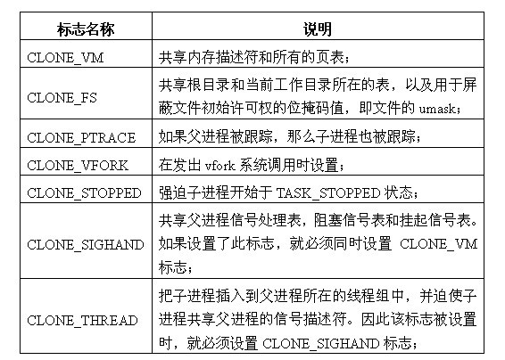
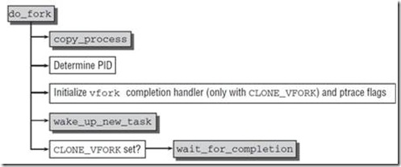
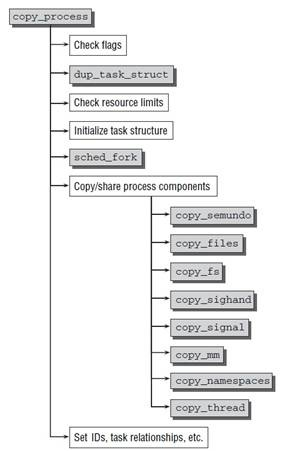
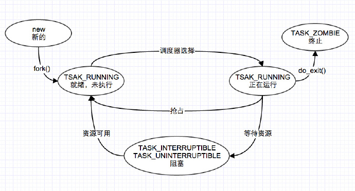

Linux下2号进程的kthreadd
=======


http://blog.csdn.net/umika/article/details/51291749


| 日期 | 内核版本 | 架构| 作者 | GitHub| CSDN |
| ------------- |:-------------:|:-------------:|:-------------:|:-------------:|:-------------:|
| 2016-05-12 | [Linux-4.5](http://lxr.free-electrons.com/source/?v=4.5) | X86 & arm | [gatieme](http://blog.csdn.net/gatieme) | [LinuxDeviceDrivers](https://github.com/gatieme/LDD-LinuxDeviceDrivers) | [Linux进程管理与调度-之-进程的创建](http://blog.csdn.net/gatieme/article/category/6225543) |


>参照
>
>[分析Linux内核创建一个新进程的过程](http://blog.luoyuanhang.com/2015/07/27/%E5%88%86%E6%9E%90Linux%E5%86%85%E6%A0%B8%E5%88%9B%E5%BB%BA%E4%B8%80%E4%B8%AA%E6%96%B0%E8%BF%9B%E7%A8%8B%E7%9A%84%E8%BF%87%E7%A8%8B)
>
>
#前言
-------


Unix标准的复制进程的系统调用时fork（即分叉），但是Linux，BSD等操作系统并不止实现这一个，确切的说linux实现了三个，fork,vfork,clone（确切说vfork创造出来的是轻量级进程，也叫线程，是共享资源的进程）

| 系统调用 | 描述 |
|:-------------:|:-------------:|
| fork | fork创造的子进程是父进程的完整副本，复制了父亲进程的资源，包括内存的内容task_struct内容 |
| vfork | vfork创建的子进程与父进程共享数据段,而且由vfork()创建的子进程将先于父进程运行 |
| clone | Linux上创建线程一般使用的是pthread库  实际上linux也给我们提供了创建线程的系统调用，就是clone |

>关于用户空间使用fork, vfork和clone, 请参见
>
>[Linux中fork，vfork和clone详解（区别与联系）](http://blog.csdn.net/gatieme/article/details/51417488)


fork, vfork和clone的系统调用的入口地址分别是sys_fork, sys_vfork和sys_clone, 而他们的定义是依赖于体系结构的, 因为在用户空间和内核空间之间传递参数的方法因体系结构而异

>**系统调用的参数传递**
>
>系统调用的实现与C库不同, 普通C函数通过将参数的值压入到进程的栈中进行参数的传递。由于系统调用是通过中断进程从用户态到内核态的一种特殊的函数调用，没有用户态或者内核态的堆栈可以被用来在调用函数和被调函数之间进行参数传递。系统调用通过CPU的寄存器来进行参数传递。在进行系统调用之前，系统调用的参数被写入CPU的寄存器，而在实际调用系统服务例程之前，内核将CPU寄存器的内容拷贝到内核堆栈中，实现参数的传递。

因此不同的体系结构可能采用不同的方式或者不同的寄存器来传递参数，而上面函数的任务就是从处理器的寄存器中提取用户空间提供的信息, 并调用体系结构无关的**_do_fork（或者早期的do_fork）函数, 负责进程的复制**

即**不同的体系结构可能需要采用不同的方式或者寄存器来存储函数调用的参数， 因此linux在设计系统调用的时候, 将其划分成体系结构相关的层次和体系结构无关的层次, 前者复杂提取出依赖与体系结构的特定的参数， 后者则依据参数的设置执行特定的真正操作**

#fork, vfork, clone系统调用的实现
-------

##关于do_fork和_do_frok
-------

>The commit 3033f14ab78c32687 ("clone: support passing tls argument via C
rather than pt_regs magic") introduced _do_fork() that allowed to pass
@tls parameter.
>
>参见 http://lists.openwall.net/linux-kernel/2015/03/13/30

 linux2.5.32以后, 添加了TLS(Thread Local Storage)机制, clone的标识CLONE_SETTLS接受一个参数来设置线程的本地存储区。sys_clone也因此增加了一个int参数来传入相应的点tls_val。sys_clone通过do_fork来调用copy_process完成进程的复制，它调用特定的copy_thread和copy_thread把相应的系统调用参数从pt_regs寄存器列表中提取出来，但是会导致意外的情况。

>only one code path into copy_thread can pass the CLONE_SETTLS flag, and
that code path comes from sys_clone with its architecture-specific
argument-passing order.

前面我们说了， 在实现函数调用的时候，我iosys_clone等将特定体系结构的参数从寄存器中提取出来, 然后到达do_fork这步的时候已经应该是体系结构无关了, 但是我们sys_clone需要设置的CLONE_SETTLS的tls仍然是个依赖与体系结构的参数, 这里就会出现问题。

因此**linux-4.2之后**选择引入一个新的CONFIG_HAVE_COPY_THREAD_TLS，和一个新的COPY_THREAD_TLS接受TLS参数为
额外的长整型（系统调用参数大小）的争论。改变sys_clone的TLS参数unsigned long，并传递到copy_thread_tls。

```c
/* http://lxr.free-electrons.com/source/include/linux/sched.h?v=4.5#L2646  */
extern long _do_fork(unsigned long, unsigned long, unsigned long, int __user *, int __user *, unsigned long);
extern long do_fork(unsigned long, unsigned long, unsigned long, int __user *, int __user *);


/* linux2.5.32以后, 添加了TLS(Thread Local Storage)机制, 
	在最新的linux-4.2中添加了对CLONE_SETTLS 的支持 
    底层的_do_fork实现了对其的支持, 
    dansh*/
#ifndef CONFIG_HAVE_COPY_THREAD_TLS
/* For compatibility with architectures that call do_fork directly rather than
 * using the syscall entry points below. */
long do_fork(unsigned long clone_flags,
              unsigned long stack_start,
              unsigned long stack_size,
              int __user *parent_tidptr,
              int __user *child_tidptr)
{
        return _do_fork(clone_flags, stack_start, stack_size,
                        parent_tidptr, child_tidptr, 0);
}
#endif
```

我们会发现，新版本的系统中clone的TLS设置标识会通过TLS参数传递, 因此_do_fork替代了老版本的do_fork。

老版本的do_fork只有在如下情况才会定义

*	只有当系统不支持通过TLS参数通过参数传递而是使用pt_regs寄存器列表传递时

*	未定义CONFIG_HAVE_COPY_THREAD_TLS宏


| 参数 | 描述 |
| ------------- |:-------------:|
| clone_flags | 与clone()参数flags相同, 用来控制进程复制过的一些属性信息, 描述你需要从父进程继承那些资源。该标志位的4个字节分为两部分。最低的一个字节为子进程结束时发送给父进程的信号代码，通常为SIGCHLD；剩余的三个字节则是各种clone标志的组合（本文所涉及的标志含义详见下表），也就是若干个标志之间的或运算。通过clone标志可以有选择的对父进程的资源进行复制； |
| stack_start | 与clone()参数stack_start相同, 子进程用户态堆栈的地址 |
| regs | 是一个指向了寄存器集合的指针, 其中以原始形式, 保存了调用的参数, 该参数使用的数据类型是特定体系结构的struct pt_regs，其中按照系统调用执行时寄存器在内核栈上的存储顺序, 保存了所有的寄存器, 即指向内核态堆栈通用寄存器值的指针，通用寄存器的值是在从用户态切换到内核态时被保存到内核态堆栈中的(指向pt_regs结构体的指针。当系统发生系统调用，即用户进程从用户态切换到内核态时，该结构体保存通用寄存器中的值，并被存放于内核态的堆栈中) |
| stack_size | 用户状态下栈的大小, 该参数通常是不必要的, 总被设置为0 |
| parent_tidptr | 与clone的ptid参数相同, 父进程在用户态下pid的地址，该参数在CLONE_PARENT_SETTID标志被设定时有意义 |
| child_tidptr | 与clone的ctid参数相同, 子进程在用户太下pid的地址，该参数在CLONE_CHILD_SETTID标志被设定时有意义 |

其中clone_flags如下表所示




#sys_fork的实现
-------

不同体系结构下的fork实现sys_fork主要是通过标志集合区分, 在大多数体系结构上, 典型的fork实现方式与如下

**早期实现**

| 架构 | 实现 |
| ------------- |:-------------:|
| arm | [arch/arm/kernel/sys_arm.c, line 239](http://lxr.free-electrons.com/source/arch/arm/kernel/sys_arm.c?v=2.4.37#L239) |
| i386 | [arch/i386/kernel/process.c, line 710](http://lxr.free-electrons.com/source/arch/i386/kernel/process.c?v=2.4.37#L710) |
| x86_64 | [arch/x86_64/kernel/process.c, line 706](http://lxr.free-electrons.com/source/arch/x86_64/kernel/process.c?v=2.4.37#L706) |

```c
asmlinkage long sys_fork(struct pt_regs regs)
{
    return do_fork(SIGCHLD, regs.rsp, &regs, 0);
}
```
**新版本**
>http://lxr.free-electrons.com/source/kernel/fork.c?v=4.5#L1785

```c
#ifdef __ARCH_WANT_SYS_FORK
SYSCALL_DEFINE0(fork)
{
#ifdef CONFIG_MMU
        return _do_fork(SIGCHLD, 0, 0, NULL, NULL, 0);
#else
        /* can not support in nommu mode */
        return -EINVAL;
#endif
}
#endif
```

我们可以看到唯一使用的标志是SIGCHLD。这意味着在子进程终止后将发送信号SIGCHLD信号通知父进程, 

由于写时复制(COW)技术, 最初父子进程的栈地址相同, 但是如果操作栈地址闭并写入数据, 则COW机制会为每个进程分别创建一个新的栈副本

如果do_fork成功,  则新建进程的pid作为系统调用的结果返回, 否则返回错误码


#sys_vfork的实现
-------

**早期实现**


| 架构 | 实现 |
| ------------- |:-------------:|
|arm | [arch/arm/kernel/sys_arm.c, line 254](http://lxr.free-electrons.com/source/arch/arm/kernel/sys_arm.c?v=2.4.37#L254) |
| i386 | [arch/i386/kernel/process.c, line 737](http://lxr.free-electrons.com/source/arch/i386/kernel/process.c?v=2.4.37#L737) |
| x86_64 | [arch/x86_64/kernel/process.c, line 728](http://lxr.free-electrons.com/source/arch/x86_64/kernel/process.c?v=2.4.37#L728) |


```c
asmlinkage long sys_vfork(struct pt_regs regs)
{
    return do_fork(CLONE_VFORK | CLONE_VM | SIGCHLD, regs.rsp, &regs, 0);
}
```


**新版本**

>http://lxr.free-electrons.com/source/kernel/fork.c?v=4.5#L1797


```c
#ifdef __ARCH_WANT_SYS_VFORK
SYSCALL_DEFINE0(vfork)
{
        return _do_fork(CLONE_VFORK | CLONE_VM | SIGCHLD, 0,
                        0, NULL, NULL, 0);
}
#endif
```

可以看到sys_vfork的实现与sys_fork只是略微不同, 前者使用了额外的标志CLONE_VFORK | CLONE_VM

#sys_clone的实现
-------

**早期实现**

| 架构 | 实现 |
| ------------- |:-------------:|
|  arm | [arch/arm/kernel/sys_arm.c, line 247](http://lxr.free-electrons.com/source/arch/arm/kernel/sys_arm.c?v=2.4.37#L247) |
|  i386 | [arch/i386/kernel/process.c, line 715](http://lxr.free-electrons.com/source/arch/i386/kernel/process.c?v=2.4.37#L715) |
|  x86_64  | [arch/x86_64/kernel/process.c, line 711](http://lxr.free-electrons.com/source/arch/x86_64/kernel/process.c?v=2.4.37#L711) |


sys_clone的实现方式与上述系统调用类似, 但实际差别在于do_fork如下调用
```
casmlinkage int sys_clone(struct pt_regs regs)
{
    /* 注释中是i385下增加的代码, 其他体系结构无此定义
    unsigned long clone_flags;
    unsigned long newsp;

    clone_flags = regs.ebx;
    newsp = regs.ecx;*/
    if (!newsp)
        newsp = regs.esp;
    return do_fork(clone_flags, newsp, &regs, 0);
}
```

**新版本**

>http://lxr.free-electrons.com/source/kernel/fork.c?v=4.5#L1805

```c
#ifdef __ARCH_WANT_SYS_CLONE
#ifdef CONFIG_CLONE_BACKWARDS
SYSCALL_DEFINE5(clone, unsigned long, clone_flags, unsigned long, newsp,
                 int __user *, parent_tidptr,
                 unsigned long, tls,
                 int __user *, child_tidptr)
#elif defined(CONFIG_CLONE_BACKWARDS2)
SYSCALL_DEFINE5(clone, unsigned long, newsp, unsigned long, clone_flags,
                 int __user *, parent_tidptr,
                 int __user *, child_tidptr,
                 unsigned long, tls)
#elif defined(CONFIG_CLONE_BACKWARDS3)
SYSCALL_DEFINE6(clone, unsigned long, clone_flags, unsigned long, newsp,
                int, stack_size,
                int __user *, parent_tidptr,
                int __user *, child_tidptr,
                unsigned long, tls)
#else
SYSCALL_DEFINE5(clone, unsigned long, clone_flags, unsigned long, newsp,
                 int __user *, parent_tidptr,
                 int __user *, child_tidptr,
                 unsigned long, tls)
#endif
{
        return _do_fork(clone_flags, newsp, 0, parent_tidptr, child_tidptr, tls);
}
#endif
```
我们可以看到sys_clone的标识不再是硬编码的, 而是通过各个寄存器参数传递到系统调用, 因而我们需要提取这些参数。

另外，clone也不再复制进程的栈, 而是可以指定新的栈地址, 在生成线程时, 可能需要这样做, 线程可能与父进程共享地址空间， 但是线程自身的栈可能在另外一个地址空间

另外还指令了用户空间的两个指针(parent_tidptr和child_tidptr), 用于与线程库通信


#创建子进程的流程
-------

##_do_fork的流程
-------

>_do_fork和do_fork在进程的复制的时候并没有太大的区别, 他们就只是在进程tls复制的过程中实现有细微差别

所有进程复制(创建)的fork机制最终都调用了kernel/fork.c中的_do_fork(一个体系结构无关的函数),

>其定义在 http://lxr.free-electrons.com/source/kernel/fork.c?v=4.2#L1679

_do_fork以调用copy_process开始, 后者执行生成新的进程的实际工作, 并根据指定的标志复制父进程的数据。在子进程生成后, 内核必须执行下列收尾操作:

1.	调用 copy_process 为子进程复制出一份进程信息

2.	如果是 vfork（设置了CLONE_VFORK和ptrace标志）初始化完成处理信息

3.	调用 wake_up_new_task 将子进程加入调度器，为之分配 CPU

4.	如果是 vfork，父进程等待子进程完成 exec 替换自己的地址空间


>我们从<深入linux'内核架构>中找到了早期的流程图，基本一致可以作为参考




```c
long _do_fork(unsigned long clone_flags,
      unsigned long stack_start,
      unsigned long stack_size,
      int __user *parent_tidptr,
      int __user *child_tidptr,
      unsigned long tls)
{
    struct task_struct *p;
    int trace = 0;
    long nr;
  
    /*
     * Determine whether and which event to report to ptracer.  When
     * called from kernel_thread or CLONE_UNTRACED is explicitly
     * requested, no event is reported; otherwise, report if the event
     * for the type of forking is enabled.
     */
    if (!(clone_flags & CLONE_UNTRACED)) {
    if (clone_flags & CLONE_VFORK)
        trace = PTRACE_EVENT_VFORK;
    else if ((clone_flags & CSIGNAL) != SIGCHLD)
        trace = PTRACE_EVENT_CLONE;
    else
        trace = PTRACE_EVENT_FORK;
  
    if (likely(!ptrace_event_enabled(current, trace)))
        trace = 0;
    }
  	/*  复制进程描述符，copy_process()的返回值是一个 task_struct 指针  */
    p = copy_process(clone_flags, stack_start, stack_size,
         child_tidptr, NULL, trace, tls);
    /*
     * Do this prior waking up the new thread - the thread pointer
     * might get invalid after that point, if the thread exits quickly.
     */
    if (!IS_ERR(p)) {
    struct completion vfork;
    struct pid *pid;
  
    trace_sched_process_fork(current, p);
  	/*  得到新创建的进程的pid信息  */
    pid = get_task_pid(p, PIDTYPE_PID);
    nr = pid_vnr(pid);
  
    if (clone_flags & CLONE_PARENT_SETTID)
        put_user(nr, parent_tidptr);
  	
    /*  如果调用的 vfork()方法，初始化 vfork 完成处理信息 */
    if (clone_flags & CLONE_VFORK) {
        p->vfork_done = &vfork;
        init_completion(&vfork);
        get_task_struct(p);
    }
	/*  将子进程加入到调度器中，为其分配 CPU，准备执行  */
    wake_up_new_task(p);
  
    /* forking complete and child started to run, tell ptracer */
    if (unlikely(trace))
        ptrace_event_pid(trace, pid);
  	
    /*  如果是 vfork，将父进程加入至等待队列，等待子进程完成  */
    if (clone_flags & CLONE_VFORK) {
        if (!wait_for_vfork_done(p, &vfork))
        ptrace_event_pid(PTRACE_EVENT_VFORK_DONE, pid);
    }
  
    put_pid(pid);
    } else {
    nr = PTR_ERR(p);
    }
    return nr;
}
```


##copy_process流程
-------

>http://lxr.free-electrons.com/source/kernel/fork.c?v=4.5#L1237

1.	调用 dup_task_struct 复制当前的 task_struct

2.	检查进程数是否超过限制

3.	初始化自旋锁、挂起信号、CPU 定时器等

4.	调用 sched_fork 初始化进程数据结构，并把进程状态设置为 TASK_RUNNING

5.	复制所有进程信息，包括文件系统、信号处理函数、信号、内存管理等

6.	调用 copy_thread_tls 初始化子进程内核栈

7.	为新进程分配并设置新的 pid


>我们从<深入linux'内核架构>中找到了早期的流程图，基本一致可以作为参考




```c
/*
 * This creates a new process as a copy of the old one,
 * but does not actually start it yet.
 *
 * It copies the registers, and all the appropriate
 * parts of the process environment (as per the clone
 * flags). The actual kick-off is left to the caller.
 */
static struct task_struct *copy_process(unsigned long clone_flags,
                    unsigned long stack_start,
                    unsigned long stack_size,
                    int __user *child_tidptr,
                    struct pid *pid,
                    int trace,
                    unsigned long tls)
{
    int retval;
    struct task_struct *p;

    retval = security_task_create(clone_flags);
    if (retval)
        goto fork_out;
	//  复制当前的 task_struct
    retval = -ENOMEM;
    p = dup_task_struct(current);
    if (!p)
        goto fork_out;

    ftrace_graph_init_task(p);

    //初始化互斥变量
    rt_mutex_init_task(p);

#ifdef CONFIG_PROVE_LOCKING
    DEBUG_LOCKS_WARN_ON(!p->hardirqs_enabled);
    DEBUG_LOCKS_WARN_ON(!p->softirqs_enabled);
#endif

	//检查进程数是否超过限制，由操作系统定义
    retval = -EAGAIN;
    if (atomic_read(&p->real_cred->user->processes) >=
            task_rlimit(p, RLIMIT_NPROC)) {
        if (p->real_cred->user != INIT_USER &&
            !capable(CAP_SYS_RESOURCE) && !capable(CAP_SYS_ADMIN))
            goto bad_fork_free;
    }
    current->flags &= ~PF_NPROC_EXCEEDED;

    retval = copy_creds(p, clone_flags);
    if (retval < 0)
        goto bad_fork_free;

    /*
     * If multiple threads are within copy_process(), then this check
     * triggers too late. This doesn't hurt, the check is only there
     * to stop root fork bombs.
     */
	//检查进程数是否超过 max_threads 由内存大小决定
    retval = -EAGAIN;
    if (nr_threads >= max_threads)
        goto bad_fork_cleanup_count;

    delayacct_tsk_init(p);  /* Must remain after dup_task_struct() */
    p->flags &= ~(PF_SUPERPRIV | PF_WQ_WORKER);
    p->flags |= PF_FORKNOEXEC;
    INIT_LIST_HEAD(&p->children);
    INIT_LIST_HEAD(&p->sibling);
    rcu_copy_process(p);
    p->vfork_done = NULL;

    //  初始化自旋锁
    spin_lock_init(&p->alloc_lock);
	//  初始化挂起信号
    init_sigpending(&p->pending);

    //  初始化 CPU 定时器
    posix_cpu_timers_init(p);
	//  ......

    /* Perform scheduler related setup. Assign this task to a CPU. 
    	初始化进程数据结构，并把进程状态设置为 TASK_RUNNING
    */
    retval = sched_fork(clone_flags, p);
    if (retval)
        goto bad_fork_cleanup_policy;
	retval = perf_event_init_task(p);

    /*	复制所有进程信息，包括文件系统、信号处理函数、信号、内存管理等   */
    if (retval)
        goto bad_fork_cleanup_policy;
    retval = audit_alloc(p);
    if (retval)
        goto bad_fork_cleanup_perf;
    /* copy all the process information */
    shm_init_task(p);
    retval = copy_semundo(clone_flags, p);
    if (retval)
        goto bad_fork_cleanup_audit;
    retval = copy_files(clone_flags, p);
    if (retval)
        goto bad_fork_cleanup_semundo;
    retval = copy_fs(clone_flags, p);
    if (retval)
        goto bad_fork_cleanup_files;
    retval = copy_sighand(clone_flags, p);
    if (retval)
        goto bad_fork_cleanup_fs;
    retval = copy_signal(clone_flags, p);
    if (retval)
        goto bad_fork_cleanup_sighand;
    retval = copy_mm(clone_flags, p);
    if (retval)
        goto bad_fork_cleanup_signal;
    retval = copy_namespaces(clone_flags, p);
    if (retval)
        goto bad_fork_cleanup_mm;
    retval = copy_io(clone_flags, p);
    if (retval)
        goto bad_fork_cleanup_namespaces;
    /*    初始化子进程内核栈
    	linux-4.2新增处理TLS
        之前版本是	retval = copy_thread(clone_flags, stack_start, stack_size, p);
        */
    retval = copy_thread_tls(clone_flags, stack_start, stack_size, p, tls);
    if (retval)
        goto bad_fork_cleanup_io;

	/*  为新进程分配新的pid  */
    if (pid != &init_struct_pid) {
        pid = alloc_pid(p->nsproxy->pid_ns_for_children);
        if (IS_ERR(pid)) {
            retval = PTR_ERR(pid);
            goto bad_fork_cleanup_io;
        }
    }

	/*  设置子进程的pid  */
    /* ok, now we should be set up.. */
    p->pid = pid_nr(pid);
    if (clone_flags & CLONE_THREAD) {
        p->exit_signal = -1;
        p->group_leader = current->group_leader;
        p->tgid = current->tgid;
    } else {
        if (clone_flags & CLONE_PARENT)
            p->exit_signal = current->group_leader->exit_signal;
        else
            p->exit_signal = (clone_flags & CSIGNAL);
        p->group_leader = p;
        p->tgid = p->pid;
    }

    p->nr_dirtied = 0;
    p->nr_dirtied_pause = 128 >> (PAGE_SHIFT - 10);
    p->dirty_paused_when = 0;

    p->pdeath_signal = 0;
    INIT_LIST_HEAD(&p->thread_group);
    p->task_works = NULL;

    /*
     * Make it visible to the rest of the system, but dont wake it up yet.
     * Need tasklist lock for parent etc handling!
     */
    write_lock_irq(&tasklist_lock);

	/*  调用fork的进程为其父进程  */
    /* CLONE_PARENT re-uses the old parent */
    if (clone_flags & (CLONE_PARENT|CLONE_THREAD)) {
        p->real_parent = current->real_parent;
        p->parent_exec_id = current->parent_exec_id;
    } else {
        p->real_parent = current;
        p->parent_exec_id = current->self_exec_id;
    }

    spin_lock(&current->sighand->siglock);

    // ......

    return p;
}
```


##dup_task_struct 流程
-------
>http://lxr.free-electrons.com/source/kernel/fork.c?v=4.5#L334

```c
static struct task_struct *dup_task_struct(struct task_struct *orig)
{
	struct task_struct *tsk;
	struct thread_info *ti;
	int node = tsk_fork_get_node(orig);
	int err;

	//分配一个 task_struct 节点
	tsk = alloc_task_struct_node(node);
	if (!tsk)
		return NULL;

	//分配一个 thread_info 节点，包含进程的内核栈，ti 为栈底
	ti = alloc_thread_info_node(tsk, node);
	if (!ti)
		goto free_tsk;

	//将栈底的值赋给新节点的栈
	tsk->stack = ti;

	//……

	return tsk;

}
```

1.	调用alloc_task_struct_node分配一个 task_struct 节点

2.	调用alloc_thread_info_node分配一个 thread_info 节点，其实是分配了一个thread_union联合体,将栈底返回给 ti

```c
union thread_union {
   struct thread_info thread_info;
  unsigned long stack[THREAD_SIZE/sizeof(long)];
};
```

*	最后将栈底的值 ti 赋值给新节点的栈

*	最终执行完dup_task_struct之后，子进程除了tsk->stack指针不同之外，全部都一样！

##sched_fork 流程
-------

```c
int sched_fork(unsigned long clone_flags, struct task_struct *p)
{
	unsigned long flags;
	int cpu = get_cpu();

	__sched_fork(clone_flags, p);

	//  将子进程状态设置为 TASK_RUNNING
	p->state = TASK_RUNNING;

	//  ……

	//  为子进程分配 CPU
	set_task_cpu(p, cpu);

	put_cpu();
	return 0;
}
```

我们可以看到sched_fork大致完成了两项重要工作，

*	一是将子进程状态设置为 TASK_RUNNING，

*	二是为其分配 CPU


##copy_thread和copy_thread_tls流程
-------

我们可以看到linux-4.2之后增加了copy_thread_tls函数和CONFIG_HAVE_COPY_THREAD_TLS宏

但是如果未定义CONFIG_HAVE_COPY_THREAD_TLS宏默认则使用copy_thread同时将定义copy_thread_tls为copy_thread

```c
#ifdef CONFIG_HAVE_COPY_THREAD_TLS
extern int copy_thread_tls(unsigned long, unsigned long, unsigned long,
            struct task_struct *, unsigned long);
#else
extern int copy_thread(unsigned long, unsigned long, unsigned long,
            struct task_struct *);

/* Architectures that haven't opted into copy_thread_tls get the tls argument
 * via pt_regs, so ignore the tls argument passed via C. */
static inline int copy_thread_tls(
        unsigned long clone_flags, unsigned long sp, unsigned long arg,
        struct task_struct *p, unsigned long tls)
{
    return copy_thread(clone_flags, sp, arg, p);
}
#endif
```
| 内核 | 实现 |
| ------------- |:-------------:|
| 4.5 | [arch/x86/kernel/process_32.c, line 132](http://lxr.free-electrons.com/source/arch/x86/kernel/process_32.c?v=4.5#L132) |
| 4.5 | [arch/x86/kernel/process_64.c, line 155](http://lxr.free-electrons.com/source/arch/x86/kernel/process_64.c?v=4.5#L155) |

下面我们来看32位架构的copy_thread_tls函数，他与原来的copy_thread变动并不大, 只是多了后面TLS的设置信息

```c
int copy_thread_tls(unsigned long clone_flags, unsigned long sp,
    unsigned long arg, struct task_struct *p, unsigned long tls)
{
    struct pt_regs *childregs = task_pt_regs(p);
    struct task_struct *tsk;
    int err;
	/*  获取寄存器的信息  */
    p->thread.sp = (unsigned long) childregs;
    p->thread.sp0 = (unsigned long) (childregs+1);
    memset(p->thread.ptrace_bps, 0, sizeof(p->thread.ptrace_bps));

    if (unlikely(p->flags & PF_KTHREAD)) {
        /* kernel thread
        	内核线程的设置  */
        memset(childregs, 0, sizeof(struct pt_regs));
        p->thread.ip = (unsigned long) ret_from_kernel_thread;
        task_user_gs(p) = __KERNEL_STACK_CANARY;
        childregs->ds = __USER_DS;
        childregs->es = __USER_DS;
        childregs->fs = __KERNEL_PERCPU;
        childregs->bx = sp;     /* function */
        childregs->bp = arg;
        childregs->orig_ax = -1;
        childregs->cs = __KERNEL_CS | get_kernel_rpl();
        childregs->flags = X86_EFLAGS_IF | X86_EFLAGS_FIXED;
        p->thread.io_bitmap_ptr = NULL;
        return 0;
    }
    /*  将当前寄存器信息复制给子进程  */
    *childregs = *current_pt_regs();
    /*  子进程 eax 置 0，因此fork 在子进程返回0  */
    childregs->ax = 0;
    if (sp)
        childregs->sp = sp;
	/*  子进程ip 设置为ret_from_fork，因此子进程从ret_from_fork开始执行  */
    p->thread.ip = (unsigned long) ret_from_fork;
    task_user_gs(p) = get_user_gs(current_pt_regs());

    p->thread.io_bitmap_ptr = NULL;
    tsk = current;
    err = -ENOMEM;

    if (unlikely(test_tsk_thread_flag(tsk, TIF_IO_BITMAP))) {
        p->thread.io_bitmap_ptr = kmemdup(tsk->thread.io_bitmap_ptr,
                        IO_BITMAP_BYTES, GFP_KERNEL);
        if (!p->thread.io_bitmap_ptr) {
            p->thread.io_bitmap_max = 0;
            return -ENOMEM;
        }
        set_tsk_thread_flag(p, TIF_IO_BITMAP);
    }

    err = 0;

    /*
     * Set a new TLS for the child thread?
     * 为进程设置一个新的TLS
     */
    if (clone_flags & CLONE_SETTLS)
        err = do_set_thread_area(p, -1,
            (struct user_desc __user *)tls, 0);

    if (err && p->thread.io_bitmap_ptr) {
        kfree(p->thread.io_bitmap_ptr);
        p->thread.io_bitmap_max = 0;
    }
    return err;
}
```

copy_thread 这段代码为我们解释了两个相当重要的问题！

一是，为什么 fork 在子进程中返回0，原因是childregs->ax = 0;这段代码将子进程的 eax 赋值为0
二是，p->thread.ip = (unsigned long) ret_from_fork;将子进程的 ip 设置为 ret_form_fork 的首地址，因此子进程是从 ret_from_fork 开始执行的


#总结
-------

fork, vfork和clone的系统调用的入口地址分别是sys_fork, sys_vfork和sys_clone, 而他们的定义是依赖于体系结构的, 而他们最终都调用了_do_fork（linux-4.2之前的内核中是do_fork），在_do_fork中通过copy_process复制进程的信息，调用wake_up_new_task将子进程加入调度器中


1.	dup_task_struct中为其分配了新的堆栈

2.	调用了sched_fork，将其置为TASK_RUNNING

3.	copy_thread(_tls)中将父进程的寄存器上下文复制给子进程，保证了父子进程的堆栈信息是一致的, 

4.	将ret_from_fork的地址设置为eip寄存器的值

5.	为新进程分配并设置新的pid

6.	最终子进程从ret_from_fork开始执行


进程的创建到执行过程如下图所示




