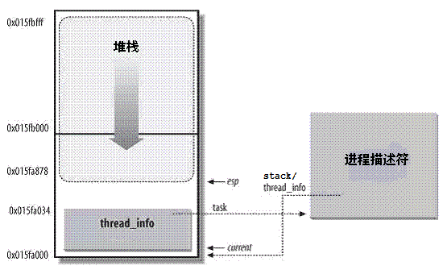

Linux进程内核栈与thread_info结构详解
=======

| 日期 | 内核版本 | 架构| 作者 | GitHub| CSDN |
| ------------- |:-------------:|:-------------:|:-------------:|:-------------:|:-------------:|
| 2016-06-02 | [Linux-4.5](http://lxr.free-electrons.com/source/?v=4.5) | X86 & arm | [gatieme](http://blog.csdn.net/gatieme) | [LinuxDeviceDrivers](https://github.com/gatieme/LDD-LinuxDeviceDrivers) | [Linux进程管理与调度-之-进程的描述](http://blog.csdn.net/gatieme/article/category/6225543) |


#1	前言
-------


##1.1	为什么需要内核栈
-------

*   进程在内核态运行时需要自己的堆栈信息, 因此linux内核为每个进程都提供了一个内核栈kernel stack,

```c
struct task_struct
{
    // ...
    void *stack;    //  指向内核栈的指针
    // ...
};
```

内核态的进程访问处于内核数据段的栈，这个栈不同于用户态的进程所用的栈。

用户态进程所用的栈，是在进程线性地址空间中；

而内核栈是当进程从用户空间进入内核空间时，特权级发生变化，需要切换堆栈，那么内核空间中使用的就是这个内核栈。因为内核控制路径使用很少的栈空间，所以只需要几千个字节的内核态堆栈。

>需要注意的是，**内核态堆栈**仅用于内核例程，Linux内核另外为中断提供了单独的**硬中断栈**和**软中断栈**


##1.2	为什么需要thread_info
-------

*   内核还需要存储每个进程的PCB信息, linux内核是支持不同体系的的, 但是不同的体系结构可能进程需要存储的信息不尽相同, 这就需要我们实现一种通用的方式, 我们将体系结构相关的部分和无关的部门进行分离

用一种通用的方式来描述进程, 这就是struct task_struct, 而thread_info就保存了特定体系结构的汇编代码段需要访问的那部分进程的数据,我们在thread_info中嵌入指向task_struct的指针, 则我们可以很方便的通过thread_info来查找task_struct


##1.3	将两种结构融合在一起
-------

linux将内核栈和进程控制块thread_info融合在一起, 组成一个联合体thread_union

通常内核栈和thread_info一同保存在一个联合体中, thread_info保存了线程所需的所有特定处理器的信息, 以及通用的task_struct的指针


#2	内核数据结构描述
-------

##2.1	hread_union
-------

对每个进程，Linux内核都把两个不同的数据结构紧凑的存放在一个单独为进程分配的内存区域中：

*   一个是内核态的进程堆栈stack

*  另一个是紧挨着进程描述符的小数据结构thread_info，叫做线程描述符。


这两个结构被紧凑的放在一个联合体中thread_union中,
```c
union thread_union
{
	struct thread_info thread_info;
	unsigned long stack[THREAD_SIZE/sizeof(long)];
};
```

这块区域32位上通常是8K=8192（占两个页框），64位上通常是16K,其实地址必须是8192的整数倍。

| 架构 | THREAD_SIZE |
| ------------- |:-------------:|
| x86 | [arch/x86/include/asm/page_32_types.h, line 21](http://lxr.free-electrons.com/source/arch/x86/include/asm/page_32_types.h?v=4.5#L21) |
| x86_64 | [arch/x86/include/asm/page_64_types.h, line 11](http://lxr.free-electrons.com/source/arch/x86/include/asm/page_64_types.h?v=4.5#L11) |
| arm | [arch/arm/include/asm/thread_info.h, line 20](http://lxr.free-electrons.com/source/arch/arm/include/asm/thread_info.h?v=4.5#L20) |
| arm64 | [arch/arm64/include/asm/thread_info.h, line 32](http://lxr.free-electrons.com/source/arch/arm64/include/asm/thread_info.h?v=4.5#L32) |

出于效率考虑，内核让这8K(或者16K)空间占据连续的两个页框并让第一个页框的起始地址是213的倍数。


下图中显示了在物理内存中存放两种数据结构的方式。线程描述符驻留与这个内存区的开始，而栈顶末端向下增长。 下图摘自ULK3,进程内核栈与进程描述符的关系如下图：




在这个图中，

*	esp寄存器是CPU栈指针，用来存放栈顶单元的地址。在80x86系统中，栈起始于顶端，并朝着这个内存区开始的方向增长。从用户态刚切换到内核态以后，进程的内核栈总是空的。因此，esp寄存器指向这个栈的顶端。一旦数据写入堆栈，esp的值就递减。

同时我们可以看到,

*	thread_info和内核栈虽然共用了thread_union结构, 但是thread_info大小固定, 存储在联合体的开始部分, 而内核栈由高地址向低地址扩展, 当内核栈的栈顶到达thread_info的存储空间时, 则会发生栈溢出

*	系统的current指针指向了当前运行进程的thread_union(或者thread_info)的地址

*	进程task_struct中的stack指针指向了进程的thread_union(或者thread_info)的地址, 在早期的内核中这个指针用struct thread_info *thread_info来表示, 但是新的内核中用了一个更浅显的名字void *stack, 即内核栈

即，进程的thread_info存储在进程内核栈的最低端


##2.2	task_struct中的内核栈stack
-------

我们之前在描述task_struct时就提到了其stack指针指向的是内核栈的地址。

>参见 [ Linux进程描述符task_struct结构体详解--Linux进程的管理与调度（一）](http://blog.csdn.net/gatieme/article/details/51383272#t6)

其被定义在include/linux/sched.h中

>http://lxr.free-electrons.com/source/include/linux/sched.h?v=4.5#L1391

形式如下

```c
struct task_struct
{
    // ...  
    void *stack;    //  指向内核栈的指针  
    // ...
};
```

在早期的linux内核中进程描述符中是不包含内核栈的, 相反包含着指向`thread_info`的指针

但是在2007年的一次更新(since 2.6.22)中加入了`stack`内核栈指针, 替代了原来的`thread_info`的指针

进程描述符task_struct结构中没有直接指向thread_info结构的指针，而是用一个void指针类型的成员表示，然后通过类型转换来访问thread_info结构。

stack指向了内核栈的地址(其实也就是thread_info和thread_union的地址),因为联合体中stack和thread_info都在起始地址, 因此可以很方便的转型

相关代码在[include/linux/sched.h](http://lxr.free-electrons.com/source/include/linux/sched.h?v=4.5#L2812)中
task_thread_info用于通过task_struct来查找其thread_info的信息, 只需要一次指针类型转换即可
```c
#define task_thread_info(task)  ((struct thread_info *)(task)->stack)
```


##2.3	内核栈数据结构描述thread_info
-------

thread_info是体系结构相关的，结构的定义在[thread_info.h](http://lxr.free-electrons.com/ident?v=4.5;i=thread_info)中

| 架构 | 定义链接 |
| ------------- |:-------------:|
| x86 | [linux-4.5/arch/x86/include/asm/thread_info.h, line 55](http://lxr.free-electrons.com/source/arch/x86/include/asm/thread_info.h?v=4.5#L55) |
| arm | [linux-4.5arch/arm/include/asm/thread_info.h, line 49](http://lxr.free-electrons.com/source/arch/arm/include/asm/thread_info.h#L49)
| arm64 | [linux/4.5/arch/arm64/include/asm/thread_info.h, line 47](http://lxr.free-electrons.com/source/arch/arm64/include/asm/thread_info.h#L47) |


#3	函数接口
-------


##3.1	内核栈与thread_info的通用操作
-------

原则上, 只要设置了预处理器常数`__HAVE_THREAD_FUNCTIONS`通知内核, 那么各个体系结构就可以随意在stack数组中存储数据。

在这种情况下, 他们必须自行实现**task_thread_info**和**task_stack_page**， 这两个函数用于获取给定task_struct实例的线程信息和内核栈。

另外, 他们必须实现dup_task_struct中调用的函数**setup_thread_stack**, 以便确定stack成员的具体内存布局, 当前只有ia64等少数架构不依赖于内核的默认方法


下标给出了不同架构的task_thread_info和task_stack_page的实现

| 架构 | 定义链接 |
| ------------- |:-------------:|
| ia64 | [arch/ia64/include/asm/thread_info.h, line 53](http://lxr.free-electrons.com/source/arch/ia64/include/asm/thread_info.h?v=4.5#L53) |
| 通用 | [include/linux/sched.h, line 2812](http://lxr.free-electrons.com/source/include/linux/sched.h?v=4.5#L2812) |

```c
// 未定义__HAVE_THREAD_FUNCTIONS的时候使用内核的默认操作
#ifndef __HAVE_THREAD_FUNCTIONS  

//  通过进程的task_struct来获取进程的thread_info
#define task_thread_info(task)  ((struct thread_info *)(task)->stack)
//  通过进程的task_struct来获取进程的内核栈
#define task_stack_page(task)   ((task)->stack)

//  初始化thread_info, 指定其存储结构的内存布局
static inline void setup_thread_stack(struct task_struct *p, struct task_struct *org)
{
    *task_thread_info(p) = *task_thread_info(org);
    task_thread_info(p)->task = p;
}

/*
 * Return the address of the last usable long on the stack.
 *
 * When the stack grows down, this is just above the thread
 * info struct. Going any lower will corrupt the threadinfo.
 *
 * When the stack grows up, this is the highest address.
 * Beyond that position, we corrupt data on the next page.
 */
static inline unsigned long *end_of_stack(struct task_struct *p)
{
#ifdef CONFIG_STACK_GROWSUP
    return (unsigned long *)((unsigned long)task_thread_info(p) + THREAD_SIZE) - 1;
#else
    return (unsigned long *)(task_thread_info(p) + 1);
#endif
}

#endif
```


在内核的某个特定组建使用了较多的栈空间时, 内核栈会溢出到thread_info部分, 因此内核提供了**kstack_end**函数来判断给出的地址是否位于栈的有效部分

```c
#ifndef __HAVE_ARCH_KSTACK_END
static inline int kstack_end(void *addr)
{
    /* Reliable end of stack detection:
     * Some APM bios versions misalign the stack
     */
    return !(((unsigned long)addr+sizeof(void*)-1) & (THREAD_SIZE-sizeof(void*)));
}
#endif
```

>前面我们在讲[_do_fork创建进程](http://blog.csdn.net/gatieme/article/details/51569932)的时候, 提到dup_task_struct会复制父进程的task_struct和thread_info实例的内容, 但是stack则与新的thread_info实例位于同一个内存, 这意味着父子进程的task_struct此时除了栈指针之外完全相同。

##3.2	获取当前在CPU上正在运行进程的thread_info
-------

所有的体系结构都必须实现两个current和current_thread_info的符号定义宏或者函数, 

*	current_thread_info可获得当前执行进程的thread_info实例指针, 其地址可以根据内核指针来确定, 因为thread_info总是位于起始位置, 

	因为每个进程都有自己的内核栈, 因此进程到内核栈的映射是唯一的, 那么指向内核栈的指针通常保存在一个特别保留的寄存器中(多数情况下是esp)

*	current给出了当前进程进程描述符task_struct的地址，该地址往往通过current_thread_info来确定
	current = current_thread_info()->task


因此我们的关键就是current_thread_info的实现了，即如何通过esp栈指针来获取当前在CPU上正在运行进程的thread_info结构。


早期的版本中，不需要对64位处理器的支持，所以，内核通过简单的屏蔽掉esp的低13位有效位就可以获得thread_info结构的基地址了。


我们在下面对比了，获取正在运行的进程的thread_info的实现方式

| 架构 | 版本 | 定义链接 | 实现方式 | 思路解析 |
| ------------- |:-------------:|:-------------:|:-------------:|:-------------:|
| x86 | [3.14](http://lxr.free-electrons.com/ident?v=3.14;i=current_thread_info)   | [current_thread_info(void)](http://lxr.free-electrons.com/source/arch/x86/include/asm/thread_info.h#L164) |return (struct thread_info *)(sp & ~(THREAD_SIZE - 1)); | 屏蔽了esp的低十三位，最终得到的是thread_info的地址 |
| x86 | [3.15](http://lxr.free-electrons.com/ident?v=3.15;i=current_thread_info) | [current_thread_info(void)](http://lxr.free-electrons.com/source/arch/x86/include/asm/thread_info.h?v=3.15#L163) | ti = (void *)(this_cpu_read_stable(kernel_stack) + KERNEL_STACK_OFFSET - THREAD_SIZE); |
| x86 | [4.1](http://lxr.free-electrons.com/ident?v=4.1&i=current_thread_info) | [current_thread_info(void)](http://lxr.free-electrons.com/source/arch/x86/include/asm/thread_info.h?v=4.1#L182) |  (struct thread_info *)(current_top_of_stack() - THREAD_SIZE);

>**早期版本**
>
>当前的栈指针(current_stack_pointer  == sp)就是esp，
>
>THREAD_SIZE为8K，二进制的表示为0000 0000 0000 0000 0010 0000 0000 0000。
>
>~(THREAD_SIZE-1)的结果刚好为1111 1111 1111 1111 1110 0000 0000 0000，第十三位是全为零，也就是刚好屏蔽了esp的低十三位，最终得到的是thread_info的地址。


进程最常用的是进程描述符结构task_struct而不是thread_info结构的地址。为了获取当前CPU上运行进程的task_struct结构，内核提供了current宏，由于task_struct *task在thread_info的起始位置，该宏本质上等价于current_thread_info()->task，在[include/asm-generic/current.h](http://lxr.free-electrons.com/source/include/asm-generic/current.h?v=4.5#L6)中定义：
```c
#define get_current() (current_thread_info()->task)
#define current get_current()
```

这个定义是体系结构无关的，当然linux也为各个体系结构定义了更加方便或者快速的current

>>请参见	：http://lxr.free-electrons.com/ident?v=4.5;i=current


##3.3	分配和销毁thread_info
-------

进程通过[alloc_thread_info_node](http://lxr.free-electrons.com/source/kernel/fork.c?v=4.5;#L161)函数分配它的内核栈，通过[free_thread_info](http://lxr.free-electrons.com/source/kernel/fork.c?v=4.5#L170)函数释放所分配的内核栈。 

```c
# if THREAD_SIZE >= PAGE_SIZE
static struct thread_info *alloc_thread_info_node(struct task_struct *tsk,
                          int node)
{
    struct page *page = alloc_kmem_pages_node(node, THREADINFO_GFP,
                          THREAD_SIZE_ORDER);

    return page ? page_address(page) : NULL;
}

static inline void free_thread_info(struct thread_info *ti)
{
    free_kmem_pages((unsigned long)ti, THREAD_SIZE_ORDER);
}
# else
static struct kmem_cache *thread_info_cache;

static struct thread_info *alloc_thread_info_node(struct task_struct *tsk,
                          int node)
{
    return kmem_cache_alloc_node(thread_info_cache, THREADINFO_GFP, node);
}

static void free_thread_info(struct thread_info *ti)
{
    kmem_cache_free(thread_info_cache, ti);
}
```

其中，[THREAD_SIZE_ORDER](http://lxr.free-electrons.com/ident?v=4.5;i=THREAD_SIZE_ORDER)宏的定义请查看

| 架构 | 版本 | 定义链接 | 实现方式 | 思路解析 |
| ------------- |:-------------:|:-------------:|:-------------:|:-------------:|
| x86 | 4.5 | [arch/x86/include/asm/page_32_types.h, line 20](http://lxr.free-electrons.com/source/arch/x86/include/asm/page_32_types.h?v=4.5#L20) | #define THREAD_SIZE_ORDER       1 | __get_free_pages函数分配2个页的内存（它的首地址是8192字节对齐的）|
| x86_64 | 4.5 | [arch/x86/include/asm/page_64_types.h, line 10](http://lxr.free-electrons.com/source/arch/x86/include/asm/page_64_types.h?v=4.5#L10)|#define THREAD_SIZE_ORDER       (2 + KASAN_STACK_ORDER)


