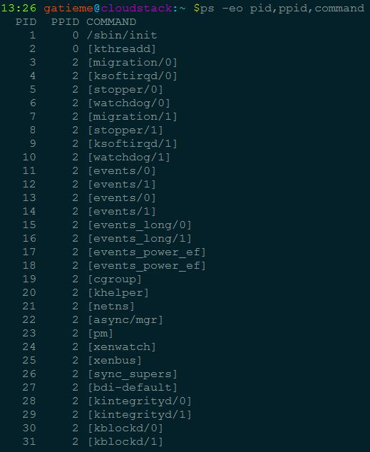

Linux内核线程kernel thread详解
=======


| 日期 | 内核版本 | 架构| 作者 | GitHub| CSDN |
| ------------- |:-------------:|:-------------:|:-------------:|:-------------:|:-------------:|
| 2016-06-02 | [Linux-4.5](http://lxr.free-electrons.com/source/?v=4.5) | X86 & arm | [gatieme](http://blog.csdn.net/gatieme) | [LinuxDeviceDrivers](https://github.com/gatieme/LDD-LinuxDeviceDrivers) | [Linux进程管理与调度-之-进程的描述](http://blog.csdn.net/gatieme/article/category/6225543) |



#内核线程
-------

##为什么需要内核线程
-------

Linux内核可以看作一个服务进程(管理软硬件资源，响应用户进程的种种合理以及不合理的请求)。

内核需要多个执行流并行，为了防止可能的阻塞，支持多线程是必要的。

内核线程就是内核的分身，一个分身可以处理一件特定事情。内核线程的调度由内核负责，一个内核线程处于阻塞状态时不影响其他的内核线程，因为其是调度的基本单位。

这与用户线程是不一样的。因为内核线程只运行在内核态

因此，它只能使用大于PAGE_OFFSET（传统的x86_32上是3G）的地址空间。



##内核线程概述
-------

内核线程是直接由内核本身启动的进程。内核线程实际上是将内核函数委托给独立的进程，它与内核中的其他进程"并行"执行。内核线程经常被称之为**内核守护进程**。

他们执行下列任务

*	周期性地将修改的内存页与页来源块设备同步

*	如果内存页很少使用，则写入交换区

*	管理延时动作,　如２号进程接手内核进程的创建

*	实现文件系统的事务日志



内核线程主要有两种类型


1.	线程启动后一直等待，直至内核请求线程执行某一特定操作。

2.	线程启动后按周期性间隔运行，检测特定资源的使用，在用量超出或低于预置的限制时采取行动。


内核线程由内核自身生成，其特点在于

1.	它们在CPU的管态执行，而不是用户态。

2.	它们只可以访问虚拟地址空间的内核部分（高于TASK_SIZE的所有地址），但不能访问用户空间



##内核线程的进程描述符task_struct
-------


task_struct进程描述符中包含两个跟进程地址空间相关的字段mm, active_mm，


```c
struct task_struct
{
	// ...
	struct mm_struct *mm;
	struct mm_struct *avtive_mm;
	//...
};
```

大多数计算机上系统的全部虚拟地址空间分为两个部分: 供用户态程序访问的虚拟地址空间和供内核访问的内核空间。每当内核执行上下文切换时, 虚拟地址空间的用户层部分都会切换, 以便当前运行的进程匹配, 而内核空间不会放生切换。

对于普通用户进程来说，mm指向虚拟地址空间的用户空间部分，而对于内核线程，mm为NULL。

这位优化提供了一些余地, 可遵循所谓的惰性TLB处理(lazy TLB handing)。active_mm主要用于优化，由于内核线程不与任何特定的用户层进程相关，内核并不需要倒换虚拟地址空间的用户层部分，保留旧设置即可。由于内核线程之前可能是任何用户层进程在执行，故用户空间部分的内容本质上是随机的，内核线程决不能修改其内容，故将mm设置为NULL，同时如果切换出去的是用户进程，内核将原来进程的mm存放在新内核线程的active_mm中，因为某些时候内核必须知道用户空间当前包含了什么。

>为什么没有mm指针的进程称为惰性TLB进程?
>
>假如内核线程之后运行的进程与之前是同一个, 在这种情况下, 内核并不需要修改用户空间地址表。地址转换后备缓冲器(即TLB)中的信息仍然有效。只有在内核线程之后, 执行的进程是与此前不同的用户层进程时, 才需要切换(并对应清除TLB数据)。


内核线程和普通的进程间的区别在于内核线程没有独立的地址空间，mm指针被设置为NULL；它只在 内核空间运行，从来不切换到用户空间去；并且和普通进程一样，可以被调度，也可以被抢占。


#内核线程的创建
-------

##创建内核线程接口的演变
-------

内核线程可以通过两种方式实现：

*	**古老的接口  kernel_create和daemonize**

    将一个函数传递给kernel_thread创建并初始化一个task，该函数接下来负责帮助内核调用daemonize已转换为内核守护进程，daemonize随后完成一些列操作, 如该函数释放其父进程的所有资源，不然这些资源会一直锁定直到线程结束。阻塞信号的接收, 将init用作守护进程的父进程


*	**更加现在的方法kthead_create和kthread_run**

	创建内核更常用的方法是辅助函数kthread_create，该函数创建一个新的内核线程。最初线程是停止的，需要使用wake_up_process启动它。

	使用kthread_run，与kthread_create不同的是，其创建新线程后立即唤醒它，其本质就是先用kthread_create创建一个内核线程，然后通过wake_up_process唤醒它


##2号进程kthreadd的诞生
-------


**早期的kernel_create和daemonize接口**

在早期的内核中, 提供了kernel_create和daemonize接口, 但是这种机制操作复杂而且将所有的任务交给内核去完成。

但是这种机制低效而且繁琐, 将所有的操作塞给内核, 我们创建内核线程的初衷不本来就是为了内核分担工作, 减少内核的开销的么


**Workqueue机制**

因此在linux-2.6以后, 提供了更加方便的接口kthead_create和kthread_run, 同时将内核线程的创建操作延后, 交给一个工作队列workqueue, 参见[http://lxr.linux.no/linux+v2.6.13/kernel/kthread.c#L21](http://lxr.linux.no/linux+v2.6.13/kernel/kthread.c#L21)，

Linux中的workqueue机制就是为了简化内核线程的创建。通过kthread_create并不真正创建内核线程, 而是将创建工作create work插入到工作队列[helper_wq](http://lxr.linux.no/linux+v2.6.11/kernel/kthread.c#L17)中, 随后调用workqueue的接口就能创建内核线程。并且可以根据当前系统CPU的个数创建线程的数量，使得线程处理的事务能够并行化。workqueue是内核中实现简单而有效的机制，他显然简化了内核daemon的创建，方便了用户的编程.

>工作队列（workqueue）是另外一种将工作推后执行的形式.工作队列可以把工作推后，交由一个内核线程去执行，也就是说，这个下半部分可以在进程上下文中执行。最重要的就是工作队列允许被重新调度甚至是睡眠。


>具体的信息, 请参见
>
>[Linux workqueue工作原理 ](http://blog.chinaunix.net/uid-21977330-id-3754719.html)


**2号进程kthreadd**

但是这种方法依然看起来不够优美, 我们何不把这种创建内核线程的工作交给一个特殊的内核线程来做呢？

于是linux-2.6.22引入了kthreadd进程, 并随后演变为2号进程, 它在系统初始化时同1号进程一起被创建(当然肯定是通过kernel_thread), [参见rest_init函数](http://lxr.linux.no/linux+v2.6.22/init/main.c#L426), 并随后演变为创建内核线程的真正建造师, [参见kthreadd](http://lxr.linux.no/linux+v2.6.22/+search=kthreadd)和[kthreadd函数](http://lxr.linux.no/linux+v2.6.22/kernel/kthread.c#L230), 它会循环的是查询工作链表[static LIST_HEAD(kthread_create_list);](http://lxr.linux.no/linux+v2.6.22/kernel/kthread.c#L19)中是否有需要被创建的内核线程, 而我们的通过kthread_create执行的操作, 只是在内核线程任务队列kthread_create_list中增加了一个create任务, 然后会唤醒kthreadd进程来执行真正的创建操作
</font>



内核线程会出现在系统进程列表中, 但是在ps的输出中进程名command由方括号包围, 以便与普通进程区分。

如下图所示, 我们可以看到系统中, 所有内核线程都用[]标识, 而且这些进程父进程id均是2, 而2号进程kthreadd的父进程是0号进程

>使用ps -eo pid,ppid,command





##kernel_thread
-------

kernel_thread是最基础的创建内核线程的接口, 它通过将一个函数直接传递给内核来创建一个进程, 创建的进程运行在内核空间, 并且与其他进程线程共享内核虚拟地址空间


kernel_thread的实现经历过很多变革
早期的kernel_thread执行更底层的操作, 直接创建了task_struct并进行初始化,

引入了kthread_create和kthreadd 2号进程后, kernel_thread的实现也由统一的_do_fork(或者早期的do_fork)托管实现

###早期实现
-------

早期的内核中, kernel_thread并不是使用统一的do_fork或者_do_fork这一封装好的接口实现的, 而是使用更底层的细节

>参见
>
>http://lxr.free-electrons.com/source/kernel/fork.c?v=2.4.37#L613


我们可以看到它内部调用了更加底层的arch_kernel_thread创建了一个线程

>arch_kernel_thread
>
>其具体实现请参见
>
>http://lxr.free-electrons.com/ident?v=2.4.37;i=arch_kernel_thread

但是这种方式创建的线程并不适合运行，因此内核提供了daemonize函数, 其声明在include/linux/sched.h中

```c
//  http://lxr.free-electrons.com/source/include/linux/sched.h?v=2.4.37#L800
extern void daemonize(void);
```

定义在kernel/sched.c

>http://lxr.free-electrons.com/source/kernel/sched.c?v=2.4.37#L1326

主要执行如下操作

1.	该函数释放其父进程的所有资源，不然这些资源会一直锁定直到线程结束。

2.	阻塞信号的接收

3.	将init用作守护进程的父进程

我们可以看到早期内核的很多地方使用了这个接口, 比如

>可以参见
>
>http://lxr.free-electrons.com/ident?v=2.4.37;i=daemonize

我们将了这么多kernel_thread, 但是我们并不提倡我们使用它, 因为这个是底层的创建内核线程的操作接口, 使用kernel_thread在内核中执行大量的操作, 虽然创建的代价已经很小了, 但是对于追求性能的linux内核来说还不能忍受

因此我们只能说<font color=0x00ffff>kernel_thread是一个古老的接口, 内核中的有些地方仍然在使用该方法, 将一个函数直接传递给内核来创建内核线程</font>

于是linux-3.x下之后, 有了更好的实现, 那就是

<font color=0x00ffff>
延后内核的创建工作, 将内核线程的创建工作交给一个内核线程来做, 即kthreadd 2号进程

但是在kthreadd还没创建之前, 我们只能通过kernel_thread这种方式去创建
</font>

同时kernel_thread的实现也改为由_do_fork(早期内核中是do_fork)来实现, 参见[kernel/fork.c](http://lxr.free-electrons.com/source/kernel/fork.c?v=4.5#L1779)
`
``c
pid_t kernel_thread(int (*fn)(void *), void *arg, unsigned long flags)
{
    return _do_fork(flags|CLONE_VM|CLONE_UNTRACED, (unsigned long)fn,
            (unsigned long)arg, NULL, NULL, 0);
}
```
##kthread_create
-------


```c
struct task_struct *kthread_create_on_node(int (*threadfn)(void *data),
                                           void *data,
                                          int node,
                                          const char namefmt[], ...);

#define kthread_create(threadfn, data, namefmt, arg...) \
       kthread_create_on_node(threadfn, data, NUMA_NO_NODE, namefmt, ##arg)
```

创建内核更常用的方法是辅助函数kthread_create，该函数创建一个新的内核线程。最初线程是停止的，需要使用wake_up_process启动它。


##kthread_run
-------

```c
/**
 * kthread_run - create and wake a thread.
 * @threadfn: the function to run until signal_pending(current).
 * @data: data ptr for @threadfn.
 * @namefmt: printf-style name for the thread.
 *
 * Description: Convenient wrapper for kthread_create() followed by
 * wake_up_process().  Returns the kthread or ERR_PTR(-ENOMEM).
 */
#define kthread_run(threadfn, data, namefmt, ...)                          \
({                                                                         \
    struct task_struct *__k                                            \
            = kthread_create(threadfn, data, namefmt, ## __VA_ARGS__); \
    if (!IS_ERR(__k))                                                  \
            wake_up_process(__k);                                      \
    __k;                                                               \
})

```

使用kthread_run，与kthread_create不同的是，其创建新线程后立即唤醒它，其本质就是先用kthread_create创建一个内核线程，然后通过wake_up_process唤醒它


#内核线程的退出
-------

线程一旦启动起来后，会一直运行，除非该线程主动调用do_exit函数，或者其他的进程调用kthread_stop函数，结束线程的运行。

```c
    int kthread_stop(struct task_struct *thread);
```

kthread_stop() 通过发送信号给线程。

如果线程函数正在处理一个非常重要的任务，它不会被中断的。当然如果线程函数永远不返回并且不检查信号，它将永远都不会停止。

在执行kthread_stop的时候，目标线程必须没有退出，否则会Oops。原因很容易理解，当目标线程退出的时候，其对应的task结构也变得无效，kthread_stop引用该无效task结构就会出错。

为了避免这种情况，需要确保线程没有退出，其方法如代码中所示：
```c
thread_func()
{
    // do your work here
    // wait to exit
    while(!thread_could_stop())
    {
           wait();
    }
}

exit_code()
{
     kthread_stop(_task);   //发信号给task，通知其可以退出了
}
```

这种退出机制很温和，一切尽在thread_func()的掌控之中，线程在退出时可以从容地释放资源，而不是莫名其妙地被人“暗杀”。

