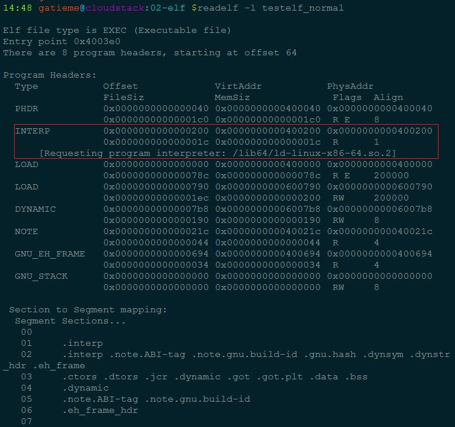
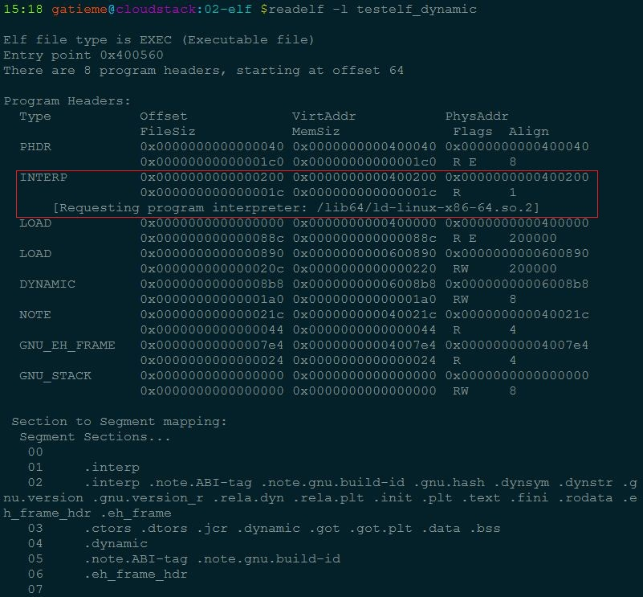
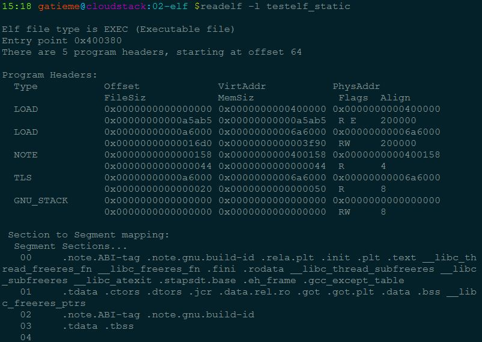

ELF文件的加载和动态链接过程
=======


| 日期 | 内核版本 | 架构| 作者 | GitHub| CSDN |
| ------------- |:-------------:|:-------------:|:-------------:|:-------------:|:-------------:|
| 2016-06-04 | [Linux-4.6](http://lxr.free-electrons.com/source/?v=4.6) | X86 & arm | [gatieme](http://blog.csdn.net/gatieme) | [LinuxDeviceDrivers](https://github.com/gatieme/LDD-LinuxDeviceDrivers) | [Linux进程管理与调度-之-进程的描述](http://blog.csdn.net/gatieme/article/category/6225543) |


#加载和动态链接
-------

从编译/链接和运行的角度看，应用程序和库程序的连接有两种方式。
一种是固定的、静态的连接，就是把需要用到的库函数的目标代码（二进制）代码从程序库中抽取出来，链接进应用软件的目标映像中；

另一种是动态链接，是指库函数的代码并不进入应用软件的目标映像，应用软件在编译/链接阶段并不完成跟库函数的链接，而是把函数库的映像也交给用户，到启动应用软件目标映像运行时才把程序库的映像也装入用户空间（并加以定位），再完成应用软件与库函数的连接。

这样，就有了两种不同的ELF格式映像。

*	一种是静态链接的，在装入/启动其运行时无需装入函数库映像、也无需进行动态连接。

*	另一种是动态连接，需要在装入/启动其运行时同时装入函数库映像并进行动态链接。

Linux内核既支持静态链接的ELF映像，也支持动态链接的ELF映像，而且装入/启动ELF映像必需由内核完成，而动态连接的实现则既可以在内核中完成，也可在用户空间完成。

因此，GNU把对于动态链接ELF映像的支持作了分工：

把ELF映像的装入/启动入在Linux内核中；而把动态链接的实现放在用户空间（glibc），并为此提供一个称为"解释器"(ld-linux.so.2)的工具软件，而解释器的装入/启动也由内核负责，这在后面我们分析ELF文件的加载时就可以看到

 这部分主要说明ELF文件在内核空间的加载过程，下一部分对用户空间符号的动态解析过程进行说明。

#Linux可执行文件类型的注册机制
-------

在说明ELF文件的加载过程以前，我们先回答一个问题，就是：

>**为什么Linux可以运行ELF文件？**
>
>内核对所支持的每种可执行的程序类型都有个struct linux_binfmt的数据结构，这个结构我们在前面的博文中我们已经提到, 但是没有详细讲. 其定义如下

```c
/*
  * This structure defines the functions that are used to load the binary formats that
  * linux accepts.
  */
struct linux_binfmt {
    struct list_head lh;
    struct module *module;
    int (*load_binary)(struct linux_binprm *);
    int (*load_shlib)(struct file *);
    int (*core_dump)(struct coredump_params *cprm);
    unsigned long min_coredump;     /* minimal dump size */
 };
```

linux_binfmt定义在include/linux/binfmts.h中


linux支持其他不同格式的可执行程序, 在这种方式下, linux能运行其他操作系统所编译的程序, 如MS-DOS程序, 活BSD Unix的COFF可执行格式, 因此linux内核用struct linux_binfmt来描述各种可执行程序。

linux内核对所支持的每种可执行的程序类型都有个struct linux_binfmt的数据结构，
其提供了3种方法来加载和执行可执行程序

| 函数 | 描述 |
| ------------- |:-------------:|
| load_binary | 通过读存放在可执行文件中的信息为当前进程建立一个新的执行环境 |
| load_shlib | 用于动态的把一个共享库捆绑到一个已经在运行的进程, 这是由uselib()系统调用激活的 |
| core_dump | 在名为core的文件中, 存放当前进程的执行上下文. 这个文件通常是在进程接收到一个缺省操作为”dump”的信号时被创建的, 其格式取决于被执行程序的可执行类型 |

所有的linux_binfmt对象都处于一个链表中, 第一个元素的地址存放在formats变量中, 可以通过调用register_binfmt()和unregister_binfmt()函数在链表中插入和删除元素, 在系统启动期间, 为每个编译进内核的可执行格式都执行registre_fmt()函数. 当实现了一个新的可执行格式的模块正被装载时, 也执行这个函数, 当模块被卸载时, 执行unregister_binfmt()函数.

当我们执行一个可执行程序的时候, 内核会list_for_each_entry遍历所有注册的linux_binfmt对象, 对其调用load_binrary方法来尝试加载, 直到加载成功为止.


 其中的load_binary函数指针指向的就是一个可执行程序的处理函数。而我们研究的ELF文件格式的linux_binfmt结构对象elf_format, 定义如下, 在[/fs/binfmt.c](http://lxr.free-electrons.com/source/fs/binfmt_elf.c#L84)中

```c
static struct linux_binfmt elf_format = {
	.module      = THIS_MODULE,
	.load_binary = load_elf_binary,
	.load_shlib      = load_elf_library,
	.core_dump       = elf_core_dump,
	.min_coredump    = ELF_EXEC_PAGESIZE,
	.hasvdso     = 1
};
```

要支持ELF文件的运行，则必须向内核登记注册elf_format这个linux_binfmt类型的数据结构，加入到内核支持的可执行程序的队列中。内核提供两个函数来完成这个功能，一个注册，一个注销，即：

```c
int register_binfmt(struct linux_binfmt * fmt)
int unregister_binfmt(struct linux_binfmt * fmt)
```


**当需要运行一个程序时，则扫描这个队列，依次调用各个数据结构所提供的load处理程序来进行加载工作，ELF中加载程序即为`load_elf_binary`，内核中已经注册的可运行文件结构linux_binfmt会让其所属的加载程序load_binary逐一前来认领需要运行的程序binary，如果某个格式的处理程序发现相符后，便执行该格式映像的装入和启动**


#内核空间的加载过程load_elf_binary
-------

内核中实际执行execv()或execve()系统调用的程序是do_execve()，这个函数先打开目标映像文件，并从目标文件的头部（第一个字节开始）读入若干（当前Linux内核中是128）字节（实际上就是填充ELF文件头，下面的分析可以看到），然后调用另一个函数search_binary_handler()，在此函数里面，它会搜索我们上面提到的Linux支持的可执行文件类型队列，让各种可执行程序的处理程序前来认领和处理。如果类型匹配，则调用load_binary函数指针所指向的处理函数来处理目标映像文件。

在ELF文件格式中，处理函数是load_elf_binary函数，下面主要就是分析load_elf_binary函数的执行过程（说明：因为内核中实际的加载需要涉及到很多东西，这里只关注跟ELF文件的处理相关的代码）

其流程如下

1.	填充并且检查目标程序ELF头部

2.	 load_elf_phdrs加载目标程序的程序头表

3.	 如果需要动态链接, 则寻找和处理解释器段

4.	检查并读取解释器的程序表头

5.	装入目标程序的段segment

6.	填写程序的入口地址

7.	create_elf_tables填写目标文件的参数环境变量等必要信息

8.	start_kernel宏准备进入新的程序入口


##填充并且检查目标程序ELF头部
-------


```c
struct pt_regs *regs = current_pt_regs();
struct {
    struct elfhdr elf_ex;
    struct elfhdr interp_elf_ex;
} *loc;
struct arch_elf_state arch_state = INIT_ARCH_ELF_STATE;

loc = kmalloc(sizeof(*loc), GFP_KERNEL);
if (!loc) {
    retval = -ENOMEM;
    goto out_ret;
}

/* Get the exec-header
	使用映像文件的前128个字节对bprm->buf进行了填充  */
loc->elf_ex = *((struct elfhdr *)bprm->buf);

retval = -ENOEXEC;
/* First of all, some simple consistency checks
	比较文件头的前四个字节
    。*/
if (memcmp(loc->elf_ex.e_ident, ELFMAG, SELFMAG) != 0)
    goto out;
/*	还要看映像的类型是否ET_EXEC和ET_DYN之一；前者表示可执行映像，后者表示共享库  */
if (loc->elf_ex.e_type != ET_EXEC && loc->elf_ex.e_type != ET_DYN)
	goto out;
```

 在load_elf_binary之前，内核已经使用映像文件的前128个字节对bprm->buf进行了填充，563行就是使用这此信息填充映像的文件头（具体数据结构定义见第一部分，ELF文件头节），然后567行就是比较文件头的前四个字节，查看是否是ELF文件类型定义的“\177ELF”。除这4个字符以外，还要看映像的类型是否ET_EXEC和ET_DYN之一；前者表示可执行映像，后者表示共享库。

##load_elf_phdrs加载目标程序的程序头表
-------

```c
    elf_phdata = load_elf_phdrs(&loc->elf_ex, bprm->file);
    if (!elf_phdata)
            goto out;
```

而这个load_elf_phdrs函数就是通过kernel_read读入整个program header table。从函数代码中可以看到，一个可执行程序必须至少有一个段（segment），而所有段的大小之和不能超过64K(65536u)

```c
/**
 * load_elf_phdrs() - load ELF program headers
 * @elf_ex:   ELF header of the binary whose program headers should be loaded
 * @elf_file: the opened ELF binary file
 *
 * Loads ELF program headers from the binary file elf_file, which has the ELF
 * header pointed to by elf_ex, into a newly allocated array. The caller is
 * responsible for freeing the allocated data. Returns an ERR_PTR upon failure.
 */
static struct elf_phdr *load_elf_phdrs(struct elfhdr *elf_ex,
                                   struct file *elf_file)
{
    struct elf_phdr *elf_phdata = NULL;
    int retval, size, err = -1;

    /*
     * If the size of this structure has changed, then punt, since
     * we will be doing the wrong thing.
     */
    if (elf_ex->e_phentsize != sizeof(struct elf_phdr))
            goto out;

    /* Sanity check the number of program headers... */
    if (elf_ex->e_phnum < 1 ||
            elf_ex->e_phnum > 65536U / sizeof(struct elf_phdr))
            goto out;

    /* ...and their total size. */
    size = sizeof(struct elf_phdr) * elf_ex->e_phnum;
    if (size > ELF_MIN_ALIGN)
            goto out;

    elf_phdata = kmalloc(size, GFP_KERNEL);
    if (!elf_phdata)
            goto out;

    /* Read in the program headers */
    retval = kernel_read(elf_file, elf_ex->e_phoff,
                         (char *)elf_phdata, size);
    if (retval != size) {
            err = (retval < 0) ? retval : -EIO;
            goto out;
    }

    /* Success! */
    err = 0;
out:
    if (err) {
            kfree(elf_phdata);
            elf_phdata = NULL;
    }
    return elf_phdata;
}
```


##如果需要动态链接, 则寻找和处理解释器段
-------

这个for循环的目的在于寻找和处理目标映像的"解释器"段。

"解释器"段的类型为PT_INTERP，

找到后就根据其位置的p_offset和大小p_filesz把整个"解释器"段的内容读入缓冲区。

"解释器"段实际上只是一个字符串，

即解释器的文件名，如"/lib/ld-linux.so.2", 或者64位机器上对应的叫做"/lib64/ld-linux-x86-64.so.2"

有了解释器的文件名以后，就通过open_exec()打开这个文件，再通过kernel_read()读入其开关128个字节，即解释器映像的头部。*

```c
    for (i = 0; i < loc->elf_ex.e_phnum; i++) {
    	/*  3.1  检查是否有需要加载的解释器  */
        if (elf_ppnt->p_type == PT_INTERP) {
            /* This is the program interpreter used for
             * shared libraries - for now assume that this
             * is an a.out format binary
             */

            /*  3.2 根据其位置的p_offset和大小p_filesz把整个"解释器"段的内容读入缓冲区  */
            retval = kernel_read(bprm->file, elf_ppnt->p_offset,
                         elf_interpreter,
                         elf_ppnt->p_filesz);

            if (elf_interpreter[elf_ppnt->p_filesz - 1] != '\0')
                goto out_free_interp;
            /*  3.3 通过open_exec()打开解释器文件 */
            interpreter = open_exec(elf_interpreter);


            /* Get the exec headers 
               3.4  通过kernel_read()读入解释器的前128个字节，即解释器映像的头部。*/
            retval = kernel_read(interpreter, 0,
                         (void *)&loc->interp_elf_ex,
                         sizeof(loc->interp_elf_ex));


            break;
        }
        elf_ppnt++;
    }
```

可以使用readelf -l查看program headers, 其中的INTERP段标识了我们程序所需要的解释器

```c
readelf -l testelf_normal
```



```c
readelf -l testelf_dynamic
```



```c
readelf -l test_static
```


我们可以看到testelf_normal和testelf_dynamic都是动态链接的需要解释器

而testelf_static则是静态链接的不需要解释器


##检查并读取解释器的程序表头
-------

如果需要加载解释器, 前面经过一趟for循环已经找到了需要的解释器信息elf_interpreter, 他也是当作一个ELF文件, 因此跟目标可执行程序一样, 我们需要load_elf_phdrs加载解释器的程序头表program header table
```c
    /*   4.    检查并读取解释器的程序表头 */

    /* Some simple consistency checks for the interpreter 
       4.1  检查解释器头的信息  */
    if (elf_interpreter) {
        retval = -ELIBBAD;
        /* Not an ELF interpreter */

        /* Load the interpreter program headers
           4.2  读入解释器的程序头
         */
        interp_elf_phdata = load_elf_phdrs(&loc->interp_elf_ex,
                           interpreter);
        if (!interp_elf_phdata)
            goto out_free_dentry;

```


至此我们已经把目标执行程序和其所需要的解释器都加载初始化, 并且完成检查工作, 也加载了程序头表program header table, 下面开始加载程序的段信息


##装入目标程序的段segment
-------

 这段代码从目标映像的程序头中搜索类型为PT_LOAD的段（Segment）。在二进制映像中，只有类型为PT_LOAD的段才是需要装入的。当然在装入之前，需要确定装入的地址，只要考虑的就是页面对齐，还有该段的p_vaddr域的值（上面省略这部分内容）。确定了装入地址后，就通过elf_map()建立用户空间虚拟地址空间与目标映像文件中某个连续区间之间的映射，其返回值就是实际映射的起始地址。


```c
    */
    for(i = 0, elf_ppnt = elf_phdata;
        i < loc->elf_ex.e_phnum; i++, elf_ppnt++) {

		/*  5.1   搜索PT_LOAD的段, 这个是需要装入的 */
        if (elf_ppnt->p_type != PT_LOAD)
            continue;


        	/* 5.2  检查地址和页面的信息  */
			////////////
            // ......
            ///////////

         /*  5.3  虚拟地址空间与目标映像文件的映射
         确定了装入地址后，
         就通过elf_map()建立用户空间虚拟地址空间
         与目标映像文件中某个连续区间之间的映射，
         其返回值就是实际映射的起始地址 */
        error = elf_map(bprm->file, load_bias + vaddr, elf_ppnt,
                elf_prot, elf_flags, total_size);

        }
```


##填写程序的入口地址
-------

完成了目标程序和解释器的加载, 同时目标程序的各个段也已经加载到内存了, 我们的目标程序已经准备好了要执行了, 但是还缺少一样东西, 就是我们程序的入口地址, 没有入口地址, 操作系统就不知道从哪里开始执行内存中加载好的可执行映像

这段程序的逻辑非常简单：
如果需要装入解释器，就通过load_elf_interp装入其映像, 并把将来进入用户空间的入口地址设置成load_elf_interp()的返回值，即解释器映像的入口地址。
而若不装入解释器，那么这个入口地址就是目标映像本身的入口地址。

     
```c

    if (elf_interpreter) {
        unsigned long interp_map_addr = 0;

        elf_entry = load_elf_interp(&loc->interp_elf_ex,
                        interpreter,
                        &interp_map_addr,
                        load_bias, interp_elf_phdata);
			/*  入口地址是解释器映像的入口地址  */
    } else {
    	/*  入口地址是目标程序的入口地址  */
        elf_entry = loc->elf_ex.e_entry;
        }
    }
```

##create_elf_tables填写目标文件的参数环境变量等必要信息
-------


 在完成装入，启动用户空间的映像运行之前，还需要为目标映像和解释器准备好一些有关的信息，这些信息包括常规的argc、envc等等，还有一些“辅助向量（Auxiliary Vector）”。这些信息需要复制到用户空间，使它们在CPU进入解释器或目标映像的程序入口时出现在用户空间堆栈上。这里的create_elf_tables()就起着这个作用。


```c
	install_exec_creds(bprm);
    retval = create_elf_tables(bprm, &loc->elf_ex,
              load_addr, interp_load_addr);
    if (retval < 0)
        goto out;
    /* N.B. passed_fileno might not be initialized? */
    current->mm->end_code = end_code;
    current->mm->start_code = start_code;
    current->mm->start_data = start_data;
    current->mm->end_data = end_data;
    current->mm->start_stack = bprm->p;
```

##start_thread宏准备进入新的程序入口
-------

最后，start_thread()这个宏操作会将eip和esp改成新的地址，就使得CPU在返回用户空间时就进入新的程序入口。如果存在解释器映像，那么这就是解释器映像的程序入口，否则就是目标映像的程序入口。那么什么情况下有解释器映像存在，什么情况下没有呢？如果目标映像与各种库的链接是静态链接，因而无需依靠共享库、即动态链接库，那就不需要解释器映像；否则就一定要有解释器映像存在。
start_thread宏是一个体系结构相关的函数，请定义可以参照http://lxr.free-electrons.com/ident?v=4.6;i=start_thread


##附录(load_elf_banray函数注释)
-------

```c
static int load_elf_binary(struct linux_binprm *bprm)
{   

    struct file *interpreter = NULL; /* to shut gcc up */
    unsigned long load_addr = 0, load_bias = 0;
    int load_addr_set = 0;
    char * elf_interpreter = NULL;
    unsigned long error;
    struct elf_phdr *elf_ppnt, *elf_phdata, *interp_elf_phdata = NULL;
    unsigned long elf_bss, elf_brk;
    int retval, i;
    unsigned long elf_entry;
    unsigned long interp_load_addr = 0;
    unsigned long start_code, end_code, start_data, end_data;
    unsigned long reloc_func_desc __maybe_unused = 0;
    int executable_stack = EXSTACK_DEFAULT;

    /*  从寄存器重获取参数信息  */
    struct pt_regs *regs = current_pt_regs();
    struct {
        struct elfhdr elf_ex;
        struct elfhdr interp_elf_ex;
    } *loc;
    struct arch_elf_state arch_state = INIT_ARCH_ELF_STATE;

    loc = kmalloc(sizeof(*loc), GFP_KERNEL);
    if (!loc) {
        retval = -ENOMEM;
        goto out_ret;
    }
    /*  1  填充并且检查ELF头部  */
    /* Get the exec-header
       1.1   填充ELF头信息
       在load_elf_binary之前
       内核已经使用映像文件的前128个字节对bprm->buf进行了填充, 
       这里使用这此信息填充映像的文件头
     */
    loc->elf_ex = *((struct elfhdr *)bprm->buf);

    retval = -ENOEXEC;
    /* 
        1.2 First of all, some simple consistency checks 
       比较文件头的前四个字节，查看是否是ELF文件类型定义的"\177ELF"*/
    if (memcmp(loc->elf_ex.e_ident, ELFMAG, SELFMAG) != 0)
        goto out;
    /*  
        1.3 除前4个字符以外，还要看映像的类型是否ET_EXEC和ET_DYN之一；前者表示可执行映像，后者表示共享库
    */
    if (loc->elf_ex.e_type != ET_EXEC && loc->elf_ex.e_type != ET_DYN)
        goto out;
    
    /*  1.4 检查特定的目标机器标识  */
    if (!elf_check_arch(&loc->elf_ex))
        goto out;
    if (!bprm->file->f_op->mmap)
        goto out;
    
    /* 
        2.   load_elf_phdrs 加载程序头表
        load_elf_phdrs函数就是通过kernel_read读入整个program header table。从函数代码中可以看到，一个可执行程序必须至少有一个段（segment），而所有段的大小之和不能超过64K。
    */
    elf_phdata = load_elf_phdrs(&loc->elf_ex, bprm->file);
    if (!elf_phdata)
        goto out;

    elf_ppnt = elf_phdata;
    elf_bss = 0;
    elf_brk = 0;

    start_code = ~0UL;
    end_code = 0;
    start_data = 0;
    end_data = 0;
    /*
        3.   寻找和处理解释器段
     这个for循环的目的在于寻找和处理目标映像的"解释器"段。
     "解释器"段的类型为PT_INTERP，
     找到后就根据其位置的p_offset和大小p_filesz把整个"解释器"段的内容读入缓冲区。
     "解释器"段实际上只是一个字符串，
     即解释器的文件名，如"/lib/ld-linux.so.2"。
     有了解释器的文件名以后，就通过open_exec()打开这个文件，再通过kernel_read()读入其开关128个字节，即解释器映像的头部。*/
    for (i = 0; i < loc->elf_ex.e_phnum; i++) {
    	/*  3.1	解释器"段的类型为PT_INTERP  */
        if (elf_ppnt->p_type == PT_INTERP) {
            /* This is the program interpreter used for
             * shared libraries - for now assume that this
             * is an a.out format binary
             */
            retval = -ENOEXEC;
            if (elf_ppnt->p_filesz > PATH_MAX || 
                elf_ppnt->p_filesz < 2)
                goto out_free_ph;

            retval = -ENOMEM;
            elf_interpreter = kmalloc(elf_ppnt->p_filesz,
                          GFP_KERNEL);
            if (!elf_interpreter)
                goto out_free_ph;

            /*  3.2 根据其位置的p_offset和大小p_filesz把整个"解释器"段的内容读入缓冲区  */
            retval = kernel_read(bprm->file, elf_ppnt->p_offset,
                         elf_interpreter,
                         elf_ppnt->p_filesz);
            if (retval != elf_ppnt->p_filesz) {
                if (retval >= 0)
                    retval = -EIO;
                goto out_free_interp;
            }
            /* make sure path is NULL terminated */
            retval = -ENOEXEC;
            if (elf_interpreter[elf_ppnt->p_filesz - 1] != '\0')
                goto out_free_interp;
            /*  3.3 通过open_exec()打开解释器文件 */
            interpreter = open_exec(elf_interpreter);
            retval = PTR_ERR(interpreter);
            if (IS_ERR(interpreter))
                goto out_free_interp;

            /*
             * If the binary is not readable then enforce
             * mm->dumpable = 0 regardless of the interpreter's
             * permissions.
             */
            would_dump(bprm, interpreter);

            /* Get the exec headers 
               3.4  通过kernel_read()读入解释器的前128个字节，即解释器映像的头部。*/
            retval = kernel_read(interpreter, 0,
                         (void *)&loc->interp_elf_ex,
                         sizeof(loc->interp_elf_ex));
            if (retval != sizeof(loc->interp_elf_ex)) {
                if (retval >= 0)
                    retval = -EIO;
                goto out_free_dentry;
            }

            break;
        }
        elf_ppnt++;
    }


    elf_ppnt = elf_phdata;
    for (i = 0; i < loc->elf_ex.e_phnum; i++, elf_ppnt++)
        switch (elf_ppnt->p_type) {
        case PT_GNU_STACK:
            if (elf_ppnt->p_flags & PF_X)
                executable_stack = EXSTACK_ENABLE_X;
            else
                executable_stack = EXSTACK_DISABLE_X;
            break;

        case PT_LOPROC ... PT_HIPROC:
            retval = arch_elf_pt_proc(&loc->elf_ex, elf_ppnt,
                          bprm->file, false,
                          &arch_state);
            if (retval)
                goto out_free_dentry;
            break;
        }
    
    /*   4.    检查并读取解释器的程序表头 */

    /* Some simple consistency checks for the interpreter 
       4.1  检查解释器头的信息  */
    if (elf_interpreter) {
        retval = -ELIBBAD;
        /* Not an ELF interpreter */
        if (memcmp(loc->interp_elf_ex.e_ident, ELFMAG, SELFMAG) != 0)
            goto out_free_dentry;
        /* Verify the interpreter has a valid arch */
        if (!elf_check_arch(&loc->interp_elf_ex))
            goto out_free_dentry;

        /* Load the interpreter program headers
           4.2  读入解释器的程序头
         */
        interp_elf_phdata = load_elf_phdrs(&loc->interp_elf_ex,
                           interpreter);
        if (!interp_elf_phdata)
            goto out_free_dentry;

        /* Pass PT_LOPROC..PT_HIPROC headers to arch code */
        elf_ppnt = interp_elf_phdata;
        for (i = 0; i < loc->interp_elf_ex.e_phnum; i++, elf_ppnt++)
            switch (elf_ppnt->p_type) {
            case PT_LOPROC ... PT_HIPROC:
                retval = arch_elf_pt_proc(&loc->interp_elf_ex,
                              elf_ppnt, interpreter,
                              true, &arch_state);
                if (retval)
                    goto out_free_dentry;
                break;
            }
    }

    /*
     * Allow arch code to reject the ELF at this point, whilst it's
     * still possible to return an error to the code that invoked
     * the exec syscall.
     */
    retval = arch_check_elf(&loc->elf_ex,
                !!interpreter, &loc->interp_elf_ex,
                &arch_state);
    if (retval)
        goto out_free_dentry;

    /* Flush all traces of the currently running executable */
    retval = flush_old_exec(bprm);
    if (retval)
        goto out_free_dentry;

    /* Do this immediately, since STACK_TOP as used in setup_arg_pages
       may depend on the personality.  */
    SET_PERSONALITY2(loc->elf_ex, &arch_state);
    if (elf_read_implies_exec(loc->elf_ex, executable_stack))
        current->personality |= READ_IMPLIES_EXEC;

    if (!(current->personality & ADDR_NO_RANDOMIZE) && randomize_va_space)
        current->flags |= PF_RANDOMIZE;

    setup_new_exec(bprm);

    /* Do this so that we can load the interpreter, if need be.  We will
       change some of these later */
    retval = setup_arg_pages(bprm, randomize_stack_top(STACK_TOP),
                 executable_stack);
    if (retval < 0)
        goto out_free_dentry;

    current->mm->start_stack = bprm->p;

    /* Now we do a little grungy work by mmapping the ELF image into
       the correct location in memory.
       5  装入目标程序的段segment 
       这段代码从目标映像的程序头中搜索类型为PT_LOAD的段（Segment）。在二进制映像中，只有类型为PT_LOAD的段才是需要装入的。

       当然在装入之前，需要确定装入的地址，只要考虑的就是页面对齐，还有该段的p_vaddr域的值（上面省略这部分内容）。

       确定了装入地址后，就通过elf_map()建立用户空间虚拟地址空间与目标映像文件中某个连续区间之间的映射，其返回值就是实际映射的起始地址。
    */
    for(i = 0, elf_ppnt = elf_phdata;
        i < loc->elf_ex.e_phnum; i++, elf_ppnt++) {
        int elf_prot = 0, elf_flags;
        unsigned long k, vaddr;
        unsigned long total_size = 0;
        /*  5.1   搜索PT_LOAD的段, 这个是需要装入的 */
        if (elf_ppnt->p_type != PT_LOAD)
            continue;
        
        if (unlikely (elf_brk > elf_bss)) {
            unsigned long nbyte;
            /* 5.2  检查地址和页面的信息  */
            /* There was a PT_LOAD segment with p_memsz > p_filesz
               before this one. Map anonymous pages, if needed,
               and clear the area.  */
            retval = set_brk(elf_bss + load_bias,
                     elf_brk + load_bias);
            if (retval)
                goto out_free_dentry;
            nbyte = ELF_PAGEOFFSET(elf_bss);
            if (nbyte) {
                nbyte = ELF_MIN_ALIGN - nbyte;
                if (nbyte > elf_brk - elf_bss)
                    nbyte = elf_brk - elf_bss;
                if (clear_user((void __user *)elf_bss +
                            load_bias, nbyte)) {
                    /*
                     * This bss-zeroing can fail if the ELF
                     * file specifies odd protections. So
                     * we don't check the return value
                     */
                }
            }
        }

        if (elf_ppnt->p_flags & PF_R)
            elf_prot |= PROT_READ;
        if (elf_ppnt->p_flags & PF_W)
            elf_prot |= PROT_WRITE;
        if (elf_ppnt->p_flags & PF_X)
            elf_prot |= PROT_EXEC;

        elf_flags = MAP_PRIVATE | MAP_DENYWRITE | MAP_EXECUTABLE;

        vaddr = elf_ppnt->p_vaddr;
        if (loc->elf_ex.e_type == ET_EXEC || load_addr_set) {
            elf_flags |= MAP_FIXED;
        } else if (loc->elf_ex.e_type == ET_DYN) {
            /* Try and get dynamic programs out of the way of the
             * default mmap base, as well as whatever program they
             * might try to exec.  This is because the brk will
             * follow the loader, and is not movable.  */
            load_bias = ELF_ET_DYN_BASE - vaddr;
            if (current->flags & PF_RANDOMIZE)
                load_bias += arch_mmap_rnd();
            load_bias = ELF_PAGESTART(load_bias);
            total_size = total_mapping_size(elf_phdata,
                            loc->elf_ex.e_phnum);
            if (!total_size) {
                retval = -EINVAL;
                goto out_free_dentry;
            }
        }

        /*  5.3  虚拟地址空间与目标映像文件的映射
         确定了装入地址后，
         就通过elf_map()建立用户空间虚拟地址空间
         与目标映像文件中某个连续区间之间的映射，
         其返回值就是实际映射的起始地址 */
        error = elf_map(bprm->file, load_bias + vaddr, elf_ppnt,
                elf_prot, elf_flags, total_size);
        if (BAD_ADDR(error)) {
            retval = IS_ERR((void *)error) ?
                PTR_ERR((void*)error) : -EINVAL;
            goto out_free_dentry;
        }

        if (!load_addr_set) {
            load_addr_set = 1;
            load_addr = (elf_ppnt->p_vaddr - elf_ppnt->p_offset);
            if (loc->elf_ex.e_type == ET_DYN) {
                load_bias += error -
                         ELF_PAGESTART(load_bias + vaddr);
                load_addr += load_bias;
                reloc_func_desc = load_bias;
            }
        }
        k = elf_ppnt->p_vaddr;
        if (k < start_code)
            start_code = k;
        if (start_data < k)
            start_data = k;

        /*
         * Check to see if the section's size will overflow the
         * allowed task size. Note that p_filesz must always be
         * <= p_memsz so it is only necessary to check p_memsz.
         */
        if (BAD_ADDR(k) || elf_ppnt->p_filesz > elf_ppnt->p_memsz ||
            elf_ppnt->p_memsz > TASK_SIZE ||
            TASK_SIZE - elf_ppnt->p_memsz < k) {
            /* set_brk can never work. Avoid overflows. */
            retval = -EINVAL;
            goto out_free_dentry;
        }

        k = elf_ppnt->p_vaddr + elf_ppnt->p_filesz;

        if (k > elf_bss)
            elf_bss = k;
        if ((elf_ppnt->p_flags & PF_X) && end_code < k)
            end_code = k;
        if (end_data < k)
            end_data = k;
        k = elf_ppnt->p_vaddr + elf_ppnt->p_memsz;
        if (k > elf_brk)
            elf_brk = k;
    }

    loc->elf_ex.e_entry += load_bias;
    elf_bss += load_bias;
    elf_brk += load_bias;
    start_code += load_bias;
    end_code += load_bias;
    start_data += load_bias;
    end_data += load_bias;

    /* Calling set_brk effectively mmaps the pages that we need
     * for the bss and break sections.  We must do this before
     * mapping in the interpreter, to make sure it doesn't wind
     * up getting placed where the bss needs to go.
     */
    retval = set_brk(elf_bss, elf_brk);
    if (retval)
        goto out_free_dentry;
    if (likely(elf_bss != elf_brk) && unlikely(padzero(elf_bss))) {
        retval = -EFAULT; /* Nobody gets to see this, but.. */
        goto out_free_dentry;
    }
    /*
     6  填写程序的入口地址
     这段程序的逻辑非常简单：如果需要装入解释器，就通过load_elf_interp装入其映像, 并把将来进入用户空间的入口地址设置成load_elf_interp()的返回值，即解释器映像的入口地址。而若不装入解释器，那么这个入口地址就是目标映像本身的入口地址。
     */
    if (elf_interpreter) {
        unsigned long interp_map_addr = 0;

        elf_entry = load_elf_interp(&loc->interp_elf_ex,
                        interpreter,
                        &interp_map_addr,
                        load_bias, interp_elf_phdata);
        if (!IS_ERR((void *)elf_entry)) {
            /*
             * load_elf_interp() returns relocation
             * adjustment
             */
            interp_load_addr = elf_entry;
            elf_entry += loc->interp_elf_ex.e_entry;
        }
        if (BAD_ADDR(elf_entry)) {
            retval = IS_ERR((void *)elf_entry) ?
                    (int)elf_entry : -EINVAL;
            goto out_free_dentry;
        }
        reloc_func_desc = interp_load_addr;

        allow_write_access(interpreter);
        fput(interpreter);
        kfree(elf_interpreter);
    } else {
        elf_entry = loc->elf_ex.e_entry;
        if (BAD_ADDR(elf_entry)) {
            retval = -EINVAL;
            goto out_free_dentry;
        }
    }

    kfree(interp_elf_phdata);
    kfree(elf_phdata);

    set_binfmt(&elf_format);

#ifdef ARCH_HAS_SETUP_ADDITIONAL_PAGES
    retval = arch_setup_additional_pages(bprm, !!elf_interpreter);
    if (retval < 0)
        goto out;
#endif /* ARCH_HAS_SETUP_ADDITIONAL_PAGES */

    /*   7  create_elf_tables填写目标文件的参数环境变量等必要信息
    在完成装入，启动用户空间的映像运行之前，还需要为目标映像和解释器准备好一些有关的信息，这些信息包括常规的argc、envc等等，还有一些"辅助向量（Auxiliary Vector）"。
    这些信息需要复制到用户空间，使它们在CPU进入解释器或目标映像的程序入口时出现在用户空间堆栈上。这里的create_elf_tables()就起着这个作用。
    */
    install_exec_creds(bprm);
    retval = create_elf_tables(bprm, &loc->elf_ex,
              load_addr, interp_load_addr);
    if (retval < 0)
        goto out;
    /* N.B. passed_fileno might not be initialized? */
    current->mm->end_code = end_code;
    current->mm->start_code = start_code;
    current->mm->start_data = start_data;
    current->mm->end_data = end_data;
    current->mm->start_stack = bprm->p;

    if ((current->flags & PF_RANDOMIZE) && (randomize_va_space > 1)) {
        current->mm->brk = current->mm->start_brk =
            arch_randomize_brk(current->mm);
#ifdef compat_brk_randomized
        current->brk_randomized = 1;
#endif
    }

    if (current->personality & MMAP_PAGE_ZERO) {
        /* Why this, you ask???  Well SVr4 maps page 0 as read-only,
           and some applications "depend" upon this behavior.
           Since we do not have the power to recompile these, we
           emulate the SVr4 behavior. Sigh. */
        error = vm_mmap(NULL, 0, PAGE_SIZE, PROT_READ | PROT_EXEC,
                MAP_FIXED | MAP_PRIVATE, 0);
    }

#ifdef ELF_PLAT_INIT
    /*
     * The ABI may specify that certain registers be set up in special
     * ways (on i386 %edx is the address of a DT_FINI function, for
     * example.  In addition, it may also specify (eg, PowerPC64 ELF)
     * that the e_entry field is the address of the function descriptor
     * for the startup routine, rather than the address of the startup
     * routine itself.  This macro performs whatever initialization to
     * the regs structure is required as well as any relocations to the
     * function descriptor entries when executing dynamically links apps.
     */
    ELF_PLAT_INIT(regs, reloc_func_desc);
#endif
    /*
     8  最后，start_thread()这个宏操作会将eip和esp改成新的地址，就使得CPU在返回用户空间时就进入新的程序入口。如果存在解释器映像，那么这就是解释器映像的程序入口，否则就是目标映像的程序入口。那么什么情况下有解释器映像存在，什么情况下没有呢？如果目标映像与各种库的链接是静态链接，因而无需依靠共享库、即动态链接库，那就不需要解释器映像；否则就一定要有解释器映像存在。
       对于一个目标程序, gcc在编译时，除非显示的使用static标签，否则所有程序的链接都是动态链接的，也就是说需要解释器。由此可见，我们的程序在被内核加载到内存，内核跳到用户空间后并不是执行我们程序的，而是先把控制权交到用户空间的解释器，由解释器加载运行用户程序所需要的动态库（比如libc等等），然后控制权才会转移到用户程序。
       */
    start_thread(regs, elf_entry, bprm->p);
    retval = 0;
out:
    kfree(loc);
out_ret:
    return retval;

    /* error cleanup */
out_free_dentry:
    kfree(interp_elf_phdata);
    allow_write_access(interpreter);
    if (interpreter)
        fput(interpreter);
out_free_interp:
    kfree(elf_interpreter);
out_free_ph:
    kfree(elf_phdata);
    goto out;
}
```

##总结
-------

简单来说可以分成这几步

1.	读取并检查目标可执行程序的头信息, 检查完成后加载目标程序的程序头表

2.	如果需要解释器则读取并检查解释器的头信息, 检查完成后加载解释器的程序头表

3.	装入目标程序的段segment, 这些才是目标程序二进制代码中的真正可执行映像

4.	填写程序的入口地址(如果有解释器则填入解释器的入口地址, 否则直接填入可执行程序的入口地址)

5.	create_elf_tables填写目标文件的参数环境变量等必要信息

6.	start_kernel宏准备进入新的程序入口

>gcc在编译时，除非显示的使用static标签，否则所有程序的链接都是动态链接的，也就是说需要解释器。由此可见，我们的程序在被内核加载到内存，内核跳到用户空间后并不是执行目标程序的，而是先把控制权交到用户空间的解释器，由解释器加载运行用户程序所需要的动态库（比如libc等等），然后控制权才会转移到用户程序。

#ELF文件中符号的动态解析过程
-------

