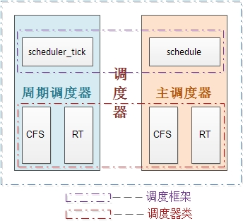

Linux进程调度器的组成
=======


| 日期 | 内核版本 | 架构| 作者 | GitHub| CSDN |
| ------- |:-------:|:-------:|:-------:|:-------:|:-------:|
| 2016-06-14 | [Linux-4.6](http://lxr.free-electrons.com/source/?v=4.6) | X86 & arm | [gatieme](http://blog.csdn.net/gatieme) | [LinuxDeviceDrivers](https://github.com/gatieme/LDD-LinuxDeviceDrivers) | [Linux进程管理与调度](http://blog.csdn.net/gatieme/article/category/6225543) |


#调度器概述
-------


内存中保存了对每个进程的唯一描述, 并通过若干结构与其他进程连接起来.

**调度器**面对的情形就是这样, 其任务是在程序之间共享CPU时间, 创造并行执行的错觉, 该任务分为两个不同的部分, 其中一个涉及**调度策略**, 另外一个涉及**上下文切换**.

##什么是调度器
-------

通常来说，操作系统是应用程序和可用资源之间的媒介。

典型的资源有内存和物理设备。但是CPU也可以认为是一个资源，调度器可以临时分配一个任务在上面执行（单位是时间片）。调度器使得我们同时执行多个程序成为可能，因此可以与具有各种需求的用户共享CPU。

内核必须提供一种方法, 在各个进程之间尽可能公平地共享CPU时间, 而同时又要考虑不同的任务优先级.

调度器的一个重要目标是有效地分配 CPU 时间片，同时提供很好的用户体验。调度器还需要面对一些互相冲突的目标，例如既要为关键实时任务最小化响应时间, 又要最大限度地提高 CPU 的总体利用率.

调度器的一般原理是, 按所需分配的计算能力, 向系统中每个进程提供最大的公正性, 或者从另外一个角度上说, 他试图确保没有进程被亏待.


##调度策略
-------


传统的Unix操作系统的都奥杜算法必须实现几个互相冲突的目标:

*	进程响应时间尽可能快

*	后台作业的吞吐量尽可能高

*	尽可能避免进程的饥饿现象

*	低优先级和高优先级进程的需要尽可能调和等等

调度策略(scheduling policy)的任务就是决定什么时候以怎么样的方式选择一个新进程占用CPU运行.

传统操作系统的调度基于分时(time sharing)技术: 多个进程以"时间多路服用"方式运行, 因为CPU的时间被分成"片(slice)", 给每个可运行进程分配一片CPU时间片, 当然单处理器在任何给定的时刻只能运行一个进程.

如果当前可运行进程的时限(quantum)到期时(即时间片用尽), 而该进程还没有运行完毕, 进程切换就可以发生.

分时依赖于定时中断, 因此对进程是透明的, 不需要在承租中插入额外的代码来保证CPU分时.

调度策略也是根据进程的优先级对他们进行分类. 有时用复杂的算法求出进程当前的优先级, 但最后的结果是相同的: 每个进程都与一个值(优先级)相关联, 这个值表示把进程如何适当地分配给CPU.

在linux中, 进程的优先级是动态的. 调度程序跟踪进程正在做什么, 并周期性的调整他们的优先级. 在这种方式下, 在较长的时间间隔内没有任何使用CPU的进程, 通过动态地增加他们的优先级来提升他们. 相应地, 对于已经在CPU上运行了较长时间的进程, 通过减少他们的优先级来处罚他们.


##进程饥饿
-------
进程饥饿，即为Starvation，指当等待时间给进程推进和响应带来明显影响称为进程饥饿。当饥饿到一定程度的进程在等待到即使完成也无实际意义的时候称为饥饿死亡。

**产生饥饿的主要原因是**

在一个动态系统中，对于每类系统资源，操作系统需要确定一个分配策略，当多个进程同时申请某类资源时，由分配策略确定资源分配给进程的次序。


有时资源分配策略可能是不公平的，即不能保证等待时间上界的存在。在这种情况下，即使系统没有发生死锁，某些进程也可能会长时间等待．当等待时间给进程推进和响应带来明显影响时，称发生了进程饥饿，当饥饿到一定程度的进程所赋予的任务即使完成也不再具有实际意义时称该进程被饿死。

举个例子，当有多个进程需要打印文件时，如果系统分配打印机的策略是最短文件优先，那么长文件的打印任务将由于短文件的源源不断到来而被无限期推迟，导致最终的饥饿甚至饿死。


#进程的分类
-------

##进程的分类
-------

当涉及有关调度的问题时, 传统上把进程分类为"I/O受限(I/O-dound)"或"CPU受限(CPU-bound)".

| 类型 | 别称 | 描述 | 示例 |
| ------- |:-------:|:-------:|:-------:|
| I/O受限型 | I/O密集型 | 频繁的使用I/O设备, 并花费很多时间等待I/O操作的完成 | 数据库服务器, 文本编辑器 |
| CPU受限型 | 计算密集型 | 花费大量CPU时间进行数值计算 | 图形绘制程序 |

另外一种分类法把进程区分为三类:

| 类型 | 描述 | 示例 |
| ------- |:-------:|:-------:|:-------:|
| 交互式进程(interactive process) | 此类进程经常与用户进行交互, 因此需要花费很多时间等待键盘和鼠标操作. 当接受了用户的输入后, 进程必须很快被唤醒, 否则用户会感觉系统反应迟钝 | shell, 文本编辑程序和图形应用程序 |
| 批处理进程(batch process) | 此类进程不必与用户交互, 因此经常在后台运行. 因为这样的进程不必很快相应, 因此常受到调度程序的怠慢 | 程序语言的编译程序, 数据库搜索引擎以及科学计算 |
| 实时进程(real-time process) | 这些进程由很强的调度需要, 这样的进程绝不会被低优先级的进程阻塞. 并且他们的响应时间要尽可能的短 | 视频音频应用程序, 机器人控制程序以及从物理传感器上收集数据的程序|

>**注意**
>
>前面的两类分类方法在一定程序上相互独立
>
>例如, 一个批处理进程很有可能是I/O受限的(如数据库服务器), 也可能是CPU受限的(比如图形绘制程序)


##实时进程与普通进程
-------

在linux中, 调度算法可以明确的确认所有实时进程的身份, 但是没办法区分交互式程序和批处理程序(统称为普通进程), linux2.6的调度程序实现了基于进程过去行为的启发式算法, 以确定进程应该被当做交互式进程还是批处理进程. 当然与批处理进程相比, 调度程序有偏爱交互式进程的倾向


根据进程的不同分类Linux采用不同的调度策略.

对于实时进程，采用FIFO或者Round Robin的调度策略.

对于普通进程，则需要区分交互式和批处理式的不同。传统Linux调度器提高交互式应用的优先级，使得它们能更快地被调度。而CFS和RSDL等新的调度器的核心思想是"完全公平"。这个设计理念不仅大大简化了调度器的代码复杂度，还对各种调度需求的提供了更完美的支持.

注意Linux通过将进程和线程调度视为一个，同时包含二者。进程可以看做是单个线程，但是进程可以包含共享一定资源（代码和/或数据）的多个线程。因此进程调度也包含了线程调度的功能.


linux进程的调度算法其实经过了很多次的演变, 但是其演变主要是针对与普通进程的, 因为前面我们提到过根据进程的不同分类Linux采用不同的调度策略.实时进程和普通进程采用了不同的调度策略, 更一般的普通进程还需要启发式的识别批处理进程和交互式进程.

实时进程的调度策略比较简单, 因为实时进程值只要求尽可能快的被响应, 基于优先级, 每个进程根据它重要程度的不同被赋予不同的优先级，调度器在每次调度时, 总选择优先级最高的进程开始执行. 低优先级不可能抢占高优先级, 因此FIFO或者Round Robin的调度策略即可满足实时进程调度的需求.

但是普通进程的调度策略就比较麻烦了, 因为普通进程不能简单的只看优先级, 必须公平的占有CPU, 否则很容易出现进程饥饿, 这种情况下用户会感觉操作系统很卡, 响应总是很慢.

此外如何进程中如果存在实时进程, 则实时进程总是在普通进程之前被调度


#linux调度器的演变
-------


一开始的调度器是复杂度为**$O(n)$的始调度算法**(实际上每次会遍历所有任务，所以复杂度为O(n)), 这个算法的缺点是当内核中有很多任务时，调度器本身就会耗费不少时间，所以，从linux2.5开始引入赫赫有名的**$O(1)$调度器**

然而，linux是集全球很多程序员的聪明才智而发展起来的超级内核，没有最好，只有更好，在$O(1)$调度器风光了没几天就又被另一个更优秀的调度器取代了，它就是**CFS调度器Completely Fair Scheduler**. 这个也是在2.6内核中引入的，具体为2.6.23，即从此版本开始，内核使用CFS作为它的默认调度器，$O(1)$调度器被抛弃了。


>更多CFS的信息, 请参照
>
>http://www.ibm.com/developerworks/cn/linux/l-completely-fair-scheduler/index.html?ca=drs-cn-0125
>
>另外内核文档sched-design-CFS.txt中也有介绍


#Linux的调度器组成
-------


**2个调度器**

可以用两种方法来激活调度

*	一种是直接的, 比如进程打算睡眠或出于其他原因放弃CPU

*	另一种是通过周期性的机制, 以固定的频率运行, 不时的检测是否有必要

因此当前linux的调度程序由两个调度器组成：**主调度器**，**周期性调度器**(两者又统称为**通用调度器(generic scheduler)**或**核心调度器(core scheduler)**)

并且每个调度器包括两个内容：**调度框架**(其实质就是两个函数框架)及**调度器类**

调度器类是实现了不同调度策略的实例，如 CFS、RT class等。

它们的关系如下图



当前的内核支持两种调度器类（sched_setscheduler系统调用可修改进程的策略）：CFS（公平）、RT（实时）；5种调度策略：SCHED_NORAML（最常见的策略）、SCHED_BATCH（除了不能抢占外与常规任务一样，允许任务运行更长时间，更好地使用高速缓存，适合于成批处理的工作）、SCHED_IDLE（它甚至比nice 19还有弱，为了避免优先级反转使用）和SCHED_RR（循环调度，拥有时间片，结束后放在队列末）、SCHED_FIFO（没有时间片，可以运行任意长的时间）；其中前面三种策略使用的是cfs调度器类，后面两种使用rt调度器类。

**2个调度器类**

当前的内核支持2种调度器类（sched_setscheduler系统调用可修改进程的策略）：**CFS（公平调度器）**、**RT（实时调度器）**

**5种调度策略**

| 字段 | 描述 | 所在调度器类 |
| ------------- |:-------------:|:-------------:|
| SCHED_NORMAL | （也叫SCHED_OTHER）用于普通进程，通过CFS调度器实现。SCHED_BATCH用于非交互的处理器消耗型进程。SCHED_IDLE是在系统负载很低时使用 | CFS |
| SCHED_BATCH |  SCHED_NORMAL普通进程策略的分化版本。采用分时策略，根据动态优先级(可用nice()API设置），分配CPU运算资源。注意：这类进程比上述两类实时进程优先级低，换言之，在有实时进程存在时，实时进程优先调度。但针对吞吐量优化, 除了不能抢占外与常规任务一样，允许任务运行更长时间，更好地使用高速缓存，适合于成批处理的工作 | CFS |
| SCHED_IDLE | 优先级最低，在系统空闲时才跑这类进程(如利用闲散计算机资源跑地外文明搜索，蛋白质结构分析等任务，是此调度策略的适用者）| CFS |
| SCHED_FIFO | 先入先出调度算法（实时调度策略），相同优先级的任务先到先服务，高优先级的任务可以抢占低优先级的任务 | RT |
| SCHED_RR | 轮流调度算法（实时调度策略），后者提供 Roound-Robin 语义，采用时间片，相同优先级的任务当用完时间片会被放到队列尾部，以保证公平性，同样，高优先级的任务可以抢占低优先级的任务。不同要求的实时任务可以根据需要用sched_setscheduler()API 设置策略 | RT |
| SCHED_DEADLINE | 新支持的实时进程调度策略，针对突发型计算，且对延迟和完成时间高度敏感的任务适用。基于Earliest Deadline First (EDF) 调度算法|

其中前面三种策略使用的是cfs调度器类，后面两种使用rt调度器类。

另外，对于调度框架及调度器类，它们都有自己管理的运行队列，调度框架只识别rq（其实它也不能算是运行队列），而对于cfs调度器类它的运行队列则是cfs_rq（内部使用红黑树组织调度实体），实时rt的运行队列则为rt_rq（内部使用优先级bitmap+双向链表组织调度实体）


本质上, 通用调度器(核心调度器)是一个分配器,与其他两个组件交互.

*	调度器用于判断接下来运行哪个进程.
	内核支持不同的调度策略(完全公平调度, 实时调度, 在无事可做的时候调度空闲进程,即0号进程也叫swapper进程,idle进程), 调度类使得能够以模块化的方法实现这些侧露额, 即一个类的代码不需要与其他类的代码交互
    当调度器被调用时, 他会查询调度器类, 得知接下来运行哪个进程

*	在选中将要运行的进程之后, 必须执行底层的任务切换. 
	这需要与CPU的紧密交互. 每个进程刚好属于某一调度类, 各个调度类负责管理所属的进程. 通用调度器自身不涉及进程管理, 其工作都委托给调度器类.


#进程调度的数据结构
-------

调度器使用一系列数据结构来排序和管理系统中的进程. 调度器的工作方式的这些结构的涉及密切相关, 几个组件在许多方面

##[task_struct中调度相关的成员](http://lxr.free-electrons.com/source/include/linux/sched.h?v=4.5#L1394)
-------

```c
/*  优先级  */
int prio, static_prio, normal_prio;
unsigned int rt_priority;

/*  调度策略相关字段--调度类  */
const struct sched_class *sched_class;
struct sched_entity se;
struct sched_rt_entity rt;
struct sched_dl_entity dl;

#ifdef CONFIG_CGROUP_SCHED
	struct task_group *sched_task_group;
#endif

/*  调度策略  */
unsigned int policy;

/*  处理器位图 */
int nr_cpus_allowed;
cpumask_t cpus_allowed;
```


###优先级
-------

```c
int prio, static_prio, normal_prio;
unsigned int rt_priority;
```


**动态优先级 静态优先级 实时优先级**


其中task_struct采用了三个成员表示进程的优先级:prio和normal_prio表示动态优先级, static_prio表示进程的静态优先级.

>为什么表示动态优先级需要两个值prio和normal_prio
>
>调度器会考虑的优先级则保存在prio. 由于在某些情况下内核需要暂时提高进程的优先级, 因此需要用prio表示. 由于这些改变不是持久的, 因此静态优先级static_prio和普通优先级normal_prio不受影响.

此外还用了一个字段rt_priority保存了实时进程的优先级

| 字段 | 描述 |
| ------------- |:-------------:|
| static_prio | 用于保存静态优先级, 是进程启动时分配的优先级, ，可以通过nice和sched_setscheduler系统调用来进行修改, 否则在进程运行期间会一直保持恒定 |
| prio | 保存进程的动态优先级 |
| normal_prio | 表示基于进程的静态优先级static_prio和调度策略计算出的优先级. 因此即使普通进程和实时进程具有相同的静态优先级, 其普通优先级也是不同的, 进程分叉(fork)时, 子进程会继承父进程的普通优先级 |
| rt_priority | 用于保存实时优先级 |


实时进程的优先级用实时优先级rt_priority来表示

linux2.6内核将任务优先级进行了一个划分, 实时优先级范围是0到MAX_RT_PRIO-1（即99），而普通进程的静态优先级范围是从MAX_RT_PRIO到MAX_PRIO-1（即100到139）。
```c
/*  http://lxr.free-electrons.com/source/include/linux/sched/prio.h#L21  */
#define MAX_USER_RT_PRIO    100
#define MAX_RT_PRIO     MAX_USER_RT_PRIO

/* http://lxr.free-electrons.com/source/include/linux/sched/prio.h#L24  */
#define MAX_PRIO        (MAX_RT_PRIO + 40)
#define DEFAULT_PRIO        (MAX_RT_PRIO + 20)
```


| 优先级范围 | 描述 |
| ------------- |:-------------:|
| 0——99 | 实时进程 |
| 100——139 | 非实时进程 |

###调度策略
-------

```c
unsigned int policy;
```

policy保存了进程的调度策略，目前主要有以下五种：

>参见
>
>http://lxr.free-electrons.com/source/include/uapi/linux/sched.h？v=4.5#L36


```c
/*
* Scheduling policies
*/
#define SCHED_NORMAL            0
#define SCHED_FIFO              1
#define SCHED_RR                2
#define SCHED_BATCH             3
/* SCHED_ISO: reserved but not implemented yet */
#define SCHED_IDLE              5
#define SCHED_DEADLINE          6
```


| 字段 | 描述 | 所在调度器类 |
| ------------- |:-------------:|:-------------:|
| SCHED_NORMAL | （也叫SCHED_OTHER）用于普通进程，通过CFS调度器实现。
| SCHED_BATCH |  SCHED_NORMAL普通进程策略的分化版本。采用分时策略，根据动态优先级(可用nice()API设置），分配 CPU 运算资源。注意：这类进程比两类实时进程优先级低，换言之，在有实时进程存在时，实时进程优先调度。但针对吞吐量优化 | CFS |
| SCHED_IDLE | 优先级最低，在系统空闲时才跑这类进程(如利用闲散计算机资源跑地外文明搜索，蛋白质结构分析等任务，是此调度策略的适用者）| CFS |
| SCHED_FIFO | 先入先出调度算法（实时调度策略），相同优先级的任务先到先服务，高优先级的任务可以抢占低优先级的任务 | RT |
| SCHED_RR | 轮流调度算法（实时调度策略），后 者提供 Roound-Robin 语义，采用时间片，相同优先级的任务当用完时间片会被放到队列尾部，以保证公平性，同样，高优先级的任务可以抢占低优先级的任务。不同要求的实时任务可以根据需要用sched_setscheduler()API 设置策略 | RT |
| SCHED_DEADLINE | 新支持的实时进程调度策略，针对突发型计算，且对延迟和完成时间高度敏感的任务适用。基于Earliest Deadline First (EDF) 调度算法 |

>CHED_BATCH用于非交互的处理器消耗型进程
>
>CHED_IDLE是在系统负载很低时使用CFS

SCHED_BATCH用于非交互, CPU使用密集型的批处理进程. 调度决策对此类进程给予"冷处理": 他们绝不会抢占CF调度器处理的另一个进程, 因此不会干扰交互式进程. 如果打算使用nice值降低进程的静态优先级, 同时又不希望该进程影响系统的交互性, 此时最适合使用该调度类.

而SCHED_LDLE进程的重要性则会进一步降低, 因此其权重总是最小的

>**注意**
>
>尽管名称是SCHED_IDLE但是SCHED_IDLE不负责调度空闲进程. 空闲进程由内核提供单独的机制来处理

SCHED_RR和SCHED_FIFO用于实现软实时进程. SCHED_RR实现了轮流调度算法, 一种循环时间片的方法, 而SCHED_FIFO实现了先进先出的机制, 这些并不是由完全贡品调度器类CFS处理的, 而是由实时调度类处理.


###调度策略相关字段
-------

```c
/*  http://lxr.free-electrons.com/source/include/linux/sched.h?v=4.5#L1426  */
unsigned int policy;

/*  http://lxr.free-electrons.com/source/include/linux/sched.h?v=4.5#L1409  */

const struct sched_class *sched_class;
struct sched_entity se;
struct sched_rt_entity rt;
struct sched_dl_entity dl;

cpumask_t cpus_allowed;
```

| 字段 | 描述 |
| ------------- |:-------------:|
| sched_class | 调度类, 调度类，调度处理函数类 |
| se | 普通进程的调用实体, 每个进程都有其中之一的实体 |
| rt | 实时进程的调用实体, 每个进程都有其中之一的实体 |
| dl | deadline的调度实体 |
| cpus_allowed | 用于控制进程可以在哪里处理器上运行 |


调度器不限于调度进程, 还可以调度更大的实体, 比如实现组调度: 可用的CPUI时间首先在一半的进程组(比如, 所有进程按照所有者分组)之间分配, 接下来分配的时间再在组内进行二次分配

cpus_allows是一个位域, 在多处理器系统上使用, 用来限制进程可以在哪些CPU上运行


#调度类
-------

sched_class结构体表示调度类, 类提供了通用调度器和各个调度器之间的关联, 调度器类和特定数据结构中汇集地几个函数指针表示, 全局调度器请求的各个操作都可以用一个指针表示, 这使得无需了解调度器类的内部工作原理即可创建通用调度器, 定义在[kernel/sched/sched.h](http://lxr.free-electrons.com/source/kernel/sched/sched.h?v=4.6#L1184)

```c
struct sched_class {
	/*	系统中多个调度类, 按照其调度的优先级排成一个链表
    下一优先级的调度类
     * 调度类优先级顺序: stop_sched_class -> dl_sched_class -> rt_sched_class -> fair_sched_class -> idle_sched_class
     */
    const struct sched_class *next;
	
    /*  将进程加入到运行队列中，即将调度实体（进程）放入红黑树中，并对 nr_running 变量加1   */
    void (*enqueue_task) (struct rq *rq, struct task_struct *p, int flags);
    /*  从运行队列中删除进程，并对 nr_running 变量中减1  */
    void (*dequeue_task) (struct rq *rq, struct task_struct *p, int flags);
    /*  放弃CPU，在 compat_yield sysctl 关闭的情况下，该函数实际上执行先出队后入队；在这种情况下，它将调度实体放在红黑树的最右端  */
    void (*yield_task) (struct rq *rq);
    bool (*yield_to_task) (struct rq *rq, struct task_struct *p, bool preempt);
	/*   检查当前进程是否可被新进程抢占 */
    void (*check_preempt_curr) (struct rq *rq, struct task_struct *p, int flags);

    /*
     * It is the responsibility of the pick_next_task() method that will
     * return the next task to call put_prev_task() on the @prev task or
     * something equivalent.
     *
     * May return RETRY_TASK when it finds a higher prio class has runnable
     * tasks.
     */
     /*  选择下一个应该要运行的进程运行  */
    struct task_struct * (*pick_next_task) (struct rq *rq,
                        struct task_struct *prev);
	/* 将进程放回运行队列 */
    void (*put_prev_task) (struct rq *rq, struct task_struct *p);

#ifdef CONFIG_SMP
	/* 为进程选择一个合适的CPU */
    int  (*select_task_rq)(struct task_struct *p, int task_cpu, int sd_flag, int flags);
	/* 迁移任务到另一个CPU */
	void (*migrate_task_rq)(struct task_struct *p);
	/* 用于进程唤醒 */
    void (*task_waking) (struct task_struct *task);
    void (*task_woken) (struct rq *this_rq, struct task_struct *task);
	/* 修改进程的CPU亲和力(affinity) */
    void (*set_cpus_allowed)(struct task_struct *p,
                 const struct cpumask *newmask);
	/* 启动运行队列 */
    void (*rq_online)(struct rq *rq);
     /* 禁止运行队列 */
    void (*rq_offline)(struct rq *rq);
#endif
	/* 当进程改变它的调度类或进程组时被调用 */
    void (*set_curr_task) (struct rq *rq);
	/* 该函数通常调用自 time tick 函数；它可能引起进程切换。这将驱动运行时（running）抢占 */
    void (*task_tick) (struct rq *rq, struct task_struct *p, int queued);
	/* 在进程创建时调用，不同调度策略的进程初始化不一样 */
    void (*task_fork) (struct task_struct *p);
	/* 在进程退出时会使用 */
    void (*task_dead) (struct task_struct *p);

    /*
     * The switched_from() call is allowed to drop rq->lock, therefore we
     * cannot assume the switched_from/switched_to pair is serliazed by
     * rq->lock. They are however serialized by p->pi_lock.
     */
	/* 用于进程切换 */
    void (*switched_from) (struct rq *this_rq, struct task_struct *task);
    void (*switched_to) (struct rq *this_rq, struct task_struct *task);
	/* 改变优先级 */
    void (*prio_changed) (struct rq *this_rq, struct task_struct *task,
                 int oldprio);

    unsigned int (*get_rr_interval) (struct rq *rq,
                     struct task_struct *task);

    void (*update_curr) (struct rq *rq);

#ifdef CONFIG_FAIR_GROUP_SCHED
    void (*task_move_group) (struct task_struct *p);
#endif
};
```
| 成员 | 描述 |
| ------------- |:-------------:|
| enqueue_task | 向就绪队列中添加一个进程, 某个任务进入可运行状态时，该函数将得到调用。它将调度实体（进程）放入红黑树中，并对 nr_running 变量加 1 |
| dequeue_task | 将一个进程从就就绪队列中删除, 当某个任务退出可运行状态时调用该函数，它将从红黑树中去掉对应的调度实体，并从 nr_running 变量中减 1 |
| yield_task | 在进程想要资源放弃对处理器的控制权的时, 可使用在sched_yield系统调用, 会调用内核API yield_task完成此工作. compat_yield sysctl 关闭的情况下，该函数实际上执行先出队后入队；在这种情况下，它将调度实体放在红黑树的最右端 |
| check_preempt_curr | 该函数将检查当前运行的任务是否被抢占。在实际抢占正在运行的任务之前，CFS 调度程序模块将执行公平性测试。这将驱动唤醒式（wakeup）抢占 |
| pick_next_task | 该函数选择接下来要运行的最合适的进程 |
| put_prev_task | 用另一个进程代替当前运行的进程 |
| set_curr_task | 当任务修改其调度类或修改其任务组时，将调用这个函数 |
| task_tick | 在每次激活周期调度器时, 由周期性调度器调用, 该函数通常调用自 time tick 函数；它可能引起进程切换。这将驱动运行时（running）抢占 |
| task_new | 内核调度程序为调度模块提供了管理新任务启动的机会, 用于建立fork系统调用和调度器之间的关联, 每次新进程建立后, 则用new_task通知调度器, CFS 调度模块使用它进行组调度，而用于实时任务的调度模块则不会使用这个函数 |


对于各个调度器类, 都必须提供struct sched_class的一个实例, 目前内核中有实现以下五种:


```c
// http://lxr.free-electrons.com/source/kernel/sched/sched.h?v=4.6#L1254
extern const struct sched_class stop_sched_class;
extern const struct sched_class dl_sched_class;
extern const struct sched_class rt_sched_class;
extern const struct sched_class fair_sched_class;
extern const struct sched_class idle_sched_class;
```


| 调度器类 | 定义| 描述 |
| ------------- |:-------------:|-------------:|
| stop_sched_class | [kernel/sched/stop_task.c, line 112](http://lxr.free-electrons.com/source/kernel/sched/stop_task.c?v=4.6#L109) | 优先级最高的线程，会中断所有其他线程，且不会被其他任务打断。作用：<br>1.发生在cpu_stop_cpu_callback 进行cpu之间任务migration；<br>2.HOTPLUG_CPU的情况下关闭任务。|
| dl_sched_class | [kernel/sched/deadline.c, line 1774](http://lxr.free-electrons.com/source/kernel/sched/deadline.c?v=4.6#L1774) |
| rt_sched_class | [kernel/sched/rt.c, line 2326](http://lxr.free-electrons.com/source/kernel/sched/rt.c?v=4.6#L2326) | RT，作用：实时线程 |
| idle_sched_class | [kernel/sched/idle_task.c, line 81](http://lxr.free-electrons.com/source/kernel/sched/idle_task.c?v=4.6#L81) |每个cup的第一个pid=0线程：swapper，是一个静态线程。调度类属于：idel_sched_class，所以在ps里面是看不到的。一般运行在开机过程和cpu异常的时候做dump |
| fair_sched_class | [kernel/sched/fair.c, line 8521](http://lxr.free-electrons.com/source/kernel/sched/fair.c?v=4.6#L8521) |CFS（公平调度器），作用：一般常规线程 |

目前系統中,Scheduling Class的优先级顺序为
```c
stop_sched_class -> dl_sched_class -> rt_sched_class -> fair_sched_class -> idle_sched_class
```
开发者可以根据己的设计需求,來把所属的Task配置到不同的Scheduling Class中.
用户层应用程序无法直接与调度类交互, 他们只知道上下文定义的常量SCHED_XXX(用task_struct->policy表示), 这些常量提供了调度类之间的映射。

SCHED_NORMAL, SCHED_BATCH, SCHED_IDLE被映射到fair_sched_class

SCHED_RR和SCHED_FIFO则与rt_schedule_class相关联


##就绪队列
-------

就绪队列是核心调度器用于管理活动进程的主要数据结构。

各个·CPU都有自身的就绪队列，各个活动进程只出现在一个就绪队列中, 在多个CPU上同时运行一个进程是不可能的.

>早期的内核中就绪队列是全局的, 即即有全局唯一的rq, 但是 在Linux-2.6内核时代，为了更好的支持多核，Linux调度器普遍采用了per-cpu的run queue，从而克服了多CPU系统中，全局唯一的run queue由于资源的竞争而成为了系统瓶颈的问题，因为在同一时刻，一个CPU访问run queue时，其他的CPU即使空闲也必须等待，大大降低了整体的CPU利用率和系统性能。当使用per-CPU的run queue之后，每个CPU不再使用大内核锁，从而大大提高了并行处理的调度能力。
>
> 参照[CFS调度的总结 - （单rq vs 多rq）](http://blog.csdn.net/ustc_dylan/article/details/7303851)


就绪队列用struct rq来表示, 其定义在[kernel/sched/sched.h, line 566](http://lxr.free-electrons.com/source/kernel/sched/sched.h?v=4.6#L566)

就绪队列是全局调度器许多操作的起点, 但是进程并不是由就绪队列直接管理的, 调度管理是各个调度器的职责, 因此在各个就绪队列中嵌入了特定调度类的子就绪队列(cfs的顶级调度就队列 [struct cfs_rq](http://lxr.free-electrons.com/source/kernel/sched/sched.h?v=4.6#L359), 实时调度类的就绪队列[struct rt_rq](http://lxr.free-electrons.com/source/kernel/sched/sched.h?v=4.6#L449)和deadline调度类的就绪队列[struct dl_rq](http://lxr.free-electrons.com/source/kernel/sched/sched.h?v=4.6#L490)


##
http://eaglet.rain.com/rick/linux/schedstat/