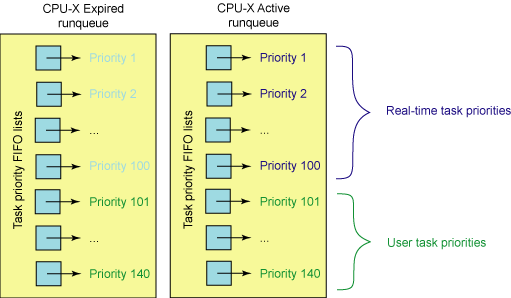

Linux进程调度的演变
=======

| 日期 | 内核版本 | 架构| 作者 | GitHub| CSDN |
| ------- |:-------:|:-------:|:-------:|:-------:|:-------:|
| 2016-06-14 | [Linux-4.6](http://lxr.free-electrons.com/source/?v=4.6) | X86 & arm | [gatieme](http://blog.csdn.net/gatieme) | [LinuxDeviceDrivers](https://github.com/gatieme/LDD-LinuxDeviceDrivers) | [Linux进程管理与调度](http://blog.csdn.net/gatieme/article/category/6225543) |

#前言
-------

##进程调度
-------

内存中保存了对每个进程的唯一描述, 并通过若干结构与其他进程连接起来.

**调度器**面对的情形就是这样, 其任务是在程序之间共享CPU时间, 创造并行执行的错觉, 该任务分为两个不同的部分, 其中一个涉及**调度策略**, 另外一个涉及**上下文切换**.

##进程的分类
-------

linux把进程区分为实时进程和非实时进程, 其中非实时进程进一步划分为交互式进程和批处理进程

| 类型 | 描述 | 示例 |
| ------- |:-------:|:-------:|:-------:|
| 交互式进程(interactive process) | 此类进程经常与用户进行交互, 因此需要花费很多时间等待键盘和鼠标操作. 当接受了用户的输入后, 进程必须很快被唤醒, 否则用户会感觉系统反应迟钝 | shell, 文本编辑程序和图形应用程序 |
| 批处理进程(batch process) | 此类进程不必与用户交互, 因此经常在后台运行. 因为这样的进程不必很快相应, 因此常受到调度程序的怠慢 | 程序语言的编译程序, 数据库搜索引擎以及科学计算 |
| 实时进程(real-time process) | 这些进程由很强的调度需要, 这样的进程绝不会被低优先级的进程阻塞. 并且他们的响应时间要尽可能的短 | 视频音频应用程序, 机器人控制程序以及从物理传感器上收集数据的程序|

在linux中, 调度算法可以明确的确认所有实时进程的身份, 但是没办法区分交互式程序和批处理程序, linux2.6的调度程序实现了基于进程过去行为的启发式算法, 以确定进程应该被当做交互式进程还是批处理进程. 当然与批处理进程相比, 调度程序有偏爱交互式进程的倾向

##不同就能成的调度策略
-------

根据进程的不同分类Linux采用不同的调度策略.

对于实时进程，采用FIFO或者Round Robin的调度策略.

对于普通进程，则需要区分交互式和批处理式的不同。传统Linux调度器提高交互式应用的优先级，使得它们能更快地被调度。而CFS和RSDL等新的调度器的核心思想是"完全公平"。这个设计理念不仅大大简化了调度器的代码复杂度，还对各种调度需求的提供了更完美的支持.

注意Linux通过将进程和线程调度视为一个，同时包含二者。进程可以看做是单个线程，但是进程可以包含共享一定资源（代码和/或数据）的多个线程。因此进程调度也包含了线程调度的功能.

目前非实时进程的调度策略比较简单, 因为实时进程值只要求尽可能快的被响应, 基于优先级, 每个进程根据它重要程度的不同被赋予不同的优先级，调度器在每次调度时, 总选择优先级最高的进程开始执行. 低优先级不可能抢占高优先级, 因此FIFO或者Round Robin的调度策略即可满足实时进程调度的需求.

但是普通进程的调度策略就比较麻烦了, 因为普通进程不能简单的只看优先级, 必须公平的占有CPU, 否则很容易出现进程饥饿, 这种情况下用户会感觉操作系统很卡, 响应总是很慢，因此在linux调度器的发展历程中经过了多次重大变动, linux总是希望寻找一个最接近于完美的调度策略来公平快速的调度进程.

##linux调度器的演变
-------

一开始的调度器是复杂度为**$O(n)$的始调度算法**(实际上每次会遍历所有任务，所以复杂度为O(n)), 这个算法的缺点是当内核中有很多任务时，调度器本身就会耗费不少时间，所以，从linux2.5开始引入赫赫有名的**$O(1)$调度器**

然而，linux是集全球很多程序员的聪明才智而发展起来的超级内核，没有最好，只有更好，在$O(1)$调度器风光了没几天就又被另一个更优秀的调度器取代了，它就是**CFS调度器Completely Fair Scheduler**. 这个也是在2.6内核中引入的，具体为2.6.23，即从此版本开始，内核使用CFS作为它的默认调度器，$O(1)$调度器被抛弃了。

所以完全有理由相信，后续如果再会出现一个更优秀的调度器，CFS也不会幸免。因为linux只要最好的那个。

#$O(n)$的始调度算法
-------

##Linux2.4之前的内核调度器
-------

早期的Linux进程调度器使用了最低的设计，它显然不关注具有很多处理器的大型架构，更不用说是超线程了。

Linux调度器使用了环形队列用于可运行的任务管理, 使用循环调度策略.

此调度器添加和删除进程效率很高（具有保护结构的锁）。简而言之，该调度器并不复杂但是简单快捷.

Linux版本2.2引入了调度类的概念，允许针对实时任务、非抢占式任务、非实时任务的调度策略。调度器还包括对称多处理 (SMP) 支持。

##Linux2.4的调度器
-------

###概述
-------

在Linux2.4.18中(linux-2.5)之前的内核, 当很多任务都处于活动状态时, 调度器有很明显的限制. 这是由于调度器是使用一个复杂度为$O(n)$的算法实现的.

调度器采用基于优先级的设计，这个调度器和Linus在1992年发布的调度器没有大的区别。该调度器的pick next算法非常简单：对runqueue中所有进程的优先级进行依次进行比较，选择最高优先级的进程作为下一个被调度的进程。(Runqueue是Linux 内核中保存所有就绪进程的队列). pick next用来指从所有候选进程中挑选下一个要被调度的进程的过程。

这种调度算法非常简单易懂: 在每次进程切换时, 内核扫描可运行进程的链表, 计算优先级,然胡选择"最佳"进程来运行.

在这种调度器中, 调度任务所花费的时间是一个系统中任务个数的函数. 换而言之, 活动的任务越多, 调度任务所花费的时间越长. 在任务负载非常重时, 处理器会因调度消耗掉大量的时间, 用于任务本身的时间就非常少了。因此，这个算法缺乏可伸缩性

###详情
-------

每个进程被创建时都被赋予一个时间片。时钟中断递减当前运行进程的时间片，当进程的时间片被用完时，它必须等待重新赋予时间片才能有机会运行。Linux2.4调度器保证只有当所有RUNNING进程的时间片都被用完之后，才对所有进程重新分配时间片。这段时间被称为一个epoch。这种设计保证了每个进程都有机会得到执行。每个epoch中，每个进程允许执行到其时间切片用完。如果某个进程没有使用其所有的时间切片，那么剩余时间切片的一半将被添加到新时间切片使其在下个epoch中可以执行更长时间。调度器只是迭代进程，应用goodness函数（指标）决定下面执行哪个进程。当然，各种进程对调度的需求并不相同，Linux 2.4调度器主要依靠改变进程的优先级，来满足不同进程的调度需求。事实上，所有后来的调度器都主要依赖修改进程优先级来满足不同的调度需求。

实时进程：实时进程的优先级是静态设定的，而且始终大于普通进程的优先级。因此只有当runqueue中没有实时进程的情况下，普通进程才能够获得调度。

>实时进程采用两种调度策略，SCHED_FIFO 和 SCHED_RR
>
>FIFO 采用先进先出的策略，对于所有相同优先级的进程，最先进入 runqueue 的进程总能优先获得调度；Round Robin采用更加公平的轮转策略，使得相同优先级的实时进程能够轮流获得调度。

普通进程：对于普通进程，调度器倾向于提高交互式进程的优先级，因为它们需要快速的用户响应。普通进程的优先级主要由进程描述符中的Counter字段决定 (还要加上 nice 设定的静态优先级) 。进程被创建时子进程的 counter值为父进程counter值的一半，这样保证了任何进程不能依靠不断地 fork() 子进程从而获得更多的执行机会。

Linux2.4调度器是如何提高交互式进程的优先级的呢？如前所述，当所有 RUNNING 进程的时间片被用完之后，调度器将重新计算所有进程的 counter 值，所有进程不仅包括 RUNNING 进程，也包括处于睡眠状态的进程。处于睡眠状态的进程的 counter 本来就没有用完，在重新计算时，他们的 counter 值会加上这些原来未用完的部分，从而提高了它们的优先级。交互式进程经常因等待用户输入而处于睡眠状态，当它们重新被唤醒并进入 runqueue 时，就会优先于其它进程而获得 CPU。从用户角度来看，交互式进程的响应速度就提高了。

该调度器的主要缺点：

*	可扩展性不好
	调度器选择进程时需要遍历整个 runqueue 从中选出最佳人选，因此该算法的执行时间与进程数成正比。另外每次重新计算 counter 所花费的时间也会随着系统中进程数的增加而线性增长，当进程数很大时，更新 counter 操作的代价会非常高，导致系统整体的性能下降。

*	高负载系统上的调度性能比较低
	2.4的调度器预分配给每个进程的时间片比较大，因此在高负载的服务器上，该调度器的效率比较低，因为平均每个进程的等待时间于该时间片的大小成正比。

*	交互式进程的优化并不完善
	Linux2.4识别交互式进程的原理基于以下假设，即交互式进程比批处理进程更频繁地处于SUSPENDED状态。然而现实情况往往并非如此，有些批处理进程虽然没有用户交互，但是也会频繁地进行IO操作，比如一个数据库引擎在处理查询时会经常地进行磁盘IO，虽然它们并不需要快速地用户响应，还是被提高了优先级。当系统中这类进程的负载较重时，会影响真正的交互式进程的响应时间。

*	对实时进程的支持不够
	Linux2.4内核是非抢占的，当进程处于内核态时不会发生抢占，这对于真正的实时应用是不能接受的。

为了解决这些问题，Ingo Molnar开发了新的$O(1)调度器，在CFS和RSDL之前，这个调度器不仅被Linux2.6采用，还被backport到Linux2.4中，很多商业的发行版本都采用了这个调度器

#$O(1)$的调度算法
-------

##概述
-------

由于进程优先级的最大值为139，因此MAX_PRIO的最大值取140(具体的是，普通进程使用100到139的优先级，实时进程使用0到99的优先级).

因此，该调度算法为每个优先级都设置一个可运行队列, 即包含140个可运行状态的进程链表，每一条优先级链表上的进程都具有相同的优先级，而不同进程链表上的进程都拥有不同的优先级。

除此之外, 还包括一个优先级位图bitmap。该位图使用一个位(bit)来代表一个优先级，而140个优先级最少需要5个32位来表示， 因此只需要一个int[5]就可以表示位图，该位图中的所有位都被置0，当某个优先级的进程处于可运行状态时，该优先级所对应的位就被置1。

如果确定了优先级，那么选取下一个进程就简单了，只需在queue数组中对应的链表上选取一个进程即可。

最后，在早期的内核中，抢占是不可能的；这意味着如果有一个低优先级的任务在执行，高优先级的任务只能等待它完成。

##详情
-------

从名字就可以看出O(1)调度器主要解决了以前版本中的扩展性问题。

O(1)调度算法所花费的时间为常数，与当前系统中的进程个数无关。

此外Linux 2.6内核支持内核态抢占，因此更好地支持了实时进程。

相对于前任，O(1)调度器还更好地区分了交互式进程和批处理式进程。

Linux 2.6内核也支持三种调度策略。其中SCHED_FIFO和SCHED_RR用于实时进程，而SCHED_NORMAL用于普通进程。

O(1)调度器在两个方面修改了Linux 2.4调度器，一是进程优先级的计算方法；二是pick next算法。

O(1)调度器跟踪运行队列中可运行的任务（实际上，每个优先级水平有两个运行队列，一个用于活动任务，一个用于过期任务）， 这意味着要确定接下来执行的任务，调度器只需按优先级将下一个任务从特定活动的运行队列中取出即可。

###普通进程的优先级计算
-------

不同类型的进程应该有不同的优先级。每个进程与生俱来（即从父进程那里继承而来）都有一个优先级，我们将其称为静态优先级。普通进程的静态优先级范围从100到139，100为最高优先级，139 为最低优先级，0－99保留给实时进程。当进程用完了时间片后，系统就会为该进程分配新的时间片（即基本时间片），静态优先级本质上决定了时间片分配的大小。

静态优先级和基本时间片的关系如下：

>静态优先级<120，基本时间片=max((140-静态优先级)*20, MIN_TIMESLICE)
>
>静态优先级>=120，基本时间片=max((140-静态优先级)*5, MIN_TIMESLICE)

其中MIN_TIMESLICE为系统规定的最小时间片。从该计算公式可以看出，静态优先级越高（值越低），进程得到的时间片越长。其结果是，优先级高的进程会获得更长的时间片，而优先级低的进程得到的时间片则较短。进程除了拥有静态优先级外，还有动态优先级，其取值范围是100到139。当调度程序选择新进程运行时就会使用进程的动态优先级，动态优先级和静态优先级的关系可参考下面的公式：

>动态优先级=max(100 , min(静态优先级 – bonus + 5) , 139)

从上面看出，动态优先级的生成是以静态优先级为基础，再加上相应的惩罚或奖励(bonus)。这个bonus并不是随机的产生，而是根据进程过去的平均睡眠时间做相应的惩罚或奖励。

所谓平均睡眠时间（sleep_avg，位于task_struct结构中）就是进程在睡眠状态所消耗的总时间数，这里的平均并不是直接对时间求平均数。平均睡眠时间随着进程的睡眠而增长，随着进程的运行而减少。因此，平均睡眠时间记录了进程睡眠和执行的时间，它是用来判断进程交互性强弱的关键数据。如果一个进程的平均睡眠时间很大，那么它很可能是一个交互性很强的进程。反之，如果一个进程的平均睡眠时间很小，那么它很可能一直在执行。另外，平均睡眠时间也记录着进程当前的交互状态，有很快的反应速度。比如一个进程在某一小段时间交互性很强，那么sleep_avg就有可能暴涨（当然它不能超过 MAX_SLEEP_AVG），但如果之后都一直处于执行状态，那么sleep_avg就又可能一直递减。理解了平均睡眠时间，那么bonus的含义也就显而易见了。交互性强的进程会得到调度程序的奖励（bonus为正），而那些一直霸占CPU的进程会得到相应的惩罚（bonus为负）。其实bonus相当于平均睡眠时间的缩影，此时只是将sleep_avg调整成bonus数值范围内的大小。可见平均睡眠时间可以用来衡量进程是否是一个交互式进程。如果满足下面的公式，进程就被认为是一个交互式进程：

>动态优先级≤3*静态优先级/4 + 28

平均睡眠时间是进程处于等待睡眠状态下的时间，该值在进程进入睡眠状态时增加，而进入RUNNING状态后则减少。该值的更新时机分布在很多内核函数内：时钟中断scheduler_tick()；进程创建；进程从TASK_INTERRUPTIBLE状态唤醒；负载平衡等。

###实时进程的优先级计算
-------

实时进程的优先级由sys_sched_setschedule()设置。该值不会动态修改，而且总是比普通进程的优先级高。在进程描述符中用rt_priority域表示。

###pick next算法
-------

普通进程的调度选择算法基于进程的优先级，拥有最高优先级的进程被调度器选中。

2.4中，时间片counter同时也表示了一个进程的优先级。2.6中时间片用任务描述符中的time_slice域表示，而优先级用prio（普通进程）或者rt_priority（实时进程）表示。调度器为每一个CPU维护了两个进程队列数组：指向活动运行队列的active数组和指向过期运行队列的expire数组。数组中的元素着保存某一优先级的进程队列指针。系统一共有140个不同的优先级，因此这两个数组大小都是140。它们是按照先进先出的顺序进行服务的。被调度执行的任务都会被添加到各自运行队列优先级列表的末尾。每个任务都有一个时间片，这取决于系统允许执行这个任务多长时间。运行队列的前100个优先级列表保留给实时任务使用，后40个用于用户任务，参见下图：

当需要选择当前最高优先级的进程时，2.6调度器不用遍历整个runqueue，而是直接从active数组中选择当前最高优先级队列中的第一个进程。假设当前所有进程中最高优先级为50（换句话说，系统中没有任何进程的优先级小于50）。则调度器直接读取 active[49]，得到优先级为50的进程队列指针。该队列头上的第一个进程就是被选中的进程。这种算法的复杂度为O(1)，从而解决了2.4调度器的扩展性问题。为了实现O(1)算法active数组维护了一个由5个32位的字（140个优先级）组成的bitmap，当某个优先级别上有进程被插入列表时，相应的比特位就被置位。 sched_find_first_bit()函数查询该bitmap，返回当前被置位的最高优先级的数组下标。在上例中sched_find_first_bit函数将返回49。在IA处理器上可以通过bsfl等指令实现。可见查找一个任务来执行所需要的时间并不依赖于活动任务的个数，而是依赖于优先级的数量。这使得 2.6 版本的调度器成为一个复杂度为 O(1) 的过程，因为调度时间既是固定的，而且也不会受到活动任务个数的影响。

为了提高交互式进程的响应时间，O(1)调度器不仅动态地提高该类进程的优先级，还采用以下方法：每次时钟tick中断时，进程的时间片(time_slice)被减一。当time_slice为0时，表示当前进程的时间片用完，调度器判断当前进程的类型，如果是交互式进程或者实时进程，则重置其时间片并重新插入active数组。如果不是交互式进程则从active数组中移到expired数组，并根据上述公式重新计算时间片。这样实时进程和交互式进程就总能优先获得CPU。然而这些进程不能始终留在active数组中，否则进入expire数组的进程就会产生饥饿现象。当进程已经占用CPU时间超过一个固定值后，即使它是实时进程或者交互式进程也会被移到expire数组中。当active数组中的所有进程都被移到expire数组中后，调度器交换active数组和expire数组。因此新的active数组又恢复了初始情况，而expire数组为空，从而开始新的一轮调度。

Linux 2.6调度器改进了前任调度器的可扩展性问题，schedule()函数的时间复杂度为O(1)。这取决于两个改进：

*	pick next算法借助于active数组，无需遍历runqueue；

*	消了定期更新所有进程counter的操作，动态优先级的修改分布在进程切换，时钟tick中断以及其它一些内核函数中进行。

O(1)调度器区分交互式进程和批处理进程的算法与以前虽大有改进，但仍然在很多情况下会失效。有一些著名的程序总能让该调度器性能下降，导致交互式进程反应缓慢。例如fiftyp.c, thud.c, chew.c, ring-test.c, massive_intr.c等。而且O(1)调度器对NUMA支持也不完善。为了解决这些问题，大量难以维护和阅读的复杂代码被加入Linux2.6.0的调度器模块，虽然很多性能问题因此得到了解决，可是另外一个严重问题始终困扰着许多内核开发者，那就是代码的复杂度问题。很多复杂的代码难以管理并且对于纯粹主义者而言未能体现算法的本质。

为了解决O(1)调度器面临的问题以及应对其他外部压力, 需要改变某些东西。这种改变来自Con Kolivas的内核补丁staircase scheduler（楼梯调度算法），以及改进的RSDL（Rotating Staircase Deadline Scheduler）。它为调度器设计提供了一个新的思路。Ingo Molnar在RSDL之后开发了CFS，并最终被2.6.23内核采用。接下来我们开始介绍这些新一代调度器。

##Linux 2.6的新一代调度器CFS
-------

###楼梯调度算法staircase scheduler
-------

楼梯算法(SD)在思路上和O(1)算法有很大不同，它抛弃了动态优先级的概念。而采用了一种完全公平的思路。前任算法的主要复杂性来自动态优先级的计算，调度器根据平均睡眠时间和一些很难理解的经验公式来修正进程的优先级以及区分交互式进程。这样的代码很难阅读和维护。楼梯算法思路简单，但是实验证明它对应交互式进程的响应比其前任更好，而且极大地简化了代码。

和O(1)算法一样，楼梯算法也同样为每一个优先级维护一个进程列表，并将这些列表组织在active数组中。当选取下一个被调度进程时，SD算法也同样从active数组中直接读取。与O(1)算法不同在于，当进程用完了自己的时间片后，并不是被移到expire数组中。而是被加入active数组的低一优先级列表中，即将其降低一个级别。不过请注意这里只是将该任务插入低一级优先级任务列表中，任务本身的优先级并没有改变。当时间片再次用完，任务被再次放入更低一级优先级任务队列中。就象一部楼梯，任务每次用完了自己的时间片之后就下一级楼梯。任务下到最低一级楼梯时，如果时间片再次用完，它会回到初始优先级的下一级任务队列中。比如某进程的优先级为1，当它到达最后一级台阶140后，再次用完时间片时将回到优先级为2的任务队列中，即第二级台阶。不过此时分配给该任务的time_slice将变成原来的2倍。比如原来该任务的时间片time_slice为10ms，则现在变成了20ms。基本的原则是，当任务下到楼梯底部时，再次用完时间片就回到上次下楼梯的起点的下一级台阶。并给予该任务相同于其最初分配的时间片。总结如下：设任务本身优先级为P，当它从第N级台阶开始下楼梯并到达底部后，将回到第N+1级台阶。并且赋予该任务N+1倍的时间片。

以上描述的是普通进程的调度算法，实时进程还是采用原来的调度策略，即FIFO或者Round Robin。

楼梯算法能避免进程饥饿现象，高优先级的进程会最终和低优先级的进程竞争，使得低优先级进程最终获得执行机会。对于交互式应用，当进入睡眠状态时，与它同等优先级的其他进程将一步一步地走下楼梯，进入低优先级进程队列。当该交互式进程再次唤醒后，它还留在高处的楼梯台阶上，从而能更快地被调度器选中，加速了响应时间。

楼梯算法的优点：从实现角度看，SD基本上还是沿用了O(1)的整体框架，只是删除了O(1)调度器中动态修改优先级的复杂代码；还淘汰了expire数组，从而简化了代码。它最重要的意义在于证明了完全公平这个思想的可行性。

##RSDL(Rotating Staircase Deadline Scheduler)
-------

RSDL也是由Con Kolivas开发的，它是对SD算法的改进。核心的思想还是"完全公平"。没有复杂的动态优先级调整策略。RSDL重新引入了expire数组。它为每一个优先级都分配了一个 “组时间配额”，记为Tg；同一优先级的每个进程都拥有同样的"优先级时间配额"，用Tp表示。当进程用完了自身的Tp时，就下降到下一优先级进程组中。这个过程和SD相同，在RSDL中这个过程叫做minor rotation（次轮询）。请注意Tp不等于进程的时间片，而是小于进程的时间片。下图表示了minor rotation。进程从priority1的队列中一步一步下到priority140之后回到priority2的队列中，这个过程如下图左边所示，然后从priority 2开始再次一步一步下楼，到底后再次反弹到priority3队列中，如下图所示。

在SD算法中，处于楼梯底部的低优先级进程必须等待所有的高优先级进程执行完才能获得CPU。因此低优先级进程的等待时间无法确定。RSDL中，当高优先级进程组用完了它们的Tg(即组时间配额)时，无论该组中是否还有进程Tp尚未用完，所有属于该组的进程都被强制降低到下一优先级进程组中。这样低优先级任务就可以在一个可以预计的未来得到调度。从而改善了调度的公平性。这就是RSDL中Deadline代表的含义。
    进程用完了自己的时间片time_slice时（下图中T2），将放入expire数组指向的对应初始优先级队列中(priority 1)。

当active数组为空，或者所有的进程都降低到最低优先级时就会触发主轮询major rotation。Major rotation交换active数组和expire数组，所有进程都恢复到初始状态，再一次从新开始minor rotation的过程。
    RSDL对交互式进程的支持：和SD同样的道理，交互式进程在睡眠时间时，它所有的竞争者都因为minor rotation而降到了低优先级进程队列中。当它重新进入RUNNING状态时，就获得了相对较高的优先级，从而能被迅速响应。

##完全公平的调度器CFS
-------

CFS是最终被内核采纳的调度器。它从RSDL/SD中吸取了完全公平的思想，不再跟踪进程的睡眠时间，也不再企图区分交互式进程。它将所有的进程都统一对待，这就是公平的含义。CFS的算法和实现都相当简单，众多的测试表明其性能也非常优越。
按照作者Ingo Molnar的说法（参考Documentation/scheduler/sched-design-CFS.txt），

CFS百分之八十的工作可以用一句话概括：CFS在真实的硬件上模拟了完全理想的多任务处理器。在真空的硬件上，同一时刻我们只能运行单个进程，因此当一个进程占用CPU时，其它进程就必须等待，这就产生了不公平。但是在“完全理想的多任务处理器 “下，每个进程都能同时获得CPU的执行时间，即并行地每个进程占1/nr_running的时间。例如当系统中有两个进程时，CPU的计算时间被分成两份，每个进程获得50%。假设runqueue中有n个进程，当前进程运行了10ms。在“完全理想的多任务处理器”中，10ms应该平分给n个进程(不考虑各个进程的nice值)，因此当前进程应得的时间是(10/n)ms，但是它却运行了10ms。所以CFS将惩罚当前进程，使其它进程能够在下次调度时尽可能取代当前进程。最终实现所有进程的公平调度。

与之前的Linux调度器不同，CFS没有将任务维护在链表式的运行队列中，它抛弃了active/expire数组，而是对每个CPU维护一个以时间为顺序的红黑树。
该树方法能够良好运行的原因在于：

*	红黑树可以始终保持平衡，这意味着树上没有路径比任何其他路径长两倍以上。

*	由于红黑树是二叉树，查找操作的时间复杂度为O(log n)。但是除了最左侧查找以外，很难执行其他查找，并且最左侧的节点指针始终被缓存。

*	对于大多数操作（插入、删除、查找等），红黑树的执行时间为O(log n)，而以前的调度程序通过具有固定优先级的优先级数组使用 O(1)。O(log n) 行为具有可测量的延迟，但是对于较大的任务数无关紧要。Molnar在尝试这种树方法时，首先对这一点进行了测试。

*	红黑树可通过内部存储实现，即不需要使用外部分配即可对数据结构进行维护。

要实现平衡，CFS使用"虚拟运行时"表示某个任务的时间量。任务的虚拟运行时越小，意味着任务被允许访问服务器的时间越短，其对处理器的需求越高。CFS还包含睡眠公平概念以便确保那些目前没有运行的任务（例如，等待 I/O）在其最终需要时获得相当份额的处理器。

###CFS如何实现pick next
-------

下图是一个红黑树的例子。

所有可运行的任务通过不断地插入操作最终都存储在以时间为顺序的红黑树中（由 sched_entity 对象表示），对处理器需求最多的任务（最低虚拟运行时）存储在树的左侧，处理器需求最少的任务（最高虚拟运行时）存储在树的右侧。 为了公平，CFS调度器会选择红黑树最左边的叶子节点作为下一个将获得cpu的任务。这样，树左侧的进程就被给予时间运行了。

###tick中断
-------

在CFS中，tick中断首先更新调度信息。然后调整当前进程在红黑树中的位置。调整完成后如果发现当前进程不再是最左边的叶子，就标记need_resched标志，中断返回时就会调用scheduler()完成进程切换。否则当前进程继续占用CPU。从这里可以看到 CFS抛弃了传统的时间片概念。Tick中断只需更新红黑树，以前的所有调度器都在tick中断中递减时间片，当时间片或者配额被用完时才触发优先级调整并重新调度。

###红黑树键值计算
-------

理解CFS的关键就是了解红黑树键值的计算方法。该键值由三个因子计算而得：一是进程已经占用的CPU时间；二是当前进程的nice值；三是当前的cpu负载。进程已经占用的CPU时间对键值的影响最大，其实很大程度上我们在理解CFS时可以简单地认为键值就等于进程已占用的 CPU时间。因此该值越大，键值越大，从而使得当前进程向红黑树的右侧移动。另外CFS规定，nice值为1的进程比nice值为0的进程多获得10%的 CPU时间。在计算键值时也考虑到这个因素，因此nice值越大，键值也越大。

CFS为每个进程都维护两个重要变量：fair_clock和wait_runtime。这里我们将为每个进程维护的变量称为进程级变量，为每个CPU维护的称作CPU级变量，为每个runqueue维护的称为runqueue级变量。进程插入红黑树的键值即为fair_clock – wait_runtime。其中fair_clock从其字面含义上讲就是一个进程应获得的CPU时间，即等于进程已占用的CPU时间除以当前 runqueue中的进程总数；wait_runtime是进程的等待时间。它们的差值代表了一个进程的公平程度。该值越大，代表当前进程相对于其它进程越不公平。对于交互式任务，wait_runtime长时间得不到更新，因此它能拥有更高的红黑树键值，更靠近红黑树的左边。从而得到快速响应。

红黑树是平衡树，调度器每次总最左边读出一个叶子节点，该读取操作的时间复杂度是$O(LogN)$

###调度器管理器
-------

为了支持实时进程，CFS提供了调度器模块管理器。各种不同的调度器算法都可以作为一个模块注册到该管理器中。不同的进程可以选择使用不同的调度器模块。2.6.23中，CFS实现了两个调度算法，CFS算法模块和实时调度模块。对应实时进程，将使用实时调度模块。对应普通进程则使用CFS算法。CFS 调度模块（在 kernel/sched_fair.c 中实现）用于以下调度策略：SCHED_NORMAL、SCHED_BATCH 和 SCHED_IDLE。对于 SCHED_RR 和 SCHED_FIFO 策略，将使用实时调度模块（该模块在 kernel/sched_rt.c 中实现）。

###CFS组调度
-------

CFS组调度（在 2.6.24 内核中引入）是另一种为调度带来公平性的方式，尤其是在处理产生很多其他任务的任务时。 假设一个产生了很多任务的服务器要并行化进入的连接（HTTP 服务器的典型架构）。不是所有任务都会被统一公平对待， CFS 引入了组来处理这种行为。产生任务的服务器进程在整个组中（在一个层次结构中）共享它们的虚拟运行时，而单个任务维持其自己独立的虚拟运行时。这样单个任务会收到与组大致相同的调度时间。您会发现 /proc 接口用于管理进程层次结构，让您对组的形成方式有完全的控制。使用此配置，您可以跨用户、跨进程或其变体分配公平性。

考虑一个两用户示例，用户 A 和用户 B 在一台机器上运行作业。用户 A 只有两个作业正在运行，而用户 B 正在运行 48 个作业。组调度使 CFS 能够对用户 A 和用户 B 进行公平调度，而不是对系统中运行的 50 个作业进行公平调度。每个用户各拥有 50% 的 CPU 使用。用户 B 使用自己 50% 的 CPU 分配运行他的 48 个作业，而不会占用属于用户 A 的另外 50% 的 CPU 分配。

>更多CFS的信息, 请参照
>
>http://www.ibm.com/developerworks/cn/linux/l-completely-fair-scheduler/index.html?ca=drs-cn-0125
>
>另外内核文档sched-design-CFS.txt中也有介绍。