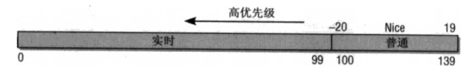

Linux进程优先级的处理
=======


| 日期 | 内核版本 | 架构| 作者 | GitHub| CSDN |
| ------- |:-------:|:-------:|:-------:|:-------:|:-------:|
| 2016-06-14 | [Linux-4.6](http://lxr.free-electrons.com/source/?v=4.6) | X86 & arm | [gatieme](http://blog.csdn.net/gatieme) | [LinuxDeviceDrivers](https://github.com/gatieme/LDD-LinuxDeviceDrivers) | [Linux进程管理与调度](http://blog.csdn.net/gatieme/article/category/6225543) |


#前景回顾
-------


##进程调度
-------

内存中保存了对每个进程的唯一描述, 并通过若干结构与其他进程连接起来.

**调度器**面对的情形就是这样, 其任务是在程序之间共享CPU时间, 创造并行执行的错觉, 该任务分为两个不同的部分, 其中一个涉及**调度策略**, 另外一个涉及**上下文切换**.


内核必须提供一种方法, 在各个进程之间尽可能公平地共享CPU时间, 而同时又要考虑不同的任务优先级.

调度器的一个重要目标是有效地分配 CPU 时间片，同时提供很好的用户体验。调度器还需要面对一些互相冲突的目标，例如既要为关键实时任务最小化响应时间, 又要最大限度地提高 CPU 的总体利用率.

调度器的一般原理是, 按所需分配的计算能力, 向系统中每个进程提供最大的公正性, 或者从另外一个角度上说, 他试图确保没有进程被亏待.


##进程的分类
-------

linux把进程区分为实时进程和非实时进程, 其中非实时进程进一步划分为交互式进程和批处理进程

| 类型 | 描述 | 示例 |
| ------- |:-------:|:-------:|:-------:|
| 交互式进程(interactive process) | 此类进程经常与用户进行交互, 因此需要花费很多时间等待键盘和鼠标操作. 当接受了用户的输入后, 进程必须很快被唤醒, 否则用户会感觉系统反应迟钝 | shell, 文本编辑程序和图形应用程序 |
| 批处理进程(batch process) | 此类进程不必与用户交互, 因此经常在后台运行. 因为这样的进程不必很快相应, 因此常受到调度程序的怠慢 | 程序语言的编译程序, 数据库搜索引擎以及科学计算 |
| 实时进程(real-time process) | 这些进程由很强的调度需要, 这样的进程绝不会被低优先级的进程阻塞. 并且他们的响应时间要尽可能的短 | 视频音频应用程序, 机器人控制程序以及从物理传感器上收集数据的程序|

在linux中, 调度算法可以明确的确认所有实时进程的身份, 但是没办法区分交互式程序和批处理程序, linux2.6的调度程序实现了基于进程过去行为的启发式算法, 以确定进程应该被当做交互式进程还是批处理进程. 当然与批处理进程相比, 调度程序有偏爱交互式进程的倾向


##不同进程采用不同的调度策略
-------

根据进程的不同分类Linux采用不同的调度策略.

对于实时进程，采用FIFO, Round Robin或者Earliest Deadline First (EDF)最早截止期限优先调度算法|的调度策略.

对于普通进程，则需要区分交互式和批处理式的不同。传统Linux调度器提高交互式应用的优先级，使得它们能更快地被调度。而CFS和RSDL等新的调度器的核心思想是"完全公平"。这个设计理念不仅大大简化了调度器的代码复杂度，还对各种调度需求的提供了更完美的支持.

注意Linux通过将进程和线程调度视为一个，同时包含二者。进程可以看做是单个线程，但是进程可以包含共享一定资源（代码和/或数据）的多个线程。因此进程调度也包含了线程调度的功能.

目前非实时进程的调度策略比较简单, 因为实时进程值只要求尽可能快的被响应, 基于优先级, 每个进程根据它重要程度的不同被赋予不同的优先级，调度器在每次调度时, 总选择优先级最高的进程开始执行. 低优先级不可能抢占高优先级, 因此FIFO或者Round Robin的调度策略即可满足实时进程调度的需求.

但是普通进程的调度策略就比较麻烦了, 因为普通进程不能简单的只看优先级, 必须公平的占有CPU, 否则很容易出现进程饥饿, 这种情况下用户会感觉操作系统很卡, 响应总是很慢，因此在linux调度器的发展历程中经过了多次重大变动, linux总是希望寻找一个最接近于完美的调度策略来公平快速的调度进程.


##linux调度器的演变
-------

一开始的调度器是复杂度为**$O(n)$的始调度算法**(实际上每次会遍历所有任务，所以复杂度为O(n)), 这个算法的缺点是当内核中有很多任务时，调度器本身就会耗费不少时间，所以，从linux2.5开始引入赫赫有名的**$O(1)$调度器**

然而，linux是集全球很多程序员的聪明才智而发展起来的超级内核，没有最好，只有更好，在$O(1)$调度器风光了没几天就又被另一个更优秀的调度器取代了，它就是**CFS调度器Completely Fair Scheduler**. 这个也是在2.6内核中引入的，具体为2.6.23，即从此版本开始，内核使用CFS作为它的默认调度器，$O(1)$调度器被抛弃了, 其实CFS的发展也是经历了很多阶段，最早期的楼梯算法(SD), 后来逐步对SD算法进行改进出RSDL(Rotating Staircase Deadline Scheduler), 这个算法已经是"完全公平"的雏形了， 直至CFS是最终被内核采纳的调度器, 它从RSDL/SD中吸取了完全公平的思想，不再跟踪进程的睡眠时间，也不再企图区分交互式进程。它将所有的进程都统一对待，这就是公平的含义。CFS的算法和实现都相当简单，众多的测试表明其性能也非常优越


| 字段 | 版本 |
| ------------- |:-------------:|:-------------:|
| O(n)的始调度算法 | linux-0.11~2.4 |
| O(1)调度器 | linux-2.5 |
| CFS调度器 | linux-2.6~至今 |

##Linux的调度器组成
-------

**2个调度器**

可以用两种方法来激活调度

*	一种是直接的, 比如进程打算睡眠或出于其他原因放弃CPU

*	另一种是通过周期性的机制, 以固定的频率运行, 不时的检测是否有必要

因此当前linux的调度程序由两个调度器组成：**主调度器**，**周期性调度器**(两者又统称为**通用调度器(generic scheduler)**或**核心调度器(core scheduler)**)

并且每个调度器包括两个内容：**调度框架**(其实质就是两个函数框架)及**调度器类**

调度器类是实现了不同调度策略的实例，如 CFS、RT class等。

它们的关系如下图


当前的内核支持两种调度器类（sched_setscheduler系统调用可修改进程的策略）：CFS（公平）、RT（实时）；5种调度策略：SCHED_NORAML（最常见的策略）、SCHED_BATCH（除了不能抢占外与常规任务一样，允许任务运行更长时间，更好地使用高速缓存，适合于成批处理的工作）、SCHED_IDLE（它甚至比nice 19还有弱，为了避免优先级反转使用）和SCHED_RR（循环调度，拥有时间片，结束后放在队列末）、SCHED_FIFO（没有时间片，可以运行任意长的时间）；其中前面三种策略使用的是cfs调度器类，后面两种使用rt调度器类。

**2个调度器类**

当前的内核支持2种调度器类（sched_setscheduler系统调用可修改进程的策略）：**CFS（公平调度器）**、**RT（实时调度器）**

**5种调度策略**

| 字段 | 描述 | 所在调度器类 |
| ------------- |:-------------:|:-------------:|
| SCHED_NORMAL | （也叫SCHED_OTHER）用于普通进程，通过CFS调度器实现。SCHED_BATCH用于非交互的处理器消耗型进程。SCHED_IDLE是在系统负载很低时使用 | CFS |
| SCHED_BATCH |  SCHED_NORMAL普通进程策略的分化版本。采用分时策略，根据动态优先级(可用nice()API设置），分配CPU运算资源。注意：这类进程比上述两类实时进程优先级低，换言之，在有实时进程存在时，实时进程优先调度。但针对吞吐量优化, 除了不能抢占外与常规任务一样，允许任务运行更长时间，更好地使用高速缓存，适合于成批处理的工作 | CFS |
| SCHED_IDLE | 优先级最低，在系统空闲时才跑这类进程(如利用闲散计算机资源跑地外文明搜索，蛋白质结构分析等任务，是此调度策略的适用者）| CFS |
| SCHED_FIFO | 先入先出调度算法（实时调度策略），相同优先级的任务先到先服务，高优先级的任务可以抢占低优先级的任务 | RT |
| SCHED_RR | 轮流调度算法（实时调度策略），后者提供 Roound-Robin 语义，采用时间片，相同优先级的任务当用完时间片会被放到队列尾部，以保证公平性，同样，高优先级的任务可以抢占低优先级的任务。不同要求的实时任务可以根据需要用sched_setscheduler()API 设置策略 | RT |
| SCHED_DEADLINE | 新支持的实时进程调度策略，针对突发型计算，且对延迟和完成时间高度敏感的任务适用。基于Earliest Deadline First (EDF)最早截止期限优先调度算法|

其中前面三种策略使用的是cfs调度器类，后面两种使用rt调度器类。

另外，对于调度框架及调度器类，它们都有自己管理的运行队列，调度框架只识别rq（其实它也不能算是运行队列），而对于cfs调度器类它的运行队列则是cfs_rq（内部使用红黑树组织调度实体），实时rt的运行队列则为rt_rq（内部使用优先级bitmap+双向链表组织调度实体）


本质上, 通用调度器(核心调度器)是一个分配器,与其他两个组件交互.

*	调度器用于判断接下来运行哪个进程.
	内核支持不同的调度策略(完全公平调度, 实时调度, 在无事可做的时候调度空闲进程,即0号进程也叫swapper进程,idle进程), 调度类使得能够以模块化的方法实现这些侧露额, 即一个类的代码不需要与其他类的代码交互
    当调度器被调用时, 他会查询调度器类, 得知接下来运行哪个进程

*	在选中将要运行的进程之后, 必须执行底层的任务切换. 
	这需要与CPU的紧密交互. 每个进程刚好属于某一调度类, 各个调度类负责管理所属的进程. 通用调度器自身不涉及进程管理, 其工作都委托给调度器类.


#linux优先级的表示
-------

##优先级的内核表示
-------


**linux优先级概述**

>在用户空间通过nice命令设置进程的静态优先级, 这在内部会调用nice系统调用, 进程的nice值在-20~+19之间. 值越低优先级越高.
>
>setpriority系统调用也可以用来设置进程的优先级. 它不仅能够修改单个线程的优先级, 还能修改进程组中所有进程的优先级, 或者通过制定UID来修改特定用户的所有进程的优先级


内核使用一些简单的数值范围0~139表示内部优先级, 数值越低, 优先级越高。

从0~99的范围专供实时进程使用, nice的值[-20,19]则映射到范围100~139


>linux2.6内核将任务优先级进行了一个划分, 实时优先级范围是0到MAX_RT_PRIO-1（即99），而普通进程的静态优先级范围是从MAX_RT_PRIO到MAX_PRIO-1（即100到139）。

| 优先级范围 | 描述 |
| ------------- |:-------------:|
| 0——99 | 实时进程 |
| 100——139 | 非实时进程 |




**内核的优先级表示**

内核表示优先级的所有信息基本都放在[include/linux/sched/prio.h](http://lxr.free-electrons.com/source/include/linux/sched/prio.h?v=4.6)中, 其中定义了一些表示优先级的宏和函数, 

优先级数值通过宏来定义, 如下所示,

其中MAX_NICE和MIN_NICE定义了nice的最大最小值

而MAX_RT_PRIO指定了实时进程的最大优先级, 而MAX_PRIO则是普通进程的最大优先级数值

```c
/*  http://lxr.free-electrons.com/source/include/linux/sched/prio.h?v=4.6#L4 */
#define MAX_NICE        19
#define MIN_NICE        -20
#define NICE_WIDTH      (MAX_NICE - MIN_NICE + 1)

/* http://lxr.free-electrons.com/source/include/linux/sched/prio.h?v=4.6#L24  */
#define MAX_PRIO        (MAX_RT_PRIO + 40)
#define DEFAULT_PRIO        (MAX_RT_PRIO + 20)
```


| 宏 | 值 | 描述 |
| ------------- |:-------------:|:-------------:|
| MIN_NICE | -20 | 对应于优先级100, 可以使用NICE_TO_PRIO和PRIO_TO_NICE转换 |
| MAX_NICE |  19 | 对应于优先级139, 可以使用NICE_TO_PRIO和PRIO_TO_NICE转换 |
| NICE_WIDTH | 40 | nice值得范围宽度, 即[-20, 19]共40个数字的宽度 |
| MAX_RT_PRIO, MAX_USER_RT_PRIO | 100 | 实时进程的最大优先级 |
| MAX_PRIO | 140 | 普通进程的最大优先级 |
| DEFAULT_PRIO | 120 | 进程的默认优先级, 对应于nice=0 |
| MAX_DL_PRIO | 0 | 使用EDF最早截止时间优先调度算法的实时进程最大的优先级 |

而内核提供了一组宏将优先级在各种不同的表示形之间转移


```c
//  http://lxr.free-electrons.com/source/include/linux/sched/prio.h?v=4.6#L27
/*
 * Convert user-nice values [ -20 ... 0 ... 19 ]
 * to static priority [ MAX_RT_PRIO..MAX_PRIO-1 ],
 * and back.
 */
#define NICE_TO_PRIO(nice)      ((nice) + DEFAULT_PRIO)
#define PRIO_TO_NICE(prio)      ((prio) - DEFAULT_PRIO)

/*
 * 'User priority' is the nice value converted to something we
 * can work with better when scaling various scheduler parameters,
 * it's a [ 0 ... 39 ] range.
 */
#define USER_PRIO(p)            ((p)-MAX_RT_PRIO)
#define TASK_USER_PRIO(p)       USER_PRIO((p)->static_prio)
#define MAX_USER_PRIO           (USER_PRIO(MAX_PRIO))
```

还有一些nice值和rlimit值之间相互转换的函数nice_to_rlimit和rlimit_to_nice, 这在nice系统调用进行检查的时候很有用, 他们定义在[include/linux/sched/prio.h, L47](http://lxr.free-electrons.com/source/include/linux/sched/prio.h#L47)中, 如下所示


```c
/*
 * Convert nice value [19,-20] to rlimit style value [1,40].
 */
static inline long nice_to_rlimit(long nice)
{
    return (MAX_NICE - nice + 1);
}

/*
 * Convert rlimit style value [1,40] to nice value [-20, 19].
 */
static inline long rlimit_to_nice(long prio)
{
    return (MAX_NICE - prio + 1);
}
```

**DEF最早截至时间优先实时调度算法的优先级描述**

此外新版本的内核还引入了EDF实时调度算法, 它的优先级比RT进程和NORMAL/BATCH进程的优先级都要高, 关于EDF的优先级的设置信息都早内核头文件[include/linux/sched/deadline.h](http://lxr.free-electrons.com/source/include/linux/sched/deadline.h?v=4.6#L10)


因此内核将MAX_DL_PRIO设置为0, 可以参见内核文件[include/linux/sched/deadline.h](http://lxr.free-electrons.com/source/include/linux/sched/deadline.h?v=4.6#L10)

```c
#define MAX_DL_PRIO             0
```

此外也提供了一些EDF优先级处理所需的函数, 如下所示, 可以参见内核文件[include/linux/sched/deadline.h](http://lxr.free-electrons.com/source/include/linux/sched/deadline.h?v=4.6#L12)

```c
static inline int dl_prio(int prio)
{
    if (unlikely(prio < MAX_DL_PRIO))
            return 1;
    return 0;
}

static inline int dl_task(struct task_struct *p)
{
    return dl_prio(p->prio);
}

static inline bool dl_time_before(u64 a, u64 b)
{
    return (s64)(a - b) < 0;
}
```


##进程的优先级表示
-------


```c
struct task_struct
{
    /* 进程优先级
     * prio: 动态优先级，范围为100~139，与静态优先级和补偿(bonus)有关
     * static_prio: 静态优先级，static_prio = 100 + nice + 20 (nice值为-20~19,所以static_prio值为100~139)
     * normal_prio: 没有受优先级继承影响的常规优先级，具体见normal_prio函数，跟属于什么类型的进程有关
     */
    int prio, static_prio, normal_prio;
    /* 实时进程优先级 */
    unsigned int rt_priority;
}
```


**动态优先级 静态优先级 实时优先级**


其中task_struct采用了三个成员表示进程的优先级:prio和normal_prio表示动态优先级, static_prio表示进程的静态优先级.

>为什么表示动态优先级需要两个值prio和normal_prio
>
>调度器会考虑的优先级则保存在prio. 由于在某些情况下内核需要暂时提高进程的优先级, 因此需要用prio表示. 由于这些改变不是持久的, 因此静态优先级static_prio和普通优先级normal_prio不受影响.

此外还用了一个字段rt_priority保存了实时进程的优先级

| 字段 | 描述 |
| ------------- |:-------------:|
| static_prio | 用于保存静态优先级, 是进程启动时分配的优先级, ，可以通过nice和sched_setscheduler系统调用来进行修改, 否则在进程运行期间会一直保持恒定 |
| prio | 保存进程的动态优先级 |
| normal_prio | 表示基于进程的静态优先级static_prio和调度策略计算出的优先级. 因此即使普通进程和实时进程具有相同的静态优先级, 其普通优先级也是不同的, 进程分叉(fork)时, 子进程会继承父进程的普通优先级 |
| rt_priority | 用于保存实时优先级 |


实时进程的优先级用实时优先级rt_priority来表示


#进程优先级的计算
-------


前面说了task_struct中的几个优先级的字段

| 静态优先级 | 普通优先级 | 动态优先级 | 实时优先级 |
| ------------- |:-------------:|:-------------:|:-------------:|
| static_prio | normal_prio | prio | rt_priority |

但是这些优先级是如何关联的呢, 动态优先级prio又是如何计算的呢?


##normal_prio设置普通优先级normal_prio
-------

静态优先级static_prio(普通进程)和实时优先级rt_priority(实时进程)是计算的起点

因此他们也是进程创建的时候设定好的, 我们通过nice修改的就是静态优先级static_prio

首先通过静态优先级static_prio计算出普通优先级normal_prio, 改工作可以由nromal_prio来完成, 该函数定义在[kernel/sched/core.c#L861](http://lxr.free-electrons.com/source/kernel/sched/core.c#L861)

```c
/*
 * __normal_prio - return the priority that is based on the static prio
 * 普通进程(非实时进程)的普通优先级normal_prio就是静态优先级static_prio
 */
static inline int __normal_prio(struct task_struct *p)
{
    return p->static_prio;
}

/*
 * Calculate the expected normal priority: i.e. priority
 * without taking RT-inheritance into account. Might be
 * boosted by interactivity modifiers. Changes upon fork,
 * setprio syscalls, and whenever the interactivity
 * estimator recalculates.
 */
static inline int normal_prio(struct task_struct *p)
{
    int prio;

    if (task_has_dl_policy(p))				/*  EDF调度的实时进程  */
            prio = MAX_DL_PRIO-1;
    else if (task_has_rt_policy(p))		  /*  普通实时进程的优先级  */
            prio = MAX_RT_PRIO-1 - p->rt_priority;
    else											  /*  普通进程的优先级  */
            prio = __normal_prio(p);
    return prio;
}
```

| 进程类型  | 调度器 | 普通优先级normal_prio |
| ------------- |:-------------:|:-------------:|
| EDF实时进程 | EDF |  MAX_DL_PRIO-1 = -1 |
| 普通实时进程 | RT | MAX_RT_PRIO-1 - p->rt_priority = 99 - rt_priority |
| 普通进程 | CFS | __normal_prio(p) = static_prio |


普通优先级normal_prio需要根据普通进程和实时进程进行不同的计算, 其中__normal_prio适用于普通进程, 直接将普通优先级normal_prio设置为静态优先级static_prio. 而实时进程的普通优先级计算依据其实时优先级rt_priority.

###辅助函数task_has_dl_policy和task_has_rt_policy
-------

定义在[kernel/sched/sched.h#L117](http://lxr.free-electrons.com/source/kernel/sched/sched.h?v=4.6#L117) 中

其本质其实就是传入task->policy调度策略字段看其值等于SCHED_NORMAL, SCHED_BATCH, SCHED_IDLE, SCHED_FIFO, SCHED_RR, SCHED_DEADLINE中的哪个, 从而确定其所属的调度类, 进一步就确定了其进程类型

```c
static inline int idle_policy(int policy)
{
    return policy == SCHED_IDLE;
}
static inline int fair_policy(int policy)
{
    return policy == SCHED_NORMAL || policy == SCHED_BATCH;
}

static inline int rt_policy(int policy)
{
    return policy == SCHED_FIFO || policy == SCHED_RR;
}

static inline int dl_policy(int policy)
{
        return policy == SCHED_DEADLINE;
}
static inline bool valid_policy(int policy)
{
        return idle_policy(policy) || fair_policy(policy) ||
                rt_policy(policy) || dl_policy(policy);
}

static inline int task_has_rt_policy(struct task_struct *p)
{
        return rt_policy(p->policy);
}

static inline int task_has_dl_policy(struct task_struct *p)
{
        return dl_policy(p->policy);
}
```


###关于rt_priority数值越大, 实时进程优先级越高的问题
--------

我们前面提到了数值越小, 优先级越高, 但是此处我们会发现rt_priority的值越大, 其普通优先级越小, 从而优先级越高.

因此网上出现了一种说法, 优先级越高？这又是怎么回事？难道有一种说法错了吗？

实际的原因是这样的，对于一个实时进程，他有两个参数来表明优先级——prio 和 rt_priority，

prio才是调度所用的最终优先级数值，这个值越小，优先级越高；

而rt_priority 被称作实时进程优先级，他要经过转化——prio=MAX_RT_PRIO - 1- p->rt_priority; 

MAX_RT_PRIO = 100, ;这样意味着rt_priority值越大，优先级越高；

而内核提供的修改优先级的函数，是修改rt_priority的值，所以越大，优先级越高。

 所以用户在使用实时进程或线程，在修改优先级时，就会有“优先级值越大，优先级越高的说法”，也是对的。

###为什么需要__normal_prio函数
-------

我们肯定会奇怪, 为什么增加了一个__normal_prio函数做了这么简单的工作, 这个其实是有历史原因的: 在早期的$O(1)$调度器中, 普通优先级的计算涉及相当多技巧性地工作,  必须检测交互式进程并提高其优先级, 而必须"惩罚"非交互进程, 以便是得系统获得更好的交互体验. 这需要很多启发式的计算, 他们可能完成的很好, 也可能不工作

##effective_prio设置动态优先级prio
-------

可以通过函数effective_prio用静态优先级static_prio计算动态优先级prio, 即·

```c
p->prio = effective_prio(p);
```

该函数定义在[kernel/sched/core.c, line 861](http://lxr.free-electrons.com/source/kernel/sched/core.c#L861)

```c
/*
 * Calculate the current priority, i.e. the priority
 * taken into account by the scheduler. This value might
 * be boosted by RT tasks, or might be boosted by
 * interactivity modifiers. Will be RT if the task got
 * RT-boosted. If not then it returns p->normal_prio.
 */
static int effective_prio(struct task_struct *p)
{
    p->normal_prio = normal_prio(p);
    /*
     * If we are RT tasks or we were boosted to RT priority,
     * keep the priority unchanged. Otherwise, update priority
     * to the normal priority:
     */
    if (!rt_prio(p->prio))
            return p->normal_prio;
    return p->prio;
}
```

我们会发现函数首先effective_prio设置了普通优先级, 显然我们用effective_prio同时设置了两个优先级(普通优先级normal_prio和动态优先级prio)

因此计算动态优先级的流程如下

*	设置进程的普通优先级(实时进程99-rt_priority, 普通进程为static_priority)

*	计算进程的动态优先级(实时进程则维持动态优先级的prio不变, 普通进程的动态优先级即为其普通优先级)

最后, 我们综述一下在针对不同类型进程的计算结果

| 进程类型  | 实时优先级rt_priority | 静态优先级static_prio | 普通优先级normal_prio | 动态优先级prio |
| ------- |:-------:|:-------:|:-------:|
| EDF调度的实时进程 | rt_priority | 不使用 | MAX_DL_PRIO-1 | 维持原prio不变 |
| RT算法调度的实时进程 | rt_priority | 不使用 | MAX_RT_PRIO-1-rt_priority | 维持原prio不变 |
| 普通进程 | 不使用 | static_prio | static_prio | static_prio |
| 优先级提高的普通进程 | 不使用 | static_prio(改变) | static_prio | 维持原prio不变 |

###为什么effective_prio使用优先级数值检测实时进程
-------

t_prio会检测普通优先级是否在实时范围内, 即是否小于MAX_RT_PRIO.参见[include/linux/sched/rt.h#L6](http://lxr.free-electrons.com/source/include/linux/sched/rt.h#L6)

```c
static inline int rt_prio(int prio)
{
	if (unlikely(prio < MAX_RT_PRIO))
    	return 1;
	return 0;
}
```
而前面我们在normal_prio的时候, 则通过task_has_rt_policy来判断其policy属性来确定
```
policy == SCHED_FIFO || policy == SCHED_RR;
```
那么为什么effective_prio重检测实时进程是rt_prio基于优先级数值, 而非task_has_rt_policy或者rt_policy?

对于临时提高至实时优先级的非实时进程来说, 这个是必要的, 这种情况可能发生在是哦那个实时互斥量(RT-Mutex)时.


##设置prio的时机
-------


*	在新进程用wake_up_new_task唤醒时, 或者使用nice系统调用改变其静态优先级时, 则会通过effective_prio的方法设置p->prio

>wake_up_new_task(), 计算此进程的优先级和其他调度参数，将新的进程加入到进程调度队列并设此进程为可被调度的，以后这个进程可以被进程调度模块调度执行。

*	进程创建时copy_process通过调用sched_fork来初始化和设置调度器的过程中会设置子进程的优先级

##nice系统调用的实现
-------

nice系统调用是的内核实现是sys_nice, 其定义在[kernel/sched/core.c#L7498](http://lxr.free-electrons.com/source/kernel/sched/core.c?v=4.6#L7498)，

它在通过一系列检测后, 通过[set_user_nice函数](http://lxr.free-electrons.com/source/kernel/sched/core.c?v=4.6#L3497)， 其定义在[kernel/sched/core.c#L3497](http://lxr.free-electrons.com/source/kernel/sched/core.c?v=4.6#L3497)

关于其具体实现我们会在另外一篇博客里面详细讲


##fork时优先级的继承
-------


在进程分叉处子进程时, 子进程的静态优先级继承自父进程. 子进程的动态优先级p->prio则被设置为父进程的普通优先级, 这确保了实时互斥量引起的优先级提高不会传递到子进程.

可以参照sched_fork函数, 在进程复制的过程中copy_process通过调用sched_fork来设置子进程优先级, 参见[sched_fork函数](http://lxr.free-electrons.com/source/kernel/sched/core.c#L2236)


```c
/*
 * fork()/clone()-time setup:
 */
int sched_fork(unsigned long clone_flags, struct task_struct *p)
{
	/*	......	*/
    /*
     * Make sure we do not leak PI boosting priority to the child.
     * 子进程的动态优先级被设置为父进程普通优先级 
     */
    p->prio = current->normal_prio;

    /*
     * Revert to default priority/policy on fork if requested.
     * sched_reset_on_fork标识用于判断是否恢复默认的优先级或调度策略

     */
    if (unlikely(p->sched_reset_on_fork))  /*  如果要恢复默认的调度策略, 即SCHED_NORMAL  */
    {
    	/*   首先是设置静态优先级static_prio
         *	 由于要恢复默认的调度策略
         *	 对于父进程是实时进程的情况, 静态优先级就设置为DEFAULT_PRIO
         *
         *	 对于父进程是非实时进程的情况, 要保证子进程优先级不小于DEFAULT_PRIO
         *	 父进程nice < 0即static_prio < 的重新设置为DEFAULT_PRIO的重新设置为DEFAULT_PRIO
         *	 父进程nice > 0的时候, 则什么也没做
         *	 */
        if (task_has_dl_policy(p) || task_has_rt_policy(p))
        {
            p->policy = SCHED_NORMAL;			/*  普通进程调度策略  */
            p->static_prio = NICE_TO_PRIO(0);	/*  静态优先级为nice = 0 即DEFAULT_PRIO*/
            p->rt_priority = 0;								/*  实时优先级为0  */
        }
        else if (PRIO_TO_NICE(p->static_prio) < 0)  /*  */
            p->static_prio = NICE_TO_PRIO(0);	/*  */

        /*  接着就通过__normal_prio设置其普通优先级和动态优先级
          *  这里做了一个优化, 因为用sched_reset_on_fork标识设置恢复默认调度策略后
          *  创建的子进程是是SCHED_NORMAL的非实时进程
          *  因此就不需要绕一大圈用effective_prio设置normal_prio和prio了 
          *  直接用__normal_prio设置就可  */
        p->prio = p->normal_prio = __normal_prio(p); /*  设置*/

        /*  设置负荷权重  */
        set_load_weight(p);

        /*
         * We don't need the reset flag anymore after the fork. It has
         * fulfilled its duty:
         */
        p->sched_reset_on_fork = 0;
    }
	/*	......	*/
}
```


#总结
-------

task_struct采用了四个成员表示进程的优先级:prio和normal_prio表示动态优先级, static_prio表示进程的静态优先级. 同时还用了rt_priority表示实时进程的优先级


| 字段 | 描述 |
| ------------- |:-------------:|
| static_prio | 用于保存静态优先级, 是进程启动时分配的优先级, ，可以通过nice和sched_setscheduler系统调用来进行修改, 否则在进程运行期间会一直保持恒定 |
| prio | 进程的动态优先级, 这个有显示才是调度器重点考虑的进程优先级 |
| normal_prio | 普通进程的静态优先级static_prio和调度策略计算出的优先级. 因此即使普通进程和实时进程具有相同的静态优先级, 其普通优先级也是不同的, 进程分叉(fork)时, 子进程会继承父进程的普通优先级, 可以通过normal_prio来计算(非实时进程用static_prIo计算, 实时进程用rt_priority计算) |
| rt_priority | 实时进程的静态优先级  |


调度器会考虑的优先级则保存在prio. 由于在某些情况下内核需要暂时提高进程的优先级, 因此需要用prio表示. 由于这些改变不是持久的, 因此静态优先级static_prio和普通优先级normal_prio不受影响.
此外还用了一个字段rt_priority保存了实时进程的优先级静态优先级static_prio(普通进程)和实时优先级rt_priority(实时进程)是计算的起点, 通过他们计算进程的普通优先级normal_prio和动态优先级prio.

内核通过normal_prIo函数计算普通优先级normal_prio
通过effective_prio函数计算动态优先级prio

>参考
>
>[进程调度之sys_nice()系统调用](http://blog.sina.com.cn/s/blog_9ca3f6e70102wkwp.html)
>
>[linux调度器源码研究 - 概述（一）](http://blog.chinaunix.net/uid-20671208-id-4909623.html)
>
>[深入 Linux 的进程优先级](http://www.linuxidc.com/Linux/2016-05/131244.htm)