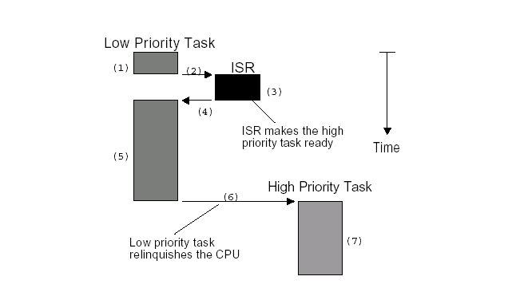

Linux用户抢占和内核抢占以及抢占发生的时机
=======


| 日期 | 内核版本 | 架构| 作者 | GitHub| CSDN |
| ------- |:-------:|:-------:|:-------:|:-------:|:-------:|
| 2016-06-14 | [Linux-4.6](http://lxr.free-electrons.com/source/?v=4.6) | X86 & arm | [gatieme](http://blog.csdn.net/gatieme) | [LinuxDeviceDrivers](https://github.com/gatieme/LDD-LinuxDeviceDrivers) | [Linux进程管理与调度](http://blog.csdn.net/gatieme/article/category/6225543) |


前面我们了解了linux进程调度器的设计思路和注意框架

周期调度器scheduler_tick通过linux定时器周期性的被激活, 进行程序调度

进程主动放弃CPU或者发生阻塞时, 则会调用主调度器schedule进行程序调度

在分析的过程中, 我们提到了内核抢占和用户抢占的概念, 但是并没有详细讲, 因此我们在这里详细分析一下子


#前景回顾
-------

##Linux的调度器组成
-------


**2个调度器**

可以用两种方法来激活调度

*	一种是直接的, 比如进程打算睡眠或出于其他原因放弃CPU

*	另一种是通过周期性的机制, 以固定的频率运行, 不时的检测是否有必要

因此当前linux的调度程序由两个调度器组成：**主调度器**，**周期性调度器**(两者又统称为**通用调度器(generic scheduler)**或**核心调度器(core scheduler)**)

并且每个调度器包括两个内容：**调度框架**(其实质就是两个函数框架)及**调度器类**


**6种调度策略**

linux内核目前实现了6中调度策略(即调度算法), 用于对不同类型的进程进行调度, 或者支持某些特殊的功能

*	SCHED_NORMAL和SCHED_BATCH调度普通的非实时进程

*	SCHED_FIFO和SCHED_RR和SCHED_DEADLINE则采用不同的调度策略调度实时进程

*	SCHED_IDLE则在系统空闲时调用idle进程.


**5个调度器类**

而依据其调度策略的不同实现了5个调度器类, 一个调度器类可以用一种种或者多种调度策略调度某一类进程, 也可以用于特殊情况或者调度特殊功能的进程.


其所属进程的优先级顺序为
```c
stop_sched_class -> dl_sched_class -> rt_sched_class -> fair_sched_class -> idle_sched_class
```


**3个调度实体**

调度器不限于调度进程, 还可以调度更大的实体, 比如实现组调度.

这种一般性要求调度器不直接操作进程, 而是处理可调度实体, 因此需要一个通用的数据结构描述这个调度实体,即seched_entity结构, 其实际上就代表了一个调度对象，可以为一个进程，也可以为一个进程组.

linux中针对当前可调度的实时和非实时进程, 定义了类型为seched_entity的3个调度实体

*	sched_dl_entity 采用EDF算法调度的实时调度实体

*	sched_rt_entity 采用Roound-Robin或者FIFO算法调度的实时调度实体 

*	sched_entity 采用CFS算法调度的普通非实时进程的调度实体


##主调度器与内核/用户抢占
-------

###调度过程中关闭内核抢占
-------

我们在上一篇linux内核主调度器schedule(文章链接, [CSDN](), [Github]())中在分析主调度器的时候, 我们会发现内核在进行调度之前都会通过preempt_disable关闭内核抢占, 而在完成调度工作后, 又会重新开启**内核抢占**

参见[主调度器函数schedule](http://lxr.free-electrons.com/source/kernel/sched/core.c?v=4.6#L3243)
```c
    do {
        preempt_disable();                                  /*  关闭内核抢占  */
        __schedule(false);                                  /*  完成调度  */
        sched_preempt_enable_no_resched();                  /*  开启内核抢占  */

    } while (need_resched());   /*  如果该进程被其他进程设置了TIF_NEED_RESCHED标志，则函数重新执行进行调度    */
```

这个很容易理解, 我们在内核完成调度器过程中, 这时候如果发生了内核抢占, 我们的调度会被中断, 而调度却还没有完成, 这样会丢失我们调度的信息.

###调度完成检查need_resched看是否需要重新调度

而同样我们可以看到, 在调度完成后, 内核会去判断need_resched条件, 如果这个时候为真, 内核会重新进程一次调度.

这个的原因, 我们在前一篇博客中, 也已经说的很明白了,

内核在thread_info的flag中设置了一个标识来标志进程是否需要重新调度, 即重新调度need_resched标识TIF_NEED_RESCHED, 内核在即将返回用户空间时会检查标识TIF_NEED_RESCHED标志进程是否需要重新调度，如果设置了，就会发生调度, 这被称为**用户抢占**


#非抢占式和可抢占式内核
-------

为了简化问题，我使用嵌入式实时系统uC/OS作为例子

首先要指出的是，uC/OS只有内核态，没有用户态，这和Linux不一样

多任务系统中, 内核负责管理各个任务, 或者说为每个任务分配CPU时间, 并且负责任务之间的通讯.

内核提供的基本服务是任务切换. 调度（Scheduler）,英文还有一词叫dispatcher, 也是调度的意思.

这是内核的主要职责之一, 就是要决定该轮到哪个任务运行了. 多数实时内核是基于优先级调度法的, 每个任务根据其重要程度的不同被赋予一定的优先级. 基于优先级的调度法指，CPU总是让处在就绪态的优先级最高的任务先运行. 然而, 究竟何时让高优先级任务掌握CPU的使用权, 有两种不同的情况, 这要看用的是什么类型的内核, 是**不可剥夺型**的还是**可剥夺型内核**

##非抢占式内核
-------

**非抢占式内核**是由任务主动放弃CPU的使用权

非抢占式调度法也称作合作型多任务, 各个任务彼此合作共享一个CPU. 异步事件还是由中断服务来处理. 中断服务可以使一个高优先级的任务由挂起状态变为就绪状态.

但中断服务以后控制权还是回到原来被中断了的那个任务, 直到该任务主动放弃CPU的使用权时，那个高优先级的任务才能获得CPU的使用权。非抢占式内核如下图所示.



非抢占式内核的优点有

*	中断响应快(与抢占式内核比较)；

*	允许使用不可重入函数；

*	几乎不需要使用信号量保护共享数据, 运行的任务占有CPU，不必担心被别的任务抢占。这不是绝对的，在打印机的使用上，仍需要满足互斥条件。

非抢占式内核的缺点有

*	任务响应时间慢。高优先级的任务已经进入就绪态，但还不能运行，要等到当前运行着的任务释放CPU。
*	非抢占式内核的任务级响应时间是不确定的，不知道什么时候最高优先级的任务才能拿到CPU的控制权，完全取决于应用程序什么时候释放CPU。

##抢占式内核
-------

使用抢占式内核可以保证系统响应时间. 最高优先级的任务一旦就绪, 总能得到CPU的使用权。当一个运行着的任务使一个比它优先级高的任务进入了就绪态, 当前任务的CPU使用权就会被剥夺，或者说被挂起了，那个高优先级的任务立刻得到了CPU的控制权。如果是中断服务子程序使一个高优先级的任务进入就绪态，中断完成时，中断了的任务被挂起，优先级高的那个任务开始运行。

抢占式内核如下图所示


抢占式内核的优点有

*	使用抢占式内核，最高优先级的任务什么时候可以执行，可以得到CPU的使用权是可知的。使用抢占式内核使得任务级响应时间得以最优化。
抢占式内核的缺点有：

*	不能直接使用不可重入型函数。调用不可重入函数时，要满足互斥条件，这点可以使用互斥型信号量来实现。如果调用不可重入型函数时，低优先级的任务CPU的使用权被高优先级任务剥夺，不可重入型函数中的数据有可能被破坏。


#Linux下的用户态抢占和内核态抢占
-------


CPU抢占分两种情况, **用户抢占**, **内核抢占**

其中内核抢占是在Linux2.5.4版本发布时加入, 同SMP(Symmetrical Multi-Processing, 对称多处理器), 作为内核的可选配置。


##用户抢占
-------

###用户抢占的概念
-------

当内核即将返回用户空间时, 内核会检查need_resched是否设置, 如果设置, 则调用schedule()，此时，发生用户抢占.


###用户抢占的发生时机

一般来说，用户抢占发生几下情况：

1.	从系统调用返回用户空间；

2.	从中断(异常)处理程序返回用户空间

从这里我们可以看到, 用户抢占是发生在用户空间的抢占现象.

###need_resched标识
-------

内核如何检查一个进程是否需要被调度呢?

内核在即将返回用户空间时检查进程是否需要重新调度，如果设置了，就会发生调度, 这被称为**用户抢占**, 因此**内核在thread_info的flag中设置了一个标识来标志进程是否需要重新调度, 即重新调度need_resched标识TIF_NEED_RESCHED**

并提供了一些设置可检测的函数


| 函数 | 描述 | 定义 |
| ------- |:-------:|:-------:|
| set_tsk_need_resched | 设置指定进程中的need_resched标志 | [include/linux/sched.h, L2920](http://lxr.free-electrons.com/source/include/linux/sched.h?v=4.6#L2920) |
| clear_tsk_need_resched | 清除指定进程中的need_resched标志 | [include/linux/sched.h, L2926](http://lxr.free-electrons.com/source/include/linux/sched.h?v=4.6#L2931) |
| test_tsk_need_resched | 检查指定进程need_resched标志 | [include/linux/sched.h, L2931](http://lxr.free-electrons.com/source/include/linux/sched.h?v=4.6#L2931) |

而我们内核中调度时常用的need_resched()函数检查进程是否需要被重新调度其实就是通过test_tsk_need_resched实现的, 其定义如下所示

```c
// http://lxr.free-electrons.com/source/include/linux/sched.h?v=4.6#L3093
static __always_inline bool need_resched(void)
{
	return unlikely(tif_need_resched());
}

// http://lxr.free-electrons.com/source/include/linux/thread_info.h?v=4.6#L106
#define tif_need_resched() test_thread_flag(TIF_NEED_RESCHED)
```


##内核抢占
-------

###内核抢占的概念
-------

对比用户抢占, 顾名思义, 内核抢占就是指一个在内核态运行的进程, 可能在执行内核函数期间被另一个进程取代.


###为什么linux需要内核抢占
-------

linux系统中, 进程在系统调用后返回用户态之前, 或者是内核中某些特定的点上, 都会调用调度器. 这确保除了一些明确指定的情况之外, 内核是无法中断的, 这不同于用户进程. 

如果内核处于相对耗时的操作中, 比如文件系统或者内存管理相关的任务, 这种行为可能会带来问题. 这种情况下, 内核代替特定的进程执行相当长的时间, 而其他进程无法执行, 无法调度, 这就造成了系统的延迟增加, 用户体验到"缓慢"的响应. 比如如果多媒体应用长时间无法得到CPU, 则可能发生视频和音频漏失现象.

在编译内核时如果启用了对**内核抢占**的支持, 则可以解决这些问题. 如果高优先级进程有事情需要完成, 那么在启用了内核抢占的情况下, 不仅用户空间应用程序可以被中断, 内核也可以被中断,


linux内核抢占是在Linux2.5.4版本发布时加入的, 尽管使内核可抢占需要的改动特别少, 但是该机制不像抢占用户空间进程那样容易实现. 如果内核无法一次性完成某些操作(例如, 对数据结构的操作), 那么可能出现静态条件而使得系统不一致.

内核抢占和用户层进程被其他进程抢占是两个不同的概念, 内核抢占主要是从实时系统中引入的, 在非实时系统中的确也能提高系统的响应速度, 但也不是在所有情况下都是最优的，因为抢占也需要调度和同步开销，在某些情况下甚至要关闭内核抢占, 比如前面我们将主调度器的时候, linux内核在完成调度的过程中是关闭了内核抢占的.

内核不能再任意点被中断, 幸运的是, 大多数不能中断的点已经被SMP实现标识出来了. 并且在实现内核抢占时可以重用这些信息. 如果内核可以被抢占, 那么单处理器系统也会像是一个SMP系统

##内核抢占的发生时机
-------

要满足什么条件，kernel才可以抢占一个任务的内核态呢?

*	没持有锁。锁是用于保护临界区的，不能被抢占。

*	Kernel code可重入(reentrant)。因为kernel是SMP-safe的，所以满足可重入性。

内核抢占发生的时机，一般发生在：

1.	当从中断处理程序正在执行，且返回内核空间之前。

2.	当内核代码再一次具有可抢占性的时候，如解锁（spin_unlock_bh）及使能软中断(local_bh_enable)等。

3.	如果内核中的任务显式的调用schedule()。

4.	如果内核中的任务阻塞(这同样也会导致调用schedule())

内核抢占，并不是在任何一个地方都可以发生，以下情况不能发生

1.	内核正进行中断处理。在Linux内核中进程不能抢占中断(中断只能被其他中断中止、抢占，进程不能中止、抢占中断)，在中断例程中不允许进行进程调度。进程调度函数schedule()会对此作出判断，如果是在中断中调用，会打印出错信息。

2.	内核正在进行中断上下文的Bottom Half(中断下半部，即软中断)处理。硬件中断返回前会执行软中断，此时仍然处于中断上下文中。如果此时正在执行其它软中断，则不再执行该软中断。

3.	内核的代码段正持有spinlock自旋锁、writelock/readlock读写锁等锁，处干这些锁的保护状态中。内核中的这些锁是为了在SMP系统中短时间内保证不同CPU上运行的进程并发执行的正确性。当持有这些锁时，内核不应该被抢占。

4.	内核正在执行调度程序Scheduler。抢占的原因就是为了进行新的调度，没有理由将调度程序抢占掉再运行调度程序。

5.	内核正在对每个CPU“私有”的数据结构操作(Per-CPU date structures)。在SMP中，对于per-CPU数据结构未用spinlocks保护，因为这些数据结构隐含地被保护了(不同的CPU有不一样的per-CPU数据，其他CPU上运行的进程不会用到另一个CPU的per-CPU数据)。但是如果允许抢占，但一个进程被抢占后重新调度，有可能调度到其他的CPU上去，这时定义的Per-CPU变量就会有问题，这时应禁抢占。


##内核抢占的实现
-------

###内核如何跟踪它能否被抢占?
-------


前面我们提到了, 系统中每个进程都有一个特定于体系结构的struct thread_info结构, 用户层程序被调度的时候会检查struct thread_info中的need_resched标识TLF_NEED_RESCHED标识来检查自己是否需要被重新调度.

自然内核抢占·也可以应用同样的方法被实现, linux内核在thread_info结构中添加了一个自旋锁标识preempt_count, 称为**抢占计数器(preemption counter)**.

```c
struct thread_info
{
	/*  ......  */
	int preempt_count;	 /* 0 => preemptable, <0 => BUG */
    /*  ......  */
}
````
| preempt_count值 | 描述 |
| ------- |:-------:|
| >0 | 禁止内核抢占, 其值标记了使用preempt_count的临界区的数目 |
| 0 | 开启内核抢占 |
| <0 | 锁为负值, 内核出现错误 |

内核自然也提供了一些函数或者宏, 用来开启, 关闭以及检测抢占计数器preempt_coun的值, 这些通用的函数定义在[include/asm-generic/preempt.h](http://lxr.free-electrons.com/source/include/asm-generic/preempt.h?v=4.6#L8), 而某些架构也定义了自己的接口， 比如x86架构[/arch/x86/include/asm/preempt.h](http://lxr.free-electrons.com/source/arch/x86/include/asm/preempt.h?v=4.6)

| 函数 | 描述 | 定义 |
| ------- |:-------:|:-------:|
| preempt_count | 获取当前current进程抢占计数器的值 | [include/asm-generic/preempt.h, line 8](http://lxr.free-electrons.com/source/include/asm-generic/preempt.h?v=4.6#L8) |
| preempt_count_ptr | 返回指向当前current进程的抢占计数器的指针 | [include/asm-generic/preempt.h, line 13](http://lxr.free-electrons.com/source/include/asm-generic/preempt.h?v=4.6#L13) |
| preempt_count_set | 重设当前current进程的抢占计数器 | [include/asm-generic/preempt.h, line 18](http://lxr.free-electrons.com/source/include/asm-generic/preempt.h?v=4.6#L18) |
| init_task_preempt_count | 初始化task的抢占计数器为FORK_PREEMPT_COUNT | [include/asm-generic/preempt.h, line 26](http://lxr.free-electrons.com/source/include/asm-generic/preempt.h?v=4.6#L26) |
| init_idle_preempt_count | 初始化task的抢占计数器为PREEMPT_ENABLED | [include/asm-generic/preempt.h, line 30](http://lxr.free-electrons.com/source/include/asm-generic/preempt.h?v=4.6#L30) |
|  preempt_count_add | 将增加current的抢占计数器增加val | [include/linux/preempt.h, line 132](http://lxr.free-electrons.com/source/include/linux/preempt.h?v=4.6#L32) |
| preempt_count_sub | 将增加current的抢占计数器减少val | [include/linux/preempt.h, line 133](http://lxr.free-electrons.com/source/include/linux/preempt.h?v=4.6#L133) |
| preempt_count_dec_and_test | 将current的抢占计数器减少1, 然后看是否可以进程内核抢占, 即检查抢占计数器是否为0(允许抢占), 同时检查tif_need_resched标识是否为真 | [include/linux/preempt.h, line 134, 61](http://lxr.free-electrons.com/source/include/linux/preempt.h?v=4.6#L134) |
| preempt_count_inc | current的抢占计数器增加1 |  [include/linux/preempt.h, line 140](http://lxr.free-electrons.com/source/include/linux/preempt.h?v=4.6#L140) |
| preempt_count_dec | current的抢占计数器减少1 |  [include/linux/preempt.h, line 141](http://lxr.free-electrons.com/source/include/linux/preempt.h?v=4.6#L141) |


还有其他函数可用于开启和关闭内核抢占

| 函数 | 描述 | 定义 |
| ------- |:-------:|:-------:|
| preempt_disable | 通过preempt_count_inc来停用内核抢占, 并且通过路障barrier同步来避免编译器的优化 | [include/linux/preempt.h, line 145](http://lxr.free-electrons.com/source/include/linux/preempt.h?v=4.6#L145) |
| preempt_enable | preempt_count_dec_and_test启用内核抢占, 然后通过__preempt_schedule检测是够有必要进行调度 | [include/linux/preempt.h, line 162](http://lxr.free-electrons.com/source/include/linux/preempt.h?v=4.6#L162) |
| preempt_enable_no_resched | 开启抢占, 但是不进行重调度 | [include/linuxc/preempt.h, line 151](http://lxr.free-electrons.com/source/include/linux/preempt.h?v=4.6#L151) |
| preempt_check_resched | 调用__preempt_schedule检测是够有必要进行调度 | [include/linux/preempt.h, line 176](http://lxr.free-electrons.com/source/include/linux/preempt.h?v=4.6#L176) |
| should_resched | 检查current的抢占计数器是否为参数preempt_offset的值, 同时检查 tif_need_resched是否为真 | [include/linux/preempt.h, line 74](http://lxr.free-electrons.com/source/include/linux/preempt.h?v=4.6#L74) |
| preemptible | 检查是否可以内核抢占, 检查抢占计数器是否为0, 以及是否停用了中断 | [/include/linux/preempt.h, line159](http://lxr.free-electrons.com/source/include/linux/preempt.h?v=4.6#L159) |

###内核如何知道是否需要抢占?
-------

首先必须设置了TLF_NEED_RESCHED标识来通知内核有进程在等待得到CPU时间, 然后会在判断抢占计数器preempt_count是否为0, 这个工作往往通过preempt_check_resched或者其相关来实现

在内核停用抢占后重新启用时, 检测是否有进程打算抢占当前执行的内核代码, 是一个比较好的时机, 如果是这样, 应该尽快完成, 则无需等待下一次对调度器的例行调用.

抢占机制中主要的函数是preempt_schedule, 设置了TIF_NEED_RESCHED标志并不能保证可以抢占内核, 内核可能处于临界区, 不能被干扰

```c
//  http://lxr.free-electrons.com/source/kernel/sched/core.c?v=4.6#L3307

/*
 * this is the entry point to schedule() from in-kernel preemption
 * off of preempt_enable. Kernel preemptions off return from interrupt
 * occur there and call schedule directly.
 */
asmlinkage __visible void __sched notrace preempt_schedule(void)
{
    /*
     * If there is a non-zero preempt_count or interrupts are disabled,
     * we do not want to preempt the current task. Just return..
     */
     /* !preemptible() => preempt_count() != 0 || irqs_disabled()
      *	如果抢占计数器大于0, 那么抢占被停用, 该函数立即返回
      * 如果
     */
    if (likely(!preemptible())) 
        return;

    preempt_schedule_common();
}
NOKPROBE_SYMBOL(preempt_schedule);
EXPORT_SYMBOL(preempt_schedule);

// http://lxr.free-electrons.com/source/include/linux/preempt.h?v=4.6#L159
 #define preemptible()   (preempt_count() == 0 && !irqs_disabled())
```


>!preemptible => preempt_count() != 0 || irqs_disabled()表明

*	如果抢占计数器大于0, 那么抢占仍然是被停用的, 因此内核不能被打断, 该函数立即结束.

*	如果在某些重要的点上内核停用了硬件中断, 以保证一次性完成相关的处理, 那么抢占也是不可能的.irqs_disabled会检测是否停用了中断. 如果已经停用, 则内核不能被抢占

接着如果可以被抢占, 则执行如下步骤

```c

static void __sched notrace preempt_schedule_common(void)
{
    do {
    	/*
        	preempt_disable_notrace定义在
        	http://lxr.free-electrons.com/source/include/linux/preempt.h?v=4.6#L198 			等待于__preempt_count_inc();
        */
        preempt_disable_notrace();
        /*  完成一次调度  */
        __schedule(true);

        /*
        	preempt_enable_no_resched_notrace
       		http://lxr.free-electrons.com/source/include/linux/preempt.h?v=4.6#L204
            等价于preempt_enable_no_resched_notrace
        */
        preempt_enable_no_resched_notrace();

        /*
         * Check again in case we missed a preemption opportunity
         * between schedule and now.
         * 再次检查, 以免在__scheudle和当前点之间错过了抢占的时机
         */
    } while (need_resched());
}
```

http://blog.csdn.net/li4850729/article/details/28136643
http://blog.csdn.net/xiaofei0859/article/details/8113211
http://blog.sina.com.cn/s/blog_502c8cc401012pxj.html
http://www.cnblogs.com/hustcat/archive/2009/08/31/1557507.html


