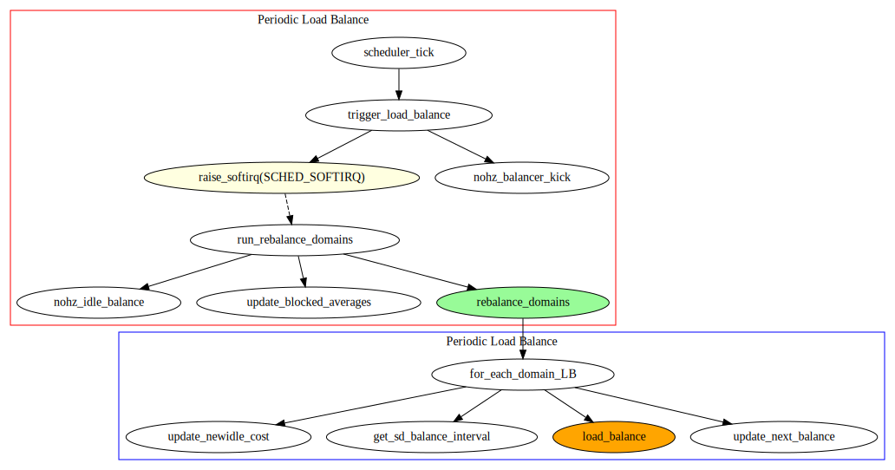
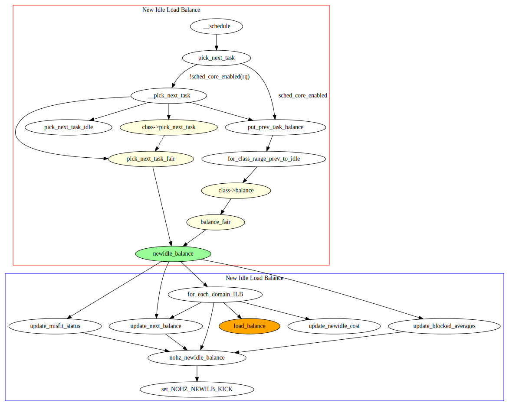
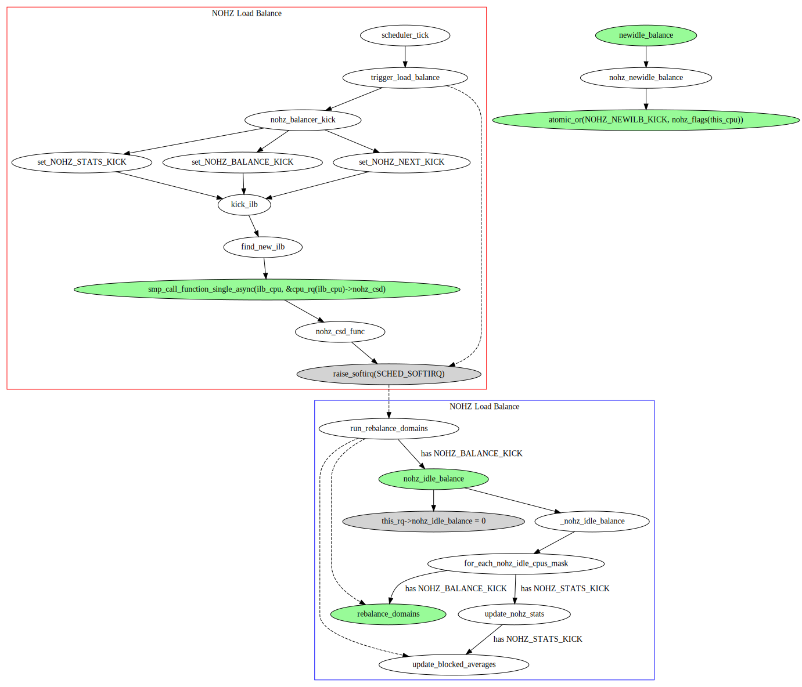
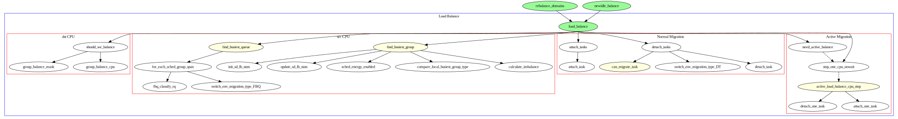
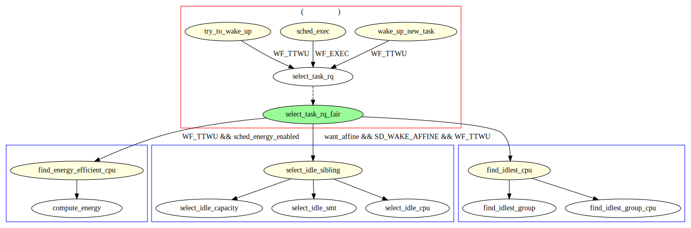

# 1 概述
-------

*	主动 Load Balancing

1.	CFS 负载均衡器周期性的检查系统的负载均衡状态, 然后从 busy CPU 上拉取任务出来, 使系统跟均衡.

2.	但是要想让系统中的 Newly Idle CPU, 能够躁动起来, 就需要借助 Idle Load Balance.

3.	而对于进入 NOHZ 状态的 IDLE CPU, 只能寄希望于 NOHZ Idle Load Balance 通过 KICK 将其唤醒.

| 均衡器 | 描述 |
|:----:|:----:|
| 周期性负载均衡 (periodic load balance 或者 tick load balance | 在 TICK 中, 周期性的检测系统的负载均衡状况, 依次遍历每层调度域, 自底向上进行负载均衡. 通过 find_busiest_group() 找到系统中负载最重的 sched_group, 通过 find_busiest_group() 找到其中最繁忙的 CPU, 将其上的 RUNNABLE(甚至是 RUNNING) 任务拉到本 CPU 以便让系统的负载处于均衡的状态. 为了避免每层调度域负载均衡过于频繁, 通常在 sched_group 内第一个 IDLE 的 CPU 上执行, 参见 should_we_balance(), 同时通过 sd->balance_interval 限制出发间隔.  |
| New Idle Load Balance | 当 CPU 上没有任务执行即将进入 IDLE 状态的时候, 是执行 Load Balance 非常合适的时机. 这时候看看其他 CPU 是否需要帮忙, 从 BUSY 的 CPU 上拉取任务, 可以让整个系统的负载处于更加均衡的状态. |
| NOHZ Idle Load Balance | 其他的 CPU 已经进入 NOHZ IDLE 状态, 不太可能触发 TICK 进行周期性负载均衡, 但是本 CPU 上任务又太重, 此时则需要通过 IPI KICK 其他 IDLE 的 CPU, 唤醒它来进行负载均衡. |

*	被动 Load Balancing

4.	除了 CFS 本身 PULL 机制的主动 Load Balance 之外, 可以认为: 所有 select_task_rq 的时机都是一次隐含的 LoadBalance. 因此选核决策本身, 也需要考虑一定的负载均衡决策.

| 时机 | 描述 |
|:---:|:----:|
| WF_FORK | 每次 FORK 后, wake_up_new_task() 唤醒新创建的进程时, 会为进程选择一次 CPU. |
| WF_EXEC | 每次一个进程执行 exec 后, sched_exec() 中会为新进程重新选核. |
| WF_TTWU | 每次 try_to_wake_up() 唤醒进程时, 为重新为进程选核. |

# 2 SMP NICE 的 Load Balancing
-------

## 2.1 Periodic Load Balance
-------

| 背景 | 描述 | 参考 |
|:---:|:----:|:---:|
| 为什么需要 Periodic Load Balance | 周期性地检查系统的负载均衡情况, 必要时执行负载均衡. | trigger_load_balance() |
| 哪些 CPU 触发/执行 NOHZ Load Balance | 通常是 sched_group 域内第一个 IDLE CPU. 没有没有 IDLE CPU, 则由 sched_group 的第一个 CPU 来完成. | should_we_balance() |
| 如何触发 Periodic Load Balance | TICK 中通过发送 SCHED_SOFTIRQ 的软中断来处理, 最终执行 run_rebalance_domains(). | run_rebalance_domains() |
| 如何进行 Periodic Load Balance | 自底向上遍历所有调度域, 对所有配置了调度域, 依次执行 load_balance(). | rebalance_domain() |

## 2.2 New Idle Load Balance
-------

| 背景 | 描述 | 参考 |
|:---:|:----:|:---:|
| 为什么需要 New Idle Load Balance? | 为了保持系统吞吐量最大化, 那么当 CPU 即将 IDLE 时, 尝试从其他 BUSY CPU 上 PULL 任务出来时一个非常合适的主动 Load Balance 时机. 但是在每次 CPU NEWLY IDLE 时都进行 Idle Balancing 又时非常不合适的. 因此如果该 CPU 平均 IDLE 时间非常短, CPU 本身很快就会被任务重新唤醒, 这时当 CPU 重新回来执行的任务的时候, 还是 cache hot 的, 如果从其他 CPU 上拉取任务, 那么这些新的任务会破坏当前 CPU 上原来任务的 cache 状态. 更进一步此时被唤醒的任务不得不出现 RUNNABLE, 甚至迁移, 这都无疑会影响系统的性能. | NA |
| 哪些 CPU 触发/执行 NOHZ Load Balance | 没有任务执行, 即将进入 IDLE 状态的 CPU 作为 src_cpu. 系统中繁忙的 CPU 作为 dst_cpu. | newidle_balance() |
| 如何触发 New Idle Load Balance | 以下情况下 IDLE CPU 不会执行 Idle Balancing. 1. 如果 CPU 上有 ttwu_pending, 则其马上就会被唤醒. 2. 如果当前 IDLE CPU 的历史平均 IDLE 时间 avg_idle 比系统整体的 newidle 开销 max_newidle_lb_cost 要小, 说明做 Idle Balancing, 收益不大. 任务都还没有 PULL 过来, CPU 就被唤醒了已经. 3. root_domain 需要 overload, 如果 CPU 上大于 1 个 runnable task, 即该 CPU 上有等待执行的任务. 或者只有一个正在运行的任务, 但是是 misfit task. 则会对应设置 sched_group 为 SG_OVERLOAD, 继而 root_domain 被认为是 overload. | newidle_balance() |
| 如何进行 New Idle Load Balance | 从当前 newly IDLE 的 CPU, 自底向上遍历所有调度域, 对所有配置了 SD_BALANCE_NEWIDLE 的调度域, 依次执行 load_balance(). | newidle_balance() |

## 2.3 NOHZ Load Balance
-------

| 背景 | 描述 | 参考 |
|:---:|:----:|:---:|
| 为什么需要 NOHZ Load Balance? | 如果 CPU 进入 IDLE 状态之后仍然有周期性的 TICK, 那么通过周期性负载均衡就能完成负载均衡了. 但是如果内核配置了 NOHZ, 那么 CPU 进入 IDLE 状态后, TICK 也会被停掉. 这就造成周期性负载均衡不会触发. 不需要 IPI 来唤醒 idle 的 CPU. 和周期性均衡一样, NOHZ idle load balance 也是通过 busy CPU 上 tick 驱动的, 如果需要 kick idle load balancer, 那么就会通过 GIC 发送一个 ipi 中断给选中的 idle CPU, 让它代表系统所有的 idle CPU 们进行负载均衡. | NA |
| 哪些 CPU 触发 NOHZ Load Balance | TICK 中触发周期性负载均衡之前, 检查是否需要进行 NOHZ KICK, 唤醒一个 IDLE CPU 来帮忙做 Load Balancing. | trigger_load_balance() ->nohz_balancer_kick() ->kick_ilb() |
| 如何触发 NOHZ Load Balance | BUSY 的 CPU 会 KICK ILB owner, 通过 IPI 发送 SCHED_SOFTIRQ. 并标记 ILB owner 的 rq->nohz_idle_balance. | nohz_csd_func() ->raise_softirq_irqoff(SCHED_SOFTIRQ) |
| 哪些 CPU 执行 NOHZ Load Balance | 会寻找一个 IDLE 的 CPU, 作为 ILB owner 来执行. 通常为 nohz.idle_cpus_mask 记录的第一个 IDLE CPU. | find_new_ilb() |
| 如何进行 NOHZ Load Balance | ILB owner 接收到 SCHED_SOFTIRQ 后, 触发 run_rebalance_domains() 时会检查是否需要进行 nohz_idle_balance(). | run_rebalance_domains() ->nohz_idle_balance(). |

## 2.4 Load Balance 的核心主体
-------

## 2.5 Passive Load Balancing
-------

| 均衡器 | 描述 | 选核 select_task_rq_fair() 标记的 FLAG | 执行均衡决策时的 FLAG |
|:-----:|:----:|:--------:|:--------:|
| FORK 均衡 | 创建任务时, 确定任务是在父任务运行的 CPU 上执行, 还是迁移到其他 CPU. | 如果可能, 请选择具有缓存亲和力的 CPU 或 IDLE CPU, 否则将迁移到 CPU 负载较低的 CPU 运行. 在 wake_up_new_task() 函数中使用 SD_BALANCE_FORK 标志调用它. | WF_FORK | SD_BALANCE_FORK |
| EXEC 平衡 | 进程执行 exec, 加载新程序空间, 运行新任务时, 确定任务是从现有 CPU 执行还是迁移到其他 CPU. 如果可能. 请选择具有缓存亲和力的 cpu 或 idle cpu，否则将迁移到 CPU 负载较低的 cpu 运行. 迁移到其他 cpu 时使用混合线程. 在 sched_exec() 函数中使用 SD_BALANCE_EXEC 标志. | WF_EXEC | SD_BALANCE_EXEC |
| WAKEUP 平衡 | 确定在 idle 任务唤醒时是从唤醒的 CPU 执行还是迁移到其他 IDLE CPU. 在 try_to_wake_up() 中使用 SD_BALANCE_WAKE 标志. | WF_TTWU | SD_BALANCE_WAKE |

# 3 能效感知的 Load Balancing 决策
-------

# X 扩展阅读
-------

| 文档 | 描述 |
|:---:|:----:|
| [内核工匠 - 负载均衡情景分析](https://blog.csdn.net/feelabclihu/article/details/112057633) | 介绍 CFS 负载均衡的基础框架核原理. |
| [jakeisname 的博客专栏](http://jake.dothome.co.kr/scheduler) | 韩国内核开发者 jakeisname 的博客专栏. |