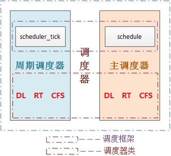

Linux进程负荷权重
=======


| 日期 | 内核版本 | 架构| 作者 | GitHub| CSDN |
| ------- |:-------:|:-------:|:-------:|:-------:|:-------:|
| 2016-06-14 | [Linux-4.6](http://lxr.free-electrons.com/source/?v=4.6) | X86 & arm | [gatieme](http://blog.csdn.net/gatieme) | [LinuxDeviceDrivers](https://github.com/gatieme/LDD-LinuxDeviceDrivers) | [Linux进程管理与调度](http://blog.csdn.net/gatieme/article/category/6225543) |


前面我们详细的了解了linux下进程优先级的表示以及其计算的方法, 我们了解到linux针对普通进程和实时进程分别使用静态优先级static_prio和实时优先级rt_priority来指定其默认的优先级别, 然后通过normal_prio函数将他们分别转换为普通优先级normal_prio, 最终换算出动态优先级prio, 动态优先级prio才是内核调度时候有限考虑的优先级字段

但是CFS完全公平调度器在调度进程的时候, 进程的重要性不仅是由优先级指定的, 而且还需要考虑保存在task_struct->se.load的负荷权重.


#前景回顾
-------


##进程调度
-------

内存中保存了对每个进程的唯一描述, 并通过若干结构与其他进程连接起来.

**调度器**面对的情形就是这样, 其任务是在程序之间共享CPU时间, 创造并行执行的错觉, 该任务分为两个不同的部分, 其中一个涉及**调度策略**, 另外一个涉及**上下文切换**.


内核必须提供一种方法, 在各个进程之间尽可能公平地共享CPU时间, 而同时又要考虑不同的任务优先级.

调度器的一般原理是, 按所需分配的计算能力, 向系统中每个进程提供最大的公正性, 或者从另外一个角度上说, 他试图确保没有进程被亏待.


##进程的分类
-------

linux把进程区分为实时进程和非实时进程, 其中非实时进程进一步划分为交互式进程和批处理进程

| 类型 | 描述 | 示例 |
| ------- |:-------:|:-------:|:-------:|
| 交互式进程(interactive process) | 此类进程经常与用户进行交互, 因此需要花费很多时间等待键盘和鼠标操作. 当接受了用户的输入后, 进程必须很快被唤醒, 否则用户会感觉系统反应迟钝 | shell, 文本编辑程序和图形应用程序 |
| 批处理进程(batch process) | 此类进程不必与用户交互, 因此经常在后台运行. 因为这样的进程不必很快相应, 因此常受到调度程序的怠慢 | 程序语言的编译程序, 数据库搜索引擎以及科学计算 |
| 实时进程(real-time process) | 这些进程由很强的调度需要, 这样的进程绝不会被低优先级的进程阻塞. 并且他们的响应时间要尽可能的短 | 视频音频应用程序, 机器人控制程序以及从物理传感器上收集数据的程序|


##不同进程采用不同的调度策略
-------

根据进程的不同分类Linux采用不同的调度策略.

对于实时进程，采用FIFO, Round Robin或者Earliest Deadline First (EDF)最早截止期限优先调度算法|的调度策略.

但是普通进程的调度策略就比较麻烦了, 因为普通进程不能简单的只看优先级, 必须公平的占有CPU, 否则很容易出现进程饥饿, 这种情况下用户会感觉操作系统很卡, 响应总是很慢，因此在linux调度器的发展历程中经过了多次重大变动, linux总是希望寻找一个最接近于完美的调度策略来公平快速的调度进程.


##linux调度器的演变
-------


一开始的调度器是复杂度为**$O(n)$的始调度算法**(实际上每次会遍历所有任务，所以复杂度为O(n)), 这个算法的缺点是当内核中有很多任务时，调度器本身就会耗费不少时间，所以，从linux2.5开始引入赫赫有名的**$O(1)$调度器**

然而，linux是集全球很多程序员的聪明才智而发展起来的超级内核，没有最好，只有更好，在$O(1)$调度器风光了没几天就又被另一个更优秀的调度器取代了，它就是**CFS调度器Completely Fair Scheduler**. 这个也是在2.6内核中引入的，具体为2.6.23，即从此版本开始，内核使用CFS作为它的默认调度器，$O(1)$调度器被抛弃了, 其实CFS的发展也是经历了很多阶段，最早期的楼梯算法(SD), 后来逐步对SD算法进行改进出RSDL(Rotating Staircase Deadline Scheduler), 这个算法已经是"完全公平"的雏形了， 直至CFS是最终被内核采纳的调度器, 它从RSDL/SD中吸取了完全公平的思想，不再跟踪进程的睡眠时间，也不再企图区分交互式进程。它将所有的进程都统一对待，这就是公平的含义。CFS的算法和实现都相当简单，众多的测试表明其性能也非常优越


| 字段 | 版本 |
| ------------- |:-------------:|:-------------:|
| O(n)的始调度算法 | linux-0.11~2.4 |
| O(1)调度器 | linux-2.5 |
| CFS调度器 | linux-2.6~至今 |


##Linux的调度器组成
-------


**2个调度器**

可以用两种方法来激活调度

*	一种是直接的, 比如进程打算睡眠或出于其他原因放弃CPU

*	另一种是通过周期性的机制, 以固定的频率运行, 不时的检测是否有必要

因此当前linux的调度程序由两个调度器组成：**主调度器**，**周期性调度器**(两者又统称为**通用调度器(generic scheduler)**或**核心调度器(core scheduler)**)

并且每个调度器包括两个内容：**调度框架**(其实质就是两个函数框架)及**调度器类**


**6种调度策略**

linux内核目前实现了6中调度策略(即调度算法), 用于对不同类型的进程进行调度, 或者支持某些特殊的功能

*	SCHED_NORMAL和SCHED_BATCH调度普通的非实时进程

*	SCHED_FIFO和SCHED_RR和SCHED_DEADLINE则采用不同的调度策略调度实时进程

*	SCHED_IDLE则在系统空闲时调用idle进程.


**5个调度器类**

而依据其调度策略的不同实现了5个调度器类, 一个调度器类可以用一种种或者多种调度策略调度某一类进程, 也可以用于特殊情况或者调度特殊功能的进程.


其所属进程的优先级顺序为
````c
stop_sched_class -> dl_sched_class -> rt_sched_class -> fair_sched_class -> idle_sched_class
```

**3个调度实体**

调度器不限于调度进程, 还可以调度更大的实体, 比如实现组调度.

这种一般性要求调度器不直接操作进程, 而是处理可调度实体, 因此需要一个通用的数据结构描述这个调度实体,即seched_entity结构, 其实际上就代表了一个调度对象，可以为一个进程，也可以为一个进程组.

linux中针对当前可调度的实时和非实时进程, 定义了类型为seched_entity的3个调度实体

*	sched_dl_entity 采用EDF算法调度的实时调度实体

*	sched_rt_entity 采用Roound-Robin或者FIFO算法调度的实时调度实体 

*	sched_entity 采用CFS算法调度的普通非实时进程的调度实体


**调度器整体框架**

每个进程都属于某个调度器类(由字段task_struct->sched_class标识), 由调度器类采用进程对应的调度策略调度(由task_struct->policy )进行调度, task_struct也存储了其对应的调度实体标识

linux实现了6种调度策略, 依据其调度策略的不同实现了5个调度器类, 一个调度器类可以用一种或者多种调度策略调度某一类进程, 也可以用于特殊情况或者调度特殊功能的进程.


| 调度器类 | 调度策略 |  调度策略对应的调度算法 | 调度实体 | 调度实体对应的调度对象 |
| ------- |:-------:|:-------:|:-------:||:-------:|
| stop_sched_class | 无 | 无 | 无 | 特殊情况, 发生在cpu_stop_cpu_callback 进行cpu之间任务迁移migration或者HOTPLUG_CPU的情况下关闭任务 |
| dl_sched_class | SCHED_DEADLINE | Earliest-Deadline-First最早截至时间有限算法 | sched_dl_entity | 采用DEF最早截至时间有限算法调度实时进程 |
| rt_sched_class | SCHED_RR<br><br>SCHED_FIFO | Roound-Robin时间片轮转算法<br><br>FIFO先进先出算法 | sched_rt_entity | 采用Roound-Robin或者FIFO算法调度的实时调度实体 |
| fair_sched_class | SCHED_NORMAL<br><br>SCHED_BATCH | CFS完全公平懂调度算法 |sched_entity | 采用CFS算法普通非实时进程 |
| idle_sched_class | SCHED_IDLE | 无 | 无 |特殊进程, 用于cpu空闲时调度空闲进程idle |

它们的关系如下图




##优先级的内核表示
-------


内核使用一些简单的数值范围0~139表示内部优先级, 数值越低, 优先级越高。

从0~99的范围专供实时进程使用, nice的值[-20,19]则映射到范围100~139


>实时优先级范围是0到MAX_RT_PRIO-1（即99），而普通进程的静态优先级范围是从MAX_RT_PRIO到MAX_PRIO-1（即100到139）。

| 优先级范围 | 描述 |
| ------------- |:-------------:|
| 0——99 | 实时进程 |
| 100——139 | 非实时进程 |


##进程的优先级表示
-------


```c
struct task_struct
{
    /* 进程优先级
     * prio: 动态优先级，范围为100~139，与静态优先级和补偿(bonus)有关
     * static_prio: 静态优先级，static_prio = 100 + nice + 20 (nice值为-20~19,所以static_prio值为100~139)
     * normal_prio: 没有受优先级继承影响的常规优先级，具体见normal_prio函数，跟属于什么类型的进程有关
     */
    int prio, static_prio, normal_prio;
    /* 实时进程优先级 */
    unsigned int rt_priority;
}
```

**动态优先级 静态优先级 实时优先级**


其中task_struct采用了三个成员表示进程的优先级:prio和normal_prio表示动态优先级, static_prio表示进程的静态优先级.

此外还用了一个字段rt_priority保存了实时进程的优先级


| 字段 | 描述 |
| ------------- |:-------------:|
| static_prio | 用于保存静态优先级, 是进程启动时分配的优先级, ，可以通过nice和sched_setscheduler系统调用来进行修改, 否则在进程运行期间会一直保持恒定 |
| prio | 保存进程的动态优先级 |
| normal_prio | 表示基于进程的静态优先级static_prio和调度策略计算出的优先级. 因此即使普通进程和实时进程具有相同的静态优先级, 其普通优先级也是不同的, 进程分叉(fork)时, 子进程会继承父进程的普通优先级 |
| rt_priority | 用于保存实时优先级 |


实时进程的优先级用实时优先级rt_priority来表示


#负荷权重
-------


##负荷权重结构struct load_weight
-------

负荷权重用struct load_weight数据结构来表示, 保存着进程权重值weight。其定义在[/include/linux/sched.h, v=4.6, L1195](http://lxr.free-electrons.com/source/include/linux/sched.h?v=4.6#L1195), 如下所示

```c
struct load_weight {
	unsigned long weight;		/*  存储了权重的信息  */
	u32 inv_weight;					/*   存储了权重值用于重除的结果 weight * inv_weight = 2^32  */
};
```


##调度实体的负荷权重load
-------

既然struct load_weight保存着进程的权重信息, 那么作为进程调度的实体, 必须将这个权重值与特定的进程task_struct, 更一般的与通用的调度实体sched_entity相关联

struct sched_entity作为进程调度的实体信息, 其内置了load_weight结构用于保存当前调度实体的权重, 参照http://lxr.free-electrons.com/source/include/linux/sched.h?v=4.6#L1195

```c
struct sched_entity {
	struct load_weight      load;           /* for load-balancing */
	/*  ......  */
};
```

##进程的负荷权重

而进程可以被作为一个调度的实时, 其内部通过存储struct sched_entity se而间接存储了其load_weight信息, 参照http://lxr.free-electrons.com/source/include/linux/sched.h?v=4.6#L1415

```c
struct task_struct
{
	/*  ......  */
	struct sched_entity se;
    /*  ......  */
}
```

因此我们就可以通过task_statuct->se.load获取负荷权重的信息, 而set_load_weight负责根据进程类型及其静态优先级计算符合权重.


#优先级和权重的转换
-------


##优先级->权重转换表
-------


一般这个概念是这样的, 进程每降低一个nice值(优先级提升), 则多获得10%的CPU时间, 没升高一个nice值(优先级降低), 则放弃10%的CPU时间.

为执行该策略, 内核需要将优先级转换为权重值, 并提供了一张优先级->权重转换表sched_prio_to_weight, 内核不仅维护了负荷权重自身, 还保存另外一个数值, 用于负荷重除的结果, 即sched_prio_to_wmult数组, 这两个数组中的数据是一一对应的.


其中相关的数据结构定义在[kernel/sched/sched.h?v=4.6, L1132](http://lxr.free-electrons.com/source/kernel/sched/sched.h?v=4.6#L1132)

```c
//   http://lxr.free-electrons.com/source/kernel/sched/sched.h?v=4.6#L1132
/*
 * To aid in avoiding the subversion of "niceness" due to uneven distribution
 * of tasks with abnormal "nice" values across CPUs the contribution that
 * each task makes to its run queue's load is weighted according to its
 * scheduling class and "nice" value. For SCHED_NORMAL tasks this is just a
 * scaled version of the new time slice allocation that they receive on time
 * slice expiry etc.
 */


#define WEIGHT_IDLEPRIO                3			  /*  SCHED_IDLE进程的负荷权重  */
#define WMULT_IDLEPRIO         1431655765	/*  SCHED_IDLE进程负荷权重的重除值  */


extern const int sched_prio_to_weight[40];
extern const u32 sched_prio_to_wmult[40];


// http://lxr.free-electrons.com/source/kernel/sched/core.c?v=4.6#L8484
/*
* Nice levels are multiplicative, with a gentle 10% change for every
* nice level changed. I.e. when a CPU-bound task goes from nice 0 to
* nice 1, it will get ~10% less CPU time than another CPU-bound task
* that remained on nice 0.
*
* The "10% effect" is relative and cumulative: from _any_ nice level,
* if you go up 1 level, it's -10% CPU usage, if you go down 1 level
* it's +10% CPU usage. (to achieve that we use a multiplier of 1.25.
* If a task goes up by ~10% and another task goes down by ~10% then
* the relative distance between them is ~25%.)
*/
const int sched_prio_to_weight[40] = {
/* -20 */     88761,     71755,     56483,     46273,     36291,
/* -15 */     29154,     23254,     18705,     14949,     11916,
/* -10 */      9548,      7620,      6100,      4904,      3906,
/*  -5 */      3121,      2501,      1991,      1586,      1277,
/*   0 */      1024,       820,       655,       526,       423,
/*   5 */       335,       272,       215,       172,       137,
/*  10 */       110,        87,        70,        56,        45,
/*  15 */        36,        29,        23,        18,        15,
};


/*
* Inverse (2^32/x) values of the sched_prio_to_weight[] array, precalculated.
*
* In cases where the weight does not change often, we can use the
* precalculated inverse to speed up arithmetics by turning divisions
* into multiplications:
*/
const u32 sched_prio_to_wmult[40] = {
/* -20 */     48388,     59856,     76040,     92818,    118348,
/* -15 */    147320,    184698,    229616,    287308,    360437,
/* -10 */    449829,    563644,    704093,    875809,   1099582,
/*  -5 */   1376151,   1717300,   2157191,   2708050,   3363326,
/*   0 */   4194304,   5237765,   6557202,   8165337,  10153587,
/*   5 */  12820798,  15790321,  19976592,  24970740,  31350126,
/*  10 */  39045157,  49367440,  61356676,  76695844,  95443717,
/*  15 */ 119304647, 148102320, 186737708, 238609294, 286331153,
};
```

对内核使用的范围[-20, 19]中的每个nice级别, sched_prio_to_weight数组都有一个对应项

nice [-20, 19] -=> 下标 [0, 39]

而由于权重`weight` 用`unsigned long` 表示, 因此内核无法直接存储1/weight, 而必须借助于乘法和位移来执行除法的技术. sched_prio_to_wmult数组就存储了这些值, 即sched_prio_to_wmult每个元素的值是2^32/prio_to_weight$每个元素的值.

可以验证

$$sched\_prio\_to\_wmult[i] = \frac{2^{32}}{sched\_prio\_to\_weight[i]}$$

同时我们可以看到其定义了两个宏WEIGHT_IDLEPRIO和WMULT_IDLEPRIO这两个宏对应的就是SCHED_IDLE调度的进程的负荷权重信息, 因为要保证SCHED_IDLE进程的最低优先级和最低的负荷权重. 这点信息我们可以在后面分析set_load_weight函数的时候可以看到

可以验证

$$\frac{2^{32}}{WEIGHT_IDLEPRIO} = WMULT_IDLEPRIO$$


##linux-4.4之前的shced_prio_to_weight和sched_prio_to_wmult
-------

关于优先级->权重转换表sched_prio_to_weight

在linux-4.4之前的内核中, 优先级权重转换表用prio_to_weight表示, 定义在[kernel/sched/sched.h, line 1116](http://lxr.free-electrons.com/source/kernel/sched/sched.h?v=4.4#L1116), 与它一同定义的还有prio_to_wmult, 在[kernel/sched/sched.h, line 1139](http://lxr.free-electrons.com/source/kernel/sched/sched.h?v=4.4#L1139)
均被定义为static const

但是其实这种能够方式不太符合规范的编码风格, 因此常规来说, 我们的头文件中不应该存储结构的定义, 即为了是程序的模块结构更加清晰, 头文件中尽量只包含宏或者声明, 而将具体的定义， 需要分配存储空间的代码放在源文件中.

否则如果在头文件中定义全局变量，并且将此全局变量赋初值，那么在多个引用此头文件的C文件中同样存在相同变量名的拷贝，关键是此变量被赋了初值，所以编译器就会将此变量放入DATA段，最终在连接阶段，会在DATA段中存在多个相同的变量，它无法将这些变量统一成一个变量，也就是仅为此变量分配一个空间，而不是多份空间，假定这个变量在头文件没有赋初值，编译器就会将之放入BSS段，连接器会对BSS段的多个同名变量仅分配一个存储空间

因此在新的内核中, 内核黑客们将这两个变量存放在了[kernel/sched/core.c](http://lxr.free-electrons.com/source/kernel/sched/core.c?v=4.6#L8472), 并加上了sched_前缀, 以表明这些变量是在进程调度的过程中使用的, 而在[kernel/sched/sched.h, line 1144](http://lxr.free-electrons.com/source/kernel/sched/sched.h?v=4.6#L1144)中则只包含了他们的声明.


下面我们列出优先级权重转换表定义更新后对比项


| 内核版本 | 实现 | 地址 |
| ------------- |:-------------:|:-------------:|
| <= linux-4.4 | static const int prio_to_weight[40] |  [kernel/sched/sched.h, line 1116](http://lxr.free-electrons.com/source/kernel/sched/sched.h?v=4.4#L1116) |
| >=linux-4.5 | const int sched_prio_to_weight[40] | 声明在[kernel/sched/sched.h, line 1144](http://lxr.free-electrons.com/source/kernel/sched/sched.h?v=4.6#L1144), 定义在[kernel/sched/core.c](http://lxr.free-electrons.com/source/kernel/sched/core.c?v=4.6#L8472)

其定义并没有发生变化, 依然是一个一对一NICE to WEIGHT的转换表


##1.25的乘积因子
-------


各数组之间的乘积因子是1.25. 要知道为何使用该因子, 可考虑下面的例子

两个进程A和B在nice级别0, 即静态优先级120运行, 因此两个进程的CPU份额相同, 都是50%, nice级别为0的进程, 查其权重表可知是1024. 每个进程的份额是1024/(1024+1024)=0.5, 即50%

如果进程B的优先级+1(优先级降低), 成为nice=1, 那么其CPU份额应该减少10%, 换句话说进程A得到的总的CPU应该是55%, 而进程B应该是45%. 优先级增加1导致权重减少, 即1024/1.25=820, 而进程A仍旧是1024, 则进程A现在将得到的CPU份额是1024/(1024+820=0.55, 而进程B的CPU份额则是820/(1024+820)=0.45. 这样就正好产生了10%的差值.


#进程负荷权重的计算
-------


set_load_weight负责根据非实时进程类型极其静态优先级计算符合权重
而实时进程不需要CFS调度, 因此无需计算其负荷权重值


>早期的代码中实时进程也是计算其负荷权重的, 但是只是采用一些方法保持其权重值较大
>
>在早期有些版本中, set_load_weight中实时进程的权重是普通进程的两倍, 后来又设置成0, 直到后来linux-2.6.37开始不再设置实时进程的优先级, 因此这本身就是一个无用的工作
>
>而另一方面, SCHED_IDLE进程的权值总是非常小, 普通非实时进程则根据其静态优先级设置对应的负荷权重


##set_load_weight依据静态优先级设置进程的负荷权重
-------


```c
static void set_load_weight(struct task_struct *p)
{
	/*  由于数组中的下标是0~39, 普通进程的优先级是[100~139]
         因此通过static_prio - MAX_RT_PRIO将静态优先级转换成为数组下标
    */
    int prio = p->static_prio - MAX_RT_PRIO;
    /*  取得指向进程task负荷权重的指针load,
         下面修改load就是修改进程的负荷权重  */
    struct load_weight *load = &p->se.load;

    /*
     * SCHED_IDLE tasks get minimal weight:
     * 必须保证SCHED_IDLE进程的负荷权重最小
     * 其权重weight就是WEIGHT_IDLEPRIO
     * 而权重的重除结果就是WMULT_IDLEPRIO
     */
    if (p->policy == SCHED_IDLE) {
        load->weight = scale_load(WEIGHT_IDLEPRIO);
        load->inv_weight = WMULT_IDLEPRIO;
        return;
    }

    /*  设置进程的负荷权重weight和权重的重除值inv_weight  */
    load->weight = scale_load(prio_to_weight[prio]);
    load->inv_weight = prio_to_wmult[prio];
}
```

##scale_load取得负荷权重的值
-------

其中scale_load是一个宏, 定义在[include/linux/sched.h, line 785](http://lxr.free-electrons.com/source/include/linux/sched.h?v=3.9?v=4.6#L785)


```c
#if 0 /* BITS_PER_LONG > 32 -- currently broken: it increases power usage under light load  */
# define SCHED_LOAD_RESOLUTION  10
# define scale_load(w)          ((w) << SCHED_LOAD_RESOLUTION)
# define scale_load_down(w)     ((w) >> SCHED_LOAD_RESOLUTION)
#else
# define SCHED_LOAD_RESOLUTION  0
# define scale_load(w)          (w)
# define scale_load_down(w)     (w)
#endif
```

我们可以看到目前版本的scale_load其实什么也没做就是简单取了个值, 但是我们注意到负荷权重仍然保留了SCHED_LOAD_RESOLUTION不为0的情形, 只不过目前因为效率原因和功耗问题没有启用而已


##set_load_weight的演变
-------

linux内核的调度器经过了不同阶段的发展, 但是即使是同一个调度器其算法也不是一成不变的, 也在不停的改进和优化

| 内核版本 | 实现 | 地址 |
| ------------- |:-------------:|:-------------:|
| 2.6.18~2.6.22 | 实时进程的权重用RTPRIO_TO_LOAD_WEIGHT(p->rt_priority);转换 | [kernel/sched.c#L746](http://lxr.linux.no/linux+v2.6.18/kernel/sched.c#L746) |
| 2.6.23~2.6.34 |  实时进程的权重为非实时权重的二倍 | [kernel/sched.c#L1836](http://lxr.linux.no/linux+v2.6.32/kernel/sched.c#1836) |
| 2.6.35~2.6.36| 实时进程的权重设置为0, 重除值设置为WMULT_CONST | [kernel/sched.c, L1859](http://lxr.linux.no/linux+v2.6.36/kernel/sched.c#L1859) |
| 2.6.37~至今4.6 | 实时进程不再设置权重 | 其中<= linux-3.2时, 代码在sched.c中<br>3.3~4.4之后, 增加了[sched/core.c](http://lxr.linux.no/linux+v4.4/kernel/sched/core.c#L812)文件调度的核心代码在此存放<br>4.5~至今, [修改prio_to_weight为sched_prio_to_weight](http://lxr.linux.no/linux+v4.5/kernel/sched/core.c#L813), 并将声明存放头文件中 |
#就绪队列的负荷权重
-------

不仅进程, 就绪队列也关联到一个负荷权重. 这个我们在前面讲[Linux进程调度器的设计--Linux进程的管理与调度(十七）](http://blog.csdn.net/gatieme/article/details/51702662)的时候提到过了在cpu的就绪队列rq和cfs调度器的就绪队列cfs_rq中都保存了其load_weight.

这样不仅确保就绪队列能够跟踪记录有多少进程在运行, 而且还能将进程的权重添加到就绪队列中.


##cfs就绪队列的负荷权重
-------

```c
//  http://lxr.free-electrons.com/source/kernel/sched/sched.h?v=4.6#L596
struct rq
{
	/*  ......  */
    /* capture load from *all* tasks on this cpu: */
    struct load_weight load;
	/*  ......  */
};

//  http://lxr.free-electrons.com/source/kernel/sched/sched.h?v=4.6#L361
/* CFS-related fields in a runqueue */
struct cfs_rq
{
	struct load_weight load;
	unsigned int nr_running, h_nr_running;
	/*  ......  */
};

//  http://lxr.free-electrons.com/source/kernel/sched/sched.h?v=4.6#L596
struct rt_rq中不需要负荷权重

//  http://lxr.free-electrons.com/source/kernel/sched/sched.h?v=4.6#L490
struct dl_rq中不需要负荷权重
```

由于负荷权重仅用于调度普通进程(非实时进程), 因此只在cpu的就绪队列队列rq和cfs调度器的就绪队列cfs_rq上需要保存其就绪队列的信息, 而实时进程的就绪队列rt_rq和dl_rq
是不需要保存负荷权重的.


##就绪队列的负荷权重计算
-------


就绪队列的负荷权重存储的其实就是队列上所有进程的负荷权重的总和, 因此每次进程被加到就绪队列的时候,  就需要在就绪队列的负荷权重中加上进程的负荷权重, 同时由于就绪队列的不是一个单独被调度的实体, 也就不需要优先级到负荷权重的转换, 因而其不需要负荷权重的重除字段, 即inv_weight = 0;

因此进程从就绪队列上入队或者出队的时候, 就绪队列的负荷权重就加上或者减去进程的负荷权重, 但是


```c
//struct load_weight {
	/*  就绪队列的负荷权重 +/-   入队/出队进程的负荷权重  */
	unsigned long weight +/- task_struct->se->load->weight;
    /*  就绪队列负荷权重的重除字段无用途，所以始终置0  */
	u32 inv_weight = 0;
//};
```

因此内核为我们提供了增加/减少/重置就绪队列负荷权重的的函数, 分别是update_load_add, update_load_sub, update_load_set

```c
/* 使得lw指向的负荷权重的值增加inc, 用于进程进入就绪队列时调用
 *  进程入队	account_entity_enqueue    kernel/sched/fair.c#L2422
 */

static inline void update_load_add(struct load_weight *lw, unsigned long inc)
{
    lw->weight += inc;
    lw->inv_weight = 0;
}

/*  使得lw指向的负荷权重的值减少inc, 用于进程调出就绪队列时调用
 *  进程出队	account_entity_dequeue    kernel/sched/fair.c#L2422*/
static inline void update_load_sub(struct load_weight *lw, unsigned long dec)
{
    lw->weight -= dec;
    lw->inv_weight = 0;
}

static inline void update_load_set(struct load_weight *lw, unsigned long w)
{
    lw->weight = w;
    lw->inv_weight = 0;
}
````


| 函数 | 描述 | 调用时机 | 定义位置 | 调用位置 |
| ------------- |:-------------:|:-------------:|
| update_load_add | 使得lw指向的负荷权重的值增加inc | 用于进程进入就绪队列时调用 | [kernel/sched/fair.c, L117](http://lxr.free-electrons.com/source/kernel/sched/fair.c?v=4.6#L117) | [account_entity_enqueue两处](http://lxr.free-electrons.com/source/kernel/sched/fair.c?v=4.6#L2420), [sched_slice](http://lxr.free-electrons.com/source/kernel/sched/fair.c?v=4.6#L640) |
| update_load_sub | 使得lw指向的负荷权重的值减少inc | 用于进程调出就绪队列时调用 |  [update_load_sub, L123](http://lxr.free-electrons.com/source/kernel/sched/fair.c?v=4.6#L123) | [account_entity_dequeue两处](http://lxr.free-electrons.com/source/kernel/sched/fair.c?v=4.6#L2437) |
| update_load_set |


>其中sched_slice函数计算当前进程在调度延迟内期望的运行时间, 它根据cfs就绪队列中进程数确定一个最长时间间隔，然后看在该时间间隔内当前进程按照权重比例执行


#总结
-------


**负荷权重load_weight**
CFS完全公平调度器在调度非实时进程的时候, 进程的重要性不仅是由优先级指定的, 还需要考虑保存在task_struct->se.load的负荷权重.


**转换表prio_to_weight和重除表ched_prio_to_wmult**
这个负荷权重用struct load_weight, 其包含了名为weight的负荷权重信息, 为了方便快速的将静态优先级转换成权重值, 内核提供了一个长为40的prio_to_weight数组方便转换, 静态优先级[100~139], 对应nice值[-20, 19], 对应数组中的下标[0, 39]

由于权重`weight` 用`unsigned long` 表示, 因此内核无法直接存储1/weight, 而必须借助于乘法和位移来执行除法的技术. sched_prio_to_wmult数组就存储了这些值, 即sched_prio_to_wmult每个元素的值是2^32/prio_to_weight$每个元素的值.


对于SCHED_IDLE进程其优先级最低, 因此其负荷权重也要尽可能的小, 因此内核用WEIGHT_IDLEPRIO( = 3)和WMULT_IDLEPRIO分别表示了SCHED_IDLE进程的负荷权重和重除值.


**调度实体负荷权重的计算**

>既然CFS把负荷权重作为进程调度的一个重要依据, 那么我们就需要了解调度器是如何计算进程或者调度实体的负荷权重的.


有了prio_to_weight和ched_prio_to_wmult这两个转换表, 我们就可以很方便的将非实时进程的静态优先级转换成负荷权重, 这个其实就是一个很简单的查表得过程, 内核用set_load_weight完成这个工作, 同时也保证了SCHED_LDLE进程的负荷权重最小


*	将进程的静态优先级[100, 139]转换成数组下标[0, 39]

*	如果进程是SCHED_IDLE调度, 则负荷权重直赋值为WEIGHT_IDLEPRIO( = 3)和WMULT_IDLEPRIO

*	对于普通进程, 从prio_to_weight和sched_prio_to_wmult中查找出对应优先级的负荷权重值和重除值


现在的内核中是实时进程是不依靠负荷权重的, 因此也就不需要计算实时进程的负荷权重, 但是早期的内核中实时进程的负荷权重设置为普通进程的两倍, 以保证权重比非实时进程大

**调度实体的负荷权重**

既然load_weight保存着进程的权重信息, 那么作为进程调度的实体, 必须将这个权重值与特定的进程task_struct, 更一般的与通用的调度实体sched_entity相关联

sched_entity作为进程调度的实体信息, 其内置了load_weight结构用于保存当前调度实体的权重, [参照](http://lxr.free-electrons.com/source/include/linux/sched.h?v=4.6#L1195)


同时进程作为调度实体的最一般单位, 其load_weight就存储在其struct sched_entity *se成员中, 可以通过task_struct->se.load访问进程的负荷权重.


**就绪队列的负荷权重**

然后内核也在全局cpu就绪队列rq中cfs的就绪队列cfs_rq中保存了load_weight, 这就可以很方便的统计出整个就绪队列的负荷权重总和, 为进程调度提供参考, 因此在每次进程入队或者出队的时候就需要通过修改就绪队列的负荷权重, 内核为我们提供了增加/减少/重置就绪队列负荷权重的的函数, 分别是update_load_add, update_load_sub, update_load_set, 而由于就绪队列的负荷权重只关心权重值, 因此其重除字段inv_weight恒为0

同时需要**注意**的是, 由于实时进程不依赖于负荷权重的, 因此实时进程的就绪队列rt_qt和dl_rq中不需要存储load_weight.


