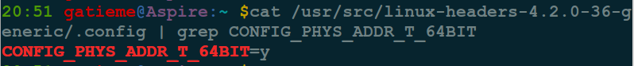

| 日期 | 内核版本 | 架构| 作者 | GitHub| CSDN |
| ------------- |:-------------:|:-------------:|:-------------:|:-------------:|:-------------:|
| 2016-07-21  | [Linux-4.7](http://lxr.free-electrons.com/source/?v=4.7) | X86 & arm | [gatieme](http://blog.csdn.net/gatieme) | [LinuxDeviceDrivers](https://github.com/gatieme/LDD-LinuxDeviceDrivers) | [Linux进程管理与调度](http://blog.csdn.net/gatieme/article/category/6225543) |


#1	内核虚拟地址与物理地址的转换
-------

| 函数 | 描述 | 底层函数 |
|:---:|:---:|:--------:|
| phys_addr_t virt_to_phys(volatile void *address) | 将内核的虚拟地址转换为物理地址 | \__pa或者  \__virt_to_phys |
| void *phys_to_virt(phys_addr_t x) | 将物理地址转换为虚拟内核 | \__va或者\__phys_to_virt |

其中phy_addr_t用以表示一个内存地址, 定义在[include/linux/types.h](http://lxr.free-electrons.com/source/include/linux/types.h#L161)中

```c
#ifdef CONFIG_PHYS_ADDR_T_64BIT
	typedef u64 phys_addr_t;
#else
	typedef u32 phys_addr_t;
#endif
```

可以通过搜索我们内核的.config文件搜索CONFIG_PHYS_ADDR_T_64BIT这个配置参数

```c
cat /usr/src/linux-headers-4.2.0-36-generic/.config | grep CONFIG_PHYS_ADDR_T_64BIT
```




#2	virt_to_phys/phys_to_virt实现
-------

##2.1	不同架构的实现
-------


| 架构     | 定义    |
|:-------:|:-------:|
| 标准     | [include/asm-generic/io.h, line 724](http://lxr.free-electrons.com/source/include/asm-generic/io.h?v4.7#L724)
| arm     | [arch/arm/include/asm/memory.h, line 272](http://lxr.free-electrons.com/source/arch/arm/include/asm/memory.h?v4.7#L272) |
| arm64   | [arch/arm64/include/asm/memory.h](http://lxr.free-electrons.com/source/arch/arm64/include/asm/memory.h?v4.7#L189) |
| x86     |[arch/x86/include/asm/io.h, line 118](http://lxr.free-electrons.com/source/arch/x86/include/asm/io.h?v4.7#L118)


*	virt_to_phys函数在内核中是通过\__pa或者\__virt_to_phys函数实现的

*	phys_to_virt函数在内核中是通过\__va或者\__phys_to_virt函数实现的


##2.2	arm64上的实现

不同架构的实现有细微差别, 但是其基本思路是一致的


下面我们就以arm64上的实现为例进行讲解, 定义在[arch/arm64/include/asm/memory.h](http://lxr.free-electrons.com/source/arch/arm64/include/asm/memory.h?v4.7#L184)

```c
/*
 * These are *only* valid on the kernel direct mapped RAM memory.
 * Note: Drivers should NOT use these.  They are the wrong
 * translation for translating DMA addresses.  Use the driver
 * DMA support - see dma-mapping.h.
 */
#define virt_to_phys virt_to_phys
static inline phys_addr_t virt_to_phys(const volatile void *x)
{
    return __virt_to_phys((unsigned long)(x));
}

#define phys_to_virt phys_to_virt
static inline void *phys_to_virt(phys_addr_t x)
{
    return (void *)__phys_to_virt(x);
}

/*
 * Drivers should NOT use these either.
 */
#define __pa(x)         __virt_to_phys((unsigned long)(x))
#define __va(x)         ((void *)__phys_to_virt((phys_addr_t)(x)))
#define pfn_to_kaddr(pfn)       __va((phys_addr_t)(pfn) << PAGE_SHIFT)
```


可以看到真是的实现是__virt_to_phys和__phys_to_virt函数实现的


##2.3	__virt_to_phys函数
-------

__virt_to_phys函数定义在[arch/arm64/include/asm/memory.h, line 109](http://lxr.free-electrons.com/source/arch/arm64/include/asm/memory.h?v=4.7#L109)

```c
/*
 * Physical vs virtual RAM address space conversion.  These are
 * private definitions which should NOT be used outside memory.h
 * files.  Use virt_to_phys/phys_to_virt/__pa/__va instead.
 */
#define __virt_to_phys(x) ({                        \
    phys_addr_t __x = (phys_addr_t)(x);                 \
    __x & BIT(VA_BITS - 1) ? (__x & ~PAGE_OFFSET) + PHYS_OFFSET :   \
                 (__x - kimage_voffset); })

```

其中\__x中间变量是内核的一点小技巧, 通过宏实现的函数没有检查, 比如传入一个x++

其主要操作就是

```c
__x & BIT(VA_BITS - 1) ? (__x & ~PAGE_OFFSET) + PHYS_OFFSET : (__x - kimage_voffset); })
```

##2.4	__phys_to_virt函数
-------

__phys_to_virt函数定义在[arch/arm64/include/asm/memory.h, line 114](http://lxr.free-electrons.com/source/arch/arm64/include/asm/memory.h?v=4.7#L114)


```c
#define __phys_to_virt(x)       ((unsigned long)((x) - PHYS_OFFSET) | PAGE_OFFSET)
```

##2.5	__phys_to_kimg函数
-------

```c
#define __phys_to_kimg(x)       ((unsigned long)((x) + kimage_voffset))
```

##2.6	page_to_phys和phys_to_page函数
-------

```c
/*
 * Convert a page to/from a physical address
 */
#define page_to_phys(page)      (__pfn_to_phys(page_to_pfn(page)))
#define phys_to_page(phys)      (pfn_to_page(__phys_to_pfn(phys)))
```


