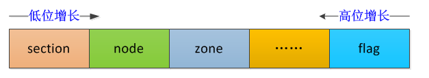

 服务器体系与共享存储器架构
=======

| 日期 | 内核版本 | 架构| 作者 | GitHub| CSDN |
| ------- |:-------:|:-------:|:-------:|:-------:|:-------:|
| 2016-06-14 | [Linux-4.7](http://lxr.free-electrons.com/source/?v=4.7) | X86 & arm | [gatieme](http://blog.csdn.net/gatieme) | [LinuxDeviceDrivers](https://github.com/gatieme/LDD-LinuxDeviceDrivers) | [Linux内存管理](http://blog.csdn.net/gatieme/article/category/6225543) |


#1	前景回顾
-------

#1.1	UMA和NUMA两种模型
-------

共享存储型多处理机有两种模型

*	均匀存储器存取（Uniform-Memory-Access，简称UMA）模型


*	非均匀存储器存取（Nonuniform-Memory-Access，简称NUMA）模型

#1.2	(N)UMA模型中linux内存的机构
-------

非一致存储器访问(NUMA)模式下

*	处理器被划分成多个"节点"(node), 每个节点被分配有的本地存储器空间. 所有节点中的处理器都可以访问全部的系统物理存储器，但是访问本节点内的存储器所需要的时间，比访问某些远程节点内的存储器所花的时间要少得多


*	内存被分割成多个区域（BANK，也叫"簇"），依据簇与处理器的"距离"不同, 访问不同簇的代码也会不同.


##1.3	Linux如何描述物理内存
-------

Linux把物理内存划分为三个层次来管理

| 层次 | 描述 |
|:----:|:----:|
| 存储节点(Node) |  CPU被划分为多个节点(node), 内存则被分簇, 每个CPU对应一个本地物理内存, 即一个CPU-node对应一个内存簇bank，即每个内存簇被认为是一个节点 |
| 管理区(Zone)   | 每个物理内存节点node被划分为多个内存管理区域, 用于表示不同范围的内存, 内核可以使用不同的映射方式映射物理内存 |
| 页面(Page) 	   |	内存被细分为多个页面帧, 页面是最基本的页面分配的单位　｜


*	首先内存被划分为结点. 内存中的每个节点都是由pg_data_t描述,而pg_data_t由struct pglist_data定义而来, 该数据结构定义在[include/linux/mmzone.h, line 615](http://lxr.free-electrons.com/source/include/linux/mmzone.h#L615), 每个结点关联到系统中的一个处理器, 内核中表示为`pg_data_t`的实例. 系统中每个节点被链接到一个以NULL结尾的`pgdat_list`链表中<而其中的每个节点利用`pg_data_tnode_next`字段链接到下一节．而对于PC这种UMA结构的机器来说, 只使用了一个成为contig_page_data的静态pg_data_t结构.

*	接着各个节点又被划分为内存管理区域, 一个管理区域通过struct zone_struct描述, 其被定义为zone_t, 用以表示内存的某个范围, 低端范围的16MB被描述为ZONE_DMA, 某些工业标准体系结构中的(ISA)设备需要用到它, 然后是可直接映射到内核的普通内存域ZONE_NORMAL,最后是超出了内核段的物理地址域ZONE_HIGHMEM, 被称为高端内存.　是系统中预留的可用内存空间, 不能被内核直接映射.

*	最后页帧(page frame)代表了系统内存的最小单位, 堆内存中的每个页都会创建一个struct page的一个实例. 传统上，把内存视为连续的字节，即内存为字节数组，内存单元的编号(地址)可作为字节数组的索引. 分页管理时，将若干字节视为一页，比如4K byte. 此时，内存变成了连续的页，即内存为页数组，每一页物理内存叫页帧，以页为单位对内存进行编号，该编号可作为页数组的索引，又称为页帧号.


##1.4	今日内容(页帧struct page)
-------

分页单元可以实现把线性地址转换为物理地址, 为了效率起见, 线性地址被分为固定长度为单位的组, 称为"页", 页内部的线性地址被映射到连续的物理地址. 这样内核可以指定一个页的物理地址和其存储权限, 而不用指定页所包含的全部线性地址的存储权限.
分页单元把所有RAM分为固定长度的页帧(也叫页框, 物理页, 英文page frame). 每一个页帧包含一个页(page). 也就是说一个页帧的长度与一个页的长度一致. 页框是主存的一部分, 因此也是一个存储区域. 简单来说, 页是一个数据块, 可以存放在任何页框(内存中)或者磁盘(被交换至交换分区)中

我们今天就来详细讲解一下linux下物理页帧的描述

#2	页帧
-------

内核把物理页作为内存管理的基本单位. 尽管处理器的最小可寻址单位通常是字, 但是, 内存管理单元MMU通常以页为单位进行处理. 因此，从虚拟内存的上来看，页就是最小单位.

页帧代表了系统内存的最小单位, 对内存中的每个页都会创建struct page的一个实例. 内核必须要保证page结构体足够的小，否则仅struct page就要占用大量的内存.

因为即使在中等程序的内存配置下, 系统的内存同样会分解为大量的页. 例如, IA-32系统中标准页长度为4KB, 在内存大小为384MB时, 大约有100000页. 就当今的标准而言, 这个容量算不上很大, 但页的数目已经非常可观了

因而出于节省内存的考虑，内核要尽力保持struct page尽可能的小. 在典型的系统中, 由于页的数目巨大, 因此对page结构的小改动, 也可能导致保存所有page实例所需的物理内存暴涨.

页的广泛使用, 增加了保持结构长度的难度 : 内存管理的许多部分都使用页, 用于各种不同的用途. 内核的一部分可能完全依赖于struct page提供的特定信息, 而这部分信息堆内核的其他部分页可能是完全无用的. 等等.


##2.1	struct page结构
-------

 内核用[struct  page(include/linux/mm_types.h?v=4.7, line 45)](http://lxr.free-electrons.com/source/include/linux/mm_types.h?v4.7#L45)结构表示系统中的每个物理页.

出于节省内存的考虑，struct page中使用了大量的联合体union.

```cpp
/*
 * Each physical page in the system has a struct page associated with
 * it to keep track of whatever it is we are using the page for at the
 * moment. Note that we have no way to track which tasks are using
 * a page, though if it is a pagecache page, rmap structures can tell us
 * who is mapping it.
 *
 * The objects in struct page are organized in double word blocks in
 * order to allows us to use atomic double word operations on portions
 * of struct page. That is currently only used by slub but the arrangement
 * allows the use of atomic double word operations on the flags/mapping
 * and lru list pointers also.
 */
struct page {
    /* First double word block */
    unsigned long flags;        /* Atomic flags, some possibly updated asynchronously
                                              描述page的状态和其他信息  */
    union
    {
        struct address_space *mapping;  /* If low bit clear, points to
                         * inode address_space, or NULL.
                         * If page mapped as anonymous
                         * memory, low bit is set, and
                         * it points to anon_vma object:
                         * see PAGE_MAPPING_ANON below.
                         */
        void *s_mem;            /* slab first object */
        atomic_t compound_mapcount;     /* first tail page */
        /* page_deferred_list().next     -- second tail page */
    };

    /* Second double word */
    struct {
        union {
            pgoff_t index;      /* Our offset within mapping.
            在映射的虚拟空间（vma_area）内的偏移；
            一个文件可能只映射一部分，假设映射了1M的空间，
            index指的是在1M空间内的偏移，而不是在整个文件内的偏移。 */
            void *freelist;     /* sl[aou]b first free object */
            /* page_deferred_list().prev    -- second tail page */
        };

        union {
#if defined(CONFIG_HAVE_CMPXCHG_DOUBLE) && \
    defined(CONFIG_HAVE_ALIGNED_STRUCT_PAGE)
            /* Used for cmpxchg_double in slub */
            unsigned long counters;
#else
            /*
             * Keep _refcount separate from slub cmpxchg_double
             * data.  As the rest of the double word is protected by
             * slab_lock but _refcount is not.
             */
            unsigned counters;
#endif

            struct {

                union {
                    /*
                     * Count of ptes mapped in mms, to show
                     * when page is mapped & limit reverse
                     * map searches.
                     * 页映射计数器
                     */
                    atomic_t _mapcount;

                    struct { /* SLUB */
                        unsigned inuse:16;
                        unsigned objects:15;
                        unsigned frozen:1;
                    };
                    int units;      /* SLOB */
                };
                /*
                 * Usage count, *USE WRAPPER FUNCTION*
                 * when manual accounting. See page_ref.h
                 * 页引用计数器
                 */
                atomic_t _refcount;
            };
            unsigned int active;    /* SLAB */
        };
    };

    /*
     * Third double word block
     *
     * WARNING: bit 0 of the first word encode PageTail(). That means
     * the rest users of the storage space MUST NOT use the bit to
     * avoid collision and false-positive PageTail().
     */
    union {
        struct list_head lru;   /* Pageout list, eg. active_list
                     * protected by zone->lru_lock !
                     * Can be used as a generic list
                     * by the page owner.
                     */
        struct dev_pagemap *pgmap; /* ZONE_DEVICE pages are never on an
                        * lru or handled by a slab
                        * allocator, this points to the
                        * hosting device page map.
                        */
        struct {        /* slub per cpu partial pages */
            struct page *next;      /* Next partial slab */
#ifdef CONFIG_64BIT
            int pages;      /* Nr of partial slabs left */
            int pobjects;   /* Approximate # of objects */
#else
            short int pages;
            short int pobjects;
#endif
        };

        struct rcu_head rcu_head;       /* Used by SLAB
                         * when destroying via RCU
                         */
        /* Tail pages of compound page */
        struct {
            unsigned long compound_head; /* If bit zero is set */

            /* First tail page only */
#ifdef CONFIG_64BIT
            /*
             * On 64 bit system we have enough space in struct page
             * to encode compound_dtor and compound_order with
             * unsigned int. It can help compiler generate better or
             * smaller code on some archtectures.
             */
            unsigned int compound_dtor;
            unsigned int compound_order;
#else
            unsigned short int compound_dtor;
            unsigned short int compound_order;
#endif
        };

#if defined(CONFIG_TRANSPARENT_HUGEPAGE) && USE_SPLIT_PMD_PTLOCKS
        struct {
            unsigned long __pad;    /* do not overlay pmd_huge_pte
                         * with compound_head to avoid
                         * possible bit 0 collision.
                         */
            pgtable_t pmd_huge_pte; /* protected by page->ptl */
        };
#endif
    };

    /* Remainder is not double word aligned */
    union {
        unsigned long private;      /* Mapping-private opaque data:
                         * usually used for buffer_heads
                         * if PagePrivate set; used for
                         * swp_entry_t if PageSwapCache;
                         * indicates order in the buddy
                         * system if PG_buddy is set.
                         * 私有数据指针，由应用场景确定其具体的含义
                         */
#if USE_SPLIT_PTE_PTLOCKS
#if ALLOC_SPLIT_PTLOCKS
        spinlock_t *ptl;
#else
        spinlock_t ptl;
#endif
#endif
        struct kmem_cache *slab_cache;  /* SL[AU]B: Pointer to slab */
    };

#ifdef CONFIG_MEMCG
    struct mem_cgroup *mem_cgroup;
#endif

    /*
     * On machines where all RAM is mapped into kernel address space,
     * we can simply calculate the virtual address. On machines with
     * highmem some memory is mapped into kernel virtual memory
     * dynamically, so we need a place to store that address.
     * Note that this field could be 16 bits on x86 ... ;)
     *
     * Architectures with slow multiplication can define
     * WANT_PAGE_VIRTUAL in asm/page.h
     */
#if defined(WANT_PAGE_VIRTUAL)
    void *virtual;          /* Kernel virtual address (NULL if
                       not kmapped, ie. highmem) */
#endif /* WANT_PAGE_VIRTUAL */

#ifdef CONFIG_KMEMCHECK
    /*
     * kmemcheck wants to track the status of each byte in a page; this
     * is a pointer to such a status block. NULL if not tracked.
     */
    void *shadow;
#endif

#ifdef LAST_CPUPID_NOT_IN_PAGE_FLAGS
    int _last_cpupid;
#endif
}
/*
 * The struct page can be forced to be double word aligned so that atomic ops
 * on double words work. The SLUB allocator can make use of such a feature.
 */
#ifdef CONFIG_HAVE_ALIGNED_STRUCT_PAGE
    __aligned(2 * sizeof(unsigned long))
#endif
;
```

| 字段 | 描述 |
|:---:|:----:|
| flag | 用来存放页的状态，每一位代表一种状态，所以至少可以同时表示出32中不同的状态,这些状态定义在linux/page-flags.h中 |
| virtual | 对于如果物理内存可以直接映射内核的系统, 我们可以之间映射出虚拟地址与物理地址的管理, 但是对于需要使用高端内存区域的页, 即无法直接映射到内核的虚拟地址空间, 因此需要用virtual保存该页的虚拟地址 |
|  _refcount | 引用计数，表示内核中引用该page的次数, 如果要操作该page, 引用计数会+1, 操作完成-1. 当该值为0时, 表示没有引用该page的位置，所以该page可以被解除映射，这往往在内存回收时是有用的 |
| _mapcount | 被页表映射的次数，也就是说该page同时被多少个进程共享。初始值为-1，如果只被一个进程的页表映射了，该值为0. 如果该page处于伙伴系统中，该值为PAGE_BUDDY_MAPCOUNT_VALUE（-128），内核通过判断该值是否为PAGE_BUDDY_MAPCOUNT_VALUE来确定该page是否属于伙伴系统 |
| index | 在映射的虚拟空间（vma_area）内的偏移；一个文件可能只映射一部分，假设映射了1M的空间，index指的是在1M空间内的偏移，而不是在整个文件内的偏移 |
| private | 私有数据指针，由应用场景确定其具体的含义 |
| lru |链表头，用于在各种链表上维护该页, 以便于按页将不同类别分组, 主要有3个用途: 伙伴算法, slab分配器, 被用户态使用或被当做页缓存使用 |
| mapping | 指向与该页相关的address_space对象 |
| index | 页帧在映射内部的偏移量

>注意区分_count和_mapcount，_mapcount表示的是映射次数，而_count表示的是使用次数；被映射了不一定在使用，但要使用必须先映射。


##2.2	mapping & index
-------


mapping指定了页帧所在的地址空间, index是页帧在映射内部的偏移量. 地址空间是一个非常一般的概念. 例如, 可以用在向内存读取文件时. 地址空间用于将文件的内容与装载数据的内存区关联起来. mapping不仅能够保存一个指针, 而且还能包含一些额外的信息, 用于判断页是否属于未关联到地址空间的某个匿名内存区.


1.	如果mapping = 0，说明该page属于交换高速缓存页（swap cache）；当需要使用地址空间时会指定交换分区的地址空间swapper_space。

2.	如果mapping != 0，第0位bit[0] = 0，说明该page属于页缓存或文件映射，mapping指向文件的地址空间address_space。

3.	如果mapping != 0，第0位bit[0] != 0，说明该page为匿名映射，mapping指向struct anon_vma对象。


通过mapping恢复anon_vma的方法：anon_vma = (struct anon_vma *)(mapping - PAGE_MAPPING_ANON)。


pgoff_t index是该页描述结构在地址空间radix树page_tree中的对象索引号即页号, 表示该页在vm_file中的偏移页数, 其类型pgoff_t被定义为unsigned long即一个机器字长.


```cpp
/*
 * The type of an index into the pagecache.
 */
#define pgoff_t unsigned long
```

##2.3	private私有数据指针
-------

private私有数据指针, 由应用场景确定其具体的含义：


1.	如果设置了PG_private标志，则private字段指向struct buffer_head

2.	如果设置了PG_compound，则指向struct page


3.	如果设置了PG_swapcache标志，private存储了该page在交换分区中对应的位置信息swp_entry_t。

4.	如果_mapcount = PAGE_BUDDY_MAPCOUNT_VALUE，说明该page位于伙伴系统，private存储该伙伴的阶


##2.4	lru链表头
-------

最近、最久未使用struct slab结构指针变量

lru：链表头，主要有3个用途：

1.	则page处于伙伴系统中时，用于链接相同阶的伙伴（只使用伙伴中的第一个page的lru即可达到目的）。

2.	设置PG_slab, 则page属于slab，page->lru.next指向page驻留的的缓存的管理结构，page->lru.prec指向保存该page的slab的管理结构。

3.	page被用户态使用或被当做页缓存使用时，用于将该page连入zone中相应的lru链表，供内存回收时使用。


#3	体系结构无关的页面的状态flags
-------

页的不同属性通过一系列页标志描述, 存储在struct page的flag成员中的各个比特位.

```cpp
struct page {
    /* First double word block */
    unsigned long flags;        /* Atomic flags,
    some possibly updated asynchronously, 描述page的状态和其他信息  */
```


这些标识是独立于体系结构的, 因而无法通过特定于CPU或计算机的信息(该信息保存在页表中)


##3.1	页面到管理区和节点的映射
-------


在**早期的linux-2.4.18的内核**中, [struct page存储有一个指向对应管理区的指针page->zone](http://lxr.linux.no/linux-old+v2.4.18/include/linux/mm.h#L167), 但是该这hi真在吼吼被认为是一种浪费, 因为如果有成千上万的这样的struct page存在, 那么即使是很小的指针也会消耗大量的内存空间.

因此在**后来linux-2.4.x的更新**中, 删除了这个字段, 取而代之的是page->flags的最高[ZONE_SHIFT位](http://lxr.free-electrons.com/source/include/linux/mm.h?v=2.4.37#L340)和NODE_SHIFT位, 存储了其所在zone和node在内存区域表zone_table的编号索引.


那么内核在初始化内存管理区时, 首先建立管理区表zone_table. 参见[mm/page_alloc.c?v=2.4.37, line 38](http://lxr.free-electrons.com/source/mm/page_alloc.c?v=2.4.37#L38)

```cpp
/*
 *
 * The zone_table array is used to look up the address of the
 * struct zone corresponding to a given zone number (ZONE_DMA,
 * ZONE_NORMAL, or ZONE_HIGHMEM).
 */
zone_t *zone_table[MAX_NR_ZONES*MAX_NR_NODES];
EXPORT_SYMBOL(zone_table);
```


MAX_NR_ZONES是一个节点中所能包容纳的管理区的最大数, 如3个, 定义在[include/linux/mmzone.h?v=2.4.37, line 25](http://lxr.free-electrons.com/source/include/linux/mmzone.h?v=2.4.37#L25), 与zone区域的类型(ZONE_DMA, ZONE_NORMAL, ZONE_HIGHMEM)定义在一起. 当然这时候我们这些标识都是通过宏的方式来实现的, 而不是如今的枚举类型


MAX_NR_NODES是可以存在的节点的最大数.

函数EXPORT_SYMBOL使得内核的变量或者函数可以被载入的模块(比如我们的驱动模块)所访问.

该表处理起来就像一个多维数组, 在函数free_area_init_core中, 一个节点的所有页面都会被初始化.

内核提供了page_zone通过页面查找其对应的内存区域zone_t, 页提供了set_page_zone接口, 而查找到了zone后, 可以通过 其`struct pglist_data      *zone_pgdat`直接获取其所在node信息

```cpp
/*
 * The zone field is never updated after free_area_init_core()
 * sets it, so none of the operations on it need to be atomic.
 */
#define NODE_SHIFT 4
#define ZONE_SHIFT (BITS_PER_LONG - 8)

struct zone_struct;
extern struct zone_struct *zone_table[];

static inline zone_t *page_zone(struct page *page)
{
        return zone_table[page->flags >> ZONE_SHIFT];
}

static inline void set_page_zone(struct page *page, unsigned long zone_num)
{
        page->flags &= ~(~0UL << ZONE_SHIFT);
        page->flags |= zone_num << ZONE_SHIFT;
}
```

而**后来的内核(至今linux-4.7)**中, 这些必要的标识(ZONE_DMA等)都是通过枚举类型实现的(ZONE_DMA等用enum zone_type定义), 然后zone_table也被移除, 参照[[PATCH] zone table removal miss merge](https://lkml.org/lkml/2006/9/27/112)

因此内核提供了新的思路, 参见[include/linux/mm.h?v4.7, line 907](http://lxr.free-electrons.com/source/include/linux/mm.h?v4.7#L907)


```cpp
static inline struct zone *page_zone(const struct page *page)
{
	return &NODE_DATA(page_to_nid(page))->node_zones[page_zonenum(page)];
}

static inline void set_page_zone(struct page *page, enum zone_type zone)
{
	page->flags &= ~(ZONES_MASK << ZONES_PGSHIFT);
    page->flags |= (zone & ZONES_MASK) << ZONES_PGSHIFT;
}

static inline void set_page_node(struct page *page, unsigned long node)
{
	page->flags &= ~(NODES_MASK << NODES_PGSHIFT);
	page->flags |= (node & NODES_MASK) << NODES_PGSHIFT;
}
```


其中NODE_DATA使用了全局的node表进行索引.

在UMA结构的机器中, 只有一个node结点即contig_page_data, 此时NODE_DATA直接指向了全局的contig_page_data, 而与node的编号nid无关, 参照[include/linux/mmzone.h?v=4.7, line 858](http://lxr.free-electrons.com/source/include/linux/mmzone.h?v=4.7#L858), 其中全局唯一的cnode结点ontig_page_data定义在[mm/nobootmem.c?v=4.7, line 27](http://lxr.free-electrons.com/source/mm/nobootmem.c?v=4.7#L27)


```cpp
#ifndef CONFIG_NEED_MULTIPLE_NODES
extern struct pglist_data contig_page_data;
#define NODE_DATA(nid)          (&contig_page_data)
#define NODE_MEM_MAP(nid)       mem_map
else
/*  ......  */
#endif
```

而对于NUMA结构的系统中, 所有的node都存储在node_data数组中,
NODE_DATA直接通过node编号索引即可, 参见[NODE_DATA的定义](http://lxr.free-electrons.com/ident?v=4.7;i=NODE_DATA)

```cpp
extern struct pglist_data *node_data[];
#define NODE_DATA(nid)          (node_data[(nid)])
```


那么page的flags标识主要分为4部分，其中标志位flag向高位增长, 其余位字段向低位增长，中间存在空闲位

| 字段 | 描述 |
|:----:|:---:|
| section | 主要用于稀疏内存模型SPARSEMEM，可忽略 |
| node | NUMA节点号, 标识该page属于哪一个节点 |
| zone | 内存域标志，标识该page属于哪一个zone |
| flag | page的状态标识 |


如下图所示




##3.2	内存页标识pageflags
-------


其中最后一个flag用于标识page的状态, 这些状态由枚举常量[`enum pageflags`](http://lxr.free-electrons.com/source/include/linux/page-flags.h?v=4.7#L74)定义, 定义在[include/linux/page-flags.h?v=4.7, line 74](http://lxr.free-electrons.com/source/include/linux/page-flags.h?v=4.7#L74). 常用的有如下状态


```cpp
enum pageflags {
        PG_locked,              /* Page is locked. Don't touch. */
        PG_error,
        PG_referenced,
        PG_uptodate,
        PG_dirty,
        PG_lru,
        PG_active,
        PG_slab,
        PG_owner_priv_1,        /* Owner use. If pagecache, fs may use*/
        PG_arch_1,
        PG_reserved,
        PG_private,             /* If pagecache, has fs-private data */
        PG_private_2,           /* If pagecache, has fs aux data */
        PG_writeback,           /* Page is under writeback */
        PG_head,                /* A head page */
        PG_swapcache,           /* Swap page: swp_entry_t in private */
        PG_mappedtodisk,        /* Has blocks allocated on-disk */
        PG_reclaim,             /* To be reclaimed asap */
        PG_swapbacked,          /* Page is backed by RAM/swap */
        PG_unevictable,         /* Page is "unevictable"  */
#ifdef CONFIG_MMU
        PG_mlocked,             /* Page is vma mlocked */
#endif
#ifdef CONFIG_ARCH_USES_PG_UNCACHED
        PG_uncached,            /* Page has been mapped as uncached */
#endif
#ifdef CONFIG_MEMORY_FAILURE
        PG_hwpoison,            /* hardware poisoned page. Don't touch */
#endif
#if defined(CONFIG_IDLE_PAGE_TRACKING) && defined(CONFIG_64BIT)
        PG_young,
        PG_idle,
#endif
        __NR_PAGEFLAGS,

        /* Filesystems */
        PG_checked = PG_owner_priv_1,

        /* Two page bits are conscripted by FS-Cache to maintain local caching
         * state.  These bits are set on pages belonging to the netfs's inodes
         * when those inodes are being locally cached.
         */
        PG_fscache = PG_private_2,      /* page backed by cache */

        /* XEN */
        /* Pinned in Xen as a read-only pagetable page. */
        PG_pinned = PG_owner_priv_1,
        /* Pinned as part of domain save (see xen_mm_pin_all()). */
        PG_savepinned = PG_dirty,
        /* Has a grant mapping of another (foreign) domain's page. */
        PG_foreign = PG_owner_priv_1,

        /* SLOB */
        PG_slob_free = PG_private,

        /* Compound pages. Stored in first tail page's flags */
        PG_double_map = PG_private_2,
};
```


| 页面状态 | 描述 |
|:-------:|:----:|
| PG_locked | 指定了页是否被锁定, 如果该比特未被置位, 说明有使用者正在操作该page, 则内核的其他部分不允许访问该页， 这可以防止内存管理出现竞态条件 |
| PG_error | 如果涉及该page的I/O操作发生了错误, 则该位被设置 |
| PG_referenced | 表示page刚刚被访问过 |
| PG_uptodate | 表示page的数据已经与后备存储器是同步的, 即页的数据已经从块设备读取，且没有出错,数据是最新的 |
| PG_dirty | 与后备存储器中的数据相比，该page的内容已经被修改. 出于性能能的考虑，页并不在每次改变后立即回写, 因此内核需要使用该标识来表明页面中的数据已经改变, 应该在稍后刷出 |
| PG_lru | 表示该page处于LRU链表上， 这有助于实现页面的回收和切换. 内核使用两个最近最少使用(least recently used-LRU)链表来区别活动和不活动页. 如果页在其中一个链表中, 则该位被设置 |
| PG_active | page处于inactive LRU链表, PG_active和PG_referenced一起控制该page的活跃程度，这在内存回收时将会非常有用<br>当位于LRU active_list链表上的页面该位被设置, 并在页面移除时清除该位, 它标记了页面是否处于活动状态 |
| PG_slab | 该page属于slab分配器 |
| PG_onwer_priv_1 | |
| PG_arch_1	      | 直接从代码中引用, PG_arch_1是一个体系结构相关的页面状态位, 一般的代码保证了在第一次禁图页面高速缓存时, 该位被清除. 这使得体系结构可以延迟到页面被某个进程映射后， 才可以D-Cache刷盘 |
| PG_reserved | 设置该标志，防止该page被交换到swap  |
| PG_private | 如果page中的private成员非空，则需要设置该标志, 用于I/O的页可使用该字段将页细分为多核缓冲区 |
| PG_private_2 | |
| PG_writeback | page中的数据正在被回写到后备存储器 |
| PG_head | |
| PG_swapcache | 表示该page处于swap cache中 |
| PG_mappedtodisk | 表示page中的数据在后备存储器中有对应 |
| PG_reclaim | 表示该page要被回收。当PFRA决定要回收某个page后，需要设置该标志 |
| PG_swapbacked | 该page的后备存储器是swap |
| PG_unevictable | 该page被锁住，不能交换，并会出现在LRU_UNEVICTABLE链表中，它包括的几种page：ramdisk或ramfs使用的页, shm_locked、mlock锁定的页 |
| PG_mlocked | 该page在vma中被锁定，一般是通过系统调用mlock()锁定了一段内存 |
| PG_uncached | |
| PG_hwpoison | |
| PG_young | |
| PG_idle  | |


内核中提供了一些标准宏，用来检查、操作某些特定的比特位，这些宏定义在[include/linux/page-flags.h?v=4.7, line 183](http://lxr.free-electrons.com/source/include/linux/page-flags.h?v=4.7#L183)


```c
#define TESTPAGEFLAG(uname, lname, policy)
#define SETPAGEFLAG(uname, lname, policy)
#define CLEARPAGEFLAG(uname, lname, policy)
```

**关于page flags的早期实现**


*	linux-2.6以后的内核中, 很少出现直接用宏定义的标识, 这些标识大多通过enum枚举常量来定义, 然后__NR_XXXX的形式结束, 正好可以标记出宏参数的个数, 但是在早期的实现中, 这些变量都通过宏来标识

例如我们的page->flags用enum pageflags来定义, 内存管理区类型通过zone_type来定义, 但是这些内容在早期的内核中都是通过宏定义来实现的.

*	其次标识的函数接口也变了, 早期的内核中, 针对每个宏标识都设置了一组test/set/clear, 参见[/include/linux/mm.h?v=2.4.37, line 324](http://lxr.free-electrons.com/source/include/linux/mm.h?v=2.4.37#L324)

形式如下

```cpp
PageXXX(page)：检查page是否设置了PG_XXX位
SetPageXXX(page)：设置page的PG_XXX位
ClearPageXXX(page)：清除page的PG_XXX位
TestSetPageXXX(page)：设置page的PG_XXX位，并返回原值
TestClearPageXXX(page)：清除page的PG_XXX位，并返回原值
```


很多情况下, 需要等待页的状态改变, 然后才能恢复工作. 因此内核提供了两个辅助函数

```cpp
http://lxr.free-electrons.com/source/include/linux/pagemap.h?v=4.7#L495
/*
 * Wait for a page to be unlocked.
 *
 * This must be called with the caller "holding" the page,
 * ie with increased "page->count" so that the page won't
 * go away during the wait..
 */
static inline void wait_on_page_locked(struct page *page)

// http://lxr.free-electrons.com/source/include/linux/pagemap.h?v=4.7#L504
/*
 * Wait for a page to complete writeback
 */
static inline void wait_on_page_writeback(struct page *page)
```

假定内核的一部分在等待一个被锁定的页面, 直至页面被解锁. wait_on_page_locked提供了该功能. 在页面被锁定的情况下, 调用该函数, 内核将进入睡眠. 而在页面解锁后, 睡眠进程会被自动唤醒并继续工作

wait_on_page_writeback的工作方式类似, 该函数会等待与页面相关的所有待决回写操作结束, 将页面包含的数据同步到块设备为止.


#4	全局页面数组mem_map
-------

`mem_map`是一个struct page的数组，管理着系统中所有的物理内存页面。在系统启动的过程中，创建和分配mem_map的内存区域, mem_map定义在[mm/page_alloc.c?v=4.7, line 6691](http://lxr.free-electrons.com/source/mm/page_alloc.c?v=4.7#L6691)


```cpp
#ifndef CONFIG_NEED_MULTIPLE_NODES
/* use the per-pgdat data instead for discontigmem - mbligh */
unsigned long max_mapnr;
struct page *mem_map;
 
EXPORT_SYMBOL(max_mapnr);
EXPORT_SYMBOL(mem_map);
#endif
```


UMA体系结构中，free_area_init函数在系统唯一的struct node对象contig_page_data中node_mem_map成员赋值给全局的mem_map变量


