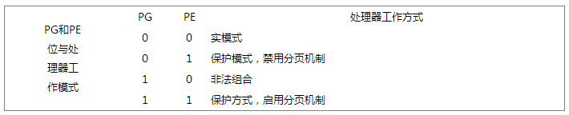
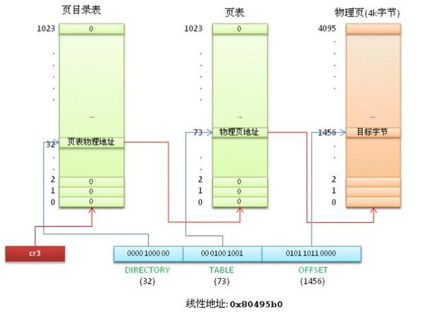
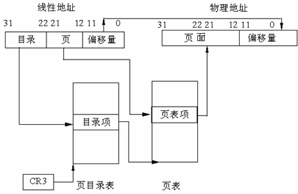
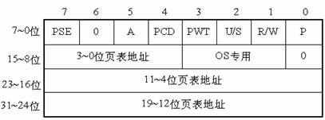
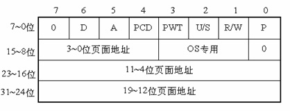
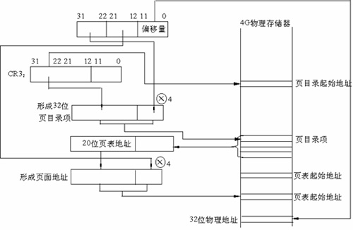
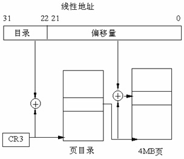

#1	前景回顾
-------

前面我们讲解了操作系统段式存储管理的主要内容。

*   32位，在保护方式下，其能够访问的线性地址空间可达4GB，而且允许几乎不受存储空间限制的虚拟存储器程序。虚拟存储器地址空间能够可达64TB。它还提供了复杂的存储管理和硬件辅助的保护机构和增加了支持多任务操作系统的特别优化的指令。实际上，64TB的虚拟地址空间是有磁盘等外部存储器的支持下实现的。在编写程序是可以放在磁盘存储器上，但在执行时，必须把程序加载到物理存储器中。而存储器管理就是要将46位虚拟地址变换成32位物理地址。

*   将程序分成不同的段进行管理，我们编程访问内存地址时，访问的其实是操作系统抽象给我们的虚拟地址，通过段基址：段偏移的方式访问内存虚拟地址，极大了简化了程序员的编程结构。

*   通过硬件和操作系统的段式管理机制，实模式下通过段基址左移四位+段内偏移，保护模式下通过段选择子select从段描述符GDT/LDT表中获取到段描述符，然后对基地址和段偏移处理，将虚拟地址转换为线性地址。

如果没有采用存储器分页管理机制，那么我们得到的线性地址就直接对应与物理地址，否则，则需要将线性地址转换为物理地址。

从80386开始，所有的80x86处理器都支持分页，它通过设置CR0寄存器的PG标志启用分页。当PG=0时，线性地址就被解释成物理地址。

>具体请参见深入[理解计算机系统-之-内存管理（三）--（分段管理机制--段描述符，段选择子，描述符表）](http://blog.csdn.net/gatieme/article/details/50647000)
>
>

#2	页式管理
-------

##2.1	分段机制存在的问题
-------

分段，是指将程序所需要的内存空间大小的虚拟空间，通过映射机制映射到某个物理地址空间(映射的操作由硬件完成)。分段映射机制解决了之前操作系统存在的两个问题：
*   (1)地址空间没有隔离。
*   (2)程序运行的地址不确定。

不过分段方法存在一个严重的问题：内存的使用效率低。

分段的内存映射单位是整个程序；如果内存不足，被换入换出到磁盘的空间都是整个程序的所需空间，这会造成大量的磁盘访问操作，并且严重降低了运行速度。

事实上，很多时候程序运行所需要的数据只是很小的一部分，加入到内存的数据大小可能会很小，并没有必要整体的写入和写出。

分页机制解决了上面分段方法所存在的一个内存使用效率问题；其核心思想是系统为程序执行文件中的第x页分配了内存中的第y页，同时y页会添加到进程虚拟空间地址的映射表中(页表)，这样程序就可以通过映射访问到内存页y了。

##2.2	分页存储的基本内容
-------

分页的基本方法是将地址空间人为地等分成某一个固定大小的页；每一页大小由硬件来决定，或者是由操作系统来决定(如果硬件支持多种大小的页)。目前，以大小为4KB的分页是绝大多数PC操作系统的选择。
*   逻辑空间等分为页；并从0开始编号
*   内存空间等分为块，与页面大小相同；从0开始编号
*   分配内存时，以块为单位将进程中的若干个页分别装入

关于进程分页。当我们把进程的虚拟地址空间按页来分割，常用的数据和代码会被装在到内存；暂时没用到的是数据和代码则保存在磁盘中，需要用到的时候，再从磁盘中加载到内存中即可。
这里需要了解三个概念：

1.	虚拟页(VP, Virtual Page),虚拟空间中的页；

2.	物理页(PP, Physical Page),物理内存中的页；

3.	磁盘页(DP, Disk Page),磁盘中的页。

虚拟内存的实现需要硬件的支持，从Virtual Address到Physical Address的映射，通过一个叫MMU(Memory Mangement Unit)的部件来完成

#3	硬件分页支持
-------

 分页单元(paging unit)把线性地址转换成物理地址。其中的一个关键任务就是把所请求的访问类型与线性地址的访问权限相比较，如果这次内存访问是无效的，就产生一个缺页异常。
 
*   **页**：为了更高效和更经济的管理内存，线性地址被分为以固定长度为单位的组，成为页。页内部连续的线性地址空间被映射到连续的物理地址中。这样，内核可以指定一个页的物理地址和对应的存取权限，而不用指定全部线性地址的存取权限。这里说页，同时指一组线性地址以及这组地址包含的数据

*   **页框**：分页单元把所有的 RAM 分成固定长度的页框(page frame)(有时叫做物理页)。每一个页框包含一个页(page)，也就是说一个页框的长度与一个页的长度一致。页框是主存的一部分，因此也是一个存储区域。区分一页和一个页框是很重要的，前者只是一个数据块，可以存放在任何页框或磁盘中。

*   **页表**：把线性地址映射到物理地址的数据结构称为页表(page table)。页表存放在主存中，并在启用分页单元之前必须由内核对页表进行适当的初始化。

#4	常规的32bit分页
-------

常规4KB分页，32位的线性地址被分成3个域

| Directory(目录) | Table(页表) |  Offset(偏移量) |
| ------------- |:-------------:| -------------:|
| 最高10位 | 中间10位 | 最低12位 |

>线性地址的转换分为两步完成，每一步都基于一种转换表，第一种转换表称为页目录表(page directory)，第二种转换表称为页表(page table)。
>
>为什么需要两级呢？
>目的在于减少每个进程页表所需的 RAM 的数量。如果使用简单的一级页表，将需要高达$ 2^{20}$ 个表项来表示每个进程的页表，即时一个进程并不使用所有的地址，二级模式通过职位进程实际使用的那些虚拟内存区请求页表来减少内存容量。

每个活动的进程必须有一个页目录，但是却没有必要马上为所有进程的所有页表都分配 RAM，只有在实际需要一个页表时候才给该页表分配 RAM。

页目录项和页表项有同样的结构，每项都包含下面的字段：

| 字段 | 描述 |
| ----|:----:|
| Present标志 | 如果被置为1，所指的页(或页表)就在主存中；如果该标志为0，则这一页不在主存中，此时这个表项剩余的位可由操作系统用于自己的目的。如果执行一个地址转换所需的页表项或页目录项中Present标志被清0，那么分页单元就把该线性地址转换所需的页表项或页目录项中Present标志被清0，那么分页单元就把该线性地址存放在控制寄存器cr2中，并产生14号异常：缺页异常。 |
|  | 包含页框物理地址最高20位的字段。由于每一个页框有4KB的容量，它的物理地址必须是4096的倍数，因此物理地址的最低12位总为0.如果这个字段指向一个页目录，相应的页框就含有一个页表；如果它指向一个页表，相应的页框就含有一页数据 |
| Accessed标志 | 每当分页单元对相应页框进行寻址时就设置这个标志。当选中的页被交换出去时，这一标志就可以由操作系统使用。分页单元从来不重置这个标志，而是必须由操作系统去做 |
| Dirty标志 | 只应用于页表项中。每当对一个页框进行写操作时就设置这个标志。与Accessed标志一样，当选中的页被交换出去时，这一标志就可以由操作系统使用。分页单元从来不重置这个标志，而是必须由操作系统去做。|
| Read/Write标志 | 含有页或页表的存取权限(Read/Write或Read)。|
|  User/Supervisor标志 | 含有访问页或页表所需的特权级。|
|  PCD和PWT标志 | 控制硬件高速缓存处理页或页表的方式。|
|  Page Size标志 | 只应用于页目录项。如果设置为1，则页目录项指的是2MB或4MB页框。|
|  Global标志 | 只应用于页表项。这个标志是在Pentium Pro中引入的，用来防止常用页从TLB高速缓存中刷新出去。只有在cr4寄存器的页全局启用(Page Global Enable, PGE)标志置位时这个标志才起作用。|

正在使用的页目录的物理地址存放在控制寄存器CR3中。

了解了以上结构之后，我们看看如何从线性地址转换到物理地址的 :

*   线性地址中的 Directory 字段决定页目录中的目录项，目录项指向适当的页表

*   线性地址中的 Table 字段又决定页表的页表项，页表项含有页所在页框的物理地址

*   线性地址中的 Offset 地段决定了页框内的相对位置，由于 offset 为 12 为，所以一页含有 4096 字节的数据

> Directory字段和Table字段都是10位长，因此页目录和页表都可以多达1024项。那么一个页目录可以寻址到高达1024*1024*4096=232个存储单元，这和32位地址所期望的一样。

#5	64位系统中的分页
-------

32位处理器普遍采用两级分页。然而两级分页并不适用于采用64位系统的计算机。

原因如下 :

首先假设一个大小为4KB的标准页，4KB覆盖2^12个地址，所以offset字段是12位。如果我们现在决定仅仅使用64位中的48位来寻址(这个限制仍然能是我们自在地拥有256TB的寻址空间！)，剩下的48-12=36位被分配给Table和Directory字段。如果我们决定为两个字段个预留18位，那么每个进程的页目录和页表都含有2^18个项，即超过256000个项。

由于这个原因，所有64位处理器的硬件分页系统都使用了额外的分页级别。使用的级别数量取决于处理器的类型。

| 平台名称 | 页大小 | 寻址使用位数 | 分页级别 | 线性地址分级|
| ------------- |:-------------:| -----:|
| alpha   |   8KB   |  43   |    3   |  10+10+10+13 | 
| ia64    |   4KB   |  39   |    3   |  9+9+9+12    | 
| ppc64   |   4KB   |  41   |    3   |  10+10+9+12  | 
| x86_64  |   4KB   |  48   |    4   |   9+9+9+9+12 | 

注：ia64是intel的一门高端技术，不与x86_64系统兼容
IA-32e Paging机制下线性地址映射到4KB的页

#6	扩展分页
-------

 从Pentium模型开始，80x86微处理器引入了扩展分页(externded paging)，它允许页框大小为4MB而不是4KB。扩展分页用于把大段连续的线性地址转换成相应的物理地址，在这种情况下，内核可以不用中间页表进行地址转换，从而节省内存并保留TLB项。

正如前面所述，通过设置页目录项的Page Size标志启用扩展分页功能。在这种情况下，分页单元把32位线性地址分成两个字段：
Directory：最高10位。
Offfset：其余22位。

扩展分页和正常分页的页目录项基本相同，除了
*   Page Size标志必须被设置。
* 20位物理地址字段只有最高10位是有意义的。这是因为每一个物理地址都是在以4MB为边界的地方开始的，故这个地址的最低22位为0。

通过设置cr4处理器寄存器的PSE标志能使扩展分页与常规分页共存。

#7	硬件保护方案

与页和页表相关的特权级只有两个，因为特权由前面“常规分页”一节中所提到的User/Supervisor标志所控制。若这个标志为0，只有当CPL小于3(这意味着对于Linux而言，处理器处于内核态)时才能对页寻址；若该标志为1，则总能对页寻址。

此外，与段的3种存取权限(读，写，执行)不同的是，页的存取权限只有两种(读，写)。如果页目录项或页表项的Read/Write标志等于0，说明相应的页表或页是只读的，否则是可读写的。

#8	总结
-------

80386 使用4K字节大小的页。每一页都有4K字节长，并在4K字节的边界上对齐，即每一页的起始地址都能被4K整除。因此，80386把4G字节的线性地址空间，划分为1G个页面，每页有4K字节大小。分页机制通过把线性地址空间中的页，重新定位到物理地址空间来进行管理，因为每个页面的整个4K字节作为一个单位进行映射，并且每个页面都对齐4K字节的边界，因此，线性地址的低12位经过分页机制直接地作为物理地址的低12位使用。

##8.1	为什么使用两级页表
-------

假设每个进程都占用了4G的线性地址空间，页表共含1M个表项，每个表项占4个字节，那么每个进程的页表要占据4M的内存空间。为了节省页表占用的空间，我们使用两级页表。每个进程都会被分配一个页目录，但是只有被实际使用页表才会被分配到内存里面。一级页表需要一次分配所有页表空间，两级页表则可以在需要的时候再分配页表空间。

##8.2	两级页表结构
-------

两级表结构的第一级称为页目录，存储在一个4K字节的页面中。页目录表共有1K个表项，每个表项为4个字节，并指向第二级表。线性地址的最高10位(即位31~位32)用来产生第一级的索引，由索引得到的表项中，指定并选择了1K个二级表中的一个表。

两级表结构的第二级称为页表，也刚好存储在一个4K字节的页面中，包含1K个字节的表项，每个表项包含一个页的物理基地址。第二级页表由线性地址的中间10 位(即位21~位12)进行索引，以获得包含页的物理地址的页表项，这个物理地址的高20位与线性地址的低12位形成了最后的物理地址，也就是页转化过程输出的物理地址。

*   第31~12位是20位页表地址，由于页表地址的低12位总为0，所以用高20位指出32位页表地址就可以了。因此，一个页目录最多包含1024个页表地址。

*   第0位是存在位，如果P=1，表示页表地址指向的该页在内存中，如果P=0，表示不在内存中。

*   第1位是读/写位，第2位是用户/管理员位，这两位为页目录项提供硬件保护。当特权级为3的进程要想访问页面时，需要通过页保护检查，而特权级为0的进程就可以绕过页保护。

*   第3位是PWT（Page Write-Through）位，表示是否采用写透方式，写透方式就是既写内存（RAM）也写高速缓存,该位为1表示采用写透方式

*   第4位是PCD（Page Cache Disable）位，表示是否启用高速缓存,该位为1表示启用高速缓存。

*   第5位是访问位，当对页目录项进行访问时，A位=1。

*   第7位是Page Size标志，只适用于页目录项。如果置为1，页目录项指的是4MB的页面，请看后面的扩展分页。

*   第9~11位由操作系统专用，Linux也没有做特殊之用。

80386的每个页目录项指向一个页表，页表最多含有1024个页面项，每项4个字节，包含页面的起始地址和有关该页面的信息。页面的起始地址也是4K的整数倍，所以页面的低12位也留作它用。

第31~12位是20位物理页面地址，除第6位外第0～5位及9~11位的用途和页目录项一样，第6位是页面项独有的，当对涉及的页面进行写操作时，D位被置1。

4GB的内存只有一个页目录，它最多有1024个页目录项，每个页目录项又含有1024个页面项，因此，内存一共可以分成1024×1024=1M个页面。由于每个页面为4K个字节，所以，存储器的大小正好最多为4GB。

##8.3	线性地址到物理地址的转换
-------

*   1.CR3包含着页目录的起始地址，用32位线性地址的最高10位A31~A22作为页目录的页目录项的索引，将它乘以4，与CR3中的页目录的起始地址相加，形成相应页表的地址。

*   2.从指定的地址中取出32位页目录项，它的低12位为0，这32位是页表的起始地址。用32位线性地址中的A21~A12位作为页表中的页面的索引，将它乘以4，与页表的起始地址相加，形成32位页面地址。

*   3.将A11~A0作为相对于页面地址的偏移量，与32位页面地址相加，形成32位物理地址。

##8.4	扩展分页
-------

从奔腾处理器开始，Intel微处理器引进了扩展分页，它允许页的大小为4MB。

在扩展分页的情况下,分页机制把32位线性地址分成两个域：最高10位的目录域和其余22位的偏移量。

##8.5	页面高速缓存
-------

由于在分页情况下，每次存储器访问都要存取两级页表，这就大大降低了访问速度。所以，为了提高速度，在386中设置一个最近存取页面的高速缓存硬件机制，它 自动保持32项处理器最近使用的页面地址，因此，可以覆盖128K字节的存储器地址。当进行存储器访问时，先检查要访问的页面是否在高速缓存中，如果在， 就不必经过两级访问了，如果不在，再进行两级访问。平均来说，页面高速缓存大约有98%的命中率，也就是说每次访问存储器时，只有2%的情况必须访问两级分页机构。这就大大加快了速度。