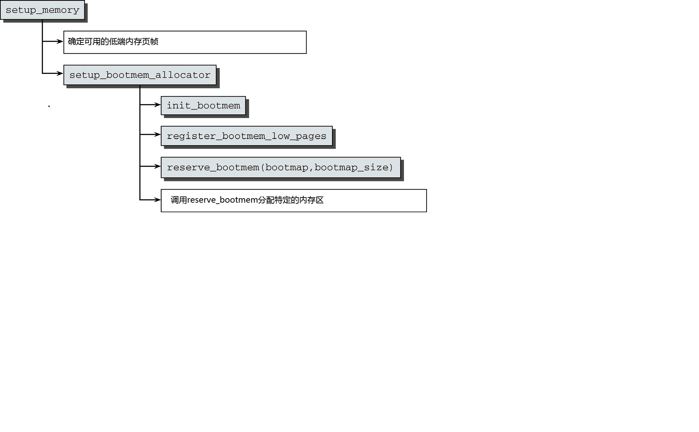

启动过程期间的内存管理--bootmem分配器
=======


| 日期 | 内核版本 | 架构| 作者 | GitHub| CSDN |
| ------- |:-------:|:-------:|:-------:|:-------:|:-------:|
| 2016-06-14 | [Linux-4.7](http://lxr.free-electrons.com/source/?v=4.7) | X86 & arm | [gatieme](http://blog.csdn.net/gatieme) | [LinuxDeviceDrivers](https://github.com/gatieme/LDD-LinuxDeviceDrivers) | [Linux内存管理](http://blog.csdn.net/gatieme/article/category/6393814) |


在内存管理的上下文中, 初始化(initialization)可以有多种含义. 在许多CPU上, 必须显式设置适用于Linux内核的内存模型. 例如在x86_32上需要切换到保护模式, 然后内核才能检测到可用内存和寄存器.


而我们今天要讲的bootmem分配器就是系统初始化阶段使用的内存分配器. 

为什么要使用bootmem分配器，内存管理不是有buddy系统和slab分配器吗？由于在系统初始化的时候需要执行一些内存管理，内存分配的任务，这个时候buddy系统，slab分配器等并没有被初始化好，此时就引入了一种内存管理器bootmem分配器在系统初始化的时候进行内存管理与分配，当buddy系统和slab分配器初始化好后，在mem_init()中对bootmem分配器进行释放，内存管理与分配由buddy系统，slab分配器等进行接管。

bootmem分配器使用一个bitmap来标记物理页是否被占用，分配的时候按照第一适应的原则，从bitmap中进行查找，如果这位为1，表示已经被占用，否则表示未被占用。为什么系统运行的时候不使用bootmem分配器呢？bootmem分配器每次在bitmap中进行线性搜索，效率非常低，而且在内存的起始端留下许多小的空闲碎片，在需要非常大的内存块的时候，检查位图这一过程就显得代价很高。bootmem分配器是用于在启动阶段分配内存的，对该分配器的需求集中于简单性方面，而不是性能和通用性。

bootmem allocator 核心数据结构
bootmem allocator 的初始化
bootmem allocator 分配内存
bootmem allocator 保留内存
bootmem allocator 释放内存
bootmem allocator的销毁


#1	前景回顾
-------


##1.1	Linux内存管理的层次结构
-------


Linux把物理内存划分为三个层次来管理

| 层次 | 描述 |
|:----:|:----:|
| 存储节点(Node) |  CPU被划分为多个节点(node), 内存则被分簇, 每个CPU对应一个本地物理内存, 即一个CPU-node对应一个内存簇bank，即每个内存簇被认为是一个节点 |
| 管理区(Zone)   | 每个物理内存节点node被划分为多个内存管理区域, 用于表示不同范围的内存, 内核可以使用不同的映射方式映射物理内存 |
| 页面(Page) 	   |	内存被细分为多个页面帧, 页面是最基本的页面分配的单位　｜

为了支持NUMA模型，也即CPU对不同内存单元的访问时间可能不同，此时系统的物理内存被划分为几个节点(node), 一个node对应一个内存簇bank，即每个内存簇被认为是一个节点


*	首先, 内存被划分为**结点**. 每个节点关联到系统中的一个处理器, 内核中表示为`pg_data_t`的实例. 系统中每个节点被链接到一个以NULL结尾的`pgdat_list`链表中<而其中的每个节点利用`pg_data_tnode_next`字段链接到下一节．而对于PC这种UMA结构的机器来说, 只使用了一个成为contig_page_data的静态pg_data_t结构.

*	接着各个节点又被划分为内存管理区域, 一个**管理区域**通过struct zone_struct描述, 其被定义为zone_t, 用以表示内存的某个范围, 低端范围的16MB被描述为ZONE_DMA, 某些工业标准体系结构中的(ISA)设备需要用到它, 然后是可直接映射到内核的普通内存域ZONE_NORMAL,最后是超出了内核段的物理地址域ZONE_HIGHMEM, 被称为高端内存.　是系统中预留的可用内存空间, 不能被内核直接映射.


*	最后**页帧(page frame)**代表了系统内存的最小单位, 堆内存中的每个页都会创建一个struct page的一个实例. 传统上，把内存视为连续的字节，即内存为字节数组，内存单元的编号(地址)可作为字节数组的索引. 分页管理时，将若干字节视为一页，比如4K byte. 此时，内存变成了连续的页，即内存为页数组，每一页物理内存叫页帧，以页为单位对内存进行编号，该编号可作为页数组的索引，又称为页帧号.


##1.2	start_kernel启动过程
-------


在初始化过程中, 还必须建立内存管理的数据结构, 以及很多事务. 因为内核在内存管理完全初始化之前就需要使用内存. 在系统启动过程期间, 使用了额外的简化悉尼股市的内存管理模块, 然后在初始化完成后, 将旧的模块丢弃掉.


首先我们来看看start_kernel是如何初始化系统的, start_kerne定义在[init/main.c?v=4.7, line 479](http://lxr.free-electrons.com/source/init/main.c?v=4.7#L479)

其代码很复杂, 我们只截取出其中与内存管理初始化相关的部分, 如下所示


```cpp
asmlinkage __visible void __init start_kernel(void)
{

    setup_arch(&command_line);
    mm_init_cpumask(&init_mm);

    setup_per_cpu_areas();


    build_all_zonelists(NULL, NULL);
    page_alloc_init();


    /*
     * These use large bootmem allocations and must precede
     * mem_init();
     * kmem_cache_init();
     */
    mm_init();

    kmem_cache_init_late();

	kmemleak_init();
    setup_per_cpu_pageset();

    rest_init();
}
```


| 函数  | 功能 |
|:----:|:----:|
| [setup_arch](http://lxr.free-electrons.com/ident?v=4.7;i=setup_arch) | 是一个特定于体系结构的设置函数, 其中一项任务是负责初始化自举分配器 |
| [mm_init_cpumask](http://lxr.free-electrons.com/source/include/linux/mm_types.h?v=4.7#L522) | 初始化CPU屏蔽字 |
| [setup_per_cpu_areas](http://lxr.free-electrons.com/ident?v=4.7;i=setup_per_cpu_areas) | 函数[(查看定义)](http://lxr.free-electrons.com/source/mm/percpu.c?v4.7#L2205])给每个CPU分配内存，并拷贝.data.percpu段的数据. 为系统中的每个CPU的per_cpu变量申请空间.<br>在SMP系统中, setup_per_cpu_areas初始化源代码中(使用[per_cpu宏](http://lxr.free-electrons.com/source/include/linux/percpu-defs.h#L256))定义的静态per-cpu变量, 这种变量对系统中每个CPU都有一个独立的副本. <br>此类变量保存在内核二进制影像的一个独立的段中, setup_per_cpu_areas的目的就是为系统中各个CPU分别创建一份这些数据的副本<br>在非SMP系统中这是一个空操作 |
| [build_all_zonelists](http://lxr.free-electrons.com/source/mm/page_alloc.c?v4.7#L5029) | 建立并初始化结点和内存域的数据结构 |
| [mm_init](http://lxr.free-electrons.com/source/init/main.c?v4.7#L464) | 建立了内核的内存分配器, <br>其中通过[mem_init](http://lxr.free-electrons.com/ident?v=4.7&i=mem_init)停用bootmem分配器并迁移到实际的内存管理器(比如伙伴系统)<br>然后调用kmem_cache_init函数初始化内核内部用于小块内存区的分配器 |
| [kmem_cache_init_late](http://lxr.free-electrons.com/source/mm/slab.c?v4.7#L1378) | 在kmem_cache_init之后, 完善分配器的缓存机制,　当前3个可用的内核内存分配器[slab](http://lxr.free-electrons.com/source/mm/slab.c?v4.7#L1378), [slob](http://lxr.free-electrons.com/source/mm/slob.c?v4.7#L655), [slub](http://lxr.free-electrons.com/source/mm/slub.c?v=4.7#L3960)都会定义此函数　|
| [kmemleak_init](http://lxr.free-electrons.com/source/mm/kmemleak.c?v=4.7#L1857) | Kmemleak工作于内核态，Kmemleak 提供了一种可选的内核泄漏检测，其方法类似于跟踪内存收集器。当独立的对象没有被释放时，其报告记录在 [/sys/kernel/debug/kmemleak](http://lxr.free-electrons.com/source/mm/kmemleak.c?v=4.7#L1467)中, Kmemcheck能够帮助定位大多数内存错误的上下文 |
| [setup_per_cpu_pageset](http://lxr.free-electrons.com/source/mm/page_alloc.c?v=4.7#L5392) | 初始化CPU高速缓存行, 为pagesets的第一个数组元素分配内存, 换句话说, 其实就是第一个系统处理器分配<br>由于在分页情况下，每次存储器访问都要存取多级页表，这就大大降低了访问速度。所以，为了提高速度，在CPU中设置一个最近存取页面的高速缓存硬件机制，当进行存储器访问时，先检查要访问的页面是否在高速缓存中. |


##1.3	setup_arch设置
-------

#2	引导内存分配器bootmem概述
-------


由于硬件配置多种多样, 所以在编译时就静态初始化所有的内核存储结构是不现实的.


bootmem分配器是系统启动初期的内存分配方式，在耳熟能详的伙伴系统建立前内存都是利用bootmem分配器来分配的，伙伴系统框架建立起来后，bootmem会过度到伙伴系统.


##2.1	初始化阶段的引导内存分配器bootmem
-------

在启动过程期间, 尽管内存管理尚未初始化, 但是内核仍然需要分配内存以创建各种数据结构. 因此在系统启动过程期间, 内核使用了一个额外的简化形式的内存管理模块**引导内存分配器(boot memory allocator--bootmem分配器)**, 用于在启动阶段早期分配内存, 而在系统初始化完成后, 该分配器被内核抛弃, 然后初始化了一套新的更加完善的内存分配器.

显然, 对该内存分配器的需求集中于简单性方面,　而不是性能和通用性, 它仅用于初始化阶段. 因此内核开发者决定实现一个最先适配(first-first)分配器用于在启动阶段管理内存. 这是可能想到的最简单的方式.


**引导内存分配器(boot memory allocator--bootmem分配器)**基于最先适配(first-first)分配器的原理(这儿是很多系统的内存分配所使用的原理), 使用一个位图来管理页, 以位图代替原来的空闲链表结构来表示存储空间, 位图的比特位的数目与系统中物理内存页面数目相同. 若位图中某一位是1, 则标识该页面已经被分配(已用页), 否则表示未被占有(未用页).

在需要分配内存时, 分配器逐位的扫描位图, 直至找到一个能提供足够连续页的位置, 即所谓的最先最佳(first-best)或最先适配位置.

该分配机制通过记录上一次分配的页面帧号(PFN)结束时的偏移量来实现分配大小小于一页的空间, 连续的小的空闲空间将被合并存储在一页上.


##2.2	为什么需要bootmem
-------


##2.3	为什么在系统运行时抛弃bootmem

当系统运行时, 为何不继续使用bootmem分配机制呢?

*	其中一个关键原因在于 : 但它每次分配都必须从头扫描位图, 每次通过对内存域进行线性搜索来实现分配.

＊	其次首先适应算法容易在内存的起始断留下许多小的空闲碎片, 在需要分配较大的空间页时,　检查位图的成本将是非常高的.


引导内存分配器bootmem分配器简单却非常低效,　因此在内核完全初始化之后,　不能将该分配器继续欧诺个与内存管理,　而伙伴系统(连同slab, slub或者slob分配器)是一个好很多的备选方案．


#3	引导内存分配器数据结构
-------

内核用bootmem_data表示引导内存区域

即使是初始化用的最先适配分配器也必须使用一些数据结构存, 内核为系统中每一个结点都提供了一个struct bootmem_data结构的实例, 用于bootmem的内存管理. 它含有引导内存分配器给结点分配内存时所需的信息. 当然, 这时候内存管理还没有初始化, 因而该结构所需的内存是无法动态分配的, 必须在编译时分配给内核.

在UMA系统上该分配的实现与CPU无关, 而NUMA系统内存结点与CPU相关联, 因此采用了特定体系结构的解决方法.


##3.1	bootmem_data描述内存引导区
-------

bootmem_data的结构定义在[include/linux/bootmem.h?v=4.7, line 28](http://lxr.free-electrons.com/source/include/linux/bootmem.h?v=4.7#L28), 其定义如下所示

```cpp
#ifndef CONFIG_NO_BOOTMEM
/*
* node_bootmem_map is a map pointer - the bits represent all physical 
* memory pages (including holes) on the node.
*/
typedef struct bootmem_data {
       unsigned long node_min_pfn;
       unsigned long node_low_pfn;
       void *node_bootmem_map;
       unsigned long last_end_off;
       unsigned long hint_idx;
       struct list_head list;
} bootmem_data_t;

extern bootmem_data_t bootmem_node_data[];

#endif
```


|  字段  |  描述  |
|:-----:|:------:|
| node_min_pfn | 节点起始地址 |
| node_low_pfn | 低端内存最后一个page的页帧号 |
| node_bootmem_map | 指向内存中位图bitmap所在的位置 |
| last_end_off | 分配的最后一个页内的偏移，如果该页完全使用，则offset为0 |
| hint_idx | |
| list | |


bootmem的位图建立在从start_pfn开始的地方, 也就是说, 内核映像终点_end上方的地方. 这个位图用来管理低区（例如小于 896MB), 因为在0到896MB的范围内, 有些页面可能保留, 有些页面可能有空洞, 因此, 建立这个位图的目的就是要搞清楚哪一些物理页面是可以动态分配的

*	node_bootmem_map就是一个指向位图的指针. node_min_pfn表示存放bootmem位图的第一个页面(即内核映像结束处的第一个页面)

*	node_low_pfn 表示物理内存的顶点, 最高不超过896MB


#4	初始化引导分配器
-------

系统是从start_kernel开始启动的, 在启动过程中通过调用体系结构相关的setup_arch函数, 来获取初始化引导内存分配器所需的参数信息, 各种体系结构都有对应的函数来获取这些信息, 在获取信息完成后, 内核首先初始化了bootmem自身, 然后接着又用bootmem分配和初始化了内存结点和管理域, 因此初始化bootmem的工作主要分成两步

*	初始化bootmem自身的数据结构

*	用bootmem初始化内存结点管理域


bootmem分配器的初始化是一个特定于体系结构的过程, 此外还取决于系统的内存布局

系统是从start_kernel开始启动的, 在启动过程中通过调用体系结构相关的setup_arch函数, 来获取初始化引导内存分配器所需的参数信息, 各种体系结构都有对应的函数来获取这些信息.


##4.1	IA-32的初始化
-------


在使用bootmem, 内核在setup_arch函数中通过[setup_memory](http://lxr.free-electrons.com/source/arch/i386/kernel/setup.c?v=2.4.37#L1045)来分析检测到的内存区, 以找到低端内存区中最大的页帧号。由于高端内存处理太麻烦，由此对bootmem分配器无用。全局变量max_low_pfn保存了可映射的最高页的编号。内核会在启动日志中报告找到的内存的数量。




#5	bootmem分配内存接口
-------

bootmem提供了各种函数用于在初始化期间分配内存.

尽管[mm/bootmem.c](http://lxr.free-electrons.com/source/mm/nobootmem.c?v4.7)中提供了一些了的内存分配函数，但是这些函数大多数以\__下划线开头, 这个标识告诉我们尽量不要使用他们, 他们过于底层, 往往是不安全的, 因此特定于某个体系架构的代码并没有直接调用它们，而是通过[linux/bootmem.h](http://lxr.free-electrons.com/source/include/linux/bootmem.h?v4.7)提供的一系列的宏


##5.1	NUMA结构的分配函数
-------

首先我们讲解一下子在UMA系统中, 可供使用的函数

##5.1.1	从ZONE_NORMAL区域分配函数
-------


下面列出的这些函数可以从ZONE_NORMAL内存域分配指向大小的内存

| 函数 | 描述 | 定义 |
|:---:|:----:|:---:|
| alloc_bootmem(size) | 按照指定大小在ZONE_NORMAL内存域分配函数. 数据是对齐的, 这使得内存或者从可适用于L1高速缓存的理想位置开始| [alloc_bootmem](http://lxr.free-electrons.com/source/include/linux/bootmem.h?v=4.7#L122)<br>[__alloc_bootmem](http://lxr.free-electrons.com/source/mm/bootmem.c?v=4.7#L700)<br>[___alloc_bootmem](http://lxr.free-electrons.com/source/mm/bootmem.c?=4.7#L672) |
| alloc_bootmem_align(x, align) | 同alloc_bootmem函数, 按照指定大小在ZONE_NORMAL内存域分配函数, 并按照align进行数据对齐 | [alloc_bootmem_align](http://lxr.free-electrons.com/source/include/linux/bootmem.h?v=4.7#L124)<br>基于__alloc_bootmem实现 |
| alloc_bootmem_pages(size)) | 同alloc_bootmem函数, 按照指定大小在ZONE_NORMAL内存域分配函数, 其中_page只是指定数据的对其方式从页边界(__pages)开始  |  [alloc_bootmem_pages](http://lxr.free-electrons.com/source/include/linux/bootmem.h?v=4.7#L128)<br>基于__alloc_bootmem实现 |
|  alloc_bootmem_nopanic(size) | alloc_bootmem_nopanic是最基础的通用的，一个用来尽力而为分配内存的函数，它通过list_for_each_entry在全局链表bdata_list中分配内存. alloc_bootmem和alloc_bootmem_nopanic类似，它的底层实现首先通过alloc_bootmem_nopanic函数分配内存，但是一旦内存分配失败，系统将通过panic("Out of memory")抛出信息，并停止运行 | [alloc_bootmem_nopanic](http://lxr.free-electrons.com/source/include/linux/bootmem.h?v=4.7#L126)<br>[__alloc_bootmem_nopanic](http://lxr.free-electrons.com/source/mm/bootmem.c?v=4.7#L664)<br>[___alloc_bootmem_nopanic](http://lxr.free-electrons.com/source/mm/bootmem.c?v=4.7#L632) |


<br>

这些函数的定义在[include/linux/bootmem.h](http://lxr.free-electrons.com/source/include/linux/bootmem.h?v=4.7#L122)


```cpp
http://lxr.free-electrons.com/source/include/linux/bootmem.h?v=4.7#L122
#define alloc_bootmem(x) \
    __alloc_bootmem(x, SMP_CACHE_BYTES, BOOTMEM_LOW_LIMIT)
#define alloc_bootmem_align(x, align) \
    __alloc_bootmem(x, align, BOOTMEM_LOW_LIMIT)
#define alloc_bootmem_nopanic(x) \
    __alloc_bootmem_nopanic(x, SMP_CACHE_BYTES, BOOTMEM_LOW_LIMIT)
#define alloc_bootmem_pages(x) \
    __alloc_bootmem(x, PAGE_SIZE, BOOTMEM_LOW_LIMIT)
#define alloc_bootmem_pages_nopanic(x) \
    __alloc_bootmem_nopanic(x, PAGE_SIZE, BOOTMEM_LOW_LIMIT)
```

##5.1.2	从ZONE_DMA区域分配函数
-------


下面的函数可以从ZONE_DMA中分配内存
<br>

| 函数 | 描述 | 定义 |
|:---:|:----:|:---:|
| alloc_bootmem_low(size) | 按照指定大小在ZONE_DMA内存域分配函数. 类似于alloc_bootmem, 数据是对齐的 | [alloc_bootmem_low_pages_nopanic](http://lxr.free-electrons.com/source/include/linux/bootmem.h?v=4.7#L141)<br>底层基于___alloc_bootmem |
| alloc_bootmem_low_pages_nopanic(size) | 按照指定大小在ZONE_DMA内存域分配函数. 类似于alloc_bootmem_pages, 数据在页边界对齐, 并且错误后不输出panic | [alloc_bootmem_low_pages_nopanic](http://lxr.free-electrons.com/source/include/linux/bootmem.h?v=4.7#L143)<br>底层基于[__alloc_bootmem_low_nopanic](http://lxr.free-electrons.com/source/mm/bootmem.c?v=4.7#L838)
| alloc_bootmem_low_pages(size) | 按照指定大小在ZONE_DMA内存域分配函数. 类似于alloc_bootmem_pages, 数据在页边界对齐 | [alloc_bootmem_low_pages](http://lxr.free-electrons.com/source/mm/bootmem.c?v=4.7#L832)<br>底层基于[__alloc_bootmem_low_nopanic](http://lxr.free-electrons.com/source/mm/bootmem.c?v=4.7#L838) |

<br>

这些函数的定义在[include/linux/bootmem.h](http://lxr.free-electrons.com/source/include/linux/bootmem.h?v=4.7#L141)

```cpp
#define alloc_bootmem_low(x) \
    __alloc_bootmem_low(x, SMP_CACHE_BYTES, 0)
#define alloc_bootmem_low_pages_nopanic(x) \
    __alloc_bootmem_low_nopanic(x, PAGE_SIZE, 0)
#define alloc_bootmem_low_pages(x) \
    __alloc_bootmem_low(x, PAGE_SIZE, 0)
```


##5.1.3	函数实现方式
-------


通过分析我们可以看到alloc_bootmem_nopanic的底层实现函数[___alloc_bootmem_nopanic](http://lxr.free-electrons.com/source/mm/nobootmem.c?v4.7#L273)实现了一套最基础的内存分配函数, 而[___alloc_bootmem函数](http://lxr.free-electrons.com/source/mm/nobootmem.c?v=4.7#L281)则通过___alloc_bootmem_nopanic函数实现, 它首先通过___alloc_bootmem_nopanic函数分配内存，但是一旦内存分配失败，系统将通过`panic("Out of memory")`抛出信息，并停止运行, 其他的内存分配函数除了都是基于alloc_bootmem_nopanic族的函数, 都是基于_\_\_alloc_bootmem的. 那么所有的函数都是间接的基于_\_\_alloc_bootmem_nopanic实现的


```cpp
static void * __init ___alloc_bootmem(unsigned long size, unsigned long align,
                    unsigned long goal, unsigned long limit)
{
    void *mem = ___alloc_bootmem_nopanic(size, align, goal, limit);

    if (mem)
        return mem;
    /*
     * Whoops, we cannot satisfy the allocation request.
     */
    pr_alert("bootmem alloc of %lu bytes failed!\n", size);
    panic("Out of memory");
    return NULL;
}
```


所有这些分配函数最后都是间接的通过**___alloc_bootmem_nopanic**函数来完成内存分配的, 该函数定义在[mm/bootmem.c?v=4.7, line 632](http://lxr.free-electrons.com/source/mm/bootmem.c?v=4.7#L632)


```cpp
static void * __init ___alloc_bootmem_nopanic(unsigned long size,
                          unsigned long align,
                          unsigned long goal,
                          unsigned long limit)
{
    void *ptr;

restart:
    ptr = alloc_bootmem_core(size, align, goal, limit);
    if (ptr)
        return ptr;
    if (goal) {
        goal = 0;
        goto restart;
    }

    return NULL;
}
```


##5.2	NUMA结构下的分配函数
-------


##5.2.1	分配函数接口
-------

在NUMA系统上, 基本的API是相同的, 但是函数增加了_node后缀, 与UMA系统的函数相比, 还需要一些额外的参数, 用于指定内存分配的结点.


| 函数 | 定义 |
|:---:|:---:|
| alloc_bootmem_node(pgdat, size) |  [alloc_bootmem_node](http://lxr.free-electrons.com/source/include/linux/bootmem.h?v=4.7#L132)<br>[__alloc_bootmem_node](http://lxr.free-electrons.com/source/mm/bootmem.c?v=4.7#L777)<br>[ ___alloc_bootmem_node](http://lxr.free-electrons.com/source/mm/bootmem.c?v=4.7#L708)|
| alloc_bootmem_node_nopanic(pgdat, size) |  [alloc_bootmem_node_nopanic](http://lxr.free-electrons.com/source/include/linux/bootmem.h?v=4.7#L134)<br>[__alloc_bootmem_node_nopanic](http://lxr.free-electrons.com/source/mm/bootmem.c?v=4.7#L738)<br>[___alloc_bootmem_node_nopanic](http://lxr.free-electrons.com/source/mm/bootmem.c?v=4.7#L708) |
| alloc_bootmem_pages_node(pgdat, size) |  [alloc_bootmem_pages_node](http://lxr.free-electrons.com/source/include/linux/bootmem.h?v=4.7#L136)<br>[__alloc_bootmem_node](http://lxr.free-electrons.com/source/mm/bootmem.c?v=4.7#L747)<br>[___alloc_bootmem_node_nopanic](http://lxr.free-electrons.com/source/mm/bootmem.c?v=4.7#L708) |
| alloc_bootmem_pages_node_nopanic(pgdat, size) |  [alloc_bootmem_pages_node_nopanic](http://lxr.free-electrons.com/source/include/linux/bootmem.h?v=4.7#L138)<br>[__alloc_bootmem_node_nopanic](http://lxr.free-electrons.com/source/mm/bootmem.c?v=4.7#L738)<br>[___alloc_bootmem_node_nopanic](http://lxr.free-electrons.com/source/mm/bootmem.c?v=4.7#L708) |
| alloc_bootmem_low_pages_node(pgdat, size) | [alloc_bootmem_low_pages_node](http://lxr.free-electrons.com/source/include/linux/bootmem.h?v=4.7#L14)<br>[__alloc_bootmem_low_node](http://lxr.free-electrons.com/source/mm/bootmem.c?v=4.7#L861)<be>[___alloc_bootmem_node](http://lxr.free-electrons.com/source/mm/bootmem.c?v=4.7#L747)<br>[___alloc_bootmem_node_nopanic](http://lxr.free-electrons.com/source/mm/bootmem.c?v=4.7#L707) |


这些函数定义在[include/linux/bootmem.h]( http://lxr.free-electrons.com/source/include/linux/bootmem.h?v=4.7#L141)和[mm/bootmem.c](http://lxr.free-electrons.com/source/mm/bootmem.c?v=4.7)

```cpp
//  http://lxr.free-electrons.com/source/include/linux/bootmem.h?v=4.7#L132
#define alloc_bootmem_node(pgdat, x) \
    __alloc_bootmem_node(pgdat, x, SMP_CACHE_BYTES, BOOTMEM_LOW_LIMIT)
#define alloc_bootmem_node_nopanic(pgdat, x) \
    __alloc_bootmem_node_nopanic(pgdat, x, SMP_CACHE_BYTES, BOOTMEM_LOW_LIMIT)
#define alloc_bootmem_pages_node(pgdat, x) \
    __alloc_bootmem_node(pgdat, x, PAGE_SIZE, BOOTMEM_LOW_LIMIT)
#define alloc_bootmem_pages_node_nopanic(pgdat, x) \
    __alloc_bootmem_node_nopanic(pgdat, x, PAGE_SIZE, BOOTMEM_LOW_LIMIT)

//  http://lxr.free-electrons.com/source/include/linux/bootmem.h?v=4.7#L147
    __alloc_bootmem_low(x, PAGE_SIZE, 0)
#define alloc_bootmem_low_pages_node(pgdat, x) \
    __alloc_bootmem_low_node(pgdat, x, PAGE_SIZE, 0)
```

##5.2.2	函数实现方式
-------


NUMA结构下这些分配接口的实现方式与UMA结构下类似, 这些都是_\__alloc_bootmem_node或者_\__alloc_bootmem_node_nopanic, 而_\__alloc_bootmem_node函数则先通过___alloc_bootmem_node_nopanic分配内存空间, 如果出错则打印`panic("Out of memory")`, 并终止


```cpp
void * __init ___alloc_bootmem_node(pg_data_t *pgdat, unsigned long size,
                    unsigned long align, unsigned long goal,
                    unsigned long limit)
{
    void *ptr;

    ptr = ___alloc_bootmem_node_nopanic(pgdat, size, align, goal, 0);
    if (ptr)
        return ptr;

    pr_alert("bootmem alloc of %lu bytes failed!\n", size);
    panic("Out of memory");
    return NULL;
}
```

那么我们现在就进入分配函数的核心___alloc_bootmem_node_nopanic, 它定义在[mm/nobootmem.c?v=4.7, line 317](http://lxr.free-electrons.com/source/mm/nobootmem.c?v=4.7#L317)


```cpp
void * __init ___alloc_bootmem_node_nopanic(pg_data_t *pgdat,
                unsigned long size, unsigned long align,
                unsigned long goal, unsigned long limit)
{
    void *ptr;

    if (WARN_ON_ONCE(slab_is_available()))
        return kzalloc(size, GFP_NOWAIT);
again:

    /* do not panic in alloc_bootmem_bdata() */
    if (limit && goal + size > limit)
        limit = 0;

    ptr = alloc_bootmem_bdata(pgdat->bdata, size, align, goal, limit);
    if (ptr)
        return ptr;

    ptr = alloc_bootmem_core(size, align, goal, limit);
    if (ptr)
        return ptr;

    if (goal) {
        goal = 0;
        goto again;
    }

    return NULL;
}
```


我们可以看到UMA下底层的分配函数___alloc_bootmem_nopanic与NUMA下的函数___alloc_bootmem_node_nopanic实现方式基本类似. 参数也基本相同

| 参数 | 描述 |
|:-----:|:-----:|
| pgdat | 要分配的结点， 在UMA结构中, 它被缺省掉了, 因此其默认值是contig_page_data |
| size | 要分配的内存区域大小
| align | 要求对齐的字节数. 如果分配的空间比较小, 就用SMP_CACHE_BYTES， 它一般是硬件一级高速缓存的对齐方式, 而PAGE_SIZE则表示要在页边界对齐 |
| goal | 最佳分配的起始地址, 一般设置(normal)BOOTMEM_LOW_LIMIT / (low)ARCH_LOW_ADDRESS_LIMIT 


##5.3	__alloc_memory_core进行内存分配
-------


| 函数 | 描述 | 定义 |
|:-----:|:-----:|:-----:|
| alloc_bootmem_bdata |  | [mm/bootmem.c?v=4.7, line 500](http://lxr.free-electrons.com/source/mm/bootmem.c?v=4.7#L500) |
| alloc_bootmem_core |    | [mm/bootmem.c, line 607](http://lxr.free-electrons.com/source/mm/bootmem.c?v=4.7#L607) |


__alloc_memory_core函数的功能相对而言很广泛(在启动期间不需要太高的效率), 该函数基于最先适配算法, 但是该分配器不仅可以分配整个内存页, 还能分配页的一部分. 它遍历所有的bootmem list然后找到一个合适的内存区域, 然后通过 alloc_bootmem_bdata来完成分配


该函数主要执行如下操作

*	 list_for_each_entry从goal开始扫描为图, 查找满足分配请求的空闲内存区

*	然后通过alloc_bootmem_bdata完成内存的分配
	1.	如果目标页紧接着上一次分配的页即last_end_off, 则内核会判断所需的内存(包括对齐数据所需的内存)是否能够在上一页分配或者从上一页开始分配

    2.	新分配的页在位图中对应位置设置为1,, 如果该页未完全分配, 则相应的偏移量保存在bootmem_data->last_end_off中; 否则, 该值设为0


#6	bootmem释放内存
-------


内核提供了free_bootmem函数来释放内存

它需要两个参数：需要释放的内存区的起始地址和长度。不出意外，NUMA系统上等价函数的名称为free_bootmem_node，它需要一个额外的参数来指定结点

```cpp
//  http://lxr.free-electrons.com/source/mm/bootmem.c?v=4.7#L422
void free_bootmem(unsigned long addr, unsigned long size);
void free_bootmem_node(pg_data_t *pgdat, unsigned long addr, unsigned long size);
```


#7	停用bootmem
-------


在系统初始化进行到伙伴系统分配器能够承担内存管理的责任后，必须停用bootmem分配器，毕竟不能同时用两个分配器管理内存。在UMA和NUMA系统上，停用是由[free_all_bootmem](http://lxr.free-electrons.com/source/mm/bootmem.c#L247)完成。在伙伴系统建立之后，特定于体系结构的初始化代码需要调用这个函数

首先扫描bootmem分配器的页位图，释放每个未用的页。到伙伴系统的接口是__free_pages_bootmem函数，该函数对每个空闲页调用。该函数内部依赖于标准函数__free_page。它使得这些页并入伙伴系统的数据结构，在其中作为空闲页管理，可用于分配。

在页位图已经完全扫描之后，它占据的内存空间也必须释放。此后，只有伙伴系统可用于内存分配。


#链接
-------

<a rel="license" href="http://creativecommons.org/licenses/by-nc-sa/4.0/">版权声明</a><br />本作品采用<a rel="license" href="http://creativecommons.org/licenses/by-nc-sa/4.0/">知识共享署名-非商业性使用-相同方式共享 4.0 国际许可协议</a>进行许可。

[Linux节点和内存管理区的初始化](http://blog.csdn.net/vanbreaker/article/details/7554977)


[linux内存管理之初始化zonelists](http://blog.csdn.net/yuzhihui_no1/article/details/50759567)

[Linux-2.6.32 NUMA架构之内存和调度](http://www.cnblogs.com/zhenjing/archive/2012/03/21/linux_numa.html)


[Linux节点和内存管理区的初始化](http://www.linuxidc.com/Linux/2012-05/60230.htm)

[[内存管理] bootmem没了？](http://bbs.chinaunix.net/thread-4141073-1-1.html)

[linux_3.0.1分析3--arm 内存初始化2-qemu ](http://blog.chinaunix.net/uid-26009923-id-3860465.html)


[Linux内存模型之bootmem分配器](http://www.linuxidc.com/Linux/2012-02/53139.htm)

[Vi Linux内存 之 bootmem分配器（一） ](http://blog.chinaunix.net/uid-7588746-id-1629805.html)


[linux-3.2.36内核启动1-启动参数（arm平台 启动参数的获取和处理，分析setup_arch）](http://blog.csdn.net/xxxxxlllllxl/article/details/12091667)

