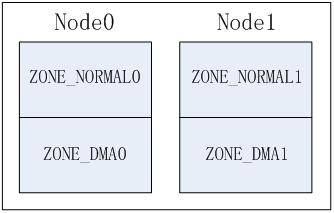
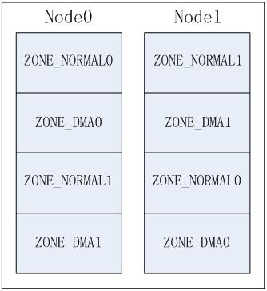
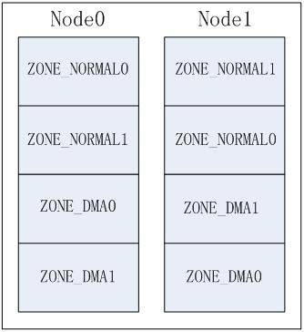
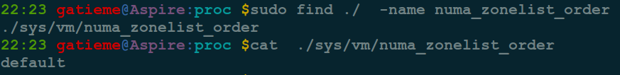

初始化内存管理
=======


| 日期 | 内核版本 | 架构| 作者 | GitHub| CSDN |
| ------- |:-------:|:-------:|:-------:|:-------:|:-------:|
| 2016-06-14 | [Linux-4.7](http://lxr.free-electrons.com/source/?v=4.7) | X86 & arm | [gatieme](http://blog.csdn.net/gatieme) | [LinuxDeviceDrivers](https://github.com/gatieme/LDD-LinuxDeviceDrivers) | [Linux内存管理](http://blog.csdn.net/gatieme/article/category/6225543) |

http://blog.csdn.net/vanbreaker/article/details/7554977


http://blog.csdn.net/yuzhihui_no1/article/details/50759567

http://www.cnblogs.com/zhenjing/archive/2012/03/21/linux_numa.html

http://www.linuxidc.com/Linux/2012-05/60230.htm


在内存管理的上下文中, 初始化(initialization)可以有多种含义. 在许多CPU上, 必须显式设置适用于Linux内核的内存模型. 例如在x86_32上需要切换到保护模式, 然后奇偶内核才能检测到可用内存和寄存器.


#1	前景回顾
-------


##1.1	Linux内存管理的层次结构
-------


Linux把物理内存划分为三个层次来管理

| 层次 | 描述 |
|:----:|:----:|
| 存储节点(Node) |  CPU被划分为多个节点(node), 内存则被分簇, 每个CPU对应一个本地物理内存, 即一个CPU-node对应一个内存簇bank，即每个内存簇被认为是一个节点 |
| 管理区(Zone)   | 每个物理内存节点node被划分为多个内存管理区域, 用于表示不同范围的内存, 内核可以使用不同的映射方式映射物理内存 |
| 页面(Page) 	   |	内存被细分为多个页面帧, 页面是最基本的页面分配的单位　｜

为了支持NUMA模型，也即CPU对不同内存单元的访问时间可能不同，此时系统的物理内存被划分为几个节点(node), 一个node对应一个内存簇bank，即每个内存簇被认为是一个节点


*	首先, 内存被划分为**结点**. 每个节点关联到系统中的一个处理器, 内核中表示为`pg_data_t`的实例. 系统中每个节点被链接到一个以NULL结尾的`pgdat_list`链表中<而其中的每个节点利用`pg_data_tnode_next`字段链接到下一节．而对于PC这种UMA结构的机器来说, 只使用了一个成为contig_page_data的静态pg_data_t结构.

*	接着各个节点又被划分为内存管理区域, 一个**管理区域**通过struct zone_struct描述, 其被定义为zone_t, 用以表示内存的某个范围, 低端范围的16MB被描述为ZONE_DMA, 某些工业标准体系结构中的(ISA)设备需要用到它, 然后是可直接映射到内核的普通内存域ZONE_NORMAL,最后是超出了内核段的物理地址域ZONE_HIGHMEM, 被称为高端内存.　是系统中预留的可用内存空间, 不能被内核直接映射.


*	最后**页帧(page frame)**代表了系统内存的最小单位, 堆内存中的每个页都会创建一个struct page的一个实例. 传统上，把内存视为连续的字节，即内存为字节数组，内存单元的编号(地址)可作为字节数组的索引. 分页管理时，将若干字节视为一页，比如4K byte. 此时，内存变成了连续的页，即内存为页数组，每一页物理内存叫页帧，以页为单位对内存进行编号，该编号可作为页数组的索引，又称为页帧号.


##1.2	内存结点pg_data_t
-------

在LINUX中引入一个数据结构`struct pglist_data` ，来描述一个node，定义在[`include/linux/mmzone.h`](http://lxr.free-electrons.com/source/include/linux/mmzone.h#L630) 文件中。（这个结构被typedef pg_data_t）。


*    对于NUMA系统来讲， 整个系统的内存由一个[node_data](http://lxr.free-electrons.com/source/arch/s390/numa/numa.c?v=4.7#L23)的pg_data_t指针数组来管理

*    对于PC这样的UMA系统，使用struct pglist_data contig_page_data ，作为系统唯一的node管理所有的内存区域。（UMA系统中中只有一个node）

可以使用NODE_DATA(node_id)来查找系统中编号为node_id的结点, 而UMA结构下由于只有一个结点, 因此该宏总是返回全局的contig_page_data, 而与参数node_id无关.

**NODE_DATA(node_id)查找编号node_id的结点pg_data_t信息** 参见[NODE_DATA的定义](http://lxr.free-electrons.com/ident?v=4.7;i=NODE_DATA)

```cpp
extern struct pglist_data *node_data[];
#define NODE_DATA(nid)          (node_data[(nid)])
```


在UMA结构的机器中, 只有一个node结点即contig_page_data, 此时NODE_DATA直接指向了全局的contig_page_data, 而与node的编号nid无关, 参照[include/linux/mmzone.h?v=4.7, line 858](http://lxr.free-electrons.com/source/include/linux/mmzone.h?v=4.7#L858)


```cpp
extern struct pglist_data contig_page_data;
#define NODE_DATA(nid)          (&contig_page_data)

```

##1.2	物理内存区域
-------

因为实际的计算机体系结构有硬件的诸多限制, 这限制了页框可以使用的方式. 尤其是, Linux内核必须处理80x86体系结构的两种硬件约束.

*	ISA总线的直接内存存储DMA处理器有一个严格的限制 : 他们只能对RAM的前16MB进行寻址

*	在具有大容量RAM的现代32位计算机中, CPU不能直接访问所有的物理地址, 因为线性地址空间太小, 内核不可能直接映射所有物理内存到线性地址空间, 我们会在后面典型架构(x86)上内存区域划分详细讲解x86_32上的内存区域划分


因此Linux内核对不同区域的内存需要采用不同的管理方式和映射方式, 因此内核将物理地址或者成用zone_t表示的不同地址区域

对于x86_32的机器，管理区(内存区域)类型如下分布


| 类型 | 区域 |
| :------- | ----: |
| ZONE_DMA | 0~15MB |
| ZONE_NORMAL | 16MB~895MB |
| ZONE_HIGHMEM | 896MB~物理内存结束 |


##1.3	物理页帧
-------

内核把物理页作为内存管理的基本单位. 尽管处理器的最小可寻址单位通常是字, 但是, 内存管理单元MMU通常以页为单位进行处理. 因此，从虚拟内存的上来看，页就是最小单位.

页帧代表了系统内存的最小单位, 对内存中的每个页都会创建struct page的一个实例. 内核必须要保证page结构体足够的小，否则仅struct page就要占用大量的内存.


 内核用[struct  page(include/linux/mm_types.h?v=4.7, line 45)](http://lxr.free-electrons.com/source/include/linux/mm_types.h?v4.7#L45)结构表示系统中的每个物理页.

出于节省内存的考虑，struct page中使用了大量的联合体union.


`mem_map`是一个struct page的数组，管理着系统中所有的物理内存页面。在系统启动的过程中，创建和分配mem_map的内存区域, mem_map定义在[mm/page_alloc.c?v=4.7, line 6691](http://lxr.free-electrons.com/source/mm/page_alloc.c?v=4.7#L6691)


UMA体系结构中，free_area_init函数在系统唯一的struct node对象contig_page_data中node_mem_map成员赋值给全局的mem_map变量

##1.4	今日内容(启动过程中的内存初始化)
-------


**启动过程中的内存初始化**

在初始化过程中, 还必须建立内存管理的数据结构, 以及很多事务. 因为内核在内存管理完全初始化之前就需要使用内存. 在系统启动过程期间, 使用了额外的简化悉尼股市的内存管理模块, 然后在初始化完成后, 将旧的模块丢弃掉.


**建立内存管理的数据结构**

对相关数据结构的初始化是从全局启动函数start_kernel中开始的, 该函数在加载内核并激活各个子系统之后执行. 由于内存管理是内核一个非常重要的部分, 因此在特定体系结构的设置步骤中检测并确定系统中内存的分配情况后, 会立即执行内存管理的初始化.


##1.5	系统启动阶段的内存初始化过程
-------

首先我们来看看start_kernel是如何初始化系统的, start_kerne定义在[init/main.c?v=4.7, line 479](http://lxr.free-electrons.com/source/init/main.c?v=4.7#L479)

其代码很复杂, 我们只截取出其中与内存管理初始化相关的部分, 如下所示


```cpp
asmlinkage __visible void __init start_kernel(void)
{

    setup_arch(&command_line);
    mm_init_cpumask(&init_mm);

    setup_per_cpu_areas();


    build_all_zonelists(NULL, NULL);
    page_alloc_init();


    /*
     * These use large bootmem allocations and must precede
     * mem_init();
     * kmem_cache_init();
     */
    mm_init();

    kmem_cache_init_late();

	kmemleak_init();
    setup_per_cpu_pageset();

    rest_init();
}
```


| 函数  | 功能 |
|:----:|:----:|
| [setup_arch](http://lxr.free-electrons.com/ident?v=4.7;i=setup_arch) | 是一个特定于体系结构的设置函数, 其中一项任务是负责初始化自举分配器 |
| [mm_init_cpumask](http://lxr.free-electrons.com/source/include/linux/mm_types.h?v=4.7#L522) | 初始化CPU屏蔽字 |
| [setup_per_cpu_areas](http://lxr.free-electrons.com/ident?v=4.7;i=setup_per_cpu_areas) | 函数[(查看定义)](http://lxr.free-electrons.com/source/mm/percpu.c?v4.7#L2205])给每个CPU分配内存，并拷贝.data.percpu段的数据. 为系统中的每个CPU的per_cpu变量申请空间.<br>在SMP系统中, setup_per_cpu_areas初始化源代码中(使用[per_cpu宏](http://lxr.free-electrons.com/source/include/linux/percpu-defs.h#L256))定义的静态per-cpu变量, 这种变量对系统中每个CPU都有一个独立的副本. <br>此类变量保存在内核二进制影像的一个独立的段中, setup_per_cpu_areas的目的就是为系统中各个CPU分别创建一份这些数据的副本<br>在非SMP系统中这是一个空操作 |
| [build_all_zonelists](http://lxr.free-electrons.com/source/mm/page_alloc.c?v4.7#L5029) | 建立并初始化结点和内存域的数据结构 |
| [mm_init](http://lxr.free-electrons.com/source/init/main.c?v4.7#L464) | 建立了内核的内存分配器, <br>其中通过[mem_init](http://lxr.free-electrons.com/ident?v=4.7&i=mem_init)停用bootmem分配器并迁移到实际的内存管理器(比如伙伴系统)<br>然后调用kmem_cache_init函数初始化内核内部用于小块内存区的分配器 |
| [kmem_cache_init_late](http://lxr.free-electrons.com/source/mm/slab.c?v4.7#L1378) | 在kmem_cache_init之后, 完善分配器的缓存机制,　当前3个可用的内核内存分配器[slab](http://lxr.free-electrons.com/source/mm/slab.c?v4.7#L1378), [slob](http://lxr.free-electrons.com/source/mm/slob.c?v4.7#L655), [slub](http://lxr.free-electrons.com/source/mm/slub.c?v=4.7#L3960)都会定义此函数　|
| [kmemleak_init](http://lxr.free-electrons.com/source/mm/kmemleak.c?v=4.7#L1857) | Kmemleak工作于内核态，Kmemleak 提供了一种可选的内核泄漏检测，其方法类似于跟踪内存收集器。当独立的对象没有被释放时，其报告记录在 [/sys/kernel/debug/kmemleak](http://lxr.free-electrons.com/source/mm/kmemleak.c?v=4.7#L1467)中, Kmemcheck能够帮助定位大多数内存错误的上下文 |
| [setup_per_cpu_pageset](http://lxr.free-electrons.com/source/mm/page_alloc.c?v=4.7#L5392) | 初始化CPU高速缓存行, 为pagesets的第一个数组元素分配内存, 换句话说, 其实就是第一个系统处理器分配<br>由于在分页情况下，每次存储器访问都要存取多级页表，这就大大降低了访问速度。所以，为了提高速度，在CPU中设置一个最近存取页面的高速缓存硬件机制，当进行存储器访问时，先检查要访问的页面是否在高速缓存中. |


##1.6	初始化阶段的引导内存分配器bootmem
-------

在启动过程期间, 尽管内存管理尚未初始化, 但是内核仍然需要分配内存以创建各种数据结构. 因此在系统启动过程期间, 内核使用了一个额外的简化形式的内存管理模块**引导内存分配器(boot memory allocator--bootmem分配器)**, 用于在启动阶段早期分配内存, 而在系统初始化完成后, 该分配器被内核抛弃, 然后初始化了一套新的更加完善的内存分配器.

显然, 对该内存分配器的需求集中于简单性方面,　而不是性能和通用性, 它仅用于初始化阶段. 因此内核开发者决定实现一个最先适配(first-first)分配器用于在启动阶段管理内存. 这是可能想到的最简单的方式.

内核通过start_kernel


#2	节点和内存域的初始化
-------


##2.1	zone_sizes_init
-------

在内核首先通过setup_arch()-->paging_init()-->bootmem_init()-->zone_sizes_init()来初始化节点和管理区的一些数据项


在获取了三个管理区的页面数后，通过free_area_init_nodes()来完成后续工作, 其中核心函数为free_area_init_node(),用来针对特定的节点进行初始化

至此，节点和管理区的关键数据已完成初始化，内核在后面为内存管理做得一个准备工作就是将所有节点的管理区都链入到zonelist中，便于后面内存分配工作的进行

内核在start_kernel()-->build_all_zonelist()中完成zonelist的初始化


##build_all_zonelists
-------


内核在start_kernel中通过build_all_zonelists完成了内存结点及其管理内存域的初始化工作, 调用如下


```cpp
  build_all_zonelists(NULL, NULL);
```

[build_all_zonelists](http://lxr.free-electrons.com/source/mm/page_alloc.c?v4.7#L5029)建立内存管理结点及其内存域所需的数据结构.

##2.1	设置结点初始化顺序
-------

在build_all_zonelists开始, 首先内核通过set_zonelist_order函数设置了`zonelist_order`,如下所示, 参见[mm/page_alloc.c?v=4.7, line 5031](http://lxr.free-electrons.com/source/mm/page_alloc.c?v=4.7#L5031)

```cpp
void __ref build_all_zonelists(pg_data_t *pgdat, struct zone *zone)
{
	set_zonelist_order();
	/* .......  */
}
```


##2.1.1	zone table
-------


前面我们讲解内存管理域时候讲解到, 系统中的所有管理域都存储在一个多维的数组zone_table. 内核在初始化内存管理区时, 必须要建立管理区表zone_table. 参见[mm/page_alloc.c?v=2.4.37, line 38](http://lxr.free-electrons.com/source/mm/page_alloc.c?v=2.4.37#L38)


```cpp
/*
 *
 * The zone_table array is used to look up the address of the
 * struct zone corresponding to a given zone number (ZONE_DMA,
 * ZONE_NORMAL, or ZONE_HIGHMEM).
 */
zone_t *zone_table[MAX_NR_ZONES*MAX_NR_NODES];
EXPORT_SYMBOL(zone_table);
```

*	MAX_NR_NODES为系统中内存结点的数目

*	MAX_NR_ZONES为系统中单个内存结点所拥有的最大内存区域数目


##2.1.2	内存域初始化顺序zonelist_order
-------


NUMA系统中存在多个节点, 每个节点对应一个`struct pglist_data`结构, 每个结点中可以包含多个zone, 如: ZONE_DMA, ZONE_NORMAL, 这样就产生几种排列顺序, 以2个节点2个zone为例(zone从高到低排列, ZONE_DMA0表示节点0的ZONE_DMA，其它类似).

*	Legacy方式, 每个节点只排列自己的zone；



*	Node方式, 按节点顺序依次排列，先排列本地节点的所有zone，再排列其它节点的所有zone。





*	Zone方式, 按zone类型从高到低依次排列各节点的同相类型zone





可通过启动参数"numa_zonelist_order"来配置zonelist order，内核定义了3种配置, 这些顺序定义在[mm/page_alloc.c?v=4.7, line 4551](http://lxr.free-electrons.com/source/mm/page_alloc.c?v=4.7#L4551)

```cpp
// http://lxr.free-electrons.com/source/mm/page_alloc.c?v=4.7#L4551
/*
 *  zonelist_order:
 *  0 = automatic detection of better ordering.
 *  1 = order by ([node] distance, -zonetype)
 *  2 = order by (-zonetype, [node] distance)
 *
 *  If not NUMA, ZONELIST_ORDER_ZONE and ZONELIST_ORDER_NODE will create
 *  the same zonelist. So only NUMA can configure this param.
 */
#define ZONELIST_ORDER_DEFAULT  0 /* 智能选择Node或Zone方式 */

#define ZONELIST_ORDER_NODE     1 /* 对应Node方式 */

#define ZONELIST_ORDER_ZONE     2 /* 对应Zone方式 */
```

>注意
>
>在非NUMA系统中(比如UMA), 由于只有一个内存结点, 因此ZONELIST_ORDER_ZONE和ZONELIST_ORDER_NODE选项会配置相同的内存域排列方式, 因此, 只有NUMA可以配置这几个参数


全局的current_zonelist_order变量标识了系统中的当前使用的内存域排列方式, 默认配置为ZONELIST_ORDER_DEFAULT, 参见[mm/page_alloc.c?v=4.7, line 4564](http://lxr.free-electrons.com/source/mm/page_alloc.c?v=4.7#L4564)


```cpp
//  http://lxr.free-electrons.com/source/mm/page_alloc.c?v=4.7#L4564
/* zonelist order in the kernel.
 * set_zonelist_order() will set this to NODE or ZONE.
 */
static int current_zonelist_order = ZONELIST_ORDER_DEFAULT;
static char zonelist_order_name[3][8] = {"Default", "Node", "Zone"};
```


而zonelist_order_name方式分别对应了Legacy方式, Node方式和Zone方式. 其zonelist_order_name[current_zonelist_order]就标识了当前系统中所使用的内存域排列方式的名称"Default", "Node", "Zone".


| 宏 | zonelist_order_name[宏](排列名称) | 排列方式 | 描述 |
|:--:|:-------------------:|:------:|:----:|
| ZONELIST_ORDER_DEFAULT | Default |  | 由系统智能选择Node或Zone方式 |
| ZONELIST_ORDER_NODE | Node | Node方式 | 按节点顺序依次排列，先排列本地节点的所有zone，再排列其它节点的所有zone |
| ZONELIST_ORDER_ZONE | Zone | Zone方式 | 按zone类型从高到低依次排列各节点的同相类型zone |


##2.1.3	set_zonelist_order设置排列方式
-------

内核就通过通过set_zonelist_order函数设置当前系统的内存域排列方式current_zonelist_order, 其定义依据系统的NUMA结构还是UMA结构有很大的不同.

```cpp
// http://lxr.free-electrons.com/source/mm/page_alloc.c?v=4.7#L4571
#ifdef CONFIG_NUMA
/* The value user specified ....changed by config */
static int user_zonelist_order = ZONELIST_ORDER_DEFAULT;
/* string for sysctl */
#define NUMA_ZONELIST_ORDER_LEN 16
char numa_zonelist_order[16] = "default";


//  http://lxr.free-electrons.com/source/mm/page_alloc.c#L4571
static void set_zonelist_order(void)
{
    if (user_zonelist_order == ZONELIST_ORDER_DEFAULT)
        current_zonelist_order = default_zonelist_order();
    else
        current_zonelist_order = user_zonelist_order;
}


#else   /* CONFIG_NUMA */

//  http://lxr.free-electrons.com/source/mm/page_alloc.c?v=4.7#L4892
static void set_zonelist_order(void)
{
	current_zonelist_order = ZONELIST_ORDER_ZONE;
}
```


其设置的基本流程如下

*	如果系统当前系统是非NUMA结构的, 则系统中只有一个结点, 配置ZONELIST_ORDER_NODE和ZONELIST_ORDER_ZONE结果相同. 那么set_zonelist_order函数被定义为直接配置当前系统的内存域排列方式`current_zonelist_order`为ZONE方式(与NODE效果相同)

*	如果系统是NUMA结构, 则设置为系统指定的方式即可
	1.	当前的排列方式为ZONELIST_ORDER_DEFAULT, 即系统默认方式, 则current_zonelist_order则由内核交给default_zonelist_order采用一定的算法选择一个最优的分配策略,　目前的系统中如果是32位则配置为ZONE方式, 而如果是６４位系统则设置为NODE方式

	2.	当前的排列方式不是默认方式, 则设置为user_zonelist_order指定的内存域排列方式

##2.1.4	default_zonelist_order函数选择最优的配置
-------

在UMA结构下, 内存域使用NODE和ZONE两个排列方式会产生相同的效果, 因此系统不用特殊指定, 直接通过set_zonelist_order函数, 将当前系统的内存域排列方式`current_zonelist_order`配置为为ZONE方式(与NODE效果相同)即可


但是NUMA结构下, 默认情况下(当配置了ZONELIST_ORDER_DEFAULT), 系统需要根据系统自身的环境信息选择一个最优的配置(NODE或者ZONE方式), 这个工作就由**default_zonelist_order函数**了来完成. 其定义在[mm/page_alloc.c?v=4.7, line 4789](http://lxr.free-electrons.com/source/mm/page_alloc.c?v=4.7#L4789)


```cpp
#if defined(CONFIG_64BIT)
/*
 * Devices that require DMA32/DMA are relatively rare and do not justify a
 * penalty to every machine in case the specialised case applies. Default
 * to Node-ordering on 64-bit NUMA machines
 */
static int default_zonelist_order(void)
{
    return ZONELIST_ORDER_NODE;
}
#else
/*
 * On 32-bit, the Normal zone needs to be preserved for allocations accessible
 * by the kernel. If processes running on node 0 deplete the low memory zone
 * then reclaim will occur more frequency increasing stalls and potentially
 * be easier to OOM if a large percentage of the zone is under writeback or
 * dirty. The problem is significantly worse if CONFIG_HIGHPTE is not set.
 * Hence, default to zone ordering on 32-bit.
 */
static int default_zonelist_order(void)
{
    return ZONELIST_ORDER_ZONE;
}
#endif /* CONFIG_64BIT */
```


###2.1.5	user_zonelist_order用户指定排列方式
-------


在NUMA结构下, 系统支持用户指定内存域的排列方式, 用户以字符串的形式操作numa_zonelist_order(default, node和zone), 最终被内核转换为user_zonelist_order, 这个变量被指定为字符串numa_zonelist_order指定的排列方式, 他们定义在[mm/page_alloc.c?v4.7, line 4573](http://lxr.free-electrons.com/source/mm/page_alloc.c?v4.7#L4573), 注意只有在NUMA结构中才需要这个配置信息.


```cpp
#ifdef CONFIG_NUMA
/* The value user specified ....changed by config */
static int user_zonelist_order = ZONELIST_ORDER_DEFAULT;
/* string for sysctl */
#define NUMA_ZONELIST_ORDER_LEN 16
char numa_zonelist_order[16] = "default";

#else
/* ......*/
#endif
```

而接受和处理用户配置的工作, 自然是交给我们强大的proc文件系统来完成的, 可以通过/proc/sys/vm/numa_zonelist_order动态改变zonelist order的分配方式。





内核通过setup_numa_zonelist_order读取并处理用户写入的配置信息

*	接收到用户的信息后用__parse_numa_zonelist_order处理接收的参数

*	如果前面用__parse_numa_zonelist_order处理的信息串成功, 则将对用的设置信息写入到字符串numa_zonelist_order中


参见[mm/page_alloc.c?v=4.7, line 4578](http://lxr.free-electrons.com/source/mm/page_alloc.c?v=4.7#L4578)


```cpp
/*
 * interface for configure zonelist ordering.
 * command line option "numa_zonelist_order"
 *      = "[dD]efault   - default, automatic configuration.
 *      = "[nN]ode      - order by node locality, then by zone within node
 *      = "[zZ]one      - order by zone, then by locality within zone
 */

static int __parse_numa_zonelist_order(char *s)
{
    if (*s == 'd' || *s == 'D') {
        user_zonelist_order = ZONELIST_ORDER_DEFAULT;
    } else if (*s == 'n' || *s == 'N') {
        user_zonelist_order = ZONELIST_ORDER_NODE;
    } else if (*s == 'z' || *s == 'Z') {
        user_zonelist_order = ZONELIST_ORDER_ZONE;
    } else {
        pr_warn("Ignoring invalid numa_zonelist_order value:  %s\n", s);
        return -EINVAL;
    }
    return 0;
}

static __init int setup_numa_zonelist_order(char *s)
{
    int ret;

    if (!s)
        return 0;

    ret = __parse_numa_zonelist_order(s);
    if (ret == 0)
        strlcpy(numa_zonelist_order, s, NUMA_ZONELIST_ORDER_LEN);

    return ret;
}
early_param("numa_zonelist_order", setup_numa_zonelist_order);
```

##2.2	build_all_zonelists_init
-------


###2.2.1	system_state系统状态标识

其中`system_state`变量是一个系统全局定义的用来表示系统当前运行状态的枚举变量, 其定义在[include/linux/kernel.h?v=4.7, line 487](http://lxr.free-electrons.com/source/include/linux/kernel.h?v=4.7#L487)


```cpp
/* Values used for system_state */
extern enum system_states
{
	SYSTEM_BOOTING,
	SYSTEM_RUNNING,
	SYSTEM_HALT,
	SYSTEM_POWER_OFF,
	SYSTEM_RESTART,
} system_state;
```

*	如果系统system_state是SYSTEM_BOOTING, 则调用`build_all_zonelists_init`初始化所有的内存结点

*	否则的话如果定义了冷热页`CONFIG_MEMORY_HOTPLUG`且参数zone(待初始化的内存管理域zone)不为NULL, 则调用setup_zone_pageset设置冷热页


```cpp
if (system_state == SYSTEM_BOOTING)
{
	build_all_zonelists_init();
}
else
{
#ifdef CONFIG_MEMORY_HOTPLUG
	if (zone)
    	setup_zone_pageset(zone);
#endif
```

#3	特定于体系结构的设置
-------

##2.1	内核在内存中的布局
-------

##2.2	初始化过程
-------


##2.3	分页机制初始化
-------

##2.4	注册活动内存区
-------

##2.5	系统的地址空间设置
-------

