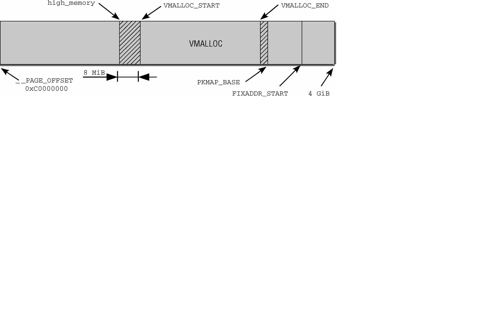
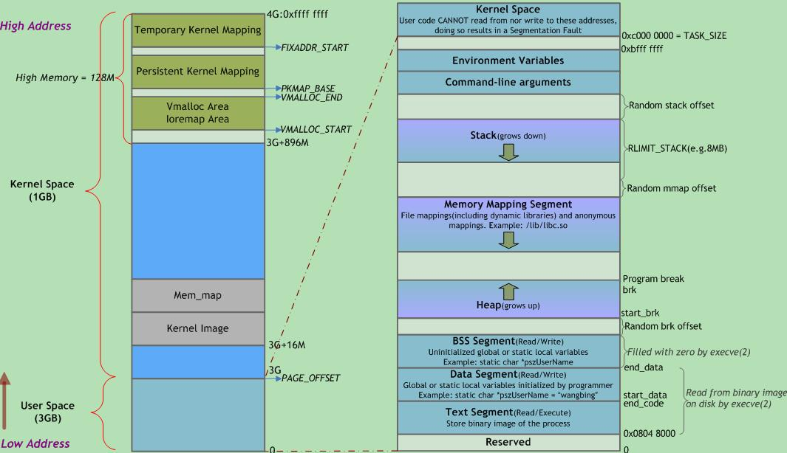

初始化内存管理
=======


| 日期 | 内核版本 | 架构| 作者 | GitHub| CSDN |
| ------- |:-------:|:-------:|:-------:|:-------:|:-------:|
| 2016-06-14 | [Linux-4.7](http://lxr.free-electrons.com/source/?v=4.7) | X86 & arm | [gatieme](http://blog.csdn.net/gatieme) | [LinuxDeviceDrivers](https://github.com/gatieme/LDD-LinuxDeviceDrivers) | [Linux内存管理](http://blog.csdn.net/gatieme/article/category/6225543) |

http://blog.csdn.net/vanbreaker/article/details/7554977


http://blog.csdn.net/yuzhihui_no1/article/details/50759567

http://www.cnblogs.com/zhenjing/archive/2012/03/21/linux_numa.html

http://www.linuxidc.com/Linux/2012-05/60230.htm


在内存管理的上下文中, 初始化(initialization)可以有多种含义. 在许多CPU上, 必须显式设置适用于Linux内核的内存模型. 例如在x86_32上需要切换到保护模式, 然后奇偶内核才能检测到可用内存和寄存器.


#1	前景回顾
-------


##1.1	Linux内存管理的层次结构
-------


Linux把物理内存划分为三个层次来管理

| 层次 | 描述 |
|:----:|:----:|
| 存储节点(Node) |  CPU被划分为多个节点(node), 内存则被分簇, 每个CPU对应一个本地物理内存, 即一个CPU-node对应一个内存簇bank，即每个内存簇被认为是一个节点 |
| 管理区(Zone)   | 每个物理内存节点node被划分为多个内存管理区域, 用于表示不同范围的内存, 内核可以使用不同的映射方式映射物理内存 |
| 页面(Page) 	   |	内存被细分为多个页面帧, 页面是最基本的页面分配的单位　｜

为了支持NUMA模型，也即CPU对不同内存单元的访问时间可能不同，此时系统的物理内存被划分为几个节点(node), 一个node对应一个内存簇bank，即每个内存簇被认为是一个节点


*	首先, 内存被划分为**结点**. 每个节点关联到系统中的一个处理器, 内核中表示为`pg_data_t`的实例. 系统中每个节点被链接到一个以NULL结尾的`pgdat_list`链表中<而其中的每个节点利用`pg_data_tnode_next`字段链接到下一节．而对于PC这种UMA结构的机器来说, 只使用了一个成为contig_page_data的静态pg_data_t结构.

*	接着各个节点又被划分为内存管理区域, 一个**管理区域**通过struct zone_struct描述, 其被定义为zone_t, 用以表示内存的某个范围, 低端范围的16MB被描述为ZONE_DMA, 某些工业标准体系结构中的(ISA)设备需要用到它, 然后是可直接映射到内核的普通内存域ZONE_NORMAL,最后是超出了内核段的物理地址域ZONE_HIGHMEM, 被称为高端内存.　是系统中预留的可用内存空间, 不能被内核直接映射.


*	最后**页帧(page frame)**代表了系统内存的最小单位, 堆内存中的每个页都会创建一个struct page的一个实例. 传统上，把内存视为连续的字节，即内存为字节数组，内存单元的编号(地址)可作为字节数组的索引. 分页管理时，将若干字节视为一页，比如4K byte. 此时，内存变成了连续的页，即内存为页数组，每一页物理内存叫页帧，以页为单位对内存进行编号，该编号可作为页数组的索引，又称为页帧号.


##1.2	Linux内存管理的3个阶段
-------


在初始化过程中, 还必须建立内存管理的数据结构, 以及很多事务. 因为内核在内存管理完全初始化之前就需要使用内存. 在系统启动过程期间, 使用了额外的简化悉尼股市的内存管理模块, 然后在初始化完成后, 将旧的模块丢弃掉.


因此我们可以把linux内核的内存管理分三个阶段。

| 阶段 | 起点 | 终点 | 描述 |
|:-----:|:-----:|:-----:|
| 第一阶段 | 系统启动 | bootmem或者memblock初始化完成 | 此阶段只能使用memblock_reserve函数分配内存， 早期内核中使用init_bootmem_done = 1标识此阶段结束 |
| 第二阶段 | bootmem或者memblock初始化完 | buddy完成前 | 引导内存分配器bootmem或者memblock接受内存的管理工作, 早期内核中使用mem_init_done = 1标记此阶段的结束 |
| 第三阶段 | buddy初始化完成 | 系统停止运行 | 可以用cache和buddy分配内存 |


##1.3	系统启动阶段的内存初始化过程
-------

首先我们来看看start_kernel是如何初始化系统的, start_kerne定义在[init/main.c?v=4.7, line 479](http://lxr.free-electrons.com/source/init/main.c?v=4.7#L479)

其代码很复杂, 我们只截取出其中与内存管理初始化相关的部分, 如下所示


```cpp
asmlinkage __visible void __init start_kernel(void)
{

    setup_arch(&command_line);
    mm_init_cpumask(&init_mm);

    setup_per_cpu_areas();


    build_all_zonelists(NULL, NULL);
    page_alloc_init();


    /*
     * These use large bootmem allocations and must precede
     * mem_init();
     * kmem_cache_init();
     */
    mm_init();

    kmem_cache_init_late();

	kmemleak_init();
    setup_per_cpu_pageset();

    rest_init();
}
```


| 函数  | 功能 |
|:----:|:----:|
| [setup_arch](http://lxr.free-electrons.com/ident?v=4.7;i=setup_arch) | 是一个特定于体系结构的设置函数, 其中一项任务是负责初始化自举分配器 |
| [mm_init_cpumask](http://lxr.free-electrons.com/source/include/linux/mm_types.h?v=4.7#L522) | 初始化CPU屏蔽字 |
| [setup_per_cpu_areas](http://lxr.free-electrons.com/ident?v=4.7;i=setup_per_cpu_areas) | 函数[(查看定义)](http://lxr.free-electrons.com/source/mm/percpu.c?v4.7#L2205])给每个CPU分配内存，并拷贝.data.percpu段的数据. 为系统中的每个CPU的per_cpu变量申请空间.<br>在SMP系统中, setup_per_cpu_areas初始化源代码中(使用[per_cpu宏](http://lxr.free-electrons.com/source/include/linux/percpu-defs.h#L256))定义的静态per-cpu变量, 这种变量对系统中每个CPU都有一个独立的副本. <br>此类变量保存在内核二进制影像的一个独立的段中, setup_per_cpu_areas的目的就是为系统中各个CPU分别创建一份这些数据的副本<br>在非SMP系统中这是一个空操作 |
| [build_all_zonelists](http://lxr.free-electrons.com/source/mm/page_alloc.c?v4.7#L5029) | 建立并初始化结点和内存域的数据结构 |
| [mm_init](http://lxr.free-electrons.com/source/init/main.c?v4.7#L464) | 建立了内核的内存分配器, <br>其中通过[mem_init](http://lxr.free-electrons.com/ident?v=4.7&i=mem_init)停用bootmem分配器并迁移到实际的内存管理器(比如伙伴系统)<br>然后调用kmem_cache_init函数初始化内核内部用于小块内存区的分配器 |
| [kmem_cache_init_late](http://lxr.free-electrons.com/source/mm/slab.c?v4.7#L1378) | 在kmem_cache_init之后, 完善分配器的缓存机制,　当前3个可用的内核内存分配器[slab](http://lxr.free-electrons.com/source/mm/slab.c?v4.7#L1378), [slob](http://lxr.free-electrons.com/source/mm/slob.c?v4.7#L655), [slub](http://lxr.free-electrons.com/source/mm/slub.c?v=4.7#L3960)都会定义此函数　|
| [kmemleak_init](http://lxr.free-electrons.com/source/mm/kmemleak.c?v=4.7#L1857) | Kmemleak工作于内核态，Kmemleak 提供了一种可选的内核泄漏检测，其方法类似于跟踪内存收集器。当独立的对象没有被释放时，其报告记录在 [/sys/kernel/debug/kmemleak](http://lxr.free-electrons.com/source/mm/kmemleak.c?v=4.7#L1467)中, Kmemcheck能够帮助定位大多数内存错误的上下文 |
| [setup_per_cpu_pageset](http://lxr.free-electrons.com/source/mm/page_alloc.c?v=4.7#L5392) | 初始化CPU高速缓存行, 为pagesets的第一个数组元素分配内存, 换句话说, 其实就是第一个系统处理器分配<br>由于在分页情况下，每次存储器访问都要存取多级页表，这就大大降低了访问速度。所以，为了提高速度，在CPU中设置一个最近存取页面的高速缓存硬件机制，当进行存储器访问时，先检查要访问的页面是否在高速缓存中. |


##1.4	setup_arch函数初始化内存流程
-------


前面我们的内核从start_kernel开始, 进入setup_arch(), 并完成了早期内存分配器的初始化和设置工作.

```cpp
void __init setup_arch(char **cmdline_p)
{
	/*  初始化memblock  */
	arm64_memblock_init( );

	/*  分页机制初始化  */
	paging_init();

	bootmem_init();
}
```

| 流程 | 描述 |
|:---:|:----:|
| [arm64_memblock_init](http://lxr.free-electrons.com/source/arch/arm64/kernel/setup.c?v=4.7#L229) | 初始化memblock内存分配器 |
| [paging_init](http://lxr.free-electrons.com/source/arch/arm64/mm/mmu.c?v=4.7#L538) | 初始化分页机制 |
| [bootmem_init](http://lxr.free-electrons.com/source/arch/arm64/mm/init.c?v=4.7#L306) | 初始化内存管理 |

之前的文章中我们已经讲过了memblock初始化的过程, 现在我们来看看内核是如何初始化内存管理器的


##1.5	(第一阶段)启动过程中的内存分配器
-------


在初始化过程中, 还必须建立内存管理的数据结构, 以及很多事务. 因为内核在内存管理完全初始化之前就需要使用内存. 在系统启动过程期间, 使用了额外的简化悉尼股市的内存管理模块, 然后在初始化完成后, 将旧的模块丢弃掉.

这个阶段的内存分配其实很简单, 因此我们往往称之为内存分配器(而不是内存管理器), 早期的内核中内存分配器使用的**bootmem引导分配器**, 它基于一个内存位图bitmap, 使用最优适配算法来查找内存, 但是这个分配器有很大的缺陷, 最严重的就是内存碎片的问题, 因此在后来的内核中将其舍弃《而使用了**新的memblock机制**. memblock机制的初始化在arm64上是通过[arm64_memblock_init](http://lxr.free-electrons.com/source/arch/arm64/kernel/setup.c?v=4.7#L229)函数来实现的


而第一阶段中memblock的初始化工作就是通过start_kernel->setup_arch->arm64_memblock_init来完成的


##1.7	今日内容(分页机制初始化)
-------


在初始化内存的结点和内存区域之前, 内核先通过pagging_init初始化了内核的分页机制.

在分页机制完成后, 才会开始初始化系统的内存数据结构(包括内存节点数据和内存区域), 并在随后初始化buddy伙伴系统来接管内存管理的工作


#2	分页机制初始化
-------


arm64架构下, 内核在start_kernel()->setup_arch()中通过arm64_memblock_init( )完成了memblock的初始化之后, 接着通过setup_arch()->paging_init()开始初始化分页机制


paging_init负责建立只能用于内核的页表, 用户空间是无法访问的. 这对管理普通应用程序和内核访问内存的方式，有深远的影响


##2.1	虚拟地址空间(以x86_32位系统为例)
-------


因此在仔细考察其实现之前，很重要的一点是解释该函数的目的

在x86_32系统上内核通常将总的4GB可用虚拟地址空间按3:1的比例划分给用户空间和内核空间, 虚拟地址空间的低端3GB
用于用户状态应用程序, 而高端的1GB则专用于内核. 尽管在分配内核的虚拟地址空间时, 当前系统上下文是不相干的, 但每个进程都有自身特定的地址空间.

这些划分主要的动机如下所示

*	在用户应用程序的执行切换到核心态时（这总是会发生，例如在使用系统调用或发生周期性的时钟中断时），内核必须装载在一个可靠的环境中。因此有必要将地址空间的一部分分配给内核专用.

*	物理内存页则映射到内核地址空间的起始处，以便内核直接访问，而无需复杂的页表操作.

如果所有物理内存页都映射到用户空间进程能访问的地址空间中, 如果在系统上有几个应用程序在运行, 将导致严重的安全问题. 每个应用程序都能够读取和修改其他进程在物理内存中的内存区. 显然必须不惜任何代价防止这种情况出现.

虽然用于用户层进程的虚拟地址部分随进程切换而改变，但是内核部分总是相同的


出于内存保护等一系列的考虑, 内核将整个进程的虚拟运行空间划分为内核虚拟运行空间和内核虚拟运行空间


按3:1的比例划分地址空间, 只是约略反映了内核中的情况，内核地址空间作为内核的常驻虚拟地址空间, 自身又分为各个段



地址空间的第一段用于将系统的所有物理内存页映射到内核的虚拟地址空间中。由于内核地址空间从偏移量0xC0000000开始，即经常提到的3 GiB，每个虚拟地址x都对应于物理地址x—0xC0000000，因此这是一个简单的线性平移。

直接映射区域从0xC0000000到high_memory地址，high_memory准确的数值稍后讨论。第1章提到过，这种方案有一问题。由于内核的虚拟地址空间只有1 GiB，最多只能映射1 GiB物理内存。IA-32系统（没有PAE）最大的内存配置可以达到4 GiB，引出的一个问题是，如何处理剩下的内存？


这里有个坏消息。如果物理内存超过896 MiB，则内核无法直接映射全部物理内存。该值甚至比此前提到的最大限制1 GiB还小，因为内核必须保留地址空间最后的128 MiB用于其他目的，我会稍后解释。将这128 MiB加上直接映射的896 MiB内存，则得到内核虚拟地址空间的总数为1 024 MiB = 1GiB。内核使用两个经常使用的缩写normal和highmem，来区分是否可以直接映射的页帧。

内核地址空间的最后128 MiB用于何种用途呢？如图3-15所示，该部分有3个用途。

*	虚拟内存中连续、但物理内存中不连续的内存区，可以在vmalloc区域分配。该机制通常用于用户过程，内核自身会试图尽力避免非连续的物理地址。内核通常会成功，因为大部分大的内存块都在启动时分配给内核，那时内存的碎片尚不严重。但在已经运行了很长时间的系统上，在内核需要物理内存时，就可能出现可用空间不连续的情况。此类情况，主要出现在动态加载模块时

*	持久映射用于将高端内存域中的非持久页映射到内核中

*	固定映射是与物理地址空间中的固定页关联的虚拟地址空间项，但具体关联的页帧可以自由
选择。它与通过固定公式与物理内存关联的直接映射页相反，虚拟固定映射地址与物理内存位置之间
的关联可以自行定义，关联建立后内核总是会注意到的


同样我们的[用户空间](http://www.360doc.com/content/14/1020/21/19947352_418512226.shtml), 也被划分为几个段, 包括从高地址到低地址分别为 :




<br>

| 区域 | 存储内容 |
|:---:|:------:|
|  栈   | 局部变量, 函数参数, 返回地址等 |
|  堆   | 动态分配的内存 |
| BSS段 | 未初始化或初值为0的全局变量和静态局部变量|
| 数据段 | 一初始化且初值非0的全局变量和静态局部变量|
| 代码段 | 可执行代码, 字符串面值, 只读变量 |


##2.2	paging_init初始化分页机制
-------

paging_init函数定义在[arch/arm64/mm/mmu.c?v=4.7, line 538](http://lxr.free-electrons.com/source/arch/arm64/mm/mmu.c?v=4.7#L538)

```cpp
/*
 * paging_init() sets up the page tables, initialises the zone memory
 * maps and sets up the zero page.
 */
void __init paging_init(void)
{
    phys_addr_t pgd_phys = early_pgtable_alloc();
    pgd_t *pgd = pgd_set_fixmap(pgd_phys);

    map_kernel(pgd);
    map_mem(pgd);

    /*
     * We want to reuse the original swapper_pg_dir so we don't have to
     * communicate the new address to non-coherent secondaries in
     * secondary_entry, and so cpu_switch_mm can generate the address with
     * adrp+add rather than a load from some global variable.
     *
     * To do this we need to go via a temporary pgd.
     */
    cpu_replace_ttbr1(__va(pgd_phys));
    memcpy(swapper_pg_dir, pgd, PAGE_SIZE);
    cpu_replace_ttbr1(swapper_pg_dir);

    pgd_clear_fixmap();
    memblock_free(pgd_phys, PAGE_SIZE);

    /*
     * We only reuse the PGD from the swapper_pg_dir, not the pud + pmd
     * allocated with it.
     */
    memblock_free(__pa(swapper_pg_dir) + PAGE_SIZE,
              SWAPPER_DIR_SIZE - PAGE_SIZE);
}
```