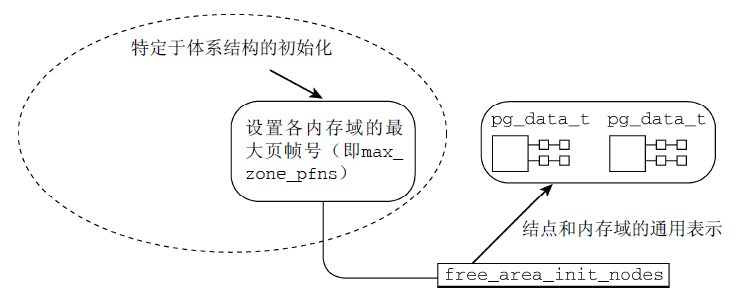

初始化内存管理
=======


| 日期 | 内核版本 | 架构| 作者 | GitHub| CSDN |
| ------- |:-------:|:-------:|:-------:|:-------:|:-------:|
| 2016-06-14 | [Linux-4.7](http://lxr.free-electrons.com/source/?v=4.7) | X86 & arm | [gatieme](http://blog.csdn.net/gatieme) | [LinuxDeviceDrivers](https://github.com/gatieme/LDD-LinuxDeviceDrivers) | [Linux内存管理](http://blog.csdn.net/gatieme/article/category/6225543) |


在内存管理的上下文中, 初始化(initialization)可以有多种含义. 在许多CPU上, 必须显式设置适用于Linux内核的内存模型. 例如在x86_32上需要切换到保护模式, 然后奇偶内核才能检测到可用内存和寄存器.


#1	前景回顾
-------


##1.1	Linux内存管理的层次结构
-------


Linux把物理内存划分为三个层次来管理

| 层次 | 描述 |
|:----:|:----:|
| 存储节点(Node) |  CPU被划分为多个节点(node), 内存则被分簇, 每个CPU对应一个本地物理内存, 即一个CPU-node对应一个内存簇bank，即每个内存簇被认为是一个节点 |
| 管理区(Zone)   | 每个物理内存节点node被划分为多个内存管理区域, 用于表示不同范围的内存, 内核可以使用不同的映射方式映射物理内存 |
| 页面(Page) 	   |	内存被细分为多个页面帧, 页面是最基本的页面分配的单位　｜

为了支持NUMA模型，也即CPU对不同内存单元的访问时间可能不同，此时系统的物理内存被划分为几个节点(node), 一个node对应一个内存簇bank，即每个内存簇被认为是一个节点


*	首先, 内存被划分为**结点**. 每个节点关联到系统中的一个处理器, 内核中表示为`pg_data_t`的实例. 系统中每个节点被链接到一个以NULL结尾的`pgdat_list`链表中<而其中的每个节点利用`pg_data_tnode_next`字段链接到下一节．而对于PC这种UMA结构的机器来说, 只使用了一个成为contig_page_data的静态pg_data_t结构.

*	接着各个节点又被划分为内存管理区域, 一个**管理区域**通过struct zone_struct描述, 其被定义为zone_t, 用以表示内存的某个范围, 低端范围的16MB被描述为ZONE_DMA, 某些工业标准体系结构中的(ISA)设备需要用到它, 然后是可直接映射到内核的普通内存域ZONE_NORMAL,最后是超出了内核段的物理地址域ZONE_HIGHMEM, 被称为高端内存.　是系统中预留的可用内存空间, 不能被内核直接映射.


*	最后**页帧(page frame)**代表了系统内存的最小单位, 堆内存中的每个页都会创建一个struct page的一个实例. 传统上，把内存视为连续的字节，即内存为字节数组，内存单元的编号(地址)可作为字节数组的索引. 分页管理时，将若干字节视为一页，比如4K byte. 此时，内存变成了连续的页，即内存为页数组，每一页物理内存叫页帧，以页为单位对内存进行编号，该编号可作为页数组的索引，又称为页帧号.


##1.2	今日内容(启动过程中的内存初始化)
-------


在初始化过程中, 还必须建立内存管理的数据结构, 以及很多事务. 因为内核在内存管理完全初始化之前就需要使用内存. 在系统启动过程期间, 使用了额外的简化悉尼股市的内存管理模块, 然后在初始化完成后, 将旧的模块丢弃掉.


因此我们可以把linux内核的内存管理分三个阶段。

| 阶段 | 起点 | 终点 | 描述 |
|:-----:|:-----:|:-----:|
| 第一阶段 | 系统启动 | bootmem或者memblock初始化完成 | 此阶段只能使用memblock_reserve函数分配内存， 早期内核中使用init_bootmem_done = 1标识此阶段结束 |
| 第二阶段 | bootmem或者memblock初始化完 | buddy完成前 | 引导内存分配器bootmem或者memblock接受内存的管理工作, 早期内核中使用mem_init_done = 1标记此阶段的结束 |
| 第三阶段 | buddy初始化完成 | 系统停止运行 | 可以用cache和buddy分配内存 |


##1.3	start_kernel系统启动阶段的内存初始化过程
-------

首先我们来看看start_kernel是如何初始化系统的, start_kerne定义在[init/main.c?v=4.7, line 479](http://lxr.free-electrons.com/source/init/main.c?v=4.7#L479)

其代码很复杂, 我们只截取出其中与内存管理初始化相关的部分, 如下所示


```cpp
asmlinkage __visible void __init start_kernel(void)
{

    setup_arch(&command_line);
    mm_init_cpumask(&init_mm);

    setup_per_cpu_areas();


    build_all_zonelists(NULL, NULL);
    page_alloc_init();


    /*
     * These use large bootmem allocations and must precede
     * mem_init();
     * kmem_cache_init();
     */
    mm_init();

    kmem_cache_init_late();

	kmemleak_init();
    setup_per_cpu_pageset();

    rest_init();
}
```


| 函数  | 功能 |
|:----:|:----:|
| [setup_arch](http://lxr.free-electrons.com/ident?v=4.7;i=setup_arch) | 是一个特定于体系结构的设置函数, 其中一项任务是负责初始化自举分配器 |
| [mm_init_cpumask](http://lxr.free-electrons.com/source/include/linux/mm_types.h?v=4.7#L522) | 初始化CPU屏蔽字 |
| [setup_per_cpu_areas](http://lxr.free-electrons.com/ident?v=4.7;i=setup_per_cpu_areas) | 函数[(查看定义)](http://lxr.free-electrons.com/source/mm/percpu.c?v4.7#L2205])给每个CPU分配内存，并拷贝.data.percpu段的数据. 为系统中的每个CPU的per_cpu变量申请空间.<br>在SMP系统中, setup_per_cpu_areas初始化源代码中(使用[per_cpu宏](http://lxr.free-electrons.com/source/include/linux/percpu-defs.h#L256))定义的静态per-cpu变量, 这种变量对系统中每个CPU都有一个独立的副本. <br>此类变量保存在内核二进制影像的一个独立的段中, setup_per_cpu_areas的目的就是为系统中各个CPU分别创建一份这些数据的副本<br>在非SMP系统中这是一个空操作 |
| [build_all_zonelists](http://lxr.free-electrons.com/source/mm/page_alloc.c?v4.7#L5029) | 建立并初始化结点和内存域的数据结构 |
| [mm_init](http://lxr.free-electrons.com/source/init/main.c?v4.7#L464) | 建立了内核的内存分配器, <br>其中通过[mem_init](http://lxr.free-electrons.com/ident?v=4.7&i=mem_init)停用bootmem分配器并迁移到实际的内存管理器(比如伙伴系统)<br>然后调用kmem_cache_init函数初始化内核内部用于小块内存区的分配器 |
| [kmem_cache_init_late](http://lxr.free-electrons.com/source/mm/slab.c?v4.7#L1378) | 在kmem_cache_init之后, 完善分配器的缓存机制,　当前3个可用的内核内存分配器[slab](http://lxr.free-electrons.com/source/mm/slab.c?v4.7#L1378), [slob](http://lxr.free-electrons.com/source/mm/slob.c?v4.7#L655), [slub](http://lxr.free-electrons.com/source/mm/slub.c?v=4.7#L3960)都会定义此函数　|
| [kmemleak_init](http://lxr.free-electrons.com/source/mm/kmemleak.c?v=4.7#L1857) | Kmemleak工作于内核态，Kmemleak 提供了一种可选的内核泄漏检测，其方法类似于跟踪内存收集器。当独立的对象没有被释放时，其报告记录在 [/sys/kernel/debug/kmemleak](http://lxr.free-electrons.com/source/mm/kmemleak.c?v=4.7#L1467)中, Kmemcheck能够帮助定位大多数内存错误的上下文 |
| [setup_per_cpu_pageset](http://lxr.free-electrons.com/source/mm/page_alloc.c?v=4.7#L5392) | 初始化CPU高速缓存行, 为pagesets的第一个数组元素分配内存, 换句话说, 其实就是第一个系统处理器分配<br>由于在分页情况下，每次存储器访问都要存取多级页表，这就大大降低了访问速度。所以，为了提高速度，在CPU中设置一个最近存取页面的高速缓存硬件机制，当进行存储器访问时，先检查要访问的页面是否在高速缓存中. |


##1.4	setup_arch函数初始化内存流程
-------


前面我们的内核从start_kernel开始, 进入setup_arch(), 并完成了早期内存分配器的初始化和设置工作.

```cpp
void __init setup_arch(char **cmdline_p)
{
	/*  初始化memblock  */
	arm64_memblock_init( );

	/*  分页机制初始化  */
	paging_init();

	bootmem_init();
}
```

| 流程 | 描述 |
|:---:|:----:|
| [arm64_memblock_init](http://lxr.free-electrons.com/source/arch/arm64/kernel/setup.c?v=4.7#L229) | 初始化memblock内存分配器 |
| [paging_init](http://lxr.free-electrons.com/source/arch/arm64/mm/mmu.c?v=4.7#L538) | 初始化分页机制 |
| [bootmem_init](http://lxr.free-electrons.com/source/arch/arm64/mm/init.c?v=4.7#L306) | 初始化内存管理 |


该函数主要执行了如下操作


1.	使用arm64_memblock_init来完成memblock机制的初始化工作, 至此memblock分配器接受系统中系统中内存的分配工作

2.	调用paging_init来完成系统分页机制的初始化工作, 建立页表, 从而内核可以完成虚拟内存的映射和转换工作

3.	最后调用bootmem_init来完成实现buddy内存管理所需要的工作


##1.5	(第一阶段)启动过程中的内存分配器
-------


在初始化过程中, 还必须建立内存管理的数据结构, 以及很多事务. 因为内核在内存管理完全初始化之前就需要使用内存. 在系统启动过程期间, 使用了额外的简化悉尼股市的内存管理模块, 然后在初始化完成后, 将旧的模块丢弃掉.

这个阶段的内存分配其实很简单, 因此我们往往称之为内存分配器(而不是内存管理器), 早期的内核中内存分配器使用的**bootmem引导分配器**, 它基于一个内存位图bitmap, 使用最优适配算法来查找内存, 但是这个分配器有很大的缺陷, 最严重的就是内存碎片的问题, 因此在后来的内核中将其舍弃《而使用了**新的memblock机制**. memblock机制的初始化在arm64上是通过[arm64_memblock_init](http://lxr.free-electrons.com/source/arch/arm64/kernel/setup.c?v=4.7#L229)函数来实现的

```cpp
```cpp
start_kernel()
    |---->page_address_init()
    |     考虑支持高端内存
    |     业务：初始化page_address_pool链表；
    |          将page_address_maps数组元素按索引降序插入
    |          page_address_pool链表; 
    |          初始化page_address_htable数组.
    | 
    |---->setup_arch(&command_line);
    |     初始化特定体系结构的内容
    	  |
    	  |---->arm64_memblock_init( );
          |     初始化引导阶段的内存分配器memblock
          |
          |---->paging_init();
          |     分页机制初始化
          |
          |---->bootmem_init();   [当前位置]
          |     始化内存数据结构包括内存节点, 内存域和页帧page
                |
                |---->arm64_numa_init();
                |     支持numa架构
                |
                |---->zone_sizes_init(min, max);
                    来初始化节点和管理区的一些数据项
                    |
                    |---->free_area_init_node
                    |   初始化内存节点
                    |
                        |---->free_area_init_core
                            |	初始化zone
                            |
                            |---->memmap_init
                            |	初始化page页面
                |
                |---->memblock_dump_all();
                |   初始化完成, 显示memblock的保留的所有内存信息
         	   |
    |---->build_all_zonelist()
    |     为系统中的zone建立后备zone的列表.
    |     所有zone的后备列表都在
    |     pglist_data->node_zonelists[0]中;
    |
    |     期间也对per-CPU变量boot_pageset做了初始化. 
    |
```


##1.6	今日内容(第二阶段(一)--初始化内存管理数据结构)
-------


我们之前讲了在memblock完成之后, 内存初始化开始进入第二阶段, 第二阶段是一个漫长的过程, 它执行了一系列复杂的操作, 从体系结构相关信息的初始化慢慢向上层展开, 其主要执行了如下操作


**特定于体系结构的设置**


在完成了基础的内存结点和内存域的初始化工作以后, 我们必须克服一些硬件的特殊设置

*	在初始化内存的结点和内存区域之前, 内核先通过pagging_init初始化了内核的分页机制, 这样我们的虚拟运行空间就初步建立, 并可以完成物理地址到虚拟地址空间的映射工作.

在arm64架构下, 内核在start_kernel()->setup_arch()中通过arm64_memblock_init( )完成了memblock的初始化之后, 接着通过setup_arch()->paging_init()开始初始化分页机制


paging_init负责建立只能用于内核的页表, 用户空间是无法访问的. 这对管理普通应用程序和内核访问内存的方式，有深远的影响


*	在分页机制完成后, 内核通过setup_arch()->bootmem_init开始进行内存基本数据结构(内存结点pg_data_t, 内存域zone和页帧)的初始化工作, 就是在这个函数中, 内核开始从体系结构相关的部分逐渐展开到体系结构无关的部分, 在zone_sizes_init->free_area_init_node中开始, 内核开始进行内存基本数据结构的初始化, 也不再依赖于特定体系结构无关的层次

```cpp
bootmem_init()
始化内存数据结构包括内存节点, 内存域和页帧page
|
|---->arm64_numa_init();
|     支持numa架构
|
|---->zone_sizes_init(min, max);
    来初始化节点和管理区的一些数据项
    |
    |---->free_area_init_node
    |   初始化内存节点
    |
        |---->free_area_init_core
            |   初始化zone
            |
            |---->memmap_init
            |   初始化page页面
|
|---->memblock_dump_all();
|   初始化完成, 显示memblock的保留的所有内存信息
```


**建立内存管理的数据结构**


对相关数据结构的初始化是从全局启动函数start_kernel中开始的, 该函数在加载内核并激活各个子系统之后执行. 由于内存管理是内核一个非常重要的部分, 因此在特定体系结构的设置步骤中检测并确定系统中内存的分配情况后, 会立即执行内存管理的初始化.


**移交早期的分配器到内存管理器**


最后我们的内存管理器已经初始化并设置完成, 可以投入运行了, 因此内核将内存管理的工作从早期的内存分配器(bootmem或者memblock)移交到我们的buddy伙伴系统.


#2	初始化前的准备工作
-------


##2.1	回到setup_arch函数(当前已经完成的工作)
-------


现在我们回到start_kernel()->setup_arch()函数


```cpp
void __init setup_arch(char **cmdline_p)
{
	/*  初始化memblock  */
	arm64_memblock_init( );

	/*  分页机制初始化  */
	paging_init();

	bootmem_init();
}
```


到目前位置我们已经完成了如下工作

*	memblock已经通过arm64_memblock_init完成了初始化, 至此系统中的内存可以通过memblock分配了

*	paging_init完成了分页机制的初始化, 至此内核已经布局了一套完整的虚拟内存空间


至此我们所有的内存都可以通过memblock机制来分配和释放, 尽管它实现的笨拙而简易, 但是已经足够我们初始化阶段使用了, 反正内核页不可能指着它过一辈子, 而我们也通过pagging_init创建了页表, 为内核提供了一套可供内核和进程运行的虚拟运行空间, 我们可以安全的进行内存的分配了

因此该是时候初始化我们强大的buddy系统了.

内核接着setup_arch()->bootmem_init()函数开始执行

体系结构相关的代码需要在启动期间建立如下信息 

*	系统中各个内存域的页帧边界，保存在max_zone_pfn数组

早期的内核还需记录各结点页帧的分配情况，保存在全局变量early_node_map中



内核提供了一个通用的框架, 用于将上述信息转换为伙伴系统预期的节点和内存域数据结构, 但是在此之前各个体系结构必须自行建立相关结构. 


##2.2	bootmem_init函数初始化内存结点和管理域
-------


arm64架构下, 在setup_arch中通过paging_init函数初始化内核分页机制之后, 内核通过`bootmem_init()`开始完成内存结点和内存区域的初始化工作, 该函数定义在[arch/arm64/mm/init.c, line 306](http://lxr.free-electrons.com/source/arch/arm64/mm/init.c?v=4.7#L306)

```cpp
void __init bootmem_init(void)
{
    unsigned long min, max;

    min = PFN_UP(memblock_start_of_DRAM());
    max = PFN_DOWN(memblock_end_of_DRAM());

    early_memtest(min << PAGE_SHIFT, max << PAGE_SHIFT);

    max_pfn = max_low_pfn = max;

    arm64_numa_init();
    /*
     * Sparsemem tries to allocate bootmem in memory_present(), so must be
     * done after the fixed reservations.
     */
    arm64_memory_present();

    sparse_init();
    zone_sizes_init(min, max);

    high_memory = __va((max << PAGE_SHIFT) - 1) + 1;
    memblock_dump_all();
}
```


##2.3	zone_sizes_init函数
-------


在初始化内存结点和内存域之前, 内核首先通过setup_arch()-->bootmem_init()-->zone_sizes_init()来初始化节点和管理区的一些数据项, 其中关键的是初始化了系统中各个内存域的页帧边界，保存在max_zone_pfn数组.


[zone_sizes_init](http://lxr.free-electrons.com/source/arch/arm64/mm/init.c?v=4.7#L92)函数定义在[arch/arm64/mm/init.c?v=4.7, line 92](http://lxr.free-electrons.com/source/arch/arm64/mm/init.c?v=4.7#L92), 由于arm64支持NUMA和UMA两种存储器架构, 因此该函数依照NUMA和UMA, 有两种不同的实现.

```cpp
#ifdef CONFIG_NUMA

static void __init zone_sizes_init(unsigned long min, unsigned long max)
{
    unsigned long max_zone_pfns[MAX_NR_ZONES]  = {0};

    if (IS_ENABLED(CONFIG_ZONE_DMA))
        max_zone_pfns[ZONE_DMA] = PFN_DOWN(max_zone_dma_phys());
    max_zone_pfns[ZONE_NORMAL] = max;

    free_area_init_nodes(max_zone_pfns);
}

#else

static void __init zone_sizes_init(unsigned long min, unsigned long max)
{
    struct memblock_region *reg;
    unsigned long zone_size[MAX_NR_ZONES], zhole_size[MAX_NR_ZONES];
    unsigned long max_dma = min;

    memset(zone_size, 0, sizeof(zone_size));

    /* 4GB maximum for 32-bit only capable devices */
#ifdef CONFIG_ZONE_DMA
    max_dma = PFN_DOWN(arm64_dma_phys_limit);
    zone_size[ZONE_DMA] = max_dma - min;
#endif
    zone_size[ZONE_NORMAL] = max - max_dma;

    memcpy(zhole_size, zone_size, sizeof(zhole_size));

    for_each_memblock(memory, reg) {
        unsigned long start = memblock_region_memory_base_pfn(reg);
        unsigned long end = memblock_region_memory_end_pfn(reg);

        if (start >= max)
            continue;

#ifdef CONFIG_ZONE_DMA
        if (start < max_dma) {
            unsigned long dma_end = min(end, max_dma);
            zhole_size[ZONE_DMA] -= dma_end - start;
        }
#endif
        if (end > max_dma) {
            unsigned long normal_end = min(end, max);
            unsigned long normal_start = max(start, max_dma);
            zhole_size[ZONE_NORMAL] -= normal_end - normal_start;
        }
    }

    free_area_init_node(0, zone_size, min, zhole_size);
}

#endif /* CONFIG_NUMA */
```

在获取了三个管理区的页面数后, NUMA架构下通过free_area_init_nodes()来完成后续工作, 其中核心函数为free_area_init_node(),用来针对特定的节点进行初始化, 由于UMA架构下只有一个内存结点, 因此直接通过free_area_init_node来完成内存结点的初始化


截至到目前为止, 体系结构相关的部分已经结束了, 各个体系结构已经自行建立了自己所需的一些底层数据结构, 这些结构建立好以后, 内核将繁重的内存数据结构创建和初始化的工作交给free_area_init_node(s)函数来完成,

#3	free_area_init_nodes初始化NUMA管理数据结构
-------

>注意
>
>此部分内容参照
>
>[Linux内存管理伙伴算法](http://www.linuxidc.com/Linux/2012-09/70711p3.htm)
>
>[linux 内存管理 - paging_init 函数](http://blog.csdn.net/decload/article/details/8080126)


[free_area_init_nodes](http://lxr.free-electrons.com/source/mm/page_alloc.c?v=4.7#L6460)初始化了NUMA系统中所有结点的pg_data_t和zone、page的数据, 并打印了管理区信息, 该函数定义在[mm/page_alloc.c?v=4.7, line 6460](http://lxr.free-electrons.com/source/mm/page_alloc.c?v=4.7#L6460)

##3.1	代码注释
-------

```cpp
//  初始化各个节点的所有pg_data_t和zone、page的数据
void __init free_area_init_nodes(unsigned long *max_zone_pfn)
{
    unsigned long start_pfn, end_pfn;
    int i, nid;

    /* Record where the zone boundaries are
     * 全局数组arch_zone_lowest_possible_pfn
     * 用来存储各个内存域可使用的最低内存页帧编号   */
    memset(arch_zone_lowest_possible_pfn, 0,
                sizeof(arch_zone_lowest_possible_pfn));

    /* 全局数组arch_zone_highest_possible_pfn
     * 用来存储各个内存域可使用的最高内存页帧编号   */
	memset(arch_zone_highest_possible_pfn, 0,
                sizeof(arch_zone_highest_possible_pfn));

	/* 辅助函数find_min_pfn_with_active_regions
     * 用于找到注册的最低内存域中可用的编号最小的页帧 */
    arch_zone_lowest_possible_pfn[0] = find_min_pfn_with_active_regions();

    /*  max_zone_pfn记录了各个内存域包含的最大页帧号  */
    arch_zone_highest_possible_pfn[0] = max_zone_pfn[0];

    /*  依次遍历，确定各个内存域的边界    */
    for (i = 1; i < MAX_NR_ZONES; i++) {
    	/*  由于ZONE_MOVABLE是一个虚拟内存域
         *  不与真正的硬件内存域关联
         *  该内存域的边界总是设置为0 */
        if (i == ZONE_MOVABLE)
            continue;
        /*  第n个内存域的最小页帧
         *  即前一个（第n-1个）内存域的最大页帧  */
        arch_zone_lowest_possible_pfn[i] =
            arch_zone_highest_possible_pfn[i-1];
        /*  不出意外，当前内存域的最大页帧
         *  由max_zone_pfn给出  */
        arch_zone_highest_possible_pfn[i] =
            max(max_zone_pfn[i], arch_zone_lowest_possible_pfn[i]);
    }
    arch_zone_lowest_possible_pfn[ZONE_MOVABLE] = 0;
    arch_zone_highest_possible_pfn[ZONE_MOVABLE] = 0;

    /* Find the PFNs that ZONE_MOVABLE begins at in each node */
    memset(zone_movable_pfn, 0, sizeof(zone_movable_pfn));
    /*  用于计算进入ZONE_MOVABLE的内存数量  */
    find_zone_movable_pfns_for_nodes();

    /* Print out the zone ranges
     * 将各个内存域的最大、最小页帧号显示出来  */
    pr_info("Zone ranges:\n");
    for (i = 0; i < MAX_NR_ZONES; i++) {
        if (i == ZONE_MOVABLE)
            continue;
        pr_info("  %-8s ", zone_names[i]);
        if (arch_zone_lowest_possible_pfn[i] ==
                arch_zone_highest_possible_pfn[i])
            pr_cont("empty\n");
        else
            pr_cont("[mem %#018Lx-%#018Lx]\n",
                (u64)arch_zone_lowest_possible_pfn[i]
                    << PAGE_SHIFT,
                ((u64)arch_zone_highest_possible_pfn[i]
                    << PAGE_SHIFT) - 1);
    }

    /* Print out the PFNs ZONE_MOVABLE begins at in each node */
    pr_info("Movable zone start for each node\n");
    for (i = 0; i < MAX_NUMNODES; i++) {
    	/*  对每个结点来说，zone_movable_pfn[node_id]
         *  表示ZONE_MOVABLE在movable_zone内存域中所取得内存的起始地址
         *  内核确保这些页将用于满足符合ZONE_MOVABLE职责的内存分配 */
        if (zone_movable_pfn[i])
        {
        	/*  显示各个内存域的分配情况  */
            pr_info("  Node %d: %#018Lx\n", i,
                   (u64)zone_movable_pfn[i] << PAGE_SHIFT);
        }
    }

    /* Print out the early node map */
    pr_info("Early memory node ranges\n");
    for_each_mem_pfn_range(i, MAX_NUMNODES, &start_pfn, &end_pfn, &nid)
        pr_info("  node %3d: [mem %#018Lx-%#018Lx]\n", nid,
            (u64)start_pfn << PAGE_SHIFT,
            ((u64)end_pfn << PAGE_SHIFT) - 1);

    /* Initialise every node */
    mminit_verify_pageflags_layout();
    setup_nr_node_ids();

    /*  代码遍历所有的活动结点，
     *  并分别对各个结点调用free_area_init_node建立数据结构，
     *  该函数需要结点第一个可用的页帧作为一个参数，
     *  而find_min_pfn_for_node则从early_node_map数组提取该信息   */
    for_each_online_node(nid) {
        pg_data_t *pgdat = NODE_DATA(nid);
        free_area_init_node(nid, NULL,
                find_min_pfn_for_node(nid), NULL);

        /* Any memory on that node
         * 根据node_present_pages字段判断结点具有内存
         * 则在结点位图中设置N_HIGH_MEMORY标志
         * 该标志只表示结点上存在普通或高端内存
         * 因此check_for_regular_memory
         * 进一步检查低于ZONE_HIGHMEM的内存域中是否有内存
         * 并据此在结点位图中相应地设置N_NORMAL_MEMORY   */
        if (pgdat->node_present_pages)
            node_set_state(nid, N_MEMORY);
        check_for_memory(pgdat, nid);
    }
}
```

free_area_init_nodes函数中通过循环遍历各个节点，循环中调用了free_area_init_node函数初始化该节点对应的pg_data_t和zone、page的数据.


##3.2	设置可使用的页帧编号
-------


free_area_init_nodes首先必须分析并改写特定于体系结构的代码提供的信息。其中，需要对照在zone_max_pfn和zone_min_pfn中指定的内存域的边界，计算各个内存域可使用的最低和最高的页帧编号。使用了两个全局数组来存储这些信息：

参见[mm/page_alloc.c?v=4.7, line 259)](http://lxr.free-electrons.com/source/mm/page_alloc.c?v=4.7#L259)

```cpp
static unsigned long __meminitdata arch_zone_lowest_possible_pfn[MAX_NR_ZONES];

static unsigned long __meminitdata arch_zone_highest_possible_pfn[MAX_NR_ZONES];
```

通过max_zone_pfn传递给free_area_init_nodes的信息记录了各个内存域包含的最大页帧号。
free_area_init_nodes将该信息转换为一种更方便的表示形式，即以［low, high］形式描述各个内
存域的页帧区间，存储在前述的全局变量中（我省去了对这些变量填充字节0的初始化过程）：


```cpp
void __init free_area_init_nodes(unsigned long *max_zone_pfn)
{
	/*  ......  */
    arch_zone_lowest_possible_pfn[ZONE_MOVABLE] = 0;
    arch_zone_highest_possible_pfn[ZONE_MOVABLE] = 0;

    /* Find the PFNs that ZONE_MOVABLE begins at in each node */
    memset(zone_movable_pfn, 0, sizeof(zone_movable_pfn));
    /*  用于计算进入ZONE_MOVABLE的内存数量  */
    find_zone_movable_pfns_for_nodes();
    /*  依次遍历，确定各个内存域的边界    */
    for (i = 1; i < MAX_NR_ZONES; i++) {
    	/*  由于ZONE_MOVABLE是一个虚拟内存域
         *  不与真正的硬件内存域关联
         *  该内存域的边界总是设置为0 */
        if (i == ZONE_MOVABLE)
            continue;
        /*  第n个内存域的最小页帧
         *  即前一个（第n-1个）内存域的最大页帧  */
        arch_zone_lowest_possible_pfn[i] =
            arch_zone_highest_possible_pfn[i-1];
        /*  不出意外，当前内存域的最大页帧
         *  由max_zone_pfn给出  */
        arch_zone_highest_possible_pfn[i] =
            max(max_zone_pfn[i], arch_zone_lowest_possible_pfn[i]);
    }

    /*  ......  */
}
```
辅助函数find_min_pfn_with_active_regions用于找到注册的最低内存域中可用的编号最小的页帧。该内存域不必一定是ZONE_DMA，例如，在计算机不需要DMA内存的情况下也可以是ZONE_NORMAL。最低内存域的最大页帧号可以从max_zone_pfn提供的信息直接获得。

##3.3	构建其他内存域的页帧区间
-------

接下来构建其他内存域的页帧区间，方法很直接：第n个内存域的最小页帧，即前一个（第n-1个）内存域的最大页帧。当前内存域的最大页帧由max_zone_pfn给出

```cpp
void __init free_area_init_nodes(unsigned long *max_zone_pfn)
{
	/*  ......  */

    arch_zone_lowest_possible_pfn[ZONE_MOVABLE] = 0;
    arch_zone_highest_possible_pfn[ZONE_MOVABLE] = 0;

    /* Find the PFNs that ZONE_MOVABLE begins at in each node */
    memset(zone_movable_pfn, 0, sizeof(zone_movable_pfn));
    /*  用于计算进入ZONE_MOVABLE的内存数量  */
    find_zone_movable_pfns_for_nodes();

    /*  ......  */
}
```
由于ZONE_MOVABLE是一个虚拟内存域，不与真正的硬件内存域关联，该内存域的边界总是设置为0。回忆前文，可知只有在指定了内核命令行参数kernelcore或movablecore之一时，该内存域才会存在.
该内存域一般开始于各个结点的某个特定内存域的某一页帧号。相应的编号在find_zone_movable_pfns_for_nodes里计算。

现在可以向用户提供一些有关已确定的页帧区间的信息。举例来说，其中可能包括下列内容（输出取自AMD64系统，有4 GiB物理内存）：


```cpp
> dmesg

Zone PFN ranges:
DMA 0 0 -> 4096
DMA32 4096 -> 1048576
Normal 1048576 -> 1245184
```


##3.4	建立结点数据结构
-------


free_area_init_nodes剩余的部分遍历所有结点，分别建立其数据结构

```cpp
void __init free_area_init_nodes(unsigned long *max_zone_pfn)
{
	/*  输出有关内存域的信息  */
	/*  ......  */

    /*  代码遍历所有的活动结点，
     *  并分别对各个结点调用free_area_init_node建立数据结构，
     *  该函数需要结点第一个可用的页帧作为一个参数，
     *  而find_min_pfn_for_node则从early_node_map数组提取该信息   */
    for_each_online_node(nid) {
        pg_data_t *pgdat = NODE_DATA(nid);
        free_area_init_node(nid, NULL,
                find_min_pfn_for_node(nid), NULL);

        /* Any memory on that node
         * 根据node_present_pages字段判断结点具有内存
         * 则在结点位图中设置N_HIGH_MEMORY标志
         * 该标志只表示结点上存在普通或高端内存
         * 因此check_for_regular_memory
         * 进一步检查低于ZONE_HIGHMEM的内存域中是否有内存
         * 并据此在结点位图中相应地设置N_NORMAL_MEMORY   */
        if (pgdat->node_present_pages)
            node_set_state(nid, N_MEMORY);
        check_for_memory(pgdat, nid);
    }

    /*  ......  */
}
```


代码遍历所有活动结点，并分别对各个结点调用free_area_init_node建立数据结构。该函数需要结点第一个可用的页帧作为一个参数，而find_min_pfn_for_node则从early_node_map数组提取该信息。

如果根据node_present_pages字段判断结点具有内存，则在结点位图中设置N_HIGH_MEMORY标志。我们知道该标志只表示结点上存在普通或高端内存，因此check_for_regular_memory进一步检查低于ZONE_HIGHMEM的内存域中是否有内存，并据此在结点位图中相应地设置N_NORMAL_MEMORY标志


#4	free_area_init_node初始化UMA内存结点
-------

[free_area_init_nodes](http://lxr.free-electrons.com/source/mm/page_alloc.c?v=4.7#L6076)函数初始化所有结点的pg_data_t和zone、page的数据，并打印了管理区信息.


##4.1	free_area_init_node函数注释
-------

该函数定义在[mm/page_alloc.c?v=4.7, line 6076](http://lxr.free-electrons.com/source/mm/page_alloc.c?v=4.7#L6076)

```cpp
void __paginginit free_area_init_node(int nid, unsigned long *zones_size,
        unsigned long node_start_pfn, unsigned long *zholes_size)
{
    pg_data_t *pgdat = NODE_DATA(nid);
    unsigned long start_pfn = 0;
    unsigned long end_pfn = 0;

    /* pg_data_t should be reset to zero when it's allocated */
    WARN_ON(pgdat->nr_zones || pgdat->classzone_idx);

    reset_deferred_meminit(pgdat);
    pgdat->node_id = nid;
    pgdat->node_start_pfn = node_start_pfn;
#ifdef CONFIG_HAVE_MEMBLOCK_NODE_MAP
    get_pfn_range_for_nid(nid, &start_pfn, &end_pfn);
    pr_info("Initmem setup node %d [mem %#018Lx-%#018Lx]\n", nid,
        (u64)start_pfn << PAGE_SHIFT,
        end_pfn ? ((u64)end_pfn << PAGE_SHIFT) - 1 : 0);
#else
    start_pfn = node_start_pfn;
#endif
	/*  首先累计各个内存域的页数
     *	计算结点中页的总数
     *	对连续内存模型而言
     *	这可以通过zone_sizes_init完成
     *	但calculate_node_totalpages还考虑了内存空洞 */
    calculate_node_totalpages(pgdat, start_pfn, end_pfn,
                  zones_size, zholes_size);
	/*  分配了该节点的页面描述符数组
     *  [pgdat->node_mem_map数组的内存分配  */
    alloc_node_mem_map(pgdat);
#ifdef CONFIG_FLAT_NODE_MEM_MAP
    printk(KERN_DEBUG "free_area_init_node: node %d, pgdat %08lx, node_mem_map %08lx\n",
        nid, (unsigned long)pgdat,
        (unsigned long)pgdat->node_mem_map);
#endif

    /*  对该节点的每个区[DMA,NORMAL,HIGH]的的结构进行初始化  */
    free_area_init_core(pgdat);
}
```
##4.2	流程分析
-------

*	[calculate_node_totalpages](http://lxr.free-electrons.com/source/mm/page_alloc.c?v=4.7#L5789)函数累计各个内存域的页数，计算结点中页的总数。对连续内存模型而言，这可以通过zone_sizes_init完成，但calculate_node_totalpages还考虑了内存空洞,该函数定义在[mm/page_alloc.c, line 5789](http://lxr.free-electrons.com/source/mm/page_alloc.c?v=4.7#L5789)

	以下例子取自一个UMA系统, 具有512 MiB物理内存。
```cpp
> dmesg
...
On node 0 totalpages: 131056
```


*	[alloc_node_mem_map(pgdat)](http://lxr.free-electrons.com/source/mm/page_alloc.c?v=4.7#L6030)函数分配了该节点的页面描述符数组[pgdat->node_mem_map数组的内存分配.


*	继续调用[free_area_init_core](http://lxr.free-electrons.com/source/mm/page_alloc.c?v=4.7#L5932)函数，继续初始化该节点的pg_data_t结构，初始化zone以及page结构 ，##2.6	free_area_init_core函数是初始化zone的核心


##4.3	alloc_node_mem_map函数
-------


alloc_node_mem_map负责初始化一个简单但非常重要的数据结构。如上所述，系统中的各个物理内存页，都对应着一个struct page实例。该结构的初始化由alloc_node_mem_map执行


```cpp
static void __init_refok alloc_node_mem_map(struct pglist_data *pgdat)
{
    unsigned long __maybe_unused start = 0;
    unsigned long __maybe_unused offset = 0;

    /* Skip empty nodes */
    if (!pgdat->node_spanned_pages)
        return;

#ifdef CONFIG_FLAT_NODE_MEM_MAP
    start = pgdat->node_start_pfn & ~(MAX_ORDER_NR_PAGES - 1);
    offset = pgdat->node_start_pfn - start;
    /* ia64 gets its own node_mem_map, before this, without bootmem */
    if (!pgdat->node_mem_map) {
        unsigned long size, end;
        struct page *map;

        /*
         * The zone's endpoints aren't required to be MAX_ORDER
         * aligned but the node_mem_map endpoints must be in order
         * for the buddy allocator to function correctly.
         */
        end = pgdat_end_pfn(pgdat);
        end = ALIGN(end, MAX_ORDER_NR_PAGES);
        size =  (end - start) * sizeof(struct page);
        map = alloc_remap(pgdat->node_id, size);
        if (!map)
            map = memblock_virt_alloc_node_nopanic(size,
                                   pgdat->node_id);
        pgdat->node_mem_map = map + offset;
    }
#ifndef CONFIG_NEED_MULTIPLE_NODES
    /*
     * With no DISCONTIG, the global mem_map is just set as node 0's
     */
    if (pgdat == NODE_DATA(0)) {
        mem_map = NODE_DATA(0)->node_mem_map;
#if defined(CONFIG_HAVE_MEMBLOCK_NODE_MAP) || defined(CONFIG_FLATMEM)
        if (page_to_pfn(mem_map) != pgdat->node_start_pfn)
            mem_map -= offset;
#endif /* CONFIG_HAVE_MEMBLOCK_NODE_MAP */
    }
#endif
#endif /* CONFIG_FLAT_NODE_MEM_MAP */
}
```
没有页的空结点显然可以跳过。如果特定于体系结构的代码尚未建立内存映射（这是可能的，例如，在IA-64系统上），则必须分配与该结点关联的所有struct page实例所需的内存。各个体系结构可以为此提供一个特定的函数。但目前只有在IA-32系统上使用不连续内存配置时是这样。在所有其他的配置上，则使用普通的自举内存分配器进行分配。请注意，代码将内存映射对齐到伙伴系统的最大分配阶，因为要使所有的计算都工作正常，这是必需的。


指向该空间的指针不仅保存在pglist_data实例中，还保存在全局变量mem_map中，前提是当前考察的结点是系统的第0个结点（如果系统只有一个内存结点，则总是这样）。mem_map是一个全局数组，在讲解内存管理时，我们会经常遇到, 定义在[mm/memory.c?v=4.7, line 85](http://lxr.free-electrons.com/source/mm/memory.c?v=4.7#L85)

```cpp
struct page *mem_map;
```


然后在free_area_init_node函数的最后, 通过free_area_init_core来完成内存域zone的初始化


#5	free_area_init_core初始化内存域zone
-------

初始化内存域数据结构涉及的繁重工作由free_area_init_core执行，它会依次遍历结点的所有内存域, 该函数定义在[mm/page_alloc.c?v=4.7, line 5932](http://lxr.free-electrons.com/source/mm/page_alloc.c?v=4.7#L5932)


##5.1	free_area_init_core函数代码注释
-------

```cpp
/*
 * Set up the zone data structures:
 *   - mark all pages reserved
 *   - mark all memory queues empty
 *   - clear the memory bitmaps
 *
 * NOTE: pgdat should get zeroed by caller.
 */
static void __paginginit free_area_init_core(struct pglist_data *pgdat)
{
    enum zone_type j;
    int nid = pgdat->node_id;
    int ret;

    /*  初始化pgdat->node_size_lock自旋锁  */
    pgdat_resize_init(pgdat);
#ifdef CONFIG_NUMA_BALANCING
    spin_lock_init(&pgdat->numabalancing_migrate_lock);
    pgdat->numabalancing_migrate_nr_pages = 0;
    pgdat->numabalancing_migrate_next_window = jiffies;
#endif
#ifdef CONFIG_TRANSPARENT_HUGEPAGE
    spin_lock_init(&pgdat->split_queue_lock);
    INIT_LIST_HEAD(&pgdat->split_queue);
    pgdat->split_queue_len = 0;
#endif

    /*  初始化pgdat->kswapd_wait等待队列  */
    init_waitqueue_head(&pgdat->kswapd_wait);
    /*  初始化页换出守护进程创建空闲块的大小
     *  为2^kswapd_max_order  */
    init_waitqueue_head(&pgdat->pfmemalloc_wait);
#ifdef CONFIG_COMPACTION
    init_waitqueue_head(&pgdat->kcompactd_wait);
#endif
    pgdat_page_ext_init(pgdat);

	/* 遍历每个管理区 */
    for (j = 0; j < MAX_NR_ZONES; j++) {
        struct zone *zone = pgdat->node_zones + j;
        unsigned long size, realsize, freesize, memmap_pages;
        unsigned long zone_start_pfn = zone->zone_start_pfn;

        /*  size为该管理区中的页框数，包括洞 */
        size = zone->spanned_pages;
         /* realsize为管理区中的页框数，不包括洞  /
        realsize = freesize = zone->present_pages;

        /*
         * Adjust freesize so that it accounts for how much memory
         * is used by this zone for memmap. This affects the watermark
         * and per-cpu initialisations
         * 调整realsize的大小，即减去page结构体占用的内存大小  */
        /*  memmap_pags为包括洞的所有页框的page结构体所占的大小  */
        memmap_pages = calc_memmap_size(size, realsize);
        if (!is_highmem_idx(j)) {
            if (freesize >= memmap_pages) {
                freesize -= memmap_pages;
                if (memmap_pages)
                    printk(KERN_DEBUG
                           "  %s zone: %lu pages used for memmap\n",
                           zone_names[j], memmap_pages);
            } else  /*  内存不够存放page结构体  */
                pr_warn("  %s zone: %lu pages exceeds freesize %lu\n",
                    zone_names[j], memmap_pages, freesize);
        }

        /* Account for reserved pages
         * 调整realsize的大小，即减去DMA保留页的大小  */
        if (j == 0 && freesize > dma_reserve) {
            freesize -= dma_reserve;
            printk(KERN_DEBUG "  %s zone: %lu pages reserved\n",
                    zone_names[0], dma_reserve);
        }

        if (!is_highmem_idx(j))
            nr_kernel_pages += freesize;
        /* Charge for highmem memmap if there are enough kernel pages */
        else if (nr_kernel_pages > memmap_pages * 2)
            nr_kernel_pages -= memmap_pages;
        nr_all_pages += freesize;

        /*
         * Set an approximate value for lowmem here, it will be adjusted
         * when the bootmem allocator frees pages into the buddy system.
         * And all highmem pages will be managed by the buddy system.
         */
        /* 设置zone->spanned_pages为包括洞的页框数  */
        zone->managed_pages = is_highmem_idx(j) ? realsize : freesize;
#ifdef CONFIG_NUMA
		/* 设置zone中的节点标识符 */
        zone->node = nid;
        /* 设置可回收页面比率 */
        zone->min_unmapped_pages = (freesize*sysctl_min_unmapped_ratio)
                        / 100;
        /* 设置slab回收缓存页的比率 */
        zone->min_slab_pages = (freesize * sysctl_min_slab_ratio) / 100;
#endif
		/*  设置zone的名称  */
        zone->name = zone_names[j];

        /* 初始化各种锁 */
		spin_lock_init(&zone->lock);
        spin_lock_init(&zone->lru_lock);
        zone_seqlock_init(zone);
        /* 设置管理区属于的节点对应的pg_data_t结构 */
        zone->zone_pgdat = pgdat;
        /* 初始化cpu的页面缓存 */
        zone_pcp_init(zone);

        /* For bootup, initialized properly in watermark setup */
        mod_zone_page_state(zone, NR_ALLOC_BATCH, zone->managed_pages);

        /* 初始化lru相关成员 */
        lruvec_init(&zone->lruvec);
        if (!size)
            continue;

        set_pageblock_order();
        /* 定义了CONFIG_SPARSEMEM该函数为空 */
        setup_usemap(pgdat, zone, zone_start_pfn, size);
		/* 设置pgdat->nr_zones和zone->zone_start_pfn成员
         * 初始化zone->free_area成员
         * 初始化zone->wait_table相关成员
         */
         ret = init_currently_empty_zone(zone, zone_start_pfn, size);
        BUG_ON(ret);
        /* 初始化该zone对应的page结构 */
        memmap_init(size, nid, j, zone_start_pfn);
    }
	/*  ......  */
}
```


##5.2	流程讲解
-------


初始化内存域数据结构涉及的繁重工作由free_area_init_core执行，它会依次遍历结点的所有内存域


```cpp
static void __paginginit free_area_init_core(struct pglist_data *pgdat)
{
    enum zone_type j;
    int nid = pgdat->node_id;
    int ret;

	/*  ......  */
	/* 遍历每个管理区 */
    for (j = 0; j < MAX_NR_ZONES; j++) {
        struct zone *zone = pgdat->node_zones + j;
        unsigned long size, realsize, freesize, memmap_pages;
        unsigned long zone_start_pfn = zone->zone_start_pfn;

        /*  size为该管理区中的页框数，包括洞 */
        size = zone->spanned_pages;
         /* realsize为管理区中的页框数，不包括洞  /
        realsize = freesize = zone->present_pages;

		/*  ......  */
}
```


内存域的真实长度，可通过跨越的页数减去空洞覆盖的页数而得到。这两个值是通过两个辅助函数计算的，我不会更详细地讨论了。其复杂性实质上取决于内存模型和所选定的配置选项，但所有变体最终都没有什么意外之处


```cpp
static void __paginginit free_area_init_core(struct pglist_data *pgdat)
{
		/*  ......  */
        if (!is_highmem_idx(j))
            nr_kernel_pages += freesize;
        /* Charge for highmem memmap if there are enough kernel pages */
        else if (nr_kernel_pages > memmap_pages * 2)
            nr_kernel_pages -= memmap_pages;
        nr_all_pages += freesize;

        /*
         * Set an approximate value for lowmem here, it will be adjusted
         * when the bootmem allocator frees pages into the buddy system.
         * And all highmem pages will be managed by the buddy system.
         */
        /* 设置zone->spanned_pages为包括洞的页框数  */
        zone->managed_pages = is_highmem_idx(j) ? realsize : freesize;
#ifdef CONFIG_NUMA
		/* 设置zone中的节点标识符 */
        zone->node = nid;
        /* 设置可回收页面比率 */
        zone->min_unmapped_pages = (freesize*sysctl_min_unmapped_ratio)
                        / 100;
        /* 设置slab回收缓存页的比率 */
        zone->min_slab_pages = (freesize * sysctl_min_slab_ratio) / 100;
#endif
		/*  设置zone的名称  */
        zone->name = zone_names[j];

        /* 初始化各种锁 */
		spin_lock_init(&zone->lock);
        spin_lock_init(&zone->lru_lock);
        zone_seqlock_init(zone);
        /* 设置管理区属于的节点对应的pg_data_t结构 */
        zone->zone_pgdat = pgdat;
		/*  ......  */
}
```


内核使用两个全局变量跟踪系统中的页数。nr_kernel_pages统计所有一致映射的页，而nr_all_pages还包括高端内存页在内free_area_init_core始化为0

我们比较感兴趣的是调用的两个辅助函数

*	zone_pcp_init尝试初始化该内存域的per-CPU缓存, 定义在[mm/page_alloc.c?v=4.7, line 5443](http://lxr.free-electrons.com/source/mm/page_alloc.c?v=4.7#L5443)

*	init_currently_empty_zone初始化free_area列表，并将属于该内存域的所有page实例都设置为初始默认值。正如前文的讨论，调用了memmap_init_zone来初始化内存域的页, 定义在[mm/page_alloc.c?v=4.7, line 5458](http://lxr.free-electrons.com/source/mm/page_alloc.c?v=4.7#L5458)

我们还可以回想前文提到的，所有页属性起初都设置MIGRATE_MOVABLE。
此外，空闲列表是在zone_init_free_lists中初始化的


```cpp
static void __paginginit free_area_init_core(struct pglist_data *pgdat)
{
	/*  ......  */
	{
		/* 初始化cpu的页面缓存 */
        zone_pcp_init(zone);

		/* 设置pgdat->nr_zones和zone->zone_start_pfn成员
         * 初始化zone->free_area成员
         * 初始化zone->wait_table相关成员
         */
         ret = init_currently_empty_zone(zone, zone_start_pfn, size);
        BUG_ON(ret);
        /* 初始化该zone对应的page结构 */
        memmap_init(size, nid, j, zone_start_pfn);
    }
    /*  ......  */
}
```


#6	memmap_init初始化page页面
-------

在free_area_init_core初始化内存管理区zone的过程中, 通过memmap_init函数对每个内存管理区zone的page内存进行了初始化


memmap_init函数定义在[mm/page_alloc.c?v=4.7, line ](http://lxr.free-electrons.com/source/mm/page_alloc.c?v=4.7#L5241)

```cpp
#ifndef __HAVE_ARCH_MEMMAP_INIT
#define memmap_init(size, nid, zone, start_pfn) \
	memmap_init_zone((size), (nid), (zone), (start_pfn), MEMMAP_EARLY)
#endif
```
memmap_init_zone函数完成了page的初始化工作, 该函数定义在[mm/page_alloc.c?v=4.7, line 5139](http://lxr.free-electrons.com/source/mm/page_alloc.c?v=4.7#L5139)


至此，节点和管理区的关键数据已完成初始化，内核在后面为内存管理做得一个准备工作就是将所有节点的管理区都链入到zonelist中，便于后面内存分配工作的进行

内核在start_kernel()-->build_all_zonelist()中完成zonelist的初始化


#7	总结
-------


##7.1	start_kernel启动流程
-------


```cpp
start_kernel()
    |---->page_address_init()
    |     考虑支持高端内存
    |     业务：初始化page_address_pool链表；
    |          将page_address_maps数组元素按索引降序插入
    |          page_address_pool链表; 
    |          初始化page_address_htable数组.
    | 
    |---->setup_arch(&command_line);
    |
    |---->setup_per_cpu_areas();
    |     为per-CPU变量分配空间
    |
    |---->build_all_zonelist()
    |     为系统中的zone建立后备zone的列表.
    |     所有zone的后备列表都在
    |     pglist_data->node_zonelists[0]中;
    |
    |     期间也对per-CPU变量boot_pageset做了初始化. 
    |
    |---->page_alloc_init()
         |---->hotcpu_notifier(page_alloc_cpu_notifier, 0);
         |     不考虑热插拔CPU 
         |
    |---->pidhash_init()
    |     详见下文.
    |     根据低端内存页数和散列度，分配hash空间，并赋予pid_hash
    |
    |---->vfs_caches_init_early()
          |---->dcache_init_early()
          |     dentry_hashtable空间，d_hash_shift, h_hash_mask赋值；
          |     同pidhash_init();
          |     区别:
          |         散列度变化了（13 - PAGE_SHIFT）;
          |         传入alloc_large_system_hash的最后参数值为0;
          |
          |---->inode_init_early()
          |     inode_hashtable空间，i_hash_shift, i_hash_mask赋值；
          |     同pidhash_init();
          |     区别:
          |         散列度变化了（14 - PAGE_SHIFT）;
          |         传入alloc_large_system_hash的最后参数值为0;
          |
```

##7.2	pidhash_init配置高端内存
-------


```cpp
void pidhash_init(void)
    |---->pid_hash = alloc_large_system_hash("PID", sizeof(*pid_hash), 
    |         0, 18, HASH_EARLY|HASH_SMALL, &pidhash_shift, NULL, 4096);
    |     根据nr_kernel_pages(低端内存的页数)，分配哈希数组，以及各个哈希
    |     数组元素下的哈希链表的空间，原理如下：
    |     number = nr_kernel_pages; 
    |     number >= (18 - PAGE_SHIFT) 根据散列度获得数组元素个数
    |     number = roundup_pow_of_two(number);
    |     pidhash_shift = max{x | 2**x <= number}
    |     size = number * sizeof(*pid_hash);
    |     使用位图分配器分配size空间，将返回值付给pid_hash;
    |
    |---->pidhash_size = 1 << pidhash_shift;
    |
    |---->for(i = 0; i < pidhash_size; i++)
    |         INIT_HLIST_HEAD(&pid_hash[i]);
```

##7.3	build_all_zonelists初始化每个内存节点的zonelists
-------


```cpp
void build_all_zonelists(void)
    |---->set_zonelist_order()
         |---->current_zonelist_order = ZONELIST_ORDER_ZONE;
    |
    |---->__build_all_zonelists(NULL);
    |    Memory不支持热插拔, 为每个zone建立后备的zone,
    |    每个zone及自己后备的zone，形成zonelist
    	|
        |---->pg_data_t *pgdat = NULL;
        |     pgdat = &contig_page_data;(单node)
        |
        |---->build_zonelists(pgdat);
        |     为每个zone建立后备zone的列表
            |
            |---->struct zonelist *zonelist = NULL;
            |     enum zone_type j;
            |     zonelist = &pgdat->node_zonelists[0];
            |
            |---->j = build_zonelists_node(pddat, zonelist, 0, MAX_NR_ZONES - 1);
            |     为pgdat->node_zones[0]建立后备的zone，node_zones[0]后备的zone
            |     存储在node_zonelist[0]内，对于node_zone[0]的后备zone，其后备的zone
            |     链表如下(只考虑UMA体系，而且不考虑ZONE_DMA)：
            |     node_zonelist[0]._zonerefs[0].zone = &node_zones[2];
            |     node_zonelist[0]._zonerefs[0].zone_idx = 2;
            |     node_zonelist[0]._zonerefs[1].zone = &node_zones[1];
            |     node_zonelist[0]._zonerefs[1].zone_idx = 1;
            |     node_zonelist[0]._zonerefs[2].zone = &node_zones[0];
            |     node_zonelist[0]._zonerefs[2].zone_idx = 0;
            |
            |     zonelist->_zonerefs[3].zone = NULL;
            |     zonelist->_zonerefs[3].zone_idx = 0;
        |
        |---->build_zonelist_cache(pgdat);
              |---->pdat->node_zonelists[0].zlcache_ptr = NULL;
              |     UMA体系结构
              |
        |---->for_each_possible_cpu(cpu)
        |     setup_pageset(&per_cpu(boot_pageset, cpu), 0);
              |详见下文
    |---->vm_total_pages = nr_free_pagecache_pages();
    |    业务：获得所有zone中的present_pages总和.
    |
    |---->page_group_by_mobility_disabled = 0;
    |     对于代码中的判断条件一般不会成立，因为页数会最够多（内存较大）
```