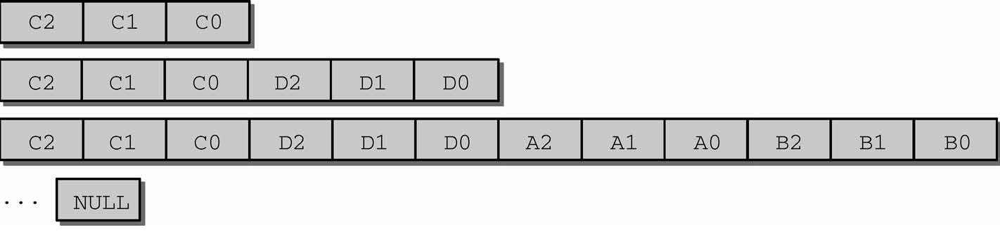
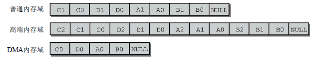

初始化内存管理
=======


| 日期 | 内核版本 | 架构| 作者 | GitHub| CSDN |
| ------- |:-------:|:-------:|:-------:|:-------:|:-------:|
| 2016-06-14 | [Linux-4.7](http://lxr.free-electrons.com/source/?v=4.7) | X86 & arm | [gatieme](http://blog.csdn.net/gatieme) | [LinuxDeviceDrivers](https://github.com/gatieme/LDD-LinuxDeviceDrivers) | [Linux内存管理](http://blog.csdn.net/gatieme/article/category/6225543) |


在内存管理的上下文中, 初始化(initialization)可以有多种含义. 在许多CPU上, 必须显式设置适用于Linux内核的内存模型. 例如在x86_32上需要切换到保护模式, 然后奇偶内核才能检测到可用内存和寄存器.


#1	前景回顾
-------


##1.1	Linux内存管理的层次结构
-------


Linux把物理内存划分为三个层次来管理

| 层次 | 描述 |
|:----:|:----:|
| 存储节点(Node) |  CPU被划分为多个节点(node), 内存则被分簇, 每个CPU对应一个本地物理内存, 即一个CPU-node对应一个内存簇bank，即每个内存簇被认为是一个节点 |
| 管理区(Zone)   | 每个物理内存节点node被划分为多个内存管理区域, 用于表示不同范围的内存, 内核可以使用不同的映射方式映射物理内存 |
| 页面(Page) 	   |	内存被细分为多个页面帧, 页面是最基本的页面分配的单位　｜

为了支持NUMA模型，也即CPU对不同内存单元的访问时间可能不同，此时系统的物理内存被划分为几个节点(node), 一个node对应一个内存簇bank，即每个内存簇被认为是一个节点


*	首先, 内存被划分为**结点**. 每个节点关联到系统中的一个处理器, 内核中表示为`pg_data_t`的实例. 系统中每个节点被链接到一个以NULL结尾的`pgdat_list`链表中<而其中的每个节点利用`pg_data_tnode_next`字段链接到下一节．而对于PC这种UMA结构的机器来说, 只使用了一个成为contig_page_data的静态pg_data_t结构.

*	接着各个节点又被划分为内存管理区域, 一个**管理区域**通过struct zone_struct描述, 其被定义为zone_t, 用以表示内存的某个范围, 低端范围的16MB被描述为ZONE_DMA, 某些工业标准体系结构中的(ISA)设备需要用到它, 然后是可直接映射到内核的普通内存域ZONE_NORMAL,最后是超出了内核段的物理地址域ZONE_HIGHMEM, 被称为高端内存.　是系统中预留的可用内存空间, 不能被内核直接映射.


*	最后**页帧(page frame)**代表了系统内存的最小单位, 堆内存中的每个页都会创建一个struct page的一个实例. 传统上，把内存视为连续的字节，即内存为字节数组，内存单元的编号(地址)可作为字节数组的索引. 分页管理时，将若干字节视为一页，比如4K byte. 此时，内存变成了连续的页，即内存为页数组，每一页物理内存叫页帧，以页为单位对内存进行编号，该编号可作为页数组的索引，又称为页帧号.


##1.2	今日内容(启动过程中的内存初始化)
-------


在初始化过程中, 还必须建立内存管理的数据结构, 以及很多事务. 因为内核在内存管理完全初始化之前就需要使用内存. 在系统启动过程期间, 使用了额外的简化悉尼股市的内存管理模块, 然后在初始化完成后, 将旧的模块丢弃掉.


因此我们可以把linux内核的内存管理分三个阶段。

| 阶段 | 起点 | 终点 | 描述 |
|:-----:|:-----:|:-----:|
| 第一阶段 | 系统启动 | bootmem或者memblock初始化完成 | 此阶段只能使用memblock_reserve函数分配内存， 早期内核中使用init_bootmem_done = 1标识此阶段结束 |
| 第二阶段 | bootmem或者memblock初始化完 | buddy完成前 | 引导内存分配器bootmem或者memblock接受内存的管理工作, 早期内核中使用mem_init_done = 1标记此阶段的结束 |
| 第三阶段 | buddy初始化完成 | 系统停止运行 | 可以用cache和buddy分配内存 |


##1.3	start_kernel系统启动阶段的内存初始化过程
-------

首先我们来看看start_kernel是如何初始化系统的, start_kerne定义在[init/main.c?v=4.7, line 479](http://lxr.free-electrons.com/source/init/main.c?v=4.7#L479)

其代码很复杂, 我们只截取出其中与内存管理初始化相关的部分, 如下所示


```cpp
asmlinkage __visible void __init start_kernel(void)
{

    setup_arch(&command_line);
    mm_init_cpumask(&init_mm);

    setup_per_cpu_areas();


    build_all_zonelists(NULL, NULL);
    page_alloc_init();


    /*
     * These use large bootmem allocations and must precede
     * mem_init();
     * kmem_cache_init();
     */
    mm_init();

    kmem_cache_init_late();

	kmemleak_init();
    setup_per_cpu_pageset();

    rest_init();
}
```


| 函数  | 功能 |
|:----:|:----:|
| [setup_arch](http://lxr.free-electrons.com/ident?v=4.7;i=setup_arch) | 是一个特定于体系结构的设置函数, 其中一项任务是负责初始化自举分配器 |
| [mm_init_cpumask](http://lxr.free-electrons.com/source/include/linux/mm_types.h?v=4.7#L522) | 初始化CPU屏蔽字 |
| [setup_per_cpu_areas](http://lxr.free-electrons.com/ident?v=4.7;i=setup_per_cpu_areas) | 函数[(查看定义)](http://lxr.free-electrons.com/source/mm/percpu.c?v4.7#L2205])给每个CPU分配内存，并拷贝.data.percpu段的数据. 为系统中的每个CPU的per_cpu变量申请空间.<br>在SMP系统中, setup_per_cpu_areas初始化源代码中(使用[per_cpu宏](http://lxr.free-electrons.com/source/include/linux/percpu-defs.h#L256))定义的静态per-cpu变量, 这种变量对系统中每个CPU都有一个独立的副本. <br>此类变量保存在内核二进制影像的一个独立的段中, setup_per_cpu_areas的目的就是为系统中各个CPU分别创建一份这些数据的副本<br>在非SMP系统中这是一个空操作 |
| [build_all_zonelists](http://lxr.free-electrons.com/source/mm/page_alloc.c?v4.7#L5029) | 建立并初始化结点和内存域的数据结构 |
| [mm_init](http://lxr.free-electrons.com/source/init/main.c?v4.7#L464) | 建立了内核的内存分配器, <br>其中通过[mem_init](http://lxr.free-electrons.com/ident?v=4.7&i=mem_init)停用bootmem分配器并迁移到实际的内存管理器(比如伙伴系统)<br>然后调用kmem_cache_init函数初始化内核内部用于小块内存区的分配器 |
| [kmem_cache_init_late](http://lxr.free-electrons.com/source/mm/slab.c?v4.7#L1378) | 在kmem_cache_init之后, 完善分配器的缓存机制,　当前3个可用的内核内存分配器[slab](http://lxr.free-electrons.com/source/mm/slab.c?v4.7#L1378), [slob](http://lxr.free-electrons.com/source/mm/slob.c?v4.7#L655), [slub](http://lxr.free-electrons.com/source/mm/slub.c?v=4.7#L3960)都会定义此函数　|
| [kmemleak_init](http://lxr.free-electrons.com/source/mm/kmemleak.c?v=4.7#L1857) | Kmemleak工作于内核态，Kmemleak 提供了一种可选的内核泄漏检测，其方法类似于跟踪内存收集器。当独立的对象没有被释放时，其报告记录在 [/sys/kernel/debug/kmemleak](http://lxr.free-electrons.com/source/mm/kmemleak.c?v=4.7#L1467)中, Kmemcheck能够帮助定位大多数内存错误的上下文 |
| [setup_per_cpu_pageset](http://lxr.free-electrons.com/source/mm/page_alloc.c?v=4.7#L5392) | 初始化CPU高速缓存行, 为pagesets的第一个数组元素分配内存, 换句话说, 其实就是第一个系统处理器分配<br>由于在分页情况下，每次存储器访问都要存取多级页表，这就大大降低了访问速度。所以，为了提高速度，在CPU中设置一个最近存取页面的高速缓存硬件机制，当进行存储器访问时，先检查要访问的页面是否在高速缓存中. |


##1.4	setup_arch函数初始化内存流程
-------


前面我们的内核从start_kernel开始, 进入setup_arch(), 并完成了早期内存分配器的初始化和设置工作.

```cpp
void __init setup_arch(char **cmdline_p)
{
	/*  初始化memblock  */
	arm64_memblock_init( );

	/*  分页机制初始化  */
	paging_init();

	bootmem_init();
}
```

| 流程 | 描述 |
|:---:|:----:|
| [arm64_memblock_init](http://lxr.free-electrons.com/source/arch/arm64/kernel/setup.c?v=4.7#L229) | 初始化memblock内存分配器 |
| [paging_init](http://lxr.free-electrons.com/source/arch/arm64/mm/mmu.c?v=4.7#L538) | 初始化分页机制 |
| [bootmem_init](http://lxr.free-electrons.com/source/arch/arm64/mm/init.c?v=4.7#L306) | 初始化内存管理 |


该函数主要执行了如下操作


1.	使用arm64_memblock_init来完成memblock机制的初始化工作, 至此memblock分配器接受系统中系统中内存的分配工作

2.	调用paging_init来完成系统分页机制的初始化工作, 建立页表, 从而内核可以完成虚拟内存的映射和转换工作

3.	最后调用bootmem_init来完成实现buddy内存管理所需要的工作


##1.5	(第一阶段)启动过程中的内存分配器
-------


在初始化过程中, 还必须建立内存管理的数据结构, 以及很多事务. 因为内核在内存管理完全初始化之前就需要使用内存. 在系统启动过程期间, 使用了额外的简化悉尼股市的内存管理模块, 然后在初始化完成后, 将旧的模块丢弃掉.

这个阶段的内存分配其实很简单, 因此我们往往称之为内存分配器(而不是内存管理器), 早期的内核中内存分配器使用的**bootmem引导分配器**, 它基于一个内存位图bitmap, 使用最优适配算法来查找内存, 但是这个分配器有很大的缺陷, 最严重的就是内存碎片的问题, 因此在后来的内核中将其舍弃《而使用了**新的memblock机制**. memblock机制的初始化在arm64上是通过[arm64_memblock_init](http://lxr.free-electrons.com/source/arch/arm64/kernel/setup.c?v=4.7#L229)函数来实现的

```cpp
```cpp
start_kernel()
    |---->page_address_init()
    |     考虑支持高端内存
    |     业务：初始化page_address_pool链表；
    |          将page_address_maps数组元素按索引降序插入
    |          page_address_pool链表; 
    |          初始化page_address_htable数组.
    | 
    |---->setup_arch(&command_line);
    |     初始化特定体系结构的内容
    	  |
    	  |---->arm64_memblock_init( );
          |     初始化引导阶段的内存分配器memblock
          |
          |---->paging_init();
          |     分页机制初始化
          |
          |---->bootmem_init();
          |     始化内存数据结构包括内存节点, 内存域和页帧page
                |
                |---->arm64_numa_init();
                |     支持numa架构
                |
                |---->zone_sizes_init(min, max);
                    来初始化节点和管理区的一些数据项
                    |
                    |---->free_area_init_node
                    |   初始化内存节点
                    |
                        |---->free_area_init_core
                            |	初始化zone
                            |
                            |---->memmap_init
                            |	初始化page页面
                |
                |---->memblock_dump_all();
                |   初始化完成, 显示memblock的保留的所有内存信息
         	   |
    |---->build_all_zonelist()      [当前位置]
    |     为系统中的zone建立后备zone的列表.
    |     所有zone的后备列表都在
    |     pglist_data->node_zonelists[0]中;
    |
    |     期间也对per-CPU变量boot_pageset做了初始化. 
    |
```


##1.6	今日内容(第二阶段(二)--初始化备用内存域列表zonelists)
-------


我们之前讲了在memblock完成之后, 内存初始化开始进入第二阶段, 第二阶段是一个漫长的过程, 它执行了一系列复杂的操作, 从体系结构相关信息的初始化慢慢向上层展开, 其主要执行了如下操作


**特定于体系结构的设置**


在完成了基础的内存结点和内存域的初始化工作以后, 我们必须克服一些硬件的特殊设置

*	在初始化内存的结点和内存区域之前, 内核先通过pagging_init初始化了内核的分页机制, 这样我们的虚拟运行空间就初步建立, 并可以完成物理地址到虚拟地址空间的映射工作.

在arm64架构下, 内核在start_kernel()->setup_arch()中通过arm64_memblock_init( )完成了memblock的初始化之后, 接着通过setup_arch()->paging_init()开始初始化分页机制


paging_init负责建立只能用于内核的页表, 用户空间是无法访问的. 这对管理普通应用程序和内核访问内存的方式，有深远的影响


*	在分页机制完成后, 内核通过setup_arch()->bootmem_init开始进行内存基本数据结构(内存结点pg_data_t, 内存域zone和页帧)的初始化工作, 就是在这个函数中, 内核开始从体系结构相关的部分逐渐展开到体系结构无关的部分, 在zone_sizes_init->free_area_init_node中开始, 内核开始进行内存基本数据结构的初始化, 也不再依赖于特定体系结构无关的层次

```cpp
bootmem_init
始化内存数据结构包括内存节点, 内存域和页帧page
|
|---->arm64_numa_init();
|     支持numa架构
|
|---->zone_sizes_init(min, max);
    来初始化节点和管理区的一些数据项
    |
    |---->free_area_init_node
    |   初始化内存节点
    |
        |---->free_area_init_core
            |   初始化zone
            |
            |---->memmap_init
            |   初始化page页面
|
|---->memblock_dump_all();
|   初始化完成, 显示memblock的保留的所有内存信息
```


至此，bootmem_init已经完成了节点和管理区的关键数据已完成初始化, 内核在后面为内存管理做得一个准备工作就是将所有节点的管理区都链入到zonelist中，便于后面内存分配工作的进行.


内核在start_kernel()-->build_all_zonelist()中完成zonelist的初始化


#2	后备内存域列表zonelists
-------


内核setup_arch的最后通过bootmem_init中完成了内存数据结构的初始化(包括内存结点pg_data_t, 内存管理域zone和页面信息page), 数据结构已经基本准备好了, 在后面为内存管理做得一个准备工作就是将所有节点的管理区都链入到zonelist中, 便于后面内存分配工作的进行.


##2.1	回到start_kernel函数(已经完成的工作)
-------


前面我们分析了start_kernel()->setup_arch()函数, 已经完成了memblock内存分配器的创建和初始化工作, 然后paging_init也完成分页机制的初始化, 然后bootmem_init也完成了内存结点和内存管理域的初始化工作. setup_arch函数已经执行完了, 现在我们回到start_kernel


```cpp
asmlinkage __visible void __init start_kernel(void)
{

    setup_arch(&command_line);


    build_all_zonelists(NULL, NULL);
    page_alloc_init();


    /*
     * These use large bootmem allocations and must precede
     * mem_init();
     * kmem_cache_init();
     */
    mm_init();

    kmem_cache_init_late();

	kmemleak_init();
    setup_per_cpu_pageset();

    rest_init();
}
```

下面内核开始通过start_kernel()->build_all_zonelists来设计内存的组织形式


##2.2	后备内存域列表zonelist
-------

内存节点pg_data_t中将内存节点中的内存区域zone按照某种组织层次存储在一个zonelist中, 即pglist_data->node_zonelists成员信息

```cpp
//  http://lxr.free-electrons.com/source/include/linux/mmzone.h?v=4.7#L626
typedef struct pglist_data
{
	struct zone node_zones[MAX_NR_ZONES];
	struct zonelist node_zonelists[MAX_ZONELISTS];
}
```


内核定义了内存的一个层次结构关系, 首先试图分配廉价的内存，如果失败，则根据访问速度和容量，逐渐尝试分配更昂贵的内存.

高端内存最廉价, 因为内核没有任何部分依赖于从该内存域分配的内存, 如果高端内存用尽, 对内核没有副作用, 所以优先分配高端内存

普通内存域的情况有所不同, 许多内核数据结构必须保存在该内存域, 而不能放置到高端内存域, 因此如果普通内存域用尽, 那么内核会面临内存紧张的情况

DMA内存域最昂贵，因为它用于外设和系统之间的数据传输。
举例来讲，如果内核指定想要分配高端内存域。它首先在当前结点的高端内存域寻找适当的空闲内存段，如果失败，则查看该结点的普通内存域，如果还失败，则试图在该结点的DMA内存域分配。如果在3个本地内存域都无法找到空闲内存，则查看其他结点。这种情况下，备选结点应该尽可能靠近主结点，以最小化访问非本地内存引起的性能损失。


##2.3	build_all_zonelists初始化zonelists
-------

内核在start_kernel中通过build_all_zonelists完成了内存结点及其管理内存域的初始化工作, 调用如下


```cpp
  build_all_zonelists(NULL, NULL);
```

[build_all_zonelists](http://lxr.free-electrons.com/source/mm/page_alloc.c?v4.7#L5029)建立内存管理结点及其内存域的组织形式, 将描述内存的数据结构(结点, 管理域, 页帧)通过一定的算法组织在一起, 方便以后内存管理工作的进行. 该函数定义在[mm/page_alloc.c?v4.7, line 5029](http://lxr.free-electrons.com/source/mm/page_alloc.c?v4.7#L5029)


##2.4	build_all_zonelists函数
-------

```cpp
/*
 * Called with zonelists_mutex held always
 * unless system_state == SYSTEM_BOOTING.
 *
 * __ref due to (1) call of __meminit annotated setup_zone_pageset
 * [we're only called with non-NULL zone through __meminit paths] and
 * (2) call of __init annotated helper build_all_zonelists_init
 * [protected by SYSTEM_BOOTING].
 */
void __ref build_all_zonelists(pg_data_t *pgdat, struct zone *zone)
{
	/*  设置zonelist中节点和内存域的组织形式
     *  current_zonelist_order变量标识了当前系统的内存组织形式
     *	zonelist_order_name以字符串存储了系统中内存组织形式的名称  */
    set_zonelist_order();

    if (system_state == SYSTEM_BOOTING) {
        build_all_zonelists_init();
    } else {
#ifdef CONFIG_MEMORY_HOTPLUG
        if (zone)
            setup_zone_pageset(zone);
#endif
        /* we have to stop all cpus to guarantee there is no user
           of zonelist */
        stop_machine(__build_all_zonelists, pgdat, NULL);
        /* cpuset refresh routine should be here */
    }
    vm_total_pages = nr_free_pagecache_pages();
    /*
     * Disable grouping by mobility if the number of pages in the
     * system is too low to allow the mechanism to work. It would be
     * more accurate, but expensive to check per-zone. This check is
     * made on memory-hotadd so a system can start with mobility
     * disabled and enable it later
     */
    if (vm_total_pages < (pageblock_nr_pages * MIGRATE_TYPES))
        page_group_by_mobility_disabled = 1;
    else
        page_group_by_mobility_disabled = 0;

    pr_info("Built %i zonelists in %s order, mobility grouping %s.  Total pages: %ld\n",
        nr_online_nodes,
        zonelist_order_name[current_zonelist_order],
        page_group_by_mobility_disabled ? "off" : "on",
        vm_total_pages);
#ifdef CONFIG_NUMA
    pr_info("Policy zone: %s\n", zone_names[policy_zone]);
#endif
}
```


#3	设置结点初始化顺序
-------


在build_all_zonelists开始, 首先内核通过set_zonelist_order函数设置了`zonelist_order`,如下所示, 参见[mm/page_alloc.c?v=4.7, line 5031](http://lxr.free-electrons.com/source/mm/page_alloc.c?v=4.7#L5031)

```cpp
void __ref build_all_zonelists(pg_data_t *pgdat, struct zone *zone)
{
	set_zonelist_order();
	/* .......  */
}
```


##3.1	zonelist
-------


前面我们讲解内存管理域时候讲解到, 系统中的所有管理域都存储在一个多维的数组zone_table. 内核在初始化内存管理区时, 必须要建立管理区表zone_table. 参见[mm/page_alloc.c?v=2.4.37, line 38](http://lxr.free-electrons.com/source/mm/page_alloc.c?v=2.4.37#L38)


```cpp
/*
 *
 * The zone_table array is used to look up the address of the
 * struct zone corresponding to a given zone number (ZONE_DMA,
 * ZONE_NORMAL, or ZONE_HIGHMEM).
 */
zone_t *zone_table[MAX_NR_ZONES*MAX_NR_NODES];
EXPORT_SYMBOL(zone_table);
```

*	MAX_NR_NODES为系统中内存结点的数目

*	MAX_NR_ZONES为系统中单个内存结点所拥有的最大内存区域数目


##3.2	内存域初始化顺序zonelist_order
-------


NUMA系统中存在多个节点, 每个节点对应一个`struct pglist_data`结构, 每个结点中可以包含多个zone, 如: ZONE_DMA, ZONE_NORMAL, 这样就产生几种排列顺序, 以2个节点2个zone为例(zone从高到低排列, ZONE_DMA0表示节点0的ZONE_DMA，其它类似).

*	Legacy方式, 每个节点只排列自己的zone；


*	Node方式, 按节点顺序依次排列，先排列本地节点的所有zone，再排列其它节点的所有zone。


*	Zone方式, 按zone类型从高到低依次排列各节点的同相类型zone


可通过启动参数"numa_zonelist_order"来配置zonelist order，内核定义了3种配置, 这些顺序定义在[mm/page_alloc.c?v=4.7, line 4551](http://lxr.free-electrons.com/source/mm/page_alloc.c?v=4.7#L4551)

```cpp
// http://lxr.free-electrons.com/source/mm/page_alloc.c?v=4.7#L4551
/*
 *  zonelist_order:
 *  0 = automatic detection of better ordering.
 *  1 = order by ([node] distance, -zonetype)
 *  2 = order by (-zonetype, [node] distance)
 *
 *  If not NUMA, ZONELIST_ORDER_ZONE and ZONELIST_ORDER_NODE will create
 *  the same zonelist. So only NUMA can configure this param.
 */
#define ZONELIST_ORDER_DEFAULT  0 /* 智能选择Node或Zone方式 */

#define ZONELIST_ORDER_NODE     1 /* 对应Node方式 */

#define ZONELIST_ORDER_ZONE     2 /* 对应Zone方式 */
```

>注意
>
>在非NUMA系统中(比如UMA), 由于只有一个内存结点, 因此ZONELIST_ORDER_ZONE和ZONELIST_ORDER_NODE选项会配置相同的内存域排列方式, 因此, 只有NUMA可以配置这几个参数


全局的current_zonelist_order变量标识了系统中的当前使用的内存域排列方式, 默认配置为ZONELIST_ORDER_DEFAULT, 参见[mm/page_alloc.c?v=4.7, line 4564](http://lxr.free-electrons.com/source/mm/page_alloc.c?v=4.7#L4564)


```cpp
//  http://lxr.free-electrons.com/source/mm/page_alloc.c?v=4.7#L4564
/* zonelist order in the kernel.
 * set_zonelist_order() will set this to NODE or ZONE.
 */
static int current_zonelist_order = ZONELIST_ORDER_DEFAULT;
static char zonelist_order_name[3][8] = {"Default", "Node", "Zone"};
```


而zonelist_order_name方式分别对应了Legacy方式, Node方式和Zone方式. 其zonelist_order_name[current_zonelist_order]就标识了当前系统中所使用的内存域排列方式的名称"Default", "Node", "Zone".


| 宏 | zonelist_order_name[宏](排列名称) | 排列方式 | 描述 |
|:--:|:-------------------:|:------:|:----:|
| ZONELIST_ORDER_DEFAULT | Default |  | 由系统智能选择Node或Zone方式 |
| ZONELIST_ORDER_NODE | Node | Node方式 | 按节点顺序依次排列，先排列本地节点的所有zone，再排列其它节点的所有zone |
| ZONELIST_ORDER_ZONE | Zone | Zone方式 | 按zone类型从高到低依次排列各节点的同相类型zone |


##3.3	set_zonelist_order设置排列方式
-------

内核就通过通过set_zonelist_order函数设置当前系统的内存域排列方式current_zonelist_order, 其定义依据系统的NUMA结构还是UMA结构有很大的不同.

```cpp
// http://lxr.free-electrons.com/source/mm/page_alloc.c?v=4.7#L4571
#ifdef CONFIG_NUMA
/* The value user specified ....changed by config */
static int user_zonelist_order = ZONELIST_ORDER_DEFAULT;
/* string for sysctl */
#define NUMA_ZONELIST_ORDER_LEN 16
char numa_zonelist_order[16] = "default";


//  http://lxr.free-electrons.com/source/mm/page_alloc.c#L4571
static void set_zonelist_order(void)
{
    if (user_zonelist_order == ZONELIST_ORDER_DEFAULT)
        current_zonelist_order = default_zonelist_order();
    else
        current_zonelist_order = user_zonelist_order;
}


#else   /* CONFIG_NUMA */

//  http://lxr.free-electrons.com/source/mm/page_alloc.c?v=4.7#L4892
static void set_zonelist_order(void)
{
	current_zonelist_order = ZONELIST_ORDER_ZONE;
}
```


其设置的基本流程如下

*	如果系统当前系统是非NUMA结构的, 则系统中只有一个结点, 配置ZONELIST_ORDER_NODE和ZONELIST_ORDER_ZONE结果相同. 那么set_zonelist_order函数被定义为直接配置当前系统的内存域排列方式`current_zonelist_order`为ZONE方式(与NODE效果相同)

*	如果系统是NUMA结构, 则设置为系统指定的方式即可
	1.	当前的排列方式为ZONELIST_ORDER_DEFAULT, 即系统默认方式, 则current_zonelist_order则由内核交给default_zonelist_order采用一定的算法选择一个最优的分配策略,　目前的系统中如果是32位则配置为ZONE方式, 而如果是６４位系统则设置为NODE方式

	2.	当前的排列方式不是默认方式, 则设置为user_zonelist_order指定的内存域排列方式


##3.4	default_zonelist_order函数选择最优的配置
-------


在UMA结构下, 内存域使用NODE和ZONE两个排列方式会产生相同的效果, 因此系统不用特殊指定, 直接通过set_zonelist_order函数, 将当前系统的内存域排列方式`current_zonelist_order`配置为为ZONE方式(与NODE效果相同)即可


但是NUMA结构下, 默认情况下(当配置了ZONELIST_ORDER_DEFAULT), 系统需要根据系统自身的环境信息选择一个最优的配置(NODE或者ZONE方式), 这个工作就由**default_zonelist_order函数**了来完成. 其定义在[mm/page_alloc.c?v=4.7, line 4789](http://lxr.free-electrons.com/source/mm/page_alloc.c?v=4.7#L4789)


```cpp
#if defined(CONFIG_64BIT)
/*
 * Devices that require DMA32/DMA are relatively rare and do not justify a
 * penalty to every machine in case the specialised case applies. Default
 * to Node-ordering on 64-bit NUMA machines
 */
static int default_zonelist_order(void)
{
    return ZONELIST_ORDER_NODE;
}
#else
/*
 * On 32-bit, the Normal zone needs to be preserved for allocations accessible
 * by the kernel. If processes running on node 0 deplete the low memory zone
 * then reclaim will occur more frequency increasing stalls and potentially
 * be easier to OOM if a large percentage of the zone is under writeback or
 * dirty. The problem is significantly worse if CONFIG_HIGHPTE is not set.
 * Hence, default to zone ordering on 32-bit.
 */
static int default_zonelist_order(void)
{
    return ZONELIST_ORDER_ZONE;
}
#endif /* CONFIG_64BIT */
```


###3.5	user_zonelist_order用户指定排列方式
-------


在NUMA结构下, 系统支持用户指定内存域的排列方式, 用户以字符串的形式操作numa_zonelist_order(default, node和zone), 最终被内核转换为user_zonelist_order, 这个变量被指定为字符串numa_zonelist_order指定的排列方式, 他们定义在[mm/page_alloc.c?v4.7, line 4573](http://lxr.free-electrons.com/source/mm/page_alloc.c?v4.7#L4573), 注意只有在NUMA结构中才需要这个配置信息.


```cpp
#ifdef CONFIG_NUMA
/* The value user specified ....changed by config */
static int user_zonelist_order = ZONELIST_ORDER_DEFAULT;
/* string for sysctl */
#define NUMA_ZONELIST_ORDER_LEN 16
char numa_zonelist_order[16] = "default";

#else
/* ......*/
#endif
```

而接受和处理用户配置的工作, 自然是交给我们强大的proc文件系统来完成的, 可以通过/proc/sys/vm/numa_zonelist_order动态改变zonelist order的分配方式。


内核通过setup_numa_zonelist_order读取并处理用户写入的配置信息

*	接收到用户的信息后用__parse_numa_zonelist_order处理接收的参数

*	如果前面用__parse_numa_zonelist_order处理的信息串成功, 则将对用的设置信息写入到字符串numa_zonelist_order中


参见[mm/page_alloc.c?v=4.7, line 4578](http://lxr.free-electrons.com/source/mm/page_alloc.c?v=4.7#L4578)


```cpp
/*
 * interface for configure zonelist ordering.
 * command line option "numa_zonelist_order"
 *      = "[dD]efault   - default, automatic configuration.
 *      = "[nN]ode      - order by node locality, then by zone within node
 *      = "[zZ]one      - order by zone, then by locality within zone
 */

static int __parse_numa_zonelist_order(char *s)
{
    if (*s == 'd' || *s == 'D') {
        user_zonelist_order = ZONELIST_ORDER_DEFAULT;
    } else if (*s == 'n' || *s == 'N') {
        user_zonelist_order = ZONELIST_ORDER_NODE;
    } else if (*s == 'z' || *s == 'Z') {
        user_zonelist_order = ZONELIST_ORDER_ZONE;
    } else {
        pr_warn("Ignoring invalid numa_zonelist_order value:  %s\n", s);
        return -EINVAL;
    }
    return 0;
}

static __init int setup_numa_zonelist_order(char *s)
{
    int ret;

    if (!s)
        return 0;

    ret = __parse_numa_zonelist_order(s);
    if (ret == 0)
        strlcpy(numa_zonelist_order, s, NUMA_ZONELIST_ORDER_LEN);

    return ret;
}
early_param("numa_zonelist_order", setup_numa_zonelist_order);
```

#4	build_all_zonelists_init完成内存域zonelists的初始化
-------

build_all_zonelists函数在通过set_zonelist_order设置了zonelists中结点的组织顺序后, 首先检查了ssytem_state标识. 如果当前系统处于boot阶段(SYSTEM_BOOTING), 就开始通过build_all_zonelists_init函数初始化zonelist


```cpp
build_all_zonelists(pg_data_t *pgdat, struct zone *zone)
{
	/*  设置zonelist中节点和内存域的组织形式
     *  current_zonelist_order变量标识了当前系统的内存组织形式
     *	zonelist_order_name以字符串存储了系统中内存组织形式的名称  */
    set_zonelist_order();

    if (system_state == SYSTEM_BOOTING) {
        build_all_zonelists_init();
```


##4.1	system_state系统状态标识
-------


其中`system_state`变量是一个系统全局定义的用来表示系统当前运行状态的枚举变量, 其定义在[include/linux/kernel.h?v=4.7, line 487](http://lxr.free-electrons.com/source/include/linux/kernel.h?v=4.7#L487)


```cpp
/* Values used for system_state */
extern enum system_states
{
	SYSTEM_BOOTING,
	SYSTEM_RUNNING,
	SYSTEM_HALT,
	SYSTEM_POWER_OFF,
	SYSTEM_RESTART,
} system_state;
```

*	如果系统system_state是SYSTEM_BOOTING, 则调用`build_all_zonelists_init`初始化所有的内存结点

*	否则的话如果定义了冷热页`CONFIG_MEMORY_HOTPLUG`且参数zone(待初始化的内存管理域zone)不为NULL, 则调用setup_zone_pageset设置冷热页


```cpp
if (system_state == SYSTEM_BOOTING)
{
	build_all_zonelists_init();
}
else
{
#ifdef CONFIG_MEMORY_HOTPLUG
	if (zone)
    	setup_zone_pageset(zone);
#endif
```

##4.2	build_all_zonelists_init函数

build_all_zonelists函数在如果当前系统处于boot阶段(system_state == SYSTEM_BOOTING), 就开始通过build_all_zonelists_init函数初始化zonelist


build_all_zonelists_init函数定义在[mm/page_alloc.c?v=4.7, line 5013](http://lxr.free-electrons.com/source/mm/page_alloc.c?v=4.7#L5013)

```cpp
static noinline void __init
build_all_zonelists_init(void)
{
    __build_all_zonelists(NULL);
    mminit_verify_zonelist();
    cpuset_init_current_mems_allowed();
}
```


build_all_zonelists_init将将所有工作都委托给__build_all_zonelists完成了zonelists的初始化工作, 后者又对系统中的各个NUMA结点分别调用build_zonelists. 


函数__build_all_zonelists定义在[mm/page_alloc.c?v=4.7, line 4959](http://lxr.free-electrons.com/source/mm/page_alloc.c?v=4.7#L4959)


```cpp
/* return values int ....just for stop_machine() */
static int __build_all_zonelists(void *data)
{
    int nid;
    int cpu;
    pg_data_t *self = data;

	/*  ......  */

    for_each_online_node(nid) {
        pg_data_t *pgdat = NODE_DATA(nid);

        build_zonelists(pgdat);
    }
	/*  ......  */
}
```

`for_each_online_node`遍历了系统中所有的活动结点. 

由于UMA系统只有一个结点，build_zonelists只调用了一次, 就对所有的内存创建了内存域列表.

NUMA系统调用该函数的次数等同于结点的数目. 每次调用对一个不同结点生成内存域数据


##4.3	build_zonelists初始化每个内存结点的zonelists
-------

build_zonelists(pg_data_t *pgdat)完成了节点pgdat上zonelists的初始化工作, 它建立了备用层次结构zonelists. 由于UMA和NUMA架构下结点的层次结构有很大的区别, 因此内核分别提供了两套不同的接口.

如下所示

```cpp
// http://lxr.free-electrons.com/source/mm/page_alloc.c?v=4.7
4571 #ifdef CONFIG_NUMA

4586 static int __parse_numa_zonelist_order(char *s)

4601 static __init int setup_numa_zonelist_order(char *s)

4619 int numa_zonelist_order_handler(struct ctl_table *table, int write,
4620                 void __user *buffer, size_t *length,

4678 static int find_next_best_node(int node, nodemask_t *used_node_mask)

4730 static void build_zonelists_in_node_order(pg_data_t *pgdat, int node)

4746 static void build_thisnode_zonelists(pg_data_t *pgdat)

4765 static void build_zonelists_in_zone_order(pg_data_t *pgdat, int nr_nodes)

4789 #if defined(CONFIG_64BIT)

4795 static int default_zonelist_order(void)
4799 #else
4808 static int default_zonelist_order(void)
4812 #endif /* CONFIG_64BIT */

4822 static void build_zonelists(pg_data_t *pgdat)

4872 #ifdef CONFIG_HAVE_MEMORYLESS_NODES
4879 int local_memory_node(int node)
4888 #endif

4890 #else   /* CONFIG_NUMA */

4897 static void build_zonelists(pg_data_t *pgdat)

4892 static void set_zonelist_order(void)

4931 #endif  /* CONFIG_NUMA */
```

| 函数 | NUMA | UMA |
|:------:|:--------:|
| build_zonelists | [build_zonelists -=> mm/page_alloc.c?v=4.7, line 4822](http://lxr.free-electrons.com/source/mm/page_alloc.c?v=4.7#L4822) | [build_zonelists -=> mm/page_alloc.c?v=4.7, line 4897](http://lxr.free-electrons.com/source/mm/page_alloc.c?v=4.7#L4897)<br><br>[build_zonelists_node -=> mm/page_alloc.c?v=4.7, line 4531](http://lxr.free-electrons.com/source/mm/page_alloc.c?v=4.7#L4531) |

我们以UMA结构下的build_zonelists为例, 来讲讲内核是怎么初始化备用内存域层次结构的, UMA结构下的build_zonelists函数定义在[mm/page_alloc.c?v=4.7, line 4897](http://lxr.free-electrons.com/source/mm/page_alloc.c?v=4.7#L4897), 如下所示


node_zonelists的数组元素通过指针操作寻址, 这在C语言中是完全合法的惯例。实际工作则委托给build_zonelist_node。在调用时，它首先生成本地结点内分配内存时的备用次


内核在build_zonelists中按分配代价从昂贵到低廉的次序, 迭代了结点中所有的内存域. 而在build_zonelists_node中, 则按照分配代价从低廉到昂贵的次序, 迭代了分配代价不低于当前内存域的内存域.


首先我们来看看build_zonelists_node函数, 该函数定义在[mm/page_alloc.c?v=4.7, line 4531](http://lxr.free-electrons.com/source/mm/page_alloc.c?v=4.7#L4531)

```cpp
/*
 * Builds allocation fallback zone lists.
 *
 * Add all populated zones of a node to the zonelist.
 */
static int build_zonelists_node(pg_data_t *pgdat, struct zonelist *zonelist, int nr_zones)
{
    struct zone *zone;
    enum zone_type zone_type = MAX_NR_ZONES;

    do {
        zone_type--;
        zone = pgdat->node_zones + zone_type;
        if (populated_zone(zone)) {
            zoneref_set_zone(zone,
                &zonelist->_zonerefs[nr_zones++]);
            check_highest_zone(zone_type);
        }
    } while (zone_type);

    return nr_zones;
}
```

备用列表zonelists的各项是借助于zone_type参数排序的, 该参数指定了最优先选择哪个内存域, 该参数的初始值是外层循环的控制变量i.

我们知道其值可能是ZONE_HIGHMEM、ZONE_NORMAL、ZONE_DMA或ZONE_DMA32之一.

nr_zones表示从备用列表中的哪个位置开始填充新项. 由于列表中尚没有项, 因此调用者传递了0.

内核在build_zonelists中按分配代价从昂贵到低廉的次序, 迭代了结点中所有的内存域. 而在build_zonelists_node中, 则按照分配代价从低廉到昂贵的次序, 迭代了分配代价不低于当前内存域的内存域.

在build_zonelists_node的每一步中, 都对所选的内存域调用populated_zone, 确认zone->present_pages大于0, 即确认内存域中确实有页存在. 倘若如此, 则将指向zone实例的指针添加到zonelist->zones中的当前位置. 后备列表的当前位置保存在nr_zones.

在每一步结束时, 都将内存域类型zone_type减1.换句话说, 设置为一个更昂贵的内存域类型. 例如, 如果开始的内存域是ZONE_HIGHMEM, 减1后下一个内存域类型是ZONE_NORMAL.

考虑一个系统, 有内存域ZONE_HIGHMEM、ZONE_NORMAL、ZONE_DMA。在第一次运行build_zonelists_node时, 实际上会执行下列赋值

```cpp
zonelist->zones[0] = ZONE_HIGHMEM;
zonelist->zones[1] = ZONE_NORMAL;
zonelist->zones[2] = ZONE_DMA;
```

我们以某个系统为例, 图中示范了一个备用列表在多次循环中不断填充的过程. 系统中共有四个结点



```cpp
其中
A=（NUMA）结点0 0=DMA内存域
B=（NUMA）结点1 1=普通内存域
C=（NUMA）结点2 2=高端内存域
D=（NUMA）结点3
```


第一步之后, 列表中的分配目标是高端内存, 接下来是第二个结点的普通和DMA内存域.

内核接下来必须确立次序, 以便将系统中其他结点的内存域按照次序加入到备用列表.

现在我们回到build_zonelists函数, UMA架构下该函数定义在[mm/page_alloc.c?v=4.7, line 4897](http://lxr.free-electrons.com/source/mm/page_alloc.c?v=4.7#L4897), 如下所示


```cpp
static void build_zonelists(pg_data_t *pgdat)
{
    int node, local_node;
    enum zone_type j;
    struct zonelist *zonelist;

	/*  ......  */

    for (node = local_node + 1; node < MAX_NUMNODES; node++) {
        if (!node_online(node))
            continue;
        j = build_zonelists_node(NODE_DATA(node), zonelist, j);
    }
    for (node = 0; node < local_node; node++) {
        if (!node_online(node))
            continue;
        j = build_zonelists_node(NODE_DATA(node), zonelist, j);
    }

    zonelist->_zonerefs[j].zone = NULL;
    zonelist->_zonerefs[j].zone_idx = 0;
}
```

第一个循环依次迭代大于当前结点编号的所有结点. 在我们的例子中，有4个结点编号副本为0、1、2、3，此时只剩下结点3。新的项通过build_zonelists_node被加到备用列表。此时j的作用就体现出来了。在本地结点的备用目标找到之后，该变量的值是3。该值用作新项的起始位置。如果结点3也由3个内存域组成，备用列表在第二个循环之后的情况如图3-9的第二步所示

第二个for循环接下来对所有编号小于当前结点的结点生成备用列表项。在我们的例子中，这些结点的编号为0和1。 如果这些结点也有3个内存域，则循环完毕之后备用列表的情况如下图下半部分所示



备用列表中项的数目一般无法准确知道，因为系统中不同结点的内存域配置可能并不相同。因此
列表的最后一项赋值为空指针，显式标记列表结束。
对总数N个结点中的结点m来说，内核生成备用列表时，选择备用结点的顺序总是：m、m+1、
m+2、…、N1、0、1、…、m1。这确保了不过度使用任何结点。例如，对照情况是：使用一个独立
于m、不变的备用列表。


##4.4	setup_pageset初始化per_cpu缓存
-------

前面讲解内存管理域zone的时候, 提到了per-CPU缓存, 即冷热页. 在组织每个节点的zonelist的过程中, setup_pageset初始化了per-CPU缓存(冷热页面)

```cpp
static void setup_pageset(struct per_cpu_pageset *p, unsigned long batch)
{
	pageset_init(p);
	pageset_set_batch(p, batch);
}
```


在此之前free_area_init_node初始化内存结点的时候, 内核就输出了冷热页的一些信息, 该工作由zone_pcp_init完成, 该函数定义在[mm/page_alloc.c?v=4.7, line 5029](http://lxr.free-electrons.com/source/mm/page_alloc.c?v=4.7#L5029)

```cpp
static __meminit void zone_pcp_init(struct zone *zone)
{
    /*
     * per cpu subsystem is not up at this point. The following code
     * relies on the ability of the linker to provide the
     * offset of a (static) per cpu variable into the per cpu area.
     */
    zone->pageset = &boot_pageset;

    if (populated_zone(zone))
        printk(KERN_DEBUG "  %s zone: %lu pages, LIFO batch:%u\n",
            zone->name, zone->present_pages,
                     zone_batchsize(zone));
}
```


#5	总结
-------


##5.1	start_kernel启动流程
-------


```cpp
start_kernel()
    |---->page_address_init()
    |     考虑支持高端内存
    |     业务：初始化page_address_pool链表；
    |          将page_address_maps数组元素按索引降序插入
    |          page_address_pool链表; 
    |          初始化page_address_htable数组.
    | 
    |---->setup_arch(&command_line);
    |
    |---->setup_per_cpu_areas();
    |     为per-CPU变量分配空间
    |
    |---->build_all_zonelist()
    |     为系统中的zone建立后备zone的列表.
    |     所有zone的后备列表都在
    |     pglist_data->node_zonelists[0]中;
    |
    |     期间也对per-CPU变量boot_pageset做了初始化. 
    |
    |---->page_alloc_init()
         |---->hotcpu_notifier(page_alloc_cpu_notifier, 0);
         |     不考虑热插拔CPU 
         |
    |---->pidhash_init()
    |     详见下文.
    |     根据低端内存页数和散列度，分配hash空间，并赋予pid_hash
    |
    |---->vfs_caches_init_early()
          |---->dcache_init_early()
          |     dentry_hashtable空间，d_hash_shift, h_hash_mask赋值；
          |     同pidhash_init();
          |     区别:
          |         散列度变化了（13 - PAGE_SHIFT）;
          |         传入alloc_large_system_hash的最后参数值为0;
          |
          |---->inode_init_early()
          |     inode_hashtable空间，i_hash_shift, i_hash_mask赋值；
          |     同pidhash_init();
          |     区别:
          |         散列度变化了（14 - PAGE_SHIFT）;
          |         传入alloc_large_system_hash的最后参数值为0;
          |
```

##5.2	pidhash_init配置高端内存
-------


```cpp
void pidhash_init(void)
    |---->pid_hash = alloc_large_system_hash("PID", sizeof(*pid_hash), 
    |         0, 18, HASH_EARLY|HASH_SMALL, &pidhash_shift, NULL, 4096);
    |     根据nr_kernel_pages(低端内存的页数)，分配哈希数组，以及各个哈希
    |     数组元素下的哈希链表的空间，原理如下：
    |     number = nr_kernel_pages; 
    |     number >= (18 - PAGE_SHIFT) 根据散列度获得数组元素个数
    |     number = roundup_pow_of_two(number);
    |     pidhash_shift = max{x | 2**x <= number}
    |     size = number * sizeof(*pid_hash);
    |     使用位图分配器分配size空间，将返回值付给pid_hash;
    |
    |---->pidhash_size = 1 << pidhash_shift;
    |
    |---->for(i = 0; i < pidhash_size; i++)
    |         INIT_HLIST_HEAD(&pid_hash[i]);
```

##5.3	build_all_zonelists初始化每个内存节点的zonelists
-------


```cpp
void build_all_zonelists(void)
    |---->set_zonelist_order()
         |---->current_zonelist_order = ZONELIST_ORDER_ZONE;
    |
    |---->__build_all_zonelists(NULL);
    |    Memory不支持热插拔, 为每个zone建立后备的zone,
    |    每个zone及自己后备的zone，形成zonelist
    	|
        |---->pg_data_t *pgdat = NULL;
        |     pgdat = &contig_page_data;(单node)
        |
        |---->build_zonelists(pgdat);
        |     为每个zone建立后备zone的列表
            |
            |---->struct zonelist *zonelist = NULL;
            |     enum zone_type j;
            |     zonelist = &pgdat->node_zonelists[0];
            |
            |---->j = build_zonelists_node(pddat, zonelist, 0, MAX_NR_ZONES - 1);
            |     为pgdat->node_zones[0]建立后备的zone，node_zones[0]后备的zone
            |     存储在node_zonelist[0]内，对于node_zone[0]的后备zone，其后备的zone
            |     链表如下(只考虑UMA体系，而且不考虑ZONE_DMA)：
            |     node_zonelist[0]._zonerefs[0].zone = &node_zones[2];
            |     node_zonelist[0]._zonerefs[0].zone_idx = 2;
            |     node_zonelist[0]._zonerefs[1].zone = &node_zones[1];
            |     node_zonelist[0]._zonerefs[1].zone_idx = 1;
            |     node_zonelist[0]._zonerefs[2].zone = &node_zones[0];
            |     node_zonelist[0]._zonerefs[2].zone_idx = 0;
            |
            |     zonelist->_zonerefs[3].zone = NULL;
            |     zonelist->_zonerefs[3].zone_idx = 0;
        |
        |---->build_zonelist_cache(pgdat);
              |---->pdat->node_zonelists[0].zlcache_ptr = NULL;
              |     UMA体系结构
              |
        |---->for_each_possible_cpu(cpu)
        |     setup_pageset(&per_cpu(boot_pageset, cpu), 0);
              |详见下文
    |---->vm_total_pages = nr_free_pagecache_pages();
    |    业务：获得所有zone中的present_pages总和.
    |
    |---->page_group_by_mobility_disabled = 0;
    |     对于代码中的判断条件一般不会成立，因为页数会最够多（内存较大）
```