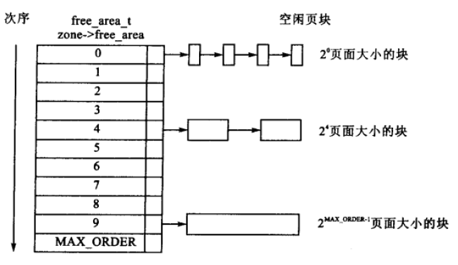
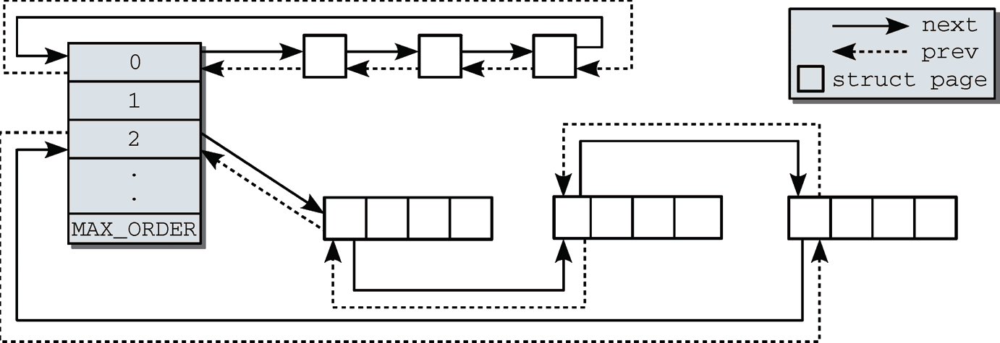
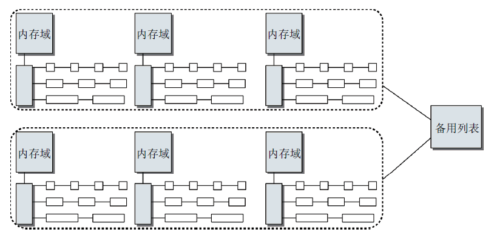
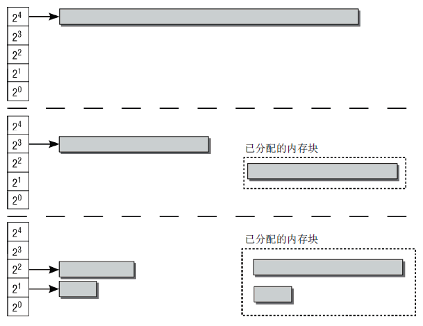
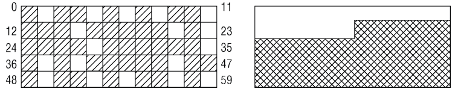
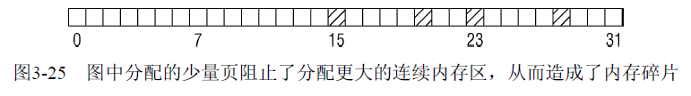

伙伴系统之伙伴系统概述--Linux内存管理(十五)
=======

| 日期 | 内核版本 | 架构| 作者 | GitHub| CSDN |
| ------- |:-------:|:-------:|:-------:|:-------:|:-------:|
| 2016-06-14 | [Linux-4.7](http://lxr.free-electrons.com/source/?v=4.7) | X86 & arm | [gatieme](http://blog.csdn.net/gatieme) | [LinuxDeviceDrivers](https://github.com/gatieme/LDD-LinuxDeviceDrivers/tree/master/study/kernel/02-memory/04-buddy/01-buddy_system) | [Linux内存管理](http://blog.csdn.net/gatieme/article/category/6225543) |


> 博文更新日志
> | 日期 | 更新内容 |
> |:------:|:------------:|
> | 2021/02/21 | 更新博文格式 |


# 1	前景回顾
-------


## 1.1	Linux内存管理的层次结构
-------


Linux把物理内存划分为三个层次来管理

| 层次 | 描述 |
|:----:|:----:|
| 存储节点(Node) |  CPU被划分为多个节点(node), 内存则被分簇, 每个CPU对应一个本地物理内存, 即一个CPU-node对应一个内存簇bank，即每个内存簇被认为是一个节点 |
| 管理区(Zone)   | 每个物理内存节点node被划分为多个内存管理区域, 用于表示不同范围的内存, 内核可以使用不同的映射方式映射物理内存 |
| 页面(Page) 	   |	内存被细分为多个页面帧, 页面是最基本的页面分配的单位　｜

为了支持NUMA模型，也即CPU对不同内存单元的访问时间可能不同，此时系统的物理内存被划分为几个节点(node), 一个node对应一个内存簇bank，即每个内存簇被认为是一个节点


*	首先, 内存被划分为**结点**. 每个节点关联到系统中的一个处理器, 内核中表示为`pg_data_t`的实例. 系统中每个节点被链接到一个以NULL结尾的`pgdat_list`链表中<而其中的每个节点利用`pg_data_tnode_next`字段链接到下一节．而对于PC这种UMA结构的机器来说, 只使用了一个成为contig_page_data的静态pg_data_t结构.

*	接着各个节点又被划分为内存管理区域, 一个**管理区域**通过struct zone_struct描述, 其被定义为zone_t, 用以表示内存的某个范围, 低端范围的16MB被描述为ZONE_DMA, 某些工业标准体系结构中的(ISA)设备需要用到它, 然后是可直接映射到内核的普通内存域ZONE_NORMAL,最后是超出了内核段的物理地址域ZONE_HIGHMEM, 被称为高端内存.　是系统中预留的可用内存空间, 不能被内核直接映射.


*	最后**页帧(page frame)**代表了系统内存的最小单位, 堆内存中的每个页都会创建一个struct page的一个实例. 传统上，把内存视为连续的字节，即内存为字节数组，内存单元的编号(地址)可作为字节数组的索引. 分页管理时，将若干字节视为一页，比如4K byte. 此时，内存变成了连续的页，即内存为页数组，每一页物理内存叫页帧，以页为单位对内存进行编号，该编号可作为页数组的索引，又称为页帧号.


## 1.2	内存结点pg_data_t
-------


在LINUX中引入一个数据结构`struct pglist_data` ，来描述一个node，定义在[`include/linux/mmzone.h`](http://lxr.free-electrons.com/source/include/linux/mmzone.h#L630) 文件中。（这个结构被typedef pg_data_t）。


*    对于NUMA系统来讲， 整个系统的内存由一个[node_data](http://lxr.free-electrons.com/source/arch/s390/numa/numa.c?v=4.7#L23)的pg_data_t指针数组来管理

*    对于PC这样的UMA系统，使用struct pglist_data contig_page_data ，作为系统唯一的node管理所有的内存区域。（UMA系统中中只有一个node）

可以使用NODE_DATA(node_id)来查找系统中编号为node_id的结点, 而UMA结构下由于只有一个结点, 因此该宏总是返回全局的contig_page_data, 而与参数node_id无关.

**NODE_DATA(node_id)查找编号node_id的结点pg_data_t信息** 参见[NODE_DATA的定义](http://lxr.free-electrons.com/ident?v=4.7;i=NODE_DATA)

```cpp
extern struct pglist_data *node_data[];
#define NODE_DATA(nid)          (node_data[(nid)])
```


在UMA结构的机器中, 只有一个node结点即contig_page_data, 此时NODE_DATA直接指向了全局的contig_page_data, 而与node的编号nid无关, 参照[include/linux/mmzone.h?v=4.7, line 858](http://lxr.free-electrons.com/source/include/linux/mmzone.h?v=4.7#L858)


```cpp
extern struct pglist_data contig_page_data;
#define NODE_DATA(nid)          (&contig_page_data)

```

## 1.3	物理内存区域
-------

因为实际的计算机体系结构有硬件的诸多限制, 这限制了页框可以使用的方式. 尤其是, Linux内核必须处理80x86体系结构的两种硬件约束.

*	ISA总线的直接内存存储DMA处理器有一个严格的限制 : 他们只能对RAM的前16MB进行寻址

*	在具有大容量RAM的现代32位计算机中, CPU不能直接访问所有的物理地址, 因为线性地址空间太小, 内核不可能直接映射所有物理内存到线性地址空间, 我们会在后面典型架构(x86)上内存区域划分详细讲解x86_32上的内存区域划分


因此Linux内核对不同区域的内存需要采用不同的管理方式和映射方式, 因此内核将物理地址或者成用zone_t表示的不同地址区域

对于x86_32的机器，管理区(内存区域)类型如下分布


| 类型 | 区域 |
| :------- | ----: |
| ZONE_DMA | 0~15MB |
| ZONE_NORMAL | 16MB~895MB |
| ZONE_HIGHMEM | 896MB~物理内存结束 |


## 1.4	物理页帧
-------

内核把物理页作为内存管理的基本单位. 尽管处理器的最小可寻址单位通常是字, 但是, 内存管理单元MMU通常以页为单位进行处理. 因此，从虚拟内存的上来看，页就是最小单位.

页帧代表了系统内存的最小单位, 对内存中的每个页都会创建struct page的一个实例. 内核必须要保证page结构体足够的小，否则仅struct page就要占用大量的内存.


 内核用[struct  page(include/linux/mm_types.h?v=4.7, line 45)](http://lxr.free-electrons.com/source/include/linux/mm_types.h?v4.7#L45)结构表示系统中的每个物理页.

出于节省内存的考虑，struct page中使用了大量的联合体union.


`mem_map`是一个struct page的数组，管理着系统中所有的物理内存页面。在系统启动的过程中，创建和分配mem_map的内存区域, mem_map定义在[mm/page_alloc.c?v=4.7, line 6691](http://lxr.free-electrons.com/source/mm/page_alloc.c?v=4.7#L6691)


UMA体系结构中，free_area_init函数在系统唯一的struct node对象contig_page_data中node_mem_map成员赋值给全局的mem_map变量


## 1.5	启动过程中的内存初始化
-------


在初始化过程中, 还必须建立内存管理的数据结构, 以及很多事务. 因为内核在内存管理完全初始化之前就需要使用内存. 在系统启动过程期间, 使用了额外的简化悉尼股市的内存管理模块, 然后在初始化完成后, 将旧的模块丢弃掉.


因此我们可以把linux内核的内存管理分三个阶段。

| 阶段 | 起点 | 终点 | 描述 |
|:---:|:----:|:---:|:---:|
| 第一阶段 | 系统启动 | bootmem或者memblock初始化完成 | 此阶段只能使用memblock_reserve函数分配内存， 早期内核中使用init_bootmem_done = 1标识此阶段结束 |
| 第二阶段 | bootmem或者memblock初始化完 | buddy完成前 | 引导内存分配器bootmem或者memblock接受内存的管理工作, 早期内核中使用mem_init_done = 1标记此阶段的结束 |
| 第三阶段 | buddy初始化完成 | 系统停止运行 | 可以用cache和buddy分配内存 |


**系统启动过程中的内存管理**


首先我们来看看start_kernel是如何初始化系统的, start_kerne定义在[init/main.c?v=4.7, line 479](http://lxr.free-electrons.com/source/init/main.c?v=4.7#L479)

其代码很复杂, 我们只截取出其中与内存管理初始化相关的部分, 如下所示


```cpp
asmlinkage __visible void __init start_kernel(void)
{

    /*  设置特定架构的信息
     *	同时初始化memblock  */
    setup_arch(&command_line);
    mm_init_cpumask(&init_mm);

    setup_per_cpu_areas();

	/*  初始化内存结点和内段区域  */
    build_all_zonelists(NULL, NULL);
    page_alloc_init();


    /*
     * These use large bootmem allocations and must precede
     * mem_init();
     * kmem_cache_init();
     */
    mm_init();

    kmem_cache_init_late();

	kmemleak_init();
    setup_per_cpu_pageset();

    rest_init();
}
```


| 函数  | 功能 |
|:----:|:----:|
| [setup_arch](http://lxr.free-electrons.com/ident?v=4.7;i=setup_arch) | 是一个特定于体系结构的设置函数, 其中一项任务是负责初始化自举分配器 |
| [mm_init_cpumask](http://lxr.free-electrons.com/source/include/linux/mm_types.h?v=4.7#L522) | 初始化CPU屏蔽字 |
| [setup_per_cpu_areas](http://lxr.free-electrons.com/ident?v=4.7;i=setup_per_cpu_areas) | 函数[(查看定义)](http://lxr.free-electrons.com/source/mm/percpu.c?v4.7#L2205])给每个CPU分配内存，并拷贝.data.percpu段的数据. 为系统中的每个CPU的per_cpu变量申请空间.<br>在SMP系统中, setup_per_cpu_areas初始化源代码中(使用[per_cpu宏](http://lxr.free-electrons.com/source/include/linux/percpu-defs.h#L256))定义的静态per-cpu变量, 这种变量对系统中每个CPU都有一个独立的副本. <br>此类变量保存在内核二进制影像的一个独立的段中, setup_per_cpu_areas的目的就是为系统中各个CPU分别创建一份这些数据的副本<br>在非SMP系统中这是一个空操作 |
| [build_all_zonelists](http://lxr.free-electrons.com/source/mm/page_alloc.c?v4.7#L5029) | 建立并初始化结点和内存域的数据结构 |
| [mm_init](http://lxr.free-electrons.com/source/init/main.c?v4.7#L464) | 建立了内核的内存分配器, <br>其中通过[mem_init](http://lxr.free-electrons.com/ident?v=4.7&i=mem_init)停用bootmem分配器并迁移到实际的内存管理器(比如伙伴系统)<br>然后调用kmem_cache_init函数初始化内核内部用于小块内存区的分配器 |
| [kmem_cache_init_late](http://lxr.free-electrons.com/source/mm/slab.c?v4.7#L1378) | 在kmem_cache_init之后, 完善分配器的缓存机制,　当前3个可用的内核内存分配器[slab](http://lxr.free-electrons.com/source/mm/slab.c?v4.7#L1378), [slob](http://lxr.free-electrons.com/source/mm/slob.c?v4.7#L655), [slub](http://lxr.free-electrons.com/source/mm/slub.c?v=4.7#L3960)都会定义此函数　|
| [kmemleak_init](http://lxr.free-electrons.com/source/mm/kmemleak.c?v=4.7#L1857) | Kmemleak工作于内核态，Kmemleak 提供了一种可选的内核泄漏检测，其方法类似于跟踪内存收集器。当独立的对象没有被释放时，其报告记录在 [/sys/kernel/debug/kmemleak](http://lxr.free-electrons.com/source/mm/kmemleak.c?v=4.7#L1467)中, Kmemcheck能够帮助定位大多数内存错误的上下文 |
| [setup_per_cpu_pageset](http://lxr.free-electrons.com/source/mm/page_alloc.c?v=4.7#L5392) | 初始化CPU高速缓存行, 为pagesets的第一个数组元素分配内存, 换句话说, 其实就是第一个系统处理器分配<br>由于在分页情况下，每次存储器访问都要存取多级页表，这就大大降低了访问速度。所以，为了提高速度，在CPU中设置一个最近存取页面的高速缓存硬件机制，当进行存储器访问时，先检查要访问的页面是否在高速缓存中. |


## 1.6	伙伴系统
-------

在内核初始化完成之后, 内存管理的责任就由伙伴系统来承担. 伙伴系统基于一种相对简单然而令人吃惊的强大算法.

Linux内核使用二进制伙伴算法来管理和分配物理内存页面, 该算法由Knowlton设计, 后来Knuth又进行了更深刻的描述.

伙伴系统是一个结合了2的方幂个分配器和空闲缓冲区合并计技术的内存分配方案, 其基本思想很简单. 内存被分成含有很多页面的大块, 每一块都是2个页面大小的方幂. 如果找不到想要的块, 一个大块会被分成两部分, 这两部分彼此就成为伙伴. 其中一半被用来分配, 而另一半则空闲. 这些块在以后分配的过程中会继续被二分直至产生一个所需大小的块. 当一个块被最终释放时, 其伙伴将被检测出来, 如果伙伴也空闲则合并两者.

*	内核如何记住哪些内存块是空闲的

*	分配空闲页面的方法

*	影响分配器行为的众多标识位

*	内存碎片的问题和分配器如何处理碎片


# 2	伙伴系统的结构
-------


## 2.1	伙伴系统数据结构
-------

系统内存中的每个物理内存页（页帧），都对应于一个struct page实例, 每个内存域都关联了一个struct zone的实例，其中保存了用于管理伙伴数据的主要数数组


```cpp
//  http://lxr.free-electrons.com/source/include/linux/mmzone.h?v=4.7#L324
struct zone
{
	 /* free areas of different sizes */
	struct free_area        free_area[MAX_ORDER];
};
```

struct free_area是一个伙伴系统的辅助数据结构, 它定义在[include/linux/mmzone.h?v=4.7, line 88](http://lxr.free-electrons.com/source/include/linux/mmzone.h?v=4.7#L88)

```cpp
struct free_area {
	struct list_head        free_list[MIGRATE_TYPES];
unsigned long           nr_free;
};
```

| 字段 | 描述 |
|:-----:|:-----:|
| free_list | 是用于连接空闲页的链表. 页链表包含大小相同的连续内存区 |
| nr_free | 指定了当前内存区中空闲页块的数目（对0阶内存区逐页计算，对1阶内存区计算页对的数目，对2阶内存区计算4页集合的数目，依次类推 |


伙伴系统的分配器维护空闲页面所组成的块, 这里每一块都是2的方幂个页面, 方幂的指数称为**阶**.


阶是伙伴系统中一个非常重要的术语. 它描述了内存分配的数量单位. 内存块的长度是$2^order$, 其中order的范围从0到MAX_ORDER


zone->free_area[MAX_ORDER]数组中阶作为各个元素的索引, 用于指定对应链表中的连续内存区包含多少个页帧.

*	数组中第0个元素的阶为0, 它的free_list链表域指向具有包含区为单页($2^0=1$)的内存页面链表

*	数组中第1个元素的free_list域管理的内存区为两页($2^1=2$)

*	第3个管理的内存区为4页, 依次类推.

*	直到$2^{MAX_ORDER-1}$个页面大小的块




## 2.2	最大阶MAX_ORDER与FORCE_MAX_ZONEORDER配置选项
-------


一般来说`MAX_ORDER`默认定义为11, 这意味着一次分配可以请求的页数最大是2^11=2048, 参见[include/linux/mmzone.h?v=4.7, line 22](http://lxr.free-electrons.com/source/include/linux/mmzone.h?v=4.7#L22)

```cpp
/* Free memory management - zoned buddy allocator.  */
#ifndef CONFIG_FORCE_MAX_ZONEORDER
#define MAX_ORDER 11
#else
#define MAX_ORDER CONFIG_FORCE_MAX_ZONEORDER
#endif
#define MAX_ORDER_NR_PAGES (1 << (MAX_ORDER - 1))
```


但如果特定于体系结构的代码设置了`FORCE_MAX_ZONEORDER`配置选项, 该值也可以手工改变

例如，IA-64系统上巨大的地址空间可以处理`MAX_ORDER = 18`的情形，而ARM或v850系统则使用更小的值(如8或9). 但这不一定是由计算机支持的内存数量比较小引起的，也可能是内存对齐方式的要求所导致


可以参考一些架构的Kconfig文件如下

| arm | arm64 |
|:---:|:-----:|
| [arch/arm/Kconfig?v=4.7, line 1696](http://lxr.free-electrons.com/source/arch/arm/Kconfig?v=4.7#L1696) | [arch/arm64/Kconfig?v=4.7, line 679](http://lxr.free-electrons.com/source/arch/arm64/Kconfig?v=4.7#L679) |


比如[arm64体系结构的Kconfig配置文件的描述](http://lxr.free-electrons.com/source/arch/arm64/Kconfig?v=4.7#L679) |

```cpp
config FORCE_MAX_ZONEORDER
int
default "14" if (ARM64_64K_PAGES && TRANSPARENT_HUGEPAGE)
default "12" if (ARM64_16K_PAGES && TRANSPARENT_HUGEPAGE)
default "11"`
```


## 2.3	内存区是如何连接的
-------


内存区中第1页内的链表元素, 可用于将内存区维持在链表中。因此，也不必引入新的数据结构来管理物理上连续的页，否则这些页不可能在同一内存区中. 如下图所示





伙伴不必是彼此连接的. 如果一个内存区在分配其间分解为两半, 内核会自动将未用的一半加入到对应的链表中.

如果在未来的某个时刻, 由于内存释放的缘故, 两个内存区都处于空闲状态, 可通过其地址判断其是否为伙伴. 管理工作较少, 是伙伴系统的一个主要优点.

基于伙伴系统的内存管理专注于某个结点的某个内存域, 例如, DMA或高端内存域. 但所有内存域和结点的伙伴系统都通过备用分配列表连接起来.

下图说明了这种关系.




最后要注意, 有关伙伴系统和当前状态的信息可以在/proc/buddyinfo中获取


上述输出给出了各个内存域中每个分配阶中空闲项的数目, 从左至右, 阶依次升高. 上面给出的信息取自4 GiB物理内存的AMD64系统.

## 2.4 传统伙伴系统算法
-------

在内核分配内存时, 必须记录页帧的已分配或空闲状态, 以免两个进程使用同样的内存区域. 由于内存分配和释放非常频繁, 内核还必须保证相关操作尽快完成. 内核可以只分配完整的页帧. 将内存划分为更小的部分的工作, 则委托给用户空间中的标准库. 标准库将来源于内核的页帧拆分为小的区域, 并为进程分配内存.


内核中很多时候要求分配连续页. 为快速检测内存中的连续区域, 内核采用了一种古老而历经检验的技术: **伙伴系统**

系统中的空闲内存块总是两两分组, 每组中的两个内存块称作伙伴. 伙伴的分配可以是彼此独立的. 但如果两个伙伴都是空闲的, 内核会将其合并为一个更大的内存块, 作为下一层次上某个内存块的伙伴.

下图示范了该系统, 图中给出了一对伙伴, 初始大小均为8页. 即系统中所有的页面都是8页的.



内核对所有大小相同的伙伴（1、2、4、8、16或其他数目的页），都放置到同一个列表中管理. 各有8页的一对伙伴也在相应的列表中.

如果系统现在需要8个页帧, 则将16个页帧组成的块拆分为两个伙伴. 其中一块用于满足应用程序的请求, 而剩余的8个页帧则放置到对应8页大小内存块的列表中.

如果下一个请求只需要2个连续页帧, 则由8页组成的块会分裂成2个伙伴, 每个包含4个页帧. 其中一块放置回伙伴列表中，而另一个再次分裂成2个伙伴, 每个包含2页。其中一个回到伙伴系统，另一个则传递给应用程序.

在应用程序释放内存时, 内核可以直接检查地址, 来判断是否能够创建一组伙伴, 并合并为一个更大的内存块放回到伙伴列表中, 这刚好是内存块分裂的逆过程。这提高了较大内存块可用的可能性.

在系统长期运行时，服务器运行几个星期乃至几个月是很正常的，许多桌面系统也趋向于长期开机运行，那么会发生称为碎片的内存管理问题。频繁的分配和释放页帧可能导致一种情况：系统中有若干页帧是空闲的，但却散布在物理地址空间的各处。换句话说，系统中缺乏连续页帧组成的较大的内存块，而从性能上考虑，却又很需要使用较大的连续内存块。通过伙伴系统可以在某种程度上减少这种效应，但无法完全消除。如果在大块的连续内存中间刚好有一个页帧分配出去，很显然这两块空闲的内存是无法合并的.

在内核版本2.6.24之后, 增加了一些有效措施来防止内存碎片.


# 3	避免碎片
-------

在第1章给出的简化说明中, 一个双链表即可满足伙伴系统的所有需求. 在内核版本2.6.23之前, 的确是这样. 但在内核2.6.24开发期间, 内核开发者对伙伴系统的争论持续了相当长时间. 这是因为伙伴系统是内核最值得尊敬的一部分，对它的改动不会被大家轻易接受


## 3.1	内存碎片
-------

伙伴系统的基本原理已经在第1章中讨论过，其方案在最近几年间确实工作得非常好。但在Linux内存管理方面，有一个长期存在的问题：在系统启动并长期运行后，物理内存会产生很多碎片。该情形如下图所示



假定内存由60页组成，这显然不是超级计算机，但用于示例却足够了。左侧的地址空间中散布着空闲页。尽管大约25%的物理内存仍然未分配，但最大的连续空闲区只有一页. 这对用户空间应用程序没有问题：其内存是通过页表映射的，无论空闲页在物理内存中的分布如何，应用程序看到的内存
似乎总是连续的。右图给出的情形中，空闲页和使用页的数目与左图相同，但所有空闲页都位于一个连续区中。

但对内核来说，碎片是一个问题. 由于(大多数)物理内存一致映射到地址空间的内核部分, 那么在左图的场景中, 无法映射比一页更大的内存区. 尽管许多时候内核都分配的是比较小的内存, 但也有时候需要分配多于一页的内存. 显而易见, 在分配较大内存的情况下, 右图中所有已分配页和空闲页都处于连续内存区的情形，是更为可取的.

很有趣的一点是, 在大部分内存仍然未分配时, 就也可能发生碎片问题. 考虑图3-25的情形.

只分配了4页，但可分配的最大连续区只有8页，因为伙伴系统所能工作的分配范围只能是2的幂次.




我提到内存碎片只涉及内核，这只是部分正确的。大多数现代CPU都提供了使用巨型页的可能性，比普通页大得多。这对内存使用密集的应用程序有好处。在使用更大的页时，地址转换后备缓冲器只需处理较少的项，降低了TLB缓存失效的可能性。但分配巨型页需要连续的空闲物理内存！

很长时间以来，物理内存的碎片确实是Linux的弱点之一。尽管已经提出了许多方法，但没有哪个方法能够既满足Linux需要处理的各种类型工作负荷提出的苛刻需求，同时又对其他事务影响不大。


## 3.2	依据可移动性组织页
-------


在内核2.6.24开发期间，防止碎片的方法最终加入内核。在我讨论具体策略之前，有一点需要澄清。

文件系统也有碎片，该领域的碎片问题主要通过碎片合并工具解决。它们分析文件系统，重新排序已分配存储块，从而建立较大的连续存储区. 理论上，该方法对物理内存也是可能的，但由于许多物理内存页不能移动到任意位置，阻碍了该方法的实施。因此，内核的方法是反碎片(anti-fragmentation), 即试图从最初开始尽可能防止碎片.

<font color=0x00ffff>
反碎片的工作原理如何?
</font>


为理解该方法，我们必须知道内核将已分配页划分为下面3种不同类型。


| 页面类型 | 描述 | 举例 |
|:---------:|:-----:|:-----:|
| 不可移动页 | 在内存中有固定位置, **不能移动**到其他地方. | 核心内核分配的大多数内存属于该类别 |
| 可移动页 | **可以随意地移动**. | 属于用户空间应用程序的页属于该类别. 它们是通过页表映射的<br>如果它们复制到新位置，页表项可以相应地更新，应用程序不会注意到任何事 |
| 可回收页 | **不能直接移动, 但可以删除, 其内容可以从某些源重新生成**. | 例如，映射自文件的数据属于该类别<br>kswapd守护进程会根据可回收页访问的频繁程度，周期性释放此类内存. , 页面回收本身就是一个复杂的过程. 内核会在可回收页占据了太多内存时进行回收, 在内存短缺(即分配失败)时也可以发起页面回收. |


页的可移动性，依赖该页属于3种类别的哪一种. 内核使用的**反碎片技术**, 即基于将具有相同可移动性的页分组的思想.

<font color=0x00ffff>
为什么这种方法有助于减少碎片?
</font>

由于页无法移动, 导致在原本几乎全空的内存区中无法进行连续分配. 根据页的可移动性, 将其分配到不同的列表中, 即可防止这种情形. 例如, 不可移动的页不能位于可移动内存区的中间, 否则就无法从该内存区分配较大的连续内存块.


想一下, 上图中大多数空闲页都属于可回收的类别, 而分配的页则是不可移动的. 如果这些页聚集到两个不同的列表中, 如下图所示. 在不可移动页中仍然难以找到较大的连续空闲空间, 但对可回收的页, 就容易多了.


但要注意, 从最初开始, 内存并未划分为可移动性不同的区. 这些是在运行时形成的. 内核的另一种方法确实将内存分区, 分别用于可移动页和不可移动页的分配, 我会下文讨论其工作原理. 但这种划分对这里描述的方法是不必要的


## 3.3	避免碎片数据结构
-------


### 3.3.1	迁移类型
-------


尽管内核使用的反碎片技术卓有成效，它对伙伴分配器的代码和数据结构几乎没有影响。内核定义了一些枚举常量(早期用宏来实现)来表示不同的迁移类型, 参见[include/linux/mmzone.h?v=4.7, line 38](http://lxr.free-electrons.com/source/include/linux/mmzone.h?v=4.7#L38)

```cpp
enum {
        MIGRATE_UNMOVABLE,
        MIGRATE_MOVABLE,
        MIGRATE_RECLAIMABLE,
        MIGRATE_PCPTYPES,       /* the number of types on the pcp lists */
        MIGRATE_HIGHATOMIC = MIGRATE_PCPTYPES,
#ifdef CONFIG_CMA
        /*
         * MIGRATE_CMA migration type is designed to mimic the way
         * ZONE_MOVABLE works.  Only movable pages can be allocated
         * from MIGRATE_CMA pageblocks and page allocator never
         * implicitly change migration type of MIGRATE_CMA pageblock.
         *
         * The way to use it is to change migratetype of a range of
         * pageblocks to MIGRATE_CMA which can be done by
         * __free_pageblock_cma() function.  What is important though
         * is that a range of pageblocks must be aligned to
         * MAX_ORDER_NR_PAGES should biggest page be bigger then
         * a single pageblock.
         */
        MIGRATE_CMA,
#endif
#ifdef CONFIG_MEMORY_ISOLATION
        MIGRATE_ISOLATE,        /* can't allocate from here */
#endif
        MIGRATE_TYPES
};
```


|  宏  | 类型 |
|:----:|:-----:|
| MIGRATE_UNMOVABLE | 不可移动页 |
| MIGRATE_MOVABLE | 可移动页 |
| MIGRATE_RECLAIMABLE | 可回收页 |
| MIGRATE_PCPTYPES | 是per_cpu_pageset, 即用来表示每CPU页框高速缓存的数据结构中的链表的迁移类型数目 |
| MIGRATE_HIGHATOMIC |  = MIGRATE_PCPTYPES, 在罕见的情况下，内核需要分配一个高阶的页面块而不能休眠.如果向具有特定可移动性的列表请求分配内存失败，这种紧急情况下可从MIGRATE_HIGHATOMIC中分配内存 |
| MIGRATE_CMA | Linux内核最新的连续内存分配器(CMA), 用于避免预留大块内存 |
| MIGRATE_ISOLATE | 是一个特殊的虚拟区域, 用于跨越NUMA结点移动物理内存页. 在大型系统上, 它有益于将物理内存页移动到接近于使用该页最频繁的CPU. |
| MIGRATE_TYPES | 只是表示迁移类型的数目, 也不代表具体的区域 |

对于MIGRATE_CMA类型, 其中在我们使用ARM等嵌入式Linux系统的时候, 一个头疼的问题是GPU, Camera, HDMI等都需要预留大量连续内存，这部分内存平时不用，但是一般的做法又必须先预留着. 目前, Marek Szyprowski和Michal Nazarewicz实现了一套全新的Contiguous Memory Allocator. 通过这套机制, 我们可以做到不预留内存，这些内存平时是可用的，只有当需要的时候才被分配给Camera，HDMI等设备. 参照[宋宝华--Linux内核最新的连续内存分配器(CMA)——避免预留大块内存](http://21cnbao.blog.51cto.com/109393/898846/), 内核为此提供了函数is_migrate_cma来检测当前类型是否为MIGRATE_CMA, 该函数定义在[include/linux/mmzone.h?v=4.7, line 69](http://lxr.free-electrons.com/source/include/linux/mmzone.h?v=4.7#L69)

```cpp
/* In mm/page_alloc.c; keep in sync also with show_migration_types() there */
extern char * const migratetype_names[MIGRATE_TYPES];

#ifdef CONFIG_CMA
#  define is_migrate_cma(migratetype) unlikely((migratetype) == MIGRATE_CMA)
#else
#  define is_migrate_cma(migratetype) false
#endif
```


对伙伴系统数据结构的主要调整, 是将空闲列表分解为MIGRATE_TYPE个列表, 可以参见free_area的定义[include/linux/mmzone.h?v=4.7, line 88](http://lxr.free-electrons.com/source/include/linux/mmzone.h?v=4.7#L88)

```cpp
struct free_area
{
	struct list_head        free_list[MIGRATE_TYPES];
unsigned long           nr_free;
};
```

*	nr_free统计了所有列表上空闲页的数目，而每种迁移类型都对应于一个空闲列表


宏for_each_migratetype_order(order, type)可用于迭代指定迁移类型的所有分配阶

```cpp
#define for_each_migratetype_order(order, type) \
        for (order = 0; order < MAX_ORDER; order++) \
                for (type = 0; type < MIGRATE_TYPES; type++)
```


### 3.3.2	迁移备用列表fallbacks
-------


<font color = 0x00ffff>
如果内核无法满足针对某一给定迁移类型的分配请求, 会怎么样?
</font>


此前已经出现过一个类似的问题, 即特定的NUMA内存域无法满足分配请求时. 我们需要从其他内存域中选择一个代价最低的内存域完成内存的分配, 因此内核在内存的结点pg_data_t中提供了一个备用内存域列表zonelists.

内核在内存迁移的过程中处理这种情况下的做法是类似的. 提供了一个备用列表fallbacks, 规定了在指定列表中无法满足分配请求时. 接下来应使用哪一种迁移类型, 定义在[mm/page_alloc.c?v=4.7, line 1799](http://lxr.free-electrons.com/source/mm/page_alloc.c?v=4.7#L1799)


```cpp
/*
 * This array describes the order lists are fallen back to when
 * the free lists for the desirable migrate type are depleted
 * 该数组描述了指定迁移类型的空闲列表耗尽时
 * 其他空闲列表在备用列表中的次序
 */
static int fallbacks[MIGRATE_TYPES][4] = {
	//  分配不可移动页失败的备用列表
    [MIGRATE_UNMOVABLE]   = { MIGRATE_RECLAIMABLE, MIGRATE_MOVABLE,   MIGRATE_TYPES },
    //  分配可回收页失败时的备用列表
    [MIGRATE_RECLAIMABLE] = { MIGRATE_UNMOVABLE,   MIGRATE_MOVABLE,   MIGRATE_TYPES },
    //  分配可移动页失败时的备用列表
    [MIGRATE_MOVABLE]     = { MIGRATE_RECLAIMABLE, MIGRATE_UNMOVABLE, MIGRATE_TYPES },
#ifdef CONFIG_CMA
    [MIGRATE_CMA]     = { MIGRATE_TYPES }, /* Never used */
#endif
#ifdef CONFIG_MEMORY_ISOLATION
    [MIGRATE_ISOLATE]     = { MIGRATE_TYPES }, /* Never used */
#endif
};
```

>该数据结构大体上是自明的 :
>
>每一行对应一个类型的备用搜索域的顺序, 在内核想要分配不可移动页`MIGRATE_UNMOVABLE`时, 如果对应链表为空, 则遍历fallbacks[MIGRATE_UNMOVABLE], 首先后退到可回收页链表`MIGRATE_RECLAIMABLE`, 接下来到可移动页链表`MIGRATE_MOVABLE`, 最后到紧急分配链表`MIGRATE_TYPES`.


### 3.3.3	pageblock_order变量
-------


全局变量和辅助函数尽管页可移动性分组特性总是编译到内核中，但只有在系统中有足够内存可以分配到多个迁移类型对应的链表时，才是有意义的。由于每个迁移链表都应该有适当数量的内存，内核需要定义"适当"的概念. 这是通过两个全局变量pageblock_order和pageblock_nr_pages提供的. 第一个表示内核认为是"大"的一个分配阶, pageblock_nr_pages则表示该分配阶对应的页数。如果体系结构提供了巨型页机制, 则pageblock_order通常定义为巨型页对应的分配阶. 定义在[include/linux/pageblock-flags.h?v=4.7, line 44](http://lxr.free-electrons.com/source/include/linux/pageblock-flags.h?v=4.7#L42)


```cpp
#ifdef CONFIG_HUGETLB_PAGE

    #ifdef CONFIG_HUGETLB_PAGE_SIZE_VARIABLE

        /* Huge page sizes are variable */
        extern unsigned int pageblock_order;

    #else /* CONFIG_HUGETLB_PAGE_SIZE_VARIABLE */

    /* Huge pages are a constant size */
        #define pageblock_order         HUGETLB_PAGE_ORDER

    #endif /* CONFIG_HUGETLB_PAGE_SIZE_VARIABLE */

#else /* CONFIG_HUGETLB_PAGE */

    /* If huge pages are not used, group by MAX_ORDER_NR_PAGES */
    #define pageblock_order         (MAX_ORDER-1)

#endif /* CONFIG_HUGETLB_PAGE */

#define pageblock_nr_pages      (1UL << pageblock_order)
```

在IA-32体系结构上, 巨型页长度是4MB, 因此每个巨型页由1024个普通页组成, 而HUGETLB_PAGE_ORDER则定义为10. 相比之下, IA-64体系结构允许设置可变的普通和巨型页长度, 因此HUGETLB_PAGE_ORDER的值取决于内核配置.

如果体系结构不支持巨型页, 则将其定义为第二高的分配阶, 即`MAX_ORDER - 1`

```cpp
/* If huge pages are not used, group by MAX_ORDER_NR_PAGES */
#define pageblock_order         (MAX_ORDER-1)
```

如果各迁移类型的链表中没有一块较大的连续内存, 那么页面迁移不会提供任何好处, 因此在可用内存太少时内核会关闭该特性. 这是在build_all_zonelists函数中检查的, 该函数用于初始化内存域列表. 如果没有足够的内存可用, 则全局变量[`page_group_by_mobility_disabled`](http://lxr.free-electrons.com/source/include/linux/mmzone.h?v=4.7#L79)设置为0, 否则设置为1.

内核如何知道给定的分配内存属于何种迁移类型?

我们将在以后讲解, 有关各个内存分配的细节都通过分配掩码指定.

内核提供了两个标志，分别用于表示分配的内存是可移动的(\__GFP_MOVABLE)或可回收的(\__GFP_RECLAIMABLE).


### 3.3.4	gfpflags_to_migratetype函数
-------


如果这些标志都没有设置, 则分配的内存假定为不可移动的. 辅助函数gfpflags_to_migratetype可用于转换分配标志及对应的迁移类型, 该函数定义在[include/linux/gfp.h?v=4.7, line 266](http://lxr.free-electrons.com/source/include/linux/gfp.h?v=4.7#L266)

```cpp
static inline int gfpflags_to_migratetype(const gfp_t gfp_flags)
{
    VM_WARN_ON((gfp_flags & GFP_MOVABLE_MASK) == GFP_MOVABLE_MASK);
    BUILD_BUG_ON((1UL << GFP_MOVABLE_SHIFT) != ___GFP_MOVABLE);
    BUILD_BUG_ON((___GFP_MOVABLE >> GFP_MOVABLE_SHIFT) != MIGRATE_MOVABLE);

    if (unlikely(page_group_by_mobility_disabled))
        return MIGRATE_UNMOVABLE;

    /* Group based on mobility */
    return (gfp_flags & GFP_MOVABLE_MASK) >> GFP_MOVABLE_SHIFT;
}
```

>linux-2.6.x的内核中转换分配标志及对应的迁移类型的辅助函数为allocflags_to_migratetype, 这个名字会有歧义的, 让我们误以为参数的标识中有alloc flags, 但是其实并不然, 因此后来的内核中将该函数更名为gfpflags_to_migratetype, 参见[Rename it to gfpflags_to_migratetype()](https://patchwork.kernel.org/patch/4291831)

在2.6.25中为如下接口

```cpp
/* Convert GFP flags to their corresponding migrate type */
static inline int allocflags_to_migratetype(gfp_t gfp_flags)
{
    WARN_ON((gfp_flags & GFP_MOVABLE_MASK) == GFP_MOVABLE_MASK);

    if (unlikely(page_group_by_mobility_disabled))
        return MIGRATE_UNMOVABLE;

    /* Group based on mobility */
    return (((gfp_flags & __GFP_MOVABLE) != 0) << 1) |
        ((gfp_flags & __GFP_RECLAIMABLE) != 0);
}
```

如果停用了页面迁移特性, 则所有的页都是不可移动的. 否则. 该函数的返回值可以直接用作free_area.free_list的数组索引.

### 3.3.5	pageblock_flags变量与其函数接口

最后要注意, 每个内存域都提供了一个特殊的字段, 可以跟踪包含pageblock_nr_pages个页的内存区的属性. 即zone->pageblock_flags字段, 当前只有与页可移动性相关的代码使用, 参见[include/linux/mmzone.h?v=4.7, line 367](http://lxr.free-electrons.com/source/include/linux/mmzone.h?v=4.7#L367)


```cpp
struct zone
{
#ifndef CONFIG_SPARSEMEM
    /*
     * Flags for a pageblock_nr_pages block. See pageblock-flags.h.
     * In SPARSEMEM, this map is stored in struct mem_section
     */
    unsigned long       *pageblock_flags;
#endif /* CONFIG_SPARSEMEM */
};
```

在初始化期间, 内核自动确保对内存域中的每个不同的迁移类型分组, 在pageblock_flags中都分配了足够存储NR_PAGEBLOCK_BITS个比特位的空间。当前，表示一个连续内存区的迁移类型需要3个比特位, 参见[include/linux/pageblock-flags.h?v=4.7, line 28](http://lxr.free-electrons.com/source/include/linux/pageblock-flags.h?v=4.7#L28)

```cpp
/* Bit indices that affect a whole block of pages */
enum pageblock_bits {
    PB_migrate,
    PB_migrate_end = PB_migrate + 3 - 1,
            /* 3 bits required for migrate types */
    PB_migrate_skip,/* If set the block is skipped by compaction */

    /*
     * Assume the bits will always align on a word. If this assumption
     * changes then get/set pageblock needs updating.
     */
    NR_PAGEBLOCK_BITS
};
```


内核提供`set_pageblock_migratetype`负责设置以page为首的一个内存区的迁移类型, 该函数定义在[mm/page_alloc.c?v=4.7, line 458](http://lxr.free-electrons.com/source/mm/page_alloc.c?v=4.7#L458), 如下所示


```cpp
void set_pageblock_migratetype(struct page *page, int migratetype)
{
    if (unlikely(page_group_by_mobility_disabled &&
             migratetype < MIGRATE_PCPTYPES))
        migratetype = MIGRATE_UNMOVABLE;

    set_pageblock_flags_group(page, (unsigned long)migratetype,
                    PB_migrate, PB_migrate_end);
}
```


`migratetype`参数可以通过上文介绍的`gfpflags_to_migratetype`辅助函数构建. 请注意很重要的一点, 页的迁移类型是预先分配好的, 对应的比特位总是可用, 与页是否由伙伴系统管理无关. 在释放内存时，页必须返回到正确的迁移链表。这之所以可行，是因为能够从`get_pageblock_migratetype`获得所需的信息. 参见[include/linux/mmzone.h?v=4.7, line 84](http://lxr.free-electrons.com/source/include/linux/mmzone.h?v=4.7#L84)


```cpp
#define get_pageblock_migratetype(page)                                 \
        get_pfnblock_flags_mask(page, page_to_pfn(page),                \
                        PB_migrate_end, MIGRATETYPE_MASK)
```


最后请注意, 在各个迁移链表之间, 当前的页面分配状态可以从`/proc/pagetypeinfo`获得.


## 3.4 初始化基于可移动性的分组
-------


在内存子系统初始化期间, memmap_init_zone负责处理内存域的page实例. 该函数定义在[mm/page_alloc.c?v=4.7, line 5139](http://lxr.free-electrons.com/source/mm/page_alloc.c?v=4.7#L5139), 该函数完成了一些不怎么有趣的标准初始化工作，但其中有一件是实质性的，即所有的页最初都标记为可移动的. 参见[mm/page_alloc.c?v=4.7, line 5224](http://lxr.free-electrons.com/source/mm/page_alloc.c?v=4.7#L5224)


```cpp
/*
 * Initially all pages are reserved - free ones are freed
 * up by free_all_bootmem() once the early boot process is
 * done. Non-atomic initialization, single-pass.
 */
void __meminit memmap_init_zone(unsigned long size, int nid, unsigned long zone,
        unsigned long start_pfn, enum memmap_context context)
{
    /*  ......  */

    for (pfn = start_pfn; pfn < end_pfn; pfn++) {
        /*  ......  */
not_early:
        if (!(pfn & (pageblock_nr_pages - 1))) {
            struct page *page = pfn_to_page(pfn);

            __init_single_page(page, pfn, zone, nid);
            set_pageblock_migratetype(page, MIGRATE_MOVABLE);
        } else {
            __init_single_pfn(pfn, zone, nid);
        }
    }
}
```


在分配内存时, 如果必须"盗取"不同于预定迁移类型的内存区, 内核在策略上倾向于"盗取"更大的内存区. 由于所有页最初都是可移动的, 那么在内核分配不可移动的内存区时, 则必须"盗取".

实际上, 在启动期间分配可移动内存区的情况较少, 那么分配器有很高的几率分配长度最大的内存区, 并将其从可移动列表转换到不可移动列表. 由于分配的内存区长度是最大的, 因此不会向可移动内存中引入碎片.

总而言之, 这种做法避免了启动期间内核分配的内存(经常在系统的整个运行时间都不释放)散布到物理内存各处, 从而使其他类型的内存分配免受碎片的干扰，这也是页可移动性分组框架的最重要的目标之一.


# 4	分配器API
-------


## 4.1	分配内存的接口
-------

就伙伴系统的接口而言, NUMA或UMA体系结构是没有差别的, 二者的调用语法都是相同的.

所有函数的一个共同点是 : 只能分配2的整数幂个页.

因此，接口中不像C标准库的malloc函数或bootmem和memblock分配器那样指定了所需内存大小作为参数. 相反, 必须指定的是分配阶, 伙伴系统将在内存中分配$2^order$页. 内核中细粒度的分配只能借助于slab分配器(或者slub、slob分配器), 后者基于伙伴系统


| 内存分配函数 | 功能 | 定义 |
|:----------:|:----:|:---:|
| alloc_pages(mask, order) | 分配$2^order$页并返回一个struct page的实例，表示分配的内存块的起始页 | [NUMA-include/linux/gfp.h, line 466](http://lxr.free-electrons.com/source/include/linux/gfp.h?v=4.7#L466)<br>[UMA-include/linux/gfp.h?v=4.7, line 476](http://lxr.free-electrons.com/source/include/linux/gfp.h?v=4.7#L476) |
| alloc_page(mask) | 是前者在order = 0情况下的简化形式，只分配一页 |  [include/linux/gfp.h?v=4.7, line 483](http://lxr.free-electrons.com/source/include/linux/gfp.h?v=4.7#L483) |
| get_zeroed_page(mask) | 分配一页并返回一个page实例，页对应的内存填充0（所有其他函数，分配之后页的内容是未定义的） | [mm/page_alloc.c?v=4.7, line 3900](http://lxr.free-electrons.com/source/mm/page_alloc.c?v=4.7#L3900)| |
| [`__get_free_pages(mask, order)`](http://lxr.free-electrons.com/source/mm/page_alloc.c?v=4.7#L3883)<br>[`__get_free_page(mask)`](http://lxr.free-electrons.com/source/include/linux/gfp.h?v=4.7#L500) | 工作方式与上述函数相同，但返回分配内存块的虚拟地址，而不是page实例 |
| get_dma_pages(gfp_mask, order) | 用来获得适用于DMA的页. | [include/linux/gfp.h?v=4.7, line 503](http://lxr.free-electrons.com/source/include/linux/gfp.h?v=4.7#L503) |


在空闲内存无法满足请求以至于分配失败的情况下，所有上述函数都返回空指针(比如alloc_pages和alloc_page)或者0(比如get_zeroed_page、 `__get_free_pages` 和 `__get_free_page`).

因此内核在各次分配之后都必须检查返回的结果. 这种惯例与设计得很好的用户层应用程序没什么不同, 但在内核中忽略检查会导致严重得多的故障


内核除了伙伴系统函数之外, 还提供了其他内存管理函数. 它们以伙伴系统为基础, 但并不属于伙伴分配器自身. 这些函数包括vmalloc和vmalloc_32, 使用页表将不连续的内存映射到内核地址空间中, 使之看上去是连续的.

还有一组kmalloc类型的函数, 用于分配小于一整页的内存区. 其实现
将在本章后续的几节分别讨论。


## 4.2 释放函数
-------

有4个函数用于释放不再使用的页，与所述函数稍有不同


| 内存释放函数 | 描述 |
|:--------------:|:-----:|
| [free_page(struct page *)](http://lxr.free-electrons.com/source/include/linux/gfp.h?v=4.7#L520)<br>[free_pages(struct page *, order)](http://lxr.free-electrons.com/source/mm/page_alloc.c?v=4.7#L3918) | 用于将一个或2order页返回给内存管理子系统。内存区的起始地址由指向该内存区的第一个page实例的指针表示 |
| [__free_page(addr)](http://lxr.free-electrons.com/source/include/linux/gfp.h?v=4.7#L519)<br>[__free_pages(addr, order)](http://lxr.free-electrons.com/source/mm/page_alloc.c?v=4.7#L3906) | 类似于前两个函数，但在表示需要释放的内存区时，使用了虚拟内存地址而不是page实例 |


## 4.3	分配掩码(gfp_mask标志)
-------


### 4.3.1	分配掩码
-------

前述所有函数中强制使用的mask参数，到底是什么语义?

我们知道Linux将内存划分为内存域. 内核提供了所谓的内存域修饰符(zone modifier)(在掩码的最低4个比特位定义), 来指定从哪个内存域分配所需的页.


内核使用宏的方式定义了这些掩码, 一个掩码的定义被划分为3个部分进行定义, 我们会逐步展开来讲解, 参见[include/linux/gfp.h?v=4.7, line 12~374](http://lxr.free-electrons.com/source/include/linux/gfp.h?v=4.7#L12), 共计26个掩码信息, 因此后面__GFP_BITS_SHIFT =  26.


### 4.3.2	掩码分类
-------


Linux中这些掩码标志`gfp_mask`分为3种类型 :


| 类型 | 描述 |
|:-----:|:-----:|
| 区描述都符 | 内核把物理内存分为多个区, 每个区用于不同的目的, 区描述符指明到底从这些区中的哪一区进行分配 |
| 行为修饰符 | 表示内核应该如何分配所需的内存. 在某些特定情况下, 只能使用某些特定的方法分配内存 |
| 类型标志 | 组合了行为修饰符和区描述符, 将这些可能用到的组合归纳为不同类型 |


### 4.3.3	内核中掩码的定义
-------

**内核中的定义方式**

```cpp
//  http://lxr.free-electrons.com/source/include/linux/gfp.h?v=4.7

/*  line 12 ~ line 44  第一部分
 *  定义可掩码所在位的信息, 每个掩码对应一位为1
 *  定义形式为  #define	___GFP_XXX		0x01u
 */
/* Plain integer GFP bitmasks. Do not use this directly. */
#define ___GFP_DMA              0x01u
#define ___GFP_HIGHMEM          0x02u
#define ___GFP_DMA32            0x04u
#define ___GFP_MOVABLE          0x08u
/*  ......  */

/*  line 46 ~ line 192  第二部分
 *  定义掩码和MASK信息, 第二部分的某些宏可能是第一部分一个或者几个的组合
 *  定义形式为  #define	__GFP_XXX		 ((__force gfp_t)___GFP_XXX)
 */
#define __GFP_DMA       ((__force gfp_t)___GFP_DMA)
#define __GFP_HIGHMEM   ((__force gfp_t)___GFP_HIGHMEM)
#define __GFP_DMA32     ((__force gfp_t)___GFP_DMA32)
#define __GFP_MOVABLE   ((__force gfp_t)___GFP_MOVABLE)  /* ZONE_MOVABLE allowed */
#define GFP_ZONEMASK    (__GFP_DMA|__GFP_HIGHMEM|__GFP_DMA32|__GFP_MOVABLE)

/*  line 194 ~ line 260  第三部分
 *  定义掩码
 *  定义形式为  #define	GFP_XXX		 __GFP_XXX
 */
#define GFP_DMA         __GFP_DMA
#define GFP_DMA32       __GFP_DMA32
```


其中GFP缩写的意思为获取空闲页(get free page), `__GFP_MOVABLE` 不表示物理内存域, 但通知内核应在特殊的虚拟内存域ZONE_MOVABLE进行相应的分配.


**定义掩码位**


我们首先来看**第一部分**, 内核源代码中定义在[include/linux/gfp.h?v=4.7, line 18 ~ line 44](http://lxr.free-electrons.com/source/include/linux/gfp.h?v=4.7#L17), 共计26个掩码信息.


```cpp
/* Plain integer GFP bitmasks. Do not use this directly. */
//  区域修饰符
#define ___GFP_DMA              0x01u
#define ___GFP_HIGHMEM          0x02u
#define ___GFP_DMA32            0x04u

//  行为修饰符
#define ___GFP_MOVABLE          0x08u	    /* 页是可移动的 */
#define ___GFP_RECLAIMABLE      0x10u	    /* 页是可回收的 */
#define ___GFP_HIGH             0x20u		/* 应该访问紧急分配池？ */
#define ___GFP_IO               0x40u		/* 可以启动物理IO？ */
#define ___GFP_FS               0x80u		/* 可以调用底层文件系统？ */
#define ___GFP_COLD             0x100u	   /* 需要非缓存的冷页 */
#define ___GFP_NOWARN           0x200u	   /* 禁止分配失败警告 */
#define ___GFP_REPEAT           0x400u	   /* 重试分配，可能失败 */
#define ___GFP_NOFAIL           0x800u	   /* 一直重试，不会失败 */
#define ___GFP_NORETRY          0x1000u	  /* 不重试，可能失败 */
#define ___GFP_MEMALLOC         0x2000u  	/* 使用紧急分配链表 */
#define ___GFP_COMP             0x4000u	  /* 增加复合页元数据 */
#define ___GFP_ZERO             0x8000u	  /* 成功则返回填充字节0的页 */
//  类型修饰符
#define ___GFP_NOMEMALLOC       0x10000u	 /* 不使用紧急分配链表 */
#define ___GFP_HARDWALL         0x20000u	 /* 只允许在进程允许运行的CPU所关联的结点分配内存 */
#define ___GFP_THISNODE         0x40000u	 /* 没有备用结点，没有策略 */
#define ___GFP_ATOMIC           0x80000u 	/* 用于原子分配，在任何情况下都不能中断  */
#define ___GFP_ACCOUNT          0x100000u
#define ___GFP_NOTRACK          0x200000u
#define ___GFP_DIRECT_RECLAIM   0x400000u
#define ___GFP_OTHER_NODE       0x800000u
#define ___GFP_WRITE            0x1000000u
#define ___GFP_KSWAPD_RECLAIM   0x2000000u
```

**定义掩码**


然后**第二部分**, 相对而言每一个宏又被重新定义如下, 参见[include/linux/gfp.h?v=4.7, line 46 ~ line 192](http://lxr.free-electrons.com/source/include/linux/gfp.h?v=4.7#L46)

```cpp
/*
* Physical address zone modifiers (see linux/mmzone.h - low four bits)
*
* Do not put any conditional on these. If necessary modify the definitions
* without the underscores and use them consistently. The definitions here may
* be used in bit comparisons.
* 定义区描述符
*/
#define __GFP_DMA       ((__force gfp_t)___GFP_DMA)
#define __GFP_HIGHMEM   ((__force gfp_t)___GFP_HIGHMEM)
#define __GFP_DMA32     ((__force gfp_t)___GFP_DMA32)
#define __GFP_MOVABLE   ((__force gfp_t)___GFP_MOVABLE)  /* ZONE_MOVABLE allowed */
#define GFP_ZONEMASK    (__GFP_DMA|__GFP_HIGHMEM|__GFP_DMA32|__GFP_MOVABLE)

/*
* Page mobility and placement hints
*
* These flags provide hints about how mobile the page is. Pages with similar
* mobility are placed within the same pageblocks to minimise problems due
* to external fragmentation.
*
* __GFP_MOVABLE (also a zone modifier) indicates that the page can be
*   moved by page migration during memory compaction or can be reclaimed.
*
* __GFP_RECLAIMABLE is used for slab allocations that specify
*   SLAB_RECLAIM_ACCOUNT and whose pages can be freed via shrinkers.
*
* __GFP_WRITE indicates the caller intends to dirty the page. Where possible,
*   these pages will be spread between local zones to avoid all the dirty
*   pages being in one zone (fair zone allocation policy).
*
* __GFP_HARDWALL enforces the cpuset memory allocation policy.
*
* __GFP_THISNODE forces the allocation to be satisified from the requested
*   node with no fallbacks or placement policy enforcements.
*
* __GFP_ACCOUNT causes the allocation to be accounted to kmemcg (only relevant
*   to kmem allocations).
*/
#define __GFP_RECLAIMABLE ((__force gfp_t)___GFP_RECLAIMABLE)
#define __GFP_WRITE     ((__force gfp_t)___GFP_WRITE)
#define __GFP_HARDWALL   ((__force gfp_t)___GFP_HARDWALL)
#define __GFP_THISNODE  ((__force gfp_t)___GFP_THISNODE)
#define __GFP_ACCOUNT   ((__force gfp_t)___GFP_ACCOUNT)

/*
* Watermark modifiers -- controls access to emergency reserves
*
* __GFP_HIGH indicates that the caller is high-priority and that granting
*   the request is necessary before the system can make forward progress.
*   For example, creating an IO context to clean pages.
*
* __GFP_ATOMIC indicates that the caller cannot reclaim or sleep and is
*   high priority. Users are typically interrupt handlers. This may be
*   used in conjunction with __GFP_HIGH
 *
 * __GFP_MEMALLOC allows access to all memory. This should only be used when
 *   the caller guarantees the allocation will allow more memory to be freed
 *   very shortly e.g. process exiting or swapping. Users either should
 *   be the MM or co-ordinating closely with the VM (e.g. swap over NFS).
 *
 * __GFP_NOMEMALLOC is used to explicitly forbid access to emergency reserves.
 *   This takes precedence over the __GFP_MEMALLOC flag if both are set.
 */
#define __GFP_ATOMIC    ((__force gfp_t)___GFP_ATOMIC)
#define __GFP_HIGH      ((__force gfp_t)___GFP_HIGH)
#define __GFP_MEMALLOC  ((__force gfp_t)___GFP_MEMALLOC)
#define __GFP_NOMEMALLOC ((__force gfp_t)___GFP_NOMEMALLOC)

/*
 * Reclaim modifiers
 *
 * __GFP_IO can start physical IO.
 *
 * __GFP_FS can call down to the low-level FS. Clearing the flag avoids the
 *   allocator recursing into the filesystem which might already be holding
 *   locks.
 *
 * __GFP_DIRECT_RECLAIM indicates that the caller may enter direct reclaim.
 *   This flag can be cleared to avoid unnecessary delays when a fallback
 *   option is available.
 *
 * __GFP_KSWAPD_RECLAIM indicates that the caller wants to wake kswapd when
 *   the low watermark is reached and have it reclaim pages until the high
 *   watermark is reached. A caller may wish to clear this flag when fallback
 *   options are available and the reclaim is likely to disrupt the system. The
 *   canonical example is THP allocation where a fallback is cheap but
 *   reclaim/compaction may cause indirect stalls.
 *
 * __GFP_RECLAIM is shorthand to allow/forbid both direct and kswapd reclaim.
 *
 * __GFP_REPEAT: Try hard to allocate the memory, but the allocation attempt
 *   _might_ fail.  This depends upon the particular VM implementation.
 *
 * __GFP_NOFAIL: The VM implementation _must_ retry infinitely: the caller
 *   cannot handle allocation failures. New users should be evaluated carefully
 *   (and the flag should be used only when there is no reasonable failure
 *   policy) but it is definitely preferable to use the flag rather than
 *   opencode endless loop around allocator.
 *
 * __GFP_NORETRY: The VM implementation must not retry indefinitely and will
 *   return NULL when direct reclaim and memory compaction have failed to allow
 *   the allocation to succeed.  The OOM killer is not called with the current
 *   implementation.
 */
#define __GFP_IO        ((__force gfp_t)___GFP_IO)
#define __GFP_FS        ((__force gfp_t)___GFP_FS)
#define __GFP_DIRECT_RECLAIM    ((__force gfp_t)___GFP_DIRECT_RECLAIM) /* Caller can reclaim */
#define __GFP_KSWAPD_RECLAIM    ((__force gfp_t)___GFP_KSWAPD_RECLAIM) /* kswapd can wake */
#define __GFP_RECLAIM ((__force gfp_t)(___GFP_DIRECT_RECLAIM|___GFP_KSWAPD_RECLAIM))
#define __GFP_REPEAT    ((__force gfp_t)___GFP_REPEAT)
#define __GFP_NOFAIL    ((__force gfp_t)___GFP_NOFAIL)
#define __GFP_NORETRY   ((__force gfp_t)___GFP_NORETRY)

/*
 * Action modifiers
 *
 * __GFP_COLD indicates that the caller does not expect to be used in the near
 *   future. Where possible, a cache-cold page will be returned.
 *
 * __GFP_NOWARN suppresses allocation failure reports.
 *
 * __GFP_COMP address compound page metadata.
 *
 * __GFP_ZERO returns a zeroed page on success.
 *
 * __GFP_NOTRACK avoids tracking with kmemcheck.
 *
 * __GFP_NOTRACK_FALSE_POSITIVE is an alias of __GFP_NOTRACK. It's a means of
 *   distinguishing in the source between false positives and allocations that
 *   cannot be supported (e.g. page tables).
 *
 * __GFP_OTHER_NODE is for allocations that are on a remote node but that
 *   should not be accounted for as a remote allocation in vmstat. A
 *   typical user would be khugepaged collapsing a huge page on a remote
 *   node.
 */
#define __GFP_COLD      ((__force gfp_t)___GFP_COLD)
#define __GFP_NOWARN    ((__force gfp_t)___GFP_NOWARN)
#define __GFP_COMP      ((__force gfp_t)___GFP_COMP)
#define __GFP_ZERO      ((__force gfp_t)___GFP_ZERO)
#define __GFP_NOTRACK   ((__force gfp_t)___GFP_NOTRACK)
#define __GFP_NOTRACK_FALSE_POSITIVE (__GFP_NOTRACK)
#define __GFP_OTHER_NODE ((__force gfp_t)___GFP_OTHER_NODE)

/* Room for N __GFP_FOO bits */
#define __GFP_BITS_SHIFT 26
#define __GFP_BITS_MASK ((__force gfp_t)((1 << __GFP_BITS_SHIFT) - 1))
```


给出的常数，其中一些很少使用，因此我不会讨论。其中最重要的一些常数语义如下所示


其中在开始的位置定义了对应的**区修饰符**, 定义在[include/linux/gfp.h?v=4.7, line 46 ~ line 57](http://lxr.free-electrons.com/source/include/linux/gfp.h?v=4.7#L46)


| 区修饰符标志 | 描述 |
|:--------------:|:-----:|
| \__GFP_DMA | 从ZONE_DMA中分配内存 |
| \__GFP_HIGHMEM | 从ZONE_HIGHMEM活ZONE_NORMAL中分配内存 |
| \__GFP_DMA32 | 从ZONE_DMA32中分配内存 |
| \__GFP_MOVABLE | 从__GFP_MOVABLE中分配内存 |

其次还定义了我们程序和函数中所需要的掩码MASK的信息, 由于其中__GFP_DMA, __GFP_DMA32, __GFP_HIGHMEM, __GFP_MOVABLE是在内存中分别有对应的内存域信息, 因此我们定义了内存域的掩码GFP_ZONEMASK, 参见[include/linux/gfp.h?v=4.7, line 57](http://lxr.free-electrons.com/source/include/linux/gfp.h?v=4.7#L57)

```cpp
#define GFP_ZONEMASK    (__GFP_DMA|__GFP_HIGHMEM|__GFP_DMA32|__GFP_MOVABLE)
```


接着内核定义了**行为修饰符**

/*	\__GFP_WAIT表示分配内存的请求可以中断。也就是说，调度器在该请求期间可随意选择另一个过程执行，或者该请求可以被另一个更重要的事件中断. 分配器还可以在返回内存之前, 在队列上等待一个事件(相关进程会进入睡眠状态).

>虽然名字相似，但__GFP_HIGH与__GFP_HIGHMEM毫无关系，请不要弄混这两者\

| 行为修饰符 | 描述 |
|:---:|:----:|
| \__GFP_RECLAIMABLE<br>\__GFP_MOVABLE | 是页迁移机制所需的标志. 顾名思义，它们分别将分配的内存标记为可回收的或可移动的。这影响从空闲列表的哪个子表获取内存 |
| \__GFP_WRITE | |
| \__GFP_HARDWALL | 只在NUMA系统上有意义. 它限制只在分配到当前进程的各个CPU所关联的结点分配内存。如果进程允许在所有CPU上运行（默认情况），该标志是无意义的。只有进程可以运行的CPU受限时，该标志才有效果 |
| \__GFP_THISNODE | 也只在NUMA系统上有意义。如果设置该比特位，则内存分配失败的情况下不允许使用其他结点作为备用，需要保证在当前结点或者明确指定的结点上成功分配内存 |
| \__GFP_ACCOUNT | |
|--------|--------|
| \__GFP_ATOMIC | |
| \__GFP_HIGH | 如果请求非常重要, 则设置\__GFP_HIGH，即内核急切地需要内存时。在分配内存失败可能给内核带来严重后果时(比如威胁到系统稳定性或系统崩溃), 总是会使用该标志 |
| \__GFP_MEMALLOC | |
| \__GFP_NOMEMALLOC | |
|--------|--------|
| \__GFP_IO |说明在查找空闲内存期间内核可以进行I/O操作. 实际上, 这意味着如果内核在内存分配期间换出页, 那么仅当设置该标志时, 才能将选择的页写入硬盘 |
| \__GFP_FS |允许内核执行VFS操作. 在与VFS层有联系的内核子系统中必须禁用, 因为这可能引起循环递归调用. |
| \__GFP_DIRECT_RECLAIM | |
| \__GFP_KSWAPD_RECLAIM | |
| \__GFP_RECLAIM | |
| \__GFP_REPEAT | 在分配失败后自动重试，但在尝试若干次之后会停止 |
| \__GFP_NOFAIL | 在分配失败后一直重试，直至成功 |
| \__GFP_NORETRY |  在分配失败后不重试，因此可能分配失败 |
|--------|--------|
| \__GFP_COLD | 如果需要分配不在CPU高速缓存中的“冷”页时，则设置\__GFP_COLD |
| \__GFP_NOWARN | 在分配失败时禁止内核故障警告。在极少数场合该标志有用 |
| \__GFP_COMP | 添加混合页元素, 在hugetlb的代码内部使用 |
| \__GFP_ZERO | 在分配成功时，将返回填充字节0的页 |
| \__GFP_NOTRACK | |
| \__GFP_NOTRACK_FALSE_POSITIVE<BR>\__GFP_NOTRACK | |
| \__GFP_OTHER_NODE | |


那自然还有__GFP_BITS_SHIFT来表示我们所有的掩码位, 由于我们共计26个掩码位

```cpp
/* Room for N __GFP_FOO bits */
#define __GFP_BITS_SHIFT 26
#define __GFP_BITS_MASK ((__force gfp_t)((1 << __GFP_BITS_SHIFT) - 1))
```

可以同时指定这些分配标志, 例如

```cpp
ptr = kmalloc(size, __GFP_IO | __GFP_FS);
```

说明页分配器(最终会调用alloc_page)在分配时可以执行I/O, 在必要时还可以执行文件系统操作. 这就让内核有很大的自由度, 以便它尽可能找到空闲的内存来满足分配请求. 大多数分配器都会执行这些修饰符, 但一般不是这样直接指定, 而是将这些行为描述符标志进行分组, 即**类型标志**


**掩码分组**


最后来看**第三部分**, 由于这些标志几乎总是组合使用，内核作了一些分组，包含了用于各种标准情形的适当的标志. 称之为**类型标志**, 定义在[include/linux/gfp.h?v=4.7, lien 194 ~ line 258](http://lxr.free-electrons.com/source/include/linux/gfp.h?v=4.7#L245)

类型标志指定所需的行为和区描述符以安城特殊类型的处理, 正因为这一点, 内核总是趋于使用正确的类型标志, 而不是一味地指定它可能用到的多种描述符. 这么做既简单又不容易出错误.

如果有可能的话, 在内存管理子系统之外, 总是把下列分组之一用于内存分配. 在内核源代码中, 双下划线通常用于内部数据和定义. 而这些预定义的分组名没有双下划线前缀, 点从侧面验证了上述说法.

```cpp
#define GFP_ATOMIC      (__GFP_HIGH|__GFP_ATOMIC|__GFP_KSWAPD_RECLAIM)
#define GFP_KERNEL      (__GFP_RECLAIM | __GFP_IO | __GFP_FS)
#define GFP_KERNEL_ACCOUNT (GFP_KERNEL | __GFP_ACCOUNT)
#define GFP_NOWAIT      (__GFP_KSWAPD_RECLAIM)
#define GFP_NOIO        (__GFP_RECLAIM)
#define GFP_NOFS        (__GFP_RECLAIM | __GFP_IO)
#define GFP_TEMPORARY   (__GFP_RECLAIM | __GFP_IO | __GFP_FS | \
                         __GFP_RECLAIMABLE)
#define GFP_USER        (__GFP_RECLAIM | __GFP_IO | __GFP_FS | __GFP_HARDWALL)
#define GFP_DMA         __GFP_DMA
#define GFP_DMA32       __GFP_DMA32
#define GFP_HIGHUSER    (GFP_USER | __GFP_HIGHMEM)
#define GFP_HIGHUSER_MOVABLE    (GFP_HIGHUSER | __GFP_MOVABLE)
#define GFP_TRANSHUGE   ((GFP_HIGHUSER_MOVABLE | __GFP_COMP | \
                         __GFP_NOMEMALLOC | __GFP_NORETRY | __GFP_NOWARN) & \
                         ~__GFP_RECLAIM)

/* Convert GFP flags to their corresponding migrate type */
#define GFP_MOVABLE_MASK (__GFP_RECLAIMABLE|__GFP_MOVABLE)
#define GFP_MOVABLE_SHIFT 3
```

| 掩码组 | 描述 |
|:-------:|:-----:|
| GFP_ATOMIC | 用于原子分配，在任何情况下都不能中断, 可能使用紧急分配链表中的内存, 这个标志用在中断处理程序, 下半部, 持有自旋锁以及其他不能睡眠的地方 |
| GFP_KERNEL | 这是一种常规的分配方式, 可能会阻塞. 这个标志在睡眠安全时用在进程的长下文代码中. 为了获取调用者所需的内存, 内核会尽力而为. 这个标志应该是首选标志 |
| GFP_KERNEL_ACCOUNT | |
| GFP_NOWAIT | 与GFP_ATOMIC类似, 不同之处在于, 调用不会退给紧急内存池, 这就增加了内存分配失败的可能性 |
| GFP_NOIO | 这种分配可以阻塞, 但不会启动磁盘I/O, 这个标志在不能引发更多的磁盘I/O时阻塞I/O代码, 这可能导致令人不愉快的递归 |
| GFP_NOFS | 这种分配在必要时可以阻塞, 但是也可能启动磁盘, 但是不会启动文件系统操作, 这个标志在你不鞥在启动另一个文件系统操作时, 用在文件系统部分的代码中 |
| GFP_TEMPORARY | |
| GFP_USER | 这是一种常规的分配方式, 可能会阻塞. 这个标志用于为用户空间进程分配内存时使用 |
| GFP_DMA<br>GFP_DMA32 | 用于分配适用于DMA的内存, 当前是\__GFP_DMA的同义词, GFP_DMA32也是\__GFP_GMA32的同义词 |
| GFP_HIGHUSER | 是GFP_USER的一个扩展, 也用于用户空间. 它允许分配无法直接映射的高端内存. 使用高端内存页是没有坏处的，因为用户过程的地址空间总是通过非线性页表组织的 |
| GFP_HIGHUSER_MOVABLE |用途类似于GFP_HIGHUSER，但分配将从虚拟内存域ZONE_MOVABLE进行 |
| GFP_TRANSHUGE | |


*	其中GFP_NOIO和GFP_NOFS, 分别明确禁止I/O操作和访问VFS层, 但同时设置了\__GFP_RECLAIM，因此可以被回收

*	而GFP_KERNEL和GFP_USER. 分别是内核和用户分配的默认设置。二者的失败不会立即威胁系统稳定性, GFP_KERNEL绝对是内核源代码中最常使用的标志 |

最后内核设置了碎片管理的可移动依据组织页的MASK信息GFP_MOVABLE_MASK, 参见[include/linux/gfp.h?v=4.7, line 262](http://lxr.free-electrons.com/source/include/linux/gfp.h?v=4.7#L262)

```cpp
/* Convert GFP flags to their corresponding migrate type */
#define GFP_MOVABLE_MASK (__GFP_RECLAIMABLE|__GFP_MOVABLE)
#define GFP_MOVABLE_SHIFT 3
```

在你编写的绝大多数代码中, 用么用到的是GFP_KERNEL, 要么是GFP_ATOMIC, 当然各个类型标志也均有其应用场景

| 情形 | 相应标志 |
|:-----:|:----------:|
| 进程上下文, 可以睡眠 | 使用GFP_KERNEL |
| 进程上下文, 不可以睡眠 | 使用GFP_KERNEL, 在你睡眠之前或之后以GFP_KERNEL执行内存分配 |
| 中断处理程序 | 使用GFP_ATMOIC |
| 软中断 | 使用GFP_ATMOIC |
| tasklet | 使用GFP_ATMOIC |
| 需要用于DMA的内存, 可以睡眠 | 使用(GFP_DMA GFP_KERNEL) |
| 需要用于DMA的内存, 不可以睡眠 | 使用(GFP_DMA GFP_ATOMIC), 或在你睡眠之前执行内存分配 |


### 4.3.4	总结
-------

我们从注释中找到这样的信息, 可以作为参考[]()

```cpp
bit       result
=================
0x0    => NORMAL
0x1    => DMA or NORMAL
0x2    => HIGHMEM or NORMAL
0x3    => BAD (DMA+HIGHMEM)
0x4    => DMA32 or DMA or NORMAL
0x5    => BAD (DMA+DMA32)
0x6    => BAD (HIGHMEM+DMA32)
0x7    => BAD (HIGHMEM+DMA32+DMA)
0x8    => NORMAL (MOVABLE+0)
0x9    => DMA or NORMAL (MOVABLE+DMA)
0xa    => MOVABLE (Movable is valid only if HIGHMEM is set too)
0xb    => BAD (MOVABLE+HIGHMEM+DMA)
0xc    => DMA32 (MOVABLE+DMA32)
0xd    => BAD (MOVABLE+DMA32+DMA)
0xe    => BAD (MOVABLE+DMA32+HIGHMEM)
0xf    => BAD (MOVABLE+DMA32+HIGHMEM+DMA)

GFP_ZONES_SHIFT must be <= 2 on 32 bit platforms.
```


很有趣的一点是，没有\__GFP_NORMAL常数，而内存分配的主要负担却落到ZONE_NORMAL内存域

内核考虑到这一点, 提供了一个函数gfp_zone来计算与给定分配标志兼容的最高内存域. 那么内存分配可以从该内存域或更低的内存域进行, 该函数定义在[include/linux/gfp.h?v=4.7, line 394](http://lxr.free-electrons.com/source/include/linux/gfp.h?v=4.7#L394)

```cpp
static inline enum zone_type gfp_zone(gfp_t flags)
{
    enum zone_type z;
    int bit = (__force int) (flags & GFP_ZONEMASK);

    z = (GFP_ZONE_TABLE >> (bit * GFP_ZONES_SHIFT)) &
                     ((1 << GFP_ZONES_SHIFT) - 1);
    VM_BUG_ON((GFP_ZONE_BAD >> bit) & 1);
    return z;
}
```

其中GFP_ZONES_SHIFT的定义如下, 在[include/linux/gfp.h?v=4.7, line 337](http://lxr.free-electrons.com/source/include/linux/gfp.h?v=4.7#L337)


```cpp
#if defined(CONFIG_ZONE_DEVICE) && (MAX_NR_ZONES-1) <= 4
/* ZONE_DEVICE is not a valid GFP zone specifier */
#define GFP_ZONES_SHIFT 2
#else
#define GFP_ZONES_SHIFT ZONES_SHIFT
#endif

#if 16 * GFP_ZONES_SHIFT > BITS_PER_LONG
#error GFP_ZONES_SHIFT too large to create GFP_ZONE_TABLE integer
#endif
```


由于内存域修饰符的解释方式不是那么直观, 表3-7给出了该函数结果的一个例子, 其中DMA和DMA32内存域相同. 假定在下文中没有设置\__GFP_MOVABLE修饰符.

| 修饰符 | 扫描的内存域 |
|:-------:|:--------------:|
| 无 | ZONE_NORMAL、ZONE_DMA |
| \__GFP_DMA | ZONE_DMA |
| \__GFP_DMA & \__GFP_HIGHMEM | ZONE_DMA |
| \__GFP_HIGHMEM | ZONE_HIGHMEM、ZONE_NORMAL、ZONE_DMA |

*	如果\__GFP_DMA和\__GFP_HIGHMEM都没有设置, 则首先扫描ZONE_NORMAL, 后面是ZONE_DMA

*	如果设置了\__GFP_HIGHMEM没有设置__GFP_DMA，则结果是从ZONE_HIGHMEM开始扫描所有3个内存域。=

*	如果设置了__GFP_DMA，那么\__GFP_HIGHMEM设置与否没有关系. 只有ZONE_DMA用于3种情形. 这是合理的, 因为同时使用\__GFP_HIGHMEM和__GFP_DMA没有意义. 高端内存从来都不适用于DMA


设置\__GFP_MOVABLE不会影响内核的决策，除非它与\__GFP_HIGHMEM同时指定. 在这种情况下, 会使用特殊的虚拟内存域ZONE_MOVABLE满足内存分配请求. 对前文描述的内核的反碎片策略而言, 这种行为是必要的.

除了内存域修饰符之外, 掩码中还可以设置一些标志. 

下图中给出了掩码的布局，以及与各个比特位置关联的常数. \__GFP_DMA32出现了几次，因为它可能位于不同的地方.


与内存域修饰符相反, 这些额外的标志并不限制从哪个物理内存段分配内存, 但确实可以改变分配器的行为. 例如, 它们可以修改查找空闲内存时的积极程度.


## 4.4	分配页
-------


### 4.4.1	内存分配统一到alloc_pages接口
-------

通过使用标志、内存域修饰符和各个分配函数，内核提供了一种非常灵活的内存分配体系.尽管如此, 所有接口函数都可以追溯到一个简单的基本函数(alloc_pages_node)

分配单页的函数[`alloc_page`](http://lxr.free-electrons.com/source/include/linux/gfp.h?v=4.7#L483)和[`__get_free_page`](http://lxr.free-electrons.com/source/include/linux/gfp.h?v=4.7#L500), 还有[`__get_dma_pages`](http://lxr.free-electrons.com/source/include/linux/gfp.h?v=4.7#L503)是借助于宏定义的.

```cpp
//  http://lxr.free-electrons.com/source/include/linux/gfp.h?v=4.7#L483
#define alloc_page(gfp_mask) alloc_pages(gfp_mask, 0)

//  http://lxr.free-electrons.com/source/include/linux/gfp.h?v=4.7#L500
#define __get_free_page(gfp_mask) \
	__get_free_pages((gfp_mask), 0)`

//  http://lxr.free-electrons.com/source/include/linux/gfp.h?v=4.7#L503
#define __get_dma_pages(gfp_mask, order) \
	__get_free_pages((gfp_mask) | GFP_DMA, (order))
```

[`get_zeroed_page`](http://lxr.free-electrons.com/source/mm/page_alloc.c?v=4.7#L3900)的实现也没什么困难, 对`__get_free_pages`使用`__GFP_ZERO`标志，即可分配填充字节0的页. 再返回与页关联的内存区地址即可.


```cpp
//  http://lxr.free-electrons.com/source/mm/page_alloc.c?v=4.7#L3900
unsigned long get_zeroed_page(gfp_t gfp_mask)
{
        return __get_free_pages(gfp_mask | __GFP_ZERO, 0);
}
EXPORT_SYMBOL(get_zeroed_page);
```


[`__get_free_pages`](http://lxr.free-electrons.com/source/mm/page_alloc.c?v=4.7#L3883)调用`alloc_pages`完成内存分配, 而alloc_pages又借助于alloc_pages_node

[`__get_free_pages`](http://lxr.free-electrons.com/source/mm/page_alloc.c?v=4.7#L3883)函数的定义在[mm/page_alloc.c?v=4.7, line 3883](http://lxr.free-electrons.com/source/mm/page_alloc.c?v=4.7#L3883)

```cpp
//  http://lxr.free-electrons.com/source/mm/page_alloc.c?v=4.7#L3883
unsigned long __get_free_pages(gfp_t gfp_mask, unsigned int order)
{
    struct page *page;

    /*
     * __get_free_pages() returns a 32-bit address, which cannot represent
     * a highmem page
     */
    VM_BUG_ON((gfp_mask & __GFP_HIGHMEM) != 0);

    page = alloc_pages(gfp_mask, order);
    if (!page)
        return 0;
    return (unsigned long) page_address(page);
}
EXPORT_SYMBOL(__get_free_pages);
```

在这种情况下， 使用了一个普通函数而不是宏， 因为`alloc_pages`返回的`page`实例需要使用辅助

函数`page_address`转换为内存地址. 在这里，只要知道该函数可根据`page`实例计算相关页的线性内存地址即可. 对高端内存页这是有问题的


<font color = 0x00ffff>
这样, 就完成了所有分配内存的API函数到公共的基础函数`alloc_pages`的统一
</font>


所有体系结构都必须实现的标准函数`clear_page`, 可帮助alloc_pages对页填充字节0, 实现如下表所示

| x86 | arm |
|:----:|:-----:|
| [arch/x86/include/asm/page_32.h?v=4.7, line 24](http://lxr.free-electrons.com/source/arch/x86/include/asm/page_32.h?v=4.7#L24) | [arch/arm/include/asm/page.h?v=4.7#L14](http://lxr.free-electrons.com/source/arch/arm/include/asm/page.h?v=4.7#L142)<br>[arch/arm/include/asm/page-nommu.h](http://lxr.free-electrons.com/source/arch/arm/include/asm/page-nommu.h?v=4.7#L20) |


### 4.4.2	alloc_pages函数分配页
-------


既然所有的内存分配API函数都可以追溯掉`alloc_page`函数, 从某种意义上说，该函数是伙伴系统主要实现的"发射台".


`alloc_pages`函数的定义是依赖于NUMA或者UMA架构的, 定义如下


```cpp
#ifdef CONFIG_NUMA

//  http://lxr.free-electrons.com/source/include/linux/gfp.h?v=4.7#L465
static inline struct page *
alloc_pages(gfp_t gfp_mask, unsigned int order)
{
        return alloc_pages_current(gfp_mask, order);
}

#else

//  http://lxr.free-electrons.com/source/include/linux/gfp.h?v=4.7#L476
#define alloc_pages(gfp_mask, order) \
                alloc_pages_node(numa_node_id(), gfp_mask, order)
#endif
```


UMA结构下的`alloc_pages`是通过`alloc_pages_node`函数实现的, 下面我们看看`alloc_pages_node`函数的定义, 在[include/linux/gfp.h?v=4.7, line 448](http://lxr.free-electrons.com/source/include/linux/gfp.h?v=4.7#L448)


```cpp
//  http://lxr.free-electrons.com/source/include/linux/gfp.h?v=4.7#L448
/*
 * Allocate pages, preferring the node given as nid. When nid == NUMA_NO_NODE,
 * prefer the current CPU's closest node. Otherwise node must be valid and
 * online.
 */
static inline struct page *alloc_pages_node(int nid, gfp_t gfp_mask,
                        unsigned int order)
{
    if (nid == NUMA_NO_NODE)
        nid = numa_mem_id();

    return __alloc_pages_node(nid, gfp_mask, order);
}
````

它只是执行了一个简单的检查, 如果指定负的结点ID(不存在, 即[NUMA_NO_NODE = -1](http://lxr.free-electrons.com/source/include/linux/numa.h?v=4.7#L13)), 内核自动地使用当前执行CPU对应的结点nid = [numa_mem_id();](http://lxr.free-electrons.com/source/include/linux/topology.h?v=4.7#L137), 然后调用`__alloc_pages_node`函数进行了内存分配


`__alloc_pages_node`函数定义在[include/linux/gfp.h?v=4.7, line 435)](http://lxr.free-electrons.com/source/include/linux/gfp.h?v=4.7#L435), 如下所示

```cpp
// http://lxr.free-electrons.com/source/include/linux/gfp.h?v=4.7#L435
/*
 * Allocate pages, preferring the node given as nid. The node must be valid and
 * online. For more general interface, see alloc_pages_node().
 */
static inline struct page *
__alloc_pages_node(int nid, gfp_t gfp_mask, unsigned int order)
{
    VM_BUG_ON(nid < 0 || nid >= MAX_NUMNODES);
    VM_WARN_ON(!node_online(nid));

    return __alloc_pages(gfp_mask, order, node_zonelist(nid, gfp_mask));
}
```

内核假定传递给改alloc_pages_node函数的结点nid是被激活, 即online的.但是为了安全它还是检查并警告内存结点不存在的情况. 接下来的工作委托给__alloc_pages, 只需传递一组适当的参数, 其中包括节点nid的备用内存域列表zonelist.


现在`__alloc_pages`函数没什么特别的, 它直接将自己的所有信息传递给`__alloc_pages_nodemask`来完成内存的分配

```cpp
//  http://lxr.free-electrons.com/source/include/linux/gfp.h?v=4.7#L428
static inline struct page *
__alloc_pages(gfp_t gfp_mask, unsigned int order,
        struct zonelist *zonelist)
{
    return __alloc_pages_nodemask(gfp_mask, order, zonelist, NULL);
}
```

### 4.4.3	伙伴系统的心脏__alloc_pages_nodemask
-------

内核源代码将`__alloc_pages`称之为"伙伴系统的心脏"(`the 'heart' of the zoned buddy allocator`), 因为它处理的是实质性的内存分配.

由于"心脏"的重要性, 我将在下文详细介绍该函数.

`__alloc_pages`函数定义在[include/linux/gfp.h?v=4.7#L428](http://lxr.free-electrons.com/source/include/linux/gfp.h?v=4.7#L428)


```cpp
//  http://lxr.free-electrons.com/source/mm/page_alloc.c?v=4.7#L3779
/*
 * This is the 'heart' of the zoned buddy allocator.
 */
struct page *
__alloc_pages_nodemask(gfp_t gfp_mask, unsigned int order,
            struct zonelist *zonelist, nodemask_t *nodemask)
{
    struct page *page;
    unsigned int cpuset_mems_cookie;
    unsigned int alloc_flags = ALLOC_WMARK_LOW|ALLOC_FAIR;
    gfp_t alloc_mask = gfp_mask; /* The gfp_t that was actually used for allocation */
    struct alloc_context ac = {
        .high_zoneidx = gfp_zone(gfp_mask),
        .zonelist = zonelist,
        .nodemask = nodemask,
        .migratetype = gfpflags_to_migratetype(gfp_mask),
    };

    if (cpusets_enabled()) {
        alloc_mask |= __GFP_HARDWALL;
        alloc_flags |= ALLOC_CPUSET;
        if (!ac.nodemask)
            ac.nodemask = &cpuset_current_mems_allowed;
    }

    gfp_mask &= gfp_allowed_mask;

    lockdep_trace_alloc(gfp_mask);

    might_sleep_if(gfp_mask & __GFP_DIRECT_RECLAIM);

    if (should_fail_alloc_page(gfp_mask, order))
        return NULL;

    /*
     * Check the zones suitable for the gfp_mask contain at least one
     * valid zone. It's possible to have an empty zonelist as a result
     * of __GFP_THISNODE and a memoryless node
     */
    if (unlikely(!zonelist->_zonerefs->zone))
        return NULL;

    if (IS_ENABLED(CONFIG_CMA) && ac.migratetype == MIGRATE_MOVABLE)
        alloc_flags |= ALLOC_CMA;

retry_cpuset:
    cpuset_mems_cookie = read_mems_allowed_begin();

    /* Dirty zone balancing only done in the fast path */
    ac.spread_dirty_pages = (gfp_mask & __GFP_WRITE);

    /*
     * The preferred zone is used for statistics but crucially it is
     * also used as the starting point for the zonelist iterator. It
     * may get reset for allocations that ignore memory policies.
     */
    ac.preferred_zoneref = first_zones_zonelist(ac.zonelist,
                    ac.high_zoneidx, ac.nodemask);
    if (!ac.preferred_zoneref) {
        page = NULL;
        goto no_zone;
    }

    /* First allocation attempt */
    page = get_page_from_freelist(alloc_mask, order, alloc_flags, &ac);
    if (likely(page))
        goto out;

    /*
     * Runtime PM, block IO and its error handling path can deadlock
     * because I/O on the device might not complete.
     */
    alloc_mask = memalloc_noio_flags(gfp_mask);
    ac.spread_dirty_pages = false;

    /*
     * Restore the original nodemask if it was potentially replaced with
     * &cpuset_current_mems_allowed to optimize the fast-path attempt.
     */
    if (cpusets_enabled())
        ac.nodemask = nodemask;
    page = __alloc_pages_slowpath(alloc_mask, order, &ac);

no_zone:
    /*
     * When updating a task's mems_allowed, it is possible to race with
     * parallel threads in such a way that an allocation can fail while
     * the mask is being updated. If a page allocation is about to fail,
     * check if the cpuset changed during allocation and if so, retry.
     */
    if (unlikely(!page && read_mems_allowed_retry(cpuset_mems_cookie))) {
        alloc_mask = gfp_mask;
        goto retry_cpuset;
    }

out:
    if (kmemcheck_enabled && page)
        kmemcheck_pagealloc_alloc(page, order, gfp_mask);

    trace_mm_page_alloc(page, order, alloc_mask, ac.migratetype);

    return page;
}
EXPORT_SYMBOL(__alloc_pages_nodemask);
```

## 4.5	__free_pages


类似地，内存释放函数也可以归约到一个主要的函数(\__free_pages), 只是用不同的参数调用而已

前面我们讲过内核释放的两个主要函数有\__free_page和free_page, 它们的定义在[include/linux/gfp.h?v=4.7#L519](http://lxr.free-electrons.com/source/include/linux/gfp.h?v=4.7#L519)


```cpp
//  http://lxr.free-electrons.com/source/include/linux/gfp.h?v=4.7#L519
#define __free_page(page) __free_pages((page), 0)
#define free_page(addr) free_pages((addr), 0)
```

而free_pages是通过__free_pages来完成内存释放的, 参见[mm/page_alloc.c?v=4.7#L3918](http://lxr.free-electrons.com/source/mm/page_alloc.c?v=4.7#L3918)


```cpp
void free_pages(unsigned long addr, unsigned int order)
{
    if (addr != 0) {
        VM_BUG_ON(!virt_addr_valid((void *)addr));
        __free_pages(virt_to_page((void *)addr), order);
    }
}
```


`free_pages`和`__free_pages`之间的关系通过函数而不是宏建立, 因为首先必须将虚拟地址转换为指向`struct page`的指针


`virt_to_page`将虚拟内存地址转换为指向page实例的指针. 基本上, 这是讲解内存分配函数时介绍的page_address辅助函数的逆过程.


下图以图形化方式综述了各个内存释放函数之间的关系


