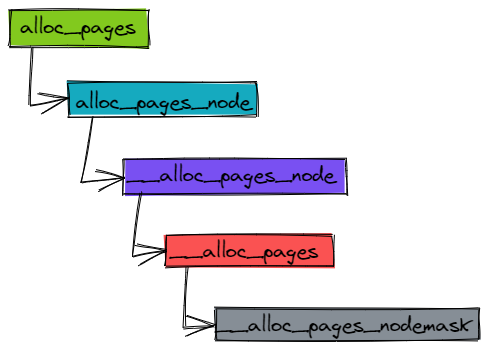
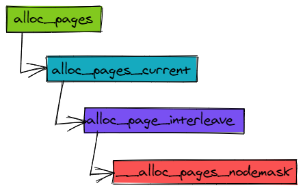
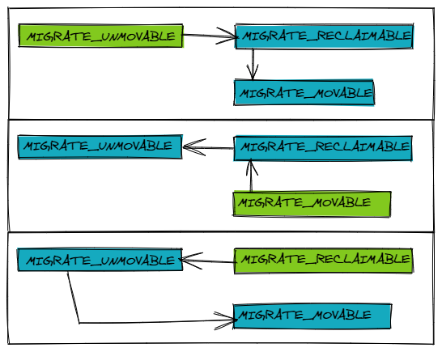

伙伴系统之页面分配
=======

| 日期 | 内核版本 | 架构| 作者 | GitHub| CSDN |
| ------- |:-------:|:-------:|:-------:|:-------:|:-------:|
| 2016-06-14 | [Linux-4.7](http://lxr.free-electrons.com/source/?v=4.7) | X86 & arm | [gatieme](http://blog.csdn.net/gatieme) | [LinuxDeviceDrivers](https://github.com/gatieme/LDD-LinuxDeviceDrivers) | [Linux内存管理](http://blog.csdn.net/gatieme/article/category/6393814) |


# 1 页面分配
-------

## 1.1 页面分配概述
-------

在内核初始化完成之后, 内存管理的责任就由伙伴系统来承担. 伙伴系统基于一种相对简单然而令人吃惊的强大算法.

Linux内核使用二进制伙伴算法来管理和分配物理内存页面, 该算法由Knowlton设计, 后来Knuth又进行了更深刻的描述.

伙伴系统是一个结合了2的方幂个分配器和空闲缓冲区合并计技术的内存分配方案, 其基本思想很简单. 内存被分成含有很多页面的大块, 每一块都是2个页面大小的方幂. 如果找不到想要的块, 一个大块会被分成两部分, 这两部分彼此就成为伙伴. 其中一半被用来分配, 而另一半则空闲. 这些块在以后分配的过程中会继续被二分直至产生一个所需大小的块. 当一个块被最终释放时, 其伙伴将被检测出来, 如果伙伴也空闲则合并两者.

*	内核如何记住哪些内存块是空闲的

*	分配空闲页面的方法

*	影响分配器行为的众多标识位

*	内存碎片的问题和分配器如何处理碎片


## 1.2 内存分配 API
-------


就伙伴系统的接口而言, NUMA 或 UMA 体系结构是没有差别的, 二者的调用语法都是相同的.

所有函数的一个共同点是 : 只能分配 2 的整数幂个页.

因此, 接口中不像C标准库的 malloc 函数或 bootmem 和 memblock 分配器那样指定了所需内存大小作为参数. 相反, 必须指定的是分配阶, 伙伴系统将在内存中分配 $2^order$ 页. 内核中细粒度的分配只能借助于 slab 分配器(或者 slub、slob 分配器), 后者基于伙伴系统


| 内存分配函数 | 功能 | 定义 |
|:----------:|:---:|:----:|
| alloc_pages(mask, order) | 分配$2^order$ 个连续的物理页面, 并返回第一个页面的 struct page 的实例, 表示分配的内存块的起始页 | [NUMA-include/linux/gfp.h, line 466](http://lxr.free-electrons.com/source/include/linux/gfp.h?v=4.7#L466)<br>[UMA-include/linux/gfp.h?v=4.7, line 476](http://lxr.free-electrons.com/source/include/linux/gfp.h?v=4.7#L476) |
| [`__get_free_pages(mask, order)`](http://lxr.free-electrons.com/source/mm/page_alloc.c?v=4.7#L3883)<br>[`__get_free_page(mask)`](http://lxr.free-electrons.com/source/include/linux/gfp.h?v=4.7#L500) | 工作方式与上述函数相同, 但返回分配内存块的虚拟地址, 而不是page实例<br>32 位系统中, 该函数不会使用高端内存, 如果一定要使用高端内存, 最佳的办法是使用 alloc_pages 和 kmap 函数. |
| alloc_page(mask) | 是前者在order = 0情况下的简化形式, 只分配一页 |  [include/linux/gfp.h?v=4.7, line 483](http://lxr.free-electrons.com/source/include/linux/gfp.h?v=4.7#L483) |
| `__get_free_page(gfp_mask)` | 是 `__get_free_pages` 在 `order = 0` 情况下的简化形式, 只分配一页 |  [include/linux/gfp.h?v=5.10, line 483](http://lxr.free-electrons.com/source/include/linux/gfp.h?v=4.7#L483) |
| get_zeroed_page(mask) | 分配一页并返回一个page实例, 页对应的内存填充0(所有其他函数, 分配之后页的内容是未定义的) | [mm/page_alloc.c?v=5.10, line 4996](https://elixir.bootlin.com/linux/v5.10/source/mm/page_alloc.c#L4996)| |
| `__get_dma_pages(gfp_mask, order)` | 用来获得适用于DMA的页. | [`include/linux/gfp.h?v=5.10, line 578`](https://elixir.bootlin.com/linux/v5.10/source/include/linux/gfp.h#578) |


在空闲内存无法满足请求以至于分配失败的情况下, 所有上述函数都返回空指针(比如alloc_pages和alloc_page)或者0(比如 `get_zeroed_page`、 `__get_free_pages` 和 `__get_free_page`).

因此内核在各次分配之后都必须检查返回的结果. 这种惯例与设计得很好的用户层应用程序没什么不同, 但在内核中忽略检查会导致严重得多的故障


内核除了伙伴系统函数之外, 还提供了其他内存管理函数. 它们以伙伴系统为基础, 但并不属于伙伴分配器自身. 这些函数包括vmalloc和vmalloc_32, 使用页表将不连续的内存映射到内核地址空间中, 使之看上去是连续的.

还有一组kmalloc类型的函数, 用于分配小于一整页的内存区. 其实现将在以后分别讨论.

## 1.3 页面分配函数实现上之间的关系
-------

内核源代码将 `__alloc_pages_nodemask` 称之为"伙伴系统的心脏"(`the 'heart' of the zoned buddy allocator`), 因为它处理的是实质性的内存分配.

由于"心脏"的重要性, 我将在后面详细介绍该函数. `__alloc_pages_nodemask` 函数定义在 [include/linux/gfp.h?v=4.7#L428](http://lxr.free-electrons.com/source/include/linux/gfp.h?v=4.7#L428)

通过使用标志、内存域修饰符和各个分配函数, 内核提供了一种非常灵活的内存分配体系.尽管如此, 所有接口函数都可以追溯到一个简单的基本函数(alloc_pages_node)


分配单页的函数[`alloc_page`](https://elixir.bootlin.com/linux/v5.10/source/include/linux/gfp.h#L564)和[`__get_free_page`](https://elixir.bootlin.com/linux/v5.10/source/include/linux/gfp.h#L575) 是借助于 alloc_pages 直接分配一个 order 为 0 的页面.

`__get_free_page` 同样分配一页, 但是返回了内存页的虚拟地址, 他是借助 `__get_free_pages` 直接分配一个 order 为 0 的页面.

[`__get_dma_pages`](http://lxr.free-electrons.com/source/include/linux/gfp.h?v=4.7#L503) 也是借助于 `__get_free_pages` 使用 `GFP_DMA` 标记从 DMA 中分配页面.

```cpp
//  http://lxr.free-electrons.com/source/include/linux/gfp.h?v=4.7#L483
#define alloc_page(gfp_mask) alloc_pages(gfp_mask, 0)

//  http://lxr.free-electrons.com/source/include/linux/gfp.h?v=4.7#L500
#define __get_free_page(gfp_mask) \
    __get_free_pages((gfp_mask), 0)`

//  http://lxr.free-electrons.com/source/include/linux/gfp.h?v=4.7#L503
#define __get_dma_pages(gfp_mask, order) \
    __get_free_pages((gfp_mask) | GFP_DMA, (order))
```

[`get_zeroed_page`](http://lxr.free-electrons.com/source/mm/page_alloc.c?v=4.7#L3900)的实现也没什么困难, 对`__get_free_pages`使用`__GFP_ZERO`标志, 即可分配填充字节0的页. 再返回与页关联的内存区地址即可.


```cpp
//  http://lxr.free-electrons.com/source/mm/page_alloc.c?v=4.7#L3900
unsigned long get_zeroed_page(gfp_t gfp_mask)
{
        return __get_free_pages(gfp_mask | __GFP_ZERO, 0);
}
EXPORT_SYMBOL(get_zeroed_page);
```

可以看到 `__get_free_page`, `__get_dma_pages`, `get_zeroed_page` 都是直接借助了 `__get_free_pages` 函数来实现的, 他们都是直接返回内存块的虚拟地址.


[`__get_free_pages`](http://lxr.free-electrons.com/source/mm/page_alloc.c?v=4.7#L3883)调用 `alloc_pages` 完成内存分配. 然后通过 page_address 获取虚拟地址.

```cpp
//  http://lxr.free-electrons.com/source/mm/page_alloc.c?v=4.7#L3883
unsigned long __get_free_pages(gfp_t gfp_mask, unsigned int order)
{
    struct page *page;

    /*
     * __get_free_pages() returns a 32-bit address, which cannot represent
     * a highmem page
     */
    VM_BUG_ON((gfp_mask & __GFP_HIGHMEM) != 0);

    page = alloc_pages(gfp_mask, order);
    if (!page)
        return 0;
    return (unsigned long) page_address(page);
}
EXPORT_SYMBOL(__get_free_pages);
```

在这种情况下,  使用了一个普通函数而不是宏,  因为 `alloc_pages` 返回的 `page` 实例需要使用辅助

函数 `page_address` 转换为内存地址. 在这里, 只要知道该函数可根据 `page` 实例计算相关页的线性内存地址即可. 对高端内存页这是有问题的


<font color = 0x00ffff>
这样, 就完成了所有分配内存的API函数到公共的基础函数`alloc_pages`的统一
</font>


# 2	alloc_pages 函数分配页
-------


## 2.1 alloc_pages 接口实现
-------


既然所有的内存分配API函数都可以追溯掉 `alloc_page` 函数, 从某种意义上说, 该函数是伙伴系统主要实现的"发射台".


`alloc_pages`函数的定义是依赖于NUMA或者UMA架构的, 定义如下


```cpp
#ifdef CONFIG_NUMA

//  http://lxr.free-electrons.com/source/include/linux/gfp.h?v=4.7#L465
static inline struct page *
alloc_pages(gfp_t gfp_mask, unsigned int order)
{
        return alloc_pages_current(gfp_mask, order);
}

#else

//  http://lxr.free-electrons.com/source/include/linux/gfp.h?v=4.7#L476
#define alloc_pages(gfp_mask, order) \
                alloc_pages_node(numa_node_id(), gfp_mask, order)
#endif
```


## 2.2 UMA
-------





UMA结构下的`alloc_pages`是通过`alloc_pages_node`函数实现的, 下面我们看看`alloc_pages_node`函数的定义, 在[include/linux/gfp.h?v=4.7, line 448](http://lxr.free-electrons.com/source/include/linux/gfp.h?v=4.7#L448)


```cpp
//  http://lxr.free-electrons.com/source/include/linux/gfp.h?v=4.7#L448
/*
 * Allocate pages, preferring the node given as nid. When nid == NUMA_NO_NODE,
 * prefer the current CPU's closest node. Otherwise node must be valid and
 * online.
 */
static inline struct page *alloc_pages_node(int nid, gfp_t gfp_mask,
                        unsigned int order)
{
    if (nid == NUMA_NO_NODE)
        nid = numa_mem_id();

    return __alloc_pages_node(nid, gfp_mask, order);
}
```

它只是执行了一个简单的检查, 如果指定负的结点ID(不存在, 即[NUMA_NO_NODE = -1](http://lxr.free-electrons.com/source/include/linux/numa.h?v=4.7#L13)), 内核自动地使用当前执行CPU对应的结点nid = [numa_mem_id();](http://lxr.free-electrons.com/source/include/linux/topology.h?v=4.7#L137), 然后调用`__alloc_pages_node`函数进行了内存分配


`__alloc_pages_node`函数定义在[include/linux/gfp.h?v=4.7, line 435)](http://lxr.free-electrons.com/source/include/linux/gfp.h?v=4.7#L435), 如下所示

```cpp
// https://elixir.bootlin.com/linux/v5.10/source/include/linux/gfp.h#L519
/*
 * Allocate pages, preferring the node given as nid. The node must be valid and
 * online. For more general interface, see alloc_pages_node().
 */
static inline struct page *
__alloc_pages_node(int nid, gfp_t gfp_mask, unsigned int order)
{
    VM_BUG_ON(nid < 0 || nid >= MAX_NUMNODES);
    VM_WARN_ON((gfp_mask & __GFP_THISNODE) && !node_online(nid));

    return __alloc_pages(gfp_mask, order, nid);
}
```

内核假定传递给改alloc_pages_node函数的结点nid是被激活, 即online的.但是为了安全它还是检查并警告内存结点不存在的情况. 接下来的工作委托给__alloc_pages, 只需传递一组适当的参数, 其中包括节点nid的备用内存域列表zonelist.


现在`__alloc_pages`函数没什么特别的, 它直接将自己的所有信息传递给`__alloc_pages_nodemask`来完成内存的分配

```cpp
// https://elixir.bootlin.com/linux/v5.10/source/include/linux/gfp.h#L509
static inline struct page *
__alloc_pages(gfp_t gfp_mask, unsigned int order, int preferred_nid)
{
    return __alloc_pages_nodemask(gfp_mask, order, preferred_nid, NULL);
}
```


## 2.3 NUMA
-------





## 2.4 `__get_free_pages`
-------

```cpp
#  https://elixir.bootlin.com/linux/v5.10/source/mm/page_alloc.c#L4985
/*
 * Common helper functions. Never use with __GFP_HIGHMEM because the returned
 * address cannot represent highmem pages. Use alloc_pages and then kmap if
 * you need to access high mem.
 */
unsigned long __get_free_pages(gfp_t gfp_mask, unsigned int order)
{
    struct page *page;

    page = alloc_pages(gfp_mask & ~__GFP_HIGHMEM, order);
    if (!page)
        return 0;
    return (unsigned long) page_address(page);
}
EXPORT_SYMBOL(__get_free_pages);
```

## 2.5 `__get_dma_pages`
-------

```cpp
# https://elixir.bootlin.com/linux/v5.10/source/include/linux/gfp.h#578
#define __get_dma_pages(gfp_mask, order) \
        __get_free_pages((gfp_mask) | GFP_DMA, (order))
```

## 2.6 alloc_page 的流程
-------

```cpp
# https://elixir.bootlin.com/linux/v5.10/source/include/linux/gfp.h#L564
#define alloc_page(gfp_mask) alloc_pages(gfp_mask, 0)
```

# 3   伙伴系统的心脏 `__alloc_pages_nodemask`
-------


另外所有体系结构都必须实现的标准函数`clear_page`, 可帮助alloc_pages对页填充字节0, 实现如下表所示

| x86 | arm |
|:----:|:-----:|
| [arch/x86/include/asm/page_32.h?v=4.7, line 24](http://lxr.free-electrons.com/source/arch/x86/include/asm/page_32.h?v=4.7#L24) | [arch/arm/include/asm/page.h?v=4.7#L14](http://lxr.free-electrons.com/source/arch/arm/include/asm/page.h?v=4.7#L142)<br>[arch/arm/include/asm/page-nommu.h](http://lxr.free-electrons.com/source/arch/arm/include/asm/page-nommu.h?v=4.7#L20) |


## 3.1  `__alloc_pages_nodemask` 如何分配内存
-------

如前所述, `__alloc_pages_nodemask` 是伙伴系统的心脏. 我们已经处理了所有的准备工作并描述了所有可能的标志, 现在我们把注意力转向相对复杂的部分 : 函数`__alloc_pages_nodemask`的实现, 这也是内核中比较冗长的部分
之一. 特别是在可用内存太少或逐渐用完时, 函数就会比较复杂. 如果可用内存足够, 则必要的工作会很快完成, 就像下述代码

### 3.1.1   函数源代码注释
-------

`__alloc_pages_nodemask` 函数定义在[include/linux/gfp.h?v=4.7#L428](http://lxr.free-electrons.com/source/include/linux/gfp.h?v=4.7#L428)


```cpp
//  http://lxr.free-electrons.com/source/mm/page_alloc.c?v=4.7#L3779
/*
 * This is the 'heart' of the zoned buddy allocator.
 */
struct page *
__alloc_pages_nodemask(gfp_t gfp_mask, unsigned int order,
            struct zonelist *zonelist, nodemask_t *nodemask)
{
    struct page *page;
    unsigned int cpuset_mems_cookie;
    unsigned int alloc_flags = ALLOC_WMARK_LOW|ALLOC_FAIR;
    gfp_t alloc_mask = gfp_mask; /* The gfp_t that was actually used for allocation */
    struct alloc_context ac = {
        .high_zoneidx = gfp_zone(gfp_mask),
        .zonelist = zonelist,
        .nodemask = nodemask,
        .migratetype = gfpflags_to_migratetype(gfp_mask),
    };

    if (cpusets_enabled()) {
        alloc_mask |= __GFP_HARDWALL;
        alloc_flags |= ALLOC_CPUSET;
        if (!ac.nodemask)
            ac.nodemask = &cpuset_current_mems_allowed;
    }

    gfp_mask &= gfp_allowed_mask;

    lockdep_trace_alloc(gfp_mask);

    might_sleep_if(gfp_mask & __GFP_DIRECT_RECLAIM);

    if (should_fail_alloc_page(gfp_mask, order))
        return NULL;

    /*
     * Check the zones suitable for the gfp_mask contain at least one
     * valid zone. It's possible to have an empty zonelist as a result
     * of __GFP_THISNODE and a memoryless node
     */
    if (unlikely(!zonelist->_zonerefs->zone))
        return NULL;

    if (IS_ENABLED(CONFIG_CMA) && ac.migratetype == MIGRATE_MOVABLE)
        alloc_flags |= ALLOC_CMA;

retry_cpuset:
    cpuset_mems_cookie = read_mems_allowed_begin();

    /* Dirty zone balancing only done in the fast path */
    ac.spread_dirty_pages = (gfp_mask & __GFP_WRITE);

    /*
     * The preferred zone is used for statistics but crucially it is
     * also used as the starting point for the zonelist iterator. It
     * may get reset for allocations that ignore memory policies.
     */
    ac.preferred_zoneref = first_zones_zonelist(ac.zonelist,
                    ac.high_zoneidx, ac.nodemask);
    if (!ac.preferred_zoneref) {
        page = NULL;
        goto no_zone;
    }

    /* First allocation attempt */
    page = get_page_from_freelist(alloc_mask, order, alloc_flags, &ac);
    if (likely(page))
        goto out;

    /*
     * Runtime PM, block IO and its error handling path can deadlock
     * because I/O on the device might not complete.
     */
    alloc_mask = memalloc_noio_flags(gfp_mask);
    ac.spread_dirty_pages = false;

    /*
     * Restore the original nodemask if it was potentially replaced with
     * &cpuset_current_mems_allowed to optimize the fast-path attempt.
     */
    if (cpusets_enabled())
        ac.nodemask = nodemask;
    page = __alloc_pages_slowpath(alloc_mask, order, &ac);

no_zone:
    /*
     * When updating a task's mems_allowed, it is possible to race with
     * parallel threads in such a way that an allocation can fail while
     * the mask is being updated. If a page allocation is about to fail,
     * check if the cpuset changed during allocation and if so, retry.
     */
    if (unlikely(!page && read_mems_allowed_retry(cpuset_mems_cookie))) {
        alloc_mask = gfp_mask;
        goto retry_cpuset;
    }

out:
    if (kmemcheck_enabled && page)
        kmemcheck_pagealloc_alloc(page, order, gfp_mask);

    trace_mm_page_alloc(page, order, alloc_mask, ac.migratetype);

    return page;
}
EXPORT_SYMBOL(__alloc_pages_nodemask);
```

最简单的情形中, 分配空闲内存区只涉及调用一次 `get_page_from_freelist`, 然后返回所需数目的页(由标号got_pg处的代码处理).

第一次内存分配尝试不会特别积极. 如果在某个内存域中无法找到空闲内存, 则意味着内存没剩下多少了, 内核需要增加较多的工作量才能找到更多内存("重型武器"稍后才会出现).


## 3.2  快速路径 get_page_from_freelist 函数
-------

http://blog.csdn.net/yuzhihui_no1/article/details/50776826
http://bbs.chinaunix.net/thread-3769001-1-1.html

`get_page_from_freelist` 是伙伴系统使用的另一个重要的辅助函数. 它从伙伴系统的空闲页面链表中尝试分配物理页面. 它通过标志集和分配阶来判断是否能进行分配. 如果可以, 则发起实际的分配操作. 该函数定义在[mm/page_alloc.c?v=4.7, line 2905](http://lxr.free-electrons.com/source/mm/page_alloc.c?v=4.7#L2905)

### 3.2.1 alloc_context
-------

这个函数的参数很有意思, 之前的时候这个函数的参数只能用复杂来形容


```cpp
static struct page *
get_page_from_freelist(gfp_t gfp_mask, nodemask_t *nodemask, unsigned int order,
        struct zonelist *zonelist, int high_zoneidx, int alloc_flags,
        struct zone *preferred_zone, int migratetype)
```

但是这仍然不够, 随着内核的不段改进, 所支持的特性也越多, 分配内存时需要参照的标识也越来越多, 那难道看着这个函数的参数不断膨胀么, 这个不是内核黑客们所能容忍的, 于是大家想出了一个解决方案, 把那些相关联的参数封装成一个结构

```cpp
static struct page *
get_page_from_freelist(gfp_t gfp_mask, unsigned int order, int alloc_flags, const struct alloc_context *ac)
```


这个封装好的结构就是[`struct alloc_context`](http://lxr.free-electrons.com/source/mm/internal.h?v=4.7#L103), 定义在[mm/internal.h?v=4.7, line 103](http://lxr.free-electrons.com/source/mm/internal.h?v=4.7#L103)

```cpp
/*
 * Structure for holding the mostly immutable allocation parameters passed
 * between functions involved in allocations, including the alloc_pages*
 * family of functions.
 *
 * nodemask, migratetype and high_zoneidx are initialized only once in
 * __alloc_pages_nodemask() and then never change.
 *
 * zonelist, preferred_zone and classzone_idx are set first in
 * __alloc_pages_nodemask() for the fast path, and might be later changed
 * in __alloc_pages_slowpath(). All other functions pass the whole strucure
 * by a const pointer.
 */
struct alloc_context {
        struct zonelist *zonelist;
        nodemask_t *nodemask;
        struct zoneref *preferred_zoneref;
        int migratetype;
        enum zone_type high_zoneidx;
        bool spread_dirty_pages;
};
```

| 字段 | 描述 |
|:-----:|:-----:|
| zonelist | 当perferred_zone上没有合适的页可以分配时, 就要按zonelist中的顺序扫描该zonelist中备用zone列表, 一个个的试用 |
| nodemask | 表示节点的mask, 就是是否能在该节点上分配内存, 这是个bit位数组 |
| preferred_zone | 表示从high_zoneidx后找到的合适的zone, 一般会从该zone分配; 分配失败的话, 就会在zonelist再找一个preferred_zone = 合适的zone |
| migratetype | 迁移类型, 在zone->free_area.free_list[XXX] 作为分配下标使用, 这个是用来反碎片化的, 修改了以前的free_area结构体, 在该结构体中再添加了一个数组, 该数组以迁移类型为下标, 每个数组元素都挂了对应迁移类型的页链表 |
| high_zoneidx | 是表示该分配时, 所能分配的最高zone, 一般从high-->normal-->dma 内存越来越昂贵, 所以一般从high到dma分配依次分配 |
| spread_dirty_pages | |


zonelist是指向备用列表的指针. 在预期内存域没有空闲空间的情况下, 该列表确定了扫描系统其他内存域(和结点)的顺序.

### 3.2.2 get_page_from_freelist
-------

for 循环所作的基本上与直觉一致(从高端向低端扫描), for_next_zone_zonelist_nodemask 遍历备用列表的所有内存域, 用最简单的方式查找一个适当的空闲内存块

*   首先, 如果使能了 CPUSET, 且内存分配附带了 ALLOC_CPUSET 标记, 则只能(从 CPUSET 限定的)该进程允许运行 CPU 的所属内存域去分配内存, 通过 `__cpuset_zone_allowed` 来检查.

*   `zone_watermark_fast` 检测当前 `ZONE` 的水位情况, 检查是否能够满足当前多个页面的分配请求. 如果水位不足, 则会 `zone_reclaim` 尝试去回收内存. 如果没有正常回收, 或者回收的内存不够, 都将跳过从 ZONE 上分配内存, 回收完成后, 通过 `zone_watermark_ok` 再次检查 ZONE 的水位情况以及是否满足连续大内存块的分配需求.

*   如果没有足够的空闲页, 或者没有连续内存块可满足分配请求, 则循环进行到备用列表中的下一个内存域, 继续同样的检查. 直到找到一个合适的页面, 再进行 `try_this_node` 进行内存分配. 请注意即使一切检查都成功了, 最终依然可能会分配失败. 这种情况可能是:

    1.  外碎片化严重, 没有足够的连续内存页

    2.  也可能是无法从 ZONE 内其他迁移类型中借用内存出来.


*   如果内存域适用于当前的分配请求, 那么则通过 `rmqueue` 从伙伴系统中分配内存.

```cpp
// https://elixir.bootlin.com/linux/v5.10/source/mm/page_alloc.c#L3788
/*
 * get_page_from_freelist goes through the zonelist trying to allocate
 * a page.
 */
static struct page *
get_page_from_freelist(gfp_t gfp_mask, unsigned int order, int alloc_flags,
                        const struct alloc_context *ac)
{
    struct zoneref *z;
    struct zone *zone;
    struct pglist_data *last_pgdat_dirty_limit = NULL;
    bool no_fallback;

retry:
    /*
     * Scan zonelist, looking for a zone with enough free.
     * See also __cpuset_node_allowed() comment in kernel/cpuset.c.
     */
    no_fallback = alloc_flags & ALLOC_NOFRAGMENT;
    z = ac->preferred_zoneref;
    for_next_zone_zonelist_nodemask(zone, z, ac->highest_zoneidx,
                    ac->nodemask) {
        struct page *page;
        unsigned long mark;

        if (cpusets_enabled() &&
            (alloc_flags & ALLOC_CPUSET) &&
            !__cpuset_zone_allowed(zone, gfp_mask))
                continue;
        /*
         * When allocating a page cache page for writing, we
         * want to get it from a node that is within its dirty
         * limit, such that no single node holds more than its
         * proportional share of globally allowed dirty pages.
         * The dirty limits take into account the node's
         * lowmem reserves and high watermark so that kswapd
         * should be able to balance it without having to
         * write pages from its LRU list.
         *
         * XXX: For now, allow allocations to potentially
         * exceed the per-node dirty limit in the slowpath
         * (spread_dirty_pages unset) before going into reclaim,
         * which is important when on a NUMA setup the allowed
         * nodes are together not big enough to reach the
         * global limit.  The proper fix for these situations
         * will require awareness of nodes in the
         * dirty-throttling and the flusher threads.
         */
        if (ac->spread_dirty_pages) {
            if (last_pgdat_dirty_limit == zone->zone_pgdat)
                continue;

            if (!node_dirty_ok(zone->zone_pgdat)) {
                last_pgdat_dirty_limit = zone->zone_pgdat;
                continue;
            }
        }

        if (no_fallback && nr_online_nodes > 1 &&
            zone != ac->preferred_zoneref->zone) {
            int local_nid;

            /*
             * If moving to a remote node, retry but allow
             * fragmenting fallbacks. Locality is more important
             * than fragmentation avoidance.
             */
            local_nid = zone_to_nid(ac->preferred_zoneref->zone);
            if (zone_to_nid(zone) != local_nid) {
                alloc_flags &= ~ALLOC_NOFRAGMENT;
                goto retry;
            }
        }

        mark = wmark_pages(zone, alloc_flags & ALLOC_WMARK_MASK);
        if (!zone_watermark_fast(zone, order, mark,
                       ac->highest_zoneidx, alloc_flags,
                       gfp_mask)) {
            int ret;

#ifdef CONFIG_DEFERRED_STRUCT_PAGE_INIT
            /*
             * Watermark failed for this zone, but see if we can
             * grow this zone if it contains deferred pages.
             */
            if (static_branch_unlikely(&deferred_pages)) {
                if (_deferred_grow_zone(zone, order))
                    goto try_this_zone;
            }
#endif
            /* Checked here to keep the fast path fast */
            BUILD_BUG_ON(ALLOC_NO_WATERMARKS < NR_WMARK);
            if (alloc_flags & ALLOC_NO_WATERMARKS)
                goto try_this_zone;

            if (node_reclaim_mode == 0 ||
                !zone_allows_reclaim(ac->preferred_zoneref->zone, zone))
                continue;

            ret = node_reclaim(zone->zone_pgdat, gfp_mask, order);
            switch (ret) {
            case NODE_RECLAIM_NOSCAN:
                /* did not scan */
                continue;
            case NODE_RECLAIM_FULL:
                /* scanned but unreclaimable */
                continue;
            default:
                /* did we reclaim enough */
                if (zone_watermark_ok(zone, order, mark,
                    ac->highest_zoneidx, alloc_flags))
                    goto try_this_zone;

                continue;
            }
        }

try_this_zone:
        page = rmqueue(ac->preferred_zoneref->zone, zone, order,
                gfp_mask, alloc_flags, ac->migratetype);
        if (page) {
            prep_new_page(page, order, gfp_mask, alloc_flags);

            /*
             * If this is a high-order atomic allocation then check
             * if the pageblock should be reserved for the future
             */
            if (unlikely(order && (alloc_flags & ALLOC_HARDER)))
                reserve_highatomic_pageblock(page, zone, order);

            return page;
        } else {
#ifdef CONFIG_DEFERRED_STRUCT_PAGE_INIT
            /* Try again if zone has deferred pages */
            if (static_branch_unlikely(&deferred_pages)) {
                if (_deferred_grow_zone(zone, order))
                    goto try_this_zone;
            }
#endif
        }
    }

    /*
     * It's possible on a UMA machine to get through all zones that are
     * fragmented. If avoiding fragmentation, reset and try again.
     */
    if (no_fallback) {
        alloc_flags &= ~ALLOC_NOFRAGMENT;
        goto retry;
    }

    return NULL;
}
```


## 3.3	水位控制
-------

我们先把注意力转向页面选择是如何工作的.

### 3.3.1	内存水印标志
-------

还记得之前讲过的内存水印么

```cpp
enum zone_watermarks {
        WMARK_MIN,
        WMARK_LOW,
        WMARK_HIGH,
        NR_WMARK
};

#define min_wmark_pages(z) (z->watermark[WMARK_MIN])
#define low_wmark_pages(z) (z->watermark[WMARK_LOW])
#define high_wmark_pages(z) (z->watermark[WMARK_HIGH])
````


内核需要定义一些函数使用的标志, 用于控制到达各个水印指定的临界状态时的行为, 这些标志用宏来定义, 定义在[mm/internal.h?v=4.7, line 453](http://lxr.free-electrons.com/source/mm/internal.h?v=4.7#L453)

```cpp
/* The ALLOC_WMARK bits are used as an index to zone->watermark */
#define ALLOC_WMARK_MIN         WMARK_MIN	/*  1 = 0x01, 使用pages_min水印  */
#define ALLOC_WMARK_LOW         WMARK_LOW	/*  2 = 0x02, 使用pages_low水印  */
#define ALLOC_WMARK_HIGH        WMARK_HIGH   /*  3 = 0x03, 使用pages_high水印  */
#define ALLOC_NO_WATERMARKS     0x04 /* don't check watermarks at all  完全不检查水印 */

/* Mask to get the watermark bits */
#define ALLOC_WMARK_MASK        (ALLOC_NO_WATERMARKS-1)

#define ALLOC_HARDER            0x10 /* try to alloc harder, 试图更努力地分配, 即放宽限制  */
#define ALLOC_HIGH              0x20 /* __GFP_HIGH set, 设置了__GFP_HIGH */
#define ALLOC_CPUSET            0x40 /* check for correct cpuset, 检查内存结点是否对应着指定的CPU集合 */
#define ALLOC_CMA               0x80 /* allow allocations from CMA areas */
#define ALLOC_FAIR              0x100 /* fair zone allocation */
```

前几个标志(`ALLOC_WMARK_MIN`, `ALLOC_WMARK_LOW`, `ALLOC_WMARK_HIGH`, `ALLOC_NO_WATERMARKS`)表示在判断页是否可分配时, 需要考虑哪些水印. 默认情况下(即没有因其他因素带来的压力而需要更多的内存), 只有内存域包含页的数目至少为zone->pages_high时, 才能分配页.这对应于`ALLOC_WMARK_HIGH`标志. 如果要使用较低(zone->pages_low)或最低(zone->pages_min)设置, 则必须相应地设置`ALLOC_WMARK_MIN`或`ALLOC_WMARK_LOW`. 而`ALLOC_NO_WATERMARKS`则通知内核在进行内存分配时不要考虑内存水印.


`ALLOC_HARDER`通知伙伴系统在急需内存时放宽分配规则. 在分配高端内存域的内存时, `ALLOC_HIGH`进一步放宽限制.

`ALLOC_CPUSET`告知内核, 内存只能从当前进程允许运行的CPU相关联的内存结点分配, 当然该选项只对NUMA系统有意义.

`ALLOC_CMA`通知伙伴系统从CMD区域中分配内存

最后, `ALLOC_FAIR`则希望内核公平(均匀)的从内存域zone中进行内存分配


### 3.3.2	`zone_watermark_ok` 判定能否从给定域中分配内存
-------

设置的标志在`zone_watermark_ok`函数中检查, 该函数根据设置的标志判断是否能从给定的内存域分配内存. 该函数定义在[mm/page_alloc.c?v=4.7, line 2820](http://lxr.free-electrons.com/source/mm/page_alloc.c?v=4.7#L2820)

```cpp
//  http://lxr.free-electrons.com/source/mm/page_alloc.c?v=4.7#L2820
bool zone_watermark_ok(struct zone *z, unsigned int order, unsigned long mark,
              int classzone_idx, unsigned int alloc_flags)
{
    return __zone_watermark_ok(z, order, mark, classzone_idx, alloc_flags,
                    zone_page_state(z, NR_FREE_PAGES));
}
```

而 `__zone_watermark_ok` 函数则完成了检查的工作, 该函数定义在[mm/page_alloc.c?v=4.7, line 2752](http://lxr.free-electrons.com/source/mm/page_alloc.c?v=4.7#L2752)

```cpp
// http://lxr.free-electrons.com/source/mm/page_alloc.c?v=4.7#L2752
/*
 * Return true if free base pages are above 'mark'. For high-order checks it
 * will return true of the order-0 watermark is reached and there is at least
 * one free page of a suitable size. Checking now avoids taking the zone lock
 * to check in the allocation paths if no pages are free.
 */
bool __zone_watermark_ok(struct zone *z, unsigned int order, unsigned long mark,
             int classzone_idx, unsigned int alloc_flags,
             long free_pages)
{
    long min = mark;
    int o;
    const bool alloc_harder = (alloc_flags & ALLOC_HARDER);

    /* free_pages may go negative - that's OK
     * free_pages可能变为负值, 没有关系 */
    free_pages -= (1 << order) - 1;

    if (alloc_flags & ALLOC_HIGH)
        min -= min / 2;

    /*
     * If the caller does not have rights to ALLOC_HARDER then subtract
     * the high-atomic reserves. This will over-estimate the size of the
     * atomic reserve but it avoids a search.
     */
    if (likely(!alloc_harder))
        free_pages -= z->nr_reserved_highatomic;
    else
        min -= min / 4;

#ifdef CONFIG_CMA
    /* If allocation can't use CMA areas don't use free CMA pages */
    if (!(alloc_flags & ALLOC_CMA))
        free_pages -= zone_page_state(z, NR_FREE_CMA_PAGES);
#endif

    /*
     * Check watermarks for an order-0 allocation request. If these
     * are not met, then a high-order request also cannot go ahead
     * even if a suitable page happened to be free.
     */
    if (free_pages <= min + z->lowmem_reserve[classzone_idx])
        return false;

    /* If this is an order-0 request then the watermark is fine */
    if (!order)
        return true;

    /* For a high-order request, check at least one suitable page is free
     * 在下一阶, 当前阶的页是不可用的  */
    for (o = order; o < MAX_ORDER; o++) {
        struct free_area *area = &z->free_area[o];
        int mt;

        if (!area->nr_free)
            continue;

        if (alloc_harder)
            return true;

        /* 所需高阶空闲页的数目相对较少 */
        for (mt = 0; mt < MIGRATE_PCPTYPES; mt++) {
            if (!list_empty(&area->free_list[mt]))
                return true;
        }

#ifdef CONFIG_CMA
        if ((alloc_flags & ALLOC_CMA) &&
            !list_empty(&area->free_list[MIGRATE_CMA])) {
            return true;
        }
#endif
    }
    return false;
}
```


我们知道 [`zone_per_state`](http://lxr.free-electrons.com/source/include/linux/vmstat.h?v=4.7#L130)用来访问每个内存域的统计量. 在上述代码中, 得到的是空闲页的数目.

```cpp
free_pages -= zone_page_state(z, NR_FREE_CMA_PAGES);
```

在解释了`ALLOC_HIGH`和`ALLOC_HARDER`标志之后(将最小值标记降低到当前值的一半或四分之一, 使得分配过程努力或更加努力),
```cpp
if (alloc_flags & ALLOC_HIGH)
	min -= min / 2;

if (likely(!alloc_harder))
	free_pages -= z->nr_reserved_highatomic;
else
	min -= min / 4;
```


该函数会检查空闲页的数目`free_pages`是否小于最小值与[`lowmem_reserve`](http://lxr.free-electrons.com/source/include/linux/mmzone.h?v=4.7#L341)中指定的紧急分配值`min`之和.

```cpp
if (free_pages <= min + z->lowmem_reserve[classzone_idx])
	return false;
```

如果不小于, 则代码遍历所有小于当前阶的分配阶, 其中nr_free记载的是当前分配阶的空闲页块数目.

```cpp
/* For a high-order request, check at least one suitable page is free */
for (o = order; o < MAX_ORDER; o++) {
    struct free_area *area = &z->free_area[o];
    int mt;

    if (!area->nr_free)
        continue;

    if (alloc_harder)
        return true;

    for (mt = 0; mt < MIGRATE_PCPTYPES; mt++) {
        if (!list_empty(&area->free_list[mt]))
            return true;
    }

#ifdef CONFIG_CMA
    if ((alloc_flags & ALLOC_CMA) &&
        !list_empty(&area->free_list[MIGRATE_CMA])) {
        return true;
    }
#endif
}
```

如果内核遍历所有的低端内存域之后, 发现内存不足, 则不进行内存分配.


### 3.3.3 zone_watermark_fast
-------


## 3.4 rmqueue
-------

### 3.4.1 rmqueue 的基本流程


```cpp
// https://elixir.bootlin.com/linux/v5.10/source/mm/page_alloc.c#L3421
```

1.  对于分配分配单页的情况(oder == 0), 则使用 [`rmqueue_pcplist`](https://elixir.bootlin.com/linux/v5.10/source/mm/page_alloc.c#L3396) 直接从冷热页缓存 PCP(Per Cpu Pages)中获取.

2.  如果设置了 ALLOC_HARDER, 则说明是一次高优先级的分配, 就[从迁移类型为 MIGRATE_HIGHATOMIC 的内存中进行分配](https://elixir.bootlin.com/linux/v5.10/source/mm/page_alloc.c#3458). MIGRATE_HIGHATOMIC 类型的页用常用于于一些紧急情况下的内存分配.

3.  常规模式下, 一般都是通过 [`__rmqueue`](https://elixir.bootlin.com/linux/v5.10/source/mm/page_alloc.c#L2841) 从伙伴系统中指定迁移类型为 migratetype 的链表中获取.

    3.1 如果超过一半空闲内存位于 CMA 区域时, 则优先使用 [`__rmqueue_cma_fallback`](https://elixir.bootlin.com/linux/v5.10/source/mm/page_alloc.c#L2348) 从 CMA 中分配

    3.2 标准流程就是 [`__rmqueue_smallest`](https://elixir.bootlin.com/linux/v5.10/source/mm/page_alloc.c#L2348) 从 各个 order 的空闲链表中获取, 首先从当前 order 的空闲链表中获取页面, 如果当前 order 页面不足, 则开始向高 order 的链表中切蛋糕.

    3.3 如果切蛋糕也失败了, 说明空闲的页面已经不足以支撑此次分配, 则从 CMA 区域中预留的内存中进行分配.

    3.4 如果前面流程都失败了, 那么说明当前 migratetype 中已经没有足够的连续物理页面, 那么进入 fallback 流程, 尝试从其他 migratetype 中窃取内存.


4.  通过 [`check_new_pages`](https://elixir.bootlin.com/linux/v5.10/source/mm/page_alloc.c#L2253) 检查获取到的内存页是否满足要求. 伙伴系统返回了所获取的的物理页面块第一个页面的 page 结构体, 而 [`check_new_pages`](https://elixir.bootlin.com/linux/v5.10/source/mm/page_alloc.c#L2253) 则需要检查所有的页面.


### 3.4.2   rmqueue_pcplist
-------


[`rmqueue_pcplist`](https://elixir.bootlin.com/linux/v5.10/source/mm/page_alloc.c#L3396) 从 Per CPU Pages 中分配物理页.
真正完成分配的函数是 [`__rmqueue_pcplist`](https://elixir.bootlin.com/linux/v5.10/source/mm/page_alloc.c#L3371)


```cpp
// https://elixir.bootlin.com/linux/v5.10/source/mm/page_alloc.c#L3371
/* Remove page from the per-cpu list, caller must protect the list */
static struct page *__rmqueue_pcplist(struct zone *zone, int migratetype,
            unsigned int alloc_flags,
            struct per_cpu_pages *pcp,
            struct list_head *list)
{
    struct page *page;

    do {
        if (list_empty(list)) {
            pcp->count += rmqueue_bulk(zone, 0,
                    pcp->batch, list,
                    migratetype, alloc_flags);
            if (unlikely(list_empty(list)))
                return NULL;
        }

        page = list_first_entry(list, struct page, lru);
        list_del(&page->lru);
        pcp->count--;
    } while (check_new_pcp(page));

    return page;
}
```

*   如果 PCP list 是空的, 那么会通过 [`rmqueue_bulk`](https://elixir.bootlin.com/linux/v5.10/source/mm/page_alloc.c#L2880) 从 buddy 伙伴系统分配 pcp->batch 个页面出来.

*   否则, PCP 中有页面, 则直接取一个页面出来.

### 3.4.3   ` __rmqueue_smallest`
-------


`__rmqueue` 主体是通过 `__rmqueue_smallest` 来向 buddy 伙伴系统中像切蛋糕一样, 切出一块内存出来的.

```cpp
// https://elixir.bootlin.com/linux/v5.10/source/mm/page_alloc.c#L2303
/*
 * Go through the free lists for the given migratetype and remove
 * the smallest available page from the freelists
 */
static __always_inline
struct page *__rmqueue_smallest(struct zone *zone, unsigned int order,
                        int migratetype)
{
    unsigned int current_order;
    struct free_area *area;
    struct page *page;

    /* Find a page of the appropriate size in the preferred list */
    for (current_order = order; current_order < MAX_ORDER; ++current_order) {
        area = &(zone->free_area[current_order]);
        page = get_page_from_free_area(area, migratetype);
        if (!page)
            continue;
        del_page_from_free_list(page, zone, current_order);
        expand(zone, page, order, current_order, migratetype);
        set_pcppage_migratetype(page, migratetype);
        return page;
    }

    return NULL;
}
```


1.  从期望申请的 order 空闲页面中开始申请目标 migratetype 类型的页面, 如果没有找到, 则继续从更大 order 的空闲页面中申请, 直到 MAX_ORDER 为止;

2.  如果从某个 current_order 的空闲页面中查找到足够的页面后, 将它从空闲链表中移除;

3.  由于申请到的 current_order 可能大于 order, 即申请到比期望的 2^order 页面要大的页面, 那么这时候我们需要通过 expand 对页面进行切割, 只取走我们需要的那部分页面, 而剩下的页面需要归还给伙伴系统.

4.  fallback 流程下, 申请的页面可能时从其他 migratetype 的空闲页面中窃取的, 那么这时候窃取的页面 migratetype 与跟我们期望的是不符的, 需要设置页面的 migratetype.

# 4 `__rmqueue_fallback` 页面窃取
-------

## 4.1 关于页面窃取
-------

> The `__rmqueue_fallback()` function is called when there's no free page of requested migratetype, and we need to steal from a different one.


如果前面的流程都分配失败了, 那么说明当前 ZONG 区域指定 migratetype 中没有足够的空闲页来完成本次分配了. 那么内核将通过 [`__rmqueue_fallback`](https://elixir.bootlin.com/linux/v5.10/source/mm/page_alloc.c#L2759) 尝试从当前 ZONE 的其他 migratetype 的空闲链表中挪用内存.


在使用伙伴系统申请内存页面时, 如果所请求的 migratetype 的空闲页面列表中没有足够的内存, 伙伴系统尝试从其他不同的页面中窃取内存.

这会造成减少永久碎片化, 因此伙伴系统使用了各种各样启发式的方法, 尽可能的使这一事件不要那么频繁地触发,  最主要的思路是尝试从拥有最多免费页面的页面块中窃取, 并可能一次窃取尽量多的页面. 但是精确地搜索这样的页面块, 并且一次窃取整个页面块, 是昂贵的.

因此内核采用的方式是按照从 MAX_ORDER 到请求页面大小 order 递减的顺序, 来查找空闲页面. 它假设拥有最高次序空闲页面的块可能也拥有总数最多的空闲页面.

## 4.1 窃取的顺序
-------


对于某个指定的 migratetype, 内核 fallback 去其他 migratetype 的空闲内存中窃取内存时, 有什么优先级顺序么?

肯定有的, 内核定义了一个 fallbacks 数组, 用来指定每个迁移类型 fallback 时备选 migratetype 的顺序.

比如 fallbacks[MIGRATE_UNMOVABLE] 行值为 : { MIGRATE_RECLAIMABLE, MIGRATE_MOVABLE,   migratetype }
就意味着, 当分配 UNMOVABLE 的内存页失败的时候, 先去 RECLAIMABLE 类型的页面中分配, 再去 MOVABLE 类型的页面中分配. migratetypeS 标记了 fallback 的终止, 如果前两个类型都没有找到可分配的内存, 那么 fallback 就失败了.

CMA 和 ISOLATE 不会进行 fallback 操作, 因此其 fallback 数组只有一项 { migratetype }.

```cpp
/*
 * This array describes the order lists are fallen back to when
 * the free lists for the desirable migrate type are depleted
 */
static int fallbacks[MIGRATE_TYPES][3] = {
    [MIGRATE_UNMOVABLE]   = { MIGRATE_RECLAIMABLE, MIGRATE_MOVABLE,   MIGRATE_TYPES },
    [MIGRATE_MOVABLE]     = { MIGRATE_RECLAIMABLE, MIGRATE_UNMOVABLE, MIGRATE_TYPES },
    [MIGRATE_RECLAIMABLE] = { MIGRATE_UNMOVABLE,   MIGRATE_MOVABLE,   MIGRATE_TYPES },
#ifdef CONFIG_CMA
    [MIGRATE_CMA]         = { MIGRATE_TYPES }, /* Never used */
#endif
#ifdef CONFIG_MEMORY_ISOLATION
    [MIGRATE_ISOLATE]     = { MIGRATE_TYPES }, /* Never used */
#endif
};
```

| 迁移类别 | 窃取顺序 |
|:-------:|:-------:|
| 不可移动(MIGRATE_UNMOVABLE) | MIGRATE_RECLAIMABLE > MIGRATE_MOVABLE   |
| 可移动(MIGRATE_MOVABLE)     | MIGRATE_RECLAIMABLE > MIGRATE_UNMOVABLE |
| 可回收(MIGRATE_RECLAIMABLE) | MIGRATE_UNMOVABLE > MIGRATE_MOVABLE     |




## 4.2 窃取的基本流程
-------


我们继续回到 [`__rmqueue_fallback`](https://elixir.bootlin.com/linux/v5.10/source/mm/page_alloc.c#L2759), 看着流程有点复杂, 前后两次循环, 一次从 (MAX_ORDER, order] 方向遍历, 此外还有 find_smallest 流程从 [order, MAX_ORDER) 遍历, 咋一看两个流程并没有过于明显的区别, 最后是 do_steal 真正完成页面的窃取.


这里 fallback 的遍历流程审视下对 fallback 数组的处理

```cpp
static inline struct page *
__rmqueue_fallback(struct zone *zone, unsigned int order, int start_migratetype)
{
    // ......
    for (current_order = MAX_ORDER-1;
                current_order >= order && current_order <= MAX_ORDER-1;
                --current_order) {

        // fallback_mt = find_suitable_fallback(area, current_order,

        for (i = 0;; i++) {
            fallback_mt = fallbacks[migratetype][i];
            if (fallback_mt == MIGRATE_TYPES)
                break;
        }
    }
    // ......
```

fallback 流程中是依次对每个 order 的空闲页面, 按照备选 fallback 的顺序查找满足要求的 fallback_mt 进行窃取. 因此 fallback 是在同一级 order 下存在优先级顺序, 不同的 order 下的迁移类型没有明确的顺序. 这个次序和 order 的遍历顺序有关系. 是看:

*   每次去查找一个满足要求的最大的页面进行窃取;

    1.  这样可以缓解下次内存分配的压力, 减少 fallback 的流程, 从而减低永久内存碎片的可能性;

    2.  但是频繁的对大 order 进行切割, 也会让当前处理的两个 migratetype 的页面都非常的零碎, 反而加剧了内存碎片.

*   每次去查找一个满足要求的最小的页面进行窃取;

但是内核总是倾向于优先去窃取尽可能大的页面. 因为内核假定 :

*   最大 order 的空闲页面, 同时也是空闲页面最富余.

*   内核中大多数页面的分配, 都是一些小 order 的, 一次窃取足够大的页面出来, 类似于一个缓冲池, 可以减少 fallback 的触发.


但是倾向于窃取大的还是小的空闲页面, 这两种方式的处理是非常微妙的, 伙伴系统窃取的流程也经过了多次的定向优化.


1.  最早版本 v4.11 的实现中, 倾向于查找满足要求的最大的页面进行窃取, `__rmqueue_fallback()` 直接将窃取的页面进行了切割并返回.

2.  紧接着 4.12 的版本中, fallback 只是进行了页面的窃取, 并返回成功与否, 发现成功后, `__rmqueue()` 将走 retry 流程再重新通过 `__rmqueue_smallest` 流程分配内存页. [commit 3bc48f96cf11 ("mm, page_alloc: split smallest stolen page in fallback")](https://git.kernel.org/pub/scm/linux/kernel/git/torvalds/linux.git/commit/?id=3bc48f96cf11ce8699e419d5e47ae0d456403274)

3.  4.13 之后的版本中, fallback 流程中增加了 find_smallest 的优化, 不再总是倾向于选择最大的页面, 在适当的时机也会选择最小的满足要求的页面进行窃取. [7a8f58f39188 ("mm, page_alloc: fallback to smallest page when not stealing whole pageblock")](https://git.kernel.org/pub/scm/linux/kernel/git/torvalds/linux.git/commit/?id=7a8f58f3918869dda0d71b2e9245baedbbe7bc5e), 4.13-rc1 合入.


### 4.2.1 简易流程(4.12 之前的内核版本)
-------


```cpp
// https://elixir.bootlin.com/linux/v4.11/source/mm/page_alloc.c#L2144
/* Remove an element from the buddy allocator from the fallback list */
static inline struct page *
__rmqueue_fallback(struct zone *zone, unsigned int order, int start_migratetype)
{
    struct free_area *area;
    unsigned int current_order;
    struct page *page;
    int fallback_mt;
    bool can_steal;

    /* Find the largest possible block of pages in the other list */
    for (current_order = MAX_ORDER-1;
                current_order >= order && current_order <= MAX_ORDER-1;
                --current_order) {
        area = &(zone->free_area[current_order]);
        fallback_mt = find_suitable_fallback(area, current_order,
                start_migratetype, false, &can_steal);
        if (fallback_mt == -1)
            continue;

        page = list_first_entry(&area->free_list[fallback_mt],
                        struct page, lru);
        if (can_steal &&
            get_pageblock_migratetype(page) != MIGRATE_HIGHATOMIC)
            steal_suitable_fallback(zone, page, start_migratetype);

        /* Remove the page from the freelists */
        area->nr_free--;
        list_del(&page->lru);
        rmv_page_order(page);

        expand(zone, page, order, current_order, area,
                    start_migratetype);
        /*
         * The pcppage_migratetype may differ from pageblock's
         * migratetype depending on the decisions in
         * find_suitable_fallback(). This is OK as long as it does not
         * differ for MIGRATE_CMA pageblocks. Those can be used as
         * fallback only via special __rmqueue_cma_fallback() function
         */
        set_pcppage_migratetype(page, start_migratetype);

        trace_mm_page_alloc_extfrag(page, order, current_order,
            start_migratetype, fallback_mt);

        return page;
    }

    return NULL;
}
```

这个版本的 [`__rmqueue_fallback`](https://elixir.bootlin.com/linux/v4.11/source/mm/page_alloc.c#L2144), 直接完成了窃取和分配的工作.


1.  从高阶向低阶 find_suitable_fallback() 查找满足要求的迁移类型 fallback_mt.

2.  如果是可以窃取的(can_steal) 的, 且迁移类型不为 MIGRATE_HIGHATOMIC, 则进行窃取 steal_suitable_fallback().

3.  接着从得到的页面中开始分配内存, 这个过程中可能会使用 expand 对内存块切片.

这里注意几个点 :

1.  并不是所有的 fallback 都会进行 steal_suitable_fallback(), 这会将整个内存块移动到当前希望分配的 start_migratetype 的空闲列表.

2.  expand 的过程将切片的内存都放到了 start_migratetype 的空闲列表.

这样的直接影响是 :

*   没有通过 steal_suitable_fallback() 完成窃取的页面, 只是被加入到了 start_migratetype 的空闲列表中, 可以进行分配, 但是回收的时候, 还是会回收到 fallback_mt 的空闲列表中.

总结来说 :
当前 v4.11 版本的 [`__rmqueue_fallback()`](https://elixir.bootlin.com/linux/v4.11/source/mm/page_alloc.c#L2144) 每次查找到最大的满足的页面块, 通过 [`expand()`](https://elixir.bootlin.com/linux/v4.11/source/mm/page_alloc.c#L1632) 切割恰好满足要求的页面返回, 剩余的页面归还到 start_migratetype 的空闲链表. 通常情况下, 窃取的页面迁移类型并未做修改, 在 free 依旧会归还到其原本所属的迁移类型 fallback_mt. 这种可以减少对内存块的永久切片, 减少永久碎片化的可能性. 只有在查找到的页面够大且允许窃取(can_steal)的时候才会通过 [`steal_suitable_fallback()`](https://elixir.bootlin.com/linux/v4.11/source/mm/page_alloc.c#L1965) 进行窃取.


### 4.2.2 优化流程(4.13 之前的内核版本)
-------

但是 4.13-rc1 合入的 [commit 3bc48f96cf11 ("mm, page_alloc: split smallest stolen page in fallback")](https://git.kernel.org/pub/scm/linux/kernel/git/torvalds/linux.git/commit/?id=3bc48f96cf11ce8699e419d5e47ae0d456403274), 该补丁重构了 `__rmqueue_fallback` 的流程, **只窃取, 不分配, 真正的分配流程通过 `__rmqueue` 中 retry 分配**.

1.  `__rmqueue_fallback` 只 find_suitable_fallback() 查找到合适的 fallback migratetype, 并通过 steal_suitable_fallback() 窃取页面, 但是并不进行实质的分配, 因此删除了其中 expand 等流程.

2.  `__rmqueue_fallback` 的返回值不再是窃取的页面, 而是返回窃取成功与否.

3.  `__rmqueue` 发现 `__rmqueue_fallback` 返回成功后, 通过 retry 流程, 再次通过 `__rmqueue_smallest` 分配页面.


我们先来看 v4.12 时 [`__rmqueue_fallback`](https://elixir.bootlin.com/linux/v4.12/source/mm/page_alloc.c#L2599) 的实现

```cpp
/*
 * Try finding a free buddy page on the fallback list and put it on the free
 * list of requested migratetype, possibly along with other pages from the same
 * block, depending on fragmentation avoidance heuristics. Returns true if
 * fallback was found so that __rmqueue_smallest() can grab it.
 */
static inline bool
__rmqueue_fallback(struct zone *zone, unsigned int order, int start_migratetype)
{
    struct free_area *area;
    unsigned int current_order;
    struct page *page;
    int fallback_mt;
    bool can_steal;

    /* Find the largest possible block of pages in the other list */
    for (current_order = MAX_ORDER-1;
                current_order >= order && current_order <= MAX_ORDER-1;
                --current_order) {
        area = &(zone->free_area[current_order]);
        fallback_mt = find_suitable_fallback(area, current_order,
                start_migratetype, false, &can_steal);
        if (fallback_mt == -1)
            continue;

        page = list_first_entry(&area->free_list[fallback_mt],
                        struct page, lru);

        steal_suitable_fallback(zone, page, start_migratetype,
                                can_steal);

        trace_mm_page_alloc_extfrag(page, order, current_order,
            start_migratetype, fallback_mt);

        return true;
    }

    return false;
}
```


这个版本的 `__rmqueue_fallback` 逻辑还是比较简洁的, 整体思路就是尝试从 MAX_ORDER - 1 开始到所需分配的 order 方向进行遍历, 查找到可以窃取的最大 order 的页面.

1.  依次从高向低遍历每个 order 的空闲页面.

2.  通过 find_suitable_fallback 查找到合适窃取的 migratetype fallback_mt.

3.  不再判断是否 can_steal, 直接通过 steal_suitable_fallback 尝试从查找到的 fallback_mt 迁移类型中窃取页面出来.


之前的版本中, 很有可能, 除了最高顺序的页面, 我们还从同一块中窃取低顺序的页面. 但我们还是分走了最高订单页面. 这是一种浪费, 会导致碎片化, 而不是避免碎片化. 因此, 这个版本的 `__rmqueue_fallback()` 更改为仅仅窃取页面并将它们放到请求的 migratetype 的自由列表中, 并且只报告它是否成功. 然后重新通过 `__rmqueue_smallest()` 选择(和最终分裂)最小的页面. 这一切都发生在区域锁定, 这样在过程中就没人能从我们这里偷了. 这应该可以减少由于回退造成的碎片. 在最坏的情况下, 我们只是窃取了一个最高顺序的页面, 并通过在列表之间移动它, 然后删除它而浪费了一些周期, 但后退并不是真正的热门路径, 所以这不应该是一个问题. 作为附带的好处, 该补丁通过重用__rmqueue_least()删除了一些重复的代码.


### 4.2.3 4.13 之后的版本
---------


4.13 版本之前的 `__rmqueue_fallback` 整体思路就是查找到一个满足窃取要求的最大 order 的页面, 即 find_biggest(这个流程名字是我自己瞎起的哈).

但是 4.13-rc1 合入的 [commit 7a8f58f39188 ("mm, page_alloc: fallback to smallest page when not stealing whole pageblock")](https://git.kernel.org/pub/scm/linux/kernel/git/torvalds/linux.git/commit/?id=7a8f58f3918869dda0d71b2e9245baedbbe7bc5e) 引入了一个 find_smallest 流程.

#### 4.2.3.1 find_biggest
-------

首先还是 v4.12 时 [`__rmqueue_fallback`](https://elixir.bootlin.com/linux/v4.13/source/mm/page_alloc.c#L2220) 的流程, 从 MAX_ORDER - 1 -=> order 的方向, 查找到一个满足要求的最大的页面块进行窃取.


```cpp
static inline bool
__rmqueue_fallback(struct zone *zone, int order, int start_migratetype)
{
    // ......
    for (current_order = MAX_ORDER - 1; current_order >= order;
                --current_order) {
        // ......

        /*
         * We cannot steal all free pages from the pageblock and the
         * requested migratetype is movable. In that case it's better to
         * steal and split the smallest available page instead of the
         * largest available page, because even if the next movable
         * allocation falls back into a different pageblock than this
         * one, it won't cause permanent fragmentation.
         */
        if (!can_steal && start_migratetype == MIGRATE_MOVABLE
                    && current_order > order)
            goto find_smallest;

        goto do_steal;
    }

    return false;

find_smallest:
    // ......

do_steal:
    // ......
```

#### 4.2.3.2 find_smallest
-------


4.13-rc1 合入的 [commit 7a8f58f39188 ("mm, page_alloc: fallback to smallest page when not stealing whole pageblock")](https://git.kernel.org/pub/scm/linux/kernel/git/torvalds/linux.git/commit/?id=7a8f58f3918869dda0d71b2e9245baedbbe7bc5e) 引入了个 find_smallest 流程.


```cpp
/*
 * Try finding a free buddy page on the fallback list and put it on the free
 * list of requested migratetype, possibly along with other pages from the same
 * block, depending on fragmentation avoidance heuristics. Returns true if
 * fallback was found so that __rmqueue_smallest() can grab it.
 *
 * The use of signed ints for order and current_order is a deliberate
 * deviation from the rest of this file, to make the for loop
 * condition simpler.
 */
static __always_inline bool
__rmqueue_fallback(struct zone *zone, int order, int start_migratetype,
                        unsigned int alloc_flags)
{

    // ......

    for (current_order = MAX_ORDER - 1; current_order >= min_order;
                --current_order) {
        // ......
        fallback_mt = find_suitable_fallback(area, current_order,
                start_migratetype, false, &can_steal);
        // ......
        /*
         * We cannot steal all free pages from the pageblock and the
         * requested migratetype is movable. In that case it's better to
         * steal and split the smallest available page instead of the
         * largest available page, because even if the next movable
         * allocation falls back into a different pageblock than this
         * one, it won't cause permanent fragmentation.
         */
        if (!can_steal && start_migratetype == MIGRATE_MOVABLE
                    && current_order > order)
            goto find_smallest;

        goto do_steal;
    }

find_smallest:
    for (current_order = order; current_order < MAX_ORDER;
                            current_order++) {
        area = &(zone->free_area[current_order]);
        fallback_mt = find_suitable_fallback(area, current_order,
                start_migratetype, false, &can_steal);
        if (fallback_mt != -1)
            break;
    }

    // ......
}
```


find_smallest 流程和前面的流程正好是反向的, 它从当前 order 开始, 向 MAX_ORDER 方向, 通过 find_suitable_fallback() 重新查找一个满足要求的 fallback_mt. 这样将查找到一个满足要求的最小的页面块进行窃取.

如果我们不能窃取整个页面块(!can_steal), 且待分配的页面是 MIGRATE_MOVABLE 类型的, 则尝试走 find_smallest 去找一个能满足要求的最小的页面来窃取.

find_smallast 的条件有几个 :

| 条件 | 描述 | 详情 |
|:---:|:----:|:---:|
| !can_steal | 查找到的 fallback_mt 的页面是不能 steal 的 | find_suitable_fallback 中 only_stealable 为 false, 因此找到的 fallback_mt(migratetype) 只要有足够的页面即可, 并不一定是 can_steal_fallback() 的. 一般来说 !can_steal 的页面都是 MIGRATE_MOVABLE 的小页面. |
| start_migratetype == MIGRATE_MOVABLE | 注意只有分配 MIGRATE_MOVABLE 类型的页面 fallback 的时候才会走 find_smallest 流程 | 因为 MIGRATE_MOVEABLE 的页面可以进行迁移, 可以有效地进行页面规整, 因为即使下一次 MIGRATE_MOVABLE 的分配流程继续从这里不同的页块中 fallback, 它也不会造成永久的碎片. |

也就是说, 如果我们在分配 MIGRATE_MOVABLE 的页面因为页面不足而需要 fallback 时, 如果查询到的满足要求的其他 migratetype
 的页面 order 很小, 则干脆直接用 fnd_smallest 寻找满足要求的最小的页面.

#### 4.2.3.3 do_steal
-------


最后是 `do_steal` 流程

```cpp
static __always_inline bool
__rmqueue_fallback(struct zone *zone, int order, int start_migratetype,
                        unsigned int alloc_flags)
{
    // ......

do_steal:
    page = get_page_from_free_area(area, fallback_mt);

    steal_suitable_fallback(zone, page, alloc_flags, start_migratetype,
                                can_steal);

    trace_mm_page_alloc_extfrag(page, order, current_order,
        start_migratetype, fallback_mt);

    return true;

}
```

## 4.3 查询适合被窃取的 migratetype
-------


### 4.3.1 find_suitable_fallback 查找适合被窃取的 migratetype
-------

`find_suitable_fallback` 从当前当前待申请的 migratetype 的 fallback 列表中查找适合被窃取的迁移类型.

| 参数 | 描述 |
|:----:|:---:|
| struct free_area *area | 待窃取的空闲页面列表 |
| unsigned int order | 当前尝试窃取的 order, order 不小于待申请的页面大小 |
| int migratetype | 期望申请的页面的迁移类型. 正是因为对 migratetype 类型的页面申请失败, 才进行的 fallback |
| bool only_stealable | 该参数是 [commit 2149cdaef6c0 ("mm/compaction: enhance compaction finish condition")](https://git.kernel.org/pub/scm/linux/kernel/git/torvalds/linux.git/commit/?id=2149cdaef6c0eb59a9edf3b152027392cd66b41f) 新引入的. 如果设置为 true, 则只有在当前 fallback_mt 是 can_steal 的才可以进行窃取, 否则只要当前 fallback_mt 有足够页面即可窃取. |
| bool *can_steal | 是否可以真正进行窃取, 函数参数用做返回值, 由于 only_stealable 被设置为 false 的情况下, 返回的 fallback_mt 并不一定是 can_steal 的, 因为将 can_steal 与否当前返回值返回. |
| 返回值 | 返回查找到的合适窃取的 fallback 迁移类型 fallback_mt. 如果 !only_stealable 或者 can_steal 都将查询到的合适窃取的 fallbacl_mt<br>如果 only_stealable 被设置为 false, 则只要当前迁移类型 fallback_mt 有足够的页面即可返回<br>否则, 则只有在当前 fallback_mt 是 can_steal 的时候, 才被返回. |


[`find_suitable_fallback`](https://elixir.bootlin.com/linux/v5.10/source/mm/page_alloc.c#L2599) 遍历当前
migratetype 的 fallbacks 数组, 为此次 fallback 查找合适 migratetype 的备选空闲链表.

```cpp
// https://elixir.bootlin.com/linux/v5.10/source/mm/page_alloc.c#L2599
/*
 * Check whether there is a suitable fallback freepage with requested order.
 * If only_stealable is true, this function returns fallback_mt only if
 * we can steal other freepages all together. This would help to reduce
 * fragmentation due to mixed migratetype pages in one pageblock.
 */
int find_suitable_fallback(struct free_area *area, unsigned int order,
            int migratetype, bool only_stealable, bool *can_steal)
{
    int i;
    int fallback_mt;

    if (area->nr_free == 0)
        return -1;

    *can_steal = false;
    for (i = 0;; i++) {
        fallback_mt = fallbacks[migratetype][i];
        if (fallback_mt == MIGRATE_TYPES)
            break;

        if (free_area_empty(area, fallback_mt))
            continue;

        if (can_steal_fallback(order, migratetype))
            *can_steal = true;

        if (!only_stealable)
            return fallback_mt;

        if (*can_steal)
            return fallback_mt;
    }

    return -1;
}
```

find_suitable_fallback 用于找到合适的迁移类型 :

1.  根据当前的迁移类型[获取到一个备份的迁移类型](https://elixir.bootlin.com/linux/v5.10/source/mm/page_alloc.c#L2610), 如果[迁移类型 migratetype](https://elixir.bootlin.com/linux/v5.10/source/mm/page_alloc.c#L2611), 说明已经没有合适的备选 migratetype 可选, 则 break;

2.  如果当前的[迁移类型的 freelist 的链表为空](https://elixir.bootlin.com/linux/v5.10/source/mm/page_alloc.c#L2614), 说明备份的迁移类型没有可用的页, 则去下一优先级获取页;

3.  接着使用 [can_steal_fallback](https://elixir.bootlin.com/linux/v5.10/source/mm/page_alloc.c#L2617) 来判断此迁移类型是否可以作为盗用迁移类型, 如果是返回 true 即可.


| 时间  | 作者 | 特性 | 描述 | 是否合入主线 | 链接 |
|:----:|:----:|:---:|:----:|:---------:|:----:|
| 2015/02/12 | Joonsoo Kim <iamjoonsoo.kim@lge.com> | [mm/compaction: enhance compaction finish condition](https://lore.kernel.org/patchwork/patch/542063) | 同样的, 之前 NULL 指针和错误指针的输出也很混乱, 进行了归一化. | v1 ☑ 4.1-rc1 | [PatchWork](https://lore.kernel.org/patchwork/cover/542063)<br>*-*-*-*-*-*-*-* <br>[关键 commit 2149cdaef6c0](https://git.kernel.org/pub/scm/linux/kernel/git/torvalds/linux.git/commit/?id=2149cdaef6c0eb59a9edf3b152027392cd66b41f) |


### 4.3.2 can_steal_fallback
-------

其中需要特别关注的函数是 [`can_steal_fallback()`](https://elixir.bootlin.com/linux/v5.10/source/mm/page_alloc.c#L2452)


```cpp
// https://elixir.bootlin.com/linux/v5.10/source/mm/page_alloc.c#L2452
static bool can_steal_fallback(unsigned int order, int start_mt)
```

| 参数 | 描述 |
|:----:|:---:|
| unsigned int order | 待窃取的空闲页面列表 |
| int start_mt | 期望申请的页面的迁移类型. 正是因为对 migratetype 类型的页面申请失败, 才进行的 fallback |
| 返回值 boot | 返回能够窃取此 order 的页面块 |

该函数用来检查在对 start_mt 的页面进行分配而不得不进行 fallback 的时候, 能否窃取 order 大小的页面块.


```cpp
// https://elixir.bootlin.com/linux/v5.10/source/mm/page_alloc.c#L2452
static bool can_steal_fallback(unsigned int order, int start_mt)
{
    /*
     * Leaving this order check is intended, although there is
     * relaxed order check in next check. The reason is that
     * we can actually steal whole pageblock if this condition met,
     * but, below check doesn't guarantee it and that is just heuristic
     * so could be changed anytime.
     */
    // 如果想要窃取的是整个pageblock, 则可以 steal 整个 pageblock
    if (order >= pageblock_order)
        return true;

    /*
     * 满足如下条件之一的页面是允许被 Steal 的
     * - 待窃取的页面 order 不小于 1/2 pageblock 大小的块
     * - 类型是可回收或者不可移动类型
     * - 按页的移动性分组的功能被关闭
     */
    if (order >= pageblock_order / 2 ||
        start_mt == MIGRATE_RECLAIMABLE ||
        start_mt == MIGRATE_UNMOVABLE ||
        page_group_by_mobility_disabled)
        return true;

    return false;
}
```

| 条件 | 描述 | 详情 | 引入 commit | 引入版本 |
|:---:|:----:|:---:|:----------:|:-------:|
| order >= pageblock_order / 2 | 待窃取的页面块 order 不小于 pageblock_order 的一半 | 窃取足够大的页面是合理的, 这样可以减少永久碎片化的发生. 如果每次只是找一些小的页面块进行窃取, 将导致两个迁移类型的空闲页面都被切割成零零碎碎的小 order 页面 |[commit b2a0ac8875a0 ("Split the free lists for movable and unmovable allocations")](https://git.kernel.org/pub/scm/linux/kernel/git/torvalds/linux.git/commit/?id=b2a0ac8875a0a3b9f0739b60526f8c5977d2200f) | 2.6.24-rc1 |
| start_migratetype == MIGRATE_RECLAIMABLE | 申请可回收的页面出现 fallback 时, 倾向于进行窃取 | MIGRATE_RECLAIMABLE 页面的分配本质上是非常频繁的, 就像 updatedb 启动时一样. 这很可能发生在 MAX_ORDER 页块没有释放的情况下. 这意味着 updatedb 可以将 MIGRATE_RECLAIMABLE 页面分散到整个地址空间中. 因此有必要使得 MIGRATE_RECLAIMABLE 窃取页面块方面更激进. |[commit 46dafbca2bba ("Be more agressive about stealing when MIGRATE_RECLAIMABLE allocations fallback")](https://git.kernel.org/pub/scm/linux/kernel/git/torvalds/linux.git/commit/?id=46dafbca2bba811665b01d8cedf911204820623c) | 2.6.24-rc1 |
| page_group_by_mobility_disabled | 内核已经关闭按页的移动性分组的功能, 可以任意窃取 | 如果当前内核已经关闭按页的移动性分组的功能, 说明当前内核中内存的空闲页面是比较紧缺的, 这时候页面不再按照 migratetype 分组, 此时可以任意窃取 | [commit dd5d241ea955 ("page-allocator: always change pageblock ownership when anti-fragmentation is disabled")](https://git.kernel.org/pub/scm/linux/kernel/git/torvalds/linux.git/commit/?id=dd5d241ea955006122d76af88af87de73fec25b4) | 2.6.31-rc9 |
| !is_migrate_cma(migratetype) | NA | MIGRATE_CMA 迁移类型有两个主要特征:<br>(i)只能从 MIGRATE_CMA 页块中分配可移动页<br>(ii)页面分配器永远不会改变 MIGRATE_CMA 页面块的迁移类型. <br>这(在某种程度上)保证了 MIGRATE_CMA 页面中的该页面块总是可以迁移到其他地方(除非系统中没有剩余内存). 它被设计用于分配大的块(例如. 10MiB)的物理连续内存. 一旦驱动程序请求连续内存, MIGRATE_CMA页块中的页可能会被迁移, 以创建一个连续块. 为了最小化迁移数量, MIGRATE_CMA 迁移类型是页面分配器在请求时返回到其他迁移类型时尝试的最后一种类型. 因此这个条件的加入, 将保证 MIGRATE_CMA 类型的页面在窃取时, 迁移类型不会被修改. | [commit 47118af076f6 ("mm: mmzone: MIGRATE_CMA migration type added")](https://git.kernel.org/pub/scm/linux/kernel/git/torvalds/linux.git/commit/?id=47118af076f64844b4f423bc2f545b2da9dab50d) | 3.5-rc1 |
| start_type == MIGRATE_UNMOVABLE | 申请不可移动的页面出现 fallback 时, 倾向于进行窃取 | MIGRATE_UNMOVABLE 分配没有以 MIGRATE_RECLAIMABLE 同样的方式进行积极的窃取, 尽管将这种分配分散到多个回退页面块上可能比可回收分配更糟糕. 为了最小化碎片, 我们应该最小化这种回退的数量, 从而从每个回退页块中尽可能多地窃取内容. 请注意, 在理论上, 这可能会给可移动页块带来更大的压力, 并导致可移动分配从不可移动页块中窃取回来. 但是, 可移动的分配不像偷窃那样激进, 也不会造成永久的碎片, 因此权衡是合理的. | [commit 9c0415eb8cbf ("mm: more aggressive page stealing for UNMOVABLE allocations")](https://git.kernel.org/pub/scm/linux/kernel/git/torvalds/linux.git/commit/?id=9c0415eb8cbf0c8fd043b6c0f0354308ab099df5) | 4.0-rc1 |
| 删除 !is_migrate_cma(migratetype) | NA | 修改了分配 MIGRATE_MOVABLE 页面时对 MIGRATE_CMA 的 fallback 行为, 之前的版本中 MIGRATE_CMA 是作为 MIGRATE_MOVABLE 首选备用迁移类型而存在的, 在 fallback 流程进行窃取的时候, 只是同一个 order 下优选 MIGRATE_CMA 类型的页面, 但是这个补丁合入后, MIGRATE_CMA 类型的空闲页面总是首先使用, 而不是同其他 migratetype 一样作为可移动类型的分配的 fallback<br>MIGRATE_CMA 只能用于 MIGRATE_MOVABLE, 所以最好尽可能先使用MIGRATE_CMA freepage. 否则, 我们将不必要地占用其他 migratetype 的宝贵空闲空间, 从而增加碎片的机会. <br>带有MIGRATE_CMA的Freepage只能用于MIGRATE_MOVABLE, 它们不应该扩展到其他 migratetype 好友列表, 以保护它们免受不可移动/可回收的分配.  rmqueue_fallback() 每次查找可能的最大的 freepage 块会把的高阶 freepage不断切割和破坏, 即使存在合适的顺序CMA freepage | [commit dc67647b78b9 ("mm/cma: change fallback behaviour for CMA freepage")](https://git.kernel.org/pub/scm/linux/kernel/git/torvalds/linux.git/commit/?id=dc67647b78b92d9497f01fab95ac6764ed886b40) | 4.1-rc1 |
| order >= pageblock_order | 待窃取的页面块 order 不小于 pageblock_order, 可以整个窃取. | 虽然在紧接着下一个检查中有宽松的检查(不小于 pageblock_order 的一半也可以直接窃取), 但是打算单独做这个检查, 因为如果满足这个条件, 我们实际上可以窃取整个页面块, 而下面的检查并不能保证它, 此外下面的检查只是启发式和经验式的, 随时可以被修改. | [commit 4eb7dce62007 ("mm/page_alloc: factor out fallback freepage checking")](https://git.kernel.org/pub/scm/linux/kernel/git/torvalds/linux.git/commit/?id=4eb7dce62007113f1a2778213980fd6d8034ef5e) | 4.1-rc1 |

## 4.5 页面窃取
-------

## 4.5.1 steal_suitable_fallback 从窃取其他 migratetype 的页面
-------


[`steal_suitable_fallback()`](https://elixir.bootlin.com/linux/v5.10/source/mm/page_alloc.c#L2516)

steal_suitable_fallback() 执行真正的 steal 动作.

*   如果 order 足够大, 就 steal 整个 page block.

*   否则, 先把 page block 内的空闲页框移动到要申请的迁移类型, 然后检查已经申请的页框中是否是兼容的迁移类型. 如果有超过一半 page block size 是空闲的页或者已分配的兼容的迁移类型, 就可以修改 page block 的迁移类型到新的申请的类型.

页面的迁移类型修改之后, 这样已分配的兼容的迁移类型在以后被 free 释放时就会被放置到正确的 free list 中了.

```cpp
static void steal_suitable_fallback(struct zone *zone, struct page *page,
        unsigned int alloc_flags, int start_type, bool whole_block)
```


```cpp
// https://elixir.bootlin.com/linux/v5.10/source/mm/page_alloc.c#L2516
/*
 * This function implements actual steal behaviour. If order is large enough,
 * we can steal whole pageblock. If not, we first move freepages in this
 * pageblock to our migratetype and determine how many already-allocated pages
 * are there in the pageblock with a compatible migratetype. If at least half
 * of pages are free or compatible, we can change migratetype of the pageblock
 * itself, so pages freed in the future will be put on the correct free list.
 */
static void steal_suitable_fallback(struct zone *zone, struct page *page,
        unsigned int alloc_flags, int start_type, bool whole_block)
{
    unsigned int current_order = buddy_order(page);
    int free_pages, movable_pages, alike_pages;
    int old_block_type;

    old_block_type = get_pageblock_migratetype(page);

    /*
     * This can happen due to races and we want to prevent broken
     * highatomic accounting.
     */
    if (is_migrate_highatomic(old_block_type))
        goto single_page;

    /* Take ownership for orders >= pageblock_order */
    /* 对于整个 pageblock, 直接进行窃取 :
     * 如果待窃取的页面块 order 不小于 pageblock_order 时, 接更改 pageblock 的迁移类型
     * 然后跳转到 signle_page 流程, 把 plageblock 首页框挂到 area->free_list[start_type] 下面
     */
    if (current_order >= pageblock_order) {
        change_pageblock_range(page, current_order, start_type);
        goto single_page;
    }

    /*
     * Boost watermarks to increase reclaim pressure to reduce the
     * likelihood of future fallbacks. Wake kswapd now as the node
     * may be balanced overall and kswapd will not wake naturally.
     */
    boost_watermark(zone);
    if (alloc_flags & ALLOC_KSWAPD)
        set_bit(ZONE_BOOSTED_WATERMARK, &zone->flags);

    /* We are not allowed to try stealing from the whole block */
    /* 如果不允许窃取整个页面块(whole_block 为 FALSE). 则
     * 不能修改 pageblock迁移属性, 直接跳转到 signle_page 流程
     */
    if (!whole_block)
        goto single_page;

    free_pages = move_freepages_block(zone, page, start_type,
                        &movable_pages);
    /*
     * Determine how many pages are compatible with our allocation.
     * For movable allocation, it's the number of movable pages which
     * we just obtained. For other types it's a bit more tricky.
     */
    if (start_type == MIGRATE_MOVABLE) {
        alike_pages = movable_pages;
    } else {
        /*
         * If we are falling back a RECLAIMABLE or UNMOVABLE allocation
         * to MOVABLE pageblock, consider all non-movable pages as
         * compatible. If it's UNMOVABLE falling back to RECLAIMABLE or
         * vice versa, be conservative since we can't distinguish the
         * exact migratetype of non-movable pages.
         */
        if (old_block_type == MIGRATE_MOVABLE)
            alike_pages = pageblock_nr_pages
                        - (free_pages + movable_pages);
        else
            alike_pages = 0;
    }

    /* moving whole block can fail due to zone boundary conditions */
    if (!free_pages)
        goto single_page;

    /*
     * If a sufficient number of pages in the block are either free or of
     * comparable migratability as our allocation, claim the whole block.
     */
    if (free_pages + alike_pages >= (1 << (pageblock_order-1)) ||
            page_group_by_mobility_disabled)
        set_pageblock_migratetype(page, start_type);

    return;

single_page:
    move_to_free_list(page, zone, current_order, start_type);
}
```

https://blog.csdn.net/lwhuq/article/details/76030240