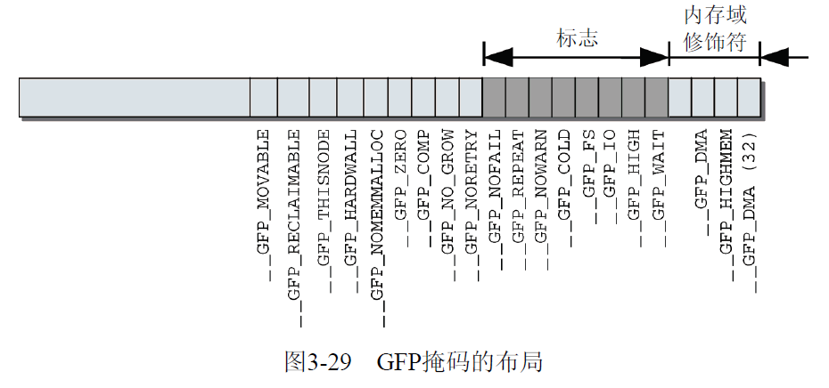

free_page释放内存空间--Linux内存管理(十八)
=======

| 日期 | 内核版本 | 架构| 作者 | GitHub| CSDN |
| ------- |:-------:|:-------:|:-------:|:-------:|:-------:|
| 2016-06-14 | [Linux-4.7](http://lxr.free-electrons.com/source/?v=4.7) | X86 & arm | [gatieme](http://blog.csdn.net/gatieme) | [LinuxDeviceDrivers](https://github.com/gatieme/LDD-LinuxDeviceDrivers) | [Linux内存管理](http://blog.csdn.net/gatieme/article/category/6225543) |


#1	前景回顾
-------


#1.1	内核映射区
-------


尽管`vmalloc`函数族可用于从高端内存域向内核映射页帧(这些在内核空间中通常是无法直接看到的), 但这并不是这些函数的实际用途.

重要的是强调以下事实 : 内核提供了其他函数用于将`ZONE_HIGHMEM`页帧显式映射到内核空间, 这些函数与vmalloc机制无关. 因此, 这就造成了混乱.


而在高端内存的页不能永久地映射到内核地址空间. 因此, 通过alloc_pages()函数以\__GFP_HIGHMEM标志获得的内存页就不可能有逻辑地址.

在x86_32体系结构总, 高于896MB的所有物理内存的范围大都是高端内存, 它并不会永久地或自动映射到内核地址空间, 尽管X86处理器能够寻址物理RAM的范围达到4GB(启用PAE可以寻址64GB), 一旦这些页被分配, 就必须映射到内核的逻辑地址空间上. 在x86_32上, 高端地址的页被映射到内核地址空间(即虚拟地址空间的3GB~4GB)

内核地址空间的最后128 MiB用于何种用途呢?

该部分有3个用途。

1.	虚拟内存中连续、但物理内存中不连续的内存区，可以在vmalloc区域分配. 该机制通常用于用户过程, 内核自身会试图尽力避免非连续的物理地址。内核通常会成功，因为大部分大的内存块都在启动时分配给内核，那时内存的碎片尚不严重。但在已经运行了很长时间的系统上, 在内核需要物理内存时, 就可能出现可用空间不连续的情况. 此类情况, 主要出现在动态加载模块时.

2.	持久映射用于将高端内存域中的非持久页映射到内核中

3.	固定映射是与物理地址空间中的固定页关联的虚拟地址空间项，但具体关联的页帧可以自由选择. 它与通过固定公式与物理内存关联的直接映射页相反，虚拟固定映射地址与物理内存位置之间的关联可以自行定义，关联建立后内核总是会注意到的.


在这里有两个预处理器符号很重要 \__VMALLOC_RESERVE设置了`vmalloc`区域的长度, 而`MAXMEM`则表示内核可以直接寻址的物理内存的最大可能数量.


内核中, 将内存划分为各个区域是通过图3-15所示的各个常数控制的。根据内核和系统配置, 这些常数可能有不同的值。直接映射的边界由high_memory指定。


1.	直接映射区
	线性空间中从3G开始最大896M的区间, 为直接内存映射区，该区域的线性地址和物理地址存在线性转换关系：线性地址=3G+物理地址。

2.	动态内存映射区
	该区域由内核函数`vmalloc`来分配, 特点是 : 线性空间连续, 但是对应的物理空间不一定连续. `vmalloc`分配的线性地址所对应的物理页可能处于低端内存, 也可能处于高端内存.

3.	永久内存映射区
	该区域可访问高端内存. 访问方法是使用`alloc_page(_GFP_HIGHMEM)`分配高端内存页或者使用`kmap`函数将分配到的高端内存映射到该区域.

4.	固定映射区
	该区域和4G的顶端只有4k的隔离带，其每个地址项都服务于特定的用途，如ACPI_BASE等。

>说明
>
>注意用户空间当然可以使用高端内存，而且是正常的使用，内核在分配那些不经常使用的内存时，都用高端内存空间(如果有)，所谓不经常使用是相对来说的，比如内核的一些数据结构就属于经常使用的，而用户的一些数据就属于不经常使用的。用户在启动一个应用程序时，是需要内存的，而每个应用程序都有3G的线性地址，给这些地址映射页表时就可以直接使用高端内存。
>
>而且还要纠正一点的是：那128M线性地址不仅仅是用在这些地方的，如果你要加载一个设备，而这个设备需要映射其内存到内核中，它也需要使用这段线性地址空间来完成，否则内核就不能访问设备上的内存空间了.
>
>总之，内核的高端线性地址是为了访问内核固定映射以外的内存资源。进程在使用内存时，触发缺页异常，具体将哪些物理页映射给用户进程是内核考虑的事情. 在用户空间中没有高端内存这个概念.


#2	kmallc & kfree分配释放连续的物理内存
-------

**kmalloc和kzalloc**


kmalloc函数与用户空间的malloc一族函数非常类似, 只不过它多了一个flags参数, kmalloc函数是一个简单的接口, 用它可以获取以字节为单位的一块内核内存.

如果你需要整个页, 那么前面讨论的页分配接口是更好的选择. 但是, 对大多数内核分配来说, kmalloc接口用的更多, 同时内核也提供了kzalloc该接口在kmalloc的基础上会将分配的内存清0. 他们定义在[tools/virtio/linux/kernel.h?v=4.7, line 46](http://lxr.free-electrons.com/source/tools/virtio/linux/kernel.h?v=4.7#L46)


这两个函数返回一个指向内存块的指针, 其内存块至少要有size大小. 所分配的内存区在物理上是连续的. 在出错时, 它返回NULL. 除非没有足够的内存可用, 否则内核总能分配成功. 在对kmalloc调用之后, 你必须检查返回的是不是NULL, 如果是, 要适当处理错误.

**kfree释放内存**

kmalloc的另一端就是kfree, 用于释放分配的内存, kfree声明与


|  kmalloc定义 | kzalloc定义   | kfree定义 |
|:--------------:|:--------------:|-----------:|
| [tools/virtio/linux/kernel.h?v=4.7, line 46](http://lxr.free-electrons.com/source/tools/virtio/linux/kernel.h?v=4.7#L46) | [tools/virtio/linux/kernel.h?v=4.7, line 52](http://lxr.free-electrons.com/source/tools/virtio/linux/kernel.h?v=4.7#L52) | [tools/virtio/linux/kernel.h?v=4.7, line 60](http://lxr.free-electrons.com/source/tools/virtio/linux/kernel.h?v=4.7#L60) |
| [include/linux/slab.h, line 466](http://lxr.free-electrons.com/source/include/linux/slab.h?v=4.7#L466) | [include/linux/slab.h?v=4.7, line 620](http://lxr.free-electrons.com/source/include/linux/slab.h?v=4.7#L620) | [mm/slob.c?v=4.7, line 484](http://lxr.free-electrons.com/source/mm/slob.c?v=4.7#L484)<br>[mm/slub.c?v=4.7, line 3645](http://lxr.free-electrons.com/source/mm/slub.c?v=4.7#L3645)<br>[mm/slab.c?v=4.7, line 3853](http://lxr.free-electrons.com/source/mm/slab.c?v=4.7#L3853) |


#3	分配掩码(gfp_mask标志)
-------


##3.1	分配掩码
-------

前述所有函数中强制使用的mask参数，到底是什么语义?

我们知道Linux将内存划分为内存域. 内核提供了所谓的内存域修饰符(zone modifier)(在掩码的最低4个比特位定义), 来指定从哪个内存域分配所需的页.


内核使用宏的方式定义了这些掩码, 一个掩码的定义被划分为3个部分进行定义, 我们会逐步展开来讲解, 参见[include/linux/gfp.h?v=4.7, line 12~374](http://lxr.free-electrons.com/source/include/linux/gfp.h?v=4.7#L12), 共计26个掩码信息, 因此后面__GFP_BITS_SHIFT =  26.


##3.2	掩码分类
-------


Linux中这些掩码标志`gfp_mask`分为3种类型 :


| 类型 | 描述 |
|:-----:|:-----:|
| 区描述都符 | 内核把物理内存分为多个区, 每个区用于不同的目的, 区描述符指明到底从这些区中的哪一区进行分配 |
| 行为修饰符 | 表示内核应该如何分配所需的内存. 在某些特定情况下, 只能使用某些特定的方法分配内存 |
| 类型标志 | 组合了行为修饰符和区描述符, 将这些可能用到的组合归纳为不同类型 |


##3.3	内核中掩码的定义
-------


###3.3.1	**内核中的定义方式**
-------


```cpp
//  http://lxr.free-electrons.com/source/include/linux/gfp.h?v=4.7

/*  line 12 ~ line 44  第一部分
 *  定义可掩码所在位的信息, 每个掩码对应一位为1
 *  定义形式为  #define	___GFP_XXX		0x01u
 */
/* Plain integer GFP bitmasks. Do not use this directly. */
#define ___GFP_DMA              0x01u
#define ___GFP_HIGHMEM          0x02u
#define ___GFP_DMA32            0x04u
#define ___GFP_MOVABLE          0x08u
/*  ......  */

/*  line 46 ~ line 192  第二部分
 *  定义掩码和MASK信息, 第二部分的某些宏可能是第一部分一个或者几个的组合
 *  定义形式为  #define	__GFP_XXX		 ((__force gfp_t)___GFP_XXX)
 */
#define __GFP_DMA       ((__force gfp_t)___GFP_DMA)
#define __GFP_HIGHMEM   ((__force gfp_t)___GFP_HIGHMEM)
#define __GFP_DMA32     ((__force gfp_t)___GFP_DMA32)
#define __GFP_MOVABLE   ((__force gfp_t)___GFP_MOVABLE)  /* ZONE_MOVABLE allowed */
#define GFP_ZONEMASK    (__GFP_DMA|__GFP_HIGHMEM|__GFP_DMA32|__GFP_MOVABLE)

/*  line 194 ~ line 260  第三部分
 *  定义掩码
 *  定义形式为  #define	GFP_XXX		 __GFP_XXX
 */
#define GFP_DMA         __GFP_DMA
#define GFP_DMA32       __GFP_DMA32
```


其中GFP缩写的意思为获取空闲页(get free page), __GFP_MOVABLE不表示物理内存域, 但通知内核应在特殊的虚拟内存域ZONE_MOVABLE进行相应的分配.


###3.3.2	定义掩码位
-------


我们首先来看**第一部分**, 内核源代码中定义在[include/linux/gfp.h?v=4.7, line 18 ~ line 44](http://lxr.free-electrons.com/source/include/linux/gfp.h?v=4.7#L17), 共计26个掩码信息.


```cpp
/* Plain integer GFP bitmasks. Do not use this directly. */
//  区域修饰符
#define ___GFP_DMA              0x01u
#define ___GFP_HIGHMEM          0x02u
#define ___GFP_DMA32            0x04u

//  行为修饰符
#define ___GFP_MOVABLE          0x08u	    /* 页是可移动的 */
#define ___GFP_RECLAIMABLE      0x10u	    /* 页是可回收的 */
#define ___GFP_HIGH             0x20u		/* 应该访问紧急分配池？ */
#define ___GFP_IO               0x40u		/* 可以启动物理IO？ */
#define ___GFP_FS               0x80u		/* 可以调用底层文件系统？ */
#define ___GFP_COLD             0x100u	   /* 需要非缓存的冷页 */
#define ___GFP_NOWARN           0x200u	   /* 禁止分配失败警告 */
#define ___GFP_REPEAT           0x400u	   /* 重试分配，可能失败 */
#define ___GFP_NOFAIL           0x800u	   /* 一直重试，不会失败 */
#define ___GFP_NORETRY          0x1000u	  /* 不重试，可能失败 */
#define ___GFP_MEMALLOC         0x2000u  	/* 使用紧急分配链表 */
#define ___GFP_COMP             0x4000u	  /* 增加复合页元数据 */
#define ___GFP_ZERO             0x8000u	  /* 成功则返回填充字节0的页 */
//  类型修饰符
#define ___GFP_NOMEMALLOC       0x10000u	 /* 不使用紧急分配链表 */
#define ___GFP_HARDWALL         0x20000u	 /* 只允许在进程允许运行的CPU所关联的结点分配内存 */
#define ___GFP_THISNODE         0x40000u	 /* 没有备用结点，没有策略 */
#define ___GFP_ATOMIC           0x80000u 	/* 用于原子分配，在任何情况下都不能中断  */
#define ___GFP_ACCOUNT          0x100000u
#define ___GFP_NOTRACK          0x200000u
#define ___GFP_DIRECT_RECLAIM   0x400000u
#define ___GFP_OTHER_NODE       0x800000u
#define ___GFP_WRITE            0x1000000u
#define ___GFP_KSWAPD_RECLAIM   0x2000000u
```

###3.3.3	定义掩码
-------

然后**第二部分**, 相对而言每一个宏又被重新定义如下, 参见[include/linux/gfp.h?v=4.7, line 46 ~ line 192](http://lxr.free-electrons.com/source/include/linux/gfp.h?v=4.7#L46)

```cpp
/*
* Physical address zone modifiers (see linux/mmzone.h - low four bits)
*
* Do not put any conditional on these. If necessary modify the definitions
* without the underscores and use them consistently. The definitions here may
* be used in bit comparisons.
* 定义区描述符
*/
#define __GFP_DMA       ((__force gfp_t)___GFP_DMA)
#define __GFP_HIGHMEM   ((__force gfp_t)___GFP_HIGHMEM)
#define __GFP_DMA32     ((__force gfp_t)___GFP_DMA32)
#define __GFP_MOVABLE   ((__force gfp_t)___GFP_MOVABLE)  /* ZONE_MOVABLE allowed */
#define GFP_ZONEMASK    (__GFP_DMA|__GFP_HIGHMEM|__GFP_DMA32|__GFP_MOVABLE)

/*
* Page mobility and placement hints
*
* These flags provide hints about how mobile the page is. Pages with similar
* mobility are placed within the same pageblocks to minimise problems due
* to external fragmentation.
*
* __GFP_MOVABLE (also a zone modifier) indicates that the page can be
*   moved by page migration during memory compaction or can be reclaimed.
*
* __GFP_RECLAIMABLE is used for slab allocations that specify
*   SLAB_RECLAIM_ACCOUNT and whose pages can be freed via shrinkers.
*
* __GFP_WRITE indicates the caller intends to dirty the page. Where possible,
*   these pages will be spread between local zones to avoid all the dirty
*   pages being in one zone (fair zone allocation policy).
*
* __GFP_HARDWALL enforces the cpuset memory allocation policy.
*
* __GFP_THISNODE forces the allocation to be satisified from the requested
*   node with no fallbacks or placement policy enforcements.
*
* __GFP_ACCOUNT causes the allocation to be accounted to kmemcg (only relevant
*   to kmem allocations).
*/
#define __GFP_RECLAIMABLE ((__force gfp_t)___GFP_RECLAIMABLE)
#define __GFP_WRITE     ((__force gfp_t)___GFP_WRITE)
#define __GFP_HARDWALL   ((__force gfp_t)___GFP_HARDWALL)
#define __GFP_THISNODE  ((__force gfp_t)___GFP_THISNODE)
#define __GFP_ACCOUNT   ((__force gfp_t)___GFP_ACCOUNT)

/*
* Watermark modifiers -- controls access to emergency reserves
*
* __GFP_HIGH indicates that the caller is high-priority and that granting
*   the request is necessary before the system can make forward progress.
*   For example, creating an IO context to clean pages.
*
* __GFP_ATOMIC indicates that the caller cannot reclaim or sleep and is
*   high priority. Users are typically interrupt handlers. This may be
*   used in conjunction with __GFP_HIGH
 *
 * __GFP_MEMALLOC allows access to all memory. This should only be used when
 *   the caller guarantees the allocation will allow more memory to be freed
 *   very shortly e.g. process exiting or swapping. Users either should
 *   be the MM or co-ordinating closely with the VM (e.g. swap over NFS).
 *
 * __GFP_NOMEMALLOC is used to explicitly forbid access to emergency reserves.
 *   This takes precedence over the __GFP_MEMALLOC flag if both are set.
 */
#define __GFP_ATOMIC    ((__force gfp_t)___GFP_ATOMIC)
#define __GFP_HIGH      ((__force gfp_t)___GFP_HIGH)
#define __GFP_MEMALLOC  ((__force gfp_t)___GFP_MEMALLOC)
#define __GFP_NOMEMALLOC ((__force gfp_t)___GFP_NOMEMALLOC)

/*
 * Reclaim modifiers
 *
 * __GFP_IO can start physical IO.
 *
 * __GFP_FS can call down to the low-level FS. Clearing the flag avoids the
 *   allocator recursing into the filesystem which might already be holding
 *   locks.
 *
 * __GFP_DIRECT_RECLAIM indicates that the caller may enter direct reclaim.
 *   This flag can be cleared to avoid unnecessary delays when a fallback
 *   option is available.
 *
 * __GFP_KSWAPD_RECLAIM indicates that the caller wants to wake kswapd when
 *   the low watermark is reached and have it reclaim pages until the high
 *   watermark is reached. A caller may wish to clear this flag when fallback
 *   options are available and the reclaim is likely to disrupt the system. The
 *   canonical example is THP allocation where a fallback is cheap but
 *   reclaim/compaction may cause indirect stalls.
 *
 * __GFP_RECLAIM is shorthand to allow/forbid both direct and kswapd reclaim.
 *
 * __GFP_REPEAT: Try hard to allocate the memory, but the allocation attempt
 *   _might_ fail.  This depends upon the particular VM implementation.
 *
 * __GFP_NOFAIL: The VM implementation _must_ retry infinitely: the caller
 *   cannot handle allocation failures. New users should be evaluated carefully
 *   (and the flag should be used only when there is no reasonable failure
 *   policy) but it is definitely preferable to use the flag rather than
 *   opencode endless loop around allocator.
 *
 * __GFP_NORETRY: The VM implementation must not retry indefinitely and will
 *   return NULL when direct reclaim and memory compaction have failed to allow
 *   the allocation to succeed.  The OOM killer is not called with the current
 *   implementation.
 */
#define __GFP_IO        ((__force gfp_t)___GFP_IO)
#define __GFP_FS        ((__force gfp_t)___GFP_FS)
#define __GFP_DIRECT_RECLAIM    ((__force gfp_t)___GFP_DIRECT_RECLAIM) /* Caller can reclaim */
#define __GFP_KSWAPD_RECLAIM    ((__force gfp_t)___GFP_KSWAPD_RECLAIM) /* kswapd can wake */
#define __GFP_RECLAIM ((__force gfp_t)(___GFP_DIRECT_RECLAIM|___GFP_KSWAPD_RECLAIM))
#define __GFP_REPEAT    ((__force gfp_t)___GFP_REPEAT)
#define __GFP_NOFAIL    ((__force gfp_t)___GFP_NOFAIL)
#define __GFP_NORETRY   ((__force gfp_t)___GFP_NORETRY)

/*
 * Action modifiers
 *
 * __GFP_COLD indicates that the caller does not expect to be used in the near
 *   future. Where possible, a cache-cold page will be returned.
 *
 * __GFP_NOWARN suppresses allocation failure reports.
 *
 * __GFP_COMP address compound page metadata.
 *
 * __GFP_ZERO returns a zeroed page on success.
 *
 * __GFP_NOTRACK avoids tracking with kmemcheck.
 *
 * __GFP_NOTRACK_FALSE_POSITIVE is an alias of __GFP_NOTRACK. It's a means of
 *   distinguishing in the source between false positives and allocations that
 *   cannot be supported (e.g. page tables).
 *
 * __GFP_OTHER_NODE is for allocations that are on a remote node but that
 *   should not be accounted for as a remote allocation in vmstat. A
 *   typical user would be khugepaged collapsing a huge page on a remote
 *   node.
 */
#define __GFP_COLD      ((__force gfp_t)___GFP_COLD)
#define __GFP_NOWARN    ((__force gfp_t)___GFP_NOWARN)
#define __GFP_COMP      ((__force gfp_t)___GFP_COMP)
#define __GFP_ZERO      ((__force gfp_t)___GFP_ZERO)
#define __GFP_NOTRACK   ((__force gfp_t)___GFP_NOTRACK)
#define __GFP_NOTRACK_FALSE_POSITIVE (__GFP_NOTRACK)
#define __GFP_OTHER_NODE ((__force gfp_t)___GFP_OTHER_NODE)

/* Room for N __GFP_FOO bits */
#define __GFP_BITS_SHIFT 26
#define __GFP_BITS_MASK ((__force gfp_t)((1 << __GFP_BITS_SHIFT) - 1))
```


给出的常数，其中一些很少使用，因此我不会讨论。其中最重要的一些常数语义如下所示


其中在开始的位置定义了对应的**区修饰符**, 定义在[include/linux/gfp.h?v=4.7, line 46 ~ line 57](http://lxr.free-electrons.com/source/include/linux/gfp.h?v=4.7#L46)


| 区修饰符标志 | 描述 |
|:--------------:|:-----:|
| \__GFP_DMA | 从ZONE_DMA中分配内存 |
| \__GFP_HIGHMEM | 从ZONE_HIGHMEM活ZONE_NORMAL中分配内存 |
| \__GFP_DMA32 | 从ZONE_DMA32中分配内存 |
| \__GFP_MOVABLE | 从__GFP_MOVABLE中分配内存 |

其次还定义了我们程序和函数中所需要的掩码MASK的信息, 由于其中__GFP_DMA, __GFP_DMA32, __GFP_HIGHMEM, __GFP_MOVABLE是在内存中分别有对应的内存域信息, 因此我们定义了内存域的掩码GFP_ZONEMASK, 参见[include/linux/gfp.h?v=4.7, line 57](http://lxr.free-electrons.com/source/include/linux/gfp.h?v=4.7#L57)

```cpp
#define GFP_ZONEMASK    (__GFP_DMA|__GFP_HIGHMEM|__GFP_DMA32|__GFP_MOVABLE)
```


接着内核定义了**行为修饰符**

/*	\__GFP_WAIT表示分配内存的请求可以中断。也就是说，调度器在该请求期间可随意选择另一个过程执行，或者该请求可以被另一个更重要的事件中断. 分配器还可以在返回内存之前, 在队列上等待一个事件(相关进程会进入睡眠状态).

>虽然名字相似，但__GFP_HIGH与__GFP_HIGHMEM毫无关系，请不要弄混这两者\

| 行为修饰符 | 描述 |
|:---:|:----:|
| \__GFP_RECLAIMABLE<br>\__GFP_MOVABLE | 是页迁移机制所需的标志. 顾名思义，它们分别将分配的内存标记为可回收的或可移动的。这影响从空闲列表的哪个子表获取内存 |
| \__GFP_WRITE | |
| \__GFP_HARDWALL | 只在NUMA系统上有意义. 它限制只在分配到当前进程的各个CPU所关联的结点分配内存。如果进程允许在所有CPU上运行（默认情况），该标志是无意义的。只有进程可以运行的CPU受限时，该标志才有效果 |
| \__GFP_THISNODE | 也只在NUMA系统上有意义。如果设置该比特位，则内存分配失败的情况下不允许使用其他结点作为备用，需要保证在当前结点或者明确指定的结点上成功分配内存 |
| \__GFP_ACCOUNT | |
|--------|--------|
| \__GFP_ATOMIC | |
| \__GFP_HIGH | 如果请求非常重要, 则设置\__GFP_HIGH，即内核急切地需要内存时。在分配内存失败可能给内核带来严重后果时(比如威胁到系统稳定性或系统崩溃), 总是会使用该标志 |
| \__GFP_MEMALLOC | |
| \__GFP_NOMEMALLOC | |
|--------|--------|
| \__GFP_IO |说明在查找空闲内存期间内核可以进行I/O操作. 实际上, 这意味着如果内核在内存分配期间换出页, 那么仅当设置该标志时, 才能将选择的页写入硬盘 |
| \__GFP_FS |允许内核执行VFS操作. 在与VFS层有联系的内核子系统中必须禁用, 因为这可能引起循环递归调用. |
| \__GFP_DIRECT_RECLAIM | |
| \__GFP_KSWAPD_RECLAIM | |
| \__GFP_RECLAIM | |
| \__GFP_REPEAT | 在分配失败后自动重试，但在尝试若干次之后会停止 |
| \__GFP_NOFAIL | 在分配失败后一直重试，直至成功 |
| \__GFP_NORETRY |  在分配失败后不重试，因此可能分配失败 |
|--------|--------|
| \__GFP_COLD | 如果需要分配不在CPU高速缓存中的“冷”页时，则设置\__GFP_COLD |
| \__GFP_NOWARN | 在分配失败时禁止内核故障警告。在极少数场合该标志有用 |
| \__GFP_COMP | 添加混合页元素, 在hugetlb的代码内部使用 |
| \__GFP_ZERO | 在分配成功时，将返回填充字节0的页 |
| \__GFP_NOTRACK | |
| \__GFP_NOTRACK_FALSE_POSITIVE<BR>\__GFP_NOTRACK | |
| \__GFP_OTHER_NODE | |


那自然还有__GFP_BITS_SHIFT来表示我们所有的掩码位, 由于我们共计26个掩码位

```cpp
/* Room for N __GFP_FOO bits */
#define __GFP_BITS_SHIFT 26
#define __GFP_BITS_MASK ((__force gfp_t)((1 << __GFP_BITS_SHIFT) - 1))
```

可以同时指定这些分配标志, 例如

```cpp
ptr = kmalloc(size, __GFP_IO | __GFP_FS);
```

说明页分配器(最终会调用alloc_page)在分配时可以执行I/O, 在必要时还可以执行文件系统操作. 这就让内核有很大的自由度, 以便它尽可能找到空闲的内存来满足分配请求. 大多数分配器都会执行这些修饰符, 但一般不是这样直接指定, 而是将这些行为描述符标志进行分组, 即**类型标志**


###3.3.4	掩码分组
-------


最后来看**第三部分**, 由于这些标志几乎总是组合使用，内核作了一些分组，包含了用于各种标准情形的适当的标志. 称之为**类型标志**, 定义在[include/linux/gfp.h?v=4.7, lien 194 ~ line 258](http://lxr.free-electrons.com/source/include/linux/gfp.h?v=4.7#L245)

类型标志指定所需的行为和区描述符以安城特殊类型的处理, 正因为这一点, 内核总是趋于使用正确的类型标志, 而不是一味地指定它可能用到的多种描述符. 这么做既简单又不容易出错误.

如果有可能的话, 在内存管理子系统之外, 总是把下列分组之一用于内存分配. 在内核源代码中, 双下划线通常用于内部数据和定义. 而这些预定义的分组名没有双下划线前缀, 点从侧面验证了上述说法.

```cpp
#define GFP_ATOMIC      (__GFP_HIGH|__GFP_ATOMIC|__GFP_KSWAPD_RECLAIM)
#define GFP_KERNEL      (__GFP_RECLAIM | __GFP_IO | __GFP_FS)
#define GFP_KERNEL_ACCOUNT (GFP_KERNEL | __GFP_ACCOUNT)
#define GFP_NOWAIT      (__GFP_KSWAPD_RECLAIM)
#define GFP_NOIO        (__GFP_RECLAIM)
#define GFP_NOFS        (__GFP_RECLAIM | __GFP_IO)
#define GFP_TEMPORARY   (__GFP_RECLAIM | __GFP_IO | __GFP_FS | \
                         __GFP_RECLAIMABLE)
#define GFP_USER        (__GFP_RECLAIM | __GFP_IO | __GFP_FS | __GFP_HARDWALL)
#define GFP_DMA         __GFP_DMA
#define GFP_DMA32       __GFP_DMA32
#define GFP_HIGHUSER    (GFP_USER | __GFP_HIGHMEM)
#define GFP_HIGHUSER_MOVABLE    (GFP_HIGHUSER | __GFP_MOVABLE)
#define GFP_TRANSHUGE   ((GFP_HIGHUSER_MOVABLE | __GFP_COMP | \
                         __GFP_NOMEMALLOC | __GFP_NORETRY | __GFP_NOWARN) & \
                         ~__GFP_RECLAIM)

/* Convert GFP flags to their corresponding migrate type */
#define GFP_MOVABLE_MASK (__GFP_RECLAIMABLE|__GFP_MOVABLE)
#define GFP_MOVABLE_SHIFT 3
```

| 掩码组 | 描述 |
|:-------:|:-----:|
| GFP_ATOMIC | 用于原子分配，在任何情况下都不能中断, 可能使用紧急分配链表中的内存, 这个标志用在中断处理程序, 下半部, 持有自旋锁以及其他不能睡眠的地方 |
| GFP_KERNEL | 这是一种常规的分配方式, 可能会阻塞. 这个标志在睡眠安全时用在进程的长下文代码中. 为了获取调用者所需的内存, 内核会尽力而为. 这个标志应该是首选标志 |
| GFP_KERNEL_ACCOUNT | |
| GFP_NOWAIT | 与GFP_ATOMIC类似, 不同之处在于, 调用不会退给紧急内存池, 这就增加了内存分配失败的可能性 |
| GFP_NOIO | 这种分配可以阻塞, 但不会启动磁盘I/O, 这个标志在不能引发更多的磁盘I/O时阻塞I/O代码, 这可能导致令人不愉快的递归 |
| GFP_NOFS | 这种分配在必要时可以阻塞, 但是也可能启动磁盘, 但是不会启动文件系统操作, 这个标志在你不鞥在启动另一个文件系统操作时, 用在文件系统部分的代码中 |
| GFP_TEMPORARY | |
| GFP_USER | 这是一种常规的分配方式, 可能会阻塞. 这个标志用于为用户空间进程分配内存时使用 |
| GFP_DMA<br>GFP_DMA32 | 用于分配适用于DMA的内存, 当前是\__GFP_DMA的同义词, GFP_DMA32也是\__GFP_GMA32的同义词 |
| GFP_HIGHUSER | 是GFP_USER的一个扩展, 也用于用户空间. 它允许分配无法直接映射的高端内存. 使用高端内存页是没有坏处的，因为用户过程的地址空间总是通过非线性页表组织的 |
| GFP_HIGHUSER_MOVABLE |用途类似于GFP_HIGHUSER，但分配将从虚拟内存域ZONE_MOVABLE进行 |
| GFP_TRANSHUGE | |


*	其中GFP_NOIO和GFP_NOFS, 分别明确禁止I/O操作和访问VFS层, 但同时设置了\__GFP_RECLAIM，因此可以被回收

*	而GFP_KERNEL和GFP_USER. 分别是内核和用户分配的默认设置。二者的失败不会立即威胁系统稳定性, GFP_KERNEL绝对是内核源代码中最常使用的标志 |

最后内核设置了碎片管理的可移动依据组织页的MASK信息GFP_MOVABLE_MASK, 参见[include/linux/gfp.h?v=4.7, line 262](http://lxr.free-electrons.com/source/include/linux/gfp.h?v=4.7#L262)

```cpp
/* Convert GFP flags to their corresponding migrate type */
#define GFP_MOVABLE_MASK (__GFP_RECLAIMABLE|__GFP_MOVABLE)
#define GFP_MOVABLE_SHIFT 3
```

在你编写的绝大多数代码中, 用么用到的是GFP_KERNEL, 要么是GFP_ATOMIC, 当然各个类型标志也均有其应用场景

| 情形 | 相应标志 |
|:-----:|:----------:|
| 进程上下文, 可以睡眠 | 使用GFP_KERNEL |
| 进程上下文, 不可以睡眠 | 使用GFP_KERNEL, 在你睡眠之前或之后以GFP_KERNEL执行内存分配 |
| 中断处理程序 | 使用GFP_ATMOIC |
| 软中断 | 使用GFP_ATMOIC |
| tasklet | 使用GFP_ATMOIC |
| 需要用于DMA的内存, 可以睡眠 | 使用(GFP_DMA GFP_KERNEL) |
| 需要用于DMA的内存, 不可以睡眠 | 使用(GFP_DMA GFP_ATOMIC), 或在你睡眠之前执行内存分配 |


###3.3.5	掩码总结
-------

我们从注释中找到这样的信息, 可以作为参考[]()

```cpp
bit       result
=================
0x0    => NORMAL
0x1    => DMA or NORMAL
0x2    => HIGHMEM or NORMAL
0x3    => BAD (DMA+HIGHMEM)
0x4    => DMA32 or DMA or NORMAL
0x5    => BAD (DMA+DMA32)
0x6    => BAD (HIGHMEM+DMA32)
0x7    => BAD (HIGHMEM+DMA32+DMA)
0x8    => NORMAL (MOVABLE+0)
0x9    => DMA or NORMAL (MOVABLE+DMA)
0xa    => MOVABLE (Movable is valid only if HIGHMEM is set too)
0xb    => BAD (MOVABLE+HIGHMEM+DMA)
0xc    => DMA32 (MOVABLE+DMA32)
0xd    => BAD (MOVABLE+DMA32+DMA)
0xe    => BAD (MOVABLE+DMA32+HIGHMEM)
0xf    => BAD (MOVABLE+DMA32+HIGHMEM+DMA)

GFP_ZONES_SHIFT must be <= 2 on 32 bit platforms.
```

##3.4	掩码函数接口
-------

很有趣的一点是，没有\__GFP_NORMAL常数，而内存分配的主要负担却落到ZONE_NORMAL内存域

内核考虑到这一点, 提供了一个函数gfp_zone来计算与给定分配标志兼容的最高内存域. 那么内存分配可以从该内存域或更低的内存域进行, 该函数定义在[include/linux/gfp.h?v=4.7, line 394](http://lxr.free-electrons.com/source/include/linux/gfp.h?v=4.7#L394)

```cpp
static inline enum zone_type gfp_zone(gfp_t flags)
{
    enum zone_type z;
    int bit = (__force int) (flags & GFP_ZONEMASK);

    z = (GFP_ZONE_TABLE >> (bit * GFP_ZONES_SHIFT)) &
                     ((1 << GFP_ZONES_SHIFT) - 1);
    VM_BUG_ON((GFP_ZONE_BAD >> bit) & 1);
    return z;
}
```

其中GFP_ZONES_SHIFT的定义如下, 在[include/linux/gfp.h?v=4.7, line 337](http://lxr.free-electrons.com/source/include/linux/gfp.h?v=4.7#L337)


```cpp
#if defined(CONFIG_ZONE_DEVICE) && (MAX_NR_ZONES-1) <= 4
/* ZONE_DEVICE is not a valid GFP zone specifier */
#define GFP_ZONES_SHIFT 2
#else
#define GFP_ZONES_SHIFT ZONES_SHIFT
#endif

#if 16 * GFP_ZONES_SHIFT > BITS_PER_LONG
#error GFP_ZONES_SHIFT too large to create GFP_ZONE_TABLE integer
#endif
```


由于内存域修饰符的解释方式不是那么直观, 表3-7给出了该函数结果的一个例子, 其中DMA和DMA32内存域相同. 假定在下文中没有设置\__GFP_MOVABLE修饰符.

| 修饰符 | 扫描的内存域 |
|:-------:|:--------------:|
| 无 | ZONE_NORMAL、ZONE_DMA |
| \__GFP_DMA | ZONE_DMA |
| \__GFP_DMA & \__GFP_HIGHMEM | ZONE_DMA |
| \__GFP_HIGHMEM | ZONE_HIGHMEM、ZONE_NORMAL、ZONE_DMA |

*	如果\__GFP_DMA和\__GFP_HIGHMEM都没有设置, 则首先扫描ZONE_NORMAL, 后面是ZONE_DMA

*	如果设置了\__GFP_HIGHMEM没有设置__GFP_DMA，则结果是从ZONE_HIGHMEM开始扫描所有3个内存域。=

*	如果设置了__GFP_DMA，那么\__GFP_HIGHMEM设置与否没有关系. 只有ZONE_DMA用于3种情形. 这是合理的, 因为同时使用\__GFP_HIGHMEM和__GFP_DMA没有意义. 高端内存从来都不适用于DMA


设置\__GFP_MOVABLE不会影响内核的决策，除非它与\__GFP_HIGHMEM同时指定. 在这种情况下, 会使用特殊的虚拟内存域ZONE_MOVABLE满足内存分配请求. 对前文描述的内核的反碎片策略而言, 这种行为是必要的.

除了内存域修饰符之外, 掩码中还可以设置一些标志. 

下图中给出了掩码的布局，以及与各个比特位置关联的常数. \__GFP_DMA32出现了几次，因为它可能位于不同的地方.





与内存域修饰符相反, 这些额外的标志并不限制从哪个物理内存段分配内存, 但确实可以改变分配器的行为. 例如, 它们可以修改查找空闲内存时的积极程度.


