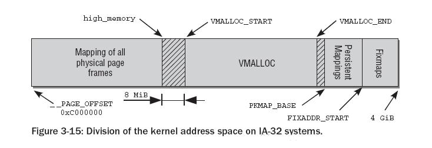
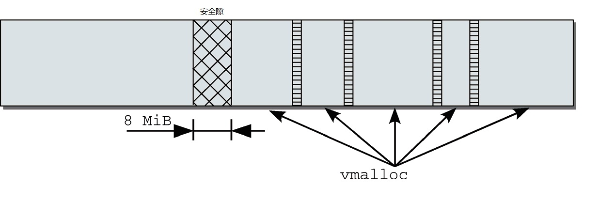
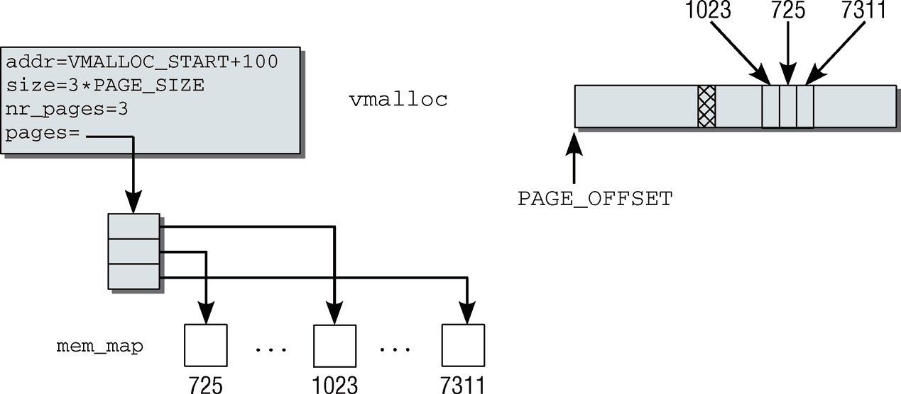

内存中不连续的页的分配
=======

| 日期 | 内核版本 | 架构| 作者 | GitHub| CSDN |
| ------- |:-------:|:-------:|:-------:|:-------:|:-------:|
| 2016-06-14 | [Linux-4.7](http://lxr.free-electrons.com/source/?v=4.7) | X86 & arm | [gatieme](http://blog.csdn.net/gatieme) | [LinuxDeviceDrivers](https://github.com/gatieme/LDD-LinuxDeviceDrivers) | [Linux内存管理](http://blog.csdn.net/gatieme/article/category/6225543) |


在内核初始化完成之后, 内存管理的责任就由伙伴系统来承担. 伙伴系统基于一种相对简单然而令人吃惊的强大算法.

Linux内核使用二进制伙伴算法来管理和分配物理内存页面, 该算法由Knowlton设计, 后来Knuth又进行了更深刻的描述.

伙伴系统是一个结合了2的方幂个分配器和空闲缓冲区合并计技术的内存分配方案, 其基本思想很简单. 内存被分成含有很多页面的大块, 每一块都是2个页面大小的方幂. 如果找不到想要的块, 一个大块会被分成两部分, 这两部分彼此就成为伙伴. 其中一半被用来分配, 而另一半则空闲. 这些块在以后分配的过程中会继续被二分直至产生一个所需大小的块. 当一个块被最终释放时, 其伙伴将被检测出来, 如果伙伴也空闲则合并两者.

*	内核如何记住哪些内存块是空闲的

*	分配空闲页面的方法

*	影响分配器行为的众多标识位

*	内存碎片的问题和分配器如何处理碎片


#1	内存中不连续的页的分配
-------


根据上文的讲述, 我们知道物理上连续的映射对内核是最好的, 但并不总能成功地使用. 在分配一大块内存时, 可能竭尽全力也无法找到连续的内存块.

在用户空间中这不是问题，因为普通进程设计为使用处理器的分页机制, 当然这会降低速度并占用TLB.

在内核中也可以使用同样的技术. 内核分配了其内核虚拟地址空间的一部分, 用于建立连续映射.


在IA-32系统中, 前16M划分给DMA区域, 后面一直到第896M作为NORMAL直接映射区, 紧随直接映射的前896MB物理内存，在插入的8MB安全隙之后, 是一个用于管理不连续内存的区域. 这一段具有线性地址空间的所有性质. 分配到其中的页可能位于物理内存中的任何地方. 通过修改负责该区域的内核页表, 即可做到这一点.




Persistent mappings和Fixmaps地址空间都比较小, 这里我们忽略它们, 这样只剩下直接地址映射和VMALLOC区, 这个划分应该是平衡两个需求的结果

1.	尽量增加DMA和Normal区大小，也就是直接映射地址空间大小，当前主流平台的内存，基本上都超过了512MB，很多都是标配1GB内存，因此注定有一部分内存无法进行线性映射。

2. 保留一定数量的VMALLOC大小，这个值是应用平台特定的，如果应用平台某个驱动需要用vmalloc分配很大的地址空间，那么最好通过在kernel参数中指定vmalloc大小的方法，预留较多的vmalloc地址空间。

3. 并不是Highmem没有或者越少越好，这个是我的个人理解，理由如下：高端内存就像个垃圾桶和缓冲区，防止来自用户空间或者vmalloc的映射破坏Normal zone和DMA zone的连续性，使得它们碎片化。当这个垃圾桶较大时，那么污染Normal 和DMA的机会自然就小了。

通过这种方式, 将内核的内核虚拟地址空间划分为几个不同的区域

下面的图是VMALLOC地址空间内部划分情况





#2	用vmalloc分配内存
-------

vmalloc是一个接口函数, 内核代码使用它来分配在虚拟内存中连续但在物理内存中不一定连续的内存

```cpp
//  http://lxr.free-electrons.com/source/include/linux/vmalloc.h?v=4.7#L70
void *vmalloc(unsigned long size);
```

该函数只需要一个参数, 用于指定所需内存区的长度, 与此前讨论的函数不同, 其长度单位不是页而是字节, 这在用户空间程序设计中是很普遍的.

使用vmalloc的最著名的实例是内核对模块的实现. 因为模块可能在任何时候加载, 如果模块数据比较多, 那么无法保证有足够的连续内存可用, 特别是在系统已经运行了比较长时间的情况下.

如果能够用小块内存拼接出足够的内存, 那么使用vmalloc可以规避该问题

内核中还有大约[400处地方调用了vmalloc](http://lxr.free-electrons.com/ident?v=4.7;i=vmalloc), 特别是在设备和声音驱动程序中.

因为用于vmalloc的内存页总是必须映射在内核地址空间中, 因此使用`ZONE_HIGHMEM`内存域的页要优于其他内存域. 这使得内核可以节省更宝贵的较低端内存域, 而又不会带来额外的坏处. 因此, `vmalloc`等映射函数是内核出于自身的目的(并非因为用户空间应用程序)使用高端内存页的少数情形之一.

所有有关vmalloc的数据结构和API结构声明在[`include/linux/vmalloc.h`](http://lxr.free-electrons.com/source/include/linux/vmalloc.h)和[``]()

| 声明头文件 | `NON-MMU`实现 | `MMU`实现 |
|:------------:|:------------------:|:-----------:|
| [`include/linux/vmalloc.h`](http://lxr.free-electrons.com/source/include/linux/vmalloc.h?v=4.7) | [`mm/nommu.c`](http://lxr.free-electrons.com/source/mm/nommu.c?v=4.7) | [`mm/vmalloc.c`](http://lxr.free-electrons.com/source/mm/vmalloc.c?v=4.7) |

##2.1	数据结构
-------


内核在管理虚拟内存中的`vmalloc`区域时, 内核必须跟踪哪些子区域被使用、哪些是空闲的. 为此定义了一个数据结构`vm_struct`, 将所有使用的部分保存在一个链表中. 该结构提的定义在[include/linux/vmalloc.h?v=4.7, line 32](http://lxr.free-electrons.com/source/include/linux/vmalloc.h?v=4.7#L32)


```cpp
// http://lxr.free-electrons.com/source/include/linux/vmalloc.h?v=4.7#L32
struct vm_struct {
    struct vm_struct    *next;
    void            *addr;
    unsigned long       size;
    unsigned long       flags;
    struct page         **pages;
    unsigned int        nr_pages;
    phys_addr_t         phys_addr;
    const void          *caller;
};
```

>注意, 内核使用了一个重要的数据结构称之为`vm_area_struct`,  以管理用户空间进程的虚拟地址空间内容. 尽管名称和目的都是类似的, 虽然二者都是做虚拟地址空间映射的, 但不能混淆这两个结构。
>
>
>
>1.	前者是内核虚拟地址空间映射，而后者则是应用进程虚拟地址空间映射。
>
>2.	前者不会产生page fault，而后者一般不会提前分配页面，只有当访问的时候，产生page fault来分配页面。


对于每个用vmalloc分配的子区域, 都对应于内核内存中的一个该结构实例. 该结构各个成员的语义如下

| 字段 | 描述 |
|:-----:|:-----:|
| next | 使得内核可以将vmalloc区域中的所有子区域保存在一个单链表上 |
| addr |定义了分配的子区域在虚拟地址空间中的起始地址。size表示该子区域的长度. 可以根据该信息来勾画出vmalloc区域的完整分配方案 |
| flags | 存储了与该内存区关联的标志集合, 这几乎是不可避免的. 它只用于指定内存区类型 |
| pages | 是一个指针，指向page指针的数组。每个数组成员都表示一个映射到虚拟地址空间中的物理内存页的page实例 |
| nr_pages | 指定pages中数组项的数目，即涉及的内存页数目 |
| phys_addr | 仅当用ioremap映射了由物理地址描述的物理内存区域时才需要。该信息保存在phys_addr中 |
| caller | |

其中`flags`只用于指定内存区类型, 所有可能的flag标识以宏的形式定义在[include/linux/vmalloc.h?v=4.7, line 14](http://lxr.free-electrons.com/source/include/linux/vmalloc.h?v=4.7#L14)

```cpp
//  http://lxr.free-electrons.com/source/include/linux/vmalloc.h?v=4.7#L14
/* bits in flags of vmalloc's vm_struct below */
#define VM_IOREMAP              0x00000001      /* ioremap() and friends */
#define VM_ALLOC                0x00000002      /* vmalloc() */
#define VM_MAP                  0x00000004      /* vmap()ed pages */
#define VM_USERMAP              0x00000008      /* suitable for remap_vmalloc_range */
#define VM_UNINITIALIZED        0x00000020      /* vm_struct is not fully initialized */
#define VM_NO_GUARD             0x00000040      /* don't add guard page */
#define VM_KASAN                0x00000080      /* has allocated kasan shadow memory */
/* bits [20..32] reserved for arch specific ioremap internals */
```

| flag标识 | 描述 |
|:-----:|:-----:|
| VM_IOREMAP | 表示将几乎随机的物理内存区域映射到vmalloc区域中. 这是一个特定于体系结构的操作 |
| VM_ALLOC | 指定由vmalloc产生的子区域 |
| VM_MAP | 用于表示将现存pages集合映射到连续的虚拟地址空间中 |
| VM_USERMAP | |
| VM_UNINITIALIZED | |
| VM_NO_GUARD | |
| VM_KASAN | |

下图给出了该结构使用方式的一个实例. 其中依次映射了3个(假想的)物理内存页, 在物理内存中的位置分别是1 023、725和7 311. 在虚拟的vmalloc区域中, 内核将其看作起始于VMALLOC_START + 100的一个连续内存区, 大小为3*PAGE_SIZE的内核地址空间，被映射到物理页面725, 1023和7311




##2.2创建vm_area
-------

因为大部分体系结构都支持`mmu,` 这里我们只考虑有`mmu的`情况. 实际上没有`mmu`支持时, `vmalloc`就无法实现非连续物理地址到连续内核地址空间的映射, `vmalloc`退化为`kmalloc`实现.

###2.2.1	vmlist全局链表
-------

在创建一个新的虚拟内存区之前, 必须找到一个适当的位置. `vm_area`实例组成的一个链表, 管理着`vmalloc`区域中已经建立的各个子区域. 定义在[`mm/vmalloc`](http://lxr.free-electrons.com/source/mm/vmalloc.c?v=4.7#L1170)的全局变量[`vmlist`]( http://lxr.free-electrons.com/source/mm/vmalloc.c?v=4.7#L1170)是表头. 定义在[mm/vmalloc.c?v=4.7, line 1170]( http://lxr.free-electrons.com/source/mm/vmalloc.c?v=4.7#L1170)


```cpp
// http://lxr.free-electrons.com/source/mm/vmalloc.c?v=4.7#L1170
static struct vm_struct *vmlist __initdata;
```


###2.2.2	分配函数
-------

内核在mm/vmalloc中提供了辅助函数`get_vm_area`和`__get_vm_area`, 它们负责参数准备工作, 而实际的分配工作交给底层函数`__get_vm_area_node`来完成, 这些函数定义在[mm/vmalloc.c?v=4.7, line 1388](http://lxr.free-electrons.com/source/mm/vmalloc.c?v=4.7#L1388)

```cpp
struct vm_struct *__get_vm_area(unsigned long size, unsigned long flags,
                unsigned long start, unsigned long end)
{
    return __get_vm_area_node(size, 1, flags, start, end, NUMA_NO_NODE,
                  GFP_KERNEL, __builtin_return_address(0));
}
EXPORT_SYMBOL_GPL(__get_vm_area);

struct vm_struct *__get_vm_area_caller(unsigned long size, unsigned long flags,
                       unsigned long start, unsigned long end,
                       const void *caller)
{
    return __get_vm_area_node(size, 1, flags, start, end, NUMA_NO_NODE,
                  GFP_KERNEL, caller);
}

/**
 *      get_vm_area  -  reserve a contiguous kernel virtual area
 *      @size:      size of the area
 *      @flags:     %VM_IOREMAP for I/O mappings or VM_ALLOC
 *
 *      Search an area of @size in the kernel virtual mapping area,
 *      and reserved it for out purposes.  Returns the area descriptor
 *      on success or %NULL on failure.
 */
struct vm_struct *get_vm_area(unsigned long size, unsigned long flags)
{
    return __get_vm_area_node(size, 1, flags, VMALLOC_START, VMALLOC_END,
                  NUMA_NO_NODE, GFP_KERNEL,
                  __builtin_return_address(0));
}

struct vm_struct *get_vm_area_caller(unsigned long size, unsigned long flags,
                const void *caller)
{
    return __get_vm_area_node(size, 1, flags, VMALLOC_START, VMALLOC_END,
                  NUMA_NO_NODE, GFP_KERNEL, caller);
}
```

这些函数是负责实际工作的`__get_vm_area_node`函数的前端. 根据子区域的长度信息, `__get_vm_area_node`函数试图在虚拟的`vmalloc`空间中找到一个适当的位置. 该函数定义在[mm/vmalloc.c?v=4.7, line 1354](http://lxr.free-electrons.com/source/mm/vmalloc.c?v=4.7#L1354)


 由于各个`vmalloc`子区域之间需要插入1页(警戒页)作为安全隙, 内核首先适当提高需要分配的内存长度.

```cpp
static struct vm_struct *__get_vm_area_node(unsigned long size,
        unsigned long align, unsigned long flags, unsigned long start,
        unsigned long end, int node, gfp_t gfp_mask, const void *caller)
{
    struct vmap_area *va;
    struct vm_struct *area;

    BUG_ON(in_interrupt());
    if (flags & VM_IOREMAP)
        align = 1ul << clamp_t(int, fls_long(size),
                       PAGE_SHIFT, IOREMAP_MAX_ORDER);

    size = PAGE_ALIGN(size);
    if (unlikely(!size))
        return NULL;

    area = kzalloc_node(sizeof(*area), gfp_mask & GFP_RECLAIM_MASK, node);
    if (unlikely(!area))
        return NULL;

    if (!(flags & VM_NO_GUARD))
        size += PAGE_SIZE;

    va = alloc_vmap_area(size, align, start, end, node, gfp_mask);
    if (IS_ERR(va)) {
        kfree(area);
        return NULL;
    }

    setup_vmalloc_vm(area, va, flags, caller);

    return area;
}
```

`start`和`end`参数分别由调用者设置, 比如`get_vm_area`函数和`get_vm_area_caller`函数传入`VMALLOC_START`和`VMALLOC_END`. 接下来循环遍历vmlist的所有表元素，直至找到一个适当的项


###2.2.3	释放函数
-------

[`remove_vm_area`](http://lxr.free-electrons.com/source/mm/vmalloc.c?v=4.7#L1454)函数将一个现存的子区域从vmalloc地址空间删除.


函数声明如下, [`include/linux/vmalloc.h?v=4.7, line 121`](http://lxr.free-electrons.com/source/include/linux/vmalloc.h?v=4.7#L121)
```cpp
//  http://lxr.free-electrons.com/source/include/linux/vmalloc.h?v=4.7#L121
struct vm_struct *remove_vm_area(void *addr);
```

函数定义在[`mm/vmalloc.c?v=4.7, line 1454`](http://lxr.free-electrons.com/source/mm/vmalloc.c?v=4.7#L1454)
```cpp
//  http://lxr.free-electrons.com/source/mm/vmalloc.c?v=4.7#L1446
/**
 *      remove_vm_area  -  find and remove a continuous kernel virtual area
 *      @addr:      base address
 *
 *      Search for the kernel VM area starting at @addr, and remove it.
 *      This function returns the found VM area, but using it is NOT safe
 *      on SMP machines, except for its size or flags.
 */
struct vm_struct *remove_vm_area(const void *addr)
{
    struct vmap_area *va;

    va = find_vmap_area((unsigned long)addr);
    if (va && va->flags & VM_VM_AREA) {
        struct vm_struct *vm = va->vm;

        spin_lock(&vmap_area_lock);
        va->vm = NULL;
        va->flags &= ~VM_VM_AREA;
        spin_unlock(&vmap_area_lock);

        vmap_debug_free_range(va->va_start, va->va_end);
        kasan_free_shadow(vm);
        free_unmap_vmap_area(va);

        return vm;
    }
    return NULL;
}
```


##2.3	vmalloc分配内存区
-------

`vmalloc`发起对不连续的内存区的分配操作. 该函数只是一个前端, 为`__vmalloc`提供适当的参数, 后者直接调用`__vmalloc_node`.


`vmalloc`只是`__vmalloc_node_flags`的前端接口, 复杂向`__vmalloc_node_flags`传递数据, 而`__vmalloc_node_flags`又是`__vmalloc_node`的前端接口, 而后者又将实际的工作交给`__vmalloc_node_range`函数来完成


[`vmalloc`](http://lxr.free-electrons.com/source/mm/vmalloc.c?v=4.7#L1754)函数定义在[`mm/vmalloc.c?v=4.7, line 1754`](http://lxr.free-electrons.com/source/mm/vmalloc.c?v=4.7#L1754), 将实际的工作交给`__vmalloc_node_flags`函数来完成.

```cpp
//  http://lxr.free-electrons.com/source/mm/vmalloc.c?v=4.7#L1754
/**
 *      vmalloc  -  allocate virtually contiguous memory
 *      @size:      allocation size
 *      Allocate enough pages to cover @size from the page level
 *      allocator and map them into contiguous kernel virtual space.
 *
 *      For tight control over page level allocator and protection flags
 *      use __vmalloc() instead.
 */
void *vmalloc(unsigned long size)
{
    return __vmalloc_node_flags(size, NUMA_NO_NODE,
                    GFP_KERNEL | __GFP_HIGHMEM);
}
EXPORT_SYMBOL(vmalloc);
```

[`__vmalloc_node_flags`](http://lxr.free-electrons.com/source/mm/vmalloc.c?v=4.7#L1747)函数定义在[`mm/vmalloc.c?v=4.7, line 1747`](http://lxr.free-electrons.com/source/mm/vmalloc.c?v=4.7#L1747), 通过`__vmalloc_node`来完成实际的工作.

```cpp
//  http://lxr.free-electrons.com/source/mm/vmalloc.c?v=4.7#L1747
static inline void *__vmalloc_node_flags(unsigned long size,
                    int node, gfp_t flags)
{
    return __vmalloc_node(size, 1, flags, PAGE_KERNEL,
                    node, __builtin_return_address(0));
}
```
[`__vmalloc_node`](http://lxr.free-electrons.com/source/mm/vmalloc.c?v=4.7#L1719)函数定义在[`mm/vmalloc.c?v=4.7, line 1719`](http://lxr.free-electrons.com/source/mm/vmalloc.c?v=4.7#L1719), 通过`__vmalloc_node_range`来完成实际的工作.


```cpp
//  http://lxr.free-electrons.com/source/mm/vmalloc.c?v=4.7#L1719
/**
 *      __vmalloc_node  -  allocate virtually contiguous memory
 *      @size:      allocation size
 *      @align:     desired alignment
 *      @gfp_mask:      flags for the page level allocator
 *      @prot:      protection mask for the allocated pages
 *      @node:      node to use for allocation or NUMA_NO_NODE
 *      @caller:    caller's return address
 *
 *      Allocate enough pages to cover @size from the page level
 *      allocator with @gfp_mask flags.  Map them into contiguous
 *      kernel virtual space, using a pagetable protection of @prot.
 */
static void *__vmalloc_node(unsigned long size, unsigned long align,
                gfp_t gfp_mask, pgprot_t prot,
                int node, const void *caller)
{
    return __vmalloc_node_range(size, align, VMALLOC_START, VMALLOC_END,
                gfp_mask, prot, 0, node, caller);
}
```

[`__vmalloc_node_range`](http://lxr.free-electrons.com/source/mm/vmalloc.c?v=4.7#L1658)最终完成了内存区的分配工作


```cpp
//  http://lxr.free-electrons.com/source/mm/vmalloc.c?v=4.7#L1658
/**
 *      __vmalloc_node_range  -  allocate virtually contiguous memory
 *      @size:      allocation size
 *      @align:     desired alignment
 *      @start:     vm area range start
 *      @end:       vm area range end
 *      @gfp_mask:      flags for the page level allocator
 *      @prot:      protection mask for the allocated pages
 *      @vm_flags:      additional vm area flags (e.g. %VM_NO_GUARD)
 *      @node:      node to use for allocation or NUMA_NO_NODE
 *      @caller:    caller's return address
 *
 *      Allocate enough pages to cover @size from the page level
 *      allocator with @gfp_mask flags.  Map them into contiguous
 *      kernel virtual space, using a pagetable protection of @prot.
 */
void *__vmalloc_node_range(unsigned long size, unsigned long align,
            unsigned long start, unsigned long end, gfp_t gfp_mask,
            pgprot_t prot, unsigned long vm_flags, int node,
            const void *caller)
{
    struct vm_struct *area;
    void *addr;
    unsigned long real_size = size;

    size = PAGE_ALIGN(size);
    if (!size || (size >> PAGE_SHIFT) > totalram_pages)
        goto fail;

    area = __get_vm_area_node(size, align, VM_ALLOC | VM_UNINITIALIZED |
                vm_flags, start, end, node, gfp_mask, caller);
    if (!area)
        goto fail;

    addr = __vmalloc_area_node(area, gfp_mask, prot, node);
    if (!addr)
        return NULL;

    /*
     * In this function, newly allocated vm_struct has VM_UNINITIALIZED
     * flag. It means that vm_struct is not fully initialized.
     * Now, it is fully initialized, so remove this flag here.
     */
    clear_vm_uninitialized_flag(area);

    /*
     * A ref_count = 2 is needed because vm_struct allocated in
     * __get_vm_area_node() contains a reference to the virtual address of
     * the vmalloc'ed block.
     */
    kmemleak_alloc(addr, real_size, 2, gfp_mask);

    return addr;

fail:
    warn_alloc_failed(gfp_mask, 0,
              "vmalloc: allocation failure: %lu bytes\n",
              real_size);
    return NULL;
}
```

实现分为3部分

*	首先, `get_vm_area`在`vmalloc`地址空间中找到一个适当的区域.

*	接下来从物理内存分配各个页

*	最后将这些页连续地映射到`vmalloc`区域中, 分配虚拟内存的工作就完成了.

如果显式指定了分配页帧的结点, 则内核调用`alloc_pages_node`, 否则，使用`alloc_page`从当前结点分配页帧.

分配的页从相关结点的伙伴系统移除. 在调用时, `vmalloc`将`gfp_mask`设置为`GFP_KERNEL` | `__GFP_HIGHMEM`，内核通过该参数指示内存管理子系统尽可能从`ZONE_HIGHMEM`内存域分配页帧. 理由已经在上文给出：低端内存域的页帧更为宝贵，因此不应该浪费到vmalloc的分配中，在此使用高
端内存域的页帧完全可以满足要求。
内存取自伙伴系统，而gfp_mask设置为`GFP_KERNEL` | `__GFP_HIGHMEM`，因此内核指示内存管
理子系统尽可能从`ZONE_HIGHMEM`分配页帧。其原因我们已经知道


#3	备选映射方法
-------

除了`vmalloc`之外，还有其他方法可以创建虚拟连续映射。这些都基于上文讨论的`__vmalloc`函数或使用非常类似的机制


*	`vmalloc_32`的工作方式与vmalloc相同，但会确保所使用的物理内存总是可以用普通32位指针寻址。如果某种体系结构的寻址能力超出基于字长计算的范围, 那么这种保证就很重要。例如，在启用了`PAE`的`IA-32`系统上，就是如此.

*	`vmap`使用一个`page`数组作为起点，来创建虚拟连续内存区。与vmalloc相比，该函数所用的物理内存位置不是隐式分配的，而需要先行分配好，作为参数传递。此类映射可通过`vm_map`实例中的`VM_MAP`标志辨别。

*	不同于上述的所有映射方法, `ioremap`是一个特定于处理器的函数, 必须在所有体系结构上实现. 它可以将取自物理地址空间、由系统总线用于I/O操作的一个内存块，映射到内核的地址空间中.

该函数在设备驱动程序中使用很多, 可将用于与外设通信的地址区域暴露给内核的其他部分使用(当然也包括其本身).


#4	释放内存
-------


有两个函数用于向内核释放内存, `vfree`用于释放`vmalloc`和`vmalloc_32`分配的区域，而`vunmap`用于释放由`vmap`或`ioremap`创建的映射。这两个函数都会归结到`__vunmap`

```cpp
void __vunmap(void *addr, int deallocate_pages)
```


`addr`表示要释放的区域的起始地址, `deallocate_pages`指定了是否将与该区域相关的物理内存页返回给伙伴系统. `vfree`将后一个参数设置为1, 而`vunmap`设置为0, 因为在这种情况下只删除映射, 而不将相关的物理内存页返回给伙伴系统. 图3-40给出了`__vunmap`的代码流程图


不必明确给出需要释放的区域长度, 长度可以从`vmlist`中的信息导出. 因此`__vunmap`的第一个任务是在`__remove_vm_area`(由`remove_vm_area`在完成锁定之后调用）中扫描该链表, 以找到
相关项。
unmap_vm_area使用找到的vm_area实例，从页表删除不再需要的项。与分配内存时类似，该函
数需要操作各级页表，但这一次需要删除涉及的项。它还会更新CPU高速缓存。
如果__vunmap的参数deallocate_pages设置为1（在vfree中），内核会遍历area->pages的所
有元素，即指向所涉及的物理内存页的page实例的指针。然后对每一项调用__free_page，将页释放
到伙伴系统。
最后，必须释放用于管理该内存区的内核数据结构。