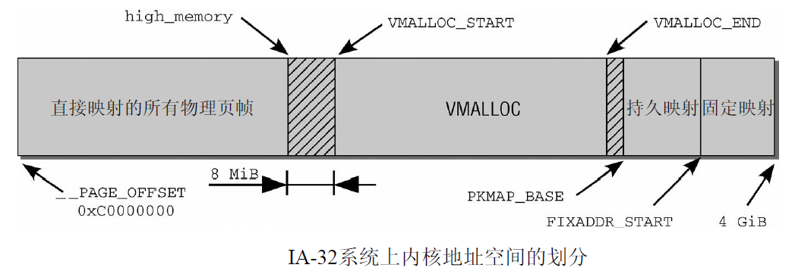
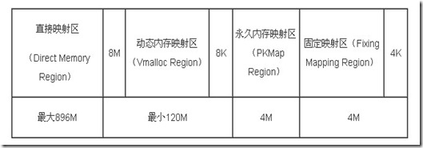

服务器体系与共享存储器架构
=======

| 日期 | 内核版本 | 架构| 作者 | GitHub| CSDN |
| ------- |:-------:|:-------:|:-------:|:-------:|:-------:|
| 2016-06-14 | [Linux-4.7](http://lxr.free-electrons.com/source/?v=4.7) | X86 & arm | [gatieme](http://blog.csdn.net/gatieme) | [LinuxDeviceDrivers](https://github.com/gatieme/LDD-LinuxDeviceDrivers) | [Linux内存管理](http://blog.csdn.net/gatieme/article/category/6393814) |


在内核初始化完成之后, 内存管理的责任就由伙伴系统来承担. 伙伴系统基于一种相对简单然而令人吃惊的强大算法.

Linux内核使用二进制伙伴算法来管理和分配物理内存页面, 该算法由Knowlton设计, 后来Knuth又进行了更深刻的描述.

伙伴系统是一个结合了2的方幂个分配器和空闲缓冲区合并计技术的内存分配方案, 其基本思想很简单. 内存被分成含有很多页面的大块, 每一块都是2个页面大小的方幂. 如果找不到想要的块, 一个大块会被分成两部分, 这两部分彼此就成为伙伴. 其中一半被用来分配, 而另一半则空闲. 这些块在以后分配的过程中会继续被二分直至产生一个所需大小的块. 当一个块被最终释放时, 其伙伴将被检测出来, 如果伙伴也空闲则合并两者.

*	内核如何记住哪些内存块是空闲的

*	分配空闲页面的方法

*	影响分配器行为的众多标识位

*	内存碎片的问题和分配器如何处理碎片


#1	高端内存与内核映射
-------


尽管`vmalloc`函数族可用于从高端内存域向内核映射页帧(这些在内核空间中通常是无法直接看到的), 但这并不是这些函数的实际用途.

重要的是强调以下事实 : 内核提供了其他函数用于将`ZONE_HIGHMEM`页帧显式映射到内核空间, 这些函数与vmalloc机制无关. 因此, 这就造成了混乱.


而在高端内存的页不能永久地映射到内核地址空间. 因此, 通过alloc_pages()函数以\__GFP_HIGHMEM标志获得的内存页就不可能有逻辑地址.

在x86_32体系结构总, 高于896MB的所有物理内存的范围大都是高端内存, 它并不会永久地或自动映射到内核地址空间, 尽管X86处理器能够寻址物理RAM的范围达到4GB(启用PAE可以寻址64GB), 一旦这些页被分配, 就必须映射到内核的逻辑地址空间上. 在x86_32上, 高端地址的页被映射到内核地址空间(即虚拟地址空间的3GB~4GB)

内核地址空间的最后128 MiB用于何种用途呢?

该部分有3个用途。

1.	虚拟内存中连续、但物理内存中不连续的内存区，可以在vmalloc区域分配. 该机制通常用于用户过程, 内核自身会试图尽力避免非连续的物理地址。内核通常会成功，因为大部分大的内存块都在启动时分配给内核，那时内存的碎片尚不严重。但在已经运行了很长时间的系统上, 在内核需要物理内存时, 就可能出现可用空间不连续的情况. 此类情况, 主要出现在动态加载模块时.

2.	持久映射用于将高端内存域中的非持久页映射到内核中

3.	固定映射是与物理地址空间中的固定页关联的虚拟地址空间项，但具体关联的页帧可以自由选择. 它与通过固定公式与物理内存关联的直接映射页相反，虚拟固定映射地址与物理内存位置之间的关联可以自行定义，关联建立后内核总是会注意到的.



在这里有两个预处理器符号很重要 \__VMALLOC_RESERVE设置了`vmalloc`区域的长度, 而`MAXMEM`则表示内核可以直接寻址的物理内存的最大可能数量.




内核中, 将内存划分为各个区域是通过图3-15所示的各个常数控制的。根据内核和系统配置, 这些常数可能有不同的值。直接映射的边界由high_memory指定。


1.	直接映射区
	线性空间中从3G开始最大896M的区间, 为直接内存映射区，该区域的线性地址和物理地址存在线性转换关系：线性地址=3G+物理地址。

2.	动态内存映射区
	该区域由内核函数`vmalloc`来分配, 特点是 : 线性空间连续, 但是对应的物理空间不一定连续. `vmalloc`分配的线性地址所对应的物理页可能处于低端内存, 也可能处于高端内存.

3.	永久内存映射区
	该区域可访问高端内存. 访问方法是使用`alloc_page(_GFP_HIGHMEM)`分配高端内存页或者使用`kmap`函数将分配到的高端内存映射到该区域.

4.	固定映射区
	该区域和4G的顶端只有4k的隔离带，其每个地址项都服务于特定的用途，如ACPI_BASE等。


>说明
>
>注意用户空间当然可以使用高端内存，而且是正常的使用，内核在分配那些不经常使用的内存时，都用高端内存空间(如果有)，所谓不经常使用是相对来说的，比如内核的一些数据结构就属于经常使用的，而用户的一些数据就属于不经常使用的。用户在启动一个应用程序时，是需要内存的，而每个应用程序都有3G的线性地址，给这些地址映射页表时就可以直接使用高端内存。
>
>而且还要纠正一点的是：那128M线性地址不仅仅是用在这些地方的，如果你要加载一个设备，而这个设备需要映射其内存到内核中，它也需要使用这段线性地址空间来完成，否则内核就不能访问设备上的内存空间了.
>
>总之，内核的高端线性地址是为了访问内核固定映射以外的内存资源。进程在使用内存时，触发缺页异常，具体将哪些物理页映射给用户进程是内核考虑的事情. 在用户空间中没有高端内存这个概念.

即内核对于低端内存, 不需要特殊的映射机制, 使用**直接映射**即可以访问普通内存区域, 而对于高端内存区域, 内核可以采用三种不同的机制将页框映射到高端内存 : 分别叫做**永久内核映射**、**临时内核映射**以及**非连续内存分配**


#2	固定映射
-------


##2.1	数据结构
-------

linux高端内存中的临时内存区为固定内存区的一部分, 对于固定内存在linux内核中有下面描述

| x86 | arm | arm64 |
|:----:|:-----:|:-------:|
| [arch/x86/include/asm/fixmap.h?v=4.7, line 67](http://lxr.free-electrons.com/source/arch/x86/include/asm/fixmap.h?v=4.7#L67) | [arch/arm/include/asm/fixmap.h?v=4.7, line 11](http://lxr.free-electrons.com/source/arch/arm/include/asm/fixmap.h?v=4.7#L11) | [arch/arm64/include/asm/fixmap.h?v=4.7, line 36](http://lxr.free-electrons.com/source/arch/arm64/include/asm/fixmap.h?v=4.7#L36) |

```cpp
/*
 * Here we define all the compile-time 'special' virtual
 * addresses. The point is to have a constant address at
 * compile time, but to set the physical address only
 * in the boot process.
 *
 * These 'compile-time allocated' memory buffers are
 * page-sized. Use set_fixmap(idx,phys) to associate
 * physical memory with fixmap indices.
 *
 */
enum fixed_addresses {
    FIX_HOLE,

    /*
     * Reserve a virtual window for the FDT that is 2 MB larger than the
     * maximum supported size, and put it at the top of the fixmap region.
     * The additional space ensures that any FDT that does not exceed
     * MAX_FDT_SIZE can be mapped regardless of whether it crosses any
     * 2 MB alignment boundaries.
     *
     * Keep this at the top so it remains 2 MB aligned.
     */
#define FIX_FDT_SIZE        (MAX_FDT_SIZE + SZ_2M)
    FIX_FDT_END,
    FIX_FDT = FIX_FDT_END + FIX_FDT_SIZE / PAGE_SIZE - 1,

    FIX_EARLYCON_MEM_BASE,
    FIX_TEXT_POKE0,
    __end_of_permanent_fixed_addresses,

    /*
     * Temporary boot-time mappings, used by early_ioremap(),
     * before ioremap() is functional.
     */
#define NR_FIX_BTMAPS       (SZ_256K / PAGE_SIZE)
#define FIX_BTMAPS_SLOTS    7
#define TOTAL_FIX_BTMAPS    (NR_FIX_BTMAPS * FIX_BTMAPS_SLOTS)

    FIX_BTMAP_END = __end_of_permanent_fixed_addresses,
    FIX_BTMAP_BEGIN = FIX_BTMAP_END + TOTAL_FIX_BTMAPS - 1,

    /*
     * Used for kernel page table creation, so unmapped memory may be used
     * for tables.
     */
    FIX_PTE,
    FIX_PMD,
    FIX_PUD,
    FIX_PGD,

    __end_of_fixed_addresses
};
```


##2.2	固定映射
-------


`ioremap`的作用是将`IO`和`BIOS`以及物理地址空间映射到在896M至1G的128M的地址空间内, 使得kernel能够访问该空间并进行相应的读写操作。


>start_kernel()->setup_arch()->early_ioremap_init()

然后arm和arm64上`early_ioremap_init`又是`early_ioremap_setup`的前端

| 函数 | x86 |arm | arm64 |
|:-----:|:----:|:----:|:--------:|
| early_ioremap_init | [arch/x86/mm/ioremap.c?v=4.7, line 445](http://lxr.free-electrons.com/source/arch/x86/mm/ioremap.c?v=4.7#L445) | [arch/arm/mm/ioremap.c?v=4.7, line 489](http://lxr.free-electrons.com/source/arch/arm/mm/ioremap.c?v=4.7#L489) | [arch/arm64/mm/ioremap.c?v=4.7, line 110](http://lxr.free-electrons.com/source/arch/arm64/mm/ioremap.c?v=4.7#L110) |
| early_ioremap_setup | [mm/early_ioremap.c?v=4.7, line 67](http://lxr.free-electrons.com/source/mm/early_ioremap.c?v=4.7#L67) | 体系结构无关 |  体系结构无关 |

其中arm和arm64架构下的`early_ioremap_init`函数实现比较简单, 都是直接的`early_ioremap_setup`函数的前端


```cpp
/*
 * Must be called after early_fixmap_init
 */
void __init early_ioremap_init(void)
{
    early_ioremap_setup();
}
```

但是arm和arm64下的setup_arch函数则会先调用`early_fixmap_init`函数来填充`fixmap`. 参见[arch/arm/kernel/setup.c?v=4.7, line 1058](http://lxr.free-electrons.com/source/arch/arm/kernel/setup.c?v=4.7#L1058)和[arch/arm64/kernel/setup.c?v=4.7, line 229](http://lxr.free-electrons.com/source/arch/arm64/kernel/setup.c?v=4.7#L229).

```cpp
void __init setup_arch(char **cmdline_p)
{
	early_fixmap_init();
	early_ioremap_init();
}
```

`early_fixmap_init`函数的定义在

| arm | arm64 |
|:------:|:------:|
| [arch/arm/mm/mmu.c?v=4.7, line 385](http://lxr.free-electrons.com/source/arch/arm/mm/mmu.c?v=4.7#L385) | [arch/arm64/mm/mmu.c?v=4.7, line 676](http://lxr.free-electrons.com/source/arch/arm64/mm/mmu.c?v=4.7#L676) |


其中arm架构的定义如下所示, 在[arch/arm/mm/mmu.c?v=4.7, line 385](http://lxr.free-electrons.com/source/arch/arm/mm/mmu.c?v=4.7#L385)

```cpp
void __init early_fixmap_init(void)
{
    pmd_t *pmd;

    /*
     * The early fixmap range spans multiple pmds, for which
     * we are not prepared:
     */
    BUILD_BUG_ON((__fix_to_virt(__end_of_early_ioremap_region) >> PMD_SHIFT)
             != FIXADDR_TOP >> PMD_SHIFT);

    /*得到固定映射区的pmd
    ，此pmd为虚拟地址转换为物理地址的pmd*/
    pmd = fixmap_pmd(FIXADDR_TOP);
     /*将bm_pte页表设置为固定映射区开始地址的pmd的第一个页表；*/
    pmd_populate_kernel(&init_mm, pmd, bm_pte);

    pte_offset_fixmap = pte_offset_early_fixmap;
}
```

随后`setup_arch`中调用`early_ioremap_setup`函数将`fixed_address`里的索引的虚拟地址放入`slot_virt`, 参见[mm/early_ioremap.c?v=4.7, line 63](http://lxr.free-electrons.com/source/mm/early_ioremap.c?v=4.7#L63)

```cpp
static void __iomem *prev_map[FIX_BTMAPS_SLOTS] __initdata;
static unsigned long prev_size[FIX_BTMAPS_SLOTS] __initdata;
static unsigned long slot_virt[FIX_BTMAPS_SLOTS] __initdata;

void __init early_ioremap_setup(void)
{
    int i;

    for (i = 0; i < FIX_BTMAPS_SLOTS; i++)
        if (WARN_ON(prev_map[i]))
            break;
	/*  将fixed_address里的索引的虚拟地址放入slot_virt
         从代码里面可以看出，放入slot_virt中得虚拟地址为1M  */
    for (i = 0; i < FIX_BTMAPS_SLOTS; i++)
        slot_virt[i] = __fix_to_virt(FIX_BTMAP_BEGIN - NR_FIX_BTMAPS*i);
}
```

而x86下的没有定义early_fixmap_init函数, 因此在`early_ioremap_init`函数中完成了fixmap的初始化工作, 定义在[arch/x86/mm/ioremap.c?v=4.7, line 445](http://lxr.free-electrons.com/source/arch/x86/mm/ioremap.c?v=4.7#L445)


##2.3	ioremap函数
-------


对于`ioremap`的使用需要通过`early_memremap`和`early_iounmap`进行.

由于对应于`ioremap`的内存空间是有限的, 所以对于`ioremap`空间的使用遵照使用结束马上释放的原则. 这就是说`early_memremap`和`early_iounmap`必须配对使用并且访问结束必须马上执行`unmap`


#3	临时内核映射
-------


刚才描述的`kmap`函数不能用于中断处理程序, 因为它可能进入睡眠状态. 如果`pkmap`数组中没有空闲位置, 该函数会进入睡眠状态, 直至情形有所改善. 

因此内核提供了一个备选的映射函数, 其执行是原子的, 逻辑上称为`kmap_atomic`. 该函数的一个主要优点是它比普通的`kmap`快速. 但它不能用
于可能进入睡眠的代码. 因此, 它对于很快就需要一个临时页的简短代码，是非常理想的.

`kmap_atomic`的定义在IA-32, PPC, Sparc32上是[特定于体系结构的](http://lxr.free-electrons.com/ident?v=4.7;i=kmap_atomic), 但这3种实现只有非常细微的差别. 其原型是相同的.


##3.1	kmap_atomic函数
-------


```cpp
//  http://lxr.free-electrons.com/source/arch/arm/mm/highmem.c?v=4.7#L55
void *kmap_atomic(struct page *page)
```
page是一个指向高端内存页的管理结构的指针, 而早期的内核中, 增加了一个类型为[enum km_type](http://lxr.free-electrons.com/ident?v=2.6.32;i=km_type)的[type参数](http://lxr.free-electrons.com/source/arch/arm/mm/highmem.c?v=2.6.32#L39), 用于指定所需的映射类型

```cpp
//  http://lxr.free-electrons.com/source/arch/arm/mm/highmem.c?v=2.6.32#L39
void *kmap_atomic(struct page *page, enum km_type type)
```

而在新的内核中, 删除了这个标识, 但是保留了`km_type`的最大值`KM_TYPE_NR`


```cpp
void *kmap_atomic(struct page *page)
{
    unsigned int idx;
    unsigned long vaddr;
    void *kmap;
    int type;

    preempt_disable();
    pagefault_disable();
    if (!PageHighMem(page))
        return page_address(page);

#ifdef CONFIG_DEBUG_HIGHMEM
    /*
     * There is no cache coherency issue when non VIVT, so force the
     * dedicated kmap usage for better debugging purposes in that case.
     */
    if (!cache_is_vivt())
        kmap = NULL;
    else
#endif
        kmap = kmap_high_get(page);
    if (kmap)
        return kmap;

    type = kmap_atomic_idx_push();

    idx = FIX_KMAP_BEGIN + type + KM_TYPE_NR * smp_processor_id();
    vaddr = __fix_to_virt(idx);
#ifdef CONFIG_DEBUG_HIGHMEM
    /*
     * With debugging enabled, kunmap_atomic forces that entry to 0.
     * Make sure it was indeed properly unmapped.
     */
    BUG_ON(!pte_none(get_fixmap_pte(vaddr)));
#endif
    /*
     * When debugging is off, kunmap_atomic leaves the previous mapping
     * in place, so the contained TLB flush ensures the TLB is updated
     * with the new mapping.
     */
    set_fixmap_pte(idx, mk_pte(page, kmap_prot));

    return (void *)vaddr;
}
EXPORT_SYMBOL(kmap_atomic);
```


这个函数不会被阻塞, 因此可以用在中断上下文和起亚不能重新调度的地方. 它也禁止内核抢占, 这是有必要的, 因此映射对每个处理器都是唯一的(调度可能对哪个处理器执行哪个进程做变动).


##3.2	kunmap_atomic函数
-------

可以通过函数kunmap_atomic取消映射

```cpp
/*
 * Prevent people trying to call kunmap_atomic() as if it were kunmap()
 * kunmap_atomic() should get the return value of kmap_atomic, not the page.
 */
#define kunmap_atomic(addr)                     \
do {                                \
    BUILD_BUG_ON(__same_type((addr), struct page *));       \
    __kunmap_atomic(addr);                  \
} while (0)
```

这个函数也不会阻塞. 在很多体系结构中, 除非激活了内核抢占, 否则`kunmap_atomic`根本无事可做, 因为只有在下一个临时映射到来前上一个临时映射才有效. 因此, 内核完全可以"忘掉"kmap_atomic映射, kunmap_atomic也无需做什么实际的事情. 下一个原子映射将自动覆盖前一个映射.

