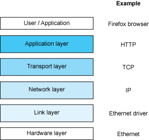
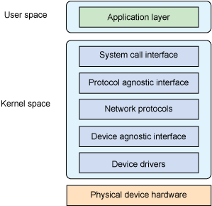
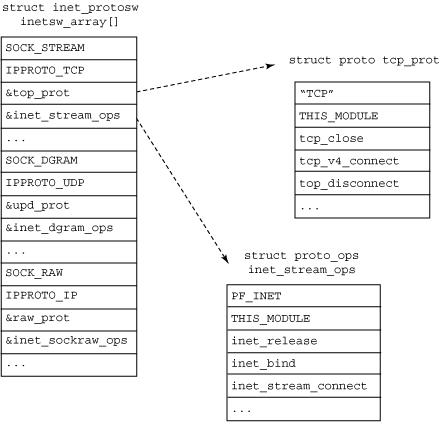
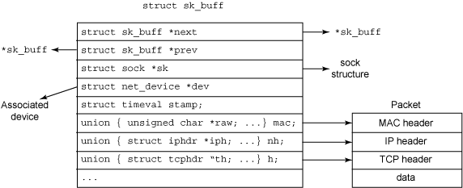

进程虚拟地址空间
=======

| 日期 | 内核版本 | 架构| 作者 | GitHub| CSDN |
| ------- |:-------:|:-------:|:-------:|:-------:|:-------:|
| 2016-06-14 | [Linux-4.7](http://lxr.free-electrons.com/source/?v=4.7) | X86 & arm | [gatieme](http://blog.csdn.net/gatieme) | [LinuxDeviceDrivers](https://github.com/gatieme/LDD-LinuxDeviceDrivers) | [Linux内存管理](http://blog.csdn.net/gatieme/article/category/6225543) |

#1	Linux 网络栈剖析
-------

**从socket 到设备驱动程序**

`Linux®`操作系统的最大特性之一就是它的网络栈. 它最初源于 BSD 的网络栈，具有一套非常干净的接口，组织得非常好。其接口范围从协议无关层（例如通用 socket 层接口或设备层）到各种网络协议的具体层。本文将从分层角度对 Linux 网络栈的接口进行探索，并介绍其中的一些主要结构.

#2	协议简介
-------

虽然对于网络的正式介绍一般都参考了 OSI(Open Systems Interconnection)模型, 但是本文对 Linux 中基本网络栈的介绍分为四层的 Internet 模型(如图 1 所示).

这个栈的最底部是**链路层**, 链路层是指提供对物理层访问的设备驱动程序，这可以是各种介质，例如串口链路或以太网设备

链路层上面是**网络层**, 它负责将报文定向到目标位置. 再上一层称为传输层，负责端到端的通信(例如，在一台主机内部). 尽管网络层负责管理主机之间的通信，但是传输层需要负责管理主机内部各端之间的通信。最后一层是应用层，它通常是一个语义层，能够理解要传输的数据. 例如，超文本传输协议（HTTP）就负责传输服务器和客户机之间对 Web 内容的请求与响应。

实际来说，网络栈的各个层次有一些更为人所熟知的名字. 

*	在**链路层**上，可以找到以太网, 这是最常用的一种高速介质. 更早的链路层协议包括一些串口协议，例如 SLIP（Serial Line Internet Protocol）、CSLIP（Compressed SLIP）和PPP（Point-to-Point Protocol）

*	最常见的**网络层**协议是 IP（Internet Protocol），但是网络层中还存在一些满足其他需求的协议，例如 ICMP（Internet Control Message Protocol）和ARP（ Address Resolution Protocol）

*	在**传输层**上是 TCP（Transmission Control Protocol）和 UDP（User Datagram Protocol）

*	最后, **应用层**中包含很多大家都非常熟悉的协议，包括标准的 Web 协议 HTTP 和电子邮件协议 SMTP(Simple Mail Transfer Protocol).

 

| TCP/IP层 | 协议 |
|:----------:|:-----:|
| 数据链路层 | ARP,RARP |
| 网络层 | IP,ICMP,IGMP |
| 传输层 | TCP ,UDP,UGP |
| 应用层 | Telnet,FTP,SMTP,SNMP |

#3	核心网络架构
-------

现在继续了解Linux网络栈的架构以及如何实现这种Internet模型. 

下图提供了 Linux 网络栈的高级视图

最上面是用户空间层，或称为**应用层(Application layout)**，其中定义了网络栈的用户

底部是**物理设备(Physical device hardware)**, 提供了对网络的连接能力(串口或诸如以太网之类的高速网络). 

中间是内核空间, 即**网络子系统**, 也是本文介绍的重点. 流经网络栈内部的是socket缓冲区(sk_buffs), 它负责在源和汇点之间传递报文数据.

| 层次 | 名称 |描述 |
|:-----:|:-----:|:----:|
| Application layout | 应用层 | 网络栈的用户, 即使用网络的各个应用程序 |
| Kernel Space | 内核空间的网络子系统 | 它简单地为用户空间的应用程序提供了一种访问内核网络子系统的方法 流经网络栈内部的是socket缓冲区(sk_buffs), 它负责在源和汇点之间传递报文数据 |
| Physical device hardware | 物理设备 | 提供了对网络的连接能力(串口或诸如以太网之类的高速网络).  |

 
>*	内核在应用程序与网络物理设备之间插入了一个内核空间
>
>*	内核空间为驱动着网络设备的正常运转, 同时又为应用程序提供可供使用的接口
 

首先，让我们来快速浏览一下**Linux网络子系统的核心元素**, 后续章节中会更详细进行介绍.

顶部是**系统调用接口(System call interface)**, 它简单地为用户空间的应用程序提供了一种访问内核网络子系统的方法

位于其下面的是一个**协议无关层(Protocol agnostic interface)**, 它提供了一种通用方法来使用底层传输层协议

然后是**实际协议(Network protocols)** , 在 Linux中包括内嵌的协议TCP、UDP, 当然还有IP.

然后是另外一个**设备无关层(Device agnostic interface)**, 提供了与各个设备驱动程序通信的通用接口

最下面是**设备驱动程序(Device driders)**本身.

如下所示

| 内核空间层次 | 名称 |描述 |
|:--------------:|:-----:|:----:|
| System call interface | 系统调用接口 | 它简单地为用户空间的应用程序提供了一种访问内核网络子系统的方法 |
| Protocol agnostic interface | 协议无关层 | 它提供了一种通用方法来使用底层传输层协议 |
| Network protocols | 实际协议 | 在 Linux中包括内嵌的协议TCP、UDP, 当然还有IP |
| Device agnostic interface | 设备无关层 | 提供了与各个设备驱动程序通信的通用接口 |
| Device driders | 设备驱动程序 | 提供了网络硬件设备的基础驱动 |

 
>内核并没有简单的为内核网络子系统实现常规的系统调用接口, 协议层和设备驱动层次3个简单的层次, Linux内核必须支持各种不同的协议和不同的设备, 没有什么问题是通过一个虚拟层无法实现的, 因此内核在不同的层次之间插入了一个协议或者设备无关的层次
>
>*	系统调用接口和实际协议层之间插入了一个协议无关层
>
>*	实际协议层与设备驱动程序之间插入了一个设备无关层
 

##3.1	系统调用接口
-------

系统调用接口可以从两个角度进行描述. 用户发起网络调用时, 通过系统调用接口进入内核的过程应该是多路的. 最后调用[`net/socket.c`](http://lxr.free-electrons.com/source/net/socket.c?v=4.7#L2315)中的[`sys_socketcall` ](http://lxr.free-electrons.com/source/net/socket.c?v=4.7#L2340)结束该过程, 然后进一步将调用分路发送到指定目标.

系统调用接口的另一种描述是使用普通文件操作作为网络I/O. 例如, 典型的读写操作可以在网络`socket`上执行(`socket`使用一个文件描述符表示, 与一个普通文件一样). 因此, 尽管有很多操作是网络专用的(使用`socket`调用创建一个 `socket`, 使用`connect`调用连接一个收信方, 等等), 但是也有一些标准的文件操作可以应用于网络对象, 就像操作普通文件一样.

最后, 系统调用接口提供了在用户空间应用程序和内核之间转移控制的方法.

| 系统调用 | 宏 |描述 |
|:---------:|:------:|
| socketcall |  | socket系统调用 |
| socket | [SYS_SOCKET](http://lxr.free-electrons.com/source/net/socket.c?v=4.7#L2341) | 建立socket |
| bind | [SYS_BIND](http://lxr.free-electrons.com/source/net/socket.c?v=4.7#L2345) | 绑定socket到端口 |
| connect | [SYS_CONNECT](http://lxr.free-electrons.com/source/net/socket.c?v=4.7#L2347) |连接远程主机 |
| listen | [SYS_LISTEN](http://lxr.free-electrons.com/source/net/socket.c?v=4.7#L2350) | 监听socket端口 |
| accept | [SYS_ACCEPT](http://lxr.free-electrons.com/source/net/socket.c?v=4.7#L2353) | 响应socket连接请求 |
| getsockname | [SYS_GETSOCKNAME](http://lxr.free-electrons.com/source/net/socket.c?v=4.7#L2357) | 取得本地socket名字 |
| getpeername | [SYS_GETPEERNAME](http://lxr.free-electrons.com/source/net/socket.c?v=4.7#L2362) | 获取通信对方的socket名字 |
| socketpair | [SYS_SOCKETPAIR](http://lxr.free-electrons.com/source/net/socket.c?v=4.7#L2367) | 创建一对已联接的无名socket |
| send | [SYS_SEND](http://lxr.free-electrons.com/source/net/socket.c?v=4.7#L2370) | 通过socket发送信息 |
| sendto | [SYS_SENDTO](http://lxr.free-electrons.com/source/net/socket.c?v=4.7#L2373) | 发送UDP信息 |
| recv | [SYS_RECV](http://lxr.free-electrons.com/source/net/socket.c?v=4.7#L2377) | 通过socket接收信息 |
| recvfrom | [SYS_RECVFROM](http://lxr.free-electrons.com/source/net/socket.c?v=4.7#L2380) | 接收UDP信息 |
| recvmsg | 参见recv |
| select | 对多路同步I/O进行轮询 |
| shutdown | [SYS_SHUTDOWN](http://lxr.free-electrons.com/source/net/socket.c?v=4.7#L2385) | 关闭socket上的连接 |
| getsockopt | [SYS_GETSOCKOPT](http://lxr.free-electrons.com/source/net/socket.c?v=4.7#L2391) | 取端口设置 |
| setsockopt | [SYS_SETSOCKOPT](http://lxr.free-electrons.com/source/net/socket.c?v=4.7#L2388) | 设置端口参数 |
| sendmsg | [SYS_SENDMSG](http://lxr.free-electrons.com/source/net/socket.c?v=4.7#L2396) | 参见send |
| sendmmesg | [SYS_SENDMMSG](http://lxr.free-electrons.com/source/net/socket.c?v=4.7#L2399) | |
| | SYS_RECVMSG | |
| | SYS_RECVMMSG | |
| | SYS_ACCEPT4 | |
| sendfile | 在文件或端口间传输数据 |

##3.2	协议无关接口
-------

`socket`层是一个协议无关接口, 它提供了一组通用函数来支持各种不同协议.

`socket`层不但可以支持典型的TCP和UDP协议, 而且还可以支持IP、裸以太网和其他传输协议, 例如 SCTP(Stream Control Transmission Protocol).

通过网络栈进行的通信都需要对`socket`进行操作.

`Linux`中的`socket`结构是`struct sock``, 这个结构是在`linux/include/net/sock.h`中定义的. 这个巨大的结构中包含了特定`socket`所需要的所有状态信息, 其中包括`socket`所使用的特定协议和在`socket`上可以执行的一些操作.

网络子系统可以通过一个定义了自己功能的特殊结构来了解可用协议. 每个协议都维护了一个名为`proto`的结构(可以在`linux/include/net/sock.h`中找到). 这个结构定义了可以在从`socket`层到传输层中执行特定的`socket`操作(例如, 如何创建一个`socket`, 如何使用`socket`建立一个连接, 如何关闭一个`socket` 等等).

##3.3	网络协议
-------

网络协议这一节对一些可用的特定网络协议作出了定义(例如TCP、UDP等). 它们都是在[`linux/net/ipv4/af_inet.c`](http://lxr.free-electrons.com/source/net/ipv4/af_inet.c)文件中一个名为[`inet_init`的函数](http://lxr.free-electrons.com/source/net/ipv4/af_inet.c?v=4.7#L1754)中进行初始化的(因为TCP和UDP都是inet簇协议的一部分). 

[`inet_init`函数](http://lxr.free-electrons.com/source/net/ipv4/af_inet.c?v=4.7#L1754)使用[`proto_register`](http://lxr.free-electrons.com/source/net/core/sock.c?v=4.7#L2902)函数来注册每个内嵌协议. 这个函数是在[`linux/net/core/sock.c`](http://lxr.free-electrons.com/source/net/core/sock.c?v=4.7)中定义的, 除了可以将这个协议添加到活动协议列表中之外, 如果需要, 该函数还可以选择分配一到多个`slab` 缓存.

通过[`net/ipv4`](http://lxr.free-electrons.com/source/net/ipv4/?v=4.7)目录中[`udp.c`](http://lxr.free-electrons.com/source/net/ipv4/udp.c?v=4.7)和[`raw.c`](http://lxr.free-electrons.com/source/net/ipv4/raw.c?v=4.7)文件中的`proto`接口, 您可以了解各个协议是如何标识自己的. 这些协议接口每个都按照类型和协议映射到[`inetsw_array`](http://lxr.free-electrons.com/source/net/ipv4/af_inet.c?v=4.7#L999), 该数组将内嵌协议与操作映射到一起. [`inetsw_array`](http://lxr.free-electrons.com/source/net/ipv4/af_inet.c?v=4.7#L999)结构及其关系如图3 所示

最初, 会调用[`inet_init`](http://lxr.free-electrons.com/source/net/ipv4/af_inet.c?v=4.7#L1754)中的[`inet_register_protosw`](http://lxr.free-electrons.com/source/net/ipv4/af_inet.c?v=4.7#L1037)将这个数组中的每个协议都初始化为[`inetsw`](http://lxr.free-electrons.com/source/net/ipv4/af_inet.c?v=4.7#L128), 函数[`inet_init`](http://lxr.free-electrons.com/source/net/ipv4/af_inet.c?v=4.7#L1754)也会对各个`inet`模块进行初始化, 例如ARP、ICMP和IP模块, 以及TCP和UDP模块.

>Socket 协议的相互关系
>
>回想以下在创建 socket 时，需要指定类型和协议，例如my_sock = socket( AF_INET, SOCK_STREAM, 0 )。AF_INET 表示一个 Internet 地址簇，它使用的是一个流 socket，定义为 SOCK_STREAM（如此处的 inetsw_array 所示).

注意在图中, [`proto`](http://lxr.free-electrons.com/source/include/net/sock.h?v=4.7#L970)结构定义了传输特有的方法, 而[`proto_ops`](http://lxr.free-electrons.com/source/include/linux/net.h?v=4.7#L132)结构则定义了通用的`socket`方法. 可以通过调用[`inet_register_protosw`](http://lxr.free-electrons.com/source/net/ipv4/af_inet.c?v=4.7#L1037)将其他协议加入到 inetsw协议中. 例如, SCTP就是通过调用[`net/sctp/protocol.c`](http://lxr.free-electrons.com/source/net/sctp/protocol.c?v=4.7) 中的 [`sctp_init`](http://lxr.free-electrons.com/source/net/sctp/protocol.c#L1353?v=4.7)加入其中的

有关`SCTP`的更多信息，请参阅[SCTP优化网络](http://www.ibm.com/developerworks/cn/linux/l-sctp/)

`socket`中的数据移动是使用一个所谓的`socket`缓冲区([`sk_buff`](http://lxr.free-electrons.com/source/include/linux/skbuff.h?v=4.7#L626))的核心结构实现的.

`sk_buff`中包含了报文数据, 以及涉及协议栈中多个层次的状态数据. 所发送或接收的每个报文都是使用一个`sk_buff `示的. `sk_buff`结构是在 [`linux/include/linux/skbuff.h`](http://lxr.free-electrons.com/source/include/linux/skbuff.h?v=4.7)中定义的, 如下图所示.

多个`sk_buff`可以针对某个给定连接链接在一起. 每个`sk_buff`都在设备结构(`net_device`)中标识报文发送的目的地, 或者接收报文的来源地. 由于每个报文都是使用一个`sk_buff`表示的, 因此报文头都可以通过一组指针(th、iph 和mac[用于Media Access Control或者MAC头])方便地进行定位.

由于`sk_buff`是`socket`数据管理的中心, 因此创建了很多支持函数来对它们进行管理. 其中有些函数用于创建和销毁`sk_buff`结构, 或对它进行克隆或排队管理.

针对给定的`socket`, `Socket`缓冲区可以链接在一起, 这样可以包含众多信息, 包括到协议头的链接、时间戳(报文是何时发送或接收的), 以及与这个报文相关的设备.

##3.4	设备无关接口
-------

协议层下面是另外一个无关接口层, 它将协议与具有很多各种不同功能的硬件设备连接在一起。这一层提供了一组通用函数供底层网络设备驱动程序使用，让它们可以对高层协议栈进行操作.

*	首先, 设备驱动程序可能会通过调用[`register_netdevice`](http://lxr.free-electrons.com/source/net/core/dev.c?v=4.7#L6983)或[`unregister_netdevice`](http://lxr.free-electrons.com/source/include/linux/netdevice.h?v=4.7#L2361)在内核中进行注册或注销.

	1.	调用者首先填写[`net_device`](http://lxr.free-electrons.com/source/include/linux/netdevice.h?v=4.7#L1607)结构

	2.	然后传递这个结构进行注册. 内核调用它的init函数(如果定义了这种函数), 然后执行一组健全性检查, 并创建一个`sysfs`条目, 然后将新设备添加到设备列表中(内核中的活动设备链表). 在[`linux/include/linux/netdevice.h`](http://lxr.free-electrons.com/source/include/linux/netdevice.h?v=4.7)中可以找到这个[`net_device`](http://lxr.free-electrons.com/source/include/linux/netdevice.h?v=4.7#L1607)结构

	3.	这些函数都是在[`net/core/dev.c`](http://lxr.free-electrons.com/source/net/core/dev.c?v=4.7)中实现的

*	要从协议层向设备中发送`sk_buff`, 就需要使用[`dev_queue_xmit`](http://lxr.free-electrons.com/source/net/core/dev.c?v=4.7#L3432)函数. 这个函数可以对`sk_buff`进行排队, 从而由底层设备驱动程序进行最终传输(使用`sk_buff`中引用的[`net_device`](http://lxr.free-electrons.com/source/include/linux/netdevice.h?v=4.7#L1607)或 [`sk_buff->dev`](http://lxr.free-electrons.com/source/include/linux/skbuff.h?v=4.7#L641)所定义的网络设备). dev结构[`net_device`](http://lxr.free-electrons.com/source/include/linux/netdevice.h?v=4.7#L1607)中包含了一个名为hard_start_xmit的方法(位于`net_device->net_device_ops->ndo_start_xmit`), 其中保存有发起`sk_buff`传输所使用的驱动程序函数.

*	报文的接收通常是使用[`netif_rx`](http://lxr.free-electrons.com/source/net/core/dev.c?v=4.7#L3830)执行的.

	1.	当底层设备驱动程序接收一个报文(包含在所分配的`sk_buff`中)时, 就会通过调用[`netif_rx`](http://lxr.free-electrons.com/source/net/core/dev.c?v=4.7#L3830)将[`sk_buff`](http://lxr.free-electrons.com/source/include/linux/skbuff.h?v=4.7#L626)上传至网络层.

	2.	然后, 这个函数通过`__napi_schedule`(早期内核通过`netif_rx_schedule`)将 sk_buff 在上层协议队列中进行排队, 供以后进行处理。可以在 linux/net/core/dev.c 中找到[`dev_queue_xmit`](http://lxr.free-electrons.com/source/net/core/dev.c?v=4.7#L3432)和[`netif_rx`](http://lxr.free-electrons.com/source/net/core/dev.c?v=4.7#L3830)函数.

后来, 内核中引入了一种新的应用程序编程接口(NAPI), 该接口允许驱动程序与设备无关层(dev)进行交互. 有些驱动程序使用的是NAPI, 但是大多数驱动程序仍然在使用老式的帧接收接口(比例大约是6比1). NAPI在高负载的情况下可以产生更好的性能, 它避免了为每个传入的帧都产生中断.

加入了NAPI后, `netif_rx_schedule`这个函数从内核中删除, 取而代之的是`__napi_schedule`, 可以到[`LXR?v=2.6.30;i=netif_rx_schedule`](http://lxr.free-electrons.com/ident?v=2.6.30;i=netif_rx_schedule)查证.

##3.5	设备驱动程序
-------

网络栈底部是负责管理物理网络设备的设备驱动程序. 例如, 包串口使用的 SLIP 驱动程序以及以太网设备使用的以太网驱动程序都是这一层的设备.

在进行初始化时, 设备驱动程序会分配一个`net_device`结构, 然后使用必须的程序对其进行初始化.

这些程序中有一个是`hard_start_xmit`的方法(位于`net_device->net_device_ops->ndo_start_xmit`), 它定义了上层应该如何对 `sk_buff`排队进行传输. 这个程序的参数为`sk_buff`. 这个函数的操作取决于底层硬件, 但是通常`sk_buff`所描述的报文都会被移动到硬件环或队列中. 就像是设备无关层中所描述的一样, 对于NAPI兼容的网络驱动程序来说, 帧的接收使用了`netif_rx`和`netif_receive_skb`接口.

NAPI 驱动程序会对底层硬件的能力进行一些限制. 有关更详细的信息，请参阅[NAPI接口和设计](http://linux-net.osdl.org/index.php/NAPI)

设备驱动程序在`dev`结构中配置好自己的接口之后, 调用`register_netdevice`便可以使用该配置. 在[`drivers/net`](http://lxr.free-electrons.com/source/drivers/net?v=4.7)中可以找出网络设备专用的驱动程序.

#4	展望
-------

Linux 源代码是学习有关大多数设备类型的设备驱动程序设计最佳方法, 包括网络设备驱动程序. 在这里可以找到的是各种设计的变化以及对可用内核API的使用, 但是所学到的每一点都会非常有用, 都可以作为新设备驱动程序的起点. 除非您需要一种新协议, 否则网络栈中的其余代码都是通用的, 都会非常有用. 即使现在, TCP(用于流协议)或 UDP(用于基于消息的协议)的实现都可以作为开始新开发有用模块使用.

