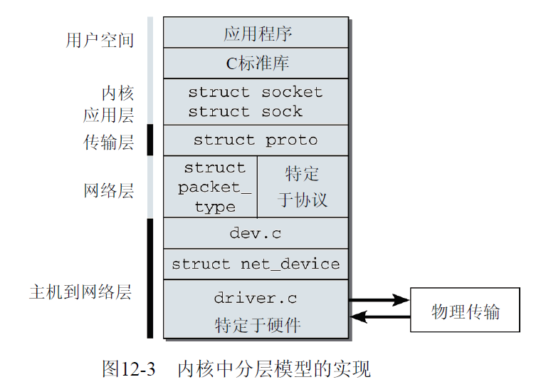
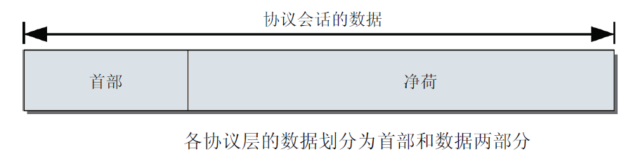
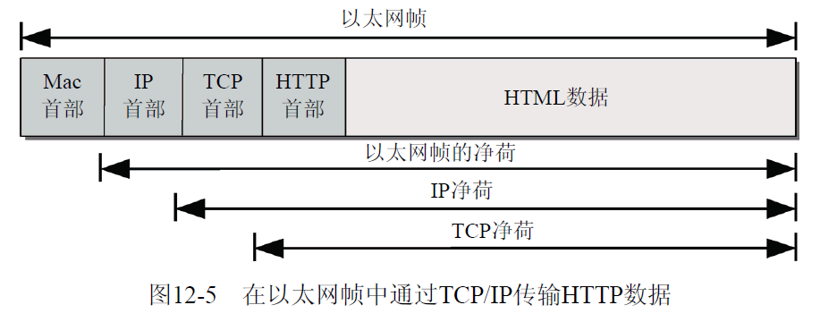

进程虚拟地址空间
=======

| 日期 | 内核版本 | 架构| 作者 | GitHub| CSDN |
| ------- |:-------:|:-------:|:-------:|:-------:|:-------:|
| 2016-06-14 | [Linux-4.7](http://lxr.free-electrons.com/source/?v=4.7) | X86 & arm | [gatieme](http://blog.csdn.net/gatieme) | [LinuxDeviceDrivers](https://github.com/gatieme/LDD-LinuxDeviceDrivers) | [Linux内存管理](http://blog.csdn.net/gatieme/article/category/6225543) |


`Linux`是因特网的产物, 这是无可争议的. 首先, 得感谢因特网通信, Linux的开发过程证明了一个很多人曾持有的观点是荒谬的 : 对分散在世界各地的一组程序员进行项目管理是不可能的. 第一个内核源代码版本是在十多年前通过FTP服务器提供的, 此后网络便成了数据交换的支柱, 无论是概念和代码的开发, 还是内核错误的消除, 都是如此.

内核邮件列表是个活生生的例子, 它几乎没有改变过. 每个人都能够看到最新贡献的代码, 并为促进`Linux`的开发提出自己的意见, 当然, 得假定所表达的意见是合理的. `Linux`对各种网络适应得都很好, 这是可以理解的, 因为它是与因特网共同成长的.

在构成因特网的服务器中, 大部分是运行Linux的计算机. 不出所料, 网络实现是Linux内核中一个关键的部分, 正在获得越来越多的关注. 实际上, Linux不支持的网络方案很少.

网络功能的实现是内核最复杂、牵涉最广的一部分. 除了经典的因特网协议（如TCP、UDP）和相关的IP传输机制之外, Linux还支持许多其他的互联方案，使得所有想得到的计算机/操作系统能够互操作.

`Linux`也支持大量用于数据传输的硬件, 如以太网卡和令牌环网适配器及ISDN卡和调制解调器, 但这并没有使内核的工作变得简单.

尽管如此, `Linux`开发人员提出了一种结构良好得令人惊讶的模型, 统一了各种不同的方法. 虽然本章是本书最长的章之一, 但并没有涵盖网络实现的每个细节. 即使概述一下所有的驱动程序和协议, 也超出了一本书的范围, 由于信息量巨大, 实际上可能需要许多本书. 不算网卡驱动程序, 网络子系统的C语言实现在内核源代码中就占了15MB, 如果将相应的代码打印到纸上要有6000多页. 与网络相关的头文件的数目巨大, 使得内核开发者将这些头文件存储到一个专门的目录`include/net`中, 而不是存储到标准位置`include/linux`. 网络相关的代码中包含了许多概念, 这些形成了网络子系统的逻辑支柱, 我们在本章中最感兴趣的就是这些概念. 我们的讨论主要限于TCP/IP实现, 因为它是目前使用最广泛的网络协议.

当然, 网络子系统的开发, 并不是从头开始的. 在计算机之间交换数据的标准和惯例都已经存在数十年之久, 这些都为大家所熟知且沿用已久. Linux也实现了这些标准, 以连接到其他计算机.


#1	网络实现的分层模型
-------


内核网络子系统的实现与本章开头介绍的TCP/IP参考模型非常相似


相关的C语言代码划分为不同层次，各层次都有明确定义的任务，各个层次只能通过明确定义的接口与上下紧邻的层次通信。这种做法的好处在于，可以组合使用各种设备、传输机制和协议。例如，通常的以太网卡不仅可用于建立因特网（IP）连接，还可以在其上传输其他类型的协议，如Appletalk或IPX，而无须对网卡的设备驱动程序做任何类型的修改。


图12-3说明了内核对这个分层模型的实现




网络子系统是内核中涉及面最广、要求最高的部分之一。为什么是这样呢？答案是，该子系统处理了大量特定于协议的细节和微妙之处，穿越各层的代码路径中有大量的函数指针，而没有直接的函数调用。这是不可避免的，因为各个层次有多种组合方式，这显然不会使代码路径变得更清楚或更易于跟踪。此外，其中涉及的数据结构通常彼此紧密关联。为降低描述上复杂性，下文的内容主要讲述
因特网协议。

分层模型不仅反映在网络子系统的设计上，而且也反映在数据传输的方式上（或更精确地说，对各层产生和传输的数据进行封装的方式）。通常，各层的数据都由首部和数据两部分组成, 如图12-4所示。




首部部分包含了与数据部分有关的元数据（目标地址、长度、传输协议类型等），数据部分包含有用数据（或净荷）。

传输的基本单位是（以太网）帧，网卡以帧为单位发送数据。帧首部部分的主数据项是目标系统的硬件地址，这是数据传输的目的地，通过电缆传输数据时也需要该数据项。

高层协议的数据在封装到以太网帧时，将协议产生的首部和数据二元组封装到帧的数据部分。在因特网网络上，这是互联网络层数据。

因为通过以太网不仅可以传输IP分组，还可以传输其他协议的分组，如Appletalk或IPX分组，接收系统必须能够区分不同的协议类型，以便将数据转发到正确的例程进一步处理。分析数据并查明使用的传输协议是非常耗时的。因此，以太网帧的首部（和所有其他现代网络协议的首部部分）包含了一个标识符，唯一地标识了帧数据部分中的协议类型。这些标识符（用于以太网传输）由一个国际组织（IEEE）分配。


协议栈中的所有协议都有这种划分。为此，传输的每个帧开始都是一系列协议首部，而后才是应用层的数据，如图12-5所示




图12-5清楚地说明了为容纳控制信息所牺牲的部分带宽.


#2	网络命名空间
-------


回想第1章的内容, 我们知道内核的许多部分包含在命名空间中. 这可以建立系统的多个虚拟视图, 并彼此分隔开来. 每个实例看起来像是一台运行Linux的独立机器，但在一台物理机器上，可以同时运行许多这样的实例。在内核版本2.6.24开发期间，内核也开始对网络子系统采用命名空间. 这对该子系统增加了一些额外的复杂性，因为该子系统的所有属性在此前的版本中都是"全局"的，而现在需要按命名空间来管理，例如，可用网卡的数量。对特定的网络设备来说，如果它在一个命名空间中可见，在另一个命名空间中就不一定是可见的.


照例需要一个中枢结构来跟踪所有可用的命名空间, 即`struct net`, 其定义如下

```cpp

```

使网络子系统完全感知命名空间的工作才刚刚开始。读者现在看到的情况，即内核版本2.6.24中的情况，仍然处于开发的早期阶段。因此，随着网络子系统中越来越多的组件从全局管理转换为可感知命名空间的实现，struct net的长度在未来会不断增长。现在，基本的基础设施已经转换完毕。

对网络设备的跟踪已经考虑到命名空间的效应，对最重要的一些协议的命名空间支持也是可用的。由于本书中尚未讨论网络实现的任何具体内容，struct net中引用的结构当然还是未知的（但在本章行文过程中，这一点会逐渐改变）。现在，只需要简要地概述一下，哪些概念是以可感知命名空间的方式进行处理的即可。

*	count是一个标准的使用计数器，在使用特定的net实例前后，需要分别调用辅助函数get_net和put_net. 在count降低到0时，将释放该命名空间，并将其从系统中删除.

*	所有可用的命名空间都保存在一个双链表上，表头是net_namespace_list。list用作链表元素. copy_net_ns函数向该链表添加一个新的命名空间。在用create_new_namespace创建一组新的命名空间时，会自动调用该函数。

*	由于每个命名空间都包含不同的网络设备，这必然会反映到procfs的内容上（参见10.1节）。各命名空间的处理需要三个数据项：/proc/net由proc_net表示，而/proc/net/stats由proc_net_stats表示，proc_net_root指向当前命名空间的procfs实例的根结点，即/proc

*	每个命名空间都可以有一个不同的环回设备，而loopback_dev指向履行该职责的（虚拟）网络设备.

*	网络设备由struct net_device表示。与特定命名空间关联的所有设备都保存在一个双链表上，表头为dev_base_head。各个设备还通过另外两个双链表维护：一个将设备名用作散列键（dev_name_head），另一个将接口索引用作散列键（dev_index_head）。


请注意，术语“设备”和“接口”有细微的差别。设备表示提供物理传输能力的硬件设备，而接口可以是纯虚拟的实体，可能在真正的设备上实现。例如，一个网卡可以提供两个接口。
对我们来说，两个术语的区别不那么重要，在下文中将交替使用这两个术语。
网络子系统的许多组件仍然需要做很多工作才能正确处理命名空间，要使网络子系统能够完全感知命名空间，还有相当长的路要走。例如，内核版本2.6.25（在撰写本章时，仍处于开发中）将开始一些最初的准备工作，以便使特定的协议能够感知到命名空间：

615