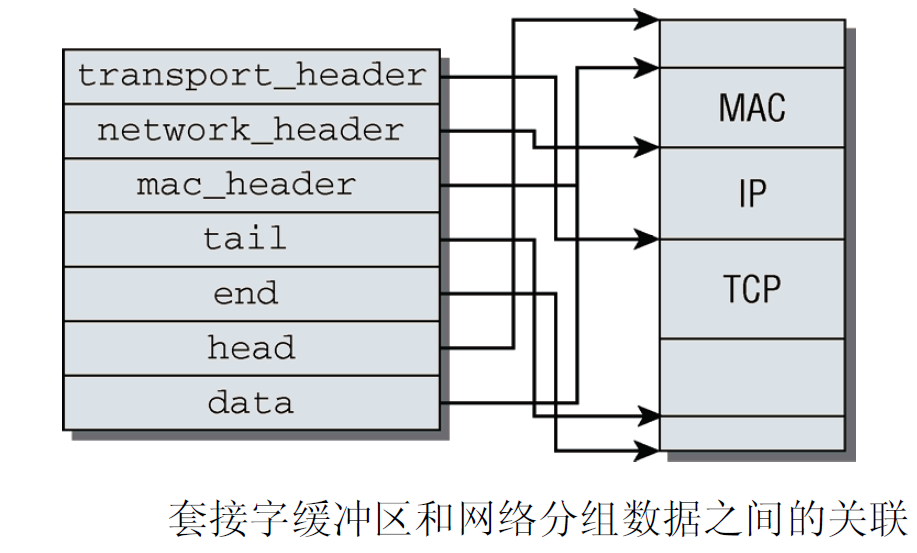
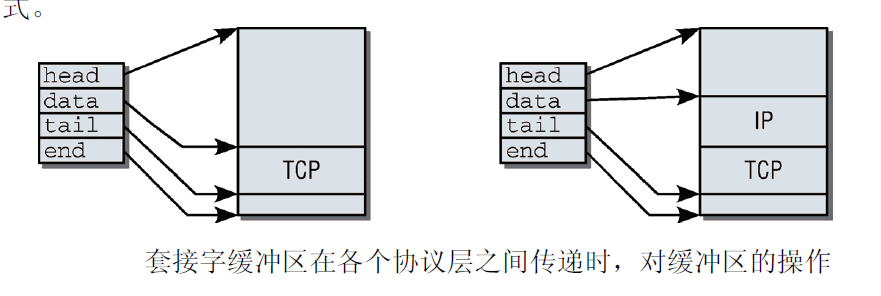
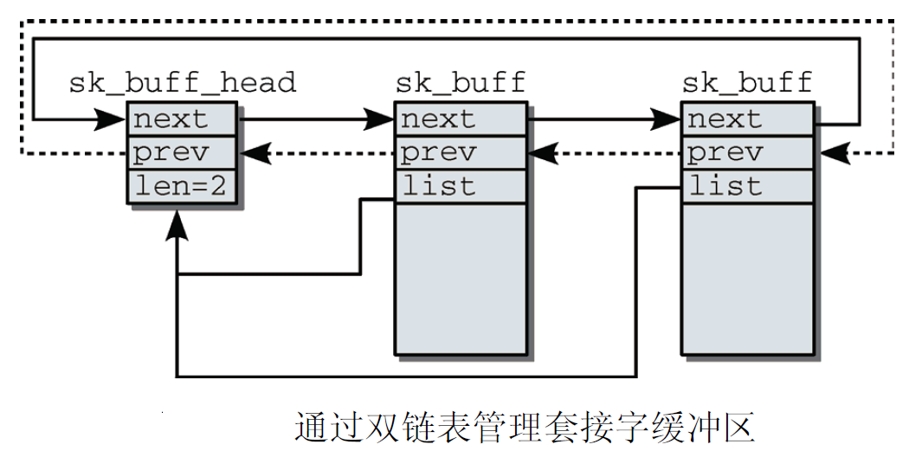

进程虚拟地址空间
=======

| 日期 | 内核版本 | 架构| 作者 | GitHub| CSDN |
| ------- |:-------:|:-------:|:-------:|:-------:|:-------:|
| 2016-06-14 | [Linux-4.7](http://lxr.free-electrons.com/source/?v=4.7) | X86 & arm | [gatieme](http://blog.csdn.net/gatieme) | [LinuxDeviceDrivers](https://github.com/gatieme/LDD-LinuxDeviceDrivers) | [Linux内存管理](http://blog.csdn.net/gatieme/article/category/6225543) |


#1	管理套接字缓冲区数据
-------


在内核分析(收到的)网络分组时, 底层协议的数据将传递到更高的层. 发送数据时顺序相反, 各种协议产生的数据(首部和净荷)依次向更低的层传递, 直至最终发送.


这些操作的速度对网络子系统的性能有决定性的影响, 因此内核使用了一种特殊的结构，称为套接字缓冲区(socket buffer).


#2	套接字缓冲区sk_buff
-------

套接字缓冲区(socket buffer)用struct sk_buff结构来表示, 定义在[`include/linux/skbuff.h?v=4.7, line 626`](http://lxr.free-electrons.com/source/include/linux/skbuff.h?v=4.7#L626)


```cpp
struct sk_buff {
    union {
        struct {
            /* These two members must be first. */
            struct sk_buff      *next;
            struct sk_buff      *prev;

            union {
                ktime_t     tstamp;
                struct skb_mstamp skb_mstamp;
            };
        };
        struct rb_node  rbnode; /* used in netem & tcp stack */
    };
    struct sock         *sk;
    struct net_device       *dev;

    /*
     * This is the control buffer. It is free to use for every
     * layer. Please put your private variables there. If you
     * want to keep them across layers you have to do a skb_clone()
     * first. This is owned by whoever has the skb queued ATM.
     */
    char            cb[48] __aligned(8);

    unsigned long       _skb_refdst;
    void            (*destructor)(struct sk_buff *skb);
#ifdef CONFIG_XFRM
    struct  sec_path    *sp;
#endif
#if defined(CONFIG_NF_CONNTRACK) || defined(CONFIG_NF_CONNTRACK_MODULE)
    struct nf_conntrack     *nfct;
#endif
#if IS_ENABLED(CONFIG_BRIDGE_NETFILTER)
    struct nf_bridge_info   *nf_bridge;
#endif
    unsigned int        len,
                data_len;
    __u16           mac_len,
                hdr_len;

    /* Following fields are _not_ copied in __copy_skb_header()
     * Note that queue_mapping is here mostly to fill a hole.
     */
    kmemcheck_bitfield_begin(flags1);
    __u16           queue_mapping;
    __u8            cloned:1,
                nohdr:1,
                fclone:2,
                peeked:1,
                head_frag:1,
                xmit_more:1;
    /* one bit hole */
    kmemcheck_bitfield_end(flags1);

    /* fields enclosed in headers_start/headers_end are copied
     * using a single memcpy() in __copy_skb_header()
     */
    /* private: */
    __u32           headers_start[0];
    /* public: */

/* if you move pkt_type around you also must adapt those constants */
#ifdef __BIG_ENDIAN_BITFIELD
#define PKT_TYPE_MAX    (7 << 5)
#else
#define PKT_TYPE_MAX    7
#endif
#define PKT_TYPE_OFFSET()       offsetof(struct sk_buff, __pkt_type_offset)

    __u8            __pkt_type_offset[0];
    __u8            pkt_type:3;
    __u8            pfmemalloc:1;
    __u8            ignore_df:1;
    __u8            nfctinfo:3;

    __u8            nf_trace:1;
    __u8            ip_summed:2;
    __u8            ooo_okay:1;
    __u8            l4_hash:1;
    __u8            sw_hash:1;
    __u8            wifi_acked_valid:1;
    __u8            wifi_acked:1;

    __u8            no_fcs:1;
    /* Indicates the inner headers are valid in the skbuff. */
    __u8            encapsulation:1;
    __u8            encap_hdr_csum:1;
    __u8            csum_valid:1;
    __u8            csum_complete_sw:1;
    __u8            csum_level:2;
    __u8            csum_bad:1;

#ifdef CONFIG_IPV6_NDISC_NODETYPE
    __u8            ndisc_nodetype:2;
#endif
    __u8            ipvs_property:1;
    __u8            inner_protocol_type:1;
    __u8            remcsum_offload:1;
    /* 3 or 5 bit hole */

#ifdef CONFIG_NET_SCHED
    __u16           tc_index;       /* traffic control index */
#ifdef CONFIG_NET_CLS_ACT
    __u16           tc_verd;    /* traffic control verdict */
#endif
#endif

    union {
        __wsum      csum;
        struct {
            __u16   csum_start;
            __u16   csum_offset;
        };
    };
    __u32           priority;
    int             skb_iif;
    __u32           hash;
    __be16          vlan_proto;
    __u16           vlan_tci;
#if defined(CONFIG_NET_RX_BUSY_POLL) || defined(CONFIG_XPS)
    union {
        unsigned int    napi_id;
        unsigned int    sender_cpu;
    };
#endif
    union {
#ifdef CONFIG_NETWORK_SECMARK
        __u32       secmark;
#endif
#ifdef CONFIG_NET_SWITCHDEV
        __u32       offload_fwd_mark;
#endif
    };

    union {
        __u32       mark;
        __u32       reserved_tailroom;
    };

    union {
        __be16      inner_protocol;
        __u8        inner_ipproto;
    };

    __u16           inner_transport_header;
    __u16           inner_network_header;
    __u16           inner_mac_header;

    __be16          protocol;
    __u16           transport_header;
    __u16           network_header;
    __u16           mac_header;

    /* private: */
    __u32           headers_end[0];
    /* public: */

    /* These elements must be at the end, see alloc_skb() for details.  */
    sk_buff_data_t      tail;
    sk_buff_data_t      end;
    unsigned char       *head,
                *data;
    unsigned int        truesize;
    atomic_t        users;
};
```

套接字缓冲区用于在网络实现的各个层次之间交换数据, 而无须来回复制分组数据, 对性能的提高很可观. 套接字结构是网络子系统的基石之一, 因为在产生和分析分组时，在各个协议层次上都需要处理该结构.


#3	使用套接字缓冲区管理数据
-------


套接字缓冲区通过其中包含的各种指针与一个内存区域相关联, 网络分组的数据就位于该区域中. 假定我们使用的是32位系统(在64位机器上, 套接字缓冲区的组织稍有不同, 读者稍后就会看到).


```cpp
struct sk_buff
{
	/*  ......  */
    __u16           inner_transport_header;
    __u16           inner_network_header;
    __u16           inner_mac_header;

    __be16          protocol;
    __u16           transport_header;
    __u16           network_header;
    __u16           mac_header;

    /* private: */
    __u32           headers_end[0];
    /* public: */

    /* These elements must be at the end, see alloc_skb() for details.
     *  这些成员必须在末尾，详见alloc_skb()  */
    sk_buff_data_t      tail;
    sk_buff_data_t      end;
    unsigned char       *head,
                *data;
    unsigned int        truesize;
    atomic_t        users;
};
```




套接字缓冲区的基本思想是, 通过操作指针来增删协议首部.

| 字段 | 描述 |
|:-----:|:-----:|
| `head`和`end` |指向数据在内存中的起始和结束位置 |
| `data`和`tail` | 指向协议数据区域的起始和结束位置 |

>这个区域可能大于实际需要的长度，因为在产生分组时，尚不清楚分组的长度.


| 字段 | 描述 |
|:-----:|:-----:|
|`mac_header` | 指向MAC协议首部的起始. |
| `network_header` | 指向网络层协议首部的起始. |
| `transport_header`  | 指向传输层协议首部的起始 |


在字长32位的系统上，数据类型sk_buff_data_t用来表示各种类型为简单指针的数据, 定义在[`include/linux/skbuff.h?v=4.7, line 626`](http://lxr.free-electrons.com/source/include/linux/skbuff.h?v=4.7#L626), 在64位 CPU上, 可使用一点小技巧来节省一些空间。sk_buff_data_t的定义改为整型变量

```cpp
#ifdef NET_SKBUFF_DATA_USES_OFFSET
typedef unsigned int sk_buff_data_t;
#else
typedef unsigned char *sk_buff_data_t;
#endif
```

套接字缓冲区需要很多指针来表示缓冲区中内容的不同部分. 由于网络子系统必须保证较低的内存占用和较高的处理速度, 因而对struct sk_buff来说，我们需要保持该结构的长度尽可能小.


`data`和`head`是常规的指针, 而所有`sk_buff_data_t`类型的成员现在都解释为相对于前两者的偏移量.


这使得内核可以将套接字缓冲区用于所有协议类型。正确地解释数据需要做简单的类型转换, 为此提供了几个辅助函数. 例如，套接字缓冲区可以包含TCP或UDP分组. 来自传输层协议首部的对应信息分别可以用tcp_hdr和udp_hdr提取. 这两个函数都将原始指针(raw pointer)转换为某种适当的数据类型。其他传输层协议也提供了形如XXX_hdr的辅助函数, 这类函数需要一个指向
`struct sk_buff`的指针作为参数, 并返回重新解释的传输首部数据.


例如,  观察如何从套接字缓冲区获取TCP首部, 该功能由tcp_hdr函数来完成. 定义在[include/linux/tcp.h?v=4.7, line 27](http://lxr.free-electrons.com/source/include/linux/tcp.h?v=4.7#L27)


在64位处理器的体系结构上, 整型变量占用的内存只有指针变量的一半(前者是4字节, 后者是8字节), 该结构的长度缩减了20字节, 但套接字缓冲区中包含的信息仍然是同样的

```cpp
static inline struct tcphdr *tcp_hdr(const struct sk_buff *skb)
{
    return (struct tcphdr *)skb_transport_header(skb);
}
```


`struct tcphdr`是一个结构, 包含了TCP首部中的所有字段.

还有其他类似的转换函数供网络子系统使用. 对我们来说, ip_hdr是最重要的，它用于解释一个IP分组的内容.

`data`和`tail`使得在不同协议层之间传递数据时, 无须显式的复制操作





在一个新分组产生时, TCP层首先在用户空间中分配内存来容纳该分组数据(首部和净荷). 分配的空间大于数据实际需要的长度，因此较低的协议层可以进一步增加首部.

分配一个套接字缓冲区, 使得head和end分别指向上述内存区的起始和结束地址，而TCP数据位于`data`和`tail`之间

在套接字缓冲区传递到互联网络层时, 必须增加一个新层. 只需要向已经分配但尚未占用的那部分内存空间写入数据即可, 除了`data`之外所有的指针都不变，`data`现在指向IP首部的起始处.

下面的各层会重复同样的操作，直至分组完成，即将通过网络发送.

对接收的分组进行分析的过程是类似的。分组数据复制到内核分配的一个内存区中，并在整个分析期间一直处于该内存区中。与该分组相关联的套接字缓冲区在各层之间顺序传递，各层依次将其中的各个指针设置为正确值.

内核提供了一些用于操作套接字缓冲区的标准函数


| 函数 | 语 义 |
|:-----:|:------:|
| alloc_skb | 分配一个新的sk_buff实例 |
| skb_copy | 创建套接字缓冲区和相关数据的一个副本 |
| skb_clone | 创建套接字缓冲区的一个副本，但原本和副本将使用同一分组数据 |
| skb_tailroom | 返回数据末端空闲空间的长度 |
| skb_headroom | 返回数据起始处空闲空间的长度 |
| skb_realloc_headroom | 在数据起始处创建更多的空闲空间. 现存数据不变 |


指向传输层首部的指针现在计算如下, 定义在[include/linux/skbuff.h?v=4.7, line 2109](http://lxr.free-electrons.com/source/include/linux/skbuff.h?v=4.7#L2109)

```cpp
static inline unsigned char *skb_transport_header(const struct sk_buff *skb)
{
    return skb->head + skb->transport_header;
}
```

这种做法是有效的, 因为4字节偏移量足以描述长达4GB的内存区, 套接字缓冲区不可能超过这个长度.

由于假定套接字缓冲区的内部表示对通用网络代码是不可见的，所以提供了如下几个辅助函数来访问struct sk_buff的成员. 这些函数都定义在<skbuff.h>中，编译时会自动选择其中适当的变体使用


| 函数 | 描述 |
|:-----:|:-----:|
| skb_transport_header(const struct sk_buff *skb) | 从给定的套接字缓冲区获取传输层首部的地址. |
| skb_reset_transport_header(struct sk_buff *skb) | 将传输层首部重置为数据部分的起始位置. |
| skb_set_transport_header(struct sk_buff *skb, const int offset) | 根据数据部分中给定的偏移量来设置传输层首部的起始地址 |


对MAC层和网络层首部来说，也有同样一组函数可用，只需将transport分别替换为mac或network即可.


#4	管理套接字缓冲区数据
-------

套接字缓冲区结构不仅包含上述指针，还包括用于处理相关的数据和管理套接字缓冲区自身的其他成员.

其中不常见的成员在本章中遇到时才会讨论。下面列出的是一些最重要的成员。

*	`tstamp`保存了分组到达的时间。

*	`dev`指定了处理分组的网络设备. `dev`在处理分组的过程中可能会改变, 例如, 在未来某个时候, 分组可能通过计算机的另一个设备发出。

*	输入设备的接口索引号总是保存在iif中. 12.7.1节会解释如何使用该编号。

*	sk是一个指针，指向用于处理该分组的套接字对应的socket实例（参见12.10.1节）。

*	dst表示接下来该分组通过内核网络实现的路由。这里使用了一个特殊的格式

*	next和prev用于将套接字缓冲区保存到一个双链表中。这里没有使用内核的标准链表实现, 而是使用了一个手工实现的版本.


使用了一个表头来实现套接字缓冲区的等待队列. 其结构定义如下


```cpp
struct sk_buff_head {
    /* These two members must be first.
     *  这两个成员必须在最前面  */
    struct sk_buff  *next;
    struct sk_buff  *prev;

    __u32       qlen;
    spinlock_t      lock;
};
```

| 字段 | 描述 |
| qlen |指定了等待队列的长度，即队列中成员的数目 |
| next和prev | 用于创建一个循环双链表，套接字缓冲区的list成员指回到表头 

分组通常放置在等待队列中，例如分组等待处理时，或需要重新组合已经分析过的分组时.


