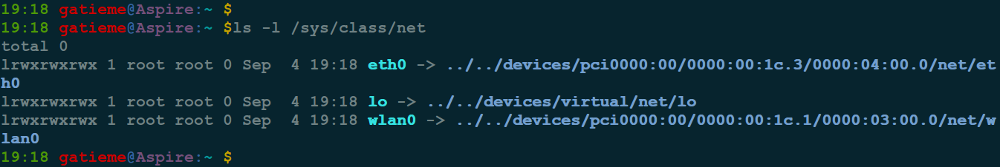

进程虚拟地址空间
=======

| 日期 | 内核版本 | 架构| 作者 | GitHub| CSDN |
| ------- |:-------:|:-------:|:-------:|:-------:|:-------:|
| 2016-06-14 | [Linux-4.7](http://lxr.free-electrons.com/source/?v=4.7) | X86 & arm | [gatieme](http://blog.csdn.net/gatieme) | [LinuxDeviceDrivers](https://github.com/gatieme/LDD-LinuxDeviceDrivers) | [Linux内存管理](http://blog.csdn.net/gatieme/article/category/6225543) |


#1	网络访问层
-------

前面讲述了Linux内核中网络子系统的结构, 现在我们把注意力转向**网络实现的第一层, 即网络访问层**. 该层主要负责在计算机之间传输信息，与网卡的设备驱动程序直接协作.

本节不会讨论网卡驱动程序的实现和相关的问题, 因为其中采用的方法与第6章的描述仅稍有不同. 本节将详细介绍由各个网卡驱动程序提供、由网络实现代码使用的接口，它们提供了硬件的抽象视图.

这里根据以太网帧来解释如何在"线上"(on the cable)表示数据，并描述接收到一个分组之后, 将该分组传递到更高层之前，需要完成哪些步骤.

#2	网络设备的表示
-------

在内核中, 每个网络设备都表示为`net_device`结构的一个实例. 在分配并填充该结构的一个实例之后, 必须用`net/core/dev.c`中的`register_netdev`函数将其注册到内核. 该函数完成一些初始化任务, 并将该设备注册到通用设备机制内. 这会创建一个`sysfs`项`/sys/class/net/<device>`, 关联到该设备对应的目录. 如果系统包含一个PCI网卡和一个环回接口设备，则在`/sys/class/net`中有两个对应项:





##2.1	数据结构
-------

在详细讨论`struct net_device`的内容之前, 先阐述一下内核如何跟踪可用的网络设备, 以及如何查找特定的网络设备. 照例. 这些设备不是全局的, 而是按命名空间进行管理的. 回想一下,每个命名空间(`net`实例)中有如下3个机制可用

*	所有的网络设备都保存在一个单链表中,表头为dev_base

*	按设备名散列. 辅助函数`dev_get_by_name(struct net * net, const char * name)`根据设备名在该散列表上查找网络设备

*	按接口索引散列。辅助函数`dev_get_by_index(struct net * net, int ifindex)`根据给定的接口索引查找`net_device`实例. `net_device`结构包含了与特定设备相关的所有信息. 该结构的定义有200多行代码, 是内核中最庞大的结构. 因为该结构中有很多细节,所以,尽管下文给出的版本经过了大量的简化,仍然相当长

###2.1.1	net_device结构体定义
-------

`net_device`结构定义在[`include/linux/netdevice.h, line 1607`](http://lxr.free-electrons.com/source/include/linux/netdevice.h#L1607)


```cpp
struct net_device {
    char            name[IFNAMSIZ];
    struct hlist_node       name_hlist;
    char            *ifalias;
    /*
     *      I/O specific fields
     *      FIXME: Merge these and struct ifmap into one
     */
    unsigned long       mem_end;
    unsigned long       mem_start;
    unsigned long       base_addr;
    int             irq;

    atomic_t        carrier_changes;

    /*
     *      Some hardware also needs these fields (state,dev_list,
     *      napi_list,unreg_list,close_list) but they are not
     *      part of the usual set specified in Space.c.
     */

    unsigned long       state;

    struct list_head    dev_list;
    struct list_head    napi_list;
    struct list_head    unreg_list;
    struct list_head    close_list;
    struct list_head    ptype_all;
    struct list_head    ptype_specific;

    struct {
        struct list_head upper;
        struct list_head lower;
    } adj_list;

    struct {
        struct list_head upper;
        struct list_head lower;
    } all_adj_list;

    netdev_features_t       features;
    netdev_features_t       hw_features;
    netdev_features_t       wanted_features;
    netdev_features_t       vlan_features;
    netdev_features_t       hw_enc_features;
    netdev_features_t       mpls_features;
    netdev_features_t       gso_partial_features;

    int             ifindex;
    int             group;

    struct net_device_stats stats;

    atomic_long_t       rx_dropped;
    atomic_long_t       tx_dropped;
    atomic_long_t       rx_nohandler;

#ifdef CONFIG_WIRELESS_EXT
    const struct iw_handler_def *wireless_handlers;
    struct iw_public_data   *wireless_data;
#endif
    const struct net_device_ops *netdev_ops;
    const struct ethtool_ops *ethtool_ops;
#ifdef CONFIG_NET_SWITCHDEV
    const struct switchdev_ops *switchdev_ops;
#endif
#ifdef CONFIG_NET_L3_MASTER_DEV
    const struct l3mdev_ops *l3mdev_ops;
#endif

    const struct header_ops *header_ops;

    unsigned int        flags;
    unsigned int        priv_flags;

    unsigned short      gflags;
    unsigned short      padded;

    unsigned char       operstate;
    unsigned char       link_mode;

    unsigned char       if_port;
    unsigned char       dma;

    unsigned int        mtu;
    unsigned short      type;
    unsigned short      hard_header_len;

    unsigned short      needed_headroom;
    unsigned short      needed_tailroom;

    /* Interface address info. */
    unsigned char       perm_addr[MAX_ADDR_LEN];
    unsigned char       addr_assign_type;
    unsigned char       addr_len;
    unsigned short      neigh_priv_len;
    unsigned short      dev_id;
    unsigned short      dev_port;
    spinlock_t          addr_list_lock;
    unsigned char       name_assign_type;
    bool            uc_promisc;
    struct netdev_hw_addr_list      uc;
    struct netdev_hw_addr_list      mc;
    struct netdev_hw_addr_list      dev_addrs;

#ifdef CONFIG_SYSFS
    struct kset         *queues_kset;
#endif
    unsigned int        promiscuity;
    unsigned int        allmulti;


    /* Protocol-specific pointers */

#if IS_ENABLED(CONFIG_VLAN_8021Q)
    struct vlan_info __rcu  *vlan_info;
#endif
#if IS_ENABLED(CONFIG_NET_DSA)
    struct dsa_switch_tree  *dsa_ptr;
#endif
#if IS_ENABLED(CONFIG_TIPC)
    struct tipc_bearer __rcu *tipc_ptr;
#endif
    void            *atalk_ptr;
    struct in_device __rcu  *ip_ptr;
    struct dn_dev __rcu     *dn_ptr;
    struct inet6_dev __rcu  *ip6_ptr;
    void            *ax25_ptr;
    struct wireless_dev     *ieee80211_ptr;
    struct wpan_dev     *ieee802154_ptr;
#if IS_ENABLED(CONFIG_MPLS_ROUTING)
    struct mpls_dev __rcu   *mpls_ptr;
#endif

/*
 * Cache lines mostly used on receive path (including eth_type_trans())
 */
    unsigned long       last_rx;

    /* Interface address info used in eth_type_trans() */
    unsigned char       *dev_addr;

#ifdef CONFIG_SYSFS
    struct netdev_rx_queue  *_rx;

    unsigned int        num_rx_queues;
    unsigned int        real_num_rx_queues;
#endif

    unsigned long       gro_flush_timeout;
    rx_handler_func_t __rcu *rx_handler;
    void __rcu          *rx_handler_data;

#ifdef CONFIG_NET_CLS_ACT
    struct tcf_proto __rcu  *ingress_cl_list;
#endif
    struct netdev_queue __rcu *ingress_queue;
#ifdef CONFIG_NETFILTER_INGRESS
    struct list_head    nf_hooks_ingress;
#endif

    unsigned char       broadcast[MAX_ADDR_LEN];
#ifdef CONFIG_RFS_ACCEL
    struct cpu_rmap     *rx_cpu_rmap;
#endif
    struct hlist_node       index_hlist;

/*
 * Cache lines mostly used on transmit path
 */
    struct netdev_queue     *_tx ____cacheline_aligned_in_smp;
    unsigned int        num_tx_queues;
    unsigned int        real_num_tx_queues;
    struct Qdisc        *qdisc;
    unsigned long       tx_queue_len;
    spinlock_t          tx_global_lock;
    int             watchdog_timeo;

#ifdef CONFIG_XPS
    struct xps_dev_maps __rcu *xps_maps;
#endif
#ifdef CONFIG_NET_CLS_ACT
    struct tcf_proto __rcu  *egress_cl_list;
#endif
#ifdef CONFIG_NET_SWITCHDEV
    u32             offload_fwd_mark;
#endif

    /* These may be needed for future network-power-down code. */
    struct timer_list       watchdog_timer;

    int __percpu        *pcpu_refcnt;
    struct list_head    todo_list;

    struct list_head    link_watch_list;

    enum { NETREG_UNINITIALIZED=0,
           NETREG_REGISTERED,       /* completed register_netdevice */
           NETREG_UNREGISTERING,    /* called unregister_netdevice */
           NETREG_UNREGISTERED,     /* completed unregister todo */
           NETREG_RELEASED,     /* called free_netdev */
           NETREG_DUMMY,        /* dummy device for NAPI poll */
    } reg_state:8;

    bool dismantle;

    enum {
        RTNL_LINK_INITIALIZED,
        RTNL_LINK_INITIALIZING,
    } rtnl_link_state:16;

    void (*destructor)(struct net_device *dev);

#ifdef CONFIG_NETPOLL
    struct netpoll_info __rcu       *npinfo;
#endif

    possible_net_t          nd_net;

    /* mid-layer private */
    union {
        void                    *ml_priv;
        struct pcpu_lstats __percpu         *lstats;
        struct pcpu_sw_netstats __percpu    *tstats;
        struct pcpu_dstats __percpu         *dstats;
        struct pcpu_vstats __percpu         *vstats;
    };

    struct garp_port __rcu  *garp_port;
    struct mrp_port __rcu   *mrp_port;

    struct device       dev;
    const struct attribute_group *sysfs_groups[4];
    const struct attribute_group *sysfs_rx_queue_group;

    const struct rtnl_link_ops *rtnl_link_ops;

    /* for setting kernel sock attribute on TCP connection setup */
#define GSO_MAX_SIZE        65536
    unsigned int        gso_max_size;
#define GSO_MAX_SEGS        65535
    u16             gso_max_segs;

#ifdef CONFIG_DCB
    const struct dcbnl_rtnl_ops *dcbnl_ops;
#endif
    u8              num_tc;
    struct netdev_tc_txq    tc_to_txq[TC_MAX_QUEUE];
    u8              prio_tc_map[TC_BITMASK + 1];

#if IS_ENABLED(CONFIG_FCOE)
    unsigned int        fcoe_ddp_xid;
#endif
#if IS_ENABLED(CONFIG_CGROUP_NET_PRIO)
    struct netprio_map __rcu *priomap;
#endif
    struct phy_device       *phydev;
    struct lock_class_key   *qdisc_tx_busylock;
    bool            proto_down;
};
```


该结构中出现的缩写`rx`和`tx`会经常用于函数名、变量名和注释中. 二者分别是`Receive`和`Transmit`的缩写,即接收和发送,在以后几节里会反复出现.


###2.1.2	常见设备类别
-------

网络设备的名称存储在`name`中. 它是一个字符串, 末尾的数字用于区分同一类型的多个适配器(如系统有两个以太网卡).


下表列出了最常见的设备类别

| 名称 | 设备类别 |
|:---:|:-------:|
| ethX | 以太网适配器,无论电缆类型和传输速度如何 |
| pppX | 通过调制解调器建立的PPP连接 |
| isdnX | ISDN卡 |
| atmX | 异步传输模式(asynchronous transfer mode),高速网卡的接口 |
| lo | 环回(loopback)设备,用于与本地计算机通信 |


例如, 在使用`ifconfig`设置参数时, 会使用网卡的符号名.

在内核中, 每个网卡都有唯一索引号, 在注册时动态分配保存在`ifindex`成员中.

内核提供了[`dev_get_by_name`](http://lxr.free-electrons.com/source/net/core/dev.c?v=4.7#L775)和[`dev_get_by_index`](http://lxr.free-electrons.com/source/net/core/dev.c?v=4.7#L849)函数, 用于根据网卡的名称或索引号来查找其`net_device`实例.


###2.1.3	设备属性
-------

一些结构成员定义了与网络层和网络访问层相关的设备属性.

| 字段 | 描述 |
|:---:|:----:|
| [mtu](http://lxr.free-electrons.com/source/include/linux/netdevice.h?v=4.7#L1691) | (maximum transfer unit,最大传输单位)指定一个传输帧的最大长度。网络层的协议必须遵守该值的限制,可能需要将分组拆分为更小的单位 |
| [type](http://lxr.free-electrons.com/source/include/linux/netdevice.h?v=4.7#L1692) | 保存设备的硬件类型,它使用的是 <if_arp.h> 中定义的常数.<br>例如, ARPHRD_ETHER和ARPHDR_IEEE802 分别表示10兆以太网和802.2以太网, ARPHRD_APPLETLK 表示AppleTalk,而ARPHRD_LOOPBACK 表示环回设备 |
| [dev_addr](http://lxr.free-electrons.com/source/include/linux/netdevice.h?v=4.7#L1701) | 存储设备的硬件地址(如以太网卡的MAC地址),而 addr_len 指定该地址的长度 |
| broadcast | 是用于向附接的所有站点发送消息的广播地址 |


ip_ptr 、 ip6_ptr 、 atalk_ptr 等指针指向特定于协议的数据,通用代码不会操作这些数据, 他们定义在[include/linux/netdevice.h?v=4.7, line 1721](http://lxr.free-electrons.com/source/include/linux/netdevice.h?v=4.7#L1721)

```cpp
struct net_device
{
/* Protocol-specific pointers */
#if IS_ENABLED(CONFIG_VLAN_8021Q)
    struct vlan_info __rcu  *vlan_info;
#endif
#if IS_ENABLED(CONFIG_NET_DSA)
    struct dsa_switch_tree  *dsa_ptr;
#endif
#if IS_ENABLED(CONFIG_TIPC)
    struct tipc_bearer __rcu *tipc_ptr;
#endif
    void            *atalk_ptr;
    struct in_device __rcu  *ip_ptr;
    struct dn_dev __rcu     *dn_ptr;
    struct inet6_dev __rcu  *ip6_ptr;
    void            *ax25_ptr;
    struct wireless_dev     *ieee80211_ptr;
    struct wpan_dev     *ieee802154_ptr;
#if IS_ENABLED(CONFIG_MPLS_ROUTING)
    struct mpls_dev __rcu   *mpls_ptr;
#endif
};
```


##2.2	函数指针操作接口
-------

`net_device`结构的大多数成员都是函数指针,执行与网卡相关的典型任务. 尽管不同适配器的实现各有不同,但调用的语法(和执行的任务)总是相同的. 因而这些成员表示了与下一个协议层次的抽象接口. 这些接口使得内核能够用同一组接口函数来访问所有的网卡, 而网卡的驱动程序负责实现细节.

###2.2.1	net_device中的函数指针成员
-------


```cpp
//  http://lxr.free-electrons.com/source/include/linux/netdevice.h#L1668
struct net_device
{
    const struct net_device_ops *netdev_ops;
    const struct ethtool_ops *ethtool_ops;
#ifdef CONFIG_NET_SWITCHDEV
    const struct switchdev_ops *switchdev_ops;
#endif
#ifdef CONFIG_NET_L3_MASTER_DEV
    const struct l3mdev_ops *l3mdev_ops;
#endif

    const struct header_ops *header_ops;
};
```

###2.2.2	net_device_ops基本函数操作
-------


其中`net_device_ops`函数中提供了最基本的`net_device`操作接口, 这些函数指针成员变量的命名都以`ndo_`开头, 定义在[`include/linux/netdevice.h, line 1104`](http://lxr.free-electrons.com/source/include/linux/netdevice.h#L1104)


| 函数 | 描述 |
|:---:|:----:|
| ndo_open 和 ndo_stop | 分别初始化和终止网卡。这些操作通常在内核外部通过调用ifconfig命令触发<br>open负责初始化硬件寄存器并注册系统资源,如中断、DMA、IO端口等<br> close 释放这些资源,并停止传输 |
| ndo_start_xmit | 用于从等待队列删除已经完成的分组并将其发送出去 |
| ndo_get_stats | 查询统计数据,并将数据封装到一个类型为`net_device_stats`的结构中返回. 该结构的成员有20多个, 都是一些数值, 如发送、接收、出错、丢弃的分组的数目等. (统计学爱好者可用 ifconfig 和 netstat -i 查询这些数据)<br>因为`net_device`结构没有提供存储`net_device_stats`对象的专用字段,各个设备驱动程序必须在私有数据区保存该对象 |
| ndo_tx_timeout | 调用`tx_timeout`来解决分组传输失败的问题 |
| ndo_do_ioctl |将特定于设备的命令发送到网卡。
| ndo_change_mtu | 是由`eth_change_mtu`实现的,负责修改最大传输单位. 以太网的默认值是1.5KB, 其他传输技术各有不同的默认值. 在某些情况下, 增大/减小该值是有用的. 但许多网卡不允许这样做,只支持默认的硬件设置 |

有些函数通常不是由特定于驱动程序的代码来实现的,它们对所有的以太网卡都是相同的. 因而内核提供了默认实现(在 [`net/ethernet/eth.c`](http://lxr.free-electrons.com/source/net/ethernet/eth.c?v=4.7)中)


可以将一个ioctl应用到套接字的文件描述符, 从用户空间修改对应的网络设备的配置. 必须指定`sockios.h`中定义的某个符号常数, 表明修改配置的哪一部分. 例如, SIOCGIFHWADDR负责设置网卡的硬件地址, 内核最终将该任务委派给`net_device`实例的`set_mac_address`函数. 设备相关的常数会传递给`do_ioctl`函数处理. 由于有许多调节选项,具体的实现非常冗长,我们对此也不是特别感兴趣,就不在这里讨论了.

网络设备分两个方向工作, 即发送和接收(这两个方向通常称为下向流和上向流). 内核源代码包含了两个驱动程序框架( `drivers/net`中的`isa-skeleton.c`和`pci-skeleton.c`), 可用作网络驱动程序的模板. 在下文中, 主要关注驱动程序与硬件的交互, 但又不想局限于某种特定的专有网卡类型时, 偶尔会引用这两个驱动程序. 与对硬件进行编程相比,我们对内核与硬件通信所用的接口更感兴趣, 这也是我们在下文详细介绍这些接口的原因. 下面将介绍如何将网络设备注册到内核中.


###2.2.3	header_ops操作硬件首部
-------


`net_device->header_ops`数接口对象是一个指向`struct header_ops`构的指针,该结构提供了更多的函数指针, 用于操作硬件首部. 该结构定义在[`include/linux/netdevice.h?V=4.7, line 261`](http://lxr.free-electrons.com/source/include/linux/netdevice.h?V=4.7#L261)

```cpp
struct header_ops {
    int     (*create) (struct sk_buff *skb, struct net_device *dev,
               unsigned short type, const void *daddr,
               const void *saddr, unsigned int len);
    int     (*parse)(const struct sk_buff *skb, unsigned char *haddr);
    int     (*cache)(const struct neighbour *neigh, struct hh_cache *hh, __be16 type);
    void    (*cache_update)(struct hh_cache *hh,
                const struct net_device *dev,
                const unsigned char *haddr);
    bool    (*validate)(const char *ll_header, unsigned int len);
};

```


其中最重要的是`header_ops->create`和`header_ops->parse`, 前者创建一个新的硬件首部, 后者分析一个给定的硬件首部

*	header_ops->create 的默认实现是`eth_header`该函数为现存的分组数据生成网络访问层首部.

*	header_ops->parse(通常由eth_header_parse实现)获取给定的分组的源硬件地址.

##2.3	注册网络设备
-------

每个网络设备都按照如下过程注册.

1.	`alloc_netdev`分配一个新的`struct net_device`实例,一个特定于协议的函数用典型值填充该结构. 对于以太网设备,该函数是`ether_setup`. 其他的协议(这里不详细介绍)会使用形如`XXX_setup`的函数, 其中 XXX可以是`fddi(fiber distributed data interface`, 光纤分布式数据接口)、tr
(`token ring`,令牌环网)、 `ltalk`(指`Apple LocalTalk`)、 `hippi`(`high-performance parallel interface`, 高性能并行接口)或`fc` (`fiber channel`, 光纤通道)

	内核中的一些伪设备在不绑定到硬件的情况下实现了特定的接口,它们也使用了`net_device`框架. 例如, ppp_setup 根据PPP协议初始化设备。内核源代码中还可以找到几个 XXX_setup 函数

2.	在`struct net_device`填充完毕后, 需要用 `register_netdev`或`register_netdevice`注册.
这两个函数的区别在于, `register_netdev`可处理用作 接口名称的格式串(有限). 在`net_device->dev`中给出的名称可以包含格式说明符%d. 在设备注册时, 内核会选择一个唯一的数字来代替%d.
	例如, 以太网设备可以指定`eth%d`, 而内核随后会创建设备eth0、eth1 ......


便捷函数`alloc_etherdev(sizeof_priv)`分配一个`struct net_device`实例, 外加`sizeof_priv`字节私有数据区. 回想前文可知, `net_device->priv`是一个指针, 指向与设备相关联的特定于驱动程序的数据. 此外, 还调用了上面提到的`ether_setup`来设置特定于以太网的标准值.

`register_netdevice`的各个处理步骤概括为图12-9中的代码流程图


如果`net_device->init`提供了特定于设备的初始化函数,那么内核在进一步处理之前, 将先调用该函数.

由`dev_new_index`生成在所属命名空间中唯一标识该设备的接口索引。该索引保存在	net_device->ifindex`中. 在确保所选择的名称尚未使用, 而且没有指定自相矛盾的设备特性(所支持特性的列表, 请参见`<netdevice.h>`中的 NETIF_F_* )后, 用`netdev_register_kobject`将新设备添加到通用内核对象模型中. 该函数还会创建上文提到的sysfs项. 最后,该设备集成到特定命名空间的链表中, 以及以设备名和接口索引为散列键的两个散列表中.


