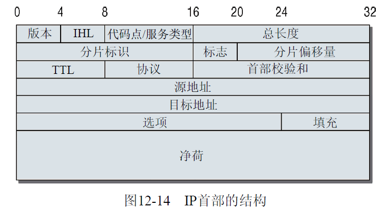
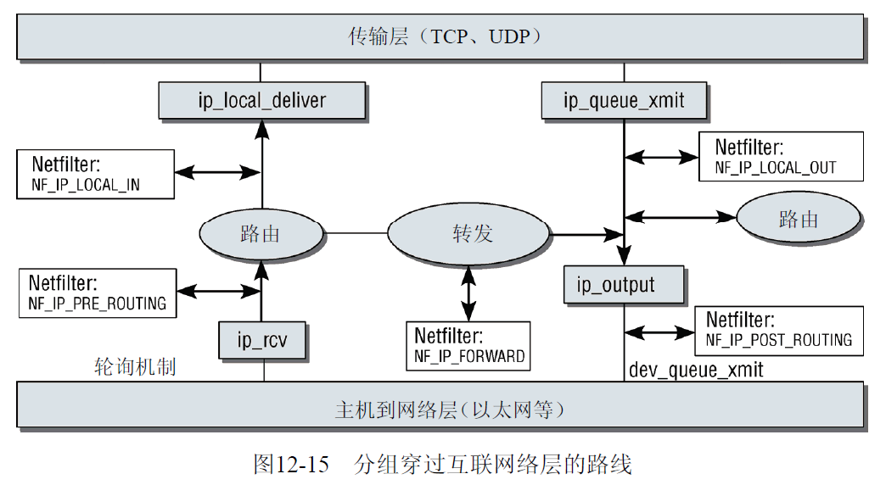

| 日期 | 内核版本 | 架构| 作者 | GitHub| CSDN |
| ------- |:-------:|:-------:|:-------:|:-------:|:-------:|
| 2016-06-14 | [Linux-4.7](http://lxr.free-electrons.com/source/?v=4.7) | X86 & arm | [gatieme](http://blog.csdn.net/gatieme) | [LinuxDeviceDrivers](https://github.com/gatieme/LDD-LinuxDeviceDrivers) | [Linux内存管理](http://blog.csdn.net/gatieme/article/category/6225543) |


#1	网络层
-------


网络访问层仍然受到传输介质的性质以及相关适配器的设备驱动程序的很大影响. 网络层(具体地说是IP协议)与网络适配器的硬件性质几乎是完全分离的。为什么说是几乎?

读者稍后会看到, 该层不仅负责发送和接收数据, 还负责在彼此不直接连接的系统之间转发和路由分组. 查找最佳路由并选择适当的网络设备来发送分组，也涉及对底层地址族的处理(如特定于硬件的MAC地址), 这是该层至少要与网卡松散关联的原因. 在网络层地址和网络访问层之间的指派是由这一层完成的, 这也是
互联网络层无法与硬件完全脱离的原因.


如果不考虑底层硬件, 是无法将较大的分组分割为较小单位的(事实上, 硬件的性质是需要分割分组的首要原因). 因为每一种传输技术所支持的分组长度都有一个最大值, IP协议必须方法将较大的分组划分为较小的单位, 由接收方重新组合, 更高层协议不会注意到这一点. 划分后分组的长度取决于特定传输协议的能力.

IP在1981年正式定义(在RFC791中), 现在已经进入暮年

尽管事实上的情况与公司新闻稿的说法截然不同, 例如, 后者可能将电子表格的每个新版本都称赞为人类有史以来最伟大的发明, 但过去的20年确实在当今的技术上留下了印痕. 此前的缺陷和未能预料到的问题, 随着因特网的发展, 现在
变得越来越明显. 这也是开发IPv6标准作为目前IPv4后继者的原因. 遗憾的是, 因为缺乏核心的权威机构, 对这个未来标准的采用比较缓慢. 本章主要关注IPv4算法的实现, 但也会略看一看可用于未来的技术, 及其在Linux内核的实现.

为理解IP协议在内核中的实现, 必须简要介绍其工作方式. 很自然, 这是个非常大的领域, 我们只能略微谈谈相关的主题.


#2	IPv4
-------


IP分组使用的协议首部如下图所示.





| 字段 | 描述 |
|:-----:|:-----:|
| version（版本） |指定了所用IP协议的版本。当前，该字段的有效值为4或6。 在支持两种协议版本的主机上，所使用的版本由前一章讨论的传输协议标识符确定。对协议的两个版本来说，该标识符中保存的值是不同的 |
| IHL（IP首部长度） | 定义了首部的长度，由于选项数量可变，这个值并不总是相同的 |
| Codepoint（代码点）<br>Type of Service（服务类型） | 用于更复杂的协议选项，我们在这里无须关注 |
| Length（长度） | 指定了分组的总长度，即首部加数据的长度 |
| fragment ID（分片标识） | 标识了一个分片的IP分组的各个部分。分片方法将同一分片ID指定到同一原始分组的各个数据片，使之可标识为同一分组的成员。各个部分的相对位置由fragment offset（分片偏移量）字段定义。偏移量的单位是64 bit |


第三个标志位"保留供未来使用", 但考虑到IPv6的存在, 这是不太可能的.


| 字段 | 描述 |
|:-----:|:-----:|
| TTL意为"Time to Live" | 指定了从发送者到接收者的传输路径上中间站点的最大数目（或跳数） |
| Protocol | 标识了IP分组承载的高层协议（传输层）。例如，TCP和UDP协议都有对应的唯一值 |
| Checksum | 包含了一个校验和，根据首部和数据的内容计算。如果指定的校验和与接收方计算的值不一致，那么可能发生了传输错误，应该丢弃该分组 |
| src和dest | 指定了源和目标的32位IP地址 |
| options | 用于扩展IP选项 |
| data | 保存了分组数据（净荷） |


IP首部中所有的数值都以网络字节序存储(大端序).

在内核源代码中, 该首部由iphdr数据结构实现, 定义在[include/uapi/linux/ip.h?v=4.7, line 85](http://lxr.free-electrons.com/source/include/uapi/linux/ip.h?v=4.7#L85)

```cpp
struct iphdr {
#if defined(__LITTLE_ENDIAN_BITFIELD)
    __u8    ihl:4,
        version:4;
#elif defined (__BIG_ENDIAN_BITFIELD)
    __u8    version:4,
        ihl:4;
#else
#error  "Please fix <asm/byteorder.h>"
#endif
    __u8    tos;
    __be16  tot_len;
    __be16  id;
    __be16  frag_off;
    __u8    ttl;
    __u8    protocol;
    __sum16 check;
    __be32  saddr;
    __be32  daddr;
    /*The options start here. */
};
```


`ip_rcv`函数是网络层的入口点. 分组向上穿过内核的路线如下图所示





该函数定义在[`net/ipv4/ip_input.c?v=4.7, line 405`](http://lxr.free-electrons.com/source/net/ipv4/ip_input.c?v=4.7#L405)


| 函数 | 功能 | 定义 |
|:-----:|:-----:|:-----:|
| ip_rcv | 对驱动送上来的数据报文进行ip头的合法性检查, 并调用netfilter过滤器上NF_INET_PRE_ROUTING | [net/ipv4/ip_input.c?v=4.7, line 405](http://lxr.free-electrons.com/source/net/ipv4/ip_input.c?v=4.7#L405) |
| ip_local_deliver |  | [net/ipv4/ip_input.c?v=4.7, line 192](http://lxr.free-electrons.com/source/net/ipv4/ip_input.c?v=4.7#L192) |

<br>

| 函数 | 功能 | 定义 |
|:-----:|:-----:|:-----:|
| ip_queue_xmit | | [net/ipv4/ip_output.c?v=4.7, line 376](http://lxr.free-electrons.com/source/net/ipv4/ip_output.c?v=4.7#L376) |
| ip_output | | [net/ipv4/ip_output.c?v=4.7, line 346](http://lxr.free-electrons.com/source/net/ipv4/ip_output.c?v=4.7#L346) |

```cpp

```

发送和接收操作的程序流程并不总是分离的, 如果分组只通过当前计算机转发, 那么发送和接收操作是交织的. 这种分组不会传递到更高的协议层(或应用程序), 而是立即离开计算机, 发往新的目的地.


#3	接收分组
-------


在分组（以及对应的套接字缓冲区, 其中的指针已经设置了适当的值)转发到ip_rcv之后,  必须检查接收到的信息,  确保它是正确的. 主要检查计算的校验和与首部中存储的校验和是否一致.

其他的检查包括分组是否达到了IP首部的最小长度，分组的协议是否确实是IPv4（IPv6的接收例程是另一个).

在进行了这些检查之后, 内核并不立即继续对分组的处理, 而是调用一个`netfilter`挂钩, 使得用户空间可以对分组数据进行操作.

`netfilter`挂钩插入到内核源代码中定义好的各个位置, 使得分组能够被
外部动态操作. 挂钩存在于网络子系统的各个位置, 每种挂钩都有一个特别的标记, 例如NF_IP_POST_ROUTING.

在内核到达一个挂钩位置时, 将在用户空间调用对该标记支持的例程. 接下来, 在另一个内核函数中继续内核端的处理（分组可能被修改过）.

12.8.6节讨论了netfilter机制的实现。
在下一步中，接收到的分组到达一个十字路口，此时需要判断该分组的目的地是本地系统还是远
程计算机。根据对分组目的地的判断，需要将分组转发到更高层，或转到互联网络层的输出路径上（这
里不打算讨论第三种选项，即通过多播将分组发送到一组计算机）。
ip_route_input负责选择路由。这个相对复杂的决策过程在12.8.5节详细讨论。判断路由的结果
是，选择一个函数，进行进一步的分组处理。可用的函数是ip_local_deliver和ip_forward。具体
选择哪个函数，取决于分组是交付到本地计算机下一个更高协议层的例程，还是转发到网络中的另一