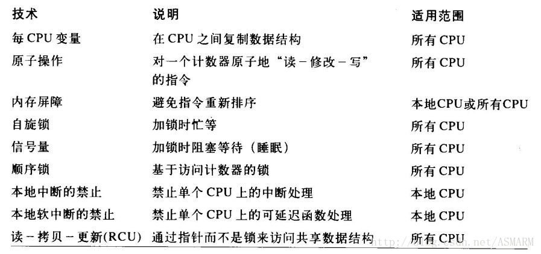

CentOS下支持挂载exFAT与NTFS文件系统
=======

| CSDN | GitHub |
|:----:|:------:|
| [You-Get--基于Python3的开源网络视频下载工具](http://blog.csdn.net/gatieme/article/details/61623891) | [`AderXCoding/system/tools/you-get`](https://github.com/gatieme/AderXCoding/tree/master/system/tools/you-get) |

<br>
<a rel="license" href="http://creativecommons.org/licenses/by-nc-sa/4.0/"></a>
本作品采用<a rel="license" href="http://creativecommons.org/licenses/by-nc-sa/4.0/">知识共享署名-非商业性使用-相同方式共享 4.0 国际许可协议</a>进行许可, 转载请注明出处, 谢谢合作
<br>


`Linux` 内核同步机制, 挺复杂的一个东西, 常用的有自旋锁, 信号量, 互斥体, 原子操作, 顺序锁, RCU, 内存屏障等. 这里就说说它们的特点和基本用法.

| 技术 | 说明 | 适用范围 |
|:---:|:---:|:--------:|
| 每CPU变量 | 在 `CPU` 之间复制数据结构 | 所有 `CPU` |
| 原子操作(atomic) | 对一个计数器原子地"读-写"的指令 | 所有 `CPU` |
| 顺序与屏障(mb) | 避免对指令重新排序 | 本地 `CPU` 或所有 `CPU` |
| 自旋锁(spinlock) | 加锁时忙等 | 所有 `CPU` |
| 信号量(semaphore) | 加锁时阻塞等待(睡眠) | 所有 `CPU` |
| 顺序锁(seqlock) | 基于访问计数器的锁 | 所有 `CPU` |
| 互斥锁(mutex) | | |
| 完成变量(completion) | | |
| 大内核(BLK) | | |
| 禁止抢占(preempt) | | |
| 读-拷贝-更新RCU(Read-Copy Update) | 通过指针而不是锁来访问共享数据结构 | 本地 `CPU` |


面对如此多的同步机制, 希望自己可以弄清这些机制的使用场合.


1.	进程可以被中断处理程序中断, 但中断处理程序不可以被进程中断.

	因为在中断 `context` 中, 唯一能打断当前中断`handler` 的只有更高优先级的中断, 它不会被进程打断.中断包括：中断处理程序(上半部), 下半部机制(softirq, tasklet).

2.	中断中不能发生休眠, 进程上下文可以休眠.

	因为如果在中断 `context`中休眠, 则没有办法唤醒它, 因为所有的 `wake_up_xxx` 都是针对某个进程而言的, 而在中断 `context` 中, 没有进程的概念, 没有一个 `task_struct` (这点对于 `softirq` 和 `tasklet`一样), 因此真的休眠了, 比如调用了会导致 `block` 的例程, 内核几乎肯定会死.

    `schedule()` 在切换进程时, 保存当前的进程上下文(CPU寄存器的值、进程的状态以及堆栈中的内容), 以便以后恢复此进程运行. 中断发生后, 内核会先保存当前被中断的进程上下文(在调用中断处理程序后恢复); 但在中断处理程序里, CPU寄存器的值肯定已经变化了吧(最重要的程序计数器PC、堆栈SP等), 如果此时因为睡眠或阻塞操作调用了schedule(), 则保存的进程上下文就不是当前的进程context了. 所以不可以在中断处理程序中调用schedule().

	中断运行在中断上下文, 没有一个所谓的中断描述符来描述它, 它不是操作系统调度的单位. 一旦在中断上下文中睡眠, 首先无法切换上下文(因为没有中断描述符, 当前上下文的状态得不到保存), 其次, 没有人来唤醒它, 因为它不是操作系统的调度单位. 此外, 中断的发生是非常非常频繁的, 在一个中断睡眠期间, 其它中断发生并睡眠了, 那很容易就造成中断栈溢出导致系统崩溃.

	休眠是一种进程的特殊状态(即 `task->state= TASK_UNINTERRUPTIBLE | TASK_INTERRUPTIBLE`), 休眠是针对进程, 也就是拥有 `task_struct` 的独立个体, 休眠就是为了更好地利用CPU. 休眠发生和结束时都会发生处理器的调度, 因此也是一种进程间的同步机制.


同步机制的结论：

1.	自旋锁适用于中断处理程序，而引发休眠的信号量(semaphore)、互斥锁(mutex)则不适合使用在中断处理程序中，他们往往使用在进程中。

2.	原子操作(atomic)是最简单的同步方法，即保证程序的顺序执行。

3.	互斥锁就是信号量为1的简化版，但在内核中常常使用互斥的特性，所以更常用。

4.	完成变量(completion)、大内核(BLK)、顺序锁(seqlock)、禁止抢占(preempt)、顺序与屏障(mb).适用场合较少，暂不描述。


http://blog.jobbole.com/91784/
http://blog.csdn.net/asmarm/article/details/36171111
http://www.cnblogs.com/cz-blog/p/4629303.html
http://blog.csdn.net/davion_zhang/article/details/48288949


#1	每CPU变量
-------


*	**原理** : 主要形式是数据结构的数组, 系统中的每个CPU对应数组的一个元素.

*	**使用情况** : 数据应在逻辑上是独立的

*	**使用原则** : 应在内核控制路径禁用抢占的情况下访问每CPU变量


#2	原子操作
-------


*	**原理** : 是借助于汇编语言指令中对 "读--修改--写" 具有原子性的汇编指令来实现.


#3	内存屏障
-------

*	**原理** : 使用内存屏障原语确保在原语之后的操作开始之前, 原语之前的操作已经完成.


#4	自旋锁
-------

主要用于多处理器环境中。

**原理** : 如果一个内核控制路径发现所请求的自旋锁已经由运行在另一个 `CPU` 上的内核控制

路径"锁着", 就反复执行一条循环指令, 直到锁被释放.

说明：自旋锁一般用于保护禁止内核抢占的临界区。

在单处理器上, 自旋锁的作用仅是禁止或启用内核抢占功能.


#1	自旋锁 : 通用的和读写的
-------

特点：
1. 处理的时间很短。

2. 尝试获取锁时, 不能睡眠, 但是有 `trylock` 接口可以直接退出

3. 多用在中断中

4. 任何时候只有一个保持者能够访问临界区

5. 可以被中断打断的(硬件和软件的)

6. 获取自旋锁后首先就是关闭了抢占


##1.1	自旋锁
-------

自旋锁 `spinlock` 结构体的定义在[include/linux/spinlock_types.h, version = 4.11, line 64](http://elixir.free-electrons.com/linux/latest/source/include/linux/spinlock_types.h?v=4.11#L64), 如下所示

```cpp
typedef struct spinlock {
	union {
		struct raw_spinlock rlock;

#ifdef CONFIG_DEBUG_LOCK_ALLOC
# define LOCK_PADSIZE (offsetof(struct raw_spinlock, dep_map))
		struct {
			u8 __padding[LOCK_PADSIZE];
			struct lockdep_map dep_map;
		};
#endif
	};
} spinlock_t;
```


`spin_lock` 使用接口 :

```cpp
  void spin_lock_init(spinlock_t *lock); //init 
  void spin_lock(spinlock_t *lock); // 获取锁
　void spin_unlock(spinlock_t *lock); //释放锁
  其他变体
```

参见
[Linux内核同步机制之（四）：spin lock](http://www.wowotech.net/kernel_synchronization/spinlock.html)

[自旋锁（spinlock） 解释得经典，透彻](http://blog.csdn.net/beyondioi/article/details/6919525)

##1.2	读写自旋锁
-------

读写自旋锁 `Rwlock` 基本特点和通用自旋锁一样，但是有时候多线程频繁读取临界区如果同时只能一个那么效率会很低，它的特点就是在读的时候获取读锁，可以同时有N个线程同时读，在写时需要获得写锁（不能有读和写锁）。

在读操作时，写操作必须等待；写操作时，读操作也需要的等待。这样虽然避免了数据的不一致，但是某些操作要等待，后面还会出现顺序锁，是对读写锁的优化，把写的优先级调高了

使用接口：


#5	顺序锁
-------

顺序锁与自旋锁非常相似, 仅有一点不同, 即顺序锁中的写者比读者有较高的优先级, 也就意味着即使读者正在读的时候也允许写者继续运行。


#6	RCU
-------

主要用于保护被多个 `CPU`读的数据结构。

允许多个读者和写者同时运行, 且 `RCU` 是不用锁的.

使用限制 :

1.	RCU只保护被动态分配并通过指针引用的数据结构

2.	在被RCU保护的临界区中，任何内核控制路径都不能睡眠。


*	原理 : 当写者要更新数据时, 它通过引用指针来复制整个数据结构的副本. 然后对这个副本进行修改. 修改完毕后, 写者改变指向原数据结构的指针, 使它指向被修改后的副本, (指针的修改是原子的).


#7	信号量
-------

*	**原理** : 当内核控制路径试图获取内核信号量所保护的忙资源时, 相应的进程被挂起; 只有在资源被释放时, 进程才再次变为可运行.


*	**使用限制** : 只有可以睡眠的函数才能获取内核信号量.

中断处理程序和可延迟函数都不能使用内核信号量。

#8	本地中断禁止
-------

*	**原理** : 本地中断禁止可以保证即使硬件设备产生了一个 `IRQ`信号时, 内核控制路径也会继续运行, 从而使中断处理例程访问的数据结构受到保护.

*	**不足** : 禁止本地中断并不能限制运行在另一个CPU上的中断处理程序对共享数据结构的并发访问, 故在多处理器环境中, 禁止本地中断需要与自旋锁一起使用.


#9	本地软中断的禁止
-------

*	方法 1 :

由于软中断是在硬件中断处理程序结束时开始运行的，所以最简单的方式是禁止那个CPU上的中断。

因为没有中断处理例程被激活，故软中断就没有机会运行。

*	方法 2 :

通过操纵当前 `thread_info` 描述符 `preempt_count` 字段中存放的软中断计数器, 可以在本地CPU上激活或禁止软中断. 因为内核有时只需要禁止软中断而不禁止中断.





<br>

<a rel="license" href="http://creativecommons.org/licenses/by-nc-sa/4.0/"></a>本作品采用<a rel="license" href="http://creativecommons.org/licenses/by-nc-sa/4.0/">知识共享署名-非商业性使用-相同方式共享 4.0 国际许可协议</a>进行许可, 转载请注明出处, 谢谢合作.
