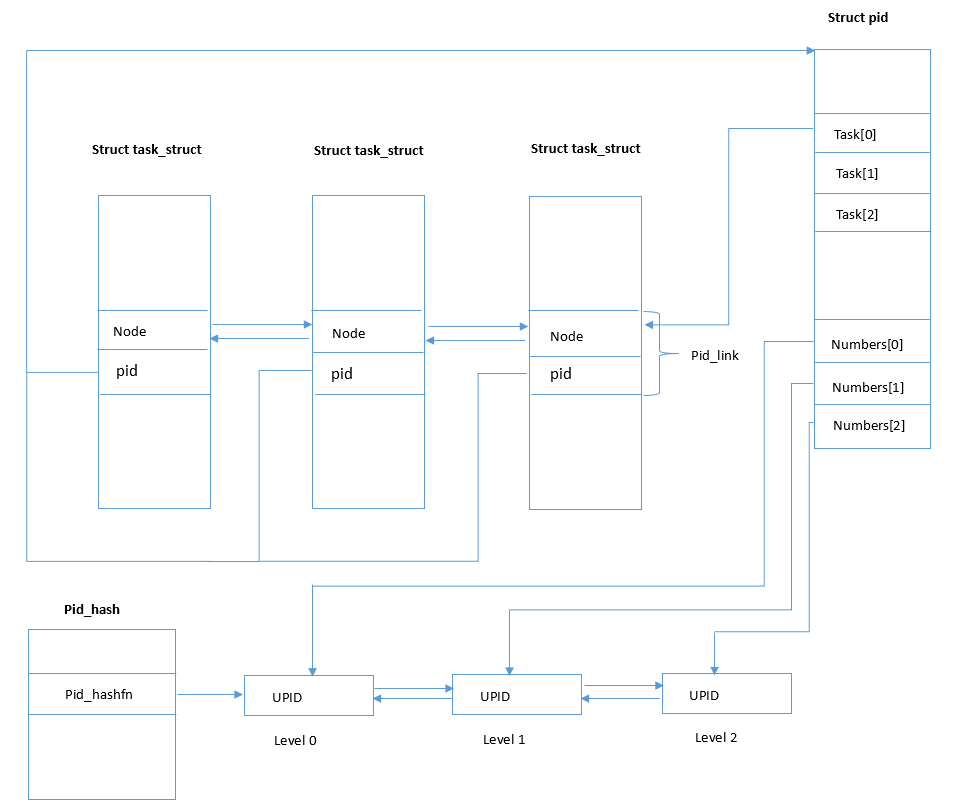
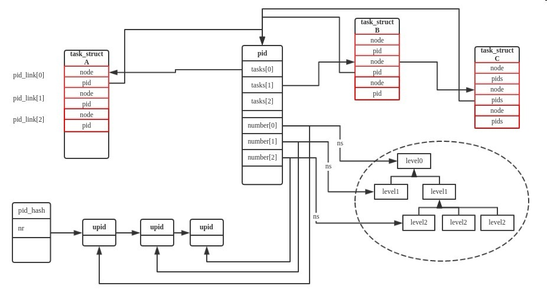

AderXCoding
=======

| CSDN | GitHub |
|:----:|:------:|
| [Aderstep--紫夜阑珊-青伶巷草](http://blog.csdn.net/gatieme) | [`AderXCoding/system/tools`](https://github.com/gatieme/AderXCoding/tree/master/system/tools) |

<br>

<a rel="license" href="http://creativecommons.org/licenses/by-nc-sa/4.0/"></a>

本作品采用<a rel="license" href="http://creativecommons.org/licenses/by-nc-sa/4.0/">知识共享署名-非商业性使用-相同方式共享 4.0 国际许可协议</a>进行许可, 转载请注明出处, 谢谢合作

因本人技术水平和知识面有限, 内容如有纰漏或者需要修正的地方, 欢迎大家指正, 也欢迎大家提供一些其他好的调试工具以供收录, 鄙人在此谢谢啦

<br>


#1    pid namespace框架和数据结构分析
-------


一个框架的设计会考虑很多因素, 相信分析过 `Linux` 内核的读者来说会发现, 内核的大量数据结构被哈希表和链表链接起来, 最最主要的目的就是在于查找. 可想而知一个好的框架, 应该要考虑到检索速度，还有考虑功能的划分. 那么在 `PID` 框架中，需要考虑以下几个因素.

*    如何通过task_struct快速找到对应的pid
*    如何通过pid快速找到对应的task_struct
*    如何快速的分配一个唯一的pid

这些都是 `PID` 框架设计的时候需要考虑的一些基本的因素. 也正是这些因素将 `PID` 框架设计的愈加复杂.
原始的PID框架
先考虑的简单一点，一个进程对应一个pid

```cpp
struct task_struct
{
    .....
    pid_t pid;
    .....
}
```

是不是很easy，回到上文，看看是否符合PID框架的设计原则，通过task_struct找到pid，很方便，但是通过pid找到task_struct怎么办呢?

好吧，基于现在的这种结构肯定是无法满足需求的，那就继续改进吧。 

>注: 以上的这种设计来自与linux 2.4内核的设计

##1.2    引入 `pid` 位图
-------

如何分配一个唯一的 `pId` 呢, 连续递增? 

那么前面分配的进程如果结束了, 那么分配的 `pid` 就需要回收掉, 直到分配到 `pid` 的最大值, 然后从头再继续. 好吧, 这或许是个办法, 但是是不是需要标记一下那些pid可用呢?

到此为此这看起来似乎是个解决方案,但是考虑到这个方案是要放进内核,开发 `linux` 的那帮家伙肯定会想近一切办法进行优化的,的确如此,他们使用了 `pid` 位图,但是基本思想没有变,同样需要标记 `pid` 是否可用,只不过使用 `pid` 位图的方式更加节约内存. 想象一下, 通过将每一位设置为 `0` 或者是 `1`, 可以用来表示是否可用,第 `1` 位的 `0` 和 `1` 用来表示pid为1是否可用,以此类推. 到此为此一个看似还不错的 `pid` 框架设计完成了,下图是使用 `pidmap` 的 `pid` 框架的整体效果.


> 从图中可以看到每个进程都用唯一的 `pid_t pid` 来标识
> 内核通过一个 `pid` 位图 `pidmap` 来分配 `pid`

```cpp
//  http://elixir.free-electrons.com/linux/latest/source/include/linux/pid_namespace.h#L14
struct pidmap {
        atomic_t nr_free;  //表示当前可用的pid个数, 这个bitmap还有多少位为0，就是说对应的pid没有被分配出去
        void *page;  //用来存放位图, 表示一段连续的内存空间，每位的0或1表示对应pid是否被分配
};
```

默认情况下 `pid` 最大是 `32768`, 那么默认正好是 `1` 页能保存下的 `pid` 使用情况, `linux` 默认一页的大小是 `4k=4*1024*8bit=32768`, 如果 `pid` 的最大值超过 `32768` 那么 `pidmap` 数组就用上了, 多个 `pidmap` 就是为了 `pid` 限制大于 `32768` 来设计的.

>[commit 95846ecf9dac pid: replace pid bitmap implementation with IDR API]() 引入了一种新的pid分配方式.
>


##1.3    引入 `PID` 类型后的 `PID` 框架
------


但是 `linux` 内核中一个进程不光光只有一个进程 `pid`, 还会有进程组 `id` ,还有会话 `id` ,(关于进程组和会话请参考([进程之间的关系](http://blog.csdn.net/zhangyifei216/article/details/49705515)), 那么引入 `pid` 类型后,框架变成了下面这个样子,


```cpp
struct task_struct
{
    ....
    pid_t pid;
    pid_t session;
    struct task_struct *group_leader;
    ....
}

struct signal
{
    ....
    pid_t __pgrp;
    ....
}
来自于 kernel 2.6.24 早期代码
```


对于进程组 `id` 来说, 信号需要知道这这个 `id`, 通过这个 `id`, 可以实现对一组进程进行控制, 所以这个 `id` 出现在了 `signal` 这个结构体中.


```cpp
//  http://elixir.free-electrons.com/linux/v4.14.12/source/include/linux/sched/signal.h#L79
struct signal
{
    ....
    struct pid *leader_pid;
    struct pid *tty_old_pgrp;
    /* boolean value for session group leader */
    int leader;
    ....
}
```

所以直到现在来说框架还不是那么复杂, 但是有一个需要明确的就是无论是 `session id` 还是 `group id` 其实都不占用 `pid` 的资源, 因为 `session id` 是和领导进程组的组 `id` 相同,而 `group id` 则是和这个进程组中的领导进程的 `pid` 相同.


##1.4   引入进程PID命名空间后的PID框架
-------

随着内核不断的添加新的内核特性, 尤其是 `PID Namespace` 机制的引入, 这导致 `PID` 存在命名空间的概念, 并且命名空间还有层级的概念存在, 高级别的可以被低级别的看到, 这就导致高级别的进程有多个 `PID` ,比如说在默认命名空间下, 创建了一个新的命名空间,占且叫做 `level1`, 默认命名空间这里称之为 `level0`, 在 `level1` 中运行了一个进程在 `level1` 中这个进程的 `pid` 为 `1`, 因为高级别的 `pid namespace` 需要被低级别的 `pid namespace` 所看见,所以这个进程在 `level0` 中会有另外一个 `pid`, 为 `xxx`. 套用上面说到的 `pid` 位图的概念, 可想而知, 对于每一个 `pid namespace` 来说都应该有一个 `pidmap`, 上文中提到的 `level1` 进程有两个 `pid` 一个是 `1` ,另一个是 `xxx`,其中 `pid` 为 `1` 是在 `level1` 中的 `pidmap` 进行分配的, `pid` 为 `xxx` 则是在 `level0` 的 `pidmap` 中分配的. 下面这幅图是整个 `pidnamespace` 的一个框架 


首先内核引入了一种通用的方法定义不同类型的 `pid`, 用 `pid_type` 描述, 分别对应进程 `pid`, 进程组 `pid` 和会话组 `pid`. 


```cpp
//  http://elixir.free-electrons.com/linux/v4.14.12/source/include/linux/pid.h#L58
enum pid_type
{
	PIDTYPE_PID,       //  当前进程的pid
	PIDTYPE_PGID,	 //  进程组组长的pid
	PIDTYPE_SID,	  //   进程会话组组长的pid
	PIDTYPE_MAX,
	/* only valid to __task_pid_nr_ns() */
	__PIDTYPE_TGID
};
```

这样要获取某个进程对应类型的 `pid` 只需要使用类似于 `pids[PIDTYPE_XXX]` 的形式即可.
其中 `__PIDTYPE_TGID` 用于获取到线程主进程的 `PID`.

引入了 `PID` 命名空间后, 一个 `pid` 就不仅仅是一个数值那么简单了,还要包含这个 `pid` 所在的命名空间, 父命名空间, 命名空间多对应的 `pidmap` , 命名空间的 `pid` 等等. 因此内核对 `pid` 做了一个封装,封装成 `struct pid` ,一个名为 `pid` 的结构体,下面是其定义:


```cpp
//  http://elixir.free-electrons.com/linux/v4.14.12/source/include/linux/pid.h#L60
struct pid
{
	atomic_t count;			//  当前pid的引用计数器
	unsigned int level;         //  这个pid所在的层级
	/* lists of tasks that use this pid */
	struct hlist_head tasks[PIDTYPE_MAX];  //  共享该pid的所有进程
	struct rcu_head rcu;
	struct upid numbers[1];  // 这个task_struct在多个命名空间的显示, 一个upid就是一个namespace的pid的表示.
};
```

这里最重要的成员变量就是 `numbers`, 它是个变长数组, 表示一个 `task_struct` 在每个 `namespace` 的 `pid`(这个 `id` 就是`getpid()`  所得到的值), `number[0]` 表示最顶层的 `namespace`level=0`, `number[1]` 表示 `level=1`, 以此类推.

一个进程在不同的命名空间`namespace` 呈现不同的 `pid`, 因此内核将每个 `namespace` 下的 `pid` 抽象为一个 `upid`, 一个进程属于几个`namespace` 就有几个 `upid`, 因此采用变长数组 `struct upid numbers[1]` 的形式表示.


```cpp
//  http://elixir.free-electrons.com/linux/v4.14.12/source/include/linux/pid.h#L53
struct upid {              //包装命名空间所抽象出来的一个结构体
    int nr;                //pid在该命名空间中的pid数值
    struct pid_namespace *ns;      //对应的命名空间
    struct hlist_node pid_chain;    //通过pidhash将一个pid对应的所有的命名空间连接起来.[已经移除]
};
```

这里 `nr` 和 `ns` 成对出现, 表示进程的在这个 `ns` 命名空间的 `pid` 为 `nr`. 管理这些 `pid` 结构, 通常把他们放置在 `hash` 表中, `pid_chain` 是 `hash`  链表结构中的一个节点, 系统会把 `UPID` 的 `nr` 和 `namespace` 的 `ns` 经过某种 `hash`, 得到在一个全局的 `Hash` 数组中的下标, 此 `UPID` 便会加入到对应下标的链表中. 所以 `pid_chain` 就是 `hash` 表和数据之间的桥梁.


>这里 `linux` 内核中广泛的使用这种 `hash` 表, `hash` 表中每个元素都是 `hlist_node`, 那么取得每个元素所代表的 `value`, 就要通过指针和结构体, 来倒推 `value` 的指针. 实现机理通过函数 `container_of`.


那么进程 `task_struct` 中如何关联 `PID` 的呢？


```cpp
//  http://elixir.free-electrons.com/linux/v4.14.12/source/include/linux/pid.h#L72
struct pid_link
{
	/* PID/PID hash table linkage. */
	struct pid_link			pids[PIDTYPE_MAX];
	struct list_head		thread_group;
	struct list_head		thread_node;
};
```

`thread_group` 和 `thread_node` 作为一个节点加入到所有引用同一 `PID` 结构的进程链表中;

`pid` 指向该进程引用的 `PID` 结构.

命名空间 `namespace` 本身又是一个树状的层次结构, 用 `pid_namespace` 来描述, 该结构中包含了当前 `namespace` 的层次关系和 `pid` 位图信息, 每次创建一个新的 `namespace`, 就会创建一个新的 `pid_namespace`. 其中作为初始化的根命名空间就是 `struct pid_namespace init_pid_ns`. 进程的 `task_struct->pid` 就是进程在根命名空间中的 `pid` 值. 即 `pid->numbers[0].nr`


```cpp
//  http://elixir.free-electrons.com/linux/v4.14.12/source/include/linux/pid_namespace.h#L31
struct pid_namespace {
    struct kref kref;
    struct pidmap pidmap[PIDMAP_ENTRIES];  //上文说到的,一个pid命名空间应该有其独立的pidmap
    int last_pid;              //上次分配的pid
    unsigned int nr_hashed; 
    struct task_struct *child_reaper;  //这个pid命名空间对应的init进程,因为如果父进程挂了需要找养父啊,这里指明了该去找谁
    struct kmem_cache *pid_cachep;
    unsigned int level;        //所在的命名空间层次
    struct pid_namespace *parent;    //父命名空间,构建命名空间的层次关系
    struct user_namespace *user_ns;
    struct work_struct proc_work;
    kgid_t pid_gid;
    int hide_pid;
    int reboot; /* group exit code if this pidns was rebooted */
    unsigned int proc_inum;
};
```


内核为了统一管理 `pid`, 进程组 `id`, 会话 `id`, 将这三类 `id`  整合后, 在 `task_struct` 中通过 `pids[PIDTYPE_MAX]` 将这三者 `pid`  关联, 因此 `task_struct` 和 `pid` 是 `1:n=3` 的关联.其结构如下:


```cpp
// http://elixir.free-electrons.com/linux/v4.15-rc7/source/include/linux/sched.h#L696
struct task_struct
{
    ....
    /* PID/PID hash table linkage. */
    struct pid_link            pids[PIDTYPE_MAX];
    struct list_head        thread_group;
    struct list_head        thread_node;
    ....
}
```


到此为止一个看起来已经比较完善的pid框架构建完成了,整个框架的效果如下:



可以看到 3个进程共享同一个 `struct pid` 结构(`Task[0, 1, 2]`), 该 `pid` 属于 `3` 个命名空间(`Leve 0, 1 2`)




其中进程 `Ａ, B,Ｃ` 是一个进程组的, `Ａ` 是组长进程, 所以 `B` 和 `C` 的 `task_struct` 结构体中的 `pid_link` 成员的 `node` 字段就被邻接到进程 `A` 对应的 `struct pid` 中的 `tasks[1]`. `struct upid` 通过 `pid_hash` 和 `pid` 数值关联了起来, 这样就可以通过pid数值快速的找到所有命名空间的upid结构，numbers是一个struct pid的最后一个成员，利用可变数组来表示这个pid结构当前有多少个命名空间．

>注: 2016/08/28 修正上图的一个错误，pid_hash的key并不是nr，应该是pid_hashfn(upid->nr, upid->ns)]唯一确定一个upid结构(具体可以参考pid_hashfn的实现)，这样就可以通过nr和ns来找到其对应的upid结构了。


##1.5	pid_namespace 总结
-------


#2	进程 `PID` 相关的 `API` 分析
-------


##2.1	获取三种类型的pid结构
-------

```cpp
//  http://elixir.free-electrons.com/linux/v4.14.12/source/include/linux/sched.h#L1118
static inline struct pid *task_pid(struct task_struct *task)
{
	return task->pids[PIDTYPE_PID].pid;
}

static inline struct pid *task_tgid(struct task_struct *task)
{
	return task->group_leader->pids[PIDTYPE_PID].pid;
}

/*
 * Without tasklist or RCU lock it is not safe to dereference
 * the result of task_pgrp/task_session even if task == current,
 * we can race with another thread doing sys_setsid/sys_setpgid.
 */
static inline struct pid *task_pgrp(struct task_struct *task)
{
	return task->group_leader->pids[PIDTYPE_PGID].pid;
}

static inline struct pid *task_session(struct task_struct *task)
{
	return task->group_leader->pids[PIDTYPE_SID].pid;
}
```

##2.2	获取pid结构中的某一个名字空间的pid数值
-------


| 函数 | 功能 | 定义 |
|:-----:|:-----:|:-----:|
| [`pid_nr()`](http://elixir.free-electrons.com/linux/v4.14.12/source/include/linux/pid.h#L167) | 进程的全局 `PID`, 在 `init_namespace` 中的 PID 值 |  `pid->numbers[0].nr` |
| [`pid_vnr()`](http://elixir.free-electrons.com/linux/v4.14.12/source/kernel/pid.c#L515) | 进程的虚拟 `PID`, 在 `current namespace` 中的 `PID` 值 | `pid_nr_ns(pid, task_active_pid_ns(current))` |
| [`pid_nr_ns()`](http://elixir.free-electrons.com/linux/v4.14.12/source/kernel/pid.c#L501) | 进程在指定的 `namespace` 中的 `PID` 值 | `pid->numbers[ns->level].nr`  |

其中进程在 `fork` 的时候, `task->pid = pid_nr()`, 即是其全局(相对于 `init_namespace`) 的 `PID` 值.


```cpp
//  http://elixir.free-electrons.com/linux/v4.14.12/source/kernel/pid.c#L501
pid_t pid_nr_ns(struct pid *pid, struct pid_namespace *ns)
{
    struct upid *upid;
    pid_t nr = 0;
    //  判断传入的pid namespace层级是否符合要求
    if (pid && ns->level <= pid->level) {
        upid = &pid->numbers[ns->level]; //  取到对应pid namespace的strut upid结构
        if (upid->ns == ns) // 判断命名空间是否一致
            nr = upid->nr; // 获取pid数值
    }
    return nr;
}
```

我们获取进程 `pid` 系统调用的 `getpid()` 和 `gettid()` 就是通过这个函数实现的, 他们的区别在于前者获取的是当前进程的 `PID` 值, 对于多线程应用而言, 对子线程执行 `getpid( )` 获取的是主线程的 `PID` 值, 即可理解为进程 `PID`, 而后者 `gettid( )` 获取的是当前进程/线程的实际 `PID` 值, 即线程 `PID`. 如果不是多线程应用或者是主线程则 `getpid()` 和 `gettid()` 获取到的 `PID` 相同. 

```cpp
//  http://elixir.free-electrons.com/linux/v4.14.12/source/kernel/sys.c#L829
/**
 * sys_getpid - return the thread group id of the current process
 *
 * Note, despite the name, this returns the tgid not the pid.  The tgid and
 * the pid are identical unless CLONE_THREAD was specified on clone() in
 * which case the tgid is the same in all threads of the same group.
 *
 * This is SMP safe as current->tgid does not change.
 */
SYSCALL_DEFINE0(getpid)
{
	return task_tgid_vnr(current);
}

/* Thread ID - the internal kernel "pid" */
SYSCALL_DEFINE0(gettid)
{
	return task_pid_vnr(current);
}
```

其中

*	gettid-=>task_pid_vnr 获取的是进程 `PIDTYPE_PID`  类型的 `PID` 值

*	getpid-=>task_tgid_vnr 获取的是进程 `__PIDTYPE_TGID` 类型的 `PID` 值

```cpp
//  http://elixir.free-electrons.com/linux/v4.14.12/source/include/linux/sched.h#L1166
static inline pid_t task_pid_vnr(struct task_struct *tsk)
{
	return __task_pid_nr_ns(tsk, PIDTYPE_PID, NULL);
}

//  http://elixir.free-electrons.com/linux/v4.14.12/source/include/linux/sched.h#L1218
static inline pid_t task_tgid_vnr(struct task_struct *tsk)
{
	return __task_pid_nr_ns(tsk, __PIDTYPE_TGID, NULL);
}
```

`__task_pid_nr_ns` 函数用于获取进程 `task` 在 `ns` 命名空间下 `type` 类型的 `PID` 值
这里 `__PIDTYPE_TGID` 获取进程组组长的 `PID` 有点hack的方法. 首先将 `task` 指向其 `group_leader`, 接着获取其 `PIDTYPE_PID` 即可获取较到一个线程主进程的 `PID`.

```cpp
//  http://elixir.free-electrons.com/linux/v4.14.12/source/kernel/pid.c#L521
pid_t __task_pid_nr_ns(struct task_struct *task, enum pid_type type,
			struct pid_namespace *ns)
{
	pid_t nr = 0;

	rcu_read_lock();
	if (!ns)
		ns = task_active_pid_ns(current);   //  获取 current 进程的当前命名空间
	if (likely(pid_alive(task))) {
		if (type != PIDTYPE_PID) {              //  如果不是获取进程本身的PID PIDTYPE_PID, 则是获取其进程组组长的PID信息
			if (type == __PIDTYPE_TGID)
				type = PIDTYPE_PID;
			task = task->group_leader;
		}
		nr = pid_nr_ns(rcu_dereference(task->pids[type].pid), ns);   //  获取进程的对应命名空间ns的 PID
	}
	rcu_read_unlock();

	return nr;
}
```


##2.3	`pid` 的分配
-------


###2.3.1  使用 `pidmap` 分配
-------

struct pid *alloc_pid(struct pid_namespace *ns) //pid分配要依赖与pid namespace,也就是说这个pid是属于哪个pid namespace
{
    struct pid *pid;
    enum pid_type type; 
    int i, nr;
    struct pid_namespace *tmp;
    struct upid *upid;
    //分配一个pid结构
    pid = kmem_cache_alloc(ns->pid_cachep, GFP_KERNEL);
    if (!pid)
        goto out;
    tmp = ns;
    pid->level = ns->level; //初始化level
    //递归到上面的层级进行pid的分配和初始化
    for (i = ns->level; i >= 0; i--) {
        nr = alloc_pidmap(tmp); //从当前pid namespace开始知道全局pid namespace,每一个层级都分配一个pid
        if (nr < 0)
            goto out_free;
        pid->numbers[i].nr = nr; //初始化upid结构
        pid->numbers[i].ns = tmp;
        tmp = tmp->parent; //递归到父亲pid namespace
    }
    if (unlikely(is_child_reaper(pid))) {  //如果是init进程需要做一些设定,为其准备proc目录
        if (pid_ns_prepare_proc(ns))
            goto out_free;
    }
    get_pid_ns(ns);
    atomic_set(&pid->count, 1);
    for (type = 0; type < PIDTYPE_MAX; ++type)  //初始化pid中的hlist结构
        INIT_HLIST_HEAD(&pid->tasks[type]);
    upid = pid->numbers + ns->level;  //定位到当前namespace的upid结构
    spin_lock_irq(&pidmap_lock);
    if (!(ns->nr_hashed & PIDNS_HASH_ADDING)) 
        goto out_unlock;
    for ( ; upid >= pid->numbers; --upid) {
        hlist_add_head_rcu(&upid->pid_chain,
                &pid_hash[pid_hashfn(upid->nr, upid->ns)]); //建立pid_hash,让pid和pid namespace关联起来
        upid->ns->nr_hashed++;
    }
    spin_unlock_irq(&pidmap_lock);
out:
    return pid;
out_unlock:
    spin_unlock_irq(&pidmap_lock);
    put_pid_ns(ns);
out_free:
    while (++i <= ns->level)
        free_pidmap(pid->numbers + i);
    kmem_cache_free(ns->pid_cachep, pid);
    pid = NULL;
    goto out;
}


##2.4	多个进程共享pid结构
-------

附录
附录A 参考链接

Linux 内核进程管理之进程ID

<br>

*	本作品/博文 ( [AderStep-紫夜阑珊-青伶巷草 Copyright ©2013-2017](http://blog.csdn.net/gatieme) ), 由 [成坚(gatieme)](http://blog.csdn.net/gatieme) 创作.

*	采用<a rel="license" href="http://creativecommons.org/licenses/by-nc-sa/4.0/"></a><a rel="license" href="http://creativecommons.org/licenses/by-nc-sa/4.0/">知识共享署名-非商业性使用-相同方式共享 4.0 国际许可协议</a>进行许可. 欢迎转载、使用、重新发布, 但务必保留文章署名[成坚gatieme](http://blog.csdn.net/gatieme) ( 包含链接: http://blog.csdn.net/gatieme ), 不得用于商业目的. 

*	基于本文修改后的作品务必以相同的许可发布. 如有任何疑问，请与我联系.
