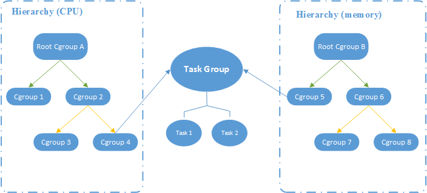

Linux的Cgroup
=======
http://www.infoq.com/cn/articles/docker-kernel-knowledge-cgroups-resource-isolation


https://my.oschina.net/cloudcoder/blog/424418?p=1

http://www.ibm.com/developerworks/cn/linux/1506_cgroup/index.html

http://www.cnblogs.com/yjf512/p/3298582.html


`CGroup`是`Control Groups`的缩写， 是`Linux`内核提供的一种可以限制、记录、隔离进程组(process groups)所使用的物力资源(如cpu memory i/o 等等)的机制. 2007年进入`Linux` 2.6.24内核, `CGroups`不是全新创造的, 它将进程管理从`cpuset`中剥离出来, 作者是`Google`的`Paul Menage.

`CGroups`也是`LXC`为实现虚拟化所使用的资源管理手段


#1	cgroup概述
-------

##1.1	为什么要有cgroup
-------

`Linux`系统中经常有个需求就是希望能限制某个或者某些进程的分配资源. 也就是能完成一组容器的概念, 在这个容器中, 有分配好的特定比例的`cpu`时间, `I/O`时间, 可用内存大小等. 于是就出现了`cgroup`的概念, `cgroup`就是`controller group`, 最初由`google`的工程师提出, 后来被整合进`Linux`内核中。

`Cgroup`是将任意进程进行分组化管理的`Linux`内核功能。`cgroup`本身提供将进程进行分组化管理的功能和接口的基础结构.

而后的`Android`操作系统也就凭借着这个技术, 为每个应用程序分配不同的`cgroup`, 将每个程序进行隔离, 达到了一个应用程序不会影响其他应用程序环境的目的.

*	cgroup是control group的简称，它为Linux内核提供了一种任务聚集和划分的机制，通过一组参数集合将一些任务组织成一个或多个子系统

*	Cgroups最初由Google工程师提出，后来编进linux内核。

*	Cgroups是实现IaaS虚拟化(kvm、lxc等)，PaaS容器沙箱(Docker等)的资源管理控制部分的底层基础


##1.2	CGroup 支持的文件种类
-------

| 文件名 | R/W | 用途 |
|:-----:|:---:|:----:|
| Release_agent | RW | 删除分组时执行的命令，这个文件只存在于根分组 |
| Notify_on_release | RW | 设置是否执行 release_agent。为 1 时执行 |
| Tasks | RW | 属于分组的线程 TID 列表 |
| Cgroup.procs | R | 属于分组的进程 PID 列表。仅包括多线程进程的线程 leader 的 TID，这点与 tasks 不同 |
| Cgroup.event_control | RW | 监视状态变化和分组删除事件的配置文件 |


##1.2	CGroup功能及组成
-------

`CGroup`是将任意进程进行分组化管理的`Linux`内核功能.

`CGroup`本身是提供将进程进行分组化管理的功能和接口的基础结构, `I/O`或内存的分配控制等具体的资源管理功能是通过这个功能来实现的. 这些具体的资源管理功能称为`CGroup`子系统或控制器.

`CGroup`子系统有控制内存的`Memory`控制器、控制进程调度的 `CPU`控制器等. 运行中的内核可以使用的`Cgroup`子系统由`/proc/cgroup`来确认.

`CGroup`提供了一个`CGroup`虚拟文件系统, 作为进行分组管理和各子系统设置的用户接口. 要使用`CGroup`, 必须挂载`CGroup`文件系统. 这时通过挂载选项指定使用哪个子系统.


*	task, 一个进程

*	control group控制族群，按照某种标准划分的进程组

*	hierarchy层级, control group可以形成树形的结构，有父节点，子节点，每个节点都是一个control group，子节点继承父节点的特定属性

*	subsystem子系统, 子系统就是资源控制器，每种子系统就是一个资源的分配器，比如`cpu`子系统是控制`cpu`时间分配的.


| 概念 | 名称 | 描述 |
|:---:|:---:|:----:|
| 任务 | task | 在 cgroups中, 任务就是系统的一个进程 |
| 控制族群 | control group | 控制族群就是一组按照某种标准划分的进程. Cgroups 中的资源控制都是以控制族群为单位实现。一个进程可以加入到某个控制族群，也从一个进程组迁移到另一个控制族群。一个进程组的进程可以使用 cgroups 以控制族群为单位分配的资源，同时受到 cgroups 以控制族群为单位设定的限制； |
| 层级 | hierarchy | 控制族群可以组织成hierarchical 的形式，既一颗控制族群树。控制族群树上的子节点控制族群是父节点控制族群的孩子，继承父控制族群的特定的属性；
| 子系统 | subsystem | 一个子系统就是一个资源控制器，比如 cpu 子系统就是控制 cpu 时间分配的一个控制器。子系统必须附加（attach）到一个层级上才能起作用，一个子系统附加到某个层级以后，这个层级上的所有控制族群都受到这个子系统的控制 |


##1.3	cgroup子系统介绍
-------


子系统`subsystem`是根据`cgroup`对任务的划分功能将任务按照一种指定的属性划分成的一个组, 主要用来实现资源的控制.

在`cgroup`中, 划分成的任务组以层次结构的形式组织, 多个子系统形成一个数据结构中类似多根树的结构.

`cgroup`包含了多个孤立的子系统, 每一个子系统代表单一的资源, 目前, `redhat`默认支持10个子系统, 但默认只挂载了8个子系统, `ubuntu 12.04`默认支持8个子系统，但默认只挂载了5个子系统, 当然也用户可以自定义子系统并进行挂载.

下面对每一个子系统进行简单的介绍：


| 子系统 | 描述 |
|:-----:|:---:|
| blkio | 设置限制每个块设备的输入输出控制。例如:磁盘，光盘以及usb等等 |
| cpu | 使用调度程序为cgroup任务提供cpu的访问 |
| cpuacct | 产生cgroup任务的cpu资源报告 |
| cpuset | 如果是多核心的cpu，这个子系统会为cgroup任务分配单独的cpu和内存 |
| devices | 允许或拒绝cgroup任务对设备的访问 |
| freezer | 暂停和恢复cgroup任务 |
| memory | 设置每个cgroup的内存限制以及产生内存资源报告 |
| net_cls | 标记每个网络包以供cgroup方便使用 |
| ns | 名称空间子系统 |
| perf_event | 增加了对每group的监测跟踪的能力，即可以监测属于某个特定的group的所有线程以及运行在特定CPU上的线程，此功能对于监测整个group非常有用，具体参见 http://lwn.net/Articles/421574/ |


可以使用`lssubsys --all`来列出系统支持多少种子系统, `Ubuntu`系统中页可以使用`ls /sys/fs/cgroup/`来显示已经挂载的子系统

*	`lssubsys --all`来列出系统支持多少种子系统


*	`Ubuntu`中可以使用`ls /sys/fs/cgroup/`来显示已经挂载的子系统, CentOS中位于`/cgroup/`中


可以看到这里的几个子系统, 比如`cpu`是控制`cpu`时间片的, `memory`是控制内存使用的


##1.4	相互关系
-------


1.	每次在系统中创建新层级时, 该系统中的所有任务都是那个层级的默认`cgroup`(我们称之为`root cgroup`, 此`cgroup`在创建层级时自动创建，后面在该层级中创建的 `cgroup`都是此`cgroup`的后代)的初始成员;

2.	一个子系统最多只能附加到一个层级；

3.	一个层级可以附加多个子系统；

4.	一个任务可以是多个`cgroup`的成员，但是这些 `cgroup`必须在不同的层级；

5.	系统中的进程(任务)创建子进程(任务)时, 该子任务自动成为其父进程所在`cgroup`的成员。然后可根据需要将该子任务移动到不同的`cgroup`中，但开始时它总是继承其父任务的`cgroup`





##1.5	CGroup应用架构
-------


CGroup 技术可以被用来在操作系统底层限制物理资源，起到 Container 的作用。图中每一个 JVM 进程对应一个 Container Cgroup 层级，通过 CGroup 提供的各类子系统，可以对每一个 JVM 进程对应的线程级别进行物理限制，这些限制包括 CPU、内存等等许多种类的资源。下一部分会具体对应用程序进行 CPU 资源隔离进行演示。


#2	安装和使用cgroup
-------

#2.1	如何安装cgroup
-------

Ubuntu中安装`cgroup`, 对应的包为`cgroup-bin`


```cpp
sudo apt-get install cgroup-bin
```


CentOS中对应的包是`libcgroup`

```cpp
yum install libcgroup    #  安装libcgroup
service cgconfig start   #  开启cgroups服务
chkconfig cgconfig on    #  开机启动
```

如何为`cgroup`分配限制的资源

首先明白下, 是先挂载子系统, 然后才有`control group`的. 意思就是比如想限制某些进程的资源, 那么, 我会先挂载`memory`子系统, 然后在`memory`子系统中创建一个cgroup节点, 在这个节点中, 将需要控制的进程`id`写入, 并且将控制的属性写入.


##2.2	使用cgroup分配资源
-------

拿`memory`子系统为例：

通过查看`cgroup的`配置文件：

```cpp
cat /etc/cgconfig.conf
```

Image(7)

看到memory子系统是挂载在目录`/sys/fs/cgroup/memory`下

进入这个目录

创建一个文件夹，就创建了一个`control group`了

`mkdir test`

发现test目录下自动创建了许多文件：

Image(8)

这些文件的含义如下：

Image(9)

于是，限制内存使用我们就可以设置memory.limit_in_bytes

Image(10)

将一个进程加入到这个test中

echo $$ > tasks

这样就将当前这个终端进程加入到了内存限制的cgroup中了。

将这个cgroup删除只要删除目录就行了

rmdir test

参考文章

http://www.cnblogs.com/lisperl/archive/2012/04/17/2453838.html

http://www.cnblogs.com/lisperl/archive/2012/04/15/2450183.html

http://www.cnblogs.com/lisperl/archive/2012/04/18/2455027.html

http://blog.chinaunix.net/uid-20940095-id-3294134.html

Creative Commons License
专注Web开发50年。请加群：Thinking in Web
本文基于署名-非商业性使用 3.0许可协议发布，欢迎转载，演绎，但是必须保留本文的署名叶剑峰（包含链接http://www.cnblogs.com/yjf512/），且不得用于商业目的。如您有任何疑问或者授权方面的协商，请与我联系。