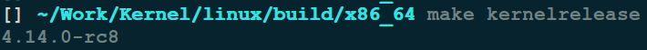
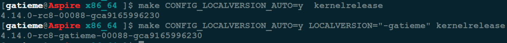
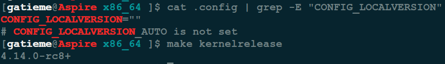
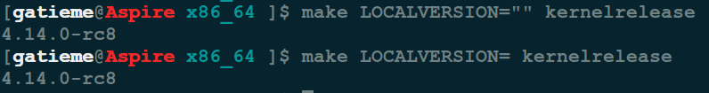

Linux 内核编译 LOCALVERSION 配置(分析内核版本号自动添加的"+"号)
=======

| CSDN | GitHub |
|:----:|:------:|
| [Linux 内核编译 LOCALVERSION 配置(分析内核版本号自动添加的"+"号)](http://blog.csdn.net/gatieme/78510497) | [`AderXCoding/system/tools`](https://github.com/gatieme/LDD-LinuxDeviceDrivers/tree/master/study/problem/build/local_version) |

<br>

<a rel="license" href="http://creativecommons.org/licenses/by-nc-sa/4.0/"></a>

本作品采用<a rel="license" href="http://creativecommons.org/licenses/by-nc-sa/4.0/">知识共享署名-非商业性使用-相同方式共享 4.0 国际许可协议</a>进行许可, 转载请注明出处, 谢谢合作

因本人技术水平和知识面有限, 内容如有纰漏或者需要修正的地方, 欢迎大家指正, 也欢迎大家提供一些其他好的调试工具以供收录, 鄙人在此谢谢啦

<br>

#1	问题发现
-------


编译主线 `kernel` 版本的时候发现, 的内核版本编译成功后生成的版本号变成了 `"x.y.z+"`, 为什么后面会多一个加号呢?

刚开始考虑是不是 `CONFIG_LOCALVERSION` 的问题, 配置了 `CONFIG_LOCALVERSION`, 还是会在内核版本的最后加上一个 `"+"` 后, 安装完成之后, 每次 `uname -a` 都会出现 `+` 后真的感觉很郁闷, 强迫症的我真的受不了.


#2	原因分析
-------

问题必然出现在 `linux` 构建过程中的版本控制这一块, 既然是在构建的过程中添加的, 那我们就可以从 `Makefile` 中发现一些端倪.


##2.1	`Makefile` 中 `LOCALVERSION` 信息
-------

```cpp
VERSION = 2
PATCHLEVEL = 6
SUBLEVEL = 35
EXTRAVERSION = .7
NAME = Yokohama
```

这些是我们内核版本的版本号, 生成出来的版本号理论上不应带 `+` 号, 但为什么带 `+` 号呢.


内核中有两个配置宏 `CONFIG_LOCALVERSION` 和 `CONFIG_LOCALVERSION_AUTO` 配置了系统内核版本号和后缀的信息.


#2.2	`Makefile` 中读取和设置版本号
-------


我们检索与这两个宏相关的信息, 检查 `LOCALVERSION` 宏排除 `arch/*/configs` 和 `Documentation` 等目录.

```cpp
grep -r LOCALVERSION * grep --exclude-dir={arch,Documentation,Kconfig}
```


可以看到 `scripts/setlocalversion` 脚本中读取了相关的信息.

不着急, 我们慢慢分析, 看看 `Makefile` 是怎么读取和设置这些信息. 继续从 `Makefile` 中分析 `LOVALVERSION` 的信息.

```cpp
define filechk_kernel.release
	echo "$(KERNELVERSION)$$($(CONFIG_SHELL) $(srctree)/scripts/setlocalversion $(srctree))"
endef

# Store (new) KERNELRELEASE string in include/config/kernel.release
include/config/kernel.release: include/config/auto.conf FORCE
	$(call filechk,kernel.release)
```


`Makefile` 使用 `scripts/setlocalversion` 工具来生成 `include/config/kernel.release`. "+" 号就是在调用这个脚本时添加的.

那么可以**通过执行如下命令生成版本文件**

```cpp
make include/config/kernel.release
OR
make include/generated/utsrelease.h
```

查看这两个文件的信息就可以看到版本号信息


另外 `Makefile` 还有如下定义 :
```cpp
kernelrelease:
         @echo "$(KERNELVERSION)$$($(CONFIG_SHELL) $(srctree)/scripts/setlocalversion $(srctree))"
```


也可以直接**使用如下命令来显示版本号信息**

```cpp
make kernelrelease
```




##2.3	`setlocalversion` 函数设置版本号信息
-------

阅读 `scripts/setlocalversion` 文件, 并查阅资料, 做如下笔记 :


```cpp
# 如果当前内核使用SVN托管, 则只从.scmversion中读取版本号信息
if $scm_only; then
	if test ! -e .scmversion; then
		res=$(scm_version)
		echo "$res" >.scmversion
	fi
	exit
fi

# 确认 auto.conf 文件是否存在
if test -e include/config/auto.conf; then
	. include/config/auto.conf
else
	echo "Error: kernelrelease not valid - run 'make prepare' to update it" >&2
	exit 1
fi

# 调用 localversion 从源码根目录下的localversion文件中读取信息
# localversion* files in the build and source directory
res="$(collect_files localversion*)"
if test ! "$srctree" -ef .; then
	res="$res$(collect_files "$srctree"/localversion*)"
fi

# 设置 LOCALVERSION 信息
# CONFIG_LOCALVERSION and LOCALVERSION (if set)
res="${res}${CONFIG_LOCALVERSION}${LOCALVERSION}"

# 调用 scm_version 函数读取后缀信息
# scm version string if not at a tagged commit
if test "$CONFIG_LOCALVERSION_AUTO" = "y"; then
	# full scm version string
	res="$res$(scm_version)"
else
	# append a plus sign if the repository is not in a clean
	# annotated or signed tagged state (as git describe only
	# looks at signed or annotated tags - git tag -a/-s) and
	# LOCALVERSION= is not specified
	if test "${LOCALVERSION+set}" != "set"; then
		scm=$(scm_version --short)
		res="$res${scm:++}"
	fi
fi
```


###2.3.1	LOCALVERSION 的设置
-------


在 `scripts/setlocalversion` 文件中还有有这么一段 :

```cpp
# CONFIG_LOCALVERSION and LOCALVERSION (if set)
res="${res}${CONFIG_LOCALVERSION}${LOCALVERSION}"
```

可以发现如果配置了 `CONFIG_LOCALVERSION` 和 `LOCALVERSION` 则会在版本号后面意思添加此后缀.

而 `res` 就是获取到的本地版本号信息, 比如 `4.14-rc8`


###2.3.2	SCM_VERSION 后缀信息的添加
-------

最后根据是否配置了 `CONFIG_LOCALVERSION_AUTO` 和 `CONFIG_LOCALVERSION` 宏, 添加版本后缀信息

如果定义了

```cpp
CONFIG_LOCALVERSION_AUTO=y
```

此时会执行执行

```cpp
res="$res$(scm_version)"
```

其中 `res` 就是我们的版本号信息, 而 `scm_version` 函数获取了版本号后缀.

否则如果没有设置 `CONFIG_LOCALVERSION_AUTO`, 则执行如下片段.

```cpp
# 调用 scm_version 函数读取后缀信息
# scm version string if not at a tagged commit
if test "$CONFIG_LOCALVERSION_AUTO" = "y"; then
	# full scm version string
	res="$res$(scm_version)"
else
	# append a plus sign if the repository is not in a clean
	# annotated or signed tagged state (as git describe only
	# looks at signed or annotated tags - git tag -a/-s) and
	# LOCALVERSION= is not specified
	if test "${LOCALVERSION+set}" != "set"; then
		scm=$(scm_version --short)
		res="$res${scm:++}"
	fi
fi
```

对于 `setlocalversion` 中的一个语法解释一下 :

| 语法 | 描述 |
|:---:|:----:|
| `${var:-value1}` | 在变量 `var` 不为空时, 保持 `var` 原有的值不变; 如果 `var` 变量未设置或者为空, 这表达式结果为 `value1`, 但是变量 `var` 的值并不改变(未设置或为空) |
| `${var:+value1}` | 在变量 `var` 不为空时, 表达式结果为 `value1`; 如果 `var` 变量未设置或者为空, 这表达式结果为空. `${var+value1}` 的效果一样 |
| `${var:=value1}` | 在变量 `var` 不为空时, 保持 `var` 原有的值不变; 如果 `var` 变量未设置或者为空, 这表达式结果为`value1`, 变量 `var` 也被赋值为 `value1` |
| `${var:?value1}` | 在变量 `var` 未设置或为空时, 脚本会退出并抛出一个错误信息(包含`value1`) |


那么上面的 `shell` 语句

1.	如果 `CONFIG_LOCALVERSION_AUTO = y` 这段程序会通过 `scm_version` 函数(不加参数)配置本地版本号.

2.	如果 `CONFIG_LOCALVERSION_AUTO` 未被设置, 而 `LOVALVERSION` 为空, 则 `"${LOCALVERSION+set}" != "set"`, 那么调用 `scm_version --short` 会在最后添加一个 `+` 号.


原来如此, 加号是这样加上去的. 那么加号具体怎么添加上去的, 然后, `scm_version` 具体做了什么工作, 这些配置宏是如何影响版本号和后缀信息的, 那只有研究 `scm_version` 函数了.


###2.3.3	版本后缀信息获取
-------


```cpp
scm_version()
{
	local short
	short=false

	cd "$srctree"

	#  如果存在 .scmversion 文件则直接获取该文件的后缀信息
	if test -e .scmversion; then
		cat .scmversion
		return
	fi

    # --short 参数的设置
	if test "$1" = "--short"; then
		short=true
	fi

	# Check for git and a git repo.
    # 读取 git 仓库的版本信息
    # 如果 --short 被设置则直接打印 + 号
    # 否则git读取版本号信息,
    #    如果git tag号存在git describe | awk -F- '{printf("-%05d-%s", $(NF-1),$(NF))}'
	#    否则直接打印commit号信息
	if test -z "$(git rev-parse --show-cdup 2>/dev/null)" &&
	   head=`git rev-parse --verify --short HEAD 2>/dev/null`; then

		# If we are at a tagged commit (like "v2.6.30-rc6"), we ignore
		# it, because this version is defined in the top level Makefile.
		if [ -z "`git describe --exact-match 2>/dev/null`" ]; then

			# If only the short version is requested, don't bother
			# running further git commands
			if $short; then
				echo "+"
				return
			fi
			# If we are past a tagged commit (like
			# "v2.6.30-rc5-302-g72357d5"), we pretty print it.
			if atag="`git describe 2>/dev/null`"; then
				echo "$atag" | awk -F- '{printf("-%05d-%s", $(NF-1),$(NF))}'

			# If we don't have a tag at all we print -g{commitish}.
			else
				printf '%s%s' -g $head
			fi
		fi

		# Is this git on svn?
		if git config --get svn-remote.svn.url >/dev/null; then
			printf -- '-svn%s' "`git svn find-rev $head`"
		fi

		# Check for uncommitted changes
        # 如果有未提交的文件则会添加-dirty后缀
		if git diff-index --name-only HEAD | grep -qv "^scripts/package"; then
			printf '%s' -dirty
		fi

		# All done with git
		return
	fi

	# Check for mercurial and a mercurial repo.
	if test -d .hg && hgid=`hg id 2>/dev/null`; then
		# Do we have an tagged version?  If so, latesttagdistance == 1
		if [ "`hg log -r . --template '{latesttagdistance}'`" == "1" ]; then
			id=`hg log -r . --template '{latesttag}'`
			printf '%s%s' -hg "$id"
		else
			tag=`printf '%s' "$hgid" | cut -d' ' -f2`
			if [ -z "$tag" -o "$tag" = tip ]; then
				id=`printf '%s' "$hgid" | sed 's/[+ ].*//'`
				printf '%s%s' -hg "$id"
			fi
		fi

		# Are there uncommitted changes?
		# These are represented by + after the changeset id.
		case "$hgid" in
			*+|*+\ *) printf '%s' -dirty ;;
		esac

		# All done with mercurial
		return
	fi

	# Check for svn and a svn repo.
    # 获取 svn 仓库的版本号后缀信息
	if rev=`LANG= LC_ALL= LC_MESSAGES=C svn info 2>/dev/null | grep '^Last Changed Rev'`; then
		rev=`echo $rev | awk '{print $NF}'`
		printf -- '-svn%s' "$rev"

		# All done with svn
		return
	fi
}
```


用 `bash` 判断语句来判断

```cpp
git rev-parse --verify --short
```

来判断当前是否是 `git` 版本库管理, 接着输出一个短的版本库`HEAD revision` 的短编码.

```cpp
git rev-parse --verify --short HEAD 2>/dev/null
```

关键在下面这条语句的执行结果

```cpp
git describe --exact-match
```

这一句是描述出当前的 `tag` 标识. 如果没有 `tag` 就为空, 那么整个 `if` 语句就为真, 就会执行下去, 下面的 `echo "+"`, 这就会在版本号中输出一个 `+` 号.

如果我们在版本库中

```cpp
git tag -a -m "v0.1" v0.1
```

后, 我们在执行 `git describe --exact-match` 这一句, 发现输出的是我们的 `tag` 标识. 那 `if` 语句就不成里了, 就不会 `echo "+"` 了.

继续看上面的代码, 如果有未提交的代码, `printf -dirty` 的地方进行了 `git diff` 的检查, 也就是说我有修改过的, 没有上传的文件. 到此基本上原因全部查明, 我把文件进行上传后, 重新 `make prepare` 后, 生成的 `kernel.release` 果然正确.

结论, `linux` 对版本的管理相当严格，这也就让我们在进行代码管理中必须严格要求自己，比如发版本前，先检查是否还有修改为上传的文件，然后要在git版本库中打一个tag。


如果代码属于 `git` 管理

*	打了 `tag`， 则会添加tag相关字符

    *	如果 `tag` 只是简单的标记, 比如 `4.14-rc8` 则跳过, 因为这些信息已经从前面 `makefile` 中获取到了

    *	如果 `tag` 还有其他后缀标记, 比如 `v2.6.30-rc5-302-g72357d5`, 则将这些打印出来

*	没有打 `tag`, 则会添加 `log` 字符
	例如最新的 `commit` 是
	```cpp
    commit cdebe039ded3e7fcd00c6e5603a878b14d7e564e
	```
    则编译之后文件 `include/config/kernel.release` 的内容为 `4.14.0-rc8-gcdebe03`

按照从之前传递的参数过来

*	如果没有定义了 `CONFIG_LOCALVERSION_AUTO` 和 `LOCALVERSION`, scm_version 函数会传递过去 `--short` 参数版本号后面会添加 `"+"` 号.

   ```cpp
   if $short; then
    echo "+"
    return
   fi
   ```


#2.4	总结
-------


##2.4.1	版本号的设置
-------

脚本 `script/setlocalversion` 中读取了版本号的信息


```cpp
# localversion* files in the build and source directory
res="$(collect_files localversion*)"
if test ! "$srctree" -ef .; then
	res="$res$(collect_files "$srctree"/localversion*)"
fi

# CONFIG_LOCALVERSION and LOCALVERSION (if set)
res="${res}${CONFIG_LOCALVERSION}${LOCALVERSION}"
```

由此可看出, 如果想往版本号里添加字符, 有几种方式 :

*	使用 `LOCALVERSION` 变量(或者在命令行, 或者添加为环境变量)

*	在内核源代码根目录下添加文件 `localversion` 文件内容会自动添加到版本号里去. 在本地创建 文件中添加

*	定义 `CONFIG_LOCALVERSION` 变量

*	往版本号里添加字符的方式


`LOCALVERSION` 变量可在命令行定义 :

```CPP
make LOCALVERSION=.44 include/config/kernel.release
```

或者添加为环境变量

```cpp
export LOCALVERSION=.44
make include/config/kernel.release
```


当前内核版本为 `4.14.0-rc8`, 如果源码根目录下有文件 `localversion`(其内容为 `.33`), 也使用了 `LOCALVERSION`变量(`make` 时指定), 也定义了`CONFIG_LOCALVERSION=".XYZ"`.

```cpp
make LOCALVERSION=.44 include/config/kernel.release
```

此时对 `4.14-rc8` 的内核, `include/config/kernel.release` 的内容为 `4.14-rc8.33.XYZ.55`.


可看到添加的三种字符的顺序

文件 `localversion` 内容在前, 然后是 `CONFIG_LOCALVERSION` 的值, 最后是 `LOCALVERSION` 的值

即

| 版本号 | 标识 | 内容 |
|:-----:|:----:|:---:|
| 主版本号 | VERSION | 4 |
| 发布版本 | PATCHLEVEL | 14 |
| 次版本号 | SUBLEVEL | 0
| 扩展版本号 | EXTRAVERSION | -rc8 |
| 文件 | localversion | 33|
| 配置宏 | CONFIG_LOCALVERSION | XYZ |
| 本地宏 | LOCALVERSION | 55 |

###2.4.2	后缀信息的获取
-------


1.	如果 `CONFIG_LOCALVERSION_AUTO = y` 这段程序会通过 `scm_version` 函数(不加参数)配置本地版本号后缀信息. 后缀信息一般都是托管仓库的版本号, 比如 `git tag/commit` 等

2.	如果 `CONFIG_LOCALVERSION_AUTO` 未被设置, 而 `LOVALVERSION` 为空, 则 `"${LOCALVERSION+set}" != "set"`, 那么调用 `scm_version --short` 会在最后添加一个 `+` 号.


>另外, 关于 `scripts/setlocalversion` 文件.
>
>在 `scripts/setlocalversion文件中，可用echo "aaa" >&2来输出显示相关信息，例如：
>echo "LOCALVERSION=${LOCALVERSION}" >&2


>需要仔细注意
>
>使用 `modinfo` 可查看编译出来的 `ko` 文件对应的内核版本号
使用 `uname` 或者 `cat /proc/version` 可在目标系统上查看内核版本号.
>
>可查看 `kernel` 编译过程生成的文件 `include/config/kernel.release` 或者 `include/generated/utsrelease.h`, 确定编译出来的内核的版本号.


###2.4.3	验证
-------

*	`LOCALVERSION` 可以在版本号之后追加后缀信息, 如果再定义  `CONFIG_LOCALVERSION_AUTO`, 将在最后进一步追加 `git` 版本号为后缀信息

| 宏 | 定义 |
|:--:|:---:|
| CONFIG_LOCALVERSION | "" |
| CONFIG_LOCALVERSION_AUTO | y |
| LOCALVERSION | not set or set |




*	不定义`CONFIG_LOCALVERSION_AUTO` 将不显示 `git` 仓库信息, 如果此时 `LOCALVERSION` 变量定义也未定义, 将追加 "+".

| 宏 | 定义 |
|:--:|:---:|
| CONFIG_LOCALVERSION | "" |
| CONFIG_LOCALVERSION_AUTO | not set |
| LOCALVERSION | not set |


此时 scm_version --short 添加了一个 "+" 号


```cpp
cat .config | grep -E "CONFIG_LOCALVERSION"
make kernelrelease
```




*	只要定义了 LOCALVERSION 即使定义为 `NULL`, 也不会追加 "+"


| 宏 | 定义 |
|:--:|:---:|
| CONFIG_LOCALVERSION | "" |
| CONFIG_LOCALVERSION_AUTO | not set |
| LOCALVERSION | 设置为空 |


```cpp
make LOCALVERSION= kernelrelease

make LOCALVERSION="" kernelrelease

```

此时将不会添加 "+" 号




#3	解决
-------

*	`LOCALVERSION` 可以在版本号之后追加后缀信息, 如果再定义  `CONFIG_LOCALVERSION_AUTO`, 将在最后进一步追加 `git` 版本号为后缀信息.

*	不定义`CONFIG_LOCALVERSION_AUTO` 将不显示 `git` 仓库信息, 如果此时 `LOCALVERSION` 变量定义也未定义, 将追加 "+".

*	如果既不想添加后缀, 又不想有 `"+"` 号 : 不定义`CONFIG_LOCALVERSION_AUTO`, 将 `LOCALVERSION` 变量定义为空 : `LOCALVERSION=`.

*	只要定义了 `LOCALVERSION`, 则就不会追加 "+" 号了


#4	参考资料
-------

[向 `linux` 内核版本号添加字符/为何有时会自动添加 `+` 号](http://blog.csdn.net/xiaofeng_yan/article/details/48376353)


[向linux内核版本号添加字符/为何有时会自动添加"+"号或者"xxx-dirty"](http://blog.csdn.net/davion_zhang/article/details/53781269)

[向linux内核版本号添加字符/为何有时会自动添加“+”号](http://blog.csdn.net/adaptiver/article/details/7225980)

[去掉linux内核版本号自动添加的“+”号](http://blog.csdn.net/l461269717/article/details/44080463)

[LINUX KERNEL编译生成的版本多一个加号"+"](http://smilejay.com/2012/07/kernel-version-plus-sign/)

<br>

*	本作品/博文 ( [AderStep-紫夜阑珊-青伶巷草 Copyright ©2013-2017](http://blog.csdn.net/gatieme) ), 由 [成坚(gatieme)](http://blog.csdn.net/gatieme) 创作, 

*	采用<a rel="license" href="http://creativecommons.org/licenses/by-nc-sa/4.0/"></a><a rel="license" href="http://creativecommons.org/licenses/by-nc-sa/4.0/">知识共享署名-非商业性使用-相同方式共享 4.0 国际许可协议</a>进行许可. 欢迎转载、使用、重新发布, 但务必保留文章署名[成坚gatieme](http://blog.csdn.net/gatieme) ( 包含链接: http://blog.csdn.net/gatieme ), 不得用于商业目的.

*	基于本文修改后的作品务必以相同的许可发布. 如有任何疑问，请与我联系.